## 第一章 概论

电子技术包括信息电子技术和电力电子技术两大分支，模电数电属于前者(本质是要传输信息，功率不大)。电力电子强调开关瞬间电路的状态，相当于将两电路拼在一起。电力电子装置由控制电路，检测电路，驱动保护电路，主电路四个部分组成。整个框架为四大电路+两大技术+三大层次。四大电路为 AC-DC(整流)，AC-AC(变频/变相，交流电力控制)，DC-AC(逆变)，DC-DC(斩波)。两大技术为 PWM 技术(控制四大电路的输出)和软开关技术(提高转换效率)。三大层次为器件、拓扑、控制。

将四种基本变流电路进行组合，有间接交流变流电路(先整流后逆变)和间接直流变流电路(先逆变后整流)。组合电路设计思路为确定硬件结构(源和负载的电器形式(交流 or 直流)、源与负载间的电路类型)，确定具体拓扑结构(注意能量流动方向要求)，设计控制方法(注意控制目标是电压 or 电流)，算法实现与调度。能选择时尽量共直流连接而不要共交流连接，因为直流只有幅值一个量可控，控制简单；另外，需要控制什么就对什么采样并进行闭环。

电容就是电压源，电感就是电流源；因为电容电压不突变，电感电流不突变，开关瞬间对应量不变，满足电压源和电流源定义，就是一个瞬间的电源。电流源之间不能串联，电压源之间不能并联。输出阻抗越小，就越接近理想的电压源(理想电压源内阻为零)，加到器件上的电压就越接近电源电压。

电力电子器件工作在开关状态，使用时需要设计相应的驱动电路和缓冲和保护电路，另外需要注意散热。电力电子器件分为电压驱动型器件和电流驱动型器件。电压驱动型器件的驱动电路简单，开关频率高，开关损耗高；电流驱动型则相反。因为压控器件为了通过电压建立导电沟道，对半导体结构的厚度有要求，在较薄的结构下，耐压和过流能力较弱。单极性是指只有一种载流子导电，双极型则有两种。对于所有器件，关断时的电流称为漏电流，导通时阴阳极之间的压降称为通态压降。

## 第二章 前置技术

### 2.1 PWM 技术

把占空比转化为开关信号这一过程称为调制，PWM 即脉冲宽度调制，是调制技术的一种，通过对一系列脉冲的宽度进行调制，来等效地获得所需要的波形，简单来说就是通过控制占空比来发生任意波形。

PWM 技术针对全控型器件而言，其数学原理是冲量等效原理，即大小、波形不相同的窄脉冲变量作用于惯性系统时，只要它们的冲量(窄脉冲的面积)即变量对时间的积分相等，其作用效果基本相同(环节的输出响应波形基本相同)。此处效果差不多的意思是电流波形一样，控制端电压的目的是得到一个满足要求的电流，而对于电压波形并不关心。冲量等效原理可从傅里叶分解的角度理解，等效的不同波形的傅里叶变换只在高频不同；惯性系统相当于低通滤波，高频的区别被滤除了。PWM 的思想在计算上类似于数学分析中的积分中值定理。

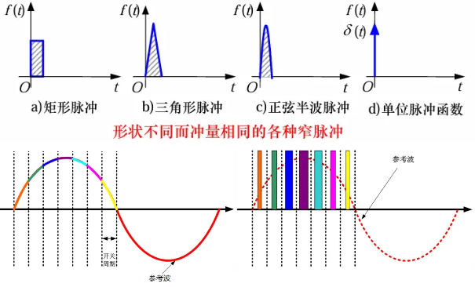

PWM 调制方式分为单极性(系统产生的脉冲只有一种极性)和双极型(系统产生的脉冲有两种极性)，下图中上面方式为单极性，下面方式为双极型；上面方式谐波更小(越像正弦谐波越小)。双极型 PWM 载波信号的峰峰值为单极型峰峰值的两倍，其余原理类似。

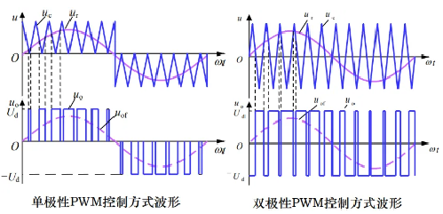

PWM 波有等幅 PWM 波和不等幅 PWM 波之分

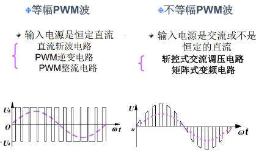

实际使用中，PWM 信号一般由调制法得到。信号波即为要输出的波形，载波一般为三角波，由机器生成。载波的周期与 PWM 波周期相同，为$$T_\text{s}$$，幅值为逆变电路输入的直流电压值$$U_\text{d}$$。信号波和载波经过电压比较器，当信号波大于载波时输出高电平，反之则输出低电平，这样电压比较器的输出端得到的就是用于控制开关管的 PWM 波。改变信号波并相应地自动生成载波，便可以在该电路的$$Uo$$端自动产生要求占空比的 PWM 波，从而控制变换电路的开关管。当需要产生的信号波为正弦波时，这种调制方法称为 SPWM。

#### PWM 整流

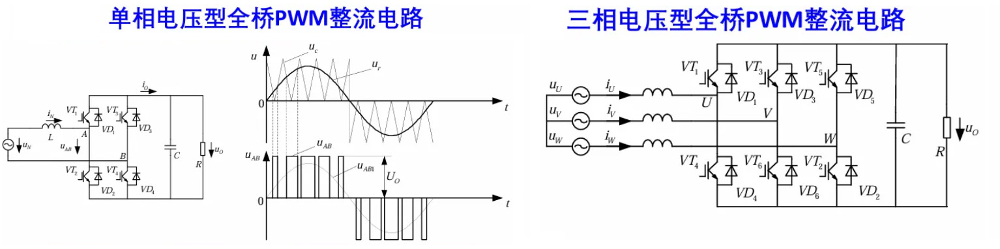

#### PWM 死区

使用 PWM 控制时一般会插入死区时间，死区时为了电路安全，避免一个桥臂上下管全导通而提前关断或延后导通或两者兼有的措施，对输出电压会产生对应响应，以如下电路为例，电流为正时输出电压偏小，电流为负时输出电压偏大。

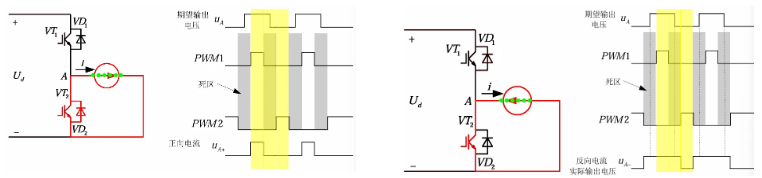

因此对输出电压需要进行补偿

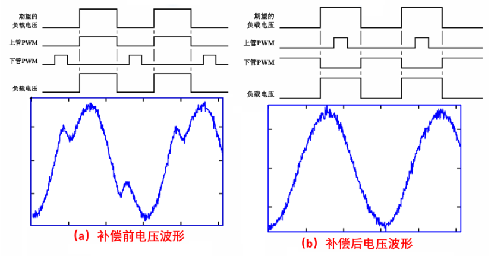

#### 功率因数校正(PFC)电路

原本的单相桥式整流，电流波形的谐波过大(离正弦差很远)，且输出电压不可控

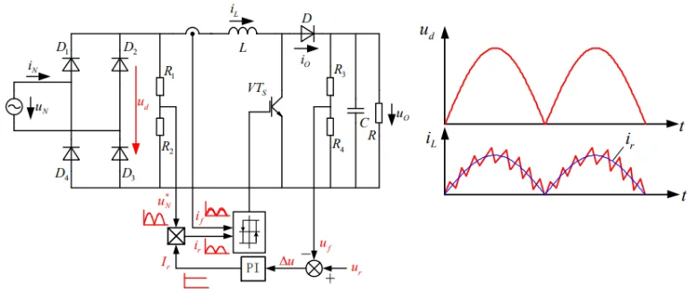

#### SVPWM

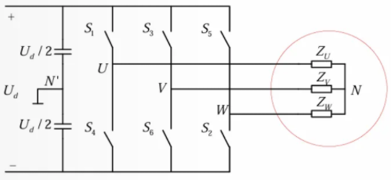

对于每个桥臂只有两种状态，设上管导通为 1，下管导通为 0，电路开关状态共有$$2^3 = 8$$种，每种状态对应一种输出电压。其中 111 或 000 对应输出电压为 0，其余六种状态对应电压矢量分别为正六边形对角线一半，长度为直流输入电压$$U_\text{d}$$。通过六个电压矢量合成可得到任意三相电压，其中 0 电压用于凑齐一个周期的时间；另外为了减小谐波，将导通波形在占空比不变的前提下等效为对称的七段。

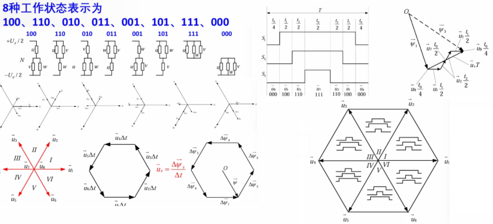

总的步骤可流程化为：由要求的三相电压值合成电压矢量，以最近的两条六边形对角线为基，由伏秒平衡计算两个开关状态对应的$$t_{1}、t_{2}$$，并根据周期补全$$t_{0} = T_\text{s} - t_{1} - t_{2}$$，最后拆分成七段即得到控制脉冲波形。本质上是冲量等效原理，冲量相等的窄脉冲加在具有惯性的环节上时，其效果基本相同。因此当逆变电路需要输出 6 个基本电压矢量以外的电压矢量(包括电压矢量的角度和长度)时，可以利用冲量等效原理利用 6 个基本电压矢量加上两个零电压矢量进行合成。电压空间矢量的有效合成区域为该正六边形的内切圆，因此其最大电压矢量幅值为内切圆的半径。

### 2.2 软开关技术

开关过程中电压、电流均不为零，出现重叠，导致了开关损耗。而且电压和电流变化很快，波形出现明显过冲，这导致了开关噪声的产生。具有这样的开关过程的开关叫硬开关。硬开关存在的问题是增加开关损耗、加大电磁干扰。

通过在开关过程前后引入谐振，使开关开通前电压先降到零，关断前电流先降到零，就可以消除开关过程中电压、电流的重叠，降低它们的变化率，从而大大减小甚至消除开关损耗。同时，谐振过程限制了开关过程中电压和电流的变化率，这使得开关噪声也显著减小。这样的开关过程也被称为软开关。

减小开通损耗的方法：

- 在功率管开通过程中，使其电流保特为零，或者使电流缓慢上升，从而减小在开通过程中电流、电压的重叠区功率损耗，这种开通方式称为零电流开通(ZCS on)。
- 在功率管开通前，使其承受的电压先下降到零，然后再加门极信号，使开通电流、电压重叠区功率损耗为零，这种方式称为零电压开通(ZVS on)。

减小关断损耗的方法

- 首先使经过功率管电流自然过零，再撤除门极驱动信号的关断方法，称为零电流关断。
- 在功率管关断过程中，保持其端电压为零，或者限制电压上升速率，从而减小电流与电压重叠区中的功率损耗，这种方法称为零电压关断(ZVS off)。

#### 串联谐振逆变电路

串联谐振电路的频率特性用品质因数$$Q$$描述

$$
\begin{aligned}
Q = \frac{\omega_{0} L}{R} = \frac{1}{\omega_{0} R C} = \frac{\sqrt{\frac{L}{C}}}{R}\\ \omega_{0} = 2 \pi f_{0} = \frac{1}{\sqrt{LC}}
\end{aligned}
$$

当逆变电路输出方波电压频率为$$f_{0}$$时，品质因数$$Q$$越高，负载电阻上的电压畸变率就越小

以串联谐振逆变电路为例

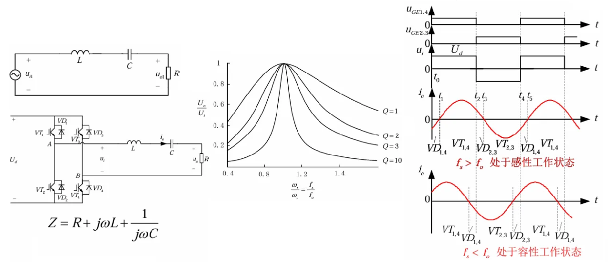

$$
\begin{aligned}
\frac{U_\text{o}}{U_\text{i}} = \frac{R}{\sqrt{R^2 + \left( \omega L - \frac{1}{\omega C} \right)^2}} = \frac{1}{\sqrt{1 + \left( \frac{\omega L}{R} - \frac{1}{\omega RC} \right)^2}} = \frac{1}{\sqrt{1 + Q^2 \left( \frac{\omega}{\omega_{0}} - \frac{\omega_{0}}{\omega} \right)^2}}
\end{aligned}
$$

当$$f_\text{s} > f_{0}$$时，逆变电路输出方波的高次谐波均在谐振频率以上，有利于高次谐波的抑制。当$$f_\text{s} < f_{0}$$时，使高次谐波频率下移，特别是 3 次谐波，靠近谐振频率时，不利于谐波的抑制。因此当逆变电路的$$f_\text{s}>f_{0}$$时，输出电流的畸变较小。改变逆变电路的输出方波电压频率来实现负载电阻上的电压调节；输出功率可以通过频率控制实现。例如感应加热。

类似的还有串联谐振 DC-DC 电路，并联谐振 DC-DC 电路。

#### 谐振电路相平面分析法

对于 LC 谐振电路

$$
\omega_\text{r} = \frac{1}{\sqrt{LC}}
$$

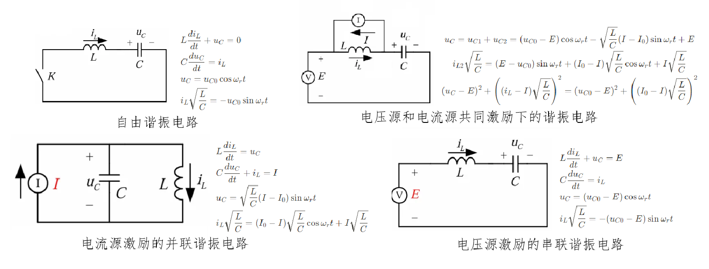

#### 准谐振变换电路

零电流开关准谐振变换电路

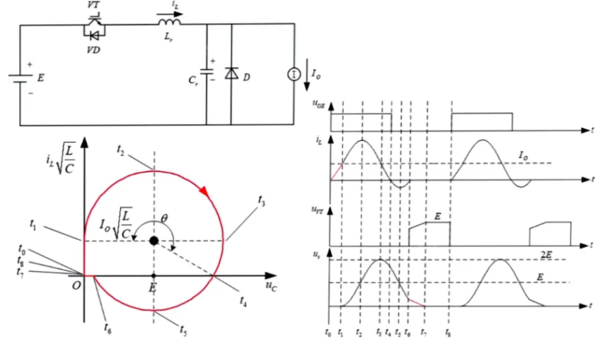

谐振电感$$L_\text{r}$$和谐振电容$$C_\text{r}$$的设计取决于它的谐振频率$$\omega_\text{r}$$，和最大输出电流$$I_\text{Omax}$$。要实现功率开关的零电流关断，必须使$$i_\text{L}$$在关断之前降为零，即谐振轨迹圆与$$u_\text{C}$$轴有交点。

零电压开关准谐振变换电路

谐振电感$$L_\text{r}$$和谐振电容$$C_\text{r}$$的设计取决于它的谐振频率$$\omega_\text{r}$$和最小输出电流$$I_\text{Omin}$$。要实现功率开关的零电压开通，必须使$$u_\text{C}$$在开通之前降为零，即谐振轨迹圆与$$i_\text{L}\sqrt{\frac{L}{C}}$$轴有交点。

## 第三章 DC-DC 变换(斩波)

### 3.1 基本斩波电路

基本斩波电路有降压(Buck)电路，升压(Boost)电路，升降压(Buck-Boost)电路，这些电路有电流连续和电流断续两种工作状态，三种电路中，无论是连续模式还是断续模式，均满足伏秒平衡和安秒平衡，可通过调节占空比$$D$$来调整输出电压。

伏秒平衡：实质是磁链守恒

$$
\begin{aligned}
i_\text{L}(0) &= i_\text{L}(T_\text{s})\\
u_\text{L}(t) &= L\frac{\text{d}i_\text{L}}{\text{d}t}\\
\int_{0}^{T_\text{S}}u_\text{L}(t)\text{d}t &= L(i_\text{L}(T_\text{s}) - i_\text{L}(0)) = 0
\end{aligned}
$$

安秒平衡：实质是电荷守恒

$$
\begin{aligned}
u_\text{C}(0) &= u_\text{C}(T_\text{s})\\
i_\text{C}(t) &= C\frac{\text{d}u_\text{C}}{\text{d}t}\\
\int_{0}^{T_\text{S}}i_\text{C}(t)\text{d}t &= C(u_\text{C}(T_\text{s}) - u_\text{C}(0)) = 0
\end{aligned}
$$

三种斩波电路分析如下

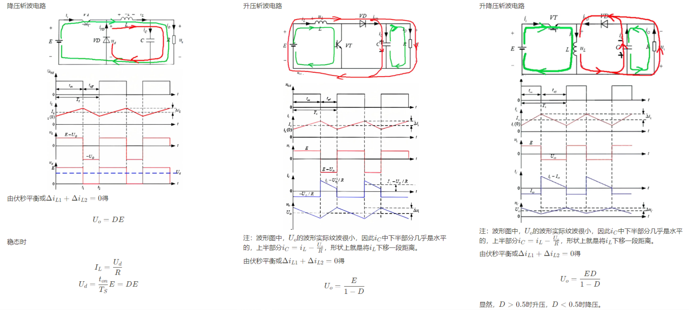

电容电感为无源器件，因此理想斩波电路可看作直流变压器

$$
\begin{aligned}
E I_\text{i} = U_\text{o} I_\text{o}\\ U_\text{o} = DE\\ I_\text{o} = \frac{I_\text{i}}{D}
\end{aligned}
$$

### 3.2 复合斩波电路

基本斩波电路中的电流只能朝一个方向，电路工作在第一象限，对于电机来说工作在第一象限。有的情况下，需要电流流向反向，或需要电压极性反向，即电路需要工作在多个象限，复合斩波电路应运而生。复合斩波电路作为电压源的一个基本要求为，无论电流的方向如何，需要始终保证负载两端的电压为恒定值，在设计时需要注意。

两个开关管串在一起称为一个桥臂，有一个桥臂称为半桥，两个桥臂则称为全桥。管子通断决定电流回路，当管子通断改变了电流方向或电压极性时，工作的象限也会随之改变；当管子通断不改变电流方向或和电压极性时，外界负载决定电流方向，从而决定工作象限。占空比决定管子通断的时间，占空比调节平均值。

#### 3.2.1 半桥斩波电路

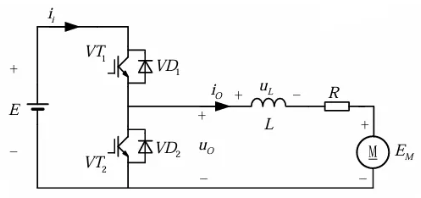

工作在$$I、II$$象限，即电流方向可反向，电压极性不变，有独立控制方式和互补控制方式。

独立控制方式时单管斩波，另一管始终关断；电流的反向需要通过开关的切换来完成；想要控制电流方向，需要采样电流以判断当前的工作状态，然后切换斩波的开关管，才能够改变电流方向。电路工作在$$I、II$$象限，开关管的控制策略不同。

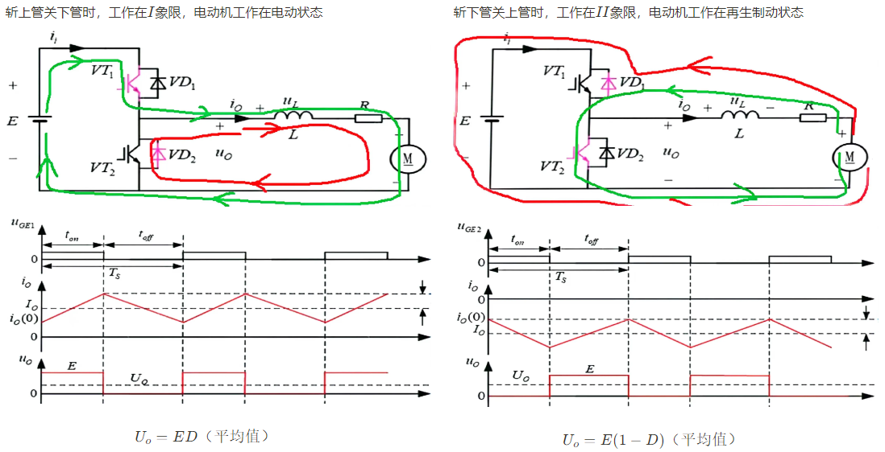

互补控制方式则无需判断工作状态，两开关管按各自给定的占空比自行切换导通状态：上管导通则下管关闭，下管导通则上管关闭。在实际电路中，为了防止上下管同时导通造成电源短路，为 PWM 波加入了死区。互补控制方式下，管子的通断只会切换电流回路，但不改变电流方向，因此也不改变工作象限；外界负载决定电流方向，决定电路工作的象限。互补控制模式中，无论电机工作在哪个象限，开关管都以接收同样的 PWM 信号，即开关管的控制策略与电路工作状态无关。

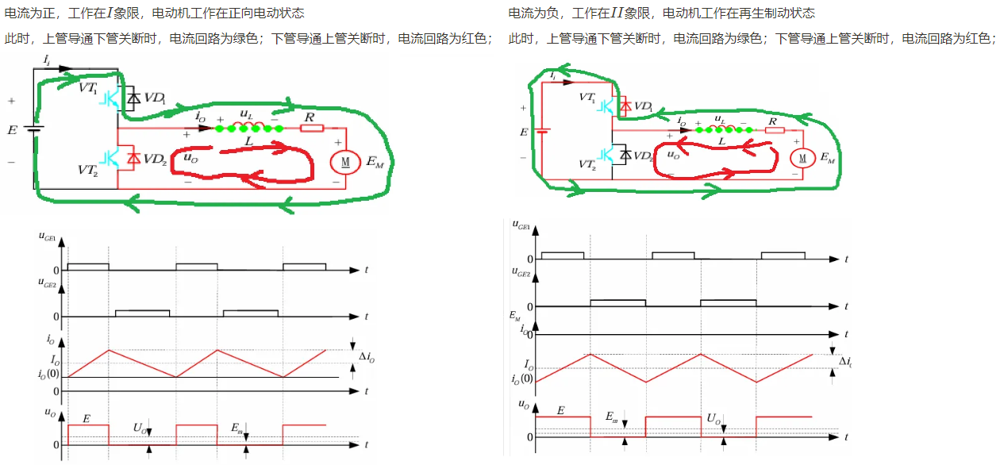

#### 3.2.2 不对称半桥斩波电路

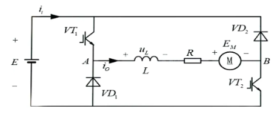

工作在$$I、IV$$象限，即电压极性可翻转，电流方向不变，有斩双管和斩单管两种工作模式。

斩双管模式：双管导通时，电压为正，工作在$$I$$象限；双管关断时，电压为负，工作在$$IV$$象限。可通过调节占空比来改变电压极性。

$$
\begin{aligned}
&U_\text{o} = U_\text{AB} = \frac{EDT_\text{s} - E(1-D)T_\text{s}}{T_\text{s}} = (2D - 1)E\\
&D > 0.5 时为输出正压，D < 0.5 时输出反压
\end{aligned}
$$

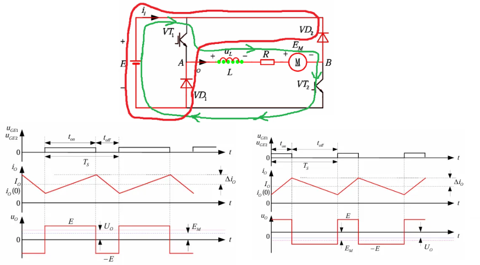

斩单管模式

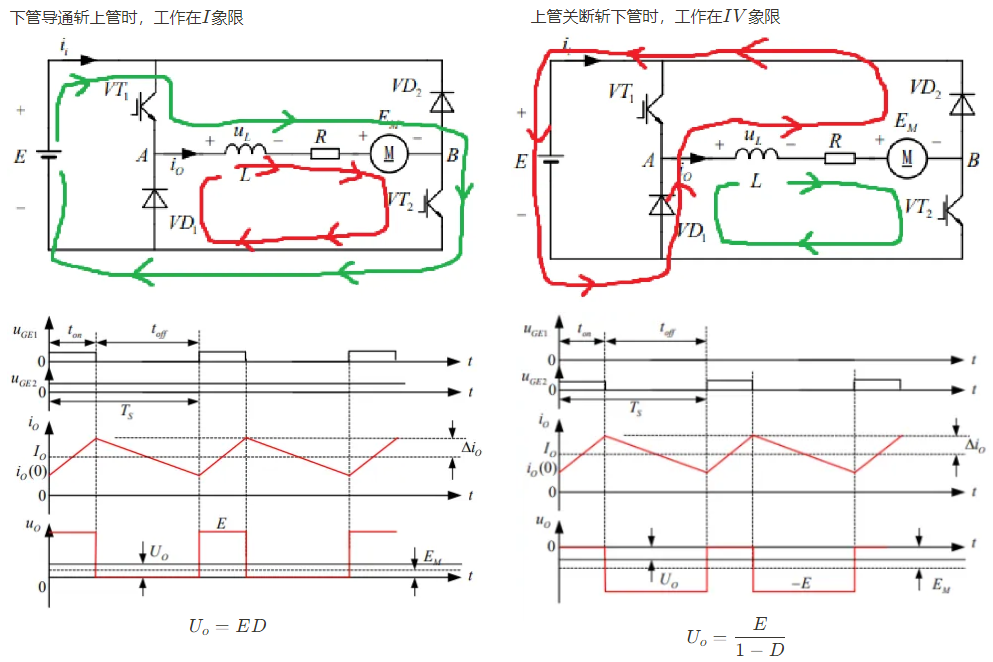

#### 3.2.3 全桥斩波电路

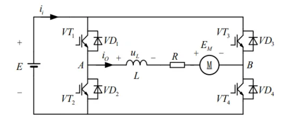

可以四象限运行，有斩单管和斩双管模式

斩单管模式

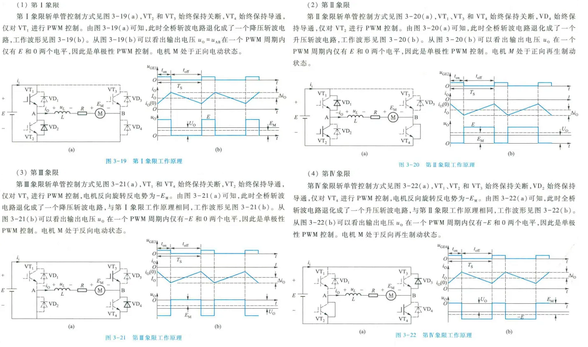

斩双管模式

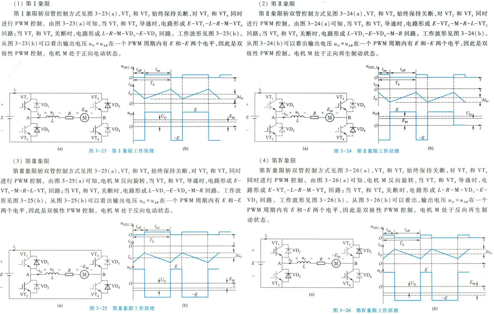

## 第四章 AC-DC 变换(整流)

整流按相数分为单向、三相和多相整流；按电路构成分为半波、全波和桥式整流；按控制方式分为不可控整流、相位整流和 PWM 整流。$$\alpha$$称为控制角/触发角，在单相电路中是相电压过零点；在三相电路中是自然换向点和触发信号起始点之间的相位差，自然换向点是相电压交汇的点。$$\theta$$称为导通角，是开关管导通的相位范围

### 4.1 单相桥式不可控整流

不可控整流：开关管的通断取决于 u、v 的电压差。

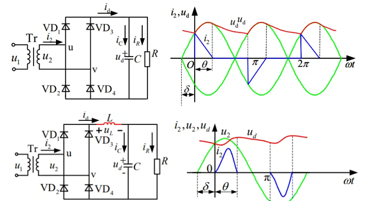

重叠段电容充电，不重叠段电容放电(负载电压被钳位在较高的那个电压上)

空载(电阻很大，电流很小，如开路)时，放电时间常数无穷大，输出电压最大$$U_\text{d} = \sqrt{2}U_{2}$$

重载(电阻很小，电流很大，如短路)时，电容放电很快，几乎失去储能作用，短路时$$U_\text{d} = 0.9U_{2}$$

可以在直流侧(交流侧也行，但直流侧更简单)串小电感来抑制电流冲击，成为感容滤波电路

### 4.2 三相桥式不可控整流

对于三相，u、v 之间为线电压；在任意时刻，线电压最大的一路导通，导通顺序为 ab,ac,bc,ba,ca,cb，对应导通的二极管分别为 61,12,23,34,45,56

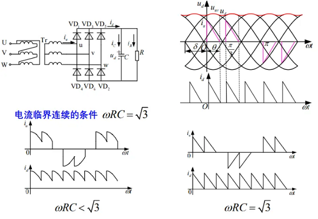

空载(电阻很大，电流很小，如开路)时，放电时间常数无穷大，输出电压最大$$U_\text{d} = \sqrt{6}U_{2} = 2.45U_{2}$$

重载(电阻很小，电流很大，如短路)时，电容放电很快，几乎失去储能作用，短路时$$U_\text{d} = 2.34U_{2}$$

电流连续条件为$$\omega RC = \sqrt{3}$$，电流连续时，输出电压为线电压的上包络线

### 4.3 单相半波可控整流

晶闸管的整流电路，负载会影响输出。

纯阻性负载

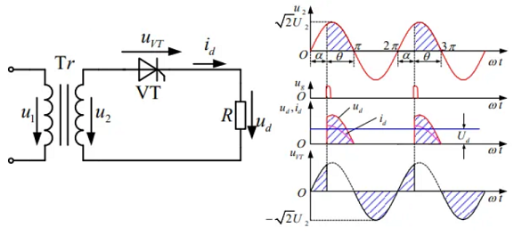

$$
\begin{aligned}
&U_\text{d} = \frac{1}{2\pi} \int_{\alpha}^{\pi} \sqrt{2}U_{2} \sin \alpha \cdot \omega t \, \text{d}(\omega t) = \frac{\sqrt{2}U_{2}}{\pi} \frac{1+\cos \alpha}{2} = 0.45 U_{2} \frac{1+\cos \alpha}{2}\\
&I_\text{d} = \frac{U_\text{d}}{R} = 0.45 \frac{U_{2}}{R} \frac{1+\cos \alpha}{2}
\end{aligned}
$$

移相范围为 0~180°，即$$\alpha$$可在 0~180° 之间调节；超过 180° 则不叫整流。

晶闸管承受的最大正反向电压是相电压峰值$$U_\text{VTM} = \sqrt{2}U_{2}$$。

---

阻感性负载

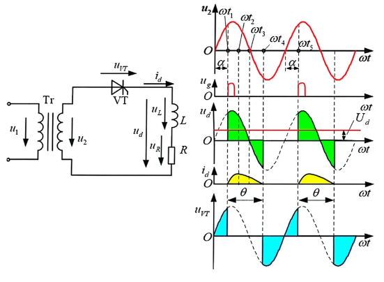

$$
\begin{aligned}
&U_\text{d} = \frac{1}{2\pi} \int_{\alpha}^{\pi} \sqrt{2} U_{2} \sin \omega t \text{d}(\omega t) = \frac{\sqrt{2} U_{2}}{\pi} \frac{1 + \cos \alpha}{2} = 0.45 U_{2} \frac{1 + \cos \alpha}{2}\\
&I_\text{d} = \frac{U_\text{d}}{R} = 0.45 \frac{U_{2}}{R} \frac{1 + \cos \alpha}{2}
\end{aligned}
$$

电感延迟了关断的时刻，使$$u_\text{d}$$出现负电压，与纯阻性负载相比，平均电压$$U_\text{d}$$下降。

负载阻抗角$$\phi = \arctan \frac{\omega L}{R}$$；$$\phi$$一定，$$\alpha$$越大，$$\theta$$越小；$$\alpha$$一定，$$\phi$$越大，$$\theta$$越大。即，感性一定时，触发越晚导通角越小；触发时间一定时，感性越大续流能力越强，导通角越大。

移相范围为 90°；晶闸管承受的最大正反向电压是相电压峰值。

---

由于电感延长了导通时间，使得输出电压会出现负值，故加入续流二极管。

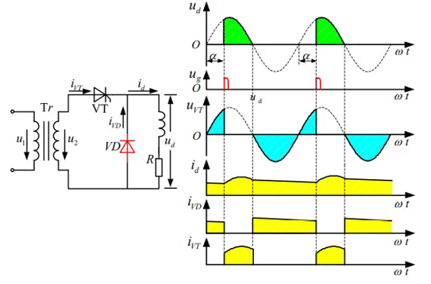

续流二极管提供了阻抗更小的回路来反偏晶闸管使其关断，从而避免了输出电压上的负值，等效增大了阻感输出时的电压。认为电感足够大，$$i_\text{VD}$$为一条直线。

$$
\begin{aligned}
&U_\text{d} = \frac{1}{2\pi} \int_{\alpha}^{\pi} \sqrt{2} U_{2} \sin \omega t \text{d}(\omega t) = \frac{\sqrt{2} U_{2}}{\pi} \frac{1 + \cos \alpha}{2} = 0.45 U_{2} \frac{1 + \cos \alpha}{2}\\
&I_\text{d} = \frac{U_\text{d}}{R} = 0.45 \frac{U_{2}}{R} \frac{1 + \cos \alpha}{2}\\
&I_\text{dVT} = \frac{\pi - \alpha}{2\pi} I_\text{d}，I_\text{dVD} = \frac{\pi + \alpha}{2\pi} I_\text{d}
\end{aligned}
$$

移相范围为 180°；晶闸管承受的最大正反向电压是相电压峰值。

### 4.4 单相桥式全控整流

纯阻性负载

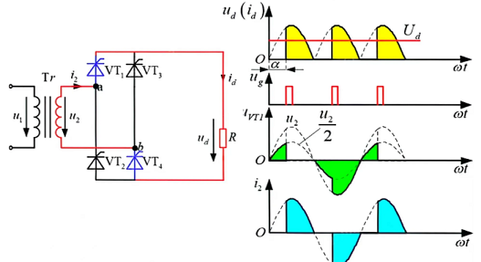

输出电压在一个周期内脉动两次，变压器二次绕组在正负半周电流相反且波形对称，变压器平均电流为零，即直流分量为零，消除了变压器的直流磁化，提高了变压器有效利用率。

对于$$U_\text{VT1}$$的跳变：b 点电位高于 a 点阶段；$$VT_{2}、VT_{3}$$两管导通前，$$VT_{1}、VT_{4}$$平分$$u_{2}$$，导通后$$VT_{1}、VT_{4}$$两端相当于并联，端电压均为$$u_{2}$$

$$
\begin{aligned}
&U_\text{d} = \frac{1}{\pi} \int_{\alpha}^{\pi} \sqrt{2} U_{2} \sin \omega t \, \text{d}(\omega t) = 0.9 U_{2} \frac{1 + \cos \alpha}{2}\\
&I_\text{d} = \frac{U_\text{d}}{R} = 0.9 \frac{U_{2}}{R} \frac{1 + \cos \alpha}{2}
\end{aligned}
$$

平均值为半波时的两倍，移相范围 180°

晶闸管承受最大正压$$\frac{U_{2}}{\sqrt{2}}$$，最大反压$$\sqrt{2}U_{2}$$

---

阻感性负载

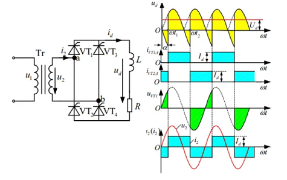

晶闸管导通角$$\theta = 180°$$，与控制角$$\alpha$$无关；流过晶闸管和变压器二次侧的电流为矩形波，电感电流／输出电流近似平直(电感足够大)，即电流在两个导通回路中来回切换。

$$
\begin{aligned}
&U_\text{d} = \frac{1}{\pi} \int_{\alpha}^{\pi + \alpha} \sqrt{2} U_{2} \sin \omega t \, \text{d}(\omega t) = \frac{2 \sqrt{2} U_{2}}{\pi} \cos \alpha = 0.9 U_{2} \cos \alpha\\
&I_\text{d} = \frac{U_\text{d}}{R} = \frac{0.9 U_{2} \cos \alpha}{R}
\end{aligned}
$$

移相范围 90°，晶闸管承受的最大正反压均为$$\sqrt{2}U_{2}$$

---

反电动势负载

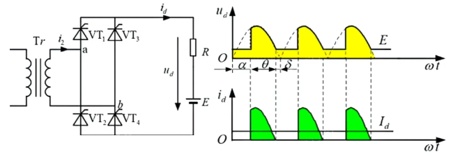

反电动势负载的常见例子是发电机，其反电动势与转速成正比，相较于电路物理量的变化，转速这样的机械变化可以认为十分缓慢，故近似为恒定转速，对应的反电动势为一恒值，此处简化为直流电压源。

$$u_\text{d} = u_{2} - E$$，当$$u_{2} < E$$时，晶闸管关断，$$u_\text{d} = E$$；当$$u_{2} \geqs E$$后，给触发信号即可导通。等效下来，相较于纯阻性负载，晶闸管的导通角降低，等效电压升高。

### 4.5 三相半波可控整流

纯阻性负载

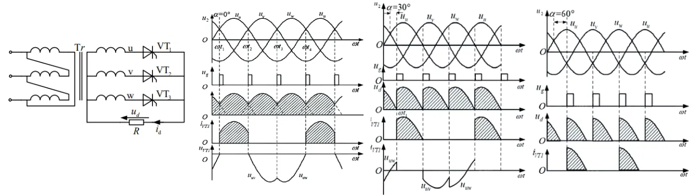

纯阻性负载的移相范围为 0~150°，正向最大电压$$U_\text{FM}$$为$$\sqrt{2}U_{2}$$，反向最大电压$$U_\text{RM}$$为$$\sqrt{6}U_{2}$$

$$
\begin{aligned}
&\alpha \leqslant 30°时:U_\text{d} = \frac{3}{2\pi} \int_{\frac{\pi}{6} + \alpha}^{\frac{5\pi}{6} + \alpha} \sqrt{2} U_{2} \sin \omega t \, \text{d}(\omega t) = 1.17 U_{2} \cos \alpha\\
&\alpha > 30°时:U_\text{d} = \frac{3}{2\pi} \int_{\frac{\pi}{6} + \alpha}^{\pi} \sqrt{2} U_{2} \sin \omega t \, \text{d}(\omega t) = 0.675 U_{2} [1 + \cos(\frac{\pi}{6} + \alpha)]\\
&\alpha = 0°时U_\text{d} = U_\text{d0} = 1.17U_{2}\\
&\alpha = 150°时U_\text{d} = 0
\end{aligned}
$$

---

阻感性负载

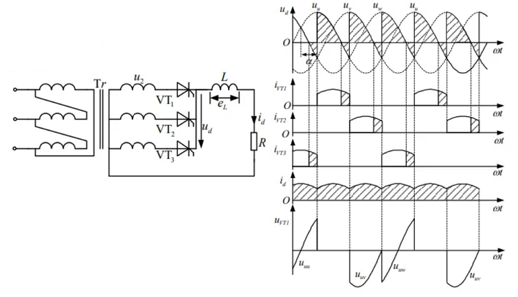

阻感性负载的移相范围为 0~90°，正反向最大电压$$U_\text{VTM}$$均为$$\sqrt{6}U_{2}$$

$$
\begin{aligned}
U_\text{d} = \frac{3}{2\pi} \int_{\frac{\pi}{6} + \alpha}^{\frac{5\pi}{6} + \alpha} \sqrt{2} U_{2} \sin \omega t \, \text{d}(\omega t) = 1.17 U_{2} \cos \alpha
\end{aligned}
$$

### 4.6 三相桥式可控整流

纯阻性负载

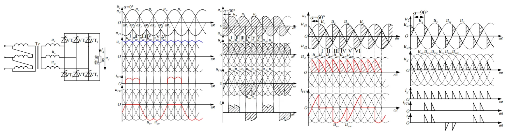

上面是共阴组，下面是共阳组，任何时候共阴和共阳极组各有一个晶闸管同时导通才能形成导电通路。整流桥正常工作时，需要同时导通的两个晶闸管均有脉冲。共阴和共阳组晶闸管均按相序依次触发导通，相位相差 120°。

输出电压 u 由 6 段线电压组成，每周期脉动 6 次。晶闸管承受的电压波形与三相半波时相同。变压器二次绕组流过正、负两个方向的电流，消除了变压器的直流磁化

纯阻性负载移相范围 0~120°，最大正负电压$$\sqrt{6}U_{2}$$

$$
\begin{aligned}
&\alpha \leqslant 60° 时:U_\text{d} = \frac{1}{\frac{\pi}{3}} \int_{\frac{\pi}{3} + \alpha}^{\frac{2\pi}{3} + \alpha} \sqrt{3} \times \sqrt{2} U_{2} \sin \omega t \, \text{d}(\omega t) = 2.34 U_{2} \cos \alpha\\
&\alpha > 60° 时:U_\text{d} = \frac{1}{\frac{\pi}{3}} \int_{\frac{\pi}{3} + \alpha}^{\pi + \alpha} \sqrt{3} \times \sqrt{2} U_{2} \sin \omega t \, \text{d}(\omega t) = 2.34 U_{2} \left[ 1 + \cos \left( \frac{\pi}{3} + \alpha \right) \right]
\end{aligned}
$$

---

阻感性负载

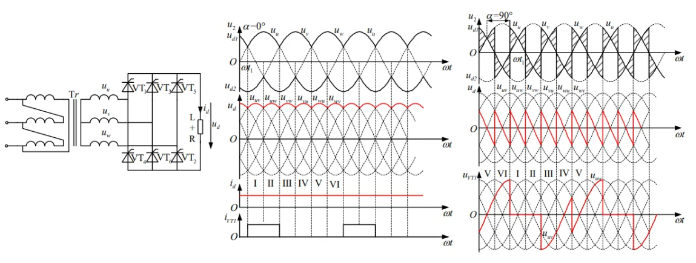

纯阻性负载移相范围 0~90°

$$
\begin{aligned}
U_\text{d} = \frac{1}{\pi / 3} \int_{\frac{\pi}{3} + \alpha}^{\frac{2\pi}{3} + \alpha} \sqrt{3} \times \sqrt{2} U_{2} \sin \omega t \, \text{d}(\omega t) = 2.34 U_{2} \cos \alpha
\end{aligned}
$$

## 第五章 DC-AC 变换(逆变)

当三相半波可控整流电路$$\alpha > 90°, U_\text{d} < E$$时，处于有源逆变状态。电压反向，电流不反向(受晶闸管限制)，能量由电机反转的机械能转化为电路电能，在功率角度上从直流侧转化到交流测，称为逆变。$$\beta = 180° - \alpha$$称为逆变角。

实现有源逆变的条件：(1)需要有一个提供逆变能量的直流电源，这个直流电源能从直流侧向交流侧输出能量。直流电源的极性与晶闸管的导通方向一致。(2)需要可控整流电路的控制角$$\alpha > 90°$$并控制$$\alpha$$使$$U_\text{d} < E$$。(3)在有源逆变工作状态时，要注意不能有触发脉冲丢失、缺相，且$$\beta$$不能小于最小值，并留有裕量，否则会使逆变失败，造成短路。

### 5.1 单相方波逆变

推挽式单相方波逆变电路和半桥式单相方波逆变电路如下

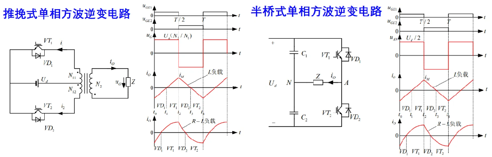

全桥式单相方波逆变电路有三种控制方式

- 脉冲幅度调制：14 一组，23 一组，两组互补导通(错开 180°)

- 对称单脉冲调制：14 一组，23 一组，两组互补导通(错开 180°)，调节导通角调节幅值

- 移向单脉冲调制：12 错开，34 错开，13 错开$$\theta$$，调节 13 相位差可以调节$$U_\text{d}$$宽度，从而调节输出波形幅值

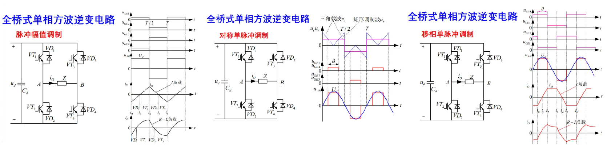

### 5.2 单相正弦波逆变

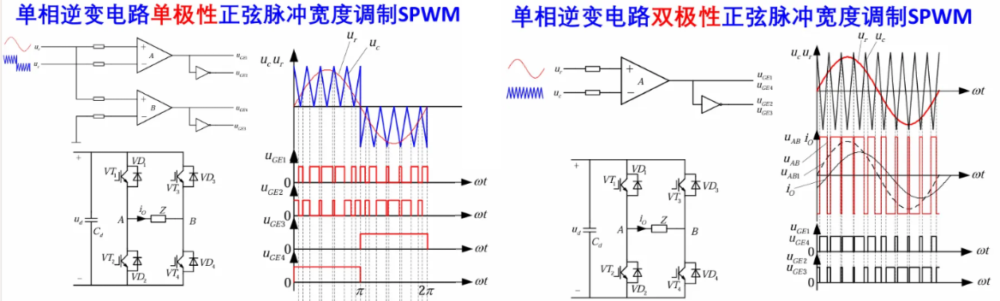

### 5.3 三相方波逆变

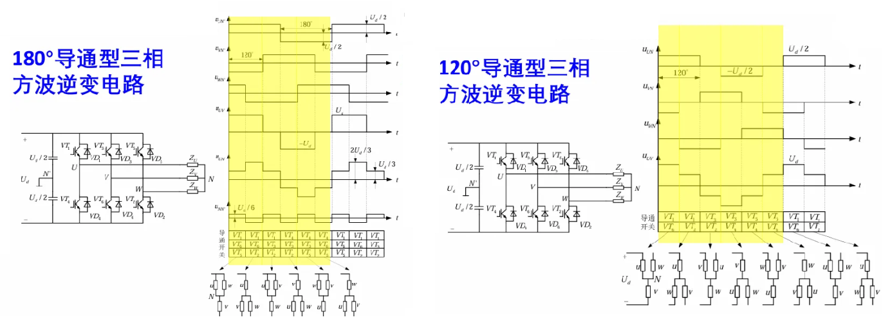

### 5.4 三相正弦波逆变

有 SPWM 和 SVPWM 两种控制方式

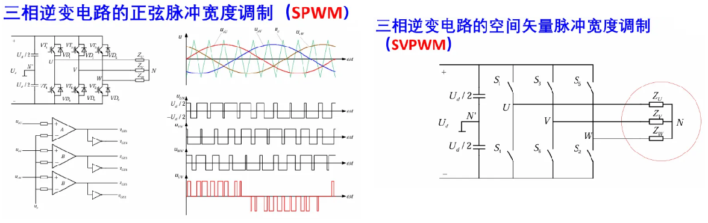

## 第六章 AC-AC 变换(变频调幅)

实际使用时，用的最广泛的不是 AC-AC 的直接变换，而是 AC-DC-AC 的间接变换。

### 6.1 交流调压电路

单相相控交流调压电路

纯阻性负载

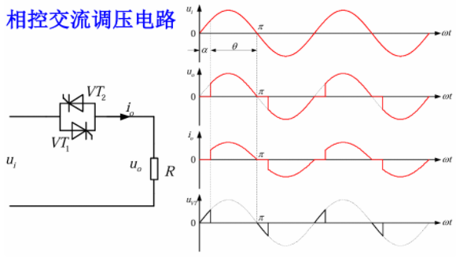

阻感性负载，$$\alpha \ge \varphi$$

阻感性负载，$$0 \le \alpha < \varphi$$，宽脉冲触发，此时窄脉冲触发存在脉冲丢失现象

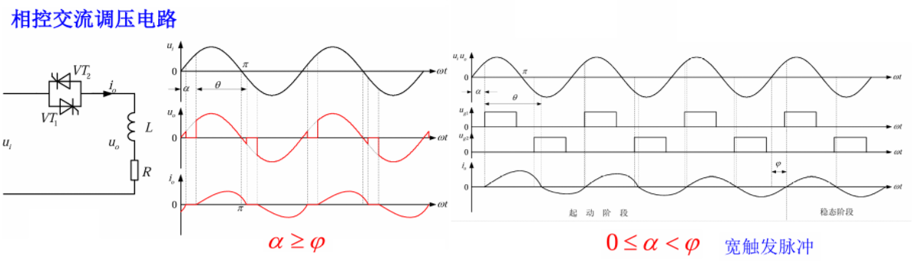

斩控式交流调压电路

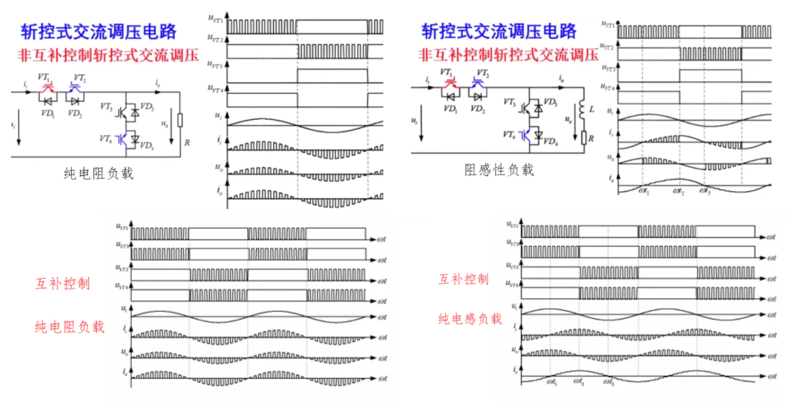

### 6.2 交交变频电路

方波单相交交变频电路

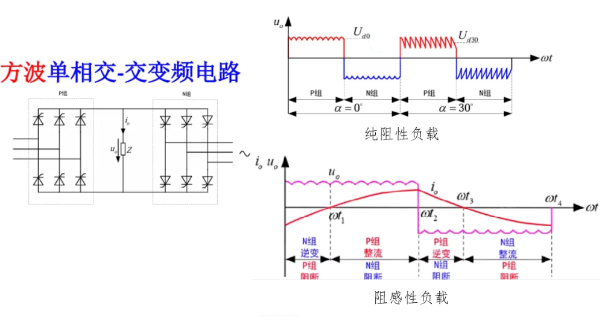

正弦波单相交交变频电路

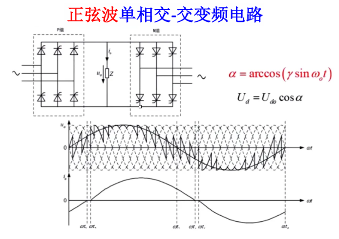

### 6.3 矩阵变换电路

采用 PWM 控制，可以产生任意正弦波输出

有单相矩阵变换电路和三相矩阵变换电路

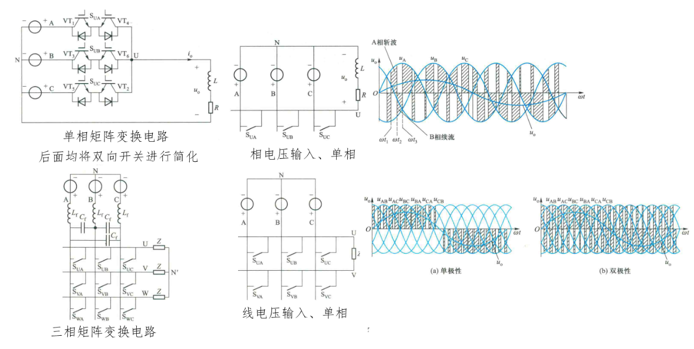
