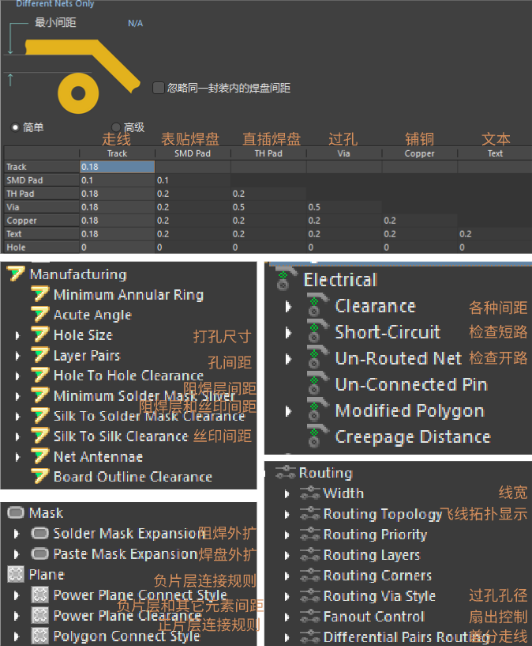

阅读前，确保有 AD 的简单使用经验或看过任意 AD 的入门教程，笔记中不会对“什么是封装”这类过于基础的概念作介绍。另外，笔记中提到的内容，多为规范性的东西，按照最科学的情况进行说明，存在冲突时需要根据信号和芯片要求的重要程度进行优先级取舍。不按要求来也许板子也能工作，但不规范的设计习惯会使得板子可靠性降低，且不利于长期能力培养。

## 前置知识

1. 从零开始到拿到一块板子的步骤包括：

   - 确定板子功能以及需要的元器件
   - 在嘉立创等多个平台寻找需要的元器件及相应的可导出的 AD 文件(初学阶段一般不会自己画元件的原理图和封装，找现成的即可)
   - 按一定的规范建立自己的元器件库(如果从零开始则建议执行这一步，有现成的可靠的库则可以跳过)
   - 从元器件库中选择需要的元器件，绘制原理图，完成连线、位号标注和网络标签的添加等，最后 Validate
   - 仔细检查原理图，并且最好能找不同的人审核(个人习惯，因为原理图的错误在 PCB 布局的时候基本不会有机会发现，并且即使在 PCB 布局时发现了错误，返回到原理图中修改，也多少会对已经完成的布局有所影响，徒增工作量，所以建议在进行 PCB 布局前仔细检查原理图)
   - 确定板子外形，可从 SW 或 AutoCAD 中导入 dwg/dwf 文件，确定外框形状和孔位信息
   - 根据制造厂商的工艺参数设置 DRC 规则
   - 将原理图导入 PCB 中
   - 进行层叠设计(2 层板以上需要执行这一步，否则跳过)
   - 按功能模块大致确定元器件布局(可利用 AD 的“交叉选择”功能在原理图中选择某个功能模块，在 PCB 中会自动匹配相应的元器件)
   - 对逐个功能模块进行器件摆放、打孔、布线等
   - 根据需要进行铺铜
   - 运行 DRC，解决警告和报错
   - 在嘉立创完成 PCB 打样并购买元器件，或使用 SMT 服务，完成元器件匹配操作

2. 基本元素

   - Tracks：铜膜导线，是 PCB 上电气连接的主要部分。

   - Pads：焊盘，元器件引脚与 PCB 铜膜连接的金属部分，用于焊接元件引脚。有直插型焊盘和表贴型焊盘两种；直插型焊盘在 AD 中显示为灰色(Multi-Layer)。表贴型焊盘是元器件的一部分，一般不单独放置；直插型焊盘可以单独放置，中间有通孔，可以分别设置焊盘的尺寸和中间通孔的尺寸。

   - Vias：过孔，用于不同 PCB 层之间的电气连接，一般都是通孔。可通过更改起始层和终止层来设置盲孔(将 PCB 内层走线与 PCB 表层走线相连，此孔不穿透整个板子)和埋孔(只连接内层之间的走线，处于 PCB 内层中，从 PCB 表面看不出来)。过孔在某些工艺中可选择覆盖阻焊油墨(盖油)，防止过孔处短路或被氧化，也可不覆盖(开窗)，视具体设计要求而定。

   - Regions：区域，用于设计实心铜膜，一般用于大功率元器件底部散热，代替大电流走线；不区分其他对象，连接区域内的所有网络，只能存在一个网络，不然会造成短路。一般在在布线之前填充完成。

   - Fills：与 Regions 类似，唯一的区别是 Fills 只支持矩形，而 Regions 支持任意形状。

   - Polygons：多边形铺铜，一般用于大面积的电源或接地连接，增强电气性能，减少电磁干扰。也可用于屏蔽特定区域。区分不同对象，会自动连接相同网络并避开其他网络，一般在布线之后进行。

   - Rooms：空间区域，用于定义一个局部元件集合摆放的相对关系，一个用途是可以为不同的 Room 设置不同的布局规则设置，比如线宽规则(使用规则查询语句 WithinRoom 来筛选 Room 对象)；另一个用途是具有多组相同布局布线的电路(Copy Rooms Formats)。

     

     一个完整的封装包括焊盘、管脚序号、丝印(表示实物的大致范围)、阻焊、1 脚标识

3. PCB 中的各个层：板子从中间向外有 top 和 bottom 两个方向，以 top 为例，以两层版的工艺，按照从内向外的顺序有信号层 top layer，助焊层/锡膏层 top paste，阻焊层 top solder，丝印层 top overlay，底部方向同理，top layer 和 bottom layer 之间用 PP 片(半固化片 Prepreg)作绝缘介质层。对于层数高于两层的板子，在两个信号层 top layer 和 bottom layer 之间还有专门的地层和电源层。

   

   - top layer 和 bottom layer 为信号层，在 PCB 制造中为保留铜皮的部分，在该层布线、铺铜以及封装中对应焊盘位置的区域，在信号层中均代表在该层留有相应的铜皮

   - top paste 和 bottom paste 为助焊层，在 PCB 制造中为喷锡的部分，这一层由贴片型器件的封装决定，也就是所谓的焊盘，一般不手动修改。在元器件封装中，焊盘一般比信号层对应的铜皮区域略大或两者一样大。

   - top solder 和 bottom solder 为阻焊层，在 PCB 制造中为覆盖绿油的层(虽然也有其它颜色的阻焊油漆，但一般统称绿油)，该层为负片输出，也称阻焊开窗，即默认整层覆盖绿油，只在有开窗的位置不盖油，相当于在整层绿油的基础上作减法操作。由于阻焊层向内为助焊层或信号层，因此开窗的位置会露出相应的焊盘或其它铜皮。在元器件封装中，阻焊区域一般比对应的焊盘区域略大。

   除此之外，还有 keep-out layer 或某一个 mechanical layer 用作规定板子外形(不要同时用)，其它的诸如 drill guide、drill drawing、以及各个 Mechanical 机械层均不常用，暂时可以忽略。

4. 阻抗匹配：高速 pcb 设计中的重要概念，以标准的通信模型为例，当信号在信号源、传输线、接收端三个部分传输时，如果相邻部分的阻抗不一致，就会在接触点处发生反射，不一致的程度越高，反射的现象就越强烈。

   

   所谓的阻抗匹配，就是要保证三个部分的阻抗一致。信号源和接收端的阻抗可以在相应的数据手册中找到，因此设计 PCB 走线的阻抗即可(如果信号源)；例如 USB 阻抗是差分 90Ω，SDIO 是单端 50Ω。PCB 板厂会有专门的阻抗计算的页面，输入需求阻抗、阻抗模式、阻抗层等信息就可以自动计算得到在该厂家的工艺下，任意阻抗所对应的走线宽度，在设计时设置相应的宽度，并在走线的反面画一个参考用的地平面即可。另外注意，阻抗与走线长度无关，但是和其它参数都有关，比如 PCB 厚度、层数、铜厚，甚至是厂家的生产工艺

5. 常用端子胶壳规格

   

## 建立规范

1. 元器件库

   - Designator：元件标识符，又称位号，在一张原理图中唯一；按照标准的元件类型前缀 + 流水号命名，显示。
   - Design Item ID：设计项标识，是元器件在原理图库中的名称，在整个项目中唯一，和 Comment 写一样。
   - Comment：注释，写型号或参数，电阻/电容/电感/接插件的不显示，其它的尤其是芯片要显示。
   - Description：描述，对元件功能、特性等进行说明。
   - Footprint：封装，定义了元件在 PCB 上的物理尺寸、引脚布局和焊接方式。按照标准封装(或商城中给的封装)填写名称。封装的参考统一设置为中心，另外 3D 模型放置要对准

   - 对于库的维护，把元器件库和 PCB 库放在集成库 LibPkg 中，集成库中的原理图和封装是一对一或一对多的关系，画原理图时放置一个元件后选择其封装即可。以一个常用元器件库为基础，后续项目中用到的芯片往里补充，以及实际调试中如果针对已有元件有封装不合适的地方往里更新。LibPkg 编译之后 Output 得到 IntLib，并安装到 AD 中，这样就不用在工程中包含库。所有芯片放一个库，使用时可以搜索找到需要的元器件。

2. 原理图

   - VCC 和 GND 从芯片外侧拉出来连接

   - 供电的标记为 VCC 3V3、VBUS 5V 等(网络标签名 + 供电电压)

   - 原理图的目的是看清楚，画开一些，分区域画并加上适当的注释

   - 用 Text 标注元器件参数

   - 捕捉栅格设置为 10mil，兼顾吸附对齐和较小的可调粒度(mil 是 PCB 中的常用单位，10mil = 0.254mm)

   - 滤波电容可以适当选大一点

   - 元器件位号：电阻 R、电容 C、电感 L、二极管(包括 LED)D、接插件 J、晶振 X、三极管 Q、芯片 U、按键开关 S、变压器 T，保险丝 F

   - 芯片引脚左右排布，上下不要有引脚，默认引脚朝右朝下

   - VCC 和 GND 不能直接连到电路引脚上，要通过连线连接

   - 位号放引脚上，名称放片子内；通用元器件位号和名称都不显示。引脚颜色黑色，通用元件颜色蓝色，通用元器件管脚长度 100mil，芯片和排针管脚长度 300mil，矩形中心与坐标原点对齐

3. PCB

   - 元器件布局需要结合功能模块分布、信号流向、供电连接等因素综合考虑

   - 避免直角走线，直角处线宽突变导致阻抗突变，且直角走线的反射较为严重。线的转折尽可能少，会增加反射引起信号衰减。最好在走线和焊盘连接处作泪滴处理，且如果可能最号使用平滑的曲线走线

   - 走线宽度和线距一致，线到孔的距离在此基础上稍大些

   - USB 和 CAN 走差分线

   - 高速板需要作阻抗匹配，会为了走线等长而出现弯曲走线，高频信号如果走线不等长，到达的时间不同，就会产生误判

   - 层叠设计的目的，一个是解决板子面积限制导致的走线不便；二个是提供阻抗匹配所需的完整参考平面

   - 可用数方格的方法计算走线电阻，铜厚 1oz 时，一个导线方格的电阻额约为 0.5mΩ，且与方格边长无关，该方法是通过铜的电阻率算出来的，对细长导线的计算非常准

   - 焊盘上不打孔，过孔打在焊盘上容易机焊元件放歪以及容易漏锡虚焊，非要打用盘中孔工艺。盘中孔工艺是指在焊盘上打孔，但通过镀铜的方式将过孔隐藏在内部，确保表面焊接强度和机械强度可靠。在复杂的高层板设计中，在允许焊盘上打孔可以降低 layout 难度，节约时间，优化信号质量。

   - 信号线一般在 10mil 就可以，对于电源线，对过孔尺寸的内外径、电源线线宽宽都有要求，根据多大面积能过多大电流(留点余量)，计算过孔内外径并根据铜皮厚度计算线宽

     供电线路注意线宽，经过的过孔注意内外径构成的圆环面积。细线过不了大电流的制约因素主要是压降和温升。经验法则是 1A 的电流至少 10mil，建议 15mil；2A 的电流至少 20mil，建议 30mil；3A 的电流至少 60mil，建议 100mil，大于 3A 建议铺铜或开窗。小于 10mil 线宽，建议电流小于 0.1A。

   - 直插型焊盘在设置设计规则时，需要考虑孔径与导线宽度、焊盘与周围其他对象的间距等规则。表贴型焊盘主要关注焊盘与导线、焊盘之间的间距等规则。直插型焊盘表面不能有阻焊油墨覆盖，否则无法焊接。

   - 丝印默认朝右朝下

   - 电容(去耦电容)靠近信号源头放，因为对信号滤波的作用范围有限；电阻除了阻容共串(一起才能发挥作用)的情况外，位置无所谓。

   - 一个孔不出两根线

   - 信号线不要走过孔，只有 GPIO 这样只分高低电平的非信号线才可以走过孔

   - 铺铜要整块工整地铺，地平面的铜可以面积尽可能大，但不要有铜皮尖角、很细的铜以及孤铜。电源走线可以多边形铺铜覆盖，且使用全连接铺铜

   - 板子周围打细小通孔可以抗外界干扰。板边建议沿着板框内缩的位置，打一圈 GND 过孔，过孔与过孔的距离在 50-200mil 左右

   - 时钟线要等长以获得更高的精度，频率越高对等长要求越高。时钟电路可以看看数据手册中的推荐电路和布局

   - 电源芯片一定要看看推荐布局，而且要做电源树

   - 扇孔通俗理解就是拉线打过孔，多层板走线就近打孔，可以缩短回流路径减少干扰。差分信号换层时，其换层过孔附近必须添加 GND 过孔，保证其回流路径短。

   - 过孔类型及设计数量应考虑其载流能力。为保证设计余量，有空间会按计算的 2 倍数量处理。过孔扇出要考虑其间距，要求 2 个过孔之间保证能过一根信号线，防止过孔破坏地与电源的完整性。2 个过孔之间的中心间距建议在 1mm 以上(39.37mil)

   - 走线权衡时，信号线能不打孔就不打孔，电源能打孔就打孔。

   - 丝印的目的是手工焊接时的区分和定位，标明位号即可，一般只显示丝印和开窗层 Solder 即可。丝印位号不上阻焊，方向不超过两个(规定为字母在左和字母在下)。丝印大小根据元器件密集程度，规范为 4/25mil(高密度)、5/30mil(中密度)、6/45mil(低密度)，丝印字体用 Sans Serif，缩小之后失真程度最小

   - 器件大于 0805 封装的，建议采用十字连接处理。大面积铺铜的通孔焊盘一般采用十字连接处理，特别是对于多层板的 GND 网络通孔管脚，防止焊接时散热过快导致焊接不良。

   - 排针排母和多 pin 接口建议用丝印标注每个引脚的功能，开关用丝印标注功能（Reset、BOOT 等）；SMT 的板子可以在丝印中去掉位号

   - 数字电源比模拟电源更敏感；数字部分和模拟部分只在总电源的地处用 0 欧电阻单端接地；其余部分各接各的

   - 地铜可以多铺、按块儿铺，尽量不要很不规则；VCC 一般都不会整层铺；更何况还有时需要分不同电源域

4. 下单

   - 铜厚一般用 1oz 即可，2oz 只有在做对散热要求较高的电源中才会使用，另外也可以用 1oz 铜然后阻焊层开窗往上堆锡。1oz 约为 35 微米，定义为把 1oz 重(约 28.35g)、密度为 8.9g/cm³ 的纯铜平铺到 1 平方英尺(约 929.03 平方厘米)的面积上所形成的厚度 1。

   - 板型材料一般选 FR-4，板厚 1.6mm，经常接触可以选无铅喷漆。

   - 下单默认：FR-4 板材，成品板厚 1.6mm，外层铜厚 1 盎司，绿色阻焊白色丝印，过孔盖油，，焊盘有铅喷漆，最小孔径/外径 0.3mm(0.4/0.45)(0.45 代表加阻焊一起的)

   - 元器件购买：

     CMOS：索尼、OV

     电源芯片：TI 德州仪器、MPS

     通用元器件：云汉芯城、贸泽电子、得捷电子

     接插件：TE 泰科

     电阻电容：MURATA、YAGEO

     电容一般都用陶瓷电容，容差选 1%或 0.1%，15ppm

5. 其它

   - 1mm=39.37mil，1Oz(盎司)= 28.35g；1Oz 意思是重量 1Oz 的铜均匀平铺在 1 平方英尺(FT2)的面积上所达到的厚度。它是用单位面积的重量来表示铜箔的平均厚度。

   - 正片层走线是铜；负片层走线是去铜，可绘制闭合区域进行分割

   - 网络名称相同的相通，走线并添加孔位可以与其它层连接

   - 高速板和低速板的布局原则完全不同，大致可以以 700Mbps 为界

   - 通孔焊盘用于直插件，用于与外界元件的连接；过孔用于层间线路连接，用于板子内部连接

   - 高速板要做阻抗匹配，根据所选板基厚度和材质，由严格的计算公式得出铜皮厚度

   - 板子层数根据线的总量确定，没有确定的标准；非要说的话，四层板价格稍高、设计布线稍容易、信号质量稍好

   - 板子从里到外分别是铜，阻焊，丝印

   - 泪滴类似于机械设计中打圆角的作用

   - 贴片器件间距，同类器件大于等于 0.3mm，不同类器件大于等于 0.3+0.13× 周围元件最大高度差。手工焊接大于等于 1.5mm，直插器件和贴片间距保持 1-3mm 方便焊接

   - ROOM 的作用：不同 ROOM 之间可以通过规则查询语句使用不同的布线规则，以及多通道时可以以 ROOM 为单位设计布线规则

   - 铺铜十字连接的作用的防止热胀冷缩时，热了使焊盘鼓起，冷了使连接断裂。十字连接时需要考虑载流能力。焊盘可以考虑采用十字连接，过孔一般都全连接。

   - 扇出/扇孔是多层板设计中在 layout 前提前从焊盘中心引出线打过孔便于走线的操作

   - BGA 指球栅阵列结构的 PCB，是集成电路采用有机载板的一种封装法，在 PCB 内部通过位于组件底部的一系列小焊球实现 IC 之间的连接。BGA 封装具有大量的输入和输出连接。有 BGA 的 PCB 板一般小孔较多；通常 BGA 下过孔设计为成品孔，直径 8~12mil；BGA 下过孔需塞孔，焊盘不允许上油墨，且焊盘上不钻孔。BGA 间距定义为从中心到中心测量的两个相邻焊球之间的距离。随着引脚数量的增加，元件的间距会减小。这种间距的减小使扇出变得复杂。因此，应该添加更多的内部层来布线引脚，这反过来又会增加 PCB 制造的成本。由于这些原因，决定所需的层数是一个比较困难的工作。有一个经验公式可以用来决定层数：层数=BGA 芯片信号总数/(4 面 x 每面 BGA 走线信号)

   - 先确定板框大小，确定布局，然后再画每个部分

   - 上传 PCB 文件到嘉立创会自动匹配坐标定位文件，匹配元器件时注意核对，有较小概率匹配漏选。也可以自己上传 BOM 和坐标文件(BOM 文件在 PCB 文件下文件-->制造输出-->Gerber Files；坐标文件在 PCB 文件下文件-->装配输出-->Generates pick and place files，需要一定的设置调整成嘉立创的格式)

   - 位号图是用来显示丝印位置的

   - 焊锡丝选择：Sn60%Pb40%左右

   - 数据手册结构：

     1. features 特性
     2. general description 概览
     3. absolute max ratings 极限指标
     4. specification 指标(包括图表)
     5. pin configuration 引脚分配
     6. 内部寄存器或协议说明
     7. application information 应用信息
     8. package and other information 封装和订购信息

     学习阶段看 12，器件选型看 148，电路设计看 578，程序设计看 6，机械设计看 8

## 软件操作

1. 画板子前先 windows + space 切换成美式键盘
2. dsd 从选中边框重定义板框大小
3. ctrl + m 测量
4. eos 设置原点
5. tve 从选中边框创建区域(填充)
6. tvt 从选中边框创建非铺铜区域(创建后将边框删除)，也可放置多边形铺铜挖空区域
7. tvb 从选中边框板框切孔
8. tvm 从选中边框创建 ROOM
9. ctrl + w 或 f2 布线
10. ctrl + c 复制先要选择位置，ctrl + v 是带位置粘贴的
11. ctrl 拖动线进行调整，解决 DRC 并尽量使布线均匀
12. te 泪滴
13. tgm 铺铜管理器
14. tga 全部重新铺铜
15. dr 设置 DRC
16. td 运行 DRC
17. vb 翻转板子
18. L 切换层显示
19. shift + s 单层显示
20. f6 矩形排列所选择器件
21. 6 线选
22. 7 无障碍框选
23. 小键盘 8246 上下左右对其
24. 小键盘 79 水平垂直等间距
25. 小键盘 5 定位文本位置
26. q 转换单位
27. f3 放置过孔
28. f4 多边形铺铜
29. sc 选择连接的整条线
30. sn 网络选择
31. ctrl + h 或 sp 选择物理连接一起的
32. tm 复位所有错误
33. tc 从 PCB 中查找对应的原理图
34. shift + r 切换忽略 / 围绕障碍物走线
35. ctrl + 点击线路可以高亮某一条线，ctrl + 点击其它地方取消高亮
36. 捕捉栅格(调整栅格大小)V+G+S(快捷键)
37. 英文模式下 → 按“G”键可以切换网络(Grid)大小，双击“G”可以自定义网格大小。
38. PCB 中布线按 TAB 键可以暂停并设置线的宽度大小。
39. 按住 shift 多选，
40. ctrl+c 会先确定复制中心，粘贴时是带位置的
41. 可以导入 dxf/dwg，导出 dxf/dwg，step
42. Validate 工程可以检查原理图的错误
43. 原理图库可以更新到原理图，PCB 库可以更新到 PCB，原理图和 PCB 可以相互更新改动
44. shift+s 灰度化其它层；显示上 Tracks 30%，Polygons 70%；这样可以区分导线、铺铜和焊盘，方便检查焊盘附近的小短线
45. 鼠标右键和 esc 的作用一样
46. sl 可以线选
47. 使用在线 DRC 时，在设计过程中只要出现违反规则的操作，比如线宽设置小于规定值、元件间距不足等，软件会马上给出提示，方便设计者及时发现并修正问题；关闭在线 DRC 后，设计过程中不会实时提示错误，只有后续手动运行批量 DRC 检查时，才会显示违反规则的地方
48. 要操作哪层先选中哪层，否则选不中该层对象
49. 先确定机械尺寸，绘制 keepout 并选中外框后 dsd(设计 → 板子形状 → 按照所选对象定义)确定板框大小
50. 可用工具 → 交叉选择模式并垂直分屏，框选原理图中的元件来同步选择 PCB 中的元件，F6(工具 → 器件摆放 → 在矩形区域内摆放)来大致规划模块的摆放位置，然后再 layout(布线)
51. 常见导入 PCB 报错的解决方法：(1)unknown footprint : 添加封装(2)unknown pin : 检查封装名称填写是否正确，以及该名称在 PCB 库中是否有对应的封装，PCB 封装的管脚号是否匹配上，位号是否和原理图匹配，封装中是否含有隐藏的管脚
52. 原理图中工具 → 标注 → 原理图标注可自动编辑位号
53. 原理图界面 Update 和 PCB 界面 Import 都可以将原理图的更改同步到 PCB；在库界面右键元件或在图界面选择工具中的从库更新，可将库的改动更新到图中
54. 工具中的转换可以生成和打散联合
55. 布线时退格可以取消上一步走线
56. 选中文字/器件并查找相似对象可以选中所有文字/器件。全选文字可以编辑文字高度和宽度来批量修改文字大小，全选器件可以 ap 批量修改器件文本位置(标识符 Designator 和注释 Comment，Comment 写芯片型号或者元件参数)
57. 原理图中放置网络(电气连接点在左下角)以分模块设计
58. 取消不必要的 DRC(Design Rule Check)检查，只留电气性能检查
59. 原理图和 PCB 中拖动状态下空格键可以旋转选中的元器件
60. 右下角 Panels→PCB 可管理类，可以显示/隐藏飞线，更改连线颜色
61. 可以通过查询构建器的过滤，针对网络、类、层创建新规则；并可以设置规则的优先级(数字越小优先级越高)以及是否使能
62. 大致布局完成之后可以对齐和等间距进行美化
63. 可以使用过滤器灵活确定筛选范围
64. 未连接的飞线运行 DRC 后有 Un-routed（开路）的提示
65. 调整丝印前先查找相似并锁定所有器件，调整丝印后还需要再运行一次 DRC
66. logo 导入后创建联合，并可以调整联合大小

## DRC 设置

1. 根据制作厂家的工艺参数设置规则，并且留点余量。[嘉立创工艺参数](https://www.jlc.com/portal/vtechnology.html?spm=PCB.Homepage.functionbar.1015)

2. 根据嘉立创工艺参数设置的推荐规则：

   间距 6mil，信号线宽 6mil，电源线宽 15mil

   最小孔径 12mil，过孔经验公式：外径=2\*内径+-2mil，焊盘间距 8mil

   丝印与阻焊间距 2mil(在生产规则中)，焊盘到绿油的距离，建议单边 2.5mil，丝印间距 2mil

   过孔全连接；孔间距 12mil 以上否则容易崩孔。

   最小阻焊桥宽度(MinimumSolderMaskSliver)4mil，丝印与阻焊间距 3.5mil 以上，丝印间距 4mil 以上

3. 设置完规则后要检查 DRC 检查中是否运行这一项

## 经验教训

1. 直插型焊盘直径要略大于孔径，否则打孔会把焊盘打掉。焊盘不起作用，可能在拧螺丝固定时导致上下层铜皮短路。焊盘是带有网络的，孔壁也是金属。
2. 焊接完成后，用万用表测一遍所有电压输入输出对地有没有短路。如果该通的不通了，测通断分析哪里断了。
3. 尤其注意 MCU 的虚焊，即贴上了但是没焊上的情况
4. 注意镊子夹取的方式，不要把引脚掰弯了
5. 阻容摆正了再焊，并且要补锡使得含焊点圆润
6. 如果担心晶振虚焊，可以将所有引脚都翘起来焊
7. 板子的背面都贴上布基胶，预防板子和外界金属接触导致的短路
8. LDO 输出偏低，可能是芯片坏，建议更换后测试
9. 接口的 pin 不要对反，如果真的 pin 反了，像 FPC 这样有正序和反序线的可以换线解决
10. 对于 VCC、GND、开关的状态，要加上丝印方便调试
11. 买元器件的时候注意，对于与焊盘接触面几乎全部压在元器件下面的情况，设计 pcb 时要更新封装，适当外扩焊盘；否则实际焊接时非常难焊，几乎是相当于将整个元器件悬空架起来焊成立体的才能保证机械焊点稳定无虚焊
12. 可以用手机开闪光灯放大检查焊点情况，焊盘如果是反光的多半就是虚焊
13. 元器件焊盘的锡要补圆，要饱满才可以最大程度减小虚焊的隐患
14. 阻容 LED 等等这些比较小的器件，要左右两端都用电烙铁点一下，一方面是为了补圆焊盘，另一方面可以检验虚焊
15. 用来拧螺丝的过孔要连到 GND 网络上
16. 注意检查三脚开关的连线，别出现 VCC 和 GND 直连的状态了
17. 引脚密集的芯片焊接，先给一小边上很多的锡，用镊子小心夹住并调整方位摆正，注意不要夹伤引脚，定位之后。上助焊剂怼锡丝；对于连在一起的，用烙铁头向上慢慢挑走
18. 出问题时要测量电压源(电池、稳压芯片等)的输出
19. 多检查芯片是不是引脚虚焊或者连着了
20. 加热过的焊油可能引起虚焊，在进行二次焊接前最好用洗板水清理干净
21. 搞懂电路原理再抄原理图，升压的反馈电阻明显接错了都看不出来(
22. 仿照别人的功能，有原理图实现再抄，不然自己想当然地猜多半都实现不出来的

## 问题

1. 网络标签为什么一移动就会连不上？

2. 板子和 3D 元件的原点？

3. 给过孔尺寸的时候用 mm，其它时候都是 mil？

4. Net Classes，比如 PWR，怎么在原理图这边设置，不然每次从原理图更新 PCB，都会问我要不要 Remove PWR。类的作用主要是为了应用不同的规则对吗？

5. 四层板的 signal 是什么？

6. 高速板的走线等长就是阻抗匹配？

7. 试一试四层板、分割平面、泪滴、曲线走线、扇出、Gerber、多根走线、弯的走线

   

8. 导入导出层叠结构

9. 推荐的好用设置，原理图优先项、PCB 优先项、tp 打开首选项，都是什么，推荐的首选项设置

10. 每个规则都是什么，drc 中的在线和批量是什么

11. 查一下 LDO 原理

12. 沉金工艺是对焊盘的表面处理？对焊接性能有影响嘛？

13. 电源是否走过孔的问题：根据情况取舍，理论上讲过孔处的发热相对更多？以及有时不能分割地平面（作阻抗匹配的参考平面时）？对于电源平面的要求是尽可能整块整块的？

14. 为什么说 CMOS 芯片的背后不建议放元件？那其它的芯片，比如 MCU 后面能放嘛？

15. 为什么板子周围打细小通孔可以抗外界干扰？晶振周围打孔也是这个原因？

16. 过孔规则设置后需要 tp 进入默认设置，改过孔对应的默认设置？太麻烦了。过孔规则设置后需要 tp 进入默认设置，改过孔对应的默认设置

17. 每次都要取消勾选添加 add room 和 remove class？

18. ROOM 用于有 N 个相同的模块布局布线？以及使用不同的规则？

19. 视图选项卡中的板子规划模式用于规定板子大小，挖槽？

20. 原理图界面 ctrl+L 的板级注释是什么？

21. report options 中的这几个都是什么

19. 裁剪多边形铺铜怎么用，是不是可以用来把铜裁整齐？
20. 最后写完了回顾一遍，确保自己明白所有的内容是为什么，背后的理论支撑

**看看视频和博客中的基础操作**、整理这个文档

**宇哥的工程学习（优秀板子学习）、多看大厂的 PCB 设计、学习优秀的板子为什么这么画，搞懂原理**

**数据手册读懂**
