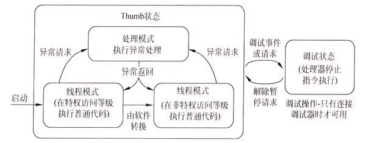
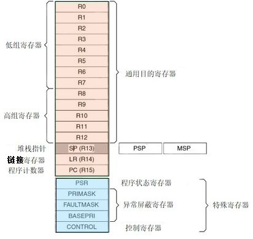

第一步：看完ppt并摘录出有用内容

第二步：给书写个索引

1、《STM32参考手册》：ST官方发布的权威技术文档，详细描述STM32系列芯片的寄存器定义、外设功能（如GPIO、USART、ADC等）、时钟管理、中断机制等核心技术。

2、《Cortex-M3权威指南》 宋岩译：补充STM32参考手册对CM3内核的简略描述，详细解析Cortex-M3架构的异常处理、内存模型、指令集等底层原理。

3、《STM32库函数手册》：ST官方提供的标准外设库（SPL）或HAL库的API文档，指导开发者通过库函数快速开发应用。

4、《Cortex-M3与M4权威指南》：介绍M4架构，有简单例子，没有专门对STM32的介绍。

5、《STM32F4xx参考手册》：参考手册是 RM0090，面向应用开发人员，提供了关于使用 STM32F4 系列微控制器的信息，介绍ST32的内部资源、寄存器描述等，没有实际案例。

6、《STM32F407ZGT6》：芯片的数据手册

## 一、概论

嵌入式系统结构

嵌入式微处理器组成：内核（处理器的核心）、片内存储资源、片内集成外设、电源、封装形式。

操作系统主要功能：处理机管理（包括进程管理、进程同步、进程通信、进程调度）、存储器管理/内存管理（包括内存分配、内存保护、地址映射、内存扩充）、设备管理/外设管理、文件管理（管理用户文件和系统文件）、提供用户接口（包括程序接口API和用户接口GUI）

嵌入式操作系统分为实时嵌入式系统和非实时嵌入式系统，实时又分硬实时和软实时，在操作系统设计时实现。硬实时要求在规定时间内必须完成操作，否则程序运行失败；软实时按照任务优先级尽可能快地完成操作，错过时间只会降低系统吞吐量，性能降低。

交叉编译：一个平台上的编译工具编译出在另一种处理器架构上运行的程序。例如：运行在X86处理器上的编译链接工具产生在 ARM平台上运行的二进制代码。交叉调试：通过通信通道在开发主机上调试目标平台上的程序。

## 二、微处理器体系架构

按存储器结构分为冯诺尼曼结构和哈佛结构。按指令集类型分为CISC复杂指令集计算机和RISC精简指令集计算机。按嵌入式微处理器类型分为嵌入式微控制器、嵌入式微处理器、数字信号处理器、嵌入式片上系统、RISC-V架构计算机、人工智能芯片、多核处理器。

ARM公司设计ARM系列RISC处理器内核，本身不生产芯片，授权内核给生产和销售半导体的合作伙伴。

以Cortex-M4的内核为例，有线程模式和处理模式两种操作模式，软件有用户级和特权级两种执行方式。线程模式执行普通的应用程序代码，处理模式执行异常处理；处理模式始终为特权访问，线程模式有特权访问和用户访问。系统复位时处理器进入线程模式，异常返回时处理器进入线程模式，特权和用户代码能够在线程模式下运行；出现异常时进入处理模式，处理模式中所有代码都是特权访问的。处理模式始终使用MSP，线程模式可用MSP和PSP。
有调试状态和Thumb两种状态。

CM4架构包括16个核心寄存器，通用寄存器用于数据操作，分低组寄存器和高组寄存器，低组寄存器可被所有访问通用寄存器的指令访问，高组寄存器可被指定通用寄存器的所有32位指令访问，不能被16位访问。堆栈指针分为主栈指针MSP和进程栈指针PSP。MSP是默认的，用于操作系统内核，异常服务例程以及所有特权级访问的应用程序使用，可用于线程模式和处理模式，复位后或处理模式时使用；PSP用于常规的应用系统中，只用于线程模式，不需要才做系统则没必要用PSP。

堆栈在满递减模式下，总是4字节对齐的。堆栈为LIFO进行存取的存储区，堆栈寻址是隐含的，使用堆栈指针SP指向栈顶，有递增堆栈和递减堆栈两种。堆栈指针指向最后压入的堆栈的有效数据项，称为满堆栈；堆栈指针指向下一 个待压入数据的空位置，称为空堆栈。两两组合有满递增、空递增、满递减、空递减四种模式。

堆栈是按字操作的，每次入栈和出栈都是32位（32位处理器，32就是字长），SP值+4或-4
