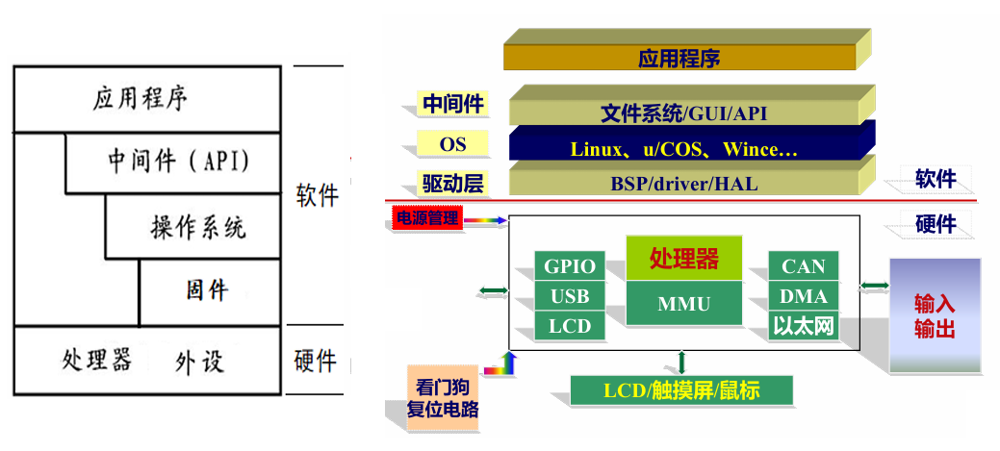
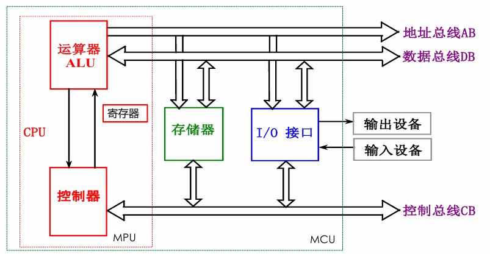

1、《STM32参考手册》：ST官方发布的权威技术文档，详细描述STM32系列芯片的寄存器定义、外设功能（如GPIO、USART、ADC等）、时钟管理、中断机制等核心技术。

2、《Cortex-M3权威指南》 宋岩译：补充STM32参考手册对CM3内核的简略描述，详细解析Cortex-M3架构的异常处理、内存模型、指令集等底层原理。

3、《STM32库函数手册》：ST官方提供的标准外设库（SPL）或HAL库的API文档，指导开发者通过库函数快速开发应用。

4、《Cortex-M3与M4权威指南》：介绍M4架构，有简单例子，没有专门对STM32的介绍。

5、《STM32F4xx参考手册》：参考手册是 RM0090，面向应用开发人员，提供了关于使用 STM32F4 系列微控制器的信息，介绍ST32的内部资源、寄存器描述等，没有实际案例。

6、《STM32F407ZGT6》：芯片的数据手册

## 一、概论

嵌入式系统结构

嵌入式微处理器组成：内核（处理器的核心）、片内存储资源、片内集成外设、电源、封装形式。

操作系统主要功能：处理机管理（包括进程管理、进程同步、进程通信、进程调度）、存储器管理/内存管理（包括内存分配、内存保护、地址映射、内存扩充）、设备管理/外设管理、文件管理（管理用户文件和系统文件）、提供用户接口（包括程序接口API和用户接口GUI）

嵌入式操作系统分为实时嵌入式系统和非实时嵌入式系统，实时又分硬实时和软实时，在操作系统设计时实现。硬实时要求在规定时间内必须完成操作，否则程序运行失败；软实时按照任务优先级尽可能快地完成操作，错过时间只会降低系统吞吐量，性能降低。

交叉编译：一个平台上的编译工具编译出在另一种处理器架构上运行的程序。例如：运行在X86处理器上的编译链接工具产生在 ARM平台上运行的二进制代码。交叉调试：通过通信通道在开发主机上调试目标平台上的程序。

## 二、微处理器体系架构

根据

基本结构

