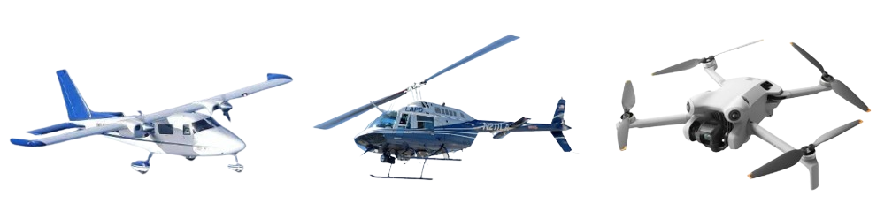
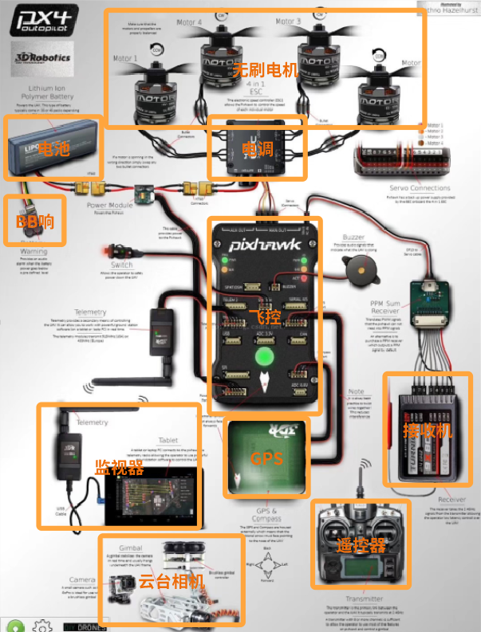
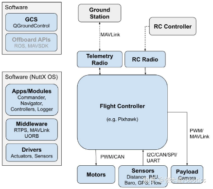
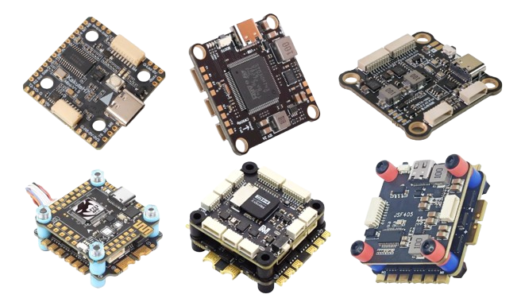
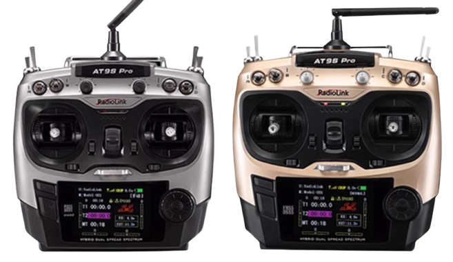

## 概述

常见的小型飞行器主要分为固定翼飞行器、单旋翼直升机和多旋翼飞行器三类。固定翼飞行器的升力由机体线速度产生，不能垂直升降，结构简单，续航较长。旋翼飞行器的升力直接由螺旋桨提供，可以垂直升降；直升机通过总距操纵改变所有桨叶的几何迎角，控制直升机的垂直升降；通过周期变距操纵周期性改变各桨叶的迎角，产生不对称升力，控制直升机的前后左右倾斜和水平飞行方向。多旋翼飞行器结构对称，螺旋桨之间的反扭距可以相互抵消，通过多个螺旋桨产生拉力和三轴力矩（yaw/pitch/roll）。穿越机是轴距 330mm 以下的四旋翼的统称，轴距即多旋翼飞行器对角线的长度。

DIY 一架多旋翼飞行器涉及的工程技术包括：地面站或遥控器与飞行器远距离通信、机载嵌入式处理器设计、实时操作系统的软件运行环境和接口提供、飞行控制算法、飞行器结构设计、多传感器数据融合和状态估计等。

## 硬件组成详解

多旋翼飞行器的硬件组成包括自驾仪系统（自驾仪、GPS 接收机）、动力系统（电机、电调、电池、螺旋桨）、遥控系统（遥控器、接收机）、机架系统（机身、机臂、起落架）。其中，电机电调电池、遥控器和接收机，在RC遥控车的开发中也是核心部件，在原理、参数和选型上相通。

### 飞控／自驾仪

飞控即飞行控制器，硬件上就是一块嵌入式板卡，烧入写好的固件程序之后，负责运行飞控算法，实现接受遥控指令和传感器反馈输入，并输出电机推力的控制信号的功能。飞控算法包括从传感器数据采集、姿态估计、导航到控制输出的整套模块。

由于对实时性要求高，飞控上一般会运行 RTOS（实时操作系统），如著名的开源飞控软件 PX4 就运行在轻量级 RTOS Nuttx 上。飞控和四合一电调用减震柱叠起来称为飞塔，也有的将两者集成在一块 PCB 上称为 aio（all in one）。科研无人机除飞控外，还会配备机载电脑作为算力平台，可提供诸如物体规避和碰撞预防等高级功能。两个系统通过快速串行或 IP 链路连接，通常使用 MAVLink 协议进行通信。

飞控板卡一般内置 IMU、气压计、磁罗盘（分别用于获得加速度、高度和朝向信息），有 I2C、UART、CAN、GPS 等接口。电机的配套电调（esc）连接到 PWM 输出；外置传感器（GPS，指南针，距离传感器，气压计，光流计，气压计等）通过 I2C, SPI, CAN, UART 等连接接。有的飞控处理器分 FMU （飞行管理单元）处理器和 IO 处理器，前者为高性能处理器，专用于运行实时飞控算法，相应的 PWM 信号输出专用于控制核心动力系统或高精度执行器；后者为处理传感器输入和 PWM 输出的协处理器，相应的 PWM 输出用于控制舵机等非核心设备。

飞控的关键参数和接口包括：

- MCU 看主频和接口资源，主流的主控芯片包括 STM 系列的 F411（小尺寸飞机用，逐渐淘汰）、F405、F722、H745 或更高。也有国产的 AT32 系列，如重山航空的飞控。
- Uart 为串口数量，有多少串口就可以外接多少设备。
- Gyro 为陀螺仪型号，最经典的是 MPU6000（已停产），目前主流为 BM270 和 42688。
- Receiver 为飞控支持的接收机协议。
- ESC signal 为支持的电调数量，即最多能控制多少电机。
- Input 为支持的最大电池电压。
- software 为飞控支持的固件。

其它辅助参数和接口还有：

- BEC 为降压模块。
- OSD 为处理画面参数用的芯片型号。
- 黑匣子用于存储飞机的各种参数，主要是存储飞行日志便于调试。
- BF LED 为传统的通过地面站设置 LED。
- wifi 是指支持无线调参还是必须使用 usb 线。
- VTX switch 是用遥控器关闭图传。
- TVS Protection 为防浪涌保护。
- Mounting 为安装孔位。
- VCC 焊盘是未经过 BEC 降压的原始电压。

### 遥控器和接收机

遥控系统将摇杆控制量发送给接收机，接收机处理后根据协议再发送给飞控。遥控器和接收机的通信使用无线传输技术，主流频段为 2.4GHz ISM。ISM 频段（Industrial, Scientific and Medical Band）是国际电信联盟（ITU）划分的免费开放频段。此外也有 72MHz的工作频段，2.4GHz 的遥控距离更远、抗干扰能力更强，但绕射能力较差；72MHz 反之。

专用的模型（航模车模船模）遥控器有多个通道，通道是独立控制信号的传输路径，每个通道对应飞行器的一个可控维度（如油门、方向、姿态等），简称几通。基本的控制通道包括油门（控制飞机垂直升降）、升降（俯仰）、方向（偏航）、副翼（横滚），其余为自定义通道，可用于控制灯光、拉烟器、起落架等部件。

接收机通过单条总线输出所有通道对应的 PWM 信号，脉宽一般在 1000us-2000us，可用于直接控制舵机、电调或输入飞控的 PWM 接口。接收机和飞控之间的通信协议常见有 PPM、SBUS 等。PPM 为脉冲位置调制，原理为将多个通道的控制信号编码为单一串行脉冲信号，每个脉冲的间隔对应不同通道的数值。PPM 结构简单成本低、抗干扰性较差，支持通道数一般小于 10。SBUS 为智能总线协议，基于 UART 将多通道信号编码为数字数据流，通过差分信号传输。SBUS 支持双向通信、有纠错机制、抗干扰性强、通道数灵活，适合长距离高干扰环境。其它的常见协议还有 CRSF、TBS、DSM、IBUS 等。

目前主流的专用遥控器品牌有天地飞、乐迪、RadioMaster等。遥控器内一般会配备接收机，但不一定与选用的飞控兼容，可能需要单独选配接收机。

### 电机

电机：使用 2306 规格的五寸电机，kv 值 2400 左右（kv 值的含义：空载转速=kv 值乘以电压）；可选 T-Motor 的 F60 系列，乘风系列，致盈动力，银燕，双飞等都可；2400 左右的 kv 值适配 4s 电池。

电机品牌：T-motor

航模类电机主要用的是外转子的无刷电机，常用 1106、2204、2207、2306 等，前两位代表电机直径、后两位代表电机长度；电机尺寸越大，能提供的转速越大，相应的升力也就越大（F=kv2）带动的飞机的重量就越大。三寸机选择 1106，五寸机选 2204、2207、2306；

交流电机由于有交流电产生旋转磁场，可以进行电子换向，通常都是无刷的。BLDC（无刷直流电机）和 PMSM（永磁同步电机）都是同步电机，转子与磁场转速严格相等。BLDC 通常采用方波驱动（六步换向），成本低，适合高速场景（如无人机）。PMSM 采用正弦波驱动（FOC），转矩更平滑，适合精密控制（如工业机器人和电动汽车）。目前多数无人机电调仍采用 六步换向（方波驱动），因其计算量小、响应快。

FOC 的优势：转矩平滑，噪音低，效率高（尤其在低速时）。适合需要精密控制的应用（如云台电机、工业伺服）。FOC 的缺点：依赖高精度电流采样和高速 MCU，成本较高。算法复杂，对实时性要求极高。

有刷直流电机线圈旋转磁体不动，无刷直流电机线圈不动磁体旋转。

BLDC 分内转子和外转子，内转子电机的转子在内部旋转，外壳不动，转速更大；外转子电机外壳旋转内部不动，扭矩更大。大多数应用使用外转子电机。

电机分定子套（带轴承）和转子套（带轴）；编号指的是定子尺寸。kv 值为每增加 1V 电压所增加的 rpm 转速；铜线匝数越多 kv 越低，反之亦然。定子体积决定定子扭矩$$T=Fr=\frac{B^{2}\pi r^{2} h}{\mu_{0}}$$，同 kv 值下体积越小扭矩越大。'

$$
\begin{aligned}
\dot{\omega}&=\frac{T_{\text{res}}}{M} \quad T_\text{res}为反扭矩，M为转动惯量\\
M&=\rho 2\pi rht r^{2} \quad \rho为磁铁和磁通环密度，h为圆柱壳厚度
\end{aligned}
$$

相同体积下，高瘦的电机更省电、反应更灵敏，散热较差；宽扁的电机反之。多大的桨叶对应选择多大体积的定子。选择电机优先考虑尺寸，其次考虑 kv 值。低 kv 在低转速下能产生更大的扭矩焦耳损耗更小，高 kv 电机能达到更高的转速。低转速的能耗更小焦耳损耗较大；高转速反之。随着油门的增加，力效变低。力效为拉力与功率的比值，反映了电机产出拉力的效率，数值越大效率越高。平稳飞行的飞机选低 kv，竞速飞机选高 kv。另外，选 kv 值需要考虑电池的放电能力，也就是 C 数。C 数乘以容量为电流。轴径有 1.5mm 和 5mm 之分，和桨叶搭配时要注意。

电机：

4 位数型号：电机直径 + 不含输出轴的长度；3 位数型号代表一种序列号

电机体型和极速、扭矩的关系：体型相近的情况下，越瘦长极速越大，越矮胖扭矩越大

无刷电机 KV 值：空载下每增加一伏电压所增加的每分钟转速，KV 值高表示高速小扭矩，KV 值低表示低速大扭矩。

动力选择是指电机是几 S 的，动力选择需要匹配车架强度

电机要注意散热，过热的电机效率会显著降低，且容易使得内部的永磁体超过居里点而对其磁性产生永久不可逆的影响。可以加散热风扇或使用硅脂导热到金属底盘上

有刷电机有两根出线，可以不通过电调直接驱动，调速需要使用电调。优点是结构简单便宜，直流电压控制速度变速顺滑平稳，低速线性好，启动扭矩大，缺点是有有刷损耗，噪声较大，最大转速相对较小。有刷电机 t 数越大线越细,电压越高电流越小。

无刷电机换向通过控制器中的控制电路来完成，采用电子换向，分为有感无刷和无感无刷，有感无刷靠霍尔传感器加控制器来检测转子永磁体位置，无感无刷可以通过反电动势和脉冲定位法来检测转子位置。优点是无碳刷，除了轴承外免维护，噪音小，运行效率高，同尺寸下功率相对大，散热性能好。无感无刷缺点是低速和满负载时启动线性较差，启动时电机容易抖动，因为难以确定转子位置，且启动扭矩小。有感无刷没有上述缺点，但防水性能差。无感无刷就是没有霍尔传感器的无刷电机，三根出线与电调连接。无感无刷通过脉冲定位法。有感无刷的感即指霍尔传感器，有感无刷的最大优点就是可以保证极低的转速并同时保有大扭矩，高速性能也强于有刷电机和无感无刷电机，尤其是带 FOC 的，但就是价格贵，以及相对较重。无刷电机 kv 值越小线越细，绕的圈数越多，电压越高电流越小。无刷电机调速过程中电压不变，靠调节输出电流占空比（PWM）来调速。无感无刷电机是一种三相同步电机，更换相序可使电机反转。

内转子电机的轴连着线圈转，外壳不转；外转子电机里面的线圈不转外壳转。外转子电机转动时力臂较长整体扭矩较大，控制细腻但由于转动惯量大故极速相对低，低速线性好，动力水平相同是重量相对轻。缺点是不防水不防尘不耐脏。

电机的 T 数：转子线圈圈数，影响电机速度和扭矩，T 数大绕组越多，同等尺寸下线越细，电流越小，扭矩越小。绕制所用铜线越粗扭矩越大。攀爬车兼顾速度和扭力的最佳范围在 25~30T。电机槽孔指的是用于安置绕组的凹凸处，槽数越多负载能力越强扭矩越大转速越低.

kv 值和 T 数影响电阻 R，kv 越大 T 数越小电阻越小电流越大。

电机的说明书或选配表上会说多少 kv 多少 t 对应电池的电压和电流（几 s 的电池），对转速和扭矩的影响？

### 电调

电调：需要额定电流 35A 以上，需支持 Dshot 协议；分四合一电调和分体电调，课程使用分体电调

电调品牌：好盈、银燕、T-motor

电调有四合一电调和分体电调，穿越机的电调从 12A 到 55A 不等，这个数值代表能持续通过的最大电流。根据电机功率和电池电机计算电流并选择电调，可大不可小。

BLHeil32 是专为无刷电调设计的开源固件，针对 32 位微控制器（STM32、CW32）作为优化，支持更高的 PWM 频率，具备自适应进角、双向 DShot 协议、动态刹车等，通过更精细的换向算法降低电机损耗。

无刷电调（ESC）的核心功能是 将直流电转换为三相交流电，驱动无刷电机，具体环节包括电源输入滤波、MOSFET 三相全桥逆变、PWM/DShot 信号解码为电机目标转速、霍尔传感器或无感测反电势检测转子位置，触发 MOSFET 开关进行换向控制、过流过温低压保护等。输出信号为 PWM 调制的三相方波或正弦波，因为 BLDC 没有电刷作为机械换向器，需要逆变器作为电子换向器产生旋转磁场，故定子线圈通过交变磁场驱动永磁体转子旋转。涉及的算法步骤包括六步换向、FOC、PWM 占空比调节。三相交流电旋转磁场方向由相序决定、调换任意两相线会改变磁场旋转方向。飞控通过 DShot 数字协议发送目标转速信号，电调调节 PWM 占空比以匹配目标。电池决定电池电压，负载需求决定电流，电调需保证电流不超过额定值。

控制逻辑为：由飞控根据飞行器位姿信息和遥控给定的控制量得出每个电机的期望转速，由算法计算出输出 PWM 的占空比，电调输出对应的等效直流电压，电压通过电流作用到电机上。n = u\*kV，使电机产生相应的转速，转速产生相应的反电势，由当前电压和阻抗得到电流，电流产生电磁转矩，与负载转矩平衡，是一个动态调节平衡的过程。PWM 脉宽越宽，MOSFET 导通时间越长，相应的等效电压越高。飞控通过 PWM 或 DShot 控制电调的输出电压（调节直流母线电压的占空比），改变电机转速。电流受限于电调最大电流规格，超过阈值时触发电调保护。

电调中，电流的检测有传感器检测或无感检测两种思路。

无感检测即无需额外传感器，利用现有电调硬件（如母线采样电路）和算法实现电流估算，适用于低成本、小体积的应用（如无人机、模型车电调）。在特定 PWM 开关状态下，母线电流直接等于某一相电流（母线是直流电源的正负极线路）。利用这一原理，通过采样母线电压并结合当前 PWM 开关状态即可重构三相电流。电流重构算法有 Clark 变换和 Park 变换，滑模观测器或扩展卡尔曼滤波器。

除了传统的 PWM 控制输出电压，现代高性能电调主要采用 FOC 和 DTC（直接转矩控制）两种控制策略

典型的电调板包括 MCU（运行换向算法、协议解码等）、三相全桥、MOSFET 驱动芯片（放大 MCU 的 PWM 信号以驱动 MOSFET）、电源模块（降压后为 MCU 供电）、电流采样（采样电阻、运放等）

DShot 为取代传动 PWM 模拟信号的数字通信协议，将油门值编码为 16 位数字信号（如 DShot600=600kbps），通过高低电平脉宽表示 0/1。DShot 后面的数字代表协议传输速率

自适应进角的作用是根据转速动态调整换向时机，补偿电机电感延迟，提升效率。比如在高速时提前触发 MOSFET 导通（进角增大），确保电流峰值与转子磁场最佳对齐。无刷电机在高速旋转时，反电动势（EMF）会导致实际换相时刻滞后于理想时刻，降低效率。自适应进角功能通过动态调整换相提前角（即 “进角”），补偿反电动势的影响，确保在不同转速下电机都能保持高效运行。自适应进角可以提升高速下的电机扭矩和效率，减少发热，尤其适合高 KV 值电机（如 2550KV）在高转速场景的应用。

固件是写入硬件设备非易失性存储器（如 Flash）中的底层软件，介于硬件和上层软件之间，负责直接控制硬件行为。例如，电调的固件决定了如何解析飞控指令、如何控制 MOSFET 开关时序等。

电调全程电子调速器，是针对无刷电机的概念，核心功能是电子换向；有刷直流电机只需简单的 H 桥切换电流方向，一般称电机驱动模块；步进电机有专门的驱动器；交流电机使用变频器调节频率和电压。

电调主要参数包括：CURR 为电流计信号口，Telemetry 为电调遥测数据回传接口，然后是额定输出电流和峰值输出电流（均指单个电机的电流）。PWM 频率为电调刷新频率。

RC 电调：电子调速器，分为有刷电调和无刷电调两种，无刷又分为有刷有感和无刷有感，还可以分为单相电调和双向电调，车模通常都是双向电调，航模通常都是单向电调。

有刷电调通过电压升降的方式调速，无刷电调通过输出电流矩形波的占空比调速；还有一种是 AM32 电调，是用开源的电路板刷自制的程序实现无刷的功能，整体较小。

电调的安培数：室温下电调能持续输出电流的能力，决定了能带的动多大的电机。想啊选择顺序是先电机再电调最后电池，放电电流依次大于等于即可，建议稍大于（1.2 倍左右）避免持续的峰值工况。对于电池电压，电调上一般会标注推荐的电压，电压过低电调不会启动，过高在没有超压保护的情况下可能会烧掉电调。有的电调带有堵转保护和高温保护。

有的电调内部含有降压模块并引出一路低压输出称为 BEC 输出，给其它低压设备供电。BEC 输出不受电池电压影响。有的还含有高压 BEC 输出，主要用于提升舵机性能（有的舵机性能在低压和高压供电下有显著差别）

电调烧掉由过热引起，堵转、电机电调不匹配（电机要求大于电调提供）、超过标称电压的电池、环境温度过高等都会烧电调。

### 电池

电池品牌：格氏

电池用的都是由放电能力很强的电芯组成的锂聚合物电池，几 S 代表几片电芯串联，一片标准电芯的电压值为 3.7V（3.6-4.2V），储存电压为 3.85V。C 数代表放电能力，越大越好；穿越机需要 45C 以上的电池

电池的电压（如 15.33V）是它提供的“电势差”，类似于水压——电压越高，推动电流的能力越强。但电机本身并不会“要求”某个固定电压 ，而是根据负载（油门指令）调整所需的电流。

电池：电池不要过放过充，有严重的不可逆损害。电池电压需要充放到一个合适长时间储存的值，需要注意选一个好点的充电器，不然有可能造成电池电压充歪了或者判定失误导致一片电芯充电的压差较大。LiPO 电池一般充到 3.9V 单片电芯。3.8V 可能会有自放电，3.8-3.85V 短时间存储没问题。

高压电池 LiHv、18650、21700、电包也是 3.9V

高压电池标有 hv4.35V，因为材料不用，比常规 4.2V 锂电池更小更轻。放电截止电压为单节电芯负载不低于 3.5V，储存电压 3.85V 左右。储存期间三个月充放电一次。理论上讲，高压锂电池对的容量可提升 10%-15%，使用时需要确保电池总电压在设备额定电压以下。

充电电流越大，对电池越不好。以 1500mah，最大 5C 充电为例，最大支持的充电电流为 7.5A

航模电池为了追求更大的放电倍率，不同于一般的锂电池，往往没有任何保护电路。穿越机电池上有两个插口，分别是供电口和平衡头。锂聚合物电池采用固态电解质，不需要硬质外壳保护，电芯能做成各种尺寸和容量。一个电芯的额定电压为 3.7V；将几块电池串联起来可以达到更高的电压。S 数就是串联电芯的数量。单个电芯电压需要控制在 3.5-4.2V 之间。平衡头的数量可以让充电器知道电芯数量并可以分别检测每个电芯电压，充电时可以动态调整。平衡头导线较细，只用于充电。电池上会标注最大放电电流（放电倍率 C），充电倍率会小于放电倍率。

平衡充电器的原理是通过供电口输入大电流，再通过平衡充调整电芯间的压差；充电时要将供电口和平衡头同时接上，后选择对应的电池种类、电压和电流。平衡充有经典便宜的 B6AC（注意正版 SKYRC），也有智能高级的 Hota ISDT ToolkitRC。需要确定充电器是内置电源还是需要额外电源。很多充电器需要配备额外的直流开关电源来供电。开关电源只推荐有电工经验的使用，注意接线方式。可以通过并充板同时充多块电池，但充电器只能测到并联电芯的平均电压，且注意并充电池的电芯数量必须完全一致，否则总电压无法统一。注意平衡头不要错位，否则直接短路烧毁。并充的单块电池不能存在短路或损坏的情况，否则引起短路放电。每块电池压差不能太大，否则相互放电电流过大也有过热的风险。外场电包通常为磷酸铁锂电池 LiFe，优势是安全性高，配备一个 xt60 和一个平衡头。磷酸铁锂电池电压为 3.2V，充满电压为 3.65V。电包将电芯先并后串，在保证电压的前提下提高放电效率。电池不能在无人值守的情况下充电。

过放指单个电芯电压低于 3V（高压电池 3.2V），过放的情况下，电芯电压低于平衡充电器识别阈值，如果不是多次过放，可以用平衡充的镍氢电池进行强制充电，充到单电芯电压 3V，可以被识别了，换成锂电池平衡充的模式。（注意镍氢电池没有放过充的功能，充到可以识别之后一定要换成平衡充）。低压保护建议设置在 3.5-3.6V。

串联提升电压、并联增加容量。几 S 几 P，如果一组电芯是由单片电芯组成，就称之为 1P。如果组成这个 1S 电芯，是由两块单片电芯并联增容而成的，就叫 2P。

理论上，充电倍率在，但实际上正规的电池都支持 5A 的充电。不用存储时，单个电池电压在 3.8-3.9V 之间，否则电池容易鼓包，影响寿命甚至报废。

B6AC 是内置电源的 B6。

电包：慢放电的、大容量的、专门给飞机充电的充电宝。还要注意电压电包和充电器支持电压匹配，否则可能烧毁。先要找场景，然后定制化人性机器人。

电池内原理外侧电子数量决定电池容量，想要抛弃外层电子的倾向决定电压。比能量即能量密度，是物质能提供的能量和本身质量的比值。过充或过放会对集流体的金属（正极铝箔负极铜箔）产生一些不良反应，过充负极析出锂，过放正极析出铜，产生的锂枝晶或铜枝晶可能刺穿隔膜导致电池内部短路，引起一系列的产气反应甚至是电池的热失控和爆炸。锂电池中核心反应就是氧化还原反应和嵌入脱嵌反应。

电池容量：在一定电流下用多少时间可以放完电；电池电压：标准锂电单节电芯的标准电势电压为 3.7V，实际充电最高可充电到 4.2V，最低可放电到 3.0V，但一般 3.6V 以下电池就仅剩 10%的容量了。2S=7.4V，3S=11.1V，6S=22.2V。串联增大电压，并联增加容量，几 S 表示电池是由几个标准电芯串联而成的，几 P 表示有几个标准电池并联增容而成的。如：3S2P 的 5000mah 电池表示由两片 2500mah 的电池先并联增容成 5000mah 的 1S 电池后再将三块这样的电池组串联得到。对于电池而言，参与反应的构件越小出问题的概率越小，即 P 数越小稳定性越好。

放电倍率（C 数）：如 40C 表示电池可以在它容量的 40 倍的电流下放电，这个最大放电电流要跟电机电调相匹配才能发挥最大效果。充电 C 数有限制。

呼吸效应：电池的嵌入脱嵌反应相对电流的速度是滞后的，另外也指电池内部存在微量的气体产生和消失。电池内阻越低，放电效率越高。不良的使用会增加电池内阻。

电池的插头种类和使适用范围：常见的插头种类有 JST、T 插、XT30/60/90、EC5、田宫。不同的插头匹配不同的电流强度，从低到高分别是 JST、T 插、XT60、XT90 等，使用转接头是要注意转接头的电流承受能力。电池平衡头的平衡线用于确保电池中的每一个 1S 电池单体的充放状态一致，避免不平衡造成对电池的损失。平衡线有公共的负极，每一个 1S 电池有一根正极。

电池在长期不用的前提下，负极的 SEI 膜会发生溶解和二次沉积，致密程度降低，使得电解液和负极材料直接接触，电解液和负极材料中的锂离子发生产气反应。大 C 数的电池由于充放电倍率高，内部化学反应更剧烈，离子迁移速度更快，更容易发生产气和析晶反应。长期满电或亏电保存也会导致和过充过放类似的危害。长期保存时建议把电池电压保存在 3.85V，电量保持在 50%左右，内部锂离子和电解液浓度相对平衡，一般的电池在使用后建议 1~2 天内将电压充回保持电压，大 C（100C 以上）建议满电或亏电时间不要超过 24h。长期不使用的电池再次使用后建议经过一个充放电循环后再去储存电压保存。充放电可以保养 SEI 膜。使用后断开电池插头防止自放电，因为电容不受开关控制。B6AC 等带有镍铬模式修复充电的充电器可以救回因过放而不能使用的电池。

电池外部有热塑膜包覆，起到防尘和保护的作用。

评价电池好坏：充放电后每块电芯其电压的一致性，优秀的电池能做到 0.01V 级的压差。实际充放电的容量是否符合标称容量，从 3.6V 到 4.2V 能充进多少电量，和标称容量相差多少，一般能充电到标称容量的 90%及以上。充满电后保持状态，静置的自放电率，优秀的电池自放电率每个月在 1%到 2%。测试电池内阻（测欧姆内阻，不用管极化内阻），优秀电池单片电芯内阻在 1~2mΩ，4mΩ 属于正常，6mΩ 属于偏高，10mΩ 则较差。内阻在一定程度上受使用温度和充电电量的影响，充电器端测试出的内阻仅供参考。

## 机械结构设计

## 飞行控制器设计

## 主流研究点

## 相关概念

舵面是在气流中利用偏转而产生平衡力和控制力来操纵飞行的气动翼面 ，也叫操纵面。按功能分为升降舵、方向舵和副翼（分别控制 roll、pitch、yaw）。舵面是固定翼中的概念，主操作舵面包括副翼、升降舵和方向舵，辅助操作舵面包括襟翼、缝翼和调整片。多旋翼飞机通常没有像固定翼飞机那样传统意义基于气动力的舵面，主要靠各旋翼的转速差来控制飞行姿态和运动。

推重比是指飞行器单个电机或整体产生的推力 （Thrust）与其自身重量 （Weight）的比值，通常用 “推力/重量” 表示。它是衡量飞行器动力性能的核心参数，直接影响机动性、悬停能力和载重潜力。显然，推重比大于等于 1，飞行器才能悬停。高 KV 电机配小桨（高转速，适合竞速）。低 KV 电机配大桨（高推力，适合载重）。

## 杂记

功能、参数和接口、相关、选购

安装各个软件平台，PX4 固件及其编译，防短路和防反接

RC遥控车中的电机

图传品牌：黑羊、tank

图传系统由摄像头、发射机、地面接收端三部分构成。主要用 5.8GHz 的频段发送。新手一般用 200mw-600mw 功率的图传。发射与接受天线是影响接受距离的主要因素，涉及射频的知识。

FPV 眼镜、电子取景器，运动相机(不接入图传系统)，模拟图传、数字图传

科研无人机：去掉云台相机和 GPS，但需要搭载其它专业传感器

机架主要有碳纤维板材构成，强度高重量轻，以轴距标注尺寸。120、135、145 为三寸机；215、250 为五寸机

桨叶后的四位数字，前两位代表尺寸（60 表示 6 寸）、后两位代表螺距；要根据电机和机架的尺寸来匹配，三寸机用三寸以下的桨叶；五寸机用五寸或六寸的桨叶。桨叶是最大的消耗品。

DFU 劫持是指在设备进入 DFU（Device Firmware Upgrade，设备固件升级）模式时，由于某些外接设备的干扰，导致设备的引导加载程序将加载固件的重点从原本预期的端口（如 USB）转移到其他串口外设端口的现象。

OSD 是 “On Screen Display” 的缩写，即屏幕菜单式调节方式 2。它是一种在屏显示技术，核心是在图像上叠加文字、鼠标、简单的图片等，使显示屏幕为用户提供更多的附加信息。

穿越机接收机 ELRS 或黑羊使用的是 CRSF 协议

机架设计、电调设计、升/降压模块制作、电源制作

机载电脑：使用 intel-NUC（可以考虑拆外壳减重），其它的要么算力有限，要么由于芯片短缺溢价严重。常见的有树莓派、Jetson Nano、Jetson Orin、Jetson Xavier NX（稀有）、大疆妙算（稀有）。

舵机：舵机是一个带角度传感器和控制板的直流电机。给舵机通电时，pwm 信号控制内部的直流电机旋转。舵机内一般含有四组减速齿轮，顶部的花键齿轮连接舵机臂。舵机内部有电位器用于检测角度用作反馈（电位器转轴固定在输出轴上）。舵机按照齿轮分为标准舵机、短身舵机、大舵机和微型舵机。按照控制信号分为数字舵机和模拟舵机，数字舵机的控制频率更高精度更高更贵，模拟舵机控制频率低（50Hz，精度更低更便宜）。金属的外壳和金属上盖是很有必要的选择。舵机内的电机将细铜线缠绕成极细的中空圆柱体，形成一个极轻的无极中空转子并将磁铁置于圆柱体内，形成空心杯马达。标准舵机基本用的是无刷电机，体积较大，微型舵机用的是便宜的铁芯电机，高性能的电机用的是空心杯电机。

舵机齿轮的材质强度有碳钢、合金钢、铜等非常多选择，加工工艺和热加工方式也多种多样，以应对不同工况。塑料齿轮相应速度快扭矩要求小，齿轮强度低，便宜。黄铜齿轮强度中等重量最重响应速度最慢，价格便宜，由黄铜粉末烧结而成。钢制齿轮强度最高，重量中等，价格较贵。铝制齿轮强度次高，重量较轻响应速度快，价格较贵。齿轮的啮合存在缝隙，有小的虚位/空程。

舵机臂分为锥形、一字形和盘形，盘形用于控制差速锁的锁止，另外两种一段连接舵机输出轴，另一端连接转向拉杆。由于需要往复转动，舵机臂两端地固定孔位都需要适当进行螺丝胶的打取

数字舵机通过磁编码控制，模拟舵机通过电位器控制

## 参考资料

多旋翼飞行器设计与控制实践：https://rflysim.com/doc/zh/C/2.Multicopter_Practice.html?q=

Fast-Lab 无人机教程：https://www.shenlanxueyuan.com/course/730/task/29085/show

FPV 博主：https://www.youtube.com/@ChrisRosser/videos

PX4 自驾仪指南：https://docs.px4.io/main/zh/

PX4 系统架构：https://zhuanlan.zhihu.com/p/644265757

飞控接口解释：https://www.bilibili.com/video/BV1wV4y1X7W1/?vd_source=1d0891b41fe4e23dbf197eaf61dfa468

无刷电机原理和构造：https://www.bilibili.com/video/BV1bMVBzBECG/?vd_source=1d0891b41fe4e23dbf197eaf61dfa468

穿越机电机选择：https://www.bilibili.com/video/BV1Wk4y1i7i1/?vd_source=1d0891b41fe4e23dbf197eaf61dfa468

无刷电机和电调工作原理：https://www.yiboard.com/forum.php?mod=viewthread&tid=1214

锂电池平衡充使用：https://www.bilibili.com/video/BV1EP4y1473q/?vd_source=1d0891b41fe4e23dbf197eaf61dfa468

锂电池深度解析：https://www.bilibili.com/video/BV1pm41117ZN/?vd_source=1d0891b41fe4e23dbf197eaf61dfa468
