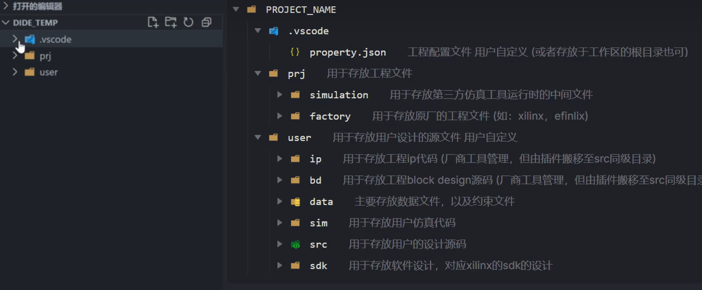

Alinx 7010为ARM-Cortex A9内核

PL端纯逻辑

---

## 学哪些东西

来自老石谈芯

编程语言：硬件描述语言HDL或寄存器传输语言RTL，高层次可以使用C或Python编程FPGA，主流的有Verilog、VHDL和SystemVerilog，先学Verilog（和C语言很像），后了解VHDL（需要能看懂）
三方面：语法，做设计，做验证
看一遍Verilog的语法
语法分为可综合的和不可综合的两部分，可综合是指这部分语言可以生成对应的硬件电路，也就十几条左右，不可综合的主要用于验证和仿真
Verilog刷题网站HDLbits
RTL设计有组合逻辑和时序逻辑两部分，以及状态机
RTL验证需要掌握如何写一个简单的测试平台和一些简单的测试用例
RTL最大的误区是用软件编程的思维思考硬件，硬件并行执行，需要想象对应的硬件电路
SystemVerilog是Verilog的超集，加入了很多Verilog不支持但很有用的功能

基础知识：专业基础课和FPGA专业知识，电路数电模电计算机体系结构，接口，数字信号处理
FPGA芯片结构，以及基本组成单元的结构（查找表，逻辑单元，逻辑块，DSP，存储器等），看FPGA官方文档

了解FPGA开发流程，知道为什么需要这些步骤以及每个步骤完成了什么功能

开发工具的使用，AMD的vivado和intel的quartus。熟悉常见IP的用法和配置（PLL，FIFO，存储器等），复杂IP如软核处理器NIOS，通信IP如以太网控制器，PCIE，DDR控制器等

硬件调试和时序分析的方法

进阶开发：设计验证和约束优化相关的技巧方法

信号的跨时钟域处理，这类问题的集大成者是FIFO尤其是异步FIFO的设计，推荐越大Cliff Cummings

一般不会从头写一个功能模块，但需要掌握其思维方式和设计习惯，这样才能根据需求去分析设计和实现，并得到最优化的结果

验证是比较复杂的领域，在一个芯片设计项目中，超过一半的时间会花在验证上，需要尽可能地检查到所有地设计功能和状态（功能覆盖率）。对于复杂功能，需要使用随机约束UVM或形式化方法来构建验证环境。芯片工程师分设计工程师和验证工程师

熟练掌握随机约束、参考模型建模、自动化测试、断言

FPGA的优化和约束，对时序、面积、功耗的约束和优化

另外还需要领域专用的知识，比如用于智能网卡需要掌握网卡相关的知识，比如使用FPGA进行高清视频处理

职业工作技能：Linux，至少一种脚本语言（Perl、Tcl、Mkefile、Python）、硬件测试，需要会看板卡的原理图，知道怎么写各种各样的约束，怎么使用板子上的各种资源

## VSCode开发FPGA：DIDE

## 小梅哥Xilinx FPGA入门

学习在电路板上实现相应的功能以及其中的调试方法

自己写代码、下载代码、使用厂家或第三方提供的IP核，如FIFO、RAM、ROM等

Verilog语法、FPGA常见设计方法

状态机、线性序列机

常见的通讯驱动和接口设计

开发流程：

设计定义（写一套硬件描述语言）

设计输入（编写逻辑/画逻辑图/使用IP核）

综合工具对逻辑描述内容进行分析并得到逻辑门级别的电路（由专业EDA完成，如Vivado、Quartus、ISE等）

功能仿真（功能仿真和时序仿真很重要）

验证功能

布局布线

分析性能（时序仿真、静态时序分析）

下载到目标板上

run implementation：实现设计综合网表（布局布线）

run behavioral simulation：功能仿真

`timescale 1ns/1ns	两个1ns分别代表时间单位和时间精度

例化：将模块的端口和测试平台上的接线连接起来

#是仿真延时，不会生成对应的电路

