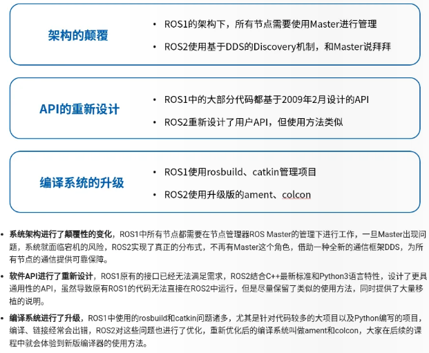
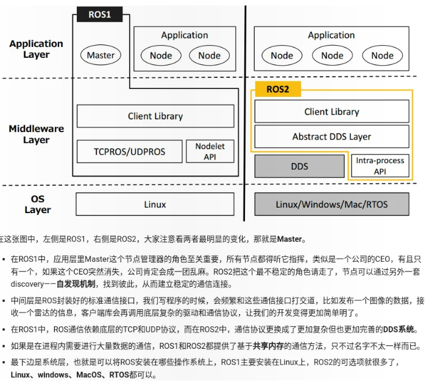
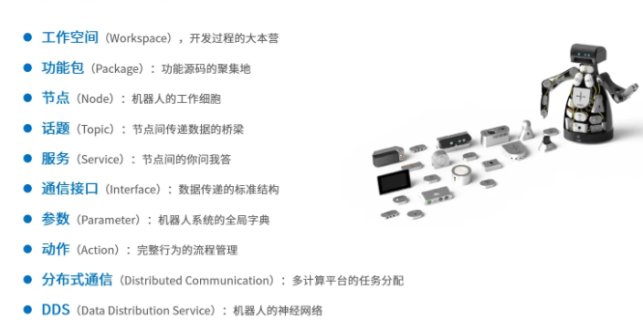
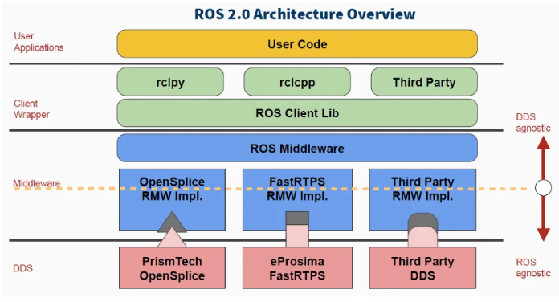
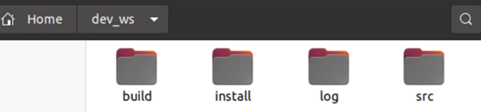
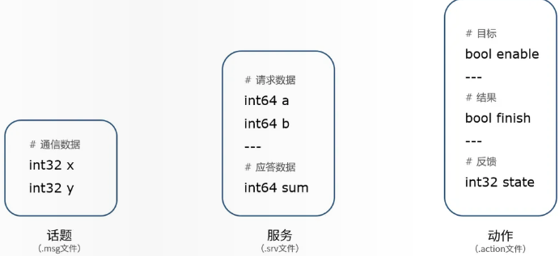
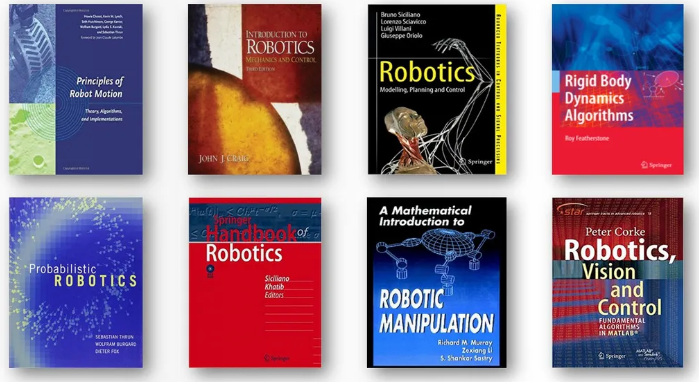

用 ROS 的原因是不用自己写 wifi 通信等等那一套中间件

## 概述

ROS = 通信机制 + 开发工具+ 应用功能 + 生态系统，目的是设计一套标准的机器人平台和其中的软件，提高机器人软件复用率，不要重复造轮子，高效开发机器人。

ROS1 针对的是有工作站级别运算平台、以有线连接为主保证网络连接、成本高昂的实验室机器人。与之相反的需求(在资源有限的嵌入式平台运行、在有干扰的地方保证通信可靠性、做成产品走向市场)便是 ROS1 面临的问题，类似问题的涌现致使 ROS2 诞生。ROS2 面向的需求有：多机器人系统、跨平台、实时性、网络连接安全可靠、产品化、设计开发调试测试部署等全流程的项目管理

ROS2 在借鉴 ROS1 成功经验的基础上，对系统架构和软件代码全部进行了重新设计和实现，是一个全新的机器人操作系统。ROS2 尽量保留了 ROS1 中的很多概念，便于开发者从 ROS1 迁移到 ROS2。ROS2 用到了更多面向对象的实现方法和语言特性，程序更具备可读性和可移植性，也会更接接近真实企业中机器人软件开发的过程。







### DDS 通信



DDS 是物联网中广泛应用的一种通信协议，是一个国际标准；实现这个标准的软件系统有很多，如 OpenSplice、FastRTPS 等；ROS2 中的中间件指定了标准的接口(如何发数据，如何收数据，数据的各种属性如何配置)，DDS 厂家要接入 ROS2 会按照中间件的标准写接口将自家的 DDS 移植到 ROS2 中。实际开发时，可以先用开源的 DDS 满足基本需求，部署交付的产品时再更换为商业版本更稳定的 DDS。这样就不用再纠结通信系统是否稳定、该如何优化等问题，更多精力可以专注于优化机器人应用功能。

### Linux 简介

Linux 是操作系统内核，并没有可视化界面，发行版就是给这个内核加上华丽的外衣，把操作界面和各种应用软件放到一起，打包成我们安装系统的镜像。每一个发行版都有其适用的场景，比如 RedHat 适合商业应用、CentOS 适合服务器、Ubuntu、Fedora 适合个人使用等，每一个版本的界面不太一样，但核心都是 Linux，操作方法基本相同。Ubuntu 诞生于 2004 年 10 月份，每六个月发布一个新版本。

## 基本概念

### ROS2 命令行

ROS2 命令行的操作机制与 Linux 相同，所有操作都集成在一个 ros2 的总命令中，后边第一个参数表示不同的操作目的，比如 node 表示对节点的操作，topic 表示对话题的操作，具体操作干什么，还可以在后边继续跟一系列参数内容。

常用 ROS2 命令

```bash
ros2 run package_name node_name # 运行节点

ros2 node list # 查看所有节点
ros2 node info node_name # 查看节点详细信息

ros2 topic list # 查看所有话题
ros2 topic echo topic_name # 打印话题消息
ros2 topic pub --rate freq topic_name msg_type msg # 以指定频率向指定话题发布消息

ros2 service call service_name # 调用服务
ros2 action send_goal action_name # 发送动作目标
ros2 bag record topic_name # 录制话题数据
ros2 bag play databag_name # 播放录制的数据
```

### 工作空间

ROS 系统中一个典型的工作空间结构如图所示，这个 dev_ws 就是工作空间的根目录，里边会有四个子目录，或者叫做四个子空间。



- **src，代码空间**，未来编写的代码、脚本，都需要人为的放置到这里；
- **build，编译空间**，保存编译过程中产生的中间文件；
- **install，安装空间**，放置编译得到的可执行文件和脚本；
- **log，日志空间**，编译和运行过程中，保存各种警告、错误、信息等日志。

绝大部分操作都是在 src 中进行的，编译成功后，就会执行 install 里边的结果，build 和 log 两个文件夹用的很少。

拉取工作空间后，要进行依赖配置

```bash
rosdepc install -i --from-path src --rosdistro humble -y
```

### 功能包

不同功能的代码划分到不同的功能包中

在 src 目录下创建功能包

```bash
ros2 pkg create --build-type ament_cmake c++_package_name # 创建C++包
ros2 pkg create --build-type ament_python python_package_name # 创建python包
```

C++功能包中，package.xml 包含功能包的版权描述、依赖声明；CMakeLists.txt 包含编译规则

Python 功能包中，package.xml 包含功能包的版权描述、依赖声明；setup.py 中包含 entry_points 配置的程序入口

### 节点

节点是机器人的工作细胞，负责执行具体任务，是可独立运行的可执行文件，得到这个可执行文件的编程语言多种多样，ROS2 中一般使用 C++和 Python。节点可以是分布式的，即运行在不同计算机上，每个节点命名唯一。

实现一个节点的流程：编程接口初始化、创建节点并初始化、实现节点功能、销毁节点并关闭接口

## 通信机制

通信模型有话题、服务、动作三种通信机制

### 话题

节点不是孤立的，通过话题来联系，话题是节点间传递数据的桥梁。话题的实现使用基于 DDS 的发布/订阅模型。发送数据的对象称之为发布者，接收数据的对象称之为订阅者，每一个话题都需要有一个名字，传输的数据也需要有固定的数据类型。话题使用.msg 文件定义。


- 发布者和订阅者的数量并不是唯一的，可以称之为是多对多的通信模型。
- 话题通信是异步的，适合用于一些周期发布的数据，比如传感器的数据，运动控制的指令等等
- 话题通信数据的描述格式称之为消息，对应编程语言中数据结构的概念。消息是 ROS 中的一种接口定义方式，与编程语言无关，我们也可以通过.msg 后缀的文件自行定义。
- 话题通信是单向的

实现一个发布者的流程：编程接口初始化、创建节点并初始化、创建发布者对象、创建并填充话题消息、发布话题消息、销毁节点并关闭接口

实现一个订阅者的流程：编程接口初始化、创建节点并初始化、创建订阅者对象、回调函数处理话题数据、销毁节点并关闭接口。

### 服务

从服务的实现机制上来看，这种你问我答的形式叫做客户端/服务器模型，简称为 CS 模型，客户端在需要某些数据的时候，针对某个具体的服务，发送请求信息，服务器端收到请求之后，就会进行处理并反馈应答信息。适合一问一答，同步性要求更高的数据。服务使用的是.srv 文件定义。


- 在服务通信中，客户端可以通过接收到的应答信息，判断服务器端的状态，我们也称之为同步通信。
- 服务器端唯一，但客户端可以不唯一。
- 数据分为请求的数据和反馈的数据。

实现一个客户端的流程：编程接口初始化、创建节点并初始化、创建客户端对象、创建并发送请求数据、等待服务器端应答数据、销毁节点并关闭接口

### 动作

动作也使用客户端/服务端模型，用户发送动作目标，服务端执行动作，同时周期反馈执行中的状态。动作是一种应用层的通信机制，基于话题和服务实现。动作的三个通信模块，有两个是服务，一个是话题，当客户端发送运动目标时，使用的是服务的请求调用，服务器端也会反馈一个应答，表示收到命令。动作的反馈过程，其实就是一个话题的周期发布，服务器端是发布者，客户端是订阅者。


- 动作通信可以有多个客户端，只有一个服务端
- 因为反馈，动作机制也是一种同步通信机制

### 通信接口

接口(Interfaces)给数据定义一个标准的结构，ROS 的接口和编程语言无关，这些定义在编译时会自动对应到具体编程语言中的数据结构



- 话题通信接口的定义使用的是.msg 文件，由于是单向传输，只需要描述传输的每一帧数据是什么就行，比如在这个定义里，会传输两个 32 位的整型数，x、y，我们可以用来传输二维坐标的数值。
- 服务通信接口的定义使用的是.srv 文件，包含请求和应答两部分定义，通过中间的“---”区分，比如加法求和功能，请求数据是两个 64 位整型数 a 和 b，应答是求和的结果 sum。
- 动作是另外一种通信机制，用来描述机器人的一个运动过程，使用.action 文件定义，比如让小海龟转 90 度，一边转一边周期反馈当前的状态，此时接口的定义分成了三个部分，分别是动作的目标，比如是开始运动，运动的结果，最终旋转的 90 度是否完成，还有一个周期反馈，比如每隔 1s 反馈一下当前转到第 10 度、20 度还是 30 度了，让我们知道运动的进度。

自定义通讯接口需要在 CMakeLists.txt(或 setup.py 和 setup.cfg)和 package.xml 中添加对应规则，使用 rosidl(interface definition language)，根据自定义接口生成对应的代码

### 参数

参数是 ROS2 系统中的全局字典，即所有节点可访问的键值对，可编写程序声明、创建、修改参数的值，也可用 yaml 文件配合 dump 命令保存节点中的参数和 load 命令加载参数。

## 分布式通信

两个计算机安装好 ROS2，并处于同一网络中，就可以实现话题、服务、动作等通信。如果一个网络中有很多个计算机，也可以设置 DOMAIN 进行分组通信

---

ROS2 中的常用框架有自主导航、自动驾驶、路径规划等。

机器人开发的理论基础为机器人学



## 杂记

ROS 和 ROS2 中的命令行工具，用于管理和安装软件包所需的依赖项，以便于配置和安装项目所需的所有库和工具。其中 rosdepc 是 ROS2 特定的工具。

`colcon` 是一个构建工具，用于构建 ROS 2 工作区中的包，能自动处理包之间的依赖关系，支持并行构建和增量构建。`python3-colcon-ros` 是 `colcon` 的一个插件，专门用于处理 ROS 2 包的构建。

`rcl` 是指 **ROS Client Library**(ROS 客户端库)的缩写

**`ROS_ROOT`**：指定 ROS 核心安装的根目录。ROS2 中，`ROS_ROOT`的使用较少，通常只指向一个特定的 ROS 核心安装目录。

**`ROS_PACKAGE_PATH`：**一个路径列表，用于指定 ROS 应该在哪里查找软件包。

`call_async` 是 ROS 2 中服务客户端用于异步发送请求的函数。当一个程序发送服务请求时，有同步调用和异步调用两种方式来等待服务的响应：同步调用会在调用服务之后暂停执行，直到服务返回响应结果；异步调用不会等待服务的响应，而是继续执行接下来的代码，程序服务的响应将会在未来的某个时间点到达，一旦到达，程序会被通知，然后处理结果。
