# Web开发扫盲

HTML（超文本标记语言）决定网页的结构布局，通过标签来定义页面结构，成对出现的称为双标签，用于有内容的元素，相应的，单标签用于无内容的元素

常用标签：各级标题，段落，有序无需列表，表格

标签可以具有属性，比如图片标签的src、alt，链接标签的href、target等；三个可复用的标签是class（定义类名）、id（唯一标识）和style（行内样式）

元素有块级元素和行内元素之分，块级元素可嵌套包含其它块级元素和行内元素，行内元素可嵌套包含其它行内元素

**`<form>`** 标签用于创建一个HTML表单，它包含了用户输入的数据，并可以将这些数据提交到服务器进行处理。表单中可以包含各种表单控件，如文本框、按钮、复选框、单选按钮等。

是一个块级元素，通常用于将页面内容分为不同的部分。它没有特殊的语义含义，常用于布局和样式设计。

**`<span>`** 是一个行内元素（inline element），它与 **`<div>`** 不同，不会自动换行。**`<span>`** 通常用于将较小的文本或元素进行分组，以便应用特定的样式或脚本处理。

------

CSS（层叠样式表）完成更精细的页面设计，由选择器、属性及其值构成；选择器是包含无数键值对的字典；CSS导入方式有内联样式（在标签的style属性中直接写样式）、内部样式表（用style标签写选择器）、外部样式表（从文件导入），优先级递减。

选择器的作用就是选择要应用样式的HTML元素，可以按元素名、类名、ID等方式进行选择

CSS也有许多属性，了解常用的即可；CSS中的元素可看作一个盒子模型

网页布局方式包括标准流、浮动、定位和flexbox（自适应布局）

------

JS是轻量级、解释型面向对象的脚本语言，导入方式有内联型和外联型

JS中所有数据都在底层都是对象                                                                                                                                                                                                                                                                                                                                                                                                                                                                                                                                                                                                                                                                                                                                                                                                            变量可用var、let、const声明，var具有函数作用域，let具有块级作用域；一般来说let更灵活更安全，而var有跑出作用域污染全局变量的风险。原始值是特殊对象，自带一些方法。

控制流语句与C语言一样，函数声明与调用也类似，类型名用function即可；

事件处理是对用户操作做出的响应，事件就是函数触发的条件，事件绑定方法有HTML属性、DOM属性、EventListener三种

网页呗加载时，浏览器会创建页面的文档对象模型（DOM，即Document Object Model），每个HTML或XML文档可视作一个文档树，是整个文档的层次结构表示。DOM为这个文档树提供了API，可以使用JS来操作这个树结构

------

vue部分

vue是基于组件开发的。assets目录包含公用静态资源，components目录包含公用组件，App.vue是主入口组件（根组件），main.js是入口文件，registerServiceWorker.js是监听文件

以v-开头的属性称为指令

vue单文件组件（.vue文件，缩写为SFC）是一种特殊的文件格式，允许将vue组件的模板、逻辑与样式封装在单个文件中。组件编写完成后，加载组件，包括引入、挂载、显示。组件的组织一般以一棵嵌套的组件树的形式来组织。

组件之间需要交互，prop是可以在组件上注册的一些自定义属性，prop只能从父组件传给子组件不能反向传递，反向传递需要使用自定义事件来实现。

vue程序在执行过程中会自动调用一些被称为生命周期钩子的函数，vue有八个生命周期，对应也有八个生命周期函数，分为四个状态（创建时、渲染时、更新时、卸载时）

vue中用路由的方式管理页面间的关系，Vue.Router是vue的官方路由，单页面也可以实现跳转。

路由是指将数据从一个网络节点传输到另一个网络节点的过程。网络设备（如路由器）根据目标地址来决定数据的传输路径。简单来说，路由就是选择通向目的地的最优路径。 在前端开发中，尤其是单页面应用（SPA）中，路由指的是 URL 和页面或组件之间的映射关系，并在用户导航时加载相应的内容，而不需要重新加载整个页面。

重定向（redirect）是网络技术中一种非常常见的操作，通常用于在用户访问某个URL时，将其自动转发到另一个URL。

createwebhistory原理是h5的pushstate，需要后台配合做重定向，否则会404；createwebhashhistpry原理是a标签的锚点连接，则不用

状态管理：组件与组件之间的数据管。props只能用于父子级关系的组件

------

js前后端：

前端是用户的设备，处理用户界面；后端是服务器，处理数据库和安全。

需要前后端的原因，一是数据需要集中储存，要保存在服务器上。二是为了数据安全，后端开启一个服务，公开一个网络地址，这个服务称为API，判断前端发来的数据请求，分别调用对应的函数或者其它服务，根据函数参数取操作数据库。外部只能通过给出的API操作数据库，相对安全。三是为了权限管理。

前端的数据库，数据只能保存在浏览器中。电脑网络自身网络地址是localhost，只能本地访问。别人看不到你的地址，只有有公网ip或域名时才能让别人访问。

后端通过网络通信函数fetch取得前端数据，对请求来的数据进行判断后，调用函数修改实际的数据库。数据库可以理解为更强大性能和功能的文件系统。将服务部署在一台服务器上，别人可以通义请求你的服务器地址。

在后面熟悉熟悉各种框架和库函数即可。

------

nodejs

**端口**是一个用于标识网络服务的数字标识符。计算机通过 IP 地址和端口号来唯一确定一个网络服务。**监听端口**是指服务器在网络上打开一个特定的端口，等待来自客户端的连接请求。每当客户端向该端口发送请求时，服务器就会接收该请求并进行相应的处理。

nodejs是事件驱动的，即处理一堆的回调函数 。

模块（CommonJS规范），把大文件拆分为小文件，通过模块进行组织。

大多数Node.js核心API构建使用异步事件驱动的架构，其中某些类型的对象（又称触发器）会触发命名事件来调用函数（又称监听器）

路由：不同的地址访问不同的数据

**127.0.0.1** 和 **localhost** 都指的是计算机的本地主机，通常被称为 **回环地址**（loopback address）。它们用于在计算机内部进行网络通信，也就是说，它们是用于访问本机网络服务的。

**“handle”** 通常指代一个管理资源的引用或标识符，可能涉及资源的打开、关闭、操作等。

**“handler”** 通常指的是一个用于处理事件、请求或操作的函数或方法，主要用于响应特定的操作。

关系型数据库是一种基于关系模型的数据库系统，它以表格（表）的形式存储数据，表与表之间通过关系相互关联。关系型数据库的核心概念是“关系”，即数据以行和列的形式组织，并通过主键和外键建立关系。

SQL（Structured Query Language 结构化查询语言）是一种用来操作关系型数据库的语言。SQL语言一般不区分大小写，但一般会把关键字大写，

# Web机制

## 互联网如何工作

互联网实质上是埋在地下的线缆，直接与互联网相连的称为服务器，日常使用的设备称为客户端，通过互联网服务商（ISP）链接到互联网。互联网传输数据将数据拆成小包分别发送，到达后再按原顺序组装。任何连接互联网上的设备有一个IP地址，互联网相交的地方有路由器，数据每过一个路由器就添加上路由器自己的IP，经过多个路由器的数据被层层包覆直到到达服务器，传回的数据按顺序拆开包覆就能原路返回找到发送数据的设备

为什么要以数据包传输？数据以小包的形式传输有多个理由。数据有时候会被丢弃或者损坏，这种情况发生时，小分块更容易被替换。此外，包可以沿着不同的路径进行路由，能使得交换更快并允许大量不同的用户同时下载同一个网站。如果每个网站以单个大的分块形式传输，一次就只有一个用户下载，无疑会让 Web 非常没有效率并且失去很多乐趣。

网络结构：设备连接到路由器，路由器连接路由器形成小范围网络的拓扑结构，路由器通过调制解调器将网络信息变成电话设施可以处理的信息（反之亦然），电话线的线缆已经架设到全世界大多数区域。为了在网络上传输信息，需要将路由器接入ISP（互联网服务提供商）。整个互联网由这些基本设施构成。互联网是基础设施，Web 是建立在这种基础设施之上的服务。

## 万维网如何工作

连接到互联网的计算机被称作**客户端**和**服务器**。下面是一个简单描述它们如何交互的图表：


- 客户端是典型的 Web 用户入网设备（比如，你连接了 Wi-Fi 的电脑，或接入移动网络的手机）和设备上能访问 Web 的软件（通常是一个 Web 浏览器，如 Firefox 或者 Chrome）。

- 服务器是存储网页、站点或应用程序的计算机。当一个客户端设备想要获取一个网页时，一份网页副本将从服务器上下载到客户端机器上，在用户的 Web 浏览器上显示。

- **TCP/IP**：传输控制协议和互联网协议是定义数据如何在互联网上传输的通信协议。这就像你去商店购物所使用的交通方式，比如汽车或自行车（或是你能想到的其他可能）。

- **DNS**：域名系统像是一本网站地址簿。当你在浏览器内输入一个网址时，浏览器通过 DNS 找到网站的 IP 地址，然后获取网站。浏览器需要找到网站所在的服务器，这样才能发送 HTTP 消息到正确的地方。就像你要知道商店的地址才能到达那。

- **HTTP**：超文本传输协议是一个定义客户端和服务器之间如何交流的应用层[协议](https://developer.mozilla.org/zh-CN/docs/Glossary/Protocol)。就像你下订单时所说的话一样。

- 组成文件

    ：一个网站由许多文件组成，就像商店里不同的商品一样。这些文件有两种主要的类型：

    - **代码文件**：网页大体由 HTML、CSS、JavaScript 组成，不过你会在后面看到其他的技术。
    - **资源**：这是其他组成网页的东西的集合，比如图像、音频、视频、Word 文档、PDF 文件。

浏览器解析文件的顺序：

当浏览器向服务器发送请求获取 HTML 文件时，HTML 文件通常包含 [``](https://developer.mozilla.org/zh-CN/docs/Web/HTML/Element/link) 和 [``](https://developer.mozilla.org/zh-CN/docs/Web/HTML/Element/script) 元素，这些元素分别指向了外部的 [CSS](https://developer.mozilla.org/zh-CN/docs/Learn_web_development/Core/Styling_basics) 样式表文件和 [JavaScript](https://developer.mozilla.org/zh-CN/docs/Learn_web_development/Core/Scripting) 脚本文件。了解页面加载时[浏览器解析](https://developer.mozilla.org/zh-CN/docs/Web/Performance/How_browsers_work#解析)这些文件的顺序是很重要的：

- 浏览器首先解析 HTML 文件，并从中识别出所有的指向外部 CSS 样式表的 `<link>` 和指向脚本的 `<script>` 元素引用。
- 继续解析 HTML 文件的同时，浏览器继续向服务器发送请求以获取 `<link>` 元素中找到的 CSS 文件以及 `<script>` 元素中找到的 JavaScript 文件，然后解析 CSS 和 JavaScript。
- 接着浏览器会给解析后的 HTML 文件生成一个 [DOM](https://developer.mozilla.org/zh-CN/docs/Web/API/Document_Object_Model) 树（在内存中），会给解析后的 CSS 文件生成一个 [CSSOM](https://developer.mozilla.org/zh-CN/docs/Glossary/CSSOM) 树（在内存中），并且会[编译和执行](https://developer.mozilla.org/zh-CN/docs/Web/Performance/How_browsers_work#javascript_编译)解析后的 JavaScript 脚本文件。
- 伴随着构建 DOM 树、应用 CSSOM 树的样式，以及执行 JavaScript 脚本文件，浏览器会在屏幕上绘制出网页的界面；用户看到网页界面也就可以跟网页进行交互了。

## Web服务器

要发布一个网站，你需要一个静态或动态的服务器。

**静态 web 服务器**（static web server）由一个计算机（硬件）和一个 HTTP 服务器（软件）组成。我们称它为“静态”是因为这个服务器把它托管文件的“保持原样”地传送到你的浏览器。

**动态 web 服务器**（dynamic web server）由一个静态的网络服务器加上额外的软件组成，最普遍的是一个*应用服务器*和一个*数据库*。我们称它为“动态”是因为这个应用服务器会在通过 HTTP 服务器把托管文件传送到你的浏览器之前会对这些托管文件进行更新。

举个例子，要生成你在浏览器中看到的最终网页，应用服务器或许会用一个数据库中的内容填充一个 HTML 模板。像 MDN 或维基百科这样的网站有成千上万的网页。通常情况下，这类网站只由几个 HTML 模板和一个巨大的数据库组成，而不是成千上万的静态 HTML 文档。这种设置使得维护和提供内容更加容易。

要获取一个网页的步骤

- 托管文件：一个网络服务器首先需要存储这个网站的文件，也就是说所有的 HTML 文档和它们的相关资源，包括图片、CSS 样式表、JavaScript 文件、字体以及视频。专用的web服务器一直运行、与互联网保持连接、有专用的固定IP、且往往由第三方进行维护

- 通过http交流：web服务器提供了超文本传输协议支持。[协议](https://developer.mozilla.org/zh-CN/docs/Glossary/Protocol)是一套为了在两台计算机间交流而制定的规则。HTTP 是一个文本化的（textual），无状态的（stateless）协议。文本化指所有的命令都是纯文本（plain-text）且人类可读（human-readable）的；无状态指无论是服务器还是客户都不会记住之前的交流。关于http本身，需要知道

    - 通常只有客户端可以发送 HTTP 请求，只会发送到*服务器*。服务器通常只能*响应客户端*的 HTTP 请求。服务器也可以通过一种叫做[服务器推送](https://en.wikipedia.org/wiki/HTTP/2_Server_Push)的机制，在客户请求之前，将数据填充到客户的缓存中。
    - 当通过 HTTP 请求一个文件时，客户端必须提供这个文件的 [URL](https://developer.mozilla.org/zh-CN/docs/Glossary/URL)。
    - 网络服务器*必须应答*每一个HTTP请求，至少也要回复错误信息。

    当服务器收到http请求时，首先检查是否存在一个存在的文件与之匹配，若存在则返回文件内容给浏览器，否则检查是否应动态生成所请求的文件，若两种处理都不可能则返回错误信息。

## URL和域名

**URL**（统一资源定位符）是因特网中的唯一资源的地址。URL 由不同的部分组成，其中一些是必须的，而另一些是可选的。

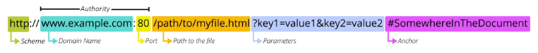

- scheme：表示浏览器必须使用的协议来请求资源
- authority：包含域和端口，以冒号分隔；域指示被请求的web服务器，可以是域名或IP地址；端口指示设备上运行的不同应用程序或服务。服务器可以利用不同的端口同时运行多个服务，互不干扰。除使用默认端口（http为80，https为443，ftp为21，smtp为25，pop3为110）外，端口是必要的。
- path to file：Web 服务器上资源的路径，早期表示web服务器上的物理文件位置，如今主要是没有物理实现的web服务器处理的抽象
- parameter：提供给web服务器的额外参数，用&分隔
- anchor：表示资源中的一种书签，以#开头（片段标识符），#后的内容不会随着请求被发送到服务器

将IP地址映射为人类可读的形式，称为域名。域名由几部分以点分隔构成、从右往左阅读。顶级域名表示域名提供服务的一般目的，后面的二级域名及以上都是标签。你不能真正地“购买一个域名”。这样做是为了让未使用的域名最终可以重新被其他人使用。不过你可用花钱获得一个域名在一年或多年内的使用权。你可以延长你的使用权，同时你的续期将优先于其他人的申请。但你从来都没有拥有过域名。

DNS解析：域名系统使用特殊的服务器将输入的域名解析为真实的IP地址。可以使用DNS查询工具查找网站的IP地址

## 网络数据包

数据包是OSI模型中对第三层的数据单位的称呼，主要组成部分是用户数据和控制信息。用户数据称为*有效载荷*。控制信息是传送有效载荷所需的信息。它包括源地址和目的地址、序列信息和错误检测码，通常位于数据包的头部和尾部。

数据包包含：

- 跳数限制：当数据包从一个网络传递到下一个网络时称为一次跳跃。每经过一次，跳数字段就会减少一个；当跳数限制达到 0 时，发送操作失败，数据包被丢弃。
- 错误检测和纠正：错误检测和纠正是用于检测并纠正数据传输到接收方时发生的错误的代码。错误纠正有两种类型：后向纠错和前向纠错。后向纠错是指接收方请求发送方重新传输整个数据单元。前向纠错是指接收方使用错误纠正码自动纠正错误。在发送端，计算在数据包发送前进行。在接收到目的地时，重新计算校验和，并与数据包中的校验和进行比较。
- 优先级：该字段表示哪个数据包应具有比其他数据包更高的优先级。当网络拥塞时，高优先级队列比低优先级队列更快清空。
- 地址：路由网络数据包时需要两个网络地址：发送主机的源地址和接收主机的目的地址。
- 用户数据：也叫有效载荷，是代表应用程序携带的数据。它通常是可变长度的，最大长度由网络协议和路由设备决定。

## 浏览器的工作原理

在浏览网页时用户希望页面的内容能够快速加载且流畅交互。因此，开发者应力争实现这两个目标。导致 Web 性能问题的原因主要有两种，一是网络延迟，二是大部分情况下的浏览器单线程执行。网络延迟是将字节传输到计算机的时间。Web 性能优化需要做的就是使页面尽可能快地加载完成。为了实现流畅的交互，开发者的目标是确保网站的交互性能良好，从流畅的滚动到对触摸的响应。渲染时间非常关键，我们需要确保主线程能够完成交给它的所有工作，并且始终能够处理用户交互。通过理解浏览器的单线程特性，并尽可能和适当地减少主线程的责任，可以提高网页性能，以确保渲染流畅，并且对交互的响应是即时的。

- 导航：导航是加载 web 页面的第一步。它发生在以下情形：用户通过在地址栏输入一个 URL、点击一个链接、提交表单或者是其他的行为。Web 性能优化的目标之一就是缩短导航完成所花费的时间，在理想情况下，它通常不会花费太多的时间，但是网络延迟和带宽会让它变久。

    - DNS查询：浏览器向域名服务器发起 DNS 查询请求，最终得到一个 IP 地址。第一次请求之后，这个 IP 地址可能会被缓存一段时间，这样可以通过从缓存里面检索 IP 地址而不是再通过域名服务器进行查询来加速后续的请求。每个主机名 (hostname) 在页面加载时通常只需要进行一次 DNS 查询。但是，对于页面指向的不同的主机名，则需要多次 DNS 查询。如果字体（font）、图像（image）、脚本（script）、广告（ads）和网站统计（metric）都有不同的主机名，则需要对每一个主机名进行 DNS 查询。但是对于移动网络，DNS 查询可能存在性能问题。当一个用户使用移动网络时，所有 DNS 查询必须从手机发送到基站，然后到达一个权威 DNS 服务器。手机、信号塔、域名服务器之间的距离会显著增加延迟。

    - TCP握手：一旦获取到服务器 IP 地址，浏览器就会通过[TCP“三次握手”](https://developer.mozilla.org/zh-CN/docs/Glossary/TCP_handshake)与服务器建立连接。这个机制的是用来让两端尝试进行通信——在浏览器和服务器通过上层协议 [HTTPS](https://developer.mozilla.org/zh-CN/docs/Glossary/HTTPS) 发送数据之前，可以协商网络 TCP 套接字连接的一些参数。TCP 的“三次握手”技术经常被称为“SYN-SYN-ACK”——更确切的说是 SYN、SYN-ACK、ACK——因为通过 TCP 首先发送了三个消息进行协商，然后在两台电脑之间开始一个 TCP 会话

    - TLS（传输层安全）协商：对于通过 HTTPS 建立的安全连接，还需要另一次 "握手"。这种握手，或者说 [TLS](https://developer.mozilla.org/zh-CN/docs/Glossary/TLS) 协商，决定使用哪种密码对通信进行加密，验证服务器，并在开始实际数据传输前建立安全连接。这就需要在实际发送内容请求之前，再往返服务器五次。

        虽然建立安全连接的步骤增加了等待加载页面的时间，但是为了建立一个安全的连接而增加延迟是值得的，因为在浏览器和 web 服务器之间传输的数据不可以被第三方解密。

        如此经过 8 次往返，浏览器终于可以发出请求。

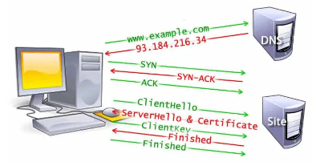

- 响应：一旦我们建立了和 web 服务器的连接，浏览器就会代表用户发送一个初始的 

    HTTP `GET` 请求

    ，对于网站来说，这个请求通常是一个 HTML 文件。一旦服务器收到请求，它将使用相关的响应头和 HTML 的内容进行回复。直到浏览器在解析阶段遇到链接时才会去请求链接的资源

    - 拥塞控制、TCP慢启动：在传输过程中，TCP 包被分割成段。由于 TCP 保证了数据包的顺序，因此服务器在发送一定数量的分段后，必须从客户端接收一个 ACK 包的确认。为了平衡传输分段的数量，[TCP 慢启动](https://developer.mozilla.org/zh-CN/docs/Glossary/TCP_slow_start)算法用于逐渐增加传输数据量，直到确定最大网络带宽，并在网络负载较高时减少传输数据量。

- 解析：一旦浏览器收到第一个数据分块，它就可以开始解析收到的信息。

    “解析”是浏览器将通过网络接收的数据转换为 DOM和 CSSOM的步骤，通过渲染器在屏幕上将它们绘制成页面。即使请求页面的 HTML 大于初始的 14KB 数据包，浏览器也将根据其拥有的数据开始解析并尝试渲染。这就是为什么在前 14KB 中包含浏览器开始渲染页面所需的所有内容，或者至少包含页面模板（第一次渲染所需的 CSS 和 HTML）对于 web 性能优化来说是重要的。但是在渲染到屏幕上面之前，HTML、CSS、JavaScript 必须被解析完成。

    - 构建DOM树：关键渲染路径（Critical Rendering Path，CRP）包含了[文档对象模型](https://developer.mozilla.org/zh-CN/docs/Web/API/Document_Object_Model)（DOM）、[CSS 对象模型](https://developer.mozilla.org/zh-CN/docs/Web/API/CSS_Object_Model)（CSSOM）、渲染树和布局。优化关键渲染路径可以缩短首次渲染的时间。了解和优化关键渲染路径对于确保重排和重绘能以每秒 60 帧的速度进行、确保高效的用户交互、避免[卡顿](https://developer.mozilla.org/zh-CN/docs/Glossary/Jank)而言是至关重要的。

        对网页或应用程序的请求始于 HTTP 请求。服务器发送包含 HTML 的响应。浏览器开始解析 HTML，将接收到的字节转换为 DOM 树。当浏览器每次发现 DOM 树包含外部资源就会初始化其请求（无论是样式表、脚本还是嵌入的图片引用）。有些请求是阻塞性的，这意味着在处理导入的资源前，其余 HTML 的解析工作将中止。浏览器接着解析 HTML，发送请求并构造 DOM，直到 HTML 的文件结尾，此时就会开始构造 CSSOM。等到 DOM 和 CSSOM 完成之后，浏览器构造渲染树，计算所有可见内容的样式。一旦渲染树完成，布局就会开始，定义所有渲染树元素的位置和大小。在布局完成后，页面将被渲染或“绘制”到屏幕上。

        当解析器发现非阻塞资源，例如一张图片，浏览器会请求这些资源并且继续解析。当遇到一个 CSS 文件时，解析也可以继续进行，但是对于 `<script>` 标签（特别是没有 [`async`](https://developer.mozilla.org/zh-CN/docs/Web/JavaScript/Reference/Statements/async_function) 或者 `defer` 属性的）会阻塞渲染并停止 HTML 的解析。尽管浏览器的预加载扫描器加速了这个过程，但过多的脚本仍然是一个重要的瓶颈。

    - 预加载扫描器：浏览器构建 DOM 树时，这个过程占用了主线程。同时，*预加载扫描器*会解析可用的内容并请求高优先级的资源，如 CSS、JavaScript 和 web 字体。多亏了预加载扫描器，我们不必等到解析器找到对外部资源的引用时才去请求。它将在后台检索资源，而当主 HTML 解析器解析到要请求的资源时，它们可能已经下载中了，或者已经被下载。预加载扫描器提供的优化减少了阻塞。为了确保脚本不会阻塞进程，当 JavaScript 解析和执行顺序不重要时，可以添加 `async` 属性或 `defer` 属性。等待获取 CSS 不会阻塞 HTML 的解析或者下载，但是它确实会阻塞 JavaScript，因为 JavaScript 经常用于查询元素的 CSS 属性。

    - JS编译：在解析 CSS 和创建 CSSOM 的同时，包括 JavaScript 文件在内的其他资源也在下载（这要归功于预加载扫描器）。JavaScript 会被解析、编译和解释。脚本被解析为抽象语法树。有些浏览器引擎会将[抽象语法树](https://zh.wikipedia.org/wiki/抽象语法树)输入编译器，输出字节码。这就是所谓的 JavaScript 编译。大部分代码都是在主线程上解释的。

- 渲染：渲染步骤包括样式、布局、绘制，在某些情况下还包括合成。在解析步骤中创建的 CSSOM 树和 DOM 树组合成一个渲染树，然后用于计算每个可见元素的布局，然后将其绘制到屏幕上。在某些情况下，可以将内容提升到它们自己的层并进行合成，通过在 GPU 而不是 CPU 上绘制屏幕的一部分来提高性能，从而释放主线程。

    - 样式：计算样式树或渲染树的构建从 DOM 树的根开始，遍历每个可见节点。不会被显示的元素（如 [``](https://developer.mozilla.org/zh-CN/docs/Web/HTML/Element/head) 元素及其子元素，以及任何带有 `display: none` 的节点，如用户代理样式表中的 `script { display: none; }`）不会包含在渲染树中，因为它们不会出现在渲染输出中。应用了 `visibility: hidden` 的节点会包含在渲染树中，因为它们会占用空间
    - 布局：*布局*是确定呈现树中所有节点的尺寸和位置，以及确定页面上每个对象的大小和位置的过程。*重排*是后续过程中对页面的任意部分或整个文档的大小和位置的重新计算。为了确定每个对象的确切大小和位置，浏览器会从渲染树的根开始遍历。在网页上，大多数东西都是一个盒子。不同的设备和不同的桌面设置意味着无限数量的不同视区大小。在此阶段，根据视口大小，浏览器将确定屏幕上所有盒子的大小。以视口大小为基础，布局通常从 body 开始，设置所有 body 后代的大小，同时给不知道其尺寸的替换元素（例如图像）提供占位符空间，空间大小以相应元素盒模型的属性为准。
    - 绘制：为了确保平滑滚动和动画效果，包括计算样式、回流和绘制等占用主线程的所有操作，必须在不超过 16.67 毫秒的时间内完成。绘制可以将布局树中的元素分解为多个层。将内容提升到 GPU 上的层（而不是 CPU 上的主线程）可以提高绘制和重新绘制性能。分层确实可以提高性能，但在内存管理方面成本较高，因此不应作为 Web 性能优化策略的过度使用。
    - 合成：当文档的各个部分以不同的层绘制，相互重叠时，必须进行合成，以确保它们以正确的顺序绘制到屏幕上，并正确显示内容。当页面继续加载资源时，可能会发生回流（回想一下我们迟到的示例图像），回流会触发重新绘制和重新合成。如果我们定义了图像的大小，就不需要重新绘制，只需要绘制需要重新绘制的层，并在必要时进行合成。但我们并没有定义图像大小！所以从服务器获取图像后，渲染过程将返回到布局步骤并从那里重新开

- 交互：如果加载包括正确延迟加载的 JavaScript，并且仅在 [`onload`](https://developer.mozilla.org/zh-CN/docs/Web/API/Window/load_event) 事件触发后执行，那么主线程可能会忙于执行脚本，无法用于滚动、触摸和其他交互操作。[可交互时间（TTI）](https://developer.mozilla.org/zh-CN/docs/Glossary/Time_to_interactive)是测量从第一个请求导致 DNS 查询和 SSL 连接到页面可交互时所用的时间——可交互是在[首次内容绘制](https://developer.mozilla.org/zh-CN/docs/Glossary/First_contentful_paint)之后页面在 50ms 内响应用户的交互。如果主线程正在解析、编译和执行 JavaScript，则无法及时（小于 50ms）响应用户交互。

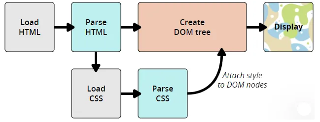

## 关键渲染路径CPR

关键渲染路径（Critical Rendering Path，CRP）分为五个步骤：文档对象元素（DOM）、CSS对象模型（CSSOM）、渲染树、布局、绘制

- DOM 是 Document Object Model（文档对象模型）的简称。DOM 接口就像是一个翻译官，它把网页里的这些元素都变成计算机能够理解和操作的对象。通过 DOM 接口，可以用编程语言（比如 JavaScript）来和网页里的元素进行交互。DOM 不是一种编程语言，但如果没有它，JavaScript 语言就不会有任何关于网页、HTML 文档、SVG 文档及其组成部分的模型或概念。DOM 不是 JavaScript 语言的一部分，而是用于建立网站的 Web API。JavaScript 也可以在其他情况下使用。例如，Node.js 在计算机上运行 JavaScript 程序，但提供了一套不同的 API，而且 DOM API 不是 Node.js 运行时的核心部分。

    比如最常见的HTML DOM 就是专门针对 HTML文档的 DOM。当我们打开一个网页时，浏览器会把 HTML 代码解析成一个树形结构，这个树形结构就是 HTML DOM。在 HTML DOM 里，每个 HTML 元素（像`<p>`段落标签、`<h1>`标题标签等）都是一个对象，这些对象有自己的属性（比如元素的文本内容、颜色、大小等）和方法（比如添加元素、删除元素等操作）。我们可以使用 JavaScript 来访问和操作这些对象。

    绝大多数使用 DOM 的代码都是围绕着操作 HTML 文档进行的，所以我们通常把 DOM 中的节点称为**元素**（element），尽管严格来说并不是每个节点都是一个元素。

- 与DOM类似的还有CSSOM（CSS对象模型）；DOM 使得 JavaScript 可以读取和修改文档的结构和内容，CSSOM 则使得 JavaScript 可以读取和修改文档样式。

    DOM 构建是增量的。节点数量越多，关键渲染路径中的后续事件将花费的时间就越长，增添太多的节点会影响性能。CSSOM 构建却不是增量的，因为后续规则可能被之前的所覆盖。CSS 是渲染阻塞的：浏览器会阻塞页面渲染直到它接收和执行了所有的 CSS。CSS 具有渲染阻塞性，因为规则可以被覆盖，样式将会被之后的解析所覆盖而不应该被渲染到屏幕上，所以在 CSSOM 完成之前无法渲染内容。CSS 规则向下层叠。随着解析器转换标识为节点，节点的后代继承了样式。

    从选择器性能的角度，更少的特定选择器是比更多的要快。例如，`.foo {}` 是比 `.bar .foo {}` 更快的，因为当浏览器发现 `.foo` 时，必须沿着 DOM 向上走来检查 `.foo` 是不是有一个 `.bar` 祖先。越是具体的标签浏览器就需要更多的工作，但这样的弊端未必值得优化，在 CSS 中选择器的性能优化，提升仅仅是毫秒级的。

- DOM 和 CSSOM 树结合为渲染树。为了构造渲染树，浏览器检查每个节点，从 DOM 树的根节点开始，并且决定附加哪些 CSS 规则。

- 一旦渲染树被构建，就可以进行布局了。布局取决于屏幕的尺寸。布局步骤决定了元素在页面上的位置和布局方式，决定了每个元素的宽和高，以及它们之间的位置关系。布局性能受 DOM 影响——节点数越多，布局就需要更长的时间。如果在滚动或其他动画过程中需要布局，布局可能会成为一个瓶颈，从而导致卡顿。20ms 的延迟在加载或者方向改变时或许还可以接受，但在动画或滚动时就会变得卡顿。任何渲染树改变的时候，像添加节点、改变内容或者在一个节点更新盒模型样式的时候就会开始布局。

    为了减小布局事件的频率和时长，我们应该批量更新或者避免改动盒模型属性。

- 一旦渲染树创建并且布局完成，像素就可以被绘制在屏幕上。加载时，整个屏幕被绘制出来。之后，只有受影响的屏幕区域会被重绘，浏览器被优化为只重绘需要绘制的最小区域。绘制是一个非常快的过程，所以聚焦在提升性能时这大概不是最有效的部分，重点要记住的是当测量一个动画帧需要的时间需要考虑到布局和重绘时间。

优化CPR：提升页面加载速度需要通过被加载资源的优先级、控制它们加载的顺序和减小这些资源的体积。性能提示包含

1）通过异步、延迟加载或者消除非关键资源来减少关键资源的请求数量

2）优化必须的请求数量和每个请求的文件体积

3）通过区分关键资源的优先级来优化被加载关键资源的顺序，来缩短关键路径长度。

## 测试本地文件存在的问题

如果你将某些示例作为本地文件打开的话，它将不会运行。这可能是由于各种原因，最有可能是：

- **它们具有异步请求**。如果你只是从本地文件运行示例，一些浏览器（包括 Chrome）将不会运行异步请求（请参阅[从服务器获取数据](https://developer.mozilla.org/zh-CN/docs/Learn_web_development/Core/Scripting/Network_requests)）。这是因为安全限制（更多关于 Web 安全的信息，请参阅[站点安全](https://developer.mozilla.org/zh-CN/docs/Learn_web_development/Extensions/Server-side/First_steps/Website_security)）。
- **它们具有服务端代码**。服务器端语言（如 PHP 或 Python）需要一个特殊的服务器来解释代码并提供结果。
- **它们引用其他文件**。浏览器通常将使用 `file://` 协议加载资源的请求视为跨域请求。所以，如果你加载了一个引用了其他本地文件的本地文件，就有可能会导致 [CORS](https://developer.mozilla.org/zh-CN/docs/Glossary/CORS) 的问题。

## 本地运行服务端代码

- 要运行 Python 服务器端代码，你需要使用 Python web 框架。Python 有很多流行的 web 框架，例如 Django（有一个[指南](https://developer.mozilla.org/zh-CN/docs/Learn_web_development/Extensions/Server-side/Django)可供参考）、[Flask](https://flask.palletsprojects.com/) 和 [Pyramid](https://trypyramid.com/)。
- 要运行 Node.js（JavaScript）服务器端代码，你可以直接使用 Node 或选择构建于其上的框架。Express 是一个不错的选择——请参阅 [Express Web 框架（Node.js/JavaScript）](https://developer.mozilla.org/zh-CN/docs/Learn_web_development/Extensions/Server-side/Express_Nodejs)。

## 推荐阅读

Web性能：https://developer.mozilla.org/zh-CN/docs/Web/Performance

服务器端网站编程：https://developer.mozilla.org/zh-CN/docs/Learn_web_development/Extensions/Server-side

数据包纠错原理：https://www.techradar.com/news/computing/how-error-detection-and-correction-works-1080736

使用github pages发布网站https://developer.mozilla.org/zh-CN/docs/Learn_web_development/Howto/Tools_and_setup/Upload_files_to_a_web_server#github

浏览器的同源策略：https://developer.mozilla.org/zh-CN/docs/Web/Security/Same-origin_policy

跨源资源共享：https://developer.mozilla.org/zh-CN/docs/Web/HTTP/CORS

站点安全：https://developer.mozilla.org/zh-CN/docs/Learn_web_development/Extensions/Server-side/First_steps/Website_security

对网站进行信息架构：https://developer.mozilla.org/zh-CN/docs/Learn_web_development/Core/Structuring_content/Structuring_documents#规划一个简单的网站

媒体容器格式：https://developer.mozilla.org/zh-CN/docs/Web/Media/Guides/Formats/Containers

媒体版权问题：https://developer.mozilla.org/zh-CN/docs/Learn_web_development/Core/Structuring_content/HTML_images#媒体资源和许可

视频编码指南：https://developer.mozilla.org/zh-CN/docs/Web/Media/Guides/Formats/Video_codecs

# HTML

HTML 是一种用于定义内容结构的*标记语言，*由一系列的[**元素**](https://developer.mozilla.org/zh-CN/docs/Glossary/Element)组成。元素由开始标签结束标签、内容、属性（属性名和属性值）

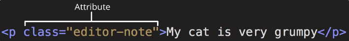

元素可以嵌套

不包含任何内容的元素成为空元素，比如元素，可以不含结束标签和内容，因为图像元素不需要通过内容来产生效果，其作用是向所在位置嵌入一张图片

## HTML概述

最常用的HTML元素

标题、段落、列表、链接

HTML 标签不区分大小写。不过，从一致性、可读性来说，最好仅使用小写字母。

在 HTML 中有两种你需要知道的重要元素类别，块级元素和内联元素。此处的块级和内联不要与CSS盒子模型中的同名术语相混淆，尽管两者是相关的，但改变CSS显示类型不会改变元素类型

- 块级元素在页面中以块的形式展现。一个块级元素出现在它前面的内容之后的新行上。任何跟在块级元素后面的内容也会出现在新的行上。块级元素通常是页面上的结构元素。例如，一个块级元素可能代表标题、段落、列表、导航菜单或页脚。一个块级元素不会嵌套在一个内联元素里面，但它可能嵌套在另一个块级元素里面。
- 内联元素通常出现在块级元素中并环绕文档内容的一小部分，而不是一整个段落或者一组内容。内联元素不会导致文本换行。它通常与文本一起使用，例如，[``](https://developer.mozilla.org/zh-CN/docs/Web/HTML/Element/a) 元素创建一个超链接，[``](https://developer.mozilla.org/zh-CN/docs/Web/HTML/Element/em) 和 [``](https://developer.mozilla.org/zh-CN/docs/Web/HTML/Element/strong) 等元素创建强调。

不是所有元素都拥有开始标签、内容和结束标签。一些元素只有一个标签，通常用来在此元素所在位置插入/嵌入一些东西。这些元素被称为[空元素](https://developer.mozilla.org/zh-CN/docs/Glossary/Void_element)。例如：元素 [``](https://developer.mozilla.org/zh-CN/docs/Web/HTML/Element/img) 是用来在页面插入一张指定的图片。无需在一个空元素的标签末尾添加 `/`

属性包含元素的额外信息，这些信息不会出现在实际的内容中。属性往往提供识别名称，以后为元素设置样式以及方便在DOM中被选中

一个例子是关于元素 [``](https://developer.mozilla.org/zh-CN/docs/Web/HTML/Element/a) 的——元素 [``](https://developer.mozilla.org/zh-CN/docs/Web/HTML/Element/a) 是*锚*，它使被标签包裹的内容成为一个超链接。锚元素可以添加多种属性，部分如下：

[`href`](https://developer.mozilla.org/zh-CN/docs/Learn_web_development/Core/Structuring_content/Basic_HTML_syntax#href)这个属性声明超链接的 web 地址。例如 `href="<https://www.mozilla.org/>"`。[`title 标题](<https://developer.mozilla.org/zh-CN/docs/Learn_web_development/Core/Structuring_content/Basic_HTML_syntax#title>)title` 属性为超链接声明额外的信息，比如你将链接至的那个页面。例如 `title="The Mozilla homepage"`。当鼠标悬停在超链接上面时，这部分信息将以工具提示的形式显示。[`target 目标](<https://developer.mozilla.org/zh-CN/docs/Learn_web_development/Core/Structuring_content/Basic_HTML_syntax#target>)target` 属性用于指定链接如何呈现出来。例如，`target="_blank"` 将在新标签页中显示链接。如果你希望在当前标签页显示链接，忽略这个属性即可。

有时你会看到没有值的属性，这也是完全可以接受的。这些属性被称为布尔属性。布尔属性只能有一个值，这个值一般与属性名称相同。例如，考虑 [`disabled`](https://developer.mozilla.org/zh-CN/docs/Web/HTML/Element/input#disabled) 属性，你可以将其分配给表单输入元素。用它来禁用表单输入元素，这样用户就不能输入了。被禁用的元素通常有一个灰色的外观。

在目前为止，本章内容所有的属性都是由双引号来包裹。然而，你也许在一些 HTML 中也见过单引号。这只是风格的问题，但应该注意单引号和双引号不能在一个属性值里面混用。如果你想将英文引号（单引号或双引号）当作文本显示在 html 中，你就必须使用 [HTML 实体引用](https://developer.mozilla.org/zh-CN/docs/Learn_web_development/Core/Structuring_content/Basic_HTML_syntax#实体引用：在_html_中包含特殊字符)。在 HTML 中，字符 `<`、`>`、`"`、`'` 和 `&` 是特殊字符。它们是 HTML 语法自身的一部分。必须使用字符引用——表示字符的特殊编码，它们可以在那些情况下使用。

无论你在 HTML 元素的内容中使用多少空格（包括一个或多个空白字符或换行），当渲染这些代码的时候，HTML 解释器会将连续出现的空白字符减少为一个单独的空格符。

## HTML头和元信息

- `<!doctype html>`——[文档类型](https://developer.mozilla.org/zh-CN/docs/Glossary/Doctype)。这是必不可少的开头。混沌初分，HTML 尚在襁褓（大约是 1991/92 年）之时，这个元素用来关联 HTML 编写规范，以供自动查错等功能所用。而在当今，它作用有限，可以说仅用于保证文档正常读取。现在知道这些就足够了。
- `<html></html>`——[``](https://developer.mozilla.org/zh-CN/docs/Web/HTML/Element/html) 元素。该元素包含整个页面的所有内容，有时候也称作根元素。它还包含 `lang` 属性，设置页面的主要语种。
- `<head></head>`——[``](https://developer.mozilla.org/zh-CN/docs/Web/HTML/Element/head) 元素。该元素作为想在 HTML 页面中包含但不想向用户显示的内容的容器。包括想在搜索结果中显示的[关键字](https://developer.mozilla.org/zh-CN/docs/Glossary/Keyword)和页面描述、用于设置页面样式的 CSS、字符集声明等等。
- `<meta charset="utf-8">`——该元素指明你的文档使用 UTF-8 字符编码，UTF-8 包括世界绝大多数书写语言的字符。它基本上可以处理任何文本内容。以它为编码还可以避免以后出现某些问题，没有理由再选用其他编码。
- `<meta name="viewport" content="width=device-width">`——[视口元素](https://developer.mozilla.org/zh-CN/docs/Web/CSS/Viewport_concepts#移动设备的视口)可以确保页面以视口宽度进行渲染，避免移动端浏览器以比视口更宽的宽度渲染内容，导致内容缩小。
- `<title></title>`——[``](https://developer.mozilla.org/zh-CN/docs/Web/HTML/Element/title) 元素。该元素设置页面的标题，显示在浏览器标签页上，也作为收藏网页的描述文字。
- `<body></body>`——[``](https://developer.mozilla.org/zh-CN/docs/Web/HTML/Element/body) 元素。该元素包含期望让用户在访问页面时看到的*全部*内容，包括文本、图像、视频、游戏、可播放的音轨或其他内容。

在页面加载完成的时候，HTML 文档中的[头部](https://developer.mozilla.org/zh-CN/docs/Glossary/Head)是不会显示在 web 浏览器的。它包含了诸如页面的 [``](https://developer.mozilla.org/zh-CN/docs/Web/HTML/Element/title)（标题）、指向 [CSS](https://developer.mozilla.org/zh-CN/docs/Glossary/CSS) 的链接（如果你选择用 CSS 来为 HTML 内容添加样式）、指向自定义网页图标的链接和其他的元数据（描述 HTML 的数据，比如作者和描述文档的重要关键词）等信息。Web 浏览器将使用文档[头部](https://developer.mozilla.org/zh-CN/docs/Glossary/Head)的信息正确渲染 HTML 文档。

HTML 有一个“官方的”方式来为一个文档添加元数据——[``](https://developer.mozilla.org/zh-CN/docs/Web/HTML/Element/meta) 元素。当然，其他在这篇文章中提到的东西也可以被当作元数据。有很多不同种类的 `<meta>` 元素可以被包含进你的页面的 <head> 元素

许多 `<meta>` 元素包含了 `name` 和 `content` 属性：

- `name` 指定了 meta 元素的类型；说明该元素包含了什么类型的信息。
- `content` 指定了实际的元数据内容。

指定作者在某些情况下是很有用的：如果你需要联系页面的作者，问一些关于页面内容的问题。一些内容管理系统能够自动获取页面作者的信息，然后用于某些用途。

指定一个包括与你的页面内容有关的关键词的描述是有用的，因为它有可能使你的页面在搜索引擎进行的相关搜索中出现得更多（这些行为在术语上被称为：[搜索引擎优化](https://developer.mozilla.org/zh-CN/docs/Glossary/SEO) 或 [SEO](https://developer.mozilla.org/zh-CN/docs/Glossary/SEO)）。

图标

这个不起眼的图标已经存在很多年了，16 像素的方形图标是第一种类型。你可以看见（取决于浏览器）这些图标出现在浏览器每一个打开的标签页中以及书签面板中的书签页面旁边。

页面添加网页图标的方式有：

1. 将其保存在与网站的索引页面相同的目录中，以 `.ico` 格式保存（大多数浏览器支持更通用的格式，如 `.gif` 或 `.png`）

2. 将以下行添加到 HTML 的 [``](https://developer.mozilla.org/zh-CN/docs/Web/HTML/Element/head) 块中以引用它：

    HTML HTML格式Copy to Clipboard

    ```html
    <link rel="icon" href="favicon.ico" type="image/x-icon" />
    ```

可以为不同的设备提供不同的图标，以确保图标在所有设备上都看起来美观。

**备注：** 如果你的网站使用了内容安全策略（Content Security Policy，CSP）来增加安全性，这个策略会应用在 favicon 图标上。如果你遇到了图标没有被加载的问题，你需要确认 [`Content-Security-Policy`](https://developer.mozilla.org/zh-CN/docs/Web/HTTP/Headers/Content-Security-Policy) 响应头的 [`img-src` 指令](https://developer.mozilla.org/en-US/docs/Web/HTTP/Headers/Content-Security-Policy/img-src) 没有阻止访问图标。

- [``](https://developer.mozilla.org/zh-CN/docs/Web/HTML/Element/link) 元素经常位于文档的头部，它有 2 个属性，`rel="stylesheet"` 表明这是文档的样式表，而 `href` 包含了样式表文件的路径：

HTML HTML格式Copy to Clipboard

```html
<link rel="stylesheet" href="my-css-file.css" />
```

- [``](https://developer.mozilla.org/zh-CN/docs/Web/HTML/Element/script) 元素也应当放在文档的头部，并包含 `src` 属性来指向需要加载的 JavaScript 文件路径，同时最好加上 `defer` 以告诉浏览器在解析完成 HTML 后再加载 JavaScript。这样可以确保在加载脚本之前浏览器已经解析了所有的 HTML 内容。这样你就不会因为 JavaScript 试图访问页面上不存在的 HTML 元素而产生错误。实际上有很多方法来处理在你的页面上加载 JavaScript，但对于现代浏览器来说，这是最可靠的方法（对于其他方法，请阅读[脚本加载策略](https://developer.mozilla.org/zh-CN/docs/Learn_web_development/Core/Scripting/What_is_JavaScript#脚本调用策略)）。

    HTML HTML格式Copy to Clipboard

    ```html
    <script src="my-js-file.js" defer></script>
    ```

## 文本处理

添加标题和段落、强调单词、创建列表

编辑层次结构，需要记住一些最佳实践：

- 最好只对每个页面使用一次 `<h1>`——这是顶级标题，所有其他标题位于层次结构中的下方。
- 请确保在层次结构中以正确的顺序使用标题。不要使用 `<h3>` 来表示副标题，后面再跟 `<h2>` 来表示二级副标题——这是没有意义的，会导致奇怪的结果。
- 在现有的六个标题层次中，除非觉得有必要，否则应该争取每页使用不超过三个。有很多层次的文件（例如，深层次的标题层次）会变得笨重，难以浏览。在这种情况下，如果可能的话，建议将内容分散到多个页面。

用户通常会在 10-20 秒内离开网页，但具有明确价值主张的页面可以更长时间地吸引人们的注意力。要获得几分钟的用户关注，您必须在 10 秒内清楚地传达您的价值主张。

对网页建立索引的搜索引擎将标题的内容视为影响网页搜索排名的重要关键字。没有标题，你的网页在[搜索引擎优化](https://developer.mozilla.org/zh-CN/docs/Glossary/SEO)方面效果不佳。

[``](https://developer.mozilla.org/zh-CN/docs/Web/HTML/Element/span) 元素，它没有语义。当想要对它用 CSS（或者 JS）时，可以用它包裹内容，且不附加任何额外的意义（在未来的课程中你会发现更多这类元素）。

ol为有序列表、ul为无序列表、li为列表子项

em类体、strong加粗

到目前为止，我们所讨论的元素都有明确的相关语义。[``](https://developer.mozilla.org/zh-CN/docs/Web/HTML/Element/b)、[``](https://developer.mozilla.org/zh-CN/docs/Web/HTML/Element/i) 和 [``](https://developer.mozilla.org/zh-CN/docs/Web/HTML/Element/u) 的情况却有点复杂。它们出现于人们要在文本中使用粗体、斜体、下划线但 CSS 仍然不被完全支持的时期。像这样仅仅影响表象而且没有语义的元素，被称为**表象元素**（presentational elements）并且不应该再被使用。因为正如我们在之前看到的，语义对无障碍、SEO（搜索引擎优化）等非常重要。

最好的经验法则是：只有在没有更合适的元素时，才适合使用 `<b>`、`<i>` 或 `<u>` 来表达传统上用粗体、斜体或下划线表达的意思；而通常情况下是有更合适的元素可供使用的。`<strong>`、`<em>`、`<mark>` 或 `<span>` 可能是更加合适的选择。

始终保持无障碍的开发理念。斜体的概念对使用屏幕阅读器的人或使用拉丁字母以外的书写系统的人没有什么帮助。

- [``](https://developer.mozilla.org/zh-CN/docs/Web/HTML/Element/i) 被用来传达传统上用斜体表达的意义：外国文字，分类名称，技术术语，一种思想……
- [``](https://developer.mozilla.org/zh-CN/docs/Web/HTML/Element/b) 被用来传达传统上用粗体表达的意义：关键字，产品名称，引导句……
- [``](https://developer.mozilla.org/zh-CN/docs/Web/HTML/Element/u) 被用来传达传统上用下划线表达的意义：专有名词，拼写错误……

人们强烈地将下划线与超链接联系起来。因此，在网页中，最好只给链接加下划线。在语义上合适的时候使用 `<u>` 元素，但要考虑使用 CSS 将默认的下划线改为在网页中更合适的东西。

偶尔会遇到的第三种列表类型——**描述列表**（description list）。这种列表的目的是标记一组项目及其相关描述，例如术语和定义，或者是问题和答案等。

描述列表使用与其他列表类型不同的闭合标签——[``](https://developer.mozilla.org/zh-CN/docs/Web/HTML/Element/dl)；此外，每一项都用 [``](https://developer.mozilla.org/zh-CN/docs/Web/HTML/Element/dt)（description term）元素闭合。每个描述都用 [``](https://developer.mozilla.org/zh-CN/docs/Web/HTML/Element/dd)（description definition）元素闭合。浏览器的默认样式会在描述列表的术语及其定义之间产生缩进。一个术语可以同时有多个描述。

HTML 也有用于标记引用的特性，至于使用哪个元素标记，取决于你引用的是一块还是一行。如果一个块级内容（一个段落、多个段落、一个列表等）从其他地方被引用，你应该把它用 [``](https://developer.mozilla.org/zh-CN/docs/Web/HTML/Element/blockquote) 元素包裹起来表示，并且在 [`cite`](https://developer.mozilla.org/zh-CN/docs/Web/HTML/Element/blockquote#cite) 属性里用 URL 来指向引用的资源。浏览器的默认样式会将其呈现为缩进的段落，作为引用的指示。行内引用用<q>进行标记，浏览器默认将其作为普通文本放入引号内表示引用。这里有 [``](https://developer.mozilla.org/zh-CN/docs/Web/HTML/Element/cite) 元素，但它是为了包含所引用资源的标题（如书名）。然而，你没有理由不把 `<cite>` 内的文字用<a>标签的href属性链接到引用源。

另一个你在 Web 上看到的相当常见的元素是 [``](https://developer.mozilla.org/zh-CN/docs/Web/HTML/Element/abbr)——它常被用来包裹一个缩略语或缩写，并且提供缩写的解释。HTML 有个用于标记联系方式的元素——[``](https://developer.mozilla.org/zh-CN/docs/Web/HTML/Element/address)。它仅仅包含联系方式。当你使用日期、化学方程式、和数学方程式时会偶尔使用上标和下标，以确保它们的正确含义。[``](https://developer.mozilla.org/zh-CN/docs/Web/HTML/Element/sup) 和 [``](https://developer.mozilla.org/zh-CN/docs/Web/HTML/Element/sub) 元素可以解决这样的问题。

有大量的 HTML 元素可以来标记计算机代码：

- [``](https://developer.mozilla.org/zh-CN/docs/Web/HTML/Element/code)：用于标记计算机通用代码。
- [``](https://developer.mozilla.org/zh-CN/docs/Web/HTML/Element/pre)：用于保留空白字符（通常用于代码块）——如果文本中使用了缩进或多余的空白，浏览器将忽略它，你将不会在呈现的页面上看到它。但是，如果你将文本包含在 `<pre></pre>` 标签中，那么空白将会以与你在文本编辑器中看到的相同的方式渲染出来。
- [``](https://developer.mozilla.org/zh-CN/docs/Web/HTML/Element/var)：用于标记具体变量名。
- [``](https://developer.mozilla.org/zh-CN/docs/Web/HTML/Element/kbd)：用于标记输入电脑的键盘（或其他类型）输入。
- [``](https://developer.mozilla.org/zh-CN/docs/Web/HTML/Element/samp)：用于标记计算机程序的输出。

HTML 还支持将时间和日期标记为可供机器识别的格式的 [``](https://developer.mozilla.org/zh-CN/docs/Web/HTML/Element/time) 元素，为什么需要这样做？因为世界上有许多种书写日期的格式，但是这些不同的格式不容易被电脑识别——假如你想自动抓取页面上所有事件的日期并将它们插入到日历中，[``](https://developer.mozilla.org/zh-CN/docs/Web/HTML/Element/time) 元素允许你附上清晰的、可被机器识别的时间或日期来实现这种需求。

（上述用恰当的标签来表示含义的做法称为内联文本语义）

表格

为了能够让表格在 web 上有效，你需要用 CSS 提供一些样式信息，以及尽可能好的 HTML 固定结构。HTML 表格应该用于表格数据，而不是网页布局。

使用表格布局而不使用 [CSS 布局技巧](https://developer.mozilla.org/zh-CN/docs/Learn_web_development/Core/CSS_layout)是很糟糕的。主要的理由有以下几个：

1. **表格布局减少了视觉受损的用户的无障碍**: 盲人所使用的[屏幕阅读器](https://developer.mozilla.org/zh-CN/docs/Learn_web_development/Core/Accessibility/Tooling#屏幕阅读器)会解析存在于 HTML 页面上的标签，然后为用户读出其中的内容。因为对于布局来说，表格不是一个正确的工具，使用的标记比使用 CSS 布局技术更复杂，所以屏幕阅读器的输出会让他们的用户感到困惑。
2. **表格会产生很多标签**: 正如刚才提到的，表格布局通常会比正确的布局技术涉及更复杂的标签结构，这会导致代码变得更难于编写、维护、调试。
3. **表格不能自动响应**: 当你使用正确的布局容器（比如 [``](https://developer.mozilla.org/zh-CN/docs/Web/HTML/Element/header)、[``](https://developer.mozilla.org/zh-CN/docs/Web/HTML/Element/section)、[``](https://developer.mozilla.org/zh-CN/docs/Web/HTML/Element/article) 或是 [``](https://developer.mozilla.org/zh-CN/docs/Web/HTML/Element/div)）时，它们的默认宽度是父元素的 100%；而表格的默认大小是根据其内容而定的。因此，需要采取额外的措施来获取表格布局样式，以便有效地在各种设备上工作。

<td>表示单元格，<tr>另起一行，为了将表格的标题在视觉上和语义上都能被识别为标题，你可以使用 `**](https://developer.mozilla.org/zh-CN/docs/Web/HTML/Element/th) 元素（其中“th”代表“table header”），用法和 `<td>`是一样的，除了它表示为标题，不是普通的单元格以外。

```html
<table>
  <tr>
    <td>&nbsp;</td>
    <td>诺基</td>
    <td>弗洛尔</td>
    <td>艾拉</td>
    <td>胡安</td>
  </tr>
  <tr>
    <td>品种</td>
    <td>杰克罗斯犬</td>
    <td>贵宾犬</td>
    <td>流浪犬</td>
    <td>可卡犬</td>
  </tr>
  <tr>
    <td>年龄</td>
    <td>16</td>
    <td>9</td>
    <td>10</td>
    <td>5</td>
  </tr>
  <tr>
    <td>主人</td>
    <td>岳母</td>
    <td>我</td>
    <td>我</td>
    <td>嫂子</td>
  </tr>
  <tr>
    <td>饮食习惯</td>
    <td>吃掉所有人的剩菜</td>
    <td>啃咬食物</td>
    <td>吃得多</td>
    <td>吃到爆炸为止</td>
  </tr>
</table>
```

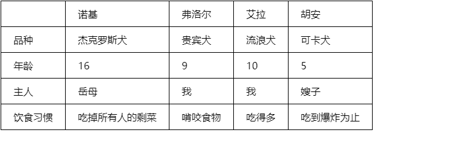

`colspan` 和 `rowspan` 属性，可以实现类似合并单元格的效果。这两个属性接受一个没有单位的数字值，数字决定了它们的宽度或高度是几个单元格。比如，`colspan="2"` 会使单元格横跨两列。

HTML 有一种为整列数据的定义样式信息的方法：就是 和 元素。它们存在是因为如果你想让一列中的每个数据的样式都一样，那么你就要为每个数据都添加一个样式，这样的做法是令人厌烦和低效的。你通常需要在列中的每个 `<td>` 或 `<th>` 上定义样式，或者使用一个复杂的选择器，比如 [`:nth-child()`](https://developer.mozilla.org/zh-CN/docs/Web/CSS/:nth-child)。**备注：** 这样设计列的样式[仅限于几个属性](https://www.w3.org/TR/CSS22/tables.html#columns)：[`border`](https://developer.mozilla.org/zh-CN/docs/Web/CSS/border)、[`background`](https://developer.mozilla.org/zh-CN/docs/Web/CSS/background)、[`width`](https://developer.mozilla.org/zh-CN/docs/Web/CSS/width) 和 [`visibility`](https://developer.mozilla.org/zh-CN/docs/Web/CSS/visibility)。要设置其他属性，必须对列中的每个 `<td>` 或 `<th>` 进行样式设置，或者使用复杂的选择器，如 [`:nth-child`](https://developer.mozilla.org/zh-CN/docs/Web/CSS/:nth-child)。

可以在 `<col>` 元素上一次性指定信息，而不是像上面这样做。`<colgroup>` 容器就在开始标记 `<table>` 下面，`<col>` 元素在 `<colgroup>` 容器内指定。可以通过如下方式指定表格，来创建与上述相同的效果：


```html
<table>
  <colgroup>
    <col />
    <col style="background-color: yellow" />
  </colgroup>
  <tr>
    <th>数据 1</th>
    <th>数据 2</th>
  </tr>
  <tr>
    <td>加尔各答</td>
    <td>橙汁</td>
  </tr>
  <tr>
    <td>机器人</td>
    <td>爵士乐</td>
  </tr>
</table>
```

定义了两个“样式列”，其中一个为第二列每列指定样式信息。没有为第一列设计样式，但仍必须包含一个空白的 `<col>` 元素，否则样式将只应用于第一列。

如果想将样式信息应用于两列，只需包含一个带有 `span` 属性的 `<col>` 元素即可，就像这样：

```html
<colgroup>
  <col style="background-color: yellow" span="2" />
</colgroup>
```

就像 `colspan` 和 `rowspan` 一样，`span` 需要一个无单位的数字值，用来指定让这个样式应用到表格中多少列。

**备注：** 如果表格、列和列中的单元格都是单独样式化的，那么应用于单元格的样式将绘制在列样式之上，而列样式将绘制在表格之上。这是因为先渲染表格层，然后渲染列层，[单元格层渲染在所有其他表格层之上](https://developer.mozilla.org/zh-CN/docs/Web/HTML/Element/table#table_layers_and_transparency)。

你可以通过 `](https://developer.mozilla.org/zh-CN/docs/Web/HTML/Element/caption) 元素为你的表格增加一个标题，再把 `](https://developer.mozilla.org/zh-CN/docs/Web/HTML/Element/caption) 元素放入 [``](https://developer.mozilla.org/zh-CN/docs/Web/HTML/Element/table) 元素中。你应该把它放在 `<table>` 开始标签的下面。

这些元素不会使表格更易于屏幕阅读器用户访问，也不会造成任何视觉上的改变。然而，它们在应用样式和布局上会起到作用，可以更好地让 CSS 应用到表格上。

由于你的表格在结构上有点复杂，如果把它们定义得更加结构化，那会帮助我们更能了解结构。一个明确的方法是使用 、 和 ，这些元素允许你把表格中的部分标记为表头、表体和表尾三部分。

要使用它们，应按以下顺序排列：

- `<thead>` 元素必须包住表格的表头部分。一般是第一行，往往都是每列的标题，但是不是每种情况都是这样的。如果你使用了 / 元素，那么 `<thead>` 元素就需要放在它们的下面。
- `<tbody>` 元素需要包住表格内容的主要部分（不是表头和表尾）。
- `<tfoot>` 元素需要包住表格的表尾部分。一般是最后一行，往往是对前面所有行的总结。

表格也可以嵌套，但一般不这样做。

[`scope`](https://developer.mozilla.org/zh-CN/docs/Web/HTML/Element/th#scope) 属性，可以添加在 `<th>` 元素中，以告诉屏幕阅读器该表头的类型——它是所在行的表头，还是所在列的表头。

而每一行都可以有一个像这样定义的标题（如果我们把行的标题和列的标题都加上）

屏幕阅读器会识别这种结构化的标记，并一次读出整列或整行。`scope` 还有两个可选的值：`colgroup` 和 `rowgroup`。

如果要替代 `scope` 属性，可以使用 [`id`](https://developer.mozilla.org/zh-CN/docs/Web/HTML/Global_attributes#id) 和 [`headers`](https://developer.mozilla.org/en-US/docs/Web/HTML/Element/td#headers) 属性来创建标题与单元格之间的联系。

`headers` 属性包含一个空格分隔的无序字符串列表，每个字符串对应 `<th>` 元素的唯一 `id`，这些 `<th>` 元素为数据单元格（`<td>` 元素）或另一个标题单元格（`<th>` 元素）提供标题。

这样，HTML 表格就明确定义了表格中每个单元格的位置，这些单元格由其所属的每列和每行的标题定义，有点像电子表格。为使其运行良好，表格确实需要列标题和行标题。

按钮通常是使用 HTML [``](https://developer.mozilla.org/en-US/docs/Web/HTML/Element/button) 元素创建的（它们有时也是使用[``](https://developer.mozilla.org/en-US/docs/Web/HTML/Element/input)将 `type` 属性设置为 `button` 或 `submit` 等值的元素创建的）。这些按钮是通用的 — 您可以将它们连接起来以触发您想要的任何功能，仅受您的想象力和编码技能的限制。

## 网站架构

[HTML](https://developer.mozilla.org/zh-CN/docs/Glossary/HTML) 不仅能够定义网页的单独部分（例如“段落”或“图片”），还可以使用块级元素（例如“标题栏”、“导航菜单”、“主内容列”）来定义网站中的复合区域。本文将探讨如何规划基本的网站结构，并根据规划的结构来编写 HTML。

网页的外观多种多样，但是除了全屏视频或游戏，或艺术作品页面，或只是结构不当的页面以外，都倾向于使用类似的标准组件：

[页眉](https://developer.mozilla.org/zh-CN/docs/Learn_web_development/Core/Structuring_content/Structuring_documents#页眉)通常横跨于整个页面顶部有一个大标题 和/或 一个标志。这是网站的主要一般信息，通常存在于所有网页。[导航栏](https://developer.mozilla.org/zh-CN/docs/Learn_web_development/Core/Structuring_content/Structuring_documents#导航栏)指向网站各个主要区段的超链接。通常用菜单按钮、链接或标签页表示。类似于标题栏，导航栏通常应在所有网页之间保持一致，否则会让用户感到疑惑，甚至无所适从。许多 web 设计人员认为导航栏是标题栏的一部分，而不是独立的组件，但这并非绝对；还有人认为，两者独立可以提供更好的 [无障碍访问特性](https://developer.mozilla.org/zh-CN/docs/Learn_web_development/Core/Accessibility)，因为屏幕阅读器可以更清晰地分辨二者。[主内容](https://developer.mozilla.org/zh-CN/docs/Learn_web_development/Core/Structuring_content/Structuring_documents#主内容)中心的大部分区域是当前网页大多数的独有内容，例如视频、文章、地图、新闻等。这些内容是网站的一部分，且会因页面而异。[侧边栏](https://developer.mozilla.org/zh-CN/docs/Learn_web_development/Core/Structuring_content/Structuring_documents#侧边栏)一些外围信息、链接、引用、广告等。通常与主内容相关（例如一个新闻页面上，侧边栏可能包含作者信息或相关文章链接），还可能存在其他的重复元素，如辅助导航系统。[页脚](https://developer.mozilla.org/zh-CN/docs/Learn_web_development/Core/Structuring_content/Structuring_documents#页脚)横跨页面底部的狭长区域。和标题一样，页脚是放置公共信息（比如版权声明或联系方式）的，一般使用较小字体，且通常为次要内容。还可以通过提供快速访问链接来进行 [SEO](https://developer.mozilla.org/zh-CN/docs/Glossary/SEO)。

一个“典型的网站”可能会这样布局：

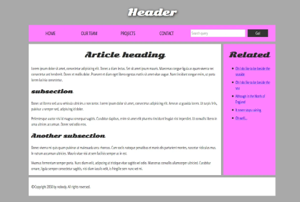

通过合适的 CSS，你可以使用相当多种的任意页面元素来环绕在不同的页面区域来做成你想要的样子，但如前所述，我们要敬畏语义，做到**正确选用元素**。

HTML 代码中可根据功能来为区段添加标记。可使用元素来无歧义地表示上文所讲的内容区段，屏幕阅读器等辅助技术可以识别这些元素，并帮助执行“找到主导航“或”找到主内容“等任务。参见前文所讲的[页面中元素结构和语义不佳所带来的后果](https://developer.mozilla.org/zh-CN/docs/Learn_web_development/Core/Structuring_content/Headings_and_paragraphs#为什么我们需要结构化？)。

为了实现语义化标记，HTML 提供了明确这些区段的专用标签，例如：

- [``](https://developer.mozilla.org/zh-CN/docs/Web/HTML/Element/header)：页眉。
- [``](https://developer.mozilla.org/zh-CN/docs/Web/HTML/Element/nav)：导航栏。
- [``](https://developer.mozilla.org/zh-CN/docs/Web/HTML/Element/main)：主内容。主内容中还可以有各种子内容区段，可用[``](https://developer.mozilla.org/zh-CN/docs/Web/HTML/Element/article)、[``](https://developer.mozilla.org/zh-CN/docs/Web/HTML/Element/section) 和 [``](https://developer.mozilla.org/zh-CN/docs/Web/HTML/Element/div) 等元素表示。
- [``](https://developer.mozilla.org/zh-CN/docs/Web/HTML/Element/aside)：侧边栏，经常嵌套在 [``](https://developer.mozilla.org/zh-CN/docs/Web/HTML/Element/main) 中。
- [``](https://developer.mozilla.org/zh-CN/docs/Web/HTML/Element/footer)：页脚。

编写一套正确的 HTML 结构是理解文档布局的前提，布局工作就交给 CSS 吧。

理解所有 HTML 区段元素具体含义是很有益处的，这一点将随着个人 web 开发经验的逐渐丰富日趋显现。更多细节请查阅 [HTML 元素参考](https://developer.mozilla.org/zh-CN/docs/Web/HTML/Element)。现在，你只需要理解以下主要元素的意义：

- [``](https://developer.mozilla.org/zh-CN/docs/Web/HTML/Element/main) 存放每个页面独有的内容。每个页面上只能用一次 `<main>`，且直接位于 [``](https://developer.mozilla.org/zh-CN/docs/Web/HTML/Element/body) 中。最好不要把它嵌套进其他元素。
- [``](https://developer.mozilla.org/zh-CN/docs/Web/HTML/Element/article) 包围的内容即一篇文章，与页面其他部分无关（比如一篇博文）。
- [``](https://developer.mozilla.org/zh-CN/docs/Web/HTML/Element/section) 与 `<article>` 类似，但 `<section>` 更适用于组织页面使其按功能（比如迷你地图、一组文章标题和摘要）分块。一般的最佳用法是：以 [标题](https://developer.mozilla.org/zh-CN/docs/Learn_web_development/Core/Structuring_content/Headings_and_paragraphs) 作为开头；也可以把一篇 `<article>` 分成若干部分并分别置于不同的 `<section>` 中，也可以把一个区段 `<section>` 分成若干部分并分别置于不同的 `<article>` 中，取决于上下文。
- [``](https://developer.mozilla.org/zh-CN/docs/Web/HTML/Element/aside) 包含一些间接信息（术语条目、作者简介、相关链接，等等）。
- [``](https://developer.mozilla.org/zh-CN/docs/Web/HTML/Element/header) 是简介形式的内容。如果它是 [``](https://developer.mozilla.org/zh-CN/docs/Web/HTML/Element/body) 的子元素，那么就是网站的全局页眉。如果它是 [``](https://developer.mozilla.org/zh-CN/docs/Web/HTML/Element/article) 或[``](https://developer.mozilla.org/zh-CN/docs/Web/HTML/Element/section) 的子元素，那么它是这些部分特有的页眉（此 `<header>` 非彼[标题](https://developer.mozilla.org/zh-CN/docs/Learn_web_development/Core/Structuring_content/Webpage_metadata#添加标题)）。
- [``](https://developer.mozilla.org/zh-CN/docs/Web/HTML/Element/nav) 包含页面主导航功能。其中不应包含二级链接等内容。
- [``](https://developer.mozilla.org/zh-CN/docs/Web/HTML/Element/footer) 包含了页面的页脚部分

有时你会发现，对于一些要组织的项目或要包装的内容，现有的语义元素均不能很好对应。有时候你可能只想将一组元素作为一个单独的实体来修饰来响应单一的用 [CSS](https://developer.mozilla.org/zh-CN/docs/Glossary/CSS) 或 [JavaScript](https://developer.mozilla.org/zh-CN/docs/Glossary/JavaScript)。为了应对这种情况，HTML 提供了 [``](https://developer.mozilla.org/zh-CN/docs/Web/HTML/Element/div) 和 [``](https://developer.mozilla.org/zh-CN/docs/Web/HTML/Element/span) 元素。应配合使用 [`class`](https://developer.mozilla.org/zh-CN/docs/Web/HTML/Global_attributes#class) 属性提供一些标签，使这些元素能易于查询。

[``](https://developer.mozilla.org/zh-CN/docs/Web/HTML/Element/span) 是一个内联的（inline）无语义元素，最好只用于无法找到更好的语义元素来包含内容时，或者不想增加特定的含义时。

**警告：** div 元素非常便利但容易被滥用。由于它们没有语义值，会使 HTML 代码变得混乱。要小心使用，只有在没有更好的语义方案时才选择它，而且要尽可能少用，否则文档的升级和维护工作会非常困难。

`<br>` 可在段落中进行换行；`<br>` 是唯一能够生成多个短行结构（例如邮寄地址或诗歌）的元素。

`<hr>` 元素在文档中生成一条水平分割线，表示文本中主题的变化（例如话题或场景的改变）。一般就是一条水平的直线。

在完成页面内容的规划后，一般应按部就班地规划整个网站的内容，要可能带给用户最好的体验，需要哪些页面、如何排列组合这些页面、如何互相链接等问题不可忽略。这些工作称为[信息架构](https://developer.mozilla.org/zh-CN/docs/Glossary/Information_architecture)。在大型网站中，大多数规划工作都可以归结于此，而对于一个只有几个页面的简单网站，规划设计过程可以更简单，更有趣！

## 超链接

通过将文本或其他内容包裹在 [``](https://developer.mozilla.org/zh-CN/docs/Web/HTML/Element/a) 元素内，并给它一个包含网址的 [`href`](https://developer.mozilla.org/zh-CN/docs/Web/HTML/Element/a#href) 属性（也称为**超文本引用**或**目标**，它将包含一个网址）来创建一个基本链接。任何内容，甚至[块级元素](https://developer.mozilla.org/zh-CN/docs/Glossary/Block/CSS)都可以作为链接出现。如果想让标题元素变为链接，就把它包裹在锚点元素（`<a>`）内。

如果有需要作为链接的图片，使用 [``](https://developer.mozilla.org/zh-CN/docs/Web/HTML/Element/a) 元素来包裹要引用图片的 [``](https://developer.mozilla.org/zh-CN/docs/Web/HTML/Element/img) 元素。

你可能要添加到你的链接的另一个属性是 `title`。这旨在包含关于链接的补充信息，当鼠标指针悬停在链接上时，标题将作为提示信息出现。

URL可以链接到工程中的其他文件、外部链接和该HTML内的特定部分。要做到这一点，你必须首先给要链接到的元素分配一个 [`id`](https://developer.mozilla.org/zh-CN/docs/Web/HTML/Global_attributes#id) 属性。通常情况下，链接到一个特定的标题是有意义的。为了链接到那个特定的 `id`，要将它放在 URL 的末尾，并在前面包含井号（`#`）

下面是一些在编写链接时可以遵循的最佳实践。

[使用清晰的链接措辞](https://developer.mozilla.org/zh-CN/docs/Learn_web_development/Core/Structuring_content/Creating_links#使用清晰的链接措辞)

把链接放在你的页面上很容易。这还不够。我们需要让所有的读者都可以使用链接，无论他们当前的环境和用于访问的工具（*无障碍*）。例如：

- 使用屏幕阅读器的用户喜欢从页面上的一个链接跳到另一个链接，并且脱离上下文来阅读链接。
- 搜索引擎使用链接文本来索引目标文件，所以在链接文本中包含关键词是一个很好的主意，以有效地描述与之相关的信息。
- 读者往往会浏览页面而不是阅读每一个字，他们的眼睛会被页面的特征所吸引，比如链接。他们会找到描述性的链接。
- 不要重复 URL 作为链接文本的一部分——URL 看起来很丑，当屏幕阅读器一个字母一个字母的读出来的时候听起来就更丑了。
- 不要在链接文本中说“链接”或“链接到”——它只是无用的内容。屏幕阅读器告诉人们有一个链接。可视化用户也会知道有一个链接，因为链接通常是用不同的颜色设计的，并且存在下划线（这个惯例一般不应该被打破，因为用户习惯了它）。
- 保持你的链接标签尽可能短——这非常重要，因为屏幕阅读器需要解释整个链接文本。
- 尽量减少相同文本的多个副本链接到不同地方的情况。如果存在标记为“单击此处”、“单击此处”、“单击此处”这样脱离上下文的链接文本，容易对使用屏幕阅读器的用户带来问题。

[链接到非 HTML 资源——留下清晰的指示](https://developer.mozilla.org/zh-CN/docs/Learn_web_development/Core/Structuring_content/Creating_links#链接到非_html_资源——留下清晰的指示)

当链接到一个需要下载的资源（如 PDF 或 Word 文档）或流媒体（如视频或音频）或有另一个潜在的意想不到的效果（打开一个弹出窗口），你应该添加明确的措辞，以减少混乱。

如下的例子会让人反感：

- 你在使用低带宽连接的情况下，点击一个链接，意外地突然开始下载大文件。

    让我们看看一些例子，看看在这里可以使用什么样的文本：

```html
<p><a href="<https://www.example.com/large-report.pdf>">
    下载销售报告（PDF，大小为 10 MB）
  </a></p><p><a href="<https://www.example.com/video-stream/>" target="_blank">
    观看视频（将在新标签页中播放，HD 画质）
  </a></p>
```

[在下载链接时使用 download 属性](https://developer.mozilla.org/zh-CN/docs/Learn_web_development/Core/Structuring_content/Creating_links#在下载链接时使用_download_属性)

当你链接到要下载的资源而不是在浏览器中打开时，你可以使用 `download` 属性来提供一个默认的保存文件名。

```html
<a
  href="<https://download.mozilla.org/?product=firefox-latest-ssl&os=win64&lang=zh-CN>"
  download="firefox-latest-64bit-installer.exe">
  下载最新的 Firefox 中文版 - Windows（64 位）
</a>
```

构建页面内容是一项重要技能，页面构建清晰才能顺利交付进行 CSS 布局。本测验将测试你是否能构思出页面的最终外观，以及是否会选用适当的结构语义。

按钮通常是使用 HTML [``](https://developer.mozilla.org/en-US/docs/Web/HTML/Element/button) 元素创建的（它们有时也是使用[``](https://developer.mozilla.org/en-US/docs/Web/HTML/Element/input)将 `type` 属性设置为 `button` 或 `submit` 等值的元素创建的）。这些按钮是通用的 — 您可以将它们连接起来以触发您想要的任何功能，仅受您的想象力和编码技能的限制。表单是使用 、 [``](https://developer.mozilla.org/en-US/docs/Web/HTML/Element/label)、 [``](https://developer.mozilla.org/en-US/docs/Web/HTML/Element/input)和 [``](https://developer.mozilla.org/en-US/docs/Web/HTML/Element/select)等元素创建的。[``](https://developer.mozilla.org/en-US/docs/Web/HTML/Element/form)表单元素可用于创建比简单按钮更复杂的控件，例如，包含多个选项的下拉菜单，允许您在用户界面元素的不同主题之间进行选择。

它们还可用于创建表单，供用户在需要向网站服务器提交信息时填写。按钮本身不会做任何有用的事情。要让它做一些有用的事情，你需要把它放在一个表单中（我们稍后会介绍），或者添加一些 JavaScript。按钮的第二个主要用途 — 提交表单的演示。

基本表单包含三项内容：

- 一个[``](https://developer.mozilla.org/en-US/docs/Web/HTML/Element/form)元素，它包装所有其他表单内容。`<form></form>`的任何表单控件都是同一表单的一部分，其数据在提交表单时包含在内。

- 一对或多对，每对由一个

    `<label>`

    元素和一个表单控制元素（通常是一个

    `<input>`

    元素，但也有其他类型，例如

    `<select>`

    ）：

    - 表单控件元素允许用户选择或输入一些数据，这些数据将在提交表单时发送到服务器。
    - 该`<label>`元素提供与表单控件关联的标识标签，该标签描述应输入到其中的数据。

- 用于[``](https://developer.mozilla.org/en-US/docs/Web/HTML/Element/button)提交表单的元素。

元素[``](https://developer.mozilla.org/en-US/docs/Web/HTML/Element/form)充当表单的外部包装器，将其中的所有表单控件组合在一起。按下 时`<button>`，表单控件表示的所有数据都将提交到服务器。该`<form>`元素可以采用许多属性，但我们在此处包含的两个最重要的属性如下：

- `action`：包含要将提交的表单数据发送到要处理的页面的路径。稍后，在提交表单后，您将看到 `/submit_page`。你也会得到一个 [`404`](https://developer.mozilla.org/en-US/docs/Web/HTTP/Status/404) 错误响应，因为这个页面实际上并不存在，但目前还不错、
- `method`：指定要用于将表单数据发送到服务器的数据传输[方法](https://developer.mozilla.org/en-US/docs/Web/HTTP/Methods)。现在不要太担心这个;`get` 值会导致数据作为附加到 URL 末尾的参数发送。

还可以通过元素的 `type` 属性指定其他按钮行为：`<button>`

- `<button type="submit">` 明确声明按钮的行为应该像提交按钮一样。你真的不需要声明这一点，除非出于某种原因你在 中包含了其他按钮，`<form>`并且你想清楚地表明提交按钮是哪一个。这将非常罕见。
- `<button type="reset">` 创建一个 *reset 按钮* — 这会立即删除表单中的所有数据，将其重置为初始状态。**不要使用重置按钮** — 它们曾经在 Web 的早期很流行，但它们通常比有用更烦人。大多数人都经历过填写长表格后，不小心点击了重置按钮而不是提交按钮，这意味着他们必须重新开始。
- `<button type="button">` 创建一个与在`<form>`指定的按钮具有相同行为的按钮。正如我们之前看到的，它们默认完全不执行任何作，需要 JavaScript 来赋予它们功能。

“选择酒店房间类型”按钮是使用 [``](https://developer.mozilla.org/en-US/docs/Web/HTML/Element/input/radio) 控件实现的。这些控件呈现为一组按钮控件，其中任何时候都只能选择一组控件中的一个 - 你不能一次选择多个。`radio`输入类型的工作方式与`text`输入类型相同，但有一些区别。它们以老式收音机上的按钮命名，按下一个按钮，之前选择的按钮会再次弹出。还值得注意的是，我们已经将 `checked` 属性应用于第一个单选按钮 — 这会导致它在页面首次加载时被选中。这就是我们将酒店房间类型值标记为“必需”的合理性 — 将始终选择一个选项，并且您不能在不选择另一个单选按钮的情况下取消选择另一个单选按钮。

在单选按钮示例中，您会注意到第三个单选按钮上设置了 `disabled` 属性。这会导致渲染的控件灰显且不可选择。这在许多情况下非常有用，因为选项通常可用，但现在不可用。例如，产品可能缺货，或者正如我们示例所示，顶层套房都被预订一空！

我们的 “classes to attend” 选择器是使用 [``](https://developer.mozilla.org/en-US/docs/Web/HTML/Element/input/checkbox) 控件实现的。这些呈现为一组开/关状态复选框。与单选按钮不同，您可以一次选择多个。从代码片段中可以看出，单选按钮和复选框的实现方式非常相似（它们还可以采用 `checked` 属性，以便在页面加载时预先选择它们）。

下拉菜单（例如示例中的 “How are you getting here” 选择控件）不是使用类型实现的，而是使用 [``](https://developer.mozilla.org/en-US/docs/Web/HTML/Element/select) and [``](https://developer.mozilla.org/en-US/docs/Web/HTML/Element/option)实现的：`<input>`

多行文本输入字段是使用[``](https://developer.mozilla.org/en-US/docs/Web/HTML/Element/textarea)元素创建的：

它们的行为方式与 `<input type="text">` 元素相同，只是它们允许输入多行文本。`rows` 属性指定文本区域默认的行高，而 `cols` 属性指定文本区域默认的列宽。如果未指定，则使用的值为 `cols="20"` 和 `rows="2"`

大多数浏览器在呈现文本区域的一个角上都有一个拖动手柄，可用于调整其大小。尝试使用它来调整我们演示中的文本区域的大小。

表单验证是一个巨大的话题，超出了本文的范围，因此我们现在就把它留在这里。请记住，有两种类型的表单验证：

- 客户端验证，在浏览器中进行，使用表单验证属性（如 `required`）和 JavaScript 的组合实现。客户端验证对于在用户输入错误数据时为用户提供即时提示非常有用，但在阻止恶意数据通过方面效果不佳。关闭 JavaScript 或更改客户端代码太容易了，因此验证不再有效。
- 服务器端验证，发生在服务器上，使用服务器使用的任何语言实现。格式错误的消息可能会意外或有意发送到服务器。传统智慧是确保您的服务器不信任客户端发送的任何内容，以避免由格式错误的消息引起的错误或安全问题。服务器端验证非常适合阻止恶意消息，因为它更难篡改服务器上运行的代码。服务器端验证不太擅长向用户提供有关错误数据的提示，因为数据必须转到服务器进行验证，然后必须先将结果发送回客户端，然后才能通知用户。

[``](https://developer.mozilla.org/en-US/docs/Web/HTML/Element/input)元素表示输入到表单中的不同数据项。

```html
<input type="text" name="name" id="name" required />
```

- `type`：指定要创建的表单控件的类型。有许多不同类型的表单控件，从不同类型的简单文本字段到单选按钮、复选框等。Type `text` 呈现一个可以接受任何值的基本文本字段。
- `name`：指定数据项的名称。提交表单后，数据将以名称/值对形式发送。在每种情况下，名称都等于此`name`属性值，并且该值等于在文本字段中输入的文本。
- `id`：指定可用于标识元素的 ID。在这种情况下，它用于将表单控件与其 `<label>`.
- `required`：指定在提交表单之前，必须在表单元素中输入值。这应该只在您需要的 inputs 上设置，而不是在可选字段上设置。

有几种专门的文本字段输入类型旨在处理特定类型的数据 — [``](https://developer.mozilla.org/en-US/docs/Web/HTML/Element/input/number)、[``](https://developer.mozilla.org/en-US/docs/Web/HTML/Element/input/password)、[``](https://developer.mozilla.org/en-US/docs/Web/HTML/Element/input/tel) 等。

通过为表单控件提供 `id` 属性，然后为`<label>`与控件 `id` 值相同的 `for` 属性来创建关联。

上面看到的表单标签样式称为**显式表单标签** — control 和 label 之间的关联是通过 `id` 和 `for` 属性显式建立的。您还可以通过将控件嵌套在标签内来实现**隐式表单标签。两种方法都可以，但我们建议使用显式标记方法。这是因为显式关联通常更容易识别和理解，尤其是当您的 HTML 代码变得更加复杂时。此外，屏幕阅读器（和其他辅助技术）并不总是正确处理隐式标签。**

## 多媒体

要想在网页上放置简单的图像，我们需要使用 [``](https://developer.mozilla.org/zh-CN/docs/Web/HTML/Element/img) 元素。这个元素是[空元素](https://developer.mozilla.org/zh-CN/docs/Glossary/Void_element)（即无法包含任何子内容和结束标签），它需要两个属性才能起作用：`src` 和 `alt`。`src` 属性包含一个 URL，该 URL 指向要嵌入页面的图像。`src` 属性可以是相对 URL 或绝对 URL，这与 [``](https://developer.mozilla.org/zh-CN/docs/Web/HTML/Element/a) 元素的 `href` 属性类似。如果没有 `src` 属性，`img` 元素就没有图像可加载。

不建议使用绝对 URL 进行链接。你需要托管你想要在网站上使用的图像，在比较简单的情况下，通常我们会把网站的图像保存在与 HTML 相同的服务器上。此外，从维护的角度来说，使用相对 URL 比绝对 URL 更有效率（当你将网站迁移到不同的域名时，你不需要更新所有 URL，使其包含新域名）。在更高级的设置中，你可能会使用[内容分发网络（CDN）](https://developer.mozilla.org/zh-CN/docs/Glossary/CDN)来传递图像。

如果这些图像并非由你创建，你应该查看它们发布的许可证条款，确保自己有使用它们的权限

**警告：** *未经许可*，*绝不要*将 `src` 属性指向其他网站上的图像。这被称为“热链接（hotlinking）”。大多数人认为这是不道德的，因为这会导致每当有人访问你的页面，都会有另一些不知情的人为图像交付带宽费用。这也导致你无法掌控图像，图像有可能在你不知情的情况下，被删除或替换为尴尬的内容。

像 [``](https://developer.mozilla.org/zh-CN/docs/Web/HTML/Element/img) 和 [``](https://developer.mozilla.org/zh-CN/docs/Web/HTML/Element/video) 这样的元素有时被称为**替换元素（replaced elements）**。这是因为元素的内容和大小由外部资源（如图像或视频文件）定义，而不是由元素本身的内容定义。

（在 [CSS](https://developer.mozilla.org/zh-CN/docs/Web/CSS) 中，**可替换元素**（**replaced element**）的展现效果不是由 CSS 来控制的。这些元素是一种外部对象，它们外观的渲染，是独立于 CSS 的）

备选文本alt：它的值应该是图片的文本描述，用于在图片无法显示或者因为网速慢而加载缓慢的情况下使用。为什么我们需要备选文本呢？它可以派上用场的地方有很多：

- 用户有视力障碍，需要通过[屏幕阅读器](https://zh.wikipedia.org/wiki/螢幕閱讀器)来浏览网页。事实上，图片备选描述文本对大多数用户都很有用。
- 就像上面所说的，你也许会把图片的路径或文件名拼错。
- 浏览器不支持该图片类型。某些用户仍在使用纯文本的浏览器，例如 [Lynx](https://zh.wikipedia.org/wiki/Lynx)，这些浏览器会把图片替换为备选文本。
- 这些文字描述可以提供给搜索引擎使用，例如搜索引擎可能会将图片的文字描述和查询条件进行匹配。
- 用户可能会关闭图片显示以减少数据的传输，这在手机上是十分普遍的，因为在一些国家带宽有限且昂贵。

到底应该在 `alt` 里写点什么呢？这首先取决于*为什么*这张图片会在这儿，换句话说，如果这张图片没显示出来，会少了什么：

- **装饰**：如果图片仅用于装饰，你应该使用 [CSS 背景图片](https://developer.mozilla.org/zh-CN/docs/Learn_web_development/Core/Structuring_content/HTML_images#css_背景图片)，但如果必须使用 HTML，请添加空的 `alt=""`。如果图片不是内容的一部分，那么屏幕阅读器不应该浪费时间读取它。
- **内容**：如果你的图片提供了重要的信息，就要在 `alt` 文本中*简要*的提供相同的信息，甚至更近一步，把这些信息写在主要的文本内容里，这样所有人都能看见。不要写冗余的备选文本（如果在主要文本中将所有的段落都重复两遍，对于没有失明的用户来说多烦啊！），如果在主要文本中已经对图片进行了充分的描述，写 `alt=""` 就好。
- **链接**：如果你把图片嵌套在 [``](https://developer.mozilla.org/zh-CN/docs/Web/HTML/Element/a) 标签里，来把图片变成链接，那你还必须提供[无障碍的链接文本](https://developer.mozilla.org/zh-CN/docs/Learn_web_development/Core/Structuring_content/Creating_links#使用清晰的链接措辞)。在这种情况下，你可以写在同一个 `<a>` 元素里，或者写在图片的 `alt` 属性里，随你喜欢。
- **文本**：你不应该将文本放到图像里。例如，如果你的主标题需要有阴影，你可以[用 CSS](https://developer.mozilla.org/zh-CN/docs/Web/CSS/text-shadow) 来达到这个目的，而不是把文本放到图片里。如果*真的必须这么做*，那就把文本也放到 `alt` 里。

本质上，关键在于即使图片无法被看见，也能提供可用的体验，这确保了所有人都不会错失某部分内容。尝试在浏览器中使图片不可见然后看看网页变成什么样了，你会很快意识到在图片无法显示时备选文本能帮上多大忙。

可以用 [`width`](https://developer.mozilla.org/zh-CN/docs/Web/HTML/Element/img#width) 和 [`height`](https://developer.mozilla.org/zh-CN/docs/Web/HTML/Element/img#height) 属性来指定你的图片的宽度和高度。它们的值是不带单位的整数，以像素为单位表示图像的宽度和高度。如果你在 HTML 中使用 `width` 和 `height` 属性来指定图片的实际大小，那么在下载图片之前，浏览器就知道需要为其留出多少空间。这样的话，当图片下载完成时，浏览器不需要移动周围的内容。

在将图片放到网页上之前，你应使用图像编辑器将其设置为正确的大小。

如果确实需要更改图片的大小，应该使用 [CSS](https://developer.mozilla.org/zh-CN/docs/Learn_web_development/Core/Styling_basics) 来实现。

类似于[超链接](https://developer.mozilla.org/zh-CN/docs/Learn_web_development/Core/Structuring_content/Creating_links#使用_title_属性添加支持信息)，你可以通过给图片增加 `title` 属性来提供更多的信息

这会给我们一个鼠标悬停提示，和链接标题一样：

然而，我们并不推荐它——`title` 有很多无障碍问题，这些问题主要是基于这样一个事实，即屏幕阅读器的支持并不完善，除此之外大多数浏览器都不会显示它，除非你将鼠标悬停在上面

更好的做法是将这样的支持信息包含在主要文章文本中，而不是附加在图片上。

你在网络上找到的图像（以及其他媒体资源类型）都以不同的许可类型发布。在你构建的网站上使用图像之前，请确保你拥有该图像的所有权、获得使用许可或遵守所有者的许可条件。

比起使用alt，更好的做法是使用 HTML 的 [``](https://developer.mozilla.org/zh-CN/docs/Web/HTML/Element/figure) 和 [``](https://developer.mozilla.org/zh-CN/docs/Web/HTML/Element/figcaption) 元素，它正是为此而被创造出来的：为图片提供一个语义容器，在说明文字和图片之间建立清晰的关联。[``](https://developer.mozilla.org/zh-CN/docs/Web/HTML/Element/figcaption) 元素告诉浏览器和辅助技术工具，这段说明文字描述了 [``](https://developer.mozilla.org/zh-CN/docs/Web/HTML/Element/figure) 元素的内容。

```html
<figure>
  

  <figcaption>
    A T-Rex on display in the Manchester University Museum.
  </figcaption>
</figure>
```

figure 里不一定要是图片，只要是这样的独立内容单元即可：

- 用简洁、易懂的方式表达意图。
- 可以置于页面线性流的某处。
- 为主要内容提供重要的补充说明。

figure 可以是几张图片、一段代码、音视频、方程、表格或类似的东西。

你也可以使用 CSS 把图片嵌入网站中（JavaScript 也行，不过那是另外一回事了）。CSS 属性 [`background-image`](https://developer.mozilla.org/zh-CN/docs/Web/CSS/background-image) 和其他的 `background-*` 属性是用来控制背景图片的。比如，要想为页面中的每个段落设置一个背景图片，你可以这样做：

```css
p {
  background-image: url("images/dinosaur.jpg");
}
```

按理说，这种做法相对于 HTML 中插入图片的做法，可以更好地控制图片和设置图片的位置，那么为什么我们还要使用 HTML 图片呢？如上所述，CSS 背景图片只是为了装饰——如果你只是想要在你的页面上添加一些漂亮的东西，来提升视觉效果，那 CSS 的做法是可以的。但是这样插入的图片完全没有语义上的意义，它们不能有任何备选文本，也不能被屏幕阅读器识别，等等。这就是 HTML 图片有用的地方了。

总而言之，如果图像对你的内容有意义，则应使用 HTML 图像。如果图像纯粹是装饰，则应使用 CSS 背景图片。

你还可以动态生成图形，或在生成后对图像进行操作。浏览器提供了使用代码创建 2D 和 3D 图形的方法，以及包含来自上传文件或用户摄像头实时流的视频。例如Canvas、SVG、WebGL、WebRTC，以及<video>和<audio>标签。

最早的在线视频和音频的流行得益于专有的基于插件的技术，如 [Flash](https://zh.wikipedia.org/zh-cn/Adobe_Flash) 和 [Silverlight](https://zh.wikipedia.org/zh-cn/Microsoft_Silverlight)。这两种技术存在安全性和无障碍问题，现已过时，取而代之的是原生的 HTML 解决方案，该解决方案包括 [``](https://developer.mozilla.org/zh-CN/docs/Web/HTML/Element/video) 和 [``](https://developer.mozilla.org/zh-CN/docs/Web/HTML/Element/audio) 元素以及用于控制它们的 [JavaScript](https://developer.mozilla.org/zh-CN/docs/Glossary/JavaScript) [API](https://developer.mozilla.org/zh-CN/docs/Glossary/API)。

[`src`](https://developer.mozilla.org/zh-CN/docs/Web/HTML/Element/video#src)

同 [``](https://developer.mozilla.org/zh-CN/docs/Web/HTML/Element/img) 元素的使用方式相同，`src`（来源）属性指向你想要嵌入到网页中的视频资源，它们的运作方式完全相同。

[`controls`](https://developer.mozilla.org/zh-CN/docs/Web/HTML/Element/video#controls)

用户应当能够控制视频和音频的播放（这对于患有[癫痫](https://zh.wikipedia.org/wiki/癫痫#病因)的人来说尤为重要）。你必须使用 `controls` 属性来让视频或音频包含浏览器自带的控制界面，或者使用适当的 [JavaScript API](https://developer.mozilla.org/zh-CN/docs/Web/API/HTMLMediaElement) 构建自己的界面。至少，界面必须包括启动和停止媒体以及调整音量的方法。

<video> 元素内的段落

这个叫做**后备内容**，当浏览器不支持 `<video>` 元素的时候，就会显示这段内容，借此我们能够对旧的浏览器提供回退。你可以添加任何后备内容，在这个例子中我们提供了一个指向这个视频文件的链接，从而使用户至少可以访问到这个文件，而不会局限于浏览器的支持。

不同浏览器对视频/音频格式的支持程度不一样，导致你可能无法播放某些视频/音频。可以使用多个播放源以提高兼容性

由于每种浏览器支持的容器文件格式和编解码器都有所不同，情况变得更加复杂。为了尽可能确保你的网站或应用能在用户的浏览器上正常工作，你可能需要提供多种格式的媒体文件。如果你的网站没有提供任何用户的浏览器支持的格式，那么你的媒体内容将无法播放。

我们该怎么做呢

```html
<video controls>
  <source src="rabbit320.mp4" type="video/mp4" />
  <source src="rabbit320.webm" type="video/webm" />
  <p>你的浏览器不支持此视频。可点击<a href="rabbit320.mp4">此链接</a>观看</p>
</video>
```

在这里我们将 `src` 属性从 `<video>` 元素中移除，转而将它放在几个单独的 [``](https://developer.mozilla.org/zh-CN/docs/Web/HTML/Element/source) 元素当中，这些元素分别指向各自的资源。在本例当中，浏览器会检查 [``](https://developer.mozilla.org/zh-CN/docs/Web/HTML/Element/source) 元素，并且播放第一个与其自身 codec 相匹配的媒体。WebM 和 MP4 这两种格式在目前已经足够，只要视频支持这两种格式，那么其在大多数平台和浏览器上都能正确播放。

每个 `<source>` 元素都含有 [`type`](https://developer.mozilla.org/zh-CN/docs/Web/HTML/Element/source#type) 属性，这个属性是可选的，但是建议你添加这个属性——它包含了 `<source>` 指定的 [MIME 类型](https://developer.mozilla.org/zh-CN/docs/Glossary/MIME_type)，同时浏览器也会通过检查这个属性来迅速的跳过那些不支持的格式。如果你没有添加 `type` 属性，浏览器会尝试加载每一个文件，直到找到一个能正确播放的格式，但是这样会消耗掉大量的时间和资源。

<video>的其他特性包括：

[`width`](https://developer.mozilla.org/zh-CN/docs/Web/HTML/Element/video#width) 和 [`height`](https://developer.mozilla.org/zh-CN/docs/Web/HTML/Element/video#height)你可以用属性控制视频的尺寸，也可以用 [CSS](https://developer.mozilla.org/zh-CN/docs/Glossary/CSS) 来控制视频尺寸。无论使用哪种方式，视频都会保持它原始的长宽比——也叫做**纵横比**。如果你设置的尺寸没有保持视频原始长宽比，那么视频边框将会拉伸，而未被视频内容填充的部分，将会显示默认的背景颜色。[`autoplay`](https://developer.mozilla.org/zh-CN/docs/Web/HTML/Element/video#autoplay)这个属性会使音频和视频内容立即播放，即使页面的其他部分还没有加载完全。建议不要在你的网站上自动播放视频（或音频），因为用户可能会反感。[`loop`](https://developer.mozilla.org/zh-CN/docs/Web/HTML/Element/video#loop)这个属性可以让视频（或者音频）文件在结束时再次开始播放。这个也可能很恼人，同样不建议使用，除非有必要。[`muted`](https://developer.mozilla.org/zh-CN/docs/Web/HTML/Element/video#muted)这个属性会导致媒体播放时，默认关闭声音。[`poster`](https://developer.mozilla.org/zh-CN/docs/Web/HTML/Element/video#poster)这个属性指向了一个图像的 URL，这个图像会在视频播放前显示。通常用于粗略的预览或者广告。如果页面一加载就开始播放视频的话，就不会看到封面（poster）。[`preload`](https://developer.mozilla.org/zh-CN/docs/Web/HTML/Element/video#preload)这个属性被用来缓冲较大的文件，有三个值可选： • `"none"`：不缓冲文件 • `"auto"`：页面加载后缓存媒体文件 • `"metadata"`：仅缓冲文件的元数据

- • `"none"`：不缓冲文件
- • `"auto"`：页面加载后缓存媒体文件
- • `"metadata"`：仅缓冲文件的元数据

<audio> 元素与 <video> 元素的使用方式几乎完全相同

一些 HTML `<audio>` 与 `<video>` 的差异如下：

- [``](https://developer.mozilla.org/zh-CN/docs/Web/HTML/Element/audio) 元素不支持 `width`/`heigth` 属性——由于其并没有视觉部件，也就没有内容要设置 `width`/`height`。
- 它同时也不支持 `poster` 属性——同样，因为没有视觉部件。

除此之外，`<audio>` 元素支持所有 `<video>` 元素的特性

字幕

借助 HTML 视频，我们可以做到这一点。我们只需使用 [WebVTT](https://developer.mozilla.org/zh-CN/docs/Web/API/WebVTT_API) 文件格式和 [``](https://developer.mozilla.org/zh-CN/docs/Web/HTML/Element/track) 元素即可。 “转录（transcribe）”是指将视频/音频中说的话记录成文字形式，转录的结果称为“文字记录（transcript）”。WebVTT 是一个格式，用来编写文本文件，这个文本文件包含了众多的字符串，这些字符串会带有一些元数据，它们可以用来描述这个字符串将会在视频中显示的时间，甚至可以用来描述这些字符串的样式以及定位信息（尽管有限制）。

这些字符串叫做 **cue** ，你可以根据不同的需求来显示不同类型的 cue，最常见的如下：

[subtitles](https://developer.mozilla.org/zh-CN/docs/Learn_web_development/Core/Structuring_content/HTML_video_and_audio#subtitles)外语材料的翻译字幕，来帮助那些听不懂音频中说的什么的人理解音频当中的内容。[captions](https://developer.mozilla.org/zh-CN/docs/Learn_web_development/Core/Structuring_content/HTML_video_and_audio#captions)同步翻译对白，或是描述一些有重要信息的声音，来帮助那些不能听音频的人理解音频中的内容。[定时描述](https://developer.mozilla.org/zh-CN/docs/Learn_web_development/Core/Structuring_content/HTML_video_and_audio#定时描述)由媒体播放器朗读的文本，其向盲人或其他视力受损用户描述重要的视觉内容。

一个典型的 WebVTT 文件如下：

```
WEBVTT

1
00:00:22.230 --> 00:00:24.606
第一段字幕

2
00:00:30.739 --> 00:00:34.074
第二段

…
```

要让其与 HTML 媒体一起显示，你需要做如下工作：

1. 将其保存为 `.vtt` 文件，放在服务器可以提供服务的地方（见下文），例如和 HTML 文件放在同一文件夹。
2. 用 [``](https://developer.mozilla.org/zh-CN/docs/Web/HTML/Element/track) 标签链接 `.vtt` 文件，`<track>` 标签需放在 `<audio>` 或 `<video>` 标签当中，同时需要放在所有 `<source>` 标签之后。使用 [`kind`](https://developer.mozilla.org/zh-CN/docs/Web/HTML/Element/track#kind) 属性来指明是 `subtitles`、`captions` 还是 `descriptions`。然后，使用 [`srclang`](https://developer.mozilla.org/zh-CN/docs/Web/HTML/Element/track#srclang) 来告诉浏览器你是用什么语言来编写的 subtitles。最后，添加 [`label`](https://developer.mozilla.org/zh-CN/docs/Web/HTML/Element/track#label)，以帮助读者在查找时识别语言。

如下是例子：


```html
<video controls>
  <source src="example.mp4" type="video/mp4" />
  <source src="example.webm" type="video/webm" />
  <track kind="subtitles" src="subtitles_es.vtt" srclang="es" label="Spanish" />
</video>
```

为了尝试这种方法，需要在[本地 HTTP 服务器](https://developer.mozilla.org/zh-CN/docs/Learn_web_development/Howto/Tools_and_setup/set_up_a_local_testing_server)上托管文件。在浏览器的输出中，会看到一个显示字幕的视频

## 调试

宽松是什么意思呢？通常写错代码会带来以下两种主要类型的错误：

- **语法错误**：由于拼写错误导致程序无法运行，就像上面的 Rust 示例。通常熟悉语法并理解错误信息后很容易修复。
- **逻辑错误**：不存在语法错误，但代码无法按预期运行。通常逻辑错误比语法错误更难修复，因为无法得到指向错误源头的信息。

HTML 本身不容易出现语法错误，因为浏览器是以宽松模式运行的，这意味着即使出现语法错误浏览器依然会继续运行。浏览器通常都有内建规则来解析书写错误的标记，所以即使与预期不符，页面仍可显示出来。当然，是存在隐患的。

**备注：** HTML 之所以以宽松的方式进行解析，是因为 Web 创建的初心就是：人人可发布内容，不去纠结代码语法。如果 Web 以严格的风格起步，也许就不会像今天这样流行了。

HTML验证：

最好的方法就是让你的 HTML 页面通过 [Markup Validation Service](https://validator.w3.org/)。由 W3C（制定 HTML、CSS 和其他网络技术标准的组织）创立并维护的标记验证服务。把一个 HTML 文档加载至本网页并运行，网页会返回一个错误报告。

# CSS

CSS（层叠样式表）是为 web 内容添加样式的代码。CSS 不是编程语言，也不是标记语言，**而是一门样式表语言**。CSS 用于选择性地为 HTML 元素添加样式。

## CSS规则集解释

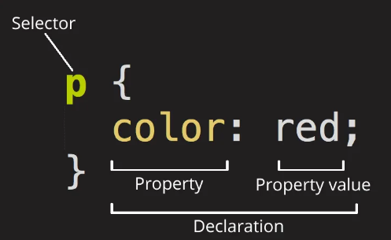

整个结构称为**规则集**（*规则集*通常简称为*规则*），注意各个部分的名称：

[选择器（Selector）](https://developer.mozilla.org/zh-CN/docs/Learn_web_development/Getting_started/Your_first_website/Styling_the_content#选择器（selector）)HTML 元素名位于规则集的开头。它定义了需要添加样式的元素（本例中就是 [``](https://developer.mozilla.org/zh-CN/docs/Web/HTML/Element/p) 元素）。要给不同的元素添加样式，只需要更改选择器。[声明（Declaration）](https://developer.mozilla.org/zh-CN/docs/Learn_web_development/Getting_started/Your_first_website/Styling_the_content#声明（declaration）)它是一条单独的规则（如 `color: red;`）。用来指定为元素的哪个**属性**添加样式。[属性（Properties）](https://developer.mozilla.org/zh-CN/docs/Learn_web_development/Getting_started/Your_first_website/Styling_the_content#属性（properties）)它是为 HTML 元素添加样式的方式（本例中 `color` 就是 [``](https://developer.mozilla.org/zh-CN/docs/Web/HTML/Element/p) 元素的属性）。在 CSS 中，你可以选择要在规则中影响的属性。[属性值（Property value）](https://developer.mozilla.org/zh-CN/docs/Learn_web_development/Getting_started/Your_first_website/Styling_the_content#属性值（property_value）)位于属性的右边，冒号后面即**属性值**。它从指定属性的可选值中选择一个值（例如，我们除了 `red` 之外还有很多属性值可以用于 `color`）。

注意其他重要的语法：

- 除了选择器部分，每个规则集都应该包含在成对的大括号里（`{}`）。
- 在每个声明里要用冒号（`:`）将属性与属性值分隔开。
- 在每个规则集里要用分号（`;`）将各个声明分隔开。

如果要在规则集中同时修改多个属性，只需要将它们用分号隔开；也可以选择多个元素并为它们添加单个规则集，多个选择器之间用逗号分隔（每个选择器都另起一行，会更好读些）

## 选择器

不同类型的选择器

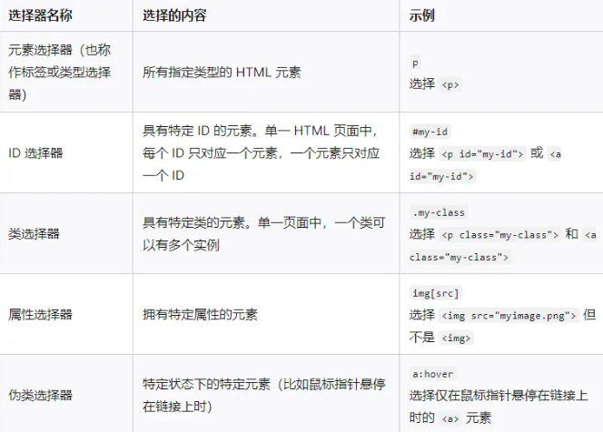

[CSS](https://developer.mozilla.org/zh-CN/docs/Glossary/CSS)中，选择器用来指定网页上我们想要样式化的[HTML](https://developer.mozilla.org/zh-CN/docs/Glossary/HTML)元素。有 CSS 选择器提供了很多种方法，所以在选择要样式化的元素时，我们可以做到很精细的地步。

伪类是选择器的一种，它用于选择处于特定状态的元素，比如当它们是这一类型的第一个元素时，或者是当鼠标指针悬浮在元素上面的时候。它们表现得会像是你向你的文档的某个部分应用了一个类一样，帮你在你的标记文本中减少多余的类，让你的代码更灵活、更易于维护。伪类是开头为冒号的关键字。例如，`:hover` 就是一个伪类。

一些伪类只会在用户以某种方式和文档交互的时候应用。这些**用户行为伪类**，有时叫做**动态伪类**，表现得就像是一个类在用户和元素交互的时候加到了元素上一样。案例包括：

- [`:hover`](https://developer.mozilla.org/zh-CN/docs/Web/CSS/:hover)——上面提到过，只会在用户将指针挪到元素上的时候才会激活，一般就是链接元素。
- [`:focus`](https://developer.mozilla.org/zh-CN/docs/Web/CSS/:focus)——只会在用户使用键盘控制，选定元素的时候激活。

伪元素以类似方式表现。不过表现得是像你往标记文本中加入全新的 HTML 元素一样，而不是向现有的元素上应用类。

**备注：** 一些早期的伪元素曾使用单冒号的语法，所以你可能会在代码或者示例中看到。现代的浏览器为了保持后向兼容，支持早期的带有单双冒号语法的伪元素。

有一组特别的伪元素，它们和[`content`](https://developer.mozilla.org/zh-CN/docs/Web/CSS/content)属性一同使用，使用 CSS 将内容插入到你的文档中中。

你能用这些插入一个文本字符串，和在下面的实时示例里那样。试着改变[`content`](https://developer.mozilla.org/zh-CN/docs/Web/CSS/content)属性的文本值，看看输出是怎么改变的。你也能改变`::before`伪元素为`::after`，看到这段文本插入到了元素的末尾而不是开头。

从 CSS 插入文本字符串，我们并不会在 Web 浏览器上经常这么做，因为对于一些屏幕阅读器来说，文本是不可见的，而且对于未来别人的查找和编辑也不是很方便。

这些伪元素的更推荐的用法是插入一个图标，例如下面的示例加入的一个小箭头，作为一个视觉性的提示，而且我们并不希望屏幕阅读器读出它。

这些伪元素经常用于插入空字符串，其后可以像页面上的其他元素被样式化。

下个示例，我们已经用 `::before`伪元素加入了个空字符串。我们把它设为了`display: block`，以让它可以用 width 和 height 进行样式化。然后我们可以用 CSS 像任何元素那样样式化。你可以摆弄 CSS，改变它的外观和行为。

`::before` 和 `::after` 伪元素与 `content` 属性的共同使用，在 CSS 中被叫做“生成内容”，而且你会见到这种技术被用于完成各种任务。最后要看的一种修改样式的方法就是根据标签的状态确定样式。一个直观的例子就是当我们修改链接的样式时。当我们修改一个链接的样式时我们需要定位（针对） [``](https://developer.mozilla.org/zh-CN/docs/Web/HTML/Element/a) （锚）标签。取决于是否是未访问的、访问过的、被鼠标悬停的、被键盘定位的，亦或是正在被点击当中的状态，这个标签有着不同的状态。你可以使用 CSS 去定位或者说针对这些不同的状态进行修饰——下面的 CSS 代码使得没有被访问的链接颜色变为粉色、访问过的链接变为绿色。

后代选择器——典型用单个空格（" "）字符——组合两个选择器，比如，第二个选择器匹配的元素被选择，如果他们有一个祖先（父亲，父亲的父亲，父亲的父亲的父亲，等等）元素匹配第一个选择器。仅选择嵌套在`<li>` 元素内的`<em>`我们可以使用一个称为**包含选择符**的选择器，它只是单纯地在两个选择器之间加上一个空格。

子代关系选择器是个大于号（`>`），只会在选择器选中直接子元素的时候匹配。继承关系上更远的后代则不会匹配。

邻接兄弟选择器（`+`）用来选中恰好处于另一个在继承关系上同级的元素旁边的物件

如果你想选中一个元素的兄弟元素，即使它们不直接相邻，你还是可以使用通用兄弟关系选择器（`~`）。要选中所有的`<p>`元素后*任何地方*的``元素，我们会这样做：

```css
p ~ img
```

一个朴素的 HTML 文档一般来说对任何人都是可以无障碍访问的，当你开始为它添加样式，记得不要破坏这种无障碍。

## 选择器的优先级：层叠、优先级和继承

这个模块着眼于级联和继承，所有可供使用的选择器类型，单位，尺寸，背景、边框样式，调试，等等等等。

本文旨在让你理解 CSS 的一些最基本的概念——层叠、优先级和继承——这些概念决定着如何将 CSS 应用到 HTML 中，以及如何解决冲突。

在某些时候，在做一个项目过程中你会发现一些应该产生效果的样式没有生效。通常的原因是你创建了两个应用于同一个元素的规则。与[**层叠**](https://developer.mozilla.org/zh-CN/docs/Web/CSS/Cascade)密切相关的概念是[**优先级**（specificity）](https://developer.mozilla.org/zh-CN/docs/Web/CSS/Specificity)，决定在发生冲突的时候应该使用哪条规则。设计元素样式的规则可能不是期望的规则，因此需要了解这些机制是如何工作的。

这里也有[**继承**](https://developer.mozilla.org/zh-CN/docs/Web/CSS/Inheritance)的概念，也就是在默认情况下，一些 css 属性继承当前元素的父元素上设置的值，有些则不继承。这也可能导致一些和期望不同的结果。

样式表[**层叠**](https://developer.mozilla.org/zh-CN/docs/Web/CSS/Cascade)——简单的说，就是 CSS 规则的顺序很重要；当应用两条同级别的规则到一个元素的时候，写在后面的就是实际使用的规则。

浏览器是根据[优先级](https://developer.mozilla.org/zh-CN/docs/Web/CSS/Specificity)来决定当多个规则有不同选择器对应相同的元素的时候需要使用哪个规则。它基本上是一个衡量选择器具体选择哪些区域的尺度：

- 一个元素选择器不是很具体，则会选择页面上该类型的所有元素，所以它的优先级就会低一些。
- 一个类选择器稍微具体点，则会选择该页面中有特定 `class` 属性值的元素，所以它的优先级就要高一点。

继承也需要在上下文中去理解——一些设置在父元素上的 CSS 属性是可以被子元素继承的，有些则不能。

举一个例子，如果你设置一个元素的 `color` 和 `font-family`，每个在里面的元素也都会有相同的属性，除非你直接在元素上设置属性。

一些属性是不能继承的——举个例子如果你在一个元素上设置 [`width`](https://developer.mozilla.org/zh-CN/docs/Web/CSS/width) 为 50% ，所有的后代不会是父元素的宽度的 50% 。如果这个也可以继承的话，CSS 就会很难使用了！

这三个概念一起来控制 CSS 规则应用于哪个元素；在下面的内容中，我们将看到它们是如何协同工作的。有时候会感觉有些复杂，但是当你对 CSS 有更多经验的时候，你就可以记住它们，即便忘记了细节，可以在网上查到，有经验的开发人员也不会记得所有细节。

直接写在html元素中德样式被称为内联样式。

- **高优先级**：在 CSS 的优先级规则中，内联样式优先级最高。当其他样式设置与内联样式冲突时，内联样式会覆盖它们，除非其他样式使用了 `!important` 声明。这确保了元素能按照开发者的意愿显示特定样式。

`color` 属性是一个继承属性。像 `width`（上面提到的）、`margin`、`padding` 和 `border` 不会被继承。

尽管每个 CSS 属性页都列出了属性是否被继承，但我们通常可以通过常识来判断哪些属性属于默认继承。

CSS 为控制继承提供了五个特殊的通用属性值。每个 CSS 属性都接收这些值。

[`inherit`](https://developer.mozilla.org/zh-CN/docs/Web/CSS/inherit)

设置该属性会使子元素属性和父元素相同。实际上，就是“开启继承”。

[`initial`](https://developer.mozilla.org/zh-CN/docs/Web/CSS/initial)

将应用于选定元素的属性值设置为该属性的[初始值](https://developer.mozilla.org/zh-CN/docs/Web/CSS/initial_value)。

[`revert`](https://developer.mozilla.org/en-US/docs/Web/CSS/revert)

将应用于选定元素的属性值重置为浏览器的默认样式，而不是应用于该属性的默认值。在许多情况下，此值的作用类似于 [`unset`](https://developer.mozilla.org/zh-CN/docs/Web/CSS/unset)。

[`revert-layer`](https://developer.mozilla.org/en-US/docs/Web/CSS/revert-layer)

将应用于选定元素的属性值重置为在上一个[层叠层](https://developer.mozilla.org/zh-CN/docs/Web/CSS/@layer)中建立的值。

[`unset`](https://developer.mozilla.org/zh-CN/docs/Web/CSS/unset)

将属性重置为自然值，也就是如果属性是自然继承那么就是 `inherit`，否则和 `initial` 一样

一个选择器的优先级可以说是由三个不同的值（或分量）相加，可以认为是百（ID）十（类）个（元素）——三位数的三个位数：

- **ID**：选择器中包含 ID 选择器则百位得一分。
- **类**：选择器中包含类选择器、属性选择器或者伪类则十位得一分。
- **元素**：选择器中包含元素、伪元素选择器则个位得一分。

**备注：** 通用选择器（[`*`](https://developer.mozilla.org/zh-CN/docs/Web/CSS/Universal_selectors)）、组合符（`+`、`>`、`~`、' '）和调整优先级的选择器（[`:where()`](https://developer.mozilla.org/zh-CN/docs/Web/CSS/:where)）不会影响优先级。

否定（[`:not()`](https://developer.mozilla.org/zh-CN/docs/Web/CSS/:not)）和任意匹配（[`:is()`](https://developer.mozilla.org/zh-CN/docs/Web/CSS/:is)）伪类本身对优先级没有影响，但它们的参数则会带来影响。

有一个特殊的 CSS 可以用来覆盖所有上面所有优先级计算，不过需要很小心的使用——`!important`。用于修改特定属性的值，能够覆盖普通规则的层叠。

**备注：** 了解 `!important` 是为了在阅读别人代码的时候知道有什么作用。**但是，强烈建议除了非常情况不要使用它。**`!important` 改变了层叠的常规工作方式，它会使调试 CSS 问题非常困难，特别是在大型样式表中。

**备注：** 覆盖 `!important` 唯一的办法就是另一个 `!important` 具有相同*优先级*而且顺序靠后，或者更高优先级。

在一种情况下，你可能不得不使用它：当你不能编辑核心的 CSS 模块，不能用任何其他方式覆盖，而你又真的想要覆盖一个样式时。但说真的，如果可以避免的话就不要用它。

相互冲突的声明将按以下顺序应用，后一种声明将覆盖前一种声明：

1. 用户代理样式表中的声明（例如，浏览器的默认样式，在没有设置其他样式时使用）。
2. 用户样式表中的常规声明（由用户设置的自定义样式）。
3. 作者样式表中的常规声明（这些是我们 web 开发人员设置的样式）。
4. 作者样式表中的 `!important` 声明
5. 用户样式表中的 `!important` 声明
6. 用户代理样式表中的 `!important` 声明

**备注：** 标记为 `!important` 的样式的优先级顺序是颠倒的。web 开发人员的样式表覆盖用户的样式表是有意义的，因此设计可以按预期进行，但是有时用户有充足的理由覆盖 web 开发人员的样式，正如上面提到的——这可以通过在他们的规则中使用 `!important` 来实现。

层是CSS中用@layer加大括号圈定的代码结构

在级联层中声明 CSS 时，优先级的顺序由声明层的顺序来决定。在任何层之外声明的 CSS 样式会被按声明的顺序组合在一起，形成一个未命名的层，它会被当作最后声明的层。对于存在冲突的常规（没有 `!important` 声明）样式，后面的层比先前定义的层的优先级高。但对于带有 `!important` 标记的样式，其顺序相反——先前的层中的 important 样式比后面的层以及为在层中声明的 important 样式优先级要高。但内联样式比所有作者定义的样式的优先级都要高，不受级联层规则的影响。

当你在不同的层中有多个样式块，且其中提供了对于某一元素的单一属性的相互冲突的值时，声明该冲突样式的层的顺序将决定其优先级。而不是高优先级的层直接覆盖低优先级的层中的所有样式。需要注意的是单独的一个层中的样式的优先级仍旧会起作用。

## 盒子模型

编写 CSS 时你会发现，所有的一切都与盒子相关——设置尺寸、颜色、位置，等等。页面上大部分 HTML 元素都可以被看作若干堆叠的盒子。

在 CSS 中，我们有几种类型的盒子，一般分为**区块盒子**（block boxes）和**行内盒子**（inline boxes）。类型指的是盒子在页面流中的行为方式以及与页面上其他盒子的关系。盒子有**内部显示**（inner display type）和**外部显示**（outer display type）两种类型。

**外部显示类型**

一个拥有 `block` 外部显示类型的盒子会表现出以下行为：

- 盒子会产生换行。
- [`width`](https://developer.mozilla.org/zh-CN/docs/Web/CSS/width) 和 [`height`](https://developer.mozilla.org/zh-CN/docs/Web/CSS/height) 属性可以发挥作用。
- 内边距、外边距和边框会将其他元素从当前盒子周围“推开”。
- 如果未指定 [`width`](https://developer.mozilla.org/zh-CN/docs/Web/CSS/width)，方框将沿行向扩展，以填充其容器中的可用空间。在大多数情况下，盒子会变得与其容器一样宽，占据可用空间的 100%。

某些 HTML 元素，如 `<h1>` 和 `<p>`，默认使用 `block` 作为外部显示类型。

一个拥有 `inline` 外部显示类型的盒子会表现出以下行为：

- 盒子不会产生换行。
- [`width`](https://developer.mozilla.org/zh-CN/docs/Web/CSS/width) 和 [`height`](https://developer.mozilla.org/zh-CN/docs/Web/CSS/height) 属性将不起作用。
- 垂直方向的内边距、外边距以及边框会被应用但是不会把其他处于 `inline` 状态的盒子推开。
- 水平方向的内边距、外边距以及边框会被应用且会把其他处于 `inline` 状态的盒子推开。

某些 HTML 元素，如 `<a>`、 `<span>`、 `<em>` 以及 `<strong>`，默认使用 `inline` 作为外部显示类型。

目前需要记住的关键是更改 `display` 属性的值可以改变框的外部显示类型是区块还是行内。

**内部显示类型**

盒子还有*内部*显示类型，它决定了盒子内元素的布局方式。

区块和行内布局是网络上的默认行为方式。默认情况下，在没有任何其他指令的情况下，方框内的元素也会以[**标准流**](https://developer.mozilla.org/zh-CN/docs/Learn_web_development/Core/CSS_layout/Introduction)的方式布局，并表现为区块或行内盒子。

例如，可以通过设置 `display: flex;` 来更改内部显示类型。该元素仍将使用外部显示类型 `block` 但内部显示类型将变为 `flex`。该方框的任何直接子代都将成为弹性（flex）项，并按照[弹性盒子](https://developer.mozilla.org/zh-CN/docs/Learn_web_development/Core/CSS_layout/Flexbox)规范执行。

当你继续详细学习 CSS 布局时，将会遇到 [`flex`](https://developer.mozilla.org/zh-CN/docs/Learn_web_development/Core/CSS_layout/Flexbox) 以及盒子可以具有的其他各种内部值，例如 [`grid`](https://developer.mozilla.org/zh-CN/docs/Learn_web_development/Core/CSS_layout/Grids)。

外部显示类型和内部显示类型都由 `display` 属性值来设置，下面分别介绍常见的外部显示值和内部显示值。

外部显示类型的值：block、inline、inline-block、table、inline-table、none

内部显示类型的值：flow-root、flex、inline-flex、grid、inline-grid、column、table-row、table-cell

CSS 盒模型整体上适用于区块盒子，它定义了盒子的不同部分（外边距、边框、内边距和内容）如何协同工作，以创建一个在页面上可以看到的盒子。行内盒子使用的只是盒模型中定义的*部分*行为。有一种标准盒模型和一种替代盒模型。默认情况下，浏览器使用标准盒模型。

CSS 中组成一个区块盒子需要：

- **内容盒子**：显示内容的区域；使用 [`inline-size`](https://developer.mozilla.org/zh-CN/docs/Web/CSS/inline-size) 和 [`block-size`](https://developer.mozilla.org/zh-CN/docs/Web/CSS/block-size) 或 [`width`](https://developer.mozilla.org/zh-CN/docs/Web/CSS/width) 和 [`height`](https://developer.mozilla.org/zh-CN/docs/Web/CSS/height) 等属性确定其大小。
- **内边距盒子**：填充位于内容周围的空白处；使用 [`padding`](https://developer.mozilla.org/zh-CN/docs/Web/CSS/padding) 和相关属性确定其大小。
- **边框盒子**：边框盒子包住内容和任何填充；使用 [`border`](https://developer.mozilla.org/zh-CN/docs/Web/CSS/border) 和相关属性确定其大小。
- **外边距盒子**：外边距是最外层，其包裹内容、内边距和边框，作为该盒子与其他元素之间的空白；使用 [`margin`](https://developer.mozilla.org/zh-CN/docs/Web/CSS/margin) 和相关属性确定其大小。

在标准盒模型中，如果在盒子上设置了 `inline-size` 和 `block-size`（或 `width` 和 `height`）属性值，这些值就定义了*内容盒子*的 `inline-size` 和 `block-size`（水平语言中为 `width` 和 `height`）。然后将任何内边距和边框添加到这些尺寸中，以获得盒子所占的总大小

**备注：** 外边距不计入盒子的实际大小——当然，它影响盒子在页面上所占的总空间，但只影响盒子外的空间。盒子的面积止于边框，不会延伸到外边距中。

在替代盒模型中，任何宽度都是页面上可见方框的宽度。内容区域的宽度是该宽度减去填充和边框的宽度（见下图）。无需将边框和内边距相加，即可获得盒子的实际大小。

要为某个元素使用替代模型，可对其设置 `box-sizing: border-box`

`em` 是一个相对长度单位，它的值是相对于当前元素的字体大小（`font-size`）而言的。如果当前元素没有显式设置字体大小，那么它会继承其父元素的字体大小。1 `em` 就等于当前元素的字体大小。

根据外边距相接触的两个元素是正边距还是负边距，结果会有所不同：

- 两个正外边距将合并为一个外边距。其大小等于最大的单个外边距。
- 两个负外边距会折叠，并使用最小（离零最远）的值。
- 如果其中一个外边距为负值，其值将从总值中*减去。*

在下面的示例中，我们有两个段落。最上面一段的 `margin-bottom` 为 50 像素，另一段的 `margin-top` 为 30 像素。页边距折叠在一起，因此方框之间的实际页边距是 50 像素，而不是两个页边距的总和。

边框是在边距和填充盒子之间绘制的。如果你正在使用标准的盒模型，边框的大小将添加到框的宽度和高度。如果你使用的是替代盒模型，边框越大会使内容框越小，因为它会占用一些可用的宽度和高度。

为边框设置样式时，有大量的属性可以使用——有四个边框，每个边框都有样式、宽度和颜色，我们可能需要对它们进行操作。

可以使用 [`border`](https://developer.mozilla.org/zh-CN/docs/Web/CSS/border) 属性一次性设置所有四个边框的宽度、颜色和样式。

内边距位于边框和内容区域之间，用于将内容推离边框。与外边距不同，内边距不能为负数。任何应用于元素的背景都会显示在内边距后面。

我们可以使用 [`padding`](https://developer.mozilla.org/zh-CN/docs/Web/CSS/padding) 简写属性一次性控制元素所有边，或者每边单独使用等价的普通属性

以上所有的方法都完全适用于块级盒子。某些属性也适用于行内盒子，例如由 `<span>` 元素创建的盒子。

`display: inline-block` 是 `display` 的一个特殊值，它提供了介于 `inline` 和 `block` 之间的中间位置。如果不希望项目换行，但又希望它使用 `width` 和 `height` 值并避免出现上述重叠现象，请使用它。

一个元素使用 `display: inline-block`，实现我们需要的块级的部分效果：

- 设置 `width` 和`height` 属性会生效。
- `padding`、`margin` 和 `border` 会推开其他元素。

不过，它不会换行，只有在明确添加 `width` 和 `height` 属性后，才会变得比其内容大。

当你想通过添加 `padding` 来扩大链接的点击范围时，这个功能就派上用场了。`<a>` 和 `<span>` 一样是一个行内元素；可以使用 `display: inline-block` 在其上设置内边距，使用户更容易点击链接。

------

CSS 布局主要是基于*盒子模型*。每个在页面上占用空间的盒子都有类似的属性：

- `padding`（内边距）：是指内容周围的空间。在下面的例子中，它是段落文本周围的空间。
- `border`（边框）：是紧接着内边距的实线。
- `margin`（外边距）：是围绕元素边框外侧的空间。

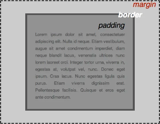

这里还使用了：

- `width`：元素的宽度。
- `background-color`：元素内容和内边距底下的颜色。
- `color`：元素内容（通常是文本）的颜色。
- `text-shadow`：为元素内的文本设置阴影。
- `display`：设置元素的显示模式。

[``](https://developer.mozilla.org/zh-CN/docs/Web/HTML/Element/body) 元素是**块级**元素，意味着它占据页面上的空间。页面上的其他元素会尊重为块级元素设置的外边距。而图片是**行级**元素，所以为了使图像有外边距，我们必须使用 `display: block` 给予其块级行为。

## 边框和背景

在本课程中，我们将看看可以用 CSS 背景和边框做的一些创造性事情。从添加渐变、背景图像到圆角，背景和边框可以解决 CSS 中的许多样式问题。

[`background-color`](https://developer.mozilla.org/zh-CN/docs/Web/CSS/background-color) 属性定义了 CSS 中任何元素的背景颜色。属性接受任何有效的 [``](https://developer.mozilla.org/zh-CN/docs/Web/CSS/color_value) 值。`background-color` 可以延伸至元素的内容和内边距盒子的下面。

[`background-image`](https://developer.mozilla.org/zh-CN/docs/Web/CSS/background-image) 属性可以在一个元素的背景中显示一个图像。默认情况下，大图不会缩小以适应盒子，因此我们只能看到它的一个小角，而小图则是平铺以填充方框。如果除了背景图像外，还指定了背景颜色，则图像将显示在颜色的顶部。

[`background-repeat`](https://developer.mozilla.org/zh-CN/docs/Web/CSS/background-repeat) 属性用于控制图像的平铺行为。可用的值是：

- `no-repeat`——阻止背景重复平铺。
- `repeat-x`——仅水平方向上重复平铺。
- `repeat-y`——仅垂直方向上重复平铺。
- `repeat`——默认值，在水平和垂直两个方向重复平铺。

有一个很大的图像（*ballons.jpg*），由于它比作为背景的元素大，所以最后被裁剪掉了。在这种情况下，我们可以使用 [`background-size`](https://developer.mozilla.org/zh-CN/docs/Web/CSS/background-size) 属性，它可以设置[长度](https://developer.mozilla.org/zh-CN/docs/Web/CSS/length)或[百分比](https://developer.mozilla.org/zh-CN/docs/Web/CSS/percentage)值，来调整图像的大小以适应背景。

你也可以使用关键字：

- `cover`：浏览器将使图像足够大，使它完全覆盖了盒子区域，同时仍然保持其宽高比。在这种情况下，图像的部分区域可能会跳出盒子外。
- `contain`：浏览器会将图像调整到适合框内的尺寸。在这种情况下，如果图像的长宽比与盒子的长宽比不同，你可能会在图像的两边或顶部和底部出现空隙。

背景图像定位

[`background-position`](https://developer.mozilla.org/zh-CN/docs/Web/CSS/background-position) 属性允许你选择背景图片出现在它所应用的盒子上的位置。这使用了一个坐标系统，其中方框的左上角是 `(0,0)`，方框沿水平（`x`）和垂直（`y`）轴定位。

**备注：** 默认的 `background-position` 值是 `(0,0)`。

最常见的 `background-position` 值有两个单独的值——一个水平值后面跟着一个垂直值。

你可以使用像 `top` 、center和 `right` 这样的关键字，或者使用[长度](https://developer.mozilla.org/zh-CN/docs/Web/CSS/length)和[百分比](https://developer.mozilla.org/zh-CN/docs/Web/CSS/percentage)值

也可以有多个背景图像——在单个属性值中指定多个 `background-image` 值，用逗号分隔每个值。

当你这样做时，你可能会出现背景图片相互重叠的情况。背景将分层，最后列出的背景图片位于最下层，而之前的每张图片都堆在代码中紧随其后的那张图片之上。

**备注：** 渐变可以与常规的背景图像很好地混合在一起

我们为背景提供的另一个选项是指定内容滚动时的滚动方式。这是用 [`background-attachment`](https://developer.mozilla.org/zh-CN/docs/Web/CSS/background-attachment) 属性控制的，它可以取以下值：

- `scroll`：使元素的背景在页面滚动时滚动。如果滚动了元素内容，则背景不会移动。实际上，背景被固定在页面的相同位置，所以它会随着页面的滚动而滚动。
- `fixed`：使元素的背景固定在视口上，这样当页面或元素内容滚动时，它就不会滚动。它将始终保持在屏幕上相同的位置。
- `local`：将背景固定在它所设置的元素上，所以当你滚动该元素时，背景也随之滚动。

[`background-attachment`](https://developer.mozilla.org/zh-CN/docs/Web/CSS/background-attachment) 属性只有在有内容要滚动时才会有效果

正如我在本课开始时提到的，你将经常看到使用 [`background`](https://developer.mozilla.org/zh-CN/docs/Web/CSS/background) 属性指定的背景。这种简写形式允许你一次设置所有不同的属性。

如果使用多个背景，则需要为第一个背景指定所有普通属性，然后在逗号后面添加下一个背景。在下面的示例中，我们有一个渐变，它指定大小和位置，然后是指定为 `no-repeat` 的图像背景，它指定位置，然后是颜色。

这里有一些规则，需要在简写背景图像属性时遵循，例如：

- `background-color` 只能在最后一个逗号之后指定。
- `background-size` 值只能立即包含在 `background-position` 之后，用“/”字符分隔，例如：`center/80%`。

屏幕阅读器不能解析背景图像，因此背景图片应该只是纯粹的装饰；任何重要的内容都应该是 HTML 页面的一部分，而不是包含在背景中。

我们可以使用 [`border`](https://developer.mozilla.org/zh-CN/docs/Web/CSS/border) 为一个框的所有四条边设置边框。

```css
.box {
  border: 1px solid black;
}
```

盒子上的圆角是通过使用 [`border-radius`](https://developer.mozilla.org/zh-CN/docs/Web/CSS/border-radius) 属性和与盒子的每个角相关的普通属性来实现的。两个长度或百分比可以作为一个值，第一个值定义水平半径，第二个值定义垂直半径。在很多情况下，你只会传入一个值，这个值会被用于这两个。

## 书写模式

CSS 中的书写模式是指文本的排列方向是横向还是纵向的。[`writing-mode`](https://developer.mozilla.org/zh-CN/docs/Web/CSS/writing-mode) 属性使我们从一种模式切换到另一种模式。为此，你不必使用一种竖向的语言——你还可以更改部分文字的方向以实现创新性的布局。

[`writing-mode`](https://developer.mozilla.org/zh-CN/docs/Web/CSS/writing-mode) 属性的三种可能的值分别是：

- `horizontal-tb`: 区块流向从上至下。对应的文本方向是横向的。
- `vertical-rl`: 区块流向从右向左。对应的文本方向是纵向的。
- `vertical-lr`: 区块流向从左向右。对应的文本方向是纵向的。

当我们切换书写模式时，我们也在改变哪里显示为块级，哪里显示为行级。`horizontal-tb` 书写模式下块向是从上到下的；而 `vertical-rl` 书写模式下块向是从右到左的。因此，**块向维度**指的总是区块在页面书写模式下的显示方向。而**行向维度**指的总是文本方向。

这张图展示了在水平书写模式下的两种维度。

这张图片展示了纵向书写模式下的两种维度。


一旦你开始接触 CSS 布局，尤其是更新的布局方法，这些关于块级元素和行级元素的概念会变得非常重要。稍后还会讨论这个问题。

由于书写模式和文本方向都是可变的，新的 CSS 布局方法不再定义从左到右和从上到下，而是将这些连同行级元素和块级元素的*开头*和*结尾*一起考量。

通过这一些列调整，我们想要的实际上是使宽和高随着书写模式一起变化。当处于纵向书写模式之下时，我们希望盒子可以向横向模式下一样得到拓宽。

为了更容易实现这样的转变，CSS 最近开发了一系列映射属性。这些属性用**逻辑**和**流相对变化**代替了像 `width` 和 `height` 一样的物理属性。

横向书写模式下，映射到 `width` 的属性被称作 [`inline-size`](https://developer.mozilla.org/zh-CN/docs/Web/CSS/inline-size)——行向维度的尺寸。而映射 `height` 的属性被称作 [`block-size`](https://developer.mozilla.org/zh-CN/docs/Web/CSS/block-size)——块向维度的尺寸。

在外边距、边框和内边距属性中，你会发现许多物理属性，例如 [`margin-top`](https://developer.mozilla.org/zh-CN/docs/Web/CSS/margin-top)、[`padding-left`](https://developer.mozilla.org/zh-CN/docs/Web/CSS/padding-left) 和 [`border-bottom`](https://developer.mozilla.org/zh-CN/docs/Web/CSS/border-bottom)。就像 width 和 height 有映射，这些属性也有相应的映射。

`margin-top` 属性的映射是 [`margin-block-start`](https://developer.mozilla.org/zh-CN/docs/Web/CSS/margin-block-start)——总是指向块级维度开始处的边距。

[`padding-left`](https://developer.mozilla.org/zh-CN/docs/Web/CSS/padding-left) 属性映射到 [`padding-inline-start`](https://developer.mozilla.org/zh-CN/docs/Web/CSS/padding-inline-start)，这是应用到行首方向（这是该书写模式文本开始的地方）上的内边距。[`border-bottom`](https://developer.mozilla.org/zh-CN/docs/Web/CSS/border-bottom) 属性映射到的是 [`border-block-end`](https://developer.mozilla.org/zh-CN/docs/Web/CSS/border-block-end)，也就是块级维度结尾处的边框。

（逻辑属性可以随书写模式的变化而变化）

目前为止我们看到的都是逻辑属性的名称。还有一些属性的取值是一些物理值（如 `top`、`right`、`bottom` 和 `left`）。这些值同样拥有逻辑值映射（`block-start`、`inline-end`、`block-end` 和 `inline-start`）。

逻辑属性和值比物理属性和值更新颖，因此最近才在浏览器中实现。你可以查看 MDN 上的任何属性页面，了解浏览器支持的历史。如果不使用多种书写模式，那么目前可能更愿意使用物理版本。不过，我们预计人们最终会在大多数情况下过渡到逻辑版本，因为一旦开始使用弹性盒和网格等布局方法，逻辑版本就会变得非常有意义。

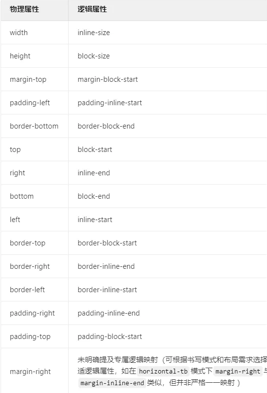

## 溢出

本节课，我们来了解一下 CSS 中另外一个重要的概念——**溢出**。溢出是在盒子无法容纳下太多的内容的时候发生的。在这篇教程里面，你将会学习到什么是溢出，以及如何控制它。

CSS 给了你好几种工具来控制溢出，在学习的早期理解这些概念是很有用的。在你写 CSS 的时候你经常会遇到溢出的情形，尤其是当你以后更加深入到 CSS 布局的时候。

[**CSS 尽力减少“数据损失”](https://developer.mozilla.org/zh-CN/docs/Learn_web_development/Core/Styling_basics/Overflow#css_尽力减少“数据损失”)，只要有可能，CSS 就不会隐藏你的内容，隐藏引起的数据损失通常会造成困扰。在 CSS 的术语里面，这会导致一些内容消失，你的访客可能不会注意到这一点，如果消失的是表格上的提交按钮，没有人能填完这个表格，这是很麻烦的事情！所以 CSS 反而会把它以可见的形式溢出出去。这样做的结果就是，你会看到错误的 CSS 导致的一片混乱，或者最坏的情况也只是你的网站的访客会告诉你有些内容冒了出来，你的网站需要修缮。**

如果你已经用 `width` 或者 `height` 限制住了一个盒子，CSS 假定，你知道你在做什么，而且你已经控制住了溢出的隐患。总之，在盒子里面需要放置文本的时候，限制住块方向的尺寸是会引起问题的，因为可能会有比你在设计网站的时候所预计的文本更多的文本，或者文本变大了——比如用户增加字体大小的时候。

在下面的几节课里，我们会看一下各种不同的控制尺寸的方式，以减少溢出的影响。但是，如果你需要固定的尺寸，你也可以控制溢出表现的形式。那么让我们接着读下去吧！

[`overflow`](https://developer.mozilla.org/zh-CN/docs/Web/CSS/overflow) 属性是你控制一个元素溢出的方式，它告诉浏览器你想怎样处理溢出。`overflow` 的默认值为 `visible`，这就是我们的内容溢出的时候，我们在默认情况下看到它们的原因。

如果你想在内容溢出的时候把它裁剪掉，你可以在你的盒子上设置 `overflow: hidden`。这就会像它表面上所显示的那样作用——隐藏掉溢出。这可能会很自然地让东西消失掉，所以你只应该在判断隐藏内容不会引起问题的时候这样做。

也许你还会想在有内容溢出的时候加个滚动条？如果你用了 `overflow: scroll`，那么你的浏览器总会显示滚动条，即使没有足够多引起溢出的内容。你可能会需要这样的样式，它避免了滚动条在内容变化的时候出现和消失。

在以上的例子里面，我们仅仅需要在 `y` 轴方向上滚动，但是我们在两个方向上都有了滚动条。你可以使用 [`overflow-y`](https://developer.mozilla.org/zh-CN/docs/Web/CSS/overflow-y) 属性，设置 `overflow-y: scroll` 来仅在 `y` 轴方向滚动。

你也可以用 [`overflow-x`](https://developer.mozilla.org/zh-CN/docs/Web/CSS/overflow-x)，以在 x 轴方向上滚动，尽管这不是处理长英文词的好办法！如果你真的需要在小盒子里面和长英文词打交道，那么你可能要了解一下 [`word-break`](https://developer.mozilla.org/zh-CN/docs/Web/CSS/word-break) 或者 [`overflow-wrap`](https://developer.mozilla.org/zh-CN/docs/Web/CSS/overflow-wrap) 属性。

你可以用 `overflow` 属性指定 x 轴和 y 轴方向的滚动，同时使用两个值进行传递。如果指定了两个关键字，第一个对 `overflow-x` 生效而第二个对 `overflow-y` 生效。否则，`overflow-x` 和 `overflow-y` 将会被设置成同样的值。例如，`overflow: scroll hidden` 会把 `overflow-x` 设置成 `scroll`，而 `overflow-y` 则为 `hidden`。

如果你只是想让滚动条在有比盒子所能装下更多的内容的时候才显示，那么使用 `overflow: auto`。此时由浏览器决定是否显示滚动条。桌面浏览器一般仅仅会在有足以引起溢出的内容的时候这么做

在你使用诸如 `scroll` 或者 `auto` 的时候，你就建立了一个块级排版上下文。结果就是，你改变了 `overflow` 的值的话，对应的盒子就变成了更加小巧的状态。在容器之外的东西没法混进容器内，也没有东西可以突出盒子，进入周围的版面。激活了滚动动作，你的盒子里面所有的内容会被收纳，而且不会遮到页面上其他的物件，于是就产生了一个协调的滚动体验

现代网页布局的方式（正如 [CSS 布局](https://developer.mozilla.org/zh-CN/docs/Learn_web_development/Core/CSS_layout)模块中所介绍的那些）可以很好地处理溢出。我们不一定能预料到网页上会有多少内容，人们很好地设计它们，使得它们能与这种现状协调。

在开发网站的时候，你应该一直把溢出的问题挂在心头，你应该用或多或少的内容测试设计，增加文本的字号，确保你的 CSS 可以正常地协调。改变溢出属性的值，来隐藏内容或者增加滚动条，会是你仅仅在少数特别情况下需要的，例如在你确实需要一个可滚动盒子的时候。

CSS 中的值类型是一种定义了一些可使用的值的集合的方式。这意味着如果你看到的 `<color>` 是有效的，那么你就不需要考虑可以使用哪种类型——不管是关键字、十六进制值还是 `rgb()` 函数等都是有效的。

## 值和单位

相对长度单位是相对于其他某些东西的。例如：

- `em` 相对于本元素的字体大小，或者在用于 [`font-size`](https://developer.mozilla.org/zh-CN/docs/Web/CSS/font-size) 时相对于父元素的字体大小。`rem` 相对于根元素的字体大小。
- `vh` 和 `vw` 分别相对于视口的高度和宽度。

使用相对单位的好处是，通过一些精心的规划，你可以使文本或其他元素的大小相对于页面上的任何指定的东西进行缩放。要获取可用的相对单位的完整列表，请参阅 [``](https://developer.mozilla.org/zh-CN/docs/Web/CSS/length) 类型的参考页面

`em` 和 `rem` 是你在从框到文本调整大小时最常遇到的两个相对长度。

**概括地说，在排版属性中 em 单位的意思是“父元素的字体大小”，rem 单位的意思是“根元素的字体大小”**。

百分比的问题在于，它们总是相对于其他值设置的。例如，如果将元素的字体大小设置为百分比，那么它将是元素父元素字体大小的百分比。如果使用百分比作为宽度值，那么它将是父值宽度的百分比

有些值接受数字，不添加任何单位。接受无单位数字的属性的一个例子是不透明度属性（`opacity`），它控制元素的不透明度（它的透明程度）。此属性接受 `0`（完全透明）和 `1`（完全不透明）之间的数字。

**备注：** 当你在 CSS 中使用数字作为值时，它不应该用引号括起来。在 CSS 中，相同的颜色值可以在任何地方使用，无论你指定的是文本颜色、背景颜色还是其他颜色。现代计算机的标准颜色系统是 24 位的，它允许通过不同的红、绿、蓝通道的组合显示大约 1670 万种不同的颜色，每个通道有 256 个不同的值（256 x 256 x 256 = 16,777,216）。让我们来看看在 CSS 中指定颜色的一些方法。

颜色关键字、16进制RGB，RGB，RGBA，HSL，HSLA

`calc()` CSS 函数的行为更像你在传统编程语言中可能找到的东西。这个函数使你能够在 CSS 中进行简单的计算。如果你想计算一些你在编写项目的 CSS 时无法定义的数值，并且需要浏览器在运行时为你计算，那么它特别有用。

例如，下面我们使用 `calc()` 使框宽为 `20% + 100px`。20% 是根据父容器 `.wrapper` 的宽度来计算的，因此如果宽度改变，它也会改变。我们不能事先做这个计算，因为我们不知道父类的 20% 是多少，所以我们使用 `calc()` 来告诉浏览器为我们做这个计算。

## 尺寸

在本课程中，我们将总结设定元素尺寸的方法，并定义几个术语，这些内容将会在未来对你有所帮助。

在受 CSS 设置影响之前，HTML 元素有其原始的尺寸。一个直观的例子就是图像。一幅图像的长和宽由这个图像文件自身确定。这个尺寸就是固有尺寸。

元素的高度由其所含内容高度确定。再强调一次，这就是元素的固有尺寸——由其所包含的内容决定。我们当然可以给设计中的元素指定具体大小。当给元素指定尺寸（然后其内容需要适合该尺寸）时，我们将其称为**外部尺寸**。以上面例子中的 `<div>` 举例——我们可以给它一个具体的 [`width`](https://developer.mozilla.org/zh-CN/docs/Web/CSS/width) 和 [`height`](https://developer.mozilla.org/zh-CN/docs/Web/CSS/height) 值，然后不论我们放什么内容进去它都是该尺寸。正如我们在[上一课](https://developer.mozilla.org/zh-CN/docs/Learn_web_development/Core/Styling_basics/Overflow)有关溢出的内容中所发现的，如果内容的数量超出了元素可容纳的空间，则设置的高度会导致内容溢出。

许多时候，百分比是长度单位，正如我们在[值和单位这节课中讨论的那样](https://developer.mozilla.org/zh-CN/docs/Learn_web_development/Core/Styling_basics/Values_and_units#百分比)，它们常常可与长度互换。当使用百分比时，你需要清楚，它是**什么**东西的百分比。对于一个处于另外一个容器当中的盒子，如果你给予了子盒子一个百分比作为宽度，那么它指的是父容器宽度的百分比。

这是因为百分比是以包含盒子的块为根据解析的。如果我们的 `<div>` 没有被指定百分比的值，那么它会占据 100% 的可用空间，因为它是块级别的元素。如果我们给了它一个百分比作为宽度，那么这就是它原来情况下可以占据空间的百分比。

如果你把 `margins` 和 `padding` 设置为百分比的话，你会注意到一些奇怪的表现。或许，你期望元素的上下外边距是其高度的百分比，元素的左右外边距是其宽度的百分比。但情况并非如此！

使用百分比作为元素外边距（margin）或填充（padding）的单位时，值是以包含块的**内联尺寸**进行计算的，也就是元素的水平宽度。（父级元素的内联尺寸）。当你使用百分比作为元素外边距或填充的单位时，你将得到一个相同尺寸的外边距或填充。

除了让万物都有一个确定的大小以外，我们可以让 CSS 给定一个元素的最大或最小尺寸。如果你有一个包含了变化容量的内容的盒子，而且你总是想让它**至少**有个确定的高度，你应该给它设置一个 [`min-height`](https://developer.mozilla.org/zh-CN/docs/Web/CSS/min-height) 属性。盒子就会一直保持大于这个最小高度，但是如果有比这个盒子在最小高度状态下所能容纳的更多内容，那么盒子就会变大。

这个技术是用来让图片**可响应**的，所以在更小的设备上浏览的时候，它们会合适地缩放。你无论怎样都不应该用这个技术先载入大原始尺寸的图片，再对它们在浏览器中进行缩放。图像应该合适地调整尺寸，以使它们不会比预计中展示时所需要的最大尺寸大。下载过大的图像会造成你的网站变慢，如果用户使用按量收费的网络连接，会让用户花更多钱。（响应式图片（一种在不同的屏幕尺寸、分辨率或具有其他类似特性的设备上都呈现良好的图片））

视口，即你在浏览器中看到的部分页面，也是有尺寸的。在 CSS 中，我们有与视口尺寸相关的度量单位，即意为视口宽度的 `vw` 单位，以及意为视口高度的 `vh` 单位。使用这些单位，你可以把一些东西做得随用户的视口改变大小。

`1vh` 等于视口高度的 1%，`1vw` 则为视口宽度的 1%。

## 多媒体

图像和视频被描述为**[替换元素](https://developer.mozilla.org/zh-CN/docs/Web/CSS/Replaced_element)**。这意味着 CSS 不能影响它们的内部布局——而仅影响它们在页面上相对于其他元素的位置。但是，正如我们将看到的，CSS 可以对图像执行多种操作。

那么该如何处理溢出问题呢？

正如我们在[之前的课程](https://developer.mozilla.org/zh-CN/docs/Learn_web_development/Core/Styling_basics/Sizing) 所学的那样，一个常用的方法是将一张图片的 [`max-width`](https://developer.mozilla.org/zh-CN/docs/Web/CSS/max-width) 设为 100%。这将会使图片的尺寸小于等于盒子。这个技术也会对其他替换元素（例如 [``](https://developer.mozilla.org/zh-CN/docs/Web/HTML/Element/video)，或者 [``](https://developer.mozilla.org/zh-CN/docs/Web/HTML/Element/iframe) 起作用。

**尝试向上面的示例中的 `` 元素加入 `max-width: 100%`，你会看到，左边那张小的图像没有变化，而大的图像变小了，恰好装在了盒子里。**

你可以选择对容器内的图像作其他方式的处理。例如，你可能想把一张图像调整到能够完全盖住一个盒子的大小。

[`object-fit`](https://developer.mozilla.org/zh-CN/docs/Web/CSS/object-fit) 属性可以在这里帮助你。当使用 `object-fit` 时，替换元素可以以多种方式被调整到合乎盒子的大小。

下面的示例中我们使用了值 `cover` 来缩小图像，同时维持了图像的原始比例。这样图像就可以充满盒子。但由于比例保持不变，图像多余的一部分将会被盒子裁切掉。

如果我们使用值 `contain`，图像就会被缩放到足以完整地放到盒子里面的大小。如果它和盒子的比例不同，将会出现“开天窗”的结果。

你可能也想试试 `fill` 值，它可以让图像充满盒子，但是不会维持比例。

替换元素在成为网格或者弹性布局的一部分时，有不同的默认行为就好了。这一默认行为很有必要，因为它避免了替换元素被布局拉伸成奇怪的样子。

为了强制图像拉伸，以充满其所在的网格单元，你必须做类似于下面的事情：

```css
img {
  width: 100%;
  height: 100%;
}
```

这将会无条件地拉伸图像，所以很可能不会是你想要的。

很多表单控件是通过 [``](https://developer.mozilla.org/zh-CN/docs/Web/HTML/Element/input) 元素添加到网页上的。该元素定义了简单的表单区域，例如文字输入。更进一步还有 HTML5 新加入的更加复杂的区域，例如颜色和日期撷取器。另外还有一些其他元素，例如用于多行文本输入的 [``](https://developer.mozilla.org/zh-CN/docs/Web/HTML/Element/textarea)，以及那些用来包含和标记表单特定部分的元素，例如 [``](https://developer.mozilla.org/zh-CN/docs/Web/HTML/Element/fieldset) 和 [``](https://developer.mozilla.org/zh-CN/docs/Web/HTML/Element/legend) 。

正如在本教程的 HTML 部分的[样式化表单](https://developer.mozilla.org/zh-CN/docs/Learn_web_development/Extensions/Forms/Styling_web_forms)里解释的那样，许多更加复杂的输入类型是由操作系统渲染的，无法进行样式化。因而你应该总是留意到表单在不同的用户看来差异很大，并在许多浏览器上测试复杂的表单。

在一些浏览器中，表单元素默认不会继承字体样式，因此如果你想要确保你的表单填入区域使用 body 中或者一个父元素中定义的字体，你需要向你的 CSS 中加入这条规则。

跨浏览器的 form 元素对于不同的挂件使用不同的盒子约束规则。你已经在我们的[盒模型课](https://developer.mozilla.org/zh-CN/docs/Learn_web_development/Core/Styling_basics/Box_model)中学习了 `box-sizing` 属性，在样式化表单时候，你可以使用这一知识，确保在给 form 元素设定宽度和高度时可以有统一的体验。

为了保证统一，最好将所有元素的内外边距都设为 `0`，然后在单独进行样式化控制的时候将这些加回来。

```css
button,
input,
select,
textarea {
  box-sizing: border-box;
  padding: 0;
  margin: 0;
}
```

**备注：** 通用样式表被许多开发者用作所有项目的一系列基础样式，典型就是那些做了和以上提到相似的事情的那些，在你开始自己的 CSS 作业前，它确保了跨浏览器的任何事情都被默认设定为统一样式。它们不像以往那么重要了，因为浏览器显著地要比以往更加统一。但是，如果你想要看一个例子，可以看看这个[Normalize.css](http://necolas.github.io/normalize.css/)，它被许多项目用作基础，是非常流行的样式表。

## 调试CSS

如果一个浏览器在解析你所书写的 CSS 规则的过程中遇到了无法理解的属性或者值，它会忽略这些并继续解析下面的 CSS 声明。在你书写了错误的 CSS 代码（或者误拼写），又或者当浏览器遇到对于它来说很新的还没有支持的 CSS 代码的时候上述的情况同样会发生（直接忽略）。

相似的，当浏览器遇到无法解析的选择器的时候，他会直接忽略整个选择器规则，然后解析下一个 CSS 选择器。你可以为同一个元素指定多个 CSS 样式来解决有些浏览器不兼容新特性的问题（比如指定两个`width`）。这一特点在你想使用一个很新的 CSS 特性但是不是所有浏览器都支持的时候（浏览器兼容）非常有用。

**检查有 `.special` 类的 `<em>` 元素，开发者工具会告诉你橘黄色是实际生效的颜色，还会将应用在 em 上的 `color` 属性划掉。你这样就能看到是类选择器覆盖了元素选择器了。**

在解决 CSS 问题时，DevTools 可以提供很大的帮助，因此当你发现自己的 CSS 表现不如预期时，应该如何解决呢？以下步骤应有所帮助。

浏览器希望你的 CSS 和 HTML 能够正确编写，但是浏览器也非常宽容，即使标记或样式表中有错误，浏览器也会尽力显示你的网页。如果你的代码有错误，浏览器需要猜测你的意思，并且可能会对你的想法做出不同的决定。此外，两种不同的浏览器可能会以两种不同的方式来解决该问题。因此，一个好的第一步是通过验证器运行 HTML 和 CSS，以获取并修复任何错误。

- [CSS Validator](https://jigsaw.w3.org/css-validator/)
- [HTML validator](https://validator.w3.org/)

[属性和值是否被你正在测试的浏览器所支持？](https://developer.mozilla.org/zh-CN/docs/Learn_web_development/Core/Styling_basics/Debugging_CSS#属性和值是否被你正在测试的浏览器所支持？)

浏览器会忽略他们不理解的 CSS。如果你正在测试的浏览器不支持你正在使用的属性或值，则不会奔溃，但 CSS 不会被应用。DevTools 通常会以某种方式突出显示不支持的属性和值。

[是否有其他东西覆盖了你的 CSS?](https://developer.mozilla.org/zh-CN/docs/Learn_web_development/Core/Styling_basics/Debugging_CSS#是否有其他东西覆盖了你的_css)

在这里，你所学到的关于特定性（specificity）的信息将非常有用。但是，DevTools 将向你显示 CSS 是如何应用的，你可以弄清楚如何使新选择器足够具体，以覆盖旧的 CSS 样式。

## 组织CSS

在开始在更大的样式表和大项目上作业的时候，你会发现维护一个大型的 CSS 文件很有挑战性。在本文中，我们将会简要看一下在编写你的 CSS 时，让它更加易于维护的一些最佳实践，以及你会在其他人那里看到的，用来增强可维护性的解决方案。

代码风格规范

CSS 不会管你使用哪种方式来进行格式化，我们自己的看法是，将每个属性值对放在新的一行会更好读。

在你的 CSS 里加入注释，不仅可以帮任何未来的开发者处理你的 CSS 文件，也可以在你离开项目一段时间后，帮你在回来时重新上手。

如果你使用了一个不存在于代码里面的字符串，你可以从段落到段落间跳转，只需要搜索一下

你不必在你的 CSS 中给每个东西都加上注释，因为它们很多都是自解释的。你应该加上注释的是那些你因为某些原因做的特殊决定。

为了对旧浏览器保持兼容，你用某种特殊方法使用了一种 CSS 属性，示例：

```css
.box {
  background-color: red; /* 对不支持渐变的较老浏览器的回落 */
  background-image: linear-gradient(to right, #ff0000, #aa0000);
}
```

或许你是照着一个教程来做事的，CSS 有些不够直观。此时，你应该在注释里面加入教程的 URL。你应该在你一年或者更长时间以后重新审视你的项目，但只是模模糊糊地想起来之前有个优秀的教程，不知道它在哪里的时候，感谢之前加入注释的自己。

在样式表里面先给一般的东西加上样式是个好想法。这也就是除了你想特定对某个元素做点什么以外，所有将会广泛生效的样式。典型地，你可以为以下的元素设定规则：

- `body`
- `p`
- `h1`、`h2`、`h3`、`h4`、`h5`
- `ul` 和 `ol`
- `table` 属性
- 链接

在这段样式表里面，我们提供了用于站点类型的默认样式，为数据表格、列表等设立了一份默认的样式。

在这段之后，我们可以定义一些实用类，例如一个用来移除默认列表样式的类，我们打算将其展示为灵活样式或者其他样式。如果你知道你想要在许多不同的元素上应用的东西，那么你可以把它们加到这里。

然后我们可以加上在整个站点都会用到的所有东西，这可能是像基础页面布局、抬头或者导航栏样式之类的东西。

最后我们可以在 CSS 里面加上特指的东西，将它们分成上下文、页面甚至它们使用的组件。

通过使用这种方式排布代码，我们至少能大致了解，我们能在样式表的哪个部分寻找想要更改的东西。

避免太特定的选择器

将大样式表分成几个小的样式表

尤其在你对站点的不同部分设置了很不同的样式的时候，你会想要有个包含了所有普适规则的样式表，还有包含了某些段落所需要的特定规则的更小的样式表。你可以将一个页面连接到多个样式表，层叠的一般规则会在这里生效，即连接的靠后的样式表里面的规则会比前面的有更高优先级。

例如我们会将我们站点的一部分作为一个在线商店，许多 CSS 只会用于样式化商店需要的产品列表和表单。将这些东西放在另外一张样式表里面，只在商店页面进行连接，这会是合理的做法。

这可以让你更容易保持 CSS 的组织性，也意味着如果有多人在写 CSS，你会更少遇到有两个人需要同时编写相同的样式表的情况，防止在源代码的控制上产生冲突。

不必需要自己制定编写 CSS 的规则，你可以选择接纳一个已经由社群设计、经由诸多项目检验的方法，并从中获益。这些方法论都是有着结构化的编写和组织 CSS 途径的 CSS 代码指南。典型地，与你为你的项目编写和优化每个选择器为自己定义的规则组相比，它们会倾向于产生更多的多余代码。

但是，在接纳了一个方法以后，你的代码会更有条理，而且因为这些体系许多都是被很广泛使用的，其他的开发者更有可能理解你在使用的方式，会以相同的方式编写他们自己的代码，而不需要从头接纳你自己的个人方法论。

你会遇到的大多数方式都有一部分归功于面向对象的 CSS（OOCSS）的概念，OOCSS 的基本理念是将你的 CSS 分解成可复用的对象，于是你可以在你的站点上任何需要的地方使用。这一排布一方面让图片、视频或者其他元素保持固定尺寸，而另一方面也让其他内容可伸缩。这是我们在用于评论、列表等网站随处可见的排布。

在 OOCSS 中，你可以建立一个叫作 `media` 的模式，里面包含所有的两种模式所共有的 CSS——一个大致用于媒体对象的形状之类的基础类。然后我们再额外加入一个类，处理那些微小的区别，这样特定地扩展基础样式。

在你的 HTML 里面，评论需要同时应用 `media` 和 `comment` 类，列表项应用了 `media` 和 `list-item`

Nicole Sullivan 在描述这种方式和推广上所做的工作导致，即使是那些不严格遵守 OOCSS 方式的人，今天也可以大致以这种方式复用 CSS，它已经普遍地进入到我们的理解当中，成为了与事物交互的好办法。

其他常见体系

应用中，有很多这样的体系。其他流行的方式包括 Jonathan Snook 创造的 [CSS 的可扩展模块化架构（SMACSS）](https://smacss.com/)、Harry Roberts 的 [ITCSS](https://itcss.io/) 以及原本由 Yahoo! 创造的[原子 CSS（ACSS）](https://acss.io/)。如果你遇到了使用这几种方式之一的项目，那么好处就是你可以搜索到许多文章和指导，帮你理解如何以同种方式写代码。使用这样的体系的缺点是，它们会看起来过于复杂，尤其是对于小项目。

[CSS 的构建体系](https://developer.mozilla.org/zh-CN/docs/Learn_web_development/Core/Styling_basics/Organizing#css_的构建体系)

另一种组织 CSS 的方法是利用一些对于前端开发者可用的工具，它们让你可以稍微更程式化地编写 CSS。有很多工具，我们将它们分成**预处理工具**和**后处理工具**。预处理工具以你的原文件为基础运行，将它们转化为样式表；后处理工具使用你已完成的样式表，然后对它做点手脚——也许是优化它以使它加载得更快。

使用这些工具的任何一部分都需要你的开发环境能运行进行处理工作的脚本。许多代码编辑器能为你做这项工作，或者你也可以安装一个命令行工具来辅助工作。最为流行的预处理工具是 [Sass](https://sass-lang.com/)，这里不是 Sass 的教程，所以我只会简要地解释一些 Sass 能做的事情，在组织的时候真的会帮到你，即使你没有用到 Sass 的任何其他的独特功能。

CSS 现在有原生的[自定义属性](https://developer.mozilla.org/zh-CN/docs/Web/CSS/Using_CSS_custom_properties)，所以这个功能越来越没那么重要了，但是你使用 Sass 的可能原因之一为，能够作为设置定义用于一个项目的所有颜色和字体，之后这些变量在项目中可用。这意味着如果你意识到你用了错误的蓝色阴影，你只需要在一个地方修改。

一种组织 CSS 的方式是将样式表分成小的样式表。在使用 Sass 时，你可以在另一个层次上理解，然后得到许多小样式表——甚至到了每个组件都有一个独立样式表的地步。使用 Sass 中的 include 功能，这些都可以被编译为一个、或者少数几个真正链接到你的网站的样式表。

后处理以进行优化

如果你对加入例如许多额外的注释和空格，增大你的样式表大小有所关心的话，那么后处理会通过在生产版本中略去任何不必要的东西的方式，优化 CSS。后处理解决方案中，通过这种方式实现的一个例子是 [cssnano](https://cssnano.github.io/cssnano/)。

## 样式化文本

这里我们将详细介绍文本/字体样式的所有基本原理，包括设置文字的粗细，字体和样式，文字的属性简写，文字的对齐，和其他效果，以及行和字母间距。

你想强制地，手动地造成换行的话，你可以使用 [``](https://developer.mozilla.org/zh-CN/docs/Web/HTML/Element/br) 元素。

用于样式文本的 CSS 属性通常可以分为两类，我们将在本文中分别观察。

- **字体样式**: 作用于字体的属性，会直接应用到文本中，比如使用哪种字体，字体颜色，字体的大小是怎样的，字体是粗体还是斜体，等等。
- **文本布局风格**: 作用于文本的间距以及其他布局功能的属性，比如，允许操纵行与字之间的空间，以及在内容框中，文本如何对齐。

**备注：** 请记住，包含在元素中的文本是作为一个单一的实体。你不能将文字其中一部分选中或添加样式，如果你要这么做，那么你必须要用适合的元素来包装它们，比如 ( [``](https://developer.mozilla.org/zh-CN/docs/Web/HTML/Element/span) 或者 [``](https://developer.mozilla.org/zh-CN/docs/Web/HTML/Element/strong)), 或者使用伪元素，像[::first-letter](https://developer.mozilla.org/zh-CN/docs/Web/CSS/::first-letter) (选中元素文本的第一个字母), [::first-line](https://developer.mozilla.org/zh-CN/docs/Web/CSS/::first-line) (选中元素文本的第一行), 或者 [::selection](https://developer.mozilla.org/zh-CN/docs/Web/CSS/::selection) (当前光标双击选中的文本)

说到字体可用性，只有某几个字体通常可以应用到所有系统，因此可以毫无顾忌地使用。这些都是所谓的 **网页安全字体**。

实际的 Web 安全字体列表将随着操作系统的发展而改变，但是可以认为下面的字体是网页安全的，至少对于现在来说

**备注：** 在各种资源中，[cssfontstack.com](http://www.cssfontstack.com/) 网站维护了一个可用在 Windows 和 Mac 操作系统上使用的网页安全字体的列表，这可以帮助决策网站的安全性。

**备注：** 有一个可以下载来自一个网页的自定义字体的方法，允许你通过任何你想要的方法来定制你使用的字体：**网页字体**。这个有一点复杂，我们将在这个模块中的另一篇文章中讨论这一点。

由于你无法保证你想在你的网页上使用的字体的可用性 (甚至一个网络字体可能由于某些原因而出错), 你可以提供一个**字体栈** (**font stack**)，这样的话，浏览器就有多种字体可以选择了。只需包含一个 `font-family` 属性，其值由几个用逗号分离的字体名称组成。比如

```css
p {
  font-family: "Trebuchet MS", Verdana, sans-serif;
}
```

在这种情况下，浏览器从列表的第一个开始，然后查看在当前机器中，这个字体是否可用。如果可用，就把这个字体应用到选中的元素中。如果不可用，它就移到列表中的下一个字体，然后再检查。

在字体栈的最后提供一个合适的通用的字体名称是个不错的办法，这样的话，即使列出的字体都无法使用，浏览器至少可以提供一个还算合适的选择。为了强调这一点，如果没有其他选项可用，那么段落将被赋予浏览器的默认衬线字体 - 通常是 Time New Roman - 这对于 sans-serif 字体是不利的！

**备注：** 有一些字体名称不止一个单词，比如`Trebuchet MS` ，那么就需要用引号包裹。

在调整字体大小时，最常用的单位是：

- `px` (像素): 将像素的值赋予给你的文本。这是一个绝对单位，它导致了在任何情况下，页面上的文本所计算出来的像素值都是一样的。
- `em`: 1em 等于我们设计的当前元素的父元素上设置的字体大小 (更加具体的话，比如包含在父元素中的大写字母 M 的宽度) 如果你有大量设置了不同字体大小的嵌套元素，这可能会变得棘手，但它是可行的，如下图所示。为什么要使用这个麻烦的单位呢？当你习惯这样做时，那么就会变得很自然，你可以使用`em`调整任何东西的大小，不只是文本。你可以有一个单位全部都使用 em 的网站，这样维护起来会很简单。
- `rem`: 这个单位的效果和 `em` 差不多，除了 1`rem` 等于 HTML 中的根元素的字体大小， (i.e. [``](https://developer.mozilla.org/zh-CN/docs/Web/HTML/Element/html)) ，而不是父元素。这可以让你更容易计算字体大小，但是遗憾的是， `rem` 不支持 Internet Explorer 8 和以下的版本。如果你的项目需要支持较老的浏览器，你可以坚持使用`em` 或 `px`

元素的 `font-size` 属性是从该元素的父元素继承的。所以这一切都是从整个文档的根元素——[``](https://developer.mozilla.org/zh-CN/docs/Web/HTML/Element/html)开始，浏览器的 `font-size` 标准设置的值为 16px。

CSS 提供了 4 种常用的属性来改变文本的样子：

- [`font-style`](https://developer.mozilla.org/zh-CN/docs/Web/CSS/font-style): 用来打开和关闭文本 italic (斜体)。可能的值如下 (你很少会用到这个属性，除非你因为一些理由想将斜体文字关闭斜体状态)：

    - `normal`: 将文本设置为普通字体 (将存在的斜体关闭)
    - `italic`: 如果当前字体的斜体版本可用，那么文本设置为斜体版本；如果不可用，那么会利用 oblique 状态来模拟 italics。
    - `oblique`: 将文本设置为斜体字体的模拟版本，也就是将普通文本倾斜的样式应用到文本中。

- [`font-weight`](https://developer.mozilla.org/zh-CN/docs/Web/CSS/font-weight): 设置文字的粗体大小。这里有很多值可选 (比如 *light*, *normal*, *bold*, *extrabold*, *black*, 等等), 不过事实上你很少会用到 `normal` 和 `bold`以外的值：

    - `normal`, `bold`: 普通或者**加粗**的字体粗细
    - `lighter`, `bolder`: 将当前元素的粗体设置为比其父元素粗体更细或更粗一步。`100`–`900`: 数值粗体值，如果需要，可提供比上述关键字更精细的粒度控制。

- [`text-transform`](https://developer.mozilla.org/zh-CN/docs/Web/CSS/text-transform): 允许你设置要转换的字体。值包括：

    - `none`: 防止任何转型。
    - `uppercase`: 将所有文本转为大写。
    - `lowercase`: 将所有文本转为小写。
    - `capitalize`: 转换所有单词让其首字母大写。
    - `full-width`: 将所有字形转换成全角，即固定宽度的正方形，类似于等宽字体，允许拉丁字符和亚洲语言字形（如中文，日文，韩文）对齐。

- [`text-decoration`](https://developer.mozilla.org/zh-CN/docs/Web/CSS/text-decoration): 设置/取消字体上的文本装饰 (你将主要使用此方法在设置链接时取消设置链接上的默认下划线。) 可用值为：

    - `none`: 取消已经存在的任何文本装饰。
    - `underline`: 文本下划线。
    - `overline`: 文本上划线
    - `line-through`: 穿过文本的线。

    你应该注意到 [`text-decoration`](https://developer.mozilla.org/zh-CN/docs/Web/CSS/text-decoration) 可以一次接受多个值，如果你想要同时添加多个装饰值，比如 `text-decoration: underline overline`.。同时注意 [`text-decoration`](https://developer.mozilla.org/zh-CN/docs/Web/CSS/text-decoration) 是一个缩写形式，它由 [`text-decoration-line`](https://developer.mozilla.org/zh-CN/docs/Web/CSS/text-decoration-line), [`text-decoration-style`](https://developer.mozilla.org/zh-CN/docs/Web/CSS/text-decoration-style) 和 [`text-decoration-color`](https://developer.mozilla.org/zh-CN/docs/Web/CSS/text-decoration-color) 构成。你可以使用这些属性值的组合来创建有趣的效果，比如 `text-decoration: line-through red wavy`.

你可以为你的文本应用阴影，使用 [`text-shadow`](https://developer.mozilla.org/zh-CN/docs/Web/CSS/text-shadow) 属性。这最多需要 4 个值

有了基本的字体属性，我们来看看我们可以用来影响文本布局的属性。

[`text-align`](https://developer.mozilla.org/zh-CN/docs/Web/CSS/text-align) 属性用来控制文本如何和它所在的内容盒子对齐。可用值如下，并且在与常规文字处理器应用程序中的工作方式几乎相同：

- `left`: 左对齐文本。
- `right`: 右对齐文本。
- `center`: 居中文字
- `justify`: 使文本展开，改变单词之间的差距，使所有文本行的宽度相同。你需要仔细使用，它可以看起来很可怕。特别是当应用于其中有很多长单词的段落时。如果你要使用这个，你也应该考虑一起使用别的东西，比如 [`hyphens`](https://developer.mozilla.org/zh-CN/docs/Web/CSS/hyphens)，打破一些更长的词语。

[`line-height`](https://developer.mozilla.org/zh-CN/docs/Web/CSS/line-height) 属性设置文本每行之间的高，可以接受大多数单位，不过也可以设置一个无单位的值，作为乘数，通常这种是比较好的做法。无单位的值乘以 [`font-size`](https://developer.mozilla.org/zh-CN/docs/Web/CSS/font-size) 来获得 `line-height`。当行与行之间拉开空间，正文文本通常看起来更好更容易阅读。推荐的行高大约是 1.5–2 (双倍间距。)

[`letter-spacing`](https://developer.mozilla.org/zh-CN/docs/Web/CSS/letter-spacing) 和 [`word-spacing`](https://developer.mozilla.org/zh-CN/docs/Web/CSS/word-spacing) 属性允许你设置你的文本中的字母与字母之间的间距、或是单词与单词之间的间距。你不会经常使用它们，但是可能可以通过它们，来获得一个特定的外观，或者让较为密集的文字更加可读。它们可以接受大多数单位。

Web 字体是一种 CSS 特性，允许你指定在访问时随你的网站一起下载的字体文件，这意味着任何支持 Web 字体的浏览器都可以使用你指定的字体。太酷啦！所需的语法如下所示：

首先，在 CSS 的开始处有一个[`@font-face`](https://developer.mozilla.org/zh-CN/docs/Web/CSS/@font-face)块，它指定要下载的字体文件：

```css
@font-face {
  font-family: "myFont";
  src: url("myFont.ttf");
}
```

## 样式化列表

当为列表添加样式时，你需要调整样式，使其保持与周围元素相同的垂直间距（例如段落和图片，有时称为垂直节奏）和相互间的水平间距

现在我们来看一下列表的一般间距，我们来研究一些列表具有的特定属性。我们从三个属性开始了解，这三个属性可以在 [``](https://developer.mozilla.org/zh-CN/docs/Web/HTML/Element/ul) 或 [``](https://developer.mozilla.org/zh-CN/docs/Web/HTML/Element/ol) 元素上设置：

- [`list-style-type`](https://developer.mozilla.org/zh-CN/docs/Web/CSS/list-style-type)：设置用于列表的项目符号的类型，例如无序列表的方形或圆形项目符号，或有序列表的数字、字母或罗马数字。
- [`list-style-position`](https://developer.mozilla.org/zh-CN/docs/Web/CSS/list-style-position)：设置在每个项目开始之前，项目符号是出现在列表项内，还是出现在其外。
- [`list-style-image`](https://developer.mozilla.org/zh-CN/docs/Web/CSS/list-style-image)：允许为项目符号使用自定义图片，而不是简单的方形或圆形。

上述提到的三种属性可以用一个单独的简写属性 [`list-style`](https://developer.mozilla.org/zh-CN/docs/Web/CSS/list-style) 来设置。

有时，你可能想在有序列表上进行不同的计数方式。例如：从 1 以外的数字开始，或从后面倒数，或者按大于 1 的步长计数。[`start`](https://developer.mozilla.org/zh-CN/docs/Web/HTML/Element/ol#start) 属性允许你从 1 以外的数字开始计数。[`reversed`](https://developer.mozilla.org/zh-CN/docs/Web/HTML/Element/ol#reversed) 属性将使列表反向计数。[`value`](https://developer.mozilla.org/zh-CN/docs/Web/HTML/Element/ol#value) 属性允许设置列表项指定数值

## 样式化链接

当为[链接](https://developer.mozilla.org/zh-CN/docs/Learn_web_development/Core/Structuring_content/Creating_links)添加样式时，理解利用伪类有效地建立链接状态是很重要的，以及如何为链接添加样式来实现常用的功能（如导航菜单和选项卡）

第一件需要理解的事情是链接状态的概念，链接存在时处于不同的状态，每一个状态都可以用对应的[伪类](https://developer.mozilla.org/zh-CN/docs/Learn_web_development/Core/Styling_basics/Basic_selectors#伪类)来应用样式：

- **Link**：有目的地的链接（即不只是一个具名锚点），使用 [`:link`](https://developer.mozilla.org/zh-CN/docs/Web/CSS/:link) 伪类来应用样式。
- **Visited**：已访问过（存在于浏览器历史记录中）的链接，使用 [`:visited`](https://developer.mozilla.org/zh-CN/docs/Web/CSS/:visited) 伪类来应用样式。
- **Hover**：被用户鼠标指针悬停的链接，使用 [`:hover`](https://developer.mozilla.org/zh-CN/docs/Web/CSS/:hover) 伪类来应用样式。
- **Focus**：被选中的链接（比如通过键盘的 Tab 移动到这个链接，或者使用像 [`HTMLElement.focus()`](https://developer.mozilla.org/en-US/docs/Web/API/HTMLElement/focus) 这样的方法编程地聚焦链接），使用 [`:focus`](https://developer.mozilla.org/zh-CN/docs/Web/CSS/:focus) 伪类来应用样式。
- **Active**：激活（如点击）的链接，使用 [`:active`](https://developer.mozilla.org/zh-CN/docs/Web/CSS/:active) 伪类来应用样式。

有趣的是，这些默认的样式与 20 世纪 90 年代中期浏览器早期的风格几乎相同。这是因为用户知道以及期待链接就是这样变化的，如果链接的样式不同，就会让一些人感到奇怪。不过这不意味着你不应该为链接添加任何样式，只是你的样式不应该与用户预期的相差太大，你应该至少：

- 为链接使用下划线，但是不要在其他内容上也用下划线，以作区分。如果你不想要带有下划线的链接，那你至少要用其他方法来高亮突出链接。
- 当用户悬停或选择的时候，使链接有相应的变化，并且在链接被激活的时候，变化会有一些不同。

可以使用以下 CSS 属性关闭/更改默认样式：

- [`color`](https://developer.mozilla.org/zh-CN/docs/Web/CSS/color) 以改变文字的颜色。
- [`cursor`](https://developer.mozilla.org/zh-CN/docs/Web/CSS/cursor) 以改变鼠标光标的样式，除非有非常充分的理由，否则不应关闭此功能。
- [`outline`](https://developer.mozilla.org/zh-CN/docs/Web/CSS/outline) 以改变文字的轮廓。轮廓有点像边框，唯一的区别是边框占用了盒模型的空间，而轮廓没有；它只是设置在背景图片的顶部。轮廓是一种有用的无障碍辅助工具，因此如果不增加另一种表示重点链接的方法，就不应删除轮廓。

开始之前，我们先写出我们的空规则集：

```css
a {
}

a:link {
}

a:visited {
}

a:focus {
}

a:hover {
}

a:active {
}
```

这几个规则的顺序是有意义的，因为链接的样式是建立在另一个样式之上的，比如，第一个规则的样式也会在后面的规则中生效，一个链接被激活的时候，它也是处于悬停状态的。如果你搞错了顺序，那么就可能不会产生正确的效果。要记住这个顺序，你可以尝试这样帮助记忆：**L**o**V**e **F**ears **HA**te。

常见的做法是在链接中包含图标，使链接提供更多关于链接指向的内容的信息。让我们来看一个简单的例子，例子中为一个外部链接（链接指向的不是本站，而是外部站点）。这样的图标通常看起来像一个指向盒子的小箭头，比如，我们会使用 [icons8.com 上的这个优秀的范例](https://icons8.com/web-app/741/external-link)。

在外部链接上插入了一个自定义背景图片，这和上篇[自定义列表项目符号](https://developer.mozilla.org/zh-CN/docs/Learn_web_development/Core/Text_styling/Styling_lists#使用自定义的项目符号图片)文章的做法很像。这次，我们使用了 [`background`](https://developer.mozilla.org/zh-CN/docs/Web/CSS/background) 简写，而不是分别使用多个属性。我们设置了我们想要插入的图片的路径，指定了 `no-repeat` ，这样我们只插入了一次图片，然后指定位置为 100%，使其出现在内容的右边，距离上方是 0 像素。

使用 [`background-size`](https://developer.mozilla.org/zh-CN/docs/Web/CSS/background-size) 来指定要显示的背景图像的大小，为了满足响应式网站设计的需要，在图标更大，需要再重新调整它的大小的时候，这样做是很有帮助的。但是，这仅适用于 IE 9 及更高版本。所以你如果需要支持那些老的浏览器，只能调整图像的原始大小，然后插入。

最后，我们在链接上设置 [`padding-right`](https://developer.mozilla.org/zh-CN/docs/Web/CSS/padding-right) ，为背景图片留出空间，这样就不会让它和文本重叠了。

最后的问题，我们是如何只选中了外部链接的？如果你正确编写你的 [HTML 链接](https://developer.mozilla.org/zh-CN/docs/Learn_web_development/Core/Structuring_content/Creating_links)，你应该只会在外部链接上使用绝对 URL，如果链接是链接你的站点的其他部分，那么使用相对链接是更加高效的。因此“http”文本应该只出现在外部链接上，为此我们可以使用一个[属性选择器](https://developer.mozilla.org/zh-CN/docs/Learn_web_development/Core/Styling_basics/Basic_selectors#标签属性选择器)——`a[href^="http"]`——选中 [``](https://developer.mozilla.org/zh-CN/docs/Web/HTML/Element/a) 元素，但是这样只会选中那些拥有 [`href`](https://developer.mozilla.org/zh-CN/docs/Web/HTML/Element/a#href) 属性，且属性的值以“http”开头的 [``](https://developer.mozilla.org/zh-CN/docs/Web/HTML/Element/a) 元素。

此外，在某些情况下，链接的样式通常看起来像按钮。网站导航菜单可以标记为一组链接，而这组链接的样式可以看起来像一组控制按钮或标签，让用户可以访问网站的其他部分。

## CSS布局

现在是时候看看如何把你的盒子放在与视口相关的正确位置上。我们已经涵盖了必要的先决条件，所以我们现在可以深入到 CSS 布局，查看不同的显示设置，涉及浮动和定位的传统布局方法，以及像 flexbox 这样的现代布局工具。

CSS 页面布局技术允许我们拾取网页中的元素，并且控制它们相对正常布局流、周边元素、父容器或者主视口/窗口的位置。在这个模块中将涉及更多关于页面[布局技术](https://developer.mozilla.org/zh-CN/docs/Web/CSS/Layout_mode)的细节：

- 正常布局流
- [`display`](https://developer.mozilla.org/zh-CN/docs/Web/CSS/display)属性
- 弹性盒子
- 网格
- 浮动
- 定位
- CSS 表格布局
- 多列布局

每种技术都有它们的用途，各有优缺点，相互辅助。通过理解各个布局方法的设计理念，你能够找到构建你想要的网页需要的布局方案。

正常布局流（normal flow）是指在不对页面进行任何布局控制时，浏览器默认的 HTML 布局方式。

**备注：** 块元素内容的布局方向被描述为**块方向**。块方向在英语等具有水平**书写模式**(`writing mode`) 的语言中垂直运行。它可以在任何垂直书写模式的语言中水平运行。对应的**内联方向**是内联内容（如句子）的运行方向。

下列布局技术会覆盖默认的布局行为：

- [**`display`**](https://developer.mozilla.org/zh-CN/docs/Web/CSS/display) 属性 — 标准的 value，比如`block`, `inline` 或者 `inline-block` 元素在正常布局流中的表现形式 (见 [Types of CSS boxes](https://developer.mozilla.org/zh-CN/docs/Learn_web_development/Core/Styling_basics/Box_model#types_of_css_boxes)). 接着是全新的布局方式，通过设置`display`的值，比如 [CSS Grid](https://developer.mozilla.org/zh-CN/docs/Learn_web_development/Core/CSS_layout/Grids) 和 [Flexbox](https://developer.mozilla.org/zh-CN/docs/Learn_web_development/Core/CSS_layout/Flexbox).
- **浮动**——应用 [**`float`**](https://developer.mozilla.org/zh-CN/docs/Web/CSS/float) 值，诸如 `left` 能够让块级元素互相并排成一行，而不是一个堆叠在另一个上面。
- [**`position`**](https://developer.mozilla.org/zh-CN/docs/Web/CSS/position) 属性 — 允许你精准设置盒子中的盒子的位置，正常布局流中，默认为 `static` ，使用其他值会引起元素不同的布局方式，例如将元素固定到浏览器视口的左上角。
- **表格布局**— 表格的布局方式可以用在非表格内容上，可以使用`display: table`和相关属性在非表元素上使用。
- **多列布局**— 这个 [Multi-column layout](https://developer.mozilla.org/zh-CN/docs/Web/CSS/CSS_multicol_layout) 属性可以让块按列布局，比如报纸的内容就是一列一列排布的。

正常流中的所有内容都有一个`display`的值，用作元素的默认行为方式。例如，英文段落显示在一个段落的下面，这是因为它们的样式是`display:block`。如果在段落中的某个文本周围创建链接，则该链接将与文本的其余部分保持内联，并且不会打断到新行。这是因为[``](https://developer.mozilla.org/zh-CN/docs/Web/HTML/Element/a)元素默认为`display:inline`。

Flexbox 是 CSS 弹性盒子布局模块（[Flexible Box Layout](https://developer.mozilla.org/zh-CN/docs/Web/CSS/CSS_flexible_box_layout) Module）的缩写，它被专门设计出来用于创建横向或是纵向的一维页面布局。要使用 flexbox，你只需要在想要进行 flex 布局的父元素上应用`display: flex` ，所有直接子元素都将会按照 flex 进行布局。我们来看一个例子。

有很多属性可以被应用到 flex 项 (flex items) 上面。这些属性可以改变 flex 项在 flex 布局中占用宽/高的方式，允许它们通过伸缩来适应可用空间。

作为一个简单的例子，我们可以在我们的所有子元素上添加[`flex`](https://developer.mozilla.org/zh-CN/docs/Web/CSS/flex) 属性，并赋值为`1`，这会使得所有的子元素都伸展并填充容器，而不是在尾部留下空白，如果有更多空间，那么子元素们就会变得更宽，反之，他们就会变得更窄。除此之外，如果你在 HTML 标记中添加了一个新元素，那么它们也会变得更小，来为新元素创造空间——不管怎样，最终它们会调整自己直到占用相同宽度的空间。

Flexbox 用于设计横向或纵向的布局，而 Grid 布局则被设计用于同时在两个维度上把元素按行和列排列整齐。同 flex 一样，你可以通过指定 display 的值来转到 grid 布局：`display: grid`。

除了使用`display:grid`，我们还分别使用 [`grid-template-rows`](https://developer.mozilla.org/zh-CN/docs/Web/CSS/grid-template-rows) 和 [`grid-template-columns`](https://developer.mozilla.org/zh-CN/docs/Web/CSS/grid-template-columns) 两个属性定义了一些行和列的轨道。定义了三个`1fr`的列，还有两个`100px`的行之后，无需再在子元素上指定任何规则，它们自动地排列到了我们创建的格子当中。

```css
.wrapper {
  display: grid;
  grid-template-columns: 1fr 1fr 1fr;
  grid-template-rows: 100px 100px;
  grid-gap: 10px;
}
```

一旦你拥有了一个 grid，你也可以显式地将元素摆放在里面，而不是依赖于浏览器进行自动排列。

把一个元素“浮动”(float) 起来，会改变该元素本身和在正常布局流（normal flow）中跟随它的其他元素的行为。这一元素会浮动到左侧或右侧，并且从正常布局流 (normal flow) 中移除，这时候其他的周围内容就会在这个被设置浮动 ([`float`](https://developer.mozilla.org/zh-CN/docs/Web/CSS/float)) 的元素周围环绕。

[`float`](https://developer.mozilla.org/zh-CN/docs/Web/CSS/float) 属性有四个可能的值：

- `left` — 将元素浮动到左侧。
- `right` — 将元素浮动到右侧。
- `none` — 默认值，不浮动。
- `inherit` — 继承父元素的浮动属性。

在下面这个例子当中，我们把一个`<div>`元素浮动到左侧，并且给了他一个右侧的[`margin`](https://developer.mozilla.org/zh-CN/docs/Web/CSS/margin)，把文字推开。这给了我们文字环绕着这个`<div>`元素的效果，在现代网页设计当中，这是你唯一需要学会的事情。

定位 (positioning) 能够让我们把一个元素从它原本在正常布局流 (normal flow) 中应该在的位置移动到另一个位置。定位 (positioning) 并不是一种用来给你做主要页面布局的方式，它更像是让你去管理和微调页面中的一个特殊项的位置。

有五种主要的定位类型需要我们了解：

- **静态定位**（Static positioning）是每个元素默认的属性——它表示“将元素放在文档布局流的默认位置——没有什么特殊的地方”。
- **相对定位**（Relative positioning）允许我们相对于元素在正常的文档流中的位置移动它——包括将两个元素叠放在页面上。这对于微调和精准设计（design pinpointing）非常有用。
- **绝对定位**（Absolute positioning）将元素完全从页面的正常布局流（normal layout flow）中移出，类似将它单独放在一个图层中。我们可以将元素相对于页面的 `<html>` 元素边缘固定，或者相对于该元素的*最近被定位祖先元素*（nearest positioned ancestor element）。绝对定位在创建复杂布局效果时非常有用，例如通过标签显示和隐藏的内容面板或者通过按钮控制滑动到屏幕中的信息面板。
- **固定定位**（Fixed positioning）与绝对定位非常类似，但是它是将一个元素相对浏览器视口固定，而不是相对另外一个元素。这在创建类似在整个页面滚动过程中总是处于屏幕的某个位置的导航菜单时非常有用。
- **粘性定位**（Sticky positioning）是一种新的定位方式，它会让元素先保持和 `position: static` 一样的定位，当它的相对视口位置（offset from the viewport）达到某一个预设值时，它就会像 `position: fixed` 一样定位。

相对定位 (relative positioning) 让你能够把一个正常布局流 (normal flow) 中的元素从它的默认位置按坐标进行相对移动。比如将一个图标往下调一点，以便放置文字。我们可以通过下面的规则添加相对定位来实现效果：

```css
.positioned {
  position: relative;
  top: 30px;
  left: 30px;
}
```

这里我们给中间段落的[`position`](https://developer.mozilla.org/zh-CN/docs/Web/CSS/position) 一个 `relative`值——这属性本身不做任何事情，所以我们还添加了[`top`](https://developer.mozilla.org/zh-CN/docs/Web/CSS/top)和[`left`](https://developer.mozilla.org/zh-CN/docs/Web/CSS/left)属性。这些可以将受影响的元素向下向右移——这可能看起来和你所期待的相反，但你需要把它看成是左边和顶部的元素被“推开”一定距离，这就导致了它的向下向右移动。

绝对定位用于将元素**移出正常布局流** (normal flow)，以坐标的形式相对于它的容器定位到 web 页面的任何位置，以创建复杂的布局。有趣的是，它经常被用于与相对定位和浮动的协同工作。

回到我们最初的非定位示例，我们可以添加以下的 CSS 规则来实现绝对定位：

```css
.positioned {
  position: absolute;
  top: 30px;
  left: 30px;
}
```

这里我们给我们的中间段一个[`position`](https://developer.mozilla.org/zh-CN/docs/Web/CSS/position)的 `absolute`值，并且和前面一样加上 [`top`](https://developer.mozilla.org/zh-CN/docs/Web/CSS/top) 和[`left`](https://developer.mozilla.org/zh-CN/docs/Web/CSS/left) 属性。

它们指定元素应该从页面边界的顶部和左边的距离 (确切地说，是 `<html>`元素的距离)。

我们现在暂时不讨论固定定位（fixed positioning）——它基本上以相同的方式工作，除了它仍然固定在浏览器窗口的边缘，而不是它定位的父节点的边缘。

固定定位 (fixed positioning) 同绝对定位 (absolute positioning) 一样，将元素从文档流 (document flow) 当中移出了。但是，定位的坐标不会应用于"容器"边框来计算元素的位置，而是会应用于视口 (viewport) 边框。利用这一特性，我们可以轻松搞出一个固定位置的菜单，而不受底下的页面滚动的影响。

粘性定位 (sticky positioning) 是最后一种我们能够使用的定位方式。它将默认的静态定位 (static positioning) 和固定定位 (fixed positioning) 相混合。当一个元素被指定了`position: sticky`时，它会在正常布局流中滚动，直到它出现在了我们给它设定的相对于容器的位置，这时候它就会停止随滚动移动，就像它被应用了`position: fixed`一样。

要把一个块转变成多列容器 (multicol container)，我们可以使用 [`column-count`](https://developer.mozilla.org/zh-CN/docs/Web/CSS/column-count)属性来告诉浏览器我们需要多少列，也可以使用[`column-width`](https://developer.mozilla.org/en-US/docs/Web/CSS/column-width)来告诉浏览器以至少某个宽度的尽可能多的列来填充容器。

最初，引入 [`float`](https://developer.mozilla.org/zh-CN/docs/Web/CSS/float) 属性是为了能让 Web 开发人员实现简单的布局，包括在一列文本中浮动的图像，文字环绕在它的左边或右边。你可能在报纸版面上看到过。

但 Web 开发人员很快意识到，任何东西都可以浮动，而不仅仅是图像，所以浮动的使用范围扩大了。

浮动是如何工作的——浮动元素 (这个例子中的 [``](https://developer.mozilla.org/zh-CN/docs/Web/HTML/Element/div) 元素) 会脱离正常的文档布局流，并吸附到其父容器的左边（这个例子中的 [``](https://developer.mozilla.org/zh-CN/docs/Web/HTML/Element/body) 元素）。在正常布局中位于该浮动元素之下的内容，此时会围绕着浮动元素，填满其右侧的空间。

向右浮动的内容是一样的效果，只是反过来了——浮动元素会吸附到右边，而其他内容将从左侧环绕它。

我们可以在浮动元素上应用 margin，将文字推开，但不能在文字上应用 margin 将浮动元素推走。这是因为浮动的元素脱离了正常文档流，紧随其后的元素排布在它的“后方”。

我们看到，一个浮动元素会被移出正常文档流，且其他元素会显示在它的下方。如果我们不想让剩余元素也受到浮动元素的影响，我们需要 *停止* 它；这是通过添加 [`clear`](https://developer.mozilla.org/zh-CN/docs/Web/CSS/clear) 属性实现的。

一个较为现代的方案是使用 `display` 属性的 `flow-root` 值。它可以无需小技巧来创建块格式化上下文（BFC），在使用上没有副作用。

## 定位

定位是一个相当复杂的话题，所以我们深入了解代码之前，让我们审视一下布局理论，并让我们了解它的工作原理。

首先，围绕元素内容添加任何内边距、边界和外边距来布置单个元素盒子——这就是[盒模型](https://developer.mozilla.org/zh-CN/docs/Learn_web_development/Core/Styling_basics/Box_model) ，我们前面看过。默认情况下，块级元素的内容宽度是其父元素的宽度的 100％，并且与其内容一样高。内联元素高宽与他们的内容高宽一样。你不能对内联元素设置宽度或高度——它们只是位于块级元素的内容中。如果要以这种方式控制内联元素的大小，则需要将其设置为类似块级元素 `display: block;`。

这只是解释了单个元素，但是元素相互之间如何交互呢？**正常的布局流**（在布局介绍文章中提到）是将元素放置在浏览器视口内的系统。默认情况下，块级元素在视口中垂直布局——每个都将显示在上一个元素下面的新行上，并且它们的外边距将分隔开它们。

内联元素表现不一样——它们不会出现在新行上；相反，它们互相之间以及任何相邻（或被包裹）的文本内容位于同一行上，只要在父块级元素的宽度内有空间可以这样做。如果没有空间，那么溢流的文本或元素将向下移动到新行。

如果两个相邻元素都在其上设置外边距，并且两个外边距接触，则两个外边距中的较大者保留，较小的一个消失——这叫[外边距折叠](https://developer.mozilla.org/zh-CN/docs/Web/CSS/CSS_box_model/Mastering_margin_collapsing), 我们之前也遇到过。

定位的整个想法是允许我们覆盖上面描述的基本文档流行为，以产生有趣的效果。如果你想稍微改变布局中一些盒子的位置，使它们的默认布局流程位置稍微有点古怪，不舒服的感觉呢？定位是你的工具。或者，如果你想要创建一个浮动在页面其他部分顶部的 UI 元素，并且/或者始终停留在浏览器窗口内的相同位置，无论页面滚动多少？定位使这种布局工作成为可能。

有许多不同类型的定位，你可以对 HTML 元素生效。要使某个元素上的特定类型的定位，我们使用[`position`](https://developer.mozilla.org/zh-CN/docs/Web/CSS/position)属性。

静态定位是每个元素获取的默认值——它只是意味着“将元素放入它在文档布局流中的正常位置——这里没有什么特别的。静态定位是默认行为！

相对定位是我们将要看的第一个位置类型。它与静态定位非常相似，占据在正常的文档流中，除了你仍然可以修改它的最终位置，包括让它与页面上的其他元素重叠。[`top`](https://developer.mozilla.org/zh-CN/docs/Web/CSS/top), [`bottom`](https://developer.mozilla.org/zh-CN/docs/Web/CSS/bottom), [`left`](https://developer.mozilla.org/zh-CN/docs/Web/CSS/left), 和 [`right`](https://developer.mozilla.org/zh-CN/docs/Web/CSS/right) 来精确指定要将定位元素移动到的位置。

为什么它移动到底部和右边，但我们指定顶部和左边？听起来不合逻辑，但这只是相对定位工作的方式——你需要考虑一个看不见的力，推动定位的盒子的一侧，移动它的相反方向。所以例如，如果你指定 `top: 30px;`一个力推动框的顶部，使它向下移动 30px。

绝对定位的元素不再存在于正常文档布局流中。相反，它坐在它自己的层独立于一切。这是非常有用的：这意味着我们可以创建不干扰页面上其他元素的位置的隔离的 UI 功能。例如，弹出信息框和控制菜单；翻转面板；可以在页面上的任何地方拖放的 UI 功能……

第二，注意元素的位置已经改变——这是因为[`top`](https://developer.mozilla.org/zh-CN/docs/Web/CSS/top)，[`bottom`](https://developer.mozilla.org/zh-CN/docs/Web/CSS/bottom)，[`left`](https://developer.mozilla.org/zh-CN/docs/Web/CSS/left)和[`right`](https://developer.mozilla.org/zh-CN/docs/Web/CSS/right)以不同的方式在绝对定位。它们指定元素应距离每个包含元素的边的距离，而不是指定元素应该移入的方向。所以在这种情况下，我们说的绝对定位元素应该位于从“包含元素”的顶部 30px，从左边 30px。

哪个元素是绝对定位元素的“包含元素“？这取决于绝对定位元素的父元素的 position 属性。(参见 [Identifying the containing block](https://developer.mozilla.org/zh-CN/docs/Web/CSS/Containing_block#identifying_the_containing_block)).

如果所有的父元素都没有显式地定义 position 属性，那么所有的父元素默认情况下 position 属性都是 static。结果，绝对定位元素会被包含在**初始块容器**中。这个初始块容器有着和浏览器视口一样的尺寸，并且<html>元素也被包含在这个容器里面。简单来说，绝对定位元素会被放在<html>元素的外面，并且根据浏览器视口来定位。

绝对定位元素在 HTML 源代码中，是被放在 <body> 中的，但是在最终的布局里面，它离页面（而不是 <body>）的左边界、上边界有 30px 的距离。我们可以改变**定位上下文**——绝对定位的元素的相对位置元素。通过设置其中一个父元素的定位属性——也就是包含绝对定位元素的那个元素（如果要设置绝对定位元素的相对元素，那么这个元素一定要包含绝对定位元素）

所有这些绝对定位很有趣，但还有另一件事我们还没有考虑到——当元素开始重叠，什么决定哪些元素出现在其他元素的顶部？在我们已经看到的示例中，我们在定位上下文中只有一个定位的元素，它出现在顶部，因为定位的元素胜过未定位的元素。当我们有不止一个的时候呢

此时，你将看到第一段的颜色为绿色，移出文档流程，并位于原始位置上方一点。它也堆叠在原始的 `.positioned` 段落下，其中两个重叠。这是因为 `.positioned` 段落是源顺序 (HTML 标记) 中的第二个段落，并且源顺序中后定位的元素将赢得先定位的元素。

你可以更改堆叠顺序吗？是的，你可以使用[`z-index`](https://developer.mozilla.org/zh-CN/docs/Web/CSS/z-index)属性。

网页也有一个 z 轴：一条从屏幕表面到你的脸（或者在屏幕前面你喜欢的任何其他东西）的虚线。[`z-index`](https://developer.mozilla.org/zh-CN/docs/Web/CSS/z-index) 值影响定位元素位于该轴上的位置；正值将它们移动到堆栈上方，负值将它们向下移动到堆栈中。默认情况下，定位的元素都具有 z-index 为 auto，实际上为 0。请注意，z-index 只接受无单位索引值

还有一种类型的定位覆盖——fixed。这与绝对定位的工作方式完全相同，只有一个主要区别：绝对定位将元素固定在相对于其位置最近的祖先。（如果没有，则为初始包含它的块）而固定定位固定元素则是相对于浏览器视口本身。这意味着你可以创建固定的有用的 UI 项目，如持久导航菜单。

`top: 0;`是要使它贴在屏幕的顶部；我们然后给出标题与内容列相同的宽度，并使用可靠的老技巧 `margin: 0 auto;` 使它居中。然后我们给它一个白色背景和一些内边距，所以内容将不会在它下面可见。

如果你现在保存并刷新，你会看到一个有趣的小效果，标题保持固定，内容显示向上滚动并消失在其下。

还有一个可用的位置值称为 position: sticky，比起其他位置值要新一些。它基本上是相对位置和固定位置的混合体，它允许被定位的元素表现得像相对定位一样，直到它滚动到某个阈值点（例如，从视口顶部起 10 像素）为止，此后它就变得固定了。例如，它可用于使导航栏随页面滚动直到特定点，然后粘贴在页面顶部。

`position: sticky` 的另一种有趣且常用的用法，是创建一个滚动索引页面。在此页面上，不同的标题会停留在页面顶部。

## 弹性盒子

[弹性盒子](https://developer.mozilla.org/zh-CN/docs/Web/CSS/CSS_flexible_box_layout)是一种用于按行或按列布局元素的一维布局方法。元素可以膨胀以填充额外的空间，收缩以适应更小的空间。

我们给的 [`display`](https://developer.mozilla.org/zh-CN/docs/Web/CSS/display) 值为 `flex` 的元素就像一个块级元素，但是它的子元素布局为 flex 项。下个部分将更详细地描述这些意味着什么。请注意，如果你希望该元素的子元素作为 flex 项，你也可以使用 `display` 值为 `inline-flex`，但是该元素的行为类似于行内元素。

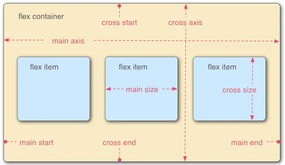

弹性盒子提供了 [`flex-direction`](https://developer.mozilla.org/zh-CN/docs/Web/CSS/flex-direction) 这样一个属性，它可以指定主轴的方向（弹性盒子子类放置的地方）——它默认值是 `row`，这使得它们在按你浏览器的默认语言方向排成一排。**备注：** 你还可以使用 `row-reverse` 和 `column-reverse` 值反向排列 flex 项

当你在布局中使用定宽或者定高的时候，可能会出现问题即处于容器中的弹性盒子子元素会溢出，破坏了布局。

在这里我们看到，子代确实超出了它们的容器。解决此问题的一种方法是将以下声明添加到 section css 规则中：

```css
flex-wrap: wrap;
```

同时，把以下规则也添加到 [``](https://developer.mozilla.org/zh-CN/docs/Web/HTML/Element/article) 规则中：

```css
flex: 200px;
```

存在着 [`flex-direction`](https://developer.mozilla.org/zh-CN/docs/Web/CSS/flex-direction) 和 [`flex-wrap`](https://developer.mozilla.org/zh-CN/docs/Web/CSS/flex-wrap)——的缩写 [`flex-flow`](https://developer.mozilla.org/zh-CN/docs/Web/CSS/flex-flow)。

如何控制 flex 项占用空间的比例

将以下规则添加到 CSS 的底部：

```css
article {
  flex: 1;
}
```

这是一个无单位的比例值，表示每个 flex 项沿主轴的可用空间大小。本例中，我们设置 [``](https://developer.mozilla.org/zh-CN/docs/Web/HTML/Element/article) 元素的 flex 值为 1，这表示每个元素占用空间都是相等的，占用的空间是在设置 padding 和 margin 之后剩余的空间。因为它是一个比例，这意味着将每个 flex 项的设置为 400000 的效果和 1 的时候是完全一样的。

你还可以指定 flex 的最小值。尝试修改现有的 article 规则：

```css
article {
  flex: 1 200px;
}

article:nth-of-type(3) {
  flex: 2 200px;
}
```

这表示“每个 flex 项将首先给出 200px 的可用空间，然后，剩余的可用空间将根据分配的比例共享”。

弹性盒子的真正价值可以体现在它的灵活性/响应性，如果你调整浏览器窗口的大小，或者增加一个 [``](https://developer.mozilla.org/zh-CN/docs/Web/HTML/Element/article) 元素，这时的布局仍旧是好的。

[`flex`](https://developer.mozilla.org/zh-CN/docs/Web/CSS/flex) 是一个可以指定最多三个不同值的缩写属性：

- 第一个就是上面所讨论过的无单位比例。可以单独指定全写 [`flex-grow`](https://developer.mozilla.org/zh-CN/docs/Web/CSS/flex-grow) 属性的值。
- 第二个无单位比例——[`flex-shrink`](https://developer.mozilla.org/zh-CN/docs/Web/CSS/flex-shrink)——一般用于溢出容器的 flex 项。这指定了从每个 flex 项中取出多少溢出量，以阻止它们溢出它们的容器。这是一个相当高级的弹性盒子功能，我们不会在本文中进一步说明。
- 第三个是上面讨论的最小值。可以单独指定全写 [`flex-basis`](https://developer.mozilla.org/zh-CN/docs/Web/CSS/flex-basis) 属性的值。

我们建议不要使用全写属性，除非你真的需要（比如要去覆盖之前写的）。使用全写会多写很多的代码，它们也可能有点让人困惑。

还可以使用弹性盒子的功能让 flex 项沿主轴或交叉轴对齐。

[`align-items`](https://developer.mozilla.org/zh-CN/docs/Web/CSS/align-items) 控制 flex 项在交叉轴上的位置。

- 默认的值是 `stretch`，其会使所有 flex 项沿着交叉轴的方向拉伸以填充父容器。如果父容器在交叉轴方向上没有固定宽度（即高度），则所有 flex 项将变得与最长的 flex 项一样长（即高度保持一致）。我们的第一个例子在默认情况下得到相等的高度的列的原因。
- 在上面规则中我们使用的 `center` 值会使这些项保持其原有的高度，但是会在交叉轴居中。这就是那些按钮垂直居中的原因。
- 你也可以设置诸如 `flex-start` 或 `flex-end` 这样使 flex 项在交叉轴的开始或结束处对齐所有的值。查看 [`align-items`](https://developer.mozilla.org/zh-CN/docs/Web/CSS/align-items) 了解更多。

[`justify-content`](https://developer.mozilla.org/zh-CN/docs/Web/CSS/justify-content) 控制 flex 项在主轴上的位置。

- 默认值是 `flex-start`，这会使所有 flex 项都位于主轴的开始处。
- 你也可以用 `flex-end` 来让 flex 项到结尾处。
- `center` 在 `justify-content` 里也是可用的，可以让 flex 项在主轴居中。
- 而我们上面用到的值 `space-around` 是很有用的——它会使所有 flex 项沿着主轴均匀地分布，在任意一端都会留有一点空间。
- 还有一个值是 `space-between`，它和 `space-around` 非常相似，只是它不会在两端留下任何空间。

弹性盒子也有可以改变 flex 项的布局位置的功能，而不会影响到源顺序（即 dom 树里元素的顺序）。这也是传统布局方式很难做到的一点。

代码也很简单，将下面的 CSS 添加到示例代码下面。

```css
button:first-child {
  order: 1;
}
```

下面我们谈下它实现的一些细节：

- 所有 flex 项默认的 [`order`](https://developer.mozilla.org/zh-CN/docs/Web/CSS/order) 值是 0。
- order 值大的 flex 项比 order 值小的在显示顺序中更靠后。
- 相同 order 值的 flex 项按源顺序显示。所以假如你有四个元素，其 order 值分别是 2，1，1 和 0，那么它们的显示顺序就分别是第四，第二，第三，和第一。
- 第三个元素显示在第二个后面是因为它们的 order 值一样，且第三个元素在源顺序中排在第二个后面。

你也可以给 order 设置负值使它们比值为 0 的元素排得更前面。

弹性盒子也能创建一些颇为复杂的布局。设置一个元素为 flex 项，那么他同样成为一个 flex 容器，它的孩子（直接子节点）也表现为弹性盒子。（嵌套）

## 网格布局

一个网格通常具有许多的**列（column）与行（row）**，以及行与行、列与列之间的间隙，这个间隙一般被称为**沟槽（gutter）**。

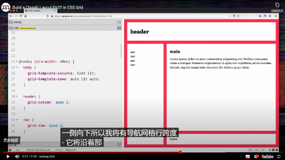

与弹性盒子一样，将父容器改为网格布局后，他的直接子项会变为网格项。

与弹性盒子不同的是，在定义网格后，网页并不会马上发生变化。因为 `display: grid` 的声明只创建了一个只有一列的网格，所以子项还是会像正常布局流那样，自上而下、一个接一个的排布。

为了让我们的容器看起来更像一个网格，我们要给刚定义的网格加一些列。那就让我们加三个宽度为`200px`的列。当然，这里可以用任何长度单位，包括百分比。

```css
.container {
  display: grid;
  grid-template-columns: 200px 200px 200px;
}
```

除了长度和百分比，我们也可以用 `fr` 这个单位来灵活地定义网格的行与列的大小。这个单位代表网格容器中可用空间的一份

`fr`单位分配的是*可用*空间而非*所有*空间，所以如果某一格包含的内容变多了，那么整个可用空间就会减少，可用空间是不包括那些已经确定被占用的空间的。

使用 [`grid-column-gap`](https://developer.mozilla.org/zh-CN/docs/Web/CSS/grid-column-gap) 属性来定义列间隙；使用 [`grid-row-gap`](https://developer.mozilla.org/zh-CN/docs/Web/CSS/grid-row-gap) 来定义行间隙；使用 [`grid-gap`](https://developer.mozilla.org/zh-CN/docs/Web/CSS/grid-gap) 可以同时设定两者。

间隙距离可以用任何长度单位包括百分比来表示，但不能使用`fr`单位。

到目前为止，我们定义过了列，但还没有管过行。但在这之前，我们要来理解一下显式网格和隐式网格。显式网格是我们用 `grid-template-columns` 或 `grid-template-rows` 属性创建的。而隐式网格则是当有内容被放到网格外时才会生成的。显式网格与隐式网格的关系与弹性盒子的 main 和 cross 轴的关系有些类似。

隐式网格中生成的行/列大小是参数默认是 `auto` ，大小会根据放入的内容自动调整。

当然，你也可以使用[`grid-auto-rows`](https://developer.mozilla.org/zh-CN/docs/Web/CSS/grid-auto-rows)和[`grid-auto-columns`](https://developer.mozilla.org/zh-CN/docs/Web/CSS/grid-auto-columns)属性手动设定隐式网格轨道的大小

译者注：简单来说，隐式网格就是为了放显式网格放不下的元素，浏览器根据已经定义的显式网格自动生成的网格部分

100 像素高的轨道有时可能会不够用，因为时常会有比 100 像素高的内容加进去。所以，我们可以将其设定为至少 100 像素，并且能够跟随内容来自动拓展尺寸，从而保证能容纳所有内容。显而易见，你很难知道网页上某个元素的尺寸在不同情况下会变成多少，一些额外的内容或者更大的字号就会导致许多能做到像素级精准的设计出现问题。所以，我们有了[`minmax()`](https://developer.mozilla.org/zh-CN/docs/Web/CSS/minmax)函数。

在定义完了网格之后，我们要把元素放入网格中。我们的网格有许多分隔线，第一条线的起始点与文档书写模式相关。在英文中，第一条列分隔线（即网格边缘线）在网格的最左边而第一条行分隔线在网格的最上面。而对于阿拉伯语，第一条列分隔线在网格的最右边，因为阿拉伯文是从右往左书写的。

我们根据这些分隔线来放置元素，通过以下属性来指定从那条线开始到哪条线结束。

- [`grid-column-start`](https://developer.mozilla.org/en-US/docs/Web/CSS/grid-column-start)
- [`grid-column-end`](https://developer.mozilla.org/en-US/docs/Web/CSS/grid-column-end)
- [`grid-row-start`](https://developer.mozilla.org/en-US/docs/Web/CSS/grid-row-start)
- [`grid-row-end`](https://developer.mozilla.org/en-US/docs/Web/CSS/grid-row-end)

这些属性的值均为分隔线序号，你也可以用以下缩写形式来同时指定开始与结束的线。

- [`grid-column`](https://developer.mozilla.org/zh-CN/docs/Web/CSS/grid-column)
- [`grid-row`](https://developer.mozilla.org/zh-CN/docs/Web/CSS/grid-row)

注意开始与结束的线的序号要使用`/`符号分开。

```css
header {
  grid-column: 1 / 3;
  grid-row: 1;
}

article {
  grid-column: 2;
  grid-row: 2;
}

aside {
  grid-column: 1;
  grid-row: 2;
}

footer {
  grid-column: 1 / 3;
  grid-row: 3;
}
```

[使用 grid-template-areas 属性放置元素](https://developer.mozilla.org/zh-CN/docs/Learn_web_development/Core/CSS_layout/Grids#使用_grid-template-areas_属性放置元素)

另一种往网格放元素的方式是用[`grid-template-areas`](https://developer.mozilla.org/zh-CN/docs/Web/CSS/grid-template-areas)属性，并且你要命名一些元素并在属性中使用这些名字作为一个区域。

```css
.container {
  display: grid;
  grid-template-areas:
    "header header"
    "sidebar content"
    "footer footer";
  grid-template-columns: 1fr 3fr;
  gap: 20px;
}

header {
  grid-area: header;
}

article {
  grid-area: content;
}

aside {
  grid-area: sidebar;
}

footer {
  grid-area: footer;
}
```

`grid-template-areas`属性的使用规则如下：

- 你需要填满网格的每个格子
- 对于某个横跨多个格子的元素，重复写上那个元素`grid-area`属性定义的区域名字
- 所有名字只能出现在一个连续的区域，不能在不同的位置出现
- 一个连续的区域必须是一个矩形
- 使用`.`符号，让一个格子留空

## 响应式设计

早年设计 Web 时，页面是以适配特定的屏幕大小为考量创建的。如果用户正在使用比设计者考虑到的更小或者更大的屏幕，那么结果从多余的滚动条，到过长的行和没有被合理利用的空间，不一而足。随着人们使用的屏幕尺寸的种类越来越多，出现了响应式网页设计的概念（*responsive web design，RWD*），RWD 指的是允许 Web 页面适应不同屏幕宽度因素等，进行布局和外观的调整的一系列实践。

“响应式设计”这个词是[Ethan Marcotte 在 2010 年首度提出的](https://alistapart.com/article/responsive-web-design/)，他将其描述为三种技术的混合使用。

1. 第一个是液态网格，这早先已由 Gillenwater 进行探讨，可以在 Marcotte 的文章《[Fluid Grids](https://alistapart.com/article/fluidgrids/)》（出版于 2009 年的《A List Apart》上）中读到。
2. 第二个是[液态图像](https://unstoppablerobotninja.com/entry/fluid-images)的理念。通过使用相当简单的将设置`max-width`属性设置为`100%`的技术，图像可以在包含它们的列变得比图像原始尺寸窄的时候，缩放得更小，但总不会变得更大。这使得图像可以被缩放，以被放到一个灵活尺寸的列，而不是溢出出去，同时也不会在列宽于图像的时候，使图像变得太大以至于画质变得粗糙。
3. 第三个关键的组件是[媒体查询](https://developer.mozilla.org/zh-CN/docs/Web/CSS/CSS_media_queries)。媒体查询使以往 Cameron Adams 探讨过的、由 JavaScript 实现的布局类型切换，可以只使用 CSS 实现。和所有尺寸的屏幕都使用一种布局不同的是，布局是可以改变的：侧栏可以在小屏幕上重新布局，而替代用的导航栏也可以显示出来。

需要你理解的很重要的一点是**响应式 Web 设计不是单独的技术**，它是描述 Web 设计的一种方式、或者是一组最佳实践的一个词，它是用来建立可以**响应**查看内容的设备的样式的一个词。在 Marcotte's 原来的探索中，这意味着灵活网格（使用 float）和媒体查询，但是在这篇文章写就的几乎十年以后，Web 的响应式工作已经成为了默认做法。现代的 CSS 布局方式基本上就是响应式的，而且我们在 Web 平台上内置了新的东西，使得设计响应式站点变得容易。

媒介查询允许我们运行一系列测试，例如用户的屏幕是否大于某个宽度或者某个分辨率，并将 CSS 选择性地适应用户的需要应用在样式化页面上。响应式站点不只是在断点之间改变它们的布局，它们是建立在灵活网格上的。一个灵活网格意味着你不需要适配每个可能使用的设备尺寸，然后为其建立一个精确到像素级的适配布局。使用灵活网格，你只需要加进去一个断点，在内容看起来不齐整的时候改变设计。例如如果一行随着屏幕大小增加而增长得不可读的长，或者是一个盒子在变窄时把每行的两个单词挤到一起。现代布局方式，例如[多栏布局](https://developer.mozilla.org/zh-CN/docs/Learn_web_development/Core/CSS_layout/Multiple-column_Layout)、[伸缩盒](https://developer.mozilla.org/zh-CN/docs/Learn_web_development/Core/CSS_layout/Flexbox)和[网格](https://developer.mozilla.org/zh-CN/docs/Learn_web_development/Core/CSS_layout/Grids)默认是响应式的。它们都假设你在尽力创建一个可伸缩网格，而且给了你更容易这样做的方式。

这些布局方式中最老的一个是多个列，即当你指定一个`column-count`的时候，这意指你希望把你的内容分成多少列。浏览器之后会算出这些列的大小，这是一个随着屏幕尺寸变化的尺寸。

如果你却去指定`column-width`的话，你是在指定一个*最小*宽度。浏览器会尽可能多数量地创建这一宽度的列，只要它们可以恰当地放进容器里面，然后将所有列之间的剩余空间共享出去。因而列的数量会随着空间的多少而改变。

在伸缩盒中，初始的行为是，弹性的物件将参照容器里面的空间的大小，缩小和分布物件之间的空间。通过更改`flex-grow`和 `flex-shrink`的值，你可以指示在物件遇到周围有更多或者更少的空间的情况下，你所期望的物件表现。

最简单的处理响应式图像的方式是在 Marcotte 的早年的关于响应式设计的文章上所描述的那样。基本来说，你可以用一张有着所需最大尺寸的图像。然后缩放它。这仍然是今日所使用的一种方式，而且在大多数样式表里面，你在某些地方可以找到下面的 CSS：

```css
img {
  max-width: 100%;
}
```

这种方式有显然的弊端。图像有可能会显示得比它的原始尺寸小很多，以至于浪费带宽——一个移动端用户会下载几倍于他们在浏览器窗口中实际看到的大小的图像。此外，你可能不想在移动端和桌面端有相同的图像宽高比例。例如，在移动端，方形图像的表现会很好，但是在桌面端显示同样的内容则应用宽图像。或者，认识到移动端更小尺寸的图像的你也许会希望同时展示一张不同的图像，一张在小一点的屏幕上更容易理解的图像。这些东西不能简单通过缩放图像解决。

响应式图像，使用了[``](https://developer.mozilla.org/zh-CN/docs/Web/HTML/Element/picture)元素和[``](https://developer.mozilla.org/zh-CN/docs/Web/HTML/Element/img) `srcset`和`sizes` 特性，解决了这两个问题。你可以提供附带着“提示”（描述图像最适合的屏幕尺寸和分辨率的元数据）的多种尺寸，浏览器将会选择对设备最合适的图像，以确保用户下载尺寸适合他们使用的设备的图像。

一个有趣的方式是使用视口单位`vw`来实现响应式排版。`1vw`等同于视口宽度的百分之一，即如果你用`vw`来设定字体大小的话，字体的大小将总是随视口的大小进行改变。

问题在于，当做上面的事情的时候，因为文本总是随着视口的大小改变大小，用户失去了放缩任何使用`vw`单位的文本的能力。**所以你永远都不要只用 viewport 单位设定文本。**

这里有一个解决方法，它使用了[`calc()`](https://developer.mozilla.org/zh-CN/docs/Web/CSS/calc)，如果你将`vw`单位加到了使用固定大小（例如`em`或者`rem`）的值组，那么文本仍然是可放缩的。基本来说，是`vw`加在了放缩后的值上。

```css
h1 {
  font-size: calc(1.5rem + 3vw);
}
```

这就是说，我们只需要指定标题的字体大小一次，而不是为移动端设定它，然后再在媒介查询中重新定义它。字体会在你增加视口大小的时候逐渐增大。

如果你看看一张响应式页面的 HTML 源代码，你通常将会在文档的`<head>`看到下面的[``](https://developer.mozilla.org/zh-CN/docs/Web/HTML/Element/meta)标签。

```html
<meta name="viewport" content="width=device-width,initial-scale=1" />
```

这个元标签告诉移动端浏览器，它们应该将视口宽度设定为设备的宽度，将文档放大到其预期大小的 100%，在移动端以你所希望的为移动优化的大小展示文档。

为何需要这个？因为移动端浏览器倾向于在它们的视口宽度上说谎。

通过设定`width=device-width`，你用设备的实际宽度覆写了苹果默认的`width=960px`，然后你的媒介查询就会像预期那样生效。

**所以你应该在你的文档头部\*总是\*包含上面那行 HTML。**

和视口元标签一起，你可以使用另外几个设定，但大体说来，上面那行就是你想要使用的。

- `initial-scale`：设定了页面的初始缩放，我们设定为 1。
- `height`：特别为视口设定一个高度。
- `minimum-scale`：设定最小缩放级别。
- `maximum-scale`：设定最大缩放级别。
- `user-scalable`：如果设为`no`的话阻止缩放。

你应该避免使用`minimum-scale`、`maximum-scale`，尤其是将`user-scalable`设为`no`。用户应该有权力尽可能大或小地进行缩放，阻止这种做法会引起访问性问题。

## 媒体查询

**CSS 媒体查询**为你提供了一种应用 CSS 的方法，仅在浏览器和设备的环境与你指定的规则相匹配的时候 CSS 才会真的被应用，例如“视口宽于 480 像素”的时候。媒体查询是响应式 Web 设计的关键部分，因为它允许你按照视口的尺寸创建不同的布局，不过它也可以用来探测和你的站点运行的环境相关联的其他条件，比如用户是在使用触摸屏还是鼠标。在本节课，你将会先学习到媒体查询的语法，然后继续在一个被安排好的示例中使用它，这个示例还会告诉你一个简单的设计是可以怎么被弄成响应式的。

最简单的媒体查询语法看起来是像这样的：

CSSCopy to Clipboard

```css
@media media-type and (media-feature-rule) {
  /* CSS rules go here */
}
```

它由以下部分组成：

- 一个媒体类型，告诉浏览器这段代码是用在什么类型的媒体上的（例如印刷品或者屏幕）；
- 一个媒体表达式，是一个被包含的 CSS 生效所需的规则或者测试；
- 一组 CSS 规则，会在测试通过且媒体类型正确的时候应用。

你可以指定的媒体类型为：

- `all`
- `print`
- `screen`
- `speech`

**备注：** 媒体类型是可选的，如果你没有在媒体查询中指示一个媒体类型的话，那么媒体查询默认会设为用于全部媒体类型。

常用的媒体特征规则包括：宽和高、朝向、使用指点设备

引入媒体查询的点就叫做**断点**。

泛泛地说，你可以采用两种方式实现响应式设计。你可以从桌面或者最宽的视图开始，然后随着视口变得越来越小，加上断点，把物件挪开；你也可以从最小的视图开始，随着视口变得越来越大，增添布局内容。第二种方式被叫做**移动优先**的响应式设计，很多时候是最值得仿效的做法。

弹性盒、网格和多栏布局都给了你建立可伸缩的甚至是响应式组件的方式，而不需要媒体查询。这些布局方式能否在不加入媒体查询的时候实现你想要的设计，总是值得考虑的一件事。例如，你可能想要一组卡片，至少为二百像素宽，并在主文章里尽可能多地放下这些二百像素的卡片。这可以用网格布局实现，而完全不使用媒体查询。

在你的浏览器里打开这个示例，让屏幕变宽变窄，看一看列轨数目的变化。这个方法里面的好事是，网格不是靠视口宽度判断的，而是可以容纳组件的宽度。对媒体查询这章节的建议就是，你可能根本不需要它！但是，实践中你会发现，由媒体查询改进的现代布局方式的恰当使用，将会产生最佳效果。

# JS

## 简介

JavaScript 是一门为网站添加交互性的编程语言。交互性体现在游戏、点击按钮或输入表单时的响应行为；动态的样式，动画等等

JavaScript 本身相对简洁，但非常灵活。开发者在核心 JavaScript 语言的基础上编写了各种工具，让你能以最小的努力解锁大量的功能。这些工具包括：

- Web 浏览器内置的应用程序编程接口（[API](https://developer.mozilla.org/zh-CN/docs/Glossary/API)），提供了丰富的功能，例如：动态创建 HTML 和设置 CSS 样式；从用户的摄像头采集和处理视频流、生成 3D 图形和音频样本。
- 允许开发者将来自其他内容提供商（如 [Disqus](https://disqus.com/)、Facebook）的功能整合到自己的网站中的第三方 API。
- 能够应用于 HTML 加速网站和应用程序开发的第三方框架和库。

将 [``](https://developer.mozilla.org/zh-CN/docs/Web/HTML/Element/script) 元素放在 HTML 文件的底部附近的原因是**浏览器会按照代码在文件中的顺序进行读取**。

如果 JavaScript 先加载，并期望操纵还未加载的 HTML，可能会出现问题。将 JavaScript 放在 HTML 页面的底部附近是解决方案之一。（专业术语叫脚本加载策略）

这与 CSS 选择器的用法非常相像。若要对某个元素进行操作，首先得选择它。这个特性来自DOM API。

变量：let类型

分号表示语句结束

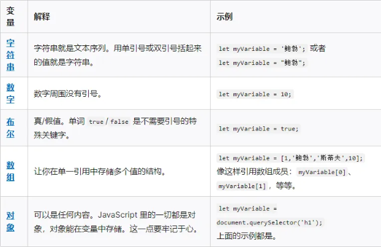

- **`==`**：也被称为宽松相等运算符。在进行比较时，它会先尝试对两边的操作数进行类型转换，然后再比较它们的值是否相等。
- **`===`**：也被称为严格相等运算符。它不会进行类型转换，只有当两个操作数的类型相同且值也相等时，才会返回 `true`。

在条件判断中建议使用===

```jsx
document.querySelector("html").addEventListener("click", function () {
  alert("别戳我，我怕疼！");
});
```

传递给 `addEventListener()` 的函数被称为*匿名函数*，因为它没有名字。匿名函数还有另一种书写方式，我们称之为*箭头函数*。

```jsx
document.querySelector("html").addEventListener("click", () => {
  alert("别戳我，我怕疼！");
});
```

客户端 JavaScript 语言的核心包含一些普遍的编程特性，以让你可以做到如下的事情：

- 在变量中储存有用的值。比如上文的示例中，我们请求客户输入一个新名字，然后将其储存到 `name` 变量中。
- 操作一段文本（在编程中称为“字符串”（string））。上文的示例中，我们取字符串“玩家 1：”，然后把它和 `name` 变量拼接起来，创造出完整的文本标签，比如“玩家 1：小明”。
- 运行代码以响应网页中发生的特定事件。上文的示例中，我们用一个 [`click`](https://developer.mozilla.org/zh-CN/docs/Web/API/Element/click_event) 事件来检测按钮什么时候被点击，然后运行代码更新文本标签。
- 以及更多！

JavaScript 语言核心之上所构建的功能更令人兴奋。**应用程序接口**（**Application Programming Interface，API**）将为你的代码提供额外的超能力。

API 是已经建立好的一套代码组件，可以让开发者实现原本很难甚至无法实现的程序。就像现成的家具套件之于家居建设，用一些已经切好的木板组装一个书柜，显然比自己设计，寻找合适的木材，裁切至合适的尺寸和形状，找到正确尺寸的螺钉，*然后*再组装成书柜要简单得多。

API 通常分为两类。

**浏览器 API** 内建于 web 浏览器中，它们可以将数据从周边计算机环境中筛选出来，还可以做实用的复杂工作。例如：

- [文档对象模型 API](https://developer.mozilla.org/zh-CN/docs/Web/API/Document_Object_Model) 能通过创建、移除和修改 HTML，为页面动态应用新样式等手段来操作 HTML 和 CSS。比如当某个页面出现了一个弹窗，或者显示了一些新内容（像上文小演示中看到那样），这就是 DOM 在运行。
- [地理位置 API](https://developer.mozilla.org/zh-CN/docs/Web/API/Geolocation) 获取地理信息。这就是为什么[谷歌地图](https://www.google.com/maps)可以找到你的位置，而且标示在地图上。
- [画布（Canvas）](https://developer.mozilla.org/zh-CN/docs/Web/API/Canvas_API) 和 [WebGL](https://developer.mozilla.org/zh-CN/docs/Web/API/WebGL_API) API 可以创建生动的 2D 和 3D 图像。人们正运用这些 web 技术制作令人惊叹的作品。参见 [Chrome Experiments](https://experiments.withgoogle.com/collection/chrome) 以及 [webglsamples](https://webglsamples.org/)。
- 诸如 [`HTMLMediaElement`](https://developer.mozilla.org/zh-CN/docs/Web/API/HTMLMediaElement) 和 [WebRTC](https://developer.mozilla.org/zh-CN/docs/Web/API/WebRTC_API) 等[影音类 API](https://developer.mozilla.org/en-US/docs/Web/Media/Guides/Audio_and_video_delivery) 让你可以利用多媒体做一些非常有趣的事，比如在网页中直接播放音乐和影片，或用自己的网络摄像头获取录像，然后在其他人的电脑上展示（试用简易版[截图演示](http://chrisdavidmills.github.io/snapshot/)以理解这个概念）。

**第三方 API** 并没有默认嵌入浏览器中，一般要从网上取得它们的代码和信息。比如：

- [Twitter API](https://developer.twitter.com/en/docs)、[新浪微博 API](https://open.weibo.com/) 可以在网站上展示最新推文之类。
- [谷歌地图 API](https://developers.google.cn/maps/)、[OpenStreetMap API](https://wiki.openstreetmap.org/wiki/API)、[高德地图 API](https://lbs.amap.com/) 可以在网站嵌入定制的地图等等。

JavaScript 的一个非常常见的用途是通过文档对象模型 API（如上所述）动态修改 HTML 和 CSS，以更新用户界面。

每个浏览器标签页就是其自身用来运行代码的独立容器（这些容器用专业术语称为“运行环境”）。大多数情况下，每个标签页中的代码完全独立运行，而且一个标签页中的代码不能直接影响另一个标签页（或者另一个网站）中的代码。这是一个好的安全措施，如果不这样，黑客就可以从其他网站盗取信息，或做一些其他坏事。

**备注：** 以安全的方式在不同网站或标签页中传送代码和数据的方法是存在的，但它们属于进阶技术，本课程不会涉及。

当浏览器执行到一段 JavaScript 代码时，通常会按从上往下的顺序执行这段代码。

你或许还听说过**服务器端**（server-side）和**客户端**（client-side）代码这两个术语，尤其是在 web 开发时。客户端代码是在用户的电脑上运行的代码，在浏览一个网页时，它的客户端代码就会被下载，然后由浏览器来运行并展示。在本模块中我们讨论的主要是**客户端 JavaScript**。

而服务器端代码在服务器上运行，然后运行结果才由浏览器下载并展示出来。流行的服务器端 web 语言包括：PHP、Python、Ruby、[ASP.NET](http://ASP.NET)，甚至有 JavaScript！JavaScript 也可用作服务器端语言，比如现在流行的 Node.js 环境，你可以在我们的[动态网页——服务器端编程](https://developer.mozilla.org/zh-CN/docs/Learn_web_development/Extensions/Server-side)主题中找到更多关于服务器端 JavaScript 的知识。

JavaScript 模块需要从与 HTML 同源的地方加载，并且 `file://` URL 不符合条件。

1. 保存并刷新浏览器。就会发现点击按钮不起作用，如果检查浏览器控制台，会看见类似 

    ```
    Cross-origin request blocked
    ```

     的错误。这是因为与许多外部资源一样，JavaScript 模块需要从与 HTML 同源的地方加载，并且 

    ```
    file://
    ```

     URL 不符合条件。有两个解决方案可以解决这个问题：

    - 我们推荐的解决方案是按照指南[设置本地测试服务器](https://developer.mozilla.org/zh-CN/docs/Learn_web_development/Howto/Tools_and_setup/set_up_a_local_testing_server)。运行服务器程序并且在 `8000` 端口提供文件 `apply-javascript-external.html` 和 `script.js`，打开浏览器并访问 `http://localhost:8000`。
    - 如果无法运行本地服务器，也可以使用 `<script defer src="script.js"></script>` 代替 `<script type="module" src="script.js"></script>`。了解更多信息请参阅下面的[脚本加载策略](https://developer.mozilla.org/zh-CN/docs/Learn_web_development/Core/Scripting/What_is_JavaScript#脚本加载策略)。但是注意，本教程其他部分使用的特性可能需要本地 HTTP 服务器。

内部js：在html文档的<script>标签中直接嵌入js代码

外部js：写在.js文件中，在<script>标签中引入文件

内联js：直接在html元素中引用js代码。**然而请不要这样做**。这将使 JavaScript 污染了 HTML，而且效率低下。对于每个需要应用 JavaScript 的按钮，你都得手动添加 `onclick="createParagraph()"` 属性。与其在 HTML 中包含 JavaScript，不如使用纯 JavaScript 构造。通过 `querySelectorAll()` 函数，可以选择页面上的所有按钮。然后可以循环遍历这些按钮，使用 `addEventListener()` 为每个按钮分配一个处理器。

学习编程，语法本身并不难，真正困难的是如何应用它来解决现实世界的问题。你要开始像程序员那样思考。看到这个要求，首先我们要做的是将其分解成简单的可操作的任务，尽可能从程序员的思维去思考

for of 循环

switch case break defalut

for break continue

## 脚本加载策略

页面上的所有 HTML 代码都按其出现的顺序加载。如果使用 JavaScript 去操作页面上的元素（更准确的说，是[文档对象模型](https://developer.mozilla.org/zh-CN/docs/Learn_web_development/Core/Scripting/DOM_scripting#文档对象模型)），那么如果 JavaScript 在 HTML 之前就被加载和解析了，代码将无法运行。

有几种不同的策略来确保 JavaScript 只在 HTML 解析之后运行：

- 在上面的内部 JavaScript 示例中，脚本元素放在文档正文的底部，因此只能在 HTML 正文的其他部分被解析以后运行。

- 在上面的外部 JavaScript 实例中，脚本元素放在文档的头部，在解析 HTML 正文之前解析。但是由于我们使用了 `<script type="module">`，代码被视为一个[模块](https://developer.mozilla.org/zh-CN/docs/Web/JavaScript/Guide/Modules)，并且浏览器在执行 JavaScript 模块之前会等待所有的 HTML 代码都处理完毕（也可以把外部脚本放在正文的底部，但是如果 HTML 内容较多且网络较慢，在浏览器开始获取并加载脚本之前可能需要大量的时间，因此将外部脚本放在头部通常会更好一些）。

- 如果仍然想在文档头部使用非模块脚本，可能阻塞整个页面的显示，并且可能出现错误，因为脚本在文档解析之前执行：

    - 对于外部脚本，应该在 [``](https://developer.mozilla.org/zh-CN/docs/Web/HTML/Element/script) 元素上添加 `defer`（或者如果不需要 HTML 解析完成，则可以使用 `async`）属性。
    - 对于内部脚本，应该将代码封装在 [`DOMContextLoaded` 事件监听器](https://developer.mozilla.org/zh-CN/docs/Web/API/Document/DOMContentLoaded_event)中。

    这超出了本教程的范围，除非你需要支持非常老的浏览器，否则不要这样做，使用 `<script type="module">` 代替即可。

这一行通过 [`focus()`](https://developer.mozilla.org/en-US/docs/Web/API/HTMLElement/focus) 方法让光标在页面加载完毕时自动放置于 [``](https://developer.mozilla.org/zh-CN/docs/Web/HTML/Element/input) 输入框内，这意味着玩家可以马上开始第一次猜测，而无需点击输入框。这只是一个小的改进，却提高了可用性——为使用户能投入游戏提供一个良好的视觉线索。

## 变量和数据类型

深入分析一下。JavaScript 中一切都是对象。对象是存储在单个分组中的相关功能的集合。可以创建自己的对象，但这是较高阶的知识，我们今后才会谈及。现在，仅需简要讨论浏览器内置的对象，它们已经能够做许多有用的事情。

使用 [`document`](https://developer.mozilla.org/zh-CN/docs/Web/API/Document) 对象的 [`querySelector()`](https://developer.mozilla.org/zh-CN/docs/Web/API/Document/querySelector) 方法可以获得这个引用。`querySelector()` 需要一个信息——用一个 [CSS 选择器](https://developer.mozilla.org/zh-CN/docs/Learn_web_development/Core/Styling_basics/Basic_selectors) 可以选中需要引用的元素。

```jsx
const guessField = document.querySelector(".guessField");
```

因为 `guessField` 现在包含一个指向 [``](https://developer.mozilla.org/zh-CN/docs/Web/HTML/Element/input) 元素的引用，它现在就能够访问一系列的属性（存储于对象内部的基础变量，其中一些的值无法改变）和方法（存储在对象内部的基础函数）。`focus()` 是 `input` 元素可用方法之一，因此我们可以使用这行代码将光标聚焦于此文本框上︰

```jsx
guessField.focus();
```

页面上的每个元素都有一个 `style` 属性，它本身包含一个对象，其属性包含应用于该元素的所有内联 CSS 样式。让我们可以使用 JavaScript 在元素上动态设置新的 CSS 样式。

**备注：** 如果你写一个声明和初始化变量的多行 JavaScript 代码的程序，你可以在初始化变量之后再实际声明它，并且它仍然可以工作。这是因为变量的声明通常在其余的代码执行之前完成。这叫做**顶置**—阅读[var hoisting](https://developer.mozilla.org/zh-CN/docs/Web/JavaScript/Reference/Statements/var#var_hoisting)来了解更多细节。

首先，如果你编写一个声明并初始化变量的多行 JavaScript 程序，你可以在初始化一个变量之后用 `var` 声明它，它仍然可以工作。例如：

**备注：** 只有在 web 文档中运行多行 JavaScript 时才会有这种效果，当在 JavaScript 控制台中键入单独的行，这将不起作用。

这是由于变量的**提升**，更多细节请阅读[变量提升](https://developer.mozilla.org/zh-CN/docs/Web/JavaScript/Reference/Statements/var#变量提升)。

但提升操作不再适用于 `let` 。如果将上面例子中的 `var` 替换成 `let` 将不起作用并引起一个错误。这是一件好事——因为初始化后再声明一个变量会使代码变得混乱和难以理解。

其次，当你使用 `var` 时，可以根据需要多次声明相同名称的变量，但是 `let` 不能。以下将有效：

同样，这是一个明智的语言决定。没有理由重新声明变量——这只会让事情变得更加混乱。

出于这些以及其他原因，我们建议你在代码中尽可能多地使用 `let`，而不是 `var`。因为没有理由使用 `var`，除非你需要用代码支持旧版本的 Internet Explorer (它直到第 11 版才支持 `let` ，现代的 Windows Edge 浏览器支持的很好)。

- 一个可靠的命名约定叫做 ["小写驼峰命名法"](https://en.wikipedia.org/wiki/CamelCase#Variations_and_synonyms)，用来将多个单词组在一起，小写整个命名的第一个字母然后大写剩下单词的首字符。我们已经在文章中使用了这种命名方法。

你可以在变量中存储数字，不论这些数字是像 30（也叫整数）这样，或者像 2.456 这样的小数（也叫做浮点数）。与其他编程语言不同，在 JavaScript 中你不需要声明一个变量的类型。当你给一个变量数字赋值时，不需要用引号括起来。

字符串是文本的一部分。当你给一个变量赋值为字符串时，你需要用单引号或者双引号把值给包起来，否则 JavaScript 将会把这个字符串值理解成别的变量名。

Boolean 的值有 2 种：true 或 false。它们通常被用于在适当的代码之后，测试条件是否成立。举个例子，一个简单的示例如下：

数组是一个单个对象，其中包含很多值，方括号括起来，并用逗号分隔。尝试在你的控制台输入以下行：

此处的方括号包含一个索引值，该值指定要返回的值的位置。你可能已经注意到，计算机从 0 开始计数，而不是像我们人类那样的 1。

在编程中，对象是现实生活中的模型的一种代码结构。你可以有一个简单的对象，代表一个停车场，并包含有关其宽度和长度的信息，或者你可以有一个代表一个人的对象，并包含有关他们的名字，身高，体重，他们说什么语言，如何说 你好，他们，等等。大括号括起来

JavaScript 是一种“动态类型语言”，这意味着不同于其他一些语言 (译者注：如 C、JAVA)，你不需要指定变量将包含什么数据类型（例如 number 或 string）

## 字符串

在 JavaScript 中，你可以选择单引号（`'`）、双引号（`"`）或反引号（```）来包裹字符串。

使用反引号声明的字符串是一种特殊字符串，被称为[*模板字面量*](https://developer.mozilla.org/zh-CN/docs/Web/JavaScript/Reference/Template_literals)。在大多数情况下，模板字面量与普通字符串类似，但它具有一些特殊的属性：

- **你可以在其中[嵌入 JavaScript](https://developer.mozilla.org/zh-CN/docs/Learn_web_development/Core/Scripting/Strings#嵌入_javascript)**
- 你可以声明[多行](https://developer.mozilla.org/zh-CN/docs/Learn_web_development/Core/Scripting/Strings#多行字符串)的模板字面量

在模板字面量中，你可以在 `${ }` 中包装 JavaScript 变量或表达式，其结果将被包含在字符串中

这里我们使用了第 4 行中的 [`window.prompt()`](https://developer.mozilla.org/zh-CN/docs/Web/API/Window/prompt) 函数，它要求用户在弹出的对话框中回答一个问题然后将他们输入的文本存储在一个给定的变量中

你只能将 `${}` 与模板字面量一起使用，而不能与不同字符串一起使用。你可以使用 `+` 运算符来连接普通字符串。

```jsx
const greeting = "你好";
const name = "克里斯";
console.log(greeting + "，" + name); // "你好，克里斯"
```

但是，模板字面量通常更具可读性：

```jsx
const greeting = "你好";
const name = "克里斯";
console.log(`${greeting}，${name}`); // "你好，克里斯"
```

除了变量，你还可以在模板字面量中包含 JavaScript 表达式，表达式的结果将包含在最终的结果中：

模板字符串会保留源代码中的换行符，因此你可以编写跨越多行的字符串，如下所示：

要使用普通字符串获得等效的输出，你必须在字符串中包含换行字符（`\\n`）：

当我们尝试连接一个字符串和数字时会发生什么？让我们在控制台中尝试一下：

你可能会认为这会返回一个错误，但它可以正常工作。数字应该如何显示为字符串是相当明确的，所以浏览器会自动将数字转换为字符串，并将两个字符串连接起来。

如果可以的话，[`Number()`](https://developer.mozilla.org/zh-CN/docs/Web/JavaScript/Reference/Global_Objects/Number/Number) 函数会将其参数转换为数字。试试这个：

相反，[`String()`](https://developer.mozilla.org/zh-CN/docs/Web/JavaScript/Reference/Global_Objects/String/String) 函数将其参数转换为字符串。试试这个

把字符串当作对象，我们曾经说过，现在我们重申一遍—在 javascript 中，一切东西都可以被当作对象。使用 [`length`](https://developer.mozilla.org/zh-CN/docs/Web/JavaScript/Reference/Global_Objects/String/length) 属性可以获得长度，

在相关的注释中，你可以使用方括号表示法返回字符串中的任何字符 - 这意味着你可以在变量名的末尾包含方括号（[ ]）。在方括号内，你可以包含要返回的字符的编号，例如，你要检索第一个字母，可以这样做：

有时候你会想要找出一个较小的字符串是否存在于一个较大的字符串中（我们通常会说一个字符串中存在一个子字符串）。这可以使用[`indexOf()`](https://developer.mozilla.org/zh-CN/docs/Web/JavaScript/Reference/Global_Objects/String/indexOf)方法来完成，该方法需要一个[parameter](https://developer.mozilla.org/zh-CN/docs/Glossary/Parameter) — 你想要搜索的子字符串。尝试以下：

当你知道字符串中的子字符串开始的位置，以及想要结束的字符时，[`slice()`](https://developer.mozilla.org/zh-CN/docs/Web/JavaScript/Reference/Global_Objects/String/slice)可以用来提取 它。尝试以下：

此外，如果你知道要在某个字符之后提取字符串中的所有剩余字符，则不必包含第二个参数，而只需要包含要从中提取的字符位置 字符串中的其余字符。尝试以下：

字符串方法[`toLowerCase()`](https://developer.mozilla.org/zh-CN/docs/Web/JavaScript/Reference/Global_Objects/String/toLowerCase)和[`toUpperCase()`](https://developer.mozilla.org/zh-CN/docs/Web/JavaScript/Reference/Global_Objects/String/toUpperCase)字符串并将所有字符分别转换为小写或大写。例如，如果要在将数据存储在数据库中之前对所有用户输入的数据进行规范化，这可能非常有用。

你可以使用[`replace()`](https://developer.mozilla.org/zh-CN/docs/Web/JavaScript/Reference/Global_Objects/String/replace)方法将字符串中的一个子字符串替换为另一个子字符串。在基础的层面上，这个工作非常简单。你当然可以用它做一些更高级的事情，但目前我们不会涉及到。

请注意，数组中包含数组的话称之为多维数组。你可以通过将两组方括号链接在一起来访问数组内的另一个数组。例如，要访问数组内部的一个项目，即 `random` 数组中的第三个项目（参见上一节），我们可以这样做：

你可以通过使用 [`length`](https://developer.mozilla.org/zh-CN/docs/Web/JavaScript/Reference/Global_Objects/Array/length) 属性获取数组的长度（数组中有多少项元素），这与查找字符串的长度（以字符为单位）完全相同。尝试以下代码：

通常，你会看到一个包含在一个长长的字符串中的原始数据，你可能希望将有用的项目分成更有用的表单，然后对它们进行处理，例如将它们显示在数据表中。为此，我们可以使用 [`split()`](https://developer.mozilla.org/zh-CN/docs/Web/JavaScript/Reference/Global_Objects/String/split) 方法。在其最简单的形式中，这需要一个参数，你要将字符串分隔的字符，并返回分隔符之间的子串，作为数组中的项。

你也可以使用 [`join()`](https://developer.mozilla.org/zh-CN/docs/Web/JavaScript/Reference/Global_Objects/Array/join) 方法进行相反的操作。尝试以下：

将数组转换为字符串的另一种方法是使用 [`toString()`](https://developer.mozilla.org/zh-CN/docs/Web/JavaScript/Reference/Global_Objects/Array/toString) 方法。 `toString()` 可以比 `join()` 更简单，因为它不需要一个参数，但更有限制。使用 `join()` 可以指定不同的分隔符（尝试使用与逗号不同的字符运行步骤 4）。

首先，要在数组末尾添加或删除一个项目，我们可以使用 [`push()`](https://developer.mozilla.org/zh-CN/docs/Web/JavaScript/Reference/Global_Objects/Array/push) 和 [`pop()`](https://developer.mozilla.org/zh-CN/docs/Web/JavaScript/Reference/Global_Objects/Array/pop)。

[`unshift()`](https://developer.mozilla.org/zh-CN/docs/Web/JavaScript/Reference/Global_Objects/Array/unshift) 和 [`shift()`](https://developer.mozilla.org/zh-CN/docs/Web/JavaScript/Reference/Global_Objects/Array/shift) 从功能上与 [`push()`](https://developer.mozilla.org/zh-CN/docs/Web/JavaScript/Reference/Global_Objects/Array/push) 和 [`pop()`](https://developer.mozilla.org/zh-CN/docs/Web/JavaScript/Reference/Global_Objects/Array/pop) 完全相同，只是它们分别作用于数组的开始，而不是结尾。

## 函数

JavaScript 语言中有许多内置的函数，它们可以让你无需自己编写所有的代码，就能做很多有用的事情。事实上，许多你**调用**（专业词语，意指“运行”或“执行”）浏览器内置函数时调用的代码并不能用 JavaScript 来编写——大多数调用浏览器后台的函数的代码，是使用像 C++ 这样更低级的系统语言编写的，而不是像 JavaScript 这样的 web 编程语言。

```jsx
function random(number) {
  return Math.floor(Math.random() * number);
}
```

如果你正在编写一个函数，并希望支持可选参数，你可以在参数名称后添加 `=`，然后再添加默认值来指定默认值

匿名函数和箭头函数

到目前为止，我们创建了如下函数：

```jsx
function myFunction() {
  alert("你好");
}
```

但是你也可以创建一个没有名称的函数：

```jsx
(function () {
  alert("你好");
});
```

这就是所谓的**匿名函数**，因为它没有名字。当一个函数希望接收另一个函数作为参数时，你经常会看到匿名函数。在这种情况下，函数参数通常作为匿名函数传递。

**备注：** 这种创建函数的形式也称为*函数表达式*。与函数声明不同，函数表达式不会被[提升](https://developer.mozilla.org/zh-CN/docs/Glossary/Hoisting)。

JavaScript **提升**是指解释器在执行代码之前，似乎将函数、变量、类或导入的*声明*移动到其[作用域](https://developer.mozilla.org/zh-CN/docs/Glossary/Scope)的顶部的过程。

如果你传递这样一个匿名函数，你可以使用另一种形式，即**箭头函数**。你可以用 `(event) =>` 来代替 `function(event)`：

```jsx
textBox.addEventListener("keydown", (event) => {
  console.log(`You pressed "${event.key}".`);
});
```

如果函数只接受一个参数，可以省略参数周围的括号：

```jsx
textBox.addEventListener("keydown", event => {
  console.log(`You pressed "${event.key}".`);
});
```

最后，如果函数只包含一行 `return` 语句，也可以省略圆括号和 `return` 关键字，隐式地返回表达式。

`map()` 方法依次获取数组中的每一项，并将其传递给给定函数。然后，它将该函数返回的值添加到一个新数组中。

我们建议你使用箭头函数，因为它们可以使你的代码更简短、更易读。

## 作用域和冲突

我们来谈一谈[作用域](https://developer.mozilla.org/zh-CN/docs/Glossary/Scope)——处理函数时一个非常重要的概念。当你创建一个函数时，函数内定义的变量和其他东西都在它们自己的单独的**作用域**内，意味着它们被锁在自己独立的隔间中，不能被函数外的代码访问。

所有函数的最外层被称为**全局作用域**。在全局作用域内定义的值可以在任意地方访问。

JavaScript 之所以设计成如此，有很多原因，但主要是出于安全性和组织性的考虑。有时你不希望变量可以在代码中的任何地方被访问到——你从其他地方调用的外部脚本可能会开始干扰你的代码并导致问题，因为它们可能与代码的其它部分使用了相同的变量名称，造成冲突。这可能是出于恶意目的，或者只是意外。

将部分代码锁定在函数中避免了同名冲突的问题，并被认为是最佳实践。

因为 `output()` 函数的调用和输出变量的定义不在同一个函数作用域内——变量对于这些函数调用而言是不可见的。

**备注：** 相同的作用域规则不适用于循环（例如 `for() { }`）和条件块（例如 `if() { }`）——它们看起来非常相似，但它们不一样！千万不要混淆它们。

**备注：** “[ReferenceError: "x" is not defined](https://developer.mozilla.org/zh-CN/docs/Web/JavaScript/Reference/Errors/Not_defined)”错误将会是你遇到的最常见的错误。如果你收到此错误，并且确定你已经定义了该变量，请检查它的作用域。

## 事件

事件是发生在你正在编程的系统中的事情——当事件发生时，系统产生（或“触发”）某种信号，并提供一种机制，当事件发生时，可以自动采取某种行动（即运行一些代码）。事件是在浏览器窗口内触发的，并倾向于附加到驻留在其中的特定项目。这可能是一个单一的元素，一组元素，当前标签中加载的 HTML 文档，或整个浏览器窗口。有许多不同类型的事件可以发生。

例如：

- 用户选择、点击或将光标悬停在某一元素上。
- 用户在键盘中按下某个按键。
- 用户调整浏览器窗口的大小或者关闭浏览器窗口。
- 网页结束加载。
- 表单提交。
- 视频播放、暂停或结束。
- 发生错误。

你可以从这里（以及从 MDN [事件参考](https://developer.mozilla.org/zh-CN/docs/Web/Events)文档）中看出，有**相当多**的事件可以被触发。

为了对一个事件做出反应，你要给它附加一个**事件处理器**。这是一个代码块（通常是你作为程序员创建的一个 JavaScript 函数），在事件发生时运行。当这样一个代码块被定义为响应一个事件而运行时，我们说我们在**注册一个事件处理器**。注意，事件处理器有时候被叫做**事件监听器**——从我们的用意来看这两个名字是相同的，尽管严格地来说这块代码既监听也处理事件。监听器留意事件是否发生，处理器对事件发生做出回应。

**备注：** web 事件不是 JavaScript 语言的核心——它们被定义成内置于浏览器的 API。

正如我们在上一个示例中所看到的，能够触发事件的对象有一个 [`addEventListener()`](https://developer.mozilla.org/zh-CN/docs/Web/API/EventTarget/addEventListener) 方法，这就是推荐的添加事件处理器的机制。

- [`focus`](https://developer.mozilla.org/zh-CN/docs/Web/API/Element/focus_event) 和 [`blur`](https://developer.mozilla.org/zh-CN/docs/Web/API/Element/blur_event)：当按钮被聚焦或失焦时，颜色会改变；尝试按下 tab 键来聚焦于按钮，再次按下该键来使按钮失去焦点。这些事件通常用于在聚焦时显示填入表单字段的信息，或者在表单字段填入不正确的值时显示错误信息。
- [`dblclick`](https://developer.mozilla.org/zh-CN/docs/Web/API/Element/dblclick_event)：颜色只在按钮被双击时改变。
- [`mouseover`](https://developer.mozilla.org/zh-CN/docs/Web/API/Element/mouseover_event) 和 [`mouseout`](https://developer.mozilla.org/zh-CN/docs/Web/API/Element/mouseout_event)：当鼠标指针在按钮上悬停，或指针移出按钮时，颜色分别会改变。

一些事件，如 `click`（点击事件），几乎对任何元素都可用。其他事件则更具体，只在某些情况下有用：例如，[`play`](https://developer.mozilla.org/zh-CN/docs/Web/API/HTMLMediaElement/play_event) 事件只对某些元素有效，如 [``](https://developer.mozilla.org/zh-CN/docs/Web/HTML/Element/video) 元素。

如果你使用 `addEventListener()` 添加了一个事件处理器，你可以使用 [`removeEventListener()`](https://developer.mozilla.org/zh-CN/docs/Web/API/EventTarget/removeEventListener) 方法再次删除它。

通过对 [`addEventListener()`](https://developer.mozilla.org/zh-CN/docs/Web/API/EventTarget/addEventListener) 的多次调用，每次提供不同的处理器，你可以为一个事件设置多个处理器

当点击按钮时，所有处理器函数都会运行。

我们推荐你使用 `addEventListener()` 来注册事件处理器。这是最强大的方法，在更复杂的程序中，它的扩展性最好。然而，还有两种注册事件处理器的方法，你可能会看到：*事件处理器属性*和*内联事件处理器*。

可以触发事件的对象（如按钮）通常也有属性，其名称是 `on`，后面是事件的名称。例如，元素有一个属性 `onclick`。这被称为*事件处理器属性*。为了监听事件，你可以将处理函数分配给该属性。

对于事件处理器属性，你不能为一个事件添加一个以上的处理程序。

对于事件处理器属性来说，这是不可能的，因为任何后续尝试都会覆写较早设置的属性：

```jsx
element.onclick = function1;
element.onclick = function2;
```

你可能也会在代码中看到这种形式：

```html
<button onclick="bgChange()">按下我</button>
```

你也可以直接在属性内插入 JavaScript。你可以找到许多事件处理器属性的 HTML 属性的等价表示；但是，你不应该使用这些属性——它们被认为是不好的做法。如果你正在做一些非常快速的事情，使用事件处理器属性可能看起来很容易，但它们很快就会变得无法管理和低效。

首先，把你的 HTML 和你的 JavaScript 混在一起不是一个好主意，因为它变得难以阅读。把你的 JavaScript 分开是一个好的做法，如果它在一个单独的文件中，你可以把它应用到多个 HTML 文档中。

即使在单个文件中，内联事件处理器也不是个好主意。一个按钮是可以的，但如果你有 100 个按钮呢？你必须在文件中添加 100 个属性；这将很快变成一个维护的噩梦。通过使用 JavaScript，你可以很容易地为页面上的所有按钮添加一个事件处理函数，不管有多少个，使用这样的方法：

最后，作为一项安全措施，许多常见的服务器配置将禁止内联 JavaScript。

**你永远不应该使用 HTML 事件处理器属性**——那些已经过时了，使用它们是不好的做法。

有时候在事件处理函数内部，你可能会看到一个固定指定名称的参数，例如 `event`、`evt` 或 `e`。这被称为**事件对象**，它被自动传递给事件处理函数，以提供额外的功能和信息。

在这里，可以看到我们在函数中包括一个事件对象 `e`，并在函数中设置背景颜色样式在 `e.target` 上——它指的是按钮本身。事件对象 `e` 的 `target` 属性始终是事件刚刚发生的元素的引用。

有时候在事件处理函数内部，你可能会看到一个固定指定名称的参数，例如 `event`、`evt` 或 `e`。这被称为**事件对象**，它被自动传递给事件处理函数，以提供额外的功能和信息。

在这里，可以看到我们在函数中包括一个事件对象 `e`，并在函数中设置背景颜色样式在 `e.target` 上——它指的是按钮本身。事件对象 `e` 的 `target` 属性始终是事件刚刚发生的元素的引用

大多数事件对象都有一套标准的属性和方法，请参阅 [`Event`](https://developer.mozilla.org/zh-CN/docs/Web/API/Event) 对象参考，以获得完整的列表。

一些事件对象添加了与该特定类型的事件相关的额外属性。例如，[`keydown`](https://developer.mozilla.org/zh-CN/docs/Web/API/Element/keydown_event) 事件在用户按下一个键时发生。它的事件对象是 [`KeyboardEvent`](https://developer.mozilla.org/zh-CN/docs/Web/API/KeyboardEvent)，它是一个专门的 `Event` 对象，有一个 `key` 属性，告诉你哪个键被按下

有时，你会遇到一些情况，你希望事件不执行它的默认行为。最常见的例子是 Web 表单，例如自定义注册表单。当你填写详细信息并按提交按钮时，自然行为是将数据提交到服务器上的指定页面进行处理，并将浏览器重定向到某种“成功消息”页面（或相同的页面，如果另一个没有指定）。

当用户没有正确提交数据时，麻烦就来了——作为开发人员，你希望停止提交信息给服务器，并给他们一个错误提示，告诉他们什么做错了，以及需要做些什么来修正错误。一些浏览器支持自动的表单数据验证功能，但由于许多浏览器不支持，因此建议你不要依赖这些功能，并实现自己的验证检查。

接下来是 JavaScript 代码——这里我们在 [`submit`](https://developer.mozilla.org/zh-CN/docs/Web/API/HTMLFormElement/submit_event) 事件（表单提交时触发提交事件）的处理程序中实现一个非常简单的检查，测试文本字段是否为空。如果是这样，我们就在事件对象上调用 [`preventDefault()`](https://developer.mozilla.org/zh-CN/docs/Web/API/Event/preventDefault) 函数，停止表单提交，然后在我们的表单下面的段落中显示错误信息，告诉用户出了什么问题

事件不是 JavaScript 独有的——大多数编程语言都有某种事件模型，而模型的工作方式往往与 JavaScript 的方式不同。事实上，网页的 JavaScript 的事件模型与其他环境中使用的 JavaScript 的事件模型也是不同的。

例如，[Node.js](https://developer.mozilla.org/zh-CN/docs/Learn_web_development/Extensions/Server-side/Express_Nodejs) 是一个非常流行的 JavaScript 运行时，使开发人员能够使用 JavaScript 来构建网络和服务器端应用程序。[Node.js 事件模型](https://nodejs.org/api/events.html)依靠监听器来监听事件，依靠发射器来定期发射事件。听起来没有什么不同，但代码却很不同，利用 `on()` 等函数来注册一个事件监听器，而 `once()` 则是注册一个一次性事件监听器，在运行一次后取消注册。[HTTP 连接事件文档](https://nodejs.org/api/http.html#event-connect)提供了一个很好的例子。

事件冒泡描述了浏览器如何处理针对嵌套元素的事件。

这是有道理的：按钮在 `<div>` 里面，所以当你点击按钮的时候，你也隐含地点击了它所在的元素。

如果在按钮*及*其父元素上同时添加事件处理器，会发生什么？

在这种情况下：

- 最先触发按钮上的单击事件
- 然后是按钮的父元素（`<div>` 元素）
- 然后是 `<div>` 的父元素（`<body>` 元素）

我们可以这样描述：事件从被点击的最里面的元素**冒泡**而出。

你应该看到，当你点击按钮时，盒子和它所包含的视频都显示出来。但当你点击视频时，视频开始播放，但盒子又被隐藏起来了！

视频在 `<div>` 内（是它的一部分），所以点击视频会*同时*运行两个事件处理器，导致这种行为。

[使用 stopPropagation() 修复问题](https://developer.mozilla.org/zh-CN/docs/Learn_web_development/Core/Scripting/Event_bubbling#使用_stoppropagation_修复问题)

事件传播的另一种形式是*事件捕获*。这就像事件冒泡，但顺序是相反的：事件不是先在最内层的目标元素上发生，然后在连续较少的嵌套元素上发生，而是先在*最小嵌套*元素上发生，然后在连续更多的嵌套元素上发生，直到达到目标。

事件捕获默认是禁用的，你需要在 `addEventListener()` 的 `capture` 选项中启用它。

正如我们在上一节所看到的，事件冒泡有时会产生问题，但有一种方法可以防止这些问题。[`Event`](https://developer.mozilla.org/zh-CN/docs/Web/API/Event) 对象有一个可用的函数，叫做 [`stopPropagation()`](https://developer.mozilla.org/zh-CN/docs/Web/API/Event/stopPropagation)，当在一个事件处理器中调用时，可以防止事件向任何其他元素传递。

事件传播的另一种形式是*事件捕获*。这就像事件冒泡，但顺序是相反的：事件不是先在最内层的目标元素上发生，然后在连续较少的嵌套元素上发生，而是先在*最小嵌套*元素上发生，然后在连续更多的嵌套元素上发生，直到达到目标。

事件捕获默认是禁用的，你需要在 `addEventListener()` 的 `capture` 选项中启用它。

为什么要同时使用捕获和冒泡功能？在过去的坏日子里，当浏览器的交叉兼容性远不如现在时，Netscape 只使用事件捕捉，而 Internet Explorer 只使用事件冒泡。当 W3C 决定尝试将行为标准化并达成共识时，他们最终确定了这个包括这两种行为的系统，这也是现代浏览器所实现的。

默认情况下，几乎所有的事件处理程序都是在冒泡阶段注册的，这在大多数情况下更有意义。

在上一节中，我们看了一个由事件冒泡引起的问题以及如何解决它。不过，事件冒泡并不只是令人讨厌：它可以非常有用。特别是，它可以实现**事件委托**。在这种做法中，当我们想在用户与大量的子元素中的任何一个互动时运行一些代码时，我们在它们的父元素上设置事件监听器，让发生在它们身上的事件冒泡到它们的父元素上，而不必在每个子元素上单独设置事件监听器。

在 JavaScript 代码中，我们向每一个区域中添加单击事件处理器。但是，一个更简单、更有效的选择是在父节点上设置点击事件处理器，并依靠事件冒泡来确保用户点击每个区域时处理程序被执行：

## 对象

对象是一个包含相关数据和方法的集合（通常由一些变量和函数组成，我们称之为对象里面的属性和方法）

当对象的成员是函数时，语法会更简单。我们可以写 `bio()` 来代替 `bio: function()`。像这样：

```jsx
const person = {
  name: ["Bob", "Smith"],
  age: 32,
  bio() {
    console.log(`${this.name[0]} ${this.name[1]} 现在 ${this.age} 岁了。`);
  },
  introduceSelf() {
    console.log(`你好！我是 ${this.name[0]}。`);
  },
};
```

一个如上所示的对象被称之为对象字面量（object literal）——手动的写出对象的内容来创建一个对象。不同于从类实例化一个对象，我们会在后面学习这种方式。

当你想要传输一系列结构化的相关的数据项（例如，服务器发起请求以存储一些数据到数据库）时，常见的方式是使用字面量来创建一个对象。发送一个对象要比分别发送这些数据更有效率，当你使用名字标识这些数据时，它比数组更容易使用。

在上面的例子中，你使用了**点表示法**（dot notation）来访问对象的属性和方法。对象的名字表现为一个**命名空间**（namespace）。当你想访问对象内部的属性或方法时，命名空间必须写在第一位。然后输入一个点，紧接着是你想要访问的目标——可以是简单属性的名字，或者是数组属性的一个子元素，又或者是对象的方法调用。

另外一种访问对象属性的方式是使用括号表示法（bracket notation），这看起来很像访问一个数组的元素，并且基本上是相同的——使用关联了值的名称，而不是索引来选择元素。因此对象有时被称为**关联数组**——对象将字符串映射到值，而数组将数字映射到值。

点表示法通常优于括号表示法，因为它更简洁且更易于阅读。然而，在某些情况下你必须使用括号。例如，如果对象属性名称保存在变量中，则不能使用点表示法访问该值，但可以使用括号表示法访问该值。

设置成员的值并不意味着你只能更新已经存在的属性的值和方法，你也可以创建新的成员。

括号表示法一个有用的地方是它不仅可以动态的去设置对象成员的值，还可以动态的去设置成员的名字。假设我们想让用户能够通过在两个文本输入框中键入成员名称和值，在他们的人员数据中存储自定义的值类型。

这是使用点表示法无法做到的，点表示法只能接受字面量的成员的名字，不接受表示名称的变量。

关键字 `this` 指向了当前代码运行时的对象——这里指 `person` 对象，为什么不直接写 `person` 呢？

当你只需要创建一个对象字面量时，`this` 就不是那么有用。但是如果你创建多个对象时，`this` 可以让你对每一个创建的对象都使用相同的方法定义。

当你手工编写对象字面量时，这并不是很有用，但是当我们开始使用**构造函数**从单个对象定义创建多个对象时，这将是必不可少的，这就是下一节的主题。

使用对象字面量在只需要创建一个对象时是可以的，但如果你需要创建多个对象，如前面章节所示，它们就不够用了。我们必须为每个创建的对象编写相同的代码，如果我们想要更改对象的某些属性，比如添加一个 `height` 属性，那么我们必须手动更新每个对象。

我们希望有一种方法来定义对象的“特征”，即方法集和属性集，然后可以创建任意多个对象，只需更新不同属性的值。

这样可以正常工作，但有点冗长：我们必须创建一个空对象，初始化它，并返回它。更好的方法是使用**构造函数**。构造函数只是使用 [`new`](https://developer.mozilla.org/zh-CN/docs/Web/JavaScript/Reference/Operators/new) 关键字调用的函数。当你调用构造函数时，它将：

- 创建一个新对象
- 将 `this` 绑定到新对象，以便你可以在构造函数代码中引用 `this`
- 运行构造函数中的代码
- 返回新对象

按照惯例，构造函数以大写字母开头，并且以它们创建的对象类型命名。

因此，可以将我们的示例重写如下：

```jsx
function Person(name) {
  this.name = name;
  this.introduceSelf = function () {
    console.log(`你好！我是 ${this.name}。`);
  };
}
```

要将 `Person()` 作为构造函数调用，我们使用 `new`：

```jsx
const salva = new Person("Salva");
salva.name;
salva.introduceSelf();
// "你好！我是 Salva。"

const frankie = new Person("Frankie");
frankie.name;
frankie.introduceSelf();
// "你好！我是 Frankie。"
```

当你这样访问 document 对象时：

```jsx
const myDiv = document.createElement("div");
const myVideo = document.querySelector("video");
```

你正在使用 [`Document`](https://developer.mozilla.org/zh-CN/docs/Web/API/Document) 对象上的方法。每个页面在加载完毕后，会有一个 `Document` 的实例被创建，叫做 `document`，它代表了整个页面的结构，内容和一些功能，比如页面的 URL。同样的，这意味 `document` 有一些可用的方法和属性。

这同样适用于你使用过的几乎所有其他的内置对象或 API——[`Array`](https://developer.mozilla.org/zh-CN/docs/Web/JavaScript/Reference/Global_Objects/Array)、[`Math`](https://developer.mozilla.org/zh-CN/docs/Web/JavaScript/Reference/Global_Objects/Math)，等。

## DOM脚本

在编写网页和应用程序时，你最想做的事情之一是以某种方式操纵文档结构。这通常是通过使用文档对象模型（DOM）来实现的。这是一套大量使用了 [`Document`](https://developer.mozilla.org/zh-CN/docs/Web/API/Document) 对象，用于控制 HTML 和样式信息的 API。

考虑下图，它代表了浏览器中直接参与浏览网页的主要部分：

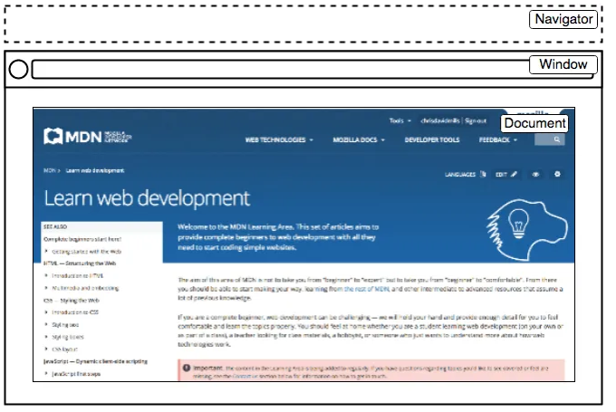

窗口（window）是载入网页的浏览器标签；在 JavaScript 中，它由 Window 对象表示。使用这个对象上的方法，你可以做一些事情，比如返回窗口的大小（见 Window.innerWidth 和 Window.innerHeight），操作加载到窗口的文档，在客户端存储该文档的特定数据（例如使用本地数据库或其他存储机制），为当前窗口附加一个事件处理器等。 导航器（navigator）在网络上出现时，代表浏览器的状态和身份（即用户代理）。在 JavaScript 中，它由 Navigator 对象表示。你可以用这个对象来检索用户的首选语言、用户网络摄像头的媒体流等信息。 文档（document，在浏览器中用 DOM 表示）是加载到窗口的实际页面，在 JavaScript 中，它由 Document 对象表示。你可以使用这个对象来返回和操作构成文档的 HTML 和 CSS 的信息，例如，在 DOM 中获得一个元素的引用，改变其文本内容，对其应用新的样式，创建新的元素并将其作为子元素添加到当前元素中，甚至完全删除它。

DOM树上的每个条目都被称为**节点**。节点也通过它们在树中相对于其他节点的位置来指代：

- **根节点**: 树中顶层节点，在 HTML 的情况下，总是一个 `HTML` 节点（其他标记词汇，如 SVG 和定制 XML 将有不同的根元素）。
- **子节点**: *直接*位于另一个节点内的节点。例如上面例子中，`IMG` 是 `SECTION` 的子节点。
- **后代节点**: 位于另一个节点内*任意位置*的节点。例如 上面例子中，`IMG` 是 `SECTION` 的子节点，也是一个后代节点。`IMG` 不是 `BODY` 的子节点，因为它在树中比 `BODY` 低了两级，但它是 `BODY` 的后代之一。
- **父节点**: 里面有另一个节点的节点。例如上面的例子中 `BODY` 是 `SECTION` 的父节点。
- **兄弟节点**: DOM 树中位于同一父节点下同一等级的节点。例如上面例子中，`IMG` 和 `P` 是兄弟。

在使用 DOM 之前，熟悉这些术语是很有用的，因为你会遇到的一些代码术语都会用到它们。如果你学习过 CSS，你可能也会遇到它们（例如，子孙选择器、子选择器）。

请注意，就像 JavaScript 中所做的那样，有许多方法可以选择一个元素并将其引用存储在一个变量中。[`Document.querySelector()`](https://developer.mozilla.org/zh-CN/docs/Web/API/Document/querySelector) 是推荐的现代方法。它很方便，因为它允许你使用 CSS 选择器来选择元素。上面的 `querySelector()` 调用将匹配文档中出现的第一个 [``](https://developer.mozilla.org/zh-CN/docs/Web/HTML/Element/a) 元素。如果你想对多个元素进行匹配和操作，你可以使用 [`Document.querySelectorAll()`](https://developer.mozilla.org/zh-CN/docs/Web/API/Document/querySelectorAll)，它可以匹配文档中与选择器相匹配的每个元素，并将它们的引用存储在一个叫做 [`NodeList`](https://developer.mozilla.org/zh-CN/docs/Web/API/NodeList) 的类[数组](https://developer.mozilla.org/zh-CN/docs/Learn_web_development/Core/Scripting/Arrays)对象中。

对于获取元素引用，还有一些更旧的方法，如：

- [`Document.getElementById()`](https://developer.mozilla.org/zh-CN/docs/Web/API/Document/getElementById)，选择一个 `id` 属性值已知的元素，例如 `<p id="myId">My paragraph</p>`。ID 作为参数传递给函数，即 `const elementRef = document.getElementById('myId')`。
- [`Document.getElementsByTagName()`](https://developer.mozilla.org/zh-CN/docs/Web/API/Document/getElementsByTagName)，返回页面中包含的所有已知类型元素的数组。如 `<p>`、`<a>` 等。元素类型作为参数传递给函数，即 `const elementRefArray = document.getElementsByTagName('p')`。

这两种方法在旧的浏览器中比现代方法如 `querySelector()` 更好用，但没有那么方便

以上只是让你稍微尝试一下你可以做的事情，让我们进一步看看我们可以怎样来创建新的元素。

1. 回到当前的例子，我们先获取到 [``](https://developer.mozilla.org/zh-CN/docs/Web/HTML/Element/section) 元素的引用。在已有 script 中添加下列代码（其他代码也同样处理）：

    JSCopy to Clipboard

    ```
    const sect = document.querySelector("section");
    ```

2. 现在用 [`Document.createElement()`](https://developer.mozilla.org/zh-CN/docs/Web/API/Document/createElement) 创建一个新的段落，用与之前相同的方法赋予相同的文本：

    JSCopy to Clipboard

    ```
    const para = document.createElement("p");
    para.textContent = "We hope you enjoyed the ride.";
    ```

3. 现在可以用 [`Node.appendChild()`](https://developer.mozilla.org/zh-CN/docs/Web/API/Node/appendChild) 方法在后面追加新的段落：

    JSCopy to Clipboard

    ```
    sect.appendChild(para);
    ```

4. 最后，在内部链接的段落中添加文本节点，完美的结束句子。首先我们要使用 [`Document.createTextNode()`](https://developer.mozilla.org/zh-CN/docs/Web/API/Document/createTextNode) 创建一个文本节点：

    JSCopy to Clipboard

    ```
    const text = document.createTextNode(
      " — the premier source for web development knowledge.",
    );
    ```

5. 现在获取内部连接的段落的引用，并把文本节点附加到这个节点上：

    JSCopy to Clipboard

    ```
    const linkPara = document.querySelector("p");
    linkPara.appendChild(text);
    ```

这是给 DOM 添加节点要做的大部分工作——在构建动态界面时，你将做大量使用这些方法（我们在后面可以看到一些例子）。

也许有时候你想移动或从 DOM 中删除节点，这是完全可能的。

如果你想把具有内部链接的段落移到 section 的底部，简单的做法是：

JSCopy to Clipboard

```
sect.appendChild(linkPara);
```

这样可以把段落下移到 section 的底部。你可能认为它会产生第二个副本，但事实并非如此——`linkPara` 是对该段落唯一副本的引用。如果你想复制并添加它，你需要使用 [`Node.cloneNode()`](https://developer.mozilla.org/zh-CN/docs/Web/API/Node/cloneNode) 来代替。

删除节点也非常的简单，至少，你拥有要删除的节点和其父节点的引用。在当前情况下，我们只要使用 [`Node.removeChild()`](https://developer.mozilla.org/zh-CN/docs/Web/API/Node/removeChild) 即可，如下：

JSCopy to Clipboard

```
sect.removeChild(linkPara);
```

要删除一个仅基于自身引用的节点可能稍微有点复杂，这也是很常见的。你可以使用 [`Element.remove()`](https://developer.mozilla.org/zh-CN/docs/Web/API/Element/remove)：

JSCopy to Clipboard

```
linkPara.remove();
```

此方法在较旧的浏览器中不受支持，它们没有方法告诉一个节点删除自己，所以你必须这样做：

JSCopy to Clipboard

```
linkPara.parentNode.removeChild(linkPara);
```

通过 JavaScript 以不同的方式来操作 CSS 样式是可能的。

首先，你可以使用 [`Document.stylesheets`](https://developer.mozilla.org/zh-CN/docs/Web/API/Document/styleSheets) 来获得一个附加在文档上的所有样式表的列表，它返回一个包含 [`CSSStyleSheet`](https://developer.mozilla.org/zh-CN/docs/Web/API/CSSStyleSheet) 对象的类数组。然后你就可以根据需要添加/删除样式了。然而，我们不打算对这些功能进行扩展，因为它们是一种有点过时的、难以操作样式的方式。还有更多更简单的方法。

第一种方法是直接将内联样式添加到你想动态样式的元素上。这是通过 [`HTMLElement.style`](https://developer.mozilla.org/zh-CN/docs/Web/API/HTMLElement/style) 属性实现的，它包含了文档中每个元素的内联样式信息。你可以设置这个对象的属性来直接更新元素样式。

1. 作为示例，把下面的代码行加到我们的例子中：

    JSCopy to Clipboard

    ```
    para.style.color = "white";
    para.style.backgroundColor = "black";
    para.style.padding = "10px";
    para.style.width = "250px";
    para.style.textAlign = "center";
    ```

2. 重新载入页面，你将看到样式已经应用到段落中。如果在浏览器的 [Page Inspector/DOM inspector](https://firefox-source-docs.mozilla.org/devtools-user/page_inspector/index.html) 中查看段落，你会看到这些代码的确为文档添加了内联样式：

    HTMLCopy to Clipboard

    ```html
    <p
      style="color: white; background-color: black; padding: 10px; width: 250px; text-align: center;">
      We hope you enjoyed the ride.
    </p>
    ```

**备注：** 请注意，CSS 样式的 JavaScript 属性版本是用[小驼峰命名法](https://developer.mozilla.org/zh-CN/docs/Glossary/Camel_case)书写的，而 CSS 版本采用连字符（[烤串命名法](https://developer.mozilla.org/zh-CN/docs/Glossary/Kebab_case)）（例如，`backgroundColor` 对 `background-color`）。确保你不要把这些混为一谈，否则将无法工作。

还有一种在你的文档上动态操作样式的常见方法，我们现在就来看看。

1. 删除之前添加到 JavaScript 中的五行代码。

2. 在 HTML 的 [``](https://developer.mozilla.org/zh-CN/docs/Web/HTML/Element/head) 中添加下列代码 :

    HTMLCopy to Clipboard

    ```html
    <style>
      .highlight {
        color: white;
        background-color: black;
        padding: 10px;
        width: 250px;
        text-align: center;
      }
    </style>
    ```

3. 现在我们改为使用 HTML 操作的常用方法——[`Element.setAttribute()`](https://developer.mozilla.org/zh-CN/docs/Web/API/Element/setAttribute)——它接受两个参数：想在元素上设置的属性、要为它设置的值。在这种情况下，我们在段落中设置类名为 highlight：

    JSCopy to Clipboard

    ```
    para.setAttribute("class", "highlight");
    ```

4. 刷新你的页面，不会看到任何改变——CSS 仍然应用于该段落，但这次是通过给它一个类，由我们的 CSS 规则选择，而不是作为内联 CSS 样式。

两种方式各有优缺点，选择哪种取决于你自己。第一种方法需要较少的设置，适合于简单的使用，而第二种方法更纯粹（混合 CSS、JavaScript 和内联样式通常不是一种好的实践，而该方法不会产生这些）。当你开始构建更大和更多的应用程序时，你可能会更多地开始使用第二种方法，但这真的取决于你。

在这一点上，我们还没有做任何有用的事！使用 JavaScript 来创建静态内容是没有意义的，你还不如直接把它写进你的 HTML，而不使用 JavaScript。它比 HTML 更复杂，而且用 JavaScript 创建你的内容也有其他附带的问题（比如不能被搜索引擎阅读）。

现代网站和应用中另一个常见的任务是从服务端获取个别数据来更新部分网页而不用加载整个页面。这看起来是小细节却对网站性能和行为产生巨大的影响。所以我们将在这篇文章介绍概念和技术使它成为可能，尤其是 [Fetch API](https://developer.mozilla.org/zh-CN/docs/Web/API/Fetch_API)。

## 从服务器获取数据

网页由 HTML 页面和（通常也有）各种其他文件组成，例如样式表、脚本和图像。Web 加载页面的基本模型为：你的浏览器向服务器发起一个或多个 HTTP 请求以获取显示网页所需的文件，然后服务器响应请求的文件。如果你访问另一个页面，浏览器会请求新的文件，服务器则会响应这些请求。

这个模型适用于许多站点。但请考虑一个几乎是以数据驱动的网站，例如[温哥华图书馆](https://www.vpl.ca/)这样的图书馆网站。你可以将此类网站视作数据库的用户界面。它可能会允许你搜索特定类型的书籍，或者根据你之前借过的书籍向你推荐你可能喜欢的书籍。在你这样操作时，它需要使用新的书集来更新用于显示的页面。但请注意，大部分的页面内容（包括页眉、侧边栏和页脚等元素）将保持不变。

传统模型的问题在于我们必须获取并加载整个页面，即使我们只需要更新页面的一部分也是如此。这是低效的，而且会带来糟糕的用户体验。

因此，与传统模型不同，许多网站使用 JavaScript API 从服务器请求数据，并在不重新加载页面的情况下更新页面。因此，当用户搜索新产品时，浏览器仅请求更新页面所需的数据——例如要显示的新书集。

这里主要的 API 是 [Fetch API](https://developer.mozilla.org/zh-CN/docs/Web/API/Fetch_API)。它允许页面中运行的 JavaScript 向服务器发起 [HTTP](https://developer.mozilla.org/zh-CN/docs/Web/HTTP) 请求来获取特定的资源。当服务器提供了这些资源时，JavaScript 可以使用这些数据更新页面（通常是通过使用 [DOM 操作 API](https://developer.mozilla.org/zh-CN/docs/Learn_web_development/Core/Scripting/DOM_scripting)）。请求的数据通常是 [JSON](https://developer.mozilla.org/zh-CN/docs/Learn_web_development/Core/Scripting/JSON)，这是一种很好的传输结构化的格式，但也可以是 HTML 或纯文本。

这是数据驱动网站（如 Amazon、YouTube、eBay 等）的常见模式。使用此模型，使得：

- 页面更新更加迅速，你不必等待页面刷新，这意味这网站的体验更加流畅、响应更加迅速。
- 每次更新时下载的数据更少，这意味着浪费的带宽更少。这在使用宽带连接的台式机上可能不是什么问题，但在移动设备或没有高速互联网连接的国家/地区则是一个主要问题。

**备注：** 在早期，这种通用技术被称为[异步](https://developer.mozilla.org/zh-CN/docs/Glossary/Asynchronous)的 JavaScript 与 XML（[Ajax](https://developer.mozilla.org/zh-CN/docs/Glossary/AJAX)）。但现在通常不是这种情况，相反你更有可能请求 JSON，不过由于结果依然相同，我们通常依旧使用术语“Ajax”来描述该技术。

为了进一步加快速度，某些网站还会在首次请求时将资源和数据存储在用户的计算机上，这意味这在后续的访问中，会使用这些内容的本地版本，而不是在每次重新加载页面时都下载新的副本。内容仅在更新后才会从服务器重新加载。

```jsx
// 调用 `fetch()`，传入 URL。
fetch(url)
  // fetch() 返回一个 promise。当我们从服务器收到响应时，
  // 会使用该响应调用 promise 的 `then()` 处理器。
  .then((response) => {
    // 如果请求没有成功，我们的处理器会抛出错误。
    if (!response.ok) {
      throw new Error(`HTTP 错误：${response.status}`);
    }
    // 否则（如果请求成功），我们的处理器通过调用
    // response.text() 以获取文本形式的响应，
    // 并立即返回 `response.text()` 返回的 promise。
    return response.text();
  })
  // 若成功调用 response.text()，会使用返回的文本来调用 `then()` 处理器，
  // 然后我们将其拷贝到 `poemDisplay` 框中。
  .then((text) => (poemDisplay.textContent = text))
  // 捕获可能出现的任何错误，
  // 并在 `poemDisplay` 框中显示一条消息。
  .catch((error) => (poemDisplay.textContent = `获取诗歌失败：${error}`));
```

首先，Fetch API 的入口点是一个名为 [`fetch()`](https://developer.mozilla.org/zh-CN/docs/Web/API/Window/fetch) 的全局函数，它以 URL 为参数（其使用另一个可选参数来进行自定义设置，但我们在这里不使用它）。

接下来，`fetch()` 是一个异步 API，会返回一个 [`Promise`](https://developer.mozilla.org/zh-CN/docs/Web/JavaScript/Reference/Global_Objects/Promise)。如果你不知道什么是 Promise，请参阅[异步 JavaScript](https://developer.mozilla.org/zh-CN/docs/Learn_web_development/Extensions/Async_JS) 章节，然后再回到这里。你会发现那篇文章也介绍了 `fetch()` API！

因为 `fetch()` 返回一个 Promise，所以我们将一个函数传递给它返回的 Promise 的 [`then()`](https://developer.mozilla.org/zh-CN/docs/Web/JavaScript/Reference/Global_Objects/Promise/then) 方法。此方法会在 HTTP 请求收到服务器的响应时被调用。在它的处理器中，我们检查请求是否成功，并在请求失败时抛出一个错误。否则，我们调用 [`response.text()`](https://developer.mozilla.org/zh-CN/docs/Web/API/Response/text) 以获取文本形式的响应正文。

`response.text()` *也*是异步的，所以我们返回它返回的 Promise，并向新的 Promise 的 `then()` 方法传递一个函数。这个函数会在响应文本可用时被调用，在这个函数中，我们会使用该文本更新 `<pre>` 块。

最后，我们在最后链式调用 [`catch()`](https://developer.mozilla.org/zh-CN/docs/Web/JavaScript/Reference/Global_Objects/Promise/catch) 处理器，以捕获我们调用的异步函数或其他处理器中抛出的任何错误。

此示例的一个问题是，它在第一次加载时不会显示任何诗歌。要解决此问题，请在代码的最后（`</script>` 结束标签之前）添加以下两行代码，以默认加载第一首诗歌，并确保 [``](https://developer.mozilla.org/zh-CN/docs/Web/HTML/Element/select) 元素始终显示正确的值

如果只是使用本地文件运行示例，现代浏览器将不会执行 HTTP 请求。这是因为安全限制（更多关于 Web 安全性的限制，请参阅[网站安全](https://developer.mozilla.org/zh-CN/docs/Learn_web_development/Extensions/Server-side/First_steps/Website_security)）。

为了解决这个问题，我们需要通过在本地 Web 服务器上运行它来测试这个示例。要了解如何实现这一点，请阅读[我们的设置本地测试服务器指南](https://developer.mozilla.org/zh-CN/docs/Learn_web_development/Howto/Tools_and_setup/set_up_a_local_testing_server)。

有时，尤其是在旧的代码中，你会看到另一个名为 [`XMLHttpRequest`](https://developer.mozilla.org/zh-CN/docs/Web/API/XMLHttpRequest)（经常会被简写为“XHR”）的 API，它也用于发送 HTTP 请求。其早于 Fetch API，而且是第一个广泛用于实现 AJAX 的 API。如果可以，我们建议你使用 Fetch：它是一个更简单的 API，而且比 `XMLHttpRequest` 的特性更多。我们不再详细介绍使用 `XMLHttpRequest` 的示例

## JSON

JavaScript 对象表示法（JSON）是用于将结构化数据表示为 JavaScript 对象的标准格式，通常用于在网站上表示和传输数据（例如从服务器向客户端发送一些数据，因此可以将其显示在网页上）。

虽然它是基于 JavaScript 语法，但它独立于 JavaScript，这也是为什么许多程序环境能够读取（解读）和生成 JSON。

JSON 可以作为一个对象或者字符串存在，前者用于解读 JSON 中的数据，后者用于通过网络传输 JSON 数据。这不是一个大事件——JavaScript 提供一个全局的 可访问的 [JSON](https://developer.mozilla.org/zh-CN/docs/Web/JavaScript/Reference/Global_Objects/JSON) 对象来对这两种数据进行转换。

**备注：** 将字符串转换为原生对象称为*反序列化*（deserialization），而将原生对象转换为可以通过网络传输的字符串称为*序列化*（serialization）。

一个 JSON 对象可以被储存在它自己的文件中，这基本上就是一个文本文件，扩展名为 `.json`，还有 `application/json` [MIME 类型](https://developer.mozilla.org/zh-CN/docs/Glossary/MIME_type)。

JSON 是一个字符串，其格式非常类似于 JavaScript 对象字面量的格式。你可以在 JSON 中包含与标准 JavaScript 对象相同的基本数据类型——字符串、数字、数组、布尔值和其他对象字面量。这使你可以构建一个数据层次结构。

如果我们把字符串加载到 JavaScript 程序中，并将其解析到一个名为 `superHeroes` 的变量，那么我们就可以使用在 [JavaScript 对象基础](https://developer.mozilla.org/zh-CN/docs/Learn_web_development/Core/Scripting/Object_basics)文章中相同的点/括号表示法来访问其中的数据。

前面我们提到，JSON 文本基本上看起来像字符串中的 JavaScript 对象。我们也可以将数组与 JSON 相互转换。

注意事项：

- JSON 是一种纯数据格式，它只包含属性，没有方法。
- JSON 要求在字符串和属性名称周围使用双引号。单引号无效。
- 甚至一个错位的逗号或分号就可以导致 JSON 文件出错。你应该小心的检查你想使用的数据（虽然计算机生成的 JSON 很少出错，只要生成程序正常工作）。你可以通过像 [JSONLint](https://jsonlint.com/) 这样的应用程序来验证 JSON。
- JSON 实际上可以是任何可以有效包含在 JSON 中的数据类型的形式。比如，单个字符串或者数字就是有效的 JSON 对象。
- 与 JavaScript 代码中对象属性可以不加引号不同，JSON 中只有带引号的字符串可以用作属性。

上面的示例在访问 JavaScript 对象方面很简单，因为我们直接使用 `response.json()` 将网络响应转换为了 JavaScript 对象。

但是有时候我们没有那么幸运，我们接收到一些 字符串作为 JSON 数据，然后我们想要将它转换为对象。当我们想要发送 JSON 数据作为信息，我们将需要转换它为字符串，我们经常需要正确的转换数据，幸运的是，这两个问题在 web 环境中是那么普遍以至于浏览器拥有一个内建的 JSON，包含以下两个方法。

- [`parse()`](https://developer.mozilla.org/zh-CN/docs/Web/JavaScript/Reference/Global_Objects/JSON/parse)：以文本字符串形式接受 JSON 对象作为参数，并返回相应的对象。
- [`stringify()`](https://developer.mozilla.org/zh-CN/docs/Web/JavaScript/Reference/Global_Objects/JSON/stringify)：接收一个对象作为参数，返回一个对应的 JSON 字符串。

## 调试

你应该先确保你的代码能够正常工作，然后再去集中解决跨浏览器问题。

要注意一些常见的 JavaScript 问题，比如说：

- 基本的语法和逻辑问题（再次重申，请参阅[如何查找 JavaScript 代码的错误](https://developer.mozilla.org/zh-CN/docs/Learn_web_development/Core/Scripting/What_went_wrong)）。
- 确保变量等定义在正确的作用域中，并且你不会遇到在不同地方声明的内容之间的冲突（见[函数作用域和冲突](https://developer.mozilla.org/zh-CN/docs/Learn_web_development/Core/Scripting/Functions#函数作用域和冲突)）。
- 对 [this](https://developer.mozilla.org/zh-CN/docs/Web/JavaScript/Reference/Operators/this) 的困惑，表现在它适用于什么作用域，它的值是否是你所期望的。你可以阅读[“this”的含义](https://developer.mozilla.org/zh-CN/docs/Learn_web_development/Core/Scripting/Object_basics#“this”的含义)，它做了一点浅显的介绍；你还应该研究像[这样](https://github.com/mdn/learning-area/blob/7ed039d17e820c93cafaff541aa65d874dde8323/javascript/oojs/assessment/main.js#L143)的例子，它显示了一个典型的模式，即把 `this` 作用域保存到一个单独的变量中，然后在嵌套函数中使用这个变量，这样你就可以确定能够把功能应用到正确的 `this` 作用域。
- 在使用全局变量进行迭代的循环中不正确地使用函数（更普遍的是“弄错作用域”）。

例如，在 [bad-for-loop.html](https://mdn.github.io/learning-area/tools-testing/cross-browser-testing/javascript/bad-for-loop.html) 中（见[源代码](https://github.com/mdn/learning-area/blob/main/tools-testing/cross-browser-testing/javascript/bad-for-loop.html)），我们使用一个用 `var` 定义的变量循环了 10 次，每次都创建一个段落并给它添加 [onclick](https://developer.mozilla.org/zh-CN/docs/Web/API/Element/click_event) 事件处理器。当点击时，我们希望每个段落都能显示一个包含其编号（创建时的 `i` 值）的警告信息。但是，它们都报告 `i` 为 11，因为 `for` 循环在调用嵌套函数之前就完成了所有的迭代。

最简单的解决方案是用 `let` 而不是 `var` 来声明迭代变量，这样与函数相关的 `i` 的值对每个迭代都是唯一的。请参阅 [good-for-loop.html](https://mdn.github.io/learning-area/tools-testing/cross-browser-testing/javascript/good-for-loop.html)（也可以参阅[源代码](https://github.com/mdn/learning-area/blob/main/tools-testing/cross-browser-testing/javascript/good-for-loop.html)）以查看能正常工作的版本。

- 确保在你试图使用[异步操作](https://developer.mozilla.org/zh-CN/docs/Learn_web_development/Extensions/Async_JS)返回的值之前，其已经完成。这通常需要了解如何使用 *promise*：适当地使用 [`await`](https://developer.mozilla.org/zh-CN/docs/Web/JavaScript/Reference/Operators/await) 或在 promise 的 [`then()`](https://developer.mozilla.org/zh-CN/docs/Web/JavaScript/Reference/Global_Objects/Promise/then) 处理器中运行代码来处理异步调用的结果。有关此主题的介绍，请参见[如何使用 promise](https://developer.mozilla.org/zh-CN/docs/Learn_web_development/Extensions/Async_JS/Promises)。

**备注：** [JavaScript 代码中的 Bug：JavaScript 开发人员的 10 个最常见错误](https://www.toptal.com/javascript/10-most-common-javascript-mistakes)对这些常见错误及更多内容有很好的讨论。

随着应用程序变得越来越复杂，你可能会开始使用更多的 JavaScript。这时，你可能会遇到性能问题（尤其是在较慢的设备上）。性能优化是一个广泛的话题，我们无法在此详尽讨论，但以下是一些快速优化建议：

- 为了避免加载不必要的 JavaScript，建议使用 [Browserify](https://browserify.org/) 等工具将脚本打包成单个文件。总体而言，减少 HTTP 请求的数量可以很好地提升性能。
- 在将文件部署到生产服务器之前，应通过极简化（minification）减小文件体积。极简化会将所有代码合并成一行，从而显著减少文件大小。虽然简化后的代码可读性较差，但你不需要直接阅读它！推荐使用 [Uglify](https://github.com/mishoo/UglifyJS) 等极简化工具（还有在线版本，请访问 [JSCompress.com](https://jscompress.com/)）。
- 使用 API 时，请确保在不需要时关闭 API 特性；因为某些 API 调用在处理能力方面可能非常耗费资源。例如，在显示视频流时，如果视频不在视线范围内，请确保关闭它。在使用重复调用的地理位置 API 跟踪设备位置时，如果用户不再需要，也应及时关闭。
- 动画可能会对性能造成重大影响。尽管许多 JavaScript 库提供了由 JavaScript 控制的动画功能，但使用浏览器原生特性（如 [CSS 动画](https://developer.mozilla.org/zh-CN/docs/Web/CSS/CSS_animations/Using_CSS_animations)或新兴的 [Web 动画 API](https://developer.mozilla.org/zh-CN/docs/Web/API/Web_Animations_API)）执行动画通常更高效。建议阅读 Brian Birtles 的文章[使用 Element.animate 制作不重要的动画](https://hacks.mozilla.org/2016/08/animating-like-you-just-dont-care-with-element-animate/)，了解动画成本高昂的原因、提升动画性能的技巧，以及 Web 动画 API 的相关信息。

特性检测的核心理念在于，通过执行测试来确认当前浏览器是否支持某个 JavaScript 特性，进而有条件地执行代码。这样做可以确保无论浏览器是否支持该特性，都能提供一个可接受的用户体验。

最后一点，不要将特性检测与**浏览器嗅探**（检测访问站点的特定浏览器）混淆——这是一种应该被全面反对的做法。有关更多详细信息，请参见后文的[不要嗅探浏览器](https://developer.mozilla.org/zh-CN/docs/Learn_web_development/Core/Scripting/Debugging_JavaScript#不要嗅探浏览器)。

JavaScript 库往往有几个主要的种类（有些库包含其中的一个以上的目的）：

- 实用程序库：提供一组函数，使日常的任务更容易管理，不那么枯燥。例如，[jQuery](https://jquery.com/) 提供了自己的全功能选择器和 DOM 操作库，允许在 JavaScript 中进行 CSS 选择器类型的元素选择，并更容易建立 DOM。现在我们有了现代的特性，如 [`Document.querySelector()`](https://developer.mozilla.org/zh-CN/docs/Web/API/Document/querySelector)、[`Document.querySelectorAll()`](https://developer.mozilla.org/zh-CN/docs/Web/API/Document/querySelectorAll)、[`Node`](https://developer.mozilla.org/zh-CN/docs/Web/API/Node) 方法，在各浏览器中可用，这就不那么重要了，但在旧的浏览器需要支持时，它仍然有用。
- 方便性库：让困难的事情更容易做。例如，直接使用 [WebGL API](https://developer.mozilla.org/zh-CN/docs/Web/API/WebGL_API) 很复杂且有挑战性，而 [Three.js](https://threejs.org/) 库（和其他类似的库）是建立在 WebGL 之上的，为创建普通 3D 对象、照明、纹理等提供了更容易的 API。[Service Worker API](https://developer.mozilla.org/zh-CN/docs/Web/API/Service_Worker_API) 的使用也非常复杂，所以代码库已经开始出现，以使常见的 Service Worker 用例更容易实现（参见 [Service Worker 指导书](https://github.com/mdn/serviceworker-cookbook)，以获得一些有用的代码示例）。
- 效果库：这些库的设计是为了让你能够轻松地在你的网站上添加特殊效果。在“DHTML”是一个流行的流行语的时候，这是很有用的（当时实现一个效果需要很多复杂的 JavaScript），但现在的浏览器有很多内置的 CSS 特性和 API，可以更容易地实现效果。
- UI 库：提供实现复杂的 UI 特性的方法，没有 UI 库的话，这些特性的实现和跨浏览器的工作会很困难，例如 [Foundation](https://get.foundation/)、[Bootstrap](https://getbootstrap.com/) 和 [Material-UI](https://mui.com/)（后者是一套用于 React 框架的组件）。这些往往被用作整个网站布局的基础；仅仅为了一个 UI 特性而把它们放入其中往往是很困难的。
- 标准化库：给你一个简单的语法，让你轻松完成一个任务，而不必担心跨浏览器的差异。该库将在后台操作适当的 API，所以无论什么浏览器，该功能都可以使用（理论上）。例如， [LocalForage](https://github.com/localForage/localForage) 是一个用于客户端数据存储的库，它为存储和检索数据提供了一个简单的语法。在后台，它使用浏览器可用的最好的 API 来存储数据，无论是 [IndexedDB](https://developer.mozilla.org/zh-CN/docs/Web/API/IndexedDB_API)、[Web Storage](https://developer.mozilla.org/zh-CN/docs/Web/API/Web_Storage_API)，甚至是 Web SQL（现在已经废弃了，但在基于 Chromium 的浏览器安全上下文中仍然支持）。

在选择使用一个库时，要确保它能在你想支持的一系列浏览器中工作，并对你的实现进行彻底的测试。还要确保这个库是受欢迎的，得到良好的支持，并且不可能在下周就被淘汰。

**备注：** 你也会在 web 上遇到一些 JavaScript 框架，比如 [Ember](https://emberjs.com/) 和 [Angular](https://angularjs.org/)。库通常可用于解决个别问题并放入现有网站中，而框架则更倾向于开发复杂 web 应用的完整解决方案。

在这段代码中，我们检测浏览器是否支持 [`Promise`](https://developer.mozilla.org/zh-CN/docs/Web/JavaScript/Reference/Global_Objects/Promise) 对象和 [`fetch()`](https://developer.mozilla.org/zh-CN/docs/Web/API/Window/fetch) 函数。如果浏览器支持这两者，函数就会返回 `true`。如果函数返回 `false`，我们将执行条件语句的第二部分，调用名为 `loadScript()` 的函数来将 polyfill 加载到页面，然后执行 `main()` 函数。

新的 JavaScript 实现有时也会使用前缀，但与 CSS 使用[连字符](https://developer.mozilla.org/zh-CN/docs/Glossary/Kebab_case)不同，JavaScript 采用[驼峰命名](https://developer.mozilla.org/zh-CN/docs/Glossary/Camel_case)。

内存泄漏在 JavaScript 中几乎是不可避免的问题，如果你没有有意识地进行编码来避免它们。

JavaScript 的内部工作原理

**闭包与垃圾回收机制**

在 JavaScript 中，垃圾回收机制主要负责自动回收不再使用的内存。其核心原则是：当一个对象没有被任何其他对象或变量引用时，它就被认为是 “垃圾”，可以被回收以释放内存。

**闭包的情况**

闭包是指有权访问另一个函数作用域中变量的函数。当一个内部函数（闭包）引用了外部函数的变量时，即使外部函数执行完毕，这些被引用的变量也不会被垃圾回收。因为闭包仍然持有对这些变量的引用，垃圾回收机制会认为这些变量还有可能被使用，所以不会将其回收。

在你提供的代码中，`unused` 函数是一个闭包，它引用了 `replaceThing` 函数作用域内的 `priorThing` 变量。因此，即使 `replaceThing` 函数执行完毕，`priorThing` 也不会被回收，因为 `unused` 函数还在引用它。虽然 `unused` 函数本身没有被调用，但它的存在就保证了 `priorThing` 不会被当作垃圾回收。

JavaScript 的内存管理（尤其是它的[垃圾回收](https://developer.mozilla.org/en-US/docs/Web/JavaScript/Memory_Management#garbage_collection)）主要基于对象可访问性的概念。

以下对象被假定为*可访问*的，称为 “根”：

- 从当前*调用堆栈*中任意位置引用的对象（即，当前正在调用的函数中的所有局部变量和参数，以及闭包范围内的所有变量）
- 所有*全局*变量

*至少只要可以通过引用或引用链从任何根访问对象，它们就会保留在内存中。*

浏览器中有一个垃圾回收器，可以清理无法访问的对象占用的内存;换句话说，*当且仅当* GC 认为对象无法访问时，它们才会从内存中删除。不幸的是，很容易得到不再使用的 “僵尸” 对象，但 GC 仍然认为这些对象是可访问的。

## 框架和库

jQuery 是一个快速、简洁的 JavaScript 库，它使得 HTML 文档遍历、事件处理、动画效果以及 AJAX 操作等变得更加简单和高效，极大地提高了开发人员的工作效率，在 Web 开发领域广泛应用。

- 为什么要使用框架？他们为我解决了什么问题？
- 当我尝试选择一个框架时，我应该问什么问题？我甚至需要使用框架吗？
- 框架有什么特性？它们一般是如何工作的？框架对这些特性的实现有何不同？
- 它们与“普通的”JavaScript 或 HTML 有什么关系？

在此之后，我们将提供一些教程，介绍一些主要框架的基本内容，为你提供足够的上下文和熟悉感，以便你自己开始更深入地学习。我们希望你以一种实用的方式来学习框架，不要忘记 web 平台的基本最佳实践，比如无障碍。

现代 JavaScript 框架的到来加快了打造高度动态化和交互性强的应用程序的速度。**框架**就是提供该如何构建应用程序的意见的库。这些意见能使应用具有可预测性和同质性。可预测性让软件能在扩展到很大规模的同时仍保持可维护性。可预测性和可维护性对于一个软件的长久健康运行是十分重要的。

目前公认的“四大框架”：Ember、Angular、React、Vue

为什么需要框架？

设想一个很常见的软件：一个待办事项清单创建器，在接下来的章节中我们会使用各种框架来实现它。这个应用应让用户可以完成诸如呈现任务列表、添加和删除任务等操作，且在完成这些操作的同时能可靠地跟踪和更新应用程序的底层数据。在软件开发中，这种底层数据被称为状态（state）。

上述每个目标理论上都很简单。我们可以遍历数据来列出清单，添加一个对象来创建新任务，使用标识符来查找、编辑和删除任务。需要注意的是，用户都是在浏览器中使用应用的这些功能，然而这就引出了一些问题： **每当我们修改应用的数据时，我们都需要更新用户界面以使其匹配。**

我们可以通过待办事项清单应用的一个功能来展现这个问题的难点：呈现任务清单。

JavaScript 框架都提供了一种更具以*声明性*的方式地编写用户界面的方法。也就是说，它们允许你编写描述用户界面的代码，然后框架将你编写的描述用户界面的代码通过在幕后的 DOM 显现出来。

框架提供给我们的其他功能：社区和配套工具、组件化、路由

组件化：大多数框架都鼓励开发者将其用户界面的不同部分抽象为*组件（components）*——可维护、可重用且可以相互通信的代码块。与给定组件相关的所有代码都可以存在于一个文件（或几个特定文件）中，因此身为开发者的你就可以轻松地知道去哪里修改目标组件。在原生 JavaScript 中，你就必须花时间创建自己的一套高效、可扩展的编码约定来实现这一点。如果让许多 JavaScript 开发者使用他们自己的设备，最终可能会导致与用户界面某个部分相关的所有代码分布在一个文件中——或者完全分布在另一个文件中。

路由：

Web 最重要的特点是它允许用户从一个页面导航到另一个页面——毕竟，它是一个相互链接的文档网络。当你点击网站上的链接时，你的浏览器会与目标服务器通信，获取新内容后将其显示给你。当浏览器这样做时，地址栏中的 URL 会发生变化。你可以记下来这个新 URL 并稍后返回该页面——或者把这个 URL 分享给其他人，以便他们轻松找到相同的页面。你的浏览器会记住你的导航历史记录，并允许你来回导航（译者注：其实就是浏览器的前进后退功能）。这被称作**服务端路由**。

现代 Web 应用程序通常不会获取和渲染新的 HTML 文件——它们加载单个 HTML shell，并不断更新其中的 DOM 而无需将用户导航到 Web 上的新地址。(这被称为**单页应用程序（single page app）** 或 **SPA**)。每个新的伪网页通常称为一个 *view*，且在默认情况下，不会做任何路由。

当 SPA 足够复杂并呈现足够多的独特视图时，将路由功能引入你的应用程序非常重要。人们习惯于能够链接到应用程序中的特定页面，在他们的浏览器中前进和后退等等，当这些标准的 Web 功能被破坏时，他们的体验会受到影响。当客户端应用程序以这种方式处理路由时，它被恰当地称为**客户端路由**。

*可以使用* JavaScript 和浏览器的原生功能来实现路由功能，但是流行的、活跃开发的框架具有配套库，使路由功能在开发过程中更直观。

JavaScript 框架使前端应用开发变得容易，但它们并不是解决所有问题的灵丹妙药。本节讨论在使用框架时你应该考虑的一些事项。请记住，你也许根本不需要框架——要注意不要为了使用框架而使用框架。

结果是，你应该从*每个* Web 项目的一开始就考虑无障碍，但请记住，如果你不这样做，使用框架的抽象代码库更有可能遇到的无障碍问题。

如果你正在寻找工具来加快 Web 开发过程，并且你知道你的项目不需要很多客户端 JavaScript，你可以寻求其他几种构建 Web 的解决方案：

- 内容管理系统CMS

    **内容管理系统**（**CMS**）是任何允许用户在不直接编写代码的情况下创建网页内容的工具。对于大型项目来说，它们是一种很好的解决方案，尤其是那些需要由编码能力有限的内容编写者来编写的项目，或者希望节省时间的程序员。然而，它们确实需要大量的时间来设置，使用 CMS 意味着你至少放弃了对网站最终输出的一些控制。例如：如果你选择的 CMS 默认不编写无障碍的内容，通常很难改进这一点。

- 服务端渲染SSR

    **服务端渲染**（**SSR**）是一种应用程序体系结构，在该体系结构中，呈现单页应用程序是服务器的工作。这与客户端渲染相反，服务端渲染是构建 JavaScript 应用程序最常见、最直接的方式。服务端渲染对于客户端的设备压力更小，因为你只发送渲染过的 HTML 文件，但它比客户端渲染更加难以构建。

- 静态站点生成器

    静态网站生成器是动态生成多页面网站的所有网页的程序——包括任何相关的 CSS 或 JavaScript——这样它们就可以在任何地方发布。发布主机可以是一个 GitHub Page，一个 Netlify 实例，或者任何你选择的私有服务器。这种方法有很多优点，主要是在性能方面（用户的设备不使用 JavaScript 构建页面，它已经完成了）和安全性（对静态页面的攻击更少）。这些网站仍然可以使用 JavaScript，它们需要它，但并不依赖于它。静态网站生成器需要时间来学习，就像任何其他工具，它可能是你开发过程中的障碍。

    静态网站可以可以生成你想要独特的页面。正如框架使你能够快速编写客户端 JavaScript 应用程序一样，静态站点生成器使你能够快速创建本来需要单独编写的 HTML 文件。与框架一样，静态站点生成器允许开发者编写定义网页公共部分的组件，并将这些组件组合在一起创建最终页面。在静态站点生成器的相关术语中，这些组件称为**模板**。由静态站点生成器构建的 Web 页面甚至可以成为框架应用程序的主页：例如，如果你想让静态生成的网站的一个特定页面在用户访问 React 应用程序时启动它，你可以这样做。

大多数框架都有某种组件模型。React 组件可以使用 JSX 编写，Ember 组件可以使用 Handlebars 编写，Angular 和 Vue 组件可以使用模板语法轻松地扩展 HTML。

属性（**props**）是渲染组件所需要的外部数据。

我们在上一章谈到了**状态**的概念，强大的状态处理机制是高效框架的关键，每个组件都可能有需要控制其状态的数据。只要组件还在使用，这种状态就会以某种方式持续存在。像属性一样，状态可以用来影响组件的渲染方式。

为了实现交互性，组件需要对浏览器事件做出响应，这样我们的应用程序才能对用户做出响应。每个框架都为监听浏览器事件提供了自己的语法，这些语法参考了相应的浏览器原生事件的名称。

通过许多层组件传递数据的问题被称为“属性穿透”，它对大型应用来说并不理想。

为了规避属性穿透，框架提供了依赖注入的功能，这是一种将某些数据直接传递给需要它的组件的方法，而不需要通过中间的层次。每个框架都以不同的名称和方式来实现依赖注入，但效果最终是一样的。Angular 把这个过程称为[依赖注入](https://angular.io/guide/dependency-injection)；Vue 有 [`provide()` 和 `inject()` 组件方法](https://v2.vuejs.org/v2/api/#provide-inject)；React 有一个 [Context API](https://reactjs.org/docs/context.html)；Ember 通过[服务](https://guides.emberjs.com/release/services/)分享状态。

在框架上下文中，一个组件的**生命周期**是一个组件从被追加到 DOM 然后被浏览器渲染（通常称为*挂载*）到从 DOM 中移除（通常称为*卸载*）所经历的一系列阶段的集合。每个框架对这些生命周期阶段的命名都不同，而且不是所有的框架都能让开发者访问相同的阶段。所有的框架都遵循相同的一般模型：它们允许开发者在组件*挂载*、*渲染*和*卸载*以及这之间的许多阶段执行某些动作。

*渲染*阶段是最需要了解的，因为它在用户与应用程序交互时重复的次数最多。每当浏览器需要渲染一些新的东西时，它就会运行，无论这些新的信息是对浏览器中的内容进行补充、删除，还是对现有内容进行编辑。

就像生命周期一样，框架对如何渲染应用程序采取了不同但相似的方法。所有的框架都会跟踪浏览器 DOM 的当前渲染版本，并且每个框架都会对 DOM 在应用程序中的组件重新渲染时应该如何变化做出略有不同的决定。因为框架为你做出了这些决定，所以你通常不会自己与 DOM 交互。这种远离 DOM 的抽象比自己更新 DOM 更复杂、更耗费内存，但如果没有它，框架就不能让你以它们所熟知的声明性方式编程。

**虚拟 DOM** 是一种方法，此时关于浏览器的 DOM 信息被存储在 JavaScript 内存中。你的应用程序更新这个 DOM 副本，然后将其与“真正的”DOM（为你的用户实际渲染的 DOM）进行比较，以决定要渲染什么。应用程序建立一个“diff“来比较更新的虚拟 DOM 和当前渲染的 DOM 之间的差异，并使用该差异将更新应用到真实 DOM。React 和 Vue 都利用虚拟 DOM 模型，但它们建立“diff”或渲染应用的逻辑并不完全相同。

**增量式 DOM** 与虚拟 DOM 类似，它建立一个 DOM“diff”来决定渲染什么，但不同的是，它不在 JavaScript 内存中创建一个完整的 DOM 副本。它忽略了 DOM 中不需要被改变的部分。Angular 是本模块到目前为止讨论的唯一一个使用增量 DOM 的框架。

**Glimmer VM** 是 Ember 独有的。它既不是虚拟 DOM，也不是增量 DOM；它是一个独立的过程，通过它，Ember 的模板被转换为一种“字节码”，比 JavaScript 更容易和更快地阅读。

正如[前一章中提到的，路由](https://developer.mozilla.org/zh-CN/docs/Learn_web_development/Core/Frameworks_libraries/Introduction#路由)是网络体验的一个重要部分。为了避免在具有大量视图的足够复杂的应用程序中出现破碎的体验，本模块中涉及的每个框架都提供了一个库（或多个库），帮助开发人员在其应用程序中实现客户端路由。

所有的应用程序都受益于覆盖测试，以确保你的软件继续以你期望的方式运行，Web 应用程序也不例外。每个框架的生态系统都提供工具，以促进测试的编写。测试工具并没有内置于框架本身，但用于生成框架应用程序的命令行界面工具使你能够访问适当的测试工具。

每个框架在其生态系统中都有广泛的工具，具有单元和集成测试的能力。

[Testing Library](https://testing-library.com/) 是为许多 JavaScript 环境准备的一套测试工具，包括 React、Vue 和 Angular。Ember 文档涵盖了 [Ember 应用的测试](https://guides.emberjs.com/release/testing/)。

## 推荐阅读：

十个常见的JS问题：https://www.toptal.com/javascript/10-most-common-javascript-mistakes

# Vue

## Vue介绍

Vue 是一个现代 JavaScript 框架提供了有用的设施渐进增强——不像许多其他框架，你可以使用 Vue 增强现有的 HTML。这使你可以使用 Vue 作为 [jQuery](https://jquery.com/) 等库的直接替代品。

话虽如此，你也可以使用 Vue 编写完整的单页应用程序（SPA）。这允许你创建完全由 Vue 管理的标记，当处理复杂应用程序时可以提高开发人员的体验和性能。它还允许你在需要时利用用于客户端路由和状态管理的库。此外，Vue 对于客户端路由和状态管理等工具采取了“中间立场”的方法。虽然 Vue 核心团队维护这些功能的建议库，但它们并未直接捆绑到 Vue 中。这允许你选择不同的路由/状态管理库，以使其更适合你的应用程序。

除了允许你逐步将 Vue 集成到你的应用程序中，Vue 还提供了一种渐进的方式编写标记。像大多数框架，Vue 通过组件允许你创建可重用块标记。大多数时候，Vue 组件是使用一个特殊的 HTML 模板的语法写的。当你需要比 HTML 语法允许的更多的控制时，你可以编写 JSX 或纯 JavaScript 函数来定义组件。

在其他框架都鼓励把模板、逻辑和样式的代码区分成不同文件的时候，Vue 却反其道行之。使用[单文件组件](https://vuejs.org/v2/guide/single-file-components.html)，Vue 把模板、相关脚本和 CSS 一起整合放在 `.vue` 结尾的一个单文件中。这些文件最终会通过 JS 打包工具（例如 Webpack）处理，这意味着你可以使用构建时工具。你可以使用比如 Babel、TypeScript、SCSS 等来创建更多复杂的组件。

**数据驱动**：利用数据绑定和响应式原理，只需要操作数据，Vue 会自动根据数据变化更新 DOM。如通过`v-if`、`v-show`指令根据表达式的值来控制组件的显示与隐藏。

Vue 组件是由管理应用程序数据的 JavaScript 对象和映射到基础 DOM 结构的基于 HTML 的模板语法组成的。

Vue 使用一种基于 HTML 的模板语法，使我们能够声明式地将其组件实例的数据绑定到呈现的 DOM 上。所有的 Vue 模板都是语法层面合法的 HTML，可以被符合规范的浏览器和 HTML 解析器解析。

在底层机制中，Vue 会将模板编译成高度优化的 JavaScript 代码。结合响应式系统，当应用状态变更时，Vue 能够智能地推导出需要重新渲染的组件的最少数量，并应用最少的 DOM 操作。

一些有着传统 Web 开发背景的用户可能会因为单文件组件将不同的关注点集合在一处而有所顾虑，觉得 HTML/CSS/JS 应当是分离开的！

要回答这个问题，我们必须对这一点达成共识：**前端开发的关注点不是完全基于文件类型分离的**。前端工程化的最终目的都是为了能够更好地维护代码。关注点分离不应该是教条式地将其视为文件类型的区别和分离，仅仅这样并不够帮我们在日益复杂的前端应用的背景下提高开发效率。

在现代的 UI 开发中，我们发现与其将代码库划分为三个巨大的层，相互交织在一起，不如将它们划分为松散耦合的组件，再按需组合起来。在一个组件中，其模板、逻辑和样式本就是有内在联系的、是耦合的，将它们放在一起，实际上使组件更有内聚性和可维护性。

即使你不喜欢单文件组件这样的形式而仍然选择拆分单独的 JavaScript 和 CSS 文件，也没关系，你还是可以通过[**资源导入**](https://cn.vuejs.org/api/sfc-spec.html#src-imports)功能获得热更新和预编译等功能的支持。

Vue 最标志性的功能就是其低侵入性的响应式系统。

在编程领域中，“侵入性” 指的是某个功能或模块在集成到现有系统时，对原有系统的结构、代码规范、开发方式等方面产生的影响程度。如果一个功能需要大量修改原系统的代码、遵循特定的复杂规则才能使用，那么它的侵入性就高；反之，如果对原系统影响较小，能轻松融入且不干扰原有代码逻辑，侵入性就低。

- **低侵入性的响应式系统**：以 Vue 的低侵入性响应式系统为例，组件状态由响应式 JavaScript 对象构成，当状态更改时，视图会自动更新。开发过程中，开发者无需对原有的 JavaScript 代码结构进行大规模调整，就能利用这一特性实现高效的状态管理与视图更新。如在创建响应式数据时，使用`ref`、`reactive`等函数简单包裹数据即可，无需改变数据的基本使用方式。这体现了 Vue 的低侵入性，让状态管理变得简单直观。

响应性是一种可以使我们声明式地处理变化的编程范式。

响应性作为一种编程范式，核心就在于能让开发者以声明式的方式处理变化，大大提升开发效率和代码的可维护性。可以从声明式编程和处理变化两个角度来理解：

- **声明式编程**：声明式编程关注的是 “做什么”，而不是 “怎么做”。在响应性编程范式中，开发者只需描述最终的目标状态，无需关心具体的实现过程。以 Vue 框架为例，在模板中直接绑定数据和视图，如`<div>{{ message }}</div>`，当`message`数据发生变化时，视图会自动更新，开发者不需要手动操作 DOM 去更新视图 。
- **编程范式**：是编程的一种风格或模式，它规定了如何组织代码、处理数据以及控制程序流程，是对编程风格、方法和模式的一种分类和归纳。常见的编程范式有命令式编程、函数式编程、面向对象编程等。比如命令式编程通过一系列指令语句来改变程序状态完成任务；函数式编程强调函数的使用，将计算视为函数的应用，注重数据的不可变性和函数的纯性；面向对象编程把数据和操作封装成对象，通过对象间的交互来实现功能 。不同编程范式适用于不同场景，影响着开发者解决问题的思路和代码的组织形式。

常见的响应式副作用的用例是什么呢？自然是更新 DOM！

Vue 的响应式系统基本是基于运行时的。追踪和触发都是在浏览器中运行时进行的。运行时响应性的优点是，它可以在没有构建步骤的情况下工作，而且边界情况较少。另一方面，这使得它受到了 JavaScript 语法的制约，导致需要使用一些例如 Vue ref 这样的值的容器。

一些框架，如 [**Svelte**](https://svelte.dev/)，选择通过编译时实现响应性来克服这种限制。它对代码进行分析和转换，以模拟响应性。该编译步骤允许框架改变 JavaScript 本身的语义——例如，隐式地注入执行依赖性分析的代码，以及围绕对本地定义的变量的访问进行作用触发。这样做的缺点是，该转换需要一个构建步骤，而改变 JavaScript 的语义实质上是在创造一种新语言，看起来像 JavaScript 但编译出来的东西是另外一回事。

很多其他框架已经引入了与 Vue 组合式 API 中的 ref 类似的响应性基础类型，并称之为“信号”。从根本上说，信号是与 Vue 中的 ref 相同的响应性基础类型。它是一个在访问时跟踪依赖、在变更时触发副作用的值容器。这种基于响应性基础类型的范式在前端领域并不是一个特别新的概念。

## 引入Vue框架

- 开发环境版本，包含了有帮助的命令行警告

    ```html
    <script src="<https://unpkg.com/vue@3/dist/vue.global.js>"></script>
    ```

- 生产环境版本，优化了尺寸和速度，建议你在站点上包含 Vue 时指定版本号，这样任何框架更新都不会影响你的网站。

    ```html
    <script src="<https://unpkg.com/vue@3/dist/vue.global.prod.js>"></script>
    ```

## Vue CLI

CLI 插件是向你的 Vue 项目提供可选功能的 npm 包，例如 Babel/TypeScript 转译、ESLint 集成、单元测试和 end-to-end 测试等。Vue CLI 插件的名字以 `@vue/cli-plugin-` (内建插件) 或 `vue-cli-plugin-` (社区插件) 开头，非常容易使用。

当你在项目内部运行 `vue-cli-service` 命令时，它会自动解析并加载 `package.json` 中列出的所有 CLI 插件。

插件可以作为项目创建过程的一部分，或在后期加入到项目中。

Vue CLI 使用了一套基于插件的架构。如果你查阅一个新创建项目的 `package.json`，就会发现依赖都是以 `@vue/cli-plugin-` 开头的。插件可以修改 webpack 的内部配置，也可以向 `vue-cli-service` 注入命令。在项目创建的过程中，绝大部分列出的特性都是通过插件来实现的。

你也可以通过 `vue ui` 命令以图形化界面创建和管理项目：

每个 CLI 插件都会包含一个 (用来创建文件的) 生成器和一个 (用来调整 webpack 核心配置和注入命令的) 运行时插件。当你使用 `vue create` 来创建一个新项目的时候，有些插件会根据你选择的特性被预安装好。如果你想在一个已经被创建好的项目中安装一个插件，可以使用 `vue add` 命令

我们推荐在运行 `vue add` 之前将项目的最新状态提交，因为该命令可能调用插件的文件生成器并很有可能更改你现有的文件。

这个命令将 `@vue/eslint` 解析为完整的包名 `@vue/cli-plugin-eslint`，然后从 npm 安装它，调用它的生成器。

安装 Vue 并不完全等同于安装 Vue CLI。Vue 是一个 JavaScript 框架，而 Vue CLI 是一个辅助开发的工具，用于简化 Vue 项目的创建、开发和构建过程。可以安装不带 Vue CLI 工具的 Vue 框架，比如在现有站点中，通过`<script>`元素引入 Vue 的方式就无需使用 Vue CLI，这样也能使用 Vue 的许多核心功能，如属性、自定义组件和数据管理等。

如果只想安装 Vue 而不安装 Vue CLI，可以通过在页面中使用`<script>`元素引入 Vue 的方式来实现。具体来说，在 HTML 文件中添加以下代码：

<script src="<https://unpkg.com/vue@3/dist/vue.global.js>"></script>

或者使用生产环境版本：

<script src="<https://unpkg.com/vue@3/dist/vue.global.prod.js>"></script>

**限制的功能**：

- Vue CLI 提供了一系列的功能和优点，例如它是一个基于 Vue.js 进行快速开发的完整系统，也就是俗称的脚手架。它可以帮助开发人员自动化和简化应用程序的开发过程，提供了创建和配置 Vue.js 项目所需的所有工具和依赖项。
- Vue CLI 允许选择所需的插件和功能，快速搭建项目架构并开始编写代码。它还提供了开发服务器、构建和打包工具、自动化测试和部署等功能。
- 利用 Vue CLI 创建的项目，会默认集成 Webpack 作为构建工具，Webpack 可以把多个 JS/CSS 文件打包成一个文件，减少 HTTP 请求。
- Vue CLI 配置了 Webpack 的开发和生产环境，能更方便地进行开发和部署。
- 提供图形化的项目管理功能，如`vue ui`。
- 可以通过命令行进行各种操作，如创建项目、添加插件等。

相比之下，仅通过`<script>`元素引入 Vue 时，就无法直接使用这些由 Vue CLI 提供的功能。例如，不能使用 Vue CLI 的开发服务器，需要自己手动配置服务器环境；也不能方便地使用 Vue CLI 提供的各种插件和工具，以及其图形化界面和命令行操作来管理项目的创建、配置、打包等过程。如果要构建更复杂的应用程序，可能会面临较多的手动配置和管理工作。

因此，使用Vue一般是会默认安装Vue CLI的。

当你使用 `npm install -g @vue/cli` 全局安装 Vue CLI 时，它会被安装到 Node.js 的全局模块目录中。在 Windows 上，默认情况下，全局模块通常安装在 `%AppData%\\npm\\node_modules` 目录下。你可以通过在命令行中运行 `npm root -g` 来查看全局模块的实际安装路径。

## Vue CLI的运行模式

**模式**是 Vue CLI 项目中一个重要的概念。默认情况下，一个 Vue CLI 项目有三个模式：

- `development` 模式用于 `vue-cli-service serve`
- `test` 模式用于 `vue-cli-service test:unit`
- `production` 模式用于 `vue-cli-service build` 和 `vue-cli-service test:e2e`

你可以通过传递 `--mode` 选项参数为命令行覆写默认的模式。

当运行 `vue-cli-service` 命令时，所有的环境变量都从对应的[环境文件](https://cli.vuejs.org/zh/guide/mode-and-env.html#环境变量)中载入。如果文件内部不包含 `NODE_ENV` 变量，它的值将取决于模式，例如，在 `production` 模式下被设置为 `"production"`，在 `test` 模式下被设置为 `"test"`，默认则是 `"development"`。

`NODE_ENV` 将决定您的应用运行的模式，是开发，生产还是测试，因此也决定了创建哪种 webpack 配置。

Vue CLI 项目中，`npm run serve` 实际执行的是 `vue-cli-service serve` 命令，使用的是 `development` 模式 。如果想要使用其他模式，可以通过传递 `--mode` 选项参数为命令行覆写默认的模式。

若想在 `serve` 时使用其他模式，假设要使用 `test` 模式，可以这样执行（前提是项目配置支持该模式下的 `serve` 操作）：`vue-cli-service serve --mode test`

不要在你的应用程序中存储任何机密信息（例如私有 API 密钥）！

环境变量会随着构建打包嵌入到输出代码，意味着任何人都有机会能够看到它。

## Vue CLI的构建目标

构建目标是指当运行 `vue-cli-service build` 时，通过 `--target` 选项指定的不同构建方式，它允许用相同源代码根据不同用例生成不同构建。

**构建目标种类、特点和应用场景**

- **应用模式**：是默认模式。特点包括 `index.html` 会带有注入的资源和 `resource hint`；第三方库会被分到一个独立包以便更好的缓存；小于 8KiB 的静态资源会被内联在 JavaScript 中；`public` 中的静态资源会被复制到输出目录中。适用于常规的 Vue 应用项目构建。
- **库模式**：项目的 `publicPath` 是根据主文件的加载路径动态设置的（用以支持动态的资源加载能力），但该功能在 IE 浏览器中因不支持 `document.currentScript` 需要引入 `current-script-polyfill`；Vue 是外置的，可通过添加 `inline-vue` 标志避免；可将单独入口构建为库。适用于开发可复用的库，供其他项目使用。
- **Web Components 模式**：不支持 IE11 及更低版本；Vue 是外置的；构建后会生成一个单独的 JavaScript 文件（及其压缩版本），自动注册自定义组件；支持以普通 DOM 元素方式使用 Vue 组件。适用于希望将 Vue 组件作为 Web Components 在不同框架或普通 HTML 中使用的场景。
- **异步 Web Components 模式**：适用于构建包含多个 Web Components 组件且包可能较大的情况，会生成一个 `code-split` 的包，带一个只提供所有组件共享的运行时，并预先注册所有的自定义组件小入口文件，组件真正的实现按需获取。

## Vue CLI内置的开发服务器

Vue CLI 带有内置的开发服务器。这样一来，你就可以在本地运行你的应用程序，这样就可以轻松对其进行测试，而无需自己配置服务器。CLI 会以 npm 脚本的形式将 `serve` 命令添加到项目的 `package.json` 文件中，因此你可以轻松地运行它。

## 创建Vue项目

安装之后，要初始化一个新项目，可以在要创建项目的目录中打开一个终端，并运行 `vue create <project-name>`。CLI 将会给你一个可以使用的项目配置列表。有一些预设的，你可以按照自己的需求。这些选项允许你配置 TypeScript、linting、vue-router、testing 等更多高级特性。

你会被提示选取一个 preset。你可以选默认的包含了基本的 Babel + ESLint 设置的 preset，也可以选“手动选择特性”来选取需要的特性。这个默认的设置非常适合快速创建一个新项目的原型，而手动设置则提供了更多的选项，它们是面向生产的项目更加需要的。

创建vue项目时，以下是这些选项的含义：

- **Babel**：一个 JavaScript 编译器，可将 ECMAScript 2015+ 版本的代码转换为向后兼容的 JavaScript 语法，以便在旧浏览器中也能正常运行。
- **TypeScript**：是 JavaScript 的超集，为 JavaScript 添加了静态类型等特性，能提高代码的可维护性和健壮性。
- **Progressive Web App (PWA) Support**：渐进式 Web 应用支持，可让 Web 应用具有类似原生应用的一些特性，比如离线访问、推送通知等。
- **Router**：Vue Router 是 Vue.js 官方的路由管理器，用于在单页应用中进行页面导航和路由控制。
- **Vuex**：Vuex 是 Vue.js 的状态管理模式，用于集中管理 Vue 应用的组件状态，方便在多个组件间共享和管理数据。
- **CSS Pre - processors**：CSS 预处理器，例如 Sass、Less 等，允许使用变量、混入、函数等功能来编写 CSS，提高样式代码的可维护性和复用性。
- **Linter / Formatter**：代码检查和格式化工具，可帮助检查代码中的语法错误、风格问题等，并能自动格式化代码，保持代码风格的一致性。
- **Unit Testing**：单元测试，用于测试应用中的最小可测试单元（通常是函数、组件等），确保每个单元的功能正确。
- **E2E Testing**：端到端测试，模拟用户在真实环境中使用应用的场景，从应用的入口到出口进行测试，确保应用整体功能的正确性。

## 为什么要使用npm run serve

**构建和依赖加载机制不同**：`npm run serve`基于 Vue CLI 的内置开发服务器，它会借助 Webpack 等工具对项目进行构建。在构建过程中，会处理`App.vue`和`main.js`等文件，解析 Vue 组件、处理依赖关系，并将相关代码整合、转换为浏览器可识别的形式。而直接打开`index.html`，浏览器只是单纯加载该静态文件，不会触发构建流程，无法处理 Vue 相关代码，导致`App.vue`和`main.js`中的功能无法生效 。

对于纯静态网页，直接用本地浏览器打开即可满足基本的展示需求。但当网页需要实现以下功能时，往往必须在服务器上测试：

- **与后端交互**：比如发送 HTTP 请求获取数据、提交表单数据到服务器进行处理等功能，这就需要服务器环境来接收和处理这些请求。例如从数据库读取数据返回给前端展示，单纯的前端三剑客无法独立完成这类操作，必须配置服务器才能进行相关测试。
- **使用特定服务器端技术**：如果网页使用了像 Node.js 的 Express 框架进行路由处理、使用服务器端渲染（SSR）技术来提高页面加载性能和 SEO 效果，那就必须配置服务器环境。而使用 Vue CLI 的内置开发服务器，确实可以省去自己手动配置服务器的步骤，它提供了一个开箱即用的本地开发服务器环境，方便开发者进行开发和测试。

## npm run serve和npm run dev

`npm run serve` 和 `npm run dev` 本质上都是通过 `npm` 执行自定义脚本命令，它们的区别和使用场景取决于项目 `package.json` 文件中对这些命令的具体配置。由于这两个命令的具体执行内容完全由 `package.json` 中的脚本定义，所以它们执行的操作可能不同。例如，`npm run serve` 可能只启动一个简单的静态文件服务器，而 `npm run dev` 除了启动服务器外，还可能执行一些预处理任务，如编译 Sass 文件、转换 ES6+ 代码等。

**`npm run serve`**

- **约定含义**：通常在基于 Vue CLI 创建的项目中使用，它的主要作用是启动一个开发服务器，用于本地开发和调试项目。这个服务器支持热更新（Hot Reload），即当你修改代码后，页面会自动刷新以显示最新的修改。

**`npm run dev`**

- **约定含义**：是一个比较通用的命名，在很多前端项目构建工具（如 Vite、Webpack 等）创建的项目中都可能会使用。它的作用也是启动开发环境，可能包含启动开发服务器、监听文件变化等操作，但具体行为依赖于项目的配置。

## Vue CLI和Vite

Vue CLI 和 Vite 在前端开发中都属于构建工具，占据着相似的生态位，它们都用于创建、开发和构建 Vue 项目。

- **Vue CLI**：基于 Webpack 构建。Webpack 是一个功能强大且高度可配置的模块打包工具，它通过分析项目中的模块依赖关系，将所有的模块（如 JavaScript、CSS、图片等）打包成一个或多个静态文件。在构建过程中，Webpack 会对整个项目进行全面的分析和处理，包括代码分割、资源优化、代码转换等。由于 Webpack 需要对整个项目进行打包，启动时间较长，尤其是在项目规模较大时，启动可能需要几十秒甚至更长时间。热更新时，Webpack 也需要重新打包受影响的模块，更新速度相对较慢。基于 Webpack 的配置非常灵活，但也非常复杂。对于初学者来说，理解和配置 Webpack 可能是一个挑战。Vue CLI 提供了一些默认配置和插件来简化开发，但在进行一些高级配置时，仍然需要对 Webpack 有深入的了解。适合大型、复杂的项目。由于 Webpack 的强大功能和高度可配置性，它可以处理各种复杂的需求，如代码分割、懒加载、多页面应用等。对于需要进行大量优化和定制的项目，Vue CLI 是一个不错的选择。由于基于 Webpack，拥有庞大的生态系统。Webpack 有大量的插件和加载器，可以满足各种不同的需求。同时，Vue CLI 也有自己的插件市场，开发者可以方便地添加各种功能。
- **Vite**：利用浏览器原生 ES 模块的支持，采用即时编译的方式。在开发环境下，Vite 启动一个开发服务器，当浏览器请求模块时，Vite 会实时编译并返回该模块，而不需要像 Webpack 那样对整个项目进行打包。这种方式使得 Vite 的启动速度和热更新速度非常快。启动速度极快，通常只需要几秒钟。热更新时，Vite 只需要更新受影响的模块，几乎可以实现即时更新，开发者可以立即看到代码修改后的效果。配置相对简单，默认配置已经能够满足大多数项目的需求。Vite 的配置文件使用 JavaScript 编写，语法简洁易懂，开发者可以很容易地进行自定义配置。更适合小型和中型项目。由于其快速的启动和热更新速度，Vite 可以显著提高开发效率。对于快速迭代的项目或初学者项目，Vite 是一个更友好的选择。虽然 Vite 的生态系统相对较新，但发展迅速。越来越多的第三方库和插件开始支持 Vite，并且 Vite 官方也提供了一些常用的插件和模板，能够满足大多数项目的需求。

## Vue项目结构

Vue推出了单文件组件SFC，也就是后缀名为.vue的文件

脚手架工具应该已经在你的项目中创建了一系列的文件和目录，我们接下来列举一些比较重要的：

- `package.json`：该文件包含项目的依赖项列表，以及一些元数据和 `eslint` 配置。该文件为npm包管理器的核心文件。安装的依赖放在node_modules目录中d

- `yarn.lock`：如果你选择 `yarn` 作为你的包管理器，将生成此文件，其中包含项目所需的所有依赖项和子依赖项的列表。

- `babel.config.js`：这个是 [Babel](https://babeljs.io/) 的配置文件，可以在开发中使用 JavaScript 的新特性，并且将其转换为在生产环境中可以跨浏览器运行的旧语法代码。你也可以在这个里配置额外的 babel 插件。

- `jsconfig.json`：这是一份用于 [Visual Studio Code](https://code.visualstudio.com/docs/languages/jsconfig) 的配置文件，它为 VS Code 提供了关于项目结构的上下文信息，并帮助自动完成。

- `public`：这个目录包含一些在 [Webpack](https://webpack.js.org/) 编译过程中没有加工处理过的文件（有一个例外：index.html 会有一些处理）。

    - `favicon.ico`：这个是项目的图标，当前就是一个 Vue 的 logo。

    - `index.html`：这是应用的模板文件，Vue 应用会通过这个 HTML 页面来运行，也可以通过 lodash 这种模板语法在这个文件里插值。

        **备注：** 这个不是负责管理页面最终展示的模板，而是管理 Vue 应用之外的静态 HTML 文件，一般只有在用到一些高级功能的时候才会修改这个文件。

- `src`：这个是 Vue 应用的核心代码目录

    - `main.js`：这是应用的入口文件。目前它会初始化 Vue 应用并且制定将应用挂载到 `index.html` 文件中的哪个 HTML 元素上。通常还会做一些注册全局组件或者添额外的 Vue 库的操作。
    - `App.vue`：这是 Vue 应用的根节点组件，往下看可以了解更多关注 Vue 组件的信息。
    - `components`：这是用来存放自定义组件的目录，目前里面会有一个示例组件。
    - `assets`：这个目录用来存放像 CSS、图片这种静态资源，但是因为它们属于代码目录下，所以可以用 webpack 来操作和处理。意思就是你可以使用一些预处理比如 [Sass/SCSS](https://sass-lang.com/) 或者 [Stylus](https://stylus-lang.com/)。

**备注：** 根据创建项目时候的一些配置项，可能会有一些其他的预设目录（例如，如果你选择了路由配置，会看到一个 `views` 的文件夹）。

main.js中：

```jsx
createApp(App).mount("#app");
```

是创建一个vue应用并挂载到DOM的html标签上（#app是id选择器），原生的三剑客不受影响；因此也可以将vue嵌入到已有的项目中

## public目录

任何放置在 `public` 文件夹的静态资源都会被简单的复制，而不经过 webpack。你需要通过绝对路径来引用它们。

注意我们推荐将资源作为你的模块依赖图的一部分导入，这样它们会通过 webpack 的处理并获得如下好处：

- 脚本和样式表会被压缩且打包在一起，从而避免额外的网络请求。
- 文件丢失会直接在编译时报错，而不是到了用户端才产生 404 错误。
- 最终生成的文件名包含了内容哈希，因此你不必担心浏览器会缓存它们的老版本。

`public` 目录提供的是一个**应急手段**，当你通过绝对路径引用它时，留意应用将会部署到哪里。如果你的应用没有部署在域名的根部，那么你需要为你的 URL 配置 [publicPath](https://cli.vuejs.org/zh/config/#publicpath) 前缀

**何时使用 `public` 文件夹**

- 你需要在构建输出中指定一个文件的名字。
- 你有上千个图片，需要动态引用它们的路径。
- 有些库可能和 webpack 不兼容，这时你除了将其用一个独立的 `<script>` 标签引入没有别的选择。

## Vue文件结构

打开 `App.vue` 文件，可以看到由 `<template>`、`<script>` 和 `<style>` 三部分组成，分别包含了组件的模板、脚本和样式相关的内容。所有的单文件组件都是这种类似的基本结构。

`<template>` 包含了所有的标记结构和组件的展示逻辑。template 可以包含任何合法的 HTML，以及一些我们接下来要讲的 Vue 特定的语法。

<script> 包含组件中所有的非显示逻辑，最重要的是，<script> 标签需要默认导出一个 JS 对象。该对象是你在本地注册组件、定义属性、处理本地状态、定义方法等的地方。在构建阶段这个包含 template 模板的对象会被处理和转换成为一个有 render() 函数的 Vue 组件。

组件的 CSS 应该写在 `<style>` 标签里，如果你添加了 `scoped` 属性（形如 `<style scoped>`），Vue 会把样式的范围限制到单文件组件的内容里。这个是类似于 CSS-in-JS 的解决方案，只不过允许书写纯粹的 CSS。

**备注：** 通过设置 `<template>` 标签的 `lang` 属性，例如可以通过设置 `<template lang="pug">` 就可以在使用 Pug 模板来替代标准 HTML。在本教程中我们依然会使用标准 HTML，但是你还是值得知道这种可行的方式。通过设置 `lang="markdown"`，可以在 `<template>` 中编写 Markdown 内容，然后通常会有相应的转换机制将其渲染为 HTML 展示。

**备注：** 如果想要使用 [TypeScript](https://www.typescriptlang.org/) 语法，你应该将 `<script>` 标签的 `lang` 属性设置为 `<script lang="ts">` 来告诉编译器你要使用 TypeScript。

**备注：** 如果通过 CLI 创建项目时选择了 CSS 预处理器，则可以将 `lang` 属性添加到 `<style>` 标签中，以便 Webpack 可以在构建时处理内容。例如，`<style lang ="scss">` 将允许你在样式信息中使用 SCSS 语法。

**`components` 目录下的组件：**通常是用来实现局部功能的基础组件，例如按钮、输入框、弹窗等。这些组件专注于完成某个特定的小功能，可被多个页面复用。

**`views` 目录下的组件**：主要用于定义页面级别的组件，代表应用中的一个完整页面或视图。这些组件通常会组合多个 `components` 目录下的组件来构建完整的用户界面。

## 组件注册

当使用构建步骤时，我们一般会将 Vue 组件定义在一个单独的 `.vue` 文件中，这被叫做[**单文件组件**](https://cn.vuejs.org/guide/scaling-up/sfc.html) (简称 SFC)。

要使用一个子组件，我们需要在父组件中导入它。假设我们把计数器组件放在了一个叫做 `ButtonCounter.vue` 的文件中，这个组件将会以默认导出的形式被暴露给外部。

若要将导入的组件暴露给模板，我们需要在 `components` 选项上[**注册**](https://cn.vuejs.org/guide/components/registration.html)它。这个组件将会以其注册时的名字作为模板中的标签名。

组件可以被重用任意多次。

你会注意到，每当点击这些按钮时，每一个组件都维护着自己的状态，是不同的 `count`。这是因为每当你使用一个组件，就创建了一个新的**实例**。

如果你是直接在 DOM 中书写模板 (例如原生 `<template>` 元素的内容)，模板的编译需要遵从浏览器中 HTML 的解析行为。在这种情况下，你应该需要使用 `kebab-case` 形式并显式地关闭这些组件的标签。

在 Vue 组件开发中，注册是指让组件在整个应用程序中可被识别和使用的过程。在某个页面进行本地注册的操作就是：import导入、components中配置、template中使用。

```html
<!-- App.vue，根组件 -->
<template>
  <to-do-item></to-do-item>
</template>

<script>
import ToDoItem from "./components/ToDoItem.vue";

export default {
  name: "App",
  components: {
    ToDoItem,
  },
};
</script>
```

`export default`{}用于将一个模块的默认导出对象暴露出去，使得其他模块可以通过特定方式引入并使用这个对象。其中的name属性用于标识组件名称，在路由管理、缓存组件等操作下才会用到。import中的名称是可以自定义的，这个自定义的名称用于JS对象中components属性的配置，以及<template>标签中调用组件时的名称。（注意template中需要转化为短划线连接小写的形式）。因为使用 DOM 内嵌模板 (直接写在 HTML 文件里的模板) 时，我们需要避免在名称中使用大写字母，因为浏览器会强制将其转换为小写

另外还有一种注册方式，即全局注册，在项目入口文件main.js中直接导入

```jsx
import { createApp } from 'vue';
import ToDoItem from './components/ToDoItem.vue';
import App from './App.vue';

const app = createApp(App);
app.component('ToDoItem', ToDoItem);
app.mount('#app');
```

这样在`App.vue`的模板中就可以直接使用`<to-do-item></to-do-item>`，而不需要在App.vue中在进行导入。但这样的全局注册会在整个应用中都可用，可能会导致命名冲突，且不利于组件作用域的管理，一般不推荐使用。

vue中引入组件但不使用会报错。

## props——组件动态化（向组件传输数据以控制显示）

如果我们正在构建一个博客，我们可能需要一个表示博客文章的组件。我们希望所有的博客文章分享相同的视觉布局，但有不同的内容。要实现这样的效果自然必须向组件中传递数据，例如每篇文章标题和内容，这就会使用到 props。

其实就是在子组件中显示地定义一个属性，在父组件调用时传入参数。

也可以理解为，父组件通过显式地定义一个属性，要并传入要给子组件的数据（这个数据可以用v-bind绑定到其他地方），子组件用props属性来接受；这样就相当于在子组件中的data中声明了一个数据。


Props 是一种特别的 attributes，你可以在组件上声明注册。要传递给博客文章组件一个标题，我们必须在组件的 props 列表上声明它。

一个组件可以有任意多的 props，默认情况下，所有 prop 都接受任意类型的值。

props的效果时给组件添加属性，以便和数据交互，包括控制组件本身的显示和从组件读取数据。

我们需要的是一些组件状态。这可以通过在组件中添加 props 来实现。你可以认为 props 与函数中的输入类似。props 的值给予了组件影响其显示的初始状态。

在 Vue 中，注册 props 的方式有两种：

- 第一种方式是，以字符串数组的方式列出 props，数组中的每个实体对应一个 prop 名称。这种方式简单直接，但无法指定默认值、校验类型等额外信息。

    ```html
    <!-- ToDoItem.vue，子组件 -->
    <script>
    export default {
        props: ['label', 'done']
    };
    </script>
    ```

- 第二种方法是将 props 定义为一个对象，每个 key 对应于 prop 名称。将 props 列为对象允许你指定默认值，将 props 标记为 required，执行基本的对象类型 (特别是 JavaScript 基本类型) ，并执行简单的 prop 校验。这种方式允许指定默认值、将 props 标记为 required、执行基本的对象类型校验等。

    ```html
    <!-- ToDoItem.vue，子组件 -->
    <script>
    export default {
        props: {
            label: { required: true, type: String },
            done: { default: false, type: Boolean }
        }
    };
    </script>
    ```

注意：prop 验证只能在 development 模式下进行，所以你不能在生产环境中严格依赖它。此外，prop 验证函数在组件实例创建之前被调用，因此它们不能访问组件状态 (或其他 props)。

随着组件对象中这些 props 的定义，可以在 template 里使用这些变量值。

在组件的 `<template>` 中，将 `<label>` 标签的 contents 内容修改为 `{{label}}`，表示接受调用时传入的参数。

```html
<!-- ToDoItem.vue，子组件 -->
<label for="todo-item">{{ label }}</label>
```

在调用时将实际要显示的label值传递进组件。

```html
<!-- App.vue，调用子组件的根组件 -->
<to-do-item label="My ToDo Item"></to-do-item> 
```

`{{}}` 是 Vue 中的一个特殊的模版语法，它能在模版内打印类中定义的 JavaScript 表达式的结果，包括值和方法。重要的是，`{{}}` 里的内容是作为文本显示，而非 HTML。

props 是一种单向数据绑定，组件永远不该改变自己的 props 的值，这点很重要。坚守这点的原因有很多。其一是，组件修改 props 会造成程序调试困难。如果一个值被传递进多个子组件，将很难定位这个值是在哪里被修改的。此外，修改 props 会造成组件重新渲染。所以，一个组件里突变的 props 会触发组件重新渲染，这可能会反过来再次触发 props 突变。

所有的 props 都遵循着**单向绑定**原则，props 因父组件的更新而变化，自然地将新的状态向下流往子组件，而不会逆向传递。这避免了子组件意外修改父组件的状态的情况，不然应用的数据流将很容易变得混乱而难以理解。

另外，每次父组件更新后，所有的子组件中的 props 都会被更新到最新值，这意味着你**不应该**在子组件中去更改一个 prop。若你这么做了，Vue 会在控制台上向你抛出警告

导致你想要更改一个 prop 的需求通常来源于以下两种场景：

1. **prop 被用于传入初始值；而子组件想在之后将其作为一个局部数据属性**。在这种情况下，最好是新定义一个局部数据属性，从 props 上获取初始值即可
2. **需要对传入的 prop 值做进一步的转换**。在这种情况中，最好是基于该 prop 值定义一个计算属性

要声明对 props 的校验，你可以向 `props` 选项提供一个带有 props 校验选项的对象

- 所有 prop 默认都是可选的，除非声明了 `required: true`。
- 除 `Boolean` 外的未传递的可选 prop 将会有一个默认值 `undefined`。
- `Boolean` 类型的未传递 prop 将被转换为 `false`。这可以通过为它设置 `default` 来更改——例如：设置为 `default: undefined` 将与非布尔类型的 prop 的行为保持一致。
- 如果声明了 `default` 值，那么在 prop 的值被解析为 `undefined` 时，无论 prop 是未被传递还是显式指明的 `undefined`，都会改为 `default` 值。

**注意 prop 的校验是在组件实例被创建之前，所以实例的属性 (比如 `data`、`computed` 等) 将在 `default` 或 `validator` 函数中不可用。**

## data——Vue的数据对象（从组件读取数据）

选用选项式 API 时，会用 `data` 选项来声明组件的响应式状态。此选项的值应为返回一个对象的函数。Vue 将在创建新组件实例的时候调用此函数，并将函数返回的对象用响应式系统进行包装。此对象的所有顶层属性都会被代理到组件实例 (即方法和生命周期钩子中的 `this`) 上。

虽然也可以不在 `data` 上定义，直接向组件实例添加新属性，但这个属性将无法触发响应式更新。

Vue 在组件实例上暴露的内置 API 使用 `$` 作为前缀。它同时也为内部属性保留 `_` 前缀。因此，你应该避免在顶层 `data` 上使用任何以这些字符作前缀的属性。

`data` 属性是用来在组件中管理本地状态的，它与 `props` 属性一同位于组件对象中，具有以下结构：

```jsx
data() {
  return {
    key: value
  }
}
```

比如

```jsx
data() {
    return {
      ToDoItems: [
        { label: "Learn Vue", done: false },
        { label: "Create a Vue project with the CLI", done: true },
        { label: "Have fun", done: true },
        { label: "Create a to-do list", done: false },
      ],
    };
  },
```

`data` 属性是一个函数。这是为了在运行时保持组件的每个实例的数据值是唯一的——为每个组件实例单独调用函数。如果将数据声明为仅一个对象，则该组件的所有实例将共享相同的值。这是 Vue 注册组件方式的副作用，也是你不想要的。可以使用 `this` 从内部数据访问组件的 props 和其他属性。

data函数返回一个对象，对象中没有方法，有一些属性，属性由键值对构成key:value，此处的键为ToDoItems，值为一个对象数组，每个数组元素都是对象，里面又由键值对构成。

注意：由于 `this` 在箭头函数中的工作方式（绑定到父级的上下文），如果使用箭头函数，你将无法从内部 `data` 访问任何必要的属性。因此，不要对 `data` 属性使用箭头函数。

```jsx
// ToDoItem.vue，子组件
export default {
  props: {
    label: { required: true, type: String },
    done: { default: false, type: Boolean },
  },
  data() {
    return {
      isDone: this.done,
    };
  },
};
```

vue把你所有的 props 直接绑定到组件实例上，所以我们不必调用 `this.props.done`。它还将其他属性（你已经看到 `data`，以及其他 `methods`，`computed` 等）直接绑该定到实例。这部分是为了使它们可用于的你模板。这样做的缺点是，你需要在这些属性中保持键的唯一性。这就是为什么我们将 `data` 属性为 `isDone` 而不是 `done`。

## provide与依赖注入

props存在依赖透传的问题，当父组件与子组件之间的链路非常长时非常麻烦。

`provide` 和 `inject` 可以帮助我们解决这一问题 [**[1\]**](https://cn.vuejs.org/guide/components/provide-inject.html#footnote-1)。一个父组件相对于其所有的后代组件，会作为**依赖提供者**。任何后代的组件树，无论层级有多深，都可以**注入**由父组件提供给整条链路的依赖。

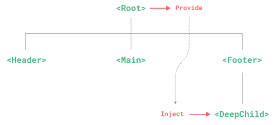

## slot——组件插槽

一些情况下我们会希望能和 HTML 元素一样向组件中传递内容，这可以通过 Vue 的自定义 `<slot>` 元素来实现。使用 `<slot>` 作为一个占位符，父组件传递进来的内容就会渲染在这里。

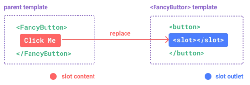

以`<FancyButton>`组件为例，它负责渲染外层`<button>`及样式，而内部具体内容由父组件通过插槽传入。这样`<FancyButton>`可以在不同地方被复用，渲染不同内容，但保持相同样式。插槽内容可以访问到父组件的数据作用域，因为插槽内容本身是在父组件模板中定义的。

插槽内容可以是任意合法的模板内容，不局限于文本。例如我们可以传入多个元素，甚至是组件

如果我们想在父组件没有提供任何插槽内容时在 `<button>` 内渲染“Submit”，只需要将“Submit”写在 `<slot>` 标签之间来作为默认内容。

此外还有具名插槽、条件插槽等机制，可以实现更丰富的功能。

## v-**——指令

一个指令的任务是在其表达式的值变化时响应式地更新 DOM。某些指令会需要一个“参数”，在指令名后通过一个冒号隔开做标识。同样在指令参数上也可以使用一个 JavaScript 表达式，需要包含在一对方括号内。这里的 `attributeName` 会作为一个 JavaScript 表达式被动态执行，计算得到的值会被用作最终的参数。相似地，你还可以将一个函数绑定到动态的事件名称上。动态参数表达式因为某些字符的缘故有一些语法限制，比如空格和引号，在 HTML attribute 名称中都是不合法的。如果你需要传入一个复杂的动态参数，我们推荐使用[**计算属性**](https://cn.vuejs.org/guide/essentials/computed.html)替换复杂的表达式。修饰符是以点开头的特殊后缀，表明指令需要以一些特殊的方式被绑定。例如 `.prevent` 修饰符会告知 `v-on` 指令对触发的事件调用 `event.preventDefault()`

完整的指令语法

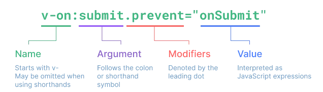

## 声明组件的方法

Vue 自动为 `methods` 中的方法绑定了永远指向组件实例的 `this`。这确保了方法在作为事件监听器或回调函数时始终保持正确的 `this`。你不应该在定义 `methods` 时使用箭头函数，因为箭头函数没有自己的 `this` 上下文。

和组件实例上的其他属性一样，方法也可以在模板上被访问。在模板中它们常常被用作事件监听器。

## 文本插值——双大括号和v-html

最基本的数据绑定形式是文本插值，它使用的是“Mustache”语法 (即双大括号)：

```
<span>Message: {{ msg }}</span>
```

双大括号标签会被替换为[**相应组件实例中**](https://cn.vuejs.org/guide/essentials/reactivity-fundamentals.html#declaring-reactive-state) `msg` 属性的值。同时每次 `msg` 属性更改时它也会同步更新。msg也可以替换成任意的js表达式。双大括号会将数据解释为纯文本，而不是 HTML。若想插入 HTML，你需要使用 [**`v-html` 指令](https://cn.vuejs.org/api/built-in-directives.html#v-html)。**

注意：**绑定在表达式中的方法在组件每次更新时都会被重新调用，因此不应该产生任何副作用，比如改变数据或触发异步操作。**

这里看到的 `v-html` attribute 被称为一个**指令**。指令由 `v-` 作为前缀，表明它们是一些由 Vue 提供的特殊 attribute，你可能已经猜到了，它们将为渲染的 DOM 应用特殊的响应式行为。这里我们做的事情简单来说就是：在当前组件实例上，将此元素的 innerHTML 与 `rawHtml` 属性保持同步。

`span` 的内容将会被替换为 `rawHtml` 属性的值，插值为纯 HTML——数据绑定将会被忽略。注意，你不能使用 `v-html` 来拼接组合模板，因为 Vue 不是一个基于字符串的模板引擎。在使用 Vue 时，应当使用组件作为 UI 重用和组合的基本单元。

**安全警告：在网站上动态渲染任意 HTML 是非常危险的，因为这非常容易造成 [XSS 漏洞](https://zh.wikipedia.org/wiki/跨網站指令碼)。请仅在内容安全可信时再使用 `v-html`，并且永远不要使用用户提供的 HTML 内容。**

## v-bind——将数据响应式地绑定到组件的属性上

响应式绑定是 Vue 框架中的重要特性，它能使 DOM 与组件实例数据自动保持同步。

v-bind会和vue的数据绑定，也就是切换到JS的语法规则了

与 Vue 使用 `{{}}` 表达式在模板中显示 JavaScript 表达式的方式类似，Vue 有一种特殊的语法**将 JavaScript 表达式绑定到 HTML 元素和组件**：**`v-bind`**。`v-bind` 表达式如下所示：

```html
v-bind:attribute="expression"
```

换句话说，你可以在要绑定到的任何 attribute/prop 前面加上 `v-bind:`。在大多数情况下，你可以对 `v-bind:` 属性使用速记，即只在 attribute/prop 前面加上冒号。

```html
<!-- ToDoItem.vue，子组件 -->
<input type="checkbox" id="todo-item" v-bind:checked="isDone" />
<label for="todo-item">{{ label }}</label>
```

通过将 `:done="true"` 传递给 `App.vue` 中的 `ToDoItem` 调用来测试你的组件。请注意，你需要使用 `v-bind` 语法，否则 `true` 将作为字符串传递。在 Vue 中，数据绑定有不同的方式。如果不使用v-bind语法来传递数据，Vue 会将传递的值当作普通的字符串处理。这里传递的值不是普通字符串，而是一个 JavaScript 表达式，Vue 会对其进行解析，将真正的布尔值`true`传递给`done` prop。（v-bind的作用就是将JS表达式的值传递给HTML控件）

> 接下来的指引中，我们都将在示例中使用简写语法，因为这是在实际开发中更常见的用法。

如果你有像这样的一个包含多个 attribute 的 JavaScript 对象：

```jsx
const objectOfAttrs = {  
	id: 'container',  
	class: 'wrapper',  
	style: 'background-color:green'
}
```

通过不带参数的 `v-bind`，你可以将它们绑定到单个元素上：

```jsx
<div v-bind="objectOfAttrs"></div>
```

`key` 属性和 `v-bind` 一起使用，用来帮助 Vue 跟踪和更新元素，默认的key属性对于数组来说，容易产生重复，此时需要显式修改key的值为一个唯一的值

## v-for——渲染组件列表

v-for指令的作用方式和元素的属性类似，就 `v-for` 而言，它类似 JavaScript 中的 [`for...in`](https://developer.mozilla.org/zh-CN/docs/Web/JavaScript/Reference/Statements/for...in) 循环——`v-for="item in items"`——`items` 是你要迭代的列表，`item` 是数组中当前元素的引用。

你也可以使用 `of` 作为分隔符来替代 `in`，这更接近 JavaScript 的迭代器语法。

`v-for` 获取每个迭代的元素，并渲染它和它的子元素。`key` 属性和 `v-for` 一起使用，用来帮助 Vue 标识列表中的元素，这样 Vue 就不需要在列表变化时重新创建它们。为了确保它适当地重新使用列表元素，它需要在你附加 `v-for` 的同一个元素上有一个独特的“key”。

```jsx
<ul>
  <li v-for="item in ToDoItems" :key="item.id">
    <to-do-item :label="item.label" :done="item.done"></to-do-item>
  </li>
</ul>
```

在这里我们可以做一个小小的重构。我们可以把 `id` 变成一个 prop，而不是在 `ToDoItem` 组件中为复选框生成它。虽然这不是严格意义上的需要，但它使我们更容易管理，因为我们已经需要为每个 todo 项目创建一个唯一的 `id`。这次重构使得 `item.id` 像其他参数一样，作为 prop 从 `App.vue` 传递给 `ToDoItem`。现在代码变得更有逻辑性和一致性。

props定义组件的数据结构（容器），data作数据源将实际数据传递给props

也可以使用 `v-for` 来遍历一个对象的所有属性。

Vue 更新`v - for`渲染的列表时，默认是 “就地更新”。就是数据项顺序变了，它也不会移动 DOM 元素，而是直接在原来位置更新。但这种方式在列表依赖子组件状态或表单输入值这些情况时就不合适了。为了让 Vue 能更好地管理每个节点，需要给每个元素块加一个唯一的`key`属性。在`<template v - for>`里，`key`要加在`<template>`标签上。除了迭代的 DOM 内容特别简单或者想利用默认行为提高性能，最好都给`v - for`加`key`。`key`的值最好是字符串或数字这种基本类型。

Vue 能够侦听响应式数组的变更方法，并在它们被调用时触发相关的更新。这些变更方法包括：

- `push()`
- `pop()`
- `shift()`
- `unshift()`
- `splice()`
- `sort()`
- `reverse()`

变更方法，顾名思义，就是会对调用它们的原数组进行变更。相对地，也有一些不可变 (immutable) 方法，例如 `filter()`，`concat()` 和 `slice()`，这些都不会更改原数组，而总是**返回一个新数组**。当遇到的是非变更方法时，我们需要将旧的数组替换为新的。你可能认为这将导致 Vue 丢弃现有的 DOM 并重新渲染整个列表——幸运的是，情况并非如此。Vue 实现了一些巧妙的方法来最大化对 DOM 元素的重用，因此用另一个包含部分重叠对象的数组来做替换，仍会是一种非常高效的操作。

有时，我们希望显示数组经过过滤或排序后的内容，而不实际变更或重置原始数据。在这种情况下，你可以创建返回已过滤或已排序数组的计算属性。在计算属性中使用 `reverse()` 和 `sort()` 的时候务必小心！这两个方法将变更原始数组，计算函数中不应该这么做。请在调用这些方法之前创建一个原数组的副本：

## v-on——将方法绑定到组件上

将方法添加到 `ToDoForm` 组件对象中，以使方法可用。这是在组件的 `methods` 属性中完成的，它与 `data()`、`props` 等位于同一位置。`methods` 属性包含我们可能需要在组件中调用的任何方法。引用时，方法已完全运行，因此使用它们在模板内显示信息不是一个好主意。为了显示通过计算获得的数据，你应该使用 `computed` 属性，我们稍后会介绍。

就像 Vue 如何使用 [`v-bind`](https://vuejs.org/v2/api/#v-bind) 语法来绑定属性，Vue 有用于事件处理的特殊指令：[`v-on`](https://vuejs.org/v2/api/#v-on)。`v-on` 指令通过 `v-on:event="method"` 语法工作。和 `v-bind` 很像，还有一个简写语法：`@event="method"`。

```html
<form v-on:submit="onSubmit"></form>
<form @submit="onSubmit"></form>
```

为了防止浏览器发布到服务器，我们需要通过页面冒泡阻止事件的默认操作。Vue 有一个特殊的语法叫做 **event modifiers** 可以在我们的模板中为我们处理这个问题。修饰符被附加到事件的末尾，带有一个点，如下所示：`@event.modifier`。

（页面冒泡指的是在网页开发中，当一个事件在某个 HTML 元素上触发时，该事件会从触发元素开始，按照 HTML 文档的层次结构向上传播，依次触发父元素上相同类型的事件的现象）

以下是事件修饰符列表，修饰符可以链式书写

- `.stop`：停止传播事件。等效于常规 JavaScript 事件中的 [`Event.stopPropagation()`](https://developer.mozilla.org/zh-CN/docs/Web/API/Event/stopPropagation)。
- `.prevent`：阻止事件的默认行为。等效于 [`Event.preventDefault()`](https://developer.mozilla.org/zh-CN/docs/Web/API/Event/preventDefault)。
- `.self`：仅当事件是从该确切元素分派时触发处理程序。
- `{.key}`：仅通过指定键触发事件处理程序。 [MDN 有一个有效键值列表](https://developer.mozilla.org/zh-CN/docs/Web/API/UI_Events/Keyboard_event_key_values); 多词键只需转换为 kebab 大小写（例如 `page-down`）。
- `.native`：监听组件根（最外层的包装）元素上的原生事件。
- `.once`：监听事件，直到它被触发一次，然后不再触发。
- `.left`：仅通过鼠标左键事件触发处理程序。
- `.right`：仅通过鼠标右键事件触发处理程序。
- `.middle`：仅通过鼠标中键事件触发处理程序。
- `.passive`：等效于在 vanilla JavaScript 中使用 [`addEventListener()`](https://developer.mozilla.org/zh-CN/docs/Web/API/EventTarget/addEventListener) 创建事件监听器时传入 `{ passive: true }` 参数。

**使用修饰符时需要注意调用顺序，因为相关代码是以相同的顺序生成的。因此使用 `@click.prevent.self` 会阻止元素及其子元素的所有点击事件的默认行为，而 `@click.self.prevent` 则只会阻止对元素本身的点击事件的默认行为。**

在监听键盘事件时，我们经常需要检查特定的按键。Vue 允许在 `v-on` 或 `@` 监听按键事件时添加按键修饰符。你可以直接使用 [**`KeyboardEvent.key`**](https://developer.mozilla.org/zh-CN/docs/Web/API/UI_Events/Keyboard_event_key_values) 暴露的按键名称作为修饰符，但需要转为 kebab-case 形式。

```html
<input @keyup.page-down="onPageDown" />
```

在上面的例子中，仅会在 $event.key 为 'PageDown' 时调用事件处理。

- `.left`
- `.right`
- `.middle`

这些修饰符将处理程序限定为由特定鼠标按键触发的事件。

但请注意，`.left`，`.right` 和 `.middle` 这些修饰符名称是基于常见的右手用鼠标布局设定的，但实际上它们分别指代设备事件触发器的“主”、”次“，“辅助”，而非实际的物理按键。

当事件处理函数不需要额外的数据，仅需要执行一些固定的操作或者只需要使用事件触发时传递的数据（如原生 DOM 事件的事件对象）时，不需要显式传递参数；否则需要在v-on调用处理函数时显示传递参数。

对于非常简单的处理，内联事件处理器的代码直接嵌入在 HTML 标签内，无需像方法事件处理器那样进行方法查找和调用的额外操作，减少了函数调用的开销，从而提高了代码的执行效率。

方法事件处理器会自动接收原生 DOM 事件并触发执行。在上面的例子中，我们能够通过被触发事件的 `event.target` 访问到该 DOM 元素。

```jsx
<template>
    <button @click="handleClick">点击我</button>
</template>

<script setup>
const handleClick = (event) => {
    // 通过event.target访问触发事件的DOM元素，并获取其标签名
    console.log(event.target.tagName); 
};
</script>
```

如何在事件处理器中访问事件参数

有时我们需要在内联事件处理器中访问原生 DOM 事件。你可以向该处理器方法传入一个特殊的 `$event` 变量，或者使用内联箭头函数：

```html
<!-- 使用特殊的 $event 变量 -->
<button @click="warn('Form cannot be submitted yet.', $event)">
  Submit
</button>

<!-- 使用内联箭头函数 -->
<button @click="(event) => warn('Form cannot be submitted yet.', event)">
  Submit
</button>
methods: {
  warn(message, event) {
    // 这里可以访问 DOM 原生事件
    if (event) {
      event.preventDefault()
    }
    alert(message)
  }
}
```

## v-model——将组件的值附加到data

在前端处理表单时，我们常常需要将表单输入框的内容同步给 JavaScript 中相应的变量。手动连接值绑定和更改事件监听器可能会很麻烦，`v-model` 指令帮我们简化了这一步骤。

`v-model` 可以在组件上使用以实现双向绑定。

**`v-model` 会忽略任何表单元素上初始的 `value`、`checked` 或 `selected` attribute。它将始终将当前绑定的 JavaScript 状态视为数据的正确来源。你应该在 JavaScript 中使用[`data`](https://cn.vuejs.org/api/options-state.html#data) 选项来声明该初始值。**

单一的复选框，绑定布尔类型值，也可以将多个复选框绑定到同一个数组或[**集合**](https://developer.mozilla.org/en-US/docs/Web/JavaScript/Reference/Global_Objects/Set)的值，多选 (值绑定到一个数组)。

将 `new-todo-input` 元素字段的值附加到 `label` 字段。Vue 对此有一个特殊的指令：[`v-model`](https://vuejs.org/v2/api/#v-model)。`v-model` 绑定到你在其上设置的数据属性，并使其与 `<input>` 保持同步。`v-model` 适用于所有不同的输入类型，包括复选框、单选框和选择输入。要使用 `v-model`，你需要向 `<input>` 添加一个结构为 `v-model="variable"` 的属性。

**备注：** 你还可以通过事件和 `v-bind` 属性的组合将数据与 `<input>` 值同步。事实上，这就是 `v-model` 在幕后所做的。但是，确切的事件和属性组合因输入类型而异，并且比仅使用 `v-model` 快捷方式需要更多代码。

可以在单个组件实例上创建多个 `v-model` 双向绑定。

组件上的每一个 `v-model` 都会同步不同的 prop，而无需额外的选项

## $emit发射传递数据的自定义事件，v-on监听

其作用，一是将子组件的这个事件向外暴露使得父组件和其他组件可以监听，二是可以向父组件和其他组件提供子组件的数据。

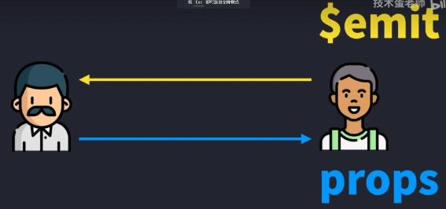

接下来我们需要做的是将新创建的待办事项传递给我们的 `App` 组件。为此，我们可以让我们的 `ToDoForm` 发出一个传递数据的自定义事件，并让 `App` 监听它。

自定义事件的发射方式如下：`this.$emit("event-name")`。重要的是要知道事件处理程序区分大小写并且不能包含空格。Vue 模板也被转换为小写，这意味着 Vue 模板无法监听以大写字母命名的事件。

用this.$emit(”event-name”)发射的事件，可以被父组件用v-on监听到，v-on的事件参数，就是这个自定义的事件名。

为了将数据传递回 `App.vue` 组件。可以通过将额外的参数传递给 `ToDoForm` 组件中的 `this.$emit()` 函数来做到这一点。这是通过在 `$emit()` 方法中包含你要作为另一个参数传递的数据来完成的：`this.$emit("todo-added", this.label)`。这类似于原生 JavaScript 事件如何包含数据。要真正在 `App.vue` 中获取这些数据，我们需要向我们的 `addToDo()` 方法添加一个参数，其中包含 `label` 新的待办事项

现在我们在 `App.vue` 中获得了来自 `ToDoForm` 的数据，我们需要在 `ToDoItems` 数组中添加一个表示它的项目。这可以通过将新的待办事项对象推送到包含我们新数据的数组来完成。

## 样式化Vue组件

Vue 具有三种样式化应用程序的方法：

- 外部 CSS 文件。
- 单文件组件（`.vue` 文件）中的全局样式。
- 单文件组件中组件范围的样式。

你可以包括外部 CSS 文件，并将其全局应用于你的应用程序。首先，在 `src/assets` 目录中创建一个名为 `reset.css` 的文件。Webpack 将处理此文件夹中的文件。这意味着我们可以使用 CSS 预处理器（如 SCSS）或后处理器（如 PostCSS）。接下来，在 `src/main.js` 文件中导入 `reset.css` 文件：

```jsx
import "./assets/reset.css";
```

全局应用的样式，除了可以添加到外部css文件中，还可以添加到单文件组件的<style>标签中。在 Vue 中，并非只有在`App.vue`根组件的`<style>`标签中添加的样式才是全局样式。如果在单文件组件的`<style>`标签中不使用`scoped`属性 ，那么该`<style>`标签内的样式就具有全局作用域。

我们应当在 `ToDoForm` 组件中的 `<button>` 元素上应用 CSS 按钮类。由于 Vue 模板是有效的 HTML 代码，这个步骤的实现与在纯 HTML 上实现类似——通过在元素中添加 `class=""` 属性实现。

- 要添加样式的最后一个组件是我们的 `ToDoItem` 组件。为了使样式的定义靠近组件，我们可以在它里面添加一个 `<style>` 元素。（v-bind:style=”{样式名:样式值}”，其实就是传入对象）

- 可以给 `:class` (`v-bind:class` 的缩写) 传递一个对象来动态切换 class：

    `<div :class="{ active: isActive }"></div>`（类名+布尔值）将样式回归到CSS中，同时后面的布尔值可以是动态的

    上面的语法表示 `active` 是否存在取决于数据属性 `isActive` 的[**真假值**](https://developer.mozilla.org/en-US/docs/Glossary/Truthy)。

如果想在数组中有条件地渲染某个 class，你可以使用三元表达式： `<div :class="[isActive ? activeClass : '', errorClass]"></div>`

然而，如果这些样式改变了这个组件之外的东西，要追踪到负责的样式并解决这个问题可能会很困难。这就是 `scoped` 属性有用的地方——它为你所有的样式附加了一个独特的 HTML `data` 属性选择器，防止它们在全局范围内发生冲突。

类似的，也可以绑定到数组和对象上

## computed——计算属性

computed是vue组件对象的一个属性，其值往往由一个函数返回或为一个JavaScript表达式的值。

使用 Vue 的[计算属性](https://vuejs.org/guide/essentials/computed.html)。计算属性的工作原理与methods类似，但仅在它们的一个依赖项发生变化时重新运行。要创建计算属性，我们需要向组件对象添加一个 `computed` 属性，就像我们之前使用的 `methods` 属性一样。如果不使用计算属性，这个值将在每次渲染时重新计算。对于像当前这样较小的应用程序，这可能并不不会产生什么影响。但是对于更大的应用程序，或者当表达式更复杂时，这可能会导致严重的性能问题。

```jsx
computed: {
  listSummary() {
    const numberFinishedItems = this.ToDoItems.filter((item) =>item.done).length
    return `${numberFinishedItems} out of ${this.ToDoItems.length} items completed`}
}
```

（`${}`是 ES6（ES2015）引入的模板字面量（Template Literals）语法。在模板字面量中，使用反引号（`）来包裹字符串，在` ${}` 大括号内部可以放置任何有效的 JavaScript 表达式，包括变量、函数调用、算术运算等）

`filter`函数用于过滤数组中的元素，返回一个新数组。新数组中的元素是通过对调用数组中的每个元素执行`callback`函数进行测试后符合条件的元素。

**基本语法**：`array.filter(callback(element[, index[, array]])[, thisArg])`，其中`array`是调用`filter`方法的数组，`callback`是用来测试数组每个元素的函数，`thisArg`是可选参数，用于指定执行`callback`函数时的`this`值 。

计算属性默认是只读的。当你尝试修改一个计算属性时，你会收到一个运行时警告。

计算属性的最佳实践

- **Getter 不应有副作用**

计算属性的 getter 应只做计算而没有任何其他的副作用，这一点非常重要，请务必牢记。举例来说，**不要改变其他状态、在 getter 中做异步请求或者更改 DOM**！一个计算属性的声明中描述的是如何根据其他值派生一个值。因此 getter 的职责应该仅为计算和返回该值。在之后的指引中我们会讨论如何使用[**侦听器**](https://cn.vuejs.org/guide/essentials/watchers.html)根据其他响应式状态的变更来创建副作用。

- **避免直接修改计算属性值**

从计算属性返回的值是派生状态。可以把它看作是一个“临时快照”，每当源状态发生变化时，就会创建一个新的快照。更改快照是没有意义的，因此计算属性的返回值应该被视为只读的，并且永远不应该被更改——应该更新它所依赖的源状态以触发新的计算。

对于JS对象，属性名有横杠-是会报错的，因此这里要使用驼峰命名法

## $event——传递事件数据的特殊变量

这是一个特殊的 Vue 变量，用于传递事件数据给方法。

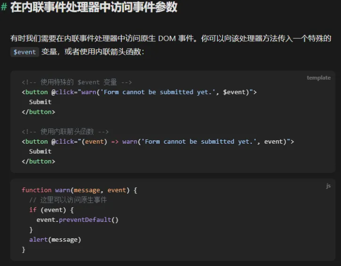

当用于普通元素，只监听[**原生 DOM 事件**](https://developer.mozilla.org/en-US/docs/Web/Events)。当用于自定义元素组件，则监听子组件触发的**自定义事件**。

当监听原生 DOM 事件时，方法接收原生事件作为唯一参数。如果使用内联声明，声明可以访问一个特殊的 `$event` 变量：`v-on:click="handle('ok', $event)"`。

## v-if——根据条件渲染显示控件

现在我们有了一个可用的 `isEditing` 标志来表示事项正在被编辑（或者未被编辑）。如果 `isEditing` 为真，我们会用这个标志来展示我们的 `ToDoItemEditForm` 而不是复选框。为此，我们将使用另一个 Vue 指令：[`v-if`](https://cn.vuejs.org/api/built-in-directives.html#v-if)。

`v-if` 指令只会在传递给它的值为真的情况下渲染一个块。这和 `if` 语句在 JavaScript 起作用的方式相似。`v-if` 也有对应的 [`v-else-if`](https://vuejs.org/api/built-in-directives.html#v-else-if) 和 [`v-else`](https://vuejs.org/api/built-in-directives.html#v-else) 指令，在 Vue 模板中提供相当于 JavaScript 的 `else if` 和 `else` 逻辑。

需要注意的是，`v-else` 和 `v-else-if` 块需要是 `v-if`/`v-else-if` 块的第一个兄弟，否则 Vue 将无法识别它们。如果你需要条件渲染整个模板，你也可以将 `v-if` 添加到 `<template>` 标签上。

最后，由于 Vue 只会在一个事件渲染这些块中的一个，你可以在根组件使用 `v-if` + `v-else` 来只显示一个块。我们将在我们的应用程序中这样做，因为这将使我们能够用编辑表单替换显示待办事项的代码。

接下来，我们将为 `item-deleted` 和 `item-edited` 事件添加事件监听器：

- 对于 `item-deleted`，你需要把 `item.id` 传递给该方法。
- 对于 `item-edited`，你需要传递 `item.id` 和特殊的 `$event` 变量。这是一个特殊的 Vue 变量，用于传递事件数据给方法。当使用本地 HTML 事件（如 `click`）时，它将把本地事件对象传递给你的方法。

注意你取消后复选框的状态——不仅应用程序忘记了复选框的状态，而且待办事项的完成状态现在也不正常了。如果你尝试再次勾选（或取消勾选）它，完成项的计数值将反向更改。这是因为在组件加载时，`data` 中的 `isDone` 只给出了值 `this.done`。

幸运的是，修复这个问题很容易：我们可以通过将我们的 `isDone` 数据转换为[计算属性](https://developer.mozilla.org/zh-CN/docs/Learn_web_development/Core/Frameworks_libraries/Vue_computed_properties)来做到这一点。计算属性的另一个优点是，它们保留了[反应性](https://vuejs.org/guide/essentials/reactivity-fundamentals.html)，这意味着（在其他事情中）当模板发生变化时，它们的状态会被保存，就像我们现在做的那样。

另一个可以用来按条件显示一个元素的指令是 `v-show`。其用法基本一样：

```jsx
<template>
  <button @click="toggleShow">Toggle</button>
  <h1 v-show="isShow">Hello!</h1>
</template>
```

不同之处在于 `v-show` 会在 DOM 渲染中保留该元素；`v-show` 仅切换了该元素上名为 `display` 的 CSS 属性。`v-show` 不支持在 `<template>` 元素上使用，也不能和 `v-else` 搭配使用。

`v-if` 是“真实的”按条件渲染，因为它确保了在切换时，条件区块内的事件监听器和子组件都会被销毁与重建。

`v-if` 也是**惰性**的：如果在初次渲染时条件值为 false，则不会做任何事。条件区块只有当条件首次变为 true 时才被渲染。

相比之下，`v-show` 简单许多，元素无论初始条件如何，始终会被渲染，只有 CSS `display` 属性会被切换。

总的来说，`v-if` 有更高的切换开销，而 `v-show` 有更高的初始渲染开销。因此，如果需要频繁切换，则使用 `v-show` 较好；如果在运行时绑定条件很少改变，则 `v-if` 会更合适。

当 `v-if` 和 `v-for` 同时存在于一个元素上的时候，`v-if` 会首先被执行。请查看[**列表渲染指南**](https://cn.vuejs.org/guide/essentials/list.html#v-for-with-v-if)获取更多细节。**同时使用 `v-if` 和 `v-for` 是不推荐的，因为这样二者的优先级不明显。请查看[风格指南](https://cn.vuejs.org/style-guide/rules-essential.html#avoid-v-if-with-v-for)获得更多信息。**

## ref——模板引用

如果你需要访问底层 DOM 节点（比如设置焦点时），你可以使用 [Vue 模板引用](https://cn.vuejs.org/guide/essentials/template-refs.html)。对于自定义的 Vue 组件，你也可以使用 refs 来直接访问子组件的内部结构，然而这样做应该是谨慎的，因为这会使代码更难推理和理解。

要在一个组件中使用模板引用，你需要在你想访问的元素上添加一个 `ref` 属性，并为该属性的值添加一个字符串标识符。值得注意的是，在一个组件中，引用必须是唯一的。在同一时间呈现的两个元素不应该有相同的引用。

为了访问与我们的引用相关的值，我们使用组件实例上提供的 `$refs` 属性。当我们点击“Edit”按钮时，要看到 ref 的值，在我们的 `toggleToItemEditForm()` 方法中添加 `console.log()`

挂载结束后引用都会被暴露在 `this.$refs` 之上。

注意，你只可以**在组件挂载后**才能访问模板引用。如果你想在模板中的表达式上访问 `$refs.input`，在初次渲染时会是 `undefined`。这是因为在初次渲染前这个元素还不存在呢！

## $nextTick( )——用于需要DOM更新后再执行的操作

当你修改了响应式状态时，DOM 会被自动更新。但是需要注意的是，DOM 更新不是同步的。Vue 会在“next tick”更新周期中缓冲所有状态的修改，以确保不管你进行了多少次状态修改，每个组件都只会被更新一次。

要等待 DOM 更新完成后再执行额外的代码，可以使用 [**nextTick()**](https://cn.vuejs.org/api/general.html#nexttick) 全局 API

记住，当我们把 `isEditing` 改为 `true` 时，我们不再渲染“Edit”按钮的组件部分。这意味着没有元素可以绑定引用，所以它变成了 `undefined`。这就是“*不能访问属性 "focus"，editButtonRef 是 undefined 的*”（Cannot read properties of null (reading 'focus')）这个报错的原因

你现在可能在想：“我们在访问 `ref` 之前不是设置了 `isEditing=false` 吗，现在 `v-if` 不是应该显示这个按钮吗？”这就是虚拟 DOM 起作用的地方。因为 Vue 试图优化和批处理变化，当我们把 `isEditing` 设置为 `false` 时，它不会立即更新 DOM。所以当我们调用 `focusOnEditButton()` 时，“Edit”按钮还没有被渲染。

相反，我们需要等到 Vue 经历了下一个 DOM 更新周期之后。为了做到这一点，Vue 组件有一个特殊的方法，叫做 `$nextTick()`。这个方法接受一个回调函数，然后在 DOM 更新后执行。

由于 `focusOnEditButton()` 方法需要在 DOM 更新后被调用，我们可以将现有的函数体包裹在 `$nextTick()` 调用中。

## 有状态方法

有状态方法是指在运行时维护内部状态的方法，这种方法的执行结果可能会受到其内部状态的影响，并且多次调用之间状态可能会发生变化。在文档中，使用 Lodash 的防抖函数创建的预置防抖的事件处理器就是有状态方法的典型例子。

- **表现形式**：以使用`debounce`函数创建的防抖点击事件处理函数为例，在组件中定义`click: debounce(function () { //... 对点击的响应... }, 500)`，这里的`click`方法就是有状态方法。`debounce`函数会在运行时维护一个内部状态，比如记录上次调用的时间等信息，以此来控制函数的执行频率，避免短时间内多次触发事件。
- **存在问题及解决方式**：有状态方法对于被重用的组件存在问题，因为多个组件实例共享同一个预置防抖的函数时，它们之间会互相影响。为保持每个组件实例的防抖函数彼此独立，可以在`created`生命周期钩子中创建预置防抖的函数，让每个实例都有自己独立的有状态方法。并且在组件卸载时，最好在`unmounted`钩子中清除防抖计时器，如`this.debouncedClick.cancel()`，以避免潜在的内存泄漏等问题。

## 虚拟DOM和实际DOM

Vue 和其他一些框架一样，使用一个虚拟 DOM（VDOM）来管理元素。这意味着 Vue 在内存中保留了我们应用程序中所有节点的表示。任何更新首先在内存中的节点上执行，然后所有需要对页面上的实际节点进行的更改都会被批量同步。

由于读写实际的 DOM 节点通常比虚拟节点开销更大，虚拟 DOM 可以带来更好的性能。然而，这也意味着在使用框架时，你往往不应该直接通过原生浏览器 API（如 [`Document.getElementById`](https://developer.mozilla.org/zh-CN/docs/Web/API/Document/getElementById)）来编辑你的 HTML 元素，因为这会导致 VDOM 和真实 DOM 不同步。

实际 DOM 和虚拟 DOM 之间的关系是：虚拟 DOM（VDOM）是 Vue 在内存中保留的应用程序中所有节点的表示。Vue 通过虚拟 DOM 来管理元素，它会根据数据变化，在内存中的虚拟 DOM 节点上执行更新操作，然后将这些更新批量同步到实际 DOM 上 。

在网页运行时，它们的运作机制如下：

- **虚拟 DOM 运作机制**：当数据发生变化时，Vue 会首先在虚拟 DOM 上进行相应的更新操作。它会计算出哪些部分发生了改变，生成一个新的虚拟 DOM 树，然后通过对比新旧虚拟 DOM 树，找出具体的差异，即 “最小化的变更”。这样做可以避免直接频繁操作实际 DOM 带来的性能开销，因为直接操作实际 DOM 的读写成本较高。
- **实际 DOM 运作机制**：虚拟 DOM 计算出差异后，Vue 会将这些差异批量同步到实际 DOM 上，使得实际 DOM 的状态与虚拟 DOM 保持一致，最终呈现给用户更新后的页面。这种批量同步的方式减少了对实际 DOM 的直接操作次数，提高了性能。

Vue 为了提升性能，采用异步更新策略来批量处理 DOM 更新。当数据发生变化时，Vue 不会立刻更新 DOM，而是将这些变化收集起来，在合适的时机统一进行更新。这个过程使得 DOM 更新周期并非固定时长，而是取决于 Vue 内部对任务的调度和执行时机。

一个运行时渲染器将会遍历整个虚拟 DOM 树，并据此构建真实的 DOM 树。这个过程被称为**挂载** (mount)。

从高层面的视角看，Vue 组件挂载时会发生如下几件事：

1. **编译**：Vue 模板被编译为**渲染函数**：即用来返回虚拟 DOM 树的函数。这一步骤可以通过构建步骤提前完成，也可以通过使用运行时编译器即时完成。
2. **挂载**：运行时渲染器调用渲染函数，遍历返回的虚拟 DOM 树，并基于它创建实际的 DOM 节点。这一步会作为[**响应式副作用**](https://cn.vuejs.org/guide/extras/reactivity-in-depth.html)执行，因此它会追踪其中所用到的所有响应式依赖。
3. **更新**：当一个依赖发生变化后，副作用会重新运行，这时候会创建一个更新后的虚拟 DOM 树。运行时渲染器遍历这棵新树，将它与旧树进行比较，然后将必要的更新应用到真实 DOM 上去。

## Vue中的生命周期方法

接下来，我们需要在点击“Edit”按钮时将焦点移到编辑表单的 `<input>` 元素。然而，由于我们的编辑表单和“Edit”按钮在不同的组件中，我们不能仅仅在“Edit”按钮的点击事件处理器中设置焦点。相反，我们可以利用每当“Edit”按钮被点击时，我们就删除并重新挂载 `ToDoItemEditForm` 组件的这一事实来处理这个问题。Vue 组件经历了一系列的事件，被称为**生命周期**。这个生命周期从元素被创建并添加到 VDOM（*mounted*）之前，一直到它们被从 VDOM 中移除（*destroyed*）。

Vue 让你在这个生命周期的不同阶段使用**生命周期方法**运行方法。这对于像数据获取这样的事情很有用，你可能需要在组件渲染之前，或者在一个属性改变之后获取数据。下面是生命周期方法的列表，按照它们被触发的顺序排列。

1. `beforeCreate()`：在你的组件的实例被创建之前运行。数据和事件尚不可用。
2. `created()`：在你的组件被初始化后，但在组件被添加到 VDOM 前运行。这通常是数据获取发生的地方。
3. `beforeMount()`：在你的模板被编译后，但在你的组件被渲染到实际的 DOM 前运行。
4. `mounted()`：在你的组件被安装到 DOM 后运行。可以在这里访问 `refs`。
5. `beforeUpdate()`：当你的组件中的数据发生变化时，但在变化被渲染到 DOM 之前，就会运行。
6. `updated()`：只要你的组件中的数据发生变化，并且在变化被渲染到 DOM 之后，就会运行。
7. `beforeDestroy()`：在一个组件从 DOM 中移除之前运行。
8. `destroyed()`：在一个组件被从 DOM 中移除后运行。
9. `activated()`：只用于用特殊的 `keep-alive` 标签包装的组件。在组件被激活后运行。
10. `deactivated()`：只用于用特殊的 `keep-alive` 标签包装的组件。在组件被停止激活后运行。


接下来，在你的组件对象中添加一个 `mounted()` 属性——**注意，这不应该放在 `methods` 属性里面，而应该与 `props`、`data()` 和 `methods` 处于同一个层次**。生命周期方法是独立的特殊方法，不应与用户定义方法放在一起。这些方法不接受参数。注意，你不能在这里使用箭头函数，因为我们需要访问 `this` 来访问我们的 `labelInput` 模板引用。在 `mounted()` 方法中，将你的 `labelInput` 引用分配给一个变量，然后调用该引用的 `focus()` 函数。你不必在这里使用 `$nextTick`，因为当 `mounted()` 被调用时，该组件已经被添加到 DOM 中。

**备注：** [`tabindex`](https://developer.mozilla.org/zh-CN/docs/Web/HTML/Global_attributes/tabindex) 是一个真正强大的工具，可以处理某些无障碍问题。然而，应该谨慎地使用它。过度使用 `tabindex="-1"` 会给各种用户带来问题，所以只在需要的地方使用它。你也几乎不应该使用 `tabindex` > = `0`，因为它可能给用户带来问题，因为它可能使 DOM 流和标签顺序不匹配，和/或在标签顺序中添加非交互式元素。这可能会让用户感到困惑，特别是那些使用屏幕阅读器和其他辅助技术的用户。

由于 `<h2>` 总是在应用程序中渲染出来，你不必刻意使用生命周期方法的 `$nextTick` 来处理焦点。

## 箭头函数

```jsx
// 定义一个多参数多语句的箭头函数，用于计算两个数的和并打印相关信息
const calculateAndPrint = (num1, num2) => {
    const sum = num1 + num2;
    console.log(`第一个数是 ${num1}，第二个数是 ${num2}，它们的和是 ${sum}`);
    return sum;
};

// 调用函数
const result = calculateAndPrint(5, 3);
console.log(`最终计算结果为: ${result}`);
```

在使用箭头函数时需要注意，它没有自己的`this`绑定，`this`的值在定义箭头函数时就已经确定，会继承自外层作用域的`this` 。**在文档中提到的 Vue 生命周期方法中，就特别强调不能使用箭头函数定义生命周期方法，因为需要访问组件实例的`this`来获取模板引用等信息，若使用箭头函数会导致`this`指向错误，无法正确访问组件实例的属性和方法 。**

## Vue路由

服务端路由指的是服务器根据用户访问的 URL 路径返回不同的响应结果。当我们在一个传统的服务端渲染的 web 应用中点击一个链接时，浏览器会从服务端获得全新的 HTML，然后重新加载整个页面。

然而，在[**单页面应用**](https://developer.mozilla.org/en-US/docs/Glossary/SPA)中，客户端的 JavaScript 可以拦截页面的跳转请求，动态获取新的数据，然后在无需重新加载的情况下更新当前页面。这样通常可以带来更顺滑的用户体验，尤其是在更偏向“应用”的场景下，因为这类场景下用户通常会在很长的一段时间中做出多次交互。

在这类单页应用中，“路由”是在客户端执行的。一个客户端路由器的职责就是利用诸如 [**History API**](https://developer.mozilla.org/en-US/docs/Web/API/History) 或是 [**`hashchange` 事件**](https://developer.mozilla.org/en-US/docs/Web/API/Window/hashchange_event)这样的浏览器 API 来管理应用当前应该渲染的视图。

Vue 很适合用来构建单页面应用。对于大多数此类应用，都推荐使用官方支持的[**路由库**](https://github.com/vuejs/router)。

如果你只需要一个简单的页面路由，而不想为此引入一整个路由库，你可以通过[**动态组件**](https://cn.vuejs.org/guide/essentials/component-basics.html#dynamic-components)的方式，监听浏览器 [**`hashchange` 事件**](https://developer.mozilla.org/en-US/docs/Web/API/Window/hashchange_event)或使用 [**History API**](https://developer.mozilla.org/en-US/docs/Web/API/History) 来更新当前组件。

## Vue状态管理

下面介绍手动状态管理的方式，可以用于简单的应用场景。如有大型应用的维护需求，可使用官方的pinia库或vuex库进行自动状态管理。

理论上来说，每一个 Vue 组件实例都已经在“管理”它自己的响应式状态了。以一个简单的计数器组件为例：它是一个独立的单元，由以下几个部分组成：

- **状态**：驱动整个应用的数据源；
- **视图**：对**状态**的一种声明式映射；
- **交互**：状态根据用户在**视图**中的输入而作出相应变更的可能方式。

下面是“单向数据流”这一概念的简单图示：

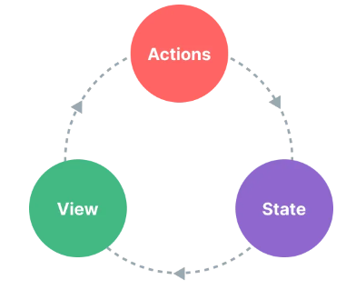

然而，当我们有**多个组件共享一个共同的状态**时，就没有这么简单了：

1. 多个视图可能都依赖于同一份状态。
2. 来自不同视图的交互也可能需要更改同一份状态。

对于情景 1，一个可行的办法是将共享状态“提升”到共同的祖先组件上去，再通过 props 传递下来。然而在深层次的组件树结构中这么做的话，很快就会使得代码变得繁琐冗长。这会导致另一个问题：[**Prop 逐级透传问题**](https://cn.vuejs.org/guide/components/provide-inject.html#prop-drilling)。

对于情景 2，我们经常发现自己会直接通过模板引用获取父/子实例，或者通过触发的事件尝试改变和同步多个状态的副本。但这些模式的健壮性都不甚理想，很容易就会导致代码难以维护。

一个更简单直接的解决方案是抽取出组件间的共享状态，放在一个全局单例中来管理。这样我们的组件树就变成了一个大的“视图”，而任何位置上的组件都可以访问其中的状态或触发动作。

用响应式API作简单状态管理

在选项式 API 中，响应式数据是用 `data()` 选项声明的。在内部，`data()` 的返回值对象会通过 [**`reactive()`**](https://cn.vuejs.org/api/reactivity-core.html#reactive) 这个公开的 API 函数转为响应式。如果你有一部分状态需要在多个组件实例间共享，你可以使用 [**`reactive()`**](https://cn.vuejs.org/api/reactivity-core.html#reactive) 来创建一个响应式对象，并将它导入到多个组件中：

```jsx
// store.js
import { reactive } from 'vue'

export const store = reactive({
  count: 0
})
<!-- ComponentA.vue -->
<script>
import { store } from './store.js'

export default {
  data() {
    return {
      store
    }
  }
}
</script>

<template>From A: {{ store.count }}</template>

<!-- ComponentB.vue -->
<script>
import { store } from './store.js'

export default {
  data() {
    return {
      store
    }
  }
}
</script>

<template>From B: {{ store.count }}</template>
```

现在每当 `store` 对象被更改时，`<ComponentA>` 与 `<ComponentB>` 都会自动更新它们的视图。现在我们有了单一的数据源。

然而，这也意味着任意一个导入了 `store` 的组件都可以随意修改它的状态。

虽然这在简单的情况下是可行的，但从长远来看，可以被任何组件任意改变的全局状态是不太容易维护的。为了确保改变状态的逻辑像状态本身一样集中，建议在 store 上定义方法，方法的名称应该要能表达出行动的意图：

```jsx
// store.js
import { reactive } from 'vue'

export const store = reactive({
  count: 0,
  increment() {
    this.count++
  }
})
<template>
  <button @click="store.increment()">
    From B: {{ store.count }}
  </button>
</template>
```

**请注意这里点击的处理函数使用了 `store.increment()`，带上了圆括号作为内联表达式调用，因为它并不是组件的方法，并且必须要以正确的 `this` 上下文来调用。**

Vue 的响应性系统与组件层是解耦的，这使得它非常灵活。

## 侦听器watch

计算属性允许我们声明性地计算衍生值。然而在有些情况下，我们需要在状态变化时执行一些“副作用”：例如更改 DOM，或是根据异步操作的结果去修改另一处的状态。

在选项式 API 中，我们可以使用 [**`watch` 选项**](https://cn.vuejs.org/api/options-state.html#watch)在每次响应式属性发生变化时触发一个函数。

## 可设置的样式属性

以下将全面列举可应用于 `<div>` 元素的 CSS 样式属性，涵盖了盒模型、布局、文本、背景、边框、特效等多个方面：

### **盒模型相关属性**

### **尺寸**

- **`width`**：设置元素的宽度，取值可以是具体的长度值（如 `px`、`em`、`rem`）、百分比、`auto` 等。例如：`width: 200px;`
- **`min-width`**：设置元素的最小宽度。如：`min-width: 100px;`
- **`max-width`**：设置元素的最大宽度。如：`max-width: 500px;`
- **`height`**：设置元素的高度。例如：`height: 150px;`
- **`min-height`**：设置元素的最小高度。如：`min-height: 50px;`
- **`max-height`**：设置元素的最大高度。如：`max-height: 300px;`

### **内外边距**

- **`margin`**：设置元素的外边距，可分别设置上、右、下、左外边距，也可简写。例如：`margin: 10px;` （四周外边距均为 10px）；`margin-top: 5px;` （上外边距为 5px）
- **`padding`**：设置元素的内边距，使用方法与 `margin` 类似。如：`padding: 20px 10px;` （上下内边距 20px，左右内边距 10px）

### **盒模型计算方式**

- **`box-sizing`**：取值有 `content-box`（默认，宽度和高度只包含内容区）和 `border-box`（宽度和高度包含内容区、内边距和边框）。例如：`box-sizing: border-box;`

### **布局相关属性**

### **显示类型**

- **`display`**：常见取值有 `block`（块级元素）、`inline`（行内元素）、`inline-block`（行内块级元素）、`flex`（弹性布局容器）、`grid`（网格布局容器）、`none`（不显示）等。例如：`display: flex;`
- **`visibility`**：取值有 `visible`（默认，元素可见）、`hidden`（元素隐藏，但仍占据空间）、`collapse`（用于表格行、列等，隐藏并释放空间）。如：`visibility: hidden;`

### **定位**

- **`position`**：取值有 `static`（默认，元素正常布局）、`relative`（相对定位，相对于正常位置偏移）、`absolute`（绝对定位，相对于最近的已定位祖先元素）、`fixed`（固定定位，相对于浏览器窗口）、`sticky`（粘性定位，在滚动时固定在某个位置）。例如：`position: relative; top: 10px; left: 20px;`
- **`top`、`right`、`bottom`、`left`**：用于定位元素的偏移量，与 `position` 属性配合使用。

### **浮动与清除浮动**

- **`float`**：取值有 `left`（向左浮动）、`right`（向右浮动）、`none`（不浮动）。例如：`float: left;`
- **`clear`**：取值有 `left`（清除左浮动）、`right`（清除右浮动）、`both`（清除左右浮动）、`none`（不清除）。如：`clear: both;`

### **Flexbox 布局**

如果 `display` 设置为 `flex`，还有以下相关属性：

- **`flex-direction`**：定义主轴方向，取值有 `row`（水平从左到右）、`row-reverse`（水平从右到左）、`column`（垂直从上到下）、`column-reverse`（垂直从下到上）。例如：`flex-direction: column;`
- **`flex-wrap`**：定义元素是否换行，取值有 `nowrap`（不换行）、`wrap`（换行）、`wrap-reverse`（换行且反转顺序）。如：`flex-wrap: wrap;`
- **`justify-content`**：定义主轴上的对齐方式，取值有 `flex-start`（起始端对齐）、`flex-end`（末尾端对齐）、`center`（居中对齐）、`space-between`（两端对齐，元素间间距相等）、`space-around`（元素两侧间距相等）等。例如：`justify-content: center;`
- **`align-items`**：定义交叉轴上的对齐方式，取值有 `stretch`（拉伸填充）、`flex-start`、`flex-end`、`center`、`baseline`（基线对齐）。如：`align-items: center;`
- **`align-content`**：当有多行元素时，定义交叉轴上的对齐方式，取值与 `justify-content` 类似。
- **`flex-grow`**：定义元素的放大比例。如：`flex-grow: 1;`
- **`flex-shrink`**：定义元素的缩小比例。如：`flex-shrink: 2;`
- **`flex-basis`**：定义元素在主轴上的初始大小。如：`flex-basis: 200px;`

### **Grid 布局**

如果 `display` 设置为 `grid`，有以下相关属性：

- **`grid-template-columns`**：定义网格的列模板，可使用具体长度值、百分比、`fr` 单位等。例如：`grid-template-columns: 1fr 2fr 1fr;`
- **`grid-template-rows`**：定义网格的行模板。如：`grid-template-rows: repeat(3, 100px);`
- **`grid-gap`**：设置网格单元之间的间距，包括行间距和列间距。如：`grid-gap: 10px;`
- **`place-items`**：同时设置 `align-items` 和 `justify-items`，用于定义网格单元内元素的对齐方式。例如：`place-items: center;`
- **`place-content`**：同时设置 `align-content` 和 `justify-content`，用于定义整个网格内容的对齐方式。

### **文本相关属性**

- **`color`**：设置文本颜色，可使用颜色关键字、十六进制值、RGB 值等。例如：`color: #ff0000;`
- **`font-family`**：设置字体家族，可指定多个字体，按顺序匹配。如：`font-family: Arial, sans-serif;`
- **`font-size`**：设置字体大小，取值可以是具体长度值、百分比等。例如：`font-size: 18px;`
- **`font-weight`**：设置字体粗细，取值有 `normal`、`bold`、`bolder`、`lighter` 以及 100 - 900 的数字值。如：`font-weight: bold;`
- **`font-style`**：设置字体样式，取值有 `normal`、`italic`（斜体）、`oblique`（倾斜）。例如：`font-style: italic;`
- **`text-align`**：设置文本的水平对齐方式，取值有 `left`、`right`、`center`、`justify`（两端对齐）。如：`text-align: center;`
- **`text-decoration`**：设置文本的装饰线，取值有 `none`、`underline`（下划线）、`overline`（上划线）、`line-through`（删除线）等。例如：`text-decoration: underline;`
- **`text-transform`**：设置文本的大小写转换，取值有 `none`、`uppercase`（全大写）、`lowercase`（全小写）、`capitalize`（首字母大写）。如：`text-transform: uppercase;`
- **`line-height`**：设置行高，可使用具体长度值、倍数等。例如：`line-height: 1.5;`
- **`letter-spacing`**：设置字符间距。如：`letter-spacing: 2px;`
- **`word-spacing`**：设置单词间距。如：`word-spacing: 5px;`

### **背景相关属性**

- **`background-color`**：设置背景颜色。例如：`background-color: lightblue;`
- **`background-image`**：设置背景图像，可使用 `url()` 函数指定图像路径。如：`background-image: url('image.jpg');`
- **`background-repeat`**：定义背景图像的重复方式，取值有 `repeat`（默认，水平和垂直重复）、`repeat-x`（水平重复）、`repeat-y`（垂直重复）、`no-repeat`（不重复）。例如：`background-repeat: no-repeat;`
- **`background-position`**：设置背景图像的位置，可使用具体长度值、百分比或关键字（如 `top`、`left`、`center` 等）。如：`background-position: center;`
- **`background-size`**：设置背景图像的大小，取值有 `auto`（默认，保持原始大小）、`cover`（覆盖整个元素）、`contain`（包含在元素内）以及具体长度值、百分比等。例如：`background-size: cover;`
- **`background-attachment`**：定义背景图像是否随页面滚动，取值有 `scroll`（默认，随页面滚动）、`fixed`（固定不动）、`local`（随元素内容滚动）。如：`background-attachment: fixed;`

### **边框相关属性**

- **`border-width`**：设置边框宽度，可分别设置上、右、下、左边框宽度，也可简写。例如：`border-width: 2px;`
- **`border-style`**：设置边框样式，常见取值有 `solid`（实线）、`dotted`（点状线）、`dashed`（虚线）、`double`（双实线）等。如：`border-style: dashed;`
- **`border-color`**：设置边框颜色，使用方法与 `color` 属性类似。例如：`border-color: green;`
- **`border`**：是 `border-width`、`border-style` 和 `border-color` 的简写属性。如：`border: 1px solid black;`
- **`border-radius`**：设置边框圆角，可分别设置四个角的圆角半径，也可简写。例如：`border-radius: 5px;`

### **特效与动画相关属性**

- **`opacity`**：设置元素的透明度，取值范围是 0（完全透明）到 1（完全不透明）。例如：`opacity: 0.5;`
- **`box-shadow`**：为元素添加阴影效果，可设置阴影的偏移量、模糊半径、扩散半径、颜色等。如：`box-shadow: 2px 2px 5px rgba(0, 0, 0, 0.3);`
- **`text-shadow`**：为文本添加阴影效果，使用方法与 `box-shadow` 类似。例如：`text-shadow: 1px 1px 2px gray;`
- **`transform`**：对元素进行变换操作，如旋转、缩放、平移、倾斜等。例如：`transform: rotate(45deg);`
- **`transition`**：为元素的属性变化添加过渡效果，可设置过渡的属性、过渡时间、过渡延迟、过渡函数等。如：`transition: all 0.3s ease;`
- **`animation`**：为元素添加动画效果，需要结合 `@keyframes` 规则定义动画关键帧。例如：

收起

**css**

```
@keyframes slide {     from { left: 0; }     to { left: 200px; } } div {     animation: slide 2s infinite; }
```

### **其他属性**

- **`cursor`**：设置鼠标指针在元素上的样式，取值有 `pointer`（手型）、`default`（默认箭头）、`text`（文本选择）等。例如：`cursor: pointer;`
- **`overflow`**：当元素内容超出其尺寸时，定义如何处理溢出内容，取值有 `visible`（默认，内容可见）、`hidden`（隐藏溢出内容）、`scroll`（显示滚动条）、`auto`（根据需要显示滚动条）。如：`overflow: auto;`
- **`z-index`**：设置元素的堆叠顺序，值越大越在上面，仅对定位元素有效。例如：`z-index: 10;`

## 主题切换

```html
<template>
  <div :class="isDarkMode ? 'dark-mode' : 'light-mode'">
    <!-- 滑槽式按钮 -->
    <label class="switch">
      <input type="checkbox" v-model="isDarkMode" />
      <span class="slider round"></span>
    </label>
    <!-- 一段文字 -->
    <p>这是一段示例文字，会根据模式改变样式。</p>
    <!-- 一个按钮 -->
    <button>示例按钮</button>
  </div>
</template>

<script>
export default {
  data() {
    return {
      // 初始模式为日间模式
      isDarkMode: false,
    };
  },
};
</script>

<style scoped>
/* 通用样式 */
body {
  font-family: Arial, sans-serif;
  transition: background-color 0.3s ease;
}

/* 滑槽式按钮样式 */
.switch {
  position: relative;
  display: inline-block;
  width: 60px;
  height: 34px;
}

.switch input {
  opacity: 0;
  width: 0;
  height: 0;
}

.slider {
  position: absolute;
  cursor: pointer;
  top: 0;
  left: 0;
  right: 0;
  bottom: 0;
  background-color: #ccc;
  -webkit-transition: 0.4s;
  transition: 0.4s;
}

.slider:before {
  position: absolute;
  content: "";
  height: 26px;
  width: 26px;
  left: 4px;
  bottom: 4px;
  background-color: white;
  -webkit-transition: 0.4s;
  transition: 0.4s;
}

input:checked + .slider {
  background-color: #2196f3;
}

input:focus + .slider {
  box-shadow: 0 0 1px #2196f3;
}

input:checked + .slider:before {
  -webkit-transform: translateX(26px);
  -ms-transform: translateX(26px);
  transform: translateX(26px);
}

.slider.round {
  border-radius: 34px;
}

.slider.round:before {
  border-radius: 50%;
}

/* 日间模式样式 */
.light-mode {
  background-image: url("@/assets/light_bg.jpg");
  background-size: cover;
  color: #333;
}

.light-mode p {
  color: #333;
}

.light-mode button {
  background-color: #fff;
  color: #333;
  border: 1px solid #333;
}

/* 夜间模式样式 */
.dark-mode {
  background-image: url("@/assets/dark_bg.jpg");
  background-size: cover;
  color: #fff;
}

.dark-mode p {
  color: #fff;
}

.dark-mode button {
  background-color: #333;
  color: #fff;
  border: 1px solid #fff;
}
</style>
```

## 画图梳理数据流

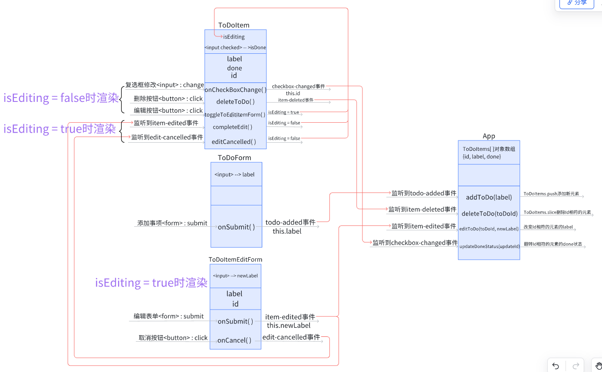

## Vue安全问题

无论是使用模板还是渲染函数，内容都是自动转义的。在标签内的<>”默认都会被转义以防止脚本注入。从而防止在 `title` attribute 解析时，注入任意的 HTML。这种转义是使用 `setAttribute` 这样的浏览器原生 API 完成的，所以只有当浏览器本身存在漏洞时，才会存在漏洞。

然而，**在你知道 HTML 安全的情况下**，你还是可以显式地渲染 HTML 内容。

**用户提供的 HTML 永远不能被认为是 100% 安全的，除非它在 iframe 这样的沙盒环境中，或者该 HTML 只会被该用户看到。此外，允许用户编写自己的 Vue 模板也会带来类似的危险。**

如果这个 URL 允许通过 `javascript:` 执行 JavaScript，即没有进行无害化处理，那么就会有一些潜在的安全问题。可以使用一些库来解决此类问题，比如 [**sanitize-url**](https://www.npmjs.com/package/@braintree/sanitize-url)，但请注意：如果你发现你需要在前端做 URL 无害化处理，那你的应用已经存在一个更严重的安全问题了。**任何用户提供的 URL 在被保存到数据库之前都应该先在后端做无害化处理**。这样，连接到你 API 的*每一个*客户端都可以避免这个问题，包括原生移动应用。另外，即使是经过无害化处理的 URL，Vue 也不能保证它们指向安全的目的地。

我们假设 `sanitizedUrl` 已进行无害化处理，它是一个正常 URL 而非 JavaScript。然而，由于 `userProvidedStyles` 的存在，恶意用户仍然能利用 CSS 进行“点击劫持”，例如，可以在“登录”按钮上方覆盖一个透明的链接。如果用户控制的页面 `https://user-controlled-website.com/` 专门仿造了你应用的登录页，那么他们就有可能捕获用户的真实登录信息。

你可以想象，如果允许在 `<style>` 元素中插入用户提供的内容，会造成更大的漏洞，因为这使得用户能控制整个页面的样式。因此 Vue 阻止了在模板中像这样渲染 style 标签。为了避免用户的点击被劫持，我们建议仅在沙盒环境的 iframe 中允许用户控制 CSS。

我们强烈建议任何时候都不要在 Vue 中渲染 `<script>`，因为模板和渲染函数不应有其他副作用。但是，渲染 `<script>` 并不是插入在运行时执行的 JavaScript 字符串的唯一方法。

每个 HTML 元素都有能接受字符串形式 JavaScript 的 attribute，例如 `onclick`、`onfocus` 和 `onmouseenter`。绑定任何用户提供的 JavaScript 给这些事件 attribute 都具有潜在风险，因此需要避免这么做。

**警告：用户提供的 JavaScript 永远不能被认为是 100% 安全的，除非它在 iframe 这样的沙盒环境中，或者该段代码只会在该用户登录的页面上被执行。**

最基本的规则就是只要你允许执行未经无害化处理的、用户提供的内容 (无论是 HTML、JavaScript 还是 CSS)，你就可能面临攻击。无论是使用 Vue、其他框架，或是不使用框架，道理都是一样的。

除了上面为处理[**潜在危险**](https://cn.vuejs.org/guide/best-practices/security.html#potential-dangers)提供的建议，我们也建议你熟读下面这些资源：

- [**HTML5 安全手册**](https://html5sec.org/)
- [**OWASP 的跨站脚本攻击 (XSS) 防护手册**](https://cheatsheetseries.owasp.org/cheatsheets/Cross_Site_Scripting_Prevention_Cheat_Sheet.html)

接着你可以利用学到的知识，来审查依赖项的源代码，看看是否有潜在的危险，防止它们中的任何一个以第三方组件或其他方式影响 DOM 渲染的内容。

类似跨站请求伪造 (CSRF/XSRF) 和跨站脚本引入 (XSSI) 这样的 HTTP 安全漏洞，主要由后端负责处理，因此它们不是 Vue 职责范围内的问题。但是，你应该与后端团队保持沟通，了解如何更好地与后端 API 进行交互，例如，在提交表单时附带 CSRF 令牌。

## Vue项目部署

vue项目部署：https://cli.vuejs.org/zh/guide/deployment.html

# Jekyll

## 背景知识

jekyll是基于Ruby开发的、用于构建静态博客的工具。

Ruby 是一种开源的、面向对象的、动态的高级编程语言，由日本程序员松本行弘（Yukihiro Matsumoto，昵称 Matz）在 20 世纪 90 年代中期开发。它的设计理念是让开发者能够快乐、高效地编写代码，强调简洁性和生产力。其特点有面向对象、动态类型、标准库丰富；常用于Web开发和脚本编写等任务。

Gem 是 Ruby 的软件包管理系统，它允许开发者打包、分发和安装 Ruby 库和应用程序。每个 Gem 都包含了一组 Ruby 代码以及相关的元数据，如版本信息、依赖关系等。Gemfile 是用于记录项目特定依赖的文件。

Bundler 用于管理 Ruby 项目的依赖关系

## 项目构建

运行以创建Gemfile：（其中含有`source "<https://rubygems.org>"`）

```bash
bundle init
```

在文件中输入`gem "jekyll"` 使得构建时使用指定的gem版本

再运行来为项目安装jekyll：

```bash
bundle
```

到此为止，可以使用`bundle exec` 作为jekyll命令的前缀，以保证使用Gemfile中指定的jekyll版本

运行`jekyll build` 来生成最终要渲染的html文档，它们存放在生成的_site目录下，因此建议将该目录添加到`.gitnore`中；同样建议加入.gitignore的还有`.jekyll-cache` 和`.jekyll-metadata` 两个目录

运行`jekyll serve` 可以在[`http://localhost:4000`](http://localhost:4000/)启动本地服务器

## Liquid语言

Liquid 是一种开源的模板语言，由 Shopify 开发，用于将动态内容与静态模板相结合，从而生成最终的 HTML、XML 或其他文本格式的文档。它可以与各种后端编程语言和框架集成，只要该语言或框架实现了 Liquid 的解析器。例如，Ruby、Python、Java 等语言都有相应的 Liquid 解析库，开发者可以根据自己的项目需求选择合适的后端技术。

语法简单，只有三点

- **对象（Objects）**：是 Liquid 中用于输出数据的占位符，通过双花括号 `{{ }}` 来标识。对象会被实际的数据所替换。例如 `{{ product.title }}` ，如果 `product` 是一个商品对象，`title` 是其属性，那么这个对象标签在渲染时会输出该商品的标题。
- **标签（Tags）**：用于控制模板的逻辑和流程，使用 `` 包裹。标签可以实现条件判断、循环、赋值等功能。例如 `` 用于判断商品是否有货，进而执行不同的代码块。
- **过滤器（Filters）**：用于对对象输出的数据进行格式化处理，通过管道符号 `|` 连接到对象后面。比如 `{{ product.price | money }}` ，可以将商品价格按照货币格式进行输出。

## Front Matter

front matter添加在html或md文档的开头，是由两条三虚线组成的yaml片段。在 YAML 中，front matter 是一种特殊的结构，用于在文档开头嵌入元数据。

可以在front matter中声明变量，经常使用的变量有`title`和`layout`。

使用 `page` 对象在Liquid中调用在 front matter 中声明的变量，可以从`page.url` 获取到当前页面的路由信息。

## Layout模板

模板是jekyll中一种特殊的html文件，存放在_layouts目录下。作为模板的html文件将来会被提供内容的html或md文档，通过在front matter中声明layout变量来调用，模板文档可以在Liquid中调用内容文档中在front matter中声明的变量（比如title）。

模板文档中需要使用Liquid中的双大括号包含content关键字的语法`{{content}}` 来让内容文档中的内容嵌入，具体来说，内容文档中除了front matter的部分，都会被嵌入到模板文档的`{{content}}` 中。内容文档在front matter中，需要通过layout属性指定_layout目录下的文档名（不带后缀）来选择模板文档。

layout可以嵌套，也就是用作模板的文档，还可以在front matter中声明layout，将自己文档的内容嵌入到更宏观的模板中。

## Include Tag

通过`include` 标签，可以实现 `_includes`目录下的其他文件的复用，一个典型的例子是导航栏（无论切换到哪个页面，导航栏总是存在）

```html
  <body>
     {{ content }}
  </body>
```

实质上就是将需要复用的html代码放到了`_include`目录下，并使用特定的语法进行调用

## 数据组织

jekyll支持从`_data`目录下的`yaml`、`json`、`csv`文件中加载并解析数据

例如，有文件`_data/navigation.yml` ，可以通过`site.data.navigation` 来访问这些数据，比如使用Liquid语法中的for标签遍历文件中的数据

```html
<nav>
  
    <a href="{{ item.link }}" style="color: red;">
      {{ item.name }}
    </a>
  
</nav>
```

------

博客组织的机制与此类似：支持被自动化处理的博客，需要存放在_posts目录下，并以年月日+标题的固定格式命名，例如`_posts/2025-02-11-cmos.md` ，文档中在front matter中选择layout就可以将符合markdown语法的博客文档渲染在网页中；此外还可以在front matter声明如author、date这样的自定义属性，以供模板文件使用。

可以通过`site.posts` 来访问这些博客文档，例如一个博客列表

```html
<ul>
  
    <li>
      <h2><a href="{{ post.url }}">{{ post.title }}</a></h2>
      {{ post.excerpt }}
    </li>
  
</ul>
```

其中`url`属性是自动设置的；`title`属性由md文档名解析得到，可以由front matter中的`tittle`属性覆写；`excerpt`是文档的第一段，可用于写简介。

## 使用Sass样式化

# 杂记


主入口文件是什么，为什么需要这个文件，一般什么样的代码功能会需要这个文件

主入口文件是程序运行的起始点，在 npm 包中，其作用至关重要。

- **定义**：在 npm 包中，`package.json`文件里`main`配置项指定的 js 文件就是主入口文件。比如当`main`的值为`index.js` ，则`index.js`就是主入口文件12。
- **必要性**：当别人引用这个包时，引入的就是主入口文件所`export`出的模块。它是包对外暴露接口和功能的统一入口，让引用者能方便地使用包内功能，避免引用时找不到正确的起始位置2。
- **适用场景**：具有模块化、封装功能特性的代码功能通常需要主入口文件。像构建一个工具库，把各种工具函数封装在不同模块，通过主入口文件统一导出，使用者只需引用主入口，就能使用工具库的所有功能；还有开发一个框架，主入口文件可以整合框架的核心功能、初始化配置等，开发者引入主入口文件，就能快速搭建开发环境2。

什么叫js文件所export的模块，它具体是什么东西？为什么一个文件可以导出一个模块，导出的作用是什么？

在 JavaScript 中，`export`是 ES6（ES2015）引入的用于对外暴露模块内容的关键字，一个`js`文件所`export`的模块，就是该文件向外部提供的可复用代码片段、数据、函数等的集合。

- **模块定义**：一个`js`文件可以看作一个独立的模块，通过`export`关键字可以将文件内定义的函数、变量、类等暴露出去 。例如在`mathUtils.js`文件中定义了一个加法函数，使用`export`将其暴露：`export function add(a, b) { return a + b; }`，这里`add`函数就是被导出的模块内容。
- **导出原因**：JavaScript 使用`export`来导出模块，是为了实现代码的模块化开发。在大型项目中，将不同功能的代码分别封装在不同的`js`文件（模块）中，通过`export`暴露功能，再用`import`引入使用，能让代码结构更清晰，方便管理和维护。比如开发一个电商项目，将商品列表展示功能相关代码放在`productList.js`文件中，导出其中的函数和数据，在其他需要展示商品列表的页面引入使用，提高了代码复用性1。

ES6是什么

ES6，即 ECMAScript 2015，是 JavaScript 语言的一个重要版本。它为 JavaScript 带来了诸多新特性和功能，显著提升了开发效率，增强了代码的可读性与可维护性。其主要新特性如下：

- **块级作用域**：通过`let`和`const`关键字实现。`let`声明的变量只在其所在的块级作用域内有效，避免了变量提升和意外修改；`const`用于声明常量，一旦声明，值不可更改 ，这使得代码中变量的作用域和可变性更可控。
- **箭头函数**：提供了更简洁的函数定义方式。箭头函数的语法更加紧凑，并且没有自己的`this`、`arguments`等绑定，其`this`取决于外层作用域，简化了函数定义和使用，特别适用于一些简单的回调函数场景 。
- **解构赋值**：可方便地从数组或对象中提取值，并赋给多个变量。例如`let [a, b] = [1, 2]`，将数组中的值分别赋给`a`和`b`；`let { x, y } = { x: 10, y: 20 }`，从对象中提取属性值赋值给变量，提高了数据提取和处理的便利性。
- **模板字符串**：使用反引号（`）包裹字符串，支持在字符串中嵌入表达式，通过`${}`语法实现。如`let name = "John"; let message = `Hello, ${name}!`;`，相较于传统字符串拼接，模板字符串更易读、更灵活。
- **类的支持**：引入`class`关键字，提供了更清晰、更接近传统面向对象编程的类定义方式。通过`class`可以定义类的属性和方法，还支持继承等特性，使 JavaScript 在面向对象编程方面更具表现力和可维护性 。
- **模块系统**：通过`export`和`import`关键字实现。`export`用于将模块内的函数、变量等暴露出去，`import`用于在其他模块中引入这些内容，提高了代码的模块化和复用性，便于大型项目的代码组织和管理 。

javascript主要用于什么开发

JavaScript 是一种广泛应用的编程语言，主要用于以下开发领域：

- **Web 前端开发**：在网页中，JavaScript 负责实现交互效果，比如网页菜单的展开与收起、表单验证、页面动态加载内容等。像电商网站的商品筛选、添加购物车功能，社交平台的点赞、评论交互等都是通过 JavaScript 实现的。同时，配合 HTML 和 CSS，它能构建出完整的用户界面，提升用户体验。常见的前端框架如 Vue.js、React 和 Angular，基于 JavaScript 构建，极大提高了前端开发效率1。
- **Node.js 后端开发**：Node.js 基于 Chrome V8 引擎运行 JavaScript 代码，让其可以用于服务器端开发。借助 Express、Koa 等框架，开发人员能够搭建高性能的 Web 服务器，处理网络请求、文件系统操作、数据库交互等任务。像在线教育平台的后端服务，使用 Node.js 处理课程数据的存储与读取、用户登录注册验证等操作23。
- **移动应用开发**：通过 React Native、Ionic 等技术，JavaScript 可用于开发跨平台移动应用。这些应用能在 iOS 和 Android 系统上运行，实现与原生应用相似的性能和体验。例如，知名的音乐播放应用、办公软件，就是利用这些技术开发，节省开发成本和时间。
- **游戏开发**：在网页游戏和一些手机游戏开发中，JavaScript 发挥重要作用。借助 Canvas、WebGL 等技术，配合游戏引擎如 Phaser、Three.js，开发者可以创建 2D 和 3D 游戏。像一些简单的休闲小游戏、在线对战游戏，都基于 JavaScript 开发。

举例说明什么是npm scripts

npm scripts 是`package.json`文件中的一个配置项，是一个由脚本名称和脚本内容组成的 JSON 对象，通过`npm run xxx`的方式来运行。比如：

- **执行系统命令**：在`package.json`的`scripts`中配置`"echo":"echo hello npm"` 、`"dir":"dir"`、`"ip":"ipconfig"`，这些`echo`、`dir`、`ipconfig`都是系统 cmd 的内部命令，无需安装额外插件，通过`npm run echo` 、`npm run dir`、`npm run ip`就能执行相应操作123。
- **执行外部命令**：如果安装了`node`、`git`等客户端且配置了系统环境变量，在`scripts`中配置`"git":"git --version"`、`"node":"node -v"`，就能用`npm run git`、`npm run node`执行查看版本的操作。此外，在项目下安装`eslint`（`npm install eslint --save-dev`）后，在`scripts`里配置`"eslint":"eslint -v"`，`eslint -v`属于项目内外部命令，虽在`cmd`窗口直接执行会报错，但通过`npm run eslint`就能正常执行，因为`npm run xxx`执行脚本时会把`当前目录的'node_modules/.bin'`加入到环境变量456。

npm scripts实际上是一个json文件对吗

npm scripts 不是一个 JSON 文件，它是`package.json`这个 JSON 文件中的一个配置项 ，是一个由脚本名称和脚本内容组成的 JSON 对象。在`package.json`文件中，`scripts`以如下形式存在：

收起

**json**

```
"scripts": {     "test": "echo \\"Error: no test specified\\" && exit 1",     "start": "node app.js" }
```

这里`scripts`包含了`test`和`start`等脚本，通过`npm run`加脚本名称的方式来运行这些脚本，如`npm run test` 、`npm run start`。所以 npm scripts 本身并非一个独立的 JSON 文件，而是`package.json`文件内用于定义脚本的部分12。

eslint是一个软件吗

eslint 是一个软件，它是一个用于检查 JavaScript 代码质量、发现并修复问题的工具，在前端开发等领域应用广泛。从 npm 的角度来看，它可以作为一个包被安装和使用。

- **安装使用**：在项目下可通过`npm install eslint --save-dev`安装 eslint，安装后会在`node_modules`目录下生成相关文件，可在`package.json`的`scripts`配置项中添加脚本，如`"eslint":"eslint -v"`，之后就能用`npm run eslint`运行它，这体现了它作为一个可安装和执行的软件特性1。
- **功能特性**：eslint 能够对 JavaScript 代码进行语法检查，找出代码中的潜在错误、不规范的写法等，帮助开发者提升代码质量，保障项目的稳定性和可维护性，这些功能也符合软件的定义1。

npm scripts在什么时候会起作用，在什么使用会被调用

npm scripts 在项目开发过程中涉及脚本执行的场景都会起作用并被调用，常见情况如下：

- **项目初始化与构建**：运行`npm init`生成`package.json`文件后，若在`scripts`配置了如`start`脚本用于启动项目开发服务器，执行`npm run start` （对于`start`、`test`等关键命令，还能直接用`npm start`），就会调用该脚本启动相关服务，让项目处于可开发状态12。
- **运行测试**：当在`scripts`中配置测试脚本，例如`"test": "jest"`（假设项目使用 Jest 进行测试），执行`npm test`就能调用此脚本运行测试用例，检查代码质量和功能完整性。
- **代码检查与格式化**：配置`eslint`检查脚本，像`"lint": "eslint src"`，运行`npm run lint`，会调用该脚本对`src`目录下的代码进行语法和风格检查，确保代码符合规范。若配置了代码格式化脚本，如`"format": "prettier --write src"`，执行`npm run format`可调用脚本格式化代码。
- **打包部署**：项目开发完成后进行打包，若配置`"build": "webpack --config webpack.config.js"`，执行`npm run build`会调用此脚本启动打包流程。部署时若有相关脚本，如`"deploy": "rsync -avz dist/ server:/var/www/html"`，执行`npm run deploy`可调用脚本完成部署任务3。

npm安装和管理的包，到底是指的什么？

npm 安装和管理的包是指可复用的代码集合，它包含了 JavaScript 代码及相关资源，这些包能帮助开发者快速实现各种功能。

- **具体内容**：一个包可以是一个函数库，像`lodash`提供了丰富的工具函数，用于数组、对象操作等；也可以是一个框架，如`Vue`、`React`，帮助开发者构建用户界面。包中除了 JavaScript 代码，还可能包含样式文件、测试代码、文档说明等资源1。
- 依赖类型
    - **业务依赖（`dependencies`）**：是项目运行必不可少的包，属于线上代码的一部分。例如一个电商项目中，用于处理商品数据展示的`vue`包就是业务依赖，`npm install --production`时只会安装此配置下的包23。
    - **开发环境依赖（`devDependencies`）**：仅在开发过程中需要，比如项目开发时用于代码检查的`eslint`包，使用`npm install --save-dev`安装并添加到此配置下45。
    - **同行依赖（`peerDependencies`）**：运行`npm install`时会提示安装，但不会自动安装。例如某些插件可能有特定的同行依赖要求，开发者需根据提示手动安装6。
    - **可选依赖（`optionalDependencies`）**：即使安装失败也不影响项目安装，会覆盖`dependencies`中的同名包。比如某个非关键的功能扩展包，若安装失败不影响项目主要功能7。
    - **打包依赖（`bundledDependencies`）**：发布当前包时，会将此配置下的依赖包一起打包。不过这些包必须先在`dependencies`和`devDependencies`声明过，否则打包会报错8。

这些软件包是从哪里来的？为何能够安装到我们的电脑上？中间经历了怎样的过程？

这些软件包来自 npm 注册表，它是一个巨大的数据库，存放着包的信息。能安装到电脑上并使用，得益于 npm 的安装机制和流程。

1. **包的来源**：软件包存放在 npm 注册表这个巨大数据库中，在 npm 官网上可以查找包、查看包信息，当执行安装命令时，npm 会从注册表获取相关包的信息和代码12。
2. **安装到电脑上的原因**：npm 作为包管理工具，提供了安装和管理包的功能，npm 通过 npm-cli 这个命令行工具与开发者交互，开发者运行相关 npm 命令，npm-cli 就会按照相应逻辑从注册表获取包并安装到本地，实现对包的管理和使用34。
3. 安装过程
    - **执行安装命令**：运行`npm install xxx` 或 `npm install xxx --save-dev` 等命令，`xxx`代表要安装的包名。例如运行`npm install vue`和`npm install eslint --save-dev`。
    - **创建或更新相关文件和目录**：添加`node_modules`目录，安装的包和包的依赖都存放在这里。`package.json`文件会自动添加相应配置，如果是普通安装，包的名称和版本加入到`dependencies`配置中；如果带上`-save-dev`参数，则加入到`devDependencies`配置中。同时还会添加`package-lock.json`文件，用于锁定包的版本和依赖结构567。
    - **查找和下载包**：npm 首先会在本地缓存查找是否有所需包。若未找到，npm 会从 npm 注册表查找符合版本要求的包，根据`package.json`中指定的版本范围，如`^`、`~`等符号确定具体版本 ，然后下载包及其依赖。下载过程中会将包信息记录到`package-lock.json`文件，包括版本号、下载地址等。安装时会按照一定规则处理依赖结构，采用扁平结构安装，避免重复安装89。

npm在工作机制和开发中承担的角色是不是和pip类似？npm是javascript的包管理工具吗？还是nodejs的包管理工具？nodejs和javascript是什么关系？代码运行环境具体来说指的又是什么？为什么需要特定的运行环境？

npm 在工作机制和开发中承担的角色与 pip 类似，npm 既是 JavaScript 的包管理工具，也是 Node.js 的包管理工具。

1. **npm 与 pip 的相似性**：npm 和 pip 分别是 JavaScript（和 Node.js 生态）与 Python 的包管理工具 。它们都能从远程仓库获取代码包，安装到项目中。在开发时，都可以管理项目依赖，比如 npm 的`package.json`和 pip 的`requirements.txt`文件，记录项目所需包及版本，方便项目在不同环境部署12。
2. **npm 与 JavaScript、Node.js 的关系**：npm 最初是作为 Node.js 的包管理工具出现的，随着 JavaScript 在前端开发中的广泛应用，npm 也成为 JavaScript 开发不可或缺的包管理工具。在 Node.js 环境下，npm 用于安装各种模块，辅助后端开发；在前端开发中，也借助 npm 管理如 Vue、React 等框架及相关工具库3。
3. **Node.js 与 JavaScript 的关系**：JavaScript 是一种编程语言，而 Node.js 是一个基于 Chrome V8 引擎的 JavaScript 运行时环境。它让 JavaScript 可以脱离浏览器，在服务器端等环境运行，拓展了 JavaScript 的应用场景。比如使用 Node.js 可以搭建 Web 服务器，处理网络请求等，这些在传统浏览器环境下的 JavaScript 无法做到。
4. **代码运行环境的含义及必要性**：代码运行环境是指代码执行所需的软件和硬件环境，包含操作系统、编程语言运行时（如 Node.js、Python 解释器）、相关依赖库等。不同编程语言有不同运行环境，因为每种语言都有独特的语法和执行方式，需要特定环境解析和执行代码。例如 JavaScript 在浏览器中运行，需要浏览器提供 DOM、BOM 等对象和环境；在 Node.js 环境运行，则需要其提供文件系统、网络操作等功能支持。特定运行环境能提供代码所需资源和接口，保障代码正常运行4。

NodeJS为javascript的运行到底提供了什么？python和javascript是不是在包管理的原理和机制这一点上几乎一样

Node.js 为 JavaScript 的运行提供了脱离浏览器的运行环境，让 JavaScript 能在服务器端、命令行工具等场景运行。它提供了一系列内置模块，像文件系统（`fs`）模块可进行文件的读写操作；网络（`net`、`http`、`https`）模块用于创建网络服务器和发起网络请求；还有事件驱动机制，能让程序高效处理异步操作，提升性能 。

Python 和 JavaScript 在包管理的原理和机制上有相似点，但也存在明显差异。相似之处在于，二者都有远程仓库来存储包，npm 有 npm 注册表，Python 有 PyPI（Python Package Index）；都能安装包到项目中，npm 用`npm install`，Python 用`pip install`；都可在配置文件记录项目依赖，npm 通过`package.json`，Python 通过`requirements.txt`。不同的是，npm 安装的包存放于`node_modules`目录，而 Python 安装的包路径取决于环境和安装方式；npm 包版本管理用 semver 规范，有主、次、补丁版本号及修饰符，Python 的包版本遵循 PEP 440 规范，版本号格式和规则有自身特点 。

npm install eslint --save-dev中的 --save-dev是什么意思

- `-save-dev`是`npm install`命令的一个参数，用于指定安装的包为开发环境依赖。当使用`npm install eslint --save-dev`安装`eslint`包时，`eslint`会被添加到`package.json`文件的`devDependencies`配置中，这表明`eslint`是项目开发时才需要的工具包，不是项目线上运行所必需的。与之相对的，如果安装包时不使用`-save-dev`参数，包会被添加到`dependencies`配置中，代表该包是项目的业务依赖，是项目线上代码的一部分12。

直接在cmd窗口执行

```
eslint -v
```

,则会报错，

这是因为系统找不到eslint的位置（没有配系统环境变量），但是既然cmd室npm 脚本执行的环境，为什么

```
npm run eslint
```

可以执行呢？

这是因为当我们通过

```
npm run xxx
```

执行脚本的时候，会把当前目录的'node_modules/.bin'加入到环境变量，也就是说npm执行脚本的时候，会自动到

```
node_modules/.bin
```

目录下找，如果找到则可以正常执行

package.json和package-lock.json分别都是什么文件，是专用在javascript项目中的吗？这个文件在什么时候会起作用，其什么作用

package.json 和 package-lock.json 都是与 JavaScript 项目依赖管理密切相关的文件，虽主要用于 JavaScript 项目，但其他使用 JavaScript 相关技术的场景也会用到。

- **package.json**：是项目的配置文件，定义了项目的各种元数据和依赖关系，包含包名、版本、描述、作者、主文件、脚本、依赖等信息。运行`npm init` （或`npm init -y`）可生成。在项目初始化、安装包、运行脚本、发布包时起作用。它指定项目的基本信息和依赖关系，帮助开发者管理项目，`npm install`依据它安装项目所需包；`npm run`根据其中的`scripts`配置运行脚本123。
- **package-lock.json**：用于锁定项目依赖包的版本和依赖结构。安装包时自动生成，确保不同环境下安装的包版本一致，避免因包版本变化导致项目运行问题。`npm install`时，先查找该文件，若找到且版本符合`package.json`配置范围，按其记录的地址安装；否则按原逻辑安装。它还记录依赖结构，保证项目依赖结构稳定，提高重新安装效率456。

package-lock.json是怎么生成的，里面的内容都是什么？怎么做到确保不同环境下安装的包版本一致，避免因包版本变化导致项目运行的问题的

package-lock.json 在安装包时自动生成，它记录了项目中所有依赖包的详细信息，包括包的版本号、下载地址和依赖结构等，确保不同环境下安装的包版本一致，避免因包版本变化导致项目运行问题。

- **生成时机**：当运行`npm install`命令安装包时，npm 会自动生成 package-lock.json 文件。无论是安装单个包（如`npm install vue` ），还是基于 package.json 文件安装整个项目的依赖（如删除 node_modules 目录和 package-lock.json 文件后运行`npm install` ），都会触发该文件的生成或更新12。
- **内容详情**：它记录了项目中所有依赖包的精确版本号，如`"vue": {"version": "2.6.13"}`；还包含每个包的下载地址，即`resolved`字段指定的内容，例如`"resolved": "<https://registry.nlark.com/vue/download/vue-2.6.13.tgz?cache=0&sync_timestamp=1622664849693&other_urls=https%3A%2F%2Fregistry.nlark.com%2Fvue%2Fdownload%2Fvue-2.6.13.tgz>"` ，以及包的完整性校验信息`integrity` ，用于确保包的完整性和安全性34。
- **保障版本一致的原理**：npm 在执行`install`的时候，会先把每个需要安装的包在 package-lock.json 里查找。如果找到并且版本符合 package.json 的配置范围（在范围内就行，不需要最新），就会直接按照 package-lock.json 里的地址安装。如果没找到或者不符合范围，则按照原本的逻辑安装（符合版本要求的最新版）。这就确保了不管时间过了多久，只要 package-lock.json 文件不变，npm install 安装的包的版本都是一致的，避免代码运行的依赖环境不同56。

npm是JavaScript语言的包管理工具，它由三个部分组成:

- npm网站 [进入](https://www.npmjs.com/)npm官网上可以查找包，查看包信息。
- 注册表一个巨大的数据库，存放包的信息
- 命令行工具npm-cli开发者运行npm命令的工具

这三者中，与我们打交道最多的就是npm-cli，其实我们所说的npm的使用，就是指这个工具的使用，那它到底是个什么东西呢？我们先来看看它被放在哪里，在系统命令行（window cmd）工具中输入 `where npm`（安装node会自带npm），就能找到它的位置：

```html
E:\\NodeJS\\npm
E:\\NodeJS\\npm.cmd
```

这其实就是一个脚本，它最终执行的是: `node npm-cli.js`

所以到目前为止，我们可以知道当在命令行输入`npm`时，其实是在node环境中，执行了一段npm-cli.js代码，这是对npm的一个直观的认识。

至于npm-cli.js里面的逻辑是什么，就是研究源码层面的事了，这里不涉及。我们主要来看npm的用法和功能层面的原理。首先来看npm的配置文件package.json。

当我们运行命令`npm init`,根据提示输入一些信息后（`npm init -y`不需输入信息），会在当前目录下生成一个package.json文件:

```json
{
  "name": "testNpm",
  "version": "1.0.0",
  "description": "",
  "main": "index.js",
  "scripts": {
    "test": "echo \\"Error: no test specified\\" && exit 1"
  },
  "keywords": [],
  "author": "",
  "license": "ISC"
}
```

这里就是一个npm包的基本信息，包括包名name，版本version，描述description，作者author，主文件main，脚本scripts等等

`main`配置项的值是一个js文件的路径，它将作为程序的主入口文件。也就是说当别人引用了这个包时`import testNpm from 'testNpm'`，其实引入的就是`testNpm/index.js`文件所export出的模块。

npm scripts 脚本应该是我们打交道最多的一个配置项了，它是json文件中的一个配置项（json文件中的一个对象），由脚本名称和脚本内容组成：

```json
"scripts":{
	"star":"echo star npm",
	"echo":"echo hello npm"
}
```

一般用`npm run xxx`来运行，但是一些关键命令比如：start,test,stop,restart等等，可以直接`npm xxx`来执行。其实当我们`npm run xxx`的时候，就是把xxx的内容生成了一个shell脚本，然后执行脚本

在cmd中可以执行的命令，在npm的scripts中都可以执行，举例说明：

```json
"scripts":{
	/*系统命令*/
	"echo":"echo hello npm",
	"dir":"dir",
	"ip":"ipconfig"
}
```

像dir，ipconfig,echo这些都是可以直接在cmd命令行中执行的命令，在npm的scripts中都可以通过`npm run xxx`来执行。这一类是系统cmd的内部命令，不需要安装额外的插件，就可以直接执行。

还有一种就是我们在cmd还可以执行外部命令，比如我们如果安装了node,git等客户端，可以直接在cmd窗口执行（需配置了系统的环境变量）：

这一类的命令npm也可以执行

```json
"scripts":{
	/*系统命令*/
    "echo":"echo hello npm",
    "dir":"dird",
    "ip":"ipconfig",
    /*全局外部命令*/
    "git":"git --version",
    "node":"node -v",
}
```

这是全局引入的外部命令，还有些项目内部才有的命令，比如我们在项目下安装eslint: `npm install eslint --save-dev`，在scripts中配置了脚本的话，我们可以直接运行`npm run eslint`

```json
"scripts":{
	/*系统命令*/
    "echo":"echo hello npm",
    "dir":"dird",
    "ip":"ipconfig",
    /*全局外部命令*/
    "git":"git --version",
    "node":"node -v",
    /*项目内外部命令*/
    "eslint":"eslint -v"
}
```

但是如果我们直接在cmd窗口执行`eslint -v`,则会报错，

这是因为系统找不到eslint的位置（没有配系统环境变量），但是既然cmd室npm 脚本执行的环境，为什么

```
npm run eslint
```

可以执行呢？

这是因为当我们通过

```
npm run xxx
```

执行脚本的时候，会把当前目录的'node_modules/.bin'加入到环境变量，也就是说npm执行脚本的时候，会自动到

```
node_modules/.bin
```

目录下找，如果找到则可以正常执行

在node_modules/.bin目录下果然是eslint.cmd脚本的，而它作的其实就是`node eslint.js`,用node来执行eslint.js的代码。

**npm 脚本可以执行的命令总结：**

- cmd内部命令,例如dir,ipconfig...
- 外部命令
    - 全局命令，加入了系统环境变量
    - 项目下命令，这部分会放在node_modules/.bin目录下，而npm会自动链接到此目录。

下面来做下说明，其实npm的参数都是指node环境下的参数，用node的全局变量process来获取。

- npm内部变量当我们在执行npm命令的时候，就会把package.json的参数加上npm_package_前缀，加入到process.env的变量中，所以在上面的node代码可以通过`process.env.npm_package_name`获取到package.json里面配置的name属性。
- 命令参数当我们在运行npm命令时，带上以双横线为后缀的参数：`npm 命令 --xx=xx`，npm就会把xx加上npm_config_前缀，加入到process.env变量中，如果原来有同名的，命令参数的优先级最高，会覆盖掉原来的，所以在上面的node代码可以通过`process.env.npm_config_env`获取到`npm run node --env=npmEnv`命令里的参数env的值，如果参数没有赋值：`npm run node --env`，则默认值为`true`
- 脚本参数这个其实要根据脚本的内容来看，比如我们上面的脚本是`node index.js --env=node`,这其实是纯粹的node命令了，可以通过[process.argv](http://nodejs.cn/api/process.html#process_process_argv)来获取node的命令参数，这是个数组，第一个为node命令路径，第二个为执行文件路径，后面的值为用空格隔开的其他参数，如上面打印的结果所示。

**执行顺序**

npm脚本的执行顺序分为两部分:

- 命令钩子npm脚本有`pre`,`post`两类钩子，一个是执行前，一个是执行后。比如，当我们执行`npm run start`时，会按照以下顺序执行`npm run prestart` ->`npm run start` ->`npm run poststart`

- 多任务并行如果要执行多个脚本，可以用

    ```
    &
    ```

    或

    ```
    &&
    ```

    来连接

    - `npm run aa & npm run bb` 并行执行，没有先后关系
    - `npm run aa && npm run bb` 串行执行，先执行完aa再执行bb

npm做完包管理工具，主要的作用还是包的安装及管理。

`npm install xxx` 命令用于安装包。

我们先来运行`npm install vue`和`npm install eslint --save-dev`,会发现项目会有以下变化：

- 添加了目录node_modules安装的包和包的依赖都存放在这里，引入的时候，会自动到此目录下找。

- package.json文件自动添加了如下配置：npm 在安装包的同时，会把包的名称和版本加入到`dependencies`配置中，这表明这是项目必需的包。如果带上参数`-save-dev`，则加入到`devDependencies`配置中，这表明这是项目开发时才需要的工具包，不是项目必需的。

    ```json
      "dependencies": {
        "vue": "^2.6.13"
      },
      "devDependencies": {
        "eslint": "^7.27.0"
      }
    ```

- 添加了package-lock.json文件锁定包的版本和依赖结构。

### **3.2 从package.json配置文件安装包**

**包依赖类型**

现在把node_modules目录和package-lock.json文件都删除，然后运行`npm install`，会发现项目会自动安装vue和eslint包。

如果我们执行`npm install --production`则表明我们只是想安装项目必须的包，用于生产环境，这是就只会安装`dependencies`对象下的包。

其实npm包除了这两种还有其他包的依赖类型：

- `dependencies`业务依赖，是项目的必须包，是项目线上代码的一部分。`npm install --production`只会安装此配置下的包。
- `devDependencies`开发环境依赖，只在开发环境需要。`npm install --save-dev`安装包并添加到此配置下。
- `peerDependencies`同行依赖，当运行`npm install`，会提示安装此配置下的包。注意只是警告提示，不会自动安装。
- `optionalDependencies`可选依赖，表明即使安装失败，也不影响项目的安装过程。会覆盖掉`dependencies`中的同名包。
- `bundledDependencies`打包依赖，发布当前包的时候，会把此配置下的依赖包也一起打包。必须先在 `dependencies` 和 `devDependencies` 声明过，否则打包会报错。

**包版本说明**

npm采用[semver](https://segmentfault.com/a/1190000014405355)作为包版本管理规范。此规范规定软件版本由三个部分组成：

- `主版本号`做了不兼容的重大变更
- `次版本号`做了向下兼容的功能添加
- `补丁版本号`做了向下兼容的bug修复

除了版本号之外，还有一些版本修饰，后面可以带上数字：

- `alpha`内测版 eg：3.0.0-alpha.1
- `beta`公测版 eg：3.0.0-beta.10
- `rc`正式版本的候选版 eg：3.0.0-rc.3

**版本匹配**

- /`x`:匹配任意值`1.1.*` = `>=1.1.0 <1.2.01.x` = `>=1.0.0 <2.0.0`
- `^xxx`: 最左侧非0版本号不变，不小于xxx`^1.2.3` = `>=1.2.3 <2.0.0` 主版本号不变`^0.1.2` = `>=0.1.2 <0.2.0` 主、次版本号不变`^0.0.2` = `= 0.0.2` 主、次、补丁版本号都不变
- `~xxx`:如果列出了次版本号，则次版本号不变，如果没有列出次版本号，则主版本号不变，均不小于xxx`~1.2.3` = `>=1.2.3 <1.3.0` 主、次版本号不变`~1` = `>=1.0.0 <2.0.0` 主版本号不变

### **3.3 package-lock.json作用**

**固定版本**

当我们安装包的时候，会自动添加`package-lock.json`文件，那么这个文件的作用是什么呢？在这个问题之前，先来看看`npm install`的安装原理：

```json
//package.json
{
  "name": "npm",
  "version": "1.0.0",
  "dependencies": {
    "vue": "^2.5.1"
  },
  "devDependencies": {
    "eslint": "^7.0.0"
  }
}
```

有上面一份npm配置文件，当`npm install`时会安装两个包：`vue ^2.5.1`,`eslint ^7.0.0` ，符合所配置版本的包是一个范围多个，npm会会安装符合版本配置的最新版本。比如：

`vue ^2.5.1` = `>=2.5.1 <3.0.0`, npm会选择安装`2.6.13`，因为它在匹配版本范围内，且是目前最新的vue2的版本，它不会选择`2.5.0`和`3.0.0`。

那么如果只有一份package.json文件，就很可能导致项目依赖的版本不一样。比如开发时候vue2的最新版本是2.6.13，过了几个月项目要上线，部署的时候vue2的最新版本已经是2.7.0了，那么线上就会安装最新的版本。如果2.7.0有一些不兼容2.6.13的地方，或者有bug，那就会导致我们开发的一个经典问题：开发环境没问题，一上线就坏。如果项目是多个人协同开发，甚至会导致开发环境都不一样。

那么我们来看看package-lock.json文件怎么解决这个问题的：

```json
//package-lock.json
{
  "name": "npm",
  "version": "1.0.0",
  "lockfileVersion": 1,
  "requires": true,
  "dependencies": {
    "vue": {
      "version": "2.6.13",
      "resolved": "<https://registry.nlark.com/vue/download/vue-2.6.13.tgz?cache=0&sync_timestamp=1622664849693&other_urls=https%3A%2F%2Fregistry.nlark.com%2Fvue%2Fdownload%2Fvue-2.6.13.tgz>",
      "integrity": "sha1-lLLBsx/d8d/MNPKOyEi6jwHqTFs="
    },
	.....
  }
}
```

我们看到package-lock.json文件里直接记录了vue的固定版本号和下载地址。

npm在执行install的时候，会把每个需要安装的包先在`package-lock.json`里查找，如果找到并且版本符合`package.json`的配置范围（在范围内就行，不需要最新），就会直接按照`package-lock.json`里的地址安装。如果没找到或者不符合范围，则安装原本的逻辑安装（符合版本要求的最新版）。

这样就确保，不管时间过了多久，只要package-lock.json文件不变，`npm install`安装的包的版本都是一致的，避免代码运行的依赖环境不同。

**固定依赖结构**

我们的一个项目通常会有很多依赖包，而这些依赖包很可能又会依赖其他的包，那如何来避免重复安装呢？

比如：

```json
//package.json
{
  "name": "npm",
  "version": "1.0.0",
  "dependencies": {
    "esquery": "^1.4.0",
    "esrecurse": "^4.3.0",
    "eslint-scope": "^5.1.1"
  }
}
```

依赖关系如下：

- esquery ： ^1.4.0,

    - `estraverse ： ^5.1.0`

- ```
    esrecurse ： ^4.3.0
    ```

    - `estraverse ： ^5.2.0`

- eslint-scope ：^5.1.1

    - ```
        esrecurse ： ^4.3.0
        ```

        - `estraverse ：^5.2.0`

    - `estraverse ：^4.1.1`

如果按照这个嵌套结构来安装包的话也是可以的，而且npm原来的版本就是这么做的，这样可以保证每个包都安装完整，但是问题是会导致一些包重复安装，如果这个依赖很多的话，重复的数量也会很多。那npm是怎么处理的呢？

npm采用的是用扁平结构，包的依赖，不管是直接依赖，还是子依赖的依赖，都会优先放在第一级。

如果第一级有找到符合版本的包，就不重复安装，如果没找到，则在当前目录下安装。

比如上面的包会被安装成如下的结构：

- esquery ：1.4.0,
    - `estraverse ： 5.2.0`
- esrecurse ： 4.3.0
    - `estraverse ： 5.2.0`
- eslint-scope ： 5.1.1
- estraverse ： 4.3.1

包安装的数量从开始的8个减少到了6个，虽然还是有重复，但是因为这个json的结构，又是以包名为键名，所以同一级下只能有一个同名的包，就像 `estraverse ： 5.2.0`不能放在外层，因为外层已经有了以`estraverse`为名的对象：`estraverse ： 4.3.1`。

`package-lock.json`记录的就是上面的依赖结构（上面只是简写，每一项还包含一些其他的信息，比如下载地址），这也是`node_modules`里面包的结构。

所以一个项目只要`package-lock.json`不变，它的依赖结构就不变，而且npm不用重新解析包的结构了，直接从`package-lock.json`文件就可以安装完整且正确的包依赖，也提高了重新安装的效率。

### **3.4 包缓存**

npm安装包不是每一次都从服务器直接下载，而是有缓存机制。当npm安装包时，会在本地的缓存一份。执行`npm config get cache`可以查看缓存目录：

按照路径打开文件夹，会发现`_cacache`缓存文件夹，打开文件夹会有`index-v5`和`content-v2`两个目录。

其中`index-v5`存放的是包的索引，而`content-v2`则存放的是缓存的压缩包。

**缓存查找**

那么npm是如何找到缓存包的呢？以vue包为例：

- 1.首先安装vue包： `npm install vue`
- 2.查看package-lock.json文件,根据包信息获取`resolved`,`integrity`字段，构造字符串：`pacote:range-manifest:{resolved}:{integrity}`
- 3.把上面字符串按`SHA256`加密,得到加密字符串：`2686ae12fd03809c9e5704cd01db518f1d7d07efe5ab61e6ef386e95b8481360`
- 4.上面加密字符串的前4位就是`_cacache/index-v5`目录的下两级，索引文件的位置：`_cacache/index-v5/26/86/ae12fd03809c9e5704cd01db518f1d7d07efe5ab61e6ef386e95b8481360`
- 5.打开按照上面路径找到的索引文件，在索引文件中找到`_shasum`字段：`94b2c1b31fddf1dfcc34f28ec848ba8f01ea4c5b`
- 6.上面符串就是缓存包的位置，其前4位就是`_cacache/content-v2/sha1`目录的下两级，包位置：`_cacache/content-v2/sha1/94/b2/c1b31fddf1dfcc34f28ec848ba8f01ea4c5b`
- 7.把按照上面路径找到的文件的拓展名改为`.tgz`，然后解压，会得到`vue.tar`包，再解压，就是我们熟悉的vue包了。

### **npm常用命令**

- `npm init [-y]` 创建package.json文件 [直接创建]
- `npm run xxx [--env]` 运行脚本 [参数]
- `npm config get [-l]` 查看npm配置 [全部配置]
- `npm install xxx [--save-dev] [-g]` 安装npm包 [添加到开发依赖] [全局安装]
- `npm uninstall xxx [-g]` 删除包 [删除全局包]
- `npm info xxx` 查看包信息
- `npm view xxx version` 查看包最新版本
- `npm update [-g] xxx` 更新包 [全局包]
- `npm root [-g]` npm包安装的目录 [全局包安装目录]
- `npm ls [-g]` 查看项目安装的包 [全局安装的包]
- `npm install [--production]` 安装项目 [只安装项目依赖]
- `npm ci` 安装项目，不对比package.json，只从package-lock.json安装，并且会先删除node_modules目录
- `npm config get cache` 查看缓存目录
- `npm cache clean --force` 清除npm包缓存

## 使用淘宝 NPM 镜像

由于国内直接使用 npm 的官方镜像是非常慢的，为了解决这个问题，我们可以使用淘宝提供的镜像（cnpm 或通过配置 NPM）来加速包的下载和安装。

淘宝 NPM 镜像是一个完整 [npmjs.org](http://npmjs.org) 镜像，你可以用此代替官方版本(只读)，同步频率目前为 10分钟 一次以保证尽量与官方服务同步。

你可以使用淘宝定制的 cnpm (gzip 压缩支持) 命令行工具代替默认的 npm:

```
$ npm install -g cnpm --registry=https://registry.npmmirror.com
```

接下来我们就可以使用 cnpm 来替代 npm 进行包的安装和管理：

```
$ cnpm install [name]
```

> npm（Node Package Manager）是Node.js的默认包管理器，用于管理JavaScript项目的依赖关系、脚本运行和包发布。理解npm的实现原理有助于更高效地使用它，优化项目的依赖管理，并在遇到问题时更快地定位和解决。以下将详细介绍npm的实现原理，包括其架构、依赖解析、安装机制、缓存系统、锁文件管理、脚本执行等方面。

### **1. 整体架构**

**客户端-服务器模型**

npm采用客户端-服务器（Client-Server）架构，主要由以下两部分组成：

**npm客户端**：安装在开发者的本地机器上，用于执行各种命令（如install、publish、update等）。

**npm注册表**（Registry）：一个公共的在线存储库，默认位于https://registry.npmjs.org/，用于存储和分发开源的JavaScript包。

模块组成：

***npm本身是一个用JavaScript编写的命令行工具，依赖于Node.js运行环境。它由多个模块和库组成，这些模块协同工作以实现包管理的各项功能。***

### **2. 依赖解析与版本管理**

解析package.json

每个Node.js项目都有一个package.json文件，定义了项目的基本信息、依赖关系、脚本等。npm通过解析package.json中的dependencies和devDependencies字段来确定需要安装的包及其版本范围。

**版本范围解析**

npm支持多种版本范围语法，如：

固定版本：“lodash”: “4.17.21”

范围符号：“^4.17.0”、“~4.17.0”

比较符号：“>=4.0.0 <5.0.0”

标签：“latest”

npm根据这些版本范围，从注册表中选择符合条件的最新版本。

**依赖树构建**

npm解析所有依赖关系，构建一个依赖树。自npm v3起，npm采用扁平化依赖树结构，尽量将依赖包安装在顶层的node_modules目录中，减少嵌套层级。这种方式有助于避免“依赖地狱”（dependency hell）的问题，提高安装速度和节省磁盘空间。

### **3. 包的下载与安装机制**

- 连接到注册表

当执行npm install时，npm客户端会连接到指定的注册表（默认是https://registry.npmjs.org/），查询需要的包及其版本信息。

- 下载包

npm通过HTTP请求下载包的tarball（.tgz文件），每个包通常包含了源代码、package.json、README等文件。

- 解压与安装

下载完成后，npm会将包解压到项目的node_modules目录中。如果包有自身的依赖，npm会递归地解析和安装这些依赖，遵循扁平化依赖树的原则，尽量减少重复安装。

- 符号链接

在某些情况下，npm会使用符号链接（symlinks）来优化依赖关系。例如，当多个包依赖于同一个版本的某个包时，npm会创建指向已安装包的符号链接，而不是重复安装。

### **4. 缓存系统**

> 本地缓存
>
> npm为了提高安装速度和减少网络请求，会将下载的包缓存到本地目录，通常位于~/.npm。下次安装相同的包时，npm会优先从缓存中获取，避免重新下载。

**缓存机制**

> 首次安装：包从注册表下载并缓存。 重复安装：如果缓存中已有该版本的包，直接从缓存中复制到node_modules。
>
> 更新缓存：当包的版本更新时，新的版本会被下载并添加到缓存中。
>
> 缓存命中与失效 npm会根据包的版本和内容地址（Content Addressable Storage）来判断缓存是否有效。对于带有锁文件的项目，npm会确保安装的包版本与锁文件一致，避免因缓存失效导致的版本不一致。

### **5. 锁文件管理**

**package-lock.json**

自npm v5起，引入了package-lock.json文件，用于锁定具体的依赖版本，确保在不同环境中安装的一致性。

**生成与更新**

生成：首次运行npm install时，npm会生成package-lock.json。

更新：当依赖关系或版本发生变化时，package-lock.json会自动更新。

**作用**

版本锁定：确保所有开发者和生产环境安装相同的依赖版本。

性能优化：加快安装速度，因为npm可以直接参考锁文件中的版本信息，而无需重新解析package.json中的版本范围。

安全性：通过锁定版本，减少潜在的依赖冲突和漏洞风险。

### **6. 脚本执行与生命周期**

生命周期脚本

package.json中可以定义多种生命周期脚本，如：

> preinstall / postinstall
>
> prepublish / postpublish
>
> pretest / posttest
>
> 这些脚本在特定的生命周期阶段自动执行，允许开发者在安装、发布或测试前后运行自定义命令。

执行机制

当运行相关命令时，npm会按顺序执行对应的脚本。例如，npm install会在安装前执行preinstall，安装完成后执行postinstall。

钩子（Hooks）

除了生命周期脚本，npm还支持通过钩子机制（Hooks）在特定事件触发时执行自定义逻辑。这增强了npm的可扩展性和灵活性。

### **7. 工作空间与Monorepo支持**

工作空间（Workspaces）

从npm v7开始，npm引入了工作空间（Workspaces）功能，允许在单一仓库中管理多个包（Monorepo）。

功能与实现

统一依赖管理：共享和集中管理依赖，避免重复安装。

交叉依赖：不同包之间可以相互依赖，npm会自动处理这些依赖关系。

命令统一：可以在根目录下运行命令，自动应用到所有工作空间包。

配置

在package.json的根目录下，通过workspaces字段定义工作空间包的位置，例如：

```jsx
{
  "workspaces": ["packages/*"]
}

1234
```

- 1
- 2
- 3
- 4

### **8. 插件与扩展**

内置功能

npm本身提供了丰富的命令和选项，满足大多数包管理需求。然而，npm不像Yarn那样支持插件系统，其扩展性相对有限。

第三方工具

开发者可以通过第三方工具和脚本扩展npm的功能，例如：

npx：用于临时执行Node.js包中的可执行文件。

npm scripts：通过自定义脚本，实现复杂的构建、测试和部署流程。

钩子与自定义

通过生命周期脚本和钩子机制，开发者可以在特定事件触发时运行自定义逻辑，扩展npm的功能。

### **9. 安全性与审计**

安全审计

npm提供了安全审计功能，通过npm audit命令扫描项目依赖，检测已知的安全漏洞，并提供修复建议。

漏洞数据库

npm维护了一个公共的漏洞数据库，记录了各种包的安全问题。开发者可以通过npm audit获取最新的安全信息。

自动修复

在检测到漏洞时，npm可以尝试自动修复受影响的包版本，更新到安全的版本

### **10. 性能优化**

并行下载

npm在下载多个包时，采用并行下载的方式，提高安装速度。随着版本的迭代，npm在并行度和下载策略上不断优化。

智能缓存

通过本地缓存和内容地址存储（Content Addressable Storage），npm减少了重复下载，提高了安装效率。

扁平化依赖树

自npm v3起，采用扁平化依赖树结构，减少嵌套层级，优化磁盘使用和模块解析速度。

增量安装

在已经安装过部分依赖的情况下，npm只需下载和安装新增或更新的依赖，进一步提高效率。

### **11. 包发布与管理**

**发布流程**

开发者可以通过npm publish命令将自己的包发布到npm注册表。发布前，npm会执行以下步骤：

版本验证：确保包版本符合语义化版本控制。

内容打包：将包内容打包为tarball，包括package.json、源代码和其他必要文件。

上传到注册表：将打包好的包上传到npm注册表。

访问控制

npm支持私有包和访问控制，企业可以通过npm组织（Organizations）管理私有包的访问权限。

版本管理

npm允许开发者发布不同版本的包，开发者可以通过npm version命令管理包版本，确保版本递增和一致性。

## 参考资料

https://www.cnblogs.com/zhuyutang/p/14863011.html

https://mp.weixin.qq.com/s?__biz=MzI3ODU4MzQ1MA==&mid=2247484959&idx=2&sn=2622440031c578524d8a74de00a0d772&scene=19#wechat_redirect

https://blog.csdn.net/Dou_Hua6/article/details/142781297

# 杂记2

RSS 资源是一种能够让用户更方便地获取和整合互联网上各种内容的资源形式。它通过特定的 XML 格式，将网站的内容（如新闻、博客文章、视频、音频等）进行整理和标记，以便用户通过 RSS 阅读器进行订阅和接收。

C 语言机制和各种语法的设计初衷

博客、仪表盘、快捷访问、工具箱、趣味功能

配置各种环境的格式化和 Linter

块级元素和行级元素

```css
border: 5px solid black;
display: block;
```

vscode ctrl+方向键：多光标快捷键配置

前端代码规范和良好习惯，最佳实践

网页结构设计，html 设计思路，从网页设计到 html 树形代码的形成过程

CSS 设计思路，CSS 有哪些属性，常用的调整方式，在我不知道所有可改属性的情况下我怎么知道要改哪个属性

字体大小，盒子对齐等，对于浏览器窗口、屏幕比例等的适配，写代码时的最佳实践

如何利用浏览器自带的调试工具 debug 和测试

ssh 是什么，为什么需要

正则表达式

配置 Prettier（Prettier 是一款专门为前端开发人员设计的代码格式化工具）

直接使用 v-if 这样的控件显示结构，与使用 JS 通过 DOM 才做元素，有什么异同

U 盘的扫描并修复是什么，启动盘对 U 盘本身的要求

需要一种将文件从本地硬盘上传到远程 Web 服务器的方法。为了做到这一点，你必须使用 FTP 客户端。FTP 本质上是不安全的。你应确保你的托管服务提供商允许使用安全连接，例如 SFTP 或基于 SSH 的 RSync。

SEO（搜索引擎优化）

使用 TCP 和 UDP 协议

站点安全、跨源访问

notion 快捷键：

ctrl+e 将选中的内容转化为行内代码

ctrl+shift+e 添加行内公式块

ctrl+shift+8 添加块级代码块

删除忘记加入.gitignore 的文件缓存：git rm -r --cached \_site

front matter 填写：

author 只在需要覆盖默认时填写

tags 的值需要小写字母

categories 最多两个值，tags 不限

toc 默认为 false 无需设置

comments 默认为 true 无需设置

pin 设置为 true 表示置顶

math 设置为 true 来允许公式渲染

md 编辑和 typora 指令：

图片：直接在 typora 中 ctrl+v，会在\_posts 目录下创建 assets 目录把图片放进去

- 图注：

```
{: width="972" height="589" }
_Full screen width and center alignment_
```

- 向左靠（指定位置后，不应添加图像标题）

```
{: width="972" height="589" .w-50 .left}
```

- 切换颜色和阴影（比如程序截图就可以添加阴影）：

```markdown
{: .light .w-75 .shadow .rounded-10 w='1212' h='668' }
{: .dark .w-75 .shadow .rounded-10 w='1212' h='668' }
```

行内代码：行内单重反引号包围，或 ctrl+shift+`快捷键

块级代码：独占一行的三重反引号包围，后面接语言的名字，最后可加特定的文件名，或 ctrl+shift+k 快捷键

````
```sass
@import
  "colors/light-typography",
  "colors/dark-typography";
````

{: file='\_sass/jekyll-theme-chirpy.scss'}

````
（math设置为true来允许公式渲染）

行内公式：单个美元符号

块级公式：两个美元符号后回车，或ctrl+shift+m快捷键

有序列表：数字加空格

无序列表：减号加空格

引用：大于号加空格

链接：<www.hatrix.site>

文件路径：

```jsx
Here is the `/path/to/the/file.extend`{: .filepath}.
脚注：
here is a footnote[^fn-nth-2].
[^fn-nth-2]: The 2nd footnote source
四种提示：
> An example showing the `tip` type prompt.
{: .prompt-tip }

> An example showing the `info` type prompt.
{: .prompt-info }

> An example showing the `warning` type prompt.
{: .prompt-warning }

> An example showing the `danger` type prompt.
{: .prompt-danger }
````

工具：文本编辑器、浏览器、本地服务器

在命令行上使用 HTTPS URL 将 `git clone`、`git fetch`、`git pull` 或 `git push` 执行到专用远程仓库时，Git 将要求你提供 GitHub 用户名和密码。 当 Git 提示你输入密码时，请输入你的 personal access token。 或者，可以使用 [Git 凭据管理器](https://github.com/GitCredentialManager/git-credential-manager/blob/main/README.md)等凭据帮助程序。 Git 的基于密码的身份验证已被删除，取而代之的是更安全的身份验证方法。，即管理个人访问令牌，通过命令行或使用 API 向 GitHub 进行身份验证时，可以使用 personal access token 代替密码。

SSH URL 通过 SSH（一种安全协议）提供 Git 仓库的访问权限。 要使用这些 URL，须在计算机上生成 SSH 密钥对，并将“公共”密钥添加到你在 GitHub 上的帐户。

## 环境变量

环境变量的作用，就是指明系统的重要目录在哪里。其中和编程相关的环境变量就是 Path。

更改系统环境变量后，重启使其生效。

## 现代 web 技术

浏览器、http 协议、前端三剑客、开发工具（测试和调试工具、建立在语言之上的框架、Linter（代码检查工具）、minifier（极简化器））、服务端语言框架

## 服务器端渲染（Server - Side Rendering，SSR）

定义

服务器端渲染是一种网页渲染技术，在服务器端将 Vue 等前端框架编写的组件渲染成完整的 HTML 页面，然后将这个 HTML 页面发送到客户端浏览器。客户端浏览器接收到的是已经渲染好的 HTML 内容，直接进行展示，之后再在客户端进行 JavaScript 激活，使页面具备交互能力。

工作原理

1. **请求阶段**：当用户通过浏览器访问网站时，浏览器向服务器发送请求。
2. **服务器渲染**：服务器接收到请求后，根据请求的路由信息，将对应的 Vue 组件在服务器端进行渲染，生成完整的 HTML 内容。
3. **响应阶段**：服务器将渲染好的 HTML 内容发送给客户端浏览器。
4. **客户端激活**：客户端浏览器接收到 HTML 内容后，先展示页面，然后加载 JavaScript 文件，将页面激活为具备交互能力的动态页面。

优点

- **首屏加载速度快**：用户可以更快地看到页面内容，因为浏览器接收到的是已经渲染好的 HTML，无需等待 JavaScript 代码下载和执行后再渲染页面。
- **有利于搜索引擎优化（SEO）**：搜索引擎爬虫可以直接抓取到完整的 HTML 内容，更容易理解页面的内容和结构，从而提高网站在搜索引擎中的排名。

缺点

- **服务器压力大**：服务器需要承担渲染页面的工作，对于高并发的网站，服务器的负载会增加，需要更高的服务器配置。
- **开发和部署复杂**：需要搭建服务器环境，处理服务器端和客户端的代码交互，部署过程也相对复杂。

应用场景

- **内容型网站**：如新闻网站、博客网站等，这些网站需要快速展示内容给用户，并且希望在搜索引擎中获得更好的排名。
- **电商网站**：首屏加载速度对用户体验至关重要，同时也需要良好的 SEO 效果来吸引更多的潜在客户。

## 静态站点生成（Static Site Generation，SSG）

定义

静态站点生成是在构建阶段将前端应用的所有页面预先渲染成静态 HTML 文件，这些静态文件可以直接部署到静态文件服务器上。在用户访问网站时，服务器直接返回对应的静态 HTML 文件，无需在服务器端进行实时渲染。

工作原理

1. **构建阶段**：在项目构建时，使用构建工具（如 Nuxt 的 `nuxt generate` 命令）将前端应用的所有页面进行渲染，生成静态 HTML 文件和相关的资源文件（如 CSS、JavaScript 等）。
2. **部署阶段**：将生成的静态文件部署到静态文件服务器（如 Netlify、Vercel 等）或 CDN 上。
3. **访问阶段**：当用户访问网站时，浏览器直接从服务器请求对应的静态 HTML 文件，服务器返回文件内容，浏览器进行展示。

优点

- **性能高**：静态文件的加载速度非常快，因为不需要服务器进行实时渲染，减少了响应时间。
- **成本低**：可以使用低成本的静态文件服务器或 CDN 进行部署，无需高性能的服务器来处理动态请求。
- **安全性高**：静态文件不涉及服务器端的动态代码执行，减少了被攻击的风险。

缺点

- **内容更新不及时**：如果网站内容需要频繁更新，每次更新都需要重新生成和部署静态文件，不够灵活。
- **不适合动态内容多的网站**：对于需要实时展示动态数据（如实时聊天、股票行情等）的网站，静态站点生成无法满足需求。

应用场景

- **博客和文档网站**：这些网站的内容更新相对不频繁，适合使用静态站点生成来提高性能和降低成本。
- **产品介绍网站**：主要展示产品信息，内容相对固定，使用静态站点生成可以快速部署和展示页面。

SSG 保留了和 SSR 应用相同的性能表现：它带来了优秀的首屏加载性能。同时，它比 SSR 应用的花销更小，也更容易部署，因为它输出的是静态 HTML 和资源文件。这里的关键词是**静态**：SSG 仅可以用于提供静态数据的页面，即数据在构建期间就是已知的，并且在多次请求之间不能被改变。每当数据变化时，都需要重新部署。

如果你调研 SSR 只是为了优化为数不多的营销页面的 SEO (例如 `/`、`/about` 和 `/contact` 等)，那么你可能需要 SSG 而不是 SSR。SSG 也非常适合构建基于内容的网站，比如文档站点或者博客。事实上，你现在正在阅读的这个网站就是使用 [**VitePress**](https://vitepress.dev/) 静态生成的，它是一个由 Vue 驱动的静态站点生成器。

## Vscode 终端

VSCode 终端只是一个集成在 VSCode 中的终端工具，它本质上也是调用系统的终端程序（如 CMD 或 PowerShell）来执行命令。VSCode 终端本质上是通过集成系统的终端程序（如 CMD、PowerShell 或 Bash）来实现的。当你在 VSCode 中打开终端时，VSCode 会创建一个新的进程来运行所选的终端程序，并将其输出显示在 VSCode 的终端面板中。用户在终端面板中输入的命令会被发送到该进程中执行，并将执行结果实时显示出来。

VSCode 使用 Electron 框架开发

VSCode 终端、CMD 和 PowerShell 的异同点

**都是终端工具**：它们都可以用来执行命令行操作，与操作系统进行交互。**功能类似**：都可以执行系统命令、运行脚本、安装软件等。

- **都是终端工具**：它们都可以用来执行命令行操作，与操作系统进行交互。
- **功能类似**：都可以执行系统命令、运行脚本、安装软件等。
- **CMD（命令提示符）**：是 Windows 早期的命令行界面，功能相对基础，主要用于执行简单的系统命令和批处理脚本。
- **PowerShell**：是 Windows 下功能更强大的脚本环境，支持对象处理、管道操作和脚本编程，具有更丰富的命令集和自动化功能。
- **VSCode 终端**：是集成在 VSCode 编辑器中的终端工具，它可以方便地与 VSCode 的其他功能集成，如代码编辑、调试等。用户可以在 VSCode 中同时打开多个终端，并方便地切换和管理。

## UI 技术

目前业界常用的 UI 技术可以根据应用场景和开发平台等因素，大致分为以下几类：

原生 UI 技术

原生 UI 技术借助操作系统自带的开发工具与框架构建界面，能充分发挥系统特性，提供优质用户体验。

- iOS 平台
    - **UIKit**：苹果为 iOS 应用打造的核心 UI 框架，支持 Objective - C 和 Swift 语言开发。可通过代码或 Interface Builder（故事板和 XIB 文件）创建、布局界面，提供众多标准 UI 组件。
    - **SwiftUI**：苹果推出的声明式 UI 框架，使用 Swift 语言。简化了 UI 开发流程，具备简洁语法和实时预览功能，让开发者能高效创建现代 iOS 界面。
- Android 平台
    - **Android SDK**：谷歌官方的 Android 应用开发工具包，开发者可用 Java 或 Kotlin 语言，通过 XML 布局文件或代码创建界面，拥有丰富的 UI 组件和布局管理器。
    - **Jetpack Compose**：谷歌推出的声明式 UI 框架，基于 Kotlin 语言。为 Android 应用 UI 开发带来更现代化、高效的开发体验，提升开发效率。

Web UI 技术

Web UI 技术用于构建基于浏览器的界面，具有跨平台、易部署和更新的优势。

- 基础技术
    - **HTML**：负责构建网页结构，定义各种页面元素。
    - **CSS**：用于美化网页外观，控制元素的布局、样式等。
    - **JavaScript**：实现网页交互功能，如表单验证、动画效果、数据交互等。
- 前端框架
    - **React**：由 Facebook 开发的 JavaScript 库，采用虚拟 DOM 技术提升渲染性能，适合构建复杂的用户界面。
    - **Vue.js**：渐进式 JavaScript 框架，易于上手，轻量级且响应式，广泛应用于各类 Web 项目。
    - **Angular**：Google 开发的全功能 JavaScript 框架，提供丰富工具和特性，适用于大型、复杂的 Web 应用开发。

跨平台 UI 技术

跨平台 UI 技术允许开发者用一套代码开发多平台应用，提高开发效率和代码复用率。

- **Flutter**：Google 开源的移动应用开发框架，使用 Dart 语言，拥有自己的渲染引擎，能在 iOS 和 Android 平台实现接近原生的性能和体验。
- **React Native**：Facebook 开发的跨平台移动应用框架，结合 JavaScript 和 React 技术，通过桥接机制调用原生组件，实现跨平台开发。
- **Xamarin**：微软的跨平台移动应用开发框架，使用 C# 语言，支持共享代码逻辑，同时可访问原生平台 API。

桌面 UI 技术

用于开发桌面应用程序的 UI 技术。

- **Electron**：GitHub 开源框架，使用 HTML、CSS 和 JavaScript 构建跨平台桌面应用，基于 Chromium 和 Node.js，使开发者能将 Web 技术用于桌面开发。
- **Qt**：跨平台的 C++ 应用程序开发框架，提供丰富的 UI 组件和功能，支持 Windows、Linux、macOS 等多种操作系统。

## 手动实现一个终端

学习知识

- **操作系统知识**：了解操作系统的进程管理、文件系统、命令执行等原理，熟悉不同操作系统（如 Windows、Linux）的命令行接口。
- **网络编程**：如果要实现远程终端功能，需要学习网络编程知识，如 TCP/IP 协议、Socket 编程等。
- **前端开发**：掌握 HTML、CSS 和 JavaScript 等前端技术，用于构建终端的用户界面。
- **Node.js 开发**：Node.js 是实现终端的常用工具，需要学习其 `child_process` 模块、事件处理机制等。

## Bootstrap

Bootstrap 是一个流行的开源前端框架，由 Twitter 公司的 Mark Otto 和 Jacob Thornton 于 2011 年 8 月开发，用于帮助开发者更高效地创建响应式、移动设备优先的网站和 Web 应用程序。以下为你展开介绍：

核心特性

1. **响应式设计**：Bootstrap 采用了流式网格系统，能够根据不同设备的屏幕尺寸（如手机、平板、电脑等）自动调整页面布局，确保网页在各种设备上都能呈现出良好的视觉效果和用户体验。
2. **移动设备优先**：框架的设计理念是优先考虑移动设备的使用场景，在开发过程中首先针对移动设备进行优化，然后再扩展到更大屏幕的设备。
3. **丰富的组件库**：提供了一系列预制的 HTML、CSS 和 JavaScript 组件，如导航栏、按钮、表单、模态框、轮播图等，开发者可以直接使用这些组件快速搭建网站的界面，大大节省开发时间。
4. **良好的兼容性**：能够兼容主流的浏览器，包括 Chrome、Firefox、Safari、Edge 等，确保网页在不同浏览器上都能正常显示和使用。
5. **易于定制**：开发者可以根据项目的需求对 Bootstrap 进行定制，包括修改颜色、字体、间距等样式，也可以选择引入或排除某些组件，以满足个性化的设计要求。
6. **强大的 JavaScript 插件**：包含了多个基于 jQuery 的 JavaScript 插件，如菜单折叠、选项卡切换、滚动监听等，为网页添加交互功能变得更加简单。

主要组成部分

1. **CSS 样式**：提供了基础的 CSS 样式，包括网格系统、排版、表单样式、按钮样式等，开发者可以通过添加类名的方式来应用这些样式。
2. **组件**：一系列预制的 HTML 和 CSS 组合，如导航栏、面包屑导航、徽章、卡片等，只需按照文档的示例代码使用，就能快速集成到项目中。
3. **JavaScript 插件**：使用 jQuery 编写的交互式插件，为网页增添动态效果和交互功能，如模态框的显示与隐藏、下拉菜单的展开与收缩等。

可以通过 CDN（内容分发网络）或下载本地文件的方式引入 Bootstrap 的 CSS 和 JavaScript 文件。以 CDN 方式为例，在 HTML 文件的`<head>`标签中引入 CSS 文件，在`<body>`标签结束前引入 JavaScript 文件

做前端开发，可以先针对应用需求找找有没有现成的框架或工具。

## CodePen

CodePen 是一个在线的前端代码编辑和展示平台，深受前端开发者、设计师以及对网页设计感兴趣的人群喜爱。

主要功能

- **代码编辑**：CodePen 提供了一个集成的代码编辑环境，支持 HTML、CSS 和 JavaScript 代码的编写。用户可以在对应的编辑区域分别输入这三种代码，并且可以实时看到代码运行的效果。它还具备代码高亮显示功能，能帮助用户更清晰地识别不同类型的代码。
- **实时预览**：用户在编辑代码的过程中，无需手动刷新页面，CodePen 会实时显示代码的运行结果。这使得开发者可以快速验证代码的正确性，及时调整和优化代码。
- **项目分享**：用户可以将自己创建的代码项目保存并分享到网络上。每个项目都有一个唯一的 URL，其他人可以通过这个 URL 访问和查看代码及运行效果。此外，用户还可以对分享的项目进行设置，如设置为公开、私密或仅特定人员可见。
- **社交互动**：CodePen 具有社交功能，用户可以关注其他开发者，点赞、评论他们的项目。开发者之间可以相互学习、交流和分享经验，形成了一个活跃的前端技术社区。
- **模板和示例**：平台上有大量的代码模板和示例供用户参考和使用。用户可以搜索特定类型的项目，如动画效果、响应式布局等，从中获取灵感和学习代码技巧。

## yaml

YAML（YAML Ain't Markup Language）是一种人类可读的数据序列化格式，常用于配置文件、数据传输等场景。

特点

- **易读性强**：YAML 采用空白缩进和简洁符号表示数据结构，避免了复杂标签与语法，文件内容清晰直观，即便非技术人员也能轻松阅读和编辑。
- **跨语言兼容性好**：能被多种编程语言解析和生成，如 Python、Java、Ruby 等，便于在不同开发环境中使用。
- **支持丰富数据类型**：可表示标量（如字符串、数字、布尔值）、列表和映射等常见数据类型，满足多样化数据存储需求。
- **具备注释功能**：允许在文件中使用 `#` 符号添加注释，方便开发者对配置进行说明与解释。

语法规则

- **缩进体现层级关系**：使用空格而非制表符进行缩进，相同缩进代表同一层级。
- **列表表示方式**：以短横线 开头表示列表项。
- **映射呈现形式**：采用键值对，键和值之间用冒号 `:` 分隔。
- **嵌套结构灵活**：列表和映射可相互嵌套。
- **标量数据类型多样**：字符串通常可不加引号，含特殊字符时用单引号或双引号；数字直接书写；布尔值用 `true` 或 `false` 表示；空值用 `null` 或 `~` 表示。

应用场景

- **配置文件编写**：众多软件和框架将 YAML 用作配置文件格式，开发者可通过 YAML 文件定义应用的运行参数、服务部署配置等。
- **数据交换**：在不同系统或组件间进行数据传输时，YAML 可作为轻量级的数据交换格式，替代 XML 或 JSON。
- **测试数据管理**：在编写测试用例时，用 YAML 文件存储测试数据，便于管理和维护。例如在自动化测试框架中，可将不同测试场景和预期结果存于 YAML 文件。

## 开发环境和生产环境

在开发过程中，Vue 提供了许多功能来提升开发体验：

- 对常见错误和隐患的警告
- 对组件 props / 自定义事件的校验
- [**响应性调试钩子**](https://cn.vuejs.org/guide/extras/reactivity-in-depth.html#reactivity-debugging)
- 开发工具集成

然而，这些功能在生产环境中并不会被使用，一些警告检查也会产生少量的性能开销。当部署到生产环境中时，我们应该移除所有未使用的、仅用于开发环境的代码分支，来获得更小的包体积和更好的性能。

## ES 模块

原生 ES 模块（ES Modules）是 JavaScript 从 ES6（ES2015）开始引入的官方模块系统，它为 JavaScript 提供了一种标准化的方式来组织和共享代码。在 ES6 之前，JavaScript 并没有官方的模块系统，开发者通常使用 CommonJS（在 Node.js 环境中）、AMD（Asynchronous Module Definition，常用于浏览器环境）等非官方的模块规范来实现代码的模块化。

## 即时编译

即时编译（Just-in-Time Compilation，简称 JIT）在 Vite 这样的构建工具中，是指在开发环境下，当浏览器请求某个模块时，构建工具才对该模块进行编译处理，而不是像传统打包工具那样在启动时对整个项目进行一次性打包编译。

## XSS

跨站脚本攻击（XSS）是一种常见的网络安全漏洞，指攻击者通过在网页中注入恶意脚本（通常是 JavaScript），当用户访问该网页时，这些恶意脚本会在用户浏览器中执行，从而窃取用户信息、破坏网页功能或进行其他恶意操作。

## 状态机

[**状态机**](https://en.wikipedia.org/wiki/Finite-state_machine)是一种数据模型，用于描述应用可能处于的所有可能状态，以及从一种状态转换到另一种状态的所有可能方式。虽然对于简单的组件来说，这可能有些小题大做了，但它的确可以使得复杂的状态流更加健壮和易于管理。

## iframe 与沙盒环境

iframe 是 HTML 中的一个标签，即内联框架（Inline Frame）。它可以在当前 HTML 页面中嵌入另一个 HTML 页面，形成一个独立的区域。

说 iframe 是沙盒环境，原因在于它能为嵌入的内容提供相对隔离的运行环境。在这个环境中，嵌入的页面与主页面在很多方面是相互隔离的。比如，它有独立的 DOM 树，与主页面的 DOM 相互独立，这就意味着嵌入页面内的 JavaScript 脚本不能直接访问和修改主页面的 DOM 结构；同时，它也有独立的 JavaScript 执行上下文，其内部运行的 JavaScript 代码不能轻易访问主页面的变量和函数，反之亦然，这有效防止了恶意代码从嵌入页面渗透到主页面，避免了对主页面的潜在攻击，所以说它是一个可预期的沙盒环境 。像 CodePen 和 JSFiddle 这类允许执行用户提供内容的服务，就是借助 iframe 的沙盒特性，降低恶意代码对整个应用造成危害的风险 1。


## 模板文件

模板文件是在项目构建过程中，被特定工具处理以生成最终文件的基础文件。在 Vue 项目里，`public/index.html`就是一个模板文件，它会被`html - webpack - plugin`处理。在构建时，资源链接会自动注入到这个模板生成的 HTML 文件中，Vue CLI 还会自动注入`resource hint`（如`preload/prefetch`）、`manifest`和图标链接（使用 PWA 插件时）以及构建过程中处理的 JavaScript 和 CSS 文件的资源链接。此外，模板文件可使用`lodash template`语法插入内容，如`<%= VALUE %>`做不转义插值、`<%- VALUE %>`做 HTML 转义插值、`<% expression %>`描述 JavaScript 流程控制，还能直接使用客户端环境变量，像`<link rel="icon" href="<%= BASE_URL %>favicon.ico">`中使用`BASE_URL`

## Webpack

`html - webpack - plugin`是 webpack 的一个插件，它能根据这个模板生成最终的 HTML 文件。在项目构建时，该插件会对这个文件进行加工处理。

在构建 Vue 项目时，通常情况下安装的插件是针对单个项目的。

- **安装位置**：这些插件会被安装到项目目录下的`node_modules`文件夹中。`node_modules`文件夹包含了项目所依赖的所有包，包括各种插件和工具。在项目的`package.json`文件中会记录项目所依赖的插件及其版本信息。
- 在使用 git 进行版本管理时，业界一般不会将`node_modules`目录一并托管到代码平台上

Webpack 是一个用于现代 JavaScript 应用程序的静态模块打包工具。特点和作用有：

- **模块打包**：可以将项目中的各种资源，如 JavaScript、CSS、图片等视为模块，按照依赖关系进行分析和打包，最终生成适合在浏览器中运行的静态资源文件。
- **优化资源加载**：借助相关插件和配置实现资源加载的优化。如通过`html - webpack - plugin`，能在构建过程中自动将资源链接注入到 HTML 文件里，无需手动添加；还能配合`@vue/preload - webpack - plugin`等插件，为页面生成`preload`和`prefetch`提示，`preload`指定页面加载后很快会用到的资源，`prefetch`则让浏览器在页面加载完成后利用空闲时间提前获取用户未来可能访问的内容，以此提升页面加载性能。
- **处理复杂应用**：无论是单页应用还是多页应用，Webpack 都能很好地处理。对于多页应用，配合 Vue CLI 的`pages`选项构建时，能在不同入口之间高效共享通用的 chunk，优化加载性能。

## 打包工具

打包工具是一种在软件开发过程中，用于将多个分散的文件或模块合并、优化，生成最终可交付文件的工具。就像 Webpack 能把项目里的 JavaScript、CSS、图片等资源视为模块，按照依赖关系分析并打包成适合浏览器运行的静态资源文件 。

打包工具不是针对特定编程语言的。虽然在前端 JavaScript 开发中，像 Webpack 这样的打包工具被大量使用，但在其他语言开发的项目中也有类似的工具和技术。比如在 Java 开发的项目中，Maven、Gradle 可以对 Java 代码进行打包、依赖管理等操作；在 Python 项目中，也有工具能将 Python 代码打包成可执行文件。所以，打包工具是一种通用的开发辅助工具，与多种编程语言和开发场景都有关系。打包工具（以 Webpack 为例）的原理主要涉及模块识别、依赖分析、转换处理和输出打包这几个关键环节。

## 静态资源

静态资源文件是指在项目中不需要经过服务器动态生成，直接提供给客户端使用的文件，常见的有 JavaScript 文件、CSS 文件、图片、字体文件等。在 Vue 项目构建时，这些静态资源文件的链接会被自动注入到 public/index.html 文件中。打包技术主要应用于前端开发领域，在构建单页应用、多页应用时经常会用到。在实际开发中，无论是小型的个人项目，还是大型的企业级项目，打包技术都被广泛应用。目前，打包技术在前端开发中应用非常广泛，几乎所有涉及前端资源管理和优化的项目都会使用，因为它能有效提高资源加载效率、优化代码结构，提升用户体验。打包工具不是针对特定编程语言的。

在 Vue CLI 项目中，静态资源的两种处理方式在不同场景下各有优劣，具体如下：

1. 在 JavaScript 被导入或在 template/CSS 中通过相对路径被引用（webpack 处理方式）
    - **优点**：脚本和样式表会被压缩且打包在一起，从而避免额外的网络请求；文件丢失会直接在编译时报错，而不是到了用户端才产生 404 错误；最终生成的文件名包含了内容哈希，不必担心浏览器会缓存它们的老版本 123。
    - **缺点**：未提及明显缺点。
    - **适用场景**：适用于大多数静态资源处理场景，特别是对文件完整性、性能优化和缓存控制要求较高的情况。例如项目中的图片、样式文件、脚本文件等，只要能通过相对路径正常引用，都适合用这种方式处理。
2. 放置在 public 目录下或通过绝对路径被引用（直接拷贝方式）
    - **优点**：可以在构建输出中指定一个文件的名字；适合有上千个图片需要动态引用路径的场景；对于和 webpack 不兼容的库，可以用独立的<script>标签引入 456。
    - **缺点**：硬编码的文件名不利于实现高效率的缓存控制；硬编码的文件名也无法很好的进行 code - splitting（代码分段），因为无法用变化的文件名生成额外的 JavaScript 文件；硬编码的文件名无法在现代模式下工作 789。
    - **适用场景**：需要指定输出文件名时；大量图片需动态引用路径时；引入与 webpack 不兼容的库时。

## 自动化构建技术

打包工具属于自动化构建技术的一种，但 CMake 与一般意义上的打包工具（如 Webpack）在概念和功能上有相似之处。

打包工具，比如 Webpack，是自动化构建技术的典型代表。它能自动完成诸如模块打包、文件压缩、代码转换（将 ES6 + 代码转为 ES5 等）等任务，减少人工操作，提高开发效率，所以属于自动化构建技术的范畴。

CMake 是 C/C++ 等语言常用的构建工具，它也属于自动化构建技术。CMake 通过编写`CMakeLists.txt`文件来描述项目的源文件、依赖关系、编译选项等信息，然后可以根据不同的目标平台（如 Windows、Linux、macOS）生成对应的 Makefile 或工程文件（如 Visual Studio 的项目文件），自动完成编译、链接等构建过程 。

Webpack 主要用于前端项目，处理的是 JavaScript、CSS、图片等前端资源的打包和优化，更侧重于将多个模块合并、处理依赖关系并输出适合浏览器加载的静态资源。而 CMake 主要针对 C/C++ 项目，重点在于管理源文件的编译和链接过程，生成可执行文件或库，并且更关注不同平台下的构建差异 。

目前业界广泛使用的自动化构建技术除了 Webpack，还有 Gulp 和 Grunt 等。

一般意义上的打包工具是指能够将多个相关的文件（如代码文件、资源文件等）合并成一个或多个文件，以便于分发、部署和管理的工具。这种工具通常具有简单的合并功能，将文件按照一定规则组合在一起。Webpack 把项目中的各种资源（JavaScript、CSS、图片等）都视为模块，通过分析模块之间的依赖关系，对模块进行转换、处理（如用 Loader 将 ES6 + 代码转为 ES5），再打包成适合在目标环境（如浏览器）运行的静态资源文件。它还支持代码拆分、热模块替换等高级功能，在功能的丰富性和对现代项目的支持上远超一般意义上的打包工具。

## resource hint

**resource hint（资源提示）相关的链接主要有**`<link rel="preload">`和`<link rel="prefetch">`。`preload`用来指定页面加载后很快会被用到的资源，让浏览器在开始主体渲染之前尽早加载这些资源；`prefetch`用于告诉浏览器在页面加载完成后，利用空闲时间提前获取用户未来可能会访问的内容，两者都用于优化资源加载性能，提升用户体验。浏览器遇到这样的标签会提前发起请求并缓存资源，需要时直接从缓存中读取，加快响应速度。

- **manifest 文件**：是一种提供应用相关元数据的文件，用于渐进式网络应用（PWA）等场景。在 Vue CLI 项目中，当用到 PWA 插件时，Vue CLI 会自动注入 manifest 相关链接。
- **相关元数据**：包括应用名称、图标、启动画面、显示模式、背景色等信息，这些信息有助于浏览器更好地呈现和管理应用，比如设置应用在手机主屏幕上的显示图标和名称等。
- **PWA（渐进式网络应用）**：是一种利用现代 Web 技术构建的网络应用，它能提供类似原生应用的体验，具备离线访问、消息推送、添加到主屏幕等功能，能提升用户的使用体验和应用的可访问性。‘

## 转义插值

lodash template 语法是 JavaScript 语言中 Lodash 库提供的一种模板语法，用于在 JavaScript 代码中进行字符串插值和逻辑控制。

转义插值是指在插入内容时，对特殊字符进行转义处理，以确保插入的内容在 HTML 或其他环境中能正确显示，而不会破坏原有结构。例如，在 HTML 中，`<`和`>`等字符如果不转义，可能会被误认为是 HTML 标签的开始和结束，导致页面解析错误。`<%- VALUE %>`就是用来做 HTML 转义插值的，它会将`VALUE`中的特殊字符进行转义后再插入到模板中。不转义插值则是直接将内容插入，不进行特殊字符的转义处理，`<%= VALUE %>`用于不转义插值 。分转义插值和不转义插值是为了满足不同的需求。当插入的内容可能包含 HTML 标签或特殊字符，且希望这些内容作为普通文本显示时，就需要使用转义插值；而当插入的内容本身就是合法的 HTML 代码片段，希望直接渲染时，则使用不转义插值。

JavaScript 流程控制是指通过各种语句来控制程序的执行顺序和逻辑分支。常见的流程控制语句有`if...else`（条件判断）、`switch`（多分支选择）、`for`（循环）、`while`（循环）等。

客户端环境变量是在客户端（如浏览器）运行环境中定义的变量，这些变量可以在客户端代码中使用。

## chunk

chunk 在 Webpack 等构建工具的语境下，是指在打包过程中，将代码和资源按照一定规则分割或合并生成的代码块。在 Vue CLI 应用中，构建好的应用会在不同的入口之间高效共享通用的 chunk 以获得最佳的加载性能。通过动态`import()`进行按需代码分割时，会生成 async chunk。它的作用是优化代码加载，将大的代码库分割成多个较小的部分，在需要时才加载，减少初始加载时间，提高应用的性能和用户体验。

## 单页应用 SPA

单页应用（Single Page Application，SPA）和多页应用（Multi Page Application，MPA）是两种常见的 Web 应用架构模式。

- **单页应用**：整个应用只有一个 HTML 页面，在页面加载完成后，通过 JavaScript 动态更新页面内容，而不需要重新加载整个页面。就像手机上的一个 APP，打开后所有的操作都在这一个界面内完成，比如页面切换、数据更新等，都不会重新加载整个 APP 界面。像一些在线音乐播放平台，用户打开页面后，点击不同的歌曲、切换播放列表等操作，页面不会重新刷新，只是局部内容发生变化。在 Vue 框架中，通常使用 Vue Router 进行页面的路由管理，实现单页应用中不同视图的切换 。
- **多页应用**：每个页面都有独立的 HTML 文件，页面之间的跳转需要重新加载新的 HTML 页面。这类似于传统的网站，每点击一个链接，就会打开一个新的网页。例如一些新闻资讯类网站，点击不同的新闻标题，会加载不同的新闻详情页面，每个页面都是一个独立的 HTML 文件。Vue CLI 支持使用`vue.config.js`中的`pages`选项构建多页面的应用，构建好的应用将会在不同的入口之间高效共享通用的 chunk 以获得最佳的加载性能。

## CSS 预处理器

Sass、Less、Stylus 都是 CSS 预处理器，能提高样式表开发效率，功能特性有重叠也有差异，应用场景各有侧重，在前端开发生态中处于同一生态位，即都是为优化 CSS 开发而存在。变量、嵌套规则、混合宏、函数是 CSS 预处理中的重要特性，Sass、Less、Stylus 都支持这些特性，不过在语法表达上有所区别。Vue CLI 项目天生支持 [PostCSS](http://postcss.org/)、[CSS Modules](https://github.com/css-modules/css-modules) 和包含 [Sass](https://sass-lang.com/)、[Less](http://lesscss.org/)、[Stylus](http://stylus-lang.com/) 在内的预处理器。

## CSS Modules

CSS Modules 是一种将 CSS 样式模块化的技术，在 Vue CLI 项目中具有重要作用：

- **定义**：它允许在项目中以模块化的方式使用 CSS，避免样式冲突。在 Vue CLI 项目中，可以通过`<style module>`在`.vue`文件中直接使用 CSS Modules ；在 JavaScript 中作为 CSS Modules 导入 CSS 或其它预处理文件时，文件需以`.module.(css|less|sass|scss|styl)`结尾，如`import styles from './foo.module.css'` 。也可通过设置`vue.config.js`中的`css.requireModuleExtension`为`false`去掉文件名中的`.module`。

## 入口文件

入口文件是构建时的起始文件，不同构建模式下入口文件的选择和作用有所不同。入口文件在项目构建中至关重要，它是构建过程的起始点，不同构建模式下的入口文件引导着构建工具按照特定规则生成相应产物，决定了项目的运行逻辑和资源加载方式，对项目构建和运行起到关键的引导作用。

## DSL

DSL 即 Domain - Specific Language，也就是领域特定语言，它是为特定领域的特定问题而设计的计算机语言。与通用编程语言（如 Python、Java 等）不同，DSL 专注于某个特定的应用领域，旨在提供更高效、更简洁、更易于理解和使用的编程方式。

常见的 DSL 有：

- 数据处理和数据库：SQL、XQuery
- 网页开发：CSS、JSX
- 自动化测试：Gherkin、RSpec
- 图形与动画：SVG、TweenMax
- 网络与配置：Ansible Playbooks、Nginx 配置语言

网页开发的 DSL 不能直接由浏览器解析；它们首先要被转换成 JavaScript 或 HTML。虽然[转换在开发流程中是一个额外的步骤](https://developer.mozilla.org/zh-CN/docs/Learn_web_development/Extensions/Client-side_tools/Overview#转换)，但是框架通常会包含处理此步骤所需的工具，或者与该步骤相适应。虽然你可以不使用这些领域特定语言构建框架应用程序，但使用它们会简化你的开发过程，还能更容易地从这些框架的周边社区中找到帮助。

## TypeScript

[TypeScript](https://www.typescriptlang.org/) 是 JavaScript 的*超集*，这意味着它*扩展*了 JavaScript——所有 JavaScript 代码都是有效的 TypeScript 代码，但反之则不然。TypeScript 可以让开发者们“严格地”执行他们的代码。

## CDN（内容分发网络）

**CDN**（内容分发网络）指的是一组分布在各个地区的服务器。这些服务器存储着数据的副本，因此服务器可以根据哪些服务器与用户距离最近，来满足数据的请求。CDN 可以提供快速服务，较少受高流量影响。

CDN 被广泛用于传输样式表和 JavaScript 文件（例如 Bootstrap、jQquery 库等）的静态资源。对这些库文件使用 CDN 技术，有以下几点好处：

- 通过 CDN 向用户分发传输相关库的静态资源文件，可以降低我们自身服务器的请求压力。
- 大多数 CDN 在全球都有服务器，所以 CDN 上的服务器在地理位置上可能比你自己的服务器更接近你的用户。地理距离会按比例影响延迟。
- CDN 已经配置了恰当的缓存设置。使用 CDN 节省了在你的服务器中对静态资源文件的配置。

## 服务端语言和框架

HTML、CSS 和 JavaScript 是前端（或客户端）语言，这意味着浏览器运行它们生成用户可以使用的网站前端。还有另一类语言，称为后端（或服务器端）语言，这意味着它们先在服务器上运行，然后再将结果发送到浏览器进行显示。服务器端语言的一种典型用法是从数据库中获取数据并生成包含该数据的 HTML，然后再将 HTML 发送给浏览器并向用户显示。服务器端框架的例子包括 [ASP.NET](http://ASP.NET)（C#）、Django（Python）、Laravel（PHP）和 Next.js（JavaScript）。

## 脚本编程语言

### 脚本编程语言的定义

脚本编程语言是一种为了实现特定任务而编写的、较为灵活且通常不需要编译过程，可直接解释执行的编程语言。它常用于自动化处理、网页交互、系统管理等场景，能快速编写和修改，以满足不同的临时性或特定需求。

常见的脚本编程语言有 Python、JavaScript、Ruby、Bash 等。例如，Python 可以用于数据处理、机器学习、自动化测试等；JavaScript 广泛应用于网页前端交互和后端服务开发（Node.js）；Bash 则常用于 Unix/Linux 系统的脚本编写，实现文件操作、进程管理等任务。

### 脚本编程语言与非脚本编程语言（编译型语言）的区别

### 1. 执行方式

- 脚本编程语言：通常采用解释执行的方式。解释器会逐行读取并执行脚本代码，不需要提前将代码编译成机器码。这种方式使得代码修改后可以立即运行，调试方便。例如，当你编写一个 Python 脚本时，只需在命令行中输入 `python script.py`，Python 解释器就会逐行解释并执行代码。
- 非脚本编程语言：一般是编译型语言，需要先使用编译器将源代码编译成机器码或中间代码，然后才能运行。编译过程可能需要花费一定的时间，但编译后的程序运行速度通常较快。例如，使用 C 语言编写的程序，需要使用编译器（如 GCC）将 `.c` 文件编译成可执行文件（如 `.exe`），然后才能运行该可执行文件。

### 2. 开发效率

- 脚本编程语言：语法通常较为简洁，代码编写速度快，适合快速开发和迭代。由于不需要编译过程，开发者可以迅速看到代码的执行结果，及时调整和优化代码。例如，使用 Python 进行数据分析时，可以快速编写代码进行数据处理和可视化，而不需要花费大量时间在编译和调试上。
- 非脚本编程语言：开发过程相对复杂，需要编写更多的代码来完成相同的任务。编译过程可能会因为语法错误或逻辑错误而失败，需要花费时间进行调试和修改。但是，编译型语言在大型项目中可以提供更好的代码结构和可维护性。

### 3. 性能

- 脚本编程语言：由于是解释执行，脚本语言的运行速度通常比编译型语言慢。解释器在执行代码时需要进行逐行解析和执行，会有一定的性能开销。不过，随着技术的发展，一些脚本语言（如 Python）也通过即时编译（JIT）等技术提高了运行性能。
- 非脚本编程语言：编译后的程序可以直接在计算机硬件上运行，运行速度通常较快。编译过程会对代码进行优化，生成高效的机器码，适合对性能要求较高的应用场景，如操作系统、游戏开发、嵌入式系统等。

### 4. 跨平台性

- 脚本编程语言：通常具有较好的跨平台性，只要目标平台上安装了相应的解释器，脚本代码就可以在不同的操作系统上运行。例如，Python 脚本可以在 Windows、Linux、Mac OS 等多种操作系统上运行，只需要安装 Python 解释器即可。
- 非脚本编程语言：编译后的程序可能需要针对不同的操作系统和硬件平台进行重新编译。例如，在 Windows 上编译的 C++ 程序不能直接在 Linux 上运行，需要在 Linux 平台上重新编译。

### 5. 应用场景

- 脚本编程语言：常用于自动化任务、网页开发、数据分析、系统管理等领域。例如，使用 JavaScript 实现网页的动态效果和交互功能，使用 Python 进行数据清洗和分析，使用 Bash 脚本进行服务器的自动化部署和管理。
- 非脚本编程语言：适用于对性能要求较高、系统资源管理严格的应用场景，如操作系统、游戏开发、数据库管理系统等。例如，Windows 操作系统是用 C 和 C++ 编写的，大型游戏通常也使用 C++ 进行开发。

分享

有哪些具体的例子可以说明脚本编程语言的应用场景？

如何选择适合特定任务的编程语言，脚本语言和非脚本语言各有什么优势？

学习脚本编程语言的入门步骤和资源有哪些推荐？

## C 语言和 JavaScript 比较

C 语言是静态、强类型的编译型语言，JavaScript 是动态、弱类型的脚本语言

JS 独有的语法：

- 动态的数据类型，null、undefined、boolean、object 类型

- 匿名函数（函数表达式），箭头函数，支持闭包（函数可以访问其外部函数的作用域）

    为什么要设计匿名函数：当你只需要在某个地方临时使用一个函数，而不需要为其命名时，可以使用匿名函数。例如，在事件处理、数组方法的回调等场景中。另外，在复杂的代码中，过多的命名函数可能会导致命名冲突，使用匿名函数可以避免这个问题。

    相较于普通函数，匿名函数可以让代码更加简洁，尤其是在使用数组方法时。匿名函数可以立即调用，形成立即执行函数表达式（IIFE），用于创建独立的作用域。

    在 JavaScript 中，函数可以作为值赋给变量，这种将函数赋值给变量的方式就是函数表达式。当赋值的函数没有名称时，就是匿名函数表达式。

    箭头函数是一种更简洁的函数定义方式，尤其适用于简单的函数逻辑。它没有自己的 `this`、`arguments`、`super` 或 `new.target`，其 `this` 值继承自外层函数，简化了 `this` 的使用。

    在编程里，有些函数的设计允许接收其他函数作为参数，这样的函数被称为高阶函数。当调用高阶函数时，我们可以传递一个已经定义好的命名函数作为参数，不过为了代码的简洁和方便，更多时候会直接传递一个没有名字的匿名函数作为参数。比如数组的 map 函数、用于延迟执行的 setTimeout 就是高阶函数。在这样的场景下，使用匿名函数可以避免为一些只在特定场景下使用一次的函数专门命名，让代码更加简洁，减少不必要的命名。可以在调用高阶函数的地方直接定义要执行的逻辑，不需要在其他地方先定义好命名函数，使代码的逻辑更加紧凑和直观，便于理解代码的上下文。减少了全局作用域中不必要的命名函数，降低命名冲突的可能性。

    （Python 中的匿名的 `lambda` 函数同理）

    C 语言设计的初衷是用于系统级编程，追求性能和简洁性，不需要过多复杂的函数定义方式。而且 C 语言是静态类型语言，函数的类型和参数必须在编译时确定，不支持动态的函数表达式和简洁的箭头函数语法。

    闭包：可以将一些变量封装在外部函数的作用域中，只有通过闭包才能访问和修改这些变量，实现数据的隐藏和保护，避免全局变量的污染。

    C 语言的内存管理和作用域机制相对简单，没有像 JavaScript 那样灵活的函数对象和动态作用域。C 语言的函数调用栈在函数返回后会被销毁，无法保留外部函数的局部变量。

    在 JavaScript 中，外部函数是指包含内部函数的函数。内部函数可以访问外部函数的变量和参数，形成闭包。JavaScript 支持函数嵌套，即可以在一个函数内部声明另一个函数。

    - **实现函数私有变量和方法**：闭包可以模拟面向对象编程中的私有变量和方法，外部无法直接访问这些私有成员，只能通过闭包提供的公共方法来操作。
    - **实现函数工厂**：可以根据不同的参数动态创建函数，每个函数都有自己独立的作用域和状态。

    在编程中，闭包是指有权访问另一个函数作用域中变量的函数。即使该外部函数已经执行完毕，其作用域内的变量也不会被销毁，闭包会持有对这些变量的引用。简单来说，闭包就是函数内部的函数，它能够记住并访问其外部函数的变量。**作用**：可以将一些变量封装在外部函数的作用域中，只有通过闭包才能访问和修改这些变量，实现数据的隐藏和保护，避免全局变量的污染。

- 作用域和上下文：JavaScript 使用词法作用域（静态作用域），函数的作用域在定义时就确定了。`this` 在 JavaScript 中的指向根据函数的调用方式不同而不同，这是一个比较复杂的概念，C 语言中没有类似的机制。在 JavaScript 中，函数的作用域在定义时就确定了，而不是在调用时确定。函数可以访问其外部函数的变量，即使外部函数已经执行完毕。

    C 语言也使用词法作用域，函数的作用域在定义时就确定了。但是 C 语言的函数调用栈在函数返回后会被销毁，无法像 JavaScript 那样保留外部函数的局部变量。

    在 JavaScript 中，函数声明和 `var` 声明的变量会被提升，可以在声明之前使用；而函数表达式和 `let`、`const` 声明的变量需要先声明后使用。在 C 语言中，通常需要先声明函数和变量，再使用。

    在 JavaScript 中，`this` 是一个特殊的关键字，它的值根据函数的调用方式不同而不同。`this` 可以指向全局对象（在全局作用域中）、函数的调用者对象（在对象方法中）、构造函数创建的实例对象（在构造函数中）等。

    `this` 关键字的设计是为了在不同的上下文中提供一种灵活的方式来引用当前对象，使得函数可以在不同的对象上复用，增强了代码的灵活性和可复用性。

    C 语言是一种过程式编程语言，没有对象的概念，也不存在像 JavaScript 那样的动态上下文。C 语言通过传递指针来实现类似的功能。

    声明会为变量分配内存空间，但不会给变量赋值。在日常交流中，有时也会把声明并初始化变量的过程称为 “定义变量”，但在 JavaScript 规范中并没有明确这样的术语区分。同样，在某些语境下，也可能会把函数的创建过程（包括声明和使用表达式赋值）统称为 “定义函数”，但这不是标准的严格区分术语。

- 异步编程：JavaScript 经常使用回调函数来处理异步操作，如事件处理、网络请求等。

    setTimeout、callback、promise、async、await

    异步编程是指在程序执行过程中，不会阻塞后续代码的执行，而是在某个操作完成后再执行相应的回调函数。

    在 Web 开发中，很多操作是异步的，如网络请求、文件读取等。如果使用同步编程，会阻塞页面的渲染和用户交互，影响用户体验。异步编程可以提高程序的性能和响应能力。

    JavaScript 的异步编程基于事件循环机制。当遇到异步操作时，会将其放入任务队列中，主线程继续执行后续代码。当主线程空闲时，会从任务队列中取出任务执行。

    - **回调函数**：将一个函数作为参数传递给另一个函数，在异步操作完成后调用该回调函数。
    - **Promise**：一种处理异步操作的对象，避免回调地狱。
    - **async/await**：基于 Promise 的语法糖，使异步代码看起来更像同步代码。

    C 语言是一种系统级编程语言，设计初衷是追求性能和简洁性，没有内置的异步编程机制。C 语言的程序执行是顺序的，会阻塞后续代码的执行。

    **C 语言实现异步操作的方法：多线程、信号机制**

- 面向对象编程：JavaScript 使用原型链来实现继承，与 C 语言的类继承机制不同。

原型链是 JavaScript 实现继承的一种方式。每个对象都有一个原型对象，原型对象又有自己的原型对象，以此类推，直到最顶层的 Object.prototype。当访问一个对象的属性或方法时，JavaScript 会先在对象本身查找，如果找不到，会沿着原型链向上查找。C 语言本身没有内置的继承机制，但可以通过结构体嵌套和函数指针来模拟继承。

- JS 在浏览器环境使用时涉及的 DOM 操作
- 变量和函数的提升：在 JavaScript 中，变量提升（Hoisting）是指在代码执行之前，变量和函数的声明会被提升到当前作用域的顶部。这意味着你可以在变量声明之前使用该变量，但在声明之前变量的值是 `undefined`。函数提升是指函数声明会被提升到当前作用域的顶部，这意味着你可以在函数声明之前调用该函数。函数表达式（将函数赋值给一个变量）不会像函数声明那样进行提升。函数表达式使用 `var`、`let` 或 `const` 声明变量，变量会按照相应规则提升，但函数本身不会提前定义。

JavaScript 最初是为了在浏览器中实现简单的交互效果而设计的，动态、弱类型的特性使得开发者可以更快速地编写代码，无需过多关注类型声明和严格的类型检查，降低了开发门槛，提高了开发效率。在 Web 开发中，需要与 HTML 和 CSS 紧密集成，动态类型更适合处理各种不同来源的数据，如用户输入、DOM 元素属性等。


C 语言独有的语法、特性和机制：

- **指针**：C 语言支持指针，指针可以直接操作内存地址，实现高效的内存管理和数据访问。
- **结构体和联合体**：C 语言的结构体和联合体可以将不同类型的数据组合在一起，方便组织和管理数据。
- **预处理器**：C 语言的预处理器可以进行宏定义、文件包含、条件编译等操作，增强了代码的灵活性和可维护性。

C 语言是一种系统级编程语言，需要直接操作硬件和内存，指针和结构体等特性可以满足这些需求。预处理器可以在编译前对代码进行处理，提高代码的复用性和可移植性。

- Node.js

    ：是一个基于 Chrome V8 引擎的 JavaScript 运行环境，让 JavaScript 可以在服务器端运行。它使用事件驱动、非阻塞 I/O 模型，使得其轻量又高效，非常适合构建高并发的网络应用。

    - **Web 服务器**：可以使用 Node.js 搭配 Express、Koa 等框架快速搭建 Web 服务器，处理 HTTP 请求和响应，开发出各类网站和 Web 应用程序，如电商网站的后端服务、博客系统的服务器端等。
    - **实时应用**：借助 [Socket.IO](http://Socket.IO) 等库，Node.js 能够轻松实现实时通信应用，像在线聊天系统、多人游戏、实时数据监控系统等，这些应用需要服务器和客户端之间进行频繁且即时的数据交互。

## Web 最佳实践

在进行 Web 开发时，不确定性的主要原因来自以下实际情况：你不知道每个用户将使用哪类技术条件来查看你的网站：

- 用户 1 可能正在带有狭窄屏幕的 iPhone 上观看它。
- 用户 2 可能正在连接了宽屏显示器的 Windows 笔记本电脑上查看它。
- 用户 3 可能是盲人，并且使用屏幕阅读器向他们朗读网页。
- 用户 4 可能正在使用相当旧的无法运行现代浏览器的台式机。

因为你不完全知道用户要用什么，所以你需要进行防御性设计——使你的网站尽可能灵活，以便上述所有用户都可以使用它，即使他们可能得到并不完全相同的体验。简而言之，我们正在努力使所有人都能使用 Web。需要接受不确定性并学会防御性编程。

在你的学习过程中，你将遇到以下概念。

- **跨浏览器兼容性**（Cross-browser compatibility）是一种确保你的网页能够在尽可能多的设备上运行的实践。这包括使用所有浏览器都支持的技术，为能提供这些功能（渐进增强）的浏览器提供更好的体验，和/或编写在较旧的浏览器中能回退到更简单但仍可用的体验（平稳降级）的代码。它还涉及大量测试，以查看某些浏览器是否有任何故障，然后进行更多工作来修复这些故障。
- **响应式 Web 设计**（Responsive Web design）是一种使功能和布局变得灵活的实践，这样它们可以自动适应不同的浏览器。一个明显的例子是在桌面上的宽屏浏览器中以一种方式进行布局、但在手机浏览器中以另一种更紧凑的单列布局的网站。现在请尝试调整浏览器窗口的宽度，然后看看会发生什么。
- **性能**（Performance）意味着要尽快加载网站，而且还应使其直观易用，以使用户不会碰壁离开。
- **无障碍**（Accessibility）意味着使你的网站可供尽可能多的不同类型的人使用（相关概念是多样性和包容性，以及包容性设计）。这包括视力障碍，听力障碍，认知障碍或肢体障碍的人。它也不仅仅局限于残疾人——也包含年轻人或老年人、来自不同文化的人、使用移动设备的人、或网络连接不可靠或缓慢的人。
- **国际化**（Internationalization）意味着使网站可以供来自不同文化背景、讲着不同语言的人使用。这一点可以考虑一些技术手段（例如，更改布局以使其对于从右到左甚至垂直的语言仍然可以正常使用）和人为手段（例如，使用简单的非俚语，以便使以你的语言作为第二或第三语言的人更可能理解你的文字）。
- **隐私与安全**（Privacy & Security）这两个概念相关但不同。隐私是指允许人们私下从事其业务，而不是监视他们或收集你绝对不需要的更多数据。安全性是指以安全的方式构建你的网站，以使恶意用户无法从你或你的用户那里窃取信息。

## Linter 和 Minifier

- 所谓的“linter”，它包含了一组规则，检查你的代码之后，会突出显示你未正确遵循规则的地方。

    Linter（代码检查工具）是一种在软件开发中广泛使用的工具，它可以对代码进行静态分析，也就是在代码运行之前对其进行检查，以发现潜在的错误、不规范的代码风格以及其他可能存在的问题。Linetr 具备的功能有：语法错误检查、代码风格检查、潜在错误和逻辑问题检测、性能问题检查。常见的 Linter 工具有 ESLint（JS）、JHLint（JS）、PyLint（Python）、Clang（C 和 C++）

- 极简化器（minifier），它将代码文件中的所有空格删除以使其更小，从而可以更快地从服务器下载。

    Minifier（代码压缩工具）是在软件开发过程中用于对代码进行优化处理的工具，其核心功能是通过去除代码中的不必要字符、缩短变量名等方式，减少代码文件的大小，同时不改变代码的基本功能。Minifier 常用于减小文件大小、降低带宽消耗、提高性能。常见的 Minifier 有 UglifyJS（JS）、cssnano（CSS）、HTMLMinifier。使用 Minifier 的注意事项：

    - 兼容性问题：在压缩代码时，需要确保压缩后的代码在各种浏览器和环境中都能正常运行。有些代码压缩工具可能会因为过度优化而导致兼容性问题，因此需要进行充分的测试。
    - 调试难度增加：压缩后的代码由于去除了大量的空格、注释，并且缩短了变量名，会变得非常难以阅读和调试。因此，在开发阶段通常使用未压缩的代码，只有在生产环境中才使用压缩后的代码。

## 元数据

在页面加载完成的时候，HTML 文档中的[头部](https://developer.mozilla.org/zh-CN/docs/Glossary/Head)是不会显示在 web 浏览器的。它包含了诸如页面的 [``](https://developer.mozilla.org/zh-CN/docs/Web/HTML/Element/title)（标题）、指向 [CSS](https://developer.mozilla.org/zh-CN/docs/Glossary/CSS) 的链接（如果你选择用 CSS 来为 HTML 内容添加样式）、指向自定义网页图标的链接和其他的元数据（描述 HTML 的数据，比如作者和描述文档的重要关键词）等信息。Web 浏览器将使用文档[头部](https://developer.mozilla.org/zh-CN/docs/Glossary/Head)的信息正确渲染 HTML 文档。

## 视口

视口代表当前可见的计算机图形区域。在 Web 浏览器术语中，通常与浏览器窗口相同，但不包括浏览器的 UI，菜单栏等——即指你正在浏览的文档的那一部分。

一些帮助你查询视口大小和其他类似的长度属性的 DOM 属性：

- 文档的 [`Element.clientWidth`](https://developer.mozilla.org/zh-CN/docs/Web/API/Element/clientWidth) 是指一个文档使用 [CSS pixels](https://developer.mozilla.org/zh-CN/docs/Web/HTML/Viewport_meta_tag#screen_density) 单位表示的内部宽度，包括其 padding（不包括 border、margin 或垂直滚动条）。**这就是视口的宽度**。
- [`Window.innerWidth`](https://developer.mozilla.org/zh-CN/docs/Web/API/Window/innerWidth) 是用 CSS 像素单位表示的浏览器窗口的视口宽度，包括垂直滚动条。
- [`Window.outerWidth`](https://developer.mozilla.org/zh-CN/docs/Web/API/Window/outerWidth) 是指包括了浏览器外边框的窗口宽度。

`innerHeight` 和 `innerWidth` 所组成的区域通常被认为是**布局视口（layout viewport）**。浏览器的框架不被认为是视口的一部分。 Web 浏览器包含两个视口，**布局视口**和**视觉视口**。视觉视口指当前浏览器中可见的部分，并且可以变化。当使用双指缩放，或键盘在手机上弹出的时候，或者之前隐藏的地址栏变得可见的时候，视觉视口缩小了，但是布局视口却保持不变。视觉视口是屏幕的可视部分，不包括屏幕键盘，缩放外的区域。视觉视口要么跟布局视口相同，要么更小。

在上面描述的布局视口和视觉视口不是你将遇到的唯一视口。在布局视口中完全或部分显示的任何子视口都被视为可视视口。对于嵌套元素，视觉视口是其内部高度和宽度的大小而不是其父文档的大小。你可以为其高度和宽度设置任意数值，但过大的值可能会使嵌套元素部分内容超出视口导致超出部分不可见。宽度和高度的媒体查询是相对于视口的，但当存在嵌套浏览上下文（像 `<object>`、`<iframe>` 和 SVG 这些元素创建的子视口环境）时，这些宽度、高度以及视口单位会相对于嵌套元素的父级元素的大小来进行计算。

CSS 中也有基于视口大小的长度单位。1vh 单位是 1% 布局视口的高度，vw 单位与此类似。需要注意的是，当你在 CSS 中使用 `vw` 和 `vh` 设置 `iframe` 的样式时，1vh 表示的是 `iframe` 高度的 1%，但 1vw 表示的则是 document 宽度的 1%。

注：媒体查询（Media Queries）是 CSS3 引入的一项强大功能，它允许开发者根据不同的设备特性（如屏幕尺寸、分辨率、设备方向等）应用不同的 CSS 样式规则。通过媒体查询，网页可以在各种设备上提供更优化的显示效果，实现响应式设计。

## 钩子

在计算机编程领域，钩子（Hook）是一种特殊的机制，它允许程序在执行到特定的阶段或发生特定事件时，插入自定义的代码逻辑。钩子就像是一个 “挂钩”，可以在程序原本的执行流程中挂上额外的操作，以实现一些额外的功能或对特定事件做出响应。

## 命令行使用

cd、ls、mkdir、rmdir、touch、mv、cp、rm

grep：

全称是 “global regular expression print” ，用于搜索和匹配正则表达式中包含的文本。以下是常见用法及示例：

1. **在单个文件中搜索字符串**：命令格式为`grep <Search String> <File-Name>` 。比如在`/etc/passwd`文件中搜索`nobody`，命令为`grep nobody /etc/passwd` ，执行后会输出包含`nobody`的行，如`nobody:x:65534:65534:nobody:/nonexistent:/usr/sbin/nologin`。

2. **在多个文件中搜索字符串**：可以在命令后依次添加多个文件名，如在`/etc/passwd`，`/etc/shadow`，`/etc/gshadow`文件中搜索`linuxtechi`，命令为`sudo grep linuxtechi /etc/passwd /etc/shadow /etc/gshadow` 。

3. **打印匹配的文件名**：使用`l`选项，如想列出`/etc/fstab`、`/etc/passwd`、`/etc/mtab`中包含单词 “root” 的文件名，命令为`grep -l 'root' /etc/fstab /etc/passwd /etc/mtab` ，输出结果可能是`/etc/passwd` 。

4. **显示带行号的匹配行**：使用`n`选项，比如查看`/etc/passwd`中`nobody`所在行及其行号，命令是`grep -n 'nobody' /etc/passwd` ，结果类似`18:nobody:x:65534:65534:nobody:/nonexistent:/usr/sbin/nologin` 。

5. **反转匹配（显示不匹配的行）**：使用`v`选项，例如显示`/etc/passwd`中不包含`nobody`的行，命令为`grep -v 'nobody' /etc/passwd` 。

6. **打印以特定字符开头的行**：用插入符号 “^” 标记开头，如显示`/etc/passwd`中以 “backup” 开头的行，命令是`grep ^backup /etc/passwd` ，输出可能为`backup:x:34:34:backup:/var/backups:/usr/sbin/nologin` 。

7. **打印以特定字符结尾的行**：美元符号 “ /etc/passwd `，结果可能包含`root:x:0:0:root:/root:/bin/bash `、`linuxtechi:x:1000:1000:linuxtechi,,,:/home/linuxtechi:/bin/bash` 。

    标记结尾，比如列出中以结尾的行，命令是

8. **递归搜索**：使用`r`选项在文件夹及子文件夹中搜索，如递归搜索`/etc`文件夹中的`nobody`，命令为`sudo grep -r nobody /etc` ，会输出`/etc`目录下所有包含`nobody`的文件及对应行，像`/etc/shadow:nobody:*:19101:0:99999:7:::`等 。

管道运算符：|，将一个命令的输出作为下一个命令的输入，连接两个命令

需要小心使用终端。简单的命令不会带来太多危险，但是当你开始将更复杂的命令组合在一起时，你需要仔细考虑该命令将执行什么操作，并在最终在指定的目录中运行它们之前先尝试测试它们。要养成的一个好习惯是在文本编辑器中编写你的 terminal 命令，弄清楚你认为它应该是什么样子，然后对目录进行备份，并首先尝试在该备份上运行命令，以测试它。另一个好建议是，如果你不习惯在自己的机器上尝试终端命令，可以在 [Glitch.com](http://glitch.com/) 上试试。除了是测试 web 开发代码的好地方外，这些项目还允许你访问终端，这样你就可以直接在该终端中运行所有这些命令，而且不会破坏你自己的机器。

## NodeJS

一个可以在服务端运行的 JavaScript 环境（浏览器运行的是客户端的 JS）

**npm**（Node Package Manager）是 Node.js 的一个包管理工具。

Node.js 是一个基于 Chrome V8 引擎的 JavaScript 运行环境，让 JavaScript 可以在服务器端运行。它使用了一个事件驱动、非阻塞式 I/O 的模型，使其轻量又高效。简单来说，Node.js 使得开发者可以使用 JavaScript 语言来开发服务器端应用程序，构建网络服务、命令行工具等。从本质上讲，它是一个需要安装到本地计算机的软件。

npm（Node Package Manager）是 Node.js 的包管理工具，也是世界上最大的软件注册表。它允许开发者轻松地分享和复用代码，管理项目中的依赖项。npm 会随着 Node.js 一起安装，也就是说，当你安装 Node.js 时，npm 也会自动安装到你的系统中。因此，严格来说，npm 并不是一个独立需要单独安装的软件，而是 Node.js 的一个重要组成部分。Node.js 是一个需要安装的软件，安装完成后可以让 JavaScript 在服务器端运行；npm 是 Node.js 的包管理工具，会随着 Node.js 的安装而自动安装，无需额外操作。

## 橡皮鸭调试

在[软件工程](https://en.wikipedia.org/wiki/Software_engineering)中，橡皮鸭调试（或 rubberducking）是一种通过用口语或书面[自然语言](https://en.wikipedia.org/wiki/Natural_language)表达问题来[调试](https://en.wikipedia.org/wiki/Debugging)代码的方法。这个名字参考了《[The Pragmatic Programmer](https://en.wikipedia.org/wiki/The_Pragmatic_Programmer)》一书中的一个故事，在这个故事中，程序员会随身携带一只[橡皮鸭](https://en.wikipedia.org/wiki/Rubber_duck)，并通过强迫自己逐行向鸭子解释来调试他们的代码。通过使用无生命的物体，程序员可以尝试在不打断其他人的情况下完成此作，并且比在没有观众的情况下仅仅自己思考所观察到的结果要好。2018 年 4 月 1 日，[Stack Exchange](https://en.wikipedia.org/wiki/Stack_Exchange) 在其网站上推出了一个橡皮鸭头像，作为一项名为 Quack Overflow 的新“功能”，作为[愚人节](https://en.wikipedia.org/wiki/April_Fools'_Day)的笑话。鸭子出现在浏览器[视区](https://en.wikipedia.org/wiki/Viewport)的右下角，并试图通过倾听访问者的问题并给出解决方案来帮助访问者。然而，这只鸭子只是在显然思考和打字后发出[了嘎嘎](<https://en.wikipedia.org/wiki/Quack_(sound)>)声。它提到橡皮闪避是解决问题的有力方法。

## 包管理工具

包管理工具是用于管理软件包（即应用程序和库）的一类工具，它们帮助用户安装、更新、配置和移除软件包。这些工具通常可以自动处理软件包之间的依赖关系，确保在安装某个软件包时，相关的依赖包也一并安装，保证软件的正常运行。而且还能确保在卸载时不会破坏其他软件包。

在 Linux 操作系统中，包管理工具非常重要，因为大部分软件都是通过软件包的形式分发的。不同的 Linux 发行版可能使用不同的包管理工具和包格式。最常见的包管理工具及其对应的 Linux 发行版是**APT（Advanced Package Tool）**

`apt` 会在 `/etc/apt/sources.list` 文件中存储软件源列表。安装软件前，运行 `sudo apt update`，使用 `/etc/apt/sources.list` 更新本地软件包列表。

pip 是 python 的包管理工具，npm 是 nodejs 的包管理工具

## CLI

`CLI` 是 `Command Line Interface`（命令行界面）的缩写。`CLI` 指的是通过命令行的方式与计算机系统或软件进行交互的界面。用户可以在终端或命令行窗口中输入命令，系统会根据输入的命令执行相应的操作并返回结果。可以通过 apt CLI 访问 APT。

## SVG

SVG 是 Scalable Vector Graphics（可缩放矢量图形）的缩写。它是一种基于 XML（可扩展标记语言）的图形格式，用来描述二维矢量图形。

和常见的图片格式（如 JPEG、PNG）不同，SVG 图片是由数学公式来描述图形的形状、颜色等信息的，而不是像 JPEG、PNG 那样由一个个像素点组成。

SVG DOM 和 HTML DOM 类似，它是针对 SVG 文档的 DOM。当浏览器加载一个 SVG 文件时，会把 SVG 代码解析成一个树形结构，这就是 SVG DOM。

在 SVG DOM 里，每个 SVG 元素（像`<circle>`圆形标签、`<rect>`矩形标签等）都是一个对象，我们可以使用 JavaScript 来访问和操作这些对象。比如，我们可以通过 JavaScript 改变一个 SVG 圆形的半径、颜色，或者让它在页面上移动，实现动画效果。

## 字体的泛型

在这个表格中，“泛型” 指的是字体的类型分类。具体来说：

- “sans - serif” 表示无衬线字体，这类字体笔画末端没有额外的装饰线条，如 Arial、Trebuchet MS、Verdana 。
- “monospace” 表示等宽字体，每个字符的宽度相同，比如 Courier New 。
- “serif” 表示衬线字体，字体笔画末端有装饰性的衬线，像 Georgia、Times New Roman 。

衬线是字体笔画末端的装饰性细节或小线条延伸部分。在衬线字体中，这些衬线能增加字符识别度，在长文本阅读时引导视线，提升可读性，在印刷排版领域应用广泛。

## MIME 类型

MIME（Multipurpose Internet Mail Extensions）类型，即多用途互联网邮件扩展类型，是一种用于标识互联网上各种文件类型的标准方法。

**MIME 类型**（现在正式地称作“媒体类型”，但有时也被称作“内容类型”）是指示文件类型的会与文件同时发送出去的字符串，描述了内容的格式（例如，一个声音文件可能被标记为 `audio/ogg`，一个图像文件可能是 `image/png`）。

它与传统 Windows 上的文件扩展名有相同目的。这个术语的名字源于最初用于电子邮件的 [MIME](https://developer.mozilla.org/zh-CN/docs/Glossary/MIME) 标准。

**定义与作用**

- MIME 类型最初是为了在电子邮件中支持多种不同类型的数据而设计的，如文本、图像、音频、视频等，使邮件系统能够正确处理和显示各种非纯文本内容。后来，它被广泛应用于 HTTP 等网络协议中，用于标识服务器发送给客户端的数据类型，以便客户端能够正确地解析和处理接收到的数据。MIME 类型可以用来标识不同的媒体容器格式。当服务器向客户端传输媒体文件时，会通过 MIME 类型告诉客户端文件的容器格式，客户端根据 MIME 类型来确定使用何种方式打开和播放文件。

**组成结构**

- MIME 类型由两部分组成，即 “类型”（type）和 “子类型”（subtype），中间用 “/” 分隔。有时还可能会有一些参数来提供更详细的信息。例如，`text/plain`中，`text`是类型，`plain`是子类型，表示纯文本格式；`image/jpeg`表示 JPEG 格式的图像，`image`是类型，`jpeg`是子类型。

**常见的 MIME 类型**

- 文本类型
    - `text/plain`：纯文本格式，通常不包含任何格式信息，如简单的 TXT 文件。
    - `text/html`：超文本标记语言，用于网页的显示和交互，浏览器可以直接解析并显示为网页。
    - `text/css`：层叠样式表，用于定义网页的样式和布局。
- 图像类型
    - `image/jpeg`：JPEG 格式的图像，具有较高的压缩比，常用于照片等图像存储。
    - `image/png`：PNG 格式的图像，支持透明背景，常用于图标、图形等。
    - `image/gif`：GIF 格式的图像，支持动画效果，通常用于简单的动画展示。
- 音频类型
    - `audio/mpeg`：MP3 音频格式，是一种常用的音频压缩格式，具有较高的音质和压缩比。
    - `audio/wav`：WAV 音频格式，通常包含未压缩的音频数据，音质较好，但文件体积较大。
    - `audio/ogg`：OGG 音频格式，是一种开源的音频格式，具有良好的音质和压缩性能。
- 视频类型
    - `video/mp4`：MP4 视频格式，是一种常用的视频格式，支持多种编码方式，广泛应用于网络视频、移动设备等。
    - `video/mpeg`：MPEG 视频格式，包括 MPEG-1、MPEG-2 等标准，常用于 DVD、电视广播等。
    - `video/avi`：AVI 视频格式，是一种较为传统的视频格式，支持多种编码方式，文件体积通常较大。
- 应用程序类型
    - `application/pdf`：PDF 格式，用于文档的展示和打印，具有跨平台、格式固定等特点。
    - `application/msword`：Microsoft Word 文档格式，用于文字处理。
    - `application/vnd.ms-excel`：Microsoft Excel 电子表格格式，用于数据处理和分析。
    - `application/json`：JSON 数据格式，常用于网络应用程序之间的数据交换，具有轻量级、易解析等特点。
    - `application/xml`：XML 数据格式，用于存储和传输结构化数据，具有良好的可读性和可扩展性。

**应用场景**

- **在 HTTP 协议中**：服务器在响应客户端请求时，会在响应头中包含`Content-Type`字段，用于指定返回数据的 MIME 类型。例如，当客户端请求一个网页时，服务器会返回`text/html`类型的数据；当请求一张图片时，会返回相应的图像 MIME 类型，如`image/jpeg`。
- **在电子邮件中**：MIME 类型用于标识邮件内容的格式，使邮件客户端能够正确显示邮件中的文本、附件等内容。例如，当发送包含图片附件的邮件时，邮件头中会指定图片的 MIME 类型为`image/jpeg`等。

## 媒体容器格式

- **定义**：也叫文件封装格式，是一种将音频、视频、字幕等多种数据元素整合在一个文件中的标准规范。它就像是一个容器，规定了这些数据如何组织、存储以及在播放时如何被系统读取和解析。
- **作用**：方便存储和传输多种类型的媒体数据，使不同的媒体流能够同步播放。常见的媒体容器格式有 MP4、AVI、MKV、MOV 等。以 MP4 为例，它可以将 H.264 编码的视频流和 AAC 编码的音频流封装在一起，形成一个完整的视频文件，便于在各种设备和平台上播放。

媒体容器格式并不规定音频、视频数据具体的编码方式，一个媒体容器可以容纳多种不同编码格式的音视频流。而音视频编解码器处理后的音视频数据需要通过媒体容器格式进行封装，才能形成完整的、可存储和传输的媒体文件。

像 MP3、MP4 还有 WebM 这些格式叫做[**容器格式**](https://developer.mozilla.org/zh-CN/docs/Web/Media/Guides/Formats/Containers)。他们定义了构成媒体文件的音频轨道和视频轨道的储存结构，其中还包含描述这个媒体文件的元数据，以及使用什么编解码器对其通道进行编码等等。

一个包含电影的 WebM 文件，其主要包括一个主视频轨道和一个备用视角轨道，以及相应的英语和西班牙语音轨，还有英语解说音轨，如下图所示。文件还包括用于电影的闭路字幕文本轨道、西班牙语字幕以及解说的英文字幕。

容器中的音频和视频轨道存储着按照相应编解码器格式编码的数据。音频轨道使用不同于视频轨道的格式进行编码。每条音频轨道都采用[音频编解码器](https://developer.mozilla.org/en-US/docs/Web/Media/Guides/Formats/Audio_codecs)编码，而视频轨道则使用[视频编解码器](https://developer.mozilla.org/zh-CN/docs/Web/Media/Guides/Formats/Video_codecs)编码。我们之前提到过，不同浏览器支持不同的视频和音频格式，以及不同的容器格式，如 MP3、MP4 和 WebM，这些容器可以包含不同类型的视频和音频。

例如：

- WebM 容器通常包括了 Vorbis 或 Opus 音频和 VP8/VP9 视频。这在所有的现代浏览器中都支持，除了某些老版本浏览器。
- MP4 容器通常包括 AAC 或 MP3 音频和 H.264 视频。这在所有的现代浏览器中都支持。
- Ogg 容器倾向于使用 Vorbis 音频和 Theora 视频。其在 Firefox 和 Chrome 当中受到完美的支持，不过这个容器已经被更强大的 WebM 格式所取代。

有一些特殊情况。例如，对于某些类型的音频，通常编解码器的数据存储没有容器或简化容器。其中一个例子就是 FLAC 编解码器，它通常存储在 FLAC 文件中，FLAC 文件只是 FLAC 的原始轨迹。

另一种情况是一直流行的 MP3 文件。“MP3 文件”实际上是存储在 MPEG 或 MPEG-2 容器中的 MPEG-1 音频层 III（MPEG-1 Audio Layer III，MP3）音频轨道。这一点特别有趣，因为尽管大多数浏览器不支持在 [``](https://developer.mozilla.org/zh-CN/docs/Web/HTML/Element/video) 和 [``](https://developer.mozilla.org/zh-CN/docs/Web/HTML/Element/audio) 元素中使用 MPEG 媒体，但由于 MP3 的流行，它们可能仍然支持 MP3。

音频播放器倾向于直接播放音轨，例如 MP3 和 Ogg 文件。它们不需要容器。

### **音视频编解码器**

- **定义**：是用于对音频和视频数据进行编码和解码的算法或软件 / 硬件工具。编码是将原始的音频、视频数据按照一定的规则进行压缩处理，以便于存储和传输；解码则是在播放时将压缩后的数据还原为原始的音频、视频信号，供用户观看和收听。
- **作用**：通过编解码技术，可以在保证一定音视频质量的前提下，减小数据量，提高传输效率和存储利用率。常见的视频编解码器有 H.264、H.265、VP9 等，音频编解码器有 AAC、MP3、FLAC 等。比如 H.264 编解码器，能够对视频数据进行高效压缩，在网络视频、高清电视等领域广泛应用。

## 主机名

主机名（hostname）可以通俗地理解为网络中一台计算机或设备的名称，它就像是这台设备在网络世界里的 “名字”，方便人们识别和访问。当你访问一个网站时，你通常使用的是像 “[www.example.com](https://www.example.com/)” 这样的网址，这里的 “[example.com](https://example.com/)” 部分就是主机名的一部分。当页面加载时，为了获取这些不同主机上的资源，浏览器就需要对每个主机名进行 DNS 查询，将它们转换为对应的 IP 地址，从而能够去这些服务器上获取相应的资源。主机名和域名的概念类似，区别在于，主机名通常用于标识局域网内的设备，而域名则是互联网上用于标识的网络地址，范围更广。除此之外，主机名没有域名那样较为严格的命名结构（顶级域名、二级域名、三级域名）

## 常见网络类型

移动网络

通常是指由运营商（如中国移动、中国联通、中国电信等）搭建和运营的无线网络，利用基站等设施实现信号覆盖，让手机、平板电脑等移动设备可以接入互联网。像我们常见的 2G、3G、4G、5G 网络都属于移动网络范畴。用户通过向运营商办理套餐，使用移动设备内置的 SIM 卡就能连接到移动网络。

与移动网络相对应的概念是固定宽带网络，比如家庭或办公室中使用的光纤宽带、ADSL 宽带等。

- 光纤宽带：高速稳定、带宽大、能够提供极高的上下行速率、是目前家庭和企业网络接入的主流选择之一
- ADSL 宽带：非对称数字用户线路、通过传统的电话线传输数据、上行和下行速率不对称，下行速率通常较高、传输速率相对光纤宽带较低，且受线路距离和质量的影响较大

有线电视网络：利用了有线电视的同轴电缆，通过特定的调制解调技术实现数据传输。它的优点是网络覆盖范围较广，速率也能满足一般家庭用户的需求。

卫星网络：通过卫星进行数据传输，适用于偏远地区或无法接入其他网络的地方，延迟相对较高，且受天气等因素影响较大。

相较于移动网络，固定宽带网络没有移动网络 DNS 查询性能问题。原因有二，一是物理距离和网络拓扑结构。移动网络中 DNS 查询要经过手机、基站，再到权威 DNS 服务器，由于用户是移动的，基站分布广泛，网络架构复杂，信号传输过程中可能经过多个节点和较长的距离；而固定宽带网络的拓扑结构相对简单且稳定，数据传输的物理距离较短，中间节点少，延迟较低。二是网络稳定性。移动网络容易受到环境因素影响，如建筑物遮挡、天气变化等；而固定网络线路铺设在室内或地下管道中，受环境因素影响小。

## 常见网络共享类型

有线网络共享

- 路由器共享：家庭和小型办公室中最常见的方式。路由器可以连接到宽带网络（如光纤、ADSL 等），然后通过有线接口（LAN 口）将网络信号分配给多台设备。这些设备使用网线与路由器相连，就可以同时共享网络资源。
- 交换机共享：交换机通常用于连接多台设备，它可以扩展网络接口数量。如果已有一台设备连接到网络，可通过交换机将这台设备的网络共享给其他设备。不过交换机本身一般不具备路由功能，需要配合路由器使用。

无线网络共享

- 热点：移动设备的一种功能，通过该功能可以将自身连接的网络（可能是移动网络，也可能是连接的 Wi - Fi 网络）共享出来，让其他设备通过 Wi - Fi 连接到这个热点，从而使用共享的网络访问互联网。所以手机热点只是一种网络共享方式，而不是一种网络类型。
- 蓝牙共享：开启该功能后，其他具备蓝牙功能且支持网络连接的设备可以通过配对连接到共享设备，从而使用共享的网络。但蓝牙网络共享的速度相对较慢，一般适用于临时、小流量的数据传输场景。

## 常见网络技术

有线局域网技术

- 以太网（Ethernet）：目前应用最广泛的有线局域网技术。它使用双绞线、光纤等作为传输介质，遵循 IEEE 802.3 标准。以太网的传输速率从早期的 10Mbps 发展到现在常见的 100Mbps、1Gbps 甚至 10Gbps、40Gbps、100Gbps 等，能满足不同场景的需求。
- 令牌环网（Token Ring）：曾是一种比较流行的局域网技术。它采用令牌传递的方式来控制网络上的通信，在一个环形拓扑结构中，令牌在节点间依次传递，只有持有令牌的节点才能发送数据。不过，随着以太网技术的发展，令牌环网的应用越来越少。

无线局域网技术

- Wi-Fi：一种允许电子设备以无线方式连接到局域网（LAN）的技术，基于 IEEE 802.11 系列协议实现。它通过无线路由器或无线接入点（AP）发射无线信号，使得在信号覆盖范围内的设备可以方便地接入网络。工作原理上，无线路由器将接收到的有线网络信号转换为无线信号，通过内置的天线发射出去。支持 Wi-Fi 功能的设备通过自身的无线网卡接收这些信号，经过解码和处理后实现与网络的连接。
- 蓝牙（Bluetooth）：一种短距离无线通信技术，主要用于连接设备，如手机与耳机、键盘、鼠标，以及智能手表与手机等。它的通信距离通常在 10 米左右，传输速率相对较低，但功耗小，适合小数据量的传输和设备间的简单连接。
- ZigBee：基于 IEEE 802.15.4 标准的低功耗局域网协议。它具有低功耗、低成本、自组网能力强等特点，常用于智能家居、工业监控、环境监测等领域。例如，在智能家居中可用于连接各种传感器和控制设备。

有线城域网技术

- 光纤分布式数据接口（FDDI）、异步传输技术（ATM）、吉比特以太网

无线城域网技术

- WiMAX（全球微波互联接入）

有线广域网技术

- 数字用户线路（DSL）、帧中继、同步数字体系（SDH）、同步光网络（SONET）

无线广域网技术

- 蜂窝数据（2G、3G、4G、5G）：由移动通信运营商建设和运营，提供广域的无线覆盖。从早期的 2G 网络主要支持语音通话和低速数据传输，到现在的 5G 网络具备高速率、低延迟、大容量等特点，可满足各种移动互联网应用的需求，广泛应用于手机、物联网设备等的网络连接。

## 基站

基站即公用移动通信基站，它是无线电台站的一种形式，是指在一定的无线电覆盖区中，通过移动通信交换中心，与移动电话终端之间进行信息传递的无线电收发信电台。基站的主要作用是提供无线信号覆盖，让移动设备在其覆盖范围内都能接收到稳定的信号。它负责接收和发送移动设备的信号，实现移动设备与网络之间的数据传输。手机通信、物联网设备、车载通信、无人机通信等都可能用到基站。

## 无线路由器

集成了路由功能和无线接入功能的网络设备。它可以连接到宽带网络（如光纤、ADSL 等），将有线网络信号转换为无线信号，使支持 Wi-Fi 功能的设备能够通过无线方式接入网络。无线路由器还具备网络地址转换（NAT）、防火墙等功能，可实现多台设备共享一个宽带账号上网，并保护内部网络的安全。

## 无线接入点

无线接入点（AP）是一种单纯的无线信号发射设备，它主要用于扩展无线网络的覆盖范围。AP 通常连接到有线局域网，将有线网络的信号转换为无线信号发射出去，让无线设备可以接入到有线网络中。在大型场所（如商场、酒店、办公楼等），通常会安装多个 AP 来实现大面积的无线网络覆盖。

## AP 隔离

AP 隔离指的是在无线接入点（AP）中设置的一项功能，开启该功能后，接入该 AP 的各个无线设备之间将无法直接进行通信。原理是 AP 在数据转发过程中进行控制。正常情况下，AP 会转发连接到它的各个设备之间的数据帧。当开启 AP 隔离功能后，AP 会过滤掉来自一个无线设备发送给同一 AP 下其他无线设备的数据帧，只允许无线设备与有线网络或外网进行通信，从而实现设备之间的隔离

AP 隔离的作用有：

- **增强网络安全性**：可以防止同一 AP 下的无线设备之间互相攻击或窃取数据。例如，在公共场所的无线网络中，如果不开启 AP 隔离，某个恶意设备可能会通过局域网攻击其他连接到同一 AP 的设备。
- **提高网络管理效率**：便于网络管理员对网络进行管理和控制。比如在一些企业或学校的无线网络中，开启 AP 隔离可以避免员工或学生之间私自共享文件或进行未经授权的网络活动。

## LAN、WAN 和 WLAN

- LAN：Local Area Network（局域网），某一区域内由多台计算机互联成的计算机组。一般是方圆几千米以内，是封闭型的，可以由办公室内的两台计算机组成，也可以由一个公司内的上千台计算机组成。具体到路由器，我们一般组网，都是组建的 LAN 网络，用户在局域网里通信、传输文件，其获取到的是内部 IP，LAN 内部是交换机。我们可以不连接 WAN 口，把路由器当做普通交换机来使用
- WAN：Wide Area Network（广域网），一种跨越大的、地域性的计算机网络的集合。通常跨越省、市，甚至一个国家。广域网包括大大小小不同的子网，子网可以是局域网，也可以是小型的广域网。接外部 IP 地址用，通常指的是出口，转发来自内部 LAN 接口的 IP 数据包。基本每个路由器都有 WAN 口，当然也有路由猫这种特例。
- WLAN：Wireless LAN, 无线局域网。和 LAN 不同，WLAN 的数据通过电磁波传输，也就是常说的空气传输。WLAN 利用电磁波在空气中发送和接受数据，而无需线缆介质。WLAN 使用 ISM (Industrial、Scientific、Medical) 无线电广播频段通信。WLAN 的 802.11a 标准使用 5 GHz 频段，支持的最大速度为 54 Mbps，而 802.11b 和 802.11g 标准使用 2.4 GHz 频段，分别支持最大 11 Mbps 和 54 Mbps 的速度。最新的 11AC 已经达到竟然的 1.3Gbps。

## CMS

内容管理系统（CMS）是一个允许用户发布、组织、修改、删除多种类型的内容的软件。CMS 不仅支持文本，还可以嵌入图片、视频、音频和互动的代码。

## 网站运营开销

- 带宽：主机供应商通过你网站消耗的带宽来收费。这些取决于在一个给定的时间内多少人或机器人访问你的内容、你的内容占用多少的服务空间（这就解释了为什么人们通常把他们的视频存储在比如 Youtube、Dailymotion 和 Vimeo 等专用服务上）。实际上，你的供应商可能 有个计划规定某个实例每天至多有几千访问的可用带宽用量（不同的主机供应商的规定通常都不同）。根据经验，考虑那些月付十到五十美元的个人主机。
- 域名：域名必须由域名提供商（注册商）购买。你的托管服务提供商也可能是注册服务商，具体价格取决于地方合同和与域名相关的服务
- 托管服务：有些人选择了一种混合的方式：例如，将他们的主博客放在带有适当域名的付费主机上，并使用另一种免费服务来托管自发的，不太具有战略性的内容。

# AI搜索杂记

搜索一下：vue项目中的vue.config.js、jsconfig.json、balbel.config.js三个文件分别都是干什么的，里面都有什么内容？这三个文件分别在什么时候会起作用？

**基于 8 个搜索来源**

在 Vue 项目中，vue.config.js、jsconfig.json、babel.config.js 这三个文件的作用、常见内容及起作用的时机如下：

**vue.config.js**

- 作用

    7

    - **自定义 Webpack 配置**：可以修改 Vue CLI 默认的 Webpack 配置，如添加额外的 loader 或 plugin、调整 Webpack 的 entry、output 等选项。
    - **配置开发服务器**：可设置开发服务器的端口号、代理设置、HTTPS 配置等。
    - **配置公共资源路径**：指定构建后静态资源的公共路径，如部署到子路径或 CDN 上时的路径设置。
    - **配置环境变量**：设置环境变量，用于在项目中访问和区分不同的环境。
    - **配置插件**：配置 Vue CLI 插件，进行相应的设置和调整。
    - **配置 CSS**：配置 CSS 相关的选项，如启用 CSS modules、使用 PostCSS 插件等。

- 常见内容

    4

    - **publicPath**：部署应用包时的基本 URL。
    - **outputDir**：运行 vue-cli-service build 时生成的生产环境构建文件的目录。
    - **assetsDir**：放置生成的静态资源的目录。
    - **lintOnSave**：是否在开发环境下每次保存时通过 eslint-loader lint 代码。
    - **devServer**：包含开发服务器的配置，如 port、proxy 等。
    - **configureWebpack**：直接修改 Webpack 的配置。
    - **chainWebpack**：使用 webpack-chain 更细粒度地修改 Webpack 配置。

- **起作用时机**：在使用 Vue CLI 进行项目开发、构建、运行开发服务器等操作时起作用。如执行 vue-cli-service serve 启动开发服务器，或 vue-cli-service build 进行项目构建时，会读取 vue.config.js 中的配置来进行相应的操作。

**jsconfig.json**

- 作用

    - **改进 JavaScript 开发体验**：在工作空间中定义项目上下文，使 IDE 能更好地提供代码提示、跳转等功能2。
    - **配置路径别名**：配合 Webpack 的别名配置，让在 IDE 中更方便地导入模块，提高开发效率5。
    - **排除无关文件**：指定不需要被 IDE 或构建工具处理的文件或目录，提高编译性能2。

- 常见内容

    2

    - **compilerOptions**：包含各种编译选项，如 baseUrl 用于指定基础路径，paths 用于配置路径别名，experimentalDecorators 用于解决装饰器语法警告，jsx 用于设置.jsx 文件的处理方式。
    - **exclude**：指定需要排除的目录或文件，如 node_modules、dist 等。

- **起作用时机**：在使用 IDE（如 VS Code）进行 Vue 项目开发时起作用。当在 IDE 中编写代码、进行文件导入、代码跳转等操作时，IDE 会根据 jsconfig.json 中的配置来提供相应的支持和优化。

**babel.config.js**

- 作用

    6

    - **代码转换**：将 ES6/ES7 等现代 JavaScript 代码转换为向后兼容的 ES5 代码，确保代码能在不支持新语法的浏览器中正常运行。
    - **编译 Vue 组件**：编译 Vue 单文件组件中的 JavaScript 代码，使其更兼容不同的浏览器和环境。
    - **支持新特性**：支持 JavaScript 的最新语法特性和提案，让开发者能使用新的语言功能。

- 常见内容

    6

    - **presets**：指定 Babel 的预设，如 @babel/preset-env，它会根据目标浏览器环境自动选择需要的插件。
    - **plugins**：配置 Babel 插件，如 @babel/plugin-proposal-optional-chaining 用于支持可选链操作符等特定语法。

- **起作用时机**：在项目构建过程中，当 Webpack 处理 JavaScript 文件时起作用。Webpack 会根据 babel.config.js 中的配置，使用 Babel 对项目中的 JavaScript 代码进行转换和编译，确保代码在不同环境下的兼容性。

vite和vue CLI是什么？使用这两种工具构建一个vue项目时都发生了什么？在这两种工具下，一个vue项目分别是怎么被创建出来的？相较于vite，vue CLI多做了哪些事情？分别告诉我，在执行npm run serve和npm run build两个命令时时，实际上都发生了什么事情？npm run serve时，服务器是怎么被启动的，在哪里启动的，整个流程是怎么样的？npm run build时，整个vue项目又是怎么被构建生成dist目录下面的所有文件的，究竟是哪些文件对应生成了哪些文件中的什么内容？怎么生成的？生成流程是怎么样的？

**Vite 和 Vue CLI 是什么**

**Vite**

Vite 是一个面向现代浏览器的轻量级构建工具，由尤雨溪开发。它基于原生 ES 模块导入特性，在开发环境下无需打包，直接利用浏览器的模块加载能力，实现快速冷启动和即时热更新。生产环境下，Vite 使用 Rollup 进行打包。

**Vue CLI**

Vue CLI 是一个基于 Vue.js 进行快速项目搭建和工具配置的工具。它提供了交互式的项目搭建向导，内置了各种常用的配置，如 Webpack 配置、ESLint 配置等，帮助开发者快速创建和管理 Vue 项目。

**使用这两种工具构建 Vue 项目时发生了什么**

**Vite**

1. **初始化项目结构**：创建项目文件夹，并生成基本的项目文件结构，如 index.html、src 目录、package.json 等。
2. **安装依赖**：根据用户选择的模板，安装必要的依赖，如 Vue 核心库、Vite 相关依赖等。
3. **配置文件生成**：生成 Vite 配置文件 vite.config.js，用于自定义项目配置。

**Vue CLI**

1. **项目初始化**：通过交互式命令行，让用户选择项目的特性（如 Babel、ESLint、Vue Router 等）。
2. **生成项目模板**：根据用户的选择，生成相应的项目模板，包含基本的项目文件结构和配置文件。
3. **安装依赖**：安装 Vue 核心库、Webpack 及相关 loader、plugin 等依赖。
4. **配置文件生成**：生成 Vue CLI 配置文件 vue.config.js，以及其他相关配置文件，如 Babel 配置、ESLint 配置等。

**创建 Vue 项目的方法**

**Vite**

可以使用以下命令创建一个新的 Vite + Vue 项目：

收起

bash

## 使用 npm

npm init vite@latest my-vue-app -- --template vue

## 进入项目目录

cd my-vue-app

## 安装依赖

npm install

**Vue CLI**

首先确保已经全局安装了 Vue CLI：

收起

bash

npm install -g @vue/cli

然后使用以下命令创建项目：

收起

bash

vue create my-vue-app

按照提示选择项目特性，完成项目创建。

**相较于 Vite，Vue CLI 多做了哪些事情**

- **复杂的配置管理**：Vue CLI 内置了大量的默认配置，如 Webpack 配置、ESLint 配置等，开发者可以通过 vue.config.js 进行复杂的自定义配置。而 Vite 的配置相对简单，更注重原生 ES 模块的使用。
- **插件系统**：Vue CLI 拥有丰富的插件系统，开发者可以通过插件快速集成各种功能，如 Vue Router、Vuex 等。Vite 也有插件机制，但 Vue CLI 的插件生态更为成熟。
- **项目特性选择**：Vue CLI 在项目创建时提供了交互式的特性选择，让开发者可以根据需求选择不同的功能。Vite 创建项目时相对简洁，没有这么多交互式选项。

**npm run serve 和 npm run build 命令的执行过程**

**npm run serve**

**Vite**

1. **读取配置**：Vite 读取 vite.config.js 中的配置信息。
2. **启动开发服务器**：基于 Node.js 启动一个开发服务器，监听指定的端口（默认是 5173）。
3. **模块解析**：当浏览器请求文件时，Vite 会根据原生 ES 模块的导入关系，将文件进行解析和转换。对于 Vue 单文件组件，Vite 会将其拆分为模板、脚本和样式，并进行相应的处理。
4. **热更新**：当文件发生变化时，Vite 会通过 WebSocket 通知浏览器进行热更新，只更新发生变化的模块，无需刷新整个页面。

**Vue CLI**

1. **读取配置**：Vue CLI 读取 vue.config.js 中的配置信息。
2. **启动 Webpack 开发服务器**：基于 Webpack 和 webpack-dev-server 启动一个开发服务器，监听指定的端口（默认是 8080）。
3. **打包编译**：Webpack 会根据配置对项目中的文件进行打包编译，将 Vue 单文件组件、JavaScript、CSS 等文件进行处理和打包。
4. **热更新**：当文件发生变化时，webpack-dev-server 会通过 WebSocket 通知浏览器进行热更新，更新发生变化的模块。

**npm run build**

**Vite**

1. **读取配置**：Vite 读取 vite.config.js 中的配置信息。
2. **生产环境打包**：使用 Rollup 对项目进行打包，将所有的模块打包成一个或多个文件。
3. **代码压缩**：对打包后的 JavaScript、CSS 等文件进行压缩，减小文件体积。
4. **生成静态资源**：将打包后的文件和其他静态资源（如图片、字体等）输出到 dist 目录。

**Vue CLI**

1. **读取配置**：Vue CLI 读取 vue.config.js 中的配置信息。
2. **生产环境打包**：使用 Webpack 对项目进行打包，将所有的模块打包成一个或多个文件。
3. **代码分割**：根据配置进行代码分割，将不同的模块分割成多个文件，提高页面加载性能。
4. **代码压缩**：对打包后的 JavaScript、CSS 等文件进行压缩，减小文件体积。
5. **生成静态资源**：将打包后的文件和其他静态资源（如图片、字体等）输出到 dist 目录。

**npm run serve 时服务器的启动流程**

**Vite**

1. **命令执行**：在终端执行 npm run serve 命令，实际上是执行 vite 命令。
2. **Vite 启动**：Vite 启动一个基于 Node.js 的开发服务器，监听指定的端口（默认是 5173）。
3. **文件监听**：Vite 会监听项目中的文件变化，当文件发生变化时，会触发热更新机制。
4. **模块处理**：当浏览器请求文件时，Vite 会根据原生 ES 模块的导入关系，将文件进行解析和转换，并返回给浏览器。

**Vue CLI**

1. **命令执行**：在终端执行 npm run serve 命令，实际上是执行 vue-cli-service serve 命令。
2. **Webpack 配置**：Vue CLI 会读取 vue.config.js 中的配置信息，并根据配置生成 Webpack 配置。
3. **Webpack 编译**：Webpack 根据配置对项目中的文件进行编译和打包。
4. **启动开发服务器**：基于 webpack-dev-server 启动一个开发服务器，监听指定的端口（默认是 8080）。
5. **文件监听**：webpack-dev-server 会监听项目中的文件变化，当文件发生变化时，会触发热更新机制。
6. **模块处理**：当浏览器请求文件时，webpack-dev-server 会将打包后的文件返回给浏览器。

**npm run build 时项目的构建流程**

**Vite**

1. **命令执行**：在终端执行 npm run build 命令，实际上是执行 vite build 命令。
2. **读取配置**：Vite 读取 vite.config.js 中的配置信息。
3. **Rollup 打包**：使用 Rollup 对项目进行打包，将所有的模块打包成一个或多个文件。
4. **代码优化**：对打包后的 JavaScript、CSS 等文件进行压缩和优化，减小文件体积。
5. **静态资源处理**：将项目中的静态资源（如图片、字体等）复制到 dist 目录。
6. **生成 HTML 文件**：根据项目的入口文件和配置，生成 HTML 文件，并将打包后的文件引入到 HTML 中。

**Vue CLI**

1. **命令执行**：在终端执行 npm run build 命令，实际上是执行 vue-cli-service build 命令。
2. **读取配置**：Vue CLI 读取 vue.config.js 中的配置信息，并根据配置生成 Webpack 配置。
3. **Webpack 打包**：Webpack 根据配置对项目中的文件进行编译和打包，包括 Vue 单文件组件、JavaScript、CSS 等。
4. **代码分割**：根据配置进行代码分割，将不同的模块分割成多个文件，提高页面加载性能。
5. **代码优化**：对打包后的 JavaScript、CSS 等文件进行压缩和优化，减小文件体积。
6. **静态资源处理**：将项目中的静态资源（如图片、字体等）复制到 dist 目录。
7. **生成 HTML 文件**：根据项目的入口文件和配置，生成 HTML 文件，并将打包后的文件引入到 HTML 中。

**生成文件对应关系**

**JavaScript 文件**

- **Vite**：将各个 JavaScript 模块打包成一个或多个文件，根据配置和模块之间的关系进行分割。
- **Vue CLI**：同样将 JavaScript 模块打包成一个或多个文件，并且可以根据代码分割配置进行更细致的分割。

**CSS 文件**

- **Vite**：将 CSS 文件提取出来，生成独立的 CSS 文件，并进行压缩。
- **Vue CLI**：使用 MiniCssExtractPlugin 提取 CSS 文件，生成独立的 CSS 文件，并进行压缩。

**HTML 文件**

- **Vite**：根据项目的入口文件和配置，生成 HTML 文件，并将打包后的 JavaScript 和 CSS 文件引入到 HTML 中。
- **Vue CLI**：使用 HtmlWebpackPlugin 生成 HTML 文件，并将打包后的 JavaScript 和 CSS 文件引入到 HTML 中。

**静态资源**

- **Vite**：将项目中的静态资源（如图片、字体等）复制到 dist 目录，根据配置进行文件名哈希处理。
- **Vue CLI**：使用 file-loader 或 url-loader 处理静态资源，将其复制到 dist 目录，并进行文件名哈希处理。

webpack是什么？是不是跟cmake差不多？webpack和vue CLI有什么关系

**Webpack 是什么**

Webpack 是一个现代 JavaScript 应用程序的静态模块打包工具。在 Web 开发中，随着项目规模不断增大，代码会被拆分成多个模块，同时还会引入各种资源（如 CSS、图片、字体等）。Webpack 可以将这些模块和资源进行打包处理，将它们转换为适合浏览器加载的静态文件。

它的主要功能包括：

- **模块打包**：能够处理各种类型的模块（如 CommonJS、ES6 模块等），将它们打包成一个或多个文件，减少浏览器的请求次数。
- **资源处理**：通过加载器（loader）可以处理不同类型的文件，例如将 CSS 样式内联到 JavaScript 中，或者将图片转换为 base64 编码等。
- **代码分割**：支持将代码分割成多个小块，实现按需加载，提高应用的加载性能。
- **优化和压缩**：可以对代码进行压缩、合并、去重等优化操作，减小文件体积。

**Webpack 和 CMake 差不多吗**

Webpack 和 CMake 有一定的相似之处，但本质上它们是用于不同领域的工具。

**相似点**

- **构建功能**：两者都用于构建项目。CMake 用于 C/C++ 项目的构建，它可以根据不同的平台和编译器生成相应的构建脚本（如 Makefile、Visual Studio 项目文件等）；Webpack 用于前端项目的构建，将各种模块和资源打包成可部署的静态文件。
- **配置灵活性**：都可以通过配置文件进行定制。CMake 使用 CMakeLists.txt 文件来配置项目的构建过程，开发者可以指定源文件、编译选项、依赖库等；Webpack 使用 webpack.config.js 文件来配置打包过程，包括入口文件、输出路径、加载器、插件等。

**不同点**

- **应用领域**：CMake 主要用于 C/C++ 等编译型语言的项目构建，处理的是源代码的编译和链接过程；Webpack 主要用于前端项目，处理的是 JavaScript、CSS、图片等静态资源的打包和处理。
- **目标平台**：CMake 生成的构建产物通常是可执行文件或动态链接库，运行在操作系统上；Webpack 生成的构建产物是 HTML、CSS、JavaScript 等静态文件，运行在浏览器中。

**Webpack 和 Vue CLI 的关系**

Vue CLI 和 Webpack 有着紧密的联系，它们在 Vue 项目开发中扮演着不同的角色。

**Vue CLI 对 Webpack 的封装和集成**

Vue CLI 是一个基于 Vue.js 进行快速项目搭建和工具配置的工具，它内置了 Webpack 及其相关的加载器和插件。当使用 Vue CLI 创建项目时，它会根据用户选择的特性（如 Babel、ESLint、Vue Router 等）自动生成相应的 Webpack 配置。开发者可以通过 vue.config.js 文件对这些默认的 Webpack 配置进行修改和扩展，而不需要手动编写复杂的 Webpack 配置文件。

**简化开发流程**

Vue CLI 的存在简化了 Vue 项目的开发流程，让开发者可以更专注于业务逻辑的实现，而不必过多关注 Webpack 的细节。它提供了统一的命令行接口，如 vue create 用于创建项目，vue serve 用于启动开发服务器，vue build 用于构建生产环境的代码，这些命令底层都是基于 Webpack 来完成相应的操作。

**可定制性**

虽然 Vue CLI 为开发者提供了默认的 Webpack 配置，但开发者仍然可以根据项目的需求进行定制。通过 vue.config.js 中的 configureWebpack 或 chainWebpack 选项，可以直接修改或链式调用 Webpack 的配置，满足一些特殊的业务需求。

综上所述，Webpack 是一个强大的模块打包工具，Vue CLI 则是一个基于 Webpack 的 Vue 项目快速搭建和配置工具，它封装了 Webpack 的复杂配置，让开发者可以更轻松地进行 Vue 项目的开发和构建。

const { defineConfig } = require("@vue/cli-service");

module.exports = defineConfig({

transpileDependencies: true,

});

这是vue.config.js中的内容，解释一下

以下是对这段 vue.config.js 代码的详细解释：

**整体作用**

vue.config.js 是 Vue CLI 项目中的一个可选配置文件，用于对 Vue CLI 项目的默认配置进行自定义修改。通过这个文件，你可以调整 Webpack 配置、开发服务器设置、插件配置等，以满足项目的特定需求。

**代码逐行解释**

**1. const { defineConfig } = require("@vue/cli-service");**

- **require("@vue/cli-service")**：在 Node.js 环境中，require 是用于引入模块的函数。@vue/cli-service 是 Vue CLI 的核心服务模块，它包含了 Vue CLI 项目构建、开发服务器启动等核心功能的实现。
- **const { defineConfig } = ...**：这是 JavaScript 的解构赋值语法。defineConfig 是 @vue/cli-service 模块导出的一个函数，通过解构赋值将其从模块中提取出来，方便后续使用。defineConfig 函数主要用于提供类型提示和更好的代码编辑体验，它会对传入的配置对象进行类型检查，确保配置的正确性。

**2. module.exports = defineConfig({ ... });**

- **module.exports**：在 Node.js 中，module.exports 用于将当前模块的内容暴露给其他模块使用。在这里，我们将配置对象通过 module.exports 导出，以便 Vue CLI 在启动项目时能够读取这个配置。
- **defineConfig({ ... })**：调用 defineConfig 函数，并传入一个配置对象。这个配置对象包含了我们要自定义的项目配置。

**3. transpileDependencies: true**

- **transpileDependencies**：这是一个 Vue CLI 配置选项，用于指定是否对 node_modules 中的某些依赖进行 Babel 转译。
- **true**：当设置为 true 时，Vue CLI 会对 node_modules 中的所有依赖进行 Babel 转译。默认情况下，Vue CLI 不会对 node_modules 中的代码进行转译，因为这会增加构建时间。但有些依赖可能使用了较新的 JavaScript 语法，而目标浏览器不支持这些语法，这时就需要对这些依赖进行转译。将 transpileDependencies 设置为 true 可以确保所有依赖都被正确转译为目标浏览器支持的语法。

**总结**

这段代码的作用是配置 Vue CLI 项目，使其对 node_modules 中的所有依赖进行 Babel 转译，以确保项目在目标浏览器中能够正常运行。同时，使用 defineConfig 函数可以提供更好的类型提示和代码编辑体验。

具体来说，webpack需要配置些什么东西？babel是什么？

**Webpack 需要配置的内容**

Webpack 的配置主要通过 webpack.config.js 文件完成，以下是一些常见的配置项：

**1. 入口（entry）**

指定 Webpack 开始打包的入口文件。可以是单个文件路径，也可以是多个文件路径组成的对象或数组。

收起

javascript

module.exports = {

entry: './src/index.js'

};

上述代码表示从 ./src/index.js 文件开始打包。

**2. 输出（output）**

定义打包后的文件输出位置和文件名。

收起

javascript

const path = require('path');

module.exports = {

entry: './src/index.js',

output: {

path: path.resolve(__dirname, 'dist'),

filename: 'bundle.js'

}

};

这里 path 指定输出目录为项目根目录下的 dist 文件夹，filename 指定打包后的文件名是 bundle.js。

**3. 加载器（module.rules）**

Webpack 本身只能处理 JavaScript 文件，对于其他类型的文件（如 CSS、图片、字体等），需要使用加载器进行处理。

收起

javascript

module.exports = {

module: {

rules: [

{

test: /\.css$/,

use: ['style-loader', 'css-loader']

}

]

}

};

上述代码中，test 是一个正则表达式，用于匹配文件类型；use 数组指定了处理 .css 文件时依次使用的加载器，这里先使用 css-loader 解析 CSS 文件，再使用 style-loader 将 CSS 插入到 HTML 的 <style> 标签中。

**4. 插件（plugins）**

插件用于扩展 Webpack 的功能，比如代码压缩、生成 HTML 文件等。

收起

javascript

const HtmlWebpackPlugin = require('html-webpack-plugin');

const { CleanWebpackPlugin } = require('clean-webpack-plugin');

module.exports = {

plugins: [

new CleanWebpackPlugin(), // 清理 dist 目录

new HtmlWebpackPlugin({

template: './src/index.html'

}) // 根据模板生成 HTML 文件

]

};

**5. 模式（mode）**

指定 Webpack 的构建模式，有 development、production 和 none 三种可选。不同模式下，Webpack 会进行不同的优化。

收起

javascript

module.exports = {

mode: 'production'

};

在 production 模式下，Webpack 会自动开启代码压缩等优化功能。

**6. 解析（resolve）**

配置模块解析规则，例如设置模块别名、指定模块查找路径等。

收起

javascript

module.exports = {

resolve: {

alias: {

'@': path.resolve(__dirname, 'src')

}

}

};

上述代码中，设置了 @ 作为 src 目录的别名，在代码中可以使用 @ 来引用 src 目录下的文件。

**Babel 是什么**

Babel 是一个 JavaScript 编译器，主要用于将现代 JavaScript 代码（如 ES6+）转换为向后兼容的 JavaScript 代码，以便在旧版本的浏览器或环境中运行。

**核心作用**

- **语法转换**：将新的 JavaScript 语法（如箭头函数、模板字符串、解构赋值等）转换为旧版本浏览器支持的语法。
- **Polyfill**：为新的 API（如 Promise、Array.prototype.includes 等）提供垫片，使得旧版本浏览器也能使用这些新特性。

**组成部分**

- **预设（Presets）**：一组插件的集合，方便一次性使用多个插件。例如 @babel/preset-env 可以根据目标浏览器的配置，自动选择需要的插件进行代码转换。

收起

javascript

module.exports = {

presets: [

[

'@babel/preset-env',

{

targets: {

browsers: ['last 2 versions', 'ie >= 10']

}

}

]

]

};

上述代码表示根据目标浏览器（最后两个版本的浏览器以及 IE 10 及以上版本）的需求进行代码转换。

- **插件（Plugins）**：用于实现具体的转换功能。例如 @babel/plugin-transform-arrow-functions 可以将箭头函数转换为普通函数。

**与 Webpack 的结合**

在 Webpack 项目中，通常使用 babel-loader 来集成 Babel。通过配置 Webpack 的加载器，让 Webpack 在处理 JavaScript 文件时调用 Babel 进行代码转换。

收起

javascript

module.exports = {

module: {

rules: [

{

test: /\.js$/,

exclude: /node_modules/,

use: {

loader: 'babel-loader',

options: {

presets: ['@babel/preset-env']

}

}

}

]

}

};

上述代码中，当 Webpack 遇到 .js 文件时，会使用 babel-loader 进行处理，并应用 @babel/preset-env 预设进行代码转换。

@vue/cli-service 这个 Vue CLI 的核心服务模块都包含了什么功能

@vue/cli-service 是 Vue CLI 的核心服务模块，它集成了一系列用于 Vue 项目开发、构建和部署的功能，以下是其主要包含的功能：

**项目构建**

- Webpack 配置管理
    - **默认配置**：为 Vue 项目提供一套默认的 Webpack 配置，涵盖了对 Vue 单文件组件（.vue 文件）、JavaScript、CSS、图片等各种资源的处理规则。例如，使用 vue-loader 处理 Vue 组件，babel-loader 处理 JavaScript 代码以实现 ES6+ 语法的转译。
    - **配置扩展**：允许开发者通过 vue.config.js 文件对默认的 Webpack 配置进行扩展和修改。支持使用 configureWebpack 直接修改 Webpack 配置对象，或使用 chainWebpack 通过链式调用的方式更细粒度地调整 Webpack 配置。
- 代码打包
    - **生产环境打包**：在执行 vue-cli-service build 命令时，会根据配置对项目中的所有资源进行打包，将多个模块合并成一个或多个文件，同时进行代码压缩、分割等优化操作，以减小文件体积，提高项目在生产环境中的加载性能。
    - **代码分割**：支持根据路由、动态导入等策略进行代码分割，实现按需加载，避免一次性加载过多代码，提升用户体验。

**开发服务器**

- 热更新（HMR）
    - **实时反馈**：在开发过程中，启动开发服务器（vue-cli-service serve）时，支持热更新功能。当修改项目中的文件时，浏览器会自动更新相应的模块，无需刷新整个页面，大大提高开发效率。
    - **状态保持**：对于 Vue 组件的修改，热更新可以尽量保持组件的状态，使得开发者在调试过程中能够更方便地观察组件的变化。
- **代理配置**：允许开发者在开发服务器中配置代理，解决跨域问题。通过在 vue.config.js 中设置 devServer.proxy，可以将特定的请求代理到目标服务器。例如：

收起

javascript

module.exports = {

devServer: {

proxy: {

'/api': {

target: 'http://localhost:3000',

changeOrigin: true

}

}

}

};

上述配置将以 /api 开头的请求代理到 http://localhost:3000 服务器。

**插件系统**

- **插件集成**：提供了丰富的插件系统，允许开发者通过安装和配置插件来扩展项目的功能。例如，@vue/cli-plugin-babel 用于集成 Babel 进行代码转译，@vue/cli-plugin-eslint 用于集成 ESLint 进行代码检查。
- **插件管理**：支持对插件的安装、卸载和配置管理，开发者可以根据项目需求灵活选择和使用不同的插件。

**环境变量和模式管理**

- **环境变量支持**：允许开发者定义和使用环境变量，方便在不同环境下使用不同的配置。例如，可以在 .env、.env.development、.env.production 等文件中定义环境变量，并在项目代码中通过 process.env 访问。
- **模式切换**：支持不同的模式（如开发模式、生产模式），不同模式下可以加载不同的环境变量和配置。在启动开发服务器或进行项目构建时，可以通过 --mode 参数指定模式。

**命令行接口（CLI）**

- **统一命令**：提供了一系列统一的命令行接口，如 vue-cli-service serve 用于启动开发服务器，vue-cli-service build 用于构建生产环境代码，vue-cli-service inspect 用于查看最终生成的 Webpack 配置等。这些命令简化了项目的开发和构建流程，降低了开发者的使用门槛。

**测试支持**

- **测试集成**：与常见的测试框架（如 Jest、Mocha 等）集成，方便开发者编写和运行单元测试、集成测试等。通过安装相应的测试插件，可以在项目中快速搭建测试环境。

CDN是什么

CDN（Content Delivery Network）即内容分发网络，是一种通过在网络各处放置节点服务器所构成的在现有的互联网基础之上的一层智能虚拟网络。下面从多个方面详细介绍 CDN：

**工作原理**

- **内容缓存**：CDN 网络中包含多个分布在不同地理位置的节点服务器。当用户请求某个网站的内容时，CDN 会根据用户的地理位置，将网站的静态资源（如图片、CSS、JavaScript 文件等）缓存到离用户最近的节点服务器上。
- **智能调度**：CDN 系统会根据用户的 IP 地址，通过负载均衡技术和 DNS（Domain Name System）解析，将用户的请求导向离用户最近、响应速度最快的节点服务器。这样可以大大缩短用户与服务器之间的物理距离，减少数据传输的延迟。

**主要作用**

- **加速网站访问**：由于节点服务器更接近用户，用户可以更快地获取网站的静态资源，从而提高网站的加载速度。例如，对于一个全球访问的网站，用户在不同地区访问时，都能从离自己最近的节点获取资源，避免了长距离的数据传输带来的延迟。
- **减轻源站压力**：CDN 节点缓存了网站的部分内容，当用户请求这些内容时，直接从 CDN 节点获取，而不需要每次都访问源站。这样可以减少源站的访问流量，降低源站的负载压力，提高源站的稳定性和可靠性。
- **提高可用性和容错性**：CDN 网络通常具有多个节点服务器，即使某个节点出现故障，系统也可以自动将用户的请求导向其他正常的节点，保证用户能够正常访问网站内容。

**应用场景**

- **静态资源加速**：网站的图片、CSS、JavaScript 文件、字体文件等静态资源是 CDN 最常见的应用场景。通过将这些资源分发到 CDN 节点，可以显著提高网站的加载速度。
- **视频和流媒体服务**：对于在线视频、直播等流媒体服务，CDN 可以将视频内容缓存到各个节点，用户在观看视频时可以从离自己最近的节点获取视频数据，减少缓冲时间，提高观看体验。
- **移动应用分发**：在移动应用开发中，CDN 可以用于分发应用的安装包、更新文件等，加快应用的下载速度，提高用户的安装和更新体验。

**使用方式**

- **第三方 CDN 服务提供商**：许多公司提供专业的 CDN 服务，如阿里云 CDN、腾讯云 CDN、Akamai 等。网站开发者可以将自己的静态资源上传到这些 CDN 服务提供商的节点上，并配置相应的域名和链接，让用户通过 CDN 节点访问资源。
- **开源 CDN 项目**：也有一些开源的 CDN 项目可供使用，如 jsDelivr，它可以为开源项目的静态资源提供免费的 CDN 加速服务。开发者只需在项目中引用相应的 CDN 链接，即可实现资源的加速访问。

{

"compilerOptions": {

"target": "es5",

"module": "esnext",

"baseUrl": "./",

"moduleResolution": "node",

"paths": {

"@/*": ["src/*"]

},

"lib": ["esnext", "dom", "dom.iterable", "scripthost"]

}

}

这是jsconfig.json中的内容，解释一下

jsconfig.json 文件主要用于为 JavaScript 项目提供配置，帮助 IDE（如 VS Code）理解项目结构和模块解析规则，从而提供更好的代码智能提示、跳转等功能。下面详细解释你给出的 jsconfig.json 文件内容：

**整体结构**

整个配置文件以 JSON 格式组织，主要包含一个 compilerOptions 对象，用于设置编译器相关的选项。

**compilerOptions 选项解释**

**1. target**

收起

json

"target": "es5"

- **含义**：指定编译后的 JavaScript 代码要遵循的 ECMAScript 版本。这里设置为 "es5"，意味着代码最终会被编译成符合 ECMAScript 5 标准的代码。这样做的好处是可以确保代码在较旧的浏览器或环境中也能正常运行，因为大多数旧浏览器都支持 ES5 标准。

**2. module**

收起

json

"module": "esnext"

- **含义**：指定代码中使用的模块系统。"esnext" 表示使用 ECMAScript 最新版本的模块语法，即 ES6+ 引入的 import 和 export 语句。这种模块系统具有更好的静态分析能力，便于代码的分割和优化。

**3. baseUrl**

收起

json

"baseUrl": "./"

- **含义**：设置基础路径，用于解析非相对模块的导入。这里将基础路径设置为当前目录 ./，意味着在导入模块时，会从当前目录开始查找模块。

**4. moduleResolution**

收起

json

"moduleResolution": "node"

- **含义**：指定模块解析策略。"node" 表示采用 Node.js 的模块解析算法，即按照 Node.js 的模块查找规则来定位模块。这意味着在导入模块时，会先在当前目录的 node_modules 中查找，如果找不到则会逐级向上查找父目录的 node_modules。

**5. paths**

收起

json

"paths": {

"@/*": ["src/*"]

}

- **含义**：用于配置路径别名。这里定义了一个别名 @，它指向 src 目录。在代码中，当使用 @ 作为模块导入的前缀时，实际上是从 src 目录开始查找模块。例如，import SomeComponent from '@/components/SomeComponent' 等价于 import SomeComponent from './src/components/SomeComponent'。这样可以简化模块导入的路径，提高代码的可读性和可维护性。

**6. lib**

收起

json

"lib": ["esnext", "dom", "dom.iterable", "scripthost"]

- 含义

    ：指定编译过程中要包含的库文件。这些库文件提供了代码中可能使用到的全局对象和类型定义。

    - "esnext"：包含了 ECMAScript 最新版本的标准库定义，提供了最新的 JavaScript 特性的类型信息。
    - "dom"：包含了浏览器 DOM（文档对象模型）的类型定义，使得在代码中操作 DOM 元素时可以获得准确的类型提示。
    - "dom.iterable"：提供了 DOM 中可迭代对象的类型定义，例如 NodeList 等。
    - "scripthost"：包含了脚本宿主环境（如浏览器）的一些类型定义。

综上所述，这个 jsconfig.json 文件的配置使得项目使用 ES6+ 模块语法编写代码，最终编译成 ES5 代码以保证兼容性，同时通过路径别名简化了模块导入，并且为代码提供了丰富的类型定义和智能提示。

有哪些常用的工具或者项目或者工程用到了CDN？npm、pip这样的包管理工具是不是都用到了CDN？

**常用的使用 CDN 的工具、项目或工程**

**前端框架和库**

- **jQuery**：作为最流行的 JavaScript 库之一，许多网站会使用 CDN 来加载 jQuery。例如，Google 和 Microsoft 都提供了 jQuery 的 CDN 服务，开发者可以通过引用 CDN 链接来快速引入 jQuery，而无需将其下载到本地项目中。
- **Vue.js**：Vue 官方也提供了 CDN 链接，方便开发者在不使用构建工具的情况下快速搭建 Vue 项目。在 HTML 文件中直接引入 Vue 的 CDN 链接，就可以开始使用 Vue 的功能。
- **React**：同样，React 及其配套库（如 ReactDOM）也可以通过 CDN 进行加载。对于一些小型项目或快速原型开发，使用 CDN 引入 React 可以节省时间和精力。

**字体库**

- **Google Fonts**：这是一个广泛使用的免费字体库，它通过 CDN 提供字体文件的下载。开发者只需在 HTML 文件中添加相应的链接，就可以使用 Google Fonts 中的各种字体，而无需自行托管字体文件。
- **Font Awesome**：一个流行的图标字体库，它也提供了 CDN 服务。开发者可以通过 CDN 引入 Font Awesome 的 CSS 文件，然后在项目中轻松使用各种图标。

**视频和图片托管平台**

- **YouTube**：YouTube 视频嵌入到其他网站时，实际上是通过 CDN 来分发视频内容。这样可以确保全球各地的用户都能快速加载视频，提高观看体验。
- **Imgur**：Imgur 是一个图片托管平台，它使用 CDN 来加速图片的加载。当用户在其他网站上嵌入 Imgur 的图片时，图片会从离用户最近的 CDN 节点进行加载。

**npm 和 pip 与 CDN 的关系**

**npm**

- **一般情况**：npm（Node Package Manager）本身并不直接使用 CDN 来分发包。npm 包主要存储在 npm 官方的注册表（[registry.npmjs.org](https://registry.npmjs.org/)）中，当用户使用 npm install 命令安装包时，会从这个注册表下载包的压缩文件。
- **部分优化**：不过，一些第三方服务可能会使用 CDN 来缓存和加速 npm 包的下载。例如，Verdaccio 是一个私有的 npm 注册表，可以配置使用 CDN 来加速包的分发。此外，一些云服务提供商也可能提供 npm 包的加速服务。

**pip**

- **默认情况**：pip（Python Package Index 的包管理工具）默认从 Python Package Index（PyPI）下载包。PyPI 本身没有使用 CDN 进行包的分发，而是依赖于多个镜像站点来提高下载速度。
- **镜像与 CDN**：国内的一些镜像源，如阿里云、清华大学等提供的 PyPI 镜像，可能会使用 CDN 技术来加速包的下载。用户可以通过配置 pip 使用这些镜像源，从而获得更快的下载速度。例如，使用以下命令可以临时使用清华大学的 PyPI 镜像：

收起

bash

pip install package_name -i https://pypi.tuna.tsinghua.edu.cn/simple

综上所述，虽然 npm 和 pip 本身不一定直接使用 CDN，但在实际使用中可以通过一些方式借助 CDN 来提高包的下载速度。而前端框架、字体库、视频和图片托管平台等则广泛使用 CDN 来加速资源的分发。

jsconfig.json是不是只有在使用IDE是才会起作用？为什么这个文件中会有compilerOptions包含编译选项，作用是什么？js不是解释性的脚本语言，源代码不需要编译吗？另外，解释性的脚本语言是不是还有python？解释性的脚本语言是不是都需要靠解释器才能工作？js语言和python语言的解释器分别是什么？

**jsconfig.json 是否仅在使用 IDE 时起作用**

jsconfig.json 主要是为集成开发环境（IDE）服务的，比如 Visual Studio Code 等。在这些 IDE 中，它能帮助 IDE 更好地理解项目结构和模块解析规则，从而提供诸如代码提示、自动补全、跳转定义等智能功能。不过，严格来说它并非仅在使用 IDE 时起作用，当使用一些依赖于项目配置来进行静态分析的工具时，jsconfig.json 里的配置也会被参考，但它最显著的效果还是体现在提升 IDE 的开发体验上。

**compilerOptions 存在的原因及作用**

虽然 JavaScript 是解释性语言，但这里的 “编译选项” 更多是为了让工具（如 IDE）能够对代码进行静态分析和类型检查。在现代 JavaScript 开发中，很多项目会使用一些高级特性，并且规模越来越大，静态分析变得非常重要。compilerOptions 中的配置项作用如下：

- **target**：指定代码最终要兼容的 ECMAScript 版本。IDE 可以根据这个版本提示代码中使用的特性是否会在目标环境中兼容。例如设置为 "es5"，如果代码里使用了 ES6 的箭头函数，IDE 可能会给出警告。
- **module**：表明代码使用的模块系统。像设置为 "esnext"，IDE 就能识别并正确处理 import 和 export 语句，提供准确的模块导入提示。
- **baseUrl 和 paths**：用于配置模块解析的基础路径和路径别名。IDE 在处理模块导入时，能依据这些配置准确找到对应的文件，让代码中的导入路径更加简洁和清晰。

**JavaScript 和 Python 作为解释性语言的特点**

JavaScript 和 Python 都属于解释性脚本语言。解释性语言的特点是源代码在运行时逐行被解释执行，而不像编译型语言（如 C、C++）那样需要先将源代码编译成机器码。不过，现代的 JavaScript 和 Python 实现都有一些优化，不完全是纯粹的逐行解释执行。

**解释性语言与解释器的关系**

解释性语言通常需要解释器才能运行。解释器负责读取源代码，将其翻译成机器可以理解的指令并执行。但也有一些情况，比如通过即时编译（JIT）技术，在运行时将部分代码编译成机器码以提高执行效率，但整体上仍然依赖解释器的运行环境。

**JavaScript 和 Python 的解释器**

**JavaScript**

- **浏览器环境**：不同的浏览器都有自己的 JavaScript 解释器，例如 Chrome 浏览器使用的 V8 引擎，Firefox 使用的 SpiderMonkey 引擎，Safari 使用的 JavaScriptCore 引擎。这些引擎不仅能解释执行 JavaScript 代码，还通过 JIT 等技术进行了性能优化。
- **Node.js 环境**：Node.js 基于 Chrome 的 V8 引擎构建，为 JavaScript 提供了在服务器端运行的环境。开发者可以使用 Node.js 编写服务器端脚本，V8 引擎负责解释和执行这些代码。

**Python**

- **CPython**：这是 Python 最常用的解释器，用 C 语言实现。它是 Python 官方推荐的解释器，具有广泛的库支持和社区资源。当你从 Python 官方网站下载安装 Python 时，默认安装的就是 CPython。
- **PyPy**：采用即时编译技术，能在很多情况下提供比 CPython 更快的执行速度。它可以作为 CPython 的替代解释器，尤其适合对性能要求较高的 Python 程序。
- **Jython**：运行在 Java 虚拟机（JVM）上的 Python 解释器，允许 Python 代码与 Java 代码进行交互，可利用 Java 的丰富类库和生态系统。

原生 ES 是什么？如果我使用Vite创建vue项目，从创建完到运行，除了纯粹的代码编写外，相较于vue CLI还需要进行哪些额外的配置工作，详细告诉我怎么做这些步骤？

**原生 ES 是什么**

原生 ES 指的是原生的 ECMAScript 模块系统，也就是 ES6（ES2015）及后续版本引入的模块语法。在原生 ES 模块中，使用 import 和 export 语句来实现模块的导入和导出，例如：

**导出模块**

收起

javascript

// math.js

export const add = (a, b) => a + b;

export const subtract = (a, b) => a - b;

**导入模块**

收起

javascript

// main.js

import { add, subtract } from './math.js';

console.log(add(2, 3)); // 输出 5

原生 ES 模块是 JavaScript 语言标准的一部分，浏览器和 Node.js 都逐渐支持这种模块系统，它使得 JavaScript 代码的组织和复用更加方便和规范。

**使用 Vite 创建 Vue 项目后额外的配置步骤（相较于 Vue CLI）**

**1. 项目创建**

首先，使用 Vite 创建一个 Vue 项目：

收起

bash

npm init vite@latest my-vue-app -- --template vue

cd my-vue-app

npm install

**2. 配置别名**

在 Vue CLI 中，通过 vue.config.js 配置别名比较方便。在 Vite 中，需要在 vite.config.js 里进行配置。

收起

javascript

// vite.config.js

import { defineConfig } from 'vite';

import path from 'path';

export default defineConfig({

resolve: {

alias: {

'@': path.resolve(__dirname, './src'),

},

},

});

配置完成后，在代码中就可以使用 @ 作为 src 目录的别名，例如：

收起

javascript

import SomeComponent from '@/components/SomeComponent.vue';

**3. 配置代理**

如果需要解决跨域问题，在 Vue CLI 中通过 vue.config.js 配置代理。在 Vite 里同样在 vite.config.js 中配置：

收起

javascript

// vite.config.js

import { defineConfig } from 'vite';

export default defineConfig({

server: {

proxy: {

'/api': {

target: 'http://localhost:3000',

changeOrigin: true,

rewrite: (path) => path.replace(/^\/api/, ''),

},

},

},

});

上述配置将以 /api 开头的请求代理到 http://localhost:3000 服务器。

**4. 配置 CSS 预处理器**

如果要使用 CSS 预处理器（如 Sass、Less），在 Vue CLI 中创建项目时可以选择相应的特性。在 Vite 中，需要手动安装和配置。

- **安装依赖**：以 Sass 为例，安装相关依赖：

收起

bash

npm install sass sass-loader --save-dev

- **使用 Sass**：在 .vue 文件中可以直接使用 <style lang="scss"> 来编写 Sass 代码。

**5. 配置 ESLint 和 Prettier**

在 Vue CLI 中可以在创建项目时选择集成 ESLint 和 Prettier。在 Vite 项目中需要手动配置：

- **安装依赖**：

收起

bash

npm install eslint eslint-plugin-vue @vue/eslint-config-prettier prettier --save-dev

- 创建配置文件

    ：

    - 创建 .eslintrc.cjs 文件：

收起

javascript

module.exports = {

root: true,

env: {

node: true,

},

extends: [

'plugin:vue/vue3-essential',

'@vue/eslint-config-prettier',

],

rules: {

// 可以在这里添加自定义规则

},

};

- 创建 .prettierrc 文件：

收起

json

{

"semi": false,

"singleQuote": true

}

- **在 package.json 中添加脚本**：

收起

json

{

"scripts": {

"lint": "eslint src --ext .vue,.js",

"format": "prettier --write src"

}

}

**6. 配置 TypeScript（如果需要）**

如果要在项目中使用 TypeScript，在 Vue CLI 中创建项目时可以选择添加 TypeScript 支持。在 Vite 中需要手动配置：

- **安装依赖**：

收起

bash

npm install typescript @types/node --save-dev

- **创建 tsconfig.json 文件**：

收起

json

{

"compilerOptions": {

"target": "ESNext",

"module": "ESNext",

"moduleResolution": "Node",

"strict": true,

"jsx": "preserve",

"sourceMap": true,

"resolveJsonModule": true,

"esModuleInterop": true,

"lib": ["ESNext", "DOM"],

"baseUrl": ".",

"paths": {

"@/*": ["src/*"]

}

},

"include": ["src/**/\*.ts", "src/**/*.d.ts", "src/**/*.tsx", "src/**/*.vue"]

}

- 修改 vite.config.js：

收起

javascript

// vite.config.js

import { defineConfig } from 'vite';

import vue from '@vitejs/plugin-vue';

import path from 'path';

export default defineConfig({

plugins: [vue()],

resolve: {

alias: {

'@': path.resolve(__dirname, './src'),

},

},

optimizeDeps: {

include: ['vue'],

},

build: {

target: 'esnext',

},

});

通过以上步骤，就可以在 Vite 创建的 Vue 项目中完成一些常见的配置，使其具备和 Vue CLI 项目类似的功能。

使用vite和使用vueCLi运行npm run serve时，vite进行模块解析，vueCLI进行打包编译；这两个步骤在原理上究竟做了哪些事情，有什么区别吗？功能上是不是都是完成了将vue项目转化为最终提供给浏览器进行渲染的html、js和css文件？

**Vite 模块解析原理及操作**

**原理**

Vite 利用了现代浏览器对原生 ES 模块的支持，其核心思想是在开发环境下不进行传统意义上的打包，而是直接在浏览器请求文件时进行即时的模块解析和转换。当启动开发服务器后，Vite 会监听文件系统的变化，当浏览器请求某个模块时，Vite 根据 ES 模块的导入语法（import 语句）分析模块之间的依赖关系，然后将对应的文件进行转换并返回给浏览器。

**具体操作**

1. **服务器启动**：Vite 启动一个基于 Node.js 的开发服务器，监听指定端口（默认 5173）。

2. 请求处理

    ：当浏览器请求一个 .js 或 .vue 文件时，Vite 会根据文件类型进行不同处理。

    - **.js 文件**：如果是普通的 JavaScript 文件，Vite 会检查其中的 import 语句，将相对路径的模块导入转换为浏览器可以理解的绝对路径。例如，将 import { add } from './math.js' 转换为完整的 URL 路径。
    - **.vue 文件**：对于 Vue 单文件组件，Vite 会将其拆分为模板、脚本和样式三部分。模板部分会使用 Vue 的模板编译器进行编译，脚本部分会进行必要的转换（如处理 JSX、TypeScript 等），样式部分会提取出来并通过 <style> 标签注入到页面中。

3. **热更新支持**：Vite 会监听文件的变化，当文件修改时，通过 WebSocket 通知浏览器进行热更新，只更新发生变化的模块，无需刷新整个页面。

**Vue CLI 打包编译原理及操作**

**原理**

Vue CLI 基于 Webpack 构建，Webpack 是一个模块打包工具，它会从入口文件开始，递归地分析所有模块之间的依赖关系，将所有相关的模块打包成一个或多个文件。在开发环境下，Webpack 会启动一个开发服务器，实时监听文件变化并重新打包。

**具体操作**

1. **配置加载**：Vue CLI 读取 vue.config.js 中的配置信息，并根据配置生成 Webpack 配置。

2. **入口分析**：Webpack 从项目的入口文件（通常是 src/main.js）开始，分析其中的 import 语句，找出所有依赖的模块。

3. 模块处理

    ：对于不同类型的模块，Webpack 使用相应的 loader 进行处理。

    - **.vue 文件**：使用 vue-loader 处理 Vue 单文件组件，将其转换为 JavaScript 模块。
    - **.js 文件**：可能会使用 babel-loader 进行 ES6+ 语法的转译，以确保代码在旧浏览器中兼容。
    - **.css 文件**：使用 css-loader 解析 CSS 文件，style-loader 将 CSS 插入到 HTML 的 <style> 标签中，或者使用 mini-css-extract-plugin 将 CSS 提取成独立的文件。

4. **打包输出**：Webpack 将处理后的所有模块打包成一个或多个文件，并输出到指定的目录。在开发环境下，这些文件通常存储在内存中，而不是实际的磁盘文件。

5. **热更新支持**：Webpack 开发服务器通过 webpack-dev-server 监听文件变化，当文件修改时，会触发热更新机制，重新打包发生变化的模块并通知浏览器更新。

**两者的区别**

1. 构建方式
    - **Vite**：在开发环境下采用即时模块解析，按需加载模块，无需预先打包整个项目，启动速度快。
    - **Vue CLI（Webpack）**：从入口文件开始递归分析所有依赖，将所有模块打包成一个或多个文件，打包过程相对耗时，尤其是项目规模较大时。
2. 性能表现
    - **Vite**：由于不需要预先打包，冷启动速度极快，热更新也非常迅速，几乎可以达到即时响应。
    - **Vue CLI（Webpack）**：冷启动时间较长，尤其是在项目包含大量模块时。热更新速度相对较慢，因为需要重新打包相关模块。
3. 模块处理
    - **Vite**：直接利用浏览器的原生 ES 模块支持，在请求时进行模块解析和转换。
    - **Vue CLI（Webpack）**：使用各种 loader 和 plugin 对模块进行处理和打包，将所有模块合并成一个或多个文件。

**功能目标**

从功能上来说，Vite 的模块解析和 Vue CLI 的打包编译最终都是为了将 Vue 项目转化为浏览器可以渲染的 HTML、JS 和 CSS 文件。但实现方式不同，Vite 更侧重于利用现代浏览器的特性，提供快速的开发体验；而 Vue CLI 基于 Webpack，提供了更强大的打包和优化功能，适用于生产环境的构建。

为什么在 HTML 文件中直接引入 Vue 的 CDN 链接，就可以开始使用 Vue 的功能？Vue在本质上到底是什么？我是一个vue的初学者，现在只会使用vue CLI创建一个项目，知道vue是一个响应式的前端开发框架，但是对背后的很多原理和构建机制尚不清楚，你是vue的开发者尤雨溪，请告诉我Vue到底是什么？究竟怎么样才算是引入了vue，怎么样才算是可以使用vue框架了？我目前粗浅的理解是，只要安装了vite或者vueCLI并创建一个vue项目，就可以在这个项目中使用vue了。我对究竟怎么样才算是引入了vue还是很模糊？另外，vue可以嵌入到其他项目中，这种情况下往往不会重新创建一个vue项目，请详细告诉我这种时候应该怎么引入vue框架？怎么才能够使用v-的指令，使用组件的特性进行开发？这个时候相较于直接使用vueCLI或Vite创建一个新的项目又需要做什么样的配置？

嘿，朋友！我是尤雨溪，很高兴能跟你聊聊 Vue 相关的问题。

**Vue 到底是什么**

Vue 本质上是一个用于构建用户界面的渐进式 JavaScript 框架。“渐进式” 意味着你可以根据项目的需求，逐步地引入 Vue 的功能，而不是像一些大型框架那样必须一开始就全盘采用。它核心的特点就是响应式，通过数据绑定和组件化的方式，让数据的变化自动反映到页面上，极大地提高了开发效率和代码的可维护性。

**为什么在 HTML 文件中直接引入 Vue 的 CDN 链接就能使用 Vue 的功能**

当你在 HTML 文件里引入 Vue 的 CDN 链接时，其实就是把 Vue 的代码加载到了浏览器中。就像你把一本书拿到了手上，现在你可以翻阅这本书里的内容了。CDN 链接指向的是已经打包好的 Vue 库文件，浏览器下载并执行这个文件后，就会在全局作用域中创建一个 Vue 构造函数，你就可以通过这个构造函数来创建 Vue 实例，进而使用 Vue 的各种功能。

**怎样才算引入了 Vue 以及可以使用 Vue 框架**

**引入 Vue**

- **使用 CDN 引入**：在 HTML 文件中添加 <script> 标签，引入 Vue 的 CDN 链接，例如：

收起

html

<!DOCTYPE html>

<html lang="en">

<head>

<meta charset="UTF-8">

<title>Vue CDN Example</title>

</head>

<body>

<!-- 引入 Vue 的 CDN 链接 -->

<script src="https://unpkg.com/vue@3/dist/vue.global.js"></script>

<div id="app">{{ message }}</div>

<script>

const { createApp } = Vue;

const app = createApp({

data() {

return {

message: 'Hello, Vue!'

};

}

});

app.mount('#app');

</script>

</body>

</html>

当浏览器加载这个 HTML 文件时，会下载并执行 Vue 的代码，这样就完成了 Vue 的引入。

- **使用包管理工具（如 npm）**：在使用 Vite 或 Vue CLI 创建的项目中，通过 npm install vue 安装 Vue，然后在 JavaScript 文件中使用 import 语句引入，例如：

收起

javascript

import { createApp } from 'vue';

const app = createApp({

data() {

return {

message: 'Hello, Vue!'

};

}

});

app.mount('#app');

**可以使用 Vue 框架**

当你成功引入 Vue 后，创建了 Vue 实例（在 Vue 3 中是通过 createApp 函数创建应用实例），并且将其挂载到 HTML 页面的某个元素上，就可以开始使用 Vue 框架了。此时你可以在模板中使用 Vue 的指令（如 v-bind、v-on、v-if 等），定义组件，实现数据绑定等功能。

**在已有项目中嵌入 Vue 框架**

**引入 Vue**

- **CDN 方式**：跟上面说的一样，在 HTML 文件中添加 <script> 标签引入 Vue 的 CDN 链接。这种方式简单直接，适合小型项目或快速验证想法。
- **npm 方式**：如果已有项目使用了 npm 进行包管理，可以使用 npm install vue 安装 Vue，然后在需要使用 Vue 的 JavaScript 文件中使用 import 语句引入。

**使用 Vue 指令和组件特性开发**

在引入 Vue 后，创建 Vue 实例并挂载到页面元素上，就可以在对应的模板中使用 v- 指令和组件了。例如：

收起

html

<!DOCTYPE html>

<html lang="en">

<head>

<meta charset="UTF-8">

<title>Embed Vue in Existing Project</title>

<script src="https://unpkg.com/vue@3/dist/vue.global.js"></script>

</head>

<body>

<div id="app">

<!-- 使用 v-bind 指令绑定属性 -->


<!-- 使用 v-on 指令绑定事件 -->

<button v-on:click="changeImage">Change Image</button>

</div>

<script>

const { createApp } = Vue;

const app = createApp({

data() {

return {

imageUrl: 'https://example.com/default-image.jpg'

};

},

methods: {

changeImage() {

this.imageUrl = 'https://example.com/new-image.jpg';

}

}

});

app.mount('#app');

</script>

</body>

</html>

**与使用 Vue CLI 或 Vite 创建新项目的配置差异**

- **使用 Vue CLI 或 Vite 创建新项目**：这些工具会为你生成一个完整的项目结构，包含各种配置文件（如 vue.config.js、vite.config.js），并且集成了构建工具（如 Webpack、Rollup），可以方便地进行开发、测试和部署。你可以通过配置这些文件来定制项目的构建过程，例如设置别名、代理等。
- **嵌入 Vue 到已有项目**：通常不需要复杂的构建配置，因为已有项目可能已经有自己的构建流程。如果使用 CDN 引入 Vue，几乎不需要额外的配置；如果使用 npm 引入，需要确保已有项目的打包工具（如 Webpack）能够正确处理 Vue 文件。可能需要安装一些 loader（如 vue-loader）并进行相应的配置。

希望这些解释能让你对 Vue 有更清晰的认识，祝你在 Vue 的学习和开发中取得好成果！

浏览器中会带有CDN吗？或者说浏览器中的某些服务会带有CDN吗？或者说浏览器中的js引擎带有CDN吗？还是说CDN是相对于某个具体网站而言的吗？原生的 ECMAScript 模块系统又是什么？在开发中起到什么作用？这个模块系统有什么功能？大致的工作原理和组成是怎么样的？模块语法又是什么？代码举例说明常见的模块语法有哪些？模板语法是一门具体的编程语言的语法吗？还是一种机制吗？还是别的什么概念？

**浏览器与 CDN 的关系**

- **浏览器本身不带有 CDN**：CDN（Content Delivery Network）是一个分布在多个地理位置的服务器网络，用于存储和分发网站的静态资源（如图片、CSS、JavaScript 文件等）。浏览器只是一个客户端应用程序，负责向服务器请求资源并渲染页面，它本身并不具备 CDN 的功能。
- **浏览器中的服务或 JS 引擎也不带有 CDN**：浏览器的服务（如渲染引擎、网络服务等）和 JS 引擎（如 Chrome 的 V8 引擎）主要负责处理页面的渲染、脚本执行等任务，与 CDN 没有直接关系。
- **CDN 是相对于网站而言的**：网站开发者可以选择使用 CDN 服务来加速其网站的资源加载。当用户访问该网站时，浏览器会根据 CDN 的配置从离用户最近的节点服务器获取资源，从而提高加载速度。

**原生的 ECMAScript 模块系统**

**定义**

原生的 ECMAScript 模块系统是 ES6（ES2015）及后续版本引入的官方模块规范，用于在 JavaScript 中实现模块化编程。它允许开发者将代码分割成多个独立的模块，每个模块可以导出和导入特定的功能，从而提高代码的可维护性和复用性。

**在开发中的作用**

- **代码组织**：将大型项目拆分成多个小的模块，每个模块负责特定的功能，使代码结构更加清晰，易于管理和维护。
- **避免全局变量污染**：模块中的变量和函数默认是局部的，不会污染全局作用域，减少了命名冲突的可能性。
- **提高代码复用性**：模块可以在不同的项目或文件中重复使用，避免了代码的重复编写。

**功能**

- **导出（Export）**：允许模块将其内部的变量、函数、类等暴露给其他模块使用。
- **导入（Import）**：允许模块从其他模块中引入所需的功能。

**工作原理和组成**

- **工作原理**：当浏览器或 Node.js 遇到 import 语句时，会根据指定的模块路径加载相应的模块文件。模块文件中的代码会被执行，并且根据 export 语句导出的内容，将其提供给导入模块使用。
- **组成**：主要由 export 和 import 语句组成，用于实现模块的导出和导入。

**常见的模块语法**

- **默认导出和导入**

收起

javascript

// math.js

// 默认导出一个函数

export default function add(a, b) {

return a + b;

}

// main.js

// 导入默认导出的模块

import add from './math.js';

console.log(add(2, 3)); // 输出 5

- **命名导出和导入**

收起

javascript

// math.js

// 命名导出多个函数

export function add(a, b) {

return a + b;

}

export function subtract(a, b) {

return a - b;

}

// main.js

// 导入命名导出的模块

import { add, subtract } from './math.js';

console.log(add(2, 3)); // 输出 5

console.log(subtract(5, 2)); // 输出 3

- **导入所有导出内容**

收起

javascript

// math.js

export function add(a, b) {

return a + b;

}

export function subtract(a, b) {

return a - b;

}

// main.js

// 导入所有导出内容

import * as math from './math.js';

console.log(math.add(2, 3)); // 输出 5

console.log(math.subtract(5, 2)); // 输出 3

**模板语法**

模板语法不是一门具体的编程语言的语法，而是一种机制，用于将数据和 HTML 模板结合起来，生成最终的 HTML 页面。在 Vue.js 中，模板语法允许开发者在 HTML 模板中使用特殊的语法来绑定数据、处理事件、控制流程等。例如：

收起

html

<!DOCTYPE html>

<html lang="en">

<head>

<meta charset="UTF-8">

<title>Vue Template Syntax</title>

<script src="https://unpkg.com/vue@3/dist/vue.global.js"></script>

</head>

<body>

<div id="app">

<!-- 插值表达式，绑定数据 -->

<p>{{ message }}</p>

<!-- v-bind 指令，绑定属性 -->


<!-- v-on 指令，绑定事件 -->

<button v-on:click="changeMessage">Change Message</button>

</div>

<script>

const { createApp } = Vue;

const app = createApp({

data() {

return {

message: 'Hello, Vue!',

imageUrl: 'https://example.com/default-image.jpg'

};

},

methods: {

changeMessage() {

this.message = 'Message changed!';

}

}

});

app.mount('#app');

</script>

</body>

</html>

在这个例子中，{{ message }} 是插值表达式，用于显示数据；v-bind 指令用于绑定 HTML 属性；v-on 指令用于绑定事件。这些都是 Vue 模板语法的一部分，通过模板语法可以方便地实现数据绑定和交互效果。

ESLint 和 Prettier都需要配置什么？举例说明配置文件要怎么写

**ESLint 配置**

**1. 安装 ESLint**

如果你使用的是 npm，可以通过以下命令进行安装：

收起

bash

npm install eslint --save-dev

**2. 初始化 ESLint 配置**

运行以下命令来初始化 ESLint 配置文件：

收起

bash

npx eslint --init

在初始化过程中，你可以根据项目需求选择不同的配置选项，例如 JavaScript 模块类型、目标环境、代码风格等。初始化完成后，会生成一个 .eslintrc 文件（根据选择的格式可能是 .eslintrc.js、.eslintrc.json 或 .eslintrc.yml）。

**3. 常见配置示例（.eslintrc.js）**

收起

javascript

module.exports = {

// 解析器配置，使用 Babel 解析器以支持新的 JavaScript 特性

"parser": "@babel/eslint-parser",

"parserOptions": {

"ecmaVersion": 2021, // 指定 ECMAScript 版本

"sourceType": "module", // 指定代码类型为模块

"ecmaFeatures": {

"jsx": true // 支持 JSX 语法

}

},

// 环境配置，指定代码运行的环境

"env": {

"browser": true, // 支持浏览器全局变量

"es2021": true, // 支持 ES2021 特性

"node": true // 支持 Node.js 全局变量

},

// 继承的配置规则集，这里继承 Airbnb 的 JavaScript 代码规范

"extends": [

"airbnb-base"

],

// 自定义规则，可根据项目需求覆盖继承的规则

"rules": {

// 禁止使用 console

"no-console": "warn",

// 强制使用单引号

"quotes": ["error", "single"],

// 允许在箭头函数中省略括号

"arrow-parens": ["error", "as-needed"]

}

};

**Prettier 配置**

**1. 安装 Prettier**

使用 npm 安装 Prettier：

收起

bash

npm install prettier --save-dev

**2. 创建 Prettier 配置文件**

在项目根目录下创建 .prettierrc 文件（也可以使用 .prettierrc.js、.prettierrc.json 等格式）。

**3. 常见配置示例（.prettierrc）**

收起

json

{

"printWidth": 80, // 每行代码的最大字符数

"tabWidth": 2, // 每个缩进级别的空格数

"useTabs": false, // 是否使用制表符代替空格进行缩进

"semi": true, // 是否在语句末尾添加分号

"singleQuote": true, // 是否使用单引号代替双引号

"trailingComma": "es5", // 尾随逗号的使用规则，es5 表示遵循 ES5 规范

"bracketSpacing": true, // 对象字面量中括号内是否添加空格

"jsxBracketSameLine": false // JSX 标签的右尖括号是否放在同一行

}

**结合 ESLint 和 Prettier**

**1. 安装插件**

安装 eslint-plugin-prettier 和 eslint-config-prettier：

收起

bash

npm install eslint-plugin-prettier eslint-config-prettier --save-dev

**2. 更新 ESLint 配置**

在 .eslintrc.js 中添加以下配置：

收起

javascript

module.exports = {

// ... 之前的配置

"plugins": [

"prettier"

],

"extends": [

"airbnb-base",

"plugin:prettier/recommended"

],

"rules": {

// ... 之前的规则

"prettier/prettier": "error" // 将 Prettier 的规则作为 ESLint 的错误规则

}

};

通过以上配置，ESLint 会结合 Prettier 的规则对代码进行检查，确保代码既符合 ESLint 的规范，又符合 Prettier 的格式化要求。

举例说明，还有哪些常见的编程语言有模板语法的机制

模板语法机制在很多编程语言和框架中都有应用，它主要用于将数据和静态模板结合，生成动态内容。以下是几种常见编程语言中模板语法机制的例子：

**Python**

**Jinja2**

Jinja2 是 Python 中广泛使用的模板引擎，常用于 Web 开发框架（如 Flask）中生成 HTML 页面。

**安装**

收起

bash

pip install Jinja2

**示例代码**

收起

python

from jinja2 import Template

## 定义模板

template = Template('Hello, {{ name }}! You are {{ age }} years old.')

## 渲染模板，传入数据

output = template.render(name='John', age=30)

print(output) # 输出: Hello, John! You are 30 years old.

在 Jinja2 中，{{ }} 用于插入变量，还支持控制结构（如 、 等）来实现条件判断和循环。

收起

python

from jinja2 import Template

## 定义包含控制结构的模板

template = Template('''

<ul>



<li>{{ item }}</li>



</ul>

''')

## 渲染模板，传入数据

items = ['apple', 'banana', 'cherry']

output = template.render(items=items)

print(output)

**Java**

**Thymeleaf**

Thymeleaf 是一个用于 Java 开发的现代服务器端 Java 模板引擎，常用于 Spring Boot 项目中生成 HTML 页面。

**Maven 依赖**

收起

xml

<dependency>

<groupId>org.thymeleaf</groupId>

<artifactId>thymeleaf</artifactId>

<version>3.1.1.RELEASE</version>

</dependency>

**示例 HTML 模板（index.html）**

收起

html

<!DOCTYPE html>

<html xmlns:th="http://www.thymeleaf.org">

<head>

<title>Thymeleaf Example</title>

</head>

<body>

<p th:text="'Hello, ' + ${name} + '!'">Default text</p>

</body>

</html>

**Java 代码渲染模板**

收起

java

import org.thymeleaf.TemplateEngine;

import org.thymeleaf.context.Context;

import org.thymeleaf.templateresolver.ClassLoaderTemplateResolver;

import java.util.HashMap;

import java.util.Map;

public class ThymeleafExample {

public static void main(String[] args) {

// 配置模板解析器

ClassLoaderTemplateResolver templateResolver = new ClassLoaderTemplateResolver();

templateResolver.setSuffix(".html");

templateResolver.setTemplateMode("HTML");

// 创建模板引擎

TemplateEngine templateEngine = new TemplateEngine();

templateEngine.setTemplateResolver(templateResolver);

// 创建上下文并添加数据

Context context = new Context();

Map<String, Object> variables = new HashMap<>();

variables.put("name", "Alice");

context.setVariables(variables);

// 渲染模板

String output = templateEngine.process("index", context);

System.out.println(output);

}

---

你是一个资深的前端工程师，而我对前端的了解仅限于学习过前端三剑客的语法和一点vue框架的知识，现在我从github上fork了这个仓库，想要看一看优秀的代码工程；请告诉我这个工程中每个目录（包括目录下的文件）以及其他文件的作用，他们都是什么？

分享

以下是对这个工程中各个目录和文件作用的详细解释：

**根目录下的文件**

**Gemfile**

这是一个 Ruby 的依赖管理文件，用于指定项目所依赖的 Ruby gem（类似于 Node.js 中的package.json）。在这个项目中，它定义了项目所依赖的 Jekyll 主题、测试工具以及其他一些特定平台所需的 gem。

收起

ruby

## frozen_string_literal: true

source "https://rubygems.org"

gem "jekyll-theme-chirpy", "~> 7.2", ">= 7.2.4"

gem "html-proofer", "~> 5.0", group: :test

platforms :mingw, :x64_mingw, :mswin, :jruby do

gem "tzinfo", ">= 1", "< 3"

gem "tzinfo-data"

end

gem "wdm", "~> 0.2.0", :platforms => [:mingw, :x64_mingw, :mswin]

**[README.md](http://README.md)**

这是项目的说明文档，通常包含项目的介绍、安装说明、使用方法、贡献指南等信息。它帮助其他开发者快速了解项目的基本情况。

**index.html**

这是网站的首页文件，使用 YAML Front Matter 来指定页面的布局为home，即采用home布局来渲染这个页面。

收起

html


layout: home

## Index page


**_config.yml**

这是 Jekyll 的配置文件，用于配置网站的各种参数，如主题、语言、时间 zone、SEO 相关信息、社交媒体链接、分析工具 ID 等。它是整个网站的核心配置文件，决定了网站的很多基本行为和显示效果。

**目录及其文件**

**_data 目录**

这个目录用于存放数据文件，通常是 YAML 或 JSON 格式，这些文件可以在 Jekyll 模板中使用。

**share.yml**

定义了文章分享选项，包括各个社交平台的图标和分享链接，方便用户将文章分享到不同的社交平台。

收起

yaml

## Sharing options at the bottom of the post.

## Icons from https://fontawesome.com/

platforms:

- type: Twitter

icon: "fa-brands fa-square-x-twitter"

link: "https://twitter.com/intent/tweet?text=TITLE&url=URL"

## 其他平台配置...

**contact.yml**

定义了联系选项，包括各种社交平台的图标和链接，用于在网站上显示联系信息。

收起

yaml

## The contact options.

- type: github

icon: "fab fa-github"

- type: twitter

icon: "fa-brands fa-x-twitter"

## 其他联系选项...

**_plugins 目录**

这个目录用于存放 Jekyll 插件，这些插件可以扩展 Jekyll 的功能。

**posts-lastmod-hook.rb**

这是一个 Ruby 脚本，作为 Jekyll 的插件，用于检查文章的修改历史，通过 Git 命令获取文章的提交次数和最后修改日期，并将最后修改日期添加到文章的元数据中。

收起

ruby

\#!/usr/bin/env ruby

## Check for changed posts

Jekyll::Hooks.register :posts, :post_init do |post|

commit_num = `git rev-list --count HEAD "#{ post.path }"`

if commit_num.to_i > 1

lastmod_date = `git log -1 --pretty="%ad" --date=iso "#{ post.path }"`

post.data['last_modified_at'] = lastmod_date

end

end

**_tabs 目录**

根据_config.yml中的配置，_tabs 目录下的文件会被处理成特定的页面（type: tabs），这些页面可能用于展示一些特定的内容。

**_drafts 目录（未明确列出文件）**

这个目录通常用于存放未发布的草稿文章，在_config.yml中对这个目录下的文章有特殊配置，比如默认不开启评论功能。

**配置文件中的关键部分**

**sass 配置**

用于配置 Sass 的编译选项，style: compressed 表示将编译后的 CSS 文件进行压缩，以减少文件大小。

**compress_html 配置**

用于配置 HTML 压缩选项，包括去除多余的空白行、注释等，以优化 HTML 文件的大小。

**exclude 配置**

指定了一些需要排除的文件和目录，这些文件和目录不会被 Jekyll 处理和生成到最终的网站中。

**jekyll-archives 配置**

用于配置 Jekyll 的归档功能，包括启用的归档类型（如分类、标签）、归档页面的布局和永久链接格式。

通过以上的解释，你应该对这个工程的目录结构和文件作用有了一个基本的了解。这些文件和目录共同协作，构建了一个功能丰富的 Jekyll 网站。

SparkyXXX/sparkyxxx.github.io

gem是什么，Gemfile中一般需要配置哪些内容，作用是什么？为什么jekyll的主题可以在Gemfile中配置？Gemfile不是用来管理Ruby项目中的包依赖关系的吗？而jekyll作为一个基于Ruby开发的专门用于构建静态博客网站的框架，跟Ruby根本就不在一个层次，为什么可以在Gemfile中配置它的主题呢？

**1. gem 是什么**

在 Ruby 生态系统中，gem 是一个打包好的 Ruby 代码库，它可以包含类、模块、可执行文件等，方便开发者共享和复用代码。类似于其他编程语言中的库或包，例如 Python 中的 pip 包，Java 中的 jar 包。开发者可以使用 gem 命令来安装、卸载和管理这些 gem 包。

**2. Gemfile 中一般需要配置哪些内容及作用**

**配置内容**

- **源（source）**：指定 gem 包的来源，通常是 RubyGems 官方源 https://rubygems.org。例如：

收起

ruby

source "https://rubygems.org"

- **gem 依赖**：列出项目所依赖的 gem 包及其版本要求。例如：

收起

ruby

gem "jekyll-theme-chirpy", "~> 7.2", ">= 7.2.4"

gem "html-proofer", "~> 5.0", group: :test

- **平台特定依赖（platforms）**：针对特定平台指定依赖的 gem 包。例如：

收起

ruby

platforms :mingw, :x64_mingw, :mswin, :jruby do

gem "tzinfo", ">= 1", "< 3"

gem "tzinfo-data"

end

**作用**

- **依赖管理**：明确项目所需的 gem 包及其版本，确保不同环境下项目依赖的一致性。
- **方便部署**：在新环境中，只需要运行 bundle install 命令，Bundler 就会根据 Gemfile 的配置自动安装所有依赖的 gem 包。

**3. 为什么 Jekyll 的主题可以在 Gemfile 中配置**

Jekyll 是一个基于 Ruby 开发的静态网站生成器，它本身就是 Ruby 生态系统的一部分。Jekyll 的主题通常也是以 gem 包的形式发布，这些主题 gem 包包含了主题相关的模板文件、样式文件、脚本文件等。因此，可以像管理其他 Ruby 项目的依赖一样，在 Gemfile 中配置 Jekyll 的主题，通过 Bundler 来管理主题的安装和版本。

**4. 关于 Jekyll 和 Ruby 的关系**

Jekyll 是基于 Ruby 开发的，它利用了 Ruby 的语言特性和丰富的库生态系统。Jekyll 的核心代码以及许多插件、主题都是用 Ruby 编写的，并且以 gem 包的形式发布和管理。所以，Jekyll 和 Ruby 是紧密相关的，Jekyll 依赖于 Ruby 环境，并且可以利用 Ruby 的包管理机制来管理自身的依赖和主题。

综上所述，Jekyll 作为一个基于 Ruby 开发的框架，其主题可以作为 gem 包在 Gemfile 中进行配置和管理，这是符合 Ruby 生态系统的设计和使用方式的。

SparkyXXX/sparkyxxx.github.io

## frozen_string_literal: true

source "https://rubygems.org"

gem "jekyll-theme-chirpy", "~> 7.2", ">= 7.2.4"

gem "html-proofer", "~> 5.0", group: :test

platforms :mingw, :x64_mingw, :mswin, :jruby do

gem "tzinfo", ">= 1", "< 3"

gem "tzinfo-data"

end

gem "wdm", "~> 0.2.0", :platforms => [:mingw, :x64_mingw, :mswin]

这是Gemfile中的内容，解释一下每行代码都是什么意思干嘛用的

以下是对 Gemfile 中每行代码的详细解释：

收起

ruby

## frozen_string_literal: true

- **含义**：这是一个 Ruby 的魔术注释。当使用这个注释时，Ruby 解释器会将所有的字符串字面量视为不可变的（frozen），也就是不能修改。这样做的好处是可以提高性能，同时避免一些由于字符串被意外修改而导致的错误。

收起

ruby

source "https://rubygems.org"

- **含义**：指定了 RubyGems 的源地址。RubyGems 是 Ruby 社区的包管理器，source 方法告诉 Bundler（Ruby 的依赖管理工具）从 https://rubygems.org 这个地址去查找和下载 gem 包。

收起

ruby

gem "jekyll-theme-chirpy", "~> 7.2", ">= 7.2.4"

- **含义**：声明了一个 gem 依赖。具体来说，项目依赖于 jekyll-theme-chirpy 这个 gem 包。~> 7.2 表示使用 7.2.x 版本的 gem 包，其中 x 可以是任意的小版本号，只要不超过下一个大版本（即 7.3）。>= 7.2.4 进一步限制了版本，要求使用的版本必须大于或等于 7.2.4。这样做的目的是在保证兼容性的前提下，允许使用一些小版本的更新。

收起

ruby

gem "html-proofer", "~> 5.0", group: :test

- **含义**：声明了对 html-proofer 这个 gem 包的依赖，版本要求是 5.0.x。group: :test 表示这个 gem 包只在测试环境中使用。在使用 Bundler 时，可以通过不同的命令参数来选择安装哪些组的 gem 包，例如 bundle install --without test 就会忽略 :test 组的 gem 包。

收起

ruby

platforms :mingw, :x64_mingw, :mswin, :jruby do

- **含义**：platforms 方法用于指定特定的平台。这里列出的 :mingw、:x64_mingw、:mswin 和 :jruby 表示这些 gem 包只在这些平台上安装。do...end 之间的代码块内的 gem 依赖只会在这些特定平台上生效。

收起

ruby

gem "tzinfo", ">= 1", "< 3"

gem "tzinfo-data"

- **含义**：在 platforms 代码块内，声明了两个 gem 依赖。tzinfo 这个 gem 包的版本要求是大于或等于 1 且小于 3，tzinfo-data 没有指定版本号，Bundler 会安装最新的版本。这两个 gem 包主要用于处理时区信息，并且只会在前面指定的平台上安装。

收起

ruby

end

- **含义**：结束 platforms 代码块。

收起

ruby

gem "wdm", "~> 0.2.0", :platforms => [:mingw, :x64_mingw, :mswin]

- **含义**：声明了对 wdm 这个 gem 包的依赖，版本要求是 0.2.x。:platforms => [:mingw, :x64_mingw, :mswin] 表示这个 gem 包只在 :mingw、:x64_mingw 和 :mswin 这些平台上安装。wdm 通常用于 Windows 平台，提供文件系统更改通知等功能。

SparkyXXX/sparkyxxx.github.io

你的意思是说，gem是一个代码库而不是像npm或pip那样的包管理工具？那gem的工作原理是怎样的，gem中的代码是怎么从远程的服务器或数据库一步步到达我们开发者的电脑和代码中的？

Ruby 生态系统都有哪些典型的工具或者框架？

Bundler又是什么，有什么功能，在开发过程中起什么作用？工作原理是什么？

魔术注释是什么？有什么用？工作原理是什么？是一种代码沙箱吗？代码沙箱是什么？

字符串字面量是什么？为什么要将他们视为不可变的？什么叫不能修改，视为不可变的，我在vscode中直接编辑不就能修改了吗？

:mingw、:x64_mingw、:mswin 和 :jruby这几个平台分别都是什么？和平时说的x86、x64、arm、linux这样的平台是一个层级的概念吗？

wdm又是什么，有什么功能，在开发过程中起什么作用？工作原理是什么？

**1. gem 的相关问题**

- gem 是不是代码库及工作原理

    ：

    - gem 不是代码库，而是 Ruby 的包管理工具，类似于 Python 的 pip 或 Node.js 的 npm。它允许开发者方便地安装、管理和分发 Ruby 代码库（通常称为 gems）。
    - 工作原理：
        - 当你运行 gem install <gem_name> 时，gem 命令会首先连接到默认的 RubyGems 源（通常是 https://rubygems.org），这个源就像一个存储 gems 的仓库。
        - 它会在仓库中查找你要安装的 gem，并下载相应的 .gem 文件（这是一个包含 gem 代码和元数据的归档文件）。
        - 下载完成后，gem 会将这个 .gem 文件解压到本地的 Ruby 环境中，通常是在 ~/.gem 目录下（具体路径可能因系统而异），并设置好相应的依赖关系。
        - 当你在代码中使用 require 语句引入 gem 时，Ruby 解释器会在已安装的 gem 路径中查找对应的代码文件并加载。

**2. Ruby 生态系统的典型工具和框架**

- **Rails**：是一个非常流行的 Web 应用开发框架，它遵循 MVC（Model-View-Controller）架构模式，提供了丰富的功能和工具，能快速开发出功能强大的 Web 应用。
- **Sinatra**：轻量级的 Web 框架，适合开发简单的 Web 应用和 API。
- **RSpec**：用于 Ruby 的行为驱动开发（BDD）的测试框架，方便进行单元测试和集成测试。
- **Capybara**：用于 Web 应用的自动化测试工具，它可以模拟用户在浏览器中的操作。

**3. Bundler 的相关问题**

- Bundler 是什么及功能

    ：

    - Bundler 是 Ruby 的依赖管理工具。
    - 功能：
        - 管理项目的依赖关系，通过 Gemfile 文件来指定项目所依赖的 gems 及其版本要求。
        - 确保不同开发环境（如开发、测试、生产环境）中使用的 gem 版本一致，避免因 gem 版本不同导致的问题。

- 在开发过程中的作用

    ：

    - 方便团队协作，开发者可以通过 Gemfile 了解项目所需的所有 gems，使用 bundle install 命令即可安装所有依赖。
    - 隔离不同项目的 gem 环境，避免项目之间的 gem 版本冲突。

- 工作原理

    ：

    - 首先，开发者在项目根目录下创建 Gemfile 文件，在其中列出项目依赖的 gems 及其版本要求。
    - 运行 bundle install 时，Bundler 会读取 Gemfile，解析依赖关系，并从 RubyGems 源下载所需的 gems。
    - 同时，Bundler 会生成一个 Gemfile.lock 文件，记录当前安装的 gems 的具体版本信息，确保后续安装时使用相同版本的 gems。

**4. 魔术注释的相关问题**

- 魔术注释是什么及用途

    ：

    - 魔术注释是 Ruby 文件开头的特殊注释，以 # 开头，用于指定一些解释器的特殊行为。
    - 例如 # frozen_string_literal: true 就是一个常见的魔术注释，它的作用是将字符串字面量视为不可变的。

- 工作原理

    ：

    - 当 Ruby 解释器读取文件时，会先检查文件开头的魔术注释。如果发现 # frozen_string_literal: true，那么在该文件中所有的字符串字面量都会被冻结（即不可变）。

- 是否是代码沙箱

    ：

    - 魔术注释不是代码沙箱。代码沙箱是一种安全机制，用于限制代码的执行环境，防止代码访问或修改敏感资源。

**5. 字符串字面量的相关问题**

- 字符串字面量是什么

    ：

    - 字符串字面量是在代码中直接写出来的字符串，例如 "hello world" 就是一个字符串字面量。

- 为什么视为不可变

    ：

    - 视为不可变可以提高性能和安全性。因为不可变的字符串在内存中可以被共享，减少内存开销。同时，不可变性也可以避免一些意外的修改导致的错误。

- 不能修改的含义

    ：

    - 在 Ruby 中，当字符串被冻结（如通过魔术注释 # frozen_string_literal: true）后，尝试对其进行修改（如 str[0] = 'H'）会抛出 FrozenError 异常。在 VSCode 中直接编辑代码只是修改了代码文件本身，而不是在运行时修改字符串对象。

**6. 平台标识的相关问题**

- :mingw、:x64_mingw、:mswin 和 :jruby 的含义

    ：

    - :mingw：MinGW（Minimalist GNU for Windows）是一个用于在 Windows 上开发和编译本地应用程序的工具集，它提供了一个类似 Unix 的开发环境。
    - :x64_mingw：是 :mingw 的 64 位版本，用于 64 位的 Windows 系统。
    - :mswin：表示 Microsoft Windows 平台。
    - :jruby：JRuby 是 Ruby 的 Java 实现，它将 Ruby 代码编译成 Java 字节码，在 Java 虚拟机（JVM）上运行。

- 与 x86、x64、arm、linux 的关系

    ：

    - 它们不是一个层级的概念。x86、x64、arm 主要是指 CPU 架构，而 linux 是操作系统。:mingw、:x64_mingw、:mswin 主要是针对 Windows 平台的不同开发环境或运行时，:jruby 则是 Ruby 的一种特殊实现方式。

**7. wdm 的相关问题**

- wdm 是什么及功能

    ：

    - wdm（Windows Directory Monitor）是一个用于 Windows 平台的文件更改监视器。
    - 功能：在开发过程中，当文件发生变化时，wdm 可以通知相关的工具或进程，例如在使用 Jekyll 开发网站时，当文件发生变化，wdm 可以通知 Jekyll 重新编译或刷新页面。

- 在开发过程中的作用

    ：

    - 提高开发效率，开发者不需要手动重新启动或编译项目，当文件保存后，wdm 会自动触发相应的操作。

- 工作原理

    ：

    - wdm 会监视指定目录下的文件变化，当检测到文件的创建、修改或删除等操作时，它会向注册的回调函数或进程发送信号，通知它们文件已经发生变化。

SparkyXXX/sparkyxxx.github.io

gem命令有哪些？ruby命令有哪些？jekyll命令有哪些？这些命令，或者说叫指令，是怎么被开发出来的，工作原理是什么？比如说为什么我输入gem update或者gem install，就可以实现对应的更新或安装操作，这些指令是谁规定的，背后的工作原理是什么？开发这样的指令系统是不是需要开发对应的CLI（命令行工具）？

**gem 命令**

gem 是 RubyGems 的命令行工具，RubyGems 是 Ruby 的包管理系统，用于管理 Ruby 库和程序（即 gem）。以下是一些常用的gem命令：

- gem install <gem_name>：安装指定的 gem。
- gem update <gem_name>：更新指定的 gem，如果不指定 gem 名称，则更新所有已安装的 gem。
- gem uninstall <gem_name>：卸载指定的 gem。
- gem list：列出所有已安装的 gem。
- gem search <keyword>：搜索包含指定关键字的 gem。

**ruby 命令**

ruby 是 Ruby 编程语言的解释器，以下是一些常见的ruby命令：

- ruby <script.rb>：执行指定的 Ruby 脚本文件。
- ruby -v：显示当前 Ruby 解释器的版本信息。
- ruby -e '<ruby code>'：直接在命令行中执行指定的 Ruby 代码。
- ruby -c <script.rb>：检查指定的 Ruby 脚本文件的语法是否正确。

**jekyll 命令**

Jekyll 是一个静态网站生成器，以下是一些常用的jekyll命令：

- jekyll build 或 jekyll b：生成静态网站文件，将 Markdown 等源文件转换为 HTML 文件。
- jekyll serve 或 jekyll s：启动本地服务器，用于预览生成的网站，默认地址为 http://127.0.0.1:4000。
- jekyll new <site_name>：创建一个新的 Jekyll 网站项目。
- jekyll clean：清除生成的静态文件（_site 目录）。

**命令的开发与工作原理**

**开发过程**

这些命令通常是通过开发对应的 CLI（命令行工具）来实现的。以gem命令为例，它是 RubyGems 包的一部分，开发人员使用 Ruby 语言编写了相应的代码来实现各种功能，例如解析用户输入的命令、与远程 gem 仓库通信、管理本地 gem 文件等。

**工作原理**

以gem update和gem install为例，大致工作原理如下：

1. **命令解析**：当你在命令行输入gem update或gem install时，系统会启动 Ruby 解释器来执行gem命令对应的代码。这些代码首先会解析你输入的命令和参数，确定你要执行的具体操作。

2. 查找 gem 信息

    ：

    - 对于gem install，程序会根据你指定的 gem 名称，从 RubyGems 的远程仓库（如https://rubygems.org）中查找该 gem 的最新版本信息，包括下载地址等。
    - 对于gem update，程序会先检查本地已安装的 gem 列表，然后从远程仓库查找这些 gem 是否有更新版本。

3. 下载与安装

    ：

    - 如果是gem install，程序会根据获取到的下载地址，从远程仓库下载 gem 文件到本地临时目录。
    - 下载完成后，程序会将 gem 文件解压到 Ruby 的 gem 安装目录，并进行必要的配置和依赖处理，例如安装 gem 的依赖项。
    - 对于gem update，如果发现有更新版本，程序会先卸载旧版本的 gem，然后按照gem install的流程安装新版本的 gem。

4. **环境更新**：安装或更新完成后，程序会更新 Ruby 的环境信息，例如更新 gem 的加载路径等，以便后续可以正常使用新安装或更新的 gem。

**规范与规定**

这些命令的规范和行为是由相应的开发团队规定的。例如，RubyGems 团队定义了gem命令的各种功能和参数，Jekyll 团队定义了jekyll命令的功能和参数。这些规范通常是为了方便用户使用和管理相关的工具和库。

综上所述，开发这样的指令系统确实需要开发对应的 CLI，通过编写代码来实现命令的解析、执行和相关的业务逻辑。

SparkyXXX/sparkyxxx.github.io

软件源是什么？为什么我们在使用npm、pip、gem中都会涉及源概念？源的工作原理是怎样的？纵观整个开发流程和软件发展技术，源这个设计有什么作用？它背后的系统是怎么工作的？

**软件源的定义**

软件源是软件包管理系统用于获取软件包的服务器或存储库的集合。它包含了各种软件包的二进制文件、源代码以及相关的元数据，这些元数据描述了软件包的版本、依赖关系等信息。

**为什么在 npm、pip、gem 中都会涉及源概念**

- npm（Node.js 包管理器）
    - Node.js 生态系统非常庞大，有大量的开源包可供使用。npm 源是存储这些包的地方。开发者使用npm install命令安装包时，npm 会从配置的源中下载所需的包。例如，默认的 npm 源是https://registry.npmjs.org/ ，当你安装express这个包时，npm 就会从这个源去查找并下载express的最新版本。
- pip（Python 包管理器）
    - Python 有丰富的第三方库，pip 源用于存储这些库的不同版本。比如安装numpy库，pip 会从配置的源（如默认的https://pypi.org/simple ）下载numpy的安装包并进行安装。
- gem（Ruby 包管理器）
    - Ruby 也有很多有用的 Gem 包，gem 源（如默认的https://rubygems.org/ ）是这些 Gem 包的存储和分发中心。当你使用gem install命令安装一个 Gem 包时，gem 会从源中获取该包。

**源的工作原理**

1. 包的上传
    - 软件开发者将开发好的软件包上传到软件源。例如，一个 Ruby 开发者开发了一个新的 Gem 包，他会将这个包打包并上传到https://rubygems.org/ 。上传时，需要提供包的元数据，如包的名称、版本号、依赖关系等。
2. 包的索引
    - 软件源会对上传的包进行索引，将包的元数据存储在数据库中。这样，当用户请求安装包时，软件源可以快速查找并提供包的信息。
3. 用户请求
    - 当用户使用包管理器安装软件包时，包管理器会向配置的软件源发送请求，请求包含要安装的包的名称和版本信息。例如，使用pip install requests==2.25.1 ，pip 会向源发送请求，要求获取requests包的 2.25.1 版本。
4. 源的响应
    - 软件源接收到请求后，会在索引中查找相应的包。如果找到，会将包的下载地址返回给包管理器。
5. 包的下载和安装
    - 包管理器根据软件源返回的下载地址，下载软件包到本地。下载完成后，进行安装操作，如解压文件、配置环境变量等。

**源在开发流程和软件发展技术中的作用**

- 方便软件分发
    - 软件源提供了一个集中的存储和分发平台，使得开发者可以方便地将自己开发的软件包分享给其他开发者。例如，一个开源项目的开发者可以将项目打包成 Gem 包上传到https://rubygems.org/ ，其他 Ruby 开发者就可以很容易地通过gem install命令安装使用。
- 版本管理
    - 软件源会记录软件包的不同版本，开发者可以根据需要安装特定版本的软件包。这对于项目的稳定性非常重要，因为不同版本的软件包可能会有不同的功能和兼容性。比如，一个项目在开发过程中使用了numpy 1.19.5，为了保证项目在不同环境下的一致性，开发者可以指定安装这个版本的numpy。
- 依赖管理
    - 软件源的元数据中包含了软件包的依赖关系信息。包管理器在安装软件包时，会自动解析并安装其依赖的其他软件包。例如，安装一个 Node.js 项目的依赖时，npm 会根据package.json文件中的依赖信息，从 npm 源中下载并安装所有依赖的包。
- 提高开发效率
    - 开发者可以快速地从软件源中获取所需的软件包，而不需要自己去寻找和下载。这大大提高了开发效率，使得开发者可以更专注于业务逻辑的开发。

**源背后的系统工作方式**

- 服务器架构
    - 软件源通常是基于 Web 服务器搭建的，如 Apache、Nginx 等。这些服务器负责处理用户的请求，提供软件包的下载服务。
- 数据库管理
    - 软件源需要使用数据库来存储软件包的元数据，如 MySQL、PostgreSQL 等。数据库用于索引和查询软件包的信息，确保包管理器能够快速找到所需的包。
- 缓存机制
    - 为了提高性能，软件源可能会使用缓存机制。当一个软件包被频繁请求时，服务器可以将其缓存起来，下次请求时直接从缓存中获取，减少磁盘 I/O 和网络传输的开销。
- 安全机制
    - 软件源需要确保软件包的安全性。例如，对上传的软件包进行病毒扫描、验证开发者的身份等。同时，使用 SSL/TLS 协议对数据传输进行加密，防止数据被窃取或篡改。

SparkyXXX/sparkyxxx.github.io

当我安装Ruby时，到底安装了哪些东西？注册表是什么？为什么安装有的软件会需要添加注册表而有的软件就没有注册表

Model-View-Controller架构模式是什么，内容是什么？有什么作用？主要用在什么程序的开发上？目前在业界使用情况如何，与此并列或者同为架构模式的概念还有哪些？他们的内容、作用、应用范围、使用情况又是怎样的？

Rails是什么样的web开发框架？有什么功能？web开发框架是什么？包含哪些组成部分？具备哪些功能？是指的前端开发工具吗？

行为驱动开发是什么？有什么作用？主要用在什么程序的开发上？

什么是依赖管理工具？依赖管理工具和包管理工具有什么区别吗？两者各自负责的功能分别是什么？gem和bundle有什么差别吗？两者各自负责的功能分别是什么？常用的bundle命令和gem命令分别有哪些？js中的依赖管理工具和包管理工具分别是什么？python中的依赖管理工具和包管理工具分别是什么？C语言和C++中的依赖管理工具和包管理工具分别是什么？除了依赖管理工具和包管理工具，软件开发或者说项目构建时，还有哪些经常出现使用频率较高，普及度较广的工具或者框架？

gem install和bundle install有什么区别？

**安装 Ruby 时安装了哪些东西**

当你安装 Ruby 时，通常会安装以下几个主要部分：

- **Ruby 解释器**：用于执行 Ruby 代码。它会读取和解析 Ruby 脚本，并将其转换为计算机能够理解和执行的指令。
- **标准库**：Ruby 自带了一套丰富的标准库，包含了许多常用的模块和类，如文件操作、网络通信、数据处理等方面的功能，方便开发者快速开发应用程序。
- **开发工具**：一些安装包可能还会包含开发所需的工具，如irb（交互式 Ruby Shell），可用于快速测试 Ruby 代码片段；ri（Ruby 文档查看器），方便查阅 Ruby 标准库的文档；rdoc（文档生成工具），用于生成项目的文档。

**注册表是什么**

注册表是 Windows 操作系统中的一个重要的数据库，用于存储系统和应用程序的配置信息、用户设置、硬件设备信息等。它以树状结构组织数据，包含了各种键（Key）和值（Value）。注册表的存在使得系统和应用程序能够方便地存储和读取这些配置信息，以确保系统和软件的正常运行。

**为什么安装有的软件会需要添加注册表而有的软件就没有注册表**

- 需要添加注册表的软件

    ：

    - 一些软件需要在注册表中存储配置信息，例如安装路径、用户偏好设置、文件关联等。这些信息在软件启动时会被读取，以确保软件能够正确运行。例如，某些软件会在注册表中注册文件关联，使得用户双击特定类型的文件时，系统能够自动调用该软件打开。
    - 一些软件可能需要在注册表中注册服务，以便在系统启动时自动运行。

- 不需要添加注册表的软件

    ：

    - 跨平台软件通常会采用与平台无关的配置方式，避免依赖注册表。例如，一些基于 Java 或 Python 开发的软件，可能会将配置信息存储在用户目录下的配置文件中。
    - 一些轻量级的便携式软件，为了方便在不同计算机上使用，不依赖于注册表，而是将所有的配置和数据都存储在软件自身的目录中。

**Model-View-Controller（MVC）架构模式**

- 内容

    ：

    - **Model（模型）**：负责处理数据和业务逻辑。它封装了数据的存储、读取、更新和删除等操作，以及与数据库或其他数据源的交互。例如，在一个电子商务应用中，商品信息、用户信息等数据的管理都属于模型层的职责。
    - **View（视图）**：负责呈现数据给用户。它将模型中的数据以用户友好的方式展示出来，例如网页界面、移动应用界面等。视图层通常只负责数据的显示，不包含业务逻辑。例如，在一个博客应用中，文章列表页面、文章详情页面等都属于视图层。
    - **Controller（控制器）**：负责接收用户的请求，并根据请求调用相应的模型和视图。它是模型和视图之间的桥梁，负责协调两者之间的交互。例如，当用户点击博客文章的标题时，控制器会接收到这个请求，然后从模型中获取相应的文章数据，并将其传递给视图进行展示。

- 作用

    ：

    - 分离关注点：将数据处理、界面显示和用户交互逻辑分开，使得代码更加模块化，易于维护和扩展。例如，当需要修改数据存储方式时，只需要修改模型层的代码，而不会影响到视图和控制器。
    - 提高代码的可复用性：不同的视图可以使用相同的模型，不同的控制器可以处理不同的用户请求并调用相同的模型和视图。
    - 便于团队协作：不同的开发人员可以专注于不同的层，提高开发效率。

- **主要应用范围**：广泛应用于 Web 应用开发、桌面应用开发等。例如，许多流行的 Web 开发框架，如 Ruby on Rails、Django（Python）等都采用了 MVC 架构模式。

- **业界使用情况**：MVC 架构模式是一种非常成熟和广泛应用的架构模式，被许多大型项目所采用。它已经成为软件开发中的一种经典架构模式，并且在不断发展和演变。

- 并列或同类架构模式

    ：

    - Model-View-Presenter（MVP）

        ：

        - **内容**：与 MVC 类似，但 Presenter（呈现器）承担了更多的视图逻辑处理责任。Presenter 负责从模型中获取数据，并将其格式化后传递给视图。视图将用户的操作通知给 Presenter，由 Presenter 来决定如何处理。
        - **作用**：进一步分离视图和业务逻辑，使得视图更加简单，易于测试。
        - **应用范围**：常用于移动应用开发，尤其是 Android 开发中。
        - **使用情况**：在一些对界面交互逻辑要求较高的应用中得到了广泛应用。

    - Model-View-ViewModel（MVVM）

        ：

        - **内容**：ViewModel（视图模型）是 MVVM 的核心，它负责将模型中的数据转换为视图可以直接使用的格式，并处理视图的交互逻辑。视图和 ViewModel 之间通过数据绑定实现双向通信，当模型数据发生变化时，视图会自动更新；当用户在视图上进行操作时，ViewModel 会相应地更新模型数据。
        - **作用**：减少了视图和业务逻辑之间的耦合，提高了代码的可维护性和可测试性。同时，数据绑定机制使得界面开发更加简单和高效。
        - **应用范围**：广泛应用于前端开发，尤其是在 JavaScript 框架如 Vue.js、Angular 等中得到了广泛应用。
        - **使用情况**：在现代前端开发中，MVVM 架构模式越来越受欢迎，成为了一种主流的架构模式。

**Rails 是什么样的 web 开发框架**

Rails 是一个基于 Ruby 语言的开源 Web 开发框架，遵循 MVC 架构模式。它的设计理念是 “约定优于配置”（Convention over Configuration），旨在提高开发效率，让开发者能够快速构建功能强大的 Web 应用程序。

**Rails 的功能**

- **路由系统**：Rails 提供了一个灵活的路由系统，允许开发者将 URL 映射到相应的控制器动作。例如，通过简单的配置，就可以将/posts映射到PostsController的index动作，实现文章列表的展示。
- **数据库迁移**：Rails 的数据库迁移功能使得数据库的版本控制变得非常简单。开发者可以通过编写迁移文件来创建、修改和删除数据库表和字段，并且可以轻松地在不同的环境中进行数据库的同步。
- **ActiveRecord**：这是 Rails 的对象关系映射（ORM）工具，它将数据库表映射为 Ruby 类，使得开发者可以使用面向对象的方式来操作数据库。例如，可以通过定义一个Post类来对应数据库中的posts表，然后使用Post.find、Post.create等方法来进行数据的查询和插入操作。
- **视图模板**：Rails 支持多种视图模板引擎，如 ERB（Embedded Ruby）、Haml 等，方便开发者将数据和 HTML 代码分离，提高代码的可读性和可维护性。
- **测试框架**：Rails 内置了一套强大的测试框架，包括单元测试、功能测试和集成测试等，帮助开发者确保代码的质量和稳定性。

**web 开发框架是什么**

Web 开发框架是一种软件框架，用于支持 Web 应用程序的开发。它提供了一套预定义的结构、工具和库，帮助开发者快速构建 Web 应用程序，减少了重复代码的编写，提高了开发效率。

**web 开发框架的组成部分和功能**

- **路由系统**：负责将用户的请求 URL 映射到相应的处理函数或控制器动作，实现请求的分发。
- **模板引擎**：用于生成动态的 HTML 页面，将数据和页面模板结合起来，生成最终的用户界面。
- **数据库访问层**：提供了与数据库交互的接口，如 ORM（对象关系映射）工具，使得开发者可以方便地进行数据库的增删改查操作。
- **中间件**：在请求处理的过程中，中间件可以对请求和响应进行预处理和后处理，如身份验证、日志记录、缓存等。
- **测试工具**：帮助开发者进行单元测试、功能测试和集成测试，确保代码的质量和稳定性。

**web 开发框架是否指前端开发工具**

不是。Web 开发框架不仅包含前端开发的部分，还涵盖了后端开发的各个方面，如服务器端的逻辑处理、数据库访问、路由管理等。虽然有些 Web 开发框架也提供了一些前端相关的功能，如模板引擎，但它的主要作用是帮助开发者构建完整的 Web 应用程序，而不仅仅是前端开发。

**行为驱动开发（BDD）**

- **定义**：行为驱动开发是一种敏捷软件开发的技术，它强调从用户的行为和需求出发，通过描述用户的行为和系统的响应来驱动软件的开发过程。

- 作用

    ：

    - 提高团队沟通效率：BDD 使用自然语言编写的场景和步骤，使得非技术人员（如产品经理、客户等）也能够理解和参与到软件开发过程中，减少了沟通成本。
    - 提前发现需求问题：在开发之前，通过编写行为场景可以提前发现需求中的模糊和不明确之处，及时进行调整和完善。
    - 作为测试用例：BDD 编写的场景可以直接作为自动化测试用例，确保软件的功能符合用户的预期。

- **主要应用范围**：广泛应用于各种类型的软件开发项目，尤其是 Web 应用开发、移动应用开发等。例如，在开发一个电子商务应用时，可以使用 BDD 来描述用户的购物流程，如添加商品到购物车、结算等行为，然后根据这些描述来开发和测试相应的功能。

**依赖管理工具和包管理工具**

- **依赖管理工具**：负责管理项目中所依赖的外部库、框架或其他组件的版本和来源。它确保项目在不同的环境中能够使用相同版本的依赖，避免因依赖版本不一致而导致的问题。
- **包管理工具**：主要负责软件包的安装、升级、卸载等操作，以及管理软件包之间的依赖关系。包管理工具通常会维护一个软件包仓库，开发者可以从仓库中下载和安装所需的软件包。

**依赖管理工具和包管理工具的区别**

- 功能侧重点

    ：

    - 依赖管理工具更侧重于管理项目的依赖关系，确保项目中使用的各个依赖库的版本兼容性。例如，在一个 Java 项目中，Maven 和 Gradle 就是常用的依赖管理工具，它们会根据项目的配置文件（如pom.xml或build.gradle）来下载和管理项目所需的依赖库。
    - 包管理工具更侧重于软件包的分发和安装。例如，在 Linux 系统中，apt（Debian 和 Ubuntu）和yum（Red Hat 和 CentOS）就是常用的包管理工具，它们可以方便地安装、升级和卸载系统软件包。

- 应用场景

    ：

    - 依赖管理工具主要用于开发环境，帮助开发者管理项目的依赖。
    - 包管理工具主要用于系统级的软件安装和管理。

**gem 和 bundle 的差别及功能**

- gem

    ：

    - **功能**：gem是 Ruby 的包管理工具，用于安装、卸载和管理 Ruby 的库和框架（称为 gem）。例如，使用gem install rails可以安装 Rails 框架。

    - 常用命令

        ：

        - gem install <gem_name>：安装指定的 gem。
        - gem uninstall <gem_name>：卸载指定的 gem。
        - gem list：列出已安装的 gem。
        - gem update：更新已安装的 gem。

- bundle

    ：

    - **功能**：bundle是 Ruby 的依赖管理工具，它根据项目中的Gemfile文件来管理项目的依赖。Gemfile文件中列出了项目所需的所有 gem 及其版本要求，bundle会根据这个文件来安装和管理这些依赖。例如，在一个 Rails 项目中，使用bundle install可以安装项目所需的所有 gem。

    - 常用命令

        ：

        - bundle install：安装项目所需的所有 gem。
        - bundle update：更新项目的所有 gem 到最新版本。
        - bundle exec：在项目的 gem 环境中执行指定的命令。

**js 中的依赖管理工具和包管理工具**

- **依赖管理工具**：Webpack 是一个常用的 JavaScript 模块打包工具，也可以作为依赖管理工具使用。它可以分析项目中的依赖关系，并将所有的模块打包成一个或多个文件，方便在浏览器中使用。
- **包管理工具**：npm（Node Package Manager）和 yarn 是 JavaScript 中最常用的包管理工具。它们可以从 npm 仓库中下载和安装 JavaScript 的库和框架，并且管理这些包的依赖关系。

**python 中的依赖管理工具和包管理工具**

- **依赖管理工具**：pipenv 是一个常用的 Python 依赖管理工具，它结合了虚拟环境和依赖管理的功能。使用 pipenv 可以创建和管理项目的虚拟环境，并根据Pipfile文件来安装和管理项目的依赖。
- **包管理工具**：pip 是 Python 的官方包管理工具，用于安装、卸载和管理 Python 的库和框架。

**C 语言和 C++ 中的依赖管理工具和包管理工具**

- **依赖管理工具**：在 C 和 C++ 中，没有像 Ruby 或 JavaScript 那样成熟的依赖管理工具。不过，一些项目会使用 CMake 或 Autotools 来管理项目的构建和依赖关系。
- **包管理工具**：在 Linux 系统中，apt（Debian 和 Ubuntu）和yum（Red Hat 和 CentOS）可以用于安装 C 和 C++ 的开发库。在 Windows 系统中，vcpkg 是一个常用的 C++ 包管理工具。

**软件开发或项目构建时常用的工具或框架**

- 构建工具

    ：

    - **Make**：是一个经典的构建工具，通过编写Makefile文件来定义项目的构建规则。
    - **Maven**和**Gradle**：主要用于 Java 项目的构建和依赖管理。
    - **Ant**：也是一个 Java 项目的构建工具，它使用 XML 文件来描述构建任务。

- 版本控制工具

    ：

    - **Git**：是目前最流行的分布式版本控制工具，用于管理项目的代码版本。
    - **SVN**：是一个集中式版本控制工具，也被广泛使用。

- 自动化测试工具

    ：

    - **JUnit**：是 Java 的单元测试框架。
    - **Pytest**：是 Python 的测试框架。

**gem install 和 bundle install 的区别**

- **gem install**：直接安装指定的 gem 到系统中，不考虑项目的依赖关系。例如，gem install rails会将 Rails 框架安装到系统的 gem 目录中。
- **bundle install**：根据项目中的Gemfile文件来安装项目所需的所有 gem，并确保这些 gem 的版本符合Gemfile中的要求。它会在项目的vendor/bundle目录下创建一个独立的 gem 环境，避免不同项目之间的 gem 版本冲突。

SparkyXXX/sparkyxxx.github.io

对于:mingw、:x64_mingw、:mswin这样的不同平台，差别在哪里？为什么需要Gemfile中需要指明平台？字节码是什么？为什么要将 Ruby 代码编译成 Java 字节码？Java虚拟机又是什么？虚拟机是什么？为什么还要分Java虚拟机，难道虚拟机是针对于特定编程语言的吗？

**1. :mingw、:x64_mingw、:mswin 平台的差别**

- **:mingw**：MinGW（Minimalist GNU for Windows）是一个将 GNU 工具集引入 Windows 环境的项目，主要用于在 Windows 上开发和编译类 Unix 风格的软件。它提供了一个轻量级的开发环境，让开发者可以在 Windows 上使用 GCC 等 GNU 工具。mingw 通常是 32 位的环境。
- **:x64_mingw**：这是 MinGW 的 64 位版本，与 :mingw 类似，但针对 64 位的 Windows 系统，用于编译 64 位的可执行文件。
- **:mswin**：代表原生的 Windows 平台，主要用于指定在 Windows 系统上运行的原生 Ruby 扩展或库。

**2. 为什么需要在 Gemfile 中指明平台**

在 Gemfile 中指明平台是为了确保在不同的操作系统或环境下，安装和使用正确版本的 Gem（Ruby 的包）。某些 Gem 可能包含原生扩展，这些扩展在不同平台上的编译和运行方式可能不同。通过指定平台，可以保证在特定平台上安装与之兼容的 Gem 版本，避免因平台差异导致的兼容性问题。

**3. 字节码是什么**

字节码是一种中间代码，它介于高级编程语言（如 Java、Ruby 等）和机器语言之间。高级编程语言编写的代码经过编译器编译后，会生成字节码。字节码不是直接在硬件上执行的机器码，而是一种相对抽象的指令集。它的设计目的是在不同的平台和硬件环境下实现一定程度的代码可移植性。

**4. 为什么要将 Ruby 代码编译成 Java 字节码**

将 Ruby 代码编译成 Java 字节码主要有以下几个原因：

- **跨平台性**：Java 字节码可以在任何安装了 Java 虚拟机（JVM）的平台上运行，这样可以使 Ruby 代码获得 Java 的跨平台优势，无需为不同的操作系统单独编译。
- **性能优化**：JVM 有一套成熟的即时编译（JIT）和垃圾回收机制，通过将 Ruby 代码编译成 Java 字节码在 JVM 上运行，可以利用这些机制来优化代码的性能。
- **利用 Java 生态系统**：Java 拥有庞大的类库和工具生态系统，将 Ruby 代码编译成 Java 字节码可以方便地调用 Java 的类库和工具，扩展 Ruby 的功能。

**5. Java 虚拟机（JVM）是什么**

Java 虚拟机是一个虚拟的计算机，它是 Java 程序运行的环境。JVM 负责加载 Java 字节码文件，并将字节码解释或编译成机器码在实际的计算机硬件上执行。JVM 还提供了内存管理、垃圾回收、安全检查等一系列功能，使得 Java 程序能够高效、安全地运行。

**6. 虚拟机是什么**

虚拟机是一种软件实现的计算机系统，它模拟了真实计算机的硬件和操作系统环境。虚拟机可以在一台物理计算机上运行多个独立的操作系统和应用程序，每个虚拟机都有自己的虚拟硬件资源（如 CPU、内存、磁盘等）。虚拟机的主要作用是实现资源隔离、提高硬件利用率和软件的可移植性。

**7. 为什么还要分 Java 虚拟机，难道虚拟机是针对于特定编程语言的吗**

虽然虚拟机的基本原理是模拟计算机环境，但不同的编程语言有不同的特性和需求，因此会有针对特定编程语言的虚拟机。Java 虚拟机是专门为 Java 语言设计的，它针对 Java 的语法、内存管理模型、类加载机制等进行了优化，能够高效地执行 Java 字节码。除了 Java 虚拟机，还有其他针对不同编程语言的虚拟机，如 Python 的 PyPy 虚拟机、.NET 的 CLR（Common Language Runtime）等。这些虚拟机根据各自语言的特点提供了不同的功能和优化，以提高编程语言的执行效率和性能。

SparkyXXX/sparkyxxx.github.io

安装这些软件包究竟指的是进行了什么样的操作？比如我使用npm install、gem install、pip install等等，所谓的安装软件包，背后到底进行了什么？卸载呢？

解释器是什么？有什么作用？实现原理和工作原理是什么？编译器是什么？有什么作用？实现原理和工作原理是什么？调用解释器运行一个脚本时，究竟指的是进行了什么样的操作？比如我使用python [test.py](http://test.py)，背后到底进行了什么？

运行jekyll build时究竟指的是进行了什么样的操作？背后到底进行了什么？静态网站是怎么从一个jekyll项目中被一步步生成出来的？静态网站其中包含哪些组成部分？jekyll中的哪些文件对应生成了静态网站中的哪些文件？

运行jekyll serve时究竟指的是进行了什么样的操作？背后到底进行了什么？启动本地服务器是怎么做到可以预览生成的网站的？默认地址又是谁规定的？为什么要启动一个服务器才能够预览生成的网站？

jekyll new <site_name>时究竟指的是进行了什么样的操作？背后到底进行了什么？一个jekyll项目有哪些组成部分？

**安装软件包背后的操作**

**npm install**

- **安装过程**：npm 是 Node.js 的包管理工具。当你运行 npm install 时，npm 会首先读取项目根目录下的 package.json 文件，确定需要安装的包及其版本信息。然后它会从 npm 官方仓库（或其他配置的仓库）下载这些包及其依赖项，并将它们存储在项目的 node_modules 目录下。同时，npm 还会更新 package-lock.json 文件，记录每个包的确切版本信息，以确保后续安装的一致性。
- **卸载过程**：运行 npm uninstall <package-name> 时，npm 会从 node_modules 目录中删除指定的包及其依赖项，并更新 package.json 和 package-lock.json 文件。

**gem install**

- **安装过程**：gem 是 Ruby 的包管理工具。当你运行 gem install 时，gem 会连接到 RubyGems 仓库（或其他配置的仓库），下载指定的 gem 包。然后将其解压到 Ruby 的 gem 安装目录中，并根据需要编译和安装 gem 包中的扩展模块。同时，gem 会更新 gem 列表和相关的依赖信息。
- **卸载过程**：运行 gem uninstall <gem-name> 时，gem 会从 gem 安装目录中删除指定的 gem 包及其相关文件，并更新 gem 列表。

**pip install**

- **安装过程**：pip 是 Python 的包管理工具。当你运行 pip install 时，pip 会从 PyPI（Python Package Index）或其他配置的仓库下载指定的包及其依赖项。然后将这些包安装到 Python 的 site-packages 目录下。在安装过程中，pip 可能会执行一些编译操作（如果包包含 C 扩展模块），并更新相关的元数据。
- **卸载过程**：运行 pip uninstall <package-name> 时，pip 会从 site-packages 目录中删除指定的包及其相关文件，并更新相关的元数据。

**解释器和编译器**

**解释器**

- **定义和作用**：解释器是一种程序，它可以直接执行源代码，而不需要事先将其编译成机器码。解释器逐行读取源代码，将其转换为机器可以理解的指令并立即执行。例如，Python 解释器可以直接运行 Python 脚本，方便开发人员快速测试和调试代码。
- **实现原理和工作原理**：解释器通常包含一个词法分析器、语法分析器和执行引擎。词法分析器将源代码分解为词法单元（如关键字、标识符、运算符等），语法分析器根据语法规则将词法单元组合成抽象语法树（AST），执行引擎则遍历 AST 并执行相应的操作。
- **调用解释器运行脚本的操作**：当你运行 python [test.py](http://test.py) 时，Python 解释器会首先读取 [test.py](http://test.py) 文件的内容，进行词法分析和语法分析，将其转换为 AST。然后，执行引擎会遍历 AST，执行其中的代码。在执行过程中，解释器会处理变量赋值、函数调用、控制流语句等操作，并输出相应的结果。

**编译器**

- **定义和作用**：编译器是一种将高级编程语言源代码转换为机器码的程序。编译器会对整个源代码进行分析和优化，生成可执行文件或库文件。编译后的代码通常执行效率更高，因为它已经被转换为机器可以直接执行的指令。例如，C 语言的编译器可以将 C 代码编译成可执行文件。
- **实现原理和工作原理**：编译器通常包含多个阶段，如词法分析、语法分析、语义分析、中间代码生成、代码优化和目标代码生成。词法分析和语法分析阶段与解释器类似，将源代码转换为 AST。语义分析阶段会检查代码的语义正确性，中间代码生成阶段会将 AST 转换为中间表示形式，代码优化阶段会对中间代码进行优化，最后目标代码生成阶段会将中间代码转换为目标机器的机器码。

**Jekyll 相关操作**

**jekyll build**

- **操作过程**：jekyll build 命令用于将 Jekyll 项目构建成静态网站。当你运行 jekyll build 时，Jekyll 会首先读取项目根目录下的 _config.yml 文件，获取项目的配置信息。然后，Jekyll 会遍历项目中的所有文件，根据文件的类型和配置信息进行处理。例如，对于 Markdown 文件，Jekyll 会将其转换为 HTML 文件；对于模板文件（如 Liquid 模板），Jekyll 会将其渲染成最终的 HTML 文件。最后，Jekyll 会将生成的静态文件输出到 _site 目录下。
- **静态网站的组成部分**：静态网站主要由 HTML 文件、CSS 文件、JavaScript 文件、图像文件等组成。这些文件都是静态的，不需要服务器端的动态处理。
- **文件对应关系**：Jekyll 项目中的 _posts 目录下的 Markdown 文件会被转换为 HTML 文件，存储在 _site 目录下的相应位置。_layouts 目录下的模板文件会被用于渲染 Markdown 文件和其他页面。assets 目录下的 CSS、JavaScript 和图像文件会被直接复制到 _site 目录下。

**jekyll serve**

- **操作过程**：jekyll serve 命令用于启动一个本地服务器，并在构建静态网站后将其提供给本地访问。当你运行 jekyll serve 时，Jekyll 会首先执行 jekyll build 命令，构建静态网站。然后，Jekyll 会启动一个本地服务器（通常是基于 WEBrick 或 Puma），监听指定的端口（默认是 4000）。当你在浏览器中访问 http://localhost:4000 时，服务器会将 _site 目录下的静态文件发送给浏览器，从而实现网站的预览。
- **启动本地服务器预览网站的原理**：本地服务器会监听指定的端口，接收来自浏览器的 HTTP 请求。当收到请求时，服务器会根据请求的 URL 找到 _site 目录下的相应文件，并将其发送给浏览器。浏览器接收到文件后，会解析和渲染 HTML、CSS 和 JavaScript 文件，显示网站的内容。
- **默认地址的规定**：Jekyll 的默认地址 http://localhost:4000 是由 Jekyll 本身规定的。你可以通过命令行参数或配置文件来更改服务器的监听地址和端口。
- **启动服务器预览网站的原因**：由于静态网站的文件是存储在本地的，需要一个服务器来提供文件的访问服务。通过启动本地服务器，你可以在浏览器中访问这些文件，模拟真实的网站访问环境，方便进行开发和调试。

**jekyll new <site_name>**

- **操作过程**：jekyll new <site_name> 命令用于创建一个新的 Jekyll 项目。当你运行这个命令时，Jekyll 会在当前目录下创建一个名为 <site_name> 的目录，并在该目录下生成一个基本的 Jekyll 项目结构。这个结构包括 _config.yml 文件、_posts 目录、_layouts 目录、assets 目录等。同时，Jekyll 还会安装一些默认的依赖项，如 Jekyll 主题和插件。

- Jekyll 项目的组成部分

    ：一个 Jekyll 项目通常由以下部分组成：

    - _config.yml：项目的配置文件，包含网站的基本信息、主题设置、插件配置等。
    - _posts：存储博客文章的 Markdown 文件。
    - _layouts：存储页面模板文件，用于渲染页面的布局。
    - _includes：存储可复用的代码片段，如页眉、页脚等。
    - assets：存储 CSS、JavaScript 和图像文件等静态资源。
    - _site：存储生成的静态网站文件。

SparkyXXX/sparkyxxx.github.io

Web 服务器是什么？还有其他种类的服务器吗？他们是按照什么来划分的？各自的应用场景都是什么？ Apache、Nginx 又分别是什么概念？磁盘 I/O有什么开销？网络传输有什么开销？ SSL/TLS 协议是什么协议？还有哪些与他们属于同一概念层次的协议？

**1. Web 服务器**

Web 服务器是一种软件或硬件系统，主要用于处理来自客户端（如浏览器）的 HTTP 请求，并返回相应的 Web 页面或资源（如 HTML 文件、图片、脚本等）。常见的 Web 服务器软件有 Apache、Nginx 等。

**2. 其他种类的服务器及划分依据**

- 其他种类的服务器
    - **文件服务器**：专门用于存储和管理文件，允许用户通过网络访问和共享文件。
    - **数据库服务器**：用于管理和存储数据库，处理客户端对数据库的读写请求，如 MySQL、Oracle 服务器。
    - **邮件服务器**：负责处理电子邮件的收发、存储和转发，如 Postfix、Exchange 服务器。
    - **应用服务器**：为应用程序提供运行环境和服务，如 Tomcat、Jboss 服务器，主要用于运行 Java 等应用程序。
- 划分依据
    - **功能**：根据服务器所提供的主要功能进行划分，如上述的 Web 服务器主要处理 Web 资源请求，数据库服务器主要管理数据库。
    - **应用场景**：不同的业务场景需要不同类型的服务器，例如企业内部文件共享场景需要文件服务器，网站建设则需要 Web 服务器。

**3. 各类服务器的应用场景**

- **Web 服务器**：主要用于搭建网站，如个人博客、企业官网、电商网站等，处理用户对网页的访问请求。
- **文件服务器**：常用于企业内部的文件共享和协作，如团队成员之间共享文档、图片等资源。
- **数据库服务器**：适用于需要存储和管理大量数据的场景，如银行系统、电商订单管理系统等。
- **邮件服务器**：企业或组织内部的邮件收发，以及对外的邮件服务，如公司员工之间的邮件沟通。
- **应用服务器**：用于运行企业级应用程序，如在线教育平台、企业资源规划（ERP）系统等。

**4. Apache 和 Nginx 的概念**

- **Apache**：是世界上使用最广泛的 Web 服务器软件之一，具有高度的可配置性和扩展性，支持多种模块，可以处理动态和静态内容。它的配置相对复杂，但功能强大，适合各种规模的网站。
- **Nginx**：是一款轻量级、高性能的 Web 服务器软件，以其高效的事件驱动架构和低内存占用而闻名。Nginx 擅长处理高并发的静态内容请求，也可以作为反向代理服务器和负载均衡器使用，在大型网站和高流量应用中表现出色。

**5. 磁盘 I/O 开销**

- **寻道时间**：磁盘读写时，磁头需要移动到指定的磁道位置，这个过程需要一定的时间，尤其是在随机读写时，寻道时间会成为主要的开销。
- **旋转延迟**：磁盘盘片需要旋转到指定的扇区位置，才能进行数据读写，这也会产生一定的延迟。
- **数据传输时间**：数据从磁盘传输到内存或从内存传输到磁盘的时间，传输速度取决于磁盘的读写速度和接口类型。

**6. 网络传输开销**

- **带宽限制**：网络带宽决定了数据传输的最大速率，如果带宽不足，会导致数据传输缓慢。
- **延迟**：数据在网络中传输需要经过多个节点，每个节点的处理和转发都会产生一定的延迟，包括传播延迟、排队延迟等。
- **丢包重传**：网络不稳定时可能会出现丢包现象，需要进行重传，这会增加传输的开销和时间。

**7. SSL/TLS 协议**

- **概念**：SSL（Secure Sockets Layer）和 TLS（Transport Layer Security）是用于在网络通信中提供安全保障的协议。TLS 是 SSL 的后继协议，目前广泛使用的是 TLS 协议。它们通过加密通信数据、身份验证和数据完整性校验等手段，确保数据在网络传输过程中的安全性。
- **同一概念层次的协议**：IPsec（Internet Protocol Security）也是一种网络安全协议，主要用于在 IP 层提供安全服务，如 VPN（Virtual Private Network）中经常使用 IPsec 协议来加密和认证网络流量。

SparkyXXX/sparkyxxx.github.io

GNU 工具集是什么？Java是一门什么语言？一般用于什么软件的开发？为什么有跨平台的特性？虚拟机是怎么实现的？工作原理是什么？内存管理模型是什么？不同编程语言的内存模型不一样吗？还是说内存管理模型是针对运行平台？针对运行环境？针对特定的硬件架构？针对指令集架构？C、C++、Python、Java、JavaScript、Ruby的内存管理模型分别是怎样的？虚拟机如何根据语言的特性进行优化？背后的原理是什么？

**GNU 工具集**

GNU 工具集是一组由 GNU 项目开发的自由软件工具的集合。这些工具主要用于软件开发和系统管理，在类 Unix 系统（如 Linux）中广泛使用。常见的 GNU 工具包括：

- **GCC（GNU Compiler Collection）**：一套编程语言编译器，支持多种编程语言，如 C、C++、Objective-C、Fortran 等。
- **GDB（GNU Debugger）**：一个功能强大的调试器，用于调试程序。
- **Make**：一个构建自动化工具，通过读取 Makefile 文件来自动化编译和链接程序。
- **Bash**：一种常用的 Unix shell，用于命令行交互和脚本编写。

**Java 语言概述**

Java 是一门高级的、面向对象的编程语言。它由 Sun Microsystems（现在是 Oracle 公司的一部分）于 1995 年推出。

**Java 的应用领域**

Java 常用于以下类型软件的开发：

- **企业级应用开发**：如企业资源规划（ERP）系统、客户关系管理（CRM）系统等。Java 提供了强大的企业级开发框架，如 Spring、Hibernate 等。
- **移动应用开发**：曾经在 Android 开发中占据主导地位，虽然现在有其他语言和框架也可用于 Android 开发，但 Java 仍然是一个重要的选择。
- **Web 应用开发**：Java 可以用于开发服务器端的 Web 应用，如使用 Java Servlet 和 JavaServer Pages（JSP）技术。

**Java 跨平台特性的原因**

Java 之所以具有跨平台的特性，主要是因为 Java 虚拟机（JVM）的存在。Java 程序在编译后生成的是字节码（.class 文件），而不是特定于某个硬件平台或操作系统的机器码。字节码是一种中间形式的代码，它可以在任何安装了相应 JVM 的平台上运行。不同平台的 JVM 负责将字节码解释或编译成该平台的机器码，从而实现了 “一次编写，到处运行” 的目标。

**Java 虚拟机（JVM）的实现和工作原理**

- **实现**：JVM 是一个软件实现的虚拟计算机，它模拟了一个真实计算机的硬件和操作系统环境。不同的 JVM 实现可能会有不同的优化策略和性能特点，例如 Oracle 的 HotSpot JVM、OpenJDK 的 JVM 等。

- 工作原理

    ：

    1. **加载字节码**：JVM 首先将 Java 字节码文件加载到内存中。
    2. **验证字节码**：JVM 会验证字节码的格式和安全性，确保字节码符合 Java 语言规范。
    3. **解释或编译字节码**：JVM 可以选择解释执行字节码，也可以将字节码编译成机器码。现代 JVM 通常采用即时编译（JIT）技术，在运行时将热点代码编译成机器码，以提高性能。
    4. **执行程序**：JVM 执行编译后的机器码或解释执行字节码，完成程序的运行。

**Java 的内存管理模型**

Java 的内存管理模型主要基于堆（Heap）和栈（Stack）的概念：

- **堆（Heap）**：用于存储对象实例。Java 中的所有对象都在堆上分配内存。堆由垃圾回收器（Garbage Collector，GC）管理，GC 负责自动回收不再使用的对象，释放堆内存。
- **栈（Stack）**：用于存储局部变量、方法调用信息等。每个线程都有自己的栈，栈的大小在创建线程时确定。栈的内存管理是自动的，当方法调用结束时，栈帧会自动弹出，释放相应的内存。

**不同编程语言的内存管理模型**

不同编程语言的内存管理模型确实存在差异，这些差异主要取决于语言的设计目标、使用场景以及对开发人员的要求。内存管理模型的设计可以针对运行平台、运行环境、特定的硬件架构或指令集架构等因素进行优化，但主要还是与语言的特性和设计理念相关。以下是几种常见编程语言的内存管理模型：

- **C 语言**：C 语言的内存管理由开发人员手动控制。开发人员需要使用 malloc、calloc 等函数来分配内存，使用 free 函数来释放内存。这种手动管理内存的方式给开发人员提供了很大的灵活性，但也容易导致内存泄漏和悬空指针等问题。
- **C++ 语言**：C++ 既支持手动内存管理（使用 new 和 delete 运算符），也提供了自动内存管理的机制（如智能指针）。智能指针（如 std::unique_ptr、std::shared_ptr 等）可以自动管理对象的生命周期，避免内存泄漏。
- **Python 语言**：Python 使用自动内存管理机制，主要通过引用计数和垃圾回收来管理内存。每个对象都有一个引用计数，当引用计数为 0 时，对象的内存会被自动回收。此外，Python 还使用了标记 - 清除和分代回收等垃圾回收算法来处理循环引用等复杂情况。
- **Java 语言**：如前所述，Java 的内存管理由 JVM 负责。JVM 中的垃圾回收器会自动回收不再使用的对象，开发人员不需要手动管理内存。
- **JavaScript 语言**：JavaScript 的内存管理由 JavaScript 引擎负责。JavaScript 引擎使用垃圾回收算法来自动回收不再使用的对象。不同的 JavaScript 引擎可能采用不同的垃圾回收策略，如标记 - 清除、引用计数等。
- **Ruby 语言**：Ruby 使用自动内存管理机制，通过垃圾回收器来回收不再使用的对象。Ruby 的垃圾回收器使用了标记 - 清除和分代回收等算法。

**虚拟机根据语言特性进行优化的原理**

虚拟机根据语言的特性进行优化的原理主要包括以下几个方面：

- **即时编译（JIT）**：虚拟机可以在运行时将热点代码（经常执行的代码）编译成机器码，以提高执行效率。JIT 编译器可以根据程序的运行时信息进行优化，如内联函数、消除死代码等。
- **垃圾回收优化**：虚拟机可以根据语言的内存管理模型和程序的运行时行为，优化垃圾回收算法。例如，根据对象的生命周期特点，采用不同的垃圾回收策略，以减少垃圾回收的停顿时间。
- **代码分析和优化**：虚拟机可以对字节码进行静态分析和动态分析，找出程序中的优化机会。例如，通过分析程序的控制流和数据流，进行常量折叠、循环展开等优化。
- **自适应优化**：虚拟机可以根据程序的运行时特征，动态调整优化策略。例如，根据程序的内存使用情况，调整垃圾回收的频率和强度。

SparkyXXX/sparkyxxx.github.io

语法树是什么？

以一个python的helloworld举例说明语法树是什么？监听指定的端口是什么意思？监听究竟是指的什么过程或行为？端口又是什么概念？是针对什么而言的？针对一台具体的硬件设备吗？针对一个网站吗？针对一个应用程序吗？还是别的什么？

服务器是什么？为什么需要服务器才能提供访问服务？本地服务器有什么特殊之处吗？本地服务器到底在本地的哪里？究竟指的是什么？

**语法树（Syntax Tree）**

语法树，也称为解析树（Parse Tree），是一种树状数据结构，用于表示源代码的语法结构。它将源代码中的每个语法单元（如语句、表达式、操作符等）表示为树的节点，节点之间的关系反映了语法单元之间的组合和层次结构。

**Python 的 Hello World 示例语法树**

以下是 Python 的 Hello World 代码：

收起

python

print("Hello, World!")

对于这段代码，简化的语法树结构可以这样理解：

- 根节点：表示整个语句。
- 子节点：
    - 函数调用节点：print 函数调用。
    - 参数节点：字符串 "Hello, World!"。

实际的语法树会更复杂，包含更多的语法细节，如函数定义、参数传递规则等。

**监听指定的端口**

监听指定的端口是指一个程序（通常是服务器程序）告诉操作系统，它要接收发送到特定端口的网络连接请求。

**监听的过程或行为**

1. 程序向操作系统请求绑定到特定的 IP 地址和端口。
2. 操作系统为该程序保留这个端口，确保其他程序不能使用相同的 IP 地址和端口组合。
3. 程序进入等待状态，监听该端口上的网络连接请求。当有客户端尝试连接到这个端口时，操作系统会通知该程序，程序可以接受或拒绝这个连接请求。

**端口的概念**

端口是一个 16 位的整数，范围从 0 到 65535。它用于在一台计算机上区分不同的网络服务或应用程序。端口是针对一台计算机而言的，多个应用程序可以在同一台计算机上通过不同的端口来提供不同的服务。例如，HTTP 服务通常使用端口 80，HTTPS 服务通常使用端口 443。

**服务器**

服务器是一种计算机程序或物理设备，用于提供网络服务。它可以接收来自客户端的请求，并根据请求提供相应的服务或数据。

**为什么需要服务器才能提供访问服务**

- **资源管理**：服务器可以集中管理和存储大量的数据和资源，客户端可以通过网络请求这些资源。
- **并发处理**：服务器可以同时处理多个客户端的请求，提供高效的服务。
- **安全性**：服务器可以实施安全策略，保护数据和资源的安全。

**本地服务器**

本地服务器是指在本地计算机上运行的服务器程序。它的特殊之处在于：

- **开发和测试**：方便开发人员在本地进行开发和测试，不需要将代码部署到远程服务器上。
- **隐私和安全**：本地服务器只在本地计算机上运行，不会暴露到公网上，增加了数据的隐私和安全性。

本地服务器实际上就是在本地计算机上运行的一个程序，它可以在本地计算机的任何位置运行，只要操作系统允许。例如，在开发 Web 应用时，常用的本地服务器如 Python 的http.server模块可以在命令行中启动，它会在本地计算机上监听一个指定的端口，提供 Web 服务。

搜索一下：代码文件

GitHub 仓库

以下是关于代码文件和 GitHub 仓库的相关内容：

**代码文件**

代码文件是程序员用开发工具所支持的语言写出来的源文件2。它是一组由字符、符号或信号码元以离散形式表示信息的明确规则体系2。代码文件的作用主要有以下两点2：

- **生成目标代码**：即计算机可以识别的代码，计算机源代码的最终目的是将人类可读的文本翻译成为计算机可以执行的二进制指令，这个过程叫做编译。
- **对软件进行说明**：即对软件的编写进行说明，对软件的学习、分享、维护和软件...

SparkyXXX/sparkyxxx.github.io

NAS也是一种服务器吗？NAS指的究竟是什么？代理是什么？反向代码又是什么？为什么称为”反向“代理？代理和反向代理分别都是用来做什么的？除了Bash之外，还有哪些shell，各自有什么特点和区别？不同的shell是不是有各自支持的命令集？shell和命令行工具是同一个概念吗？如果不是有什么区别？还有哪门编程语言会像Java这样有针对平台的虚拟机的机制吗？

**1. NAS 是否为一种服务器及 NAS 的定义**

NAS（Network Attached Storage）即网络附属存储，是一种专用的数据存储服务器。它通过网络（通常是以太网）连接到计算机或其他网络设备，为用户提供文件存储和共享服务。可以说 NAS 是一种特殊类型的服务器，主要专注于文件存储和共享功能。例如，在一个小型办公网络中，NAS 可以存储公司的文档、图片等资料，多个员工可以通过网络访问这些资料。

**2. 代理的概念**

代理（Proxy）是一种网络服务，它充当客户端和目标服务器之间的中间人。当客户端向目标服务器发送请求时，请求首先发送到代理服务器，代理服务器再将请求转发给目标服务器，并将目标服务器的响应返回给客户端。代理的主要作用包括访问控制、缓存、提高安全性等。例如，公司内部网络可能会设置代理服务器，限制员工只能访问特定的网站。

**3. 反向代理的概念及为何称为 “反向”**

- **概念**：反向代理（Reverse Proxy）也是一种代理服务器，但它位于服务器端，对外表现为服务器，接收客户端的请求，然后将请求转发到内部的真实服务器上。客户端并不知道实际处理请求的是哪台服务器。
- **为何称为 “反向”**：与普通代理（正向代理）客户端主动选择代理服务器不同，反向代理是由服务器端配置的，客户端并不知道代理的存在，请求的流向与正向代理相反，所以称为反向代理。例如，在一个大型网站中，多个服务器提供服务，通过反向代理服务器将客户端的请求分发到不同的服务器上，提高网站的性能和可用性。

**4. 代理和反向代理的用途**

- 代理（正向代理）的用途

    ：

    - 访问控制：限制用户对某些网站的访问。
    - 缓存：缓存经常访问的网页内容，提高访问速度。
    - 隐藏客户端真实 IP：保护客户端的隐私。

- 反向代理的用途

    ：

    - 负载均衡：将客户端请求分发到多个服务器上，避免单个服务器负载过高。
    - 提高安全性：隐藏内部服务器的真实 IP，防止外部攻击。
    - 缓存静态内容：提高网站的访问速度。

**5. 除 Bash 之外的 shell 及其特点和区别**

- **sh（Bourne Shell）**：是 Unix 系统最初的 shell，功能相对简单，语法简洁，许多其他 shell 都基于它发展而来。
- **csh（C Shell）**：语法类似于 C 语言，提供了一些面向程序员的特性，如变量类型和命令历史记录。
- **ksh（Korn Shell）**：结合了 sh 和 csh 的优点，功能强大，支持数组、浮点运算等高级特性。
- **zsh（Z Shell）**：功能非常丰富，具有强大的自动补全、历史记录管理等功能，是许多高级用户的首选。

**区别**：主要体现在语法、功能特性、兼容性等方面。例如，csh 的语法更接近 C 语言，而 zsh 的功能更为强大和丰富；sh 的兼容性最好，在大多数 Unix/Linux 系统上都能使用。

**6. 不同 shell 是否有各自支持的命令集**

不同的 shell 基本都支持大多数常见的 Unix/Linux 命令，但也有一些命令是特定 shell 特有的。例如，zsh 有一些独特的命令和选项用于管理其强大的自动补全和历史记录功能。

**7. shell 和命令行工具是否为同一个概念及区别**

- **不是同一个概念**。
- **区别**：shell 是一个命令解释器，它接收用户输入的命令，并将其解释执行。例如，Bash、zsh 等都是 shell。而命令行工具是指那些可以在命令行中执行的程序，如ls、grep等。shell 为用户提供了一个与操作系统交互的环境，用户可以在这个环境中使用各种命令行工具来完成不同的任务。

**8. 还有哪些编程语言有针对平台的虚拟机机制**

除了 Java 的 Java 虚拟机（JVM）外，还有以下编程语言有类似的机制：

- **Python**：有 Python 虚拟机（PVM），Python 代码先编译成字节码，然后在 PVM 上执行。
- **.NET 平台**：C#、[VB.NET](https://vb.net/)[等语言使用.NET](http://xn--2rqz13gpges4qoic.NET) 公共语言运行时（CLR），代码编译成中间语言（IL），在 CLR 上执行。
- **Ruby**：有 Ruby 虚拟机（YARV），Ruby 代码编译成字节码后在 YARV 上运行。

SparkyXXX/sparkyxxx.github.io

我是大疆的HR，你是一个精通各种软硬件开发，项目经历和动手捣鼓经历都非常丰富的、能力十分出众的面试者，为了考察你的实际动手能力，看你是不是真实地进行过这些摸索，我问你如何用命令行配置代理？其中的原理是什么？背后实际上都发生了什么

**命令行配置代理的方法**

**Linux/macOS**

在 Linux 和 macOS 系统中，可以通过设置环境变量来配置代理。以下是一些常见的设置方法：

**临时设置（仅在当前终端会话中生效）**

- **HTTP 代理**：

收起

bash

export http_proxy="http://proxy_server_address:port"

export https_proxy="http://proxy_server_address:port"

例如：

收起

bash

export http_proxy="http://192.168.1.100:8080"

export https_proxy="http://192.168.1.100:8080"

- **SOCKS 代理**：

收起

bash

export ALL_PROXY="socks5://proxy_server_address:port"

例如：

收起

bash

export ALL_PROXY="socks5://192.168.1.100:1080"

**永久设置（对所有终端会话生效）**

- 对于 bash 用户，可以编辑 ~/.bashrc 或 ~/.bash_profile 文件，添加以下内容：

收起

bash

export http_proxy="http://proxy_server_address:port"

export https_proxy="http://proxy_server_address:port"

export ALL_PROXY="socks5://proxy_server_address:port"

例如：

收起

bash

echo 'export http_proxy="http://192.168.1.100:8080"' >> ~/.bashrc

echo 'export https_proxy="http://192.168.1.100:8080"' >> ~/.bashrc

echo 'export ALL_PROXY="socks5://192.168.1.100:1080"' >> ~/.bashrc

source ~/.bashrc

- 对于 zsh 用户，编辑 ~/.zshrc 文件，添加上述环境变量设置，然后执行 source ~/.zshrc 使其生效。

**Windows**

在 Windows 系统中，可以通过设置系统环境变量来配置代理。

**临时设置（仅在当前命令行窗口生效）**

- **HTTP 代理**：

收起

powershell

$env:http_proxy="http://proxy_server_address:port"

$env:https_proxy="http://proxy_server_address:port"

例如：

收起

powershell

$env:http_proxy="http://192.168.1.100:8080"

$env:https_proxy="http://192.168.1.100:8080"

- **SOCKS 代理**：

收起

powershell

$env:ALL_PROXY="socks5://proxy_server_address:port"

例如：

收起

powershell

$env:ALL_PROXY="socks5://192.168.1.100:1080"

**永久设置（对所有命令行窗口生效）**

- 打开 “系统属性” -> “高级系统设置” -> “环境变量”，在 “系统变量” 中新建或编辑 http_proxy、https_proxy 和 ALL_PROXY 变量，分别设置为相应的代理地址和端口。

**原理及背后发生的事情**

**原理**

代理服务器充当客户端和目标服务器之间的中间人。当你在命令行中配置代理后，所有通过命令行工具发起的网络请求（如 curl、wget、git 等）在发送到目标服务器之前，会先发送到代理服务器。代理服务器会代表客户端与目标服务器进行通信，然后将目标服务器的响应返回给客户端。

**背后发生的事情**

1. **请求发送**：当你在命令行中执行一个需要访问网络的命令（如 curl https://example.com）时，应用程序会检查是否配置了代理。如果配置了代理，应用程序会将请求发送到代理服务器，而不是直接发送到目标服务器（https://example.com）。
2. **代理服务器处理**：代理服务器接收到客户端的请求后，会对请求进行处理。它会根据请求的协议（如 HTTP、HTTPS 等）和目标地址，建立与目标服务器的连接。
3. **与目标服务器通信**：代理服务器作为客户端与目标服务器进行通信，发送客户端的请求并接收目标服务器的响应。
4. **响应返回**：代理服务器将从目标服务器接收到的响应返回给客户端，客户端就像直接与目标服务器通信一样，获得了所需的数据。

通过代理服务器，可以实现一些功能，如访问受限的网络资源、缓存网络请求、提高网络安全性等。

Docker

Font Awesome 是一套非常流行的图标字体和 CSS 框架，它包含了大量的矢量图标，可以很方便地在网页设计中使用。这些图标可以通过 CSS 类名轻松地插入到 HTML 页面中，并且可以像字体一样进行样式调整，例如改变颜色、大小等。

RSS（Really Simple Syndication 或 Rich Site Summary）是一种用于发布和订阅网站内容更新的技术标准。以下是关于 RSS 的详细介绍：

### **工作原理**

- **发布方**：网站管理员使用 RSS 生成工具或相关插件，将网站上的更新内容（如博客文章、新闻资讯等）转换为符合 RSS 规范的 XML 文件，这个文件通常被称为 RSS Feed（订阅源）。
- **订阅方**：用户使用 RSS 阅读器（如 Feedly、Inoreader 等）订阅自己感兴趣的网站的 RSS Feed。一旦网站有新的内容发布，RSS 阅读器会自动检查并获取这些更新，将更新的内容显示给用户。

### **主要用途**

- **新闻资讯订阅**：用户可以通过订阅新闻网站的 RSS Feed，及时获取最新的新闻资讯，无需频繁访问各个新闻网站。
- **博客订阅**：博客爱好者可以订阅自己喜欢的博主的 RSS Feed，以便第一时间了解博主的新文章。
- **内容聚合**：用户可以将多个不同来源的 RSS Feed 添加到一个 RSS 阅读器中，实现内容的聚合，方便统一管理和查看。

### **`.github/workflows` 目录的作用**

`.github/workflows` 目录是用于存放 GitHub Actions 工作流配置文件的地方。GitHub Actions 是 GitHub 提供的一种持续集成和持续交付（CI/CD）服务，它允许你在 GitHub 仓库中自动化执行各种任务，例如构建、测试、部署等。每个工作流配置文件都是一个 YAML 文件，定义了一系列的任务和步骤，当满足特定的触发条件时，这些任务和步骤会自动执行。

### **`pages-deploy.yml` 文件的作用**

`pages-deploy.yml` 文件通常是用于配置 GitHub Pages 部署工作流的。GitHub Pages 是 GitHub 提供的一种静态网站托管服务，它允许你将仓库中的静态文件（如 HTML、CSS、JavaScript 等）部署到一个公开的 URL 上，以便其他人可以访问。`pages-deploy.yml` 文件定义了如何构建和部署你的项目到 GitHub Pages 的具体步骤。

GitHub Actions 是 GitHub 提供的一种持续集成和持续交付（CI/CD）平台，它允许开发者自动化软件开发生命周期中的各种任务。以下是关于 GitHub Actions 的详细介绍：

### **核心概念**

- 工作流（Workflow）

    ：

    - 工作流是一个自动化的流程，由一个或多个作业（Job）组成，这些作业按照特定的顺序执行。
    - 每个工作流都由一个 YAML 文件定义，存放在仓库的 `.github/workflows` 目录下。

- 作业（Job）

    ：

    - 作业是工作流中的一个独立执行单元，它可以在同一个或不同的运行器（Runner）上运行。
    - 一个作业可以包含一个或多个步骤（Step）。

- 步骤（Step）

    ：

    - 步骤是作业中最小的可执行单元，它可以是一个命令行脚本、一个 Action 或者一个复合步骤。

- 运行器（Runner）

    ：

    - 运行器是执行作业的服务器或虚拟机。GitHub 提供了 Ubuntu、Windows 和 macOS 等不同操作系统的运行器，也可以使用自托管的运行器。

### **主要功能**

- 自动化构建和测试

    ：

    - 每当有代码推送到仓库、有新的拉取请求（Pull Request）或者定时触发等事件发生时，GitHub Actions 可以自动构建和测试代码。例如，对于一个 Python 项目，可以配置工作流在每次代码推送时自动运行 `pytest` 进行单元测试。

- 持续集成（CI）

    ：

    - 集成多个开发者的代码变更，自动检查代码的正确性和兼容性。比如，在合并代码到主分支之前，运行一系列的静态代码检查工具（如 ESLint 用于 JavaScript 项目）来确保代码质量。

- 持续交付（CD）

    ：

    - 自动将经过测试的代码部署到不同的环境，如测试环境、预生产环境和生产环境。例如，将一个 Node.js 应用部署到 Heroku 或 AWS 等云平台。

- 自动化任务

    ：

    - 除了构建和部署，还可以执行各种自动化任务，如代码格式化、文档生成、依赖更新等。例如，使用 `prettier` 对代码进行格式化，或者使用 Sphinx 生成项目文档。

`.vscode` 目录是 Visual Studio Code（VS Code）用于存储与项目相关的配置文件的目录。以下是关于这个目录及其中一些重要文件的详细信息：

### **`.vscode` 目录的用途**

`.vscode` 目录主要用于存储特定于项目的 VS Code 配置设置，这些设置会覆盖用户的全局设置，使得不同的项目可以有不同的配置。

### **是否会自动生成**

当你在一个项目目录下打开 VS Code 时，`.vscode` 目录不会自动生成。它通常是在你手动进行一些与项目配置相关的操作时才会被创建，比如创建任务、配置调试器、修改项目的特定设置等。

### **项目针对性**

`.vscode` 目录是针对单个项目的，它的配置仅适用于当前项目，不会影响其他项目。

### **目录下重要文件的作用及内容**

### **1. `extensions.json`**

- **作用**：用于推荐或限制项目所使用的 VS Code 扩展。它可以确保团队成员在打开项目时安装相同的扩展，以保证开发环境的一致性。
- **自动生成时机**：通常是手动创建或通过 VS Code 的相关扩展管理功能生成。
- **起作用时机**：当其他开发人员打开项目时，VS Code 会根据该文件的内容提示安装推荐的扩展。

### **2. `settings.json`**

- **作用**：用于存储项目特定的 VS Code 设置，这些设置会覆盖用户的全局设置。可以根据项目的需求对编辑器的行为、文件格式、代码风格等进行定制。
- **自动生成时机**：当你在 VS Code 中修改项目的设置时，VS Code 会自动在 `.vscode` 目录下创建或更新 `settings.json` 文件。
- **起作用时机**：当你打开该项目时，VS Code 会读取 `settings.json` 文件中的设置，并应用到当前项目中。

### **3. `tasks.json`**

- **作用**：用于定义项目的任务，比如编译代码、运行测试、打包项目等。通过任务，你可以方便地在 VS Code 中执行这些操作，而无需手动输入复杂的命令。
- **自动生成时机**：当你在 VS Code 中通过终端面板创建或配置任务时，VS Code 会自动在 `.vscode` 目录下创建或更新 `tasks.json` 文件。
- **起作用时机**：当你在 VS Code 中执行任务时，比如通过终端面板的 “运行任务” 按钮或使用快捷键，VS Code 会根据 `tasks.json` 文件中的定义来执行相应的任务。
- `bundle` 是 Ruby 的包管理工具 Bundler 提供的一个命令。Bundler 用于管理 Ruby 项目的依赖项，它会根据项目根目录下的 `Gemfile` 文件来确定项目所需的所有 Ruby 库（gems）及其版本。
- 当你运行 `bundle install` 时，Bundler 会根据 `Gemfile` 中的配置安装所有依赖的 gems。而 `bundle exec` 则用于在项目的特定环境中执行命令，确保使用的是 `Gemfile` 中指定版本的 gems，避免与系统中其他版本的 gems 产生冲突。

### **`bundle exec jekyll serve` 命令的来源**

- Jekyll 是一个基于 Ruby 的静态网站生成器，它本身也是一个 Ruby gem。在使用 Jekyll 时，通常需要先安装一些必要的依赖项，这些依赖项会在 `Gemfile` 中进行配置。
- `bundle exec jekyll serve` 命令的作用是在 Bundler 管理的环境中启动 Jekyll 服务，这样可以保证使用的是 `Gemfile` 中指定版本的 Jekyll 及其依赖项，确保项目的一致性和稳定性。

### **脚本解释器相关问题**

### **除了 `bash` 以外的脚本解释器**

- **Python 解释器**：例如 `python` 或 `python3`，用于执行 Python 脚本。Python 是一种广泛使用的高级编程语言，常用于数据处理、机器学习、Web 开发等领域。
- **Node.js**：可以作为 JavaScript 脚本的解释器，用于执行服务器端的 JavaScript 代码。Node.js 基于 Chrome V8 引擎，提供了异步 I/O 和事件驱动的编程模型，适合构建高性能的网络应用。
- **Perl**：Perl 解释器，用于执行 Perl 脚本。Perl 是一种通用的脚本语言，在文本处理、系统管理等方面有广泛的应用。
- **Ruby**：Ruby 解释器，用于执行 Ruby 脚本。Ruby 是一种面向对象的脚本语言，语法简洁优雅，常用于 Web 开发（如 Ruby on Rails 框架）。

### **脚本解释器的作用**

- 脚本解释器是一种程序，它可以读取和执行脚本文件中的代码。脚本文件通常是一种文本文件，包含一系列的指令和命令，脚本解释器会按照这些指令和命令的顺序依次执行，从而实现特定的功能。

### **脚本解释器的工作原理**

- 脚本解释器的工作原理大致如下：
    1. **读取脚本文件**：解释器首先会读取脚本文件的内容，将其加载到内存中。
    2. **解析代码**：解释器会对脚本文件中的代码进行解析，将其转换为内部的数据结构，例如抽象语法树（AST）。
    3. **执行代码**：解释器会按照解析后的代码结构，依次执行其中的指令和命令。在执行过程中，解释器会根据代码的逻辑进行计算、调用函数、处理数据等操作。

### **不同脚本解释器的区别**

- **语法和特性**：不同的脚本解释器支持不同的编程语言，每种语言都有自己的语法和特性。例如，Python 强调代码的简洁和可读性，支持多种编程范式；JavaScript 则主要用于 Web 开发，具有动态类型和事件驱动的特性；Perl 在文本处理方面有很强的能力，有丰富的正则表达式支持。
- **性能**：不同的脚本解释器在性能方面可能会有所差异。一些解释器在处理特定类型的任务时可能会更快，例如 Node.js 在处理高并发的网络请求时性能较好，而 Python 在科学计算和数据分析方面有很多优秀的库和工具。
- **应用场景**：不同的脚本解释器适用于不同的应用场景。例如，Python 常用于数据科学、机器学习、自动化脚本等领域；JavaScript 主要用于 Web 前端和后端开发；Perl 常用于系统管理和文本处理；Ruby 则常用于 Web 开发和快速原型开发。

```
.editorconfig
```

文件是一个用于统一代码风格的配置文件。它的主要作用是帮助开发者在不同的编辑器和 IDE 中保持一致的代码格式，避免因为不同的编辑环境而导致代码风格不一致的问题。

`.editorconfig` 文件会在以下几种情况下起作用：

### **1. 打开或创建文件时**

当你在支持 `.editorconfig` 的编辑器或 IDE 中打开或创建一个文件时，编辑器会自动查找 `.editorconfig` 文件，并根据其中的配置来设置该文件的代码风格。例如，如果你打开一个 JavaScript 文件，编辑器会根据 `.editorconfig` 中针对 `*.js` 文件的配置来设置缩进、字符编码等。

### **2. 保存文件时**

在保存文件时，编辑器会根据 `.editorconfig` 文件的配置对文件进行相应的处理。比如，如果 `.editorconfig` 中设置了 `trim_trailing_whitespace = true`，那么编辑器会在保存文件时自动去除行尾的空白字符。

### **3. 格式化代码时**

当你手动触发代码格式化操作（通常是通过编辑器的菜单选项或快捷键）时，编辑器会依据 `.editorconfig` 文件的规则对代码进行格式化。例如，根据 `indent_size` 和 `indent_style` 的设置来调整代码的缩进。

需要注意的是，要使 `.editorconfig` 文件起作用，你所使用的编辑器或 IDE 必须支持 `.editorconfig`。许多常见的编辑器和 IDE 都已经内置了对 `.editorconfig` 的支持，如 Visual Studio Code、Sublime Text、WebStorm 等。如果你的编辑器不支持，可能需要安装相应的插件来启用该功能。

`.gitattributes` 文件是 Git 仓库中的一个特殊文件，用于定义文件的属性和 Git 处理这些文件的方式。

### **1. 行尾规范化**

不同的操作系统使用不同的行尾字符：

- Unix 和 Linux 系统使用换行符（LF，`\\n`）作为行尾。
- Windows 系统使用回车符和换行符（CRLF，`\\r\\n`）作为行尾。

当在不同操作系统上协作开发时，行尾字符的差异可能会导致问题。`.gitattributes` 可以帮助统一行尾字符的处理。

### **2. 指定文件类型**

可以明确告诉 Git 哪些文件是文本文件，哪些是二进制文件，以便 Git 正确地处理它们。

### **3. 自定义文件处理**

可以为特定类型的文件设置特殊的处理规则。

### **为什么需要定义文件的属性和 Git 处理这些文件的方式？**

在使用版本控制系统（如 Git）时，定义文件的属性和指定 Git 处理文件的方式有几个重要原因：

- **优化性能**：不同类型的文件在版本控制中可能需要不同的处理方式。例如，二进制文件（如图片、编译后的程序）通常不需要像文本文件那样逐行比较差异，而是更适合整体比较和存储，这样可以提高版本控制的性能。
- **正确处理差异**：文本文件可以逐行比较差异，Git 可以清晰地显示每次修改的具体内容。而二进制文件的修改可能难以以有意义的方式逐行呈现，定义属性可以让 Git 知道如何正确处理这些差异。
- **防止不必要的提交**：有些文件可能会因为系统或工具的原因频繁变动，但这些变动并不需要纳入版本控制。通过定义文件属性，我们可以告诉 Git 忽略这些文件或采用特定的处理方式，避免产生大量无意义的提交。

### **为什么要进行指定文件类型区分文本文件和二进制文件？**

区分文本文件和二进制文件主要是因为它们的特性和处理方式不同：

- **内容格式**：文本文件是由字符组成，其内容可以被人类直接阅读和理解，例如代码文件、配置文件等。而二进制文件则是以二进制编码的形式存储数据，通常包含了计算机程序、图像、音频、视频等，人类无法直接阅读其内容。
- **差异比较**：文本文件的差异可以逐行比较，方便查看每次修改的具体内容，这对于代码审查和协作非常有用。而二进制文件的差异比较复杂，通常只能以整体的形式展示，难以直观地看出具体的修改之处。
- **处理工具**：不同类型的文件需要不同的工具来处理。文本文件可以使用文本编辑器进行编辑，而二进制文件则需要专门的工具来创建、编辑和查看。

### **二进制文件和文本文件有什么区别？**

- 存储方式

    ：

    - **文本文件**：以字符编码的形式存储，每个字符对应一个或多个字节。常见的字符编码有 ASCII、UTF-8 等。例如，在 UTF-8 编码中，英文字符通常占用 1 个字节，中文字符占用 3 个字节。
    - **二进制文件**：直接以二进制数据的形式存储，没有特定的字符编码。二进制文件中的每个字节都可以表示不同的含义，例如，在图片文件中，字节可能表示像素的颜色、位置等信息。

- 可编辑性

    ：

    - **文本文件**：可以使用普通的文本编辑器（如 Notepad、Vim 等）进行编辑，因为其内容是可读的字符。
    - **二进制文件**：不能直接使用文本编辑器进行编辑，因为编辑后的内容可能会破坏文件的结构和格式，导致文件无法正常使用。需要使用专门的工具（如图像编辑软件、音频编辑软件等）来处理。

- 文件大小

    ：

    - **文本文件**：通常文件大小相对较小，因为只包含字符信息。
    - **二进制文件**：文件大小可能会很大，尤其是图像、视频等文件，因为它们需要存储大量的二进制数据。

### **什么是二进制文件和文本文件？**

- **文本文件**：是一种由字符组成的文件，其内容可以被人类直接阅读和理解。文本文件通常包含了代码、配置信息、文档等。例如，`.txt`、`.html`、`.css`、`.js` 等文件都是文本文件。
- **二进制文件**：是一种以二进制编码的形式存储数据的文件，其内容不能被人类直接阅读。二进制文件通常包含了计算机程序、图像、音频、视频等。例如，`.exe`、`.jpg`、`.mp3`、`.mp4` 等文件都是二进制文件。

`.gitmodules` 文件是 Git 用来管理子模块（submodule）的配置文件。子模块允许你将一个 Git 仓库作为另一个 Git 仓库的子目录。以下是关于 `.gitmodules` 文件的详细解释：

### **作用**

1. **跟踪子模块信息**：`.gitmodules` 文件记录了项目中使用的所有子模块的相关信息，包括子模块的路径和对应的远程仓库 URL。
2. **便于团队协作**：当多个开发者共同参与一个项目时，`.gitmodules` 文件确保每个开发者都能正确地获取和更新子模块，保证项目的一致性。
3. **独立管理子模块**：子模块有自己独立的 Git 历史记录和版本控制，通过 `.gitmodules` 文件，主项目可以方便地引用和管理这些子模块。

### **使用场景举例**

假设你正在开发一个网站项目，其中的静态资源（如 CSS、JavaScript 文件等）由另一个独立的仓库管理。你可以将这个静态资源仓库作为子模块添加到你的网站项目中。这样，你可以在网站项目中方便地引用和更新这些静态资源，同时又能保持静态资源仓库的独立性。

### **相关操作命令**

- **初始化子模块**：当你克隆一个包含子模块的项目时，需要使用 `git submodule init` 命令来初始化子模块的配置。
- **更新子模块**：使用 `git submodule update` 命令来获取子模块的代码。通常可以将这两个命令合并为 `git submodule update --init` 一次性完成初始化和更新操作。

`.nojekyll` 文件是一个特殊的空文件，主要用于 GitHub Pages 和 Jekyll 相关的场景，以下是详细介绍：

### **作用**

1. 防止 Jekyll 处理特定文件或目录
    - GitHub Pages 默认会使用 Jekyll 来构建和处理仓库中的静态页面。Jekyll 有自己的一套规则，例如它会忽略以 `_` 或 `.` 开头的文件和目录（如 `_config.yml`、`.git` 等），还会对某些文件进行特殊处理（如 Markdown 文件会被转换为 HTML）。
    - 当你在仓库中添加 `.nojekyll` 文件后，GitHub Pages 会跳过 Jekyll 的处理步骤，直接将仓库中的文件原样发布。这对于那些不需要 Jekyll 处理的静态网站或包含一些 Jekyll 可能会错误处理的文件的仓库非常有用。
2. 保留特定文件和目录结构
    - 如果你有一些文件或目录的命名或结构不符合 Jekyll 的默认规则，但又希望它们能在 GitHub Pages 上正常显示，那么 `.nojekyll` 文件就可以帮助你实现这一点。例如，有些前端项目可能会使用以 `_` 开头的目录来存放一些资源文件，而 Jekyll 会默认忽略这些目录，添加 `.nojekyll` 后就可以避免这个问题。

渐进式网络应用（Progressive Web App，简称 PWA）是一种使用现代网络技术来增强网页应用功能的开发模式，旨在让网页应用具备接近原生应用的用户体验。

### **主要特点**

- **可靠**：即使在网络不稳定甚至离线的情况下，也能正常使用。通过服务工作线程（Service Worker）技术，PWA 可以缓存应用的关键资源，如 HTML、CSS、JavaScript 文件以及数据等，当用户再次访问应用时，即使没有网络连接，也可以从缓存中加载这些资源，保证应用的正常运行。
- **快速**：加载速度快，响应迅速。PWA 采用了一系列优化技术，例如代码拆分、资源预加载、高效的缓存策略等，减少了页面的加载时间，提高了用户体验。
- **可安装**：用户可以将 PWA 添加到设备的主屏幕，就像安装原生应用一样。安装后的 PWA 可以在独立的窗口中打开，有自己的图标和启动画面，与原生应用的使用方式非常相似。

### **主要应用需求**

- **提升用户体验**：对于一些内容类网站，如新闻资讯、博客等，用户希望能够快速、流畅地浏览文章，并且在离线时也能继续阅读之前看过的内容。PWA 可以通过缓存机制和快速加载的特点，满足用户对流畅体验的需求。例如，一些新闻类的 PWA 应用，用户在有网络时浏览新闻，应用会自动缓存文章内容，当用户在地铁等没有网络的环境中，仍然可以继续阅读之前缓存的新闻。
- **减少应用开发和分发成本**：对于企业或开发者来说，开发原生应用需要针对不同的操作系统（如 iOS、Android）进行开发，并且需要通过各自的应用商店进行分发，开发和维护成本较高。而 PWA 只需要一套代码就可以在不同的设备和操作系统上运行，并且可以通过网页链接直接访问，无需经过应用商店的审核和上架流程，大大降低了开发和分发成本。
- **增强用户参与度和留存率**：PWA 的可安装性和推送通知功能可以提高用户的参与度和留存率。用户将 PWA 添加到主屏幕后，更容易再次打开应用，而推送通知功能可以及时向用户发送重要信息，提醒用户回到应用中进行交互。例如，电商类的 PWA 应用可以通过推送通知向用户发送商品折扣信息、订单状态更新等，吸引用户再次打开应用进行购买。