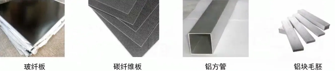
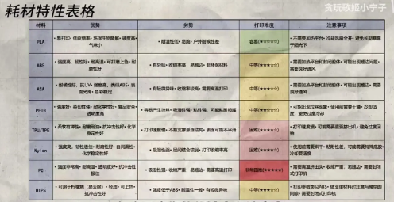
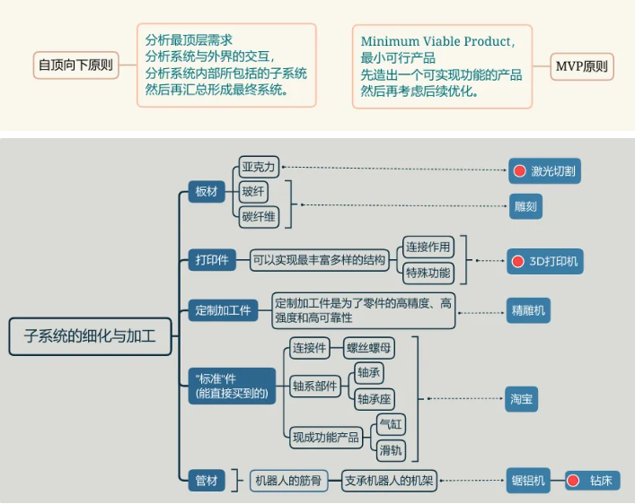

方法论：画图之前选择材料，根据要实现的功能确定机构(基本框架)

资源：标准件库，RM 开源，机械狗社区

知识储备：零件基础常见零件，常见机构，受力分析，运动分析，SW 使用

1. 看看培训内容
2. 学习 SW 使用
3. 积累零件和机构知识，受力分析

薪火培训，标准件，制造工艺

## 零碎笔记

零件分类：板件、机加件、打印件

尺寸约束的添加顺序，配合约束的添加顺序

装配中修改零件要先进入编辑零件的状态，否则绘制的草图或添加的特征属于装配体

修改草图或装配报错要查设计树

机械设计的知识，常用机构等

一般不会删除在位配合，这回导致几何关系丢失

在装配体中设计零件，想保存为独立零件怎么办？

## Q & A 完整记录

1.我感觉我是不是去看一看薪火培训或者别的战队的机械组培训会比较好，我希望了解从画图开始到发加工组装出一个实体机构这中间的知识，但是不清楚培训中讲的内容在更大的层面上属于哪一个知识框架的，能不能满足我的需求 2.如果要在画图的时候就考虑材料，应该根据构件的哪些方面去选呢，我能想到的就是材料的强度；以及我感觉实际设计的时候是不是凭生活经验在几种常用材料中选，还是有些时候确实需要一些相关的理论计算？就 DIY 的范围或者 RM 比赛的范围，常见的材料有哪些呢(我知道的就亚克力、碳板、玻纤、钣金、铝方) 3.标准件和非标准件是在画图时候的概念，还是在发加工选零件时候要考虑的哦？不太明白标准件和非标准件的概念 4.像螺栓螺母，还有很多我可能叫不出名字的零件，这个在画图的时候是不是属于那种可以封装成类似库一样的东西，需要的时候改改尺寸直接调用；以及在画图和发加工的时候怎么确定具体的型号呢，比如都是螺栓我怎么确定要用哪种型号呢？ 5.根据你上面说的，画之前应该是先根据功能确定机构(就是你上面说的基本框架)，以及这个环节看看常见的实现这种功能的机构然后模仿着画上手会快一点，那如果从长远考虑，比如像你们这样需要较长期做机械设计或者作为一种长期技术学习的考虑，是不是还是会在实践中总结记住一些个常用的机构组成比较好？ 6.完成了基本框架(机构)的设计和各个零件选择，再熟悉 SW 软件操作的基础上，应该就可以画出完整的图纸了对吗，这中间我有漏掉什么环节嘛？ 7.图纸画完了在发加工之前还有什么步骤嘛？经常听你们说会检查孔位，检查干涉这样的，这个是在画的时候容易忽略掉，所以全部画完了再检查一遍是嘛？以及平时说的审图是在审什么哦？ 8.发加工具体就是指的直接淘宝找对应材料的加工商，然后图纸发给他，零件找对应型号直接买，对吗？这中间是不是又有好多注意事项(我感觉不是一两句话能讲清楚的，但还是想问一句)

---

1.不是很有必要去看薪火培训，那个是最基础的，主要是教如何绘制零件，但是可以去另外找 B 站视频学零件的绘制和装配体，零件绘制主要是对特征的应用，装配体就是把零件组装到一起。刚开始的话建议去抄画一定数量的零件，我觉得 RM 的东西是比较好的，因为这个是确定能造出实物的图，至少不会出现很离谱的情况。 2.材料是要在绘制零件前确定的，比如是碳板还是亚克力，这个会直接影响到零件的用料多少，重量，强度等。对于材料强度的确定是 ¹ 上手接触过(比如碳板的强度你应该大致清楚，能在我们车上进行高强度的使用)² 对于零件绘制中不清楚自己画的图是否满足强度需求和有一定的安全系数时，有必要使用 simulation(至少会使用静应力分析)去分析这个零件在该材料和这么设计的情况下会不会损坏。simulation 单独找个视频看看就行，基本的分析很简单。 3.标准件就是有国际标准并且能在淘宝上直接买到的，比如螺栓(有大小，长度还有螺栓强度等级)轴承(深沟球，推力球，圆锥混子，圆柱等，以及他们对应的大小和厚度)。这些都是不能自己更改和设计的，因为你没法自己去造这些东西。 非标准件就是不能在淘宝上直接买到的东西，比如我们自己发的机加件，还有要自己切割的板材。最核心的就是 DIY(需要自己设计) 这个是在画图时就要考虑的事情，因为你肯定会用到这些东西。 4.队里有一些简单零件的库(我直接发给你)，型号的确定是根据需求来的，比如螺栓的大小(在强度需要较高的情况下就会用 M4 及以上的，就肯定不会用 M2 的，差不多是这个道理) 5.做机械肯定是要有经验积累，除了常见的机构种类，还要记一些零件的使用场景，比如滑块滑轨等 6.差不多可以。 7.检查是肯定必要的，大家一起审图是考虑到自己看自己的图很可能看不出问题，有没有设计上的错误。发加工的话其实是注意不要发错，这个自己注意点就没什么问题。干涉也一样，主要是自己根本注意不到哪有问题，需要别人看看。 8.感觉你差不多知道，就是淘宝商家要什么格式的文件，你发给他就可以了。

零件：电机及编码器，舵机，树莓派，树莓派电池，电池，相机和线

转向驱动，轮胎

图采车：查清楚电机为什么不动：这次是端子接触不良，上次是线断了

---

齿轮：

模数、压力角、齿高、齿厚、分度圆直径、中心距、齿隙

模数 m：公制的标准，齿轮模数不同是不能啮合的(通俗理解为齿的大小)，相同齿数，模数越大，齿轮就越大，抗弯曲性能越强，可用于动力更强劲的电机齿。

P 数：英制的标准，p = $\pi\times m$，模数和 P 数可以换算但是不能通用，例如 48P 表示分度圆一英寸上有 48 个齿。

T 数：齿数

孔径：内径

齿间隙：设计预留出来存储润滑油的，补偿齿轮受力后的弹性变形、热膨胀、制造公差、装配误差等。合理的齿间隙是：大齿不动时，小齿能够微微转动。

齿轮啮合时，受力处在齿面中部的位置

公制和英制是两种不同的计量系统，公制也称米制，十进制，以米、千克等作为计量单位，是国际单位制 SI 的一部分；英制则是以英寸英尺作为计量单位，非十进制

搜集买东西的高质量网站

304 不锈钢，六角结合器，波箱，润滑油，螺丝胶，行星减速器，谐波减速器，链条，曲柄，凸轮，曲柄连杆，花键，棘轮，铰链，蜗轮蜗杆，丝杆丝杠，滑轨滑块，销，顶丝，万向节，差速器，伞形齿轮，锥形齿轮，星形齿轮，齿轮，冲压，浇筑，C 座，转向杯

用短身舵机？用沉头孔

零件分为固定件(材料、连接件)、运动件(轴承、弹簧、传动)、驱动件(气动液动、电动)

材料：管材、板材、机加件

连接件：螺栓螺母、角码、法兰、联轴器、铰链、销连接、键连接、铆接

轴承：深沟球轴承、法兰轴承、推力球轴承、直线轴承、交叉滚子轴承、关节轴承

弹性材料：压缩弹簧、拉伸弹簧、扭力弹簧、片弹簧、发条弹簧、皮筋、缓冲材料

传动：同步带、链轮链条、滚珠丝杠、齿轮传动

驱动：气动、电机、舵机

运动学理论基础：机构由构建(连杆)和运动副(关节)组成，自由度是指一个机构要具有确定的位置或状态所必须给出的独立运动参数的数目，在机械设计中指的是机构应当具有的原动件的数目。自由空间中的孤立刚体具有六个自由度，在笛卡尔坐标系中表现为沿三个轴的平移和旋转，最常见的两种运动副就是平移副和旋转副(还有螺旋副和球面副)，面面接触为低副，点或线接触的为高副。

分析运动机构的方法：拆解为旋转或平移构成的刚体，明确每个构建的驱动方式，最后用构建的具体形式来理解约束规律。设计运动机构的方法：从抽象的几何元素出发，用运动副的方式相互联系，根据需要的运动规律设计参数，最后选择驱动器件

常用机构：轴系设计、四连杆机构、传动

轴系固定方式：过盈配合(合理的干涉挤压产生摩擦力)、螺丝配合板材或平垫夹紧、插销或花键等常用于标准化轴承座中

不考虑摩擦力的影响，从动件所受力的方向和速度方向所夹得锐角称为压力角，是衡量传动性能的一个重要指标，压力角的余角就是传动角；传动角为零时，驱动力对从动件的有效回转力矩为零，此时机构处于死点位置

电机安装需要考虑：定位孔(保证同轴度，电机安装面上一般会有圆形凸台结构，定位尺寸与凸台一致)、安装孔、指示灯开关走线等避免干涉

滑块滑轨

法兰是轴与平面或轴与轴之间相互连接的零件，联轴器是连接两轴或轴与回转件的零件，两者功能类似；法兰连接的另一个物体一般是自由的，起约束该物件并传导动力的作用；联轴器连接的另一个物体一般已经受到约束只能作定轴转动，作用在于承受两个转动轴连接误差带来的应力

键连接是通过键实现轴和轴上零件的轴向固定以传递运动和转矩的连接方式。选择键连接类型主要考虑传递转矩大小、轴上零件沿轴向是否有移动及移动距离大小、键在轴上的位置等因素。大部分情况下轴类零件传递扭矩是通过各种键实现，由此可保证同轴度并消除间隙；D 型轴的同轴性和精度均法务保证

销可作为定位零件，用以确定零件间的相互位置，也可起连接作用，传递横向力或转矩，或作为安全装置中的过载切断零件

### 零件基础

零件种类 电气件 定制件 标准件 非标件/商品件

标准件，分为紧固件和轴系标准件 紧固件包括螺栓，螺母，铆钉，垂直连接件，铜柱，垫片，铜嵌件，销

螺栓，螺纹连接常见的有螺栓连接，双头螺柱连接，螺钉连接，紧定螺钉连接等 螺栓分杯头(不易滑丝)，薄头，平头，倒边平头，盘头/圆头，沉头(需额外打沉头孔)，手拧螺丝 螺栓的参数有长度，直径，性能等级 螺丝连接方式有二，螺栓加防松螺母，螺栓加弹簧垫圈加螺纹孔

螺丝：

螺丝名字中包含螺帽样式，螺杆直径、螺纹样式、总长、尾部特点或材质。

螺帽分十字 PH、米字 PZ、内六角、梅花、外六角、盘头、羊角/牛角。十字 PH 高扭矩下容易产生弹射力产生滑牙现象，因此螺杆一般很短；批头尖端为锥形。十字带小槽的是米子，接触点更多更不容易打滑，可用于大号螺丝；批头尖端为平行；PZ 是内六角的升级版。内六角近似于圆形，深度够深，批头尖端等长；但遇到较软的不锈钢材质时，在触点位置容易拧成豁口。更优解是梅花槽，近似梅花的齿轮形状，啮合的深度和面积更大，能最大程度减少滑移；批头尖端等长大扭矩下不会产生弹射力，相对较贵。中大型紧固件一般用外六角，用套筒拧入，接触面积达不易滑脱，多用于长螺杆。盘头因为螺帽形似倒过来的盘子而得名，也叫扁头/蘑菇头，螺帽下部完全水平(自攻螺丝多为沉头)，接触面积较大，不易拧穿且可以产生更大的压合力，常见于板材间连接时的斜孔螺丝。羊角/牛角螺丝通常只用于板间固定且隐藏螺丝的场景。其它的异形螺帽常见于插座等电气中，设计初衷是防止私自拆开，需要专用的批头拧入。杯头沉头盘头/圆头

按牙型和尾部部特点分机牙螺丝和自攻螺丝，机牙螺丝尾部多为平面，需要搭配螺母垫片预埋件使用，体积大些就叫螺栓/紧固件，拧入的地方需要有螺纹，螺纹又叫丝。自攻螺丝尾部多为尖头，可以自己攻丝。尖部有螺旋的(自攻螺丝)、带槽的(也叫割尾，减少对材料的破坏程度)、带钻头的(又叫自攻钉、燕尾钉、燕尾丝，常用于金属间的密合，常自带垫圈以更好贴合光滑的金属表面)

材质上大致分为能磁吸的碳钢和不能磁吸的不锈钢。黑的又叫黑鳞，在发黑的氧化液中形成，可作防锈漆。淡蓝色和彩色的是镀锌，抗锈能力比黑鳞略好。深蓝色的淬火过，硬度更高。不锈钢螺丝用于高湿度环境，颜色有明显特征，个别才能很硬大部分偏软，拧入扭矩不能过大。

螺丝刀电动的通过挡位调节扭矩，手动的杆越长对应扭矩越大。标准的螺丝刀和批头上会标注型号，批头和螺丝型号匹配才能最大程度避免滑牙。螺丝软和刀头软也会导致滑牙，建议使用 S 合金钢的螺丝刀和批头。在木材上拧螺丝前先用细批头预钻孔定位，一是可以减少开裂，二是由于螺纹能更快作用使螺丝旋入而不是靠尖部顶入，所以密合程度更好。中心冲就是专用于冲击坑起定位作用的。另外，可以用记号笔在拧完的螺丝上画线，检查时看哪个线没对齐就是松了。

---

标准件可分为紧固件和轴系标准件

紧固件：螺栓、螺母、铆钉、垂直连接件、铜柱、垫片、铜嵌件、销

常见的垂直连接件包括六面螺母、合页/铰链、角码等

销的常见种类有圆柱销、螺纹销、开口销、销轴、弹簧销等；圆柱销常用于定位，弹簧销本身刚度大，可用作不拆除定位件

挡圈又名卡簧，分为轴用挡圈和孔用挡圈，轴用挡圈又分 C 型和 E 型，挡圈在轴向上有一定限位作用(注意不是定位)

塞达螺栓可作为轴系结构使用，光杆部分可与轴承配合，注意光杆长度不得超过两个被连接表面的距离，否则螺母无法锁紧

联轴器用于连接电机与传动机构，并可分担部分电机所承受的负载和冲击，常用的有涨紧联轴器和夹紧联轴器两种

轴套经常与深沟球轴承共同使用，起到轴向定位的作用并可减轻轴的磨损，自身在一定程度上也可作为滑动轴承使用

六角扳手用于拧内六角螺栓，呈 L 型，球头端不能加大力否则容易滑丝；套筒扳手用于拧外六角螺栓；棘轮扳手利用棘轮只能单向旋转的特性，用于空间狭小处的外六角螺栓；生活中常说的扳手是开口扳手。

斜口钳类似于老虎钳，但有刃口可用于剪切；尖嘴钳和针口钳；水口钳；卡簧钳；

拉马用于拆卸固定较紧的轴承与轴承座，利用螺纹压力大的特点可以施加较大力。

拉铆枪专门用于安装拉铆螺母

台虎钳用于夹紧工件

中心冲用于打预定位孔

### 零件基础

标准件：结构、尺寸、画法、标记等各个方面已经完全标准化，并由专业厂生产的常用的零(部)件，包括标准化的紧固件、连结件、传动件、密封件、液压元件、气动元件等机械零件，常用标准有 GB 和 ISO 等。常见的有螺丝螺母、垫片垫柱、齿轮齿条、链轮链条、带轮和带、轴承、铰链、弹簧。

螺丝螺母：

- 经典的杯头内六角螺栓，如 M3\*8 表示米制单位公称直径 3mm，去帽后的纯螺杆长度 8mm，旋向为顺进逆出。性能等级在螺帽上会有标注，从 3.6 到 12.9 有八个，数字越大越好。
- 螺纹分全螺纹和半螺纹两种，全螺纹圈数多间距密，作用圈数多，拧入速度慢用时久，阻力大扭矩大更牢固，对材料的剪切力和正前方的推力更大。半螺纹圈数少也叫快丝，特点相反。部分螺杆无螺纹的叫半牙(相对应的叫全牙)，以减少对上层材料的破坏，常对应上层材料的厚度。塞打螺栓和半牙螺栓类似也有光轴和螺杆部分，但受力方式不同，可用于运动部分的连接如轴承垫片等，前面的螺栓部分刚好够防松螺母作用。
- 螺母分普通螺母和防松螺母，防松螺母中带有尼龙(一种工程塑料)或金属的摩擦环，一定程度上可以抗振动带来的松动。
- 螺栓固定两种常用方式：螺栓+防松螺母，螺栓长度必须略超出螺母以保证放松效果；螺栓+弹簧垫圈+普通螺纹，效果略差于前一种方式。盲孔连接需在图纸中确认螺纹孔的深度，贯穿孔在不与其它结构干涉时，螺栓可适当超过螺母。

垫片垫柱：

- 垫片有弹簧垫和平垫之分，螺母之上依次放弹簧垫和平垫，平垫增大受力面积，弹簧垫用于防松加大预紧力，命名规则为内径*外径*厚度，用于垫高高度，增大受力面积，一定程度上可以起到轴承的作用
- 垫柱常用的包括铜柱、铝柱、尼龙柱、ABS 隔离柱；铜柱有单通和双通，长度指不包含螺纹的部分，为六边形；铝柱多为圆柱形；尼龙柱不导电；ABS 隔离柱也不导电但内部无螺纹。

齿轮齿条：

- 优点是传递动力大速度快功率高，传动比大传动位置精确；缺点是安装精度要求较高且金属齿轮质量大
- 常见的齿轮传动有齿轮-齿轮、齿轮-齿条、蜗轮-蜗杆等，齿轮传动系统的设计是一门学问，有必要建议去看专业的资料，此处只作零件层面的基本扫盲
- 最常用的参数是模数和齿数，模数代表齿轮大小，也是确保不同齿轮间能够啮合的标准，齿数代表其传递运动和动力的比例，由模数和齿数便可以确定齿轮的分度圆，从而确定齿轮的大小。常见的齿轮都是渐开线齿轮，其具有诸多制造加工和成本上的优点而得到广泛应用，渐开线是指齿轮齿形中齿廓的部分

链轮链条：

- 特点是制造和安装精度要求低，径向力小，有一定减震和缓冲能力，多齿同时啮合承载能力强
- 链传动减震和缓冲能力来自于链的挠性单元，但同时也导致瞬时传动比不恒定且磨损严重，不适于高速变载荷的场景

带轮和带：

- 带传动靠带轮上的柔性张紧带进行运动和动力的传递，分为靠摩擦力的摩擦型带传动(包括平带传动、V 带传动、多楔带传动)和靠带轮上的齿相互啮合的同步带传动。
- 同步带传动中，带和带轮的接触面做成相匹配的齿形，具有传动比精确传动平稳(相对于链轮)，效率高噪音低，可用于高速传动；中心距允许范围大，可用于长距离传动；相对于摩擦型带传动，啮合型带传动径向压力较小；具有弹性和挠性，可承受一定冲击，且不需润滑等优点
- 同步带的带齿材料分为聚氨酯(PU)和氯丁橡胶两大类。PU 带耐磨性好，耐水性和高低温性能差，用于常温情况；橡胶带挠性和耐水性好。
- 同步带的参数是齿距、宽度和长度。常见的标准有 HTD、GT 等，以 HTD-8M 为例，表示齿距为 8mm；其它的标准或型号还有 MXL、XL、L、XH、H 等；可以根据工况的转速和额定功率选择同步带轮的齿距。
- 同步带变形严重会导致啮合失效，需要换掉整条同步带

轴承：

- 轴承用于转动副，可减轻摩擦使旋转更顺畅，且对旋转轴有支持作用保证其在正确位置。轴承由内圈外圈滚动体保持架组成。轴承分金属密封型、橡胶密封性和开放型。
- 深沟球轴承是最具代表性的滚动轴承，主要承受径向载荷并可承受少量轴向载荷；与同尺寸其它类型的轴承相比，摩擦系数小、极限转速高、结构简单、制造和维护成本低精度高、尺寸范围大形式多。法兰轴承也是深沟球轴承，自带的法兰具有轴向定位功能，可以简化机体结构
- 推力球轴承只能承受轴向力，由座圈、轴圈和钢球保持架构成，两圈内径不同，内径大的松圈与轴承座(固定部分)配合，内径小的紧圈与轴(转动部分)配合；一般用单向推力球轴承。装配前需要为滚动体部分上油。
- 角接触球轴承可同时受径向力和双面的轴向力，外形与深沟球轴承类似但轴向两端略大
- 鱼眼轴承又叫杆端关节轴承，有内螺纹和外螺纹两种；鱼眼轴承工作中可产生自润滑，用于速度较低的摆动运动和低速旋转并可在一定角度范围内作倾斜运动，在支撑轴与轴壳孔不同心度较大时仍能正常工作。
- 滚子轴承是一种圆柱形滚动体轴承，可以保持每个部分的精准定位，滚子与环面之间形成线性接触，相较于点接触的滚珠轴承，载荷能力更强。

铰链：

- 又称合页，用于连接相对转动的两个固体，按材质有不锈钢铰链和铁铰链，起到阻尼缓冲的作用

拉簧：

- 与常见弹簧的作用力方向相反，主要参数是线径、外径和长度(内径=外径-2\*线径)，线径越大长度越大外径越小时拉簧的劲度系数越高。

整个机械设计在任务上大致可分为机架设计、动力输出设计(动力元件、轴系设计、专用零件设计)、传动机构设计三个部分

### 传动方式

直接传动方式主要有齿轮传动，链传动，带传动，滑动丝杠传动、滚珠丝杠传动，摩擦传动，连杆传动

cnc 雕刻机，雕铣

低副有一个自由度，有两种传动形式，移动副和转动副，高副有两个自由度

四种基本加工方式——车削加工、铣削加工、刨削加工、磨削加工

车削加工：工件旋转刀具固定，用于加工回转表面，刀具为车刀

铣削加工：毛坯固定，高速旋转的刀具在毛坯上走刀，切出需要的形状和特征；常用耗材有玻纤板、铝板、碳纤维板、铝方管、铝毛坯

玻纤板：强度略低于碳板、绝缘。玻纤板适合的工况有：抗弯、抗冲击、沿板方向的拉伸和压缩、挠性零件等

碳板：强度高、质量为钢的五分之一、抗拉强度为普通钢材的数倍以上，弹性模量优于钢材，拥有优异的抗震性。碳板适合的力学工况同玻纤板，但导电且会燃烧

铝方管，有不错的力学性能，可用于机体框架，壁厚较薄，容易被螺栓压溃或受力撕裂(可塞入打印件或垫板件)。常用的连接方式有打孔+螺栓、焊接(受热变形容易产生误差)、拉铆螺母(无需穿过整个 铝管)

铝型材：通过挤压加工而成，配合 T 型(船型螺母)使用，常作为场地模型支架，移动机器人上不常用，特点是便宜结实重。

碳管作为铝管的代替品，重量极轻，强度高，较贵，不建议打孔，一般用夹紧的方式来连接。

板材设计：

板材通常可作为结构件、连接件、保护壳等结构

一、设计前需要明确板件的作用、要连接的部件、受力位置及受力大小，是否有对强度和刚度的需求(强度是材料在被破坏前所能承受的最大应力，表征材料抵抗外力破坏的能力，常见指标包括抗拉强度、抗压强度、屈服强度和剪切强度等；刚度是材料在受力时抵抗变形的能力，表征材料发生弹性形变的难易程度，由材料的弹性模量，如弹性模量、杨氏模量等衡量)

二、根据受力情况确定板材厚度

三、确定连接方式，板材一般不加工立体特征，不在同一平面的板材需设计连接方式

四、根据现实工艺条件进行工艺设计上的调整

五、进行必要的镂空设计，目的包括但不限于：避免干涉或装配考虑，减重，方便走线等

选择传动方式考虑的因素：空间布置、减速比需求、传动间距、载荷、重量、成本、自锁与保护等其它特殊要求

3D 打印

PLA(聚乳酸)是最常见的 3D 打印材料，但耐温性和强度较低；特点是综合力学性能中规中矩，承压能力强，抗拉和抗剪切力较弱，冲击强度较高，受热易融化可嵌入铜螺母。(打印件不可打印螺纹)

PET 的力学性能号，一定程度上可作受力零件，表面较粗糙

TPU 为柔性材料，可制作可变形的零件

光固化树脂通过光固化成型，精度相对较高，表面光滑；综合力学性能较 PLA 弱且软，长时间日光照射会软化变形

打印件壁厚不要太薄，且不要设计小于 2mm 的特征；另外由于热胀冷缩，孔位需要留有余量

机加件是通过车铣刨摩等机床加工，通过去除材料的方式得到的工件；考虑到重量，材料一般选 6061 铝合金。机加工的精度高表面质量好，力学性能也好，可加工螺纹孔；另外，外发机加件时一定要表明公差！

设计方法论：

自顶向下设计：拆解为子目标、确定各个子系统，依据子目标设计子系统(选取动力源、传动机构、控制系统、执行机构)，细化子系统各机构(绘制、加工、装配)

机加工有精度和公差的概念，公差有尺寸公差、形状公差和位置公差等，都是用于描述由于设备精度等客观因素造成的实际零件与理论图纸的差距的指标。三种配合为间隙配合、过盈配合和过渡配合，过盈配合往往利用热胀冷缩的原理完成装配。一般以标准件为基准进行设计，避免对标准件进行二次加工，保证零件的互换性和标准化

FDM 方式 3D 打印最关键的三个参数是填充、支撑和墙层数，树状支撑更适合犄角旮旯，传统支撑更适合整块平坦的大面积表面

SW 设计思路：草图必须完全定义，尺寸添加的方法要遵循设计意图，从尺寸中体现设计思路。面向实物的设计(基于加工方式和零件采购的制图)，性能优化(圆角倒角防止应力集中，合理镂空，进行静力学和动力学仿真)

拉铆螺母

[螺丝](https://zhuanlan.zhihu.com/p/85936375)

[齿轮](https://zhuanlan.zhihu.com/p/112458997)

## 理论力学

### 基本概念

刚体：运动和受力过程中，形状和大小不变，且内部各点的相对位置不变

力系：作用于物体上的一群里称为力系，按作用形式分为集中力和分布力，沿线分布的称线分布力，重力是体分布力；使物体处于平衡状态的力系称为平衡力系

力矩：力作用于物体时产生的转动效应的物理量，大小为力的大小乘以力臂长度，方向由右手螺旋法则确定

力偶：作用于统一刚体的一对大小相等，方向相反，不共线的一对平行力，是一种特殊的力系；合力为零，对物体产生转动效应，力偶对空间中任意点的矩之和为常矢量，称为力偶矩；力偶矩相等且在同一平面内的力偶的作用效果相同，可以等效替换

### 静力学公理

平行四边形法则

加减平衡力系不改变原力系对刚体的作用效果；作用于刚体上的力可以沿其作用线移至刚体内任意点而作用效果不变；刚体受同一平面内互不平行的三力作用而平衡时，三力作用线必交于一点。

刚化公理：变形体在已知力系作用下平衡时，若将其视为刚体，则其平衡状态不变

### 约束和约束力

外界系统作用于系统的使之产生运动或运动趋势的力称为主动力，约束力是一种被动力，大小和方向随主动力变化而变化。

常见约束：

柔索约束：(柔绳、胶带、链条)

光滑面约束：(面面接触、面线接触、面点接触、线线接触、线点接触)约束力的作用线沿两物体接触点公法线指向被约束物体

铰链约束：由构件和销钉构成，不能传递力矩或力偶，约束力是销钉对各构构件的作用力，方向随主动力变化

插入端约束：构件不能移动或转动，约束的总效果一般是对构件提供一个约束力和一个约束力偶

### 平面力系等效和分析

力和力矩都是矢量，都可以进行合成和分解

分析三个点地受力，可以试试三力汇交原理

平衡条件是，任意简化中心的主矢、主矩同时为零

## 材料力学

### 基本概念

强度是指构件在一定外力作用下，抵抗塑性形变的能力

刚度是指构件在一定外力作用下，抵抗塑性形变的能力

稳定性是指构建在一定外力作用下，保持原有平衡的能力

外力是指作用于构件上的力，分为体积力和面积力

内力是指在外力作用下构件各质点间相互作用力的改变量，连续分布于物体内部，随外力增加而增加，达到某一限度时引起构件的破坏

应力是指截面某一点单位面积上的内力，是类似于压强的概念。构件的变形与破坏，取决于内力的大小和分布；与截面垂直的称为正应力或法向应力$\sigma$，与截面平行的称为剪应力或切应力$\tau$。尺寸变化越急剧，角越尖，孔越小，应力集中的程度越严重。

弹性模量，又叫杨氏模量，是指单相应力作用下应力除以该方向上的应变，规律同弹簧

泊松比，又叫横向变形系数，是材料在单相受拉或受拉时，横向正应变与轴向正应变的比值

三个材料特性参数：比例极限、屈服极限、强度极限

实际应用中，塑性材料以屈服极限为基准，除以一定的安全系数后规定为许用应力；脆性材料以强度极限为基准，除以一定的安全系数后规定为许用应力

构件的四种基本变形

拉伸或压缩变形：作用在杆件上的外力合力的作用线与杆件沿轴线重合，使得杆件沿轴线方向伸长或缩短

剪切变形和挤压：相距很近方向相反大小相等且垂直于轴线的一对外力，使得杆件位于两力之间的截面发生相对错动，常见于铆钉、螺栓引起的变形

扭转变形：一对转向相反、方向沿轴线，作用平面垂直于杆件轴线作用的力偶，使得杆件横截面绕轴线产生相对转动

弯曲变形：杆件受到一对方向相反，作用于杆的纵向平面内的力偶，使得杆件轴线从直线变为曲线

材料力学解决的问题：强度校核、截面设计、求解最大载荷

增加构件强度的方法：合理设计截面、合理分布支座位置、调整载荷位置

https://www.bilibili.com/video/BV1Fs4y1X787/?vd_source=1d0891b41fe4e23dbf197eaf61dfa468
