> 本文针对硬件开发涉及的基础知识和技能作集中性的梳理，内容包括**电路原理**、模拟电子技术、电力电子技术、数字电子技术、元器件基础、常见封装、常用 IC 和驱动、数据手册解读、PCB 基础、规则设置与工艺参数、布局布线、层叠设计、软件操作与规范、下单说明、焊接技巧、调试思路、仪器使用等，涵盖原理、器件采购、PCB 设计、打样焊接调试等，从零基础到拿到一块能用的电路板的全流程并建立一定的知识储备。 笔者本科在读，已经学习过电路原理、数模电及电力电子的基础，对这部分的介绍将省略细节推导，如有需要可根据关键词检索，以实用为主要目的；另外，硬件开发是个比较吃经验的工作，笔者尚且缺乏实践经历，文章信息来源以课内所学和网络调研为主，多有不周之处，欢迎各路高手和前辈们批评指正。 最后，本文仅供学习交流使用，未经允许不得转载商用。

# 一、电路原理

## 1. 基本概念

- 峰值/振幅/幅值：一个周期内瞬时最大绝对值
- 峰峰值：一个周期内瞬时最大值和最小值间的绝对差值
- 平均值：算数平均值$f_{ave} = \frac{1}{T}\int_t^{t+T}f(t)\text{d}t$，衡量直流量用平均值
- 有效值：均方根值$f_{rms} = \sqrt{\frac{1}{T}\int_t^{t+T}f^2(t)\text{d}t}$，衡量交流量用有效值

---

- 直流：电流方向不变

  纹波：在直流电信号中，叠加在直流稳定量上的交流分量

  纹波系数$r$

  $$ \begin{aligned} 有效值定义：r &= \frac{U*{交流分量有效值}}{U*{直流平均值}} = \frac{U*{rr}}{U*{ave}}\\ 峰值定义：r &= \frac{U*{交流分量峰值}}{U*{直流平均值}} = \frac{U*{max} - U*{min}}{2U\_{ave}} \end{aligned} $$

- 正弦波$u(t) = U_p\sin\omega t$

  $$ \begin{aligned}\text{平均值} \quad U*{\text{ave}} &= \int_0^{2\pi} U_P \sin \omega t dt = 0\\ \text{有效值} \quad U*{\text{rms}} &= \sqrt{\frac{1}{T} \int_t^{t+T} \left( U_P \sin \omega t \right)^2 dt} = \frac{\sqrt{2}}{2} U_P\end{aligned} $$

- 矩形波$\begin{aligned} u(t) &= \begin{cases} U_P & t_1 \leq t < t_2 \\ 0   & t_2 \leq t < t_3 \end{cases} \end{aligned}$

  $$ \begin{aligned}\text{平均值} \quad U*{\text{ave}} &= \frac{1}{T} \int_0^{t_p} U_P dt = \frac{t_p}{T} U_P\\ \text{有效值} \quad U*{\text{rms}} &= \sqrt{\frac{1}{T} \int_0^{t_p} U_P^2 dt} = U_P \sqrt{\frac{t_p}{T}}\end{aligned} $$

- 三角波

$$ \begin{aligned}\text{平均值} \quad U*{\text{ave}} &= \frac{1}{T} \int_0^T \frac{U_P}{T} t dt = \frac{1}{2} U_P\\ \text{有效值} \quad U*{\text{rms}} &= \sqrt{\frac{1}{T} \int_0^T \left( \frac{U_P}{T} t \right)^2 dt} = \frac{U_P}{\sqrt{3}}\end{aligned} $$

- 谐波

$$ \begin{aligned} f(t) &= A*0 + \sum*{n=1}^{\infty} \left( a*n \cos n\omega t + b_n \sin n\omega t \right) \\ &= A_0 + \sum*{n=1}^{\infty} A_n \sin(n\omega t + \varphi_n) \\ a_n &= \frac{1}{\pi} \int_0^{2\pi} f(\omega t) \cos(n\omega t) d(\omega t) \\ b_n &= \frac{1}{\pi} \int_0^{2\pi} f(\omega t) \sin(n\omega t) d(\omega t) \\ \varphi_n &= \arctan\frac{a_n}{b_n}\\ A_0 &= \frac{1}{2\pi} \int_0^{2\pi} f(\omega t) d(\omega t) \\ A_n &= \sqrt{a_n^2 + b_n^2} \end{aligned} $$

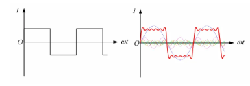

将谐波的有效值与基波的有效值之比定义为非正弦波的总畸变率 THD，谐波是针对次数而言的，如要求三次谐波的 THD 不超过多少等等。

$$ THD = \sqrt{\sum\_{n=2}^{\infty} \frac{A_n^2}{A_1^2}} \times 100\% $$

---

- 相量：相量包含了信号的幅度和相位，是用来描述振幅和相位周期性变化的量，本质上是一个复数，可用于描述电流和电压。相量运算遵循复数运算法则，在复平面上也具有向量一样的方向性，故亦可以采用相量图解，用类似矢量运算的方式处理相量运算。“相”指的是波的特定状态或阶段，相位描述了波在周期内的位置，通常以角度(如弧度或度数)来表示。

## 2. 分析工具

### 2.1 欧姆定律

电路欧姆定律如下

$$ I = \frac{U}{R} $$

根据电阻的计算式，还可得出欧姆定律的微分形式

$$ \mathbf{J} = \sigma \mathbf{E} $$

电阻的计算式如下，其中$\rho$为电阻率，$\sigma$为电导率，$G$为电导

$$ R = \rho \frac{l}{S} = \frac{l}{\sigma S} = \frac{1}{G} $$

### 2.2 基尔霍夫定律

KCL(基尔霍夫电流定律)：对电路任意节点，电流流入等于流出，本质是电荷守恒

$$ \sum*{k=1}^n \dot{I*{km}} = 0 \\ $$

KVL(基尔霍夫电压定律)：对任意比和回路，所有元件的总压降为零，本质是能量守恒

$$

\sum_{k=1}^n \dot{U_{km}} = 0 \\ \sum E_m = \sum U_m
$$

### 2.3 网孔电流/节点电压

用于求解特定电路拓扑中的参数，有以下三种情况，第一种情况比较简单不再举例，另两种情况分别举例说明。

- 边界支路有独立源：直接得出一个待求量
- 公共支路有独立源：设$u_0/i_0$
- 有受控源：当作独立源，补一个主控量的方程

网孔电流法可概括为

$$ 自电阻\times 自网孔电流 - \sum 互电阻\times 公共电流 = 电压升 $$

$e.g.1$

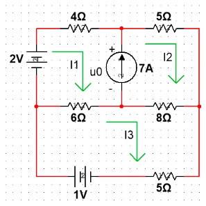

设独立源两端电压为$u_0$，网孔电流方程为

$$ \begin{align*} \begin{cases} (6+4)I_1 - 6I_3 &= -u_0 + 2\\ (5+8)I_2 - 8I_3 &= u_0\\ (6+8+5)I_3 - 6I_1-8I_2 &= 1\\ I_2 - I_1 &= 7 \end{cases} \end{align*} $$

$e.g.2$

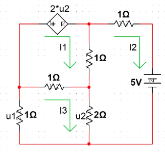

网孔电流方程为

$$ \begin{align*} \begin{cases} (1+1)I_1 - I_2 - I_3 &= -2u_2\\ (1+1+2)I_2 - I_1 - 2I_3 &= -5\\ (1+1+2)I_3 - I_1 - 2I_2 &= 0\\ u_2 &= 2(I_3 - I_2) \end{cases} \end{align*} $$

节点电压法可概括为(注意需要选择参考点)

$$ 直连电导\times 节点电压 - \sum 连接电导\times 另端电压 = 电流入 $$

$e.g.1$

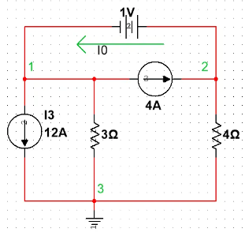

以节点 3 为参考点，节点电压方程为

$$ \begin{align*} \begin{cases} \frac{1}{3}U_1 &= -4 -12 -I_0\\ \frac{1}{4}U_2 &= 4 - I_0\\ U_2 - U_1 &= 1 \end{cases} \end{align*} $$

$e.g.2$

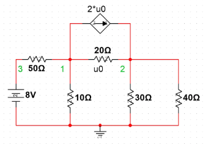

节点电压方程为

$$ \begin{align*} \begin{cases} \left( \frac{1}{50} + \frac{1}{10} + \frac{1}{20} \right)U_1 - \frac{1}{20}U_2 - \frac{1}{50}U_3 &= -2u_0 \\ -\frac{1}{20}U_1 + \left( \frac{1}{20} + \frac{1}{30} + \frac{1}{40} \right)U_2 &= 2u_0\\ u_0 &= U_1 - U_2 \end{cases} \end{align*} $$

### 2.4 叠加定理

叠加定理基于线性电路，核心就是总作用等于单个独立源叠加作用，不予考虑的独立电压源等效为短路，不予考虑的独立电流源等效为开路。

叠加定理适用于电压和电流两个物理量的求取，而对于功率，若电源频率不同，由于交叉项为零，该定理从结果上来说仍然正确；若电源频率相同，则不适用。

### 2.5 等效变换

此处的等效都是对外部特性而言的，是数值计算上的等效，不是物理机理上的等效，端口内的信息会被压缩掉。

- 端口等效：对于复杂的网络，可在恰当的位置切分电路，分别求两个网络的伏安关系，联立得出端口处的电流电压，后用独立源等效一侧的网络求另一侧中的状态量
- 电源变换：独立电压源串联电阻 <=> 独立电流源并联电阻；电阻大小不变、电源方向极性对应、大小对应乘或除以电阻阻值
- 纯电阻网络化简，冗余独立源合并，含受控源的写网络函数(即响应于激励之比)
- 戴维南/诺顿定理：线性单口网络就端口来看可以等效为一个开路电压串连等效电阻，或一个短路电流并联等效电阻，其中开路电压或短路电流就是网络端口的电压或电流，等效电阻一是可用开路电压除以短路电流得到，二是可将网络中的独立源置零，由纯电阻网络化简得到

### 2.6 响应求解

电路的阶数是指电路所含独立动态元件/储能元件的数量。

电路系统是典型的线性时不变系统，可以作为系统分析的一个例子来理解。电路的全响应分为零输入响应和零状态响应，这里的零输入指没有电源输入，零状态指储能元件初始状态为零。求解方法为列出电路方程并利用拉氏变换转为代数方程，整理后逆变换便可得到时域响应。频域响应则可以从阻抗的角度直接找输入输出的关系，整理出关于$\omega$的式子则为频率响应。

### 2.7 谐振现象

电路系统在特定频率下对外部驱动或激励的响应会显著增大，这便是谐振。

谐振条件为$\omega = \frac{1}{\sqrt{LC}}$，谐振时$L、C$相当于均不起作用，总阻抗仅由电阻提供，电流和电压同相。

串联谐振

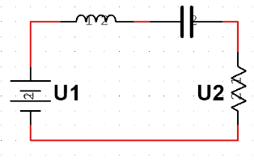

$$ \dot{U_L} = j \frac{\omega_0L}{R}\dot{U_1}\\ \dot{U_C} = -j \frac{1}{\omega_0CR}\dot{U_1} $$

并联谐振

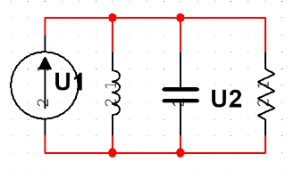

$$ \dot{I_L} = -j \frac{1}{\omega_0LG}\dot{I_1}\\ \dot{I_C} = j \frac{\omega_0C}{G}\dot{I_1} $$

上式中，$\frac{\omega_0L}{R}、\frac{1}{\omega_0CR}、 \frac{1}{\omega_0LG}、\frac{\omega_0C}{G}$均为品质因数$Q$的表达式，品质因数反映了电路对频率的选择性；$R$越小，$Q$越大，对频率的选择性越好。

### 2.8 网络功率分析

$$ 视在功率：S = UI，是复功率 $$

对于正弦电路

$$ \begin{aligned} &有功功率：P = UI\cos\theta_z\\ &无功功率：Q = UI\sin\theta_z=2\omega(W_L - W_C)\\ &功率因数：\lambda = \frac{P}{S} = \cos\theta_z\\ \end{aligned} $$

对于非正弦电路

$$ \begin{aligned} &有功功率：P = UI*1\cos\theta*{z1}\\ &无功功率：Q = UI*1\sin\theta*{z1}\\ &功率因数：\lambda = \frac{P}{S} = \frac{I_1}{I}\cos\phi_1 = \nu\cos\phi_1\\ \end{aligned} $$

$$ \begin{align*} \bar{P} &= I^2Re[Z]\\ Q &= I^2Im[Z]\\ Q &= P\tan\theta_z = P\frac{\sqrt{1 - \cos^2\theta}}{\cos\theta} = \sqrt{S^2 - P^2} \end{align*} $$

其中，基波因数$\nu = \frac{I_1}{I}$，位移因数$\cos\phi_1$

有功功率单位为$\text{W}$，无功功率单位为$\text{VAr}$，视在功率单位为$\text{VA}$

无功功率本质上是在建立场，包括电容中的电场和电感中的磁场，建立场不需要能量，但场中载流子的运动是需要能量的。

### 2.9 三相电

交流电在动力方面的应用几乎都是三相电，因为单相电路的瞬时功率随时间交变而三相电路的总瞬时功率却是恒定的，例如，三相电动机能提供相对恒定的转矩。

三相电路有对称三相电路和非对称三相电路，为应用三相电的优点，一般保证电源侧为三个频率相同、幅值相同、相位相差$120\degree$的电动势(称为三相电动势)，而是否对称在于负载侧。

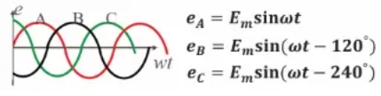

每一相上的电流电压称为相电流$I_P$相电压$U_P$，相与相之间的电流电压称为线电流$I_L$线电压$U_L$。

三相电有两种基本的连接方式：星型连接(又叫 Y 型连接)和三角形连接。

对于星型连接的电源侧，有

$$ \begin{align*} U_L &= \sqrt{3}U_P\\ I_L &= I_P \end{align*} $$

对于三角形连接的电源侧，有

$$ \begin{align*} U_L &= U_P\\ I_L &= \sqrt{3}I_P \end{align*} $$

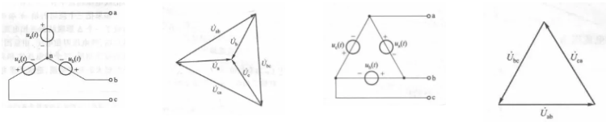

对于负载对称的星型连接三相电路，中性线上的压降为零，中性线可以去掉，没有中性线的三相电路称为三相三线制，否则称为三相四线制。而对于非对称三相电路，通常把中性线上的阻抗设计得非常小，使得中性线上的压降可以忽略，以保证三相供电的稳定性。

负载侧的连接方式也分星型连接和三角形连接，在分析电路时，可以单独抽取一相进行分析，星型连接的负载使用相电流相电压进行计算，三角形连接的负载则使用线电流线电压进行计算。单相电路的所有分析和计算方法对三相电路均适用。

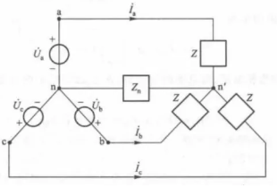

负载侧的星形连接和三角形连接之间可以相互转化

星形连接转化为三角形连接

$$ R*{AB} = R_A + R_B + \frac{R_A R_B}{R_C} \\ R*{BC} = R*B + R_C + \frac{R_B R_C}{R_A} \\ R*{CA} = R_C + R_A + \frac{R_C R_A}{R_B} \\ $$

若星形连接的三个阻抗相等，则等效三角形连接的阻抗为

$$ R\_{\Delta} = 3R_Y \\ $$

三角形连接转化为星形连接

$$ R*A = \frac{R*{AB} R*{CA}}{R*{AB} + R*{BC} + R*{CA}} \\ R*B = \frac{R*{BC} R*{AB}}{R*{AB} + R*{BC} + R*{CA}} \\ R*C = \frac{R*{CA} R*{BC}}{R*{AB} + R*{BC} + R*{CA}} \\ $$

若三角形连接的三个阻抗相等，则等效星形连接的阻抗为

$$ R*Y = \frac{1}{3}R*{\Delta} $$

三相电路的功率，无论哪种连接方式，其计算式为

$$ P = \sqrt{3}U_L I_L \cos \theta_z $$

# 二、器件理论模型

注意：此处介绍的理论模型，均为不考虑寄生电阻、寄生电容、寄生电感的理想模型。实际电路中，由于制造工艺和实际环境因素，不可避免地会存在等效出的寄生器件，低速电路可以近似为理论模型，一般无需考虑寄生的问题；但高速电路中则不可忽略这一点。

## 1. 无源器件模型

### 1.1 电阻/电导

欧姆定律反映了其伏安关系

$$ \dot{U_m} = R\dot{I_m}\\ \phi_u = \phi_i $$

功率和能量

$$ \begin{align*} 有功功率&：\begin{cases} 瞬时功率：P_R(t) = \frac{1}{2}U_mI_m\left[ \cos2(\omega t + \phi_u) + 1 \right] \\ 平均功率：P_R = \frac{1}{T}\int_0^T P_R(t)\text{d}t = \frac{1}{2}U_mI_m = UI\\ \end{cases}&，单位为 W\\ 无功功率&：Q_R = 0 &，单位为 Var\\ 能量&：W(t) = UIt \end{align*} $$

### 1.2 电容和电感

电容储存电场能，伏安关系如下，反映了电容电压不突变，且电容电流平均值为 0

$$ \begin{align*} i(t) &= C\frac{\text{d}u*c}{\text{d}t}\\ u(t) &= u(t_0) + \frac{1}{C}\int*{t_0}^t i(\xi)\text{d}\xi \end{align*} $$

伏安关系用相量表示如下，电流超前电压

$$ \begin{align*} \dot{I_m} &= j\omega C \dot{U_m} \\即 I_m &= \omega C U_m, \phi_i = \phi_u + 90\degree \end{align*} $$

定义容抗和阻抗分别为

$$ X_c = -\frac{1}{\omega C}\\ Z_c = -j\frac{1}{\omega C} = \frac{1}{sC} $$

功率和能量关系

$$ \begin{align*} 瞬时功率&：P_C(t) = -U_mI_m\sin\omega t\cos\omega t\\ 平均功率&：P_C = 0\\ 无功功率&：Q_C = UI = -\omega CU^2 = -2\omega W_c\\\\ 瞬时能量&：W(t) = \frac{1}{4}CU_m^2(1 - \cos 2\omega t )\\ 净储能&：W_C = \frac{1}{2}C(u^2(t) - u^2(t_0) ) \end{align*} $$

电感储存磁场能，伏安关系如下，反映了电感电流不突变，且电感电压平均值为 0

$$ \begin{align*} u(t) &= L\frac{\text{d}i*L}{\text{d}t}\\ i(t) &= i(t_0) + \frac{1}{L}\int*{t_0}^t u(\xi)\text{d}\xi \end{align*} $$

伏安关系用相量表示如下，电压超前电流

$$ \begin{align*} \dot{U_m} &= j\omega L \dot{I_m} \\即 U_m &= \omega L I_m, \phi_u = \phi_i + 90\degree \end{align*} $$

定义感抗和阻抗分别为

$$ X_L = \omega L\\ Z_c = j\omega L = sL $$

功率和能量关系

$$ \begin{align*} 瞬时功率&：P_L(t) = U_mI_m\sin\omega t\cos\omega t\\ 平均功率&：P_L = 0\\ 无功功率&：Q_L = UI = \omega LI^2 = 2\omega W_L\\\\ 瞬时能量&：W(t) = \frac{1}{4}LI_m^2(1 - \cos 2\omega t )\\ 净储能&：W_L= \frac{1}{2}L(i^2(t) - i^2(t_0) ) \end{align*} $$

电能可存储在电容中

$$ W_e = \frac{1}{2}\frac{Q^2}{C} = \frac{1}{2}QU = \frac{1}{2}CU^2 $$

电容存储的能量来源于其存储的电荷

$$ Q = CU = \int I \text{d}t $$

电容定义为$C = \frac{Q}{U}$，平行板电容器的电容计算式为

$$ C = \frac{\epsilon S}{l} $$

电容的串并联公式为

$$ C = \sum_i C_i(并联)\\ \frac{1}{C} = \sum_i \frac{1}{C_i}(串联) $$

磁能可存储在电感中

$$ W_m = \frac{1}{2} \frac{\Psi^2}{L} = \frac{1}{2}\Psi L = \frac{1}{2}LI^2 $$

电感存储的能量来源于其存储的磁链

$$ \Psi = LI = \int U \text{d}t = N\Phi $$

电感定义为$\frac{N\Phi}{I}$，电感的计算式为

$$ L= \frac{N^2\mu S}{l} $$

电感的串并联公式为

$$ L = \sum_i L_i(串联)\\ \frac{1}{L} = \sum_i \frac{1}{L_i}(并联) $$

为统一电阻、电容和电感在电路中的作用，引入了阻抗$Z$的概念，阻抗是一个复数，是电阻的推广，其实部由电阻构成，虚部由电容电感(统称电抗)构成；导纳$Y$是阻抗的倒数(电抗对应的概念叫电纳)，是电导的推广。阻抗角$\theta_z = \phi_u - \phi_i$反映了电路的性质是偏容性还是偏感性。

$$ Z = R + jX\\ Y = G + jB $$

### 1.3 其它元件

- 耦合电感

  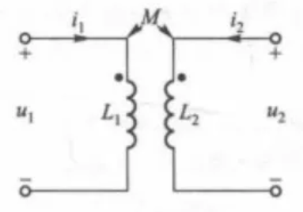

当两个电感距离很近时，会同时产生自感和互感作用，此时称为耦合电感。

对于此图的方向和极性，有

$$ u_1(t) = L_1\frac{\text{d}i_1}{\text{d}t} + M\frac{\text{d}i_2}{\text{d}t},\,\,\, \dot{U_1} = j\omega L_1 \dot{I_1} + j\omega M \dot{I_2}\\ u_2(t) = L_2\frac{\text{d}i_2}{\text{d}t} + M\frac{\text{d}i_1}{\text{d}t},\,\,\, \dot{U_2} = j\omega L_2 \dot{I_2} + j\omega M \dot{I_1}\\ $$

前一部分称为自感压降，$u、i$若为关联方向则为正；后一部分称为互感压降，自感互感压降一致则为正。

图中的小黑点为同名端，定义在产生互感电压的电流的流入端和互感电压参考极性为正处标注，以同名端表示实际电路状况。若电流或电压标注方向与同名端相反，则说明互感压降为负。

耦合系数$K$用于衡量电感之间的耦合程度，$K$越大耦合程度越高。

$$ K = \frac{M}{M\_{max}} = \frac{M}{\sqrt{L_1 L_2}} $$

```
  耦合电感之间的串并联：同名端相接称为反接，异名端相接称为顺接
```

$$ \begin{align*} 串联顺接：L &= L_1 + L_2 + 2M\\ 串联反接：L &= L_1 + L_2 -2M\\ 并联顺接：L &= \frac{L_1L_2 - M^2}{L_1 + L_2 + 2M}\\ 并联反接：L &= \frac{L_1L_2 - M^2}{L_1 + L_2 - 2M}\\ \end{align*} $$

```
  耦合电感可以去耦变换为易于分析的T形电路
```

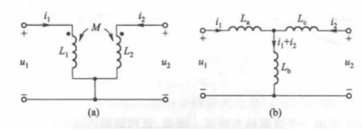

当同名端在公共端时(图中)

$$ \begin{cases} L_a = L_1 - M\\ L_b = M\\ L_c = L_2 - M \end{cases} $$

当异名端在公共端时

$$ \begin{cases} L_a = L_1 + M\\ L_b = -M\\ L_c = L_2 + M \end{cases} $$

```
  耦合电感还可用阻抗折算的思想，将阻抗全部折合到一边便于分析和计算
```

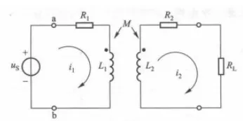

以向电源输入侧折算为例，向负载侧折算同理

从初级一侧看，总阻抗计算式如下，其中$Z_{11}、Z_{22}$分别为初级和次级回路总阻抗

$$ Z*i = Z*{11} + \frac{\omega^2M^2}{Z\_{22}} $$

得出$Z_i$后便可得出$I_1$，随即便可求出$I_2$

$$ \dot{I*2} = \frac{j\omega M \dot{I_1}}{Z*{22}} $$

- 理想变压器：$K = 1, L_1、L_2 \to \infty$时的耦合电感，定义匝数比$n = \frac{N_2}{N_1}$

  当同名端方向一致时初级回路和磁极回路关系如下(若同名端方向相反则取个负号)

  $$ \begin{cases} u_2 = nu_1\\ i_2 = -\frac{1}{n}i_1 \end{cases} $$

  理想变压器消耗的有功功率为零：$P = u_1i_1 + u_2i_2 = 0$

  理想变压器的阻抗变换性质可简单概括为：左除右乘$n^2$ (向初级折算则除，向次级折算则乘)

## 2. 有源器件模型

注意：此处介绍的理论模型，均为不考虑寄生电阻、寄生电容、寄生电感的理想模型。实际电路中，由于制造工艺和实际环境因素，不可避免地会存在等效出的寄生器件，低速电路可以近似为理论模型，一般无需考虑寄生的问题；但对于高速电路，则需要考虑到这一点。

有源器件主要包括各类晶体管和 IC(集成电路)，IC 放在后续章节单独讲解，此部分主要分析各类晶体管。晶体管按是否含有第三个控制端分为不可控器件、半控型器件(只能控制开通和关断中的一个过程)、全控型器件；按控制信号的类型分为流控型器件和压控型器件；按载流子类型分为单极性器件、双极性器件和复合型器件。另外，关于晶体管的历史，笔者认为是很有启发性的故事，有兴趣的朋友，推荐阅读芯片研究专家汪波的《芯片简史》一书。

晶体管的工作原理，起源于半导体物理。半导体在能带理论中解释为价带几乎满而导带几乎空，且价带与导带之间禁带宽度较窄的材料，主要由元素周期表中 IV 族元素构成。载流子是从价带跃迁到导带的自由电子，即参与导电的自由电子；占多数的载流子称为多子。纯净的半导体称为本征半导体，导电能力弱，存在本征激发产生载流子。向本征半导体中分别掺入三价元素或五价元素，对应形成 P 型半导体或 N 型半导体，其中的多子分别对应为空穴和自由电子。将 P 型半导体和 N 型半导体紧靠则构成 PN 结，多子由于浓度差存在扩散运动，少子存在漂移运动；载流子浓度达到动态平衡后，在交界处形成内电场，称为空间电荷区/耗尽层/势垒层。加合适的正向电压(正向偏置)后，耗尽层宽度逐渐变短直至消失，PN 结导通(多子的扩散电流)且两端电位被钳位；加合适的反向电压(反向偏置)后，耗尽层宽度变宽(宽度达到 PN 结宽度时继续增大反向电压则会击穿 PN 结)，PN 结不导通但存在极小的漏电流(少子的漂移电流)；因此 PN 结具有单向导电性。

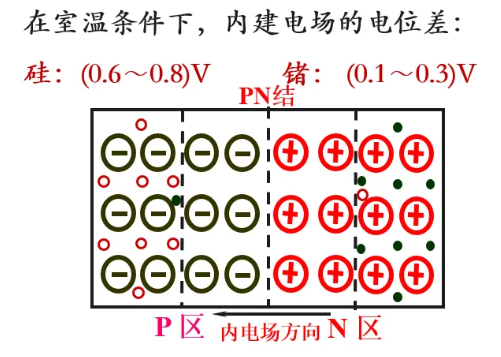

### 2.1 二极管

由 PN 结和外壳组成，引出阴极$K$和阳极$A$，是不可控器件，有单向导电性。二极管的基本特性曲线/伏安特性曲线如下，其中门槛电压$U_{TO}$为正向电流$I_F$开始明显增加时对应的电压，正向压降$U_F$为与$I_F$对应的电压。伏安关系可表示为$I = I_s(e^\frac{U}{U_T} - 1)$，其中$I_s$为反向饱和电流，由少子漂移运动形成，受温度影响大；$U_T$为温度电压当量，常温时约为 26mV。

二极管受反压时只有微弱的反向漏电流。反向电压过大时发生反向击穿，反向击穿又分为雪崩击穿、齐纳击穿和热击穿，前两种击穿可逆，热击穿不可逆。雪崩击穿一般发生在高电压，齐纳击穿一般发生在低电压。

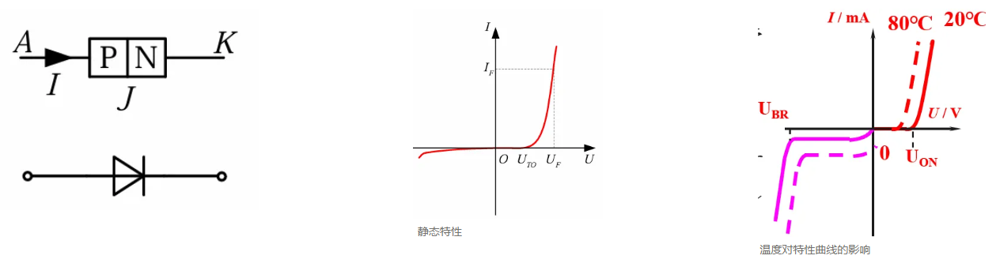

二极管的微变信号等效如下，可等效为开关、直流电源和电阻的串联，其中直流电压为导通二极管需要克服的内电场电压，电阻阻值为伏安特性曲线上局部线性化所得切线斜率的倒数。

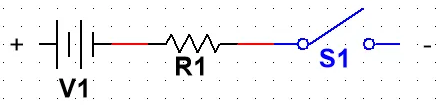

实际的 PN 结有两个 N 极，N-掺杂浓度较低，为了提高载荷电压；N+掺杂浓度高，为了提高载流子浓度，改善流通特性，降低等效电阻。且实际的二极管存在电容效应：PN 结的电荷量随外加电压而变化，呈现电容效应，称为结电容$C_j$，又叫微分电容；电容效应决定了 PN 结工作频率的上限。电容效应使得其正向导通和反向关断过程都有一个电压尖峰(过冲)，反向关断有一个反向恢复时间$t_{rr}$(从正向导通切换到反向关断状态需要一个时间，其中分为存储时间和恢复时间)。

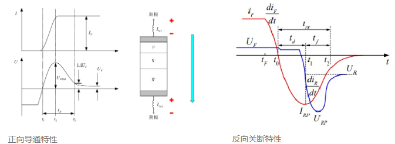

### 2.2 晶闸管

### 2.3 三极管

全称为双极性结型晶体管，简称 BJT，为流控型器件，全控型器件。三极管可视为由两个 PN 结构成，从三个掺杂区域分别引出三个电极称为发射极 e，基极 b，集电极 c，有 NPN 和 PNP 之分。

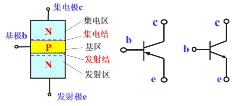

三极管的电流控制作用可粗略理解为基极小电流控制集电极和发射极大电流，具体机理此处省略，放大条件为发射结正偏且集电结反偏。三极管各极电流关系可近似如下(此处不区分$I_{CO}、I_{CEO}、I_{CBO}、I_{CN}$等)

$$
\begin{aligned} \alpha &= \frac{\Delta I_c}{\Delta I_e}(共基交流放大系数) \quad \overline{\alpha} = \frac{I_c}{I_e}(共基直流放大系数)，通常认为两者相等 \\

\beta &= \frac{\Delta I_e}{\Delta I_b}(共射交流放大系数) \quad \overline{\beta} = \frac{I_e}{I_b}(共射直流放大系数)，通常认为两者相等 \\ \end{aligned} \\ I_e = I_b + I_c
$$

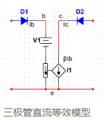

三极管直流等效模型

以 NPN 为例，三极管特性曲线如下，左右曲线对应：

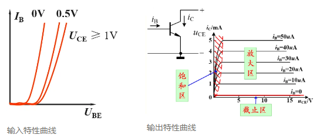

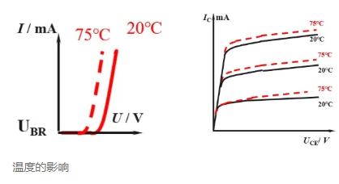

由输入特性曲线可见，$U_{BE}$须达到一定阈值才可使$I_B$增大到阈值，从而控制三极管导通；随着$U_{CE}$的增加，由于电场作用，曲线右移，但增大到一定程度后，曲线右移不再明显。在(共射接法的)输出特性曲线中，三极管工作状态分为截止区、放大区、饱和区三个区域，截止区中三极管未导通；放大区中三极管导通，处于放大状态，$I_C$仅由$I_B$决定，与$U_{CE}$几乎无关，是研究模拟电子技术时的三极管的工作区域；放大区中三极管饱和导通，处于开关状态，$I_C$不受$I_B$控制，而跟随$U_{CE}$变化，是研究数字电子技术时的三极管的工作区域。

关于放大区与饱和区的理解，可以用下面的假想图来粗略理解，如图可见$I_C = \frac{VCC - U_{CE}}{R_C}$，当$U_{CE}$足够大时，$I_C$未达到极限，尚能满足与$I_B$的比例关系，对外表现出电流的控制作用，三极管处于放大区；当$U_{CE}$较小时，$I_C$受电源电压限制达到最大值，三极管进入饱和区，对外表现出$I_B$失去对$I_B$的控制作用。

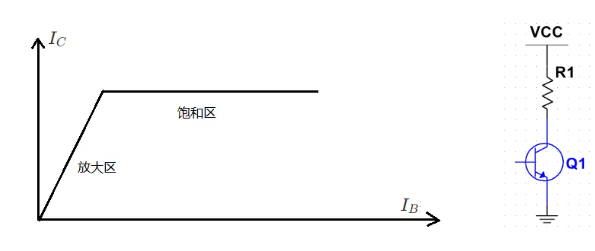

与二极管一样，由于结电容等寄生电容的存在，三极管的导通与关断也都是过程而非瞬间完成，动态特性如图

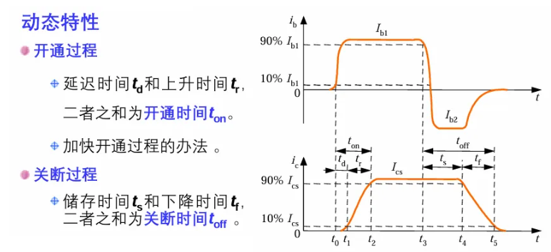

与三极管原理和符号完全相同的还有电力晶体管，简称 GTR，结构上采用至少两个晶体管按照达林顿结构组成(达林顿结构指两个晶体管级联的接法)，采用晶圆级的集成电路工艺将许多这种单元并联而成。电力晶体管的主要特点是耐压高、电流大、开关特性好。由于采用了达林顿结构，在参数上为两个三极管级联后的参数。相较于普通的三极管，电力晶体管还有二次击穿现象

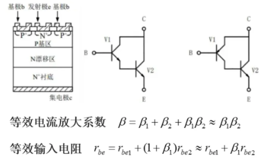


### 2.4 场效应管

场效应管(FET)是单极性、全控型、压控型器件，靠电场效应建立导电沟道实现导通。输入回路内阻很高，热稳定性好噪声小，源极电流极小(绝缘性场效应管几乎没有源极电流)故功耗低。场效应管分为结型场效应管(JFET)和绝缘栅型场效应管(IGFET)，结型场效应管分 N 沟道和 P 沟道，绝缘栅型场效应管分增强型和耗尽型(区别为不加栅源电压时是否建立导电沟道)，分别又分 N 沟道和 P 沟道；共六种场效应管。从场效应管管三个掺杂区域引出三个电极称为源极 s，栅极 g，漏极 d。

两种场效应管的结构和特性曲线如下，电压控制作用可粗略理解为栅源电压控制漏源电流，具体机理此处省略，以 N 沟道为例，受控条件为$U_{gs} < 0$，$U_{ds} > 0$

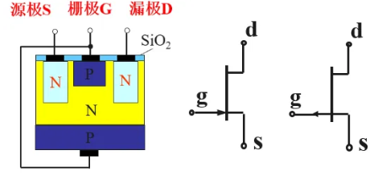

结型场效应管

以 N 沟道结型场效应管为例，特性曲线如下：

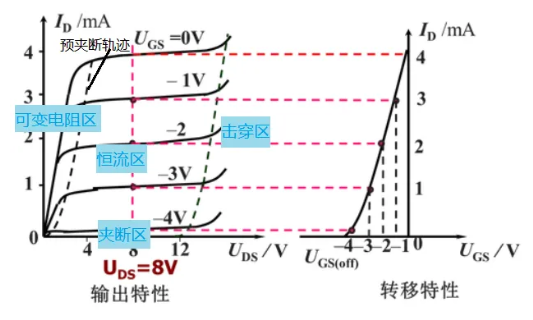


绝缘栅型场效应管

以 N 沟道增强型绝缘场效应管为例，特性曲线如下：

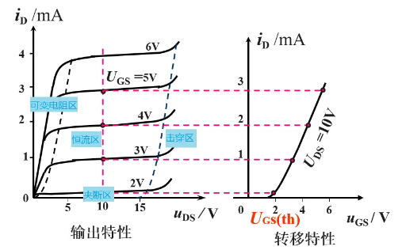

因场效应管几乎没有栅极电流，故一般不研究输入特性曲线。

输出特性曲线中，场效应管工作区域分为夹断区、恒流区、可变电阻区三个区域，夹断区和恒流区的间隔存在夹断电压$U_{gs(off)}$，是场效应管的参数，恒流区和可变电阻区的间隔称为预夹断轨迹(由各曲线上$U_{gd} = U_{gs(off)}$的点构成)。夹断区条件为$U_{gs} \le U_{gs(off)}$，导电沟道全部夹断不导通；恒流区条件为$U_{gd} < U_{gs(off)}$，$I_D$只受$U_{gs}$控制；可变电阻区条件为$U_{gd} > U_{gs(off)}$，改变$U_{gs}$可改变漏源极之间电阻影响$I_D$；当$U_{ds}$增加到一定程度后电流急剧增大，场效应管被击穿。

转移特性曲线$I_D = f(U_{GS})|*{U*{DS}=const}$，用于描述控制作用的具体数量关系：结型场效应管转移特性曲线与纵轴交点为$U_{gs} = 0$时产生预夹断的漏极电流$I_{DSS}$，恒流区近似表达式$I_D = I_{DSS} \left( 1 - \frac{U_{GS}}{U_{GS(off)}} \right)^2$；绝缘栅型场效应管转移特性曲线与纵轴交点为$U_{gs} = 2U_{gs(th)}$时的漏极电流$I_{DO}$，恒流区近似表达式$I_D = I_{DO} \left( \frac{U_{GS}}{U_{GS(th)}} - 1 \right)^2$

六种场效应管的符号、特性曲线、工作区域判断汇总如图

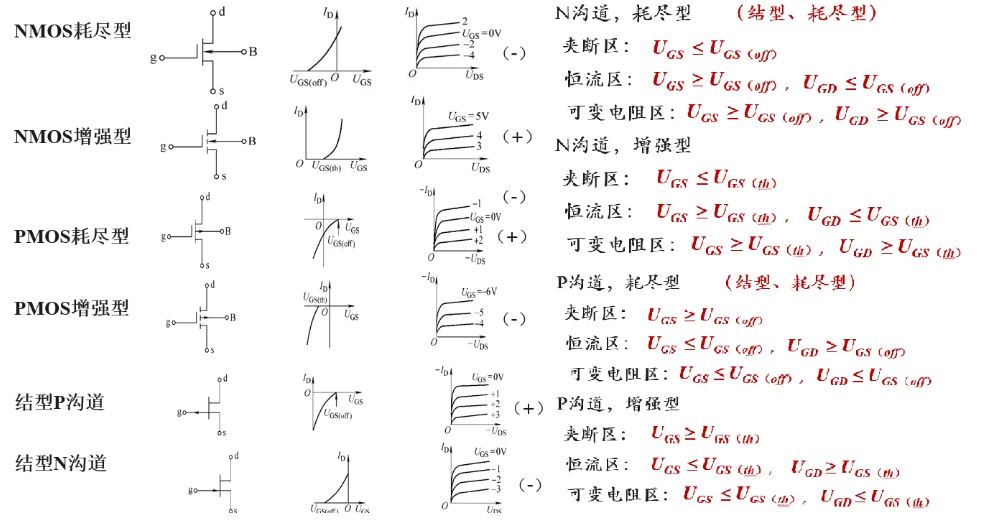

驱动功率小，驱动电路简单，开关频率高开关速度快，无二次击穿问题，安全工作区宽，电流容量小，耐压低。

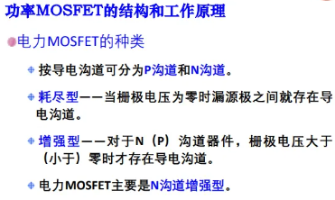

- 工作原理

  单极性型晶体管，导电机理同 MOS 管，结构上有较大区别，采用多元集成结构。加$U_{gs}$后在强电场作用下，$G$连接的两个 P 型半导体中发生局部半导体变性，P 型局部变为 N 型，形成导电沟道。

  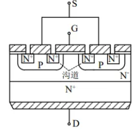

- 基本特性

  - 静态特性：有转移特性和输出特性；通态电阻具有正温度系数(主流器件中就它有正温度系数)，电流增大时温度升高，电阻增大，将电流分到其它支路，有利于并联均流。转移特性中，$I_D$较大时，$I_D$与$U_{GS}$近似于线性关系，斜率称为跨导$g_m$；使 MOSFET 导通的电压称为开启电压$U_T$。开关状态工作在截止区和非饱和区；漏源极之间有反向并联的寄生二极管，MOS 管承受反压时导通，起保护作用。

  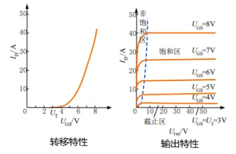

- 开关速度：工作频率在 100kHz 以上，主流器件中最高。


- 主要参数，其中$I_D$是 持续电流，$I_{DM}$是脉冲电流

  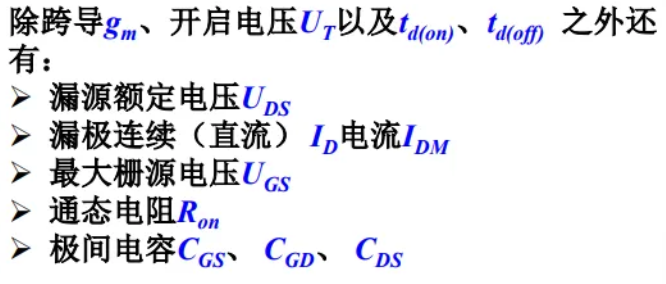

### 2.5 IGBT

### 2.6 运算放大器

### 2.2 晶闸管

简称 SCR，流控型器件：半控型器件，开关频率不高、过流和过压能力相对强。

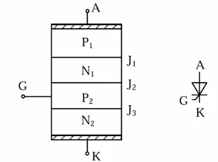

- 工作原理：四层三节的结构，可以看作由 PNP 和 NPN 构成

  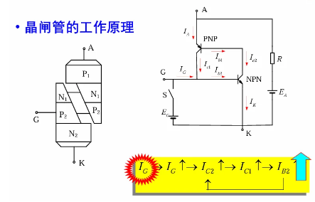

  当晶闸管承受正压，仅 A 接正 K 接负时，晶闸管不导通；当$I_G$注入时，NPN 的集电极从 PNP 的基极拽出电流，两个三极管均导通，且此时即使$I_G$撤去，内部仍然构成回路，晶闸管保持导通状态，即$I_G$失去控制作用；想要关断晶闸管，需要加反压使晶闸管的电流降到接近零的某一数值以下。当晶闸管承受反压，无论是否有$I_G$，晶闸管都不导通。

  其它导通情况：阳极电压升高至相当高的值会造成雪崩击穿；阳极电压上升率$\frac{\text{d}u}{\text{d}t}$过高会导通；结温较高也会导通。其它的触发方式还有光触发，可以保证控制电路与主电路之间良好的绝缘性，用于高压电力设备中，这称为光控晶闸管；但最精确、迅速而可靠的控制手段还时门极触发。

  晶闸管：电力电子技术的概念和基础就是由于晶闸管及晶闸管变流技术的发展而确立的。晶闸管是通过对门极的控制能够使其导通而不能使其关断的器件，属于半控型器件。对晶闸管电路的控制方式主要是相位控制方式。

- 基本特性

  静态特性：

  - 反向特性类似于二极管，反向阻断状态只有极小的反向漏电流通过，反向电压达到反向击穿电压后，可能导致晶闸管发热损坏

  - 正向当$I_G = 0$时，器件两端只有很小的漏电流，为正向阻断状态。当正向电压超过正向转折电压$U_{bo}$时，漏电电流急剧增大，器件开通。

    随着$I_G$增大，$U_{bo}$减小。

    晶闸管本身的压降在 1V 左右。

  静态特性可理解为：$I_G$需要增大到一定程度来让$U_{bo}$减小，不加$I_G$时后的$U_{bo}$太大以至于想要导通就会击穿器件

  动态特性：开通和关断都是一个过程，有一定延迟

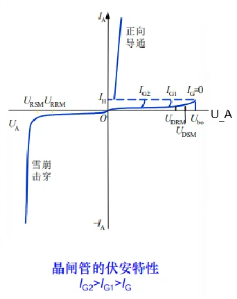

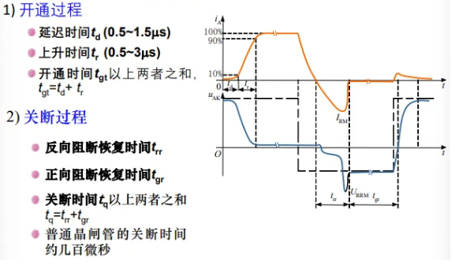

- 主要参数

  - 断态重复峰值电压$U_{DRM}$：门极断路而结温为额定值时允许重复加在器件上的正向峰值电压。
  - 反向重复峰值电压$U_{RRM}$：门极断路而结温为额定值时允许重复加在器件上的反向峰值电压。

  取$U_{DRM}$和$U_{RRM}$中较小的作为器件的额定电压；选用时，一般取额定电压为正常工作时晶闸管所承受峰值电压的 2~3 倍。

  - 通态(峰值)电压$U_{TM}$：晶闸管通以某一规定倍数的额定通态平均电流时的瞬态峰值电压。
  - 通态平均电流$I_{T(AV)}$/额定电流：环境温度为 40°C 和规定的冷却状态下，稳定结温不超过额定结温时，所允许流过的最大工频正弦半波电流的平均值。使用时按有效值相等的原则选取晶闸管。
  - 维持电流$I_H$：存在门极信号的情况下，使晶闸管维持导通所需的最小电流
  - 擎住电流$I_L$：晶闸管刚从断态转入通态并移除触发信号后，能维持导通所需的最小电流。对同一晶闸管来说，通常$I_L$约为$I_H$的 2~4 倍。$I_L$和$I_H$的电流路径都是$A\to K$的。
  - 浪涌电流$I_{TSM}$：由于电路异常情况引起上的、使结温超过额定结温的不重复性最大正向过载电流。
  - 断态电压临界上升率$\frac{\text{d}u}{\text{d}t}$：在额定结温和门极开路的情况下，不导致晶闸管从断态到通态转换的外加电压最大上升率。电压上升率过大，会使充电电流足够大，触发晶闸管误导通。
  - 通态电流临界上升率$\frac{\text{d}i}{\text{d}t}$：在规定条件下，晶闸管能承受而无有害影响的最大通态电流上升率。电流上升太快，可能造成局部过热而使晶闸管损坏。
  - 门极触发电流$I_{GT}$：室温下，器件从断态到完全开通所必需的最小门极电流。$I_{GT}$的电流路径是门极的。
  - 门极触发电压$U_{GT}$：与$I_{GT}$对应的门极触发电压。

- 派生器件

  - 快速晶闸管：开关时间以及$\frac{\text{d}u}{\text{d}t}$和$\frac{\text{d}i}{\text{d}t}$耐量都有明显改善。普通晶闸管关断时间数百微秒，快速晶闸管数十微秒，高频晶闸管 10μS 左右。高频晶闸管的不足在于其电压和电流定额都不易做高。由于工作频率较高，不能忽略快速晶闸管开关损耗的发热效应。
  - 双向晶闸管：可认为是一对反并联联接的普通晶闸管的集成。有两个主电极$T_1$和$T_2$,一个门极$G$。在一三象限有对称的伏安特性。由于电流方向发生改变，通过的是交流，故不用平均值而用有效值来表示其额定电流值。
  - 逆导晶闸管：将晶闸管反并联一个二极管制作在同一管芯上的功率集成器件，加反压时电流全部通过二极管流走。具有正向压降小、关断时间短、高温特性好、额定结温高等优点。
  - 光控晶闸管：又称光触发晶闸管，是利用一定波长的光照信号触发导通的晶闸管。光触发保证了主电路与控制电路之间的绝缘，且可避免电磁干扰的影响。因此目前在高压大功率的场合。

### 2.3 门极可关断晶闸管

简称 GTO，双极型、全控型、流控型器件，是晶闸管的一种派生器件，可在门极加负脉冲电流使其关断。有电导调制效应，电压电流容量较大，与普通晶闸管接近，在兆瓦级以上的大功率场合有较多应用，开关速度低，驱动功率大，驱动电路复杂。

- 工作原理

  原理与普通晶闸管类似，在制造工艺和参数设置上有所差别。GTO 采用多元结构，多个阴极并联，多个门极并联，阴极面积小，NPN 中 P 区横向电阻小，降低了门极和阴极间的阻抗，相对容易抽出电流。参数设置上，$\alpha_1 + \alpha_2 > 1$是深度的回路，导通极难被破坏；$\alpha_1 + \alpha_2 < 1$是回路极难被建立；刚好在$1$附近则控制比较灵敏。$\alpha_1 + \alpha_2$接近于$1$，导通压降增大，易于关断。$\alpha_2$设计的比较大，使得$V_2$控制灵敏，易于关断。(注：导通程度浅指 GTO 工作在特性曲线中导通与关断的临界处)

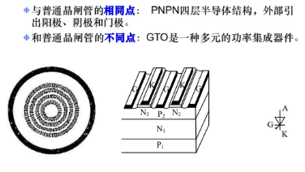

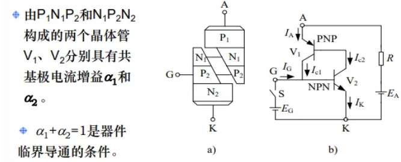

GTO 的导通过程与普通晶闸管一样，只是导通时饱和程度较浅。关断过程有强烈正反馈使器件退出饱和而关断(本身开通和关断都有正反馈的电流结构，只是普通晶闸管难以被触发)。同时，多元集成结构使得 GTO 比普通晶闸管开通过程快，承受$\frac{\text{d}i}{\text{d}t}$能力强。

- 基本特性：动态特性

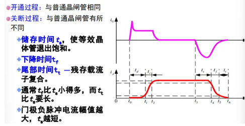

- 主要参数
  - 最大可关断阳极电流$I_{ATO}$：作为额定电流参数，与晶闸管额定电流不同。
  - 电流关断增益$\beta_{off} = \frac{I_{ATO}}{I_{GM}}$：最大可关断阳极电流与门极负脉冲电流最大值之比；多大的门极电流能关断多大的阳极主电流，电流关断增益越大表示控制同样的阳极电流，所需的门极电流越小
  - 开通/关断时间：$t_{on}/t_{off}$

### 2.6 绝缘栅双极型晶体管

简称 IGBT，场控器件，融合了 GTR 和 MOSFET 的优点

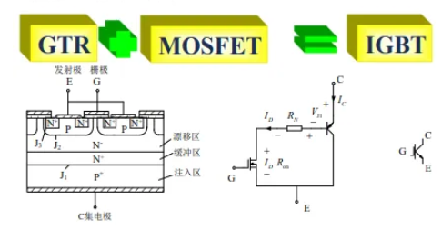

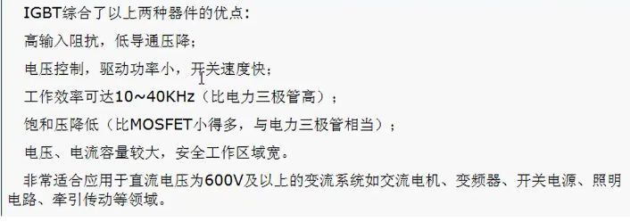

- 工作原理：在晶圆级用 MOSFET 驱动 GTR，是场控器件；MOSFET 的驱动原理与电力 MOSFET 基本相同，通断由栅射极电压$U_{GE}$决定，$U_{GE}$大于开启电压$U_{GE(th)}$时，MOSFET 内形成沟道，为晶体管提供基极电流，IGBT 导通。电导调制效应使电阻$R_N$减小从而使得通态压降减小。电导调制是指通过外电流来调制载流子浓度，改变电导率；效果就是一旦导电就会越来越导电。在栅射极之间加反压或者不加信号时，MOSFET 的导电沟道关闭，晶体管基极电流被切断，IGBT 关闭
- 基本特性

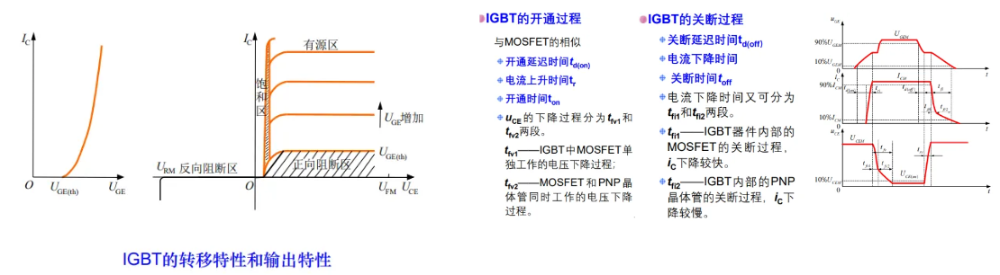

- 擎住效应(IGBT 特殊的性质)：IGBT 的内部结构如图，中间的 N 为 MOSFET 的漏极，也即晶体管的门极，紫色部分构成了一个寄生三极管，构成了绿色部分的寄生晶闸管。当$I_C$太大或关断时$\frac{\text{d}U_{CE}}{\text{d}t}$过高时，会使寄生晶闸管导通，这时栅极便失去了对集电极的控制，称为擎住效应。


- 安全工作区：正偏安全工作区(FBSOA)由最大集电极电流、最大集射极之间电压和最大集电极功耗确定；反向偏置安全工作区(RBSOA 由)最大集电极电流、最大集射极之间电压和最大允许电压上升率$\frac{\text{d}U_{CE}}{\text{d}t}$确定

  - 主要参数

    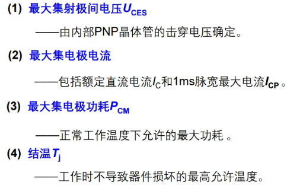

# 三、模拟电子技术

## 1. 核心概念

模拟电路的核心是对信号的放大，对能量的控制和转化。模拟电路中所用的核心器件为工作在放大区的三极管或工作在恒流区的 MOS 管，实际使用它们的放大作用，事实上都是在特性曲线上的某一点进行局部线性化的结果(微变等效模型)，用较小的变化量在不失真的前提下控制较大的变化量。失真在性质上体现为三极管进入截止区或饱和区，在波形上体现为波形出现削顶或削底。要处理的信号，往往以类似交流纹波的形式叠加在直流信号上，形成脉动直流信号，因此，模拟电路中一个重要的分析思想，就是将一个同一个电路分为直流等效电路和交流等效电路，直流电路提供交流电路的工作状态点。规范来说，$I_B$表示直流分量，$i_b$表示交流分量，$i_B$表示交直流总量，$\dot{I_b}$表示相量有效值。

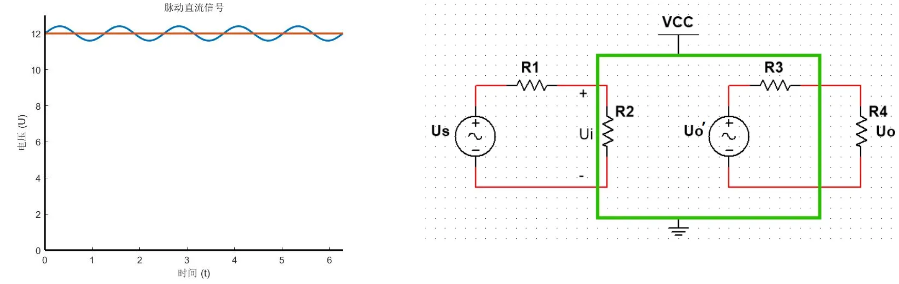

另外，模拟电路中一个很重要的电路模型如上图，其中$U_s$为需要放大的小信号，$U_o'$为空载输出电压，$U_o$为负载输出电压，$R_1$为信号源内阻，$R_4$为负载，均为不可控制的参数，绿色框中为放大电路，是受控的部分；以电压放大电路为例，为了使$U_s$尽可能不衰减地传输到最后的输出，希望$R_1$尽可能小且$R_4$尽可能大，等效在可控部分，就是希望$R_2$尽可能大且$R_3$尽可能小。

## 2. 放大电路

放大电路一般包含电压放大电路和功率放大电路两部分，电压放大电路工作在小信号状态，一般用于推动功率放大电路；功率放大电路工作在大信号状态，用于推动执行元件。

放大的条件：直流通路中，晶体管发射结正偏且集电结反偏；交流通路中，被放大信号可加在晶体管输入端口，且放大信号可作用于负载。

放大电路的性能指标：

- 输入为小信号：放大倍数/增益、输入电阻、输出电阻(输入信号短路且断开负载)、通频带
- 输入为大信号：非线性失真系数、最大不失真电压(幅值)、最大输出功率、效率

多级放大电路中，前级负载与后级输入电阻等价，前级输出电阻与后级信号源内阻等价。

### 2.0 分析步骤

对于处理低频(远低于晶体管特征频率)小信号的放大电路，具体的分析步骤为：(此处省略图解法找交点的步骤，介绍等效电路法)

- 画直流通路和交流通路

  - 直流通路：大电容(一般表现为极性电容)和电流源开路，电感和电压源短路(电压源保留内阻)
  - 交流通路：大电容(一般表现为极性电容)短路，直流电源视为对地短路(保留内阻)

- 估算静态工作点 Q：

  - 三极管计算$U_{BEQ}$(根据材料一般默认为 0.3V 或 0.7V)、$I_{BQ}$、$I_{CQ}$、$I_{EQ}$、$U_{CEQ}$(验证三极管确实工作在放大区)
  - 场效应管根据转移特性关系和其它关系(通常为$U_{gs}$关系)联立解方程组得到$I_{DQ}$和$U_{GSQ}$。

  实际使用中需要调整合适的电路参数使得 Q 点合适，以避免信号失真

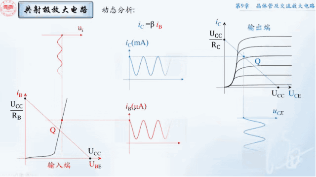

- 画微变等效电路并计算动态参数：三极管和场效应管在低频小信号下，简化的 H 参数模型如下(H 参数模型、各参数含义及简化推导此处略)

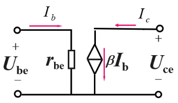

三极管低频小信号模型

三极管计算动态电阻

$$ r*{be} \approx r*{bb'} + (1 + \beta)\frac{U*T}{I*{EQ}} $$

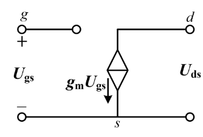

场效应管低频小信号模型

场效应管计算动态跨导

$$
\begin{aligned} g_m &= \frac{2}{U_{GS(th)}} \sqrt{I_{DO} I_{DQ}}(增强型)\\

g_m &= \frac{-2}{U_{GS(off)}} \sqrt{I_{DSS} I_{DQ}}(耗尽型) \end{aligned}
$$

- 根据定义计算各性能指标：注意 H 参数模型只用于求低频小信号下的交流量

### 2.1 单管放大电路

三极管的单管放大电路有共射、共集、共基；场效应管的单管放大电路有共源、共漏、共栅

共射放大电路

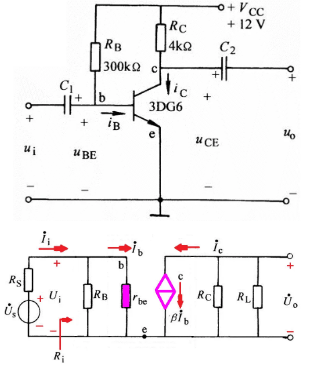

$$
\begin{aligned} A_u &= \frac{U_o}{U_i} = -\frac{\beta R_L'}{r_{be}} \\

R_i &= \frac{U_i}{I_i} = R_B \parallel r_{be} \approx r_{be} \\

R_o &= R_C\\

A_{us} &= \frac{U_o}{U_s} = \frac{U_i}{U_s} \cdot \frac{U_o}{U_i} = \frac{R_i}{R_s + R_i} \cdot A_u \\ \end{aligned}
$$

共集放大电路

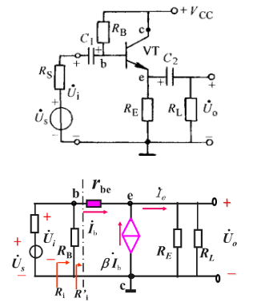

$$
\begin{aligned} A_u &= \frac{(1 + \beta) (R_E \parallel R_L)}{r_{be} + (1 + \beta) (R_E \parallel R_L)} \\

R_i &= \frac{U_i}{I_i} = R_B \parallel \left[ r_{be} + (1 + \beta) (R_E \parallel R_L) \right] \\

R_o &= \frac{U_o}{I_o} = R_E \parallel \frac{r_{be} + (R_B \parallel R_s)}{1 + \beta} \\ \end{aligned}
$$

共基放大电路

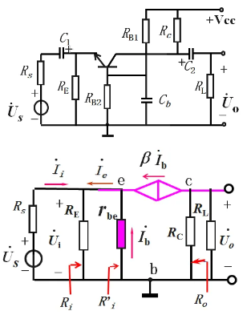

$$
\begin{aligned}A_u &= \frac{U_o}{U_i} = \frac{\beta (R_c \parallel R_L)}{r_{be}} \\

R_i &= R_E \parallel \frac{r_{be}}{1 + \beta} \\

R_o &= R_C\end{aligned}
$$

共源放大电路：又称自给偏压电路，只适用于耗尽型器件


$$
\begin{aligned} A_u &= \frac{U_o}{U_i} = -g_m \left( R_D \parallel R_L \right) \\

R_i &= R_G \\

R_o &\approx R_D \end{aligned}
$$

共漏放大电路


$$
\begin{aligned} A_u &= \frac{U_o}{U_i} = \frac{g_m (R_L \parallel R_S)}{1 + g_m (R_L \parallel R_S)} \\

R_i &= \frac{U_i}{I_i} = R_G + R_{G1} \parallel R_{G2} \\

R_o &= R_S \parallel \frac{1}{g_m} \end{aligned}
$$

其中$R_B$用于提供合适的$I_B$，$R_C$用于将电流变化量反映为电压变化量，$C_1、C_2$用于隔直通交

共栅放大电路与共基放大电路类似，此处略。场效应管的共源、共漏和共栅分别与双极型晶体管的共射、共集和共基对应，相应的输出量与输入量之间的大小和相位关系一致。以三极管的三种基本放大电路为例，特点比较如下：其中共射放大电路有电流、电压和功率放大作用，输出电阻大带载能力不强，不适合作功率放大电路；共集放大电路不放大电压，又称为射极跟踪器，输出电阻小带载能力强，适合作功率放大电路；共基放大电路不放大电流，输出电阻大不适合作功率放大电路


- 改进：分压式偏置稳定共射放大电路，在温度波动下，可保证静态工作点相对稳定，$R_E$用于提供直流通路下的负反馈，但同时也降低了电压增益；为此可在$R_E$上并联旁路电容，在不影响静态工作点稳定性的前提下补偿电压增益


### 2.2 多级放大电路

### 2.3 差动放大电路

## 3. 频率响应

# 五、电力电子技术

# 六、常见 IC 及驱动电路

IC 是集成电路的缩写，实际使用中主要是各种模块化的芯片。

CMOS 和 TTL 是最常见的两种集成电路(IC)技术。CMOS(互补金属氧化物半导体)通常成对使用 NMOS 和 PMOS 两种晶体管构成逻辑门，有低功耗、高噪声容忍度和高集成度的优点。TTL(晶体管-晶体管逻辑)中由多个晶体管构成逻辑门，响应速度快但功耗相对较高。现代电子设备中，CMOS 技术由于其低功耗和高集成度的优势，已经基本取代了 TTL 技术。

### **555 定时器及应用**

集成 555 定时器是一种将模拟和数字电路结合的、多用途的单片集成电路。在其外部配上少许阻容元件，便能构成多种用途的振荡、整形及定时等多种应用电路。其工作原理为：两个触发端加不同的信号与 比较，使比较器的输出控制 RS 锁存器，使其分别工作在置 0、置 1 和保持状态。


555 定时器内部结构与工作原理

555 定时器的常见应用电路有：施密特触发器、单稳态触发器、多谐振荡器

- 施密特触发器：有两个阈值电压和两个稳定状态，其维持和转换与输入电压有关，电压传输特性有滞回特性，具有波形变换、整形和滤波的功能。


施密特触发器

- 单稳态触发器：有一个稳态，在外加触发脉冲的作用下，通过对电容的充放电，使电路进入暂稳态，经过一定时间后自动返回稳态。暂稳态维持的时间仅取决于电路本身元件的参数，与触发脉冲的宽度无关。


单稳态触发器

- 多谐振荡器：有两个暂稳态，不需要外加输入就可以在两个暂稳态之间连续交替转换，产生矩形波信号。调节电阻阻值可以调节矩形波的周期和占空比。


多谐振荡器

### **DA 转换和 AD 转换**

- DA 转换

DA 转换可以将输入的 n 位的二进制数转换成与之成比例的模拟量(电压或电流)，由译码网络、模拟开关、集成运放和基准电压等部分组成 。根据译码网络的不同，DA 转换器分为权电阻网络型、T 形电阻网络型、倒 T 形电阻网络型、权电流型、开关树形和权电容网络型等。DA 转换器的主要计数参数有分辨率、转换精度、线性度、转换时间等。

以倒 T 形 DA 转换器为例，其内部结构和工作原理如下(输入控制模拟开关的闭合，控制电流支路的接入与否)


倒 T 形 DA 转换器

- AD 转换

AD 转换可以将输入的模拟量(电压或电流)转换为与之成比例的二进制代码，一般要经过采样、保持、量化及编码 4 个过程。根据工作原理的不同，AD 转换器有直接转换和间接转换之分，直接转换分为并联比较型和反馈比较型(逐次逼近型、计数型)等；间接转换分为电压时间变换型-积分型和电压频率变换型等。AD 转换器的主要技术参数有分辨率、转换精度、转换速率、转换时间等。

直接转换型以逐次逼近型为例，其内部结构和工作原理如下(类似天平称物体重量的过程，用寄存器记录逐为比较的结果)


逐次逼近型 AD 转换器

间接转换型以双积分型为例，其内部结构和工作原理如下(通过两次积分，先将模拟电压转换成与之大小相对应的时间 T，再在时间间隔 T 内用计数频率不变的计数器计数，计数器所计的数字量就正比于输入模拟电压)


双积分型 AD 转换器

# 七、器件选型与常见电路

二极管

- 主要参数
  - 正向平均电流(额定电流)$I_{F(AV)}$：在指定壳温和散热条件下，允许流过的最大工频正弦半波电流的平均值(衡量直流量用平均值)
  - 反向重复峰值电压$U_{RRM}$
  - 正向电压降$U_F$
  - 反向漏电流$I_R$
  - 最高允许结温$T_{JM}$(注意测得的是壳温)
  - 正向导通电压越低，反向击穿电压越高，越接近理想二极管。正向电流越大越好，反向电流越小越好。
  - 最大整流电流：长期运行允许通过的最大正向电流
  - 最高反向工作电压：允许外加的最大反向电压
  - 最高工作频率 F_M
- 派生器件：反向恢复时间越短、开关频率越高、反向耐压越低
  - 普通二极管：又称整流二极管，反向恢复时间$25\mu s$(较长)，用于开关频率不高(1kHZ 以下)的整流电路，正向电流定额和反向电压定额可以达到很高。
  - 稳压二极管：反偏工作，主要参数有稳定电压值 U_z(电流规定值时稳压管两端电压值)，最大/最小稳定电流(正常工作时的电流范围)，最大允许耗散功率 P_ZM(U_z \* I_zmax)，动态电阻 R_z(U_z / I_z，越小稳压特性越好)，温度系数\alpha(\frac{\Delta U_z}{U_z Delta T}，温度变化一摄氏度时 U_z 的相对变化量)
  - 快恢复二极管：反向恢复时间$< 5\mu s$，反向恢复时间$t_{rr}$可低于$50ns$，$U_F$也很低(0.9V 左右)，反向耐压多在 1200V 以下。快恢复二极管从性能上可分为快速恢复二极管($t_{rr}$在数百纳秒或以上)和超快恢复二极管($t_{rr}$在 100ns 以下，甚至达到 20~30ns)。
  - 肖特基二极管：以金属和半导体接触形成的肖特基势垒效应为基础工作，反向恢复时间$0.01\mu s$ ，恢复过程也不会有明显的电压过冲，反向耐压较低时其正向压降明显低于快速回复二极管，开关损耗和正向导通损耗都小于快速恢复二极管因此效率高。但反向耐压提高时正向压降会提高很多，多用于 200V 以下，且反向稳态损耗不能忽略，必须严格控制其工作温度。
  - 碳化硅的肖特基二极管：禁带宽度几乎是硅的三倍(速度更快)，临界击穿场强约为硅的九倍，导热系数在 3.0~3.8$\text{W/(cm}\cdot\text{K)}$，而硅的导热系数为 1.5$\text{W/(cm}\cdot\text{K)}$.碳化硅肖特基二极管等效电容小，反向恢复电流小；反向电荷产生的电流变化率$\frac{\text{d}i}{\text{d}t}$低至 0，工作结温可高于 200℃(散热快)

三极管

- 主要参数
  - 额定电压：GTR 正常工作时，集射极之间的最大电压
  - 最高工作电压：GTR 上电压超过规定值时发生击穿，实际使用需注意安全裕量
  - 饱和压降$U_{CES}$：GTR 处于深度饱和状态时，集电极和发射极之间的压降。
  - 集电极连续电流额定值$I_C$(用于标称额定电流)

直流参数：两个放大系数，极间反向电流$I_{CEO} = (1 + \beta)I_{CBO}$

交流参数：两个放大系数，特征频率($\beta$下降至 1 时的输入信号频率)

极限参数：

- 极间反向击穿电压$U_{(BR)CEO}$
- 反向饱和电流$I_{CEO}$
- 集电极最大电流额定值$I_{CM}$
- 基极电流最大允许值$I_{BM}$
- 集电极最大耗散功率$P_{CM}$
- 最高结温$T_{JM}$


## 杂记

1. VCC 为接入电路的电压，VDD 为器件内部的工作电压，VSS 为电路公共接地端电压(某些特定电路的接地电压)，VEE 为负电源电压，VPP 为编程/擦除电压，VBUS 为 USB 供电电压，VBAT 为备用电池电压，高频通信电路中有 AGND 和 DGND 分别为模拟地和数字地

2. 上拉电阻作用是提升电路驱动能力并能将不确定信号钳位在高电平，由于芯片内部输出引脚结构是上下各一个 MOS 管，所以上拉电阻的作用本质上是与芯片内阻并联以降低阻抗

   

   下拉电阻的作用是将不确定信号钳位在低电平并保持输入输出高电平能力

EMI(电磁干扰)，是电磁波与电子元件作用后而产生的干扰现象，有传导干扰和辐射干扰两种。传导干扰是指通过导电介质把一个电网络上的信号耦合(干扰)到另一个电网络。辐射干扰是指干扰源通过空间把其信号耦合(干扰)到另一个电网络，在高速 PCB 及系统设计中，高频信号线、集成电路的引脚、各类接插件等都可能成为具有天线特性的辐射干扰源，能发射电磁波并影响其他系统或本系统内其他子系统的正常工作。以干扰信号的频率进行划分，可以把干扰源分为工频与音频干扰源(50Hz 及其谐波)、甚低频干扰源(30Hz 以下)、载频干扰源(10kHz~300kHz)、射频及视频干扰源(300kHz)、微波干扰源(300MHz~100GHz)。所谓“干扰”,指设备受到干扰后性能降低以及对设备产生干扰的干扰源这二层意思。EMI 标准和 EMI 检测指的就是干扰源，也包括受到干扰之前的电磁能量。 EMS(Electro Magnetic Susceptibility)直译是“电磁敏感度”。其意是指由于电磁能量造成性能下降的容易程度。EMC(Electro Magnetic Compatibility)直译是电磁兼容性。意指设备所产生的电磁能量既不对其它设备产生干扰,也不受其他设备的电磁能量干扰的能力。EMC 是个非常广泛含义的术语，电磁能量的检测、抗电磁干扰性试验、检测结果的统计处理、电磁能量辐射抑制技术、雷电和地磁等自然电磁现象、电场磁场对人体的影响、电场强度的国际标准、电磁能量的传输途径、相关标准及限制等均包含在 EMC 之内。

## 元器件基础

### 电阻

https://zhuanlan.zhihu.com/p/128735376


阻值表示方法有直标法和色环法


一般电阻为线性电阻，压敏电阻温敏电阻为非线性电阻，阻值关系会在数据手册中给出

电阻基本参数有标称阻值，额定功率(限定了电流)和允许误差


电阻在电路中的常用功能有分压、限流、测温、抑制浪涌

选择电阻：先明确功能，再看主要参数(阻值功率精度)，再看耐压值

碳膜电阻价格便宜，精度较低(±5%左右)，稳定性好，阻值和功率范围也比较宽，属于负温度系数电阻(温度升高，电阻减小)。不适用于高精度使用环境(运算放大器放大、DCDC 电源分压等等)

金属膜电阻体积小，噪声低，稳定性好，经常作为精密和高稳定性的电阻器使用。用在绝大多数的家电、无线通讯设备、仪器仪表中，亦用于高精度要求下的军事航天等领域，应用非常普遍。

金属氧化膜电阻耐热性、噪声电势、温度系数、电压系数等电性能比碳膜电阻器优良。广泛应用在电力自动化的控制设备中，可以很好的保证仪器长期在高温环境中工作的安全性。

绕线电阻表面涂覆耐高温涂料，功率大，温度系数小；短时间超负载能力强，阻值常年无变化；可以选用无感型绕制(选用无磁性的材料和特殊绕制方法减少线绕电阻电感量，接近理想电路)通常用于精密仪表、电讯仪器、电子设备等交直流电路中作分压、降压、分流及负载电阻使用。无感线绕电阻可以用于中高频电路。

贴片电阻耐潮湿和高温，温度系数小，抗干扰性能强，高频特性好。可大大节约电路空间成本，使设计更精细化。广泛应用于计算机、手机、电子辞典、医疗电子产品、摄录机、电子电度表等设备中。


电阻高频等效模型

贴片电阻适用于高速电路，也是高密度多层板设计中所用的电阻，也分薄膜电阻和厚膜电阻，电阻的高频等效电路如下


L 为两个金属引脚的电感，Ca 为电阻内部寄生电容，Cb 为两个金属引脚间的寄生电容(贴片电容往往较小可忽略)

高频时阻抗开始下降，此时寄生电容为主要影响，下降到谐振频率后引线电感为主要影响


要注意的是封装尺寸和内部寄生电容的关系，通常来说较小的 SMD 封装的寄生参数也较小。这也是除了减小体积之外，手机中已经开始用 0201 以及 01005 这种封装的电阻器件的一部分原因。

电阻的常规指标有阻值和精度、额定功率、额定电压、温度系数、非线性度、噪声系数、可靠性和失效特性

美国电子工业协会定义了一个标准电阻值系统，并不是所有的阻值都有；这使用了优先数的概念，优先数按照等比数列进行分级，能确保两个数之间的相对差保持恒定均为 50%，

实际选择过程中强烈建议看公司推荐的阻容值表格进行选择，减少额外采购的成本)


这个标称值再加上精度，基本就可以覆盖所有阻值的电阻。

实际生产时，随意产生膜的厚度，再测量阻值，是多少就标注多少；这样的电阻阻值体系，可以做到不浪费，生产出任意阻值的电阻都可以。

按经验主义，环境温度 70 度以下时，电阻额定功率降额为 60%使用

额定电压与额定功率类似，按经验主义降额


电阻温度系数 TCR：温度改变 1 摄氏度时，电阻阻值变化量(温度影响电阻率)；正温度系数电阻作自恢复保险丝，材料主要是金属，负温度系数电阻作测温控温及温度补偿，材料主要是金属氧化物

由材料特性决定，金属电阻的相对线性度较好

贴片电阻有厚膜和薄膜之分


### 电容

电容隔直通交，电容电压不能突变

直标法和色标法读数：同电阻，但基本单位是 pF，如 473 表示 47nF

钽电容和电解电容是极性电容，钽电容标识正极，电解电容标识负极；原理图中弯片为负极，空心为正极


常见的电容作用有：储能、滤波、退耦、旁路、LC 谐振

储能电容通过整流器收集电荷，并将存储的能量通过变换器引线送至电源输出端，常见于电源输出端

滤波即衰减特定频段的信号，大电容滤低频小电容滤高频

低通滤波

高通滤波

退耦：滤波高频噪声，常见于电压供电电源处

旁路：滤波高频噪声，常见于电路输入端，提供低阻抗路径

芯片供电引脚附近一般会放一颗 0.1uF 电容，称为退耦电容，关于容值的选择，严谨地说要根据噪声频率选择，0.1uF 电容基本上可以满足需求且性价比最高，故一般默认 0.1uF。随着芯片工作状态的不同，从电源流向芯片的电流会产生波动，而导线存在寄生电阻和寄生电感，当电流波动时，即使电源端可以输出干净的电压波形，经过线路后也会叠加很多电压波动，因此由芯片造成的这种波动会影响其它元件的工作，产生耦合；退耦电容的作用就是滤除电压噪声消除元器件的相互影响，抑制芯片工作时对外的干扰。电容有储能作用，可以为 IC 提供瞬时电流。

非极性电容可用于直流和交流电路，阻值相对较小，极性电容只能用于直流电路，阻值相对可以做到更大

拓宽去耦的频率范围


电容在生产过程中不可避免地会带有寄生电感，会降低滤波效果；一般容值越大寄生电感越大，所以一般用大电容滤除低频信号，小电容滤除高频信号


MLCC：多层陶瓷电容器，也叫独石电容，有贴片型和直插型。介电材料使用陶瓷(陶瓷介电常数高)


电解电容的应用场景主要是电源的滤波


瓷片电容由一层电极和介质构成，容值一般较小，耐压高

独石电容由多层电极和介质构成，容值一般较大，耐压低，额定电压小于 100V


铝电解电容：内部电解质为铝电解液，外壳铝制；电解电容是极性电容，一般用于低频直流。极性电容正负脚不能碰在一起，用万用表测量时表笔也不能接反


钽电解电容：内部电解质为钽的固体化合物，能用于高温的场景，同时体积小于铝电解电容。钽电容耐压值低价格贵，且失效时容易爆炸起火


MLCC 和电解电容已经可以满足绝大部分的使用场景，但对于 220V 左右的交流电或 450V 以上的电压，则需要考虑薄膜电容

薄膜电容：内部电介质为薄膜塑料，无极性区分，耐压高，温度稳定性好，寿命长，被击穿后可自愈，体积较大


实际电容模型含有寄生电阻 ESR 和寄生电感 ESL，相当于 RCL 电路，其频率特性中含有谐振频率，对于频率大于谐振频率的噪声，滤波效果会变差，为了增大谐振频率，由$\omega_0 = \frac{1}{\sqrt{LC}}$可得，减小电容值可以增大谐振频率，这就是使用多个小电容并联来代替大电容的原因。


电容的选择依次考虑功能、材质、容值和耐压值

电容的温度系数是什么？单位 ppm/℃ 是什么意思

在交流电源输入端，一般需要增加 3 个安规电容器(Safety Capacitor)来抑制 EMI 传导干扰，这些电容失效后不会导致电击，不危及人身安全。安规电容器分为 X 电容及 Y 电容，分别对差模，共模干扰起滤波作用。其中，X 电容跨于电力线两线(L-N)之间，Y 电容分别跨接在电力线两线和地之间(L-E，N-E)，X 电容和 Y 电容仅表示使用位置，并不代表电容器的材质。安规电容的放电和普通电容不一样，普通电容在外部电源断开后电荷会保留很长时间，如果用手触摸就会被电到，而安规电容则没这个问题。因为安规标准规定，当正在工作中的机器电源线被拔掉时，在两秒钟内，电源线插头两端带电的电压(或对地电位)必须小于原来额定工作电压的 30%。X 电容连接的位置比较关键，比较注重耐压等级，在电容值上没有定限制值。X 电容的容值允许比 Y 电容的容值大，但此时必须在 X 电容的两端并联一个安全电阻，用于防止电源线拔插时，由于该电容的充放电过程而致电源线插头长时间带电。Y 电容一般成对出现，连接于火线与地线，以及零线于地线之间，可有效滤除 10~200MHz 之间的共模信号,改善电磁兼容性。由于涉及到漏电安全问题，Y 电容注重绝缘等级，必须符合相关安全标准，以防引起电子设备漏电或机壳带电，否则容易危及人身安全及生命。


### 超级电容器

电容由两个电极中间夹绝缘电介质构成，充放电为电荷的移动，是纯物理过程，故电容器的充放电速度快，且不受温度影响，不产生电化学发热。电池由正负极电解质和隔膜构成，电解质富含离子以帮助电流传输，整个过程是化学反应，速度较慢，对温度更加敏感且会产生热量以及可能的不稳定产物，电极材料的寿命会随充放电次数的增加而缩短。最常用的超级电容器有双电层超级电容器和法拉第贋电容超级电容器。以双电层超级电容器为例，它由正负电极，电解质和隔膜组成，是介于传统电容器和化学电池之间的储能器件，充电时电极表面聚集的电荷吸附电解液中的离子形成双电层结构从而存储更多电荷，放电时电子在电路中流动，形成双电层的正负离子从电极表面回到电解液中。充放电过程为电荷迁移的物理过程，也不消耗电解液，从而具有十万次以上的充放电循环寿命。同时，超级电容器的电极由比表面积较大的碳基材料构成，可与电解液充分接触以携带更多电量。在同等体积下，超级电容器携带电量可达传统电容器的数千倍。


主流锂电池的充电速度在 1~3C，量产最高可达 6C，一般需要十分钟到一小时。C 表示电池容量的倍率，1C 表示充电电流与电池的标称容量相同。例如，如果电池的容量是 1000mAh(1Ah)，那么以 1C 的速度充电就是 1A 的充电电流。超级电容器的充电时间在 1~30 秒，这得益于其足够大的功率密度(单位质量的能量释放速率)，超级电容功率密度超过 10kW/kg。锂电池的充放电寿命最高在 9k 次左右(磷酸铁锂电池)，超级电容可以超过十万次，最高可达 50 万次，同时内阻更小，且可以在-40 度到 65 度的温度范围内正常工作，但超级电容器的能量密度相对锂电池只有十分之一。(功率密度高，能量密度低)且价格贵。超级电容有自放电特性，不适合长期储存能量，适用于需要瞬时大功率的场景中，超级电容可以用作动能回收，如 RM 比赛、风力发电、激光武器、电磁弹射等


### 电感


电感阻碍电流的变化，是电磁元件

功率电感是一种用于储存电能的电感元件，通常用于功率电路中，例如电源滤波器、开关管驱动电路等。功率电感通常由高磁导率的材料制成，如绕线电感、磁珠等。其工作原理是通过磁导率的变化来储存和释放电能。功率电感的优点在于储存电能的能力比较强，能够有效地降低电路中的电压纹波和电流噪声。此外，功率电感的体积和重量较小，便于携带和安装。功率电感的缺点在于其储存电能的能力较弱，使用寿命相对较短，需要经常更换。

普通电感是一种用于传输电流的电感元件，通常用于信号电路中，例如音频电路、射频电路等。普通电感通常由低磁导率的材料制成，如漆包线、绕线电感等。其工作原理是通过电感值的变化来传输电流。普通电感的优点在于传输电流的能力比较强，能够有效地降低电路中的噪声和干扰。此外，普通电感的使用寿命相对较长，不需要频繁更换。普通电感的缺点在于储存电能的能力较弱，降低电路中的电压纹波和电流噪声的效果较差。

由$U = L\frac{\text{d}i}{\text{d}t}$可知，电感电流突变时，电感两端的电压会变得很大；电感电流客观上发生突变时，会产生一个很大的感应电动势来阻止电流突变。这一方面是升压电路的理论基础，另一方面也提醒说如果这个感应电动势处理不好，有可能会烧毁电路

电感由绝缘漆包线和铁芯构成，绕制成线圈，漆包线耐压一般很高可达 kV 级

一体成型电感具有良好的磁屏蔽性，抗电磁干扰能力强，但要注意耐压性；由于外壳使用较薄的环氧树脂绝缘层，耐压值相对较低

标注也有直标法和色标法，R 表示小数点，基本单位是 mH，3R3 表示 3.3mH

电感按封装形式分贴片电感和插件电感，按频率份为高频中频低频，按用途分振荡电感、隔离电感、滤波电感

用电容电感进行滤波是无源滤波，电感低通，电容高通，二者组合可以滤去各种频率信号

电容滤波靠存储脉动电压来平滑输出电流，输出电压高，接近交流电压峰值，电流越小效果越好；电感滤波靠电流的电磁感应来平滑输出电流，输出电压低，低于交流电压有效值，电流越大效果越好

常见的电感作用有：滤波、振荡、相位延迟

DC-DC 转换电路


电感常见于电源电路，可以储存能量，筛选频率。

### 保险丝

保险丝用于电路的短路保护或过载保护，当出现短路或功率负载增加导致电流增大，大于系统的电流承载极限时，就会出现器件工作异常甚至烧毁电路的现象。

传统的保险丝使用熔点较低的材料，温度达到阈值后发生熔断从而切断电路。

保险按形式分过电流保护和过热保护，按熔断速度分类，按是否可恢复分类

保险丝的主要指标有分断能力、电压额定值电流额定值、熔断时间范围

分断能力是在规定电压下能安全切断的最大电流，电压额定值是断开保险后两端能承受的最大电压；电流额定值是不断开保险时能允许通过的最大电流


### 二极管

二极管按用途分为检流二极管、整流二极管、开关二极管、稳压二极管、发光二极管、光敏二极管；按反向恢复时间分为普通二极管和快速二极管(肖特基二极管和快恢复二极管)；按管芯结构分为点接触型二极管、面接触性二极管和稳压二极管

点接触型二极管用于检波、检频和滤波，由于只有点接触，适用于小电流高频电路，如收音机的检波；面接触型二极管用于低频整流电路，由于 PN 结接触面比较大，电流也比较大，可用于几安到几十安大电流电路的整流。

普通二极管的反向恢复时间比较长，约 4~5us,不能适用高频开关电路的要求，而快速二极管应用于高频整流电路、高频开关电源、高频阻容吸收电路、逆变电流等，恢复时间为 10ns

主要参数有反向饱和漏电流、额定整流电流(正常工作能承受的电流)、最大反向电压、最高工作频率(PN 结寄生电容)、反向工作时间(由导通变为反向时，电流由很大衰减到接近反向饱和电流所需要的时间)

选型时先确定功能，再确定参数

发光二极管的核心部分是由 p 型半导体和 n 型半导体组成的晶片，在 p 型半导体和 n 型半导体之间有一个过渡层，称为 p-n 结。在某些半导体材料的 PN 结中，注入的少数载流子与多数载流子复合时会把多余的能量以光的形式释放出来，从而把电能直接转换为光能。PN 结加反向电压，少数载流子难以注入，故不发光。这种利用注入式电致发光原理制作的二极管叫发光二极管，通称 LED。当它处于正向工作状态时(即两端加上正向电压)，电流从 LED 阳极流向阴极时，半导体晶体就发出从紫外到红外不同颜色的光线，光的强弱与电流有关。如下就是 LED 发光时，内部载流子的动态变化。

**上拉电阻和下拉电阻，常见封装**

### 三极管

常见材料有锗管和硅管、按频率可分为低频管和高频管、按功率可分为小功率中功率大功率管

1、参数： 1)Icm 是集电极最大允许电流。三极管工作时当它的集电极电流超过一定数值时，它的电流放大系数 B 将下降。为此规定三极管的电流放大系数 B 变化不超过允许值时的集电极最大电流称为 ICM。所以在使用中当集电极电流 IC 超过 ICM 时不至于损坏三极管，但会使 B 值减小，响电路的工作性能。 2)Vceo 是三极管基极所路时，集电极-发射极反向击穿电压。如果在使用中加在集电极与发射极之间的电压超过这个数值时，将可能使三极管产生很大的集电极电流，这种现象叫击穿。三极管击穿后会造成永久性损坏或性能下降。 3)Pc 是集电极最大允许耗散功率。三极管在工作时，集电极电流在集电结上会产生热量而使三极管发热。若耗散功率过大，三极管将烧坏。在使用中如果三极管在大于 PCM 下长时间工作，将会损坏三极管。需要注意的是大功率三极管给出的最大允许耗散功率都是在加有一定规格散热器情况下的参数。使用中一定要注意这一点。 4)特征频率 ft。随着工作频率的升高，三极管的放大能力将会下降，对应于 B=1 时的频率 ft 叫作三极管的特征频率 2、封装形式 T0-92 S0T-23S0T-223T0-220 等

常见放大电路

常见功能有电流放大、作控制开关、稳压

### MOS 管

实际生产的 MOS 管带有用作保护的寄生二极管，同时源极和漏极之间存在寄生电容，同时栅极通过金属氧化物和衬底也构成寄生电容，MOS 管常用作开关控制，栅极信号具有交流特性，寄生电容的存在，使得器件有一个最高工作频率

常见封装有 SO-8、DFN、SOT23 等

选型上先确定是 NMOS/PMOS，再依次看额定电流、导通损耗、散热需求、开关性能

使用时需要设计驱动电路、栅极保护电路等保护电路

### 连接件

接插件：

连接两个有源器件，传输电源和信号

机械性能：插拔次数

电气性能：接触电阻、绝缘电阻、耐压值(引脚间距)

环境性能：温度盐度、抗振动等

按键：独立按键、矩阵键盘(动态扫描)

### 电源转换器件

用于转换电压值或极性、稳压、隔离

电源转换芯片，三端稳压器等

### 蜂鸣器

原理图中用 H?表示

分为压电式蜂鸣器和电磁式蜂鸣器，也可按是否内置振荡源分为有源蜂鸣器和无源蜂鸣器

蜂鸣器分为压电式及电磁式的二大类：压电式蜂鸣器是以压电陶瓷的压电效应来带动金属片的振动而发声；电磁式蜂鸣器，则是用电磁的原理，通电时将金属振动膜吸下，不通电时依振动膜的弹力弹回，故压电式蜂鸣器是以方波来驱动，电磁式是 1/2 方波驱动，压电式蜂鸣器需要比较高的电压才能有足够的音压，一般建议为 9V 以上。压电的有些规格，可以达到 120dB 以上，较大尺寸的也很容易达到 100dB

电磁式蜂鸣器：用 1.5V 就可以发出 85dB 以上的音压了，准消耗电流会大大的高于压电式蜂鸣器，而在相同的尺寸时，电磁式的蜂鸣器，响应频率可以做的比较低；电磁式蜂鸣器的音压一般最多到 90dB.机械式蜂鸣器是电磁式蜂鸣器中的一个小类别。


(单片机 IO 口电流在几毫安到几十毫安，蜂鸣器的电流较大，直接接回烧毁单片机)

### 晶振

### 继电器

### 典型 IC
