## 1. nabla 算子

nabla 算子，记为$$\nabla$$，有三种运算，分别对应了场论中的梯度、散度和旋度

- 梯度

  设$$f$$为数量场，$$\nabla f$$将数量场变为向量场(向量的数量乘法 )，其结果就是$$f$$的梯度。梯度方向指向函数值增加最快的方向，大小刻画了具体有多快，梯度与等值面垂直。

  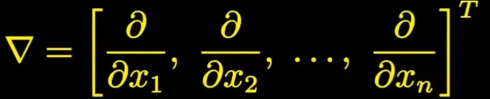

  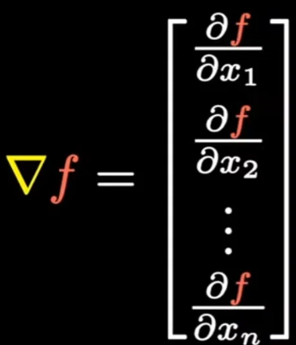

- 散度

  设$$\mathbf{f}$$为向量场，$$\nabla$$与向量场做内积$$\nabla\cdot\mathbf{f}$$，可将向量场变成数量场，运算结果称为散度，散度是这种内积的均值(内积描述两个向量的共线程度)。散度的大小描述了发散的程度；散度是通量的局部描述(通量的体密度)，通量为正表示净流出(源)，通量为负则表示净流入(汇)。

  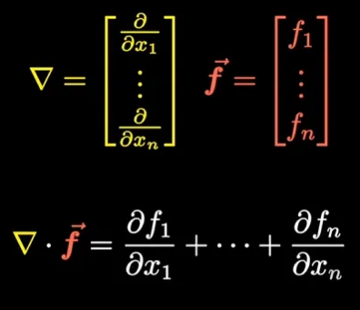

  高斯公式

  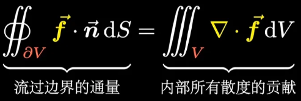

- 旋度

  设$$\mathbf{f}$$为向量场，$$\nabla$$与向量场做外积，可将向量场变成向量场，运算得到的向量场称为旋度，旋度是这种外积的均值(外积描述两个向量的垂直程度)。旋度的大小描述了旋转的程度，是环量的局部描述(环量的面密度)。旋转的方向满足右手螺旋定则。给定不同的轴，可在不同的平面求漩涡强度，旋度描述了最大的可能值和方向 。由于叉乘的特殊性，旋度一般定义在三维空间，若要推广到高维空间，则需要引入外微分等新的概念。

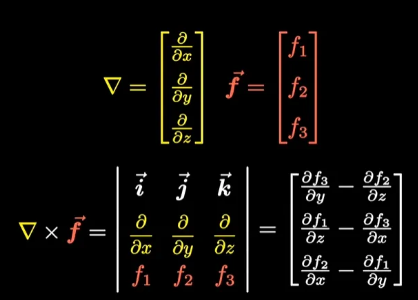

​ ·斯托克斯公式

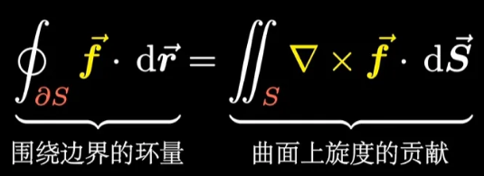

此外，$$\nabla$$可以和自己作内积，对应计算的是梯度的散度；$$\nabla$$可以和自己做外积(结果记为$$\Delta$$，拉普拉斯算子)，得到的是多元函数的二阶导(Hessian 矩阵)

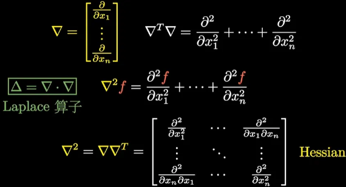

## 2. 基本单元

点电荷之间有库仑力的作用，这种作用通过点电荷激发的电场实现。

电场强度描述空间电场的强弱和方向，通过试验电荷的受力情况，定义了电场强度

$$
\mathbf{E} = \frac{\mathbf{F}}{q_0}
$$

点电荷的场强如下式，在空间中具有球对称性

$$
\mathbf{E} = \frac{Q}{4\pi\epsilon_0 r^2}\mathbf{e_r}
$$

电场线用于可视化描述电场在空间中的分布情况。

---

点电荷之间的静电力由库仑定律定量描述

$$
\mathbf{F*{12}} = \frac{1}{4\pi\epsilon_0}\cdot\frac{q_1q_2}{r*{12}^2}\mathbf{e\_{12}}
$$

其中$$\epsilon_0$$称为真空介电常数，又称真空电容率，其值为$$8.85 \times 10^{-12} \text{C}^2 \cdot \text{N}^{-1} \cdot \text{m}^2$$

---

由一对等量异号点电荷$$q$$组成的电荷系统，当它们之间的距离$$\mathbf{l}$$远远小于它们到所讨论场点的距离$$r$$时，这个电荷对称为电偶极子，用由负电指向正点的矢量$$l$$来表示。

$$\mathbf{p} = q\mathbf{l}$$反映了电偶极子本身的特征，称为电偶极矩，简称电矩。

电偶极子在外电场受力矩作用，该其效果是使电偶极子转向电场$$E$$的方向。

$$
\mathbf{M} = \mathbf{p}\mathbf{\times}\mathbf{E}
$$

电偶极子在外电场中的电势能$$W_e = -\mathbf{p} \cdot \mathbf{E} = -pE\cos\theta$$

载流导线在磁场中受安培力的作用，这种作用运动电荷激发的磁场实现。电流元产生的磁感应强度由毕奥-萨伐尔定律描述

$$
\text{d}\mathbf{B} = \frac{\mu_0}{4\pi}\frac{I\text{d}\mathbf{l \times \mathbf{e_r}}}{r^2}
$$

任意一段载流导线$$L$$在$$P$$点处产生的磁感应强度为

$$
\mathbf{B} = \int_L \text{d}\mathbf{B} = \int_L \frac{\mu_0}{4\pi}\frac{I\text{d}\mathbf{l \times \mathbf{e_r}}}{r^2}
$$

其中$$I\text{d}\mathbf{l}$$称为电流元，$$\mu_0$$称为真空磁导率，其值为$$4\pi \times 10^{-7} \text{N}/\text{A}^2$$

磁感应线用于可视化描述磁场在空间中的分布情况。

---

电流源在磁场中受力为

$$
\text{d}\mathbf{F} = I\text{d}\mathbf{l}\times\mathbf{B}
$$

运动电荷激发的磁场对置于其中的其它运动电荷产生磁场力$$\mathbf{F_m}$$(简称磁力，也称洛伦兹力)的作用

$$
\mathbf{F_m} = q \mathbf{v} \times \mathbf{B} = qvB\sin \theta
$$

---

圆电流又称为磁偶极子，为描述其磁学特性，引入了磁偶极矩$$\mathbf{m}$$(简称磁矩)。设平面圆电流由$$N$$匝导线构成，电流大小为$$I$$，面积为$$S$$，$$\mathbf{e_n}$$为平面正法线方向的单位磁矩$$\mathbf{m} = NIS\mathbf{e_n}$$。

磁场对磁偶极子有磁力矩$$\mathbf{M}$$的作用，其效果为使磁矩的方向转向磁感应强度$$\mathbf{B}$$的方向(磁场对磁矩的取向作用)。

$$
\begin{align*}M &= mNISB\sin \theta \\ \mathbf{M} &= \mathbf{m} \times \mathbf{B}\end{align*}
$$

电场力、磁场力、电场强度、磁感应强度均满足叠加原理，理论上对于任意带电体，都可通过微积分的方式计算得出。对于一些对称性质较好的几何形体，结果表达形式简单，可以当作二级结论。

电流的微观理解

电路中有电流$$I$$，定义为单位时间内通过导体某一截面的电荷量，是电流密度$$J$$的面积分。电流密度是微观层面为了描述电流在导体内各点的分布而定义的物理量

$$
\mathbf{J} = nq\mathbf{v_D}
$$

由此，通过导体内任一曲面的电流可表示为

$$
I = \frac{\Delta Q}{\Delta t} = nqSv_D = \int_S \mathbf{J} \cdot \text{d}\mathbf{S}
$$

导体中不同位置的电流密度构成电流场，电流即为电流场在某一面积上的通量，再根据电流的定义式，有如下的电流连续性方程

$$
I = \oint*S \mathbf{J} \cdot \text{d}\mathbf{S} = -\frac{\text{d}q*内}{\text{d}t}
$$

根据电荷守恒定律，对于恒定电流，任意封闭曲面内的电荷量并不随时间改变，这一特点可用如下的恒定电流条件来描述

$$
\oint\mathbf{J} \cdot \text{d}\mathbf{S} = 0
$$

方向判定

- 左手定则：用于确定载流导体和运动电荷在磁场中的受力方向。

  伸平左手使拇指与四指垂直，磁感线垂直穿过手心，四指的方向与导体中电流方向或正电荷运动方向一致，则拇指所指的方向即为导体在磁场中受力的方向。

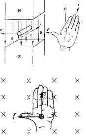

- 右手定则：用于确定磁场中运动导体的感应电势方向。伸平右手使拇指与四指垂直，磁感线垂直穿过手心，姆指的方向与导体运动的方向一致，四指所指的方向即为导体中感应电流的方向(感应电动势的方向与感应电流的方向相同)。

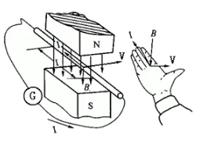

- 安培定则：又称右手螺旋定则，用于表示电流和电流激发磁场的磁场方向间关系的定则，安培定则有直导线和通电螺线管两种描述方式。

  在磁铁内部，磁感线由 S 极指向 N 极，在磁铁外部，则由 N 极指向 S 极

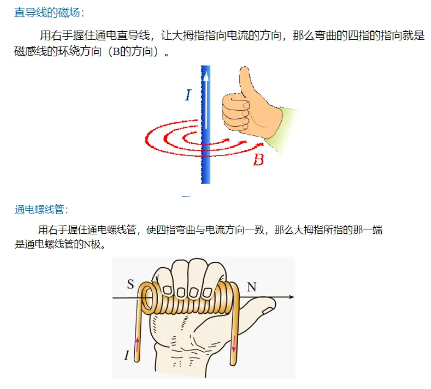

## 3. 基本定理

电场强度和磁感应强度的面积分，线积分满足一些定律，也反映出场本身的性质。通量是一个标量，其正负取决于面元法线方向的选取。

电场有静电场和感生电场之分。电场强度的面积分是电通量，电场强度的线积分是电势。

静电场满足静电场电场高斯定理，该定理给出了静电场和场源电荷之间的关系，说明静电场是有源场。

$$
\mathbf{\Phi_e} = \oint_{S} \mathbf{E} \cdot \text{d}\mathbf{S} = \frac{1}{\epsilon_0} \Sigma q_\text{内}
$$

实验证明静电场是保守场(做功与路径无关)，满足静电场环路定理，该定理说明静电场是无旋场，同时说明了静电场电场线不能构成闭合曲线。

$$
\oint_L \mathbf{E}\cdot \text{d}\mathbf{l} = 0
$$

---

麦克斯韦提出了感生电场的假设，感生电场提供了产生感应电动势的非静电力。

感生电场同样满足感生电场高斯定理，该定理说明感生电场是无源场，其本质就是

$$
\oint_S \mathbf{E_k} \cdot \text{d}\mathbf{S} = 0
$$

感生电场环路定理的本质，就是变化的磁场产生电场，该定理说明感生电场是有旋场，同时说明了感生电场电场线是闭合曲线。

$$
\oint_L \mathbf{E_k} \cdot \text{d}\mathbf{l} = -\int_S \frac{\partial \mathbf{B}}{\partial t} \cdot \text{d}\mathbf{S}
$$

---

空间中的总电场为静电场和感生电场的叠加，可得总电场的高斯定理和环路定理，也就是麦克斯韦方程组中关于电场的两个基本方程式。

$$
\begin{align*} \oint*S\mathbf{E} \cdot \text{d}\mathbf{S} &= \frac{1}{\epsilon_0}\mathbf{\sum }q*{i 内} \\ \oint_L \mathbf{E} \cdot \text{d}\mathbf{l} &= -\int_S\frac{\partial\mathbf{B}}{\partial t} \cdot \text{d}\mathbf{S} \end{align*}
$$

电流有恒定电流和位移电流(非恒定 i 电流)之分。磁场强度的面积分是磁通量，磁场强度的线积分是磁势。

磁场满足磁场高斯定理，该定理说明了磁感应线为无头无尾的闭合曲线，故穿过任意封闭曲面的磁通量为零，说明磁场是无源场。

$$
\oint_S \mathbf{B} \cdot \text{d}\mathbf{S} = 0
$$

恒定电流的磁场满足安培环路定理，该定理给出了磁感应强度与路径所包围的闭合电流(只有闭合回路才能产生恒定电流)之间的关系，说明恒定电流产生的磁场是有旋场。

$$
\oint*L \mathbf{B}\cdot\text{d}\mathbf{l} = \mu_0 \sum I*内
$$

---

对于非恒定电流，定义了位移电流的概念。位移电流可用于统一电路中诸如电容器这样的不连续部分。

$$
I_d = \int_S\frac{\partial\mathbf{D}}{\partial t}\cdot \text{d}\mathbf{S}
$$

---

传导电流和位移电流的总和定义为全电流，相应的电流密度矢量表示为

$$
\mathbf{J_s} = \mathbf{J_c} + \frac{\partial \mathbf{D}}{\partial t}
$$

全电流是恒定连续的，同时把安培环路定理推广到全电流，得到普遍意义的安培环路定理，其本质就是变化的电场产生磁场。

$$
\begin{align*} \oint_S \left(\mathbf{J_c} + \frac{\partial \mathbf{D}}{\partial t} \right) \cdot \text{d}\mathbf{S} &= 0 \\
\int_S \left(\mathbf{J_c} + \frac{\partial \mathbf{D}}{\partial t} \right) \cdot \text{d}\mathbf{S} &= \oint_L \mathbf{H}\cdot\text{d}\mathbf{l} \end{align*}
$$

此部分的结尾，献上电磁学最美的方程组——麦克斯韦方程组

积分形式：

$$
\begin{align*}\oint_{L} \mathbf{E} \cdot d\mathbf{l} &= -\int_{S}  \frac{\partial\mathbf{B}}{\partial t}  \cdot d\mathbf{S} \\

\oint_{L} \mathbf{H} \cdot d\mathbf{l} &= \int_{S} \mathbf{J_c} \cdot \text{d}\mathbf{S} + \int_{S}\frac{\partial\mathbf{D}}{\partial t}   \cdot d\mathbf{S} \\

\oint_{S} \mathbf{D} \cdot d\mathbf{S} &= \int_{V} \rho \, dV = q_0\\

\oint_{S} \mathbf{B} \cdot d\mathbf{S} &= 0\end{align*}
$$

微分形式：

$$
\begin{align*}\nabla \times \mathbf{E} &= -\frac{\partial \mathbf{B}}{\partial t} \\

\nabla \times \mathbf{H} &= \mathbf{J_c} + \frac{\partial \mathbf{D}}{\partial t} \\

\nabla \cdot \mathbf{D} &= \rho_0 \\

\nabla \cdot \mathbf{B} &= 0\end{align*}
$$

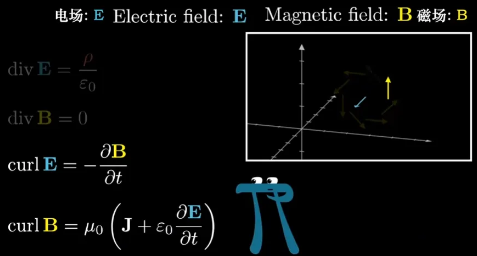

感应电势部分

磁通量变化产生感应电动势，定量描述为法拉第电磁感应定律；当闭合回路有$$N$$匝时，$$\Sigma_{i=1}^N \Phi_i$$称为全磁通，当通过每一匝回路的磁通量均为$$\Phi$$时，穿过$$N$$匝线圈的总磁通为$$\Psi = N\Phi$$称为磁链。

$$
\begin{aligned} &\epsilon = -\frac{\text{d}\Phi}{\text{d}t}\\ &\epsilon = -\frac{\text{d}\Psi}{\text{d}t} = -N\frac{\text{d}\Phi}{\text{d}t} \end{aligned}
$$

闭合回路中感应电流的方向，总是使它所激发的磁场穿过回路自身的磁通量阻止原磁通量的变化，这称为楞次定律。

感应电动势分为感生电动势和动生电动势两类。

单纯由导体运动产生的感应电动势称为动生电动势，起源于洛伦兹力

$$
\epsilon = \int_a^b(\mathbf{v} \times \mathbf{B}) \cdot \text{d}\mathbf{l}
$$

导体回路不动，导体回路所在位置处的磁场所施加变化所产生的感应电动势称为感生电动势，起源于变化磁场产生的感生电场$$\mathbf{E_k}$$。

$$
\epsilon = -\int_S \frac{\partial \mathbf{B}}{\partial t} \cdot \text{d}\mathbf{S}
$$

自感和互感

当线圈中通有电流$$I$$时，其产生的磁场在自身回路也会产生磁通量$$\Psi$$，当$$I$$变化时，会在自身回路产生感应电动势，这种现象称为自感，相应的电动势称为自感电动势。

由毕奥-萨伐尔定律对$$N$$匝回路：$$\Psi = N\Phi = LI$$

$$
\epsilon_L = -\frac{\text{d}\Psi_L}{\text{d}t} = -N\frac{\text{d}\Phi_L}{\text{d}t}= -\left(L \frac{di}{dt} + I \frac{dL}{dt}\right)
$$

其中$$L$$称为线圈的自感系数，简称自感；自感系数仅由线圈的匝数，几何形状和磁介质的磁导率决定，与线圈电压和电流及频率无关，单位为亨

$$
 L = \frac{N \Phi}{I} = \frac{N F}{I R_m} = \frac{N IN}{I R_m} = \frac{N^2}{R_m} = N^2 \frac{\mu A}{l}
$$

当周围介质磁导率不变时，自感电动势为

$$
\epsilon_L = -L\frac{\text{d}I}{\text{d}t}
$$

与自感类似，两个彼此靠近的线圈会产生互感，即一个电路中电流变化在相邻电路中引起感应电动势的现象，相应的电动势称为互感电动势。

$$
\Psi*{21} = \mathbf{M*{21}}I*1 \\ \Psi*{12} = \mathbf{M*{12}}I_2 \\ M*{21} = M\_{12} = M
$$

同理，当周围介质磁导率不变时，互感电动势为

$$
\epsilon*{21} = -M\frac{\text{d}I_1}{\text{d}t} \\ \epsilon*{12} = -M\frac{\text{d}I_2}{\text{d}t}
$$

## 4. 势与能量

势是从能量角度研究电势是一个标量场，磁势是一个向量场。

静电场是保守场，保守力做功与位置无关，且做功等于相应势能的减少，因此可以引入电势能的概念。电势能是试验电荷和场源电荷共有的，为了直接反映电场的性质又定义了电势。在规定零势能点的前提下，电势和电势能都是位置的函数。

$$
\phi = \frac{W*e}{q_0}\\ \phi_a = \int*{a}^{电势零点}\mathbf{E} \cdot \text{d}\mathbf{l}
$$

以无限远处为电势零点，距离点电荷$$q$$为$$r$$处的电势为

$$
\phi = \int\_{r}^{\infty} \frac{q}{4\pi \epsilon_0 r^2}\text{d}r = \frac{q}{4 \pi \epsilon_0 r}
$$

电势可由电场强度求线积分得到，反过来，电势分布求梯度得到电场强度分布

$$
U*{ab} = \int*{a}^{b}\mathbf{E} \cdot \text{d}\mathbf{l} \\\mathbf{E} = -\nabla\phi
$$

---

静电场能量密度为

$$
w_e = \frac{1}{2}\epsilon \mathbf{E}^2 = \frac{1}{2}\mathbf{D}\cdot \mathbf{E}
$$

电荷系具有静电能，对于$$n$$个点电荷组成的电荷系和连续分布的带电体，其静电能分别为

$$
\begin{align*}W_e &= \frac{1}{2}\mathbf{\sum}q_i\phi_i \\ W_e &= \frac{1}{2}\int_q \phi \text{d}q\end{align*}
$$

---

电源的工作原理是靠其它形式的力做功，把其它形式的能量转化为电能补充给回路，使正电荷逆着静电场的方向运动。这种其它形式的力统称非静电力$$\mathbf{F_k}$$。类比于静电场场强的概念可定义非静电场场强$$\mathbf{E_k}$$

$$
\mathbf{E_k} = \frac{\mathbf{F_k}}{q}
$$

非静电力做功的本领用电动势$$\mathbf{\epsilon}$$来定量描述

$$
\mathbf{\epsilon} = \int\_-^+ \mathbf{E_k}\cdot \text{d}\mathbf{l}
$$

磁场是非保守场，对应的磁势是磁场强度在路径上的线积分，表示磁场强度的源头；磁场则是磁势的旋度。磁势的单位是安匝。

$$
\mathbf{B} = \nabla \times \mathbf{F_m}
$$

磁压降可由磁场强度求线积分得到

$$
U_m = \int_a^b \mathbf{H} \cdot \text{d}\mathbf{l}
$$

---

磁场能量密度为

$$
w_m = \frac{1}{2}\frac{B^2}{\mu} = \frac{1}{2}BH = \frac{1}{2}\mu H^2 = \frac{1}{2}\mathbf{B}\cdot \mathbf{H}
$$

若空间同时存在电场和磁场且知道其分布，则任意位置总能量密度可表示为

$$
w = \frac{1}{2}\mathbf{B} \cdot \mathbf{H} + \frac{1}{2}\mathbf{D} \cdot \mathbf{E}
$$

## 5. 考虑介质

传导电荷能力较弱的物质称为电介质。理想的电介质内部没有可以自由运动的电荷，电介质进入电场后，分子的正负电中心会拉开一定距离，整个分子等效为一个电偶极矩，在电介质表面形成束缚电荷，这种现象称为极化。这种等效的电偶极矩会反过来影响电场，影响的程度用相对介电常数$$\epsilon_r$$来衡量。

---

用电极化强度$$\mathbf{P}$$(单位体积内电矩矢量和)来定量描述电介质内各处极化的情况，其中$$\Delta V$$为宏观上无限小微观上无限大的体积元

$$
\mathbf{P} = \frac{\sum \mathbf{p}\_i}{\Delta V}
$$

当外电场不太强时，各向同性电介质的电极化强度$$\mathbf{P}$$与$$\mathbf{E}$$呈线性关系，令电极化率 $$\chi_e = \epsilon_r - 1$$

$$
\begin{align*} \mathbf{P} &= \epsilon_0(\epsilon_r - 1)\mathbf{E} \\ &= \epsilon_0\chi_e\mathbf{E} = \chi_e\cdot\frac{\mathbf{D}}{\epsilon_r} \end{align*}
$$

---

有电介质存在时，束缚电荷$$q'*\text{内}$$会产生附加电场$$\mathbf{E'}$$，计算总场强通量时需要同时考虑高斯面内的自由电荷$$q*{0内}$$和束缚电荷$$q'_{内}$$，高斯定理修正为

$$
\oint*S \mathbf{E} \cdot \text{d}\mathbf{S} = \frac{1}{\epsilon_0} \sum (q*{0 内} + q'\_内)
$$

电极化强度通量与束缚电荷分布有如下关系

$$
\oint*S\mathbf{P}\cdot \text{d}\mathbf{S} = - \sum q'*\text{内}
$$

引入辅助量电位移$$\mathbf{D}$$

$$
\mathbf{D} = \epsilon_0 \mathbf{E} + \mathbf{P} = \epsilon_0 \epsilon_r \mathbf{E} = \epsilon \mathbf{E}
$$

代入修正后的高斯定理

$$
\oint*S \mathbf{D} \cdot \text{d}\mathbf{S} = \sum q*{0 内}
$$

当电流或运动电荷近旁存在介质或磁性材料时，电流或运动电荷本身产生的磁场本身会受到影响，影响的程度用相对磁导率$$\mu_r$$来衡量。在各向同性的磁介质均匀充满磁场的情况下，其内部的磁感应强度是真空时的$$\mu_r$$倍。

---

用磁化强度$$\mathbf{M}$$(单位体积内磁矩矢量和)来定量描述磁介质被磁化的强弱程度，其中$$\Delta V$$为宏观上无限小微观上无限大的体积元

$$
 \mathbf{M} = \frac{\sum \mathbf{m_i}}{\Delta V}
$$

在各向同性的均匀磁介质中，磁化强度与磁场强度成正比，令磁化率$$\chi_m = \mu_r  -1$$

$$
\begin{align*} \mathbf{M} &= \frac{1}{\mu_0}\left( 1 - \frac{1}{\mu_r} \right)\mathbf{B} \\ &= \frac{1}{\mu_0}\left( \frac{\chi_m}{\chi_m + 1} \right) =\chi_m \mathbf{H} \end{align*}
$$

---

磁介质在外磁场中时，其磁介质表面有一层等效的磁化电流(又称束缚电流)，总磁场由自由电流$$I_0$$和磁化电流$$I'$$共同产生，安培环路定理修正为

$$
\oint*L \mathbf{B}\cdot\text{d}\mathbf{l} = \mu_0 \sum( I*内 + I'\_内)
$$

磁介质被磁化后，在磁介质表面有一层等效的磁化电流(又称束缚电流)，总磁化电流$$I'$$满足如下关系

$$
\oint*L \mathbf{M} \cdot \text{d}\mathbf{l} = \sum I'*{内}
$$

引入辅助量磁场强度$$\mathbf{H}$$

$$
\mathbf{H} = \frac{\mathbf{B}}{\mu_0} - \mathbf{M} = \frac{\mathbf{B}}{\mu_0 \mu_r} = \frac{\mathbf{B}}{\mu}
$$

代入修正后的安培环路定理，本质上描述了电生磁的现象

$$
\oint*L\mathbf{H} \cdot \text{d}\mathbf{l} = \sum I*{0 内} = IN,其中 N 为匝数
$$

## 参考资料

[梯度散度旋度](https://www.bilibili.com/video/BV1a541127cX/?vd_source=1d0891b41fe4e23dbf197eaf61dfa468)

[麦克斯韦方程组的描述语言](https://www.bilibili.com/video/BV19s41157Z4/?spm_id_from=333.999.0.0&vd_source=1d0891b41fe4e23dbf197eaf61dfa468)
