## 问题

1. 网络标签为什么一移动就会连不上？
2. 板子和 3D 元件的原点？
3. Net Classes，比如 PWR，怎么在原理图这边设置，不然每次从原理图更新 PCB，都会问我要不要 Remove PWR。类的作用主要是为了应用不同的规则对吗？每次都要取消勾选添加 add room 和 remove class？
4. 四层板的 signal 层设计？
5. 电源是否走过孔的问题：根据情况取舍，理论上讲过孔处的发热相对更多？以及有时不能分割地平面(作阻抗匹配的参考平面时)？对于电源平面的要求是尽可能整块整块的？信号线能不打孔就不打孔，电源能打孔就打孔；是因为打孔有阻抗突变，信号完整性受损？电源的过孔推荐打大一些，0.3-0.5 左右，可打密集阵列？
6. 为什么说 CMOS 芯片的背后不建议放元件？那其它的芯片，比如 MCU 后面能放嘛？
7. 为什么板子周围打细小通孔可以抗外界干扰？晶振周围打孔也是这个原因？
8. 视图选项卡中的板子规划模式用来干嘛的？
9. 差分对中的缝合孔是啥？
10. AD 的 xsignals 怎么用
11. 四种阻抗模式怎么选
12. 需求阻抗从哪里查到？
13. 为什么是 10uF 和 100nF
14. 扇孔通俗理解就是拉线打过孔，多层板走线就近打孔，可以缩短回流路径减少干扰。差分信号换层时，其换层过孔附近必须添加 GND 过孔，保证其回流路径短。回流路径到底是哪个
15. 试一试四层板、分割平面、泪滴、曲线走线、扇出、Gerber、多根走线、弯的走线
16. 推荐的好用设置，原理图优先项、PCB 优先项、tp 打开首选项，都是什么，推荐的首选项设置。过孔规则设置后需要 tp 进入默认设置，改过孔对应的默认设置？太麻烦了。过孔规则设置后需要 tp 进入默认设置，改过孔对应的默认设置

**画 3.0Hub**

**优秀工程学习并搞懂原理**

**数据手册读懂**

## USB3Hub

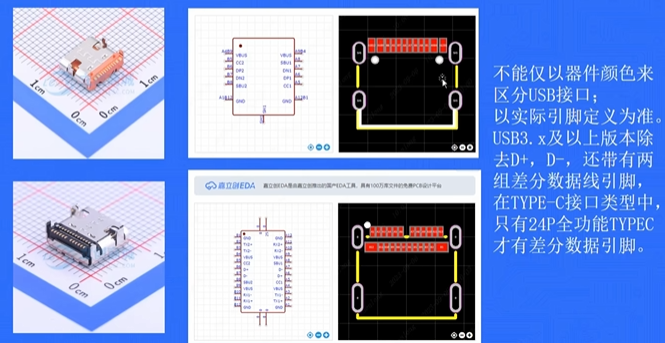

没有别的主控和干扰源，不用区分数字地和模拟地

SPI 片选引脚的共享引脚，用于连接外部 flash

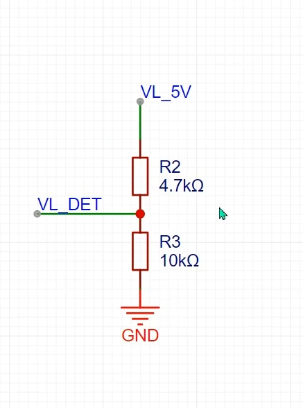

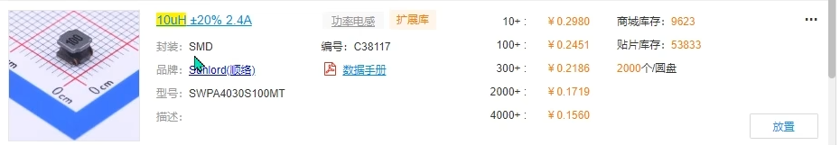

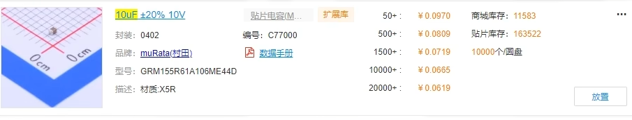

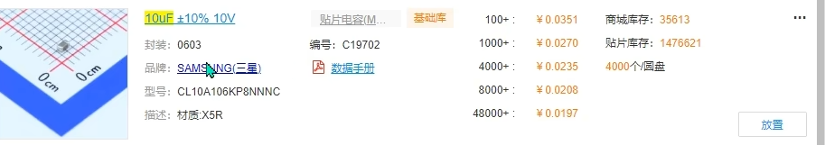

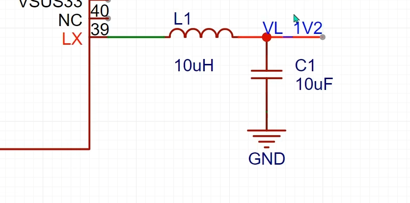

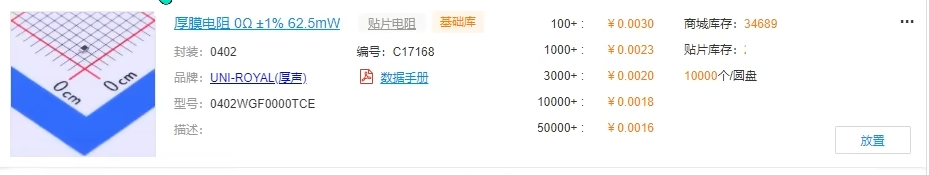

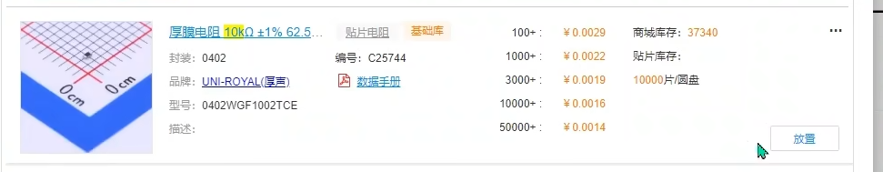

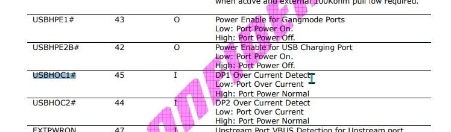

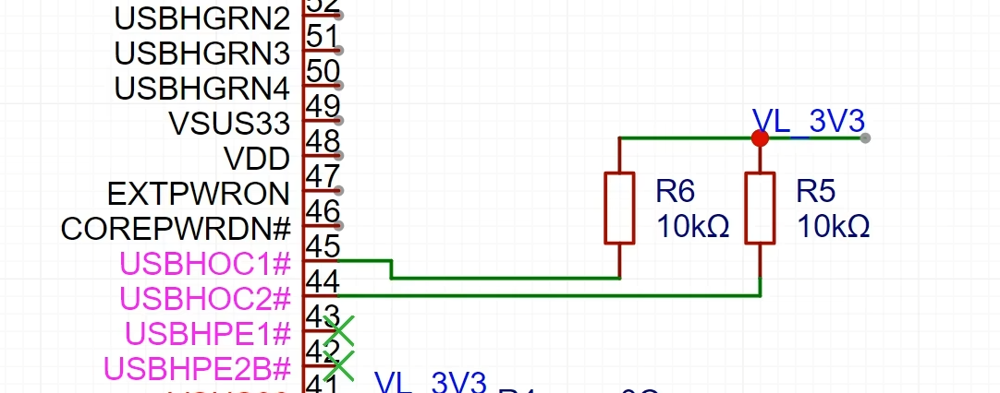

(不检测过流了)

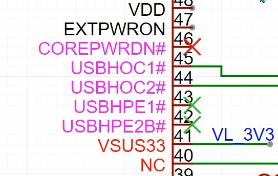

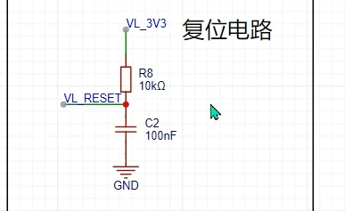

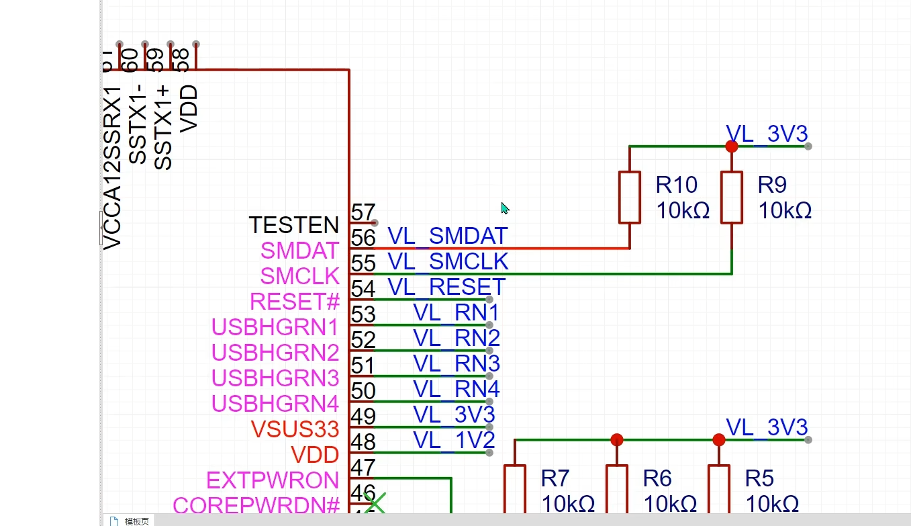

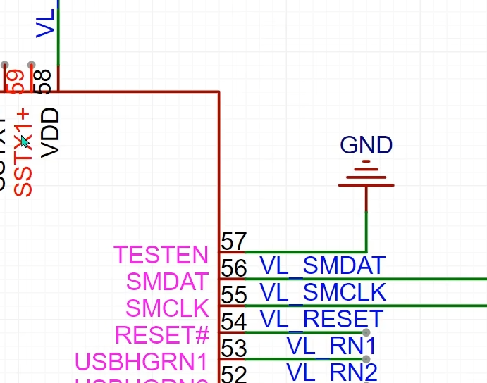

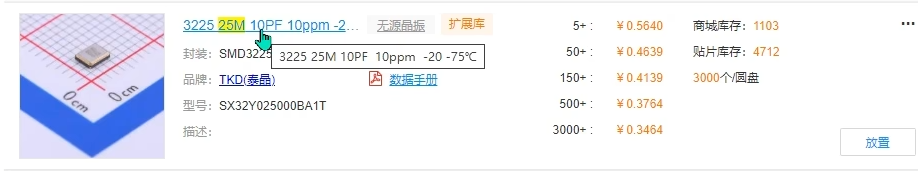

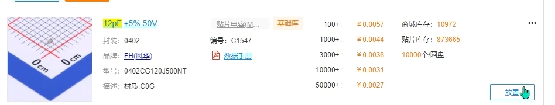

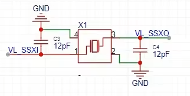

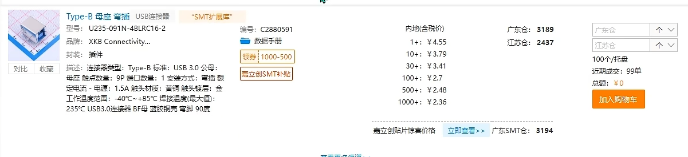

上行--输入，下行--输出

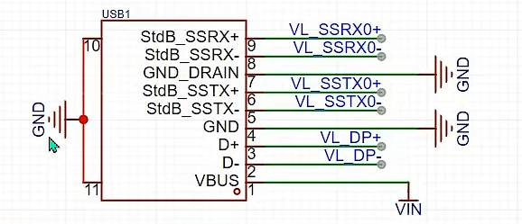

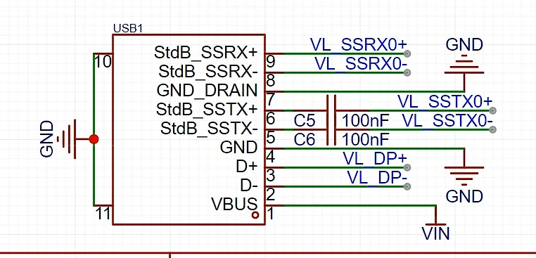

TVS：瞬态抑制二极管，防止静电；选择反相截止大于等于 5V 的，接口正常工作是 5V，这样正常工作时 TVS 不工作。漏电流小。TVS 的原理？

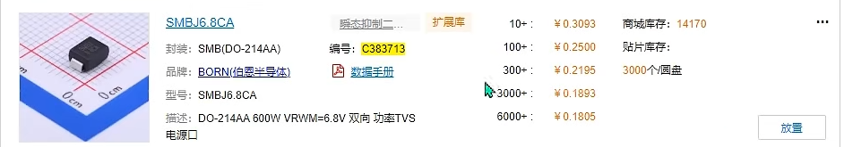

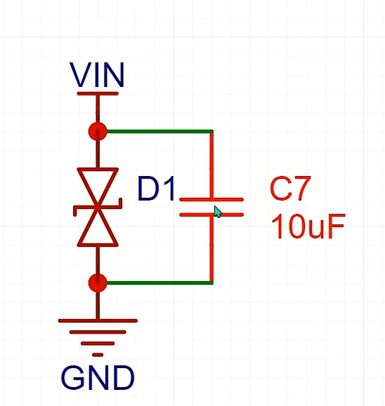

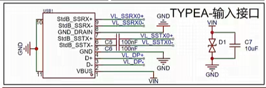

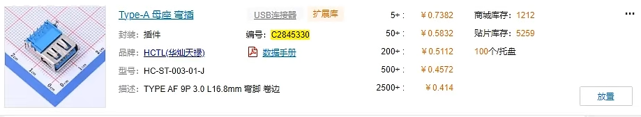

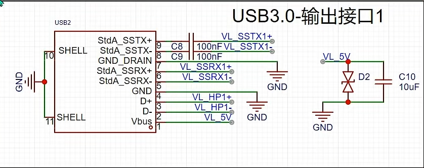

电脑 USB3 的 type-c 接口一般输出 1A 左右的电流，如果 Hub 接的负载比较大，可能会损坏电脑接口，因此加限流保护芯片

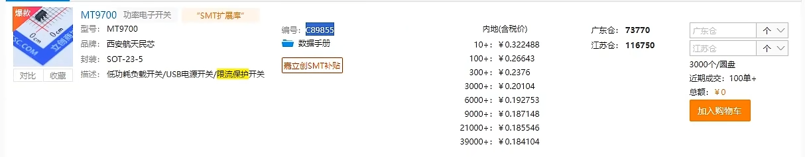

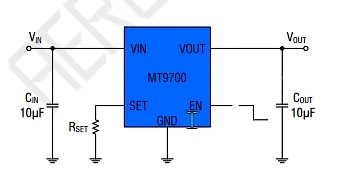

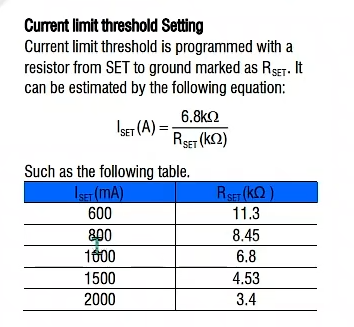

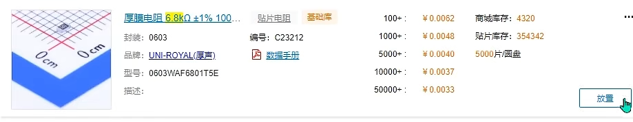

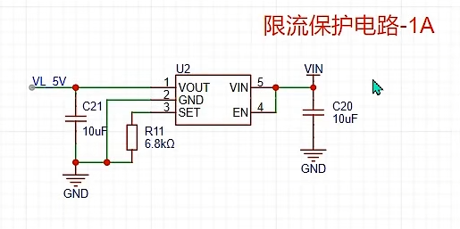

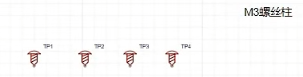

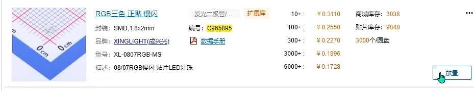

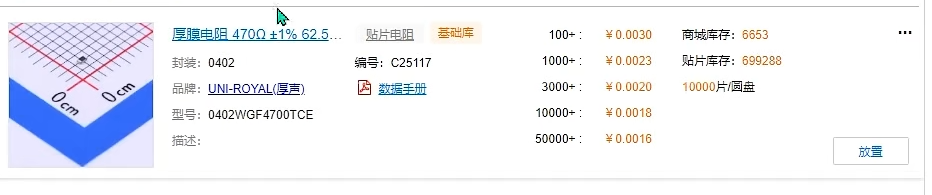

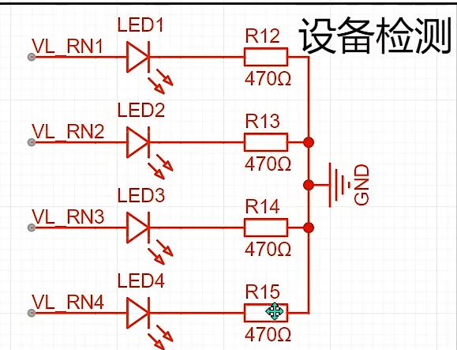

## 跳转点
