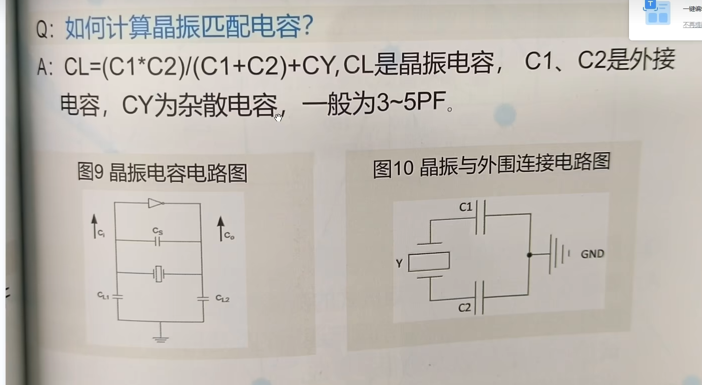

## 问题

1. Net Classes，比如 PWR，怎么在原理图这边设置，不然每次从原理图更新 PCB，都会问我要不要 Remove PWR。类的作用主要是为了应用不同的规则对吗？每次都要取消勾选添加 add room 和 remove class？
2. 电源是否走过孔的问题：根据情况取舍，理论上讲过孔处的发热相对更多？以及有时不能分割地平面(作阻抗匹配的参考平面时)？对于电源平面的要求是尽可能整块整块的？信号线能不打孔就不打孔，电源能打孔就打孔；是因为打孔有阻抗突变，信号完整性受损？电源的过孔推荐打大一些，0.3-0.5 左右，可打密集阵列？
3. 为什么说 CMOS 芯片的背后不建议放元件？那其它的芯片，比如 MCU 后面能放嘛？
4. 视图选项卡中的板子规划模式用来干嘛的？
6. AD 的 xsignals 怎么用
7. 四种阻抗模式怎么选
8. 视频为什么是 10uF 和 100nF
9. 试一试四层板、分割平面、泪滴、曲线走线、扇出
10. 电阻电容电感值是怎么看的
11. 匹配BOM时，同一封装不同容值的电容，一定要自己手动编辑？
12. 电源芯片的推荐布局怎么看，怎么实现到电路板上
13. CMOS板子画好了怎么调

想给电源层画成不同的区域怎么办？

**优秀工程学习并搞懂原理**

**数据手册读懂**

## USB3Hub

芯片内部的数字地和模拟地要分开是因为芯片本身对电源的要求比较高

SPI 片选引脚的共享引脚，用于连接外部 flash

TVS：瞬态抑制二极管，防止静电；选择反相截止大于等于 5V 的，接口正常工作是 5V，这样正常工作时 TVS 不工作。漏电流小。TVS 的原理？

电脑 USB3 的 type-c 接口一般输出 1A 左右的电流，如果 Hub 接的负载比较大，可能会损坏电脑接口，因此加限流保护芯片

## 跳转点

ldo没有太多噪声，逻辑门和运放也没有

还有是逆变和斩波的，因为原理就是会对

输入输出的大电流的要小心

先分析影响源

都当电阻看，电阻大小和长度有关

避免环地

星形接地最理想，也能实现比较好的效果，纯模拟

面积大好的原因是阻抗小

一个是走线的关系，大电流，交变，和芯片以及其他线路的关系

阻抗匹配

buck电感，

电源区域的问题

法拉第笼原理

多画

对电源的要求高，网口变压器
因为大的滤波电容和电感做不到芯片里面去，所以要引出VA，VD，AGND，DGND等，在外边儿处理

谁他妈叫你创新的，我真操了，他妈的芯片上就只有一组外界的接口，我真他妈服了我操。。。

type-c也是，不要想当然地认为它就是这么实现的

看看别人的机构，别人怎么画的

先布局、再按据阻抗匹配设置规则、完成层叠设计

连接杂线，跨越板子的线扇出，注意过孔更不要将参考平片割裂，晶振走内差分，芯片电源线向内扇出、然后走差分线，电源线加宽

电源分割：https://blog.csdn.net/Mark_md/article/details/116570283

宇哥的板子都是信号层，不用完整的内电层作阻抗匹配嘛

圆角走线和铺铜，shift + space切换

删除孤铜，铺铜时勾选即可

ui差分对布线

view config可隐藏铺铜

shift+s以及透明度调整可以观察铺铜后的情况

内电层的分割，PL放置线条

加泪滴te

圆弧走线

等长调节要放在发送侧

ur网络等长调节

差分线加过孔以及等长调节

调节丝印

差分走线的共面差分阻抗匹配和等长调节：先设置线宽确保和计算值一致，然后再预留过孔的情况下走线，然后等长调节，最后补过孔包地

最后加泪滴

元器件和走线和板框边缘要保持一定距离

DC-DC和晶振
