信号与系统，是为了应用强大的数学以及其它科学理论，而对物理世界做的一种抽象。

## 第一章 基本运算之卷积

卷积，是一种用来组合数组和函数的方法，从直观上来说就是翻转、滑动、叠加，本质上是一种加权求和。卷积的信号可以认为是卷积核，根据核的不同数据特点，会对被卷积的信号作不同处理。在图像处理、多项式乘法、随机变量求和等方面，都是核心的方法。

$$
f_g(t) = \int_{-\infty}^{\infty} f(\tau) g(t - \tau) d\tau
$$

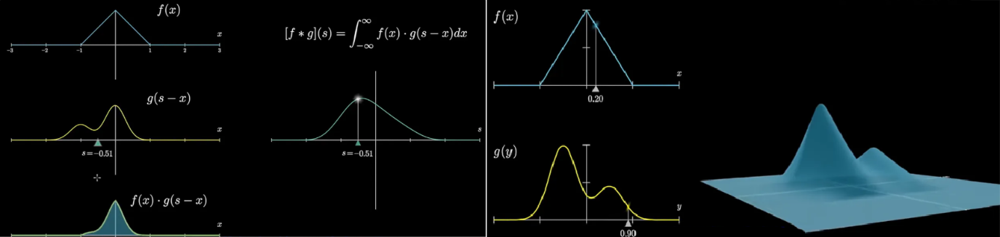

用单位冲激响应表示系统响应，就是通过卷积完成的。连续域叫卷积积分，离散域叫卷积和。

$$
\begin{aligned} &y(t) = x(t)_h(t) = \int_{-\infty}^{+\infty}x(\tau)h(t - \tau)d\tau \\ &y[n] = x[n]_h[n] = \sum_{k = - \infty}^{+\infty}x[k] h[n - k] \end{aligned}
$$

## 第二章 连续与离散信号

大部分信号以时间为独立变量，在此基础上，根据信号是否连续可以把时间信号分为连续时间信号和离散时间信号（不以时间为变量的信号也有，比如图像，但不是此处讨论的重点）。自然界的信号一般是连续的，由计算机产生的信号一般是离散的，另外，对连续信号按照一定的周期进行采样，得到的信号也是离散的。

在信号与系统的理论中，连续时间信号与离散时间信号的地位是对等的，在连续域存在的性质，在离散域几乎都有同样的性质与之对应。连续信号经过采样得到离散信号，离散信号经过重建得到连续信号，其中的理论基础就是采样定理。

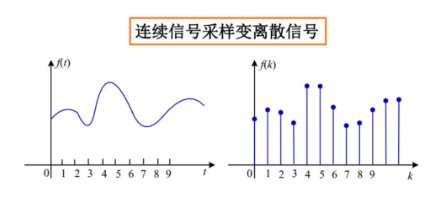

### 2.1 采样定理

设$$x(t)$$时某一带限信号，在$$ \vert \omega \vert > \omega_M$$时，$$X(j\omega) = 0$$。如果$$\omega_s > 2\omega_M$$（奈奎斯特采样频率），其中$$\omega_s = \frac{2\pi}{T}$$，那么$$x(t)$$就唯一地由样本$$x(nT)$$所确定。样本值形成一个冲激串，将其通过一个增益为$$T$$，截止频率大于$$\omega_M$$而小于$$\omega_s - \omega_M$$的理想滤波器，输出就是$$x(t)$$。欠采样（$$\omega_s \le 2\omega_M$$）会导致混叠现象。

### 2.2 采样与重建

最常见的采样方式是冲激串采样

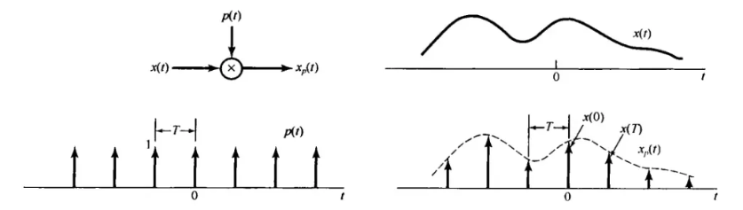

$$
\begin{aligned}
&p(t) = \sum_{k = -\infty}^{+\infty} \delta(t - nT) \\
&x_p(t) = x(t)p(t) = \sum_{k = -\infty}^{+\infty}x(nT)\delta(t - nT) \\
&P(j\omega) = \frac{2\pi}{T} \sum_{k=-\infty}^{+\infty}\delta(\omega - k\omega_s) \\
&X_p(j\omega) = \frac{1}{T}\sum_{k=-\infty}^{+\infty}X(j(\omega - k\omega_s))
\end{aligned}
$$

此外还有零阶保持采样

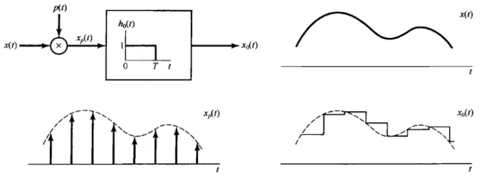

重建是一个插值的过程，零阶保持是一种粗糙的内插，更精准的方式有一阶保持（线性内插）、高阶保持（高阶多项式内插）。

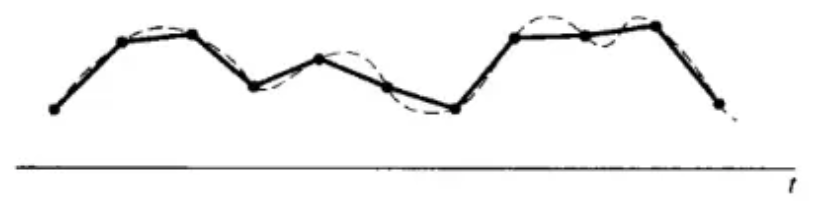

从频域上的冲激串看，滤波也可以实现对信号的重建

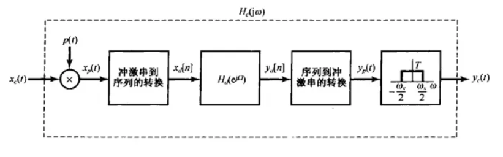

### 2.3 连续信号的离散处理

这部分工作在工程中主要由传感器或专门的数模、模数转换器完成。

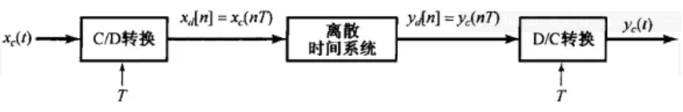

## 第三章 信号基本性质

### 3.1 自变量的变换

该性质与数学中函数自变量的变换完全类似。

### 3.2 周期信号

$$
\begin{aligned}x(t) &= x(t+T)\\ x[n] &= x[n + N]\end{aligned}
$$

使上式成立的最小正值$$T/N$$称为基波周期

周期性，也是一个比较直观的性质；值得注意的是，在周期性上，连续时间信号和离散时间信号有较大的区别。简单理解就是，对周期信号进行采样的结果，不一定是周期信号。

连续时间复指数信号和离散时间复序列的周期性质比较

- 对连续时间复指数信号：

  - $$\omega _0$$越大，信号振荡的速率越高；不同$$\omega _0$$对应不同信号
  - $$e^{j\omega_0t}$$对任何$$e^{j\omega_0t}$$都是周期的

- 对离散时间复指数序列：
  - $$\omega _0$$对应的信号与$$\omega _0 + 2k\pi$$对应的信号完全相同；$$\omega _0$$从 0 到$$\pi$$振荡速度逐渐加快，从$$\pi$$到$$2\pi$$振荡速度逐渐减慢，因此复指数序列的低频部分在$$\pi$$的偶数倍附近，高频部分在$$\pi$$的奇数倍附近
  - $$\omega_0N$$必须为$$2\pi$$整数倍时，$$e^{j\omega_0n}$$才是周期的；因为需要$$e^{j\omega_0N} = 1$$；一种理解方式是，对周期信号进行采样，只有采样周期和原信号周期对应上时，采样结果序列才是周期的。
  - 基波周期$$N = m\frac{2\pi}{\omega_0}$$， m 为使 N 为整数的最小整数

### 3.3 信号的能量

信号的能量和功率，是一种抽象的概念，可以类比于实际存在的能量进行理解；笔者水平和经历有限，暂未对这一概念有更深入的理解。

对任何连续时间信号$$x(t)$$或离散时间信号$$x[n]$$采用广义上的功率和能量（把信号看成复数值往往更加方便），在$$t_1 \le t \le t_2$$内的总能量定义为

$$
\begin{aligned}E &= \int_{t_1}^{t_2} \vert x(t) \vert ^2 \, \text{d}t \\ E &= \sum_{n=n_1}^{n_2} \vert x[n] \vert ^2\end{aligned}
$$

分别除以时间长度$$t_2 - t_1$$和区间内点数$$n_2 - n_1 + 1$$可得在该区域内的平均功率。

由趋于$$\infty$$时功率和能量的概念，可以把信号分为三类，即能量信号（能量有限，平均功率为 0），功率信号（能量无限，平均功率有限），非能量非功率信号（能量和平均功率均无限）

## 第四章 典型信号

单位冲激信号，单位阶跃信号，单位斜坡信号，单位加速度信号；复指数信号，正弦信号。

### 4.1 典型信号的价值

1. 单位冲激信号：在线性时不变系统中，可以由单位冲激信号构成一切信号。同时，单位冲激响应可以代表系统特性。用$$h_k[n]$$表示线性系统对移位单位脉冲$$\delta[n-k]$$的响应

$$
\begin{aligned}y(t) &= x(t)_h(t) = \int_{-\infty}^{+\infty}x(\tau)h(t - \tau)\text{d}\tau \\ y[n] &= x[n]_h[n] = \sum_{k = - \infty}^{+\infty}x[k] h[n - k]\end{aligned}
$$

1. 复指数信号和正弦信号：线性时不变系统的特征信号，即输入是复指数信号/正弦信号，则输出也是复指数信号/正弦信号；同时，在后面的傅里叶分析部分会提到，任何周期信号都可以分解成无限个复指数信号/正弦信号的和。换句话说，复指数信号和正弦信号也是信号的一种基本组成单元。
2. 单位阶跃信号，单位斜坡信号和单位加速度信号：在控制系统的研究中，以这些信号作为输入的响应，可以表征系统特性，评价系统的性能指标。

关于复指数信号，书中提到了模态和振型的概念，此处稍作拓展。以一根梁为例，通过理论计算寻找其固有频率、阻尼比、振型的过程就是解析模态分析，通过实验得到的就是实验模态分析。振型其实就是坐标变换，代表了多自由度系统向单自由度系统过渡的形式。特征方程中的特征值是同步运动频率的平方，而特征向量就是振型；振型是模态空间的基

### 4.2 表达式和性质

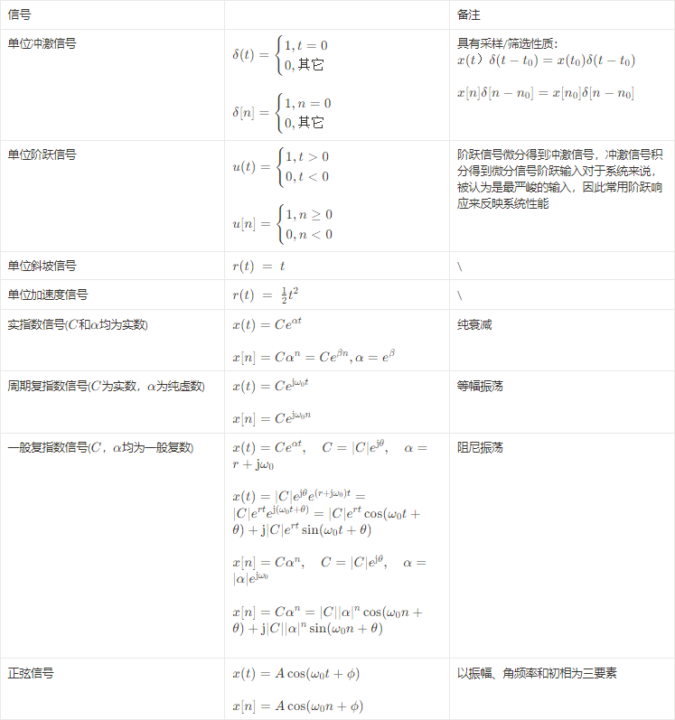

## 第五章 信号的变换

### 5.1 为什么要进行信号变换

通过特定形式的积分变换，可以极大地简化微分、积分、卷积等应用广泛的运算，这就是将信号变换到并不直观的非时域进行处理的意义和价值。再加上快速傅里叶变换（FFT）算法的出现，使得这种“变换——处理——逆变换”的模式已经得到普及。而这些变换，可以将信号变换到不同的域中进行分析和处理，它们分别是：傅里叶变换（频域）/ 傅里叶级数、拉普拉斯变换（复频域 / s 域）和 z 变换（z 域）。

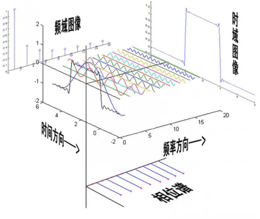

### 5.2 前置数学知识

要理解下面即将要讨论的、作为信号与系统核心理论的三大变换，我们需要一些数学背景知识。

1. 数学变换：原向量空间通过函数作用，映射到另一个向量空间。

2. 积分变换：通过积分将一个函数从其原始函数空间映射到另一个函数空间，其中原始函数的某些属性可能比原始函数空间更容易表征和操作。 通常可以使用逆变换将变换后的函数映射回到原始函数空间，这样的变换是可逆变换。

3. 完备正交基：三角函数集和复指数函数集，对于积分变换之后的向量空间来说，是完备正交基。不同频率的正弦波相乘，对其周期积分后，其结果是 0。

4. 谐波：一个成谐波关系的复指数信号的集合就是一组基波频率是某一正频率$$\omega _0$$的整数倍的周期复指数信号；对任意$$k$$，基波频率为$$ \vert k \vert \omega_0$$，基波周期为$$\frac{2\pi}{ \vert k \vert \omega_0}$$。

   $$
   \phi_k(t) = e^{\text{j}k\omega_0t}, k = 0, \pm1, \pm2, \cdots
   $$

### 5.3 演变和相互关系

由于复指数信号/三角函数的完备正交性，任何周期信号都可以用一系列成谐波关系的正弦信号来表示（此处省略了满足迪利克雷条件，即傅里叶级数收敛的条件）。换个方式表示，就是傅里叶级数的综合公式。而对于非周期信号，可以认为是周期信号的周期为无穷时的情况，与之相对应的就是连续时间傅里叶变换（CTFT）。

拉普拉斯变换，则是在傅里叶变换的基础上，加入衰减因子，用于研究原本不收敛的信号。

但计算机只能够存储和处理离散的信号，于是离散时间傅里叶变换（DTFT）和$$z$$变换应运而生。针对离散时间傅里叶变换进行优化，又出现了快速傅里叶变换（FFT）。

一个周期信号的傅里叶系数可以利用傅里叶变换的等间隔样本来表示

$$
a_k = \left. \frac{1}{T}X(j\omega) \right \vert _{\omega = k\omega_0}
$$

傅里叶级数和傅里叶变换具有对偶性

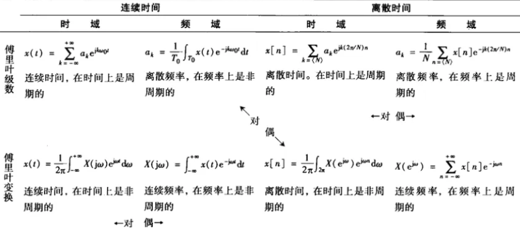

傅里叶级数，是信号用一系列谐波信号的线性组合来表示时，在某个频率的谐波处截断时，使得误差最小的最优线性组合系数

拉普拉斯变换和 z 变换是几乎对等的关系，前者针对连续域，后者针对离散域。另外，傅里叶变换在某种程度上，可以看作是拉普拉斯变换和 z 变换的特殊情况。再者，信号分析和处理中，一般使用傅里叶变换；而在系统分析和设计中，一般使用拉普拉斯变换和 z 变换。

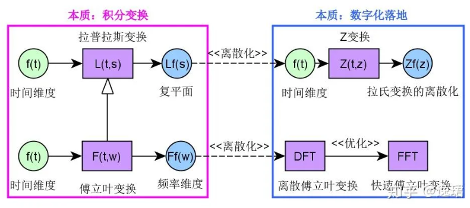

### 5.4 变换定义和性质

以下内容是三大变换的定义、性质和常用变换对，内容较多，为方便索引，全部设为三级标题。此处就可以发现，变换域分析可以简化微分、积分和卷积。

### 5.4.1 傅里叶级数定义

连续时间傅里叶级数

$$
\begin{aligned} x(t) &= \sum_{k=-\infty}^{+\infty} a_k e^{\text{j}k\omega_0 t} = \sum_{k=-\infty}^{+\infty} a_k e^{\text{j}k \left( \frac{2\pi}{T} \right) t} \\ a_k &= \frac{1}{T} \int_{T} x(t) e^{-\text{j}k\omega_0 t} \text{d}t = \frac{1}{T} \int_{T} x(t) e^{-\text{j}k \left( \frac{2\pi}{T} \right) t} \text{d}t \end{aligned}
$$

离散时间傅里叶级数

$$
\begin{aligned} x[n] &= \sum_{k=\langle N \rangle} a_k e^{\text{j}k\omega_0 n} = \sum_{k=\langle N \rangle} a_k e^{\text{j}k \left( \frac{2\pi}{N} \right) n} \\ a_k &= \frac{1}{N} \sum_{n=\langle N \rangle} x[n] e^{-\text{j}k\omega_0 n} = \frac{1}{N} \sum_{n=\langle N \rangle} x[n] e^{-\text{j}k \left( \frac{2\pi}{N} \right) n} \end{aligned}
$$

### 5.4.2 傅里叶变换定义

连续时间傅里叶变换

$$
\begin{aligned} x(t) &= \frac{1}{2\pi} \int_{-\infty}^{+\infty} X(\text{j}\omega)e^{\text{j}\omega t} \text{d}\omega \\ X(\text{j}\omega) &= \int_{-\infty}^{+\infty} x(t)e^{-\text{j}\omega t} \text{d}t \end{aligned}
$$

离散时间傅里叶变换

$$
\begin{aligned} x[n] &= \frac{1}{2\pi} \int_{0}^{2\pi} X(e^{\text{j}\omega}) e^{\text{j}\omega n} \text{d}\omega \\ X(e^{\text{j}\omega}) &= \sum_{n=-\infty}^{+\infty} x[n] e^{-\text{j}\omega n} \end{aligned}
$$

### 5.4.3 拉普拉斯变换定义

$$
\begin{aligned} x(t) &= \frac{1}{2\pi \text{j}} \int_{\sigma - \text{j}\infty}^{\sigma + \text{j}\infty} X(s)e^{st} \text{d}s \\ X(s) &= \int_{-\infty}^{+\infty} x(t)e^{-st} \text{d}t \end{aligned}
$$

### 5.4.4 z 变换定义

$$
\begin{aligned} x[n] &= \frac{1}{2\pi \text{j}} \oint X(z) z^{n-1} \text{d}z \\ X(z) &= \sum_{n=-\infty}^{+\infty} x[n] z^{-n} \end{aligned}
$$

---

### 5.4.5 傅里叶级数性质

连续傅里叶级数性质

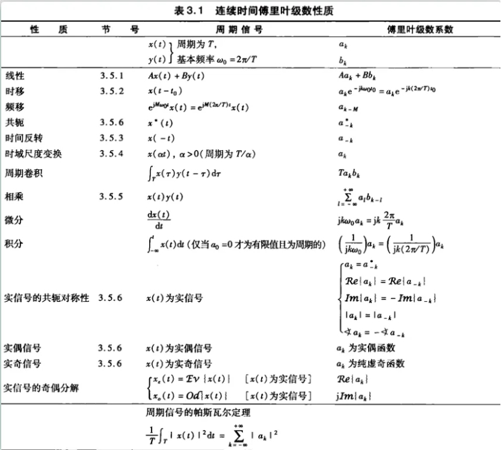

离散傅里叶级数性质

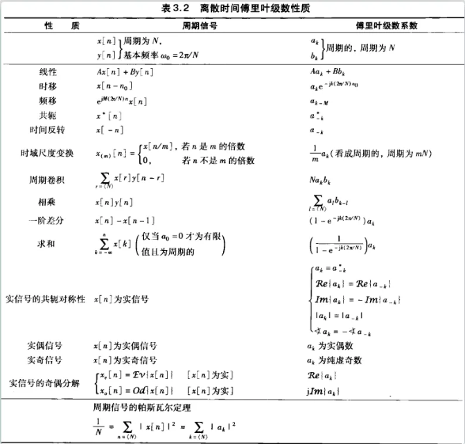

### 5.4.6 傅里叶变换性质

连续傅里叶变换性质

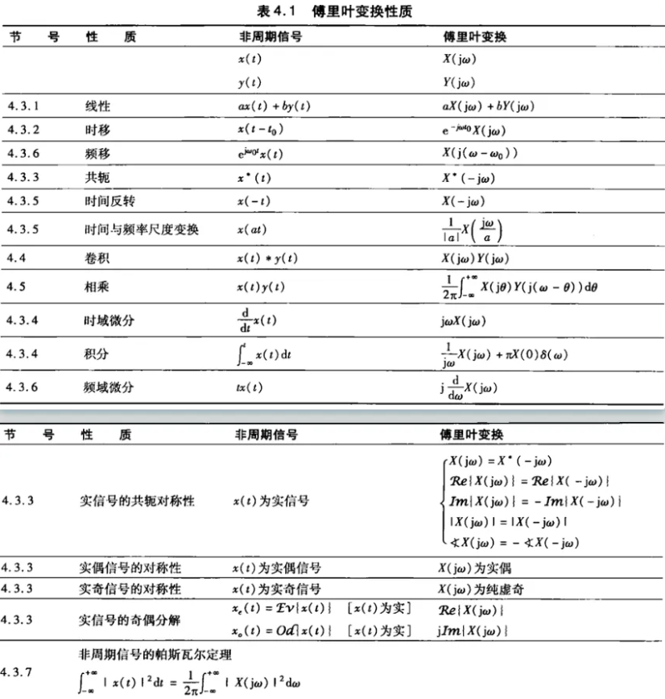

离散傅里叶变换性质

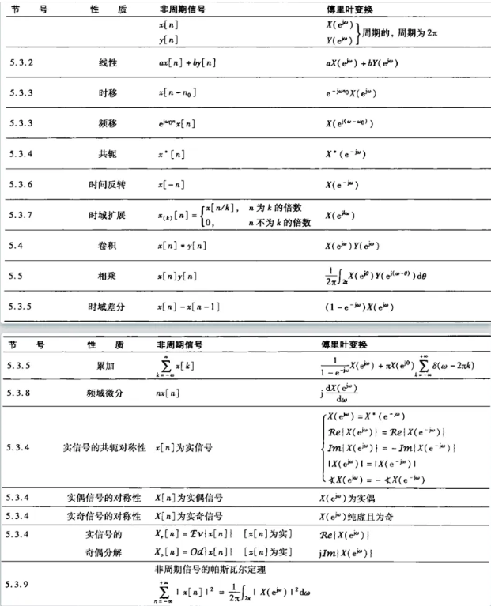

对于拉普拉斯变换和 z 变换，还有收敛域的问题。使得定义式的积分/求和收敛的$$s/z$$范围称为收敛域。$$s$$域的虚轴、负半平面、正半平面分别被映射为$$z$$域的单位圆、单位圆内部、单位圆外部。收敛域包含虚轴/单位圆时，傅里叶变换收敛。同时，这两种变换还存在双边变换和单边变换的区别。当非零初始条件时，由线性常系数微分方程所描述的因果系统可以由单边变换描述。单边变换的收敛域总是某一右半平面 / 某个圆外面。

### 5.4.7 拉普拉斯变换性质

双边拉普拉斯变换

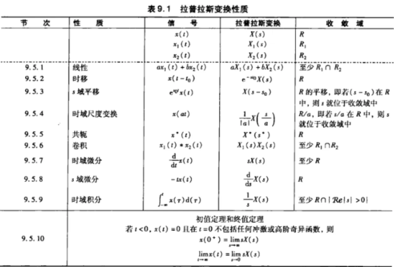

单边拉普拉斯变换

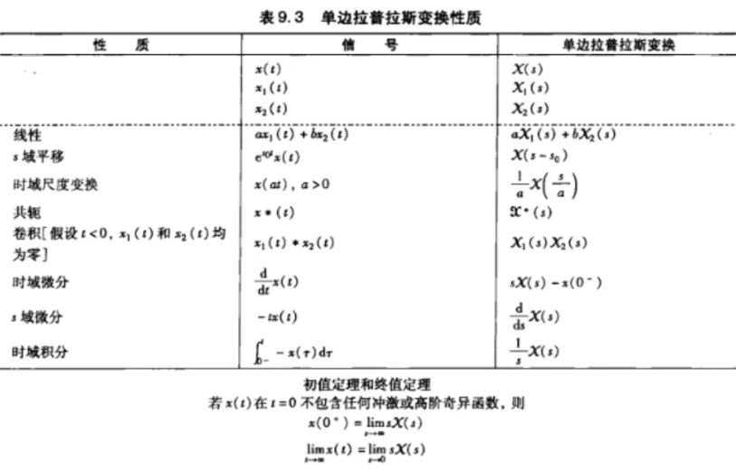

### 5.4.8 z 变换性质

双边 z 变换

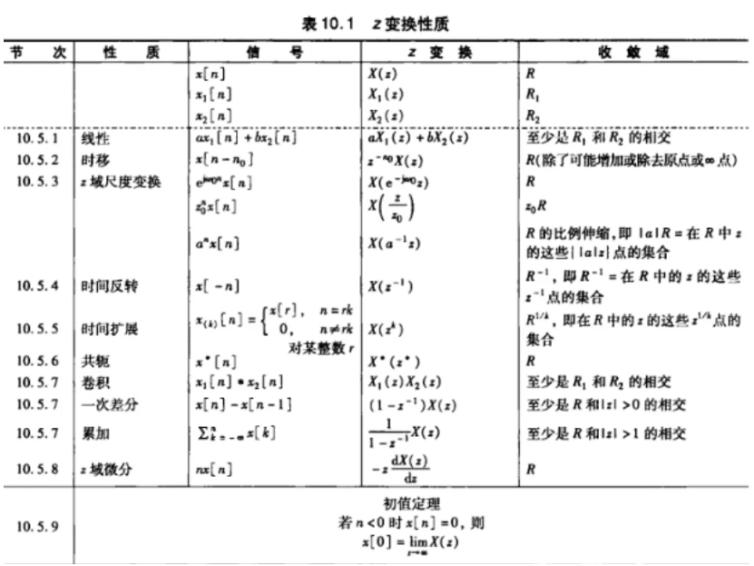

单边 z 变换

### 5.4.9 傅里叶变换常用对

连续傅里叶变换常用对

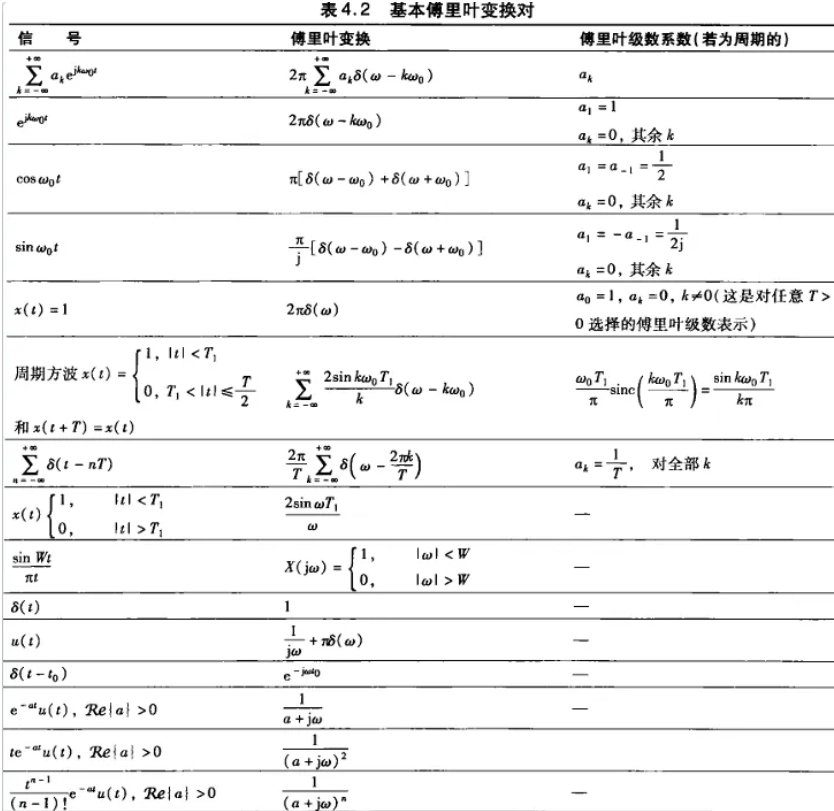

离散傅里叶变换常用对

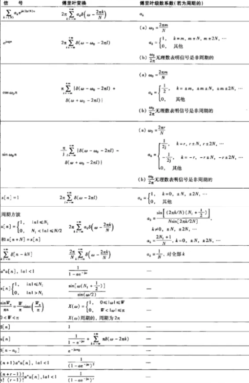

### 5.4.10 拉普拉斯变换常用对

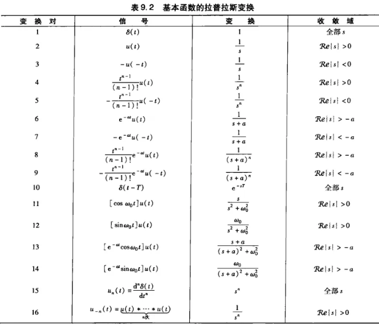

### 5.4.11 z 变换常用对

补充：

$$\frac{\text{d}x^2(t)}{\text{d}t^2}$$的单边拉普拉斯变换为$$s^2X(s) - sx(0^-) - x'(0^-)$$

$$\int x(t)\text{d}t = \frac{1}{s}F(s) + \frac{1}{s}f^{(-1)}(0)$$

## 第六章 线性时不变系统

### 系统基本性质

为方便讨论，对系统定义了一些最基本的性质，也可以根据这些性质对系统做粗糙的分类。

1. 有/无记忆系统：输出仅仅与当前时刻输入有关，则被称为无记忆系统。
2. 可逆/不可逆系统：输入输出具有唯一对应关系则称为可逆系统，存在逆系统。
3. 因果性：输入只取决于现在的输入及过去的输入，则称为因果系统，也称为不可预测的系统。线性系统的因果性等效于初始松弛（非零输入到来之前输出为零）的条件。在独立变量不是时间的应用中，因果性不是一个根本性的限制。
4. 稳定性：输入有界则输出有界。实际系统的稳定性一般来说都是由于存在能量消耗。从另一个角度说，是系统在扰动消失后，由初始偏差状态恢复到原平衡状态的性能。
5. 线性：满足叠加性（可加性和比例性）。叠加性的一个推论是：零输入对应零输出。
6. 时不变性：系统的特性和行为不随行为而变。比如在输入上有一个时延，会在输出上产生同样的时延。

### 线性时不变系统

物理世界中，绝大部分系统属于线性时不变系统(Linear Time-Invariant，简称 LTI)。所谓线性，即满足系统响应的可加性和均匀性，可以类比线性代数中”线性“的概念；所谓时不变性，即系统的特性不随时间而改变，任何时刻，输入和输出的关系都是恒定不变的。

- 可加性：如果系统对输入信号$$x_1(t)$$的响应是 $$y_1(t)$$，对输入信号$$x_2(t)$$的响应是$$y_2(t)$$，那么对于输入信号$$x_1(t)$$和$$x_2(t)$$，系统对它们的和$$x_1(t) + x_2(t)$$的响应将是$$y_1(t) + y_2(t)$$

- 均匀性（也称为齐次性或标量倍数性）：如果系统对输入信号$$x(t)$$的响应是$$y(t)$$，那么对于任意常数$$a$$，系统对输入信号$$ax(t)$$的响应将是$$ay(t)$$

线性时不变的性质，使得我们可以用基本信号——即单位冲激表示一切信号，并且用对单位冲激的响应代表系统的特性。同时，线性时不变还使得后面将提到的一种重要运算——卷积，满足交换律、结合律和分配律。从群论的角度看，线性时不变使得这个群具有了很好的性质，毕竟，满足这三个基本规律的运算，其实并不是那么普遍。

## 参考资料

[难懂的数学](https://www.bilibili.com/video/BV1kX4y1u7GJ/?vd_source=1d0891b41fe4e23dbf197eaf61dfa468)

[3Blue1Brown](https://space.bilibili.com/88461692?spm_id_from=333.337.0.0)
