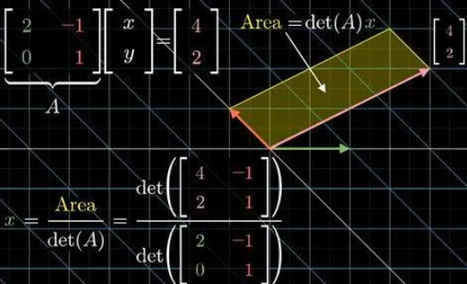
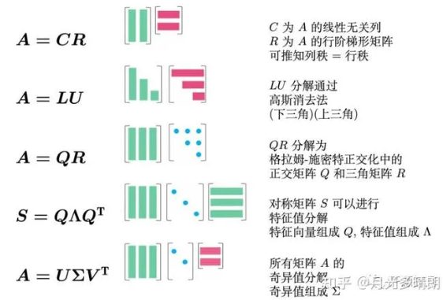

线性代数中有许多从不同角度叙述，但本质相同的东西。

## 第一章 向量空间

线性代数用矩阵和向量的角度组织信息。向量即一维数组，有加减乘除、内积外积的基本运算。

向量之间有线性相关和线性无关的概念。若一组向量$$\{\mathbf{v_{1}}, \mathbf{v_{2}}, \ldots, \mathbf{v_{n}}\}$$的线性组合等于零向量的唯一解，是所有系数均为零时，称这个向量组是线性无关的；否则称为线性相关。

$$
c_{1} \mathbf{v_{1}} + c_{2} \mathbf{v_{2}} + \cdots + c_{n} \mathbf{v_{n}} = \mathbf{0}
$$

一个线性无关的向量组，若在此组中添加任何一个新的向量都会使得向量组变为线性相关时，这个向量组称为极大无关组；极大无关组中的向量个数称为极大无关组的秩，也是其构成向量空间的维度；维度表示了生成线性空间所需要的最少的向量个数。秩有许多不同角度的定义，是一个具有代表性的特征，有某种不变性。极大无关组中的所有向量构成该向量组的一个基。用向量组的基可以表示其它向量，表示的系数称为坐标。

一个向量集合，若对加和数乘两种运算封闭，则称为向量空间。用群论的角度看，向量空间的数学结构是一个群。向量空间的子集称为子空间。一个向量组中向量的所有线性组合称为这个向量组的张成空间。广义的向量空间，其中的元素不局限于向量，如函数空间。

## 第二章 矩阵

在解线性方程组时，发现未知数的形式并不重要，因此根据方程组抽象出了系数矩阵和增广矩阵，这便引出了矩阵。矩阵是一个按矩形阵列排列的数值集合，代表了对空间的一种线性变换，也可以代表一个高维空间，是用于处理多维数据的重要数学结构。用矩阵各列/行构成向量，张成的线性空间叫列/行空间；线性变换后被压缩到原点的向量构成零空间。

### 2.1 矩阵运算

设两个矩阵$$\mathbf{A}、\mathbf{B}$$，标量$$c$$

#### 加和数乘

矩阵满足普遍意义上的加和数乘

$$
\mathbf{A} = \begin{pmatrix} a_{11} & a_{12} \\ a_{21} & a_{22} \end{pmatrix}, \quad \mathbf{B} = \begin{pmatrix} b_{11} & b_{12} \\ b_{21} & b_{22} \end{pmatrix}
$$

$$
\mathbf{C} = \mathbf{A} + \mathbf{B} = \begin{pmatrix} a_{11} + b_{11} & a_{12} + b_{12} \\ a_{21} + b_{21} & a_{22} + b_{22} \end{pmatrix} \\ c\mathbf{A} = \begin{pmatrix} ca_{11} & ca_{12} \\ ca_{21} & ca_{22} \end{pmatrix}
$$

#### 乘法

$$
\mathbf{A} = \begin{pmatrix} a_{11} & a_{12} & \cdots & a_{1n} \\ a_{21} & a_{22} & \cdots & a_{2n} \\ \vdots & \vdots & \ddots & \vdots \\ a_{m1} & a_{m2} & \cdots & a_{mn} \end{pmatrix}_{m \times n}, \quad \mathbf{B} = \begin{pmatrix} b_{11} & b_{12} & \cdots & b_{1k} \\ b_{21} & b_{22} & \cdots & b_{2k} \\ \vdots & \vdots & \ddots & \vdots \\ b_{n1} & b_{n2} & \cdots & b_{nk} \end{pmatrix}_{n \times k}
$$

$$
\mathbf{C} = \mathbf{A} \mathbf{B} = \begin{pmatrix} c_{11} & c_{12} & \cdots & c_{1k} \\ c_{21} & c_{22} & \cdots & c_{2k} \\ \vdots & \vdots & \ddots & \vdots \\ c_{m1} & c_{m2} & \cdots & c_{mk} \end{pmatrix}_{m \times k}
$$

其中$$C$$的第$$i$$行第$$j$$列的元素为$$A$$中第$$i$$行和$$B$$的第$$j$$列作内积得到

$$
c_{ij} = a_{i1}b_{1j} + a_{i2}b_{2j} + \cdots + a_{in}b_{nj}
$$

注意，矩阵乘法要求维度匹配，只有当第一个矩阵的列数等于第二个矩阵的行数时才能进行乘法运算。在此例中，$$A$$ 的形状是$$m \times n$$，$$B$$的形状是$$n \times k$$，结果为$$m \times k$$的矩阵。同时，由于对维度的要求，乘法不满足数值乘法所满足的交换律，因此需要区分左乘和右乘。

对矩阵进行乘法，表示对空间进行变换；左乘和右乘分别代表对列空间和行空间的空间变换，是两种对偶的研究角度。

#### 转置

$$
\mathbf{A} = \begin{pmatrix}a_{11} & a_{12} & \cdots & a_{1n} \\a_{21} & a_{22} & \cdots & a_{2n} \\\vdots & \vdots & \ddots & \vdots \\a_{m1} & a_{m2} & \cdots & a_{mn}\end{pmatrix}
$$

$$
\mathbf{A^{\text{T}}} = \begin{pmatrix}a_{11} & a_{21} & \cdots & a_{m1} \\a_{12} & a_{22} & \cdots & a_{m2} \\\vdots & \vdots & \ddots & \vdots \\a_{1n} & a_{2n} & \cdots & a_{mn}\end{pmatrix}
$$

转置就是沿对角线调换元素位置，满足以下性质

$$
\begin{aligned}
\quad (\mathbf{A}^{\text{T}})^{\text{T}} &= \mathbf{A} \\
\quad (\mathbf{A} + \mathbf{B})^{\text{T}} &= \mathbf{A}^{\text{T}} + \mathbf{B}^{\text{T}} \\
\quad (c\mathbf{A})^{\text{T}} &= c\mathbf{A}^{\text{T}} \\
\quad (\mathbf{A}\mathbf{B})^{\text{T}} &= \mathbf{B}^{\text{T}} \mathbf{A}^{\text{T}}
\end{aligned}
$$

#### 求幂

求幂就是多次乘法，由于乘法的要求，求幂是针对方阵(行数等于列数的矩阵)而言的

对于一般的$$k$$ 次幂，$$\mathbf{A}^k$$通过递归定义

$$
\mathbf{A}^k = \mathbf{A}^{k-1} \cdot \mathbf{A}
$$

对于一般的矩阵，求幂的计算量巨大，而对一些特殊形式的矩阵，如对角矩阵、若当标准型、三角矩阵等，它们的求幂运算满足一定规律，可大大减少计算量，因此常将一般矩阵分解变换为这些特殊形式再进行求幂。

#### 求逆

求逆表示求逆变换；满秩的方阵才存在逆，满秩的非方阵存在伪逆。(秩的定义见 2.3)

$$\mathbf{A}_{n\times n}$$为可逆矩阵，若存在矩阵$$\mathbf{B}$$使得$$\mathbf{A} \mathbf{B} = \mathbf{B} \mathbf{A} = \mathbf{I}_{n}$$ ，则称$$\mathbf{B}$$为矩阵$$\mathbf{A}$$的逆，记为$$\mathbf{A}^{-1}$$

一般矩阵求逆的计算量较大，通常将矩阵分解成便于求逆的形式后进行。

高斯若当法是一种通用的手工求逆法：把$$\mathbf{A}$$与$$\mathbf{I}$$写一起，通过初等变换将$$\mathbf{A}$$变为$$\mathbf{I}$$，原来右边的部分便为$$\mathbf{A}^{-1}$$。此外，逆还可以利用伴随矩阵计算

$$
\mathbf{A}^{-1} = \frac{1}{\text{det}(\mathbf{A})} \mathbf{Adj(A)}
$$

伪逆是方阵逆的概念在非方阵中的推广，记为$$A^\dagger$$ ，具体求法此处省略。

#### 分块

某些特殊构型的矩阵分块处理，每个块当作元素进行运算，再分别计算每个块的结果，在手工分析稀疏矩阵时尤其有效。

### 2.2 特殊矩阵

- 单位矩阵：对角元全为 1，非对角元全为 0，记为$$I_{n}$$
- 对角矩阵：非对角元全为 0
- 三角矩阵：主对角元上方或下方的元素全为 0
- 稀疏矩阵：大多数元素为 0
- 对称矩阵：$$\mathbf{A}^{\text{T}} = \mathbf{A}$$
- 反称矩阵：$$\mathbf{A}^{\text{T}} = -\mathbf{A}$$
- 埃尔米特矩阵：$$\mathbf{A}^* = \mathbf{A}$$ (复数矩阵，共轭转置等于自身)
- 幺正矩阵：$$\mathbf{A}^* = \mathbf{A}^{-1}$$，即$$\mathbf{A}^* \mathbf{A} = \mathbf{I}$$
- 正交矩阵：$$\mathbf{A}^{\text{T}} = \mathbf{A}^{-1}$$，即$$\mathbf{A}^{\text{T}}\mathbf{A} = \mathbf{I}$$
- 幂等矩阵：$$\mathbf{A}^2 = \mathbf{A}$$，常用于投影
- 初等矩阵：高斯消元法中初等变换对应的矩阵
- 正定矩阵：对任意非零向量$$\mathbf{x}$$，满足$$\mathbf{x}^{\text{T}}\mathbf{A}\mathbf{x} > 0$$的对称矩阵
- 施密特矩阵：用于施密特正交化的矩阵，具有特定的对称性和正交性。
- 幺矩阵：所有行和列元素的和均为 1 ，常用于概率和统计。
- 投影矩阵：$$\mathbf{b}$$向$$\mathbf{a}$$上的投影为$$\mathbf{p} = \frac{\mathbf{a}\mathbf{a}^{\text{T}}}{\mathbf{a}^{\text{T}}\mathbf{a}}\mathbf{b}$$，是对称矩阵，幂等矩阵；投影矩阵用于解决无解时找列空间中最近的解

### 2.3 矩阵的秩

自然定义域下，$$\mathbf{A}\mathbf{x} = \mathbf{y}$$的值域称为$$\mathbf{A}$$的列空间，值域的维度就是矩阵的秩(秩的又一种定义)，记为$$\text{rank}(\mathbf{A})$$或$$\text{r}(\mathbf{A})$$。列空间$$\text{R}(\mathbf{A})$$的秩和行空间$$\text{R}^{\text{T}}(\mathbf{A})$$的秩分别称为列秩和行秩。但行秩其实恒等于列秩，故一般统称为矩阵的秩。当$$\mathbf{A}_{m\times n}$$满足$$\text{r}(\mathbf{A}) = \min\{m, n\}$$时，称$$\mathbf{A}$$是满秩的。矩阵可以看作一种线性映射：列满秩对应单射、行满秩对应满射、既列满秩又行满秩对应双射。初等变换不改变矩阵的秩。

矩阵的秩满足一些基本性质

$$
\begin{aligned} &\text{r}(\mathbf{A}\mathbf{B}) \leqslant \min\{\text{r}(\mathbf{A}), \text{r}(\mathbf{B})\} \\ &\text{r}(\mathbf{A} + \mathbf{B}) = \text{r}(\mathbf{A}) + \text{r}(\mathbf{B}) \\ &\text{r}(\mathbf{A}) = \text{r}(\mathbf{P}\mathbf{A}) = \text{r}(\mathbf{A}\mathbf{Q}) = \text{r}(\mathbf{P}\mathbf{A}\mathbf{Q}) \\ &\text{r}(\mathbf{A}) + \text{r}(\mathbf{B}) - n \leqslant \text{r}(\mathbf{A}\mathbf{B})\quad(西尔维斯特不等式) \end{aligned}
$$

## 第三章 线性方程组

线性代数的另一个研究出发点，是求解线性方程。

$$
\begin{aligned}
\begin{cases}
3x_{1} + 1x_{2} &= -1\\
1x_{1} + 2x_{2} &= 3
\end{cases}\\
\begin{pmatrix}
3 \quad 1 \\
1 \quad 2
\end{pmatrix}
\begin{pmatrix}
x_{1} \\
x_{2}
\end{pmatrix}=
\begin{pmatrix}
-1 \\
3
\end{pmatrix}\\
\end{aligned}
$$

$$
\mathbf{A}\mathbf{x} = \mathbf{y}\\ \mathbf{y} = \mathbf{b}\\
$$

$$\mathbf{A}\mathbf{x} = \mathbf{y}$$对应的齐次方程为$$\mathbf{A}\mathbf{x} = \mathbf{0}$$，齐次方程的解称为$$\mathbf{A}$$的零空间$$\text{null}({\mathbf{A}})$$，其维数为$$n - r$$

设矩阵的列数为$$n$$，秩为$$r$$，有秩零定理$$n = r + (n-r)$$

### 3.1 解的性质

关于解的存在性：在自然定义域下，$$\mathbf{A}\mathbf{x} = \mathbf{y}$$的值域称为$$\mathbf{A}$$的列空间，若$$\mathbf{b}$$在列空间中则方程组有解。另外的判断方式有：若系数矩阵和增广矩阵等秩则方程有解。当$$\mathbf{A}\mathbf{x} = \mathbf{y}$$为单射/系数矩阵行满秩时，解是唯一的。当解唯一时，可直接求出闭式解$$\mathbf{x} = \mathbf{A}^{-1}\mathbf{b}$$

非齐次线性方程解的结构为特解(平移了多少)+ 对应齐次方程通解(零空间的解)。

### 3.2 解法

解线性方程组的通用方法有：基于初等变换的高斯消元法和基于行列式的克莱姆法则。高斯消元法使用初等变换(三个初等行变换+三个初等列变换)将增广矩阵化为标准型，写出方程组的解，一般用于手动计算。克莱姆法则用于解唯一的线性方程组，要求$$\mathbf{A}$$为方阵，有特定的公式，计算两个特殊行列式之比即可直接得出解。

## 第四章 行列式

行列式是方阵的一种特征，表征线性变换对空间伸缩的尺度，记为$$\text{det}(\mathbf{A})$$或$$ \vert A \vert $$。这种定量的尺度说明，在低维被称作有向面积/有向体积。非方阵没有行列式这一概念。

从行列式的几何意义可以得到一些显然的性质

- $$ \vert \mathbf{A}^{\text{T}} \vert = \vert \mathbf{A} \vert $$，即转置不影响行列式
- 某一行/列乘$$k$$，行列式变为$$k$$倍；$$ \vert k\mathbf{A} \vert = k^n \vert \mathbf{A} \vert $$
- 行列互换，正负号改变
- 行列倍加，行列式不变
- $$ \vert \mathbf{A} \vert \ne 0$$，$$\mathbf{A}$$满秩，$$\mathbf{A}$$可逆三个概念相互等价

其它性质

- $$ \vert \mathbf{A}+\mathbf{B} \vert = \vert \mathbf{A} \vert + \vert \mathbf{B} \vert $$，和的行列式=行列式的和
- $$ \vert \mathbf{A}\mathbf{B} \vert = \vert \mathbf{A} \vert \vert \mathbf{B} \vert $$，积的行列式=行列式的积

### 4.1 定义

二阶行列式的定义相对简单，且可以直接计算

$$
{\text{det}}(\mathbf{A}) = \begin{vmatrix} a_{11} & a_{12} \\ a_{21} & a_{22} \end{vmatrix} = a_{11}a_{22} - a_{12}a_{21}
$$

$$n$$阶行列式的一般定义涉及逆序数和全排列，较为复杂

- 逆序数：在一个排列中，对于两个元素$$a_{i}$$和$$a_{j}$$，如果$$i < j$$且$$a_{i} > a_{j}$$，则称这对元素为一个逆序对。逆序数就是逆序对的数量，可描述一个排列的“混乱程度”。正式定义为

  给定一个长度为$$n$$的排列$$a_{1}, a_{2}, \ldots, a_{n}$$其逆序数$$I$$定义如下，其中$$\mathbb{I}(P)$$是指示函数，当 $$P$$为真时取值 1，否则取值 0

$$
I = \sum_{1 \leqslant i < j \leqslant n} \mathbb{I}(a_{i} > a_{j})
$$

给定$$\mathbf{A}_{n\times n}$$，其行列式为

$$
\mathbf{A} = \begin{pmatrix} a_{11} & a_{12} & \cdots & a_{1n} \\ a_{21} & a_{22} & \cdots & a_{2n} \\ \vdots & \vdots & \ddots & \vdots \\ a_{n1} & a_{n2} & \cdots & a_{nn} \end{pmatrix} \quad {\text{det}}(\mathbf{A}) = \sum_{\sigma \in S_{n}} \text{sgn}(\sigma) \prod_{i=1}^{n} a_{i, \sigma(i)}
$$

其中$$S_{n}$$为$$n$$的全排列集合，其中的元素为一组有序数组的各个排列方式。$$\text{sgn}(\sigma)$$为排列的符号，

- 如果排列是偶排列(通过偶数次交换相邻元素得到自然顺序序列的排列)，则$$\text{sgn}(\sigma) = +1$$
- 如果排列是奇排列(通过奇数次交换相邻元素得到自然顺序序列的排列)，则$$\text{sgn}(\sigma) = -1$$

例如，对于三阶方阵

$$
{\text{det}}(\mathbf{A}) = a_{11} (a_{22} a_{33} - a_{23} a_{32}) - a_{12} (a_{21} a_{33} - a_{23} a_{31}) + a_{13} (a_{21} a_{32} - a_{22} a_{31})
$$

高阶行列式一般用拉普拉斯展开进行计算(用递推的方式降阶计算)

$$
{\text{det}}(\mathbf{A}) = \sum_{i=1}^{n} (-1)^{i+j} a_{ij} \cdot{\text{det}}(\mathbf{A}_{ij})
$$

### 4.2 相关概念

与行列式相关的定义还有

- 子式：取出$$\mathbf{A}$$的某些行和列，组成$$k$$阶行列式
- 主子式：取的行号列号相同
- 顺序主子式：取的行号列号相同且不跳号(矩阵左上角的方阵的行列式)
- 余子式：去除某行某列剩余部分的行列式
- 代数余子式：在余子式的基础上乘$$(-1)^{i+j}$$
- 伴随矩阵：代数余子式按照原排列构成矩阵

这里又可以给出秩的另一个概念：秩就是最高阶非零子式的阶数

## 第五章 矩阵分解

### 5.1 对角化

正式介绍矩阵分解前，需要先介绍线性代数中的一种重要技术：对角化。对角矩阵由于其特殊的结构，拥有求幂求逆等运算简单，各列/各行的向量在向量空间中直接就是正交基等十分优越的性质，使得在许多场景下，都会先将原矩阵变换为对角矩阵再进行后续分析。 相似对角化和合同对角化是两种常见的对角化方式。

#### 相似对角化

向量空间的基代表一种视角，为了简化问题，需要基变换和对应的坐标变换。同一个变换在不同视角下的表示便互为相似矩阵。设$$\{\mathbf{m_{1}}、\mathbf{m_{2}}、\mathbf{m_{3}}\cdots\mathbf{m_{s}}\}$$和$$\{\mathbf{n_{1}}、\mathbf{n_{2}}、\mathbf{n_{3}}\cdots\mathbf{n_{s}}\}$$是同一个向量空间的两个基，则存在唯一的矩阵$$\mathbf{P}$$，使得

$$
\begin{aligned}
(\mathbf{n_{1}}、\mathbf{n_{2}}、\mathbf{n_{3}}\cdots\mathbf{n_{s}})&=(\mathbf{m_{1}}、\mathbf{m_{2}}、\mathbf{m_{3}}\cdots\mathbf{m_{s}})\cdot \mathbf{P}\\
[x]_{n} &= \mathbf{P}^{-1}[x]_{M}
\end{aligned}
$$

这称为基变换和坐标变换，$$\mathbf{P}$$称为过渡矩阵。

$$\mathbf{A}$$和$$\mathbf{B}$$均为方阵，相似的定义为，存在可逆矩阵$$\mathbf{P}$$使得$$\mathbf{B} = \mathbf{P}^{-1} \mathbf{A} \mathbf{P}$$ ，记为$$\mathbf{A}\sim\mathbf{B}$$，$$\mathbf{P}$$称为相似变换矩阵。若$$\mathbf{A}$$是一对角矩阵，那么从$$\mathbf{B}$$转化到$$\mathbf{A}$$的过程就是相似对角化。若$$\mathbf{P}$$为正交矩阵，则称为正交对角化，相应的说明$$\mathbf{A}$$为实对称矩阵。

若$$\mathbf{A}\sim\mathbf{B}$$，则它们的$$k$$次幂、转置、共轭转置都是相似的。此外，相似还具有传递性。相似矩阵的特征值、行列式、迹均相等。

#### 合同对角化

二次型是一种实际工程中常用的关于向量变量多项式

$$
Q(\mathbf{x})=\mathbf{x}^{\text{T}}\mathbf{A}\mathbf{x}
$$

其中$$\mathbf{x}_{n \times 1}$$为列向量，$$\mathbf{A}_{n \times n}$$为对称矩阵，称为$$\mathbf{A}$$为$$Q(\mathbf{x})$$的二次型矩阵。

例如

$$
Q(x, y) = ax^2 + 2bxy + cy^2\\ Q(\mathbf{x}) = \begin{pmatrix} x \\ y \end{pmatrix}^{\text{T}} \begin{pmatrix} a & b \\ b & c \end{pmatrix} \begin{pmatrix} x \\ y \end{pmatrix}
$$

二次型可用于处理二次齐次多项式，如旋转一个椭圆。只含平方项的二次型称为标准形。若$$\mathbf{x}$$任意取值均满足$$Q(\mathbf{x}) > 0$$，则称二次型$$Q(\mathbf{x})$$是正定的，类似的定义还有负定、半正定、半负定、不定。判定正定的一种方式为赫尔维茨定理：$$Q(\mathbf{x})$$正定的充要条件为二次型矩阵的各阶顺序主子式为正。二次型正定/负定代表有全局最小/最大值。

$$\mathbf{A}$$和$$\mathbf{B}$$均为方阵，合同的定义为，存在可逆矩阵$$\mathbf{P}$$使得$$\mathbf{B} = \mathbf{P}^{\text{T}}\mathbf{A} \mathbf{P}$$ ，记为$$\mathbf{A} \cong \mathbf{B}$$ ，$$\mathbf{P}$$称为合同变换矩阵。若$$\mathbf{A}$$是一对角矩阵，那么从$$\mathbf{B}$$转化到$$\mathbf{A}$$的过程就是合同对角化。

合同变换对二次型而言相当于进行坐标变换，合同对角化相当于通过坐标变换去掉了交叉项。合同对角化的方法有正交对角化和配方法。

设$$\mathbf{A} = \mathbf{P}\mathbf{\Lambda}\mathbf{P}^{\text{T}}$$，$$\mathbf{\Lambda}$$为对角矩阵，则

$$
Q(\mathbf{x})=\mathbf{x}^{\text{T}}\mathbf{A}\mathbf{x} = \mathbf{x}^{\text{T}}\mathbf{P}\mathbf{\Lambda}\mathbf{P}^{\text{T}}\mathbf{x} = (\mathbf{P}^{\text{T}}\mathbf{x})^{\text{T}}\mathbf{\Lambda}(\mathbf{P}^{\text{T}}\mathbf{x}) = \mathbf{y}^{\text{T}}\mathbf{\Lambda}\mathbf{y}
$$

### 5.2 矩阵分解

常见的矩阵分解有图中的五种方式，这些分解方式提供了多种看待矩阵的方式，其中应用最广泛、功能最强大的是：特征值分解和奇异值分解。奇异值又可以看作特征值分解的在非方阵的推广。

#### 特征值分解

ED(Eigenvalue Decomposition)

给定一个的实对称矩阵$$\mathbf{A}_{n \times n}$$，特征值分解的形式为：

$$
\mathbf{A} = \mathbf{P} \mathbf{\Lambda} \mathbf{P}^{-1}
$$

在线性变换中只缩放而方向不变的向量为特征向量(旋转矩阵没有实数特征值)、对应的缩放系数为特征值，即

$$
\mathbf{A}\mathbf{x} = \lambda\mathbf{x}
$$

特征多项式中根的重数称为该特征值的代数重数，特征向量的数量(对应特征空间的维度)称为该特征值的几何重数。不同特征值对应的特征向量线性无关。

计算方法：求解特征多项式 $$ \vert \mathbf{A}−λ\mathbf{I} \vert =0$$ 获得特征值，代入原方程得到特征向量。特征值构成对角矩阵$$\mathbf{\Lambda}$$，特征向量构成相似变换矩阵$$\mathbf{P}$$，如此便完成了相似对角化$$\mathbf{A} = \mathbf{P}\mathbf{\Lambda}\mathbf{P}^{-1}$$

例如

$$
\mathbf{A} = \begin{pmatrix} 4 & 1 \\ 2 & 3 \end{pmatrix}
$$

首先计算特征值

$$
\begin{aligned}
&\mathbf{A} - \lambda \mathbf{I} = \begin{pmatrix} 4 - \lambda & 1 \\ 2 & 3 - \lambda \end{pmatrix} \\
&{\text{det}}(\mathbf{A} - \lambda \mathbf{I}) = (4 - \lambda)(3 - \lambda) - 2 \cdot 1 = 0 \\
&\lambda_{1} = 5, \quad \lambda_{2} = 2
\end{aligned}
$$

后计算特征向量

$$
\begin{aligned}
&(\mathbf{A} - 5\mathbf{I})\mathbf{v} = 0 \\
&\begin{pmatrix} 4 - 5 & 1 \\ 2 & 3 - 5 \end{pmatrix} \begin{pmatrix} x \\ y \end{pmatrix} = \begin{pmatrix} -1 & 1 \\ 2 & -2 \end{pmatrix} \begin{pmatrix} x \\ y \end{pmatrix} = \begin{pmatrix} 0 \\ 0 \end{pmatrix} \\
&解得−x+y=0\\
&\mathbf{v}_{1} = k \begin{pmatrix} 1 \\ 1 \end{pmatrix} \quad (k \neq 0)\\
&同理得\lambda_{2} = 2对应的特征向量: \mathbf{v}_{2} = k \begin{pmatrix} 1 \\ -2 \end{pmatrix} \quad (k \neq 0)
\end{aligned}
$$

构造变换矩阵和对角矩阵

$$
\begin{aligned}
&\mathbf{P} = \begin{pmatrix} 1 & 1 \\ 1 & -2 \end{pmatrix}, \quad \mathbf{\Lambda} = \begin{pmatrix} 5 & 0 \\ 0 & 2 \end{pmatrix} \\
&\mathbf{A} = \mathbf{P} \mathbf{\Lambda} \mathbf{P}^{-1}
\end{aligned}
$$

由于正交矩阵具有逆等于转置的良好性质，又总结出了施密特正交化的一般方法，可借助向量空间下的一个基找到该空间下的正交基。对特征向量采用施密特正交化,可将相似变换矩阵$$\mathbf{P}$$变为正交矩阵$$\mathbf{Q}$$，具体公式很容易查到，此处暂不给出。

#### 奇异值分解

SVD(Singlevalue Decomposition)

给定$$\mathbf{A}_{m \times n}$$，可表示为三个特定矩阵的乘积，其中$$\mathbf{U}_{m \times m}$$是正交矩阵，其列向量称为左奇异向量；$$\mathbf{V}_{n \times n}$$是正交矩阵，其列向量称为右奇异向量；$$\mathbf{\Sigma}_{m \times n}$$是对角矩阵，其中的非负实数称为奇异值。

$$
\mathbf{A} = \mathbf{U} \mathbf{\Sigma} \mathbf{V}^{\text{T}}
$$

- 奇异向量均为单位向量。
- 奇异值是$$\mathbf{A}$$特征值的平方根
- 奇异值的数量等于$$\text{r}(\mathbf{A})$$

计算方法：求$$\mathbf{A}^{\text{T}} \mathbf{A}$$，求解特征值问题$$\mathbf{A}^{\text{T}} \mathbf{A} \mathbf{v} = \lambda \mathbf{v}$$，奇异值$$\sigma_{i} = \sqrt{\lambda_{i}}$$；将特征值$$\lambda_\text{i}$$代入原方程得到右奇异向量$$\mathbf{v}_\text{i}$$，并规范化为单位向量。再利用$$\mathbf{u}_{i} = \frac{1}{\sigma_{i}} \mathbf{A} \mathbf{v}_{i}$$计算得到左奇异向量。将奇异向量和奇异值排列成对应矩阵便得到分解结果。

例如

$$
\mathbf{A} = \begin{pmatrix} 3 & 1 & 2 \\ 2 & 4 & 1 \end{pmatrix}
$$

首先计算奇异值

$$
\begin{aligned}
&\mathbf{A}^{\text{T}} \mathbf{A} = \begin{pmatrix} 3 & 2 \\ 1 & 4 \\ 2 & 1 \end{pmatrix} \begin{pmatrix} 3 & 1 & 2 \\ 2 & 4 & 1 \end{pmatrix} = \begin{pmatrix} 13 & 11 & 9 \\ 11 & 17 & 6 \\ 9 & 6 & 5 \end{pmatrix}\\
&\mathbf{A}^{\text{T}} \mathbf{A} - \lambda \mathbf{I} = \begin{pmatrix} 13 - \lambda & 11 & 9 \\ 11 & 17 - \lambda & 6 \\ 9 & 6 & 5 - \lambda \end{pmatrix}\\
&{\text{det}}(\mathbf{A}^{\text{T}} \mathbf{A} - \lambda \mathbf{I}) = 0\\
&-\lambda^3 + 35\lambda^2 - 362\lambda + 1004 = 0\\
&解得\lambda_{1} \approx 29.29, \quad \lambda_{2} \approx 4.71, \quad \lambda_{3} \approx 0.01\\
&\sigma_{1} = \sqrt{29.29} \approx 5.41, \quad \sigma_{2} = \sqrt{4.71} \approx 2.17, \quad \sigma_{3} = \sqrt{0.01} \approx 0.1
\end{aligned}
$$

后计算奇异向量

$$
\begin{aligned}
&(\mathbf{A}^{\text{T}} \mathbf{A} - 29.29 \mathbf{I}) \mathbf{v} = 0 \\
&解得\mathbf{v}_{1} \approx\begin{pmatrix} 0.78 \\ 0.62 \\ 0.13 \end{pmatrix}\\
&同理解得\mathbf{v}_{2} \approx \begin{pmatrix} -0.62 \\ 0.78 \\ 0.13 \end{pmatrix} \quad \mathbf{v}_{3} \approx \begin{pmatrix} 0.13 \\ 0.13 \\ -0.97 \end{pmatrix} \\
&利用公式\mathbf{u}_{i} = \frac{1}{\sigma_{i}} \mathbf{A} \mathbf{v}_{i}求得：\\
&\mathbf{u}_{1} = \frac{1}{5.41} \mathbf{A} \mathbf{v}_{1} \approx \frac{1}{5.41} \begin{pmatrix} 3 & 1 & 2 \\ 2 & 4 & 1 \end{pmatrix} \begin{pmatrix} 0.78 \\ 0.62 \\ 0.13 \end{pmatrix} \approx \begin{pmatrix} 0.73 \\ 0.51 \end{pmatrix}\\
&\mathbf{u}_{2} = \frac{1}{2.17} \mathbf{A} \mathbf{v}_{2} \approx \frac{1}{2.17} \begin{pmatrix} 3 & 1 & 2 \\ 2 & 4 & 1 \end{pmatrix} \begin{pmatrix} -0.62 \\ 0.78 \\ 0.13 \end{pmatrix} \approx \begin{pmatrix} -0.54 \\ 0.75 \end{pmatrix}\\
&\mathbf{u}_{3} = \frac{1}{0.1} \mathbf{A} \mathbf{v}_{3} \approx \frac{1}{0.1} \begin{pmatrix} 3 & 1 & 2 \\ 2 & 4 & 1 \end{pmatrix} \begin{pmatrix} 0.13 \\ 0.13 \\ -0.97 \end{pmatrix} \approx \begin{pmatrix} 2.5 \\ -0.8 \end{pmatrix}
\end{aligned}
$$

构造三个矩阵

$$
\begin{aligned}
\mathbf{V} &= \begin{pmatrix} 0.78 & -0.62 & 0.13 \\ 0.62 & 0.78 & 0.13 \\ 0.13 & 0.13 & -0.97 \end{pmatrix} \\
\mathbf{\Sigma} &= \begin{pmatrix} 5.41 & 0 & 0 \\ 0 & 2.17 & 0 \\ 0 & 0 & 0.1 \end{pmatrix}\\
\mathbf{U} &= \begin{pmatrix} 0.73 & -0.54 & 2.5 \\ 0.51 & 0.75 & -0.8 \end{pmatrix}\\
\mathbf{A} &= \mathbf{U} \mathbf{\Sigma} \mathbf{V}^{\text{T}}
\end{aligned}
$$

特征值分解和奇异值分解的常见应用有：主成分分析、数据压缩、特征提取等。

## 伴随矩阵的意义

伴随矩阵（Adjugate Matrix），在数学和物理中有许多重要的含义，尤其是在与矩阵的逆、线性变换、几何以及物理学中的应用中具有深刻的意义。以下是伴随矩阵的一些物理及深层次含义：

### 1. 矩阵逆的计算

伴随矩阵的主要用途之一是帮助计算矩阵的逆。在代数中，给定一个可逆矩阵 $$\mathbf{A}$$，其逆矩阵可以通过伴随矩阵来表示：

$$
\mathbf{A}^{-1} = \frac{1}{\det(\mathbf{A})} \mathbf{Adj(A)}
$$

这里，$$\mathbf{Adj(A)}$$是矩阵 $$\mathbf{A}$$的伴随矩阵，$$\det(\mathbf{A})$$ 是矩阵的行列式。该公式的深层次含义在于，伴随矩阵和行列式共同构成了矩阵可逆的条件。行列式的几何解释是体积缩放因子，而伴随矩阵则与矩阵的协变变换相关。

### 2. 几何解释

伴随矩阵与几何学中的线性变换密切相关。在线性代数中，矩阵代表线性变换，而伴随矩阵与这些变换的协变性质有关。

#### (1) 线性变换的几何解释

伴随矩阵的元素是由每个元素的代数余子式构成的。几何上，可以将伴随矩阵理解为一个映射，它作用于 n-1 维空间（例如，对于三维空间，它作用在二维平面上），调整方向、面积或体积。

具体来说：

- 在 $$\mathbb{R}^2$$ 中，伴随矩阵作用于原始线性变换下的线段，保持线性变换下方向的关系。
- 在 $$\mathbb{R}^3$$ 中，伴随矩阵可以作用在变换后的平面上，调整该平面的法向量，并且能够调整体积的缩放。

伴随矩阵与原矩阵表示了在几何变换中某种对偶的关系。伴随矩阵的列（或行）通常与原矩阵中平面的法向量相关。

#### (2) 伴随矩阵与体积的关系

伴随矩阵的几何意义还可以通过其与体积的关系来解释。考虑一个 $$n \times n$$ 的矩阵 $$\mathbf{A}$$，它将一个单位立方体映射到某个体积为 $$\det(\mathbf{A})$$ 的平行六面体。伴随矩阵的列向量与原矩阵的每一个列向量张成的超平面的法向量相关。因此，伴随矩阵不仅与线性变换的逆密切相关，还与变换后的体积和方向密切关联。

### 3. 物理中的应用

伴随矩阵在物理学中的多种领域都有应用。以下是一些主要的物理背景：

#### (1) 经典力学中的转动矩阵

在经典力学中，伴随矩阵可以在描述刚体旋转、转动惯量矩阵等问题中找到应用。在三维空间中，伴随矩阵作用在矩阵的子空间上，使得我们能够用它来计算刚体旋转的逆问题。例如，在三维刚体的动力学分析中，伴随矩阵可以帮助分析惯性张量。

#### (2) 电磁场和线性代数

伴随矩阵的某些形式也出现在描述电磁场和电场势的问题中。电磁场中涉及的对称张量或反对称张量有时可以通过伴随矩阵进行变换和处理。

#### (3) 量子力学中的矩阵表示

在量子力学中，矩阵形式广泛用于表示可观测量和态的演化。伴随矩阵可以用于计算某些特定操作的逆，尤其是在某些对称性和群论的应用中，伴随矩阵的概念对某些算符代数起到重要的作用。

### 4. 矩阵的代数性质

在代数中，伴随矩阵也是一些重要的矩阵恒等式中的关键成分。例如，伴随矩阵具有如下性质：

$$
\mathbf{A} \cdot \mathbf{Adj(A)} = \mathbf{Adj(A)} \cdot \mathbf{A} = \det(\mathbf{A}) \mathbf{I}
$$

这意味着原矩阵与其伴随矩阵的乘积会产生一个以行列式为缩放因子的单位矩阵。这反映了伴随矩阵与矩阵逆之间的代数关系。

### 5. 线性方程组的解

伴随矩阵还用于解决线性方程组。假设有线性方程组 $$\mathbf{A}\mathbf{x} = \mathbf{b}$$，其中$$\mathbf{A}$$是一个可逆矩阵，通过伴随矩阵和行列式，可以表示解为：

$$
\mathbf{x} = \frac{1}{\det(\mathbf{A})} \mathbf{Adj(A)} \mathbf{b}
$$

这意味着我们可以通过伴随矩阵来求解方程组的解。尽管实际计算中，伴随矩阵方法不如其他数值方法高效，但它仍然提供了代数上的解析解法。

### 总结

伴随矩阵不仅在计算矩阵的逆时非常有用，它还具有重要的几何和物理意义：

- 几何上，它与线性变换、体积和方向的调整密切相关。
- 物理上，它在刚体旋转、电磁场和量子力学等领域有具体应用。
- 从代数的角度看，伴随矩阵和行列式一起构成了矩阵可逆性的重要工具，并且出现在许多代数恒等式中。

这些深层次的含义表明，伴随矩阵不仅是一个计算工具，还在数学和物理中的许多领域具有重要的解释性作用。

## 线性代数在数据统计中的应用

线性代数在数据统计中的应用非常广泛，特别是在多元数据分析、回归分析、主成分分析（PCA）和机器学习等领域。以下是一些常见的应用场景和例子，展示了线性代数如何在数据统计中发挥重要作用。

### 1. 回归分析中的最小二乘法

在回归分析中，我们常常希望通过拟合一条直线（或高维的超平面）来最小化预测值与观测值之间的差异。这个问题可以通过最小二乘法来解决，而最小二乘法的解正是基于线性代数中的矩阵运算。

例：有一个线性回归模型，模型形式为：

$$
y = X\beta + \epsilon
$$

- $$y$$ 是 $$n \times 1$$ 的观测数据向量，
- $$X$$ 是 $$n \times p$$ 的设计矩阵，其中 $$n$$ 是样本数， $$p$$ 是自变量的个数，
- $$\beta$$ 是 $$p \times 1$$ 的回归系数向量，
- $$\epsilon$$ 是误差项向量。

我们要估计回归系数 $$\beta$$，最小二乘法的目标是最小化残差平方和：

$$
\min_{\beta} \| y - X\beta \|^2
$$

使用线性代数的方法，可以通过解下面的矩阵方程来得到回归系数的估计：

$$
\hat{\beta} = (X^T X)^{-1} X^T y
$$

这就是利用线性代数中的矩阵求逆与转置来获得最小二乘解的过程。

### 2. 主成分分析（PCA）

主成分分析（PCA）是高维数据降维的常用方法，能够在保持数据方差的情况下降低维度。PCA 的核心是利用线性代数中的特征值分解或奇异值分解（SVD）来找到数据的主成分。

例：有一个矩阵 $$X$$ ，表示 $$n$$ 个样本和 $$p$$ 个变量。我们可以通过以下步骤使用 PCA 来降低数据维度：

1. 计算数据矩阵的协方差矩阵 $$\Sigma = \frac{1}{n-1} X^T X$$ 。
2. 对协方差矩阵 $$\Sigma$$ 进行特征值分解，得到特征值和特征向量。
3. 选择具有最大特征值的前 $$k$$ 个特征向量（主成分），这些特征向量对应的数据方向解释了最多的方差。
4. 用这些特征向量对原始数据进行线性变换，从而实现数据的降维。

通过这种方式，PCA 利用线性代数的矩阵对角化或奇异值分解技术，将高维数据投影到低维空间。

### 3. 协方差矩阵与相关性矩阵

在统计学中，协方差矩阵和相关性矩阵是两个非常重要的概念，用于衡量多个变量之间的线性关系。它们是通过矩阵运算来定义的，且经常在多元分析中使用。

例：有一个 $$n \times p$$ 的数据矩阵 $$X$$ ，表示 $$n$$ 个样本的 $$p$$ 个变量。协方差矩阵 $$\Sigma$$ 的定义是：

协方差矩阵是一个 p \times p 的矩阵，每个元素 \sigma\_{ij} 表示变量 X_i 和 X_j 之间的协方差。协方差矩阵是对称矩阵，其主对角线上的元素表示每个变量的方差。

$$
\Sigma = \frac{1}{n-1} X^T X
$$

通过协方差矩阵的特征值分解，我们可以获得该矩阵的主成分，即找到数据中解释方差最多的方向。

### 4. 多元数据分析中的距离度量

在聚类分析和分类问题中，数据点之间的距离是非常重要的一个度量。常用的欧氏距离可以用线性代数的内积来表示。

例：有两个样本 $$x = (x_1, x_2, \dots, x_p)$$ 和 $$y = (y_1, y_2, \dots, y_p)$$ ，它们之间的欧氏距离可以用线性代数中的范数来表示：

$$
d(x, y) = \|x - y\|\_2 = \sqrt{(x_1 - y_1)^2 + (x_2 - y_2)^2 + \dots + (x_p - y_p)^2}
$$

这其实是向量 $$x - y$$ 的 $$L_2$$ 范数，也就是向量的长度。

在高维数据中，欧氏距离可以通过矩阵运算来快速计算，这在数据的聚类、分类等问题中非常常见。

### 5. 奇异值分解（SVD）在数据压缩中的应用

奇异值分解（SVD）是线性代数中非常强大的工具，它可以将矩阵分解为三个部分，用于许多领域，如数据压缩、推荐系统和特征提取。

例：有一个矩阵 $$X$$ ，可以通过 SVD 分解为：

$$
X = U \Sigma V^T
$$

这里：

- $$U$$ 是左奇异向量矩阵，
- $$\Sigma$$ 是对角矩阵，其对角元素是奇异值，
- $$V^T$$ 是右奇异向量矩阵。

通过截断较小的奇异值，我们可以压缩数据。例如，在图像处理中，SVD 用于图像压缩，保留最大的奇异值并忽略较小的奇异值，从而减少存储空间但保持图像的主要特征。

### 6. 线性代数在机器学习中的应用

在机器学习中，线性代数是基础工具，很多机器学习算法都依赖于矩阵运算，如梯度下降法中的矩阵求导、支持向量机中的核矩阵计算等。

例：在训练机器学习模型时，我们往往需要通过梯度下降法来最小化损失函数。假设损失函数是线性回归中的均方误差：

$$
L(\beta) = \frac{1}{n} \sum\_{i=1}^{n} (y_i - X_i \beta)^2
$$

利用线性代数，可以对参数 $$\beta$$ 求导并更新模型：

$$
\nabla L(\beta) = -\frac{2}{n} X^T (y - X \beta)
$$

这里的梯度计算和参数更新是典型的矩阵运算。

## 推荐资料

[MIT 线性代数](https://www.bilibili.com/video/BV16Z4y1U7oU/?spm_id_from=333.337)

[3Blue1Brown 线性代数的本质](https://www.bilibili.com/video/BV1ys411472E/?spm_id_from=333.999.0.0&vd_source=1d0891b41fe4e23dbf197eaf61dfa468)

[漫氏沉思录 无痛线代](https://www.bilibili.com/video/BV1wu411T7dj/?spm_id_from=333.33)

[轩兔 矩阵论](https://www.bilibili.com/video/BV1PA411T7b5/?spm_id_from=333.788&vd_source=1d0891b41fe4e23dbf197eaf61dfa468)

[Linear Algebra Done Right](https://linear.axler.net/)

[The Art of Linear Algebra](https://gitee.com/kin_professor/The-Art-of-Linear-Algebra)
