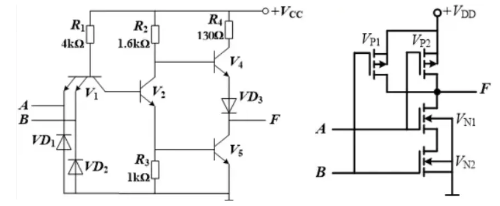
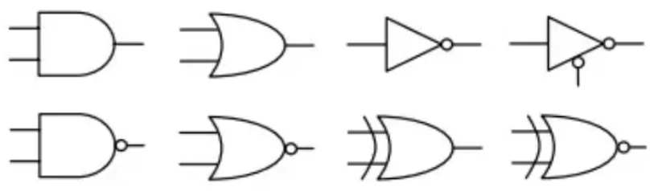
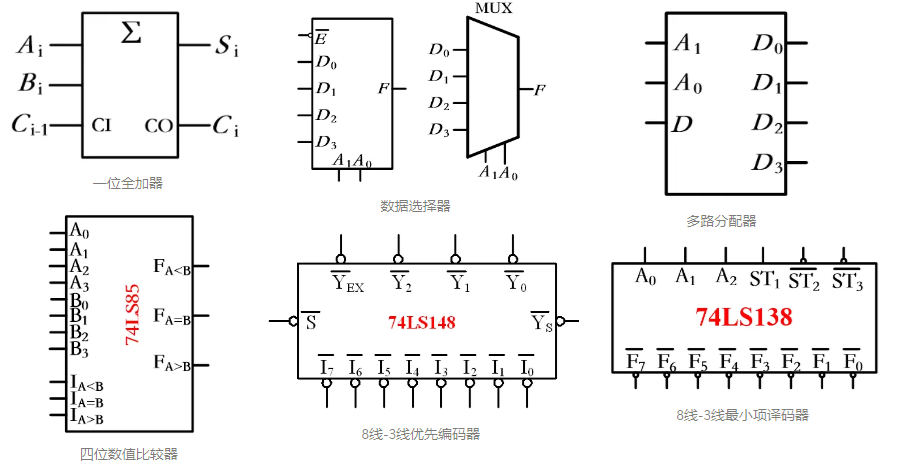
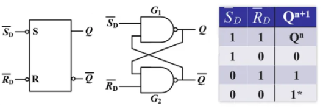
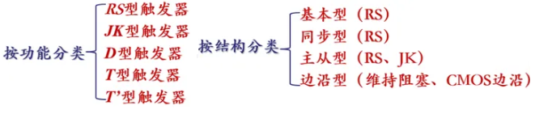
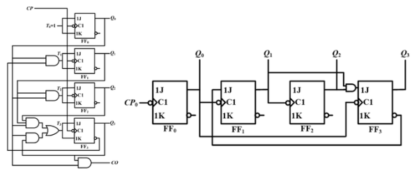
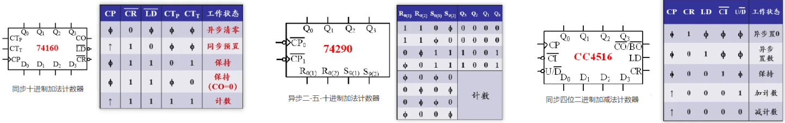
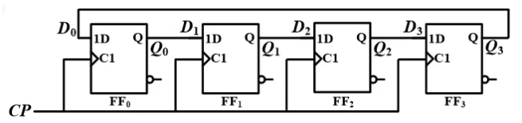
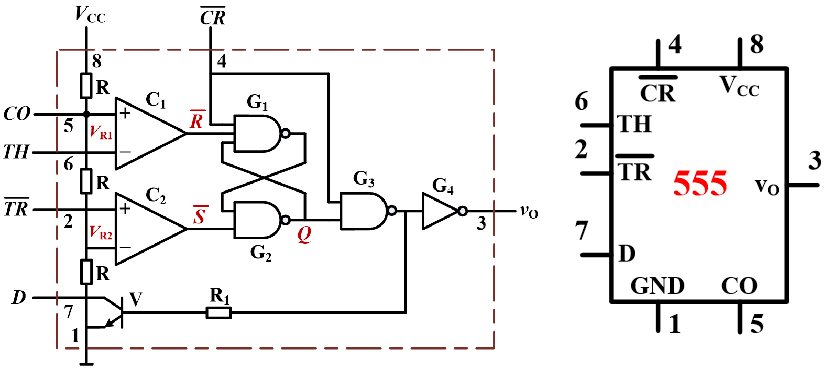
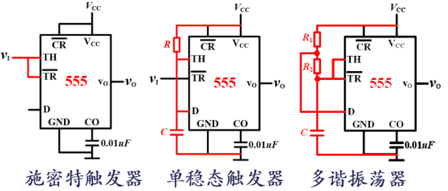

数字电子技术大体上可以分为组合逻辑和时序逻辑两大部分，是理解计算机硬件工作原理的前置知识。从晶体管到逻辑门，再到一个个实用的中规模逻辑电路，最后构成 CPU，内存等部件，从而组合成一台完整的计算机；这个过程可以看作是层层抽象的结果。此外，数电中蕴藏的诸如状态机、计数器、编解码等思想，也可与软件程序设计中对应的概念相互印证。

## 第一章 基本概念

### 1.1 数字信号和数字电路

数字信号是指离散信号的数字化表示，其变化量是最小量的整数倍，精度有限，而处理数字信号的电路就是数字电路，具有易实现、抗干扰、高集成度、便于存储、保密性好等特点。表示数字信号的方法是二值逻辑/二进制。计算机使用二进制表示信息，这些二进制数就是所谓的代码，给每一组代码赋予一定的含义就是编码，计算机用二进制编码数字、文字、图像等一切信息。编码有有权码和无权码之分，常见的有权码有 8421 码、5421 码、2421 码等，无权码有余三码、余三循环码、格雷码等。二进制在物理实现上用高低电平两种状态进行表示，电信号的状态易于区分、抗干扰能力较强。二值逻辑在实现上需要对逻辑电平的标准有统一的规定，即高电平和低电平的电压范围，常用的标准有 TTL、CMOS、RS232。不同的标准对高低电平的定义不尽相同，使用不同逻辑电平标准的器件时，就需要电平转换芯片充当翻译的角色，使得信息能够被准确传递。

数字电路在系统中的基本功能如图

### 1.2 布尔代数及电路实现

布尔代数是专门研究二值逻辑的数学结构，真值表是其中的重要工具，用于列举逻辑表达式(逻辑函数)在所有可能输入情况下的结果。在设计逻辑电路的过程中，有时需要对逻辑函数进行化简，可以使用公式、卡诺图、QM 法等方法完成操作，常见公式和方法具体步骤的资料丰富，此处省略。

布尔代数定义了与、或、非、与非、或非、异或、同或七种基本运算。基本运算叠加复合，可以构成许多实用的逻辑函数。有了逻辑函数的概念后，还需要用电路去实现，以 TTL 和 CMOS 与非门为例，内部结构分别如下

利用二极管、三极管、场效应管等晶体管，可以构成全部七种能完成基本运算的逻辑门，实际使用时都是封装好的成熟芯片，故一般无需掌握其内部结构，但对芯片数据手册中的常用参数(阈值电压、噪声容限、扇出系数、传输延迟时间、动态尖峰电流等)需要了解含义，以便选型。除了七种基本逻辑运算，OC/OD 门和三态门也是常用的两种逻辑门，前者配合上拉电阻用于实现线与的逻辑(线与多根信号线连在一起，一根信号线输出低电平则整个输出低电平)，后者用于实现信号的分时复用，OC/OD 门和普通门电路的符号相同

## 第二章 组合逻辑电路

组合逻辑电路由逻辑门构成，无反馈环节或记忆能力。一般的设计思路为：确定输入输出，列出真值表，化简逻辑函数，用逻辑门实现。常用的逻辑功能已被封装为成熟的芯片，可直接使用这些组件进行更高层次的设计，比如级联或构成功能丰富的系统。同理也无需掌握这些芯片的内部结构，充分理解功能特点以及必要的选型参数参数才是重点。以下是常用的逻辑电路模块举例，其实从名称上便可大体了解引脚含义和使用方式，具体可查阅芯片手册。对于更一般的逻辑芯片，也是查阅其数据手册即可了解其功能

- 全加器：一位二进制数的加法，考虑进位；可级联成多位的加法器；配合补码的概念也可实现减法
- 数据选择器：在多个输入信号中选择一个传输到输出；可级联扩大选择范围
- 多路分配器：将一个输入信号选择传输到多个输出中的一个；可级联扩大选择范围
- 数值比较器：比较两个相同位数的二进制数的大小，可用于标志位的产生；可级联增加比较的位数
- 编码器：将一组二进制代码赋予特定的含义(如表示为对应的十进制数)；可级联增加支持的线数
- 译码器：输入二进制代码，译为 个输出信号；可级联增加支持的线数；还可以将输出信号接到发光二极管上，也就是所谓的显示译码器；当每个输出都是输入变量的最小项时，又称为最小项译码器。最小项译码器可以实现当前输入个数下的任意逻辑函数。

## 第三章 时序逻辑电路

时序逻辑电路由逻辑门和存储器构成，有反馈环节和记忆能力。时序逻辑电路接收信号之前的状态称为初态/原态，用$Q^n$表示，接收信号之后建立的新稳态称为次态/新态，用$Q^{n+1}$表示。所谓有记忆能力，就是指次态同时由输入和初态决定。相较于组合逻辑电路的输入而言，时序逻辑电路更重要的往往是时钟信号/触发信号的输入。复杂系统中，往往用时钟信号/触发信号来保证各个信号的动作在时间上同步。时序逻辑电路的表示方式有时钟方程+驱动方程+输出方程+状态方程，状态转换图，次态卡诺图等。

### 3.1 触发器/寄存器

存储器的基本单元是触发器(Flip-Flop，简称 FF)/寄存器，基本 RS 触发器也叫锁存器(latch)，其基本结构和真值表如下

可见，通过改变输入信号，可以实现对状态 Q 的存储、置位和复位。

触发器的分类如下，它们的思想和基本触发器大同小异，但解决了许多工程上的问题，每一种触发器的特性此处不再赘述

基本 RS 触发器的动作特点是任何时刻输入都能直接改变输出的状态。为了使多个触发器芯片同时更新，引入了时钟信号统一控制的思想，产生了同步 RS 触发器，输入只在时钟控制端为有效电平时可以影响输出。为了解决对信号的约束问题(不允许输入均为有效电平)，引入了主从两级触发器，产生了主从 JK 触发器(也有主从 RS 触发器，弹并未解决问题)。以上触发器均为电平触发型。为了防止有效电平时触发器多次动作，产生了边沿型触发器，输入只在动作沿可以影响输出。另外，这些触发器都有两个稳态，又称双稳态触发器。

这样的触发器/寄存器可以存储一位的信息，将它们并排使用便可以存储更多位数的信息，以及构成移位寄存器等更复杂的存储结构。

### 3.2 计数器/分频器

上面提到，时钟信号是时序逻辑电路中的重要概念，基本原理是来一个时钟脉冲计数器动作一次，常用于计数、分频、定时、产生脉冲序列和节拍脉冲以及进行数学运算等实用功能。实际情况下，往往使用专门的振荡器或晶振产生固定频率的方波信号，对这种方波信号计数，就可以实现较为精确的计时，进一步可以结合传感器完成测速等一系列应用。

计数器可由触发器和逻辑门构成，分为同步计数器和异步计数器，同步计数器所有位的触发器均受时钟信号约束，工作频率高、传输延迟短、结构复杂；而异步计数器低位输出直接控制高位输入，结构简单，存在竞争和冒险产生的尖峰脉冲。下图左侧为同步计数器结构，右侧为异步计数器结构

常用的集成计数器芯片如下

由触发器的不同连接方式，可以实现对不同计数值的跳过，从而实现任意进制的计数器，实现环形计数器、扭环形计数器、提供自启动功能等。

### 3.3 脉冲发生器

除了固定频率的时钟信号外，另外两个常用的触发信号是节拍脉冲信号和串行数字信号，产生两种信号的器件称为顺序脉冲发生器和序列脉冲发生器。顺序脉冲发生器可由计数器或移位寄存器构成，下图为环形计数器构成顺序脉冲发生器

序列脉冲发生器可由计数器和输出电路构成，下图为计数器和数据选择器构成序列脉冲发生器

### 3.4 555 定时器

固定频率的时钟信号可由矩形波振荡电路(对应多谐振荡器)和波形变换电路(对应比较器和施密特触发器)两种方法产生，555 定时器是实现这些功能最常用的芯片，其内部结构如下，运放开环工作，V+>V-则输出高电平，V+<V-则输出低电平

用 555 定时器配合电阻电容，可以接成施密特触发器、单稳态触发器和多谐振荡器

- 施密特触发器：两个稳态，两个阈值电压，传输特性有滞回特性；可用于波形变换、整形和鉴幅
- 单稳态触发器：一个稳态，在外加脉冲下进入暂稳态，经$$t_w$$后返回稳态；$$t_w$$仅取决于电路本身参数，与触发脉宽无关
- 多谐振荡器：两个暂稳态，无需外加脉冲或触发即可在两个暂稳态之间转换，产生矩形脉冲，频率在 kHz 级别，脉冲波的占空比由电阻决定

