## 第一章 概述

自动控制理论的发展可分为三个阶段：经典控制理论，现代控制理论，智能控制理论。经典控制理论主要研究单输入单输出的线性时不变系统。

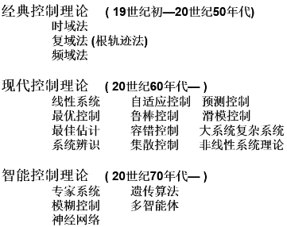

控制系统可分为被控对象和控制装置两部分，控制装置可细分为测量元件、比较元件、放大元件、执行机构、给定元件、校正装置。分析系统的工作原理后，可用方框图对系统进行抽象

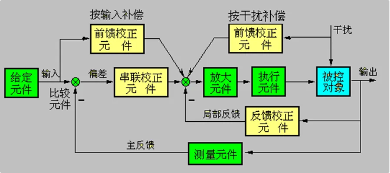

控制系统可简单分为开环系统和闭环系统，开环系统简单但精度不高，本课程主要研究闭环系统，闭环系统满足负反馈原理，将输出信号引回输入端比较，利用偏差进行控制，达到减小偏差消除偏差的目的；其工作特点为系统内部存在反馈，信号流动构成回路，且偏差起调节作用。

控制系统按照给定信号的形式可分为恒值系统和随动/伺服系统；按照是否符合叠加原理分为线性系统和非线性系统；按照系统中是否存在脉冲序列或数码形式的信号分为连续系统和离散系统；按照参数是否随时间变化分为定常系统和时变系统；按照输入输出变量的多少分为单变量系统和多变量系统。

## 第二章 数学模型

系统的数学模型，是描述系统输入输出变量以及内部各变量之间关系的数学表达式。得到数学数学模型的方法有解析法和实验法。解析法(机理分析法)针对白盒系统，可以通过物理规律建立方程并得到输入输出间的关系；实验法(系统辨识法)则针对灰盒或黑盒系统，给系统施加测试信号并记录输出响应，用适当的数学模型去逼近系统的输入输出特性。

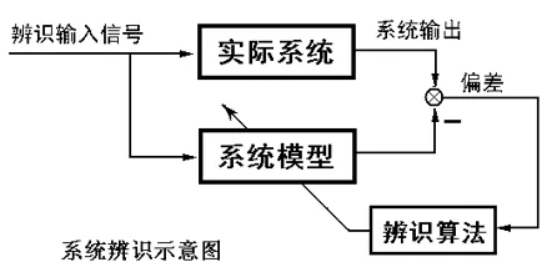

在经典控制理论视角下，建模就是从真实系统得到传递函数的过程。系统模型的建立过程可以用以下框图来描述，上半部分是时域方法，下半部分是复数域方法；完全从时域角度建模的过程往往比较繁琐，因此将模型利用拉普拉斯变换转化到复数域内进行操作。

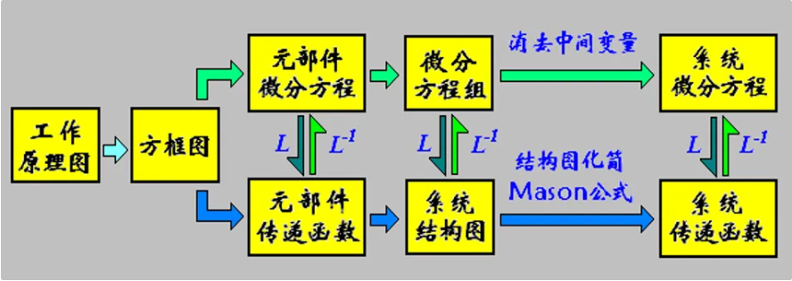

### 求解微分方程

经典控制原理解决问题的框架建立在线性定常系统上，其时域数学模型为线性常系数微分方程，一般形式如下，一般默认$$r(t)$$为输入，$$c(t)$$为输出(汉语拼音的“入“和”出“)

$$
\begin{aligned}
&a_{n} \frac{\text{d}^n c(t)}{\text{d}t^n} + a_{n-1} \frac{\text{d}^{n-1} c(t)}{\text{d}t^{n-1}} + \cdots + a_{1} \frac{\text{d}c(t)}{\text{d}t} + a_{0} c(t)\\
=&b_{m} \frac{\text{d}^m r(t)}{\text{d}t^m} + b_{m-1} \frac{\text{d}^{m-1} r(t)}{\text{d}t^{m-1}} + \cdots + b_{1} \frac{\text{d}r(t)}{\text{d}t} + b_{0} r(t)\\
\end{aligned}
$$

线性系统满足叠加原理。线性不线性看变量(注意含常数项属于非线性)，定常不定常看系数。

对于非线性系统的微分方程，可在平衡点$$a$$附近展开泰勒级数并忽略高阶项，将方程线性化

$$
\begin{aligned}
f(x) &= f(a) + f'(a)(x - a) + \frac{f''(a)}{2!}(x - a)^2 + \frac{f'''(a)}{3!}(x - a)^3 + \ldots \\
&\approx f(a) + f'(a)(x - a)
\end{aligned}
$$

微分方程的通用解法比较繁琐，一般借助拉普拉斯变换变换到复数域，将微分方程变换为代数方程，求解后再反变换回时域。笔算求反变换的方法称为为部分分式法：将式子拆成常用变换对和性质可直接得出的基本单元，查表求出。

对线性常系数微分方程的一般形式作双边拉普拉斯变换得到(实际系统$$n > m$$)

$$
C(s) = \frac{\left( b_{m} s^m + b_{m-1} s^{m-1} + \ldots + b_{1} s + b_{0} \right)}{\left( a_{n} s^n + a_{n-1} s^{n-1} + \ldots + a_{1} s + a_{0} \right) } R(s)
$$

给定具体的$$R(s)$$后，可分解$$C(s)$$并求出反变换

- 无重根时

$$
\begin{aligned}
C(s) &= \frac{C_{1}}{s - \lambda_{1}} + \frac{C_{2}}{s - \lambda_{2}} + \cdots + \frac{C_{n}}{s - \lambda_{n}} \\
C_{i} &= \lim_{s \to p_{i}}(s - p_{i}) \cdot F(s) = \lim_{s \to p_{i}}(s - p_{i}) \cdot \frac{b_{m} s^m + b_{m-1} s^{m-1} + \dots + b_{0}}{(s - p_{1}) \cdots (s - p_{i}) \cdots (s - p_{n})} \\
c(t) &= \mathcal{L}^{-1}[C(s)] = C_{1} \text{e}^{\lambda_{1} t} + C_{2} \text{e}^{\lambda_{2} t} + \cdots + C_{n} \text{e}^{\lambda_{n} t}
\end{aligned}
$$

其中$$\lambda_{i}$$为特征根，也称极点；$$\text{e}^{\lambda_{i}}$$称为相对于$$\lambda_{i}$$的模态，也称振型；模态是构成系统单位脉冲响应最简单的形式，单位脉冲响应是模态的加权组合，对应的系数在复变函数中称为留数。

- 有重根时(设$$p_{1}$$为$$m$$重根，其余为单根)

$$
\begin{aligned}
C(s) &= \frac{C_{m}}{(s - p_{1})^m} + \frac{C_{m-1}}{(s - p_{1})^{m-1}} + \cdots + \frac{C_{1}}{s - p_{1}} + \frac{C_{m+1}}{s - p_{m+1}} + \cdots + \frac{C_{n}}{s - p_{n}} \\
C_{m} &= \lim_{s \to p_{1}} (s - p_{1})^m \cdot F(s) \\
C_{m-1} &= \frac{1}{1!} \lim_{s \to p_{1}} \frac{\text{d}}{\text{d}s} \left[(s - p_{1})^m \cdot F(s)\right] \\
&\vdots \\
C_{m-j} &= \frac{1}{j!} \lim_{s \to p_{1}} \frac{\text{d}^j}{\text{d}s^j} \left[(s - p_{1})^m \cdot F(s)\right] \\
&\vdots \\
C_{1} &= \frac{1}{(m-1)!} \lim_{s \to p_{1}} \frac{\text{d}^{(m-1)}}{\text{d}s^{m-1}} \left[(s - p_{1})^m \cdot F(s)\right] \\
c(t) &= \mathcal{L}^{-1}[C(s)] = \left[ \frac{C_{m}}{(m-1)!} t^{m-1} + \frac{C_{m-1}}{(m-2)!} t^{m-2} + \cdots + C_{2} t + C_{1} \right] \text{e}^{p_{1} t} + \sum_{i=m+1}^{n} C_{i} \text{e}^{p_{i} t}
\end{aligned}
$$

### 传递函数

影响系统响应的因素有输入、初始条件和系统的结构参数：输入一般规定为单位阶跃信号$$1(t)$$，因为方便实现并且也是对系统对严苛的输入；初始条件一般规定为零初始条件，实际系统中给输入信号前通常处于平衡状态。于是，系统响应便取决于系统的结构参数，因此为了提高系统响应，就需要根据一定的理论设计系统结构参数。

规定系统在零初始条件下，输出拉氏变换与输入拉氏变换之比，为系统的传递函数。分式中分子和分母的零点分别称为传递函数的零点和极点，零极点包含了丰富的信息，后续详细分析。传递函数只和系统自身的结构参数有关，和微分方程一一对应且可以相互转化。

$$
\frac{C(s)}{R(s)} = \frac{b_{m} s^m + b_{m-1} s^{m-1} + \cdots + b_{1} s + b_{0}}{a_{n} s^n + a_{n-1} s^{n-1} + \cdots + a_{1} s + a_{0}} = G(s)
$$

将分子分母首项(最高次)系数化为$$1$$，称为首一标准型

$$
\begin{aligned}
\frac{C(s)}{R(s)} &= \frac{b_{m}}{a_{n}}\cdot\frac{s^m + \frac{b_{m-1}}{b_{m}} s^{m-1} + \cdots + \frac{b_{1}}{b_{m}} s + \frac{b_{0}}{b_{m}}}{s^n + \frac{a_{n-1}}{a_{n}} s^{n-1} + \cdots + \frac{a_{1}}{a_{n}} s + \frac{a_{0}}{a_{n}}} = G(s)\\
G(s) &= \frac{K^* \prod_{j=1}^{m} (s - z_{j})}{\prod_{i=1}^{n} (s - p_{i})}
\end{aligned}
$$

类似的，将分子分母尾项(最低次，不一定是常数项)化为$$1$$，称为尾一标准型。尾一标准型前的系数$$K$$称为增益

$$
\begin{aligned}
\frac{C(s)}{R(s)} &= \frac{b_{0}}{a_{0}}\cdot\frac{\frac{b_{m}}{b_{0}} s^m + \frac{b_{m-1}}{b_{0}} s^{m-1} + \cdots + \frac{b_{1}}{b_{0}} s + 1 }{\frac{a_{n}}{a_{0}} s^n + \frac{a_{n-1}}{a_0} s^{n-1} + \cdots + \frac{a_{1}}{a_{0}} s + 1} = G(s)\\
G(s) &= K \frac{\prod_{k=1}^{m_{1}} (\tau_{k} s + 1) \prod_{l=1}^{m_{2}} (\tau_{l}^2 s^2 + 2 \tau_{l} \xi_{l} s + 1)}{s^v \prod_{i=1}^{n_{1}} (T_{i} s + 1) \prod_{j=1}^{n_{2}} (T_{j}^2 s^2 + 2T_{j} \xi_{j} s + 1)}
\end{aligned}
$$

注意，负号不用提出来，要保证$$K^*$$或$$K$$为正

传递函数是单位脉冲响应的拉氏变换，与系统零极点图对应。原则上，传递函数不反映非零初始条件时系统响应的全部信息，适合于描述 SISO 系统，且只能用于表示线性定常系统。

### 典型系统框图

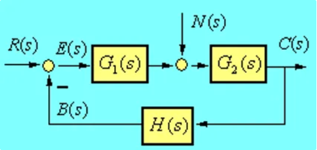

- 开环传递函数：将闭环系统主反馈通路断开对应的开环传递函数，化为尾一标准型后的系数称为开环增益

  $$
  G(s)N(s) = \frac{B(s)}{E(s)} = G_{1}(s)G_{2}(s)H(s)
  $$

- 输入作用下的闭环传递函数：根据输出的不同选取，分为输入作用下的闭环传递函数和误差传递函数。使闭环传递函数分母为零的方程称为特征方程，单位反馈的特征方程为开环传递函数分子分母之和。

  $$
  \begin{aligned}
  \Phi(s) &= \frac{C(s)}{R(s)} = \frac{G_{1}(s)G_{2}(s)}{1 + G_{1}(s)G_{2}(s)H(s)} \\ \Phi_\text{e}(s) &= \frac{E(s)}{R(s)} = \frac{1}{1 + G_{1}(s)G_{2}(s)H(s)}\\
  \end{aligned}
  $$

- 干扰作用下的闭环传递函数：同理分为干扰作用下的闭环传递函数和误差传递函数

  $$
  \begin{aligned}
  \Phi_\text{n}(s) = \frac{C(s)}{N(s)} = \frac{G_{2}(s)}{1 + G_{1}(s)G_{2}(s)H(s)} \\
  \Phi_\text{en}(s) = \frac{E(s)}{N(s)} = \frac{-G_{2}(s) \cdot H(s)}{1 + G_{1}(s)G_{2}(s)H(s)}\\
  \end{aligned}
  $$

- 系统总输出和总误差：根据叠加原理，为两个输入分别作用时的输出之和/误差之和

  $$
  \begin{aligned}
  C(s) &= \frac{G_{1}(s)G_{2}(s) \cdot R(s)}{1 + G_{1}(s)G_{2}(s)H(s)} + \frac{G_{2}(s) \cdot N(s)}{1 + G_{1}(s)G_{2}(s)H(s)} \\
  E(s) &= \frac{-R(s)}{1 + G_{1}(s)G_{2}(s)H(s)} + \frac{-G_{2}(s) \cdot H(s) \cdot N(s)}{1 + G_{1}(s)G_{2}(s)H(s)}\\
  \end{aligned}
  $$

### 典型环节

将数学模型形式相同的元件归为同一类，称为环节；将其中最常用最具代表性的环节总结出来，称为典型环节

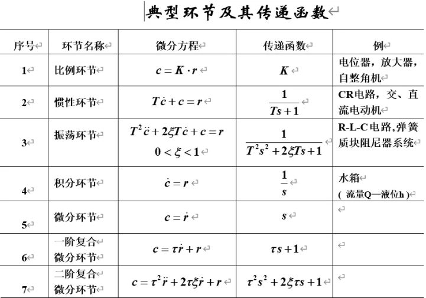

任意传递函数分解开化为尾一标准型，都是典型环节的乘积，即典型环节可看作构成传递函数的基本单元。不同的元部件可以有相同的传递函数，同一元部件选择不同的输入输出变量也可以有不同的传递函数。

另外，需要注意传递函数的负载效应问题，比如对于一个电路端口网络，是否将后级网络断开，得到的传递函数是不同的。

### 结构图及等效变换

将方框图的各个元件都转化为环节，就得到了系统的结构图；另外，也可以描述系统的各个微分方程拉氏变换为子结构图，再连接得到系统的结构图。结构图已经可以精确描述系统的输入输出关系。

从结构图得到传递函数的一个方法是在结构图上进行等效化简，化简规则如下

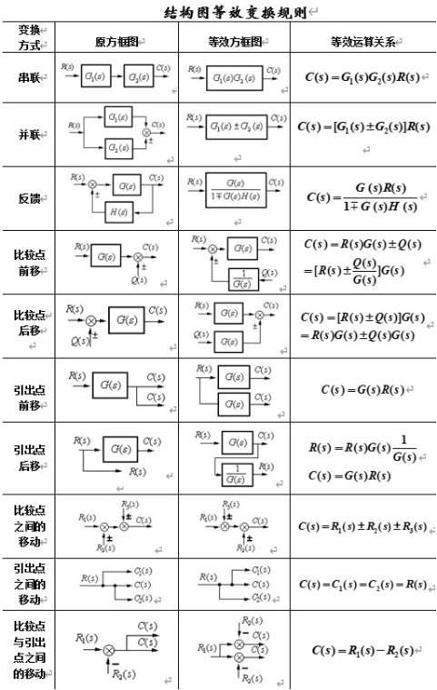

化简的窍门是：先观察相邻的比较点和引出点，尝试比较点之间和引出点之间互换以简化问题；如果不能得到简化，就需要交换比较点和引出点。

### 梅森增益公式

从结构图得到传递函数的另一种方法是梅森增益公式，梅森增益公式原本是建立在信号流图基础上的。为了介绍梅森增益公式，先介绍信号流图及相关概念。信号流图与结构图等价，是由节点和支路组成的信号传递网络，节点代表物理量，支路和支路增益分别代表环节和环节传递函数。既有输入又有输出的混合节点，在转化为方框图时先比较再引出。前向通路是从输入节点到输出节点传递时，每个节点只通过一次的通路；回路是起点和终点重合，且信号通过每一节点不多于一次的闭合通路；回路之间没有公共节点叫不接触回路。

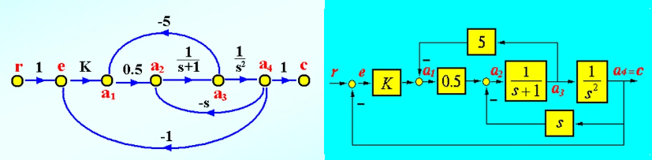

梅森增益公式：

$$
G(s) = \frac{1}{\Delta} \sum_{k=1}^{n} P_{k} \Delta_{k}
$$

其中，$$\Delta = 1 - \sum L_{a} + \sum L_{b} L_{c} - \sum L_{d} L_{e} L_{f} + \ldots$$为特征式，$$\sum L_{a}、\sum L_{b} L_{c}、\sum L_{d} L_{e} L_{f}$$分别为所有回路增益之积、两两互不接触回路之积、三个互不接触回路之积，$$n$$为前向通路条数，$$P_{k}$$为第$$k$$条前向通路的总增益，$$\Delta_{k}$$为第$$k$$条前向通路的余子式(去掉与第$$k$$条前向通路接触的回路，剩余回路构成的子特征式)。

## 第三章 时域分析

时域法直接在时间域中分析和校正系统，可以系统系统时间响应的全部信息，直观而准确，但基于求解系统输出的解析解比较繁琐，一方面是对于高阶系统难以计算解析解，另一方面是每次修改系统结构参数都需要重新计算。

### 时域动态性能指标

动态性能指标在阶跃响应下定义

1. 延迟时间$$t_\text{d}$$：第一次达到终值 50%的时间
2. 上升时间$$t_\text{r}$$：对于无振荡的系统，指响应从终值 10%上升到终值 90%的时间；对于有振荡的系统，指从零第一次上升到终止所需的时间
3. 峰值时间$$t_\text{p}$$：响应超过其终值并达到第一个峰值所需要的时间，是极值点；令一阶导等于 0 可得
4. 调节时间$$t_\text{s}$$：响应到达并保持在终值 5%或 2%以内的所需的最短时间
5. 超调量$$\sigma\%$$：指响应的最大偏移量与终值的差与终值与初值的差的百分比

常用上升时间，调节时间评价响应速度，用超调量评价阻尼程度。

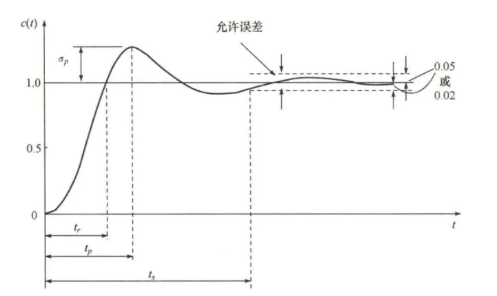

动态性能指标的求解方式：由系统结构图求传递函数，再得到输出表达式，再根据定义计算即可 。

改变闭环增益或输入信号乘一个系数，不影响动态性能指标。减小开环增益可以减小系统超调量(减小稳态误差)

### 时域稳定性分析

稳定是控制系统正常工作的首要条件。在扰动作用下系统偏离平衡位置，如果扰动消除后系统能够以足够的准确度恢复原来的平衡状态，则系统是稳定的，否则不稳定(注意将临界稳定也归为不稳定)。系统的稳定性是自身的属性，与输入无关。

稳定的充要条件是，系统单位脉冲响应终值为 0，即$$\lim_{t \to \infty} k(t) = 0$$。根据输出表达式$$k(t) = \sum_{i=1}^n A_{i} \text{e}^{\lambda_{i} t}$$可得，该条件等价于系统所有闭环极点具有负实部，即严格位于$$s$$平面左半面。

极点由特征多项式决定，特征多项式由系统结构图的回路决定，前馈通道不构成回路因此不影响稳定性。另外，开环稳定与闭环稳定之间没有联系。

对于高阶系统，找出所有极点逐一判断是否位于左半面是困难的，因此需要稳定性判据以简化操作。

- 必要条件：将特征多项式最高次项系数化为正，若所有系数均严格大于 0，才有可能稳定(注意缺项表示系数为 0，一定不稳定)。
- 劳斯判据：由特征多项式列劳斯表，注意特殊情况处理，第一列全为正且没有特殊情况造成的虚轴或右半平面的根，则系统稳定。

  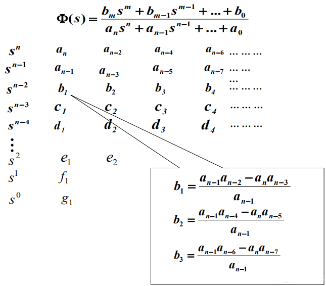

### 稳态误差

稳态性能指标：稳态误差，是对系统控制精度的度量。理论分析中一般指考虑系统的原理性误差，而不考虑由于局部非线性引起的误差。在阶跃输入作用下没有原理性误差的系统称为无差系统，反之称为有差系统。

稳定性由稳态误差定量描述，分为按输入端定义的(又称偏差)和按输出端定义的

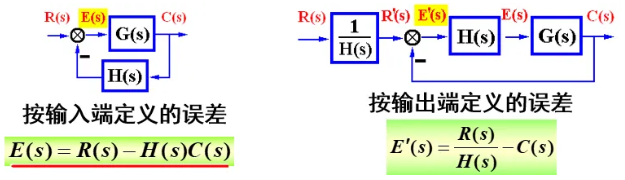

根据系统是否稳定又可分为静态误差和动态误差：系统稳定时为误差在时间趋于无穷时的常值$$e_\text{ss}$$；系统不稳定时为误差中的稳态分量$$e_\text{s}(t)$$。

稳态速度误差表示输入速度信号时的位置误差，稳态加速度误差表示输入加速度信号时的位置误差。

系统是否稳定，与系统稳态误差是否为无穷大，是两个截然不同的概念。讨论稳态误差时，默认系统已经稳定了。另外，由于输入信号和扰动信号作用于系统的不同位置，即使系统对于某种形式的输入信号稳态误差为零，对于同种形式的扰动信号的稳态误差则未必为零。

#### 终值定理求稳态误差

判定函数稳定性—>求误差传递函数$$\Phi_\text{e}(s) = \frac{E(s)}{R(s)}、\Phi_\text{en}(s) = \frac{E(s)}{N(s)}$$—>终值定理求稳态误差$$e_\text{ss} = \lim_{s \to 0} s \left[ \Phi_\text{e}(s) R(s) + \Phi_\text{en}(s) N(s) \right]$$

影响$$e_\text{ss}$$的因素包括系统自身的结构参数、外作用的类型(控制量、扰动量以及作用点)、外作用的形式(阶跃、斜坡、加速度)。

#### 静态误差系数求稳态误差

用于计算**无前馈作用**时，**输入作用**下的稳态误差

闭环系统的开环传递函数如下，其中$$K$$为开环增益，$$v$$为系统型别(开环传递函数中积分环节的个数)(注意两个量都是针对**开环传递函数**而言的)

$$
G(s) = G_{1}(s)H(s) = \frac{K(\tau_{1}s+1) \cdots (\tau_{m}s+1)}{s^{v}(T_{1}s+1) \cdots (T_{n-v}s+1)} = \frac{K}{s^v}G_{0}(s) \quad 其中\lim_{s \to 0} G_{0}(s) = 1
$$

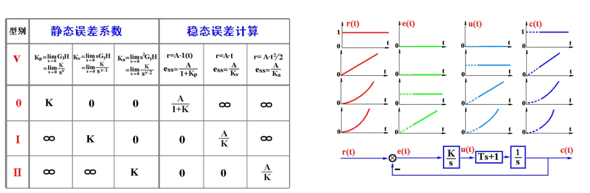

#### 动态误差系数求误差稳态分量

静态误差系数法只能求出误差的稳态值$$e_\text{ss}$$，无法获得其随时间变化的规律，而动态误差系数法可以获得误差中稳态分量$$e_\text{s}(t)$$随时间的变化规律。

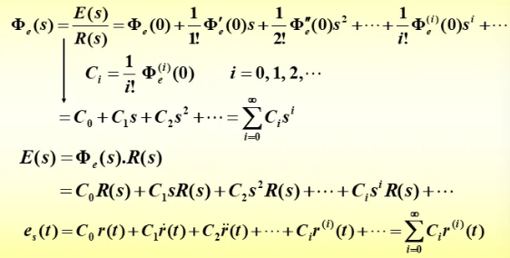

实际系统中，输入$$r(t)$$为$$t$$的有限次多项式，求导几次后就为 0 了，因此$$e_\text{s}(t)$$也是有限项的多项式；另外，实际系统中，有时不要求系统在时间无穷时误差稳定，只要求在一定时间内，系统误差不超过某个阈值即可。

### 改善稳态误差的方式

- 增加积分环节或增大开环增益可减小静态误差，但另一方面，积分环节的增加使得闭环时的特征多项式缺项的可能性更大，在开环传递函数中需要加更多的符合微分环节才可能使系统稳定，即使系统稳定的难度提高了。

- 在主反馈口到干扰作用点之间的前向通道中提高增益、设置积分环节，可以同时减小或消除控制输入和干扰作用下产生的稳态误差。

  

- 采用串级控制的方式，可显著抑制内回路的扰动。

- 如果系统存在强扰动，尤其是低频强扰动，可针对扰动设计前馈控制，用前馈+反馈的复合控制方式，可以极大地减小乃至消除稳态误差，而且可以抑制几乎所有地可测量扰动。

### 典型系统分析

#### 一阶系统

典型结构，其中$$T$$为时间常数

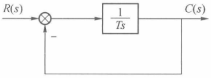

开环传递函数：$$\Phi(s) = \frac{1}{Ts}$$

闭环传递函数：$$\Phi(s) = \frac{1}{Ts + 1}$$

动态性能指标上，$$t_\text{s} = 3T$$

一阶系统典型响应如图：

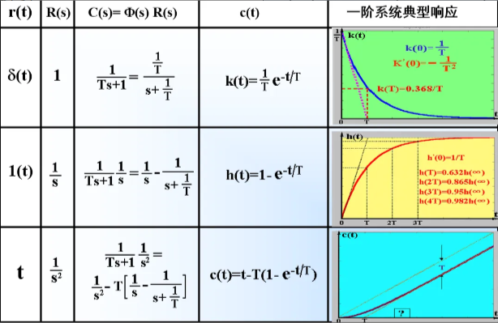

#### 二阶系统

典型结构，其中$$\zeta$$为阻尼比，$$\omega_\text{n}$$为无阻尼自然频率，$$\sigma = \zeta \omega_\text{n}$$称为衰减系数，$$\omega_\text{d} = \omega_\text{n} \sqrt{1 - \zeta^2}$$称为阻尼振荡频率($$\zeta \geqslant 1$$时没有这个概念，因为此时的响应只衰减不振荡)，$$\beta = \arccos \zeta$$称为阻尼角

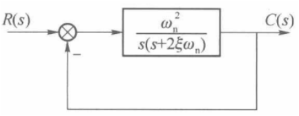

开环传递函数：$$G(s) = \frac{\omega_\text{n}^2}{s^2 + 2\zeta\omega_\text{n}s}$$

闭环传递函数：$$G(s) = \frac{\omega_\text{n}^2}{s^2 + 2\zeta\omega_\text{n} s + \omega_\text{n}^2}$$

根据$$\zeta$$的不同，二阶系统的典型响应形式也有差异：

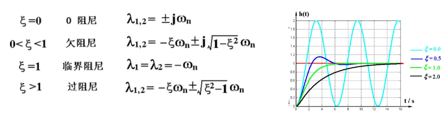

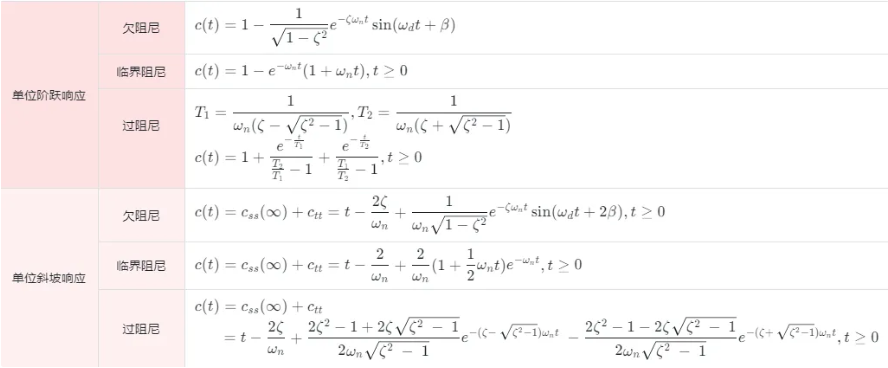

动态性能指标上，对临界阻尼和过阻尼，超调量为 0，计算调节时间。解出分母特征方程的根$$\lambda_{1}、\lambda_{2}$$，$$\lambda_{1} = -\frac{1}{T_{1}}$$，$$\lambda_{2} = -\frac{1}{T_{2}}$$，得到$$\frac{T_{1}}{T_{2}}$$，查阅$$\frac{t_\text{s}}{T_{1}}-\frac{T_{1}}{T_{2}}$$的函数关系，即可得到$$t_\text{s}$$。

对欠阻尼，可按照流程正常求取动态性能指标，得$$t_\text{p} = \frac{\pi}{\omega_\text{d}} = \frac{\pi}{\sqrt{1-\zeta^2}\omega_\text{n}}$$、$$\sigma\% = \text{e}^{\frac{-\zeta\pi}{\sqrt{1-\zeta^2}}} \times 100\%$$(注意超调量只与阻尼比有关)

欠阻尼响应曲线在包络线之间衰减振荡，其调节时间按照包络线计算，结果为$$t_\text{s} \approx \frac{3.5}{\omega_\text{n}}(5\%误差带)$$或$$t_\text{s} \approx \frac{4}{\omega_\text{n}}(2\%误差带)$$。当$$\omega_\text{n}$$确定时，$$\zeta = 0.707$$(最佳阻尼比)时，$$t_\text{s}$$实际最小。(欠阻尼时才有这个公式，过阻尼没有)

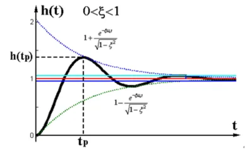

欠阻尼二阶系统动态性能随极点位置的变化规律

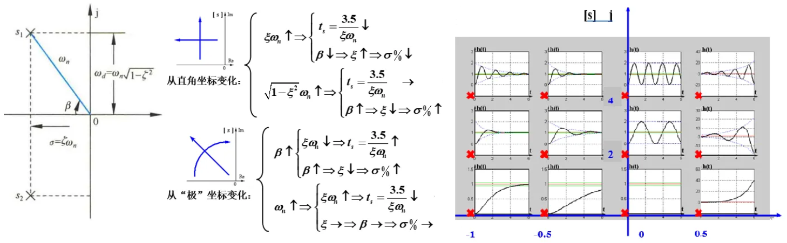

改善二阶系统动态性能的措施

此处介绍两种方式：测速反馈和比例微分，测速反馈本质上是增加阻尼(如 PID 控制中的内环)，用于系统阻尼不够的情况；而比例微分则实际上是提前控制。引入误差的比例微分控制可减小系统超调量。

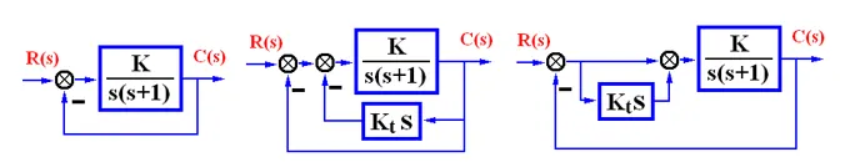

#### 高阶系统

离虚轴较近的极点称为主导极点，决定响应曲线的大致形状；而离虚轴较远的极点其对应模态衰减迅速，对响应曲线贡献不多。一般的物理系统都可以用一阶、二阶系统来表示。而在实际系统中，往往因为有局非线性环节或误差的存在，实际的系统模型可能不止二阶，此时会略去非主导零极点和不非常靠近虚轴的偶极子，保留主导极点，将系统近似为低阶系统。

对于高阶系统，有经验公式可以估算动态性能指标。$$(35° \leqslant \gamma \leqslant 90°)$$且$$(1 \leqslant M_\text{r} \leqslant 1.8)$$时精确程度较高

$$
\begin{aligned}
\sigma\% &= \left[ 0.16 + 0.4\left(M_\text{r} -1\right) \right]\times 100\%\\
t_\text{s} &= \frac{\pi}{\omega_\text{c}}\left[ 2 + 1.5\left(M_\text{r} - 1\right) + 2.5 \left(M_\text{r} - 1\right)^2 \right]\\
M_\text{r} &= \frac{1}{\vert \sin \gamma \vert}
\end{aligned}
$$

## 第四章 根轨迹法

根轨迹法是三大分析校正方法之一，是一种直观形象的图解方法，适合于研究系统某一参数变化时，系统性能的变化趋势。定义为：系统某一参数从$$0 \to \infty$$变化时，**闭环极点**在$$s$$平面相应变化描绘出的轨迹。注意，根轨迹只会给出随着根轨迹增益变化而变化的闭环极点轨迹，对于不随根轨迹变化的闭环极点以及所有闭环零点，根轨迹是体现不出信息的。

根轨迹法的根本任务在于，由已知的开环零级点分布以及根轨迹增益，通过图解的方式，找出闭环极点；从而确定闭环传函的形式，反变换得到闭环时间响应。(由开环传函得闭环性质)

根轨迹法研究时，习惯把开环传递函数写成首一标准型，其系数称为根轨迹增益$$K^*$$，根轨迹增益的概念仅针对开环而言。但根轨迹一定是闭环根轨迹，没有开环根轨迹的说法。由于开环传递函数写成尾一标准型时，对应的系数称为开环增益，因此开环增益与根轨迹增益之间存在比例关系

$$
K = K^* \frac{\prod_{i=1}^{m} |z_{i}|}{\prod_{j=1}^{n} |p_{j}|}
$$

### 零极点分析

- 对于动态性能指标：极点决定响应模态形式，零点影响响应模态系数，均影响动态性能。

- 响应分量的衰减速度与极点实部值和该处留数有关，即闭环零极点的相互位置。

- 对于稳定性：系统稳定与否只取决于闭环极点，与闭环零点无关。

- 极点与频率轴上某个频率对应时，会导致该频率处的增益降低或相位滞后；零点与频率轴上某个频率对应时，会导致该频率处的增益增加或相位提前

- 在系统中附加开环负实数零点，可把根轨迹向左拉，有利于提高动态性能；附加开环极点，会把轨迹向右拉。越靠近虚轴作用越强。加开环零极点会影响原有闭环零极点，且要把附加环节设计在闭环里边。附加闭环极点增大阻尼，减小超调量，峰值时间滞后，调节时间不一定；附加闭环零点减小阻尼，增大超调量，峰值时间提前，调节时间不一定。加闭环零极点不影响原有闭环零极点，且要加在闭环外边。无论开环闭环，零极点离虚轴越近作用越明显。

- 以下面的例子说明开环零极点和闭环零极点之间的关系：

  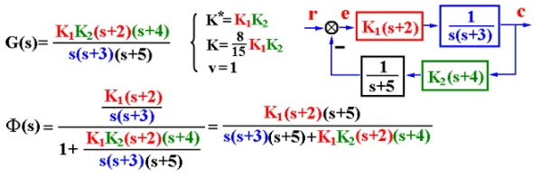

  闭环零点为前向通路开环零点+反馈通路开环极点，不随根轨迹增益变化而变化；闭环极点与开环零极点和根轨迹增益(也是开环概念)均有关系，因此根轨迹法可以做到由开环传递函数研究闭环极点。

### 根轨迹方程

闭环极点满足特征方程，将特征方程稍加变形便得到根轨迹方程。

假设系统有 m 个开环零点和 n 个开环极点

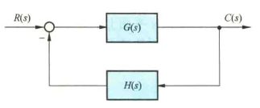

$$
\begin{aligned}
G(s)H(s) &= K^* \frac{\prod_{i = 1}^{m}(s - z_{i})}{\prod_{j = 1}^{n}(s - p_{j})} \\
\Phi(s) &= \frac{G(s)}{1 + G(s)H(s)} \\
\end{aligned}
$$

由特征方程$$1+G(s)H(s) = 0$$可得根轨迹方程：

$$
K^* \frac{\prod_{i = 1}^{m}(s - z_{i})}{\prod_{j = 1}^{n}(s - p_{j})} = -1
$$

将该向量方程拆开便可以得到根轨迹上的点应该满足的相角条件和幅值条件

$$
\begin{aligned}
&\sum_{i = 1}^{m}\angle (s - z_{i}) - \sum_{j = 1}^{n}\angle (s - p_{j}) = (2k + 1)\pi \\
&K^* = \frac{\prod_{j = 1}^{n}|s - p_{j}|}{\prod_{i = 1}^{m}|s - z_{i}|}
\end{aligned}
$$

一般由相角条件判断某个点是否在根轨迹上(是否为特征根)，若在根轨迹上再由幅值条件求出该点对应的根轨迹增益。反过来说，想放置极点在某一特定位置，只需要调整根轨迹增益即可。

### 根轨迹绘制法则

- 法则一：根轨迹起始于开环极点，终止于开环零点；如果开环极点个数 n 大于开环零点个数 m，则有 n-m 条根轨迹终止于无穷远处。
- 法则二：根轨迹的分支数=开环极点数；根轨迹连续且对称于实轴。若开环零极点均为偶数个，且关于一条平行于虚轴的直线左右对称分布，则根轨迹一定关于该直线左右对称。
- 法则三：从实轴上最右端的开环零、极点算起，奇数开环零极点到偶数开环零极点之间的区域必是根轨迹；反之在这个区域之外的必不是根轨迹。
- 法则四：$$n-m ≥ 2$$时，闭环根之和保持一个常值$$\sum_{i=1}^{n} p_{i} = -a_{n-1}$$；一部分根左移，另一部分根必定右移。定理：若系统有 2 个开环极点，1 个开环零点，且在复平面存在根轨迹，则复平面的根轨迹一定是以该零点为圆心的圆弧。
- 法则五：$$n > m$$时，$$n-m$$条(无零点归宿的)根轨迹沿渐近线趋于无穷远，渐近线与实轴交点和实轴正方向夹角满足

  $$
  \sigma_{a} = \frac{\sum_{i=1}^{n} p_{i} - \sum_{j=1}^{m} z_{j}}{n - m}\\ \varphi_{a} = \frac{(2k + 1)\pi}{n - m}
  $$

- 法则六：根轨迹在实轴上分离点坐标$$d$$和分离角$$\phi$$满足下式，无零点时右端为 0，$$l$$为根轨迹条数
  $$
  \sum_{i=1}^{n} \frac{1}{d - p_{i}} = \sum_{j=1}^{m} \frac{1}{d - z_{j}}\\ \phi = \frac{(2k+1)\pi}{l}
  $$
- 法则七：与虚轴交点是系统临界稳定点，对应特征根为$$s = \text{j}\omega$$，具体值可在特征方程(注意是闭环传递函数的分母)中令$$s = \text{j}\omega$$，实部虚部分别为 0 解出$$\omega$$和$$K^*$$(注意开环增益和根轨迹增益之间有个比例关系)；或由劳斯表构造全零行，通过辅助方程求出。

- 法则八：根轨迹离开开环复数极点的出射角(又称起始角)，进入开环复数零点的入射角(又称终值角)满足下式(补一个距离计算点极小的点零点或极点(算出射角补零点，算入射角补极点)，将店与计算点连线与实轴正方向夹角认为是出射角或入射角)
  $$
  \sum_{j=1}^{m} \angle(s - z_{j}) - \sum_{i=1}^{n} \angle(s - p_{i}) = (2k + 1)\pi
  $$

小结：绘制根轨迹的步骤大致为，画出开环零极点，画实轴上的根轨迹，对于没有归宿的根轨迹，再根据需要计算渐近线、分离点，穿过虚轴时计算交点，不在实轴上的点需要计算出射角或入射角。

### 参数根轨迹

除$$K^*$$外其它参数变化时的根轨迹称为参数根轨迹(广义根轨迹)。绘制参数根轨迹的方法为，由闭环传递函数写出将特征方程，含参部分作为分子，其余部分作为分母(但当这样做导致分子次数较高时需要含参部分作为分母，其余部分作为分子，然后变形为参数的倒数放在分子)，构成等效开环传递函数，形式便与正常根轨迹一样了。注意等效开环传递函数仅可用于绘制参数根轨迹，其余计算分析需用原始传递函数。

系统处于正反馈时的根轨迹称为零度根轨迹，根轨迹方程右边从-1 变为 1，绘制法则中涉及相角条件的渐近线夹角、出射角入射角从$$(2k+1)\pi$$变为$$2k\pi$$，以及实轴根轨迹变为偶数开环零极点到奇数开环零极点之间的区域是根轨迹。其余法则不变。

根轨迹不作特殊说明，参数为根轨迹增益，且为 180° 根轨迹(常规根轨迹)。

### 根轨迹法分析动态性能

事实上，计算机中可以很方便地绘制准确的根轨迹，相较于手绘根轨迹的法则，更重要的其实是解析根轨迹蕴含的丰富信息。根轨迹可以知道参数变化时闭环极点的变化，闭环极点的位置，就对应了系统性能指标；因此，由根轨迹图，就可以知道参数如何变化才能满足性能要求。另外，在根轨迹 / 零极点图上，还可以由几何方法分析求取系统函数在某一复数上的值；通过对该向量终点和零极点相连所构成的向量进行运算，可以得到系统函数在该复数上的值。

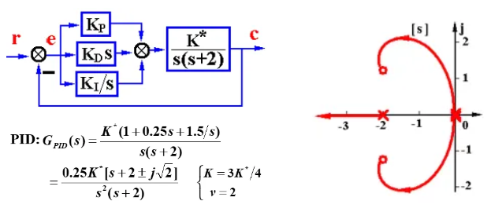

用根轨迹法分析动态性能的大致步骤为：绘制根轨迹、由指标要求确定闭环极点位置(相角条件、模值条件、解根、试根、根之和、比较系数、长除法……)、确定闭环零点(前向通道开环零点+反馈通道开环极点)(注意此步需要写出完整的传递函数，并标出完整的闭环零极点)、保留主导极点(注意增益要保留下来)并估算系统性能。

## 第五章 频域分析

控制系统中的信号可分解为不同频率正弦信号的合成，频域分析就是在研究稳态正弦响应的幅值和相角随频率的变化规律，由开环或闭环频率特性确定闭环稳定性及性能，一般由开环传递函数，以各类富含系统信息的频率特性曲线作为理论工具，直接分析闭环稳定性和相应的性能指标，方便直观，且校正时可以兼顾动态响应和噪声抑制。

### 频率特性定义

系统在正弦信号激励下，响应的稳态分量一定是和输入信号同频率的正弦信号，幅值和相角有所改变且都是$$\omega$$的函数，这称为系统的频率响应。稳态输出于输入信号的幅值之比随频率变化的规律称为幅频特性。稳态输出于输入信号的相角之差随频率变化的规律称为相频特性。幅频特性和相频特性合起来叫频率特性(稳态正弦响应对输入信号的幅值比和相角差)。另一种理解是，令系统传递函数$$G(s)$$的$$s=\text{j}\omega$$，得到的复函数便是频率特性。另外，频率特性也可以定义为稳态输出和输入的傅立叶变换之比。注意，频率特性研究的是系统的稳定性，以及稳态输出和输入的关系，系统的的动态性能不能在频域中分析。

$$
G(\text{j}\omega)=\vert G(\text{j}\omega) \vert \text{e}^{j∠ G(\text{j}\omega)}= A(\omega)\text{e}^{j\varphi(\omega)}
$$

### 频率特性的几何表示

常用的频率特性曲线有三种：

#### 幅相频率特性曲线

简称幅相曲线或极坐标图，坐标平面为复平面，横轴为实轴，纵轴为虚轴。对于任意给定的频率$$\omega$$，将对应$$G(\text{j}\omega)$$的值表示为复平面的向量，向量长度代表幅值，向量与实轴正向的夹角代表相位。由于幅频特性为$$\omega$$的偶函数，相频特性为$$\omega$$的奇函数，故$$\omega$$从$$-\infty$$变化到 0 和$$\omega$$从 0 变化到$$+\infty$$的幅相曲线关于实轴对称，一般只画出后者，也称奈奎斯特曲线(Nyquist Plot)，在本篇笔记中若无特殊说明，均用奈奎斯特曲线来表示幅相特性曲线。奈奎斯特曲线与实轴的交点，对应的频率称为穿越频率$$\omega_\text{x}$$；显然$${\text{Im}}[G(j\omega_\text{x})] = 0、\varphi(\omega_\text{x}) = k\pi$$。

#### 对数频率特性曲线

又称伯德图(Bode Plot)，分为对数幅频特性曲线和对数相频特性曲线，两者的横坐标均按$$\lg \omega$$分度，对$$\omega$$来说即为对数分度，实现了横轴的非线性压缩，在手绘时可以在横轴标度$$10^{-1}、10^{0}、10^{1}$$等，纵轴位于$$\omega = 10^0$$处，$$\omega=0$$对应横轴的负无穷；对数幅频特性曲线的纵坐标按$$20\lg A(\omega)$$线性分度，记为$$L(\omega)$$。对数相频特性曲线的纵坐标按$$\varphi(\omega)$$线性分度。这样构成半对数坐标系，在半对数坐标系中，斜率$$K = \frac{L(\omega_{2}) - L(\omega_{1})}{\lg \omega_{2} - \lg \omega_{1}}$$，单位为$$\text{dB/dec}$$，$$\text{dec}$$表示十倍频程，意思是变量变化十倍时，坐标间距离变化一个单位长度。

伯德图是工程应用最广泛的频率特性曲线，其对数幅频特性曲线在手绘分析时往往绘制其渐近特性曲线，用低频和高频的渐近线近似表示对数幅频特性曲线，两条渐近线交点处对应的频率称为交接频率，一阶系统和二阶系统的交接频率分别为$$\frac{1}{T}$$和$$\omega_\text{n}$$。近似曲线和实际曲线的误差在交接频率处达到最大。

#### 对数幅相曲线

又称尼科尔斯图(Nichols Plot)，横坐标按$$\varphi(\omega)$$线性分度，纵坐标按$$L(\omega)$$线性分度。在尼科尔斯曲线的坐标中，可根据系统开环和闭环的关系规制闭环幅频特性的等 M 簇线和闭环相频特性的等$$\alpha$$簇线，据此可由频域指标要求确定校正网络，简化系统设计。

### 典型环节及其频率特性曲线

开环传递函数可根据开环零极点因式分解为若干典型环节，相应的开环系统频率特性则为典型环节对数频率特性的叠加。典型环节有最小相位环节和非最小相位环节之分，除比例环节外，最小相位环节和对应的非最小相位环节的区别在于，最小相位环节的开环零极点在 s 左半平面，非最小相位环节的开环零极点在右半平面

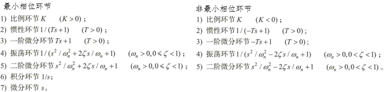}

典型环节的奈奎斯特图和伯德图如下

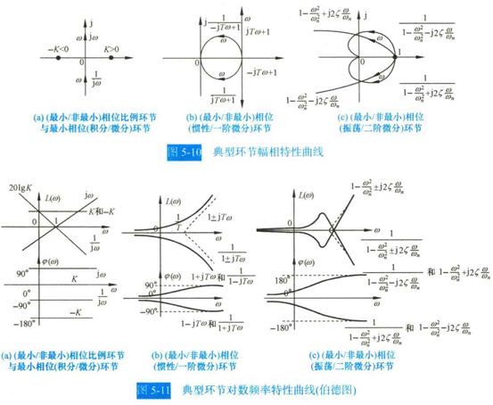

以一节惯性环节为例进行分析：

$$
\begin{aligned}
G(\text{j}\omega) &= \frac{1}{Tj\omega+1}\\
A(\omega) &= \vert G(\text{j}\omega) \vert = \frac{1}{\sqrt{1+T^2 \omega^2}}\\
L(\omega) &= -10\lg(1 + T^2 \omega^2)\\
\varphi(\omega) &= 0 - \arctan \frac{T\omega}{1} = -\arctan T\omega
\end{aligned}
$$

$$\omega \to 0$$时，$$L(\omega) \to 0$$；$$\omega \to +\infty$$时，$$L(\omega) \to -\infty$$，且$$L(\omega)$$是$$\omega$$的单调减函数，据此可以大致画出一阶惯性环节的对数幅频特性曲线，同理分析可以画出其对数相频特性曲线。

此外，典型环节的伯德图和奈奎斯特图有如下规律：

- 最小相位环节和对应的非最小相位环节的幅频特性相同，相频特性符号相反，故奈奎斯特图关于实轴对称，对数幅频特性曲线相同，对数相频曲线关于 0° 对称。
- 传递函数互为倒数的典型环节，幅频特性和相频特性均符号相反，故对数幅频特性关于 $$0\text{dB} 线对称，对数相频特性关于 0° 线对称

### 非最小相位系统

最小相位系统定义为，在复平面右半平面没有零点的稳定线性时不变系统。组成系统的所有环节均为最小相位环节，则系统为最小相位系统；相反地，含有非最小相位环节的系统为非最小相位系统。

非最小相位系统的概念与全通函数有关，全通函数来源于全通滤波器 APF。这类滤波器对于所有频率的正弦输入其幅值均维持不变，仅产生相位延迟。一个稳定的传递函数$$f(s)$$如果在复平面的虚轴上所有点处幅值均为 1，那么这个函数就是全通函数，记为$$A(s)$$，最常见的形式如下，其中$$\bar{s}_{0}$$为$$s$$的共轭

$$
\label{eq1} A(s)=\pm\frac{s-s_{0}}{s+\bar{s}_{0}}, \text{Re}(s_{0})>0
$$

显然，全通函数的零极点关于虚轴对称。

考虑如下传递函数

$$
\frac{s + 2}{s^2 + 4s + 1},
\frac{(0.3 - s)(s + 2)}{(s + 0.3)(s^2 + 4s + 1)},
\frac{(0.6 - s)(s + 2)}{(s + 0.6)(s^2 + 4s + 1)},
\frac{(0.9 - s)(s + 2)}{(s + 0.9)(s^2 + 4s + 1)}
$$

它们具有相同的幅频特性曲线，而相频特性曲线不同

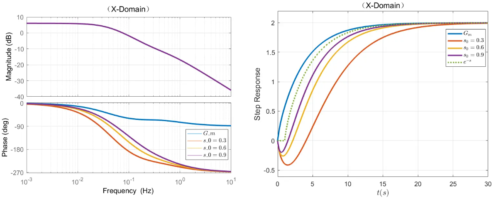

其中，$$\frac{s + 2}{s^2 + 4s + 1}$$便是最小相位系统，相较于对应的其它非最小相位系统，最小相位系统具有最小的相位延迟和最短的响应时间；其它的传递函数皆为这个传递函数与全通滤波器的串联。事实上，所有具有相同幅频特性曲线的传递函数均可以被表示为最小相位系统与全通滤波器串联的形式。

另外，延迟环节在数学上也可以近似为全通函数的形式：

$$
\text{e}^{\tau s}\approx\frac{\frac{2}{\tau}-s}{\frac{2}{\tau}+s}
$$

由此可以看出，由于全通函数和延迟环节的存在，仅由系统的幅频特性曲线无法确定唯一的相频特性曲线，除非已知系统为最小相位系统。

非最小相位系统未必不稳定(闭环稳定性和开环稳定性无关)，但由于减小非最小相位引入的延迟与保证该系统的稳定性之间存在矛盾，会比相应的最小相位系统更难以控制。

### 奈奎斯特图手绘方法

有条件的情况下，直接使用计算机可以直接获得精确的奈奎斯特图，但熟悉奈奎斯特图的手绘方法，可以从另一个角度理解后续的奈奎斯特稳定性判据，以及如何分析奈奎斯特图并从中获取系统的有效信息。

绘制奈奎斯特图的三要素分别是：

- 起终点，即$$\omega \to 0$$和$$\omega \to +\infty$$时，$$A(\omega)$$和$$\varphi(\omega)$$的值；起点取决于比例环节和系统型别。终点取决于分子分母所有环节的阶次
- 与实轴的交点，即$$G(j\omega_\text{x})$$的值；有必要还可计算与虚轴的交点
- 曲线可能所在的象限，以及$$\omega$$从$$0$$变化到$$+\infty$$，相角是否单调变化

以下是一些例子

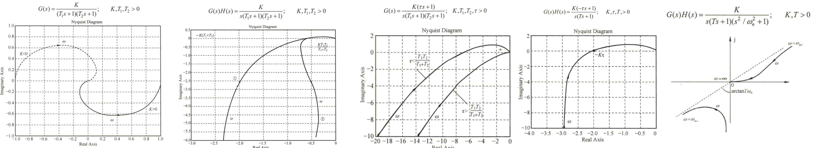

### 伯德图手绘方法

同样地，有条件的情况下直接使用计算机可以直接获得精确的伯德图，但熟悉手绘方法同样有助于分析伯德图并从中提取有效信息。为了方便绘制和叠加分析，一般绘制对数幅频渐近特性曲线，即用分段直线近似各个频段的幅频特性曲线。由于开环系统可分解为典型环节的叠加，系统的开环幅频特性曲线也同样可由典型环节在各个频段叠加而成。假设系统所有环节中最小的交接频率为$$\omega_\text{min}$$，$$\omega < \omega_\text{min}$$称为低频段，绘制步骤如下：

1. 将开环传递函数分解为典型环节，并在横坐标上标度所有的交接频率，将横轴分为若干频段
2. 将各频段上典型环节渐近幅频特性的斜率分别对应叠加，确定开环系统频率特性曲线在各频段上的斜率
3. 对于低频段，任取一点并结合斜率确定完整曲线
4. 根据各频段的斜率依次连接，画出系统的完整幅频特性曲线

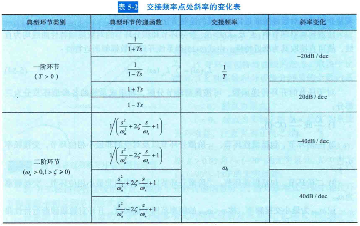

而对于相频特性，由于不如渐近幅频特性的分段直线易于绘制，手绘误差通常较大，一般由典型环节分解下的相频特性表达式，取若干频率点并计算相角，描点之后光滑连接。注意，计算相角时需要判别象限。

对于单位反馈的最小相位系统，$$L(\omega)$$低频渐近线影响稳态误差，中频段影响动态性能，高频段影响抗高频干扰能力。低中高频没有明确的界限，是相对的概念。希望低频段陡且高，中频段缓且宽，高频段陡且低。

### 频域稳定判据

频域稳定判据用于根据开环频域特性曲线判定闭环系统的稳定性，常用的频域稳定判据有奈奎斯特稳定判据(简称奈氏判据)和对数频率稳定判据。

#### 奈奎斯特稳定判据

奈氏判据本身的内容为：反馈控制系统稳定的充要条件为，半闭合曲线$$\Gamma_{GH}$$不穿过$$(-1, \)$$且**逆时针**包围该点的圈数$$R$$等于开环传递函数具有正实部的极点数$$P$$，即

$$
\begin{aligned}
右半平面闭环极点数 &= 右半平面开环极点数 - \Gamma_{GH}逆时针环绕(-1, \text{j}0)圈数 \\
Z &= P - R \\
&= P- 2(N_+ - N_-)\\
&= 0
\end{aligned}
$$

要理解奈氏判据，有如下几个关键点

1. 辐角原理：$$\Gamma$$为$$s$$复平面的闭合曲线，包围$$s$$平面中$$F(s)$$的$$Z$$个零点和$$P$$个极点，则$$\Gamma$$根据函数关系映射到$$F(s)$$中对应的闭合曲线$$\Gamma_{F}$$就会相应地包围$$F(s)$$平面中的原点$$R = P - Z$$圈(注意$$R、P、Z$$都是相对于辅助函数$$F(s)$$的)，根据复平面向量的相角定义，逆时针为正，顺时针为负。因此$$R$$为正表示被逆时针环绕，$$R$$为负表示被顺时针环绕。

2. 选择辅助函数$$F(s) = 1+G(s)H(s)$$，一方面$$F(s)$$的零点为闭环传递函数的极点，$$F(s)$$的极点为开环传递函数的极点，即辅助函数的零极点同时包含了开环和闭环传递函数的极点信息；另一方面，辐角原理中包围的性质，对于这个辅助函数，等价于$$G(s)H(s)$$的闭合曲线$$\Gamma_{GH}$$对$$(-1, \text{j}0)$$的包围。

3. 选取$$\Gamma$$为$$s$$平面上的无限大圆弧(如图)，由于开环幅相曲线关于实轴对称，一般只取$$\text{Im}[s] \geqslant 0$$的部分，对应$$\omega$$取$$0$$到$$+\infty$$，对应的$$\Gamma_{GH}$$为$${\text{Im}}[s] \geqslant 0$$的半闭合曲线与补充的无穷大虚圆弧的总和，其中奈奎斯特曲线(开环幅相特性曲线)就是这条在$$F(s)$$平面上的半闭合曲线。

   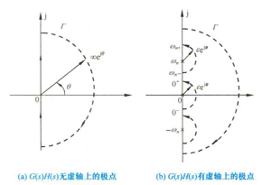

   关于补充的无线大圆弧：

   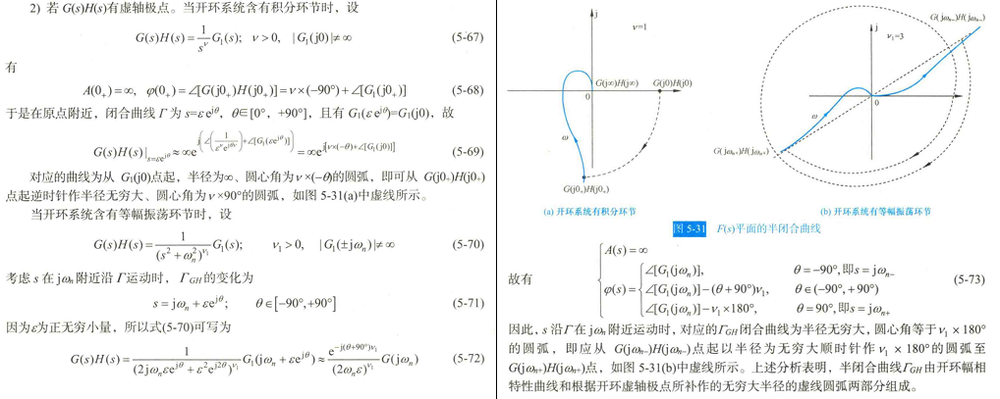

4. 由此，开环系统右半平面的极点数，即$$F(s)$$右半平面的零点数，就反映为$$F(s)$$平面中$$(-1, \text{j}0)$$被$$\Gamma_{GH}$$顺时针环绕的圈数。定义$$R$$为$$(-1, \text{j}0)$$被$$\Gamma_{GH}$$逆时针环绕的圈数。以$$(-1, \text{j}0)$$左侧来看，设$$N_+$$为从上向下穿越$$(-1, \text{j}0)$$左侧的次数，$$N_-$$为从下往上穿越$$(-1, \text{j}0)$$左侧的次数。因此可以根据曲线的穿越情况求得$$R$$：

   $$
   R = 2(N_+ - N_-)
   $$

   例如，闭环有一个右半平面的极点，开环没有右半平面的极点，则辅助函数$$G(s)H(s)$$有一个右半平面的零点，没有右半平面的极点，即$$Z=1、P=0$$，此时$$R=-1$$，反映为$$\Gamma_{GH}$$顺时针环绕$$(-1, \text{j}0)$$一圈。

   $$R$$的计算举例：

   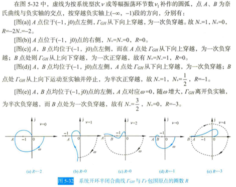

5. $$P$$为开环传递函数具有正实部的极点数，很容易确定。于是比较$$P$$和求得的$$R$$是否相等就可以判断闭环是否稳定了。

#### 对数频率稳定判据

将$$\Gamma_{GH}$$转化为半对数坐标下的曲线，并在对数频率特性曲线中对应确定穿越次数$$N_+$$和$$N_-$$即可将奈氏判据推广到伯德图中，此处略去。

另外，在此补充条件稳定系统的概念，系统稳定性随参数发生变化的系统称为条件稳定系统。

### 稳定裕度

稳定裕度反映系统的相对稳定性，用相角裕度$$\gamma$$和幅值裕度$$h$$来衡量。定义对数幅频特性曲线与 $$0\text{dB} 线交点对应的频率称为截止频率$$\omega\_\text{c}$$：

$$
\begin{cases}
A(\omega_\text{c})=\vert G(j\omega_\text{c})H(j\omega_\text{c})\vert = 1\\
L(\omega_\text{c})=20\lg A(\omega_\text{c})=0
\end{cases}
$$

相角裕度$$\gamma$$和幅值裕度$$h$$定义如下：

$$
\begin{aligned}
\gamma&=180^{\circ}+\angle[G(j\omega_\text{c})H(j\omega_\text{c})]\\
h&=\frac{1}{\vert G(j\omega_\text{x})H(j\omega_\text{x})\vert}\\
h(\text{dB})&=-20\lg\vert G(j\omega_\text{x})H(j\omega_\text{x})\vert~(\text{dB})
\end{aligned}
$$

- 注：用 Bode 图求相角裕度，解$$\vert G(j\omega_\text{c})\vert  = 1$$时，每一项乘积因子可以保留主要部分近似计算(因为 Bode 图本身画的是近似曲线，可以由三角形比例关系解出结果)

相位滞后 180° 后，负反馈将变为正反馈，在参数较小时可能由于正反馈较小而对系统影响不大，但参数一旦给大，系统就会由于正反馈而发散。即，若相位裕度太小，在参数摄动时，系统很容易不稳定。

对于闭环稳定系统，稳定裕度的含义为，如果系统的开环相频特性再滞后$$\gamma$$度，或开环幅频特性再增大$$h$$倍，系统将处于临界稳定状态

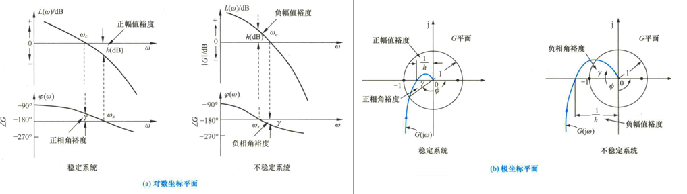

典型二阶系统的相角裕度有确定的解析表达式：

$$
\begin{aligned}
\omega_\text{c} &= \omega_\text{n} (\sqrt{4\zeta^4 + 1}- 2\zeta^2)^{\frac{1}{2}}\\
\gamma &= 180^{\circ}+\angle[G(j\omega_\text{c})] = 90^{\circ}-\arctan\frac{\omega_\text{c}}{2\zeta\omega_\text{n}}=\arctan\frac{2\zeta\omega_\text{n}}{\omega_\text{c}} \\
&= \arctan\left[2\zeta\left(\frac{1}{\sqrt{4\zeta^4 + 1}- 2\zeta^2}\right)^{\frac{1}{2}}\right]
\end{aligned}
$$

另外，对式子求导可得，$$\omega_\text{c}$$为$$\omega_\text{n}$$的增函数和$$\zeta$$的减函数；$$\gamma$$为$$\zeta$$的增函数。

理想的一阶系统和二阶系统的幅值裕度为无穷大，因为奈奎斯特曲线与实轴不相交，但实际系统在分析时往往忽略了小的时间滞后并可能带有近似，因此这些所谓的一阶系统和二阶系统也可能是不稳定的。条件稳定系统具有多个穿越频率，某些具有复杂动态特性的系统还可能具有多个截止频率，对此，稳定裕度在最高的穿越频率或截止频率上度量。

对于最小相位系统，只有当幅值裕度和相角裕度均为正时，系统才是稳定的；而对于非最小相位系统，则建议采用极坐标图法而不是伯德图法来确定系统的稳定性。一般来说，要求相角裕度在$$30°-60°$$，对应伯德图中截止频率处的斜率大于$$-40\text{dB/dec}$$(实际情况中多要求斜率为$$-20\text{dB/dec}$$)，幅值裕度大于$$6\text{dB}$$。

### 频域性能指标

#### 频带宽度

闭环幅频特性下降到$$\text{-3dB}$$(即$$0.707\Phi(\text{j}0)\text{dB}$$，$$\Phi(\text{j}\omega)$$为闭环频率特性)时，对应的频率称为带宽频率$$\omega_\text{b}$$，$$(0, \omega_\text{b})$$称为带宽；带宽频率可以从闭环频率特性曲线中直接读出。分析信号的频谱可知，带宽频率越大，就有越大范围内的频谱谱线衰减较小，输出信号的失真越小。因此，带宽越大，系统跟踪控制信号的能力就越强，系统响应速度也就越快，但同时对高频干扰的抑制能力就越弱。

按照定义，一阶系统的带宽频率为$$\frac{1}{T}$$；二阶系统的带宽频率为$$\omega_\text{b} = \omega_\text{n} \left[(1 - 2\zeta^2) + \sqrt{(1 - 2\zeta^2)^2 + 1}\right]^{\frac{1}{2}}$$。显然，一阶系统的带宽频率与时间常数$$\frac{1}{T}$$成反比，二阶系统的带宽频率与自然频率$$\omega_\text{n}$$成正比，求导可知，也与阻尼比$$\zeta$$成反比。

#### 谐振峰值

振荡环节在$$\zeta < 0.707$$时有谐振频率$$\omega_\text{r}$$和谐振峰值$$M_\text{r}$$的概念：

$$
\begin{aligned}
\frac{\text{d}\vert G(\text{j}\omega) \vert}{\text{d}\omega} &= 0 \Rightarrow \omega_\text{r}\\
M_\text{r} &= \vert G(\text{j}\omega_\text{r}) \vert\\
\omega_\text{r} &= \omega_\text{n}\sqrt{1-2\zeta^2} \quad 谐振频率\\
M_\text{r} &= \frac{1}{2\zeta\sqrt{1-\zeta^2}} \quad 谐振峰值\\
\end{aligned}
$$

谐振峰值也可从闭环频率特性曲线中直接读出。

#### 性能指标的转化

闭环频域指标和开环频域指标的关系如下：

- $$\omega_\text{b}$$与$$\omega_\text{c}$$为正比关系，故$$\omega_\text{c}$$可衡量系统响应速度
- $$M_\text{r} = M(\omega_\text{r}) \approx \frac{1}{\vert \sin \gamma \vert}$$，$$\gamma$$越小，$$\omega_\text{c} - \omega_\text{r}$$越小，该式的近似程度就越高

在二阶系统中，开环频率指标和时域指标关系如下：

- $$\omega_\text{c} = \omega_\text{n}\cdot(\sqrt{4\zeta^4 + 1} - 2\zeta^2)^{\frac{1}{2}}$$
- $$\gamma = \arctan\frac{2\zeta\omega_\text{n}}{\omega_\text{c}}=\arctan\left[2\zeta(\sqrt{4\zeta^4 + 1}- 2\zeta^2)^{-\frac{1}{2}}\right]$$，$$\gamma$$与$$\zeta$$一一对应，且为$$\zeta$$的增函数
- 由第三章的内容，由$$\omega_\text{n}$$和$$\zeta$$可计算其它时域指标

一般根据性能要求确定闭环频域指标$$\omega_\text{b}$$和$$M_\text{r}$$，再由关系估算开环性能指标$$\gamma$$和$$\omega_\text{c}$$，由开环性能指标设计校正网络并估计时域指标。由于开环回路就是控制器所需要调整和处理的回路，故开环频域指标更适用于控制器设计。

对于低阶系统，时域法也有准确的公式计算性能指标，因此用频域法计算的优势并不明显。但对高阶系统，由开环传递函数画出 Bode 图，得出$$\omega_\text{c}$$并计算$$\gamma$$，查图得$$\sigma\%$$和$$t_{s}$$，相较于主导极点估算时域性能指标的方法更便捷。另外有如下三点规律：

- 谐振峰值$$M_\text{r}$$表征了相对稳定性，一般设定在 $$0\text{dB}$$到$$3\text{dB}$$之间，系统的动态性能较好(相当于阻尼比$$\zeta$$在 0.4-0.7 内)
- 谐振频率$$\omega_\text{r}$$表征了动态响应的速度
- 弱阻尼系统的谐振频率$$\omega_\text{r}$$和无阻尼自然频率$$\omega_\text{d}$$很接近

## 第六章 系统校正方法

### 时域校正

校正是指，在系统中加入一些结构和参数可调整的装置(校正装置)，以改善系统性能，满足指标要求。校正方式有：串联校正(如比例微分控制)、反馈矫正、前馈校正(顺馈校正)、复合校正。

- 反馈可以减小被包围环节的时间常数，但同时也会减小增益，通常配合增益补偿使用。

- 深度负反馈可降低被包围环节的影响。

- 局部正反馈可提高环节增益，但同时也会增大时间常数

- 前馈校正可通过设计，减小甚至消除系统稳态误差；可分别根据输入和根据干扰设计前馈环节，消除在两种输入同时作用下的稳态误差。

根轨迹法也可以校正系统，为三大校正方法之一。但根轨迹法可以校正的系统，频率法一定可以校正且更加便捷。

## 参考资料

[非最小相位系统](https://www.zhihu.com/question/24163919/answer/1027546224)
