自动控制系统组成：控制器，控制对象，控制元件(测量元件，放大元件，执行元件，校正元件)

- 测量元件：直流测速发电机，旋转变压器，自整角机
- 执行元件：直流伺服电机，步进电机，交流伺服电机，直流无刷电机
- 放大元件：各种电机驱动器
- 校正元件：直流测速发电机

元件按功能分为：

- 电磁电器：继电器，变压器
- 电磁传感器：测速发电机，交流电动机
- 电机：直流电动机、交流电动机。普通的电机可分为电动机和发电机。伺服是电动机的一个分支，是为了使机构准确准确灵敏地工作而产生的。

电磁控制元件是利用磁场作为媒介来实现信息或能量传递或转换的装置。磁场按元件工作性质可分为稳恒磁场，脉振磁场和旋转磁场。

## 第一章 磁路

### 1.1 磁路分析

磁路是磁通量经过的闭合回路，通过主要路径的称主磁通$$\phi_{0}$$，此外的称漏磁通$$\phi_\text{s}$$。磁路的建立可以理解为，电流$$I$$产生磁场强度$$H$$，同时建立磁势$$F$$。 磁路分为气隙和铁芯两部分，其磁压降各有计算方式：气隙磁压降$$H_{0} = \frac{B_{0}}{\mu_{0}}$$，乘以气隙磁路的长度即可；铁芯磁压降算出或给出$$B$$，查表得到$$H$$，乘以铁芯磁路的长度即可。 一段磁路的磁阻在给定长度和截面积后可计算磁阻

$$
\begin{aligned}
&安培环路定理:\int_\text{L}\mathbf{H}\text{d}\mathbf{l} = \sum I_\text{i} = IN\\
&磁势定义:F = IN\\
&磁阻计算式:R_\text{m} = \nu\frac{l}{S} = \frac{L}{\mu S} = \frac{1}{\Lambda_\text{m}}
\end{aligned}
$$

磁路欧姆定律：$$U_\text{m}$$为磁压降，$$R_\text{m}$$为磁阻，$$\nu$$为磁阻率，$$\mu$$为磁导率，$$\Lambda_\text{m}$$为磁导

磁路基尔霍夫第一定律：汇集在一点的多条磁路的磁通代数和为 0；

磁路基尔霍夫第二定律：磁路的磁压降代数和等于磁动势代数和(即整个回路总压降为零)

$$
\begin{aligned}
\Phi &= \frac{U_\text{m}}{R_\text{m}}\\
\sum \Phi &= 0\\
\sum F_\text{m} &= \sum U_\text{m}\\
\end{aligned}
$$

### 1.2 铁磁材料的磁性

磁介质大致分为三类，顺磁质、抗磁质和铁磁质，顺磁质和抗磁质的$$\mu_\text{r}$$都在$$1$$左右，顺磁质附加磁场方向与外磁场相同，$$\mu_\text{r} > 1$$；逆磁质附加磁场方向与外磁场相反，$$\mu_\text{r}$$ < 1；铁磁质$$\mu_\text{r}$$远大于$$1$$，且附加磁场方向与外磁场方向相同。铁磁性物质在一定温度下失去铁磁性而变为弱磁物质，这个临界温度称为居里点，故电磁元件使用时需要注意散热。

#### 铁磁质规律

对于铁磁质，有$$B-H$$关系曲线(称为磁化曲线)和$$\mu - H$$关系曲线(称为磁导率曲线)两种曲线用于描述其性质。

空气的磁导率近似于真空磁导率，为常数$$\mu_{0}$$，由计算式$$R_\text{m} = \frac{L}{\mu S}$$ 可知气隙磁阻是线性的；铁磁性材料的磁导率不是常数，而是随外磁场的变化而变化，所以铁芯磁阻是非线性的。

随着外磁场/磁通量的增加，铁芯饱和程度增加，此时铁芯磁导率较小(饱和程度增加时磁导率曲线已经处于后半段)而磁阻大，故磁压降增大，电流也对应增大。当外磁场强度足够大时，铁磁材料呈磁饱和，磁导率减小。

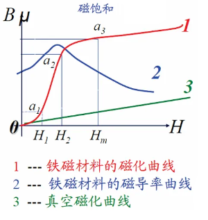

铁磁质材料经过外磁场正向和反向若干次反复磁化后，得到一个近似于对称于原点的闭合曲线，称为铁磁性材料的磁滞回线($$\mathbf{B}$$变化总是落后于外磁场$$\mathbf{H}$$的变化，称为磁滞现象)。连接各磁滞回线顶点称为基本磁化曲线。磁滞回线上$$H$$减小到零处的$$B_\text{r}$$称为剩磁，使$$B$$减小到零处的外磁场强度$$H_\text{c}$$称为矫顽力。连接磁滞回线的各个顶点得到基本磁化曲线，描述了铁磁质从完全没有被磁化开始逐渐加大电流的$$B-H$$关系，初始磁化曲线不可逆。

磁滞回线窄长的铁磁质称为软磁材料，剩磁$$B_\text{r}$$和矫顽力$$H_\text{c}$$小，易磁化且磁滞损耗小，常作变压器、电动机和发电机铁芯；常见材料有铸铁、硅钢、坡莫合金。 磁滞回线宽大的铁磁质称为硬磁材料，剩磁$$B_\text{r}$$和矫顽力$$H_\text{c}$$大，磁性可长久保持，常作永磁体；常见材料有钨钢、钴钢、镍钴合金、稀土合金。

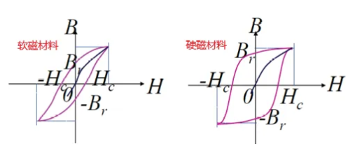

初始磁化曲线强调在无磁状态下，给一个$$H$$对应一个$$B$$的关系；磁滞回线强调，从无磁状态开始，连续逐渐增大磁通，且反复退磁增磁的连续过程。

#### 铁磁质磁性机理

铁磁质特殊的磁性可用磁畴理论解释，铁磁质中的原子磁矩可在小区域内自发地平行排列起来，形成小的自发磁化区，这种自发磁化的小区域称为磁畴，线度约为$$10^{-4}\text{m}$$，外加磁场时，磁畴的磁矩逐渐沿外磁场方向有序排列，当所有磁畴磁矩均排列整齐后，铁磁质的磁化便达到了饱和。这种状态建立后，由于原子间的相互作用，使这种状态不易被扰动，即使磁场撤销，介质也可以有剩磁。

#### 铁芯损耗

包括磁滞损耗和涡流损耗。

当铁磁质在周期性变化的外磁场作用下反复磁化时，内部磁畴运动过程中摩擦发热，引起能量损耗，称为磁滞损耗。磁滞回线包围面积越大，磁滞损耗越大。磁滞损耗$$P_\text{h}$$计算的经验公式，其中$$k_\text{h}$$为磁滞损耗系数，取决于铁磁材料性质、$$f$$为磁场变频率、$$B_\text{m}$$为磁感应强度幅值、$$V$$为铁心体积、$$α$$为指数(当 $$B_\text{m} = 1～1.6 Wb/m²，α = 2$$)

$$
 P_\text{h} = k_\text{h} \times f \times B_\text{m}^\alpha \times V
$$

大块金属处在磁场中时，处处可构成回路，感应电流在内部闭合形成涡流，具有热效应、机械效应和电磁效应，用于电磁炉、电表指针(电磁阻尼)、交流感应电机(电磁驱动)和金属探测器等。涡流会导致铁芯发热，引起能量损耗，其计算经验公式如下，其中$$f$$为磁场变频率，$$B_\text{m}$$为磁感应强度幅值，$$d$$为铁磁材料的厚度，$$\rho$$为铁磁材料的电阻率。

$$
 P_\text{e} \propto = \frac{f^2 B_\text{m}^2 d^2}{\rho}
$$

为减小涡流损耗，可减小铁磁材料的厚度$$d$$，常用厚度为$$0.15-0.5mm$$的电工钢片叠压而成，钢片之间涂绝缘漆。或者在材料中加硅，增加电阻率，减小涡流损耗，提高导磁能力。

综合上两类损耗，铁芯损耗可用如下式子计算，其中$$B_\text{m}$$为铁心中磁感应强度的最大值，$$k_\text{h}$$取决于材料的系数，$$k_\text{e}$$取决于材料、叠片厚度和铁心尺寸的系数，$$V$$为铁心体积。

$$
P_\text{c} = P_\text{h} + P_\text{e} = \left(k_\text{h} f B_\text{m}^\alpha + k_\text{e} f^2 B_\text{m}^2 \right) V
$$

## 第二章 变压器

### 2.1 变压器概述

变压器是将某一交流电信号转换为同一频率的另一交流信号的电磁器件，是一种静止的电能传递器件，是交流电磁元件的基础。变压器的原副边线圈没有直接的电的联系，常作电压变换或电器隔离元件，应用在电力传输和无线电电子设备中。

变压器主要由铁芯和线圈组成：铁芯构成磁路部分，为减小铁磁损耗，常由涂有绝缘漆的电工钢片叠压而成；线圈绕组构成电路部分，由绝缘线绕制而成，可有一组或几组，用于接高压电网的称高压绕组，接低压电网的称低压绕组，为了便于绝缘，低压绕组一般套在内层。对于升压三相变压器，高压侧常采用星型连接，低压侧采用三角形连接。而对降压三相变压器则反之。

### 2.2 单相变压器计算

#### 计算和等效变换

给出$$\Phi = \Phi_\text{m}\sin\omega t$$，$$i_{0} = I_\text{0m}\sin\omega t$$后，感应电势可以计算得出

$$
\begin{aligned}
e_{1}&=-N_{1}\frac{\text{d}\varPhi}{\text{d}t}=\omega N_{1}\varPhi_\text{m}\sin(\omega t - 90^{\circ}) &\dot{E}_{1}&=-\text{j}\frac{2\pi fN_{1}\varPhi_\text{m}}{\sqrt{2}}=-\text{j}4.44fN_{1}\varPhi_\text{m}\\
e_{2}&=-N_{2}\frac{\text{d}\varPhi}{\text{d}t}=\omega N_{2}\varPhi_\text{m}\sin(\omega t - 90^{\circ}) &\dot{E}_{2}&=-\text{j}\frac{2\pi fN_{2}\varPhi_\text{m}}{\sqrt{2}}=-\text{j}4.44fN_{2}\varPhi_\text{m}\\
e_\text{1s}&=-\frac{\text{d}\varPhi_\text{1s}}{\text{d}t}=\omega L_\text{1s}I_\text{0m}\sin(\omega t - 90^{\circ}) &\dot{E}_\text{1s}&=-\text{j}\dot{I}_{0}2\pi fL_\text{1s}=-\text{j}\dot{I}_{0}X_\text{1s},\text{ 令}X_\text{1s}=\omega L_\text{1s}\\
e_\text{2s}&=-\frac{\text{d}\varPhi_\text{2s}}{\text{d}t}=\omega L_\text{2s}I_\text{0m}\sin(\omega t - 90^{\circ}) &\dot{E}_\text{2s}&=-\text{j}\dot{I}_{0}2\pi fL_\text{2s}=-\text{j}\dot{I}_{0}X_\text{2s},\text{ 令}X_\text{2s}=\omega L_\text{2s}
\end{aligned}
$$

对于输入电压$$u$$变化不大的情况，采用局部线性化的思想，认为$$\Phi_\text{m}$$有一个相对稳定的状态，对应$$L_\text{m}$$为一个常数，由$$\Psi = N\Phi = L_\text{m} i_{0}$$，代入感应电势表达式中得

$$
\begin{aligned}
e_{1} &= -\frac{\text{d}\Psi}{\text{d}t} = -L_\text{m}\frac{\text{d}i_{0}}{\text{d}t}\\
\dot{E_{1}} &= -{\text{j}}\omega L_\text{m} \dot{I_{0}} = -\text{j}\dot{I_{0}}X_\text{m}，令 X_\text{m} = \omega L_\text{m}\\
\end{aligned}
$$

注意：如果不用相量写，电阻和电抗不能直接加，要合成阻抗

$$
\begin{aligned}
Z &= R + \text{j}X\\
|Z| &= \sqrt{R^2 + X^2}\\
\theta_{z} &= \arctan\frac{X}{R}
\end{aligned}
$$

#### 空载运行分析

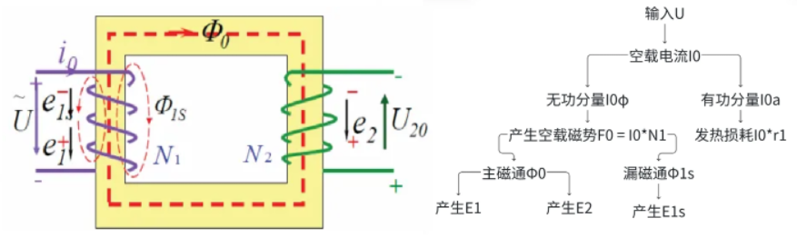

输入电压$$\dot{U}$$产生空载电流$$\dot{I_{0}}$$(又称励磁电流)，该电流一方面产生空载磁势$$F_{0} = I_{0}N_{1}$$，另一方面产生损耗$$I_{0}r_{1}$$；也称无功分量$$\dot{I_\text{0a}}$$(用于发热)和有功分量$$\dot{I_{0\phi}}$$(铁芯损耗)。磁势$$F_{0}$$产生主磁通$$\Phi_{0}$$和漏磁通$$\Phi_\text{1s}$$，由于输入电压为交流电，磁通量也是变化的，变化的磁通量产生感应电动势，主磁通产生在一次回路和二次回路分别产生$$E_{1}$$和$$E_{2}$$，漏磁通在一次回路产生$$E_\text{1s}$$

空载电压平衡方程式

$$
\begin{cases}
\dot{U}_{\text{1}} = -\dot{E}_{\text{1}} - \dot{E}_{\text{1s}} + \dot{I}_{\text{0}}r_{\text{1}}\\
\dot{U}_{\text{20}} = \dot{E}_{\text{2}}\\
\dot{I}_{\text{0}} = \dot{I}_{\text{0}\phi} + \dot{I}_{\text{0a}}
\end{cases}
$$

代入$$\dot{E_\text{1s}} = -\text{j}\dot{I_{0}}X_\text{1s}$$和$$\dot{E_{1}} = -\text{j}\dot{I_{0}}X_\text{m}$$，可得

$$
\begin{cases} \dot{U_{1}} = \dot{I_{0}}r_{1} + \text{j}I_{0}X_\text{1s} + \dot{I_{0}}r_\text{m} + \text{j}\dot{I_{0}}X_\text{m}\\ \dot{U_{20}} = \dot{E_{2}}\\ \dot{I_{0}} = \dot{I_{0\phi}} + \dot{I_\text{0a}} \end{cases}
$$

对应得到变压器空载时的等值电路

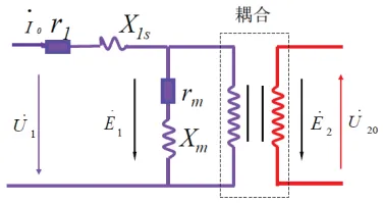

#### 带载运行分析

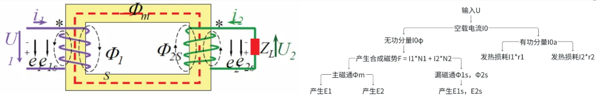

相较于空载工况，带载后二次回路产生电流$$\dot{I_{2}}$$,且电流随负载变化而变化，且产生磁势$$F_{2} = I_{2}N_{2}$$，主磁路中的总磁通由$$F_{1}$$和$$F_{2}$$叠加而成。另外，带载时一次侧电流有两个分量，一个用于建立主磁通，另一个用于抵消负载后二次侧负载电流产生的磁势，称为负载分量，其余物理过程与空载时类似。

带载电压平衡方程式

$$
\begin{cases}
\dot{U}_{\text{1}} = -\dot{E}_{\text{1}} - \dot{E}_{\text{1s}} + \dot{I}_{\text{1}}r_{\text{1}}\\
\dot{U}_{\text{2}} = \dot{E}_{\text{2}} + \dot{E}_{\text{2s}} - \dot{I}_{\text{2}}r_{\text{2}}\\
\dot{I}_{\text{0}} = \dot{I}_{\text{0}\phi} + \dot{I}_{\text{0a}}
\end{cases}
$$

磁势平衡方程式

$$
\begin{aligned}
&\dot{I_{1}}N_{1} + \dot{I_{2}}N_{2} = \dot{I_{0}}N_{1}\\
&\dot{I_{1}} = \dot{I_{0}}-\dot{I_{2}}\frac{N_{2}}{N_{1}} = \dot{I_{2}}\frac{1}{K} = \dot{I_{0}} - \dot{I'_{2}}\\
\end{aligned}
$$

为方便分析，用绕组折合的思想，将副绕组匝数$$N_{2}$$变换成原绕组匝数$$N_{1}$$来运算，以保证折合前后电磁关系和能量关系不变

$$
\begin{aligned}
\dot{E}'_{2} &= K \dot{E}_{2} = \dot{E}_{1} \\
\dot{I}'_{2} &= \frac{1}{K} \dot{I}_{2} = -\dot{I_{1}} \\
\dot{U}'_{2} &= K \dot{U}_{2}\\
U'_{2} \dot{I}'_{2} &= \dot{U}_{2} \dot{I}_{2}\\
r'_{2} &= K^2 r_{2} \\
X'_\text{2s} &= K^2 X_\text{2s} \\
Z'_\text{L} &= K^2 Z_\text{L} \\
\end{aligned}
$$

折合后的电压平衡方程式为

$$
\begin{aligned}
\begin{cases}
U_{1} &= -\dot{E}_{1} + \dot{I}_{1} (r_{1} + \text{j}X_\text{1s}) \\
\dot{E}'_{2} &= U'_{2} + \dot{I}'_{2} (r'_{2} + \text{j}X'_\text{2s}) \\
&= \dot{I}'_{2} [(r'_{2} + R'_\text{L}) + \text{j}(X'_\text{L} + X'_\text{2s})] \\
&= \dot{E}_{1} \\
\dot{I}_{0} &= \dot{I}_{1} + \dot{I}'_{2} \\
\dot{E}_{1} &= -\dot{I}_{0} (r_\text{m} + \text{j}X_\text{m})\\
\end{cases}
\end{aligned}
$$

对应可将带载运行的变压器等效为 T 型等值电路

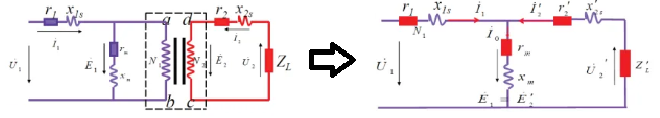

#### 近似简化

- 当忽略内阻和漏磁通时，有$$u_{1} \approx -e_{1}$$

  $$
  K = \frac{N_{1}}{N_{2}} = \frac{\frac{2\pi fN_{1}\Phi_\text{m}}{\sqrt{2}}}{\frac{2\pi fN_{2}\Phi_\text{m}}{\sqrt{2}}} = \frac{E_{1}}{E_{2}} \approx \frac{U_{1}}{U_{20}}
  $$

- 忽略内阻和漏磁通时，空载产生的$$\Phi_{0}$$与带载产生的$$\Phi_\text{m}$$相同，即$$U_{1}$$一定时，负载和空载所产生的主磁通基本不变；事实上，当副边线圈带载时，原边线圈电流由$$i_{0}$$增加到$$i_{1}$$，增加的部分用于抵消副边线圈产生的磁势，因此磁路中的磁通相较于空载时基本不变。
- 带载时，空载电流通常仅为一次侧额定电流$$I_\text{N}$$的很小一部分，定性分析时可以忽略

  $$
  \begin{aligned}
  \dot{I_{1}} &= -\dot{I'_{2}} = -\frac{\dot{I_{2}}}{K}\\
  \frac{I_{1}}{I_{2}} &= \frac{1}{K} = \frac{E_{2}}{E_{1}}\\
  I_{1}E_{1} &= I_{2}E_{2} \quad (变压器的功率传递)
  \end{aligned}
  $$

- 带载时，若$$Z_\text{m} \gg Z_{1}$$，T 型等效电路可近似为$$\tau$$型电路；若$$I_{0} \ll I_\text{N}$$，可去掉励磁支路，进一步简化

  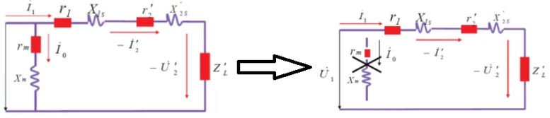

## 第三章 直流电机

### 3.1 概述

工作原理：[直流电机工作原理](https://www.bilibili.com/video/BV1E94y1q7vV/)

电枢绕组通过电刷接到直流电源上，在电磁转矩的作用下，直流电机带动轴上的机械负载沿着与电磁转矩相同的方向旋转，向负载输出机械功率。电磁转矩是电枢元件在磁场中受力作用的表现；在发电机中，电磁转矩与原动转矩方向相反，是电磁阻转矩/制动转矩；在电动机中则是原动转矩。电动机的额定功率，是电动机在额定运行时，从轴上输出的机械功率；额定电压和额定电流，是额定运行下，励磁或电枢绕组的电压或电流。

### 3.2 运行状态

#### 直流电动机运行状态

外部输入直流电，通过换向器转化为回路中的交流电。受力$$F = BIL$$，方向由左手定则判定。

电枢载流导线旋转切割磁感线产生阻碍外界电源的感应电势，称为反电动势，电源需要克服反电动势才能向电机输入电流

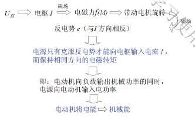

直流电动机中感应电势的作用：$$E_\text{a}$$在直流电动机中为反电势，$$E_\text{a} I_\text{a}$$为转变为机械功率的那部分电功率，$$M_\text{em}\Omega$$为输出的总机械功率，有$$M_\text{em}\Omega = E_\text{a} I_\text{a}$$

#### 直流发电机运行状态

电刷两端接到电气负载上，原动机输出机械转矩，带动电枢切割磁感线，产生感应电动势，通过换向器输出直流电。

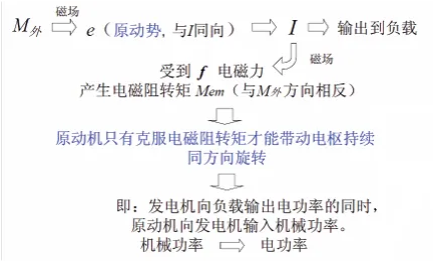

直流发电机中感应电势的作用：$$E_\text{a}$$在直流电动机中为原动势，$$E_\text{a} I_\text{a}$$为从机械功率来的电功率，输入机械功率中转变为电功率的那部分为$$M_\text{em}\Omega$$，有$$M_\text{em}\Omega = E_\text{a} I_\text{a}$$

### 3.3 内部结构

电机磁极作为定子：机壳、主磁极、电刷

- 机壳由铸铁或铸钢制成，构成磁路的一部分，称磁轭，还起支撑作用。
- 主磁极用于产生电机的主磁场，一般用铁芯和励磁绕组构成，铁芯由电工钢片叠压而成。磁极成对出现，用$$p$$表示磁极对数。

电枢绕组作为转子：电枢铁芯、电枢绕组、换向器

- 电枢铁芯是主磁路一部分，用电工钢片冲压制成
- 电枢绕组构成电机的电路部分，由许多绝缘导体绕制而成
- 换向器由相互绝缘的铜片构成，常用云母绝缘
- 转子铁芯不用实心的原因：在保证机械强度的前提下可以减小重量和成本，同时降低涡流损耗

电枢绕组结构：分为环形绕组和鼓形绕组；图中蓝色虚线为磁路，黄色圆环为转子铁芯，有 16 格的红色圆环为换向器，橙色粗细线为电枢绕组，橙色点叉为定子绕组。一个线圈称为一个元件，绕制在一起的一组元件称为一对支路。

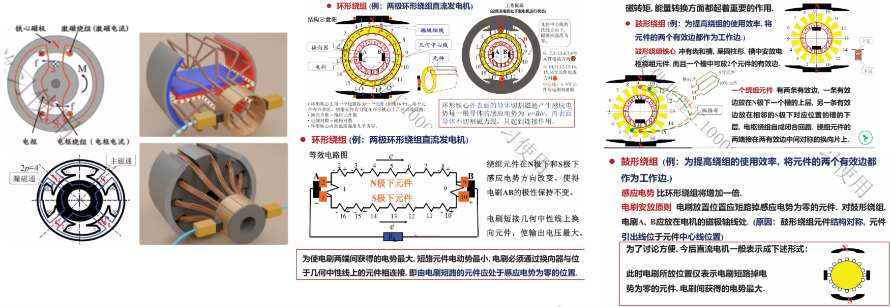

### 3.4 磁场分布

直流电机的磁场包括励磁绕组产生的主磁场/空载磁场和电枢绕组产生的电枢磁场，下标$$j$$表示激磁。

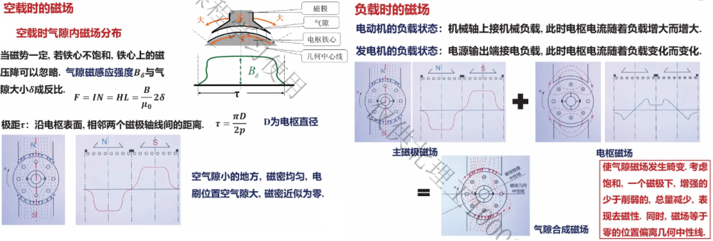

### 3.5 两大基本公式

#### 电枢电势

沿圆周的磁感应强度分布

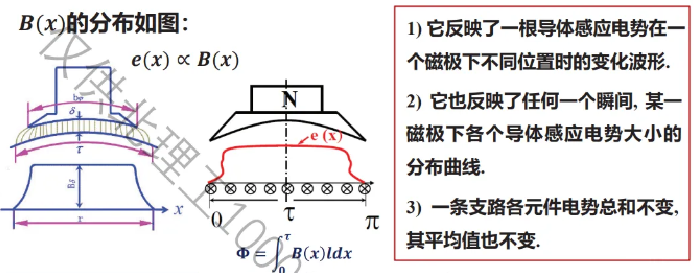

$$
\begin{aligned} &单极气隙内的磁通量&\Phi& = \int_{0}^\tau B(x)l\text{d}x\\ &极距(一个磁极在圆周上所占弧长)&\tau &= \frac{\pi D}{2p}，D 为直径，p 为极对数\\ &单极平均磁感应强度 &B_\text{cp}& = \frac{\Phi}{\tau l}，l 为绕组轴向长度，即电机圆柱体高度\\\ &每个有效边的感应电势 &e_\text{cp} &= B_\text{cp}lv = \frac{\Phi}{\tau}v\\ &电枢转速线速度(m/s) &v&= \frac{\pi D}{60}n，n 为\text{rpm}为单位的角速度\\ &总有效边数 &N& = 2SN_{y}，S 为绕组元件数，N_{y} 为每个元件含有的匝数 \end{aligned}
$$

设支路对数为$$a$$，即有$$2a$$个支路，则电刷两端总感应电势为(公式中$$n$$的单位为$$\text{rpm}$$)

$$
 E_\text{a} = \frac{N}{2a}\cdot e_\text{cp} = \frac{N}{2a}\cdot \frac{\Phi}{\tau}\cdot v = \frac{N}{2a}\cdot \Phi\cdot \frac{2p}{\pi D}\cdot \frac{\pi D}{60}\cdot n = \frac{Np}{60a}\cdot \Phi n = C_\text{e}\Phi n = K_\text{e} n
$$

$$C_\text{e} = \frac{Np}{60a}$$称为电势常数，单位$$1$$；电枢电势的大小与每极磁通量和电枢转速乘积成正比，当$$\Phi$$不变时，令$$K_\text{e} = C_\text{e}\Phi$$，称为电势系数，单位为$$\text{Wb}$$。

#### 电磁转矩

电枢绕组处于气隙磁场中受安培力作用形成电磁转矩

$$
\begin{aligned} &单根导体受力大小&f& = Bi_\text{a} l,i_\text{a} 为支路电流，即每个导体中的电流\\ &单根导体产生力矩&m&= f\frac{D}{2}，D 为直径\\ &单根导体平均电磁力 &f_\text{cp}& = B_\text{cp}i_\text{a} l，l 为绕组轴向长度，即电机圆柱体高度\\ &单根导体电磁力矩 &m_\text{cp}& = f_\text{cp}\frac{D}{2}\\ \end{aligned}
$$

总有效边数为$$N$$，支路数为$$2a$$，电枢绕组总电流$$I_\text{a} = 2a i_\text{a}$$。所有导体电磁转矩方向一致，总电磁转矩为

$$
 M_\text{em} = N\cdot f_\text{cp}\cdot\frac{D}{2} = N\cdot\frac{B_\text{cp}I_\text{a}l}{2a}\cdot\frac{D}{2} = N\cdot\frac{\Phi}{\tau l}\cdot\frac{I_\text{a} l}{2a}\cdot\frac{D}{2} = \frac{Np}{2\pi a}\cdot\Phi I_\text{a} = C_\text{m}\Phi I_\text{a}
$$

$$C_\text{m} = \frac{NP}{2\pi a}$$称为转矩常数，单位$$1$$；电磁转矩的大小与每极磁通量和电流乘积成正比，$$\Phi$$不变时，令$$K_\text{t} = C_\text{m}\Phi$$，称为转矩系数，单位为$$\text{Wb}$$。

$$C_\text{e}、C_\text{m}$$之间存在比例关系

$$
\begin{aligned}
C_\text{e} &= \frac{2\pi}{60}C_\text{m} = 0.105C_\text{m}\\
C_\text{m} &= \frac{60}{2\pi}C_\text{e} = 9.55C_\text{e}\\
\end{aligned}
$$

### 3.6 平衡方程式

#### 直流测速发电机

工作过程：原动机提供机械转矩$$M_{1}$$，电枢绕组运动切割磁感线产生感应电势$$E_\text{a}$$。带载时在外电路形成电流回路，载流通电绕组在磁场中运动受力产生电磁阻转矩$$M_\text{em}$$，方向与原动转矩$$M_{1}$$相反。发电机空载指不带电负载，外电路开路。

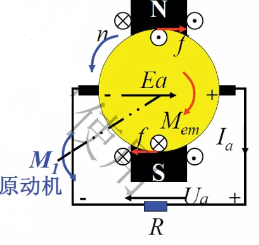

关系式：

- 电势平衡，$$R_\text{L}$$为外电路电阻，$$R_\text{a}$$为电枢绕组回路总电阻

  $$
  \begin{aligned} E_\text{a} &= U_\text{a} + I_\text{a}R_\text{a} = I_\text{a}(R_\text{L} + R_\text{a})\\ 瞬态: e_\text{a} &= u_\text{a} + i_\text{a}R_\text{a}+L_\text{a} \frac{\text{d}i_\text{a}}{\text{d}t}\\ E_\text{a} &= C_\text{e}\Phi n = K_\text{e} n\\ \end{aligned}
  $$

- 转矩平衡，$$M_{1}$$为输入的原动转矩，$$M_{0}$$为空载转矩，$$M_\text{em}$$为电磁转矩(制动转矩)

  $$
  \begin{aligned}
  M_{1} &= M_{0} + M_\text{em}\\
  瞬态: M_{1} &= M_{0} + M_\text{em} + J\frac{\text{d}\Omega}{\text{d}t}\\
  M_\text{em} &= C_\text{m}\Phi I_\text{a} \end{aligned}
  $$

- 几个功率量如下，其中，两个$$P_\text{em}$$可以互相推导

  $$
  \begin{aligned}
  P_{0} &= M_{0}\Omega \quad 发电机空载的机械损耗\\
  P_{1} &= M_{1}\Omega \quad 原动机输入的机械功率\\
  P_{2} &= U_\text{a}I_\text{a} = I_\text{a}^2R_\text{L} \quad 发电机输出电功率，是最终输出功率\\
  P_\text{Cu} &= I_\text{a}^2R_\text{a} \quad 电枢绕组上的损耗，铜损\\
  P_\text{em} &= E_\text{a}I_\text{a} \quad 电路部分的输入功率\\
  同时，P_\text{em} &= M_\text{em}\Omega \quad 原动机提供的把机械能转化为电能那部分的功率\\ \end{aligned}
  $$

- 功率平衡，由电势平衡和转矩平衡乘$$I_\text{a}$$可得(注：实际直流电机，有使通过电子调速器将直流变换成所谓的三相电作电子换向器以省略机械换向器，这时还会存在铁损，即磁滞损耗和涡流损耗)

  $$
  \begin{aligned}
  P_\text{em} &= P_{2} + P_\text{Cu}\\
  P_{1} &= P_{0} + P_\text{em} = P_{0} + P_\text{Cu}+ P_{2} \\
  \Sigma P &= P_{0} + P_\text{Cu} \quad 总损耗\\
  \eta &= \frac{P_{2}}{P_{1}}\times100\% = \frac{P_{2}}{P_{2} + \Sigma P} \times100\% \end{aligned}
  $$

能流图：

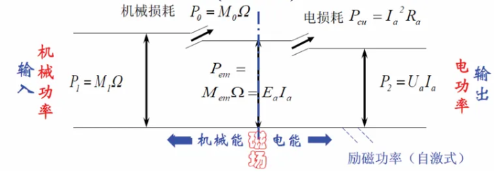

直流发电机中$$P_{1} = M_{1} \Omega$$，$$M_{1}$$为原动机转矩，$$U_\text{a} = E_\text{a} - I_\text{a}R_\text{a}$$，$$E_\text{a} = C_\text{e} \Phi n$$为原动势，方向与$$U_\text{a} I_\text{a}$$相同，$$M_{1} = M_{0} + M_\text{em}$$，$$M_\text{em} = C_\text{m}\Phi I_\text{a}$$为阻转矩，电枢转向$$n$$与$$M_{1}$$相同，与$$M_\text{em}$$相反。

#### 直流伺服电动机

工作过程：电源$$U_\text{a}$$给电枢绕组通电形成电流回路，载流的电枢绕组在磁场中受力转动，输出机械转矩$$M_{2}$$，同时电枢绕组切割磁感线产生感应电势$$E_\text{a}$$，方向与电源$$U_\text{a}$$相反，称为反电势。电动机空载指不带机械负载，外电路需要连接。

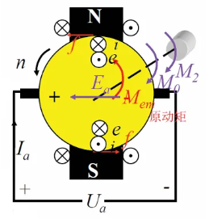

关系式：

- 电压平衡，$$R_\text{L}$$为外电路电阻，$$R_\text{a}$$为电枢绕组回路总电阻

$$
\begin{aligned}
U_\text{a} &= E_\text{a} + I_\text{a}R_\text{a}\\
瞬态:u_\text{a} &= e_\text{a} + i_\text{a}R_\text{a}+L_\text{a} \frac{\text{d}i_\text{a}}{\text{d}t}\\
E_\text{a} &= C_\text{e}\Phi n = K_\text{e} n\\
\end{aligned}
$$

- 转矩平衡，$$M_\text{em}$$为电磁转矩，$$M_{0}$$为空载阻转矩(机械摩擦、磁滞、涡流损耗)，$$M_{2}$$为输出的机械转矩

$$
\begin{aligned}
M_\text{em} &= M_{0} + M_{2}\\
瞬态：M_\text{em} &= M_{0} + M_{2} + J\frac{\text{d}\Omega}{\text{d}t}\\
M_\text{em} &= C_\text{m}\Phi I_\text{a}
\end{aligned}
$$

- 几个功率量如下，其中，两个$$P_\text{em}$$可以互相推导

$$
\begin{aligned}
P_{0} &= M_{0}\Omega \quad 电动机空载的机械功率损耗\\
P_{1} &= U_\text{a}I_\text{a} \quad 电源输入的电功率\\
P_{2} &= M_{2}\Omega \quad 输出的机械功率，是最终输出功率\\
P_\text{Cu} &= I_\text{a}^2R_\text{a} \quad 电枢绕组上的损耗，铜损\\
P_\text{em} &= M_\text{em} \Omega \quad 机械部分的输入功率\\
同时，P_\text{em} &= E_\text{a}I_\text{a} \quad 电源提供的把电能转化为机械能那部分的功率\\
\end{aligned}
$$

- 功率平衡，由电势平衡和转矩平衡乘$$I_\text{a}$$可得(同理有的实际电机存在铁损)

$$
\begin{aligned}
P_{1} &= P_\text{em} + P_\text{Cu}= P_{0} + P_{2} + P_\text{Cu}\\
P_\text{em} &= P_{0} + P_{2} \\
\Sigma P &= P_{0} + P_\text{Cu} \quad 总损耗\\
\eta &= \frac{P_{2}}{P_{1}}\times100\% = \frac{P_{2}}{P_{2} + \Sigma P} \times100\% \end{aligned}
$$

能流图：

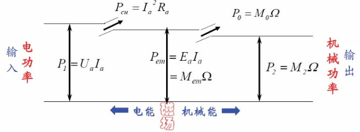

直流电动机中$$P_{1} = U_\text{a} I_\text{a}$$，$$U_\text{a}$$为电枢端电压；$$U_\text{a} = E_\text{a} + I_\text{a} R_\text{a}$$，$$E_\text{a} = C_\text{e} \Phi n$$为反电势，方向与$$U_\text{a} I_\text{a}$$相反，$$M_\text{em} = M_{0} + M_{2}$$，$$M_\text{em} = C_\text{m} \Phi I_\text{a}$$为驱动转矩，电枢转向$$n$$与$$M_\text{em}$$相同。

### 3.7 特性

#### 发电机

- 外特性：电机转速为额定转速，他励直流发电机的励磁电流达到额定值$$I_\text{jN}$$时，发电机负载两端电压$$U_\text{a}$$和负载电流$$I_\text{a}$$的关系。用电压调整率$$\Delta U_\text{a}$$来衡量发电机的恒定水平(对变负载情况的适应能力)，其中$$U_\text{a0}$$为空载输出电压，$$U_\text{aN}$$为额定运行时的输出电压$$ \Delta U*\text{a} = \frac{U*\text{a0} - U*\text{aN}}{U*\text{a0}} $$

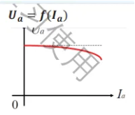

- 输出特性/静态特性：励磁和负载均保持不变时，转速$$n$$和负载端电压的关系。由基本公式可得$$U_\text{a}$$与$$n$$之间的线性关系，用于测速

  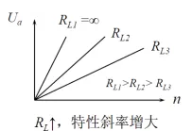

  $$
  U_\text{a} = \frac{C_\text{e}\Phi}{1 + \frac{R_\text{a}}{R_\text{L}}}n = K'_\text{e} n\\
  $$

#### 电动机

- 机械特性(自然机械特性)：电枢电压$$U_\text{a}$$，磁通$$\Phi$$，电枢电阻$$R_\text{a}$$不变时，转速$$n$$与电磁转矩$$M_\text{em}$$之间的关系$$n = f(M)$$

  $$
  \begin{aligned}
  n &= \frac{U_\text{a}}{C_\text{e} \Phi} - \frac{R_\text{a}}{C_\text{e} C_\text{m} \Phi^2} M_\text{s} \\
  &= n_{0} - K M_\text{s}\\
  \end{aligned}
  $$

  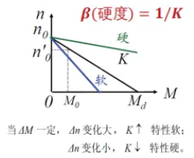

  稳态下的转矩记为$$M_\text{s}$$；$$M_\text{em} = 0$$时，$$n_{0} = \frac{U_\text{a}}{C_\text{e}\Phi}$$称为理想空载转速，实际空载总有$$M_\text{em} = M_{0}$$，因此实际空载转速小于理想空载转速。$$n = 0$$时，$$M_\text{d} = \frac{n_{0}}{K} = \frac{C_\text{m}\Phi U_\text{a}}{R_\text{a}}$$称为堵转转矩，是电机所能提供的最大转矩。对应的电枢电流称为堵转电流$$I_\text{d}$$，此时$$n = 0，E_\text{a} = 0$$，因此$$I_\text{d} = \frac{U_\text{a}}{R_\text{a}}$$；斜率$$K = \frac{\Delta n}{\Delta M}$$表示电机转速随转矩的变化程度

  人为机械特性：改变电机工作参数可以改变机械特性发生变化后的特性

  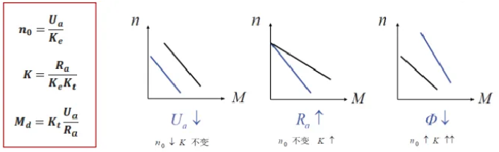

- 调节/控制特性：当$$M_\text{s}、R_\text{a}、\Phi$$不变时，转速$$n$$与电枢电压$$U_\text{a}$$的关系$$n = f(U_\text{a})$$。显然，调节关系是线性的

  $$
  \begin{aligned}
  n &= \frac{U_\text{a}}{C_\text{e} \Phi} - \frac{R_\text{a}}{C_\text{e}C_\text{m}\Phi^2}M_\text{s}\\
  n &= K_{1} U_\text{a} - K_{2} M_\text{s}
  \end{aligned}
  $$

  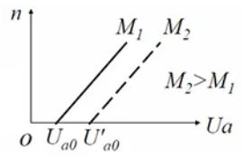

  当$$n = 0$$时，$$U_\text{a0} = \frac{K_{2}}{K_{1}} M_\text{s}$$称为起始电压；$$[0, U_\text{a0}]$$称为死区/不灵敏区，$$U_\text{a} > U_\text{a0}$$时才有转速输出；显然，负载转矩$$M_\text{s}$$增加时死区增大。

  调节斜率特性$$K_{1} = \frac{1}{C_\text{e} \Phi}$$，由电机结构决定与负载转矩无关。当电机以几到几十转每分运行时，由于齿槽、电刷换向器等造成电压不稳，摩擦力矩不均匀，电机出现时快时慢甚至停转的现象。

  普通直流伺服电动机不能输出低速和大转矩，因为在$$\Phi$$一定的情况下，$$n$$小对应$$E_\text{a}$$小，在额定电压$$U_\text{a}$$下，由于$$U_\text{a} = E_\text{a} + I_\text{a}R_\text{a}$$，$$I_\text{a}$$会变得很大；另一方面在$$\Phi$$一定的情况下，$$M_\text{em} = C_\text{m} \Phi I_\text{a}$$，大转矩也对应着大电流；然而额定电流有限制，长期超过额定电流的电流会烧坏电枢绕组。

### 3.8 运行

#### 启动

启动时存在的问题：

- 启动电流为堵转电流，为额定值的十几倍，容易引起电网波动和换向恶化($$n = 0,E_\text{a} = 0,I_\text{a} = \frac{U_\text{a}}{R_\text{a}}$$)。为此可以降压启动来减小启动电流(减小到允许值的 1.5~2 倍)，当转速提升后再升高电压；若电源电压不可调，则可以在电枢回路中串联电阻，启动时分级切除。

- 低速运行时电机电阻、摩擦力矩的不均匀造成转矩不均匀，齿槽造成的电磁转矩不均、电刷和换向器接触不良造成压降不稳定，导致在转速较低时容易出现转速时快时慢甚至停转的现象。直流伺服电机属于高速电机，在低速运行的场合通常采用减速装置以保证转速的稳定，或者选用力矩电动机。

- 启动角加速度不够大，启动时间较长。为此可以将电枢结构做得细长一些来减小转动惯量。

一般要求：启动转矩大以克服阻转矩、启动电流小以避免引起电网波动和换向问题、启动时间短并在启动过程中保持较大的加速转矩。

#### 调速

直流电机拖动负载时，要求其转速在较大范围内可调节，由机械特性得出，调节转速有三种方式

- 改变电枢电压$$U_\text{a}$$：当$$M_\text{s}、\Phi$$不变时，由$$M_\text{em} = C_\text{m}\Phi I_\text{a}$$得$$I_\text{a}$$不变，不改变$$R_\text{a}$$，则$$n$$随$$U_\text{a}$$单调变化。实质是$$I_\text{a}$$不变$$U_\text{a}$$增大，输入功率增加而损耗不变。特点是调速范围大，由于电枢电压的额定值限制，一般用于向下调速，且用于恒定转矩负载，如传送带、提升机；需要电压可调的直流电源。

  ($$U_\text{a}、E_\text{a}$$变化；$$I_\text{a}、R_\text{a}、M_\text{s}、\Phi$$不变)

- 改变电枢回路电阻$$R_\text{a}$$：当$$M_\text{s}、\Phi$$不变时，由$$M_\text{em} = C_\text{m}\Phi I_\text{a}$$得$$I_\text{a}$$不变，不改变$$U_\text{a}$$，则$$n$$随$$R_\text{a}$$单调变化$$n = \frac{U_\text{a}}{C_\text{e} \Phi} - \frac{R_\text{a} + R}{C_\text{e} C_\text{m} \Phi^2} M_\text{s}$$。实质是输入功率不变，增加铜损$$P_\text{Cu}$$减小$$P_\text{em}$$，而$$P_\text{em} = M_\text{em}\Omega$$，负载转矩不变则可以降低转速。特点是调速方法简单成本低但不节能，用于向下调速，且用于恒定转矩负载。负载转矩大时稳定性差(转速变化对电流变化太敏感)，负载转矩小时效果不明显。

  ($$R_\text{a}、E_\text{a}$$变化；$$I_\text{a}、U_\text{a}、M_\text{s}、\Phi$$不变)

- 改变激磁磁通$$\Phi$$：改变$$R_\text{j}、I_\text{j}$$来改变$$\Phi$$，在恒定输出功率时，$$U_\text{a}、R_\text{a}、I_\text{a}$$都不变，由$$n = \frac{E_\text{a}}{C_\text{e} \Phi} = \frac{U_\text{a} - I_\text{a} R_\text{a}}{C_\text{e} \Phi}$$得，转速与磁通量成反比关系。实质是输出功率不变，转速下降负载转矩上升，转速上升负载转矩下降。特点是适合转速上调场合，受机械强度和换向条件的限制，最高转速一般在$$1.2n_\text{N}-1.5n_\text{N}$$，即调速范围受限；因励磁回路电感大，电气时间常数$$\frac{L_\text{j}}{r_\text{j}}$$大故快速性差，适合机床等恒功率而对调节速度要求较低的场合。注意，励磁回路不允许断路，断路时励磁电流很小，磁通很小，电机会因转速过高而损坏，称为飞车。

  ($$M_\text{s}、\Phi$$变化；$$U_\text{a}、E_\text{a}、I_\text{a}、R_\text{a}$$不变)

小结：恒转矩调速$$I_\text{a}、M_\text{s}、\Phi$$不变，若改$$U_\text{a}$$则$$R_\text{a}$$不变，若改$$R_\text{a}$$则$$U_\text{a}$$不变，$$E_\text{a}$$变化 恒功率调速$$U_\text{a}、E_\text{a}、I_\text{a}、R_\text{a}$$不变，$$M_\text{s}、\Phi$$变化

#### 制动

需要提供一个与转向相反的制动转矩

- 反馈制动/回馈制动： 减小$$U_\text{a}$$，由于机械惯性，会出现$$E_\text{a} > U_\text{a}$$的情况，电流反向，产生制动转矩。$$I_\text{a} = \frac{U_\text{a} - E_\text{a}}{R_\text{a}}$$，$$I_\text{a}$$随$$U_\text{a}$$减小并反向，电磁转矩也反向，由原来的驱动转矩变为制动转矩。反馈在与反转时是发电机状态，$$I_\text{a}$$由$$E_\text{a}$$提供，给电网输入能量，即机械能转化为电能回馈给电网。

- 反接制动：电源电压反接，$$I_\text{a} = \frac{-U_\text{a} - E_\text{a}}{R_\text{a}}$$反向，电磁转矩反向变为制动转矩；电流由$$U_\text{a}$$和$$E_\text{a}$$共同提供，同时消耗电能和机械能，制动转矩大，但反向电流也大，设计时需要注意避免反向启动。

- 能耗制动：断开电枢电压，在电枢两端接制动电阻，$$I_\text{a} = \frac{-E_\text{a}}{R_\text{a} + R_\text{zd}}$$反向，电磁转矩反向变为制动转矩；$$I_\text{a}$$由$$E_\text{a}$$单独提供，电能被电枢回路电阻消耗

注：直流电机空载运行：发电机空载时外电路开路，电枢绕组没有电流，不产生电枢磁场，电机磁场仅由励磁绕组的励磁磁势产生；电动机空载时输出不带机械负载，空载转矩很小，电枢电流很小，产生的磁场对主磁场产生的影响可以忽略，近似为励磁绕组产生的磁场。

## 第四章 交流异步电动机

### 4.1 概述

采用交流电励磁的电机统称交流电机。按工作原理分为同步电机和异步电机。电机转速和电源频率存在严格不变的关系的称为同步电机。在固定电网频率下，电机转速随负载大小变化而改变的称为异步电机/感应电机。

对于同步电机，定子侧和转子侧各有磁极，定子按照一定规律通两相或三相电流产生旋转磁场，磁场转速为$$n_{1}$$，定子和转子都产生磁场，两个磁场相互作用就会产生转矩。定子和转子之间的转速没有差异。

定子和转子有相对运动时，导体切割磁感线产生感应电动势，在闭合回路中形成感应电流，在磁场中受力产生电磁转矩，带动转子转动。因此异步电机再正常工作状态下，转子转速低于磁场旋转速度。由于转子导体中的电流是感应产生的，交流异步电动机又称感应电动机。

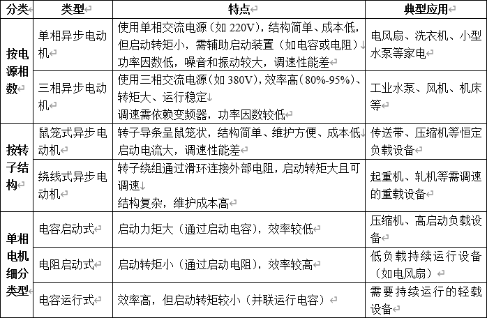

### 4.2 结构

绕组布置上，三相交流电机定子的三相绕组，每一相在空间互差 120 电角度；两相交流电机，两相绕组之间在空间互差 90 电角度。

- 电角度：电机的一对极所占据的空间定义为 360°，因为导体经过一对磁极，电信号经过一个周期。电角度 = 极对数 $$p$$ $$\times$$ 机械角度

- 极距：机械角下的极距$$\tau = \frac{\pi D}{2p}$$，表示相邻两磁极轴线之间的空间距离；电角度下的极距$$\tau = \pi$$。极对数不同时，空间极距不同但电角度极距不变，电相位关系不变。

### 4.3 磁场分布

磁场由定子和转子绕组电流形成，在定子转子之间的气隙产生。单相绕组通正弦交流电产生的磁场为脉振磁场，多相绕组按一定规律通正弦交流电产生的磁场为旋转磁场。

#### 脉振磁场

对于单相绕组，设电流$$i_\text{a} = I_\text{m}\sin \omega t$$，忽略铁芯磁压降和边缘效应，整个圆周上磁场强度关于位置呈方波分布，傅里叶变换并忽略高次谐波可得如下结果

$$
f_\text{A}(x,t) = \frac{4}{\pi}\frac{iN_{y}}{2}\cos\frac{\pi}{\tau}x = 0.9I N_{y}\sin \omega t \cos \alpha\quad \alpha = \frac{\pi}{\tau}x为距离原点x处对应电角度
$$

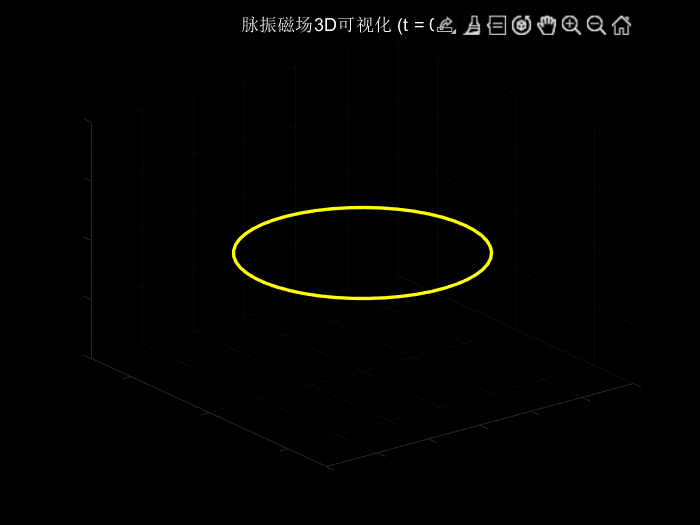

#### 旋转磁场

对于多相绕组(以两相为例)，设定子上有$$j_{1},j_{2}$$激磁绕组和$$k_{1},k_{2}$$控制绕组，它们是结构参数相同，轴线在空间互成$$90°$$电角度的对称绕组，激磁电流和控制电流也是幅值相同的对称电流，时间相位差$$90°$$，两电流产生的磁场在空间中叠加形成圆形旋转磁场。

$$
 \begin{aligned} &i_\text{k} = I_\text{km}\sin \omega t\\ &i_\text{j} = I_\text{jm}\sin (\omega t - 90°)\\ &I_\text{km} = I_\text{jm} \end{aligned}
$$

事实上，单相绕组产生的脉振磁场是一种简谐振动，两个幅值相同、方向垂直、时间相位差$$90°$$的简谐振动合成即为一个圆。因此只要两个脉振磁场的磁动势幅值相等，根据磁路欧姆定律可得磁密幅值相等，时间相位差再为$$90°$$，就会形成圆形旋转磁场(磁场空间矢量顶点轨迹为一个圆)。

当两相绕组的匝数不等时(设有效匝数比$$K_{z} = \frac{N_\text{j}}{N_\text{k}}$$)，根据$$F = IN$$并考虑时间相位差，只需满足$$\dot{I_\text{k}} = \pm jK_{z}\dot{I_\text{j}}$$或$$\dot{U_\text{k}} = \pm j \frac{1}{K_{z}}\dot{U_\text{j}}$$，即电流幅值与两个定子绕组匝数成反比，电压幅值与两个定子绕组匝数成正比，便可以合成圆形磁场。

三相绕组原理与两相类似，只是合成磁场的幅值有所变化，是一个沿$$x$$轴正弦分布，随时间移动的正弦行波，对于圆形定子来说即表现为幅值不变的正弦波在圆周上旋转

$$
f(x, t) = 1.5 \times 0.9I N_{y}\sin (\omega t - \alpha) = 1.35I N_{y}\sin (\omega t - \frac{\pi}{\tau}x)
$$

电源频率为$$f_{1}$$时，旋转磁场转速(也称同步转速，注意和同步电机的转速区分)

$$
n_{1} = \frac{60f_{1}}{p}
$$

实际转速$$n$$与旋转磁场同步转速$$n_{1}$$的相对转速差用于衡量异步电机的性能，称为转差率或滑差

$$
\begin{aligned}
s &= \frac{n_{1} - n}{n_{1}} \times 100 \%\\
n &= n_{1}(1 - s)\\
\end{aligned}
$$

### 4.4 等效分析

#### 转子静止

设三相电机为完全对称的系统，即磁路、定子转子绕组对称，每两相绕组之间互差$$120°$$电角度，定子加三相对称电压。当磁场以$$n_{1}$$同步速度旋转切割定子转子绕组时，对应电频率$$f_{1} = \frac{pn_{1}}{60}$$。定子每相电阻$$r_{1}$$，每相漏感$$L_{1}$$，每相绕组匝数$$N_{1}\cdot k_\text{N1}$$，$$k_\text{N1}$$为考虑定子绕组分布在铁芯上的折合系数；转子同理，下标记为 2。

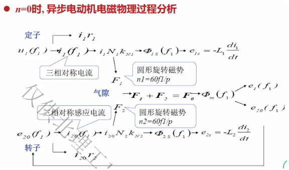

转子不动时，三相异步电机内发生的物理过程、电磁关系与变压器相同，两者研究方法一致，即可以列写基本方程式并进行等效电路计算。事实上，变压器原边绕组和副边绕组由共同的磁场相联系；而异步电机的定子绕组与转子绕组也是通过交变磁场进行耦合的。

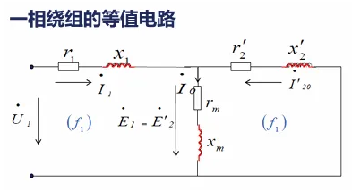

一相绕组电压和磁势平衡方程

$$
\begin{aligned} &\dot{U_{1}} = -\dot{E_{1}} + \dot{I_{1}}(r_{1} + jX_{1})\\ &\dot{E_{20}} = \dot{I_{20}}(r_{2} + jX_{2})\\ &\dot{E_{1}} = -\dot{I_{0}} Z_\text{m} = -\dot{I_{0}}(r_\text{m} + jX_\text{m})\\ &\mathbf{F_{1}} + \mathbf{F_{2}} = \mathbf{F_{0}} \end{aligned}
$$

变比$$K = \frac{N_{1}k_\text{N1}}{N_{2}k_\text{N2}}$$，将转子各物理量折合到定子边

$$
\begin{aligned} &\dot{U_{1}} = -\dot{E_{1}} + \dot{I_{1}}(r_{1} + jX_{1})\\ &\dot{E_{20}}' = \dot{I_{20}}'(r_{2}' + jX_{2}')\\ &\mathbf{F_{1}} + \mathbf{F_{2}}' = \mathbf{F_{0}}\\ &\dot{I_{1}} = \dot{I_{0}} -\dot{I_{20}}' \end{aligned}
$$

#### 转子旋转

设转速为$$n$$，旋转方向与旋转磁场相同，等效为转子不动，旋转磁场以转速$$(n_{1} - n)$$同方向旋转，此时转子绕组内感应电势频率为$$f_{2} = \frac{p(n_{1} - n)}{60} = sf_{1}$$。

转子旋转时转子边物理量下标为 2s，由$$f_{2} = s f_{1}$$，得到转子旋转时各物理量与转子静止时各物理量关系如下

$$
\begin{aligned} &E_\text{2s} = 4.44 f_{2} N k \Phi_\text{m} = s E_{2} \\ &X_\text{2s} = 2 \pi f_{2} L_{2} = s X_{2} \\ &I_\text{2s} = \frac{E_\text{2s}}{\sqrt{r_{2}^2 + X_\text{2s}^2}} \\ &\cos \Phi_\text{2s} = \frac{r_{2}}{\sqrt{r_{2}^2 + X_\text{2s}^2}} \ \end{aligned}
$$

转子产生的旋转磁场，相对于转速$$n$$旋转的转子的转速为

$$
n_{2} = \frac{60f_{2}}{p} = sn_{1}
$$

转子产生的旋转磁场，相对于定子的转速为

$$
\begin{aligned}
n_{2} + n = n_{1}\\
n = n_{1}(1 - s)\\
\end{aligned}
$$

即转子感应电流产生的旋转磁场与定子绕组产生的旋转磁场同步(注意与同步电机转速区分)，没有相对运动。气隙磁势平衡方程式仍为$$\mathbf{F_{1}} + \mathbf{F_\text{2s}} = \mathbf{F_{0}}$$

转子旋转时，转子电流频率$$f_{2}$$不同于定子电流频率$$f_{1}$$，因此在进行绕组折合前需要进行频率折合

$$
\begin{aligned} &E_\text{2s}(f_{2}) = 4.44 f_{2} N_{2} k_\text{N2} \Phi_\text{m} = s E_{2}(f_{1}) \\ &X_\text{2s}(f_{2}) = 2 \pi f_{2} L_{2} = s X_{2}(f_{1}) \\ &I_\text{2s}(f_{2}) = \frac{E_\text{2s}}{\sqrt{r_{2}^2 + X_\text{2s}^2}} = \frac{s E_{2}}{\sqrt{r_{2}^2 + (s X_{2})^2}} = \frac{E_{2}}{\sqrt{\left(\frac{r_{2}}{s}\right)^2 + X_{2}^2}} = I_{2}(f_{1})\\ &\cos \phi_\text{2s}(f_{2}) = \frac{r_{2}}{\sqrt{r_{2}^2 + X_\text{2s}^2}} = \frac{\frac{r_{2}}{s}}{\sqrt{\left(\frac{r_{2}}{s}\right)^2 + X_{2}^2}} =\cos \phi_{2}(f_{1}) \end{aligned}
$$

$$E_\text{2s}、X_\text{2s}、I_\text{2s}、\cos\Phi_\text{2s}$$是转子旋转时转子绕组的物理量，转子电流频率为$$f_{2} = sf_{1}$$

$$E_{2}、X_{2}、I_{2}、\cos\Phi_{2}$$是转子静止时转子绕组的物理量，转子电流频率为$$f_{1}$$

注意$$I_{2}(f_{1}) \ne I_{20}、\cos\Phi_{2}(f_{1}) \ne \cos\Phi_{20}$$

频率折合后转子定子电流频率相同，绕组匝数不同，再进行绕组折合$$K = \frac{N_{1}k_\text{N1}}{N_{2}k_\text{N2}}$$

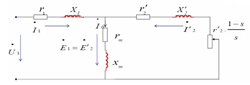

$$
\begin{aligned}E_{2}' &= K E_{2} \\I_{2}' &= \frac{I_{2}}{K} \\r_{2}' &= K^2 r_{2} \\x_{2}' &= K^2 x_{2}\end{aligned}
$$

$$
\begin{aligned} &\dot{U_{1}} = -\dot{E_{1}} + \dot{I_{1}}(r_{1} + jX_{1}) \\ &\dot{E_{2}}' = \dot{E_{1}} = \dot{-I_{0}} Z_\text{m} \\ &\dot{E_{2}}' = \dot{I_{2}}'\left(\frac{r_{2}'}{s}+ jX_{2}'\right) \\ &\dot{I_{1}} + \dot{I_{2}}' = \dot{I_{0}} \end{aligned}
$$

以不动转子等效旋转转子后，旋转转子消耗的总机械功率以$$I'^2\frac{1-s}{s}r_{2}'$$的电功率体现出来

### 4.5 功率和转矩关系

#### 功率关系

$$
\begin{aligned}
&电源输入三相有功功率: P_{\text{1}} = 3U_{\text{1}}I_{\text{1}}\cos\Phi_{\text{1}}\\
&定子绕组铜损: P_{\text{Cu1}} = 3I_{\text{1}}^2r_{\text{1}}\\
&电机铁芯损耗: P_{\text{Fe}} = 3I_{\text{0}}^2r_{\text{m}}\\
&电磁功率: P_{\text{em}} = 3I_{\text{2}}'^2\frac{ r_{\text{2}}'}{s} = 3I_{\text{2}}'^2r_{\text{2}}' + 3 I_{\text{2}}'^2 \frac{\left(1-s\right)}{s}r_{\text{2}}'= P_{\text{1}} - P_{\text{Cu1}} - P_{\text{Fe}}\\
&转子绕组铜损(又称转差功率): P_{\text{Cu2}} = 3I_{\text{2}}'^2r_{\text{2}}' = sP_{\text{em}}\\
&总机械功率: P_{\text{J}} = 3 I_{\text{2}}'^2 \frac{\left(1-s\right)}{s}r_{\text{2}}' = (1 - s)P_{\text{em}}\\
&空载损耗: P_{\text{0}} = P_{\text{jx}} + P_{\text{za}}(机械损耗和杂散损耗)\\
&输出功率: P_{\text{2}} = P_{\text{J}} - P_{\text{0}}\\
&总损耗功率:\Sigma P = P_{\text{Cu1}} + P_{\text{Cu2}} + P_{\text{Fe}} + P_{\text{0}}\\
&电机效率:\eta = \frac{P_{\text{2}}}{P_{\text{1}}} = \frac{P_{\text{2}}}{P_{\text{2}} + \Sigma P} \times 100 \%
\end{aligned}
$$

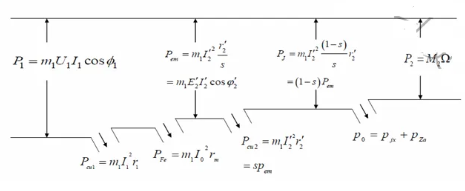

$$
\begin{aligned} &有功功率:P = U_\text{A} I_\text{A}\cos\varphi_\text{A} + U_\text{B} I_\text{B}\cos\varphi_\text{B} + U_\text{C} I_\text{C}\cos\varphi_\text{C}\\ &无功功率:Q = U_\text{A} I_\text{A}\sin\varphi_\text{A} + U_\text{B} I_\text{B}\sin\varphi_\text{B} + U_\text{C} I_\text{C}\sin\varphi_\text{C}\\ &视在功率:S = \sqrt{P^2 + Q^2} = 3U_\text{A}I_\text{A}\\ &功率因数:\cos\phi = \frac{P}{S} \\ &当三相电路对称时:\\ &P = 3U_\text{P}I_\text{P}\cos\varphi_\text{P} = \sqrt{3}U_\text{L}I_\text{L}\cos\varphi_\text{L}\\ &Q = 3U_\text{P}I_\text{P}\cos\varphi_\text{P} = \sqrt{3}U_\text{L}I_\text{L}\sin\varphi_\text{L}\\ &S = 3U_\text{P}I_\text{P} = \sqrt{3}U_\text{L}I_\text{L}\\ &\cos\varphi = \frac{P}{S} = \cos\phi_\text{P} \end{aligned}
$$

- 总机械功率包括机械损耗、杂散损耗、输出功率
- 转子铁芯中磁通变化频率很低，一般忽略其铁芯损耗
- 电磁功率一定，转差率越小铜损越小，机械功率越大，效率越高

$$
P_\text{em} : P_{Cu_{2}} : P_\text{J} = 1 : s : (1 - s)
$$

#### 转矩关系

由$$P_{2} = P_\text{J} - P_{0}$$除以$$\Omega$$得：$$M_{2} = M_\text{em} - M_{0}$$，其中$$M_{2}$$为输出轴转矩(负载转矩)，$$M_{0}$$为空载转矩，$$M_\text{em}$$为电磁转矩，$$\Omega$$为电机转子旋转角速度，$$\Omega_{1}$$为旋转磁场的同步角速度，$$C_\text{m}$$为转矩常数

$$
\begin{aligned} P_{2} &= P_\text{J} - P_{0}\\ \frac{P_{2}}{\Omega} &= \frac{P_\text{J}}{\Omega} - \frac{P_{0}}{\Omega}\\ M_{2} &= M_\text{em} - M_{0}\\ M_\text{em} &= \frac{P_\text{J}}{\Omega} = \frac{P_\text{em}(1 - s)}{\frac{2\pi}{60}n} = \frac{P_\text{em}\frac{n}{n_{1}}}{\frac{2\pi}{60}n} = \frac{P_\text{em}}{\Omega_{1}}\\ &=\frac{m_{1}E_{2}'I_{2}'\cos\varphi_{2}'}{\Omega_{1}} = \frac{m_{1} \times 4.44 f_{1}N_{1}k_\text{N1}\Phi_\text{m}I_{2}'\cos\varphi_{2}'}{\frac{2\pi f_{1}}{p}}\\ &= C_\text{m}\Phi_\text{m} I_{2}'\cos \varphi_{2}'\\ C_\text{m} &= \frac{4.44m_{1}pN_{1}k_\text{N1}}{2\pi} \end{aligned}
$$

注：

1. 电磁转矩既可用总机械功率除以转子转速，又可用电磁功率除以磁场旋转的同步转速

2. 额定电压：定子绕组上的线电压；额定电流：定子绕组中的线电流；额定功率：输出轴输出的机械功率$$P_{2}$$；额定频率：定子绕组加的电网电压的频率；额定转速：输出额定功率时的转子转速$$n$$；额定功率因数：定子绕组的功率因数；额定效率$$\eta_\text{N} = \frac{P_\text{N}}{\sqrt{3}U_\text{N}I_\text{N}\cos\varphi_\text{N}}$$

### 4.6 机械特性

外加电源电压和频率一定，电机稳态运行时，电磁转矩与转子转速或转差率的关系$$M = f(s)$$或$$M = f(n)$$曲线，称为异步电动机的机械特性。转子不接附加电阻时的机械特性称为自然机械特性，对于绕线型转子异步电机，转子回路传入附加电阻后的机械特性称为人工机械特性。由戴维南等效定理可推出电磁转矩与转差率或转子转速的关系

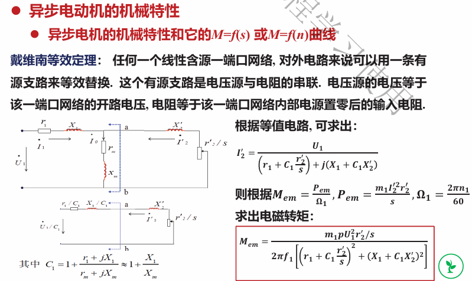

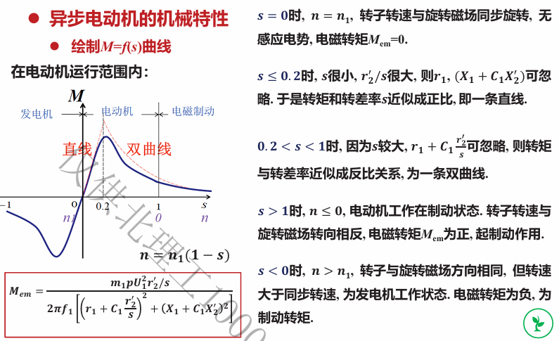

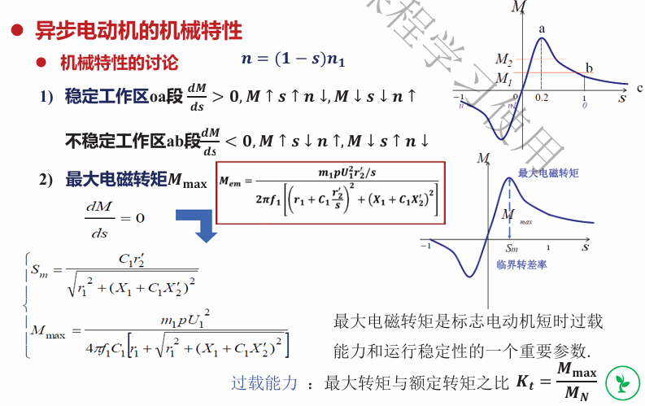

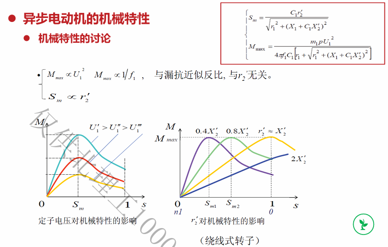

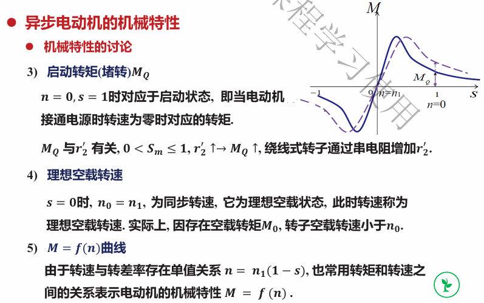

### 4.7 运行分析

#### 运行状态判断

- $$s = 1，n = 0$$，处于启动状态。
- $$0 < s < 1,0 < n < n_{1}$$，处于电动机状态，定子从电网吸收能量，通过旋转磁场传递给转子，由转子转变为机械能输出。
- $$s < 0, n > n_{1}$$，处于发电机状态，电磁转矩与转子转向相反成为制动转矩，此时有原动机提供逆时针方向输入转矩，原动机提供机械能转换为电能输出。

- $$s > 1, n < 0$$，处于制动运行状态，电机一方面从电网吸收电能，另一方面又消耗自身的动能，最终转化为热能散发掉，电机迅速制动。(将电源任意两相反接即可形成这种状态)

#### 工作过程

- 启动：启动瞬间旋转磁场与转子相对速度大，定子转子电流较大，通常为额定电流的 4~7 倍。较大的启动电流影响电动机寿命；对容量小的电网，电机的启动会影响电网上其它用电设备的正常工作；启动瞬间功率因数较低但启动转矩却不大(约为$$1.5M_\text{N}$$)。因此异步电机启动要求减小启动电流，增加启动转矩，缩短启动时间。

  启动方式有直接启动(全压启动)：利用闸刀开关把电动机直接接到具有额定电压的电源上，操作和启动设备简单，但电流过大造成电机发热，影响电机寿命；且会出现上述的启动问题。一般规定功率小于$$7.5kW$$时可以直接启动，否则需要电源总容量足够大才可以直接启动。

  另一种启动方式为降压启动：在电源变压器容量不够大时使用，降低电压启动，减小电机启动电流，同时减小启动转矩，可用于对启动转矩要求不高的场合。降压启动的方式有定子回路串电阻或电抗降压启动(启动时电流经过启动电阻，正常工作时电阻短接，能耗大)、星型-三角形降压启动(启动时星型连接，正常工作时三角形连接)、自耦变压器降压启动(启动时定子绕组与自耦变压器低压端相接，正常工作时转换到电网相接)，绕线式转子异步电动机可以使用频敏电阻器，电流频率降低时阻值自动减小。

- 反转：三相异步电动机的转子转向与旋转磁场方向相同，后者完全取决于通入定子绕组中的电流相序，故改变定子绕组任意两相通电相序即可实现电机反转。

- 制动：制动有机械制动和电磁制动，电磁制动有反接制动和能耗制动。反接制动时，相对切割速度大，感应电动势和电流都大，为了避免电机过热、抑制电网电压波动，在定子回路中串入限流电阻进行制动。电机在制动转速作用下减速，速度降为零时应立即切断电源，否则三相异步电机将在旋转磁场作用下反向启动。能耗制动则是切断定子的三相电源，同时在两相之间通直流电，在定子绕组内产生恒定磁场，转子由于机械惯性旋转切割恒定磁场磁感线产生反电势，从而产生制动转矩。该方法将电机动能转为电能，在电阻上以发热的形式损耗掉，故称能耗制动。

- 调速：$$n = (1 - s)n_{1} = (1 - s)\frac{60f_{1}}{p}$$，按照改变的物理量，调速分为两类

  - 同步转速$$n_{1}$$不变，改变转差率$$s$$，包括异步电机定子电压调速，绕线式异步电动机转子回路串电阻调速，绕线式异步电动机串级调速。

    - 改变定子电压调速，由于$$U_{1}$$只能从额定值往下调，故$$n$$一般也只往下调(转差率增大，转速下降)，适用于恒转矩负载，调速范围有限；调速时机械特性变软($$\frac{\Delta n}{\Delta M}$$增大)，且降低定子电压会使得过载能力下降($$\frac{M_\text{max}}{M_\text{N}}$$减小)

    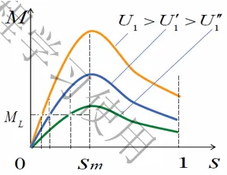

    - 转子回路串电阻调速，$$r_{2}'$$增大，$$s_\text{m}$$增大，$$n$$减小，$$M_\text{max}$$不变；$$n$$只能往下调，$$r_{2}$$增加使功率损耗增加，效率降低

    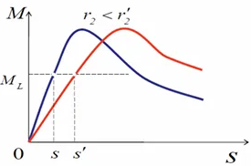

    - 串级调速，即在转子回路增加一个与转子电势同频率而相位相反的附加电势。转子的合成电势减小，转子电流和和电磁转矩减小，电机减速；减速后与旋转磁场的相对速度增大，又使得转子感应电势、电流和电磁转矩增加，直到电磁转矩又等于负载转矩，电机稳定在低转速运行。通过改变附加电势的大小可以无极调节电机转速，这种方法只能使转速往下调，且该方式中获得附加电势的装置复杂，费用高。

  - 改变旋转磁场同步转速$$n_{1}$$，包括改变定子极对数$$p$$调速，改变定子电源频率$$f_{1}$$调速。

    - 改变定子极对数调速即对于定子绕组采用不同的连接方式，可以改变旋转磁场的极对数，由于只能成对改变磁极，此调速方法是有级的。

    - 变频调速可以实现平滑且较大范围内的调速，关键是需要变频器。$$M_\text{max}$$反比于频率，$$f_{1}$$升高时$$M_\text{max}$$下降且机械特性变软($$\frac{\Delta n}{\Delta M}$$增大)，$$f_{1}$$降低时同理。 由$$U_{1}\approx E_{1} = 4.44f_{1} N_{1} k_\text{N1}\Phi_\text{m}$$，当$$U_{1}$$一定时，直接升高$$f_{1}$$会使得$$\Phi_\text{m}$$减小(铁芯利用率低)，转矩减小，同时频率增加使得转速增加；而降低$$f_{1}$$则会使得$$\Phi_\text{m}$$增大(铁芯容易过饱和且$$I_{1}$$增大)，转矩增大，同时频率降低使得转速降低。整个过程功率基本不变，适合恒功率调速。

      为了实现变频调速时磁通不变，可以相应改变$$U_{1}$$大小，使$$\frac{U_{1}}{f_{1}}$$不变，这种方式称为变频变压调速，可以保证磁通不变，转矩不变，适合于恒转矩负载。

## 第五章 三相交流同步电动机

### 5.1 概述

同步电动机是一种定子边用交流电流励磁以建立旋转磁场，转子边用直流电流励磁所构成旋转磁极的双边励磁的交流电动机。旋转磁场以磁拉力拖着旋转磁极同步旋转。定子侧和转子侧各有磁极产生磁场。两个磁场相互作用产生转矩，根据同性相斥异性相吸的原理，定子和转子之间的转速没有差异，且转速不随负载转矩变化而变化，而是与电源频率成严格比例关系。定子侧不管是几对极电机，在产生旋转磁场后，永磁体转子就会跟着旋转磁场以相同转速旋转。

### 5.2 工作原理

同步电机的电枢是定子，包括铁芯和三相对称绕组，均匀开槽放置三相定子绕组，通以对称交流电后产生圆形旋转磁场。同步电机的转子也需要励磁，且转子绕组接收直流电。转子绕组励磁方式分为电磁式和永磁式，绕组出线端接到滑环上，通过滑环上静止的电刷向外引出。励磁电源常用直流发电机(励磁机)，也可用交流励磁机整流后输入转子励磁绕组。转子结构分为凸极式转子和隐极式转子，隐极式转子无明显磁极，转子圆周表面气隙均匀，凸极式转子具有明显磁极，转子圆周表面气隙不均匀。

转子与电枢电势无相对运动，不产生电磁感应现象；定子绕组受到定子电枢和转子励磁两个磁场的作用。

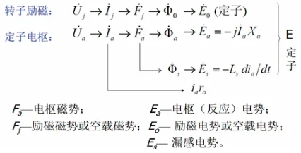

同步电动机空载时，电枢(定子)电流$$I_\text{a}$$很小，可认为没有电枢磁势只有励磁磁势作用，气隙中仅存在转子的励磁磁势，故励磁磁势又称为空载磁势。由于励磁磁场与电枢磁势和转子均无相对运动，转子中没有感应电势。

同步电机作为发电机运行时，只要原动机转速一定，无论负载转矩变化，发出的交流电频率就一定(常用)；作为电动机运行时，在固定电网频率下，电动机带动负载以固定的转速旋转。作为调相机使用时，专门发出或吸收无功功率，调节电网功率因数。永磁式交流伺服电动机可实变频调速，即通过改变电源频率来改变永磁式交流伺服电动机转子的转速。每相绕组产生的反电势均为正弦波，通过位置传感器检测出转子位置后，由伺服驱动器强制产生出正弦波相电流，与该相反电势严格保持同相以最小化转矩脉动。

### 5.3 电磁关系

#### 隐极式同步电动机

一相绕组电压平衡方程式如下，其中$$X_\text{a}$$为隐极式同步电动机的电枢反应电抗，$$X_\text{t}$$为隐极式同步电动机的同步电抗。(电枢反应是直流电动机带载时电枢绕组增大，电枢电流产生的电枢磁势影响励磁绕组产生的空载磁势且表现为消磁作用的效应；同步电动机同理，带载运行时电枢电流(定子电流)增大，产生的电枢磁势会对空载磁势产生影响)

$$
\begin{aligned}
\dot{U_{1}} &= \dot{E_{0}} + \dot{I_\text{a}}(r_\text{a} + \text{j}X_\text{t})\\
X_\text{t} &= X_\text{a} + X_\text{s}\\
\varphi &= <\dot{U_{1}},\dot{I_\text{a}}>，为功率因数角\\
\psi &= <\dot{E_{0}},\dot{I_\text{a}}>，为内功率因数角\\
\delta &= <\dot{U_{1}},\dot{E_{0}}>，为功角\\
\end{aligned}
$$

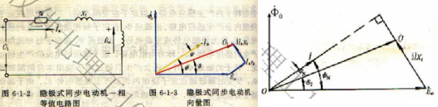

隐极式同步电机空载时，电枢电流$$I_\text{a}$$很小，产生的电枢磁势也小，近似认为只有励磁磁势作用；带载后电枢电流$$I_\text{a}$$增大，产生旋转磁势$$F_\text{a}$$，在空间中呈正弦分布。由于隐极式同步电机的气隙磁阻均匀且线性，故磁感应强度$$B$$在空间中也呈正弦分布。

磁场以同步转速切割定子绕组，感应出电动势$$E_\text{a}$$，由于电枢反应$$E_\text{a}$$正比于电枢反应磁通$$\Phi_\text{a}$$，在不考虑饱和时，由于隐极式磁阻均匀，电枢反应磁通正比于电枢反应磁势$$F_\text{a}$$，磁势又正比于电流，故电枢反应电势$$E_\text{a}$$正比于电枢电流$$I_\text{a}$$。电枢电势$$\dot{E_\text{a}}$$滞后于$$\dot{\Phi_\text{a}}$$(即滞后$$I_\text{a}$$)90° 电角度，因此电枢反应电势$$\dot{E_\text{a}}$$可用电枢反应电抗$$X_\text{a}$$上的压降来表示，$$X_\text{a}$$可以表征电枢反应的强弱

$$
\begin{aligned}
\dot{E_\text{a}} &= -\text{j}\dot{I_\text{a}}X_\text{a}， X_\text{a} 为电枢反应电抗\\
\dot{E_\text{a}} + \dot{E_\text{s}} &= -\text{j}\dot{I_\text{a}}X_\text{a} - \text{j}\dot{I_\text{a}}X_\text{s} = -\text{j}\dot{I_\text{a}}X_\text{t}， X_\text{t} 为同步电抗\\
\end{aligned}
$$

#### 凸极式同步电动机

凸极效应使得电枢反应磁场的磁感应强度发生畸变，且随着转子相对电枢磁势的位置不同，电枢磁场的分布也不同。此时需要将电枢反应分解为直轴分量$$F_\text{d}$$和交轴分量$$F_\text{q}$$。$$d$$为直轴(气隙小、磁阻小、磁感应强度大)，$$q$$为交轴(气隙大、磁阻大、磁感应强度小)。

$$
\begin{aligned}
F_\text{d} &= F_\text{a}\sin\psi, I_\text{d} = I_\text{a}\sin\psi\\
F_\text{q} &= F_\text{a}\cos\psi, I_\text{q} = I_\text{a}\cos\psi\\
\end{aligned}
$$

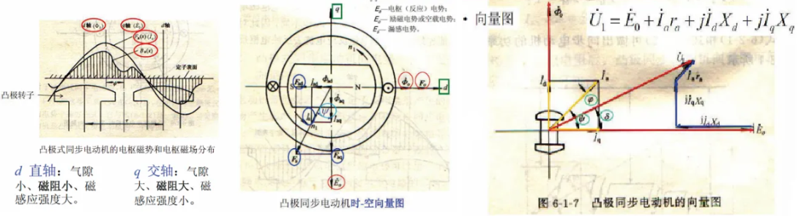

时空向量图(相矢图)是将表示时间的矢量和表示空间的矢量两者联系在一起的图，两者通过电流向量与对称三相电流所建立的合成磁势矢量联系。时间向量即绕组感应电势、电压、电流和磁通；空间向量即磁势和磁通。

电枢绕组中产生直轴电枢反应电势和交轴电枢反应电势，铁芯不饱和时有

$$
\begin{aligned}
\dot{E_\text{ad}} &= -\text{j}\dot{I_\text{d}}X_\text{ad}\\
\dot{E_\text{aq}} &= -\text{j}\dot{I_\text{q}}X_\text{aq}\\
\end{aligned}
$$

其中$$X_\text{ad}$$为直轴电枢反应电抗，与直轴磁路磁阻成反比；$$X_\text{aq}$$为交轴电枢反应电抗，与交轴磁路磁阻成反比。($$X = \omega L$$，磁阻增大，$$L$$减小，$$X$$减小；故直轴电抗大于交轴电抗)

凸极式同步电动机电势平衡方程式如下

$$
\begin{aligned}
\dot{U_{1}} &= \dot{E_{0}} + \dot{I_\text{a}}r_\text{a} + \text{j}\dot{I_\text{d}}X_\text{d} + \text{j}\dot{I_\text{q}}X_\text{q}\\
 X_\text{d} &= X_\text{ad} + X_\text{s}\\
 X_\text{q} &= X_\text{aq} + X_\text{s}\\
 \end{aligned}
$$

可以认为，隐极式同步电动机是凸极式同步电动机的特例。

### 5.4 功率和转矩关系

#### 功率关系

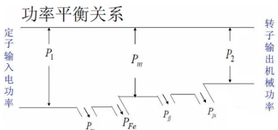

(注意相较于异步电机，同步电机没有$$P_\text{Cu2}$$(转子绕组铜损/转差功率))

$$
\begin{aligned}
P_{0} &= P_\text{fj} + P_\text{jx}\quad 空载损耗\\
\eta &= \frac{P_{2}}{P_{1}} = \frac{P_{1} - \Delta P}{P_{1}} \times 100\%\\
\Delta P &= P_\text{Cu} + P_\text{Fe} + P_{0}\\
P_{2} &= P_\text{m} - P_{0}\\
\end{aligned}
$$

转矩关系，将$$P_{2} = P_\text{m} - P_{0}$$除以同步角速度$$\Omega_{1}$$得转矩关系，其中$$M_{2}$$为输出转矩，$$M_\text{em}$$为电磁转矩，$$M_{0}$$为空载转矩

$$
M_{2} = M_\text{em} - M_{0}
$$

同步电动机的铜损铁损都较小，为分析方便可以忽略，得到如下关系，其中$$m$$为相数，$$U_{1}、I_\text{a}$$为定子绕组相电压、相电流(注意额定值默认为线电压、线电流，需要根据星型连接或者三角形连接对应除以$$\sqrt{3}$$)；右图为忽略定子绕组电阻后的向量图

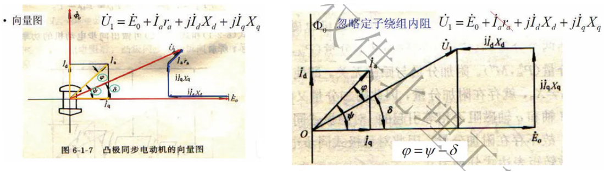

$$
\begin{aligned}
&P_\text{m} \approx P_{1} = mU_{1}I_\text{a}\cos \varphi = mU_{1}I_\text{a}\cos (\psi - \delta) = mU_{1}I_\text{a}[\cos \psi\cdot\cos\delta + \sin \psi\cdot\sin\delta]\\
&I_\text{q}X_\text{q} = U_{1}\sin\delta, I_\text{q} = \frac{U_{1}\sin\delta}{X_\text{q}} = I_\text{a}\cos\psi\\
&I_\text{d}X_\text{d} = E_{0} - U_{1}\cos \delta, I_\text{d} = \frac{E_{0} - U_{1}\cos \delta}{X_\text{d}} = I_\text{a}\sin\psi\\
&P_\text{m} = m\frac{U_{1}E_{0}}{X_\text{d}}\sin\delta + m\frac{U_{1}^2}{2}\left( \frac{1}{X_\text{q}} - \frac{1}{X_\text{d}} \right)\sin 2\delta = P_\text{m}' + P_\text{m}''\\
\end{aligned}
$$

将$$P_\text{m} = m\frac{U_{1}E_{0}}{X_\text{d}}\sin\delta + m\frac{U_{1}^2}{2}\left( \frac{1}{X_\text{q}} - \frac{1}{X_\text{d}} \right)\sin 2\delta = P_\text{m}' + P_\text{m}''$$除以同步角速度$$\Omega_{1}$$的转矩关系

$$
M = m\frac{U_{1}E_{0}}{X_\text{d}\Omega_{1}}\sin\delta + m\frac{U_{1}^2}{2\Omega_{1}}\left( \frac{1}{X_\text{q}} - \frac{1}{X_\text{d}} \right)\sin 2\delta = M_\text{m}' + M_\text{m}''
$$

其中$$P_\text{m}',M'$$为基本分量，$$P_\text{m}'',M''$$为附加分量或磁阻分量

对于隐极式同步电动机$$X_\text{d} = X_\text{q} = X_\text{t}$$，不存在附加分量，此时

$$
\begin{aligned}
P_\text{m} &= m\frac{U_{1}E_{0}}{X_\text{t}}\sin\delta\\
M &= m\frac{U_{1}E_{0}}{X_\text{t}\Omega_{1}}\sin\delta
\end{aligned}
$$

附加分量代表着附加转矩，且由于附加分量与励磁无关，只要$$X_\text{d}\ne X_\text{q}$$就存在，它由直轴和交轴磁阻不相等引起，故通常将同步电动机转子做成凸极式

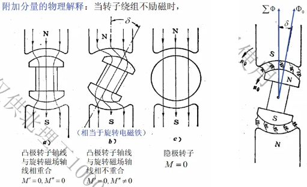

### 5.5 运行分析

功角在时间上是电网电压$$\dot{U_{1}}$$和励磁电压$$\dot{E_{0}}$$之间的相位差，在空间上是励磁磁场$$\dot{\Phi_{0}}$$和合成磁场$$\Sigma\Phi = \dot{\Phi_{0}} + \dot{\Phi_\text{a}} + \dot{\Phi_\text{s}}$$之间的空间夹角

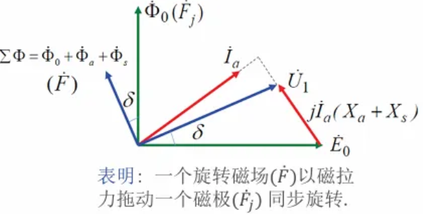

同步电动机运行状态完全取决于功角$$\delta$$：当$$\delta > 0$$时，合成磁场超前励磁磁场，两个磁场之间产生切向电磁力，其电磁转矩带动转子以同步速度旋转，同步电动机处于电动机运行状态(负载增大，功角增大，转矩增大)；当$$\delta = 0$$时，两个磁极轴线重合，电磁转矩为零；当$$\delta < 0$$时，转子磁极拖着合成磁极旋转，产生的电磁转矩与转子转动方向相反，为制动转矩，此时转子必须外面有原动机带动转子转动，这样同步电动机从轴上输入机械功率，从定子绕组端输出电功率，同步电动机处于发电机工作状态。

#### 功角特性、矩角特性和机械特性

当电网电压$$U_{1}$$和频率$$f_{1}$$不变，励磁电流$$I_\text{j}$$不变，$$\Phi_{0}，E_{0}$$不变时，同步电动机电磁功率和电磁转矩仅取决于功角大小。电磁功率$$P_\text{m}$$和功角$$\delta$$的关系$$P_\text{m} = f(\delta)$$称为同步电动机功角特性。电磁转矩$$M_\text{em}$$与功角$$\delta$$的关系$$M_\text{em} = f(\delta)$$称为同步电动机的矩角特性。

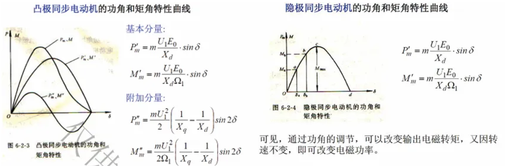

隐极式同步电动机在$$0 < \delta < 90°$$范围内，矩角特性 OC 段是稳定运行区，通常用最大转矩$$M_\text{max}$$与额定电磁转矩$$M_\text{N}$$之比定义为同步电动机的过载倍数$$\lambda_\text{m}$$；由下式可见，增大励磁电流可提高过载能力。为保证足够的过载能力，一般取$$\lambda_\text{m} = 2 - 3$$，$$\delta_\text{N} = 20° - 30°$$

$$
\begin{aligned}
\lambda_\text{m} = \frac{M_\text{max}}{M_\text{N}} = \frac{1}{\sin\delta_\text{N}}\\ M_\text{max} = m\frac{U_{1}E_{0}}{X_\text{t}\Omega_{1}} \propto E_{0} \propto I_\text{j}
\end{aligned}
$$

当负载转矩增大且超过最大电磁转矩$$M_\text{max}$$后，功角增大并超过$$90°$$，电磁转矩继续下降，使电机不断减速而不能与定子磁极同步运行，这种现象称为失步。电动机失步后转速会继续下降，最后被迫停转，这个过程对应的 CD 段称为不稳定运行区。

在$$U_{1}、f_{1}、I_\text{j}$$相同的情况下，附加转矩使$$M_\text{max}$$有所增加，因此凸极式同步电动机过载能力比隐极式同步电动机要大，故一般同步电动机一般做成凸极式。

同步电动机在稳定运行范围内，随负载增加，通过功角自动调节，使电磁转矩跟随变化以达到转矩平衡，电动机转子则始终按同步转速旋转，机械特性$$n = f(M)$$为一条直线。
