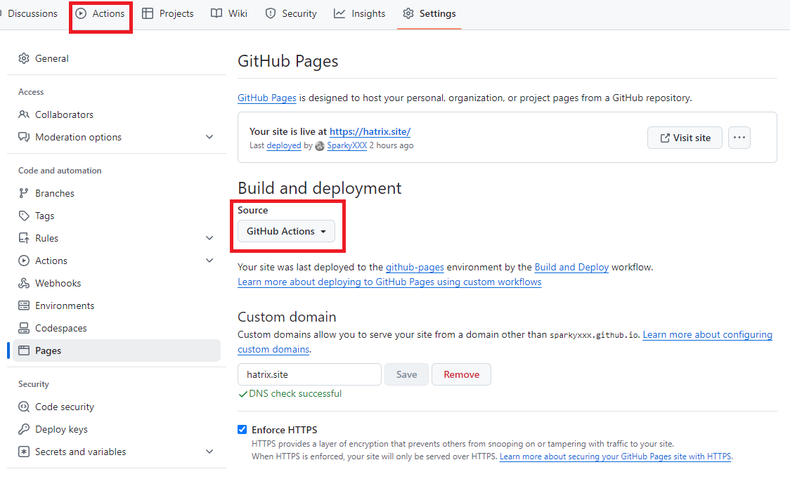
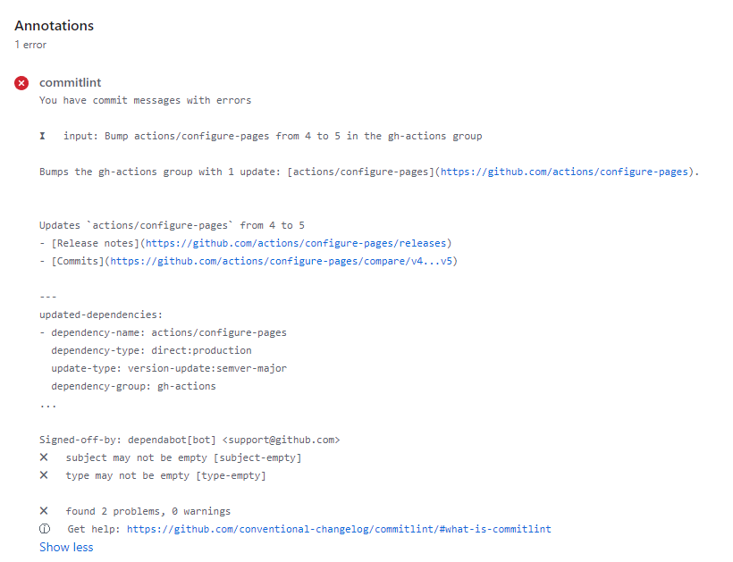
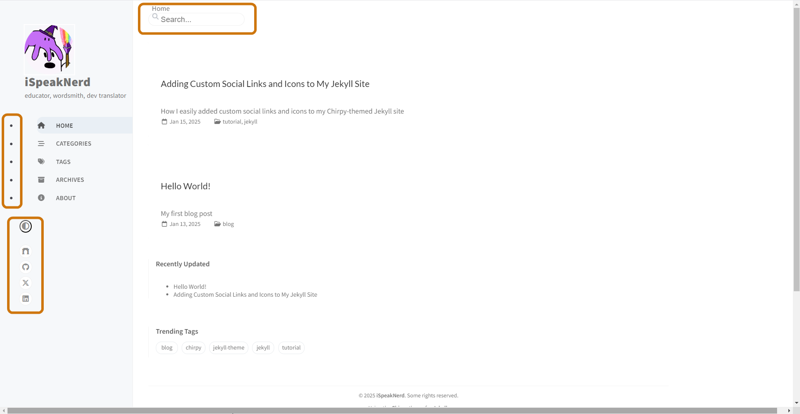

## 构建说明

本站基于Jekyll主题Chirpy进行构建，使用Github Pages服务完成部署，前置知识为HTML + CSS + JS基础语法、Liquid模板语法、Jekyll框架使用。开发环境需要安装Ruby和Jekyll。完成后根据Chirpy官方提供的使用说明进行配置，就可以得到一个能用的静态博客站点。

[前端三剑客基础](https://developer.mozilla.org/zh-CN/docs/Learn_web_development)

[Jekyll文档](https://jekyllrb.com/)

[Chirpy使用说明](https://chirpy.cotes.page/posts/getting-started/)

一些细节问题以及评论系统的添加可参考：[CSDN的教程](https://blog.csdn.net/zzy979481894/article/details/132678717)

## 踩坑记录

在构建过程中，为了自定义外观并添加一些外围的小功能，对源码稍有改动，记录踩过的坑如下：

1. 最开始使用官方推荐的chirpy-starter模板[chirpy-starter](https://github.com/cotes2020/chirpy-starter)。这个仓库将站点的大部分代码隐藏在gems包中，通过在Gemfile中使用 `gem "jekyll-theme-chirpy", "~> 7.2", ">= 7.2.4"` 来引入，适合于想专注于博客内容而不希望花太多精力来定制外观和功能的情况。（使用命令 `bundle info --path jekyll-theme-chirpy` 可以定位本地gem包中的对应文件）<br>
如跟本站一样有自定义外观和添加功能的需求，需要使用完整版的仓库[jekyll-theme-chirpy
](https://github.com/cotes2020/jekyll-theme-chirpy)

2. 官方的使用说明和CSDN那篇文章有一点没有说清楚，在部署阶段选择源为“GitHub Actions”之后，需要到Actions选项卡开启Actions，否则提交修改不会触发部署工作流。


3. 将本地修改推送到远程仓库以触发Github的Actions时，有一项commitlint的工作流，即检查commit信息是否符合type(subject): body的规范（注意英文冒号后有一个空格）。如果commit信息不符合规范，会出现报错，因此要注意commit信息格式。

开发过程中由于需要对源码作修改但是最开始又使用了chirpy-starter模板，后来索性将完整版的仓库直接拉到本地chirpy-starter的目录下进行合并，合并之后貌似将commitlint的工作流给覆盖掉了，当时没有打算细究Actions，所以没有将其恢复回来。

4. 在开发过程中，由于尝试使用Font Awesome库之外的图标，需要将svg图标转为font引入，在这个文件末尾添加了自定义样式，而Vscode的Prettier插件在执行代码格式化时

将：
```
@use 'main

  .bundle

';
```
格式化为：
```
@use 'main

  .bundle

';
```
由于`production`两端各多了一个空格，导致scss文件编译出了错误的css文件，本地测试没有问题而推送到远程，页面样式渲染出现问题。这个问题在完整版仓库的Discussion中也有提及：
