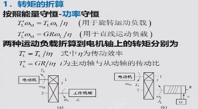
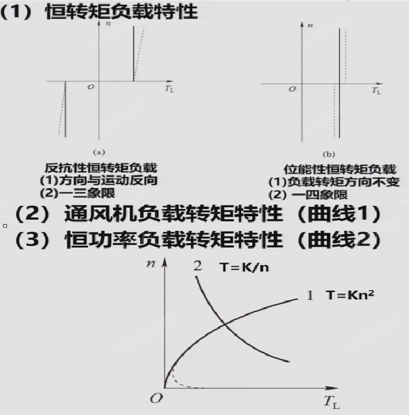

## 概述

测验15%+作业研讨15%+综合设计大作业20%+闭卷考试50%

电气传动系统：由电动机带动工作机械的传动系统，是一种典型的自动控制系统；控制对象是电动机，控制核心是控制器，用电力电子功率变换装置来驱动执行机构。电气传动系统的基本控制目的：动态（启动调速制动）、静态（精度）

课程内容：电气传动基础（动力学基础、直流他励电动机特性及运动方式）、直流调速自动控制系统（开环/闭环系统、可逆系统、调速系统的设计与调试）、交流调速自动控制系统（异步电动机的特性及运动方式、转差频率控制、矢量变换控制、直接转矩控制）

第三章不讲，小学期有控制系统综合调试的课程，第四周闭卷课堂测验

## 第一章 直流电动机调速系统

### 1. 电气传动动力学基础

$$T_e$$为电磁转矩，$$T_L$$为负载转矩

对于旋转中的物体，工程上用飞轮矩的概念来表示其转动惯量，在计算上为，有的资料定义为转动惯量的4倍（$$MD^2$$），有的定义为转动惯量的4g倍（$$GD^2$$），本课程采用后一种。飞轮矩用于衡量转动物体保持其原有转动状态的能力，飞轮矩越大，抵抗转速变化的能力越强。

---

基本运动方程（欧拉第二定律）：

$$
\begin{equation}
    T_M - T_L = \frac{\text{d}(J\omega)}{\text{d}t} = J\frac{\text{d}\omega}{\text{d}t}+\omega\frac{\text{d}J}{\text{d}t}
    \label{eq:1}
\end{equation}
$$

作以下假设

$$
忽略空载转矩时，T_M = T_e\\
$$

$$
假设转动惯量为常值，\omega\frac{\text{d}J}{\text{d}t} = 0\\
$$

$$
J = m\rho^2=m\frac{D^2}{4} = \frac{GD^2}{4g}(\rho为质点到转轴的距离,也称惯性半径)\\
$$

$$
g取9.8m/s^2, \omega = \frac{2\pi}{60}n\\
$$

将假设代入\eqref{eq:1}得：

$$
\begin{equation}
    T_e- T_L \approx \frac{GD^2}{375}\frac{\text{d}n}{\text{d}t}
    \label{eq:2}
\end{equation}
$$

显然$$T_e > T_L$$时系统加速，$$T_e<T_L$$时系统减速，$$T_e=T_L$$时系统处于稳态，此时电动机电磁转矩大小由负载转矩大小决定。

转矩方向以设定电动机的旋转方向为参考标准，电磁转矩$$T_e$$与之同向为正与之反向为负，负载转矩$$T_L$$与之同向为负与之反向为正。

---

对于多轴系统，基于能量守恒定律（功率守恒）进行等效折算

- 转矩折算

==这里有问题？==

$$
T_e\omega_M = T_L'\omega_L\quad(T_L'为折合到电机轴上的转矩)\\
T_L' = \frac{T_L}{i\eta}\quad(i为齿轮传动比，规定为\frac{\omega_M}{\omega_L}，即\frac{主动}{从动},\eta为传动效率)\\
对于直线运动的负载，T_L = GR
$$

- 飞轮矩折算

对于不同的负载形式，令总动能为$\frac{1}{2}J\omega_M^2$，其中$J$为等效到电机输出轴上的转动惯量

$$
    \frac{1}{2}J\omega_M^2 = \frac{1}{2}J_M\omega_M^2 + \frac{1}{2}J_L\omega_L^2 + \frac{1}{2}mv^2 \quad (直线运动的负载)\\
    \frac{1}{2}J\omega_M^2 = \frac{1}{2}J_M\omega_M^2 + \frac{1}{2}J_L\omega_L^2 \quad (旋转运动的负载)\\
$$

化简可得等效转动惯量：

$$
    J = J_M + \frac{J_L}{i^2} + \frac{mv^2}{\omega_M^2}\quad(直线运动的负载)\\
    J = J_M + \frac{J_L}{i^2}\quad(旋转运动的负载)\\
$$

根据$$GD^2 = 4gJ$$得等效飞轮矩：

==这里也有问题，G不是同一个==

$$
    GD^2 = GD_M^2 + \frac{GD_L^2}{i^2} + 4g\frac{mv^2}{\omega_M^2} = GD_M^2 + \frac{GD_L^2}{i^2} + 365\frac{Gv^2}{n_M^2}\quad(直线运动的负载)\\
    GD^2 = GD_M^2 + \frac{GD_L^2}{i^2}\quad(旋转运动的负载)\\
$$

---

电动机的性能可用机械特性和负载转矩特性来表征

- 机械特性即转速$$n$$与电磁转矩$$T_e$$的关系$$n=f(T_e)$$

1为他励/并励电机的机械特性，相对较硬；2为串励电机的机械特性，相对较软；3为异步电机的机械特性；同步电机得益于其驱动原理，机械特性最硬，几乎为一条水平直线

- 负载转矩特性即转速$$n$$与电负载转矩$$T_L$$的关系$$n=f(T_L)$$

三种类型的负载转矩特性如图

通常工程上取$GD^2 = (1+\delta)GD_M^2$，$GD_M^2$为电机本体的转动惯量$J_M$，$\delta$一般取0.2~0.3

励磁方式不同：分为他励、并励（励磁绕组和电枢绕组并联接到一个电源上）、串励、复励直流电动机；

