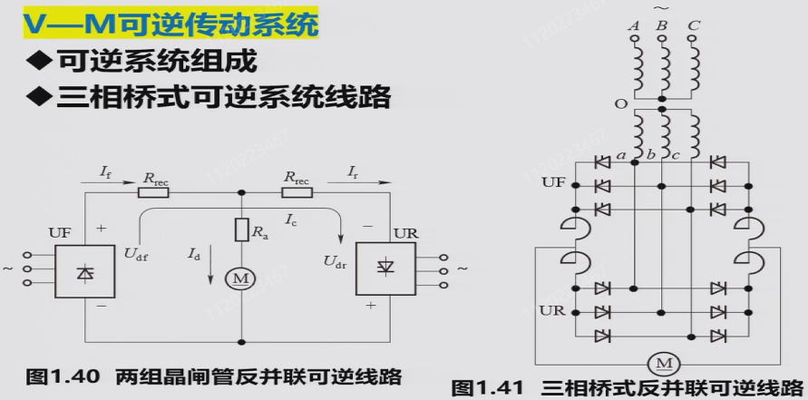

## 概述

测验 15%+作业研讨 15%+综合设计大作业 20%+闭卷考试 50%

电气传动系统：由电动机带动工作机械的传动系统，是一种典型的自动控制系统；控制对象是电动机，控制核心是控制器，用电力电子功率变换装置来驱动执行机构。电气传动系统的基本控制目的：动态（启动调速制动）、静态（精度）

课程内容：电气传动基础（动力学基础、直流他励电动机特性及运动方式）、直流调速自动控制系统（开环/闭环系统、可逆系统、调速系统的设计与调试）、交流调速自动控制系统（异步电动机的特性及运动方式、转差频率控制、矢量变换控制、直接转矩控制）

重点在第一章，第三章不讲，小学期有控制系统综合调试的课程，第四周闭卷课堂测验

## 第一章 直流电动机调速系统

### 1. 电气传动动力学基础

$$T_e$$为电磁转矩，$$T_L$$为负载转矩

对于旋转中的物体，工程上用飞轮矩的概念来表示其转动惯量，在计算上为，有的资料定义为转动惯量的 4 倍（$$MD^2$$），有的定义为转动惯量的 4g 倍（$$GD^2$$），本课程采用后一种。飞轮矩用于衡量转动物体保持其原有转动状态的能力，飞轮矩越大，抵抗转速变化的能力越强。

---

基本运动方程（欧拉第二定律）：

$$
\begin{equation}
T_M - T_L = \frac{\text{d}(J\omega)}{\text{d}t} = J\frac{\text{d}\omega}{\text{d}t}+\omega\frac{\text{d}J}{\text{d}t}
\label{eq:1}
\end{equation}
$$

作以下假设

$$
\begin{aligned}
&忽略空载转矩，T_M = T_e \quad (实际应为T_e = T_M + T_0, T_0为空载转矩)\\
&假设转动惯量为常值，\omega\frac{\text{d}J}{\text{d}t} = 0\\
&J = m\rho^2=m\frac{D^2}{4} = \frac{GD^2}{4g}(\rho为质点到转轴的距离,也称惯性半径)\\
&g取9.8m/s^2, \omega = \frac{2\pi}{60}n\\
\end{aligned}
$$

将假设代入\eqref{eq:1}得：

$$
\begin{equation}
T_e- T_L \approx \frac{GD^2}{375}\frac{\text{d}n}{\text{d}t}
\label{eq:2}
\end{equation}
$$

显然$$T_e > T_L$$时系统加速，$$T_e<T_L$$时系统减速，$$T_e=T_L$$时系统处于稳态，此时电动机电磁转矩大小由负载转矩大小决定。

转矩方向以设定电动机的旋转方向为参考标准，电磁转矩$$T_e$$与之同向为正与之反向为负，负载转矩$$T_L$$与之同向为负与之反向为正。

---

对于多轴系统，基于能量守恒定律（功率守恒）进行等效折算

- 转矩折算

$$
\begin{aligned}
&由T_L'\omega_M = \frac{T_L\omega_L}{\eta}\quad(T_L'为折合到电机轴上的转矩,\eta为传动效率)\\
&故T_L' = \frac{T_L}{i\eta}\quad(i为齿轮传动比，规定为\frac{\omega_M}{\omega_L}，即\frac{主动}{从动})\\
&对于直线运动的负载，T_L = GR
\end{aligned}
$$

- 飞轮矩折算

对于不同的负载形式，令总动能为$\frac{1}{2}J\omega_M^2$，其中$J$为等效到电机输出轴上的转动惯量

$$
\begin{aligned}
&\frac{1}{2}J\omega_M^2 = \frac{1}{2}J_M\omega_M^2 + \frac{1}{2}J_L\omega_L^2 + \frac{1}{2}mv^2 \quad (直线运动的负载)\\
&\frac{1}{2}J\omega_M^2 = \frac{1}{2}J_M\omega_M^2 + \frac{1}{2}J_L\omega_L^2 \quad (旋转运动的负载)\\
\end{aligned}
$$

化简可得等效转动惯量：

$$
\begin{aligned}
&J = J_M + \frac{J_L}{i^2} + \frac{mv^2}{\omega_M^2}\quad(直线运动的负载)\\
&J = J_M + \frac{J_L}{i^2}\quad(旋转运动的负载)\\
\end{aligned}
$$

根据$$GD^2 = 4gJ$$得等效飞轮矩：

$$
\begin{aligned}
&GD^2 = G_MD_M^2 + \frac{G_LD_L^2}{i^2} + 4g\frac{mv^2}{\omega_M^2} = G_MD_M^2 + \frac{G_LD_L^2}{i^2} + 365\frac{G_mv^2}{n_M^2}\quad(直线运动的负载)\\
&GD^2 = G_MD_M^2 + \frac{G_LD_L^2}{i^2}\quad(旋转运动的负载)\\
\end{aligned}
$$

由于$$\frac{1}{i^2}$$一般非常小，在工程上一般将$$J_M + \frac{J_L}{i^2}$$近似为$$(1+\delta)J_M$$，将$$GD_M^2 + \frac{GD_L^2}{i^2}$$近似为$$(1 + \delta)GD_M^2$$，$$\delta$$在工程上取 0.2~0.3 即可；即相对于负载侧，电机轴侧的转动惯量/飞轮矩是起主导作用的。

---

电动机的性能可用机械特性和负载转矩特性来表征

- 机械特性即转速$$n$$与电磁转矩$$T_e$$的关系$$n=f(T_e)$$

1 为他励/并励电机的机械特性，相对较硬；2 为串励电机的机械特性，相对较软；3 为异步电机的机械特性；同步电机得益于其驱动原理，机械特性最硬，几乎为一条水平直线

- 负载转矩特性即转速$$n$$与电负载转矩$$T_L$$的关系$$n=f(T_L)$$

三种类型的负载转矩特性如图

反抗性恒转矩：比如摩擦（纯机械负载）

位能性恒转矩：比如电梯（提升轿厢）

- 机械特性曲线和负责转矩特性曲线有交点是电力拖动系统稳定运行的必要条件，即存在$$T_e = T_L$$的转速才有可能达到稳态。在此之上，还需要在该交点转速之上的转速满足$$T_e < T_L$$，该交点转速之下的转速满足$$T_e > T_L$$（即高于稳态转速时有减速倾向，低于稳态转速时有加速倾向，类似于自控中稳定平衡点的概念）

### 2. 直流他励电动机机械特性及运行方法

直流电动机按励磁方式可分为他励和自励（分为并励、串励和复励，复励又分为正复励和负复励）

他励方式中励磁和电枢绕组供电互不影响，并励方式中励磁线圈细且多匝（小电流且保证磁场电压相同），串励方式中励磁线圈少且少匝（减少损耗和压降且保证电流相同），本课程在他励电动机的范畴内讨论。

---

直流电动机基本公式（推导见自动控制元件对应章节）

{: .left}

 
$$
\begin{aligned}
&E = C_e\Phi n \quad C_e = \frac{4pN}{60} \quad (反电动势) \\
&T_e= C_m\Phi I \quad C_m = \frac{2pN}{\pi} \quad (电磁转矩)\\
&C_m = \frac{60}{2\pi} \approx 9.55C_e \\
&U = E + IR\\
\end{aligned}
$$

 
对于功率关系，电功率$$P = UI$$由机械功率$$T_e \omega$$，铜损$$I^2R$$，铁损，机械损耗和杂散损耗几部分构成。工程上得出结论，一般来说，铜损占总损耗50%，铁损占总损耗20%，机械和杂散损耗占30%，因此近似计算可认为$$P = UI = T_e \omega + 2I^2R$$（题目中往往用这一关系计算电阻）。实际测量时，同步电机的内阻一般为几欧姆，相对较大可用万用表测量，而其它电机的内阻一般为零点几欧姆，可用电桥测量（如惠斯通电桥）。

---

由基本公式可推导得机械特性曲线函数，$$n_0$$为理论空载转速，$$n_0'$$为实际空载转速，$$\Delta n$$为转速降；由于相对于力矩，电流显然更容易测得，也常写成转速特性$$n = f(I)$$

$$
\begin{equation}
n = \frac{U}{C_e\Phi} - \frac{R}{C_e C_m \Phi^2}T_e = \frac{U}{C_e\Phi} - \frac{R}{C_e\Phi}I = n_0 - \Delta n
\label{eq:3}
\end{equation}
$$

由图可见，转速降和斜率一一对应。另外需要注意，按照额定转速降的定义，$$T_e$$为额定转矩时对应的转速降称为额定转速降，而对磁通量和电阻没有要求；因此改变这两者是可以改变额定转速降的，只需保证$$T_e$$为额定转矩即可。题目中如果没有强调用额定转速降，就认为是变化后的转速降。

额定运行状态（nomial）下的机械特性称为固有特性（固有机械特性曲线，一般认为有且只有一条），改变电机内部或外部的参数得到的机械特性称为人为机械特性，也表示了电机调速的三种方式

$$
\begin{equation}
n = \frac{U_{nom}}{C_e\Phi_{nom}} - \frac{R}{C_e C_m \Phi_{nom}^2}T_e
\label{eq:4}
\end{equation}
$$

调速的性能指标有：

- 调速范围：工作机械要求的最高转速和最低转速之比$$D = \frac{n_{max}}{n_{min}}$$，一般取电机铭牌的额定转速$$n_{nom}$$作为最高转速
- 静差率：电机运行在某一机械特性上时，**额定转速降**与理想空载转速之比$$s = \frac{\Delta n_{nom}}{n_0} \times 100\%$$，对于调速系统而言，静差率的值为运行在调速范围内所有转速对应的静差率都能满足的 s 值（由于 s 值越小越好，故此处取调速范围内 s 的最大值，即调速范围内最低速对应的 s 值）
- 调速平滑性：用两个相邻调速级的转速比来衡量，调速范围一定时，调速级数越多平滑性越好；调速级数无穷多（转速连续可调）时称为无级调速

两个指标之间存在一定关系：（注：对于一个给定的电机，$$\Delta n_{nom}$$为一常值）

$$
\begin{aligned}
s &= \frac{\Delta n_{nom}}{n_{0min}}\\
D &= \frac{n_{max}}{n_{min}} = \frac{n_{nom}}{n_{0min} - \Delta n_{nom}}\\
&=\frac{n_{nom}}{\frac{\Delta n_{nom}}{s} - \Delta n_{nom}}\\
&=\frac{s}{(1 - s)}\cdot\frac{n_{nom}}{\Delta n_{nom}}
\end{aligned}
$$

即

$$
\begin{equation}
D =\frac{s}{(1 - s)}\cdot\frac{n_{nom}}{\Delta n_{nom}}
\label{eq:5}
\end{equation}
$$

由这个式子可看出，静差率越小越好和调速范围越大越好这两个要求是互相矛盾的，因此在设计电机时需要进行权衡。

---

电动机有电动和制动两种运行状态，区别在于电磁转矩$$T_e$$的方向与转速$$n$$是相同还是相反。因此，制动和减速并没有直接关系。

直流他励电动机启动时，需要先建立磁场，再加电枢电压。如果先施加电枢电压，由于电机硅钢片中的铁损存在剩磁（即$$\Phi$$为一个很小的值），一旦施加电压，$$n = \frac{U}{C_e\Phi} - \frac{R}{C_e C_m \Phi^2}T_e$$中的第一项会非常大，对电机造成不可逆的损坏。启动方式有降压启动后逐渐升到额定电压、电枢串电阻启动后分级切除（目前已被新型器件），目的都是缓冲启动时的冲击。

电气制动有三种方式：回馈制动、能耗制动和反接制动

- 回馈制动：减小电枢电压，将系统动能转变为电能送回电网

- 能耗制动：撤去电枢电压并串接能耗电阻，将能量耗散在电阻上；串入电阻阻值计算的经验公式为

  $$R_r \ge \frac{U_{nom}}{\lambda I_{nom}} - R_a$$

  ==为什么能耗制动的瞬间，U 约等于 E==

- 反接制动：

  - 电源反接，同时串接大电阻（$$U$$变为$$-U$$，串电阻限流），串入电阻阻值计算的经验公式为$$R_r \ge \frac{2U_{nom}}{\lambda I_{nom}} - R_a$$，$$\lambda$$为过载系数，一般取 1.5~2.5；$$U_{max}$$的系数为 2 的原因是电源反接时电压相当于变为了两倍。另外需要注意，电源反接不是调压，即直接且只能改变电压极性

  - 转速反向，针对位能性负载，串入大电阻使得$$T_e = T_L$$时转速反向，此时$$T_e$$与$$n$$反向，处于制动状态

三种制动的差别在于将纵轴交点确定在了不同的位置，与原来$$n_0$$同号则为回馈制动，与原来$$n_0$$异号则为反接制动，在原点则为能耗制动。分析方法为，根据$$U$$和$$R$$的条件变化确定机械特性曲线的位置（对于确定的电机，一种$$U$$和$$R$$的条件确定一条特定的机械特性曲线，并确定对应的$$n_0$$）；由于转速不突变，工作点编导新的机械特性曲线上，再根据\eqref{eq:2}确定转速变化的方向和终点。

对于一条给定的机械特性曲线，可按照总结的规则确定各段中电动机的工作状态：

曲线过原点：能耗制动

1. $$n$$与$$n_0$$同向且$$\vert n\vert > \vert n_0 \vert$$：回馈制动
2. $$n$$与$$n_0$$同向且$$\vert n \vert < \vert n_0 \vert$$：电动
3. $$n$$与$$n_0$$反向：电源反向反接制动
4. $$n_0$$不变：转速反向反接制动

（以第二条为例，简要说明推理过程：$$ \vert n \vert > \vert n_0 \vert$$，则$$ \vert E \vert > \vert U \vert $$，电流从作为电源的$$E$$流向作为负载的$$U$$，$$T_e$$与$$n$$反向，为发电机状态，制动）

另外，对于反抗性负载的情况，尤其需要注意$$n$$为正即上半平面时，看的是第一象限的$$+T_L$$，$$n$$为负即下半平面时，看的是第三象限的$$-T_L$$

---

电气传动系统从一个稳定运行状态过度到另一个稳定运行状态，称为过渡过程；过渡过程中转速转矩电流等物理量的变化，称为动态特性。

由\eqref{eq:2}、\eqref{eq:3}：

$$
\begin{aligned}
&T_e- T_L \approx \frac{GD^2}{375}\frac{\text{d}n}{\text{d}t}\\
&n = \frac{U}{C_e\Phi} - \frac{R}{C_e C_m \Phi^2}T_e\\
\end{aligned}
$$

得：

$$
n = \frac{U}{C_e\Phi} - \frac{R}{C_e C_m \Phi^2}T_L - \frac{GD^2}{375}\cdot\frac{R}{C_e C_m \Phi^2}\frac{\text{d}n}{\text{d}t}
$$

将$$\frac{U}{C_e\Phi}$$写成$$n_0$$；当$$T_e = T_L$$，即$$\frac{\text{d}n}{\text{d}t} = 0$$时，称$$n_s = n_0 - \frac{R}{C_e C_m \Phi^2}T_L$$为稳态转速，对应的$$I_s = \frac{T_e}{C_m\Phi} = \frac{T_L}{C_m\Phi}$$为稳态电流，称$$T_m = \frac{GD^2}{375}\cdot\frac{R}{C_e C_m \Phi^2}$$为机电时间常数（注意$$R$$表示总的电阻值，因此有附加电阻时要算上），代入式子得：

$$
n = n_s - T_m\frac{\text{d}n}{\text{d}t}
$$

求解该一阶微分方程可得：

$$
\begin{equation}
n = n_s + (n_{init} - n_s)e^{-\frac{t}{T_m}}
\label{eq:6}
\end{equation}
$$

初始值一般会给定，稳态值在工程上取$$t = 4T_m$$时的值即可（也可由机械特性曲线上$$T_e = T_L$$交点处得出），机电时间常数对于给定的系统也是确定的，由此便可以确定系统的动态特性

$$
\begin{aligned}
&n = n_s + (n_{init} - n_s)e^{-\frac{t}{T_m}}\\
&I = I_s + (I_{init} - I_s)e^{-\frac{t}{T_m}}\\
&T_e = T_{es} + (T_{einit} - T_{es})e^{-\frac{t}{T_m}}\\
\end{aligned}
$$

注意：在反抗型负载的电源反接制动中，$$t \le t_1$$时，稳态值要代 c 点的

### 3. 直流电动机开环调速系统

- 旋转变流机组供电的开环调速系统（G-M）

三相异步电动机拖动直流发电机运动，发出直流电作为直流电动机的电枢电压，另外还需要一个小的直流电动机（为三相异步电机的驱动电路提供直流供电），两个直流电动机的励磁电源以及三相异步电机驱动电路中的开关器件，均需要额外的直流电供电。发电机和电动机根据产生感应电动势的相对大小，分别可以工作在功率输出或功率吸收状态。

- 脉冲宽度调制直流调速系统（PWM-M）（斩波调速）

注：二极管的作用是续流，使得能量有地方释放

注意：一般来说，占空比的定义是高电平的时间占周期时间的比例，但本课程中的占空比是根据 H 桥来定义的，即$$\frac{U_d}{U_s}$$，而$$U_d$$是可正可负的，取值范围是-1~1（双极性 PWM）

机械特性：$$n = \frac{\rho U_s}{C_e\Phi} - \frac{R}{C_eC_m\Phi^2}T_e$$，机械特性曲线为一族平行曲线，理想空载转速随占空比变化；在采用 H 桥直流斩波电源驱动时，由于电源可以工作在功率输出和功率吸收状态，电机可以四象限运行。

- 晶闸管脉冲相位控制直流调速系统（V-M）（整流调速）

晶闸管整流器 V 可为任意整流电路，上面的三条斜线表示三相，GT 表示触发电路，L 为平波电抗器，右侧的三相整流桥为电动机提供直流励磁电压；$$U_{cf}$$与$$U_d$$存在比例关系，且二者延迟一个周期。

使用晶闸管相控的直流可调电源，与发电机电源的区别在于：晶闸管单相导通，电动机不可工作在发电机状态；另外，晶闸管的触发角$$\alpha$$（在单相电路中是相电压过零点；在三相电路中是自然换向点和触发信号起始点之间的相位差）需要大于某个阈值时才能使电流连续。相较于和脉宽调制的直流可调电源，一个通过控制占空比调节电压，一个通过控制相位控制电压。

晶闸管相控的问题是，由于晶闸管的单相导电性，电流可能出现断续，且存在移相控制的延迟问题。

---

晶闸管相控电路分析（以三相零式电路/三相半波可控整流电路为例）：

共阴极接法有公共端，电路简单；共阳极接法：共用散热，电路复杂。变压器一次侧为三角形连接：形成内部环路，避免三次谐波污染电网；变压器二次侧为星形连接：为了引出零线，形成直流电。晶闸管的导通条件为施加正向偏置的情况下有门极驱动信号，关断条件为阳极电流小于维持电流。三相对应的三个晶闸管触发脉冲互差 120°。

重温几个电角度：

- 自然换向点：相电压交汇的时刻，是不考虑触发脉冲时的换向时刻，即晶闸管能够导通的最早时刻，是计算触发角的起点
- 导通角$$\theta$$：开关管导通的相位范围
- 触发角/控制角$$\alpha$$：以自然换向点为起点，从左往右，以触发脉冲开始时刻为终点的电角度
- 逆变角$$\beta$$：为$$\alpha$$的补角，以自然换向点向前 180° 为起点，从右往左取$$\alpha$$补角的度数为终点的电角度

对于同一电路，只要触发角非零，180° 的范围就一定会跨越正负，因此，当$$\alpha$$起点处对应的电压为正时（课件中称为正的自然换向点，个人认为这种表述不是很好理解），$$\beta$$起点处对应的电压一定为负，反之亦然。共阴极接法的自然换向点为正，共阳极接法的自然换向点为负。

| 条件     | $$U_{VT1}$$ | $$U_d$$ |
| -------- | ----------- | ------- |
| VT1 导通 | $$0$$       | $$U_a$$ |
| VT2 导通 | $$U_{ab}$$  | $$U_b$$ |
| VT3 导通 | $$U_{ac}$$  | $$U_c$$ |
| 均不导通 | $$U_a$$     | $$0$$   |

**纯电阻负载**的三相半波可控整流中，使得电流连续的晶闸管的最大触发角为 30°，大于此角度时，经过自然换向点后，三相中电压最高相的触发脉冲还没有到来，晶闸管不导通，电流断续。电流连续时，输出的平均电压$$U_d = U_{d0} \cos \alpha = 1.17U_2 \cos \alpha$$，$$U_2$$为相电压有效值，$$U_{d0}$$为$$\alpha=0$$时的输出电压，在这个电路结构中$$U_{d0}=1.17U_2$$。当晶闸管的触发角度达到 150° 及以上时，$$U_d = 0$$，150° 这个使得输出电压为正的阈值角度被称为移相范围。晶闸管承受最大正向电压为相电压峰值$$\sqrt{2}U_2$$，最大反向电压为线电压峰值$$\sqrt{6}U_2$$。

**阻感负载**的三相半波可控整流中，当电感足够大时，电流始终连续，晶闸管导通角达到三相零式电路中导通角可达的最大值 120°，移相范围为 90°。晶闸管承受最大正向反向电压均为线电压峰值$$\sqrt{6}U_2$$另外，加入感性负载后，由于局部负电压的出现，等效输出电压有所降低，为此可以并联续流二极管来避免负压，提高输出电压的等效值。

=

反电动势负载的三相半波可控整流可理解为 E-R-L 模型，下面以$$\alpha = 60°$$ 为例分析，从左到右分别理解为 L=0、L 普通、L 较大

L=0 时为纯阻性负载，相电压不超过 E 时输出电压均为 E；L 普通时，可以续流一段时间使得相电压在低于 E 时保持为相电压，电感能量释放完毕后输出电压恢复 E，直到相电压重新超过 E；L 较大时，可以完全抵消 E 的作用，输出电压完全由相电压和触发信号决定

---

为了使晶闸管相控电路能够吸收能量，由于晶闸管已经限定了电流方向，因此采用改变电压极性的方式，即逆变。逆变分为有源逆变和无源逆变两种，前者转换得到的交流电能直接输送给交流电网，后者转换得到的电能直接输送给交流负载。

左侧提升负载，E 为正，电机作为电动机，电路处于整流状态；右侧下降负载，E 为负，电机作为发电机，电路处于逆变状态。

有源逆变的条件：变流器直流侧必须外接一个直流电源 E，其极性和晶闸管导通方向一致，且$$\vert E \vert > \vert U_d \vert$$；此外，变流器直流侧的直流平均电压需要为负，即$$\alpha > 90$$°, $$U_d < 0$$。导致逆变失败的原因可能有触发电路不可靠、晶闸管故障、交流电异常等硬件问题，也可能有换向裕量不足的设计问题。换向裕量是对触发脉冲持续时间和电压幅值的要求；由于实际晶闸管的开通或关断是一个过程而非瞬间完成，如果在开通或关断的过程中触发脉冲就结束了，换向就会失败。定义换向所经历的时间间隔为换向重叠角$$\gamma$$，逆变角$$\beta$$需要大于这个值才有可能完成逆变，通常取最小逆变角$$30° < \beta_{min} < 35°$$

---

类似于单个电机的机械特性曲线，同样可以研究晶闸管脉冲相位控制直流调速系统（V-M 系统）的机械特性曲线

$$
n = \frac{U_d}{C_e \Phi} - \frac{R}{C_e C_m \Phi^2}T_e
$$

显然，输出平均电压$$U_d$$越大，理想空载转速$$n_0$$越大；同时，电流连续性越好，机械特性越硬。

当电流连续时，可以忽略电动机反电势$$E$$的作用，有$$U_d = U_{d0}\cos\alpha$$，改变$$\alpha$$，机械特性曲线为一组平行直线。当电流断续时，将系统等效为一个 E-R-L 模型。L 越大，平均电压越低，电流连续性越好，理想空载转速越低，机械特性越硬；触发角越大，平均电压越低，理想空载转速越低。断续会使得平均电压升高，理想空载转速也增加。

断续区的机械特性曲线是非线性的，在设计控制系统时希望尽可能地避免。

---

为了实现 V-M 系统的可逆运行，反向并联一组晶闸管

这样构建可逆系统存在环流的问题，即不经过电动机或其它负载，只在两组变流器之间流动的电流。环流分为直流环流（两组变流器输出平均电压不同而引起的环流）和脉动环流（两组变流器输出瞬时电压不同而引起的环流）两种。（注意标准环流需要画一整圈）

注：桥式整流中的平波电抗器是用于抑制环流的，需要接在电源输出侧而非作为负载的电机侧，否则因为环流不经过负载，平波电抗器也就不会起作用。另外，同一个桥臂的两个晶闸管由带有死区的互补 PWM 波控制，不会同时导通。

对于结构相同且交流电源相同的情况（保证$$U_{d0}$$相等），采用配合控制来抑制环流。所谓配合控制，就是正组的触发角等于反组的逆变角$$\alpha_F = \beta_R$$，此时两组晶闸管输出电压绝对值相等$$\vert U_{df} \vert = \vert U_{dr} \vert$$，便可以抑制直流环流。另外，正组触发角和反组触发角相差 180° 。==为什么绝对值一样就可以抑制直流环流和部分脉动环流==

而对于脉动环流，在这样的控制下，$$\Delta u_d$$的波形近似为锯齿波

正反组分别单独供电的机械特性曲线如下：

