## 概述

测验 15%+作业研讨 15%+综合设计大作业 20%+闭卷考试 50%

电气传动系统：由电动机带动工作机械的传动系统，是一种典型的自动控制系统；控制对象是电动机，控制核心是控制器，用电力电子功率变换装置来驱动执行机构。电气传动系统的基本控制目的：动态(启动调速制动)、静态(精度)

课程内容：电气传动基础(动力学基础、直流他励电动机特性及运动方式)、直流调速自动控制系统(开环/闭环系统、可逆系统、调速系统的设计与调试)、交流调速自动控制系统(异步电动机的特性及运动方式、转差频率控制、矢量变换控制、直接转矩控制)

重点在第一章，第二章主要考概念和理解，弱计算，第三章不讲，小学期有控制系统综合调试的课程

## 第一章 直流电动机调速系统

### 1.1 电气传动动力学基础

#### 基本方程

$$T_\text{e}$$为电磁转矩，$$T_\text{L}$$为负载转矩

对于旋转中的物体，工程上用飞轮矩的概念来表示其转动惯量，在计算上为，有的资料定义为转动惯量的 4 倍($$MD^2$$)，有的定义为转动惯量的 4g 倍($$GD^2$$)，本课程采用后一种。飞轮矩用于衡量转动物体保持其原有转动状态的能力，飞轮矩越大，抵抗转速变化的能力越强。

基本运动方程(欧拉第二定律)：

$$
\begin{aligned}
T_\text{M} - T_\text{L} = \frac{\text{d}(J\omega)}{\text{d}t} = J\frac{\text{d}\omega}{\text{d}t}+\omega\frac{\text{d}J}{\text{d}t}
\end{aligned}
$$

作以下假设(本课程中不作说明均忽略空载转矩)

$$
\begin{aligned}
&忽略空载转矩，T_\text{M} = T_\text{e} \quad (实际应为T_\text{e} = T_\text{M} + T_{0}, T_{0}为空载转矩)\\
&假设转动惯量为常值，\omega\frac{\text{d}J}{\text{d}t} = 0\\
&J = m\rho^2=m\frac{D^2}{4} = \frac{GD^2}{4g}(\rho为质点到转轴的距离,也称惯性半径)\\
&g取9.8m/s^2, \omega = \frac{2\pi}{60}n\\
\end{aligned}
$$

将假设代入得：

$$
\begin{aligned}
T_\text{e}- T_\text{L} \approx \frac{GD^2}{375}\frac{\text{d}n}{\text{d}t}
\end{aligned}
$$

显然$$T_\text{e} > T_\text{L}$$时系统加速，$$T_\text{e}<T_\text{L}$$时系统减速，$$T_\text{e}=T_\text{L}$$时系统处于稳态，此时电动机电磁转矩大小由负载转矩大小决定。

转矩方向以设定电动机的旋转方向为参考标准，电磁转矩$$T_\text{e}$$与之同向为正与之反向为负，负载转矩$$T_\text{L}$$与之同向为负与之反向为正。(负载转矩为正时表示负载转矩在反转方向)

#### 等效折算

对于多轴系统，基于能量守恒定律(功率守恒)进行等效折算

- 转矩折算

$$
\begin{aligned}
&由T_\text{L}'\omega_\text{M} = \frac{T_\text{L}\omega_\text{L}}{\eta}\quad(T_\text{L}'为折合到电机轴上的转矩,\eta为传动效率)\\
&故T_\text{L}' = \frac{T_\text{L}}{i\eta}\quad(i为齿轮传动比，规定为\frac{\omega_\text{M}}{\omega_\text{L}}，即\frac{主动}{从动})\\
&对于直线运动的负载，T_\text{L} = GR
\end{aligned}
$$

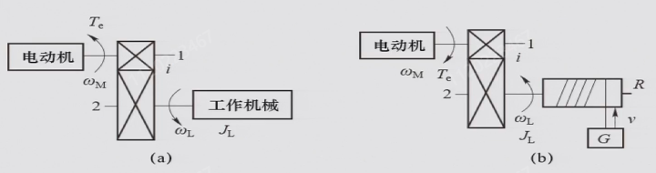

- 飞轮矩折算

对于不同的负载形式，令总动能为$\frac{1}{2}J\omega_\text{M}^2$，其中$J$为等效到电机输出轴上的转动惯量

$$
\begin{aligned}
&\frac{1}{2}J\omega_\text{M}^2 = \frac{1}{2}J_\text{M}\omega_\text{M}^2 + \frac{1}{2}J_\text{L}\omega_\text{L}^2 + \frac{1}{2}mv^2 \quad (直线运动的负载)\\
&\frac{1}{2}J\omega_\text{M}^2 = \frac{1}{2}J_\text{M}\omega_\text{M}^2 + \frac{1}{2}J_\text{L}\omega_\text{L}^2 \quad (旋转运动的负载)\\
\end{aligned}
$$

化简可得等效转动惯量：

$$
\begin{aligned}
&J = J_\text{M} + \frac{J_\text{L}}{i^2} + \frac{mv^2}{\omega_\text{M}^2}\quad(直线运动的负载)\\
&J = J_\text{M} + \frac{J_\text{L}}{i^2}\quad(旋转运动的负载)\\
\end{aligned}
$$

根据$$GD^2 = 4gJ$$得等效飞轮矩：

$$
\begin{aligned}
&GD^2 = G_\text{M}D_\text{M}^2 + \frac{G_\text{L}D_\text{L}^2}{i^2} + 4g\frac{mv^2}{\omega_\text{M}^2} = G_\text{M}D_\text{M}^2 + \frac{G_\text{L}D_\text{L}^2}{i^2} + 365\frac{G_\text{m}v^2}{n_\text{M}^2}\quad(直线运动的负载)\\
&GD^2 = G_\text{M}D_\text{M}^2 + \frac{G_\text{L}D_\text{L}^2}{i^2}\quad(旋转运动的负载)\\
\end{aligned}
$$

由于$$\frac{1}{i^2}$$一般非常小，在工程上一般将$$J_\text{M} + \frac{J_\text{L}}{i^2}$$近似为$$(1+\delta)J_\text{M}$$，将$$GD_\text{M}^2 + \frac{GD_\text{L}^2}{i^2}$$近似为$$(1 + \delta)GD_\text{M}^2$$，$$\delta$$在工程上取 0.2~0.3 即可；即相对于负载侧，电机轴侧的转动惯量/飞轮矩是起主导作用的。

#### 负载转矩特性

电动机的性能可用机械特性和负载转矩特性来表征

- 机械特性即转速$$n$$与电磁转矩$$T_\text{e}$$的关系$$n=f(T_\text{e})$$

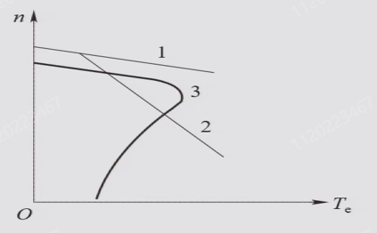

1 为他励/并励电机的机械特性，相对较硬；2 为串励电机的机械特性，相对较软；3 为异步电机的机械特性；同步电机得益于其驱动原理，机械特性最硬，几乎为一条水平直线

- 负载转矩特性即转速$$n$$与电负载转矩$$T_\text{L}$$的关系$$n=f(T_\text{L})$$

三种类型的负载转矩特性如图

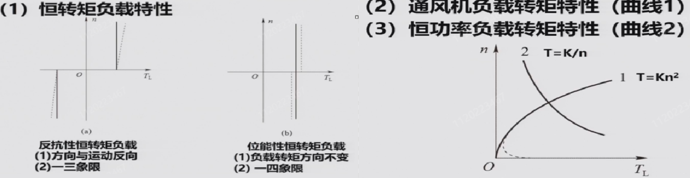

反抗性恒转矩：比如摩擦(纯机械负载)

位能性恒转矩：比如电梯(提升轿厢)

- 机械特性曲线和负责转矩特性曲线有交点是电力拖动系统稳定运行的必要条件，即存在$$T_\text{e} = T_\text{L}$$的转速才有可能达到稳态。在此之上，还需要在该交点转速之上的转速满足$$T_\text{e} < T_\text{L}$$，该交点转速之下的转速满足$$T_\text{e} > T_\text{L}$$(稳定运行的条件)

  (即高于稳态转速时有减速倾向，低于稳态转速时有加速倾向，类似于自控中稳定平衡点的概念)

### 1.2 直流他励电动机机械特性及运行方法

直流电动机按励磁方式可分为他励和自励(分为并励、串励和复励，复励又分为正复励和负复励)

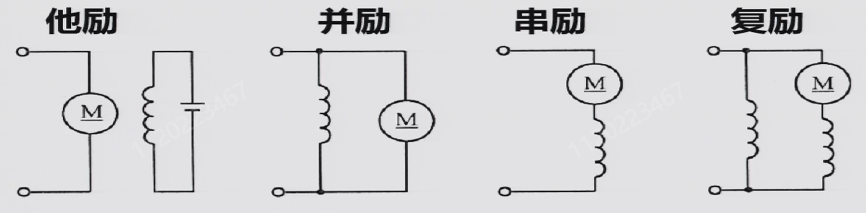

他励方式中励磁和电枢绕组供电互不影响，并励方式中励磁线圈细且多匝(小电流且保证磁场电压相同)，串励方式中励磁线圈少且少匝(减少损耗和压降且保证电流相同)，本课程在他励电动机的范畴内讨论。

#### 直流电动机基本公式

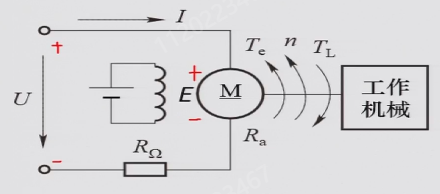

$$
\begin{aligned}
&E = C_\text{e}\Phi n \quad C_\text{e} = \frac{4pN}{60} \quad (反电动势) \\
&T_\text{e}= C_\text{m}\Phi I \quad C_\text{m} = \frac{2pN}{\pi} \quad (电磁转矩)\\
&C_\text{m} = \frac{60}{2\pi} \approx 9.55C_\text{e} \\
&U = E + IR\\
\end{aligned}
$$

对于功率关系，电功率$$P = UI$$由机械功率$$T_\text{e} \omega$$，铜损$$I^2R$$，铁损，机械损耗和杂散损耗几部分构成。工程上得出结论，一般来说，铜损占总损耗 50%，铁损占总损耗 20%，机械和杂散损耗占 30%，因此近似计算可认为$$P = UI = T_\text{e} \omega + 2I^2R$$(题目中往往用这一关系计算电阻)。实际测量时，同步电机的内阻一般为几欧姆，相对较大可用万用表测量，而其它电机的内阻一般为零点几欧姆，可用电桥测量(如惠斯通电桥)。

#### 机械特性曲线

由基本公式可推导得机械特性曲线函数，$$n_{0}$$为理论空载转速，$$n_{0}'$$为实际空载转速，$$\Delta n$$为转速降；由于相对于力矩，电流显然更容易测得，也常写成转速特性$$n = f(I)$$

$$
\begin{aligned}
n = \frac{U}{C_\text{e}\Phi} - \frac{R}{C_\text{e} C_\text{m} \Phi^2}T_\text{e} = \frac{U}{C_\text{e}\Phi} - \frac{R}{C_\text{e}\Phi}I = n_{0} - \Delta n
\end{aligned}
$$

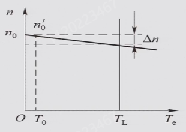

由图可见，转速降和斜率一一对应。另外需要注意，按照额定转速降的定义，$$T_\text{e}$$为额定转矩时对应的转速降称为额定转速降，而对磁通量和电阻没有要求；因此改变这两者是可以改变额定转速降的，只需保证$$T_\text{e}$$为额定转矩即可。题目中如果没有强调用额定转速降，就认为是变化后的转速降。

额定运行状态(nomial)下的机械特性称为固有特性(固有机械特性曲线，在不对调电源极性的情况下有且只有一条，调换后可得到关于原点对称的另一条)，改变电机内部或外部的参数得到的机械特性称为人为机械特性，也对应了直流电机的三种调速方式

$$
\begin{aligned}
n = \frac{U_\text{nom}}{C_\text{e}\Phi_\text{nom}} - \frac{R}{C_\text{e} C_\text{m} \Phi_\text{nom}^2}T_\text{e}
\end{aligned}
$$

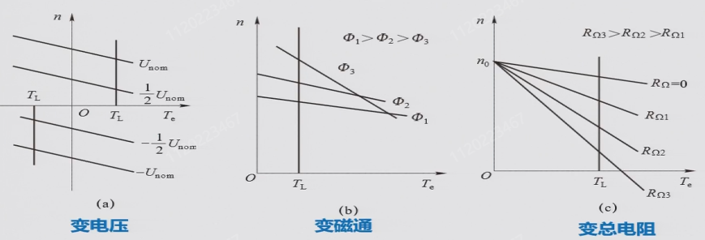

#### 调速性能指标

静态指标：调速范围、静差率、调速平滑性

- 调速范围：工作机械要求的最高转速和最低转速之比$$D = \frac{n_\text{max}}{n_\text{min}}$$，一般取电机铭牌的额定转速$$n_\text{nom}$$作为最高转速

- 静差率：电机运行在某一机械特性上时，**额定转速降**与理想空载转速之比$$s = \frac{\Delta n_\text{nom}}{n_{0}} \times 100\%$$，显然额定转速降越大，静差率越大。对于调速系统而言，静差率的值为运行在调速范围内所有转速对应的静差率都能满足的 s 值(由于 s 值越小越好，故此处取调速范围内 s 的最大值，即调速范围内最低速对应的 s 值，因此，如果低速时的静差率满足要求，则高速时就一定满足)
- 调速平滑性：用两个相邻调速级的转速比来衡量，调速范围一定时，调速级数越多平滑性越好；调速级数无穷多(转速连续可调)时称为无级调速

当取最低转速来衡量静差率时，两个指标之间存在一定关系：

$$
\begin{aligned}
s &= \frac{\Delta n_\text{nom}}{n_\text{0min}}\\
D &= \frac{n_\text{max}}{n_\text{min}} \\
&= \frac{n_\text{nom}}{n_\text{0min} - \Delta n_\text{nom}}\\
&=\frac{n_\text{nom}}{\frac{\Delta n_\text{nom}}{s} - \Delta n_\text{nom}}\\
&=\frac{s}{(1 - s)}\cdot\frac{n_\text{nom}}{\Delta n_\text{nom}}
\end{aligned}
$$

即

$$
\begin{aligned}
D =\frac{s}{(1 - s)}\cdot\frac{n_\text{nom}}{\Delta n_\text{nom}}
\end{aligned}
$$

由这个式子可看出，静差率越小越好和调速范围越大越好这两个要求是互相矛盾的，因此在设计电机时需要进行权衡。另外注意，D 和 s 在开环和闭环都有，但都是稳态指标。

动态指标：上升时间、超调量、动态降落、恢复时间

1. 跟随性能指标：用阶跃响应来衡量

   时域看上升时间$$t_\text{r}$$，调节时间$$t_\text{s}$$和超调量$$\sigma = \frac{C_\text{max} - C_{\infty}}{C_{\infty}} \times 100 \%$$

   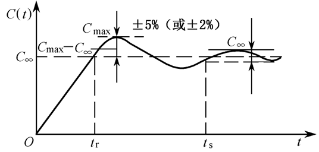

   频域：

   - 开环对数幅频特性：中频段$$h = \frac{\omega_{2}}{\omega_{1}}$$确定稳定性，交接频率$$\omega_\text{c}$$确定快速性，低频段放大倍数$$\vert A(0) \vert$$确定稳态精度
   - 闭环幅频特性：谐振幅值$$M_\text{p}$$确定稳定性和超调量，截止频率$$\omega_\text{d}$$确定快速性

   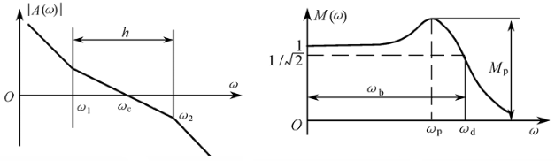

2. 抗扰性能指标：用阶跃扰动恢复过程来衡量

   动态降落$$\Delta C_\text{max} = \frac{\Delta C_\text{max}}{C_{\infty 1}}\times 100\% = \frac{C_{\infty 1} - C_{\infty 2}}{C_{\infty 1}}\times 100\%$$，恢复时间$$t_\text{v}$$

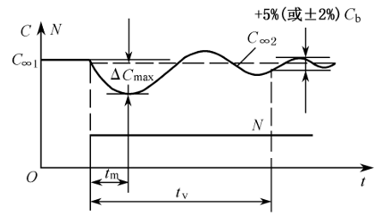

#### 启动与制动

电动机有电动和制动两种运行状态，区别在于电磁转矩$$T_\text{e}$$的方向与转速$$n$$是相同还是相反。因此，制动和减速并没有直接关系。

直流他励电动机启动时，需要先建立磁场，再加电枢电压。如果先施加电枢电压，由于电机硅钢片中的铁损存在剩磁(即$$\Phi$$为一个很小的值)，一旦施加电压，$$n = \frac{U}{C_\text{e}\Phi} - \frac{R}{C_\text{e} C_\text{m} \Phi^2}T_\text{e}$$中的第一项会非常大，对电机造成不可逆的损坏。启动方式有降压启动后逐渐升到额定电压、电枢串电阻启动后分级切除(目前已被新型器件替代)，目的都是缓冲启动时的冲击，副作用是会限制启动时的电磁转矩，加速度被限制，进行软启动，启动时间变长。另外，需要保持最大启动电枢电流启动，使其尽快达到需要的力矩。

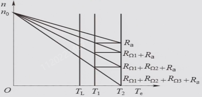

电气制动有三种方式：回馈制动、能耗制动和反接制动

- 回馈制动：减小电枢电压，将系统动能转变为电能送回电网

- 能耗制动：撤去电枢电压并串接能耗电阻，将能量耗散在电阻上；串入电阻阻值计算的经验公式为

  $$R_\text{r} \geqslant \frac{U_\text{nom}}{\lambda I_\text{nom}} - R_\text{a}$$(认为机械特性比较硬，制动时$$E \approx U$$)

- 反接制动：

  - 电源反接，同时串接大电阻($$U$$变为$$-U$$，串电阻限流)，串入电阻阻值计算的经验公式为$$R_\text{r} \geqslant \frac{2U_\text{nom}}{\lambda I_\text{nom}} - R_\text{a}$$，$$\lambda$$为过载系数，一般取 1.5~2.5；$$U_\text{max}$$的系数为 2 的原因是电源反接时电压相当于变为了两倍。另外需要注意，电源反接不是调压，即直接且只能改变电压极性

  - 转速反向，针对位能性负载，串入大电阻使得$$T_\text{e} = T_\text{L}$$时转速反向，此时$$T_\text{e}$$与$$n$$反向，处于制动状态

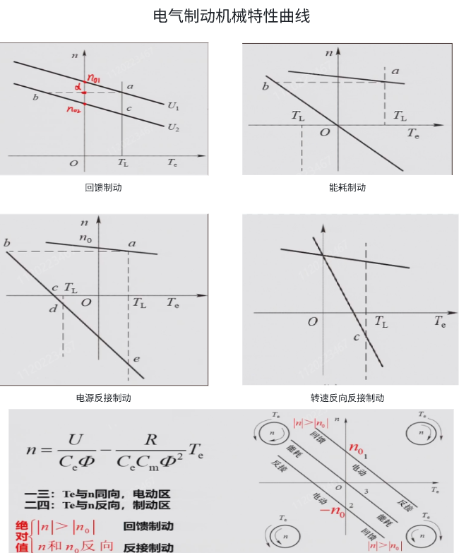

三种制动的差别在于将纵轴交点确定在了不同的位置，与原来$$n_{0}$$同号则为回馈制动，与原来$$n_{0}$$异号则为反接制动，在原点则为能耗制动。分析方法为，根据$$U$$和$$R$$的条件变化确定机械特性曲线的位置(对于确定的电机，一种$$U$$和$$R$$的条件确定一条特定的机械特性曲线，并确定对应的$$n_{0}$$)；由于转速不突变，工作点编导新的机械特性曲线上，再根据基本运动方程确定转速变化的方向和终点。(对于一条给定的机械特性，电枢电压$$U_\text{a}$$是一定的，随着转速的变化，反电动势$$E$$会变化，出现$$E < U_\text{a}$$、$$E = U_\text{a}$$、$$E > U_\text{a}$$三种情况)

对于一条给定的机械特性曲线，可按照总结的规则确定各段中电动机的工作状态：

曲线过原点：能耗制动

1. $$n$$与$$n_{0}$$同向且$$\vert n\vert > \vert n_{0} \vert$$：回馈制动
2. $$n$$与$$n_{0}$$同向且$$\vert n \vert < \vert n_{0} \vert$$：电动
3. $$n$$与$$n_{0}$$反向：电源反向反接制动
4. $$n_{0}$$不变：转速反向反接制动

以第二条为例，简要说明推理过程

$$
\begin{aligned}
\vert n \vert > \vert n_0 \vert \Rightarrow \vert E \vert > \vert U \vert \Rightarrow 电流从作为电源的E流向作为负载的U \Rightarrow T_\text{e}与n反向 \Rightarrow 为发电机状态，制动\\
\end{aligned}
$$

另外，对于反抗性负载的情况，尤其需要注意$$n$$为正即上半平面时，看的是第一象限的$$+T_\text{L}$$，$$n$$为负即下半平面时，看的是第三象限的$$-T_\text{L}$$

#### 动态特性

电气传动系统从一个稳定运行状态过度到另一个稳定运行状态，称为过渡过程；过渡过程中转速转矩电流等物理量的变化，称为动态特性。比如电机转速的增加、电流的增加、负载转矩的变化、制动过程等；而稳定转速的高速运动属于稳态。

$$
\begin{aligned}
&T_\text{e}- T_\text{L} \approx \frac{GD^2}{375}\frac{\text{d}n}{\text{d}t}\\
&n = \frac{U}{C_\text{e}\Phi} - \frac{R}{C_\text{e} C_\text{m} \Phi^2}T_\text{e}\\
&n = \frac{U}{C_\text{e}\Phi} - \frac{R}{C_\text{e} C_\text{m} \Phi^2}T_\text{L} - \frac{GD^2}{375}\cdot\frac{R}{C_\text{e} C_\text{m} \Phi^2}\frac{\text{d}n}{\text{d}t}\\
\end{aligned}
$$

将$$\frac{U}{C_\text{e}\Phi}$$写成$$n_{0}$$；当$$T_\text{e} = T_\text{L}$$，即$$\frac{\text{d}n}{\text{d}t} = 0$$时，称$$n_\text{s} = n_{0} - \frac{R}{C_\text{e} C_\text{m} \Phi^2}T_\text{L}$$为稳态转速，对应的$$I_\text{s} = \frac{T_\text{e}}{C_\text{m}\Phi} = \frac{T_\text{L}}{C_\text{m}\Phi}$$为稳态电流，称$$T_\text{m} = \frac{GD^2}{375}\cdot\frac{R}{C_\text{e} C_\text{m} \Phi^2}$$为机电时间常数(注意$$R$$表示总的电阻值，因此有附加电阻时要算上)，代入式子得：

$$
n = n_\text{s} - T_\text{m}\frac{\text{d}n}{\text{d}t}
$$

求解该一阶微分方程可得：

$$
\begin{aligned}
n = n_\text{s} + (n_\text{init} - n_\text{s})\text{e}^{-\frac{t}{T_\text{m}}}
\end{aligned}
$$

初始值一般会给定，稳态值在工程上取$$t = 4T_\text{m}$$时的值即可(也可由机械特性曲线上$$T_\text{e} = T_\text{L}$$交点处得出)，机电时间常数对于给定的系统也是确定的，由此便可以确定系统的动态特性

$$
\begin{aligned}
&n = n_\text{s} + (n_\text{init} - n_\text{s})\text{e}^{-\frac{t}{T_\text{m}}}\\
&I = I_\text{s} + (I_\text{init} - I_\text{s})\text{e}^{-\frac{t}{T_\text{m}}}\\
&T_\text{e} = T_\text{es} + (T_\text{einit} - T_\text{es})\text{e}^{-\frac{t}{T_\text{m}}}\\
\end{aligned}
$$

动态特性曲线如下，注意坐标轴的方向

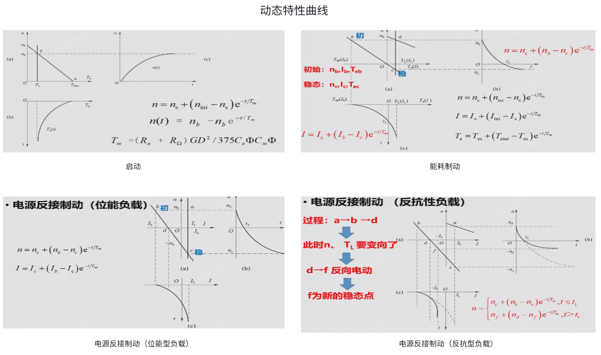

注意：在反抗型负载的电源反接制动中，$$t \leqslant t_{1}$$时，稳态值要代 c 点的。

### 1.3 开环直流调速系统

旋转变流机组供电的直流调速系统、脉冲宽度调制直流调速系统、晶闸管脉冲相位控制直流调速系统

#### 三种开环调速系统

- 旋转变流机组供电的开环调速系统(G-M)

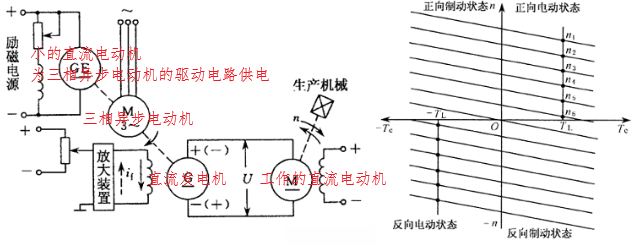

三相异步电动机拖动直流发电机运动，发出直流电作为直流电动机的电枢电压，另外还需要一个小的直流电动机(为三相异步电机的驱动电路提供直流供电)，两个直流电动机的励磁电源以及三相异步电机驱动电路中的开关器件，均需要额外的直流电供电。发电机和电动机根据产生感应电动势的相对大小，分别可以工作在功率输出或功率吸收状态。交流电动机和发电机基本工作在固定转速下，调节直流电动机的转速主要通过调节直流发电机的励磁电流来$$i_\text{f}$$实现；系统可以实现无级调速

- 脉冲宽度调制直流调速系统(PWM-M)(斩波调速)

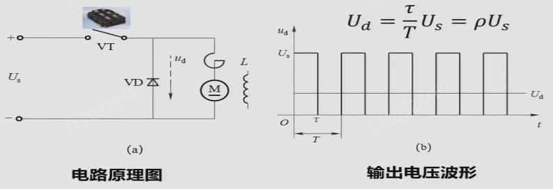

注：二极管的作用是续流，使得能量有地方释放

注意：一般来说，占空比的定义是高电平的时间占周期时间的比例，但本课程中的占空比是根据 H 桥来定义的，即$$\frac{U_\text{d}}{U_\text{s}}$$，而$$U_\text{d}$$是可正可负的，取值范围是-1~1(双极性 PWM)

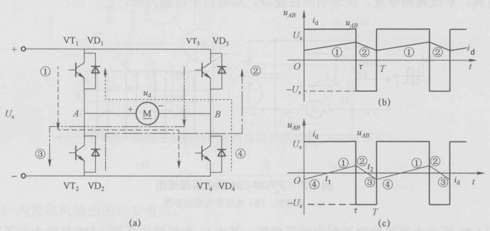

机械特性：$$n = \frac{\rho U_\text{s}}{C_\text{e}\Phi} - \frac{R}{C_\text{e}C_\text{m}\Phi^2}T_\text{e}$$，机械特性曲线为一族平行曲线，理想空载转速随占空比变化；在采用 H 桥直流斩波电源驱动时，由于电源可以工作在功率输出和功率吸收状态，电机可以四象限运行。

单极性输出的直流斩波电路不可逆不支持反向馈电，也不能输出反向电压对电机进行反转驱动，对于电梯等需要双向转动的场合不适合。不过具备基本的高速斩波能力，可以输出较为平滑的电流，实现平滑调速，斩波频率越高电磁转矩越平滑，低频调速性能较好。

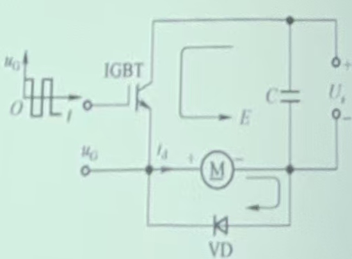

- 晶闸管脉冲相位控制直流调速系统(V-M)(整流调速)

晶闸管整流器 V 可为任意整流电路，上面的三条斜线表示三相，GT 表示触发电路，L 为平波电抗器，右侧的三相整流桥为电动机提供直流励磁电压；$$U_\text{cf}$$与$$U_\text{d}$$存在比例关系，且二者延迟一个周期。脉冲相位控制系统只能之后控制，不能采用超前触发。

使用晶闸管相控的直流可调电源，与发电机电源的区别在于：晶闸管单相导通，电动机不可工作在发电机状态；另外，晶闸管的触发角$$\alpha$$(在单相电路中是相电压过零点；在三相电路中是自然换向点和触发信号起始点之间的相位差)需要大于某个阈值时才能使电流连续。相较于和脉宽调制的直流可调电源，一个通过控制占空比调节电压，一个通过控制相位控制电压。对于大功率的 V-M 系统，其中的电动机和变流器等设备需要吸收感性无功功率以建立磁场，需要补偿来降低损耗，

V-M 系统的问题：晶闸管相控的问题是，由于晶闸管的单相导电性，电流可能出现断续，且存在移相控制的延迟问题。

直流他动电机传动系统，电机开环调速，通过调整供电电压来预定电机转速，但是由于电枢回路有电阻，在负载增加后，电磁转矩增大，转速下降反电势减小，电流增大，电滋转矩增大到负载转矩，但是由于电阻，最终只有电机转速低，反电势低才能维持较大电流，因此转速出现下掉，即调速误差，此前调速电压给定值只能根据电机机械特性，估计出电机转速值来确定给定电压。由于直接给定电机电压给定值，如果不加任何措施，在启动时，电机转速从 0 开始加速，低速反电势很低，无法抵消平衡回路中的供电电压，致使很大电压加在回路电阻上，造成过流，因此必须增加措施缓解或限制动态过程的冲击。

#### 晶闸管相控电路分析

(以三相零式电路/三相半波可控整流电路为例)

共阴极接法有公共端，电路简单；共阳极接法：共用散热，电路复杂。变压器一次侧为三角形连接：形成内部环路，避免三次谐波污染电网；变压器二次侧为星形连接：为了引出零线，形成直流电。晶闸管的导通条件为施加正向偏置的情况下有门极驱动信号，关断条件为阳极电流小于维持电流。三相对应的三个晶闸管触发脉冲互差 120°。

重温几个电角度：

- 自然换向点：相电压交汇的时刻，是不考虑触发脉冲时的换向时刻，即晶闸管能够导通的最早时刻，是计算触发角的起点
- 导通角$$\theta$$：开关管导通的相位范围
- 触发角/控制角$$\alpha$$：以自然换向点为起点，从左往右，以触发脉冲开始时刻为终点的电角度
- 逆变角$$\beta$$：为$$\alpha$$的补角，以自然换向点向前 180° 为起点，从右往左取$$\alpha$$补角的度数为终点的电角度

对于同一电路，只要触发角非零，180° 的范围就一定会跨越正负，因此，当$$\alpha$$起点处对应的电压为正时(课件中称为正的自然换向点，个人认为这种表述不是很好理解)，$$\beta$$起点处对应的电压一定为负，反之亦然。共阴极接法的自然换向点为正，共阳极接法的自然换向点为负。

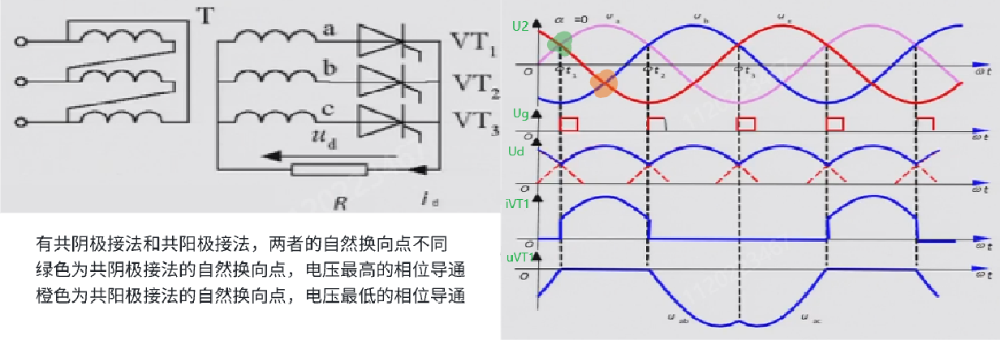

| 条件     | $$U_\text{VT1}$$ | $$U_\text{d}$$ |
| -------- | ---------------- | -------------- |
| VT1 导通 | $$0$$            | $$U_\text{a}$$ |
| VT2 导通 | $$U_\text{ab}$$  | $$U_\text{b}$$ |
| VT3 导通 | $$U_\text{ac}$$  | $$U_\text{c}$$ |
| 均不导通 | $$U_\text{a}$$   | $$0$$          |

**纯电阻负载**的三相半波可控整流中，使得电流连续的晶闸管的最大触发角为 30°，大于此角度时，经过自然换向点后，三相中电压最高相的触发脉冲还没有到来，晶闸管不导通，电流断续。电流连续时，输出的平均电压$$U_\text{d} = U_\text{d0} \cos \alpha = 1.17U_{2} \cos \alpha$$，$$U_{2}$$为相电压有效值，$$U_\text{d0}$$为$$\alpha=0$$时的输出电压，在这个电路结构中$$U_\text{d0}=1.17U_{2}$$。当晶闸管的触发角度达到 150° 及以上时，$$U_\text{d} = 0$$，150° 这个使得输出电压为正的阈值角度被称为移相范围。晶闸管承受最大正向电压为相电压峰值$$\sqrt{2}U_{2}$$，最大反向电压为线电压峰值$$\sqrt{6}U_{2}$$。

**阻感负载**的三相半波可控整流中，当电感足够大时，电流始终连续，晶闸管导通角达到三相零式电路中导通角可达的最大值 120°，移相范围为 90°。晶闸管承受最大正向反向电压均为线电压峰值$$\sqrt{6}U_{2}$$另外，加入感性负载后，由于局部负电压的出现，等效输出电压有所降低，为此可以并联续流二极管来避免负压，提高输出电压的等效值。

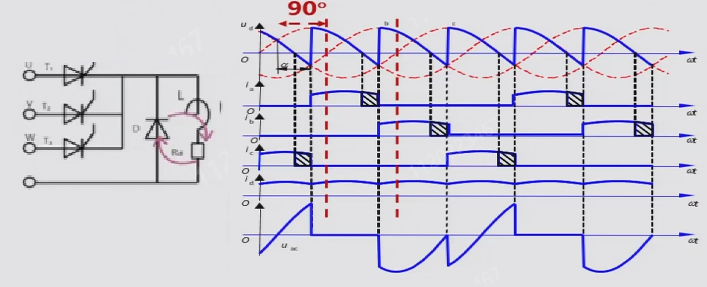=

反电动势负载的三相半波可控整流可理解为 E-R-L 模型，下面以$$\alpha = 60°$$ 为例分析，从左到右分别理解为 L=0、L 普通、L 较大

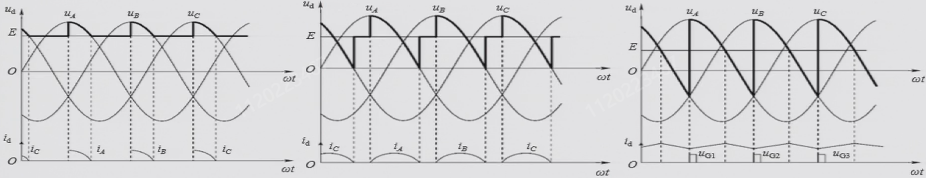

L=0 时为纯阻性负载，相电压不超过 E 时输出电压均为 E；L 普通时，可以续流一段时间使得相电压在低于 E 时保持为相电压，电感能量释放完毕后输出电压恢复 E，直到相电压重新超过 E；L 较大时，可以完全抵消 E 的作用，输出电压完全由相电压和触发信号决定

#### 晶闸管相控电路的逆变

为了使晶闸管相控电路能够吸收能量，由于晶闸管已经限定了电流方向，因此采用改变电压极性的方式，即逆变。逆变分为有源逆变和无源逆变两种，前者转换得到的交流电能直接输送给交流电网，后者转换得到的电能直接输送给交流负载。

左侧提升负载，E 为正，电机作为电动机，电路处于整流状态；右侧下降负载，E 为负，电机作为发电机，电路处于逆变状态。

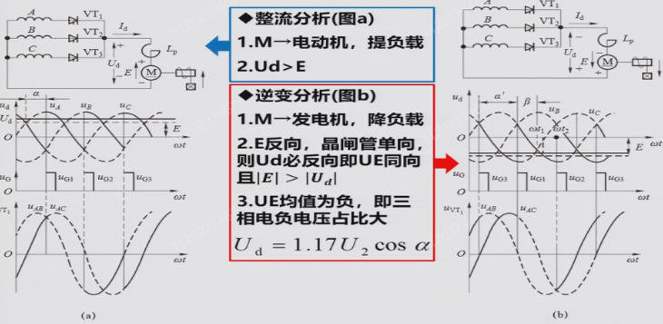

有源逆变的条件：变流器直流侧必须外接一个直流电源 E，其极性和晶闸管导通方向一致，且$$\vert E \vert > \vert U_\text{d} \vert$$；此外，变流器直流侧的直流平均电压需要为负，即$$\alpha > 90$$°, $$U_\text{d} < 0$$。导致逆变失败的原因可能有触发电路不可靠、晶闸管故障、交流电异常等硬件问题，也可能有换向裕量不足的设计问题。换向裕量是对触发脉冲持续时间和电压幅值的要求；由于实际晶闸管的开通或关断是一个过程而非瞬间完成，如果在开通或关断的过程中触发脉冲就结束了，换向就会失败。定义换向所经历的时间间隔为换向重叠角$$\gamma$$，逆变角$$\beta$$需要大于这个值才有可能完成逆变，通常取最小逆变角$$30° < \beta_\text{min} < 35°$$

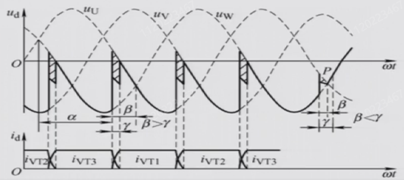

#### V-M 系统的机械特性曲线

类似于单个电机的机械特性曲线，同样可以研究晶闸管脉冲相位控制直流调速系统(V-M 系统)的机械特性曲线

$$
n = \frac{U_\text{d}}{C_\text{e} \Phi} - \frac{R}{C_\text{e} C_\text{m} \Phi^2}T_\text{e}
$$

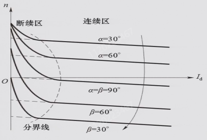

V-M 系统的机械特性在电流连续和电流断续时的特点：电流连续时为一组平行直线，与发电机向电动机供电的 G-M 系统的特性相似，由于晶闸管变流器供电时存在换向等效内阻，所以机械特性比 G-M 系统的特性软一些；电流断续时，断续程度越高，系统输出平均电压越高，理想空载转速越大，对应转速升高，同时由于电流断续时无法提供扭矩，故断续程度越高，机械特性也越软。

当电流连续时，可以忽略电动机反电势$$E$$的作用，有$$U_\text{d} = U_\text{d0}\cos\alpha$$，改变$$\alpha$$，机械特性曲线为一组平行直线(一种调压调速的方式)。当电流断续时，将系统等效为一个 E-R-L 模型。L 越大，平均电压越低，电流连续性越好，理想空载转速越低，机械特性越硬；触发角越大，平均电压越低，理想空载转速越低。断续会使得平均电压升高，理想空载转速也增加。另外，只要有电感，电流就不会突变。

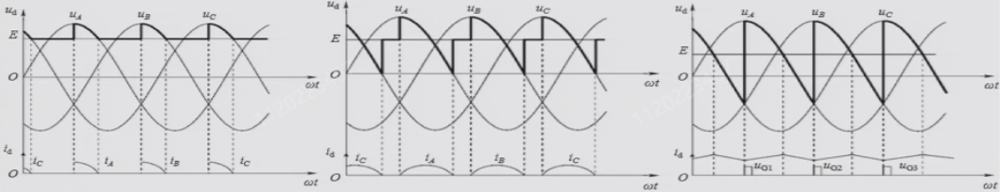

断续区的机械特性曲线是非线性的，在设计控制系统时希望尽可能地避免。

#### V-M 可逆系统的环流

为了实现 V-M 系统的可逆运行，反向并联一组晶闸管

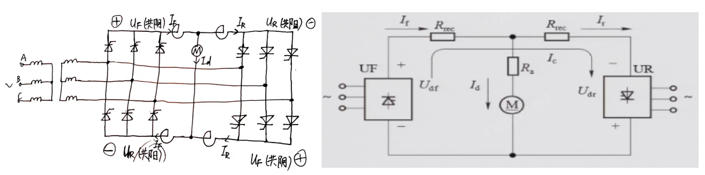

这样构建可逆系统存在环流的问题，即不经过电动机或其它负载，只在两组变流器之间流动的电流。环流分为直流环流(两组变流器输出平均电压不同而引起的环流)和脉动环流(两组变流器输出瞬时电压不同而引起的环流)两种。注意，标出环流需要画一整圈，且需要画正确的环流，统一桥臂的两个晶闸管不会同时导通。

对于结构相同且交流电源相同的情况(保证$$U_\text{d0}$$相等)，采用配合控制来抑制环流。所谓配合控制，就是正组的触发角等于反组的逆变角$$\alpha_\text{F} = \beta_\text{R}$$，此时两组晶闸管输出电压绝对值相等$$\vert U_\text{df} \vert = \vert U_\text{dr} \vert$$，便可以抑制直流环流。另外，正组触发角和反组触发角相差 180° 。

脉动环流是由于正反组瞬时电压不同造成的，但由于平波电抗器的存在，这个脉动环流经滤波后存在一个较小的直流分量，数值在脉动电流的 5%-10%。这个直流分量可以保持晶闸管的微导通状态，使得系统的动态性能更好。

注：桥式整流中的平波电抗器是用于抑制环流的，需要接在电源输出侧而非作为负载的电机侧，否则因为环流不经过负载，平波电抗器也就不会起作用。另外，同一个桥臂的两个晶闸管由带有死区的互补 PWM 波控制，不会同时导通。

环流的优缺点

- 优点：在正反组切换时，环流流能平滑连续过渡，没有动态死区，能加快过渡过程。少量环流流过晶闸管作为基本负载，使电机在空载或轻载时也能工作在电流连续区，从而避免了电流断续引起的非线性现象对系统静、动态性能的影响。
- 缺点：需要添置环流电抗器，损耗增大，成本提高

在下图的控制方式中，$$\Delta u_\text{d}$$的波形近似为锯齿波。环流大小在确定电路结构(电阻一定)后取决于电压差

为了理解图中的波形，作以下的补充说明：

触发角表示从自然换向点开始到脉冲信号的起始处，过了触发角之后，对应相位的晶闸管被触发；另外需要注意，三相的晶闸管是轮流触发的，而并不是每个触发角之后一起给触发信号的。自然换向点表示即将被触发的一相有了可以导通的资格，从这一刻起再过一个触发角的相位，这一相的晶闸管就会被触发，该相电压将作为负载上的实际电压。

#### V-M 可逆系统的运行

关于可逆系统中整流和逆变的工作状态，作以下的补充说明：

无论对正组还是反组，按如下规律理解

- 触发角小于 90° 时，平均电压$$U_\text{d}$$为正，是待整流的条件

- 逆变角小于 90° 时，平均电压$$U_\text{d}$$为负，是待逆变的条件

- $$\vert U_\text{d} \vert > \vert E \vert$$，且满足待整流的条件，是整流的条件

- $$\vert U_\text{d} \vert < \vert E \vert$$，且满足待逆变的条件，是逆变的条件

答题时，按如下说法

- 当$$\alpha<90°$$，$$\vert E \vert < \vert U_\text{d} \vert$$时，整流组整流，否则待整流
- 当$$\beta<90°$$，$$\vert E \vert > \vert U_\text{d} \vert$$时，逆变组逆变，否则待逆变

当四个角(正组触发角、正组逆变角、反组触发角、反组逆变角)中的一个确定后，另外三个角也就随之确定，平均电压也就随之确定，此时正组和反组必定一组满足待整流的条件，另一组满足带待逆变的条件。负载决定了系统的稳定转速，也就确定了反电势$$E$$，根据当前平均电压和反电势的关系可以确定能工作的那一组(满足待整流或待逆变)是整流还是逆变，另一组相应地就待工作。不妨在坐标系中随意画两条机械特性曲线加以说明。

注：

1. 对于一条特定的机械曲线，$$U_\text{d}$$的大小是确定的，$$E$$随着转速的变化而变化
2. 在讨论晶闸管开环调速可逆运行时，默认了电流是连续的，因此有$$U_\text{d} = U_\text{d0}\cos \alpha$$的关系

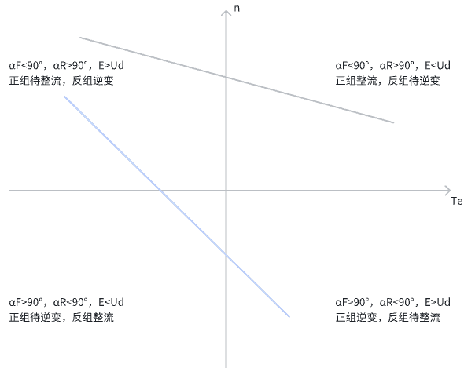

#### V-M 可逆系统机械特性曲线

正反组分别单独供电的机械特性曲线如下：

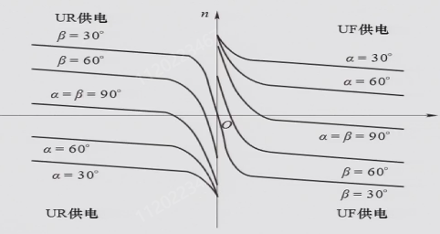

两组一起供电时，由于晶闸管桥的电流方向由其单相导电性确定，而电机支路的电流方向正反均可，而电流数值的关系是确定的：

$$
\vert I_\text{d} \vert = \vert I_\text{f} \vert - \vert I_\text{r} \vert
$$

由这个式子经严格的数学计算出来，两组共同供电时，机械特性曲线为直线，称为合成机械特性曲线

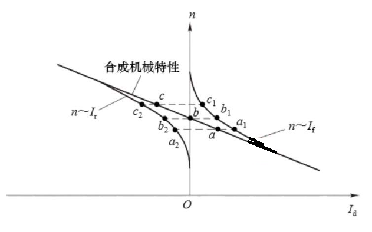

V-M 系统在电流较小时会出现电流断续现象使得机械特性变软，可采用转速电流双闭环、加平波电抗器、加电流补偿电路等方式来改善机械特性中的非线性部分。有环流可逆系统适用于反向要求快，过渡平滑性要求较高的中小容量系统。

#### 晶闸管变流电源的传函和框图

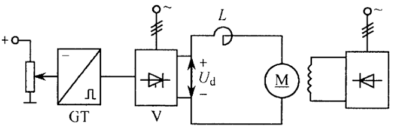

$$
\begin{aligned}
\frac{U_{\text{d}}(s)}{U_{\text{ct}}(s)} &= K_{\text{s}} \text{e}^{-T_{\text{s}}s}\\
\frac{U_{\text{d}}(\text{j}\omega)}{U_{\text{ct}}(\text{j}\omega)}&=K_{\text{s}} \text{e}^{-\text{j}\omega T_{\text{s}}}=\frac{K_{\text{s}}}{\left(1 - \frac{1}{2}T_{\text{s}}^{2}\omega^{2}+\frac{1}{24}T_{\text{s}}^{4}\omega^{4}-\cdots\right)+\text{j}\left(T_{\text{s}}\omega-\frac{1}{6}T_{\text{s}}^{3}\omega^{3}+\cdots\right)}\\

当\frac{1}{2}T_{\text{s}}^{2}\omega^{2}&\ll 1 \text{且} \frac{1}{6}T_{\text{s}}^{3}\omega^{3}\ll T_{\text{s}}\omega，即\omega_\text{c} \leqslant \frac{1}{3} T_\text{s}时 \quad (\omega_\text{c}为系统的开环截止频率)\\
\frac{U_{\text{d}}(s)}{U_{\text{ct}}(s)} &= K_{\text{s}} \text{e}^{-T_{\text{s}}s}\approx\frac{K_{\text{s}}}{T_{\text{s}}s + 1}\\
\end{aligned}
$$

$$
\begin{aligned}
\text{e}^{\text{j}x} &= \cos x + \text{j}\sin x\\
\sin x &=\sum_{n = 0}^{\infty}\frac{(- 1)^{n}}{(2n + 1)!}x^{2n+1}=x-\frac{x^{3}}{3!}+\frac{x^{5}}{5!}-\frac{x^{7}}{7!}+\cdots \\
\cos x &=\sum_{n = 0}^{\infty}\frac{(-1)^{n}}{(2n)!}x^{2n}=1-\frac{x^{2}}{2!}+\frac{x^{4}}{4!}-\frac{x^{6}}{6!}+\cdots \\
\end{aligned}
$$

$$T_\text{s}$$的含义如下，$$T_\text{smax} = \frac{1}{mf}$$，$$m$$为一个周期的波头数，$$f$$为电频率，取$$T_\text{s} = \frac{1}{2}T_\text{smax}$$。对于单相电路和三相电路，$$T_\text{s}$$的值分别为$$5\text{ms}$$和$$1.667\text{ms}$$。

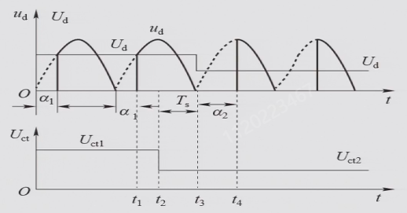

#### 电动机的传函和框图

对直流电机基本方程作拉普拉斯变换得：

$$
\begin{aligned}
U_{\text{d}}(s)&=(Ls + R)I_{\text{d}}(s)+E(s)\\
T_{\text{e}}(s)-T_{\text{L}}(s)&=\frac{GD^{2}}{375}sn(s)\\
E(s)&=C_{\text{e}}\varPhi n(s)\\
T_{\text{e}}(s)&=C_{\text{m}}\varPhi I_\text{d}(s)
\end{aligned}
$$

规定以下常数：

$$
\begin{aligned}
T_{1}&=\frac{L}{R} \quad (电磁时间常数，影响电流环响应速度)\\
T_{\text{m}}&=\frac{GD^{2}R}{375C_{\text{e}}C_{\text{m}}\varPhi^{2}}\quad (机电时间常数，影响速度环响应速度)\\
T_{\text{L}}&=C_{\text{m}}\varPhi I_{\text{dL}} \quad (I_\text{dL}为虚拟电流)
\end{aligned}
$$

得到系统框图如下：

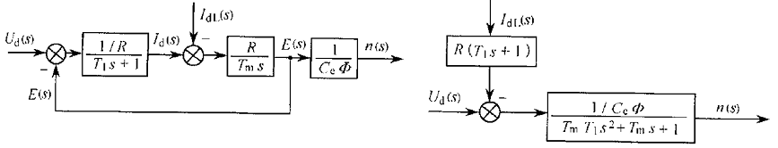

以上为电流连续时的结果，当电流断续时，等效电阻有所增大，定义为$$R'$$，且没有延迟环节，系统框图如下：

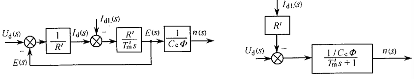

因此，直流电动机传递函数为：

$$
\begin{aligned}
\frac{n(s)}{U_{\text{d}}(s)}&=\frac{\frac{1}{C_{\text{e}\varPhi}}}{T_{\text{m}}T_{1}s^{2}+T_{\text{m}}s + 1} \quad (电流连续)\\
\frac{n(s)}{U_{\text{d}}(s)}&=\frac{\frac{1}{C_{\text{e}\varPhi}}}{T_{\text{m}}'s + 1} \quad (电流断续)
\end{aligned}
$$

### 1.4 单闭环直流调速系统

#### 调节器及其传函

根据运放的虚短和虚断特性可得，由运放构成的传递函数为：

$$
\begin{aligned}
W(s)&=\frac{U_{\text{ex}}(s)}{U_{\text{in}}(s)}=\frac{i_{1}Z_{1}}{i_{0}Z_{0}}=\frac{Z_{1}}{Z_{0}}\\
U_{\text{ex}}(s)&=\frac{Z_{1}}{Z_{01}}U_{\text{in1}}(s)+\frac{Z_{1}}{Z_{02}}U_{\text{in2}}(s)
\end{aligned}
$$

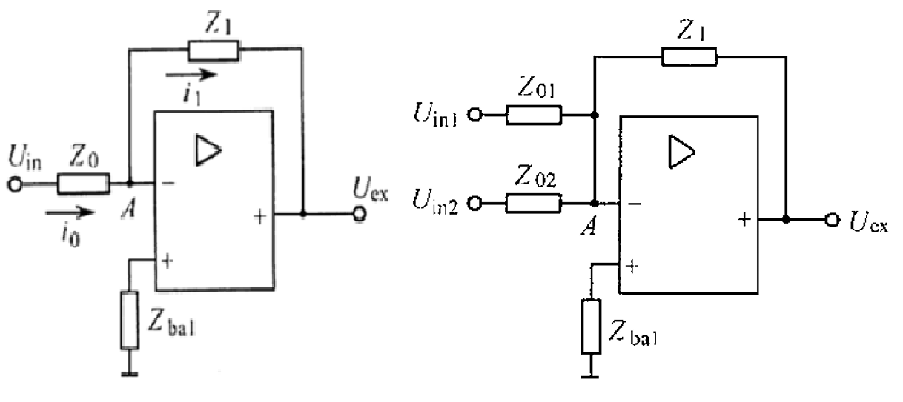

比例调节器、积分调节器、比例-积分调节器的传递函数分别为(注意此处省略了反向放大器带来的负号)：

$$
\begin{aligned}
W_{\text{p}}(s)&=\frac{U_{\text{ex}}(s)}{U_{\text{in}}(s)}=\frac{R_{1}}{R_{0}}=K_{\text{p}}\\
W_{\text{i}}(s)&=\frac{U_{\text{ex}}(s)}{U_{\text{in}}(s)}=\frac{\frac{1}{C_{1}s}}{R_{0}}=\frac{1}{C_{1}R_{0}s}=\frac{1}{\tau_{1}s}\\
W_{\text{pi}}(s)&=\frac{U_{\text{ex}}(s)}{U_{\text{in}}(s)}=\frac{R_{1}+\frac{1}{C_{1}s}}{\rho R_{0}}=\frac{R_{1}}{\rho R_{0}}+\frac{1}{\rho R_{0}C_{1}s}\\
&=K_{\text{p}}+\frac{1}{\tau_{1}s}=K_{\text{p}}\left(1 + \frac{1}{\tau s}\right)
\end{aligned}
$$

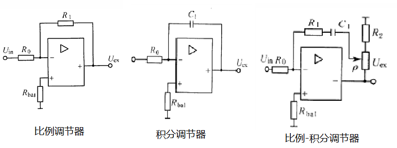

积分调节器的阶跃响应：$$U_{\text{ex}}=(\frac{t}{\tau_{1}})U_{\text{in}}$$

比例-积分调节器的阶跃响应：$$U_{\text{ex}}=(K_{\text{p}}+\frac{t}{\tau_{1}})U_{\text{in}}$$

比例环节无记忆，是基于误差驱动的，没有误差就没有输出，因此单比例调节器是一个有误差系统。

积分环节只有$$U_\text{in} \neq 0$$时，$$U_\text{ex}$$才停止变化。当输出达到饱和时(运放由外部电源供电，输出电压不会超过电源电压)，必须等$$U_\text{in}$$变极性时，调节器才会退出饱和。一般用的都是电压型，用电流型不能随意并联电阻，有谐振的问题。积分调节器的输出包含了输入 偏差的全部信息，只要历史上有过$$\Delta U_\text{n}$$，积分就有数值，理论上就可以产生稳态运行时所需要的控制电压。

比例-积分调节器的输出：$$U_\text{ct} = K_\text{p}\Delta U_\text{n} + \frac{1}{\tau_{1}}\int_{0}^t \Delta U_\text{n} \text{d}t$$，开始时比例环节起主导作用，实现快速控制，接近稳态时积分环节起主导作用。单看积分器来说，输出电压取决于$$\Delta U_\text{n}$$的历史值；对于系统来说，输出电压取决于$$\Delta U_\text{n}$$的历史值和负载，即由它后面环节的需要决定。

调节器辅助电路有：输出限幅电路、输入滤波电路($$T_{0} = \frac{1}{4}R_{0} C_{0}$$)

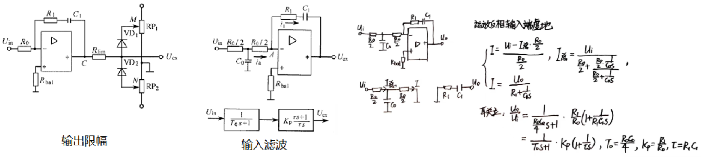

运放的调零：如果芯片本身有调零引脚则直接使用，若没有可以搭建补偿电路提供相反输入以补偿掉零位偏差。

#### 闭环系统静态特性分析

对转速引入负反馈闭环控制

- 单闭环有静差调速系统(P 调节器)

注意：由于是反相放大器(输入端的极性和输出端相反极性，称为反相放大器)，ref 需要给负，fdb 需要给正(极性与 ref 相反才是负反馈)，而之所以使用反相输入端的原因是，硬件加法器只能这样实现负反馈相减的功能

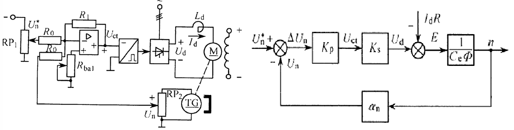

研究静态特性，认为所有时间常数为 0，$$I_\text{dL} = I_\text{d}、\frac{n(s)}{U_{\text{d}}(s)}=\frac{1}{C_{\text{e}}\varPhi}$$

$$
\begin{aligned}
\Delta U_{\text{n}}&=U_{\text{n}}^{*}-U_{\text{n}}\\
U_{\text{ct}}&=K_{\text{p}}\Delta U_{\text{n}}\\
U_{\text{d}}&=K_{\text{s}}U_{\text{ct}}\\
n&=\frac{U_{\text{d}} - I_{\text{d}}R}{C_{\text{e}}\varPhi}\\
U_{\text{n}}&=\alpha_{\text{n}}n\\
\end{aligned}
$$

可推出，闭环系统机械特性为：

$$
\begin{aligned}
n&=\frac{K_{\text{p}}K_{\text{s}}U_{\text{n}}^{*}-RI_{\text{d}}}{C_{\text{e}}\varPhi(1 + \frac{K_{\text{p}}K_{\text{s}}\alpha_{\text{n}}}{C_{\text{e}}\varPhi})}\\
&=\frac{K_{\text{p}}K_{\text{s}}U_{\text{n}}^{*}}{C_{\text{e}}\varPhi(1 + K)}-\frac{RI_{\text{d}}}{C_{\text{e}}\varPhi(1 + K)}\\
&=n_{0\text{cl}} - \Delta n_{\text{cl}} \\
K&=\frac{K_{\text{p}}K_{\text{s}}\alpha_{\text{n}}}{C_{\text{e}}\varPhi} \quad (开环放大倍数)
\end{aligned}
$$

与开环系统机械特性比较：

$$
\begin{aligned}
n&=\frac{U_{\text{d}} - RI_{\text{d}}}{C_{\text{e}}\varPhi}\\
&=\frac{K_{\text{p}}K_{\text{s}}U_{\text{n}}^{*}}{C_{\text{e}}\varPhi}-\frac{RI_{\text{d}}}{C_{\text{e}}\varPhi}\\
&=n_{0\text{op}}-\Delta n_{\text{op}}
\end{aligned}
$$

显然，开环的理想空载转速和额定转速降都大。

$$
\begin{aligned}
n_{0\text{op}} = (1+K) n_{0\text{cl}}\\
\Delta n_{\text{op}} = (1+K)\Delta n_{\text{cl}} \\
\end{aligned}
$$

闭环系统的静特性比开环系统的机械特性要硬的多，因为闭环系统有负反馈的自动调节作用。对于相同的理想空载转速的开环和闭环两条特性，闭环系统静特性的静差率要小的多($$n_\text{0mon}$$不变，$$\Delta n_\text{nom}$$缩小$$1+K$$倍)，在静差率一定时，闭环系统调速范围提高到开环的$$1+K$$倍(额定转速不变，额定转速降减小为原来的$$\frac{1}{1+K}$$)，但必须增加放大器。

$$
D =\frac{s}{(1 - s)}\cdot\frac{n_\text{nom}}{\Delta n_\text{nom}}
$$

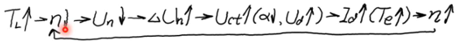

$$U_\text{d} \rightarrow I_\text{d} \rightarrow T_\text{e} \rightarrow n$$

举例：要求$$D=20, s \leqslant 5 \%$$，电机参数$$P_{0} = 60KW, U_\text{nom} = 220V, I_\text{nom} = 305A, n_\text{nom} = 1000\text{rpm}, R = 0.18Ω, C_\text{e} \Phi = 0.2 \text{V/rpm}$$，其它系统参数$$K_\text{s} = 30, \alpha_\text{n} = 0.015V/\text{rpm}$$

若开环：

$$
\begin{aligned}
\Delta n_\text{nom} &= \frac{I_\text{dnom}R}{C_\text{e} \Phi} = 274.5 \text{rpm}\\
s_\text{nom} &= \frac{\Delta n_\text{nom}}{n_\text{0nom}} = \frac{\Delta n_\text{nom}}{n_\text{nom} + \Delta n_\text{nom}} = 21.6\%
\end{aligned}
$$

引入闭环：

$$
\begin{aligned}
\Delta n_{\text{cl}} &= \frac{n_\text{nom}}{D}\cdot \frac{s}{1-s} \leqslant 2.63\text{rpm}\\
K &= \frac{\Delta n_{\text{op}}}{\Delta n_{\text{cl}}} - 1 \geqslant 103.37\\
K_\text{p} &= \frac{KC_\text{e}\Phi}{\alpha_\text{n} K_\text{s}} \geqslant 46
\end{aligned}
$$

扰动作用分析：负反馈闭环控制系统具有良好的抗干扰性能，它对于被负反馈环包围的前向通道上的一切扰动作用都能有效地加以抑制，但对给定信号和检测装置中的扰动是没有抑制作用的。

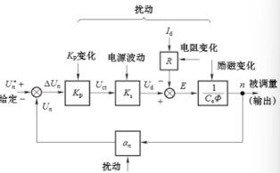

无静差调速系统(PI 调节器)

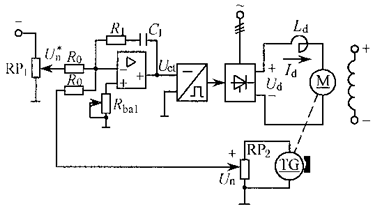

启动过程

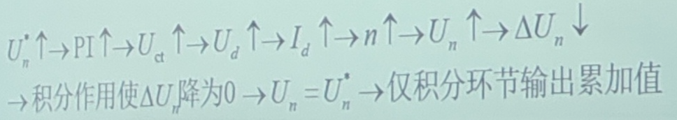

抗扰动过程分析：PI 控制综合了比例控制和积分控制两种规律的优点，又克服了各自的缺点。比例部分能迅速响应控制作用，积分部分则最终消除稳态偏差。PI 调节器构成的无静差调速系统，解决了静态精度和动态稳定性以及快速性之间的矛盾(波形图略)

注：

- 三相电的$$U_\text{d}$$是接电网的，电网波动指的是$$U_\text{d}$$变化；而$$U_\text{n}^*$$是直流控制电压
- 励磁电流扰动影响磁通量$$\Phi$$，根据$$n = \frac{U_\text{d} - I_\text{d}R}{C_\text{e}\Phi}$$，$$n$$和$$\Phi$$成反比；而$$I_\text{d}$$是电枢电流

例题：注：也可用箭头表示

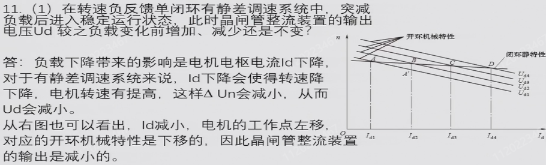

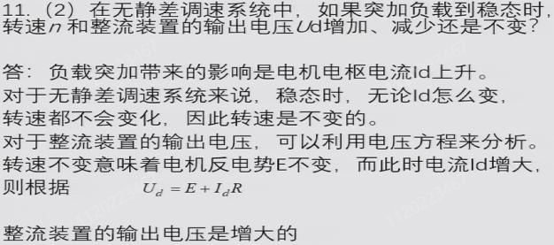

#### 闭环系统动态特性分析

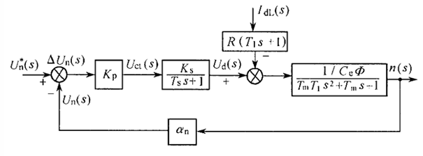

闭环传递函数：

$$
W_{\text{cl}}(s)=\frac{n(s)}{U_{\text{n}}^{*}(s)}=\frac{\frac{\frac{K_{\text{p}}K_{\text{s}}}{C_{\text{e}}\varPhi}}{1 + K}}{\frac{T_{\text{m}}T_{1}T_{\text{s}}}{1 + K}s^{3}+\frac{T_{\text{m}}(T_{1}+T_{\text{s}})}{1 + K}s^{2}+\frac{T_{\text{m}}+T_{\text{s}}}{1 + K}s + 1}
$$

应用劳斯判据判定该系统稳定的条件如下，可见$$K$$增大不利于系统的稳定性

$$
\begin{aligned}
&系统特征方程:\frac{T_{\text{m}}T_{1}T_{\text{s}}}{1 + K}s^{3}+\frac{T_{\text{m}}(T_{1}+T_{\text{s}})}{1 + K}s^{2}+\frac{T_{\text{m}}+T_{\text{s}}}{1 + K}s + 1=0\\
&系统稳定的条件是:\frac{T_{\text{m}}(T_{1}+T_{\text{s}})}{1 + K}\cdot\frac{T_{\text{m}}+T_{\text{s}}}{1 + K}-\frac{T_{\text{m}}T_{1}T_{\text{s}}}{1 + K}>0\\
&整理后得:K<\frac{T_{\text{m}}(T_{1}+T_{\text{s}})+T_{\text{s}}^{2}}{T_{1}T_{\text{s}}} = \frac{T_\text{m}}{T_\text{s}} + \frac{T_\text{m}}{T_\text{l}} + \frac{T_\text{s}}{T_\text{l}} \\
&T_\text{l}为电磁时间常数、T_\text{m}为机电时间常数、T_\text{s}为延迟时间
\end{aligned}
$$

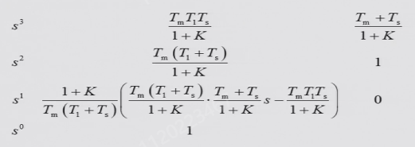

代入系统参数可得$$K < 49.4$$，这与静态性能指标要求的$$K \geqslant 103.37$$矛盾，即静态精度和动态稳定性矛盾。如果不更换硬件，则需要调整控制策略。

小结：单闭环有静差调速系统可使得系统静特性变硬，在静差率要求一定的前提下调速范围变宽，且系统具有良好的抗扰性能，但存在两个问题：一是静态精度和动态稳定性之间存在上述的矛盾，二是启动电流过大，对速度闭环并不能改善电流冲击，因为电流的变化反映到转速上需要时间，该系统且没有四象限运行能力。另外注意，对电机作开闭环控制时，默认了电枢电流连续，因此使用电流连续时的传递函数进行分析。

#### 其它闭环有静差调速系统

- 电压负反馈调速系统：不带测速发电机，而是在电机上并联较大的采样电阻，以该电阻的电压值作为转速的近似反馈

  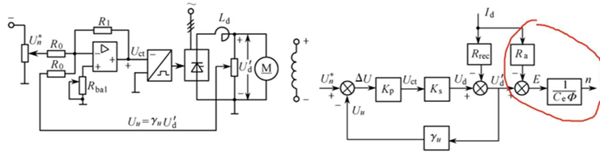

  $$
  \begin{aligned}
  \gamma_\text{u}&=
  \frac{U_\text{u}}{U_\text{d}'} \quad 电压负反馈系数 \\
  n&=\frac{K_\text{p}K_\text{s}U_\text{n}^{*}}{(1 + K)C_\text{e}\varPhi}-\frac{R_\text{rec}I_\text{d}}{(1 + K)C_\text{e}\varPhi}-\frac{R_\text{a}I_\text{d}}{C_\text{e}\varPhi}\\
  K &= K_\text{p}K_\text{s}\gamma_\text{u}\\
  \end{aligned}
  $$

  注意$$R_\text{a}$$环节不在反馈包围内，对应的项不用除以$$(1+K)$$；另外，由于左侧控制器为弱电，右侧电机为强电，反馈回的电压需要经变压器或光耦等方式进行强弱电的隔离。前向通道中，触发装置中的变流器中有电隔离。

  从机械特性表达式可见，转速降有所增大，且机械特性变软了

- 带电流正反馈的电压负反馈调速系统：通过较小的反馈电阻$$R_\text{s}$$引入电流正反馈，补偿单纯电压负反馈对机械特性的影响。

  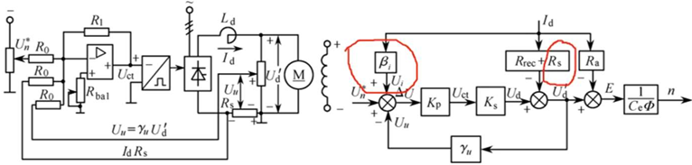

  $$
  \begin{aligned}
  \beta_\text{i} &= U_\text{i}/I_\text{d} \quad 电流正反馈系数 \\
  n&=\frac{K_\text{p}K_\text{s}U_\text{n}^{*}}{(1 + K)C_\text{e}\varPhi}+\frac{K_\text{p}K_\text{s}\beta_\text{i}}{(1 + K)C_\text{e}\varPhi}I_\text{d}-\frac{R_\text{rec}+R_\text{s}}{(1 + K)C_\text{e}\varPhi}I_\text{d}-\frac{R_\text{a}}{C_\text{e}\varPhi}I_\text{d}\\
  K &= K_\text{p}K_\text{s}\gamma_\text{u}\\
  \end{aligned}
  $$

  调整$$K_\text{p}$$和$$\beta_\text{i}$$可以达到不同的补偿状态

  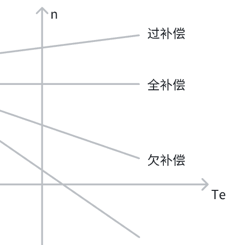

#### 三种调节器的性能分析

(注：图中的 ASR 表示 Automatic Speed Regulator，类似的还有 ACR、APR 等)

稳态误差衡量系统控制的准确度(对给定输入的跟随能力)和抑制干扰能力(对负载变化等干扰的抵抗能力)，下面分别求使用比例、积分、比例积分三种调节器的系统对阶跃输入的、阶跃负载扰动的稳态误差和误差传函。

开环传函：

$$
\begin{aligned}
&W(s)=\frac{K}{(T_\text{s} s + 1)(T_\text{m} T_\text{l} s^2 + T_\text{m} s + 1)} \quad \text{式中}K = K_\text{p} K_\text{s} \alpha / C_\text{e}\Phi \\
&W(s)=\frac{K}{s(T_\text{s} s + 1)(T_\text{m} T_\text{l} s^2 + T_\text{m} s + 1)} \quad \text{式中 }K = K_\text{s} \alpha / \tau_{1} C_\text{e}\Phi \\
&W(s)=\frac{K(K_\text{p} \tau_{1} s + 1)}{s(T_\text{s} s + 1)(T_\text{m} T_\text{l} s^2 + T_\text{m} s + 1)}  \quad \text{式中 }K = K_\text{s} \alpha / \tau_{1} C_\text{e}\Phi
\end{aligned}
$$

对输入的误差：输入$$\times$$误差传函

$$
\begin{aligned}
&\Delta U_\text{n}(s)=U_\text{n}^*(s)\cdot\frac{1}{1 + \frac{K}{(T_\text{s} s + 1)(T_\text{m} T_\text{l} s^2 + T_\text{m} s + 1)}}\\
&\Delta U_\text{n}(s)=U_\text{n}^*(s)\cdot\frac{1}{1 + \frac{K}{s(T_\text{s} s + 1)(T_\text{m} T_\text{l} s^2 + T_\text{m} s + 1)}}\\
&\Delta U_\text{n}(s)=U_\text{n}^*(s)\cdot\frac{1}{1 + \frac{K(K_\text{p} \tau s + 1)}{s(T_\text{s} s + 1)(T_\text{m} T_\text{l} s^2 + T_\text{m} s + 1)}}
\end{aligned}
$$

对阶跃输入$$U_\text{n}^*(s) = \frac{U_\text{n}^*}{s}$$的稳态误差：

$$
\begin{aligned}
&\Delta U_\text{n}=\lim_{s \to 0} s\cdot\Delta U_\text{n}(s)=\lim_{s \to 0} s\cdot\frac{U_\text{n}^*}{s}\cdot\frac{1}{1 + \frac{K}{(T_\text{s} s + 1)(T_\text{m} T_\text{l} s^2 + T_\text{m} s + 1)}}=\frac{U_\text{n}^*}{1 + K}\\
&\Delta U_\text{n}=\lim_{s \to 0} s\cdot\Delta U_\text{n}(s)=\lim_{s \to 0} s\cdot\frac{U_\text{n}^*}{s}\cdot\frac{1}{1 + \frac{K}{s(T_\text{s} s + 1)(T_\text{m} T_\text{l} s^2 + T_\text{m} s + 1)}} = 0\\
&\Delta U_\text{n}=\lim_{s \to 0} s\cdot\Delta U_\text{n}(s)=\lim_{s \to 0} s\cdot\frac{U_\text{n}^*}{s}\cdot\frac{1}{1 + \frac{K(K_\text{p} \tau s + 1)}{s(T_\text{s} s + 1)(T_\text{m} T_\text{l} s^2 + T_\text{m} s + 1)}} = 0
\end{aligned}
$$

显然：纯比例调节器为零型系统，对阶跃输入有稳态误差；而积分调节器和比例积分调节器均为一型系统，对阶跃输入稳态误差为零。

令$$U_\text{n}^*(s) = 0$$时，扰动$$I_\text{dL}(s)$$的误差：

$$
\begin{aligned}
&\Delta U_\text{n}(s)=I_\text{dL}(s)\cdot\frac{\frac{R(T_\text{l} s + 1)\alpha}{C_\text{e}\Phi(T_\text{m} T_\text{l} s^2 + T_\text{m} s + 1)}}{1 + \frac{K}{(T_\text{s} s + 1)(T_\text{m} T_\text{l} s^2 + T_\text{m} s + 1)}}\\
&\Delta U_\text{n}(s)=I_\text{dL}(s)\cdot\frac{\frac{R(T_\text{l} s + 1)\alpha}{C_\text{e}\Phi(T_\text{m} T_\text{l} s^2 + T_\text{m} s + 1)}}{1 + \frac{K}{s(T_\text{s} s + 1)(T_\text{m} T_\text{l} s^2 + T_\text{m} s + 1)}}\\
&\Delta U_\text{n}(s)=I_\text{dL}(s)\cdot\frac{\frac{R(T_\text{l} s + 1)\alpha}{C_\text{e}\Phi(T_\text{m} T_\text{l} s^2 + T_\text{m} s + 1)}}{1 + \frac{K(K_\text{p} \tau s + 1)}{s(T_\text{s} s + 1)(T_\text{m} T_\text{l} s^2 + T_\text{m} s + 1)}}
\end{aligned}
$$

对阶跃扰动$$I_\text{dL}(s) = \frac{I_\text{dL}}{s}$$引起的稳态误差：

$$
\begin{aligned}
&\Delta U_\text{n}=\lim_{s \to 0} s\cdot\Delta U_\text{n}(s)=\lim_{s \to 0} s\cdot\frac{I_\text{dL}}{s}\cdot\frac{\frac{R(T_\text{l} s + 1)\alpha}{C_\text{e}\Phi(T_\text{m} T_\text{l} s^2 + T_\text{m} s + 1)}}{1 + \frac{K}{(T_\text{s} s + 1)(T_\text{m} T_\text{l} s^2 + T_\text{m} s + 1)}}=\frac{R I_\text{dL}\alpha}{C_\text{e}(1 + K)}\\
&\Delta U_\text{n}=\lim_{s \to 0} s\cdot\Delta U_\text{n}(s)=\lim_{s \to 0} s\cdot\frac{I_\text{dL}}{s}\cdot\frac{\frac{R(T_\text{l} s + 1)}{C_\text{e}\Phi(T_\text{m} T_\text{l} s^2 + T_\text{m} s + 1)}}{1 + \frac{K}{s(T_\text{s} s + 1)(T_\text{m} T_\text{l} s^2 + T_\text{m} s + 1)}} = 0\\
&\Delta U_\text{n}=\lim_{s \to 0} s\cdot\Delta U_\text{n}(s)=\lim_{s \to 0} s\cdot\frac{I_\text{dL}}{s}\cdot\frac{\frac{R(T_\text{l} s + 1)}{C_\text{e}\Phi(T_\text{m} T_\text{l} s^2 + T_\text{m} s + 1)}}{1 + \frac{K(K_\text{p} \tau s + 1)}{s(T_\text{s} s + 1)(T_\text{m} T_\text{l} s^2 + T_\text{m} s + 1)}} = 0
\end{aligned}
$$

由扰动引起的稳态误差取决于误差点与扰动加入点之间的传递函数。比例控制的调速系统，该传递函数无积分环节，故存在扰动引起的稳态误差，称作有静差调速系统；积分控制或比例积分控制的调速系统，该传递函数具有积分环节，所以由阶跃扰动引起的稳态误差为 0，称作无静差调速系统。

#### 带电流截止负反馈的转速负反馈闭环调速系统

为了解决启动电流冲击的问题，尝试引入电流闭环，但是但电流闭环的转速特性太差，转速对电流的变化十分敏感，因此仍然需要加上转速负反馈，综合以上讨论，最终希望在电流较大时加上电流负反馈，而电流不大时则去掉电流负反馈，这便是带电流截止负反馈的转速负反馈闭环调速系统。

使用电流互感器 TA 经过二极管不控整流桥获得电流反馈，另外，使用稳压管模拟以下特性($$U_\text{VS}$$为击穿电压)

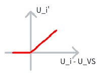

令电流反馈系数$$\beta_\text{i} = \frac{U_\text{i}}{I_\text{d}}$$，临界截止电流$$I_\text{dcr} = \frac{U_\text{VS}}{\beta_\text{i}}$$，$$R_{0}$$为了阻抗匹配，一般取$$10\text{kΩ}-100\text{kΩ}$$。$$\text{RP}_1$$用于调节输入电压$$U_\text{n}^*$$，$$\text{RP}_2$$用于调节$$\alpha_\text{n}$$，$$\text{RP}_3$$用于调节$$\beta_\text{i}$$

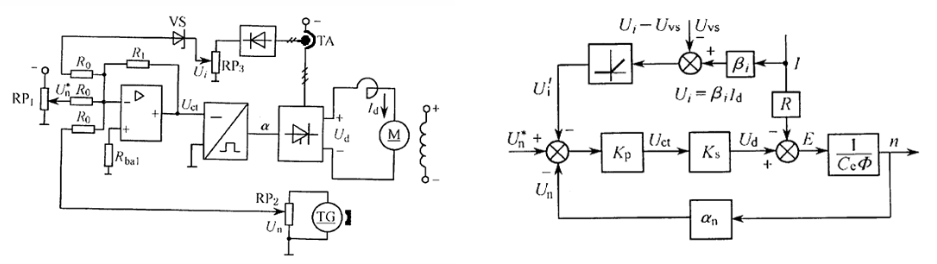

$$
\begin{aligned}
\text{当}I_\text{d} &\leqslant I_\text{dcr}\text{时}\\
n&=\frac{K_\text{P} K_\text{s} U_\text{n}^*}{C_\text{e} \varPhi(1 + K)}-\frac{I_\text{d} R}{C_\text{e} \varPhi(1 + K)}\\
\text{当}I_\text{d} &> I_\text{dcr}\text{时}\\
n&=\frac{K_\text{P} K_\text{s} U_\text{n}^*}{C_\text{e} \varPhi(1 + K)}-\frac{K_\text{P} K_\text{s}(\beta_\text{i} I_\text{d} - U_\text{VS})}{C_\text{e} \varPhi(1 + K)}-\frac{I_\text{d} R}{C_\text{e} \varPhi(1 + K)}\\
&=\frac{K_\text{P} K_\text{s}(U_\text{n}^* + U_\text{VS})}{C_\text{e} \varPhi(1 + K)}-\frac{K_\text{P} K_\text{s} \beta_\text{i} + R}{C_\text{e} \varPhi(1 + K)}I_\text{d}\\
令n&=0，得\\
I_\text{dbl}&=\frac{K_\text{P} K_\text{s}(U_\text{n}^* + U_\text{VS})}{K_\text{P} K_\text{s} \beta_\text{i} + R} \approx \frac{U_\text{n}^* + U_\text{VS}}{\beta_\text{i}}\\
\end{aligned}
$$

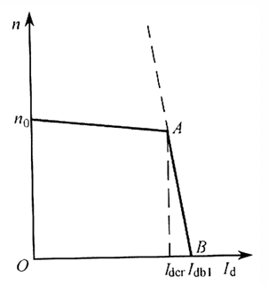

(图中$$I_\text{dcr}$$为截止电流/临界电流 critical，取值略大于额定电流，$$I_\text{dbl}$$为堵转电流 blocking，取值略小于最大电流)

启动过程

性能评价：带电流截止负反馈的闭环调速系统，具有一定的调速范围和稳态精度，同时又能限制启动电流和堵转工作，线路简单，调整方便，很有实用价值，但是系统的启动过程不理想。

#### 闭环调速系统的设计

闭环控制系统设计的步骤：

1. 总体设计和静态计算：基本部件选择和静态参数计算，形成基本的控制系统。
2. 动态校正：建立基本系统的动态数学模型，分析基本系统的稳定性和动态性能。如果基本系统不满足性能指标的要求，则应加入适当的动态校正装置，使校正后的系统全面地满足要求。

动态校正方法一频率特性法：

1. 根据工作机械和工艺要求确定系统的动态和静态性能指标
2. 根据性能指标要求求得期望的开环对数频率特性
3. 比较期望的开环对数频率特性和基本系统的开环频率特性，从而确定校正环节的结构和参数

### 1.5 多环直流电动机调速系统

将两个调节器串联，电流环为内环，转速环为外环

#### 调节器分析

ASR 和 ACR 均为带限幅的 PI 调节器，调节电位器可调节输出限幅，两者限幅值记为$$U_\text{im}^*$$和$$U_\text{ctm}$$。显然，可调节的这个输出限幅需要小于 PI 调节器中运放的电源限幅，否则不会起作用。

带输出限幅的 PI 调节器的稳态特性：

- 饱和——输出达到限幅值：当调节器饱和时，输出为恒值，输入量的变化不再影响输出，除非有反向的输入信号使调节器退出饱和，即饱和调节器暂时隔离了输入和输出间的关系，相当于使调节环开环。
- 不饱和——输出未达到限幅值：当调节器不饱和时，PI 调节器的输入偏差电压在稳态时总是零。

如果 ASR 不用带限幅的 PI 调节器而是改用 P 调节器，一方面静差率会增大，稳态误差增加，系统变为有差系统。另一方面由于没有了限幅，转速环不会饱和，转速刚开始上升时转速误差较大，输出的电流环期望可能过大致使电流环在调节过程中达到饱和，启动过程可能无法保证最大允许电流加速，动态性能可能会下降，超调可能会增大，稳定性可能变差。而转速接近期望转速时，由于没有积分调节器的作用，输出仅取决于当前误差，会出现越接近期望转速，调节过程越慢的现象。初始响应速度可能提升，但超调和振荡的风险增加，抗扰能力减弱，动态误差增大，可能不稳定。

ASR 的输出为电流环的期望，应根据电动机允许的最大电流来确定其具体的限幅值。在实现上，根据电动机允许的最大电流确定电流限幅$$I_\text{dm}$$为某个特定的值，以控制电压$$\pm 15V$$为例，调节运放后输出限幅的电位器将$$U_\text{imax}$$设置为$$8-12V$$，再调节控制$$\beta_\text{i}$$的电位器，使得$$\beta_\text{i} = \frac{U_\text{imax}}{I_\text{dm}}$$以匹配，只有把 ACR 的反馈调节到与输入一个水平上才能形成好的闭环控制。

ACR 的输出限幅的作用是限制$$\alpha_\text{min}$$和$$\beta_\text{min}$$(注意此处指的是相位角，是变流器的参数，不是系统反馈系数的那个$$\beta$$)，防止丢脉冲导致逆变失败，因此应根据$$\alpha_\text{min}$$和$$\beta_\text{min}$$来整定，对应于最大电压值，可借助于电流表、电压表或示波器实测(通过示波器观测其中一个晶闸管对应交流电压和门极触发脉冲波形，比较两者波形，调节限幅电位计完成调试)。

#### 静态特性分析

当转速调节器饱和时，ASR 工作在开环状态，其输出，即 ACR 的输入为恒定值，此时由于转速环输出为定制，因此由电流环主导调节

$$
\begin{aligned}
I_\text{d}&=\frac{U_\text{im}^{*}}{\beta_\text{i}}=I_\text{dm}\\
n&<n_{0}
\end{aligned}
$$

当转速调节器不饱和时，转速环输出随输入误差变化，由转速环主导调节

$$
\begin{aligned}
U_\text{n}^{*}&=U_\text{n}=\alpha_\text{n}n\\
n&=\frac{U_\text{n}^{*}}{\alpha_\text{n}}=n_{0} \quad (理想情况) \\
I_\text{d}&<I_\text{dm}
\end{aligned}
$$

若两个调节器均未饱和时，稳态下各变量的关系：

$$
\begin{aligned}
U_\text{n}^{*}&=U_\text{n}=\alpha_\text{n}n=\alpha_\text{n}n_{0}\\
U_\text{i}^{*}&=U_\text{i}=\beta_\text{i}I_\text{d}=\beta_\text{i}'I_\text{dL}\\
U_\text{ct}&=\frac{U_\text{d}}{K_\text{s}}=\frac{C_\text{e}\Phi n + I_\text{d}R}{K_\text{s}}=\frac{\frac{C_\text{e}\Phi U_\text{n}^{*}}{\alpha_\text{n}}+I_\text{dL}R}{K_\text{s}}
\end{aligned}
$$

稳定时，两个调节器的输出

$$
\begin{aligned}
&ASR:U_\text{i}^* = U_\text{i} = \beta_\text{i} \cdot I_\text{d} = \beta_\text{i} \cdot I_\text{dL}\\
&ACR:U_\text{ct} = \frac{U_\text{d}}{K_\text{s}} = \frac{E+I_\text{d} R}{K_\text{s}} = \frac{C_\text{e} \Phi n+I_\text{d} R}{K_\text{s}} = \frac{C_\text{e} \Phi \frac{U_\text{n}^*}{\alpha_\text{n}}+I_\text{d} R}{K_\text{s}}
\end{aligned}
$$

#### 动态特性分析

被控对象为转速，跟随性能用恒转矩负载下，阶跃给定下的动态响应描述，能否实现所期望的恒加速过程，最终以时间最优的形式达到所要求的性能指标，是设置双闭环控制的一个重要追求目标。

- 启动过程分析：分为电流上升、恒流升速和转速调节三个阶段。转速调节器在三个阶段中经历了不饱和、饱和和退饱和三种情况；而电流环始终工作在非饱和状态。启动过程有三个特点：饱和非线性控制、转速超调(转速超调才能退饱和)、准时间最优控制。最优控制是指系统以能运行的最好的允许状态去接近目标，即图中的第 II 阶段，而进入和退出第二阶段都需要一个较短的时间，故称为准时间最优控制。

  

  

  另外注意几个点

  1. $$I_\text{d} > I_\text{dL}$$后电机开始启动，由于机电惯性作用，转速不会很快增长，ASR 输入偏差仍然较大，ASR 很快进入饱和状态(大约在$$t_{1}$$之前)，转速环相当于开环工作，输出为恒定值，系统表现为 PI 调节器的电流闭环控制；$$t_{2}$$开始转速超调，ASR 输入误差开始反向，ASR 退饱和，此后 ASR 和 ACR 均不饱和，电流内环为电流随动子系统；但$$I_\text{d}$$仍大于$$I_\text{dL}$$，因此转速继续增大。而电流环是不能轻易饱和的，这样即使电流出现少量超调，系统也可以承受。后面的环节也需要留有一定裕量。但 ACR 的限幅是对调节器的输出限幅，不保证实际的动态值被限幅在设定的范围内，因此在选取器件时要留有一定裕量。如果变流器输出电压的裕量设置不足则容易致使 ACR 饱和进入开环工作状态，会导致转速恢复时间过长、负载突变可能出现转矩不足的情况。
  2. 在 II 阶段，$$I_\text{d}$$与$$I_\text{dm}$$有静差，这是因为$$I=\frac{U-E}{R}$$，而$$E = C_\text{e}\Phi n$$，在转速以恒定的加速度增加时，相当于给电流引入了一个斜坡扰动，s 域中为$$\frac{1}{s^2}$$，型别大于 PI 调节器的 I 型，因此是有静差的。可尝试增加电流环的系统型别(如使用 PII 调节器)消除静差，进一步提高启动快速性。另外，合理整定参数也可以在一定程度上提高启动快速性。(在不换调节器的情况下，可设法缩短 I 和 III 阶段的时间，因为这两段不是最大电流，响应速度相对是慢的)
  3. 如果电压限幅刚好设置在三相电源的电压，则无法保证$$t_{2}$$时刻，$$n$$达到$$n^*$$时，$$I_\text{d}$$保持在略小于$$I_\text{dm}$$的水平。因为$$U = E + I_\text{d} R = C_\text{e}\Phi n + I_\text{d} R$$，$$U$$的值有限，无法同时保证转速达到的时候电流最大。但两者都可以分别达到，开始时转速较低，电流可达最大值；后来两者慢慢达到平衡，转速在非最大电流的情况下慢慢上升到期望转速。
  4. ASR 饱和时输出为定值，ACR 期望就是这个定值，不妨记为$$U_\text{imax}$$，$$U_\text{imax}$$与$$I_\text{dm}$$就是$$\beta_\text{i}$$倍的关系；稳定之后，经过 ASR 调节，ACR 的期望值就是$$I_\text{dL}$$。
  5. 转速环的硬机械特性和电流环的软机械特性并不矛盾，因为负反馈系统会自动调节，初始时刻以电流环为主，稳态之后以转速环为主
  6. 恒最大电流启动的原因是转速调节器的饱和非线性特性

- 抗扰过程分析

  电网出现扰动时，若电流环反应迅速，在转速环还未来得及响应电流扰动时就将其抑制掉，则电网扰动不会影响瞬时转速(一般要求电流环带宽为转速环带宽的 3-5 倍即可，也可看$$T_\text{l}$$和$$T_\text{m}$$量级的相对大小)；反之，电流扰动就会影响到瞬时转速，但稳态转速由于转速环的存在而不受影响。

  

#### 两个调节器的作用

转速调节器作用：

- 调节和控制转速，使转速跟随给定电压变化，达到静态无差。(对应 III 阶段)
- 对负载变化起抗扰作用。
- 其输出限幅用于限制最大电流，防止电流值超过电机允许的最大电流值对电机造成不可逆的损伤。(对应 I 阶段)

电流调节器作用：

- 对电网电压等内环内扰动起及时抗扰作用。
- 保证系统在允许的最大电流下恒流启动。(对应 II 阶段)
- 调节和控制电流，使电流跟随其给定电压变化。(不饱和)
- 当电机过载甚至堵转时，限制电枢电流的最大值，从而起到快速的安全保护作用。
- 其输出限幅值用来限制$$\alpha_\text{min}$$和$$\beta_\text{min}$$，防止丢脉冲、逆变失败。

#### 性能评价

由于采用饱和非线性控制，使两个调节器充分发挥作用，系统具有很好的动、静特性，是一种非常实用的系统。但当系统降速或制动时，由于晶闸管的单向导电性，系统只能处于自由降速状态。要产生快速制动作用，可采用可逆系统。

转速电压双闭环系统和带电流截止负反馈的单闭环系统比较

#### 调试步骤

先部件、后系统， 先内环、后外环。

1. 部件调试、单元参数测试
   - 调节器：调零、输出限幅值
   - 触发-整流电路：初始相位、传递系数
   - 传动系统参数测试：电枢回路电阻、飞轮矩、电枢回路电感
   - 反馈系数测定： 电流反馈系数，反馈极性，转速反馈系数，反馈极性
2. 系统调试
   - 动态设计：电流调节器、转速调节器参数设计
   - 电流环：反馈极性确定、闭环、动态性能调试(确定调节器参数)
   - 转速环：反馈极性确定、闭环、动态性能调试(确定调节器参数)

#### 三环直流调速系统

有带电流变化率的三环调速系统和带电压内环的三环调速系统，两者都是进一步提高转速电流双闭环系统启动动态性能的方式

- 带电流变化率的三环调速系统

  

  先后通过电容和接地电阻以构成微分环节，获得电流变化率的反馈；电流变化率的偏差输入 ADR 微分控制器中，使得电流在允许的最大变化率下完成电流上升(此处不是可逆系统，只能缩短 I 阶段的时间，而减速阶段 III 阶段的时间只能电机自由降速；而后面的可逆系统加电流变化率的环则 I 和 III 阶段均可缩短时间)。启动过程与双环类似，最里面的环 ADR 一直不饱和，ACR 和 ASR 均经历不饱和、饱和、退饱和的过程；III 阶段三个环均不饱和，不饱和时就不会以最大速度去响应

- 带电压内环的三环调速系统

  

  AVR 为内环的电压调节器，TVD 为直流电压隔离变换器。电压内环用于使输出电压与给定电压成线性关系，及时抵抗电网扰动，并且也起到改造调节对象和加快响应的作用。这是因为电压闭环后等效的时间常数会减小，因此动态响应加快，带宽提高。

### 1.6 有环流闭环可逆调速系统

#### 系统结构

有环流可逆调速系统指的是脉动环流，当$$\alpha_\text{F} = \beta_\text{R}$$时正反组平均电压相等，只有脉动环流；当$$\alpha_\text{F} > \beta_\text{R}$$时，整流产生的电压小于待逆变组需要克服的电压，产生不了压差，没有直流环流。配合控制电路如下，其中$$R_\text{rec}$$为变流器内阻，AR 为反号器，是实现$$\alpha_\text{F} = \beta_\text{R}$$配合控制的方式

系统原理框图如下，对于可逆系统的变流器，输出电压和控制电压均可正可负。调节器仍然采用带有限幅的 PI 调节器，对于阶跃输入无差；对于斜坡及更高阶的输入有差。另外，互感器 TA 不再检测输入变流器的电流，而是直接检测流过电机的电流。$$L_d$$为平波电抗器，用于滤除直流信号中的纹波，使直流电机更平稳地运行；其它电抗器为环流/均流电抗器，用于均衡环流

ASR 的正限幅$$+U_\text{im}^*$$限制负最大电流$$-I_\text{dm}$$，反之亦然。ACR 的正限幅$$+U_\text{ctm}$$对应于$$+I_\text{dm}$$，用于限制$$\alpha_\text{Fmin}$$、$$\beta_\text{Rmin}$$；负限幅$$-U_\text{ctm}$$对应于$$-I_\text{dm}$$，用于限制$$\beta_\text{Fmin}$$、$$\alpha_\text{Rmin}$$。如果 ASR 输出限幅不同，则会出现电机正反转特性不同；如果 ACR 输出的正负限幅不同，除了电机正反转特性不同之外，由于正反组最小触发角不同，还可能出现直流环流。

考虑到硬件搭建的调节器使用了运放的反相输入端，因此需要注意转速和电流值的实际极性，框图中的负号表示负反馈，不代表实际极性。

#### 工作状态

$$\alpha_\text{F} = \beta_\text{R}$$配合控制时的触发特性如下，$$\vert U_{\text{d}\alpha} \vert = \vert U_{\text{d}\beta} \vert = U_\text{d0} \cos \alpha$$。显然，$$U_\text{ct} > 0$$时$$U_\text{df} > 0$$，$$U_\text{dr}$$为负；反之亦然。($$U_{\text{d}\alpha}$$为整流组输出电压，$$U_{\text{d}\beta}$$为逆变组输出电压)

$$U_{\text{d}\alpha} > E$$时整流组整流，否则待整流；$$U_{\text{d}\beta} < E$$时逆变组逆变，否则待逆变。

#### 动态过程

不妨设原来正组工作在整流状态，电动机正向电动运行，电动机带反抗性恒转矩负载。现在控制电压信号$$U_\text{n}^*$$由正变负，分析电动机正向制动后反向启动的过程

基于上图结构和波形分析，其中 t1-t2 阶段称为本桥逆变，t2-t4 阶段称为他桥制动，t4-结束称为反向启动。他桥制动中有两种制动方式，当$$U_\text{ct} < 0$$时为电源反接制动，当$$U_\text{ct} > 0$$时为回馈制动。t1-t4 段转速逐渐减小至 0，方向始终为正向且数值一直减小，故$$E$$极性不变，始终为左正右负。整个过程中 ASR 主要处于饱和状态。另外由于可逆系统可以四象限运行，因此需要在波形图上体现极性；波形图中将所有的反馈波形都取了负号，与期望波形的极性相反。由于$$U_\text{n} = \alpha_\text{n} \cdot n$$，$$U_\text{i} = \beta_\text{i} \cdot I_\text{d}$$，故$$U_\text{n}$$和$$U_\text{i}$$的波形可分别间接反映$$n$$和$$I_\text{d}$$ 的变化情况。

0-t1 阶段正组整流，变流器电压左正右负，反电势左正右负，正组整流，反组待逆变。

给定电压$$U_\text{n}^*$$由正变负后，转速$$n$$不突变，反馈电压$$U_\text{n}$$也不突变仍为正值(注意这是指的负反馈中的正值，但由于运放反相端的原因，实际为负值，波形图中表示的也是实际值)，$$\Delta U_\text{n}$$为负大值(期望负值减去反馈正值)，引起 ACR 输出饱和，$$U_\text{ct}$$达到$$-U_\text{ctm}$$(过了两个调节器的反向)，变流器电压左负右正，$$\alpha_\text{r}=\alpha_\text{rmin}$$，$$\beta_\text{f} = \beta_\text{fmin}$$，$$I_\text{d}$$的期望值达到$$-I_\text{dm}$$，而电感阻碍电流变化。

此时(t1-t2)触发电路人为给晶闸管触发信号以进行强制换向(要求的逻辑强，$$U_\text{i} \to 0$$的过程极快；在 220V 市电下，瞬时感应电势$$L\frac{\text{d}i}{\text{d}t}$$可达 400V 以上)，电枢电流$$I_\text{d}$$从左向右流动。$$L\frac{\text{d}i}{\text{d}t} - E > U_\text{df}$$，正组逆变，反组待整流。电机瞬间向正组馈能，称为本桥逆变。此状态一直持续直到 t2 时$$I_\text{d} = 0$$。

此时(t2-t4)进行自然换向(过程比强制换向慢得多，瞬时感应电势$$L\frac{\text{d}i}{\text{d}t}$$约为数十 V)，电枢电流$$I_\text{d}$$反向，变为从右向左流动。$$L\frac{\text{d}i}{\text{d}t} - E < U_\text{dr}$$，在$$U_\text{ct}<0 $$时，变流器电压保持左负右正，为电源反接制动；且反组整流，正组待逆变，由反组向电动机供电。

t3 时刻电流超调，ACR 退饱和开始起到负反馈的自调节作用，$$U_\text{ct}$$在负反馈调节作用下由负变正。当$$U_\text{ct}>0 $$时，变流器电压为左正右负，为回馈制动；且正组进入整流区反组进入逆变区，此时反组逆变，正组待整流，电动机向反组馈电。

t4 时刻转速降为 0，t4 以后反向启动，过程同不可逆系统的双环调速，唯一的区别是此时 ASR 仍为饱和状态，即反向启动初始状态 ASR 就饱和。

另外，注意电流超调后(反映为$$U_\text{i}$$波形中 t3 时刻处的小尖峰)，$$U_\text{ct}$$极性反相，ACR 退饱和并开始起自调节作用；由$$I_\text{d} = \frac{U_\text{d} - C_\text{e}\Phi n}{R}$$，当转速线性变化时，$$U_\text{d}$$也需要线性变化才能保证$$I_\text{d}$$维持在$$-I_\text{dm}$$，反映为图中$$U_\text{ct}$$反相后的线性减小。

进一步提高速度的方法有：加电流变化率的内环，以及控制环流以保证系统的动态性能。

#### 特点

环流的优点包括：维持导通连续性、改善动态响应、减少转矩脉动、提高系统可靠性；环流的缺点包括：额外能量损耗、谐波干扰、系统复杂度增加、带来检测与控制上的挑战、存在潜在的器件损伤风险

有环流可逆系统性能总结

- 四象限运行，即正反向电动，正反向制动
- 可实现恒定最大转矩启动和恒定最大转矩制动，动态过程比较理想
- 环流避开了电流断续区，可逆过程中，转速和电流都连续变化，动态过程快
- 对阶跃输入可做到稳态无差
- 动态过程快，没有动态死区
- 从正转到反转的过程中，转速和电流都连续变化，没有死区，整个过渡过程中，ASR 主要处于饱和状态，所以能在允许的最大电枢电流下制动。(实现恒最大转矩制动的原因：ASR 主要处于饱和状态、饱和状态输出为电机允许的最大电流、且 ACR 有负反馈的自调节作用可将电流维持在最大水平)
- 有环流损耗
- 适用于小容量和要求快速反转的系统

### 1.7 可控环流调速系统

根据实际情况，即电枢电流的大小来控制环流的大小和有无，利用其优势而避开其劣势；希望电枢电流为零或较小时，环流控制在额定电流的 5%-10%之间，而电枢电流较大时环流较小，因为只要存在一定的电流负载就可使机械特性工作在线性区，而多余的环流会徒增损耗。

在两组变流器中，提供电流较大的一组称工作组，提供电流较小的一组称为非工作组，非工作组的电流即为环流。控制环流即为控制$$U_\text{df}$$和$$U_\text{dr}$$，互补控制只存在脉动环流，脉动环流包括其直流分量都是不可控的。对于 ASR 向 ACR 输出的期望，记正组的期望为$$U_\text{i}^*$$，经过反相器后反组的期望为$$\overline{U}_\text{i}^*$$。

分别用电流互感器 TAF 和 TAR 采集变流器电流，工作组和非工作组的电流期望不同，分别用 ACR1 和 ACR2 控制正反组电流。当$$U_\text{i}^* = 0$$时，$$U_\text{F} = U_\text{R}$$，两组变流器均整流，$$I_\text{F} = I_\text{R} = I_\text{c}^*$$，$$I_\text{d} = 0$$，需要有基础电流，该电流由环流给定$$U_\text{c}^*$$产生，值为负，经过 ACR 后输出为正；另外注意$$U_\text{i}^* = 0$$对应最大直流环流。

#### 环流控制过程

可控环流基于如下电路实现，由图中电路结构

$$
\begin{aligned}
U_\text{o}=
\begin{cases}
\frac{R_{1}}{R_{0}}U_\text{c}^* + \frac{R_{1}}{R_{0}}U_\text{i} + K\frac{R_{1}}{R_{0}}U_\text{i}^* \quad K = \frac{R_{0}}{R_{0} + R} \quad &U_\text{i}^*为正\\
\frac{R_{1}}{R_{0}}U_\text{c}^* + \frac{R_{1}}{R_{0}}U_\text{i} + \frac{R_{1}}{R_{0}}U_\text{i}^* \quad &U_\text{i}^*为负\\
\end{cases}
\end{aligned}
$$

人为设置$$\frac{R_{1}}{R_{0}}U_\text{c}^* + \frac{R_{1}}{R_{0}}U_\text{i}$$为一个较小的负值，开始时$$U_\text{i}^*=0$$，不妨设 ASR 期望$$U_\text{n}^*$$为负，则$$U_\text{i}^*$$为正，$$U_\text{if}$$为负，$$\overline{U_\text{i}^*}$$为负，$$U_\text{ir}$$为正。由于 ASR 的调节作用，$$\vert U_\text{i}^* \vert$$增大，$$U_\text{ir}^*$$正得越来越多，将$$U_\text{ctr}$$的极性从负变为正，负反馈变为正反馈，使得对应的 ACR 迅速饱和，逆变角超过最小逆变角，直流环流消失。而$$U_\text{if}^*$$负得越来越多，经 ACR 输出正值越来越大，即输出工作组的大电流。

$$
\begin{aligned}
&U_\text{ctr}=\frac{R_{1}}{R_{0}}U_\text{c}^* + \frac{R_{1}}{R_{0}}U_\text{ir} + K\frac{R_{1}}{R_{0}}U_\text{ir}^* \quad K = \frac{R_{0}}{R_{0} + R} \quad &U_\text{ir}^*为正\\
&U_\text{ctf}=\frac{R_{1}}{R_{0}}U_\text{c}^* + \frac{R_{1}}{R_{0}}U_\text{if} + \frac{R_{1}}{R_{0}}U_\text{if}^* \quad &U_\text{if}^*为负\\
\end{aligned}
$$

#### 特点

可控环流系统可四象限运行，可以实现恒定最大转矩启动和恒定最大转矩制动，动态过程较为理想。充分利用了环流有利的一面，避开了电流断续区，使系统在正反向过渡过程中没有死区，提高了快速性；同时又克服了环流不利的一面，减少了环流损耗。所以在各种对响应快速性要求高的可逆调速系统中得到广泛的应用。对于阶跃输入稳态无差。

### 1.8 闭环调速系统调节器的工程设计方法

工程设计方法：在设计时，把实际系统校正回或简化成典型系统，可以利用现成的公式和图表来进行参数计算，设计过程简便得多

工程设计法的原则：

- 概念清楚、易懂
- 计算公式简明、好记
- 不仅给出参数计算的公式，而且指明参数调整的方向
- 能考虑饱和非线性控制的情况，同样给出简单的计算公式
- 适用于各种可以简化成典型系统的反馈控制系统

工程设计步骤：

- 被控对象传函等值处理
- 根据性能指标选择典型形式
- 选择调节器并求解调节器参数
- 性能指标近似条件检验

#### I 型系统

对于典型 I 型系统(二阶系统)，开环传函如下，其中$$T$$为系统固有特性，$$K$$为待定参数，固有阻尼频率$$\omega_\text{n} = \sqrt{\frac{K}{T}}$$，阻尼比$$\xi = \frac{1}{2} \sqrt{\frac{1}{KT}}$$，一般将系统设计为欠阻尼状态($$0 < \xi < 1$$)

$$
W(s) = \frac{K}{s(Ts+1)}，K < \frac{1}{T}
$$

对数幅频特性中频段以$$-20\text{dB/dec}$$的斜率穿越零分贝线，只要参数选择能保证足够的中频宽度，系统就一定是稳定的

开环频率特性如下

$$
\begin{aligned}
&20 \lg K - 0 = 20(\lg \omega_\text{c} - \lg 1)\\
&\omega_\text{c} = K\\
&\gamma = 180° - 90° - \arctan \omega_\text{c} T\\
\end{aligned}
$$

K 越大，截止频率越大，系统响应越快 ，相角裕度越小；因此要在快速性和稳定性之间取折衷。I 型系统性能指标如下

$$
\begin{aligned}
\sigma &=\text{e}^{\frac{-\pi}{\sqrt{4 K T-1}}}\\
t_{\tau} &=\frac{2 T}{\sqrt{4 K T-1}}\left(1-\arccos \frac{1}{2} \sqrt{\frac{1}{K T}}\right)\\
\gamma &=\arctan \frac{1}{\sqrt{\sqrt{4 K^{2} T^{2}-1}-1}}\\
M_{\text{p}} &=1 \quad(0<K T \leqslant 0.5)\\
M_{\text{p}} &=\frac{2 K T}{\sqrt{4 K T-1}} \quad (K T>0.5)\\
\omega_\text{b} &= \omega_\text{n} \left[(1 - 2\zeta^2) + \sqrt{(1 - 2\zeta^2)^2 + 1}\right]^{\frac{1}{2}}\\
\end{aligned}
$$

- 典型 I 型系统参数与动态跟随性能指标的关系表如下

- 典型 I 型系统抗扰性能指标与参数的关系

  扰动作用为$$N(s)$$，扰动前后的传函分别为$$W_{1}(s)$$和$$W_{2}(s)$$

  $$
  \begin{aligned}
  \frac{\Delta C(s)}{N(s)} &=\frac{W_{2}(s)}{1 + W_{1}(s)W_{2}(s)}=\frac{1}{W_{1}(s)}\times\frac{W(s)}{1 + W(s)}
  \end{aligned}
  $$

  

  因此，抗扰性能与典型 I 型系统结构以及扰动点之前的传函有关

  例如，对如下系统，假设扰动$$N(s) = \frac{N}{s}$$

  

  $$
  \begin{aligned}
  \Delta C(s) &=\frac{NK_{2}(Ts + 1)}{(T_{2}s + 1)(Ts^{2}+s + K)}, \quad K = K_{1}K_{2}, \quad T = T_{1}\\
  \Delta C(t)&=\frac{2NK_\text{m}}{2m^{2}-2m + 1}\left[(1 - m)\text{e}^{-\frac{t}{T_{2}}}-(1 - m)\text{e}^{-\frac{t}{2T}}\cos\frac{1}{2T}+m\text{e}^{-\frac{t}{2T}}\sin\frac{1}{2T}\right]\\
  \end{aligned}
  $$

  对于特定结构、特定扰动作用点、特定$$KT$$取值，可以列出表格：当$$KT=0.5$$时，在阶跃扰动下，动态性能指标与参数的关系表如下，其中$$C_\text{b} = \frac{K_{2}N}{2}$$为基准值，可以人为规定，选取方法是让$$\frac{\Delta C_\text{max}}{C_\text{b}}$$落在合理范围(0-100%)内。$$t_\text{m}$$为变化达到最大值的时间，$$t_\text{v}$$为恢复时间

  

#### II 型系统

对于典型 II 型系统，开环传函如下，其中$$T$$为系统固有特性，$$K$$和$$\tau$$为待定参数

$$
W(s) = \frac{K(\tau s + 1)}{s^2(Ts + 1)}，\tau > T
$$

定义中频宽$$h = \frac{\omega_{2}}{\omega_{1}} = \frac{\tau}{T}$$(两个转折频率的比值)，表示了斜率为$$20\text{dB/dec}$$的中频宽度

开环频率特性如下

$$
\begin{aligned}
&20\lg K - 40(\lg \frac{1}{\tau} - \lg 1) = 20(\lg \omega_\text{c} - \lg \frac{1}{\tau})\\
&\omega_\text{c} = K\tau = \frac{K}{\omega_{1}}\\
&\gamma=\arctan\omega_\text{c}\tau-\arctan\omega_\text{c}T\\
\end{aligned}
$$

由此可见，$$\tau$$比$$T$$大得越多，相角裕度就越大。$$\tau$$确定后改变$$K$$相当于改变$$\omega_\text{c}$$，使开环幅频特性曲线上下平移。选择$$h$$和$$\omega_\text{c}$$相当于选择$$\tau$$和$$K$$

---

振荡指标法

谐振峰值$$M_\text{p}$$最小准则，无需精确模型，精确相对较差，工程应用广泛。根据某项性能为最优的原则找出$$h$$和$$\omega_\text{c}$$的关系，变双参数选择为单参数选择

对于谐振峰值最小的的条件，求$$M_\text{p}(\omega)$$表达式并对$$\omega$$求导令为零可得

$$
\begin{aligned}
\omega_\text{c} &= \frac{1}{2}(\omega_{1} + \omega_{2})\\
&= \frac{h + 1}{2}\omega_{1}\\
&=\frac{h + 1}{2h}\omega_{2}\\
M_\text{p} &=\frac{h + 1}{h - 1}
\end{aligned}
$$

确定$$h$$和$$\omega_\text{c}$$后

$$
\begin{aligned}
\tau &=hT\\
K&=\omega_{1}\omega_\text{c}=\omega_{1}^{2}\times\frac{h + 1}{2}=\left(\frac{1}{hT}\right)^{2}\times\frac{h + 1}{2}=\frac{h + 1}{2h^{2}T^{2}}
\end{aligned}
$$

根据上面结果可将 II 型系统传函写成

$$
\begin{aligned}
W(s)&=\frac{K(\tau s + 1)}{s^{2}(Ts + 1)}=\frac{h + 1}{2h^{2}T^{2}}\frac{hTs + 1}{s^{2}(Ts + 1)}\\
\phi(s) &=\frac{W(s)}{1 + W(s)}\\
&=\frac{hTs + 1}{\frac{2h^{2}}{h + 1}T^{3}s^{3}+\frac{2h^{2}}{h + 1}T^{2}s^{2}+hTs + 1}
\end{aligned}
$$

- 典型 II 型系统跟随性能指标与参数的关系表如下(前提是按照谐振峰值最小准则设计)。其中 h=5 时跟随性能指标相对最好

  

- 典型 II 型系统抗扰性能指标与参数的关系

  

  $$
  \begin{aligned}
  W_{1}(s)W_{2}(s) &=\frac{K_{1}K_{2}(hTs + 1)}{s^{2}(Ts + 1)}\\
  K &=K_{1}K_{2}, h=\frac{\tau}{T}
  \end{aligned}
  $$

  注意，由于输入为零，将$$W_{1}(s)$$来的信号极性标为负，扰动极性标为正，表示负反馈

  抗扰作用下的闭环传函

  $$
  \begin{aligned}
  \frac{\Delta C(s)}{N(s)}&=\frac{W_{2}(s)}{1 + W_{1}(s)W_{2}(s)}\\
  &=\frac{\frac{K_{2}}{s}}{1+\frac{K_{1}K_{2}(hTs + 1)}{s^{2}(Ts + 1)}}=\frac{K_{2}s(Ts + 1)}{s^{2}(Ts + 1)+K_{1}K_{2}(hTs + 1)}\\
  &=\frac{\frac{2h^{2}T^{2}}{h + 1}K_{2}s(Ts + 1)}{\frac{2h^{2}}{h + 1}T^{3}s^{3}+\frac{2h^{2}}{h + 1}T^{2}s^{2}+hTs + 1}
  \end{aligned}
  $$

  对于阶跃扰动$$N(s) = \frac{N}{s}$$

  $$
  \Delta C(s)=\frac{\frac{2h^{2}T^{2}}{h + 1}K_{2}N(Ts + 1)}{\frac{2h^{2}}{h + 1}T^{3}s^{3}+\frac{2h^{2}}{h + 1}T^{2}s^{2}+hTs + 1}
  $$

  在阶跃扰动下，动态性能指标与参数的关系表如下，为了使得$$\frac{\Delta C_\text{max}}{C_\text{b}}$$落在合理范围(0-100%)内，取$$C_\text{b} = 2K_{2} T N$$为基准值。h=5 时恢复时间最快，动态降落较小

  

  综合抗扰性能和跟随性能来看，h=5 的选择最好

小结：典型 I 型系统和典型 II 型系统在稳态误差上有区别，典型 I 型系统跟随性能超调小但抗扰性能相对差，典型 II 型系统反之。

#### 传递函数近似处理

1. 小惯性环节

   设系统开环传递函数为$$W(s)=\frac{K(\tau s + 1)}{s(T_{1}s + 1)(T_{2}s + 1)(T_{3}s + 1)}$$，其中$$T_{1} > \tau > T_{2} > T_{3}$$，且$$T_{1} \gg T_{2}$$(工程上认为至少大一个数量级为远大于)

   $$
   \begin{aligned}
   \frac{1}{(\text{j}\omega T_{2}+1)(\text{j}\omega T_{3}+1)}&=\frac{1}{1 - T_{2}T_{3}\omega^{2}+\text{j}\omega(T_{2}+T_{3})}\approx\frac{1}{1 + \text{j}\omega(T_{2}+T_{3})}\\
   即\frac{1}{(T_{2}s + 1)(T_{3}s + 1)}&\approx\frac{1}{(T_{2}+T_{3})s + 1}\\
   近似条件为T_{2}T_{3}\omega^{2}&\ll1, \Rightarrow T_{2}T_{3}\omega^{2}\leqslant\frac{1}{10}\\
   允许频带\omega &\leqslant\frac{1}{\sqrt{10T_{2}T_{3}}} \approx \frac{1}{3\sqrt{T_{2}T_{3}}}\\
   故取近似条件为\omega_\text{c}&\leqslant\frac{1}{3\sqrt{T_{2}T_{3}}}\\
   \end{aligned}
   $$

   推广到多个小惯性环节同理$$\frac{1}{(T_{1}s + 1)(T_{2}s + 1)\cdots(T_\text{i}s + 1)}\approx\frac{1}{(T_{1}+T_{2}+\cdots+T_\text{i})s + 1}$$

   小惯性环节主要影响高频段，在系统对高频特性有要求时不能这样近似

   

2. 大惯性环节

   设系统开环传函为$$W_\text{a}(s)=\frac{K(\tau s + 1)}{s(T_{1}s + 1)(T_{2}s + 1)}$$，其中$$T_{1} > \tau > T_{2}$$，且$$\frac{1}{T_{1}} \ll \omega_\text{c}$$

   $$
   \begin{aligned}
   \frac{1}{T_{1}s + 1}&\Rightarrow\frac{1}{\text{j}\omega T_{1}+1}\approx \frac{1}{\omega T_{1}}\\
   即\frac{1}{T_{1}s+1}&\approx\frac{1}{T_{1}s}\\
   近似条件为\omega^2 T_{1}^2 &\gg 1 \Rightarrow \omega^2 T_{1}^2 \geqslant 10\\
   允许频带\omega &\geqslant \frac{1}{\sqrt{10}T_{1}} \approx \frac{1}{3T_{1}}\\
   故取近似条件为\omega_\text{c} &\geqslant \frac{1}{3T_{1}}
   \end{aligned}
   $$

   大惯性环节影响低频段和稳态误差，在分析动态性能时可以近似为积分环节，但考虑稳态精度时不可近似

   

   相频特性

   $$
   \begin{aligned}
   \varphi_\text{a}(\omega)&=- 90^{\circ}-\arctan\omega T_{1}+\arctan\omega\tau-\arctan\omega T_{2}\\
   &=-90^{\circ}-\left(90^{\circ}-\arctan\frac{1}{\omega T_{1}}\right)+\arctan\omega\tau - \arctan\omega T_{2}
   \end{aligned}
   $$

   $$
   \begin{aligned}
   W_\text{a}(s)&=\frac{K(\tau s + 1)}{s(T_{1}s + 1)(T_{2}s + 1)}\Rightarrow W_\text{b}(s)=\frac{K(\tau s + 1)}{T_{1}s^{2}(T_{2}s + 1)}\\
   \gamma_\text{a}(\omega_\text{c})&=\arctan\frac{1}{\omega_\text{c}T_{1}}+\arctan\omega_\text{c}\tau-\arctan\omega_\text{c}T_{2}\\
   \gamma_\text{b}(\omega_\text{c})&=\arctan\omega_\text{c}\tau-\arctan\omega_\text{c}T_{2}
   \end{aligned}
   $$

   可见近似后相角裕度变小，若按等效系统设计的系统满足要求，则实际系统稳定性将更好

3. 闭环传函近似处理

   由于内环带宽通常为外环带宽的数倍，因此通常在内环设计好之后，将其等效为一个惯性环节为来降阶

   $$
   W(s) = \frac{1}{as^2 + bs + 1} \Rightarrow \frac{1}{bs+1} \quad 当a\omega^2 \ll 1 ，即\omega_\text{c} \ll \frac{1}{2\sqrt{a}}时
   $$

   降阶仅影响高频段，由于外环对内环高频部分响应很低，因此对外环来说可以等效

   

#### 调节器设计方法

调节器的目的，是将系统人为矫正成典型的 I 型或 II 型系统，具体选择看需求，需要超调小则倾向于 I 型，需要响应快则倾向于 II 型。

例如，设被控对象传函为$$W_{\text{obj}}(s)=\frac{K_{2}}{(T_{1}s + 1)(T_{2}s + 1)(T_{3}s + 1)}$$，满足小惯性环节近似的条件，先近似为$$W'_{\text{obj}}(s)=\frac{K_{2}}{(T_{1}s + 1)(T_{\Sigma}s + 1)}$$，矫正为典型 I 型系统，选择$$W_\text{pi}(s) = K_\text{pi}\frac{\tau s + 1}{\tau s}$$，根据性能要求查表选择$$KT$$，计算其它参数即可

$$
\begin{aligned}
W_{\text{pi}}(s)&=\frac{U_{\text{ex}}(s)}{U_{\text{in}}(s)}=\frac{R_{1}+\frac{1}{C_{1}s}}{R_{0}}=\frac{R_{1}}{R_{0}}+\frac{1}{R_{0}C_{1}s}\\
&=K_{\text{pi}}+\frac{1}{\tau_{1}s}=K_{\text{pi}}\left(1 + \frac{1}{\tau s}\right)\\
K_\text{pi} &= \frac{R_{1}}{R_{0}}，电阻取\text{kΩ}级，R_{0}一般取10\text{kΩ}或20\text{kΩ} \\
\tau &= R_{1} C_{1} \quad 超前时间常数\\
\tau_{1} &= R_{0} C_{1} \quad 积分时间常数\\
W(s)&=W_{\text{pi}}(s)W_{\text{obj}}(s)=K_{\text{pi}}\frac{\tau s + 1}{\tau s}\frac{K_{2}}{(T_{1}s + 1)(T_{\sum}s + 1)}\Rightarrow\frac{K}{s(Ts + 1)}\\
\tau&=T_{1}(\tau取大值保证动态性能),T_{\sum}=T,\frac{K_{\text{pi}}K_{2}}{\tau}=K
\end{aligned}
$$

例如，设被控对象传函为$$W_{\text{obj}}(s)=\frac{K_{2}}{s(Ts+1)}$$，矫正为典型 II 型系统，选择$$W_\text{pi}(s) = K_\text{pi}\frac{\tau s + 1}{\tau s}$$，根据性能要求查表选择$$h$$，计算其它参数即可

$$
\begin{aligned}
W(s)&=W_{\text{obj}}(s)W_{\text{pi}}(s)=K_{\text{pi}}\frac{\tau s + 1}{\tau s}\frac{K_{2}}{s(Ts + 1)}\Rightarrow\frac{K(\tau s + 1)}{s^{2}(Ts + 1)}, \quad K = \frac{K_{\text{pi}}K_{2}}{\tau}
\end{aligned}
$$

注：此处是教材凑好了形式，使得按照这样的近似方式并选择 PI 调节器恰好符合电流环和转速环的设计，若被控对象传函形式发生改变再想矫正为相应的一阶系统或二阶系统，则矫正环节可能并非为 PI 调节器

#### 双闭环调速系统设计

考虑 ASR 饱和非线性时的跟随性能，为了使用线性化设计中的方法和结论，要分段线性化来处理。

ASR 退饱和时，双闭环系统在线性范围内运行时的结构框图简化如下(由于$$E$$由机械转速决定，而内环电流环响应远快于外环转速环，故忽略$$E$$对$$U_\text{d}$$的影响),$$W_{1}(s)$$对应于$$I_\text{dL}$$扰动前的小闭环与 ASR 的串联，$$W_{2}(s)$$中$$K_{2} = \frac{R}{C_\text{e} \Phi T_\text{m}}$$

另外，退饱和超调(相当于能量有界)的超调量，小于线性系统(对应的没有饱和限幅的，相当于能量无边界)的超调量。

下面用分段线性化的方法分析启动过程：ASR 饱和时电机基本按恒加速度启动，且$$I_\text{d} \approx I_\text{dm}$$，再忽略$$I_\text{d}$$从 0 上升到$$I_\text{dL}$$的这段时间$$t_{0}$$，即认为电机一开始就按恒加速度启动，可得上升时间$$\frac{t_{2}}{t_\text{r}}$$

$$
\begin{aligned}
T_{\text{e}} - T_{\text{L}}&=\frac{GD^{2}}{375}\frac{\text{d}n}{\text{d}t}\\
C_{\text{m}}\varphi I_{\text{dm}} - C_{\text{m}}\varphi I_{\text{dL}}&=\frac{GD^{2}}{375}\frac{R}{C_{\text{m}}\varphi C_{\text{e}}\varphi}\frac{C_{\text{m}}\varphi C_{\text{e}}\varphi}{R}\frac{\text{d}n}{\text{d}t}\\
I_{\text{dm}} - I_{\text{dL}}&=T_{\text{m}}\frac{C_{\text{e}}\varphi}{R}\frac{\text{d}n}{\text{d}t}\\
\frac{\text{d}n}{\text{d}t}&\approx (I_{\text{dm}} - I_{\text{dL}})\frac{R}{T_{\text{m}}C_{\text{e}}\varphi}\\
\frac{n^{*}}{t_{2}}&=\frac{(I_{\text{dm}} - I_{\text{dL}})R}{T_{\text{m}}C_{\text{e}}\varphi}\\
t_{2}&=\frac{C_{\text{e}}\varPhi T_{\text{m}}n^{*}}{R(I_{\text{dm}} - I_{\text{dL}})}
\end{aligned}
$$

为了求退饱和超调量，将坐标原点进行如图的平移，即$$n(0) = n^*,\Delta n(0) = 0, I_\text{d}(0) = I_\text{dm}, n \rightarrow \Delta n = n - n^*, t \rightarrow t'= t - t_{2}$$，负载相当于从$$I_\text{dm}$$突变为$$I_\text{dL}$$，由于负载减小，故出现动态速升

结构图变化如下(假设转速环将整个系统校正成典型 II 型系统)，此时由于系统结构图和初始条件于抗扰分析时抑制，故退饱和超调量等于扰动下的动态速升。考虑 ASR 的饱和非线性后，调速系统的跟随性能于扰动性能一致($$t_\text{s} = t_\text{r} + t_\text{v} = t_{2} + t_\text{v}$$(忽略了$$t_{0}$$，题目中即使给了$$t_{0}$$也忽略)，$$\sigma$$对应$$\Delta C_\text{max}$$)

超调量计算如下，其中

$$
\begin{aligned}
\sigma &= \frac{\Delta n_\text{max}}{n^*} = \frac{\Delta C_\text{max}}{C_\text{b}} \cdot \frac{C_\text{b}}{\Delta C_\text{max}} \cdot \frac{\Delta n_\text{max}}{n^*}\\
&= \frac{\Delta C_\text{max}}{C_\text{b}} \cdot \frac{\Delta n_\text{b}}{\Delta n_\text{max}} \cdot \frac{\Delta n_\text{max}}{n^*}\\
&= \frac{\Delta C_\text{max}}{C_\text{b}} \cdot \frac{\Delta n_\text{b}}{n^*}
\end{aligned}
$$

与$$C_\text{b}$$对应的$$\Delta n_\text{b}$$：

$$
\Delta n_\text{b} = 2K_{2}TN = 2\frac{R}{C_\text{e} \Phi T_\text{m}}T(I_\text{dm} - I_\text{dL})
$$

$$\sigma$$与$$n^*$$和$$I_\text{dL}$$有关，空载或带载启动、启动到低于额定转速或不是额定转速，$$\sigma$$的值都可能不同。

## 第二章 异步电动机变频调速系统

### 2.1 异步电动机机械特性及变压变频调速

#### 驱动原理

为定子侧绕组通一定规律电流并产生旋转磁场，在转子中产生感应电流，感应电流在磁场中受安培力举动转子旋转。在固定的输入频率下，异步电机转速随负载大小变化而改变，且由于异步电机靠转速差来切割磁感线产生电磁转矩，因此定子磁场转速和转子转速之间始终存在转速差，即转差率不为零。

#### 定义和关系式

(注：这部分与自动控制元件笔记的交流异步电机部分相互补充。另外，以下的定义和公式中，将定子侧物理量下标记为 s(stator)，转子侧物理量下标记为 r(rotor)；在自动元件中，将定子侧物理量下标记为 1，转子侧物理量下标记为 2，特此说明)

物理量定义如下：

- $$\omega$$：转子机械角速度
- $$\omega_{0}$$：定子侧同步(电)角速度，即定子转子气隙间旋转磁场角速度，又称理想空载角速度
- $$\omega_\text{s}$$：定子侧(电)角速度，即定子侧三相交流电压角频率
- $$\omega_\text{r}$$：转子侧(电)角速度
- $$s$$：转差率
- $$p_\text{n}$$：极对数

有以下基本关系

$$
\begin{aligned}
&\omega_{0}=\frac{\omega_\text{s}}{p_\text{n}} = \frac{2\pi f_\text{s}}{p_\text{n}} \\
&n_{0}=\frac{60\omega_{0}}{2\pi}=\frac{60\omega_\text{s}}{2\pi p_\text{n}}=\frac{60f}{p_\text{n}}\\
&s = \frac{\omega_{0}-\omega}{\omega_{0}}=\frac{n_{0}-n}{n_{0}}=\frac{\Delta n}{n_{0}}\\
&\Delta n = s n_{0} = \frac{60}{2\pi p_{\text{n}}}s\omega_{\text{s}}
\end{aligned}
$$

根据频率折合和绕组折合的关系将转子侧物理量折合到定子侧，可得等效电路如下，其中忽略了励磁支路的等效电阻$$R_\text{m}$$；$$L_{\sigma}、X_{\sigma}$$分别表示漏感和漏抗，$$X_{\sigma} = \omega_\text{s} L_{\sigma}$$；$$E_\text{g}、E_\text{s}、E_\text{r}'$$分别为定子全磁通感应电动势、气隙磁通在定子每相绕组中的感应电动势、转子全磁通折合到定子侧的感应电动势。由等效电路可得出交流异步电机的完整功率关系(见自动控制元件笔记，本课程只涉及到其中的电磁功率，以下省略下标记为$$P$$)

$$
\begin{aligned}
I_{\text{r}}'&=\frac{E_{\text{s}}}{\sqrt{\left(\frac{R_{\text{r}}'}{s}\right)^{2}+(X_{r\sigma}')^{2}}} \quad \text{转子电流}\\
&\approx \frac{U_{\text{s}}}{\sqrt{(R_{\text{s}} + \frac{R_{\text{r}}'}{s})^{2}+(X_{\text{s}\sigma}+X_{\text{r}\sigma}')^{2}}} \quad \text{忽略励磁支路}\\
P &= 3I_{\text{r}}^{'2}\frac{R_{\text{r}}'}{s}=T_{\text{e}}\omega_{0} = T_\text{e}\frac{\omega_\text{s}}{p_\text{n}} \quad \text{电磁功率}\\
T_{\text{e}}&=\frac{p_\text{n}}{\omega_\text{s}}\cdot 3I_{\text{r}}^{'2}\frac{R_{\text{r}}'}{s}\\
&=3p_{\text{n}}\left(\frac{E_{\text{s}}}{\omega_{\text{s}}}\right)^{2}\frac{s\omega_{\text{s}}R_{\text{r}}'}{R_{\text{r}}^{'2}+s^{2}\omega_{\text{s}}^{2}L_{\text{r}\sigma}^{'2}}\\
&\approx 3p_{\text{n}} \left(\frac{U_{\text{s}}}{\omega_{\text{s}}}\right)^{2} \frac{s\omega_\text{s} R_\text{r}'}{(R_{\text{s}} + R_{\text{r}}')^{2}+s^2\omega_{\text{s}}^{2}(L_{\text{s}\sigma}+L_{\text{r}\sigma}')^{2}}\\
\end{aligned}
$$

#### 机械特性

固有机械特性

根据上述电磁转矩表达式作出固有机械特性曲线如下，其中横轴为$$T_\text{e}$$，纵轴可为$$n$$或$$s$$($$n_{0}$$确定后，转速和转差率一一对应，注意是负相关)。另外，两条机械特性曲线关于原点对称，将三相电源任意两相反接可得到另一条机械特性曲线。同样有第一象限电动，第二象限回馈制动，第四象限反接制动

$$
\begin{aligned}
T_{\text{est}}&=\frac{3p_{\text{n}}}{\omega_{\text{s}}}\times\frac{U_{\text{s}}^{2}R_{\text{r}}'}{(R_{\text{s}} + R_{\text{r}}')^{2}+\omega_{\text{s}}^{2}(L_{\text{s}\sigma}+L_{\text{r}\sigma}')^{2}} \quad n=0，即s=1时对应的启动转矩／堵转转矩\\
s_{\text{m}}&=\pm\frac{R_{\text{r}}'}{\sqrt{R_{\text{s}}^{2}+(X_{\text{s}\sigma}+X_{\text{r}\sigma}')^{2}}} \quad 求导为0得到的最大电磁转矩对应的转差率\\
T_{\text{em}}&=\frac{3}{\omega_{0}}\times\frac{U_{\text{s}}^{2}}{2\left(R_{\text{s}}\pm\sqrt{R_{\text{s}}^{2}+(X_{\text{s}\sigma}+X_{\text{r}\sigma}')^{2}}\right)} \quad 最大电磁转矩，+对应电动状态，-对应发电状态\\
\end{aligned}
$$

人为机械特性

1. 降低定子电压：$$s_\text{m}$$不变，最大转矩和启动转矩减小

   

2. 转子回路串三相对称电阻：$$s_\text{m}$$增大，最大转矩不变，启动转矩先增大后减小

   

3. 改变定子电压频率，保持$$\frac{U_\text{s}}{\omega_\text{s}}$$不变：当转差率很小时，$$T_\text{e}$$与$$s$$近似成正比；因此对于某一固定的$$T_\text{e}$$，$$s$$也一定，进而$$\Delta n$$也一定，故机械特性近似为一组平行直线，后面的讨论均在这个范围内。最大转矩$$T_\text{em}$$随$$\omega_\text{s}$$降低而减小，频率很低时，$$T_\text{em}$$太小将限制系统的带载能力

   $$
   \begin{aligned}
   T_{\text{e}}&\approx 3p_{\text{n}} \left(\frac{U_{\text{s}}}{\omega_{\text{s}}}\right)^{2} \frac{s\omega_\text{s} R_\text{r}'}{(R_{\text{s}} + R_{\text{r}}')^{2}+s^2\omega_{\text{s}}^{2}(L_{\text{s}\sigma}+L_{\text{r}\sigma}')^{2}}\\
   &\approx 3p_{\text{n}}\left(\frac{U_{\text{s}}}{\omega_{\text{s}}}\right)^{2}\cdot\frac{s\omega_{\text{s}}}{R_{\text{r}}'}\\
   s\omega_{\text{s}}&\approx\frac{T_{\text{e}}R_{\text{r}}'}{3p_{\text{n}}\left(\frac{U_{\text{s}}}{\omega_{\text{s}}}\right)^{2}}\\

   T_{\text{em}} &= \frac{3U_{\text{s}}^{2}p_{\text{n}}}{\omega_{\text{s}}\cdot2[R_{\text{s}}+\sqrt{R_{\text{s}}^{2}+\omega_{\text{s}}^{2}(L_{\text{s}\sigma}+L_{\text{r}\sigma}')^{2}}]}\\
   &= \frac{3p_{\text{n}}}{2}\left(\frac{U_{\text{s}}}{\omega_{\text{s}}}\right)^{2}\frac{1}{\left(\frac{R_{\text{s}}}{\omega_{\text{s}}}\right)+\sqrt{\left(\frac{R_{\text{s}}}{\omega_{\text{s}}}\right)^{2}+(L_{\text{so}}+L_{\text{ro}}')^{2}}}
   \end{aligned}
   $$

   

4. 改变定子电压频率，保持$$\frac{E_\text{s}}{\omega_\text{s}}$$不变：对于一定的$$\omega_\text{s}$$，电磁转矩与转差率成正比例，同理机械特性近似为一组平行直线。另外，恒$$\frac{E_\text{s}}{\omega_\text{s}}$$控制时，最大转矩$$T_{\text{em}}$$恒定

   

   $$
   \begin{aligned}
   T_{\text{e}}&=3p_{\text{n}}\left(\frac{E_{\text{s}}}{\omega_{\text{s}}}\right)^{2}\frac{s\omega_{\text{s}}R_{\text{r}}'}{R_{\text{r}}^{'2}+s^{2}\omega_{\text{s}}^{2}L_{\text{r}\sigma}^{'2}}\\
   &\approx3p_{\text{n}}\left(\frac{E_{\text{s}}}{\omega_{\text{s}}}\right)^{2}\cdot\frac{s\omega_{\text{s}}}{R_{\text{r}}'} \quad 转差率很小时\\
   s_{\text{m}}&=\frac{R_{\text{r}}'}{\omega_{\text{s}}L_{\text{r}\sigma}'}\\
   T_{\text{em}}&=\frac{3p_{\text{n}}}{2}\left(\frac{E_{\text{s}}}{\omega_{\text{s}}}\right)^{2}\frac{1}{L_{\text{r}\sigma}'}，为恒定值
   \end{aligned}
   $$

小结：恒$$\frac{U_\text{s}}{\omega_\text{s}}$$控制相当于忽略定子阻抗压降的恒$$\frac{E_\text{s}}{\omega_\text{s}}$$控制，定子频率$$\omega_\text{s}$$较低时定子阻抗压降不能忽略，故恒$$\frac{U_\text{s}}{\omega_\text{s}}$$控制的最大转矩减小，而$$U_\text{s}$$相较于$$E_\text{s}$$更好控制，故对电压给定进行补偿，在低速时适当提高压频比，以提高恒$$\frac{U_\text{s}}{\omega_\text{s}}$$控制的低频带载能力。恒$$\frac{E_\text{s}}{\omega_\text{s}}$$控制相当于保持气隙磁通不变(保持在接近饱和但不饱和的值)的控制($$E_\text{s} = 4.44 f_\text{s} k_\text{s} N_\text{s} \Phi_\text{m}$$)，而恒$$\frac{U_\text{s}}{\omega_\text{s}}$$控制相当于忽略定子阻抗压降的近似气隙磁通控制。

#### 变压变频调速

变频调速系统由交流变频电源+交流电机构成，变频电源有 VVVF 和 VCVF 两种，变频器有交-交变频器和交-直-交变频器两种，交-交变频器可采用移相控制或矩阵式控制，交-直-交变频器有电压型和电流型，可采用正弦波脉冲相位控制方法(SPWM)、电流跟踪型控制方法、空间电压矢量控制方法(SVPWM)等。

电压型交-直-交变频器如下，输入为弱电，输出为强电；由整流电路和逆变电路两部分构成，中间环节采用大电容滤波和储能

- 正弦波脉冲宽度调制控制(SPWM)：正弦波作为调制波与调制信号作为载波比较产生栅极控制信号(注：一般来说，将调制之后的结果称为调制波，但本课程将正弦波称为调制波，特此声明)，控制方式有单极性和双极性，是开环控制方法

  

- 正弦波电流跟踪型控制：采用滞环比较器实现输出电流跟踪给定电流，逆变器作为电流源工作，是闭环控制方法

  

#### 转差频率控制

在控制转速的基础上希望控制电磁转矩，其中除了$$C_\text{m}$$为仅由电机结构确定的常数外，其余量均与转速有关

$$
T_{\text{e}}=C_{\text{m}}\varPhi_{\text{m}}I_{\text{r}}'\cos\varphi_{\text{r}}
$$

此处在恒$$\frac{E_\text{s}}{\omega_\text{s}}$$(即恒气隙磁通$$\Phi_\text{m}$$)下讨论转差频率控制，定义转差角频率$$\omega_\text{sl} = s\omega_\text{s}$$，机械特性如下

$$
\begin{aligned}
T_{\text{e}}&=3p_{\text{n}}\left(\frac{E_{\text{s}}}{\omega_{\text{s}}}\right)^{2}\frac{\omega_{\text{sl}}R_{\text{r}}'}{R_{\text{r}}^{'2}+\omega_{\text{sl}}^{2}L_{\text{r}\sigma}^{'2}}\\
&\approx3p_{\text{n}}\left(\frac{E_{\text{s}}}{\omega_{\text{s}}}\right)^{2}\cdot\frac{\omega_{\text{sl}}}{R_{\text{r}}'} \quad s很小时\\
\end{aligned}
$$

故在维持恒$$\frac{E_\text{s}}{\omega_\text{s}}$$的前提下，控制转差频率$$\omega_{\text{sl}}$$即可间接控制转矩。气隙磁通$$\Phi_\text{m}$$由励磁电流$$I_\text{m}$$决定，而异步电动机中直接可测的量是定子电压和电流，定子电流与励磁电流的关系如下

$$
\begin{aligned}
\dot{I}_{\text{s}}&=\dot{I}_{\text{r}}'+\dot{I}_{\text{m}}\\
\dot{I}_{\text{m}} &= \frac{\dot{E}_{\text{s}}}{\text{j}X_{\text{m}}}\\
\dot{I}_{\text{r}}' &= \frac{\dot{E}_{\text{s}}}{\frac{R_{\text{r}}'}{s}+ \text{j}X_{\text{ro}}'}\\
\Rightarrow I_{\text{m}}&=I_{\text{s}}\sqrt{\frac{R_{\text{r}}^{'2}+(\omega_{\text{sl}}L_{\text{r}\sigma}')^{2}}{R_{\text{r}}^{'2}+\omega_{\text{sl}}^{2}(L_{\text{r}\sigma}'+L_{\text{m}})^{2}}}\\
或I_{\text{s}}&=I_{\text{m}}\sqrt{\frac{R_{\text{r}}^{'2}+\omega_{\text{sl}}^{2}(L_{\text{r}\sigma}'+L_{\text{m}})^{2}}{R_{\text{r}}^{'2}+\omega_{\text{sl}}^{2}L_{\text{r}\sigma}^{'2}}}
\end{aligned}
$$

由上式可得维持气隙磁通恒定的条件下，定子电流转差频率的关系曲线

除了恒定气隙磁通外，转差频率控制的另一个条件为$$\omega_\text{sl}$$很小，以使得机械特性处于线性区段，需满足$$\omega_\text{sl} < \omega_\text{slm}$$($$\omega_\text{slm}$$为最大电磁转矩对应的临界转差角频率，大于该值之后进入非线性区)

$$
\begin{aligned}
\omega_{\text{slm}}&=\frac{R_{\text{r}}'}{L_{\text{r}\sigma}'}=\frac{R_{\text{r}}}{L_{\text{r}\sigma}}
\end{aligned}
$$

---

转差频率控制的系统组成如下，转差频率控制类似于直流电机中的电流内环，是在转速环基础上更精细的控制。此处忽略调节器的反向作用，不妨假设极性始终保持为正，并将所有期望、反馈和控制量均以电压形式表示在图中。

外环输入为转子角速度期望，经 ASR 后得到转差频率期望，也对应转矩期望；ASR 的限幅可设置为上面提到的$$\omega_{\text{slm}}$$，对应于最大转矩限制。转差频率期望一路经过在气隙磁通恒定条件下定子电流与转差频率的关系得到定子电流期望，进行内部的电流闭环，得到定子电流控制量送入 PWM 变频器。由于 PWM 变频器可以直接控制的是定子电流电压，故转差频率期望另一路与转子角频率相加得到定子角频率，对应于定子电压控制量送入 PWM 变频器，为开环控制。$$\omega^*$$从反馈中得到，即认为稳态时反馈等于期望，非稳态时则体现在$$\omega_\text{sl}$$上，这种方式存在的问题是，TG 的噪声和故障将会直接体现在$$\omega_\text{sl}$$上并引起误动作。

运行特性和抗扰特性如下，系统从点 1 启动，沿$$T_\text{e} = T_\text{em}$$直线上升运行至点 3 达到稳态。对于抗扰特性，假设系统原来工作在点 A，$$\omega = \omega^* = \omega_\text{s}$$，$$\omega_\text{sl} = 0$$，现负载突变为$$T_\text{L1}$$，实际瞬时角速度下降，转差角频率增加，经过闭环自动调节将转速恢复到原来的期望转速，到达稳态点 B，$$\omega_\text{s}' = \omega^* + \omega_\text{sl}$$；实质上是提高了定子角频率以在保持转速的前提下提供更大的转矩。类似于直流电机，闭环特性可认为由开环特性上取一些点构成

转差频率控制的优点是动态和静态特性好，可以同转速、电流双闭环控制直流调速系统相当。缺点包括

- 转差频率控制条件恒磁通曲线是在稳态下计算出来的，动态不一定满足恒磁通条件。另外，恒磁通曲线决定于电机参数。参数准确性，参数变化等都影响恒磁通条件。
- 定子电流控制转矩，而实际是由转子电流决定转矩，故有控制滞后。(负载变化影响转子电流，通过气隙间接影响定子电流)
- 频率给定环节含反馈值，测量信号干扰会直接进入频率给定。

==2.1 思考题==

### 2.2 异步电动机的多变量数学模型

变频调速和转差频率控制都是基于异步电动机的稳态数学模型调速方法，如果要实现高动态性能的调速，需要基于动态数学模型。针对异步电机的控制需求，将数学模型确定为磁链方程、电压方程、转矩方程和运动方程四个方程。对于异步电机，方程在不同坐标系下有不同的表示形式，此处介绍的坐标系包括三相坐标系、两相坐标系、空间矢量坐标系、任意旋转的通用坐标系、两相静止坐标系和两相同步旋转坐标系。

由于运动方程不受坐标系变化而发生形式上的改变，此处首先提出，下面不再赘述

$$
\begin{aligned}
T_{\text{e}} - T_{\text{L}} &= \frac{J}{p_{\text{n}}} \cdot \frac{\text{d}\omega_{\text{r}}}{\text{d}t}
\end{aligned}
$$

#### 三相坐标系

基本假设：三相定子对称，即磁路对称；定子绕组对称且互差 120°；忽略空间谐波，磁势沿气隙圆周按正弦分布；忽略磁饱和，各绕组的自感和互感均线性；忽略铁损；不考虑频率和温度变化对绕组的影响。不失一般性地，可将多相绕组等效为空间上互差 90° 电角度的两相绕组，即直轴绕组和交轴绕组。不失一般性地，可将多相绕组等效为空间上互差 90° 电角度的两相绕组，即直轴绕组和交轴绕组。

物理量定义：记 ABC 为定子三相绕组的轴线，abc 为转子三相绕组的轴线，下标 s 表示定子侧物理量，下标 r 表示转子侧物理量，p 为微分算子，三相异步电动机物理模型如下

- $$L_\text{ss}$$：定子绕组每相的自感
- $$-M_\text{s}$$：定子绕组各相之间的互感
- $$L_\text{rr}$$：转子绕组每相的自感
- $$-M_\text{r}$$：转子绕组各相之间的互感
- $$\theta$$：定子转子两个绕组轴线间的夹角
- $$M_\text{sr}\cos \theta$$：定子转子绕组间的互感，$$M_\text{sr}$$为定子转子绕组轴线重合时互感的幅值

定义如下矩阵

$$
\begin{aligned}
&\mathbf{\Psi}=\begin{bmatrix}\mathbf{\Psi}_{\text{s}}\\\mathbf{\Psi}_{\text{r}}\end{bmatrix},
\mathbf{i}=\begin{bmatrix}\mathbf{i}_{\text{s}}\\\mathbf{i}_{\text{r}}\end{bmatrix},
\mathbf{u}=\begin{bmatrix}\mathbf{u}_{\text{s}}\\\mathbf{u}_{\text{r}}\end{bmatrix},
\mathbf{R}=\begin{bmatrix}\mathbf{R}_{\text{s}}&\mathbf{0}\\\mathbf{0}&\mathbf{R}_{\text{r}}\end{bmatrix},
\mathbf{L}=\begin{bmatrix}\mathbf{L}_{\text{s}}&\mathbf{M}_{\text{sr}}\\\mathbf{M}_{\text{rs}}&\mathbf{L}_{\text{r}}\end{bmatrix}\\

&\mathbf{\Psi}_{\text{s}}\begin{bmatrix}\Psi_\text{A}\\\Psi_\text{B}\\\Psi_\text{C}\end{bmatrix},
\mathbf{\Psi}_{\text{r}}=\begin{bmatrix}\Psi_\text{a}\\\Psi_\text{b}\\\Psi_\text{c}\end{bmatrix},
\mathbf{i}_{\text{s}}=\begin{bmatrix}i_\text{A}\\i_\text{B}\\i_\text{C}\end{bmatrix},
\mathbf{i}_{\text{r}}=\begin{bmatrix}i_\text{a}\\i_\text{b}\\i_\text{c}\end{bmatrix},
\mathbf{u}_{\text{s}}\begin{bmatrix}u_\text{A}\\u_\text{B}\\u_\text{C}\end{bmatrix},
\mathbf{u}_{\text{r}}=\begin{bmatrix}u_\text{a}\\u_\text{b}\\u_\text{c}\end{bmatrix}\\

&\mathbf{R}_{\text{s}}\begin{bmatrix}R_{\text{s}}\\&R_{\text{s}}\\&&R_{\text{s}}\end{bmatrix},
\mathbf{R}_{\text{r}}=\begin{bmatrix}R_{\text{r}}\\&R_{\text{r}}\\&&R_{\text{r}}\end{bmatrix}\\

&\mathbf{L}_{\text{s}}\begin{bmatrix}L_{\text{ss}}&-M_{\text{s}}&-M_{\text{s}}\\-M_{\text{s}}&L_{\text{ss}}&-M_{\text{s}}\\-M_{\text{s}}&-M_{\text{s}}&L_{\text{ss}}\end{bmatrix},
\mathbf{L}_{\text{r}}=\begin{bmatrix}L_{\text{rr}}&-M_{\text{r}}&-M_{\text{r}}\\-M_{\text{r}}&L_{\text{rr}}&-M_{\text{r}}\\-M_{\text{r}}&-M_{\text{r}}&L_{\text{rr}}\end{bmatrix}\\

&\mathbf{M}_{\text{sr}}=M_{\text{sr}}\begin{bmatrix}\cos\theta&\cos(\theta + 120^{\circ})&\cos(\theta - 120^{\circ})\\\cos(\theta - 120^{\circ})&\cos\theta&\cos(\theta + 120^{\circ})\\\cos(\theta + 120^{\circ})&\cos(\theta - 120^{\circ})&\cos\theta\end{bmatrix},
\mathbf{M}_{\text{rs}}=\mathbf{M}_{\text{sr}}^{\text{T}}\\
\end{aligned}
$$

#### 三相坐标系中的多变量数学模型

1. 磁链方程

   $$
   \begin{aligned}
   \mathbf{\Psi} &= \mathbf{L} \mathbf{i}\\
   \begin{bmatrix}\mathbf{\Psi}_{\text{s}}\\\mathbf{\Psi}_{\text{r}}\end{bmatrix}&=\begin{bmatrix}\mathbf{L}_{\text{s}}&\mathbf{M}_{\text{sr}}\\\mathbf{M}_{\text{rs}}&\mathbf{L}_{\text{r}}\end{bmatrix}\begin{bmatrix}\mathbf{i}_{\text{s}}\\\mathbf{i}_{\text{r}}\end{bmatrix}
   \end{aligned}
   $$

   若定子的零序电流为零($$\mathbf{i_\text{A}} + \mathbf{i_\text{B}} + \mathbf{i_\text{C}} = \mathbf{0}$$)，如定子绕组为星型连接且无中性线。此时可令$$L_\text{s} = L_\text{ss} + M_\text{s}$$为定子每相总电感，$$\mathbf{L_\text{s}}$$可简化为对角矩阵，实质上没有变化。另外，对于定子或转子具体某一项的方程，将矩阵展开并取其中某一元素即可。

2. 电压方程

   $$
   \begin{aligned}
   \mathbf{u} &= \mathbf{R}\mathbf{i} + p\mathbf{\Psi}\\
   \begin{bmatrix}
   \mathbf{u_\text{s}}\\
   \mathbf{u_\text{r}}
   \end{bmatrix}
   &=
   \begin{bmatrix}
   \mathbf{R_\text{s}} & \mathbf{0} \\
   0 & \mathbf{R_\text{r}}
   \end{bmatrix}
   \begin{bmatrix}
   \mathbf{i_\text{s}}\\
   \mathbf{i_\text{r}}
   \end{bmatrix}
   + p
   \begin{bmatrix}
   \mathbf{L_\text{s}} & \mathbf{M_\text{sr}} \\
   \mathbf{M_\text{rs}} & \mathbf{L_\text{r}}
   \end{bmatrix}
   \begin{bmatrix}
   \mathbf{i_\text{s}}\\
   \mathbf{i_\text{r}}
   \end{bmatrix}
   \end{aligned}
   $$

   另一种表示方式如下，其中第二部分称为变压器电动势，第三部分称为旋转电动势

   $$
   \begin{aligned}
   \mathbf{u} &= \mathbf{R}\mathbf{i} + \frac{\text{d}}{\text{d}t}(\mathbf{L}\mathbf{i})\\
   &= \mathbf{R}\mathbf{i} + \mathbf{L}\frac{\text{d}\mathbf{i}}{\text{d}t} + \frac{\partial \mathbf{L}}{\partial \theta}\omega_{\text{r}}\mathbf{i}
   \end{aligned}
   $$

3. 转矩方程

   在磁路线性的情况下，磁能与磁共能相等(磁共能为磁能的对偶量，没有实际的物理意义，是一个纯数学量)，根据虚位移法电磁转矩为磁共能对机械角位移的偏导

   $$
   \begin{aligned}
   W_{\text{m}} &= W_{\text{m}}' = \frac{1}{2} \mathbf{i}^{\text{T}} \mathbf{L} \mathbf{i}\\
   \theta_{\text{m}} &= \frac{\theta}{p_{\text{n}}}\\
   T_{\text{e}} &= \frac{\partial W_{\text{m}}'}{\partial \mathbf{\theta_{\text{m}}}} = p_{\text{n}} \frac{\partial W_{\text{m}}'}{\partial \mathbf{\theta}} = \frac{1}{2} p_{\text{n}} \mathbf{i}^{\text{T}} \frac{\partial \mathbf{L}}{\partial \mathbf{\theta}} \mathbf{i} = \frac{1}{2} p_{\text{n}} \mathbf{i}^{\text{T}}
   \begin{bmatrix}
   \mathbf{0} & \frac{\partial \mathbf{M_{\text{sr}}}}{\partial \theta}\\
   \frac{\partial \mathbf{M_{\text{rs}}}}{\partial \theta} & \mathbf{0}
   \end{bmatrix}
   \mathbf{i}\\
   &= \frac{1}{2} p_{\text{n}} \left[ \mathbf{i}_{\text{r}}^{\text{T}} \frac{\partial \mathbf{M_{\text{rs}}}}{\partial \theta} \mathbf{i}_{\text{s}} + \mathbf{i}_{\text{s}}^{\text{T}} \frac{\partial \mathbf{M_{\text{sr}}}}{\partial \theta} \mathbf{i}_{\text{r}} \right] = p_{\text{n}} \mathbf{i}_{\text{s}}^{\text{T}} \frac{\partial \mathbf{M_{\text{sr}}}}{\partial \theta} \mathbf{i}_{\text{r}}\\
   &= -p_{\text{n}} M_{\text{sr}} \mathbf{i}_{\text{s}}^{\text{T}}
   \begin{bmatrix}
   \sin \theta & \sin(\theta + 120^{\circ}) & \sin(\theta - 120^{\circ})\\
   \sin(\theta - 120^{\circ}) & \sin \theta & \sin(\theta + 120^{\circ})\\
   \sin(\theta + 120^{\circ}) & \sin(\theta - 120^{\circ}) & \sin \theta
   \end{bmatrix}
   \mathbf{i}_{\text{r}}\\
   &= p_{\text{n}} M_{\text{sr}} \left[ (i_\text{A} i_\text{a} + i_\text{B} i_\text{b} + i_\text{C} i_\text{c}) \sin \theta + (i_\text{A} i_\text{b} + i_\text{B} i_\text{c} + i_\text{C} i_\text{a}) \sin(\theta + 120^{\circ}) \right. \\
   & \quad \left. + (i_\text{A} i_\text{c} + i_\text{B} i_\text{a} + i_\text{C} i_\text{b}) \sin(\theta - 120^{\circ}) \right]\\
   \theta &= p_{\text{n}} \int_{0}^{t} \Omega \text{d}t + \theta_{0}
   \end{aligned}
   $$

特点：时变(电感矩阵与$$\theta$$有关)，多变量，非线性，强耦合(电压方程和运动方程耦合、各绕组之间通过互感耦合)

#### 两相坐标系

三相坐标系和两相坐标系间的转化关系：三二变换（三相转两相）和二三变化（两相转三相）。多相对称绕组通对称交流电可产生旋转磁场驱动异步电机，对于两相垂直对称绕组，通以互差 90° 的交流电可以产生旋转磁场，且两相垂直绕组无互感，故通过坐标变换将三相对称坐标系变换到两相垂直坐标系，转换关系如下

$$
\begin{aligned}
\begin{bmatrix}
M\\
N
\end{bmatrix}
&=
\begin{bmatrix}
\cos \theta & \cos(\theta - 120^{\circ}) & \cos(\theta + 120^{\circ})\\
\cos(\theta + 90^{\circ}) & \cos(\theta - 30^{\circ}) & \cos(\theta - 150^{\circ})
\end{bmatrix}
\begin{bmatrix}
A\\
B\\
C
\end{bmatrix}
\end{aligned}
$$

两相中以$$\alpha$$和$$\beta$$作为两相名称，可类比三相坐标系定义一系列定子和转子物理量矩阵，此处不再一一列举。取$$\theta=0$$，即将两相坐标系的$$\alpha_\text{s}$$轴和三相坐标系的$$\text{A}$$轴重合，将两相坐标系的$$\alpha_\text{r}$$轴和三相坐标系的$$\text{a}$$轴重合，得到两相定子坐标系和两相转子坐标系。三相到两相的坐标变换矩阵$$\mathbf{C_\text{3/2}}$$和两相到三相的坐标变换矩阵$$\mathbf{C_\text{2/3}}$$如下

$$
\begin{aligned}
\mathbf{C}_\text{3/2} &=
\begin{bmatrix}
\cos 0^{\circ} & \cos 120^{\circ} & \cos 120^{\circ}\\
\cos 90^{\circ} & \cos 30^{\circ} & \cos 150^{\circ}
\end{bmatrix}
=
\begin{bmatrix}
1 & -\frac{1}{2} & -\frac{1}{2}\\
0 & \frac{\sqrt{3}}{2} & -\frac{\sqrt{3}}{2}
\end{bmatrix}\\
\mathbf{C}_\text{2/3} &=
\begin{bmatrix}
\cos 0^{\circ} & \cos 90^{\circ}\\
\cos 120^{\circ} & \cos 30^{\circ}\\
\cos 120^{\circ} & \cos 150^{\circ}
\end{bmatrix}
=
\begin{bmatrix}
1 & 0\\
-\frac{1}{2} & \frac{\sqrt{3}}{2}\\
-\frac{1}{2} & -\frac{\sqrt{3}}{2}
\end{bmatrix}\\
\mathbf{C}_\text{3/2} &= \mathbf{C}_\text{2/3}^{\text{T}}
\end{aligned}
$$

考虑功率不变可得到变换矩阵前的$$\sqrt{\frac{2}{3}}$$的系数，推导如下，其中加撇表示变换到两相坐标下的物理量，$$\mathbf{E}$$为单位阵。另外，若考虑幅值不变或磁动势不变，则系数为$$\frac{2}{3}$$

$$
\begin{aligned}
\mathbf{u}_\text{s}' &= \mathbf{C}_\text{3/2} \mathbf{u}_\text{s}, \quad \mathbf{i}_\text{s}' = \mathbf{C}_\text{3/2} \mathbf{i}_\text{s}\\
\mathbf{u}_\text{s} &= \mathbf{C}_\text{2/3} \mathbf{u}_\text{s}', \quad \mathbf{i}_\text{s} = \mathbf{C}_\text{2/3} \mathbf{i}_\text{s}'\\
\mathbf{u}_\text{s}^{\text{T}} \mathbf{i}_\text{s} &= (\mathbf{C}_\text{2/3} \mathbf{u}_\text{s}')^{\text{T}} \times (\mathbf{C}_\text{2/3} \mathbf{i}_\text{s}') = \mathbf{u}_\text{s}'^{\text{T}} \mathbf{i}_\text{s}'\\
\mathbf{E}&=\mathbf{C}_\text{2/3}^{\text{T}} \times \mathbf{C}_\text{2/3}\\
\mathbf{E}&=\mathbf{C}_\text{3/2} \times \mathbf{C}_\text{2/3}\\
\mathbf{C}_\text{3/2} &= \sqrt{\frac{2}{3}}
\begin{bmatrix}
1 & -\frac{1}{2} & -\frac{1}{2}\\
0 & \frac{\sqrt{3}}{2} & -\frac{\sqrt{3}}{2}
\end{bmatrix}\\
\mathbf{C}_\text{2/3} &= \sqrt{\frac{2}{3}}
\begin{bmatrix}
1 & 0\\
-\frac{1}{2} & \frac{\sqrt{3}}{2}\\
-\frac{1}{2} & -\frac{\sqrt{3}}{2}
\end{bmatrix}\\
\end{aligned}
$$

定子和转子侧物理量在三相和两相坐标系下的关系如下

$$
\begin{aligned}
\begin{bmatrix}
X_\text{A}\\
X_\text{B}\\
X_\text{C}
\end{bmatrix}
&= \mathbf{C}_\text{2/3}
\begin{bmatrix}
X_{s\alpha}\\
X_{s\beta}
\end{bmatrix}\\
\begin{bmatrix}
X_\text{a}\\
X_\text{b}\\
X_\text{c}
\end{bmatrix}
&= \mathbf{C}_\text{2/3}
\begin{bmatrix}
X_{r\alpha}\\
X_{r\beta}
\end{bmatrix}\\
\begin{bmatrix}
X_\text{A}\\
X_\text{B}\\
X_\text{C}\\
X_\text{a}\\
X_\text{b}\\
X_\text{c}
\end{bmatrix}
&=
\begin{bmatrix}
\mathbf{C}_\text{2/3} & \mathbf{0}\\
\mathbf{0} & \mathbf{C}_\text{2/3}
\end{bmatrix}
\begin{bmatrix}
X_{s\alpha}\\
X_{s\beta}\\
X_{r\alpha}\\
X_{r\beta}
\end{bmatrix}\\
\begin{bmatrix}
\mathbf{C}_\text{2/3} & \mathbf{0}\\
\mathbf{0} & \mathbf{C}_\text{2/3}
\end{bmatrix}^{\text{T}}
&=
\begin{bmatrix}
\mathbf{C}_\text{3/2} & \mathbf{0}\\
\mathbf{0} & \mathbf{C}_\text{3/2}
\end{bmatrix}
\end{aligned}
$$

---

两相定子坐标系和两相转子坐标系间的转化关系：旋转变换（两相静止转两相运动）和旋转逆变换（两相运动转两相静止），其中

$$
\begin{aligned}
\mathbf{F} &= [F_{\text{s}\alpha}, F_{\text{s}\beta}]\begin{bmatrix}\alpha_{\text{s}}\\\beta_{\text{s}}\end{bmatrix}=[F_{\text{r}\alpha}, F_{\text{r}\beta}]\begin{bmatrix}\alpha_{\text{r}}\\\beta_{\text{r}}\end{bmatrix}\\
\begin{bmatrix}\alpha_{\text{r}}\\\beta_{\text{r}}\end{bmatrix} &=  \begin{bmatrix}\cos\theta&\sin\theta\\-\sin\theta&\cos\theta\end{bmatrix}\begin{bmatrix}\alpha_{\text{s}}\\\beta_{\text{s}}\end{bmatrix}=\text{e}^{-\text{j}\theta}\begin{bmatrix}\alpha_{\text{s}}\\\beta_{\text{s}}\end{bmatrix}\\
\begin{bmatrix}\alpha_{\text{s}}\\\beta_{\text{s}}\end{bmatrix} &= \begin{bmatrix}\cos\theta&-\sin\theta\\\sin\theta&\cos\theta\end{bmatrix}\begin{bmatrix}\alpha_{\text{r}}\\\beta_{\text{r}}\end{bmatrix}= \text{e}^{\text{j}\theta}\begin{bmatrix}\alpha_{\text{r}}\\\beta_{\text{r}}\end{bmatrix}
\end{aligned}
$$

其中$$\text{e}^{\text{j}\theta}$$表示定子坐标系滞后转子坐标系$$\theta$$电角度，$$\text{e}^{-\text{j}\theta}$$表示转子坐标系超前定子坐标系$$\theta$$电角度。

#### 两相坐标系中的数学模型

将三相坐标系磁链方程中的物理量左乘二三变换，化简可得两相坐标系下的方程

1. 磁链方程

   $$
   \begin{aligned}
   &\begin{bmatrix}\mathbf{\Psi}_{\text{s}}'\\\mathbf{\Psi}_{\text{r}}'\end{bmatrix}=\begin{bmatrix}C_{3/2}&0\\0&C_{3/2}\end{bmatrix}\begin{bmatrix}\mathbf{L}_{\text{s}}&\mathbf{M}_{\text{sr}}\\\mathbf{M}_{\text{rs}}&\mathbf{L}_{\text{r}}\end{bmatrix}\begin{bmatrix}C_{2/3}&0\\0&C_{2/3}\end{bmatrix}\begin{bmatrix}\mathbf{i}_{\text{s}}'\\\mathbf{i}_{\text{r}}'\end{bmatrix}= \begin{bmatrix}\mathbf{K}_{\text{AA}}&\mathbf{K}_{\text{AB}}\\\mathbf{K}_{\text{BA}}&\mathbf{K}_{\text{BB}}\end{bmatrix}\begin{bmatrix}\mathbf{i}_{\text{s}}'\\\mathbf{i}_{\text{r}}'\end{bmatrix}\\

   &\mathbf{K}_{\text{AA}} = \begin{bmatrix}L_{\text{ss}} + M_{\text{s}}&0\\0&L_{\text{ss}} + M_{\text{s}}\end{bmatrix},
   \mathbf{K}_{\text{BB}} =\begin{bmatrix}L_{\text{rr}} + M_{\text{r}}&0\\0&L_{\text{rr}} + M_{\text{r}}\end{bmatrix}\\

   &\mathbf{K}_{\text{AB}}= \frac{3}{2}M_{\text{sr}}\begin{bmatrix}\cos\theta&-\sin\theta\\\sin\theta&\cos\theta\end{bmatrix}=\mathbf{M}_{\text{sr}}',\mathbf{K}_{\text{BA}} = \frac{3}{2}M_{\text{sr}}\begin{bmatrix}\cos\theta&\sin\theta\\-\sin\theta&\cos\theta\end{bmatrix}\\
   \end{aligned}
   $$

   令$$M_{\text{m}} = \frac{3}{2}M_{\text{sr}},~L_{\text{s}} = L_{\text{ss}} + M_{\text{s}},~L_{\text{r}} = L_{\text{rr}} + M_{\text{r}}$$，磁链方程可写为

   $$
   \begin{aligned}
   \begin{bmatrix}\mathbf{\Psi}_{\text{s}}'\\\mathbf{\Psi}_{\text{r}}'\end{bmatrix} &= \begin{bmatrix}\mathbf{L}_{\text{s}}&{M}_{\text{m}}\mathrm{e}^{\mathrm{j}\theta}\\{M}_{\text{m}}\mathrm{e}^{-\mathrm{j}\theta}&\mathbf{L}_{\text{r}}\end{bmatrix}\begin{bmatrix}\mathbf{i}'_{\text{s}}\\\mathbf{i}_{\text{r}}'\end{bmatrix}\\

   \begin{bmatrix}
   \Psi_{\text{s}\alpha}\\
   \Psi_{\text{s}\beta}\\
   \Psi_{\text{r}\alpha}\\
   \Psi_{\text{r}\beta}
   \end{bmatrix}
   &=
   \begin{bmatrix}
   L_{\text{s}} & 0 & M_{\text{m}}\cos\theta & -M_{\text{m}}\sin\theta\\
   0 & L_{\text{s}} & M_{\text{m}}\sin\theta & M_{\text{m}}\cos\theta\\
   M_{\text{m}}\cos\theta & M_{\text{m}}\sin\theta & L_{\text{r}} & 0\\
   -M_{\text{m}}\sin\theta & M_{\text{m}}\cos\theta & 0 & L_{\text{r}}
   \end{bmatrix}
   \begin{bmatrix}
   i_{\text{s}\alpha}\\
   i_{\text{s}\beta}\\
   i_{\text{r}\alpha}\\
   i_{\text{r}\beta}
   \end{bmatrix}\\
   \end{aligned}
   $$

2. 电压方程

   由$$\begin{aligned} \mathbf{u}_{\text{s}} &= C_{2/3}\mathbf{u}_{\text{s}}',~\mathbf{u}_{\text{r}} = C_{2/3}\mathbf{u}_{\text{r}}' \end{aligned}$$可得

   $$
   \begin{aligned}
   \begin{bmatrix}\mathbf{u}_{\text{s}}'\\\mathbf{u}_{\text{r}}'\end{bmatrix} &= \begin{bmatrix}\mathbf{R}_{\text{s}}&0\\0&\mathbf{R}_{\text{r}}\end{bmatrix}\begin{bmatrix}\mathbf{i}_{\text{s}}'\\\mathbf{i}_{\text{r}}'\end{bmatrix}+p\begin{bmatrix}\mathbf{\Psi}_{\text{s}}'\\\mathbf{\Psi}_{\text{r}}'\end{bmatrix}
   \end{aligned}
   $$

   展开即为

   $$
   \begin{aligned}
   u_{\text{s}\alpha} &= R_{\text{s}}i_{\text{s}\alpha} + p\Psi_{\text{s}\alpha}\\
   u_{\text{s}\beta} &= R_{\text{s}}i_{\text{s}\beta} + p\Psi_{\text{s}\beta}\\
   u_{\text{r}\alpha} &= R_{\text{r}}i_{\text{r}\alpha} + p\Psi_{\text{r}\alpha}\\
   u_{\text{r}\beta} &= R_{\text{r}}i_{\text{r}\beta} + p\Psi_{\text{r}\beta}
   \end{aligned}
   $$

3. 转矩方程

   $$
   \begin{aligned}
   T_{\text{e}} &= p_{\text{n}}(C_{2/3}\mathbf{i}_{\text{s}}')^{\mathrm{T}}\frac{C_{2/3}\mathbf{M}_{\text{sr}}'C_{3/2}}{\partial\theta}(C_{2/3}\mathbf{i}_{\text{r}}')\\
   &= \frac{3}{2}p_{\text{n}}M_{\text{sr}}\begin{bmatrix}i_{\text{s}\alpha}&i_{\text{s}\beta}\end{bmatrix}\begin{bmatrix}-\sin\theta&-\cos\theta\\\cos\theta&-\sin\theta\end{bmatrix}\begin{bmatrix}i_{\text{r}\alpha}\\i_{\text{r}\beta}\end{bmatrix}\\
   &= p_{\text{n}}M_{\text{m}}\left[(i_{\text{s}\beta}i_{\text{r}\alpha}-i_{\text{s}\alpha}i_{\text{r}\beta})\cos\theta-(i_{\text{s}\alpha}i_{\text{r}\alpha}+i_{\text{s}\beta}i_{\text{r}\beta})\sin\theta\right]\\
   \end{aligned}
   $$

#### 空间矢量坐标系

按照前面的分析，三相坐标系和两相坐标系其实还没有引入矢量的概念，只是从物理原理上列出了各个方程，并用矩阵的形式加以表示，仍然可以看作标量坐标系，在标量坐标系下分析正弦形式的物理量只能作数字上的加减。将正弦量的幅值和相位对应到复数的模和辐角，用矢量表示和分析正弦量，就是所谓的空间矢量。以$$\text{A}$$相绕组轴线作为实数轴，超前实数轴$$90°$$作为虚数轴构成复数平面，将各物理量表示到空间矢量坐标系下。

对于三相矢量坐标系，以$$\mathbf{1}=\text{e}^{\text{j}0}，\mathbf{a} = \text{e}^{\text{j}120}，\mathbf{a}^2 = \text{e}^{\text{j}240}$$三个单位矢量为基；对于两相矢量坐标系，以$$1和\text{j}$$两个单位矢量为基。各相物理量大小分别为在各个基上的投影，以定子电流为例，在三相矢量坐标系和两相矢量坐标系下的表示如下

$$
\begin{aligned}
\mathbf{i}_{\text{s}} &= \frac{2}{3}(\mathbf{1}{i}_{A}+\mathbf{a}{i}_{B}+\mathbf{a}^{2}{i}_{C})\\
\mathbf{i}_{\text{s}} &= {i}_{\text{s}\alpha}+\text{j}{i}_{\text{s}\beta}\\
\end{aligned}
$$

#### 空间矢量坐标系中的数学模型

1. 磁链方程

   $$
   \begin{aligned}
   \mathbf{\Psi}_{\text{s}} &= \frac{2}{3}(\mathbf{1}{\Psi}_{A}+\mathbf{a}{\Psi}_{B}+\mathbf{a}^{2}{\Psi}_{C})=L_{\text{s}}\mathbf{i_\text{s}}+M_{\text{m}}\text{e}^{\text{j}\theta}\mathbf{i_\text{r}}\\
   \mathbf{\Psi}_{\text{r}} &= \frac{2}{3}(\mathbf{1}{\Psi}_{a}+\mathbf{a}{\Psi}_{b}+\mathbf{a}^{2}{\Psi}_{c})=M_{\text{m}}\text{e}^{-\text{j}\theta}\mathbf{i_\text{s}}+L_{\text{r}}\mathbf{i_\text{r}}
   \end{aligned}
   $$

2. 电压方程

   $$
   \begin{aligned}
   \mathbf{u}_{\text{s}} &= \frac{2}{3}(\mathbf{1}u_{A}+\mathbf{a}u_{B}+\mathbf{a}^{2}u_{C})=u_{\text{s}\alpha}+\text{j}u_{\text{s}\beta}=R_{\text{s}}\mathbf{i}_{\text{s}}+\frac{\mathrm{d}\mathbf{\Psi}_{\text{s}}}{\mathrm{d}t}\\
   \mathbf{u}_{\text{r}} &= \frac{2}{3}(\mathbf{1}u_{a}+\mathbf{a}u_{b}+\mathbf{a}^{2}u_{c})=u_{\text{r}\alpha}+\text{j}u_{\text{r}\beta}=R_{\text{r}}\mathbf{i}_{\text{r}}+\frac{\mathrm{d}\mathbf{\Psi}_{\text{r}}}{\mathrm{d}t}
   \end{aligned}
   $$

3. 转矩方程
   $$
   \begin{aligned}
   T_{\text{e}} &= p_{\text{n}}M_{\text{m}}\left[(i_{\text{s}\beta}i_{\text{r}\alpha}-i_{\text{s}\alpha}i_{\text{r}\beta})\cos\theta-(i_{\text{s}\alpha}i_{\text{r}\alpha}+i_{\text{s}\beta}i_{\text{r}\beta})\sin\theta\right]\\
   &= p_{\text{n}}M_{\text{m}}\left[(i_{\text{s}\beta}i_{\text{r}\alpha}\cos\theta - i_{\text{s}\beta}i_{\text{r}\beta}\sin\theta)-(i_{\text{s}\alpha}i_{\text{r}\beta}\cos\theta + i_{\text{s}\alpha}i_{\text{r}\alpha}\sin\theta)\right]\\
   &= p_{\text{n}}M_{\text{m}}\begin{bmatrix}i_{\text{r}\alpha}\cos\theta - i_{\text{r}\beta}\sin\theta\\i_{\text{r}\beta}\cos\theta + i_{\text{r}\alpha}\sin\theta\end{bmatrix}\times\begin{bmatrix}i_{\text{s}\alpha}\\i_{\text{s}\beta}\end{bmatrix}\\
   &= p_{\text{n}}M_{\text{m}}\begin{bmatrix}\cos\theta&-\sin\theta\\\sin\theta&\cos\theta\end{bmatrix}\begin{bmatrix}i_{\text{r}\alpha}\\i_{\text{r}\beta}\end{bmatrix}\times\begin{bmatrix}i_{\text{s}\alpha}\\i_{\text{s}\beta}\end{bmatrix}\\
   &= p_{\text{n}}M_{\text{m}}\text{e}^{\text{j}\theta}\mathbf{i}_{\text{r}}\times\mathbf{i}_{\text{s}}\\
   &= p_{\text{n}}(L_{\text{s}}\mathbf{i}_{\text{s}}+M_{\text{m}}\text{e}^{\text{j}\theta}\mathbf{i}_{\text{r}})\times\mathbf{i}_{\text{s}} = p_{\text{n}}\mathbf{\Psi}_{\text{s}}\times\mathbf{i}_{\text{s}}\quad 利用\mathbf{i}_{\text{s}}\times\mathbf{i}_{\text{s}}=\mathbf{0}\\
   \end{aligned}
   $$

#### 任意旋转的通用坐标系(k 系)

上图以电流为例，可分析出定子电流分别在定子坐标系和通用坐标系的表示方式以及两者关系，以及转子电流分别在转子坐标系和通用坐标系的表示方式以及两者关系。

$$
\begin{aligned}
\mathbf{i}_{\text{s}} &= \vert\mathbf{i}_{\text{s}}\vert\text{e}^{\text{j}\alpha_{\text{s}}}\\
\mathbf{i}_{\text{r}} &= \vert\mathbf{i}_{\text{r}}\vert\text{e}^{\text{j}\alpha_{\text{r}}}\\
\mathbf{i}_{\text{sk}} &= \vert\mathbf{i}_{\text{s}}\vert\text{e}^{\text{j}(\alpha_{\text{s}} - \theta_{k})}\\
\mathbf{i}_{\text{rk}} &= \vert\mathbf{i}_{\text{r}}\vert\text{e}^{\text{j}[\alpha_{\text{r}} - (\theta_{k} - \theta)]}\\
\mathbf{i}_{\text{sk}} &= \text{e}^{-\text{j}\theta_{k}}\mathbf{i}_{\text{s}}\\
\mathbf{i}_{\text{rk}} &= \text{e}^{-\text{j}(\theta_{k} - \theta)}\mathbf{i}_{\text{r}}
\end{aligned}
$$

#### 通用坐标系中的数学模型

将定子坐标系和转子坐标系下的物理量分别按照上述转换关系表示到通用坐标系下，可得通用坐标系下的方程

1. 磁链方程：通用坐标系中的磁链方程为时不变的常系数方程

   $$
   \begin{aligned}
   \mathbf{\Psi}_{\text{sk}} &= L_{\text{s}}\mathbf{i}_{\text{sk}}+M_{\text{m}}\mathbf{i}_{\text{rk}}\\
   \mathbf{\Psi}_{\text{rk}} &= M_{\text{m}}\mathbf{i}_{\text{sk}}+L_{\text{r}}\mathbf{i}_{\text{rk}}
   \end{aligned}
   $$

2. 电压方程：电压由电阻压降、变压器电压和克利斯多夫电压构成

   $$
   \begin{aligned}
   \mathbf{u}_{\text{sk}}&=R_{\text{s}}\mathbf{i}_{\text{sk}}+\frac{\mathrm{d}\mathbf{\Psi}_{\text{sk}}}{\mathrm{d}t}+\text{j}\omega_{k}\mathbf{\Psi}_{\text{sk}}\\
   &=R_{\text{s}}\mathbf{i}_{\text{sk}}+(p+\text{j}\omega_{k})\mathbf{\Psi}_{\text{sk}}\\
   &=R_{\text{s}}\mathbf{i}_{\text{sk}}+(p+\text{j}\omega_{k})(L_{\text{s}}\mathbf{i}_{\text{sk}}+M_{\text{m}}\mathbf{i}_{\text{rk}})\\
   \mathbf{u}_{\text{rk}}&=R_{\text{r}}\mathbf{i}_{\text{rk}}+\frac{\mathrm{d}\mathbf{\Psi}_{\text{rk}}}{\mathrm{d}t}+\text{j}(\omega_{k}-\omega_{\text{r}})\mathbf{\Psi}_{\text{rk}}\\
   &=R_{\text{r}}\mathbf{i}_{\text{rk}}+[p+\text{j}(\omega_{k}-\omega_{\text{r}})]\mathbf{\Psi}_{\text{rk}}\\
   &=R_{\text{r}}\mathbf{i}_{\text{rk}}+[p+\text{j}(\omega_{k}-\omega_{\text{r}})](M_{\text{m}}\mathbf{i}_{\text{sk}}+L_{\text{r}}\mathbf{i}_{\text{rk}})
   \end{aligned}
   $$

3. 转矩方程
    $$
    \begin{aligned}
    T_{\text{e}} &= p_{\text{n}}\mathbf{\Psi}_{\text{s}}\times\mathbf{i}_{\text{s}} = p_{\text{n}}(\text{e}^{\text{j}\theta_{k}}\mathbf{\Psi}_{\text{sk}})\times(\text{e}^{\text{j}\theta_{k}}\mathbf{i}_{\text{sk}})\\
    &=p_{\text{n}}\mathbf{\Psi}_{\text{sk}}\times\mathbf{i}_{\text{sk}}\\
    &=p_{\text{n}}\mathbf{i}_{\text{rk}}\times\mathbf{\Psi}_{\text{rk}}\\
    T_{\text{e}} &= p_{\text{n}}(L_{\text{s}}\mathbf{i}_{\text{sk}}+M_{\text{m}}\mathbf{i}_{\text{rk}})\times\mathbf{i}_{\text{sk}}\\
    &=p_{\text{n}}M_{\text{m}}\mathbf{i}_{\text{rk}}\times\mathbf{i}_{\text{sk}}\\
    T_{\text{e}} &=p_{\text{n}}\mathbf{i}_{\text{rk}}\times(M_{\text{m}}\mathbf{i}_{\text{sk}}+L_{\text{r}}\mathbf{i}_{\text{rk}})\\
    &=p_{\text{n}}\frac{M_{\text{m}}}{L_{\text{r}}}(M_{\text{m}}\mathbf{i}_{\text{sk}}+L_{\text{r}}\mathbf{i}_{\text{rk}})\times\mathbf{i}_{\text{sk}}\\
    &=p_{\text{n}}\frac{M_{\text{m}}}{L_{\text{r}}}\mathbf{\Psi}_{\text{rk}}\times\mathbf{i}_{\text{sk}}\quad 利用\mathbf{i}_{\text{sk}}\times\mathbf{i}_{\text{sk}}=\mathbf{0}\\
    \end{aligned}
    $$

### 2.3 异步电动机的矢量变换控制

### 2.4 异步电动机的直接转矩控制
