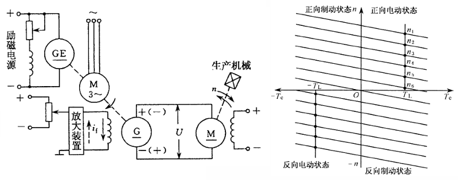
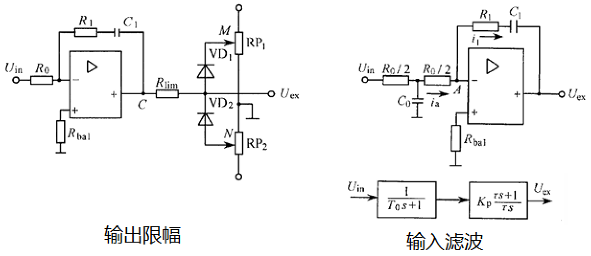
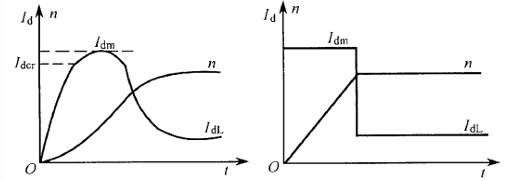

# 概述

测验 15%+作业研讨 15%+综合设计大作业 20%+闭卷考试 50%

电气传动系统：由电动机带动工作机械的传动系统，是一种典型的自动控制系统；控制对象是电动机，控制核心是控制器，用电力电子功率变换装置来驱动执行机构。电气传动系统的基本控制目的：动态（启动调速制动）、静态（精度）

课程内容：电气传动基础（动力学基础、直流他励电动机特性及运动方式）、直流调速自动控制系统（开环/闭环系统、可逆系统、调速系统的设计与调试）、交流调速自动控制系统（异步电动机的特性及运动方式、转差频率控制、矢量变换控制、直接转矩控制）

重点在第一章，第三章不讲，小学期有控制系统综合调试的课程，第四周闭卷课堂测验

# 第一章 直流电动机调速系统

## 1. 电气传动动力学基础

### 基本方程

$$T_e$$为电磁转矩，$$T_L$$为负载转矩

对于旋转中的物体，工程上用飞轮矩的概念来表示其转动惯量，在计算上为，有的资料定义为转动惯量的 4 倍（$$MD^2$$），有的定义为转动惯量的 4g 倍（$$GD^2$$），本课程采用后一种。飞轮矩用于衡量转动物体保持其原有转动状态的能力，飞轮矩越大，抵抗转速变化的能力越强。

基本运动方程（欧拉第二定律）：

$$
\begin{equation}
T_M - T_L = \frac{\text{d}(J\omega)}{\text{d}t} = J\frac{\text{d}\omega}{\text{d}t}+\omega\frac{\text{d}J}{\text{d}t}
\label{eq:1}
\end{equation}
$$

作以下假设（本课程中不作说明均忽略空载转矩）

$$
\begin{aligned}
&忽略空载转矩，T_M = T_e \quad (实际应为T_e = T_M + T_0, T_0为空载转矩)\\
&假设转动惯量为常值，\omega\frac{\text{d}J}{\text{d}t} = 0\\
&J = m\rho^2=m\frac{D^2}{4} = \frac{GD^2}{4g}(\rho为质点到转轴的距离,也称惯性半径)\\
&g取9.8m/s^2, \omega = \frac{2\pi}{60}n\\
\end{aligned}
$$

将假设代入\eqref{eq:1}得：

$$
\begin{equation}
T_e- T_L \approx \frac{GD^2}{375}\frac{\text{d}n}{\text{d}t}
\label{eq:2}
\end{equation}
$$

显然$$T_e > T_L$$时系统加速，$$T_e<T_L$$时系统减速，$$T_e=T_L$$时系统处于稳态，此时电动机电磁转矩大小由负载转矩大小决定。

转矩方向以设定电动机的旋转方向为参考标准，电磁转矩$$T_e$$与之同向为正与之反向为负，负载转矩$$T_L$$与之同向为负与之反向为正。（负载转矩为正时表示负载转矩在反转方向）

### 等效折算

对于多轴系统，基于能量守恒定律（功率守恒）进行等效折算

- 转矩折算

$$
\begin{aligned}
&由T_L'\omega_M = \frac{T_L\omega_L}{\eta}\quad(T_L'为折合到电机轴上的转矩,\eta为传动效率)\\
&故T_L' = \frac{T_L}{i\eta}\quad(i为齿轮传动比，规定为\frac{\omega_M}{\omega_L}，即\frac{主动}{从动})\\
&对于直线运动的负载，T_L = GR
\end{aligned}
$$

- 飞轮矩折算

对于不同的负载形式，令总动能为$\frac{1}{2}J\omega_M^2$，其中$J$为等效到电机输出轴上的转动惯量

$$
\begin{aligned}
&\frac{1}{2}J\omega_M^2 = \frac{1}{2}J_M\omega_M^2 + \frac{1}{2}J_L\omega_L^2 + \frac{1}{2}mv^2 \quad (直线运动的负载)\\
&\frac{1}{2}J\omega_M^2 = \frac{1}{2}J_M\omega_M^2 + \frac{1}{2}J_L\omega_L^2 \quad (旋转运动的负载)\\
\end{aligned}
$$

化简可得等效转动惯量：

$$
\begin{aligned}
&J = J_M + \frac{J_L}{i^2} + \frac{mv^2}{\omega_M^2}\quad(直线运动的负载)\\
&J = J_M + \frac{J_L}{i^2}\quad(旋转运动的负载)\\
\end{aligned}
$$

根据$$GD^2 = 4gJ$$得等效飞轮矩：

$$
\begin{aligned}
&GD^2 = G_MD_M^2 + \frac{G_LD_L^2}{i^2} + 4g\frac{mv^2}{\omega_M^2} = G_MD_M^2 + \frac{G_LD_L^2}{i^2} + 365\frac{G_mv^2}{n_M^2}\quad(直线运动的负载)\\
&GD^2 = G_MD_M^2 + \frac{G_LD_L^2}{i^2}\quad(旋转运动的负载)\\
\end{aligned}
$$

由于$$\frac{1}{i^2}$$一般非常小，在工程上一般将$$J_M + \frac{J_L}{i^2}$$近似为$$(1+\delta)J_M$$，将$$GD_M^2 + \frac{GD_L^2}{i^2}$$近似为$$(1 + \delta)GD_M^2$$，$$\delta$$在工程上取 0.2~0.3 即可；即相对于负载侧，电机轴侧的转动惯量/飞轮矩是起主导作用的。

### 负载转矩特性

电动机的性能可用机械特性和负载转矩特性来表征

- 机械特性即转速$$n$$与电磁转矩$$T_e$$的关系$$n=f(T_e)$$

1 为他励/并励电机的机械特性，相对较硬；2 为串励电机的机械特性，相对较软；3 为异步电机的机械特性；同步电机得益于其驱动原理，机械特性最硬，几乎为一条水平直线

- 负载转矩特性即转速$$n$$与电负载转矩$$T_L$$的关系$$n=f(T_L)$$

三种类型的负载转矩特性如图

反抗性恒转矩：比如摩擦（纯机械负载）

位能性恒转矩：比如电梯（提升轿厢）

- 机械特性曲线和负责转矩特性曲线有交点是电力拖动系统稳定运行的必要条件，即存在$$T_e = T_L$$的转速才有可能达到稳态。在此之上，还需要在该交点转速之上的转速满足$$T_e < T_L$$，该交点转速之下的转速满足$$T_e > T_L$$（即高于稳态转速时有减速倾向，低于稳态转速时有加速倾向，类似于自控中稳定平衡点的概念）（稳定运行的条件）

## 2. 直流他励电动机机械特性及运行方法

直流电动机按励磁方式可分为他励和自励（分为并励、串励和复励，复励又分为正复励和负复励）

他励方式中励磁和电枢绕组供电互不影响，并励方式中励磁线圈细且多匝（小电流且保证磁场电压相同），串励方式中励磁线圈少且少匝（减少损耗和压降且保证电流相同），本课程在他励电动机的范畴内讨论。

### 直流电动机基本公式

{: .left}

 
$$
\begin{aligned}
&E = C_e\Phi n \quad C_e = \frac{4pN}{60} \quad (反电动势) \\
&T_e= C_m\Phi I \quad C_m = \frac{2pN}{\pi} \quad (电磁转矩)\\
&C_m = \frac{60}{2\pi} \approx 9.55C_e \\
&U = E + IR\\
\end{aligned}
$$

 
对于功率关系，电功率$$P = UI$$由机械功率$$T_e \omega$$，铜损$$I^2R$$，铁损，机械损耗和杂散损耗几部分构成。工程上得出结论，一般来说，铜损占总损耗50%，铁损占总损耗20%，机械和杂散损耗占30%，因此近似计算可认为$$P = UI = T_e \omega + 2I^2R$$（题目中往往用这一关系计算电阻）。实际测量时，同步电机的内阻一般为几欧姆，相对较大可用万用表测量，而其它电机的内阻一般为零点几欧姆，可用电桥测量（如惠斯通电桥）。

### 机械特性曲线

由基本公式可推导得机械特性曲线函数，$$n_0$$为理论空载转速，$$n_0'$$为实际空载转速，$$\Delta n$$为转速降；由于相对于力矩，电流显然更容易测得，也常写成转速特性$$n = f(I)$$

$$
\begin{equation}
n = \frac{U}{C_e\Phi} - \frac{R}{C_e C_m \Phi^2}T_e = \frac{U}{C_e\Phi} - \frac{R}{C_e\Phi}I = n_0 - \Delta n
\label{eq:3}
\end{equation}
$$

由图可见，转速降和斜率一一对应。另外需要注意，按照额定转速降的定义，$$T_e$$为额定转矩时对应的转速降称为额定转速降，而对磁通量和电阻没有要求；因此改变这两者是可以改变额定转速降的，只需保证$$T_e$$为额定转矩即可。题目中如果没有强调用额定转速降，就认为是变化后的转速降。

额定运行状态（nomial）下的机械特性称为固有特性（固有机械特性曲线，一般认为有且只有一条），改变电机内部或外部的参数得到的机械特性称为人为机械特性，也表示了电机调速的三种方式

$$
\begin{equation}
n = \frac{U_{nom}}{C_e\Phi_{nom}} - \frac{R}{C_e C_m \Phi_{nom}^2}T_e
\label{eq:4}
\end{equation}
$$

### 调速性能指标

- 调速范围：工作机械要求的最高转速和最低转速之比$$D = \frac{n_{max}}{n_{min}}$$，一般取电机铭牌的额定转速$$n_{nom}$$作为最高转速

- 静差率：电机运行在某一机械特性上时，**额定转速降**与理想空载转速之比$$s = \frac{\Delta n_{nom}}{n_0} \times 100\%$$，显然额定转速降越大，静差率越大。对于调速系统而言，静差率的值为运行在调速范围内所有转速对应的静差率都能满足的 s 值（由于 s 值越小越好，故此处取调速范围内 s 的最大值，即调速范围内最低速对应的 s 值，因此，如果低速时的静差率满足要求，则高速时就一定满足）
- 调速平滑性：用两个相邻调速级的转速比来衡量，调速范围一定时，调速级数越多平滑性越好；调速级数无穷多（转速连续可调）时称为无级调速

两个指标之间存在一定关系：

$$
\begin{aligned}
s &= \frac{\Delta n_{nom}}{n_{0min}}\\
D &= \frac{n_{max}}{n_{min}} \\
&= \frac{n_{nom}}{n_{0min} - \Delta n_{nom}}\\
&=\frac{n_{nom}}{\frac{\Delta n_{nom}}{s} - \Delta n_{nom}}\\
&=\frac{s}{(1 - s)}\cdot\frac{n_{nom}}{\Delta n_{nom}}
\end{aligned}
$$

即

$$
\begin{equation}
D =\frac{s}{(1 - s)}\cdot\frac{n_{nom}}{\Delta n_{nom}}
\label{eq:5}
\end{equation}
$$

由这个式子可看出，静差率越小越好和调速范围越大越好这两个要求是互相矛盾的，因此在设计电机时需要进行权衡。

### 启动与制动

电动机有电动和制动两种运行状态，区别在于电磁转矩$$T_e$$的方向与转速$$n$$是相同还是相反。因此，制动和减速并没有直接关系。

直流他励电动机启动时，需要先建立磁场，再加电枢电压。如果先施加电枢电压，由于电机硅钢片中的铁损存在剩磁（即$$\Phi$$为一个很小的值），一旦施加电压，$$n = \frac{U}{C_e\Phi} - \frac{R}{C_e C_m \Phi^2}T_e$$中的第一项会非常大，对电机造成不可逆的损坏。启动方式有降压启动后逐渐升到额定电压、电枢串电阻启动后分级切除（目前已被新型器件替代），目的都是缓冲启动时的冲击，副作用是会限制启动时的电磁转矩，加速度被限制，进行软启动，启动时间变长。另外，需要保持最大启动电枢电流启动，使其尽快达到需要的力矩。

电气制动有三种方式：回馈制动、能耗制动和反接制动

- 回馈制动：减小电枢电压，将系统动能转变为电能送回电网

- 能耗制动：撤去电枢电压并串接能耗电阻，将能量耗散在电阻上；串入电阻阻值计算的经验公式为

  $$R_r \ge \frac{U_{nom}}{\lambda I_{nom}} - R_a$$（认为机械特性比较硬，制动时$$E \approx U$$）

- 反接制动：

  - 电源反接，同时串接大电阻（$$U$$变为$$-U$$，串电阻限流），串入电阻阻值计算的经验公式为$$R_r \ge \frac{2U_{nom}}{\lambda I_{nom}} - R_a$$，$$\lambda$$为过载系数，一般取 1.5~2.5；$$U_{max}$$的系数为 2 的原因是电源反接时电压相当于变为了两倍。另外需要注意，电源反接不是调压，即直接且只能改变电压极性

  - 转速反向，针对位能性负载，串入大电阻使得$$T_e = T_L$$时转速反向，此时$$T_e$$与$$n$$反向，处于制动状态

三种制动的差别在于将纵轴交点确定在了不同的位置，与原来$$n_0$$同号则为回馈制动，与原来$$n_0$$异号则为反接制动，在原点则为能耗制动。分析方法为，根据$$U$$和$$R$$的条件变化确定机械特性曲线的位置（对于确定的电机，一种$$U$$和$$R$$的条件确定一条特定的机械特性曲线，并确定对应的$$n_0$$）；由于转速不突变，工作点编导新的机械特性曲线上，再根据\eqref{eq:2}确定转速变化的方向和终点。（对于一条给定的机械特性，电枢电压$$U_a$$是一定的，随着转速的变化，反电动势$$E$$会变化，出现$$E < U_a$$、$$E = U_a$$、$$E > U_a$$三种情况）

对于一条给定的机械特性曲线，可按照总结的规则确定各段中电动机的工作状态：

曲线过原点：能耗制动

1. $$n$$与$$n_0$$同向且$$\vert n\vert > \vert n_0 \vert$$：回馈制动
2. $$n$$与$$n_0$$同向且$$\vert n \vert < \vert n_0 \vert$$：电动
3. $$n$$与$$n_0$$反向：电源反向反接制动
4. $$n_0$$不变：转速反向反接制动

（以第二条为例，简要说明推理过程：$$ \vert n \vert > \vert n_0 \vert$$，则$$ \vert E \vert > \vert U \vert $$，电流从作为电源的$$E$$流向作为负载的$$U$$，$$T_e$$与$$n$$反向，为发电机状态，制动）

另外，对于反抗性负载的情况，尤其需要注意$$n$$为正即上半平面时，看的是第一象限的$$+T_L$$，$$n$$为负即下半平面时，看的是第三象限的$$-T_L$$

### 动态特性

电气传动系统从一个稳定运行状态过度到另一个稳定运行状态，称为过渡过程；过渡过程中转速转矩电流等物理量的变化，称为动态特性。比如电机转速的增加、电流的增加、负载转矩的变化、制动过程等；而稳定转速的高速运动属于稳态。

由\eqref{eq:2}、\eqref{eq:3}：

$$
\begin{aligned}
&T_e- T_L \approx \frac{GD^2}{375}\frac{\text{d}n}{\text{d}t}\\
&n = \frac{U}{C_e\Phi} - \frac{R}{C_e C_m \Phi^2}T_e\\
\end{aligned}
$$

得：

$$
n = \frac{U}{C_e\Phi} - \frac{R}{C_e C_m \Phi^2}T_L - \frac{GD^2}{375}\cdot\frac{R}{C_e C_m \Phi^2}\frac{\text{d}n}{\text{d}t}
$$

将$$\frac{U}{C_e\Phi}$$写成$$n_0$$；当$$T_e = T_L$$，即$$\frac{\text{d}n}{\text{d}t} = 0$$时，称$$n_s = n_0 - \frac{R}{C_e C_m \Phi^2}T_L$$为稳态转速，对应的$$I_s = \frac{T_e}{C_m\Phi} = \frac{T_L}{C_m\Phi}$$为稳态电流，称$$T_m = \frac{GD^2}{375}\cdot\frac{R}{C_e C_m \Phi^2}$$为机电时间常数（注意$$R$$表示总的电阻值，因此有附加电阻时要算上），代入式子得：

$$
n = n_s - T_m\frac{\text{d}n}{\text{d}t}
$$

求解该一阶微分方程可得：

$$
\begin{equation}
n = n_s + (n_{init} - n_s)e^{-\frac{t}{T_m}}
\label{eq:6}
\end{equation}
$$

初始值一般会给定，稳态值在工程上取$$t = 4T_m$$时的值即可（也可由机械特性曲线上$$T_e = T_L$$交点处得出），机电时间常数对于给定的系统也是确定的，由此便可以确定系统的动态特性

$$
\begin{aligned}
&n = n_s + (n_{init} - n_s)e^{-\frac{t}{T_m}}\\
&I = I_s + (I_{init} - I_s)e^{-\frac{t}{T_m}}\\
&T_e = T_{es} + (T_{einit} - T_{es})e^{-\frac{t}{T_m}}\\
\end{aligned}
$$

注意：在反抗型负载的电源反接制动中，$$t \le t_1$$时，稳态值要代 c 点的。

## 3. 开环直流调速系统

### 三种开环调速系统

- 旋转变流机组供电的开环调速系统（G-M）

三相异步电动机拖动直流发电机运动，发出直流电作为直流电动机的电枢电压，另外还需要一个小的直流电动机（为三相异步电机的驱动电路提供直流供电），两个直流电动机的励磁电源以及三相异步电机驱动电路中的开关器件，均需要额外的直流电供电。发电机和电动机根据产生感应电动势的相对大小，分别可以工作在功率输出或功率吸收状态。

- 脉冲宽度调制直流调速系统（PWM-M）（斩波调速）

注：二极管的作用是续流，使得能量有地方释放

注意：一般来说，占空比的定义是高电平的时间占周期时间的比例，但本课程中的占空比是根据 H 桥来定义的，即$$\frac{U_d}{U_s}$$，而$$U_d$$是可正可负的，取值范围是-1~1（双极性 PWM）

机械特性：$$n = \frac{\rho U_s}{C_e\Phi} - \frac{R}{C_eC_m\Phi^2}T_e$$，机械特性曲线为一族平行曲线，理想空载转速随占空比变化；在采用 H 桥直流斩波电源驱动时，由于电源可以工作在功率输出和功率吸收状态，电机可以四象限运行。

- 晶闸管脉冲相位控制直流调速系统（V-M）（整流调速）

晶闸管整流器 V 可为任意整流电路，上面的三条斜线表示三相，GT 表示触发电路，L 为平波电抗器，右侧的三相整流桥为电动机提供直流励磁电压；$$U_{cf}$$与$$U_d$$存在比例关系，且二者延迟一个周期。

使用晶闸管相控的直流可调电源，与发电机电源的区别在于：晶闸管单相导通，电动机不可工作在发电机状态；另外，晶闸管的触发角$$\alpha$$（在单相电路中是相电压过零点；在三相电路中是自然换向点和触发信号起始点之间的相位差）需要大于某个阈值时才能使电流连续。相较于和脉宽调制的直流可调电源，一个通过控制占空比调节电压，一个通过控制相位控制电压。

V-M 系统的问题：晶闸管相控的问题是，由于晶闸管的单相导电性，电流可能出现断续，且存在移相控制的延迟问题。

直流他动电机传动系统，电机开环调速，通过调整供电电压来预定电机转速，但是由于电枢回路有电阻，在负载增加后，电磁转矩增大，转速下降反电势减小，电流增大，电滋转矩增大到负载转矩，但是由于电阻，最终只有电机转速低，反电势低才能维持较大电流，因此转速出现下掉，即调速误差，此前调速电压给定值只能根据电机机械特性，估计出电机转速值来确定给定电压。由于直接给定电机电压给定值，如果不加任何措施，在启动时，电机转速从 0 开始加速，低速反电势很低，无法抵消平衡回路中的供电电压，致使很大电压加在回路电阻上，造成过流，因此必须增加措施缓解或限制动态过程的冲击。

### 晶闸管相控电路分析

（以三相零式电路/三相半波可控整流电路为例）

共阴极接法有公共端，电路简单；共阳极接法：共用散热，电路复杂。变压器一次侧为三角形连接：形成内部环路，避免三次谐波污染电网；变压器二次侧为星形连接：为了引出零线，形成直流电。晶闸管的导通条件为施加正向偏置的情况下有门极驱动信号，关断条件为阳极电流小于维持电流。三相对应的三个晶闸管触发脉冲互差 120°。

重温几个电角度：

- 自然换向点：相电压交汇的时刻，是不考虑触发脉冲时的换向时刻，即晶闸管能够导通的最早时刻，是计算触发角的起点
- 导通角$$\theta$$：开关管导通的相位范围
- 触发角/控制角$$\alpha$$：以自然换向点为起点，从左往右，以触发脉冲开始时刻为终点的电角度
- 逆变角$$\beta$$：为$$\alpha$$的补角，以自然换向点向前 180° 为起点，从右往左取$$\alpha$$补角的度数为终点的电角度

对于同一电路，只要触发角非零，180° 的范围就一定会跨越正负，因此，当$$\alpha$$起点处对应的电压为正时（课件中称为正的自然换向点，个人认为这种表述不是很好理解），$$\beta$$起点处对应的电压一定为负，反之亦然。共阴极接法的自然换向点为正，共阳极接法的自然换向点为负。

| 条件     | $$U_{VT1}$$ | $$U_d$$ |
| -------- | ----------- | ------- |
| VT1 导通 | $$0$$       | $$U_a$$ |
| VT2 导通 | $$U_{ab}$$  | $$U_b$$ |
| VT3 导通 | $$U_{ac}$$  | $$U_c$$ |
| 均不导通 | $$U_a$$     | $$0$$   |

**纯电阻负载**的三相半波可控整流中，使得电流连续的晶闸管的最大触发角为 30°，大于此角度时，经过自然换向点后，三相中电压最高相的触发脉冲还没有到来，晶闸管不导通，电流断续。电流连续时，输出的平均电压$$U_d = U_{d0} \cos \alpha = 1.17U_2 \cos \alpha$$，$$U_2$$为相电压有效值，$$U_{d0}$$为$$\alpha=0$$时的输出电压，在这个电路结构中$$U_{d0}=1.17U_2$$。当晶闸管的触发角度达到 150° 及以上时，$$U_d = 0$$，150° 这个使得输出电压为正的阈值角度被称为移相范围。晶闸管承受最大正向电压为相电压峰值$$\sqrt{2}U_2$$，最大反向电压为线电压峰值$$\sqrt{6}U_2$$。

**阻感负载**的三相半波可控整流中，当电感足够大时，电流始终连续，晶闸管导通角达到三相零式电路中导通角可达的最大值 120°，移相范围为 90°。晶闸管承受最大正向反向电压均为线电压峰值$$\sqrt{6}U_2$$另外，加入感性负载后，由于局部负电压的出现，等效输出电压有所降低，为此可以并联续流二极管来避免负压，提高输出电压的等效值。

=

反电动势负载的三相半波可控整流可理解为 E-R-L 模型，下面以$$\alpha = 60°$$ 为例分析，从左到右分别理解为 L=0、L 普通、L 较大

L=0 时为纯阻性负载，相电压不超过 E 时输出电压均为 E；L 普通时，可以续流一段时间使得相电压在低于 E 时保持为相电压，电感能量释放完毕后输出电压恢复 E，直到相电压重新超过 E；L 较大时，可以完全抵消 E 的作用，输出电压完全由相电压和触发信号决定

### 晶闸管相控电路的逆变

为了使晶闸管相控电路能够吸收能量，由于晶闸管已经限定了电流方向，因此采用改变电压极性的方式，即逆变。逆变分为有源逆变和无源逆变两种，前者转换得到的交流电能直接输送给交流电网，后者转换得到的电能直接输送给交流负载。

左侧提升负载，E 为正，电机作为电动机，电路处于整流状态；右侧下降负载，E 为负，电机作为发电机，电路处于逆变状态。

有源逆变的条件：变流器直流侧必须外接一个直流电源 E，其极性和晶闸管导通方向一致，且$$\vert E \vert > \vert U_d \vert$$；此外，变流器直流侧的直流平均电压需要为负，即$$\alpha > 90$$°, $$U_d < 0$$。导致逆变失败的原因可能有触发电路不可靠、晶闸管故障、交流电异常等硬件问题，也可能有换向裕量不足的设计问题。换向裕量是对触发脉冲持续时间和电压幅值的要求；由于实际晶闸管的开通或关断是一个过程而非瞬间完成，如果在开通或关断的过程中触发脉冲就结束了，换向就会失败。定义换向所经历的时间间隔为换向重叠角$$\gamma$$，逆变角$$\beta$$需要大于这个值才有可能完成逆变，通常取最小逆变角$$30° < \beta_{min} < 35°$$

### V-M 系统的机械特性曲线

类似于单个电机的机械特性曲线，同样可以研究晶闸管脉冲相位控制直流调速系统（V-M 系统）的机械特性曲线

$$
n = \frac{U_d}{C_e \Phi} - \frac{R}{C_e C_m \Phi^2}T_e
$$

显然，输出平均电压$$U_d$$越大，理想空载转速$$n_0$$越大；同时，电流连续性越好，机械特性越硬。

当电流连续时，可以忽略电动机反电势$$E$$的作用，有$$U_d = U_{d0}\cos\alpha$$，改变$$\alpha$$，机械特性曲线为一组平行直线（一种调压调速的方式）。当电流断续时，将系统等效为一个 E-R-L 模型。L 越大，平均电压越低，电流连续性越好，理想空载转速越低，机械特性越硬；触发角越大，平均电压越低，理想空载转速越低。断续会使得平均电压升高，理想空载转速也增加。另外，只要有电感，电流就不会突变。

断续区的机械特性曲线是非线性的，在设计控制系统时希望尽可能地避免。

### V-M 可逆系统运行

为了实现 V-M 系统的可逆运行，反向并联一组晶闸管

这样构建可逆系统存在环流的问题，即不经过电动机或其它负载，只在两组变流器之间流动的电流。环流分为直流环流（两组变流器输出平均电压不同而引起的环流）和脉动环流（两组变流器输出瞬时电压不同而引起的环流）两种。（注意标准环流需要画一整圈）

注：桥式整流中的平波电抗器是用于抑制环流的，需要接在电源输出侧而非作为负载的电机侧，否则因为环流不经过负载，平波电抗器也就不会起作用。另外，同一个桥臂的两个晶闸管由带有死区的互补 PWM 波控制，不会同时导通。

对于结构相同且交流电源相同的情况（保证$$U_{d0}$$相等），采用配合控制来抑制环流。所谓配合控制，就是正组的触发角等于反组的逆变角$$\alpha_F = \beta_R$$，此时两组晶闸管输出电压绝对值相等$$\vert U_{df} \vert = \vert U_{dr} \vert$$，便可以抑制直流环流。另外，正组触发角和反组触发角相差 180° 。

脉动环流是由于正反组瞬时电压不同造成的，但由于平波电抗器的存在，这个脉动环流经滤波后存在一个较小的直流分量，数值在脉动电流的 5%-10%。这个直流分量可以保持晶闸管的微导通状态，使得系统的动态性能更好。在下图的控制方式中，$$\Delta u_d$$的波形近似为锯齿波

为了理解图中的波形，作以下的补充说明：

触发角表示从自然换向点开始到脉冲信号的起始处，过了触发角之后，对应相位的晶闸管被触发；另外需要注意，三相的晶闸管是轮流触发的，而并不是每个触发角之后一起给触发信号的。自然换向点表示即将被触发的一相有了可以导通的资格，从这一刻起再过一个触发角的相位，这一相的晶闸管就会被触发，该相电压将作为负载上的实际电压。

另外，关于可逆系统中整流和逆变的工作状态，再作以下的补充说明：

- 触发角小于 90° 时，平均电压$$U_d$$为正，是待整流的条件

- 触发角大于 90° 时，平均电压$$U_d$$为负，是待逆变的条件

- $$\vert U_d \vert > \vert E \vert$$，是整流的条件

- $$\vert U_d \vert < \vert E \vert$$，是逆变的条件

当四个角（正组触发角、正组逆变角、反组触发角、反组逆变角）中的一个确定后，另外三个角也就随之确定，平均电压也就随之确定，此时正组和反组必定一组满足待整流的条件，另一组满足带待逆变的条件。负载决定了系统的稳定转速，也就确定了反电势$$E$$，根据当前平均电压和反电势的关系可以确定能工作的那一组（满足待整流或待逆变）是整流还是逆变，另一组相应地就待工作。不妨在坐标系中随意画两条机械特性曲线加以说明。（注，对于一条特定的机械曲线，$$U_d$$的大小是确定的，$$E$$随着转速的变化而变化）

### V-M 可逆系统机械特性曲线

正反组分别单独供电的机械特性曲线如下：

两组一起供电时，由于晶闸管桥的电流方向由其单相导电性确定，而电机支路的电流方向正反均可，而电流数值的关系是确定的：

$$
\vert I_d \vert = \vert I_f \vert - \vert I_r \vert
$$

由这个式子经严格的数学计算出来，两组共同供电时，机械特性曲线为直线，称为合成机械特性曲线

### V-M 可逆系统特点

- 有环流可逆系统的优点：在正反组切换时，电流能平滑连续过渡，没有动态死区，能加快过渡过程。少量环流流过晶闸管作为基本负载，使电机在空载或轻载时也能工作在电流连续区，从而避免了电流断续引起的非线性现象对系统静、动态性能的影响。
- 有环流可逆系统的缺点：需要添置环流电抗器，损耗增大。
- 有环流可逆系统的适用：反向要求快，过渡平滑性要求较高的中小容量系统。

### 晶闸管变流电源的传函和框图

$$
\begin{aligned}
\frac{U_{\mathrm{d}}(s)}{U_{\mathrm{ct}}(s)} &= K_{\mathrm{s}} \mathrm{e}^{-T_{\mathrm{s}}s}\\
\frac{U_{\mathrm{d}}(\mathrm{j}\omega)}{U_{\mathrm{ct}}(\mathrm{j}\omega)}&=K_{\mathrm{s}} \mathrm{e}^{-\mathrm{j}\omega T_{\mathrm{s}}}=\frac{K_{\mathrm{s}}}{\left(1 - \frac{1}{2}T_{\mathrm{s}}^{2}\omega^{2}+\frac{1}{24}T_{\mathrm{s}}^{4}\omega^{4}-\cdots\right)+\mathrm{j}\left(T_{\mathrm{s}}\omega-\frac{1}{6}T_{\mathrm{s}}^{3}\omega^{3}+\cdots\right)}\\
\frac{U_{\mathrm{d}}(s)}{U_{\mathrm{ct}}(s)}&=\frac{K_{\mathrm{s}}}{T_{\mathrm{s}}s + 1} \quad 当\frac{1}{2}T_{\mathrm{s}}^{2}\omega^{2}<< 1 \text{ 及 } \frac{1}{6}T_{\mathrm{s}}^{3}\omega^{3}<< T_{\mathrm{s}}\omega，即\omega_{c} \leq \frac{1}{3} T_{s}时可以近似 \\
\end{aligned}
$$

$$
\begin{aligned}
e^{jx} &= \cos x + j\sin x\\
\sin x &=\sum_{n = 0}^{\infty}\frac{(- 1)^{n}}{(2n + 1)!}x^{2n+1}=x-\frac{x^{3}}{3!}+\frac{x^{5}}{5!}-\frac{x^{7}}{7!}+\cdots \\
\cos x &=\sum_{n = 0}^{\infty}\frac{(-1)^{n}}{(2n)!}x^{2n}=1-\frac{x^{2}}{2!}+\frac{x^{4}}{4!}-\frac{x^{6}}{6!}+\cdots \\
\end{aligned}
$$

$$T_s$$的含义如下，$$T_{smax} = \frac{1}{mf},m为一个周期的波头数,f为电频率$$，取$$T_s = \frac{1}{2}T_{smax}$$。对于单相电路和三相电路，$$T_s$$的值分别为 5ms 和 1.667ms。

### 电动机的传函和框图

对直流电机基本方程作拉普拉斯变换得：

$$
\begin{aligned}
U_{\mathrm{d}}(s)&=(Ls + R)I_{\mathrm{d}}(s)+E(s)\\
T_{\mathrm{e}}(s)-T_{\mathrm{L}}(s)&=\frac{GD^{2}}{375}sn(s)\\
E(s)&=C_{\mathrm{e}}\varPhi n(s)\\
T_{\mathrm{e}}(s)&=C_{\mathrm{m}}\varPhi I_{d}(s)
\end{aligned}
$$

规定以下常数：

$$
\begin{aligned}
T_{1}&=L/R \quad (电磁时间常数，影响电流环响应速度)\\
T_{\mathrm{m}}&=GD^{2}R/375C_{\mathrm{e}}C_{\mathrm{m}}\varPhi^{2} \quad (机电时间常数，影响速度环响应速度)\\
T_{\mathrm{L}}&=C_{\mathrm{m}}\varPhi I_{\mathrm{dL}} \quad (I_{dL}为虚拟电流)
\end{aligned}
$$

得到系统框图如下：

以上为电流连续时的结果，当电流断续时，等效电阻有所增大，定义为$$R'$$，且没有延迟环节，系统框图如下：

因此，直流电动机传递函数为：

$$
\begin{aligned}
\frac{n(s)}{U_{\mathrm{d}}(s)}&=\frac{1/C_{\mathrm{e}}\varPhi}{T_{\mathrm{m}}T_{1}s^{2}+T_{\mathrm{m}}s + 1} \quad (电流连续)\\
\frac{n(s)}{U_{\mathrm{d}}(s)}&=\frac{1/C_{\mathrm{e}}\varPhi}{T_{\mathrm{m}}'s + 1} \quad (电流断续)
\end{aligned}
$$

## 4. 单闭环直流调速系统

### 调节器及其传函

根据运放的虚短和虚断特性可得，由运放构成的传递函数为：

$$
\begin{aligned}
W(s)&=\frac{U_{\mathrm{ex}}(s)}{U_{\mathrm{in}}(s)}=\frac{i_{1}Z_{1}}{i_{0}Z_{0}}=\frac{Z_{1}}{Z_{0}}\\
U_{\mathrm{ex}}(s)&=\frac{Z_{1}}{Z_{01}}U_{\mathrm{in1}}(s)+\frac{Z_{1}}{Z_{02}}U_{\mathrm{in2}}(s)
\end{aligned}
$$

比例调节器、积分调节器、比例-积分调节器的传递函数分别为（注意此处省略了反向放大器带来的负号）：

$$
\begin{aligned}
W_{\mathrm{p}}(s)&=\frac{U_{\mathrm{ex}}(s)}{U_{\mathrm{in}}(s)}=\frac{R_{1}}{R_{0}}=K_{\mathrm{p}}\\
W_{\mathrm{I}}(s)&=\frac{U_{\mathrm{ex}}(s)}{U_{\mathrm{in}}(s)}=\frac{1/C_{1}s}{R_{0}}=\frac{1}{C_{1}R_{0}s}=\frac{1}{\tau_{1}s}\\
W_{\mathrm{PI}}(s)&=\frac{U_{\mathrm{ex}}(s)}{U_{\mathrm{in}}(s)}=\frac{R_{1}+1/C_{1}s}{\rho R_{0}}=\frac{R_{1}}{\rho R_{0}}+\frac{1}{\rho R_{0}C_{1}s}\\
&=K_{\mathrm{p}}+\frac{1}{\tau_{1}s}=K_{\mathrm{p}}\left(1 + \frac{1}{\tau s}\right)
\end{aligned}
$$

积分调节器的阶跃响应：$$U_{\mathrm{ex}}=(t/\tau_{1})U_{\mathrm{in}}$$

比例-积分调节器的阶跃响应：$$U_{\mathrm{ex}}=(K_{\mathrm{p}}+t/\tau_{1})U_{\mathrm{in}}$$

比例环节无记忆，是基于误差驱动的，没有误差就没有输出，因此单比例调节器是一个有误差系统。

积分环节只有$$U_{in} \neq 0$$时，$$U_{ex}$$才停止变化。当输出达到饱和时（运放由外部电源供电，输出电压不会超过电源电压），必须等$$U_{in}$$变极性时，调节器才会退出饱和。一般用的都是电压型，用电流型不能随意并联电阻，有谐振的问题。积分调节器的输出包含了输入 偏差的全部信息，只要历史上有过$$\Delta U_n$$，积分就有数值，理论上就可以产生稳态运行时所需要的控制电压。

比例-积分调节器的输出：$$U_{ct} = K_p\Delta U_n + \frac{1}{\tau_1}\int_0^t \Delta U_n \text{d}t$$，开始时比例环节起主导作用，实现快速控制，接近稳态时积分环节起主导作用。单看积分器来说，输出电压取决于$$\Delta U_n$$的历史值；对于系统来说，输出电压取决于$$\Delta U_n$$的历史值和负载，即由它后面环节的需要决定。

调节器辅助电路有：输出限幅电路、输入滤波电路（$$T_0 = \frac{1}{4}R_0 C_0$$）

### 闭环系统静态特性分析

对转速引入负反馈闭环控制

- 单闭环有静差调速系统（P 调节器）

注意：由于是反相放大器（输入端的极性和输出端相反极性，称为反相放大器），ref 需要给负，fdb 需要给正（极性与 ref 相反才是负反馈）

研究静态特性，认为$$T_s \to \infty、E = U_d、\frac{n(s)}{U_{\mathrm{d}}(s)}=\frac{1}{C_{\mathrm{e}}\varPhi}$$

$$
\begin{aligned}
\Delta U_{\mathrm{n}}&=U_{\mathrm{n}}^{*}-U_{\mathrm{n}}\\
U_{\mathrm{ct}}&=K_{\mathrm{p}}\Delta U_{\mathrm{n}}\\
U_{\mathrm{d}}&=K_{\mathrm{s}}U_{\mathrm{ct}}\\
n&=(U_{\mathrm{d}} - I_{\mathrm{d}}R)/C_{\mathrm{e}}\varPhi\\
U_{\mathrm{n}}&=\alpha_{\mathrm{n}}n\\
\end{aligned}
$$

可推出，闭环系统机械特性为：

$$
\begin{aligned}
n&=\frac{K_{\mathrm{p}}K_{\mathrm{s}}U_{\mathrm{n}}^{*}-RI_{\mathrm{d}}}{C_{\mathrm{e}}\varPhi(1 + K_{\mathrm{p}}K_{\mathrm{s}}\alpha_{\mathrm{n}}/C_{\mathrm{e}}\varPhi)}\\
&=\frac{K_{\mathrm{p}}K_{\mathrm{s}}U_{\mathrm{n}}^{*}}{C_{\mathrm{e}}\varPhi(1 + K)}-\frac{RI_{\mathrm{d}}}{C_{\mathrm{e}}\varPhi(1 + K)}\\
&=n_{0\mathrm{cl}} - \Delta n_{\mathrm{cl}} \\
K&=K_{\mathrm{p}}K_{\mathrm{s}}\alpha_{\mathrm{n}}/C_{\mathrm{e}}\varPhi \quad (环路增益)
\end{aligned}
$$

与开环系统机械特性比较：

$$
\begin{aligned}
n&=\frac{U_{\mathrm{d}} - RI_{\mathrm{d}}}{C_{\mathrm{e}}\varPhi}\\
&=\frac{K_{\mathrm{p}}K_{\mathrm{s}}U_{\mathrm{n}}^{*}}{C_{\mathrm{e}}\varPhi}-\frac{RI_{\mathrm{d}}}{C_{\mathrm{e}}\varPhi}\\
&=n_{0\mathrm{op}}-\Delta n_{\mathrm{op}}
\end{aligned}
$$

显然，开环的理想空载转速和额定转速降都大。

$$
\begin{aligned}
n_{0\mathrm{op}} = (1+K) n_{0\mathrm{cl}}\\
\Delta n_{\mathrm{op}} = (1+K)\Delta n_{\mathrm{cl}} \\
\end{aligned}
$$

闭环系统的静特性比开环系统的机械特性要硬的多（实质是闭环系统的自动调节作用），对于相同的理想空载转速的开环和闭环两条特性，闭环系统静特性的静差率要小的多，在静差率一定时，闭环系统调速范围提高到开环的$$1+K$$倍（额定转速不变，额定转速降减小为原来的$$\frac{1}{1+K}$$），但必须增加放大器。

==静差率为什么变小了？额定转速不也变小了吗？加放大器又是什么意思？是不是使得额定转速不变的？==

==为什么可以有静差率一定的假设？静差率不是减小了吗？==

$$
D =\frac{s}{(1 - s)}\cdot\frac{n_{nom}}{\Delta n_{nom}}
$$

==这个例子似乎有很多说不清楚的地方==

举例：要求$$D=20, s \le 5 \%$$，电机参数$$P_0 = 60KW, U_{nom} = 220V, I_{nom} = 305A, n_{nom} = 1000\text{rpm}, R = 0.18Ω, C_e \Phi = 0.2 V/rpm$$，其它系统参数$$K_s = 30, \alpha_n = 0.015V/\text{rpm}$$

若开环：

$$
\begin{aligned}
\Delta n_{nom} &= \frac{I_{dnom}R}{C_e \Phi} = 274.5 \text{rpm}\\
s_{nom} &= \frac{\Delta n_{nom}}{n_{0nom}} = \frac{\Delta n_{nom}}{n_{nom} + \Delta n_{nom}} = 21.6\%
\end{aligned}
$$

引入闭环：

$$
\begin{aligned}
\Delta n_{\mathrm{cl}} &= \frac{n_{nom}}{D}\cdot \frac{s}{1-s} \le 2.63\text{rpm}\\
K &= \frac{\Delta n_{\mathrm{op}}}{\Delta n_{\mathrm{cl}}} - 1 \ge 103.37\\
K_p &= \frac{KC_e\Phi}{\alpha_n K_s} \ge 46
\end{aligned}
$$

扰动作用分析：

- 负反馈闭环控制系统具有良好的抗干扰性能，它对于被负反馈环包围的前向通道上的一切扰动作用都能有效地加以抑制，但对给定信号和检测装置中的扰动是没有抑制作用的。

---

- 无静差调速系统（PI 调节器）

启动过程

抗扰动过程分析：PI 控制综合了比例控制和积分控制两种规律的优点，又克服了各自的缺点。比例部分能迅速响应控制作用，积分部分则最终消除稳态偏差。PI 调节器构成的无静差调速系统，解决了静态精度和动态稳定性以及快速性之间的矛盾（波形图略）

### 闭环系统动态特性分析

闭环传递函数：

$$
W_{\mathrm{cl}}(s)=\frac{n(s)}{U_{\mathrm{n}}^{*}(s)}=\frac{\frac{K_{\mathrm{p}}K_{\mathrm{s}}/C_{\mathrm{e}}\varPhi}{1 + K}}{\frac{T_{\mathrm{m}}T_{1}T_{\mathrm{s}}}{1 + K}s^{3}+\frac{T_{\mathrm{m}}(T_{1}+T_{\mathrm{s}})}{1 + K}s^{2}+\frac{T_{\mathrm{m}}+T_{\mathrm{s}}}{1 + K}s + 1}
$$

应用劳斯判据判定该系统稳定的条件：

$$
\begin{aligned}
&系统特征方程:\frac{T_{\mathrm{m}}T_{1}T_{\mathrm{s}}}{1 + K}s^{3}+\frac{T_{\mathrm{m}}(T_{1}+T_{\mathrm{s}})}{1 + K}s^{2}+\frac{T_{\mathrm{m}}+T_{\mathrm{s}}}{1 + K}s + 1=0\\
&系统稳定的条件是:\frac{T_{\mathrm{m}}(T_{1}+T_{\mathrm{s}})}{1 + K}\cdot\frac{T_{\mathrm{m}}+T_{\mathrm{s}}}{1 + K}-\frac{T_{\mathrm{m}}T_{1}T_{\mathrm{s}}}{1 + K}>0\\
&整理后得:K<\frac{T_{\mathrm{m}}(T_{1}+T_{\mathrm{s}})+T_{\mathrm{s}}^{2}}{T_{1}T_{\mathrm{s}}} = \frac{T_m}{T_s} + \frac{T_m}{T_l} + \frac{T_s}{T_l} \\
&T_l为电磁时间常数、T_m为机电时间常数、T_s为延迟时间
\end{aligned}
$$

代入系统参数可得$$K < 49.4$$，这与静态性能指标要求的$$K \ge 103.37$$矛盾，即静态精度和动态稳定性矛盾。如果不更换硬件，则需要调整控制策略。

小结：单闭环有静差调速系统可使得系统静特性变硬，在静差率要求一定的前提下调速范围变宽，且系统具有良好的抗扰性能，但存在两个问题：一是静态精度和动态稳定性之间存在上述的矛盾，二是启动电流过大，对速度闭环并不能改善电流冲击，因为电流的变化反映到转速上需要时间，该系统且没有四象限运行能力。

### 其它闭环有静差调速系统

- 电压负反馈调速系统：不带测速发电机，而是在电机上并联较大的采样电阻，以该电阻的电压值作为转速的近似反馈

  

  $$
  \begin{aligned}
  \gamma_{u}&=U_{u}/U_{d}' \quad 电压负反馈系数 \\
  n&=\frac{K_{p}K_{s}U_{n}^{*}}{(1 + K)C_{e}\varPhi}-\frac{R_{rec}I_{d}}{(1 + K)C_{e}\varPhi}-\frac{R_{a}I_{d}}{C_{e}\varPhi}\\
  K &= K_{p}K_{s}\gamma_{u}\\
  \end{aligned}
  $$

  注意$$R_a$$环节不在反馈包围内，对应的项不用除以$$(1+K)$$；另外，由于左侧控制器为弱电，右侧电机为强电，反馈回的电压需要经变压器或光耦等方式进行强弱电的隔离。前向通道中，触发装置中的变流器中有电隔离。

  从机械特性表达式可见，转速降有所增大，且机械特性变软了

- 带电流正反馈的电压负反馈调速系统：通过较小的反馈电阻$$R_s$$引入电流正反馈，补偿单纯电压负反馈对机械特性的影响。

  

  $$
  \begin{aligned}
  \beta_{i} &= U_{i}/I_{d} \quad 电流正反馈系数 \\
  n&=\frac{K_{p}K_{s}U_{n}^{*}}{(1 + K)C_{e}\varPhi}+\frac{K_{p}K_{s}\beta_{i}}{(1 + K)C_{e}\varPhi}I_{d}-\frac{R_{rec}+R_{s}}{(1 + K)C_{e}\varPhi}I_{d}-\frac{R_{a}}{C_{e}\varPhi}I_{d}\\
  K &= K_{p}K_{s}\gamma_{u}\\
  \end{aligned}
  $$

  调整$$K_p$$和$$\beta_i$$可以达到不同的补偿状态

  

### 三种调节器的性能分析

（注：图中的 ASR 表示 Automatic Speed Regulator，类似的还有 ACR、APR）

稳态误差衡量系统控制的准确度（对给定输入的跟随能力）和抑制干扰能力（对负载变化等干扰的抵抗能力），下面分别求使用比例、积分、比例积分三种调节器的系统对阶跃输入的、阶跃负载扰动的稳态误差和误差传函。

开环传函：

$$
\begin{aligned}
&W(s)=\frac{K}{(T_s s + 1)(T_m T_l s^2 + T_m s + 1)} \quad \text{式中}K = K_p K_s \alpha / C_e\Phi \\
&W(s)=\frac{K}{s(T_s s + 1)(T_m T_l s^2 + T_m s + 1)} \quad \text{式中 }K = K_s \alpha / \tau C_e\Phi \\
&W(s)=\frac{K(K_p \tau s + 1)}{s(T_s s + 1)(T_m T_l s^2 + T_m s + 1)}  \quad \text{式中 }K = K_s \alpha / \tau C_e\Phi
\end{aligned}
$$

对输入的误差：输入$$\times$$误差传函

$$
\begin{aligned}
&\Delta U_n(s)=U_n^*(s)\cdot\frac{1}{1 + \frac{K}{(T_s s + 1)(T_m T_l s^2 + T_m s + 1)}}\\
&\Delta U_n(s)=U_n^*(s)\cdot\frac{1}{1 + \frac{K}{s(T_s s + 1)(T_m T_l s^2 + T_m s + 1)}}\\
&\Delta U_n(s)=U_n^*(s)\cdot\frac{1}{1 + \frac{K(K_p \tau s + 1)}{s(T_s s + 1)(T_m T_l s^2 + T_m s + 1)}}
\end{aligned}
$$

对阶跃输入$$U_n^*(s) = \frac{U_n^*}{s}$$的稳态误差：

$$
\begin{aligned}
&\Delta U_n=\lim_{s \to 0} s\cdot\Delta U_n(s)=\lim_{s \to 0} s\cdot\frac{U_n^*}{s}\cdot\frac{1}{1 + \frac{K}{(T_s s + 1)(T_m T_l s^2 + T_m s + 1)}}=\frac{U_n^*}{1 + K}\\
&\Delta U_n=\lim_{s \to 0} s\cdot\Delta U_n(s)=\lim_{s \to 0} s\cdot\frac{U_n^*}{s}\cdot\frac{1}{1 + \frac{K}{s(T_s s + 1)(T_m T_l s^2 + T_m s + 1)}} = 0\\
&\Delta U_n=\lim_{s \to 0} s\cdot\Delta U_n(s)=\lim_{s \to 0} s\cdot\frac{U_n^*}{s}\cdot\frac{1}{1 + \frac{K(K_p \tau s + 1)}{s(T_s s + 1)(T_m T_l s^2 + T_m s + 1)}} = 0
\end{aligned}
$$

显然：纯比例调节器为零型系统，对阶跃输入有稳态误差；而积分调节器和比例积分调节器均为一型系统，对阶跃输入稳态误差为零。

令$$U_n^*(s) = 0$$时，扰动$$I_{dL}(s)$$的误差：

$$
\begin{aligned}
&\Delta U_n(s)=I_{dL}(s)\cdot\frac{\frac{R(T_l s + 1)\alpha}{C_e\Phi(T_m T_l s^2 + T_m s + 1)}}{1 + \frac{K}{(T_s s + 1)(T_m T_l s^2 + T_m s + 1)}}\\
&\Delta U_n(s)=I_{dL}(s)\cdot\frac{\frac{R(T_l s + 1)\alpha}{C_e\Phi(T_m T_l s^2 + T_m s + 1)}}{1 + \frac{K}{s(T_s s + 1)(T_m T_l s^2 + T_m s + 1)}}\\
&\Delta U_n(s)=I_{dL}(s)\cdot\frac{\frac{R(T_l s + 1)\alpha}{C_e\Phi(T_m T_l s^2 + T_m s + 1)}}{1 + \frac{K(K_p \tau s + 1)}{s(T_s s + 1)(T_m T_l s^2 + T_m s + 1)}}
\end{aligned}
$$

对阶跃扰动$$I_{dL}(s) = \frac{I_{dL}}{s}$$引起的稳态误差：

$$
\begin{aligned}
&\Delta U_n=\lim_{s \to 0} s\cdot\Delta U_n(s)=\lim_{s \to 0} s\cdot\frac{I_{dL}}{s}\cdot\frac{\frac{R(T_l s + 1)\alpha}{C_e\Phi(T_m T_l s^2 + T_m s + 1)}}{1 + \frac{K}{(T_s s + 1)(T_m T_l s^2 + T_m s + 1)}}=\frac{R I_{dL}\alpha}{C_e(1 + K)}\\
&\Delta U_n=\lim_{s \to 0} s\cdot\Delta U_n(s)=\lim_{s \to 0} s\cdot\frac{I_{dL}}{s}\cdot\frac{\frac{R(T_l s + 1)}{C_e\Phi(T_m T_l s^2 + T_m s + 1)}}{1 + \frac{K}{s(T_s s + 1)(T_m T_l s^2 + T_m s + 1)}} = 0\\
&\Delta U_n=\lim_{s \to 0} s\cdot\Delta U_n(s)=\lim_{s \to 0} s\cdot\frac{I_{dL}}{s}\cdot\frac{\frac{R(T_l s + 1)}{C_e\Phi(T_m T_l s^2 + T_m s + 1)}}{1 + \frac{K(K_p \tau s + 1)}{s(T_s s + 1)(T_m T_l s^2 + T_m s + 1)}} = 0
\end{aligned}
$$

由扰动引起的稳态误差取决于误差点与扰动加入点之间的传递函数。比例控制的调速系统，该传递函数无积分环节，故存在扰动引起的稳态误差，称作有静差调速系统；积分控制或比例积分控制的调速系统，该传递函数具有积分环节，所以由阶跃扰动引起的稳态误差为 0，称作无静差调速系统。

### 带电流截止负反馈的转速负反馈闭环调速系统

为了解决启动电流冲击的问题，尝试引入电流闭环，但是但电流闭环的转速特性太差，转速对电流的变化十分敏感，因此仍然需要加上转速负反馈，综合以上讨论，最终希望在电流较大时加上电流负反馈，而电流不大时则去掉电流负反馈，这便是带电流截止负反馈的转速负反馈闭环调速系统。

使用电流互感器 TA 经过二极管不控整流桥获得电流反馈，另外，使用稳压管模拟以下特性（$$U_{VS}$$为击穿电压）

令电流反馈系数$$\beta_i = \frac{U_i}{I_d}$$，临界截止电流$$I_{dcr} = \frac{U_{VS}}{\beta_i}$$，$$R_0$$为了阻抗匹配，一般取 10k-100kΩ

$$
\begin{aligned}
\text{当}I_d &\leq I_{dcr}\text{时}\\
n&=\frac{K_P K_s U_n^*}{C_e \varPhi(1 + K)}-\frac{I_d R}{C_e \varPhi(1 + K)}\\
\text{当}I_d &> I_{dcr}\text{时}\\
n&=\frac{K_P K_s U_n^*}{C_e \varPhi(1 + K)}-\frac{K_P K_s(\beta_i I_d - U_{VS})}{C_e \varPhi(1 + K)}-\frac{I_d R}{C_e \varPhi(1 + K)}\\
&=\frac{K_P K_s(U_n^* + U_{VS})}{C_e \varPhi(1 + K)}-\frac{K_P K_s \beta_i + R}{C_e \varPhi(1 + K)}I_d\\
令n&=0，得\\
I_{dbl}&=\frac{K_P K_s(U_n^* + U_{VS})}{K_P K_s \beta_i + R} \approx \frac{U_n^* + U_{VS}}{\beta_i}\\
\end{aligned}
$$

（图中$$I_{dcr}$$为截止电流/临界电流 critical，取值略大于额定电流，$$I_{dbl}$$为堵转电流 blocking，取值略小于最大电流）

启动过程

性能评价：带电流截止负反馈的闭环调速系统，具有一定的调速范围和稳态精度，同时又能限制启动电流和堵转工作，线路简单，调整方便很有实用价值，但是系统的启动过程不理想。

### 闭环调速系统的设计

闭环控制系统设计的步骤：

1. 总体设计和静态计算：基本部件选择和静态参数计算，形成基本的控制系统。
2. 动态校正：建立基本系统的动态数学模型，分析基本系统的稳定性和动态性能。如果基本系统不满足性能指标的要求，则应加入适当的动态校正装置，使校正后的系统全面地满足要求。

动态校正方法一频率特性法：

1. 根据工作机械和工艺要求确定系统的动态和静态性能指标
2. 根据性能指标要求求得期望的开环对数频率特性
3. 比较期望的开环对数频率特性和基本系统的开环频率特性，从而确定校正环节的结构和参数

控制系统的动态性能指标：

1. 跟随性能指标：用阶跃响应来衡量

   时域看上升时间$$t_r$$，调节时间$$t_s$$和超调量

   

   频域：

   - 开环对数幅频特性：中频段$$h = \frac{\omega_2}{\omega_1}$$确定稳定性，交接频率$$\omega_c$$确定快速性，低频段放大倍数$$\vert A(0) \vert$$确定稳态精度
   - 闭环幅频特性：谐振幅值$$M_p$$确定稳定性和超调量，截止频率$$\omega_d$$确定快速性

   

2. 跟随性能指标：用阶跃扰动恢复过程来衡量

   动态降落$$C_{max}\% = \frac{\Delta C_{max}}{C_{infty}}\times 100\%$$，恢复时间$$t_v$$

## 5. 多环直流电动机调速系统

将两个调节器串联，电流环在内环，转速环在外环

ASR 和 ACR 为带限幅的 PI 调节器，调节电位器可调节输出限幅。显然，可调节的这个输出限幅需要小于 PI 调节器中运放的电源限幅，否则不会起作用。

### 静态特性分析

带输出限幅的 PI 调节器的稳态特性：

- 饱和——输出达到限幅值：当调节器饱和时，输出为恒值，输入量的变化不再影响输出，除非有反向的输入信号使调节器退出饱和，即饱和调节器暂时隔离了输入和输出间的关系，相当于使调节环开环。
- 不饱和——输出未达到限幅值：当调节器不饱和时，PI 调节器的输入偏差电压在稳态时总是零。

当转速调节器饱和时：此时由电流环主导

$$
\begin{aligned}
I_{d}&=U_{im}^{*}/\beta_{i}=I_{dm}\\
n&<n_{0}
\end{aligned}
$$

当转速调节器不饱和时：此时由转速环主导

$$
\begin{aligned}
U_{n}^{*}&=U_{n}=\alpha_{n}n\\
n&=U_{n}^{*}/\alpha_{n}=n_{0} \quad (理想情况) \\
I_{d}&<I_{dm}
\end{aligned}
$$

若两个调节器均未饱和时，稳态下各变量的关系：

$$
\begin{aligned}
U_{n}^{*}&=U_{n}=\alpha_{n}n=\alpha_{n}n_{0}\\
U_{i}^{*}&=U_{i}=\beta_{i}I_{d}=\beta_{i}'I_{dL}\\
U_{ct}&=\frac{U_{d}}{K_{s}}=\frac{C_{e}\Phi n + I_{d}R}{K_{s}}=\frac{C_{e}\Phi U_{n}^{*}+I_{dL}R}{K_{s}}
\end{aligned}
$$

### 动态特性分析

被控对象为转速，跟随性能用恒转矩负载下，阶跃给定下的动态响应描述，能否实现所期望的恒加速过程，最终以时间最优的形式达到所要求的性能指标，是设置双闭环控制的一个重要追求目标。

- 启动过程分析：分为电流上升、恒流升速和转速调节三个阶段。转速调节器在三个阶段中经历了不饱和、饱和和退饱和三种情况；而电流环始终工作在非饱和状态。启动过程有三个特点：饱和非线性控制、转速超调、准时间最优控制。最优控制是指系统以能运行的最好的允许状态去接近目标，即图中的第 II 阶段，而进入和退出第二阶段都需要一个较短的时间，故称为准时间最优控制。

  

  

  另外注意几个点

  1. ACR 的限幅是对调节器的输出限幅，而不保证实际的动态值被限幅在设定的范围内，图中也可看出$$I_d$$有超过$$I_{dm}$$的时候，因此在选取器件时要留有一定裕量。
  2. 在 II 阶段，$$I_d$$与$$I_{dm}$$有静差，这是因为$$I=\frac{U-E}{R}$$，而$$E = C_e\Phi n$$，在转速以恒定的最大加速度增加时，相当于给电流引入了一个斜坡扰动，s 域中为$$\frac{1}{s^2}$$，型别大于 PI 调节器的 I 型，因此是有静差的。
  3. 转速环的硬机械特性和电流环的软机械特性并不矛盾，因为负反馈系统会自动调节，初始时刻以电流环为主，稳态之后以转速环为主
  4. 恒最大电流启动的原因，是转速调节器的饱和非线性特性
  5. 电流环是不能轻易饱和的，这样即使电流出现少量超调，系统也可以承受。后面的环节也需要留有一定裕量

- 抗扰过程分析
