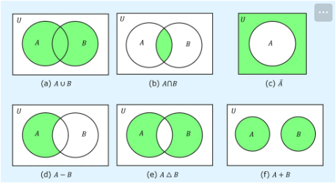
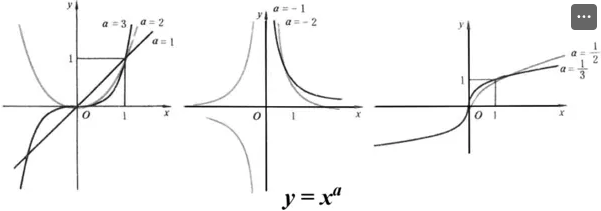
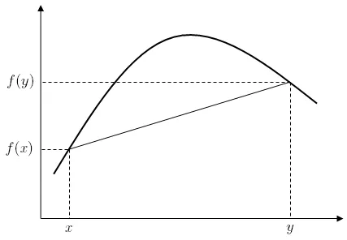
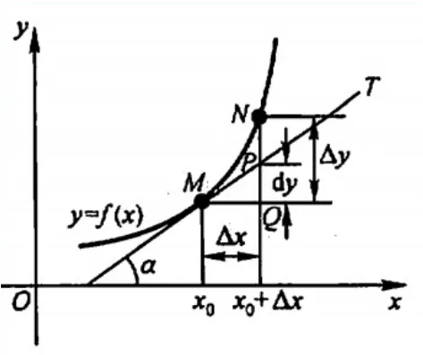
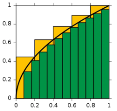
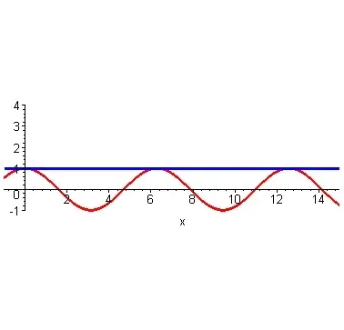

数学分析是研究**函数、极限、导数、微分、积分、级数**等概念的数学分支。其核心内容是研究变化和连续性的精确描述与处理。数学分析通过极限概念，深入探讨连续变化现象，解决微积分中的问题。

## 1. 函数

### 1.1 集合

集合是某些确定对象的整体，具有确定性、无序性和互异性，有列举法和描述法两种表示方式。

元素与集合的关系是属于（记作 ∈）或不属于（记作 ∉）。集合与集合之间的关系主要有子集关系和相等关系两种。集合之间的常见运算有交并查补四种。

### 1.2 区间和邻域

区间是实数集合中的一个子集，表示某个范围内的所有实数。根据端点是否包含在区间中，区间可以分为开区间、闭区间、半开半闭区间和无限区间。

对于一个实数 $$x$$ 和一个正数 $$\varepsilon > 0$$，称实数$$x$$的一个 $$\varepsilon$$ -邻域为包含$$x$$ 的开区间$$(x - \varepsilon, x + \varepsilon)$$ ，即所有与$$x$$的距离小于 $$\varepsilon$$的点的集合。

$$
U(x_0, \delta) = \{ x \in \mathbb{R} \ | \ |x - x_0| < \delta \}
$$

### 1.3 映射

设有两个集合$$A$$和$$B$$，从$$A$$到$$B$$的一个规则$$f$$，把$$A$$中的每个元素$$x$$唯一地关联到$$B$$中的一个元素，这样的$$f$$称为映射，记为

$$
f:A \rightarrow B
$$

其中$$A$$称为原像，$$B$$称为像。

如果不同输入永远映射到不同输出，称为单射；如果$$B$$中的每一个值都有至少一个输入可以通过该映射得到，称为满射；既是单射又是满射称为双射，双射即一一对应。

### 1.4 函数

设$$D$$为非空数集，则映射$$f：D \rightarrow f(D)$$称为定义在 D 上的函数。

若$$f$$为双射，则存在逆映射$$f^{-1}（D）\rightarrow D$$，对应的函数叫反函数。

将函数嵌套就得到了复合函数，如$$y = f[g(x)]$$。

当函数在整个定义域上没有统一表达式时，可用分段函数的形式表达。

常数函数、幂函数、指数函数、对数函数、三角函数、反三角函数统称为基本初等函数，由基本初等函数经过有限次四则运算和复合步骤构成的函数称为初等函数，可以用一个式子表示。

三角函数和双曲函数比较有意思，单独拿出来说：[三角函数和双曲函数](https://www.notion.so/0434ee3f5332436a9e511f0b3b0cfbf7?pvs=21)

### 1.5 参数方程

用一个或多个参数来描述曲线或曲面，以一种动态轨迹的视角表示曲线或曲面上的每一个点，以下是常见的参数方程

| 图形          | 参数方程                                                                                                                                       |
| ------------- | ---------------------------------------------------------------------------------------------------------------------------------------------- |
| 圆            | $$\left\{ \begin{aligned} x &= r \cos t \\ y &= r \sin t \end{aligned} \right. 其中，r 是半径，t 是参数范围$$                                  |
| 椭圆          | $$\left\{ \begin{aligned} x &= a \cos t \\ y &= b \sin t \end{aligned} \right. 其中，a和b分别为长轴和短轴， t是参数范围$$                      |
| 螺旋线        | $$\left\{ \begin{aligned} x &= r \cos t \\ y &= r \sin t \\ z &= c t \end{aligned} \right.其中，r 是半径，c 控制 z 方向的变化， t 是参数范围$$ |
| 摆线/最速降线 | $$\left\{ \begin{aligned} x &= r (t - \sin t) \\ y &= r (1 - \cos t) \end{aligned} \right.其中r 是圆的半径， t 是参数范围$$                    |
| 圆柱面        | $$\left\{ \begin{aligned} x &= r \cos t \\ y &= r \sin t \\ z &= z \end{aligned} \right.其中， r  是圆柱的半径， t  是参数， z  可以取任意值$$ |

### 1.6 极坐标系

极坐标系使用极径（到原点的距离）和极角（与 x 轴正方向的夹角）来描述曲线，是相对于笛卡尔平面直角坐标系的二维坐标系。对于具有旋转对称性或以圆形为基础的几何图形，在极坐标系中能够通过简单的函数更自然地表达出来。

与直角坐标系的转化关系

| 从极坐标转化为直角坐标                                                                                 | 从直角坐标转化为极坐标                                                                                 |
| ------------------------------------------------------------------------------------------------------ | ------------------------------------------------------------------------------------------------------ |
| $$\left\{ \begin{aligned} x &= r \cdot cos \theta \\ y &= r \cdot \sin \theta \end{aligned} \right. $$ | $$\left\{\begin{aligned} r &= \sqrt{x^2 + y^2} \\ \theta &= \text{atan2}(y, x) \end{aligned} \right.$$ |

常见的极坐标方程

| 图形         | 极坐标方程                  |
| ------------ | --------------------------- |
| 圆           | $$r = R$$                   |
| 阿基米德螺线 | $$r = a + b\theta$$         |
| 心形线       | $$r = a(1 + \cos\theta)$$   |
| 双纽线       | $$r^2 = a^2 \cos(2\theta)$$ |

## 2. 极限

极限分为数列极限和函数极限，此处介绍函数极限，数列极限类似。

### 2.1 定义

函数极限定义为：设$$f(x)$$是定义在某个开区间（去掉 $$x_0$$点）上的函数。如果存在实数$$L$$，使得对于任意的正数$$\epsilon > 0$$，总存在一个正数$$\delta > 0$$，当$$0 < \vert x - x_0 \vert < \delta$$时，函数值 $$f(x)$$满足：

$$
\vert f(x) - L \vert < \epsilon
$$

则称$$L$$是函数 $$f(x)$$在$$x_0$$处的极限，记作：

$$
\lim_{x \to x_0} f(x) = L
$$

注：$$x_0$$亦可代入$$\infty$$

根据$$x$$的趋近方向，有左极限和右极限之分，左右极限均存在且相等，这一点的极限才存在。

另外，若极限为$$\infty$$，习惯上写成$$\lim_{x \to x_0} f(x) = \infty$$，但此时极限不存在。

### 2.2 存在性定理

- 单调递增且有上界或单调递减且有下界，则极限存在

- 夹逼准则

  设函数$$f(x)、g(x)、h(x)$$在某个开区间$$I$$（区间覆盖点$$x_0$$，但不一定包含$$x_0$$本身）内满足：

  $$
   g(x) \leq f(x) \leq h(x)
  $$

  对于所有$$x \in I \setminus \{x_0\}$$（$$\setminus$$是集合差运算的符号），如果：

  $$
  \lim_{x \to x_0} g(x) = \lim_{x \to x_0} h(x) = L
  $$

  则有：

  $$
  \lim_{x \to x_0} f(x) = L
  $$

### 2.3 性质

- 有界性：极限收敛的函数必有界
- 唯一性：极限存在则唯一
- 运算法则：若函数的极限存在且为有限值，则极限满足普遍意义上的四则运算、常数倍、幂函数和复合函数运算法则。

### 2.4 无穷小和无穷大

极限为 0 即为无穷小，极限为$$\infty$$即为无穷大（此时极限不存在），两者互为倒数。

无穷小有阶数之分

设$$\alpha$$，$$\beta$$为同一趋近过程中的两个无穷小，且$$\alpha \neq 0$$

若$$\lim\frac{\beta}{\alpha} = 0$$，则$$\beta$$为$$\alpha$$的高阶无穷小，记为$$\beta = o(\alpha)$$

若$$\lim\frac{\beta}{\alpha} = C \neq 0$$，则$$\beta、\alpha$$为同阶无穷小；当$$C = 1$$时，称为等价无穷小，记为$$\alpha$$~$$\beta$$；等价无穷小之间可以进行代换以方便一些运算。

常用的等价无穷小（$$x \to 0$$）时

| $$\sin x$$ ~ $$x$$ | $$\arcsin x$$ ~ $$x$$ | $$1 - \cos x$$ ~ $$\frac{1}{2}x^2$$ |
| $$\tan x$$ ~ $$x$$ | $$\arctan x$$ ~ $$x$$ | $$a^x - 1$$ ~ $$x \ln a$$ |
| $$\ln (1 + x)$$ ~ $$x$$ | $$e^x - 1$$ ~ $$x$$ | $$\sqrt{1 + x} - 1$$ ~ $$\frac{1}{2}x$$ |

运算法则

1. 同一趋近过程的有限个无穷小之和为无穷小

2. 局部有界函数 $$\times$$ 无穷小为无穷小

3. 高阶无穷小运算法则
   $$
   \begin{aligned}
        &o(x^m) \pm o(x^n) = o(x^l), l = \min\{ m, n\}\\
        &o(x^m) \cdot o(x^n) = o(x^{m+n})\\
        &\frac{o(x^m)}{x^n} = o(x^{m - n})\\
        &o(kx^n) = o(x^n), k \neq 0\\
    \end{aligned}
   $$

### 2.5 洛必达法则

在满足一定条件的前提下，用于求解未定式的极限。

未定式是指，$$x \to a$$时，$$f(x),g(x)$$均$$\to 0$$或均$$\to \infty$$，$$\lim_{x \to a}\frac{f(x)}{g(x)}$$可能存在也可能不存在，这个式子称为未定式。

法则的内容为，在满足以下三个条件时，有$$\lim_{x \to a}\frac{f(x)}{g(x)} = \lim_{x \to a} \frac{f'(x)}{'g(x)}$$

1. $$x \to a$$时，$$f(x)，g(x)$$均$$\to 0$$或均$$\to \infty$$
2. 在$$x \in \mathring{U}(a, \delta)$$内，$$f'(x)，g'(x)$$均存在且$$g'(x) \neq 0$$
3. $$\lim_{x \to a} \frac{f'(x)}{g'(x)}$$存在或为无穷大

### 2.6 几个重要极限

$$
\begin{align}
\lim_{x \to 0} \frac{\sin(x)}{x} &= 1 \\
\lim_{x \to \infty} \frac{x^\alpha}{e^x} &= 0 \\
\lim_{x \to \infty} \frac{\ln x}{x^\alpha} &= 0 \\
\lim_{x \to \infty} \left( 1 + \frac{1}{x} \right)^x &= e
\end{align}
$$

## 3. 导数

### 3.1 连续与间断点

- 是否连续可以从函数图像上直观地看出，其严格的数学定义为

  定义一：设函数$$f(x)$$ 在$$U(x_0,\delta)$$内有定义，若$$\lim_{x \to x_0} f(x) = f(x_0)$$，则$$f(x)$$在$$x_0$$处连续。

  定义二：设函数$$f(x)$$ 在$$U(x_0,\delta)$$内有定义，若$$\lim_{\Delta x \to 0} \Delta y = 0$$ ，则$$f(x)$$在$$x_0$$处连续。

- 根据趋近方向，同样可分为左连续和右连续，函数在某一点连续等价于在该点左连续且右连续。

- 若在区间上每一点都连续，则函数在区间上连续。

- 不连续的点称为间断点，间断点分为两类

  第一类间断点：左右极限都存在。若左右极限相等，称为可去间断点（不连续的原因是$$x_0$$处无定义），若左右极限不相等，则称为跳跃间断点

  第二类间断点：左右极限至少有一个不存在。若其中有一个极限为$$\infty$$，称为无穷间断点；否则为振荡间断点。

- 函数连续的性质满足一般意义上的四则运算、反函数、符合函数规则。

### 3.2 定义

设$$f(x)$$在$$x_0$$的某邻域有定义且在$$x_0$$处连续，若$$\lim_{x \to x_0}\frac{f(x) - f(x_0)}{x - x_0}$$存在，则称$$f(x)$$在$$x_0$$处可导，称该值为$$f(x)$$在$$x_0$$处的导数，记为$$f'(x_0)$$。类似地可定义高阶导数。一阶导数反映了曲线在该点的切线斜率。

$$
f'(x_0) = \lim_{x \to x*0}\frac{f(x) - f(x_0)}{x - x_0} = \lim_{\Delta x \to 0}\frac{f(x_0 + \Delta x) - f(x_0)}{\Delta x}, \Delta x = x - x_0
$$

根据趋近方向，同样可分为左导数和右导数。可导等价于左导数右导数均存在且相等。

若$$f(x)$$在开区间$$I$$内每一点均可导，则称$$f(x)$$在$$I$$上可导，此时由导数值构成的函数称为导函数。

### 3.3 计算

- 四则运算

$$
\begin{align}(f(x) + g(x))' &= f'(x) + g'(x)\\
(f(x) - g(x))' &= f'(x) - g'(x)\\
(f(x) \cdot g(x))' &= f'(x) \cdot g(x) + f(x) \cdot g'(x)\\
\left( \frac{f(x)}{g(x)} \right)' &= \frac{f'(x) \cdot g(x) - f(x) \cdot g'(x)}{g(x)^2}
\end{align}
$$

- 反函数：反函数导数为原函数导数的倒数

$$
(f^{-1}(x))' = \frac{1}{f'(x)}
$$

- 复合函数：链式法则

$$
 (f(g(x)))' = f'(g(x)) \cdot g'(x)
$$

- 隐函数：对等式两边同时对自变量求导
- 参数方程

$$
\begin{aligned}
&\left\{ \begin{aligned} x &= \phi(t) \\ y &= \psi(t) \end{aligned} \right.\\
&\frac{\text{d}y}{\text{d}x} = \frac{\text{d}y}{\text{d}t} \cdot \frac{\text{d}t}{\text{d}x} = \frac{\psi'(t)}{\phi'(t)}\\
&\frac{\text{d}^2 y}{\text{d}x^2} = \frac{\text{d}}{\text{d}x} \left( \frac{\text{d}y}{\text{d}x} \right) = \frac{\text{d}}{\text{d}x} \left( \frac{\psi'(t)}{\phi'(t)} \right) = \frac{\text{d}}{\text{d}t}\left( \frac{\psi'(t)}{\phi'(t)} \right) \cdot \frac{\text{d}t}{\text{d}x}\\
\end{aligned}
$$

- 极坐标：在$$\rho = \rho(\theta)$$的基础上，化为$$x,y$$关于$$\theta$$的参数方程
- 常用公式（注：三角函数和双曲函数的一阶导数公式见[三角函数双曲函数](https://www.notion.so/0434ee3f5332436a9e511f0b3b0cfbf7?pvs=21)）

$$
\begin{aligned}
\frac{\text{d}}{\text{d}x} (c) &= 0  \\
\frac{\text{d}}{\text{d}x} (x^n) &= n x^{n-1}  \\
\frac{\text{d}}{\text{d}x} (e^x) &= e^x  \\
\frac{\text{d}}{\text{d}x} (\ln x) &= \frac{1}{x}  \\
\frac{\text{d}}{\text{d}x} (\log_a x) &= \frac{1}{x \ln a}
\end{aligned}
$$

$$
\begin{aligned}
\frac{\text{d}^n}{\text{d}x^n} (x^m) &= \frac{m!}{(m-n)!} x^{m-n}, \quad \text{当 } m \geq n \text{ 时}  \\
\frac{\text{d}^n}{\text{d}x^n} (x^m) &= 0, \quad \text{当 } m < n \text{ 时}  \\
\frac{\text{d}^n}{\text{d}x^n} (e^x) &= e^x  \\
\frac{\text{d}^n}{\text{d}x^n} (\ln x) &= (-1)^{n-1} \frac{(n-1)!}{x^n}  \\
\frac{\text{d}^n}{\text{d}x^n} \left( \frac{1}{x} \right) &= (-1)^n \frac{n!}{x^{n+1}}  \\
\frac{\text{d}^n}{\text{d}x^n} \left( \frac{1}{x \pm 1} \right) &= (-1)^n \frac{n!}{(x \pm 1)^{n+1}}  \\
\frac{\text{d}^n}{\text{d}x^n} \left( \frac{1}{1 - x} \right) &= n! \frac{1}{(1 - x)^{n+1}}  \\
\frac{\text{d}^n}{\text{d}x^n} (a^x) &= (\ln a)^n a^x  \\
\frac{\text{d}^n}{\text{d}x^n} (\sin x) &= \sin\left(x + \frac{n\pi}{2}\right)  \\
\frac{\text{d}^n}{\text{d}x^n} (\cos x) &= \cos\left(x + \frac{n\pi}{2}\right)
\end{aligned}
$$

### 3.4 相关函数性质

- 驻点：函数的一阶导数等于零的点，是极值点的候选点。左右两侧一阶导数符号不同的点是极值点。或二阶导数非零的点是极值点。（注意二阶导数为零需要根据其它依据进行判断）

- 拐点：函数的二阶导数等于零且左右两侧二阶导数符号不同的点，函数的凹凸性在此点发生改变

- 极值点：函数取得局部极大值或局部极小值的点。该店处的函数值叫极值

- 单调性：从图像上容易看出，中学阶段已熟练掌握，不再赘述

- 凹凸性

  国内部分数学教材的定义与国际相反，但经济学教材又与国际相同，此处以维基百科的定义为准，即图像的凹凸性与函数图像感受一致，但函数凹凸性与函数图像相反。

  定义：如果一个有实值函数 f 对任意该区间内不相等的$$x$$和$$y$$和任意$$t \in [0, 1]$$有

  $$
   f(tx+(1−t)y)≥tf(x)+(1−t)f(y)
  $$

  则我们称$$f$$在某区间（或者某个向量空间中的凸集）上是凹的

  

## 4. 微分

### 4.1 定义

设$$f(x)$$在某区间$$I$$有定义，$$x_0,x_0 + \Delta x \in I$$，若$$\Delta y = f(x_0 + \Delta x) - f(x_0) = A\Delta x + o(x)$$,则称$$f(x)$$在$$x_0$$可微，$$A\Delta x$$为$$f(x)$$在$$x_0$$处相应于$$\Delta x$$的微分，记为$$dy_{x=x_0}$$，$$dy$$称为$$\Delta y$$的线性主部，是$$\Delta x$$的线性函数。若$$f(x)$$在$$I$$上每一点均可微，则$$f(x)$$是$$I$$上的可微函数。

微分的实质，是用切线增量近似曲线增量，是函数的局部线性化。

### 4.2 一元函数中的关系

一元函数中，可导等价于可微，且$$A = f'(x)$$

可导一定连续，连续不一定可导。

### 4.3 计算

$$
 \text{d}y = f'(x_0) \text{d}x
$$

## 5. 积分

### 5.1 定义

不定积分的概念起源于找原函数。在$$I$$上，若$$F'(x) = f(x)$$，则$$F(x)$$称为$$f(x)$$的原函数；若$$f(x)$$在$$I$$上连续，则$$f(x)$$在$$I$$上有原函数。

不定积分的定义：$$f(x)$$的全体原函数$$F(x) + C$$称为$$f(x)$$在$$I$$内的不定积分，记为

$$
 \int f(x) \, \text{d}x = F(x) + C
$$

定积分的概念源于求曲边梯形的面积，基本思想是分割-近似-求和-取极限。

定积分的定义：$$f(x)$$在$$[a, b]$$有定义，在区间内插入$$n$$个分点$$x_1,x_2,\cdots, x_n$$，$$\Delta x_i = x_i - x_{i-1}$$，任取$$\xi_i \in [x_{i-1}, x_i]$$，用$$f(\xi_i)$$的值近似为函数在$$[x_{i-1}, x_i]$$的值，故函数曲线下方的面积为

$$
 S = \Sigma\_{i = 1}^{n}f(\xi_i)\Delta x_i, \lambda = \max\{\Delta x_1, \Delta x_2, \cdots, \Delta x_n\}
$$

当$$\lambda \to 0$$时，上式的极限称为$$f(x)$$在$$[a, b]$$上的定积分。

- 不定积分或定积分的存在性可概括为：连续即可积；有界且只有有限个间断点也可积。
- 不定积分属于微分学的研究内容，定积分属于积分学的内容。

### 5.2 性质

不定积分和定积分均满足线性性质

$$
\begin{align*} \int \left[ f(x) \pm g(x) \right] \text{d}x &= \int f(x) \text{d}x \pm \int g(x) \text{d}x \\ \int k f(x) \text{d}x &= k \int f(x) \text{d}x \end{align*}

$$

定积分还满足积分区间可加性

$$
\int_{a}^{b} f(x) \, \text{d}x = \int_{a}^{c} f(x) \, \text{d}x + \int_{c}^{b} f(x) \, \text{d}x
$$

### 5.3 计算

1. 线性运算
2. 三大方法

- 凑微分法（第一换元法）：凑微分变量

- 变量替换法（第二换元法）：将$$x$$换为$$t$$的函数以简化积分计算，最后代换回$$x$$

  如：对于$$\sqrt{a^2 - x^2}$$的结构，令$$x = a\sin t$$

- 分部积分法：用于两类不同函数的乘积

$$
\begin{aligned} \int u \, \text{d}v &= uv - \int v \, \text{d}u \\ \int\_{a}^{b} u \, \text{d}v &= uv \bigg|_{a}^{b} - \int_{a}^{b} v \, \text{d}u \end{aligned}
$$

3. 对于有理分式、三角函数、简单无理函数，有一些手动计算的技巧，此处省略。

## 6. 微积分定理及应用

### 6.1 定理

- 微积分基本定理：若$$f(x)$$在$$[a, b]$$连续，则积分上限函数$$\Phi(x) = \int_{a}^{x}f(t)dt$$在$$[a, b]$$可导，且导数为$$f(x),x \in [a, b]$$；显然，$$\Phi(x)$$为$$f(x)$$在$$[a, b]$$上的一个原函数。
- 最值定理：如果函数 $$f(x)$$在闭区间$$[a, b]$$上连续，那么 $$f(x)$$在这个区间上一定能取得最大值和最小值。也就是说，存在两个点$$x_1$$和$$x_2$$，使得：

$$
 f(x_1) \leq f(x) \leq f(x_2), \quad \text{对于} \ x \in [a, b]
$$

- 介值定理：如果函数 $$f(x)$$在闭区间$$[a, b]$$上连续，且$$f(a) \neq f(b)$$，那么对于任意一个介于 $$f(a)$$和 $$f(b)$$ 之间的值$$c$$，必然存在一个点$$x_0 \in (a, b)$$，使得：

$$
 f(x_0) = c
$$

零点存在定理是介值定理的特例。

- 费马定理：如果函数$$f(x)$$在$$c$$处取得局部极值，且$$f(x)$$在$$c$$处可导，则
- 罗尔中值定理：若$$f(x)$$在$$[a, b]$$上连续，在$$(a, b)$$上可导，$$f(a) = f(b)$$，则存在$$c \in (a, b)$$使得

$$
 f'(c) = 0
$$

- 拉格朗日中值定理：若$$f(x)$$在$$[a, b]$$上连续，在$$(a, b)$$上可导，则存在$$c \in (a, b)$$使得

$$
 f'(c) = \frac{f(b) - f(a)}{b - a}
$$

- 柯西中值定理：若$$f(x),g(x)$$均在$$[a, b]$$上连续，在$$(a, b)$$上可导，$$g(x)$$在$$(a, b)$$上非零，则存在$$c \in (a, b)$$使得

$$
 \frac{f'(c)}{g'(c)} = \frac{f(b) - f(a)}{g(b) - g(a)}
$$

- 估值定理：若$$f(x)$$在$$[a, b]$$上可积，$$M,m$$为最值，则

$$
 m(b - a) \leq \int\_{a}^{b} f(x) \, \text{d}x \leq M(b - a)
$$

- 积分中值定理：若$$f(x)$$在$$[a, b]$$上连续，则存在$$c \in [a, b]$$使得

$$
 \int\_{a}^{b} f(x) \, \text{d}x = f(c) (b - a)
$$

- 广义积分中值定理：$$f(x)$$连续，$$g(x)$$可积且不变号，则存在$$c \in [a, b]$$使得

$$
 \int*{a}^{b} f(x) g(x) \, \text{d}x = f(c) \int*{a}^{b} g(x) \, \text{d}x
$$

### 6.2 公式

- 牛顿-莱布尼茨公式（微积分基本公式）

  牛顿-莱布尼茨公式解揭示了微分和积分的紧密联系，意义重大。

  若$$F(x)$$是$$f(x)$$在$$[a, b]$$上的一个原函数，则

  $$
  \int_{a}^{b} f(x) \, \text{d}x = F(b) - F(a)
  $$

 这个公式应用到复合函数上有，若$$f(t)$$连续，$$\alpha(x),\beta(x)$$可导，则$$F(x) = \int_{\alpha(x)}^{\beta(x)}f(t)dt$$的导数为

$$
 F'(x) = f([\beta(x)])\beta'(x) - f([\alpha(x)])\alpha'(x)
$$

- 泰勒公式

  泰勒公式的来源，是微分在某一点对函数进行的局部线性化；泰勒公式将其推广为，用多项式函数对函数进行全局逼近，用多项式仿造出满足精度要求的目标函数。

  

 带皮亚诺余项的泰勒公式：设$$f(x)$$在$$x_0$$的某邻域内具有直到$$n$$阶的导数，则对此邻域中的任何$$x$$有

$$
 \displaystyle f(x) = f(a) + f'(a)(x - a) + \frac{f''(a)}{2!}(x - a)^2 + \cdots \\+ \frac{f^{(n)}(a)}{n!}(x - a)^n + o((x - a)^n)
$$

 带拉格朗日余项的泰勒公式：设$$f(x)$$在$$x_0$$的某邻域内具有直到$$n + 1$$阶的导数，则对此邻域中的任何$$x$$有

$$
 \displaystyle f(x) = f(a) + f'(a)(x - a) + \frac{f''(a)}{2!}(x - a)^2 + \cdots \\+ \frac{f^{(n)}(a)}{n!}(x - a)^n + \frac{f^{(n+1)}(\xi)}{(n+1)!}(x - a)^{n+1}
$$

- 麦克劳林公式：泰勒公式的特例，将$$a = 0$$代入即可，常见的麦克劳林公式有：

$$
\begin{align*} e^x &= 1 + x + \frac{x^2}{2!} + \frac{x^3}{3!} + \frac{x^4}{4!} + \cdots \\ \sin x &= x - \frac{x^3}{3!} + \frac{x^5}{5!} - \frac{x^7}{7!} + \cdots \\ \cos x &= 1 - \frac{x^2}{2!} + \frac{x^4}{4!} - \frac{x^6}{6!} + \cdots \\ (1+x)^\alpha &= 1 + \alpha x + \frac{\alpha(\alpha-1)}{2!}x^2 + \frac{\alpha(\alpha-1)(\alpha-2)}{3!}x^3 + \cdots \\ \ln(1+x) &= x - \frac{x^2}{2} + \frac{x^3}{3} - \frac{x^4}{4} + \cdots \\ \frac{1}{1+x} &= 1 - x + x^2 - x^3 + x^4 - \cdots \\ \frac{1}{1-x} &= 1 + x + x^2 + x^3 + x^4 + \cdots \end{align*}
$$

- 莱布尼茨公式：用于求乘积的高阶导数

$$
\frac{\text{d}^n}{\text{d}x^n} [f(x) \cdot g(x)] = \sum\_{k=0}^{n} \binom{n}{k} f^{(k)}(x) g^{(n-k)}(x)
$$

### 6.3 应用

- 近似计算

  $$
  \begin{aligned}
  \Delta y = f(x_0 + \Delta x) - f(x_0) \approx f'(x_0)\Delta x\\
  即f(x_0 + \Delta x) \approx f(x_0) + f'(x_0)\Delta x\\
  \end{aligned}
  $$

令$$x_0 + \Delta x = x$$，即$$\Delta x = x - x_0$$，则得到切线近似的表达式

$$
f(x) \approx f(x_0) + f'(x_0)(x - x_0)
$$

- 求解弧长、面积、体积、变力功、液体侧压力、引力等实际问题

## 参考资料

[维基百科——凹函数](https://zh.wikipedia.org/zh-cn/凹函数)

[理解泰勒函数](https://www.zhihu.com/question/25627482)

[微积分的本质](https://www.bilibili.com/video/BV1qW411N7FU/?spm_id_from=333.337)

[Tera 知识库](https://www.zhihu.com/column/c_1196023055833497600)
