70%开卷考试+30%乐学提交作业

慕课非强制，9~13 章节与本课程无关

课程内容包括传感器工作原理、基本结构、性能特点、应用方法、传感器技术发展；检测技术基本概念和数据处理方法

检测技术属于信息科学的范畴，研究信息的提取、转换和处理；检测的任务是寻找表征物质运动的各种信号与物质运动的关系。

## 第 1 章 传感器概述与特性

传感器在 GB7665-87 中定义为，能感受规定的被测量并按照一定规律转换成可用输出信号的
器件或装置，处于研究对象与测控系统的接口位置。

传感器的组成结构如图

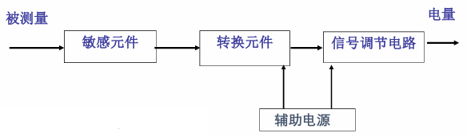

传感器分类有多种方式：

- 按输入量分类：位移、速度、温度、压力等

  常见的被测物理量有机械量（长度、厚度、位移、速度、加速度、旋转角、转速、质量、重量、力、压力、真空度、力矩、风速、流速、流量），声学量（声压、噪声），磁学量（磁通、磁场），热学量（温度、热量、比热），光学量（亮度、色彩）

- 按工作原理分类：应变式、电容式、电感式、压电式、热电式

- 按物理现象分类：结构型传感器（依靠传感器**结构参数的变化**实现信号转变）、物性型传感器（依靠敏感元件材料**本身物理性质**的变化实现信号变换）

- 按能量关系分类：能量转换型传感器、能量控制型传感器

  能量转换型传感器直接由被测对象输入能量使其工作（如热电偶温度计、压电式加速度计），能量控制型传感器从外部供给能量并由被测量来控制外部供给能量的变化（如电阻应变片）

- 按输出信号分类：模拟式传感器、数字式传感器

### 1.1 静态特性

#### 线性度

静态特性用多项式方程$$y = a_0 + a_1 x + a_2 x^2 + \cdots + a_n x^n$$来表示，$$a_0$$称为零点输出，$$a_1$$称为理论灵敏度/线性灵敏度，其它项系数均为非线性系数。理想的传感器是线性的，输出和输入之间有严格的比例关系，因此会使用直线对实际的特性曲线进行拟合，线性度就是实际特性和拟合特性的差异，定义为：

$$
\gamma_L = \pm \frac{\Delta L_{max}}{y_{FS}}\times 100 \%，其中y_{FS}为满量程，是传感器实际输出的最大值减去最小值
$$

实际特性由校准/标定的方式获得，即采集标准输入（环境标准，设备标准）下的输出并列出数据表格；由小到大的正行程和由大到小的反行程分别进行平均，两个平均后的结果再进行平均，得到实际特性。

获得拟合直线的方式有多种，常用的拟合方式如下

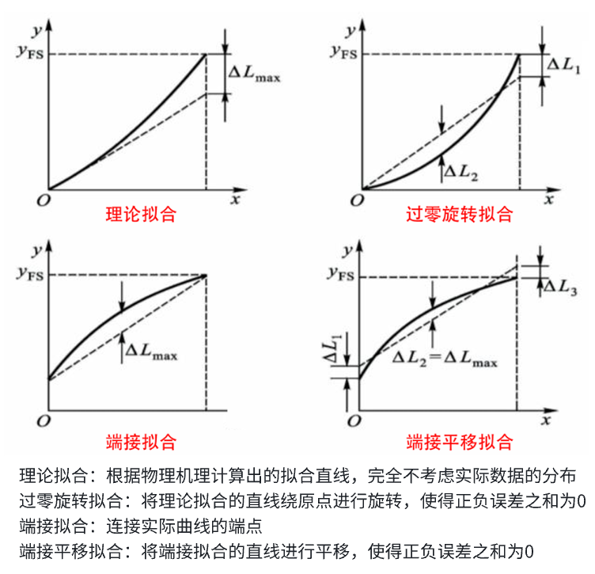

此外还有最小二乘拟合，即使得残差平方和$$SSE$$最小的拟合方式

假设拟合直线$$y = kx + b$$，误差记为$$\Delta i = y_i - (kx_i + b)$$，最小二乘拟合的目标是使得$$\sum_{i=1}^n \Delta i^2$$最小，$$SSE$$对$$k$$和$$b$$求偏导令为 0，可得$$k$$和$$b$$的结果如下：

$$
\begin{aligned}
k=\frac{n\sum_{i = 1}^{n}x_iy_i-\sum_{i = 1}^{n}x_i\sum_{i = 1}^{n}y_i}{n\sum_{i = 1}^{n}x_i^2-(\sum_{i = 1}^{n}x_i)^2}\\
b=\frac{\sum_{i = 1}^{n}x_i^2\sum_{i = 1}^{n}y_i-\sum_{i = 1}^{n}x_i\sum_{i = 1}^{n}x_iy_i}{n\sum_{i = 1}^{n}x_i^2-(\sum_{i = 1}^{n}x_i)^2}\\
\end{aligned}
$$

注意：以上的拟合方式，均仅适用于传感器的非线性不明显的情况，如果传感器特性呈现明显非线性，则可以使用分段拟合、软件打表等方式进行拟合

#### 迟滞

正行程和反行程输入-输出曲线不重合，即输入的方向不同导致输出特性也不同的现象，属于系统误差。传感器机械结构的磨损、数据延迟等都可能导致迟滞现象

$$
\gamma_H = \pm \frac{1}{2}\frac{\Delta H_{max}}{y_{FS}}\times 100\%
$$

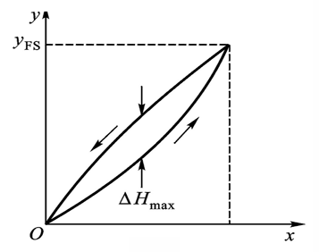

#### 重复性

传感器输入按同一方向作全量程连续多次变动时所得特性曲线不一致的程度，属于偶然误差。偶然误差越小，复现性越强。重复性可以针对单个测点或针对全量程进行评价。

单个测点重复性的定义基于标准差，标准差可以表征数据的分散程度：

$$
\begin{aligned}
&\xi_R = \frac{\sigma\cdot a}{y_{FS}}，\sigma为标准差，a为置信概率\\
&\sigma = \sqrt{\frac{\sum_{i=1}^n(x_i - \overline{x})^2}{n - 1}} \quad (注意是有限次测量，分母为n-1)\\
\end{aligned}
$$

全量程下的重复性定义为正反行程所有测点中最大误差与满量程的比值

$$
\gamma_R = \pm \frac{\Delta R_{max}}{y_{FS}}\times 100\%
$$

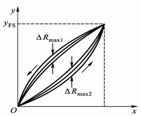

#### 灵敏度与灵敏度误差

灵敏度定义为输出的变化量与引起该变化量的输入变化量之比，实质上就是输出——输入特性曲线上各个点的斜线斜率，表征了传感器对微小变化的敏感程度

$$
k = \frac{\Delta y}{\Delta x}
$$

显然，线性传感器的灵敏度为常数，非线性传感器的灵敏度为变量，传感器要在灵敏度较高的范围内使用。

灵敏度受到温度的影响，因此也存在灵敏度误差，定义为

$$
\gamma_s = \frac{\Delta k}{k}\times 100\%
$$

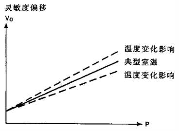

#### 分辨率和阈值

事实上，传感器的实际输出曲线是离散的阶梯状，阶梯对应的输入量的范围就是分辨能力，只有超过这个范围，输出量才会发生改变。分辨率就是传感器能检测到的最小输入增量，阈值是指在输入零点附近的分辨率。

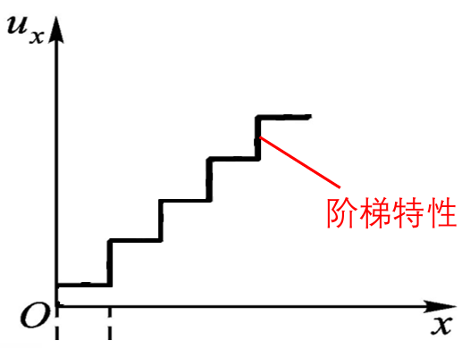

灵敏度是传感器输入——输出特性曲线的斜率，是较为宏观的指标；而分辨率是描述这种阶梯状曲线中阶梯宽度的，是较为微观的指标

#### 稳定性和温度稳定性

稳定性即传感器在长时间工作情况下输出量发生的变化，有时也用标定周期/校准周期来表示，在标定周期内可以保证传感器性能。材料和元器件是影响稳定性的两个主要因素。温度稳定性即传感器在外界温度变化情况下输出量发生变化的现象，用温度误差系数$$\alpha$$定量描述这一指标，即温度发生 1℃ 变化时输出的改变量。

其它抗干扰能力，如抗振动、抗冲击等

#### 静态误差

综合以上单项误差指标得到静态误差（主要综合前面四项），指的是传感器在全量程内任一点的输出值与理论输出值的偏离程度。

综合的方法有：

- 均方误差（即假设各项误差互不影响）：线性度和迟滞属于系统误差、重复性属于偶然误差，理论上讲两者不能简单地直接叠加

  $$
  \delta = \pm \sqrt{\gamma_L^2 + \gamma_H^2 + \gamma_R^2 + \gamma_S^2}
  $$

- 求标准差（将拟合直线与实际曲线在各测点的误差看作随机分布）：用标准差表示
  $$
  \sigma = \sqrt{\frac{1}{n-1}\sum_{i=1}^n(\Delta y_i)^2}
  $$

注：几种常用的统计指标

- 均方根/方均根/有效值（Root Mean Square）：$$x_{rms} = \sqrt{\frac{\sum_{i=0}^n{x_i^2}}{n}}$$
- 均方误差（Mean Square Error）：$$MSE = \frac{1}{N}\sum_{i=1}^N(observed_t - predicted_t)^2$$

### 1.2 动态特性

传感器动态特性地数学模型由微分方程或传递函数描述，分析方式和性能指标与自控原理中的完全一致，如固有频率就是一种动态特性

$$
\begin{aligned}
&a_n\frac{\text{d}^ny}{\text{d}t^n} + a_{n-1}\frac{\text{d}^{n-1}y}{\text{d}t^{n-1}} + \cdots + a_1\frac{\text{d}y}{\text{d}t} + a_0 y \\= &b_m\frac{\text{d}^mx}{\text{d}t^m} + b_{m-1}\frac{\text{d}^{m-1}x}{\text{d}t^{m-1}} + \cdots + b_1\frac{\text{d}x}{\text{d}t} + b_0 x\\
G(s) = &\frac{Y(s)}{X(s)} = \frac{b_m s^m + b_{m-1}s^{m-1} + \cdots + b_1 s + b_0}{a_n s^n + a_{n-1}s^{n-1} + \cdots + a_1 s + a_0}
\end{aligned}
$$

常见传感器地数学模型只有三种，即零阶环节、一阶环节和二阶环节。零阶环节是理想的传感器，输出与输入有严格地比例关系且无延迟；一阶环节的关键参数为时间常熟$$\tau$$，决定了传感器的响应速度；二阶环节的关键参数为无阻尼固有频率$$\omega_n$$和阻尼比$$\xi$$（阻尼固有频率$$\omega_d = \sqrt{1-2\xi^2}\omega_n$$），根据阻尼比和 1 的相对大小，分为零阻尼、欠阻尼、临界阻尼和过阻尼几种状态。

时域性能指标包括时间常数$$\tau$$、上升时间$$t_r$$、响应时间$$t_s$$、超调量$$M\%$$

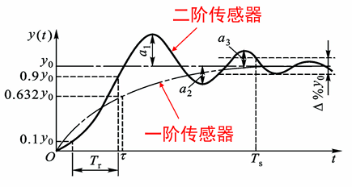

频域性能指标包括幅频特性$$A(\omega)$$和相频特性$$\phi(\omega)$$：阻尼比小于 1 时，在$$\omega$$接近$$\omega_n$$时存在谐振峰，实践表明当$$\xi \ge 0.707$$时可以基本抑制谐振；另外，在频率特性曲线中的平坦区域使用传感器才能保证其灵敏度为常数

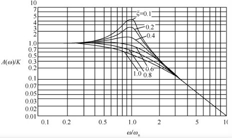

设计传感器应该设计在欠阻尼状态，较快响应且具有较宽的线性工作范围。一般来说，$$\xi$$取 0.6~0.8 可以兼顾系统的稳定性和响应灵敏度，认为$$\xi=0.707$$为最佳阻尼比。$$\omega_n$$由传感器内部构造决定，$$\omega_n$$越高，系统达到稳定状态的速度越快，传感器的工作频率也越高，工作频带也就越宽。传感器的信号频率/工作频率$$\omega$$应低于系统固有频率$$\omega_n$$的 3-5 倍，以使系统对检测信息的变换保持良好的线性特征（工作频率远离输入频率）。

补充：低通传感器和高通传感器

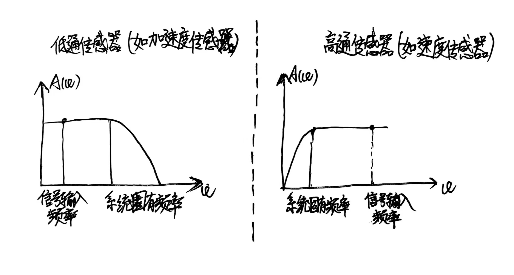

## 第 2 章 电阻式传感器

电阻式传感器有电位器式（测量位移）和应变片式（测量力）两种。

### 2.1 电位器式传感器

电位器有绕线式和旋转式两种，前者测量线位移后者测量角位移，两者原理和功能完全相同，下面以绕线式为例进行分析

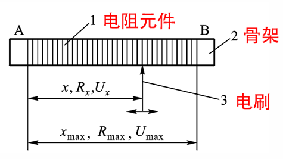

按行程和电阻的关系也可分为线性电位器和非线性电位器两种。线性传感器对组成结构的要求包括：骨架截面处处相等、电阻丝绕线节距（每匝线圈之间的间距）处处相等、金属丝的电阻率和横截面积处处相等。使用非线性电位器的原因有二：一是为了刻意制造某种函数，如指数函数、对数函数等；二是为了补偿仪器仪表本身的非线性特征，使得整体的输出呈线性特征。

#### 基本特性

显然，电位器式传感器需要接在相应的测量电路中使用，测量电路对传感器有输入阻抗的影响。当输入阻抗为无穷大时，传感器特性称为空载特性，是理想传感器的输入输出特性：

$$
R_x = \frac{x}{x_{max}}R_{max} \quad U_x = \frac{x}{x_{max}}U_{max}
$$

线性电位器的灵敏度：

$$
\begin{aligned}
&k_R = \frac{2(b+h)\rho}{At} \quad (电阻灵敏度) \\
&k_U = \frac{2(b+h)\rho}{At} I \quad (电压灵敏度) \\
&A为金属丝截面积，t为节距
\end{aligned}
$$

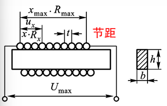

非线性电位器的灵敏度：

$$
k_u = \frac{\text{d}U_x}{\text{d}x} = \frac{2(b+h)\rho}{At}I \quad (电压灵敏度)
$$

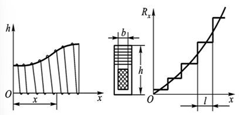

可改变节距$$t$$或设计成变骨架式电位器$$h = \frac{At}{2\rho I}\left( \frac{\text{d}U_x}{\text{d}x} \right) -b$$

#### 阶梯特性

即使是线性电位器，从微观结构的角度分析，由于线圈是一匝一匝缠绕的，因此存在阶梯特性

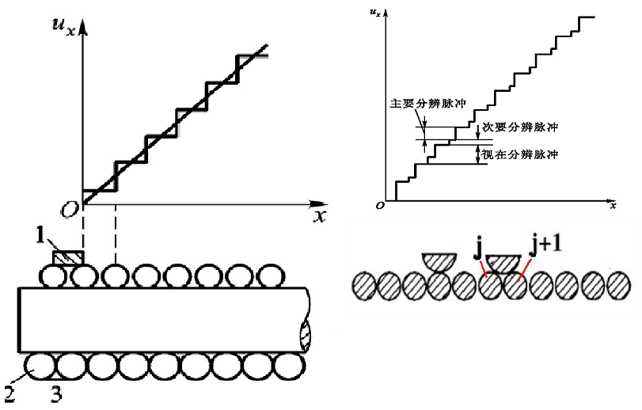

在理想阶跃特性曲线中，这种阶跃值称为视在分辨脉冲$$\Delta U = \frac{U_{max}}{N}$$，$$N$$为匝数。在实际的阶梯特性中，由于电枢短接两匝线圈会使得匝数减一，故实际的阶跃还有次要分辨脉冲

$$
\Delta U_n = \frac{U_{max}}{n-1}j - \frac{U_{max}}{n}j = U_{max}\left( \frac{1}{n-1} - \frac{1}{n} \right)j
$$

评价这种阶梯特性的指标如下：

$$
\begin{aligned}
&阶梯误差：:r_j = \pm \frac{\frac{1}{2}\cdot\frac{U_{max}}{N}}{U_{max}} = \pm\frac{1}{2N}\\
&行程分辨率:e_{by} = \frac{\frac{x_{max}}{N}}{x_{max}} \times 100\% = \frac{1}{N} \times 100 \%\\
&电压分辨率:e_{ba} = \frac{\frac{U_{max}}{N}}{U_{max}} \times 100\% = \frac{1}{N} \times 100 \%\\
\end{aligned}
$$

除了电位器本身结构造成的误差外，制造时的工艺误差也可能带来非线性特征，如：电阻丝的电阻率和直径不均匀、骨架偏离规定的几何尺寸、节距不均匀、电刷接触点的抛光误差等。

#### 负载特性

当不能忽略测量电路输入阻抗带来的影响时，需要分析负载特性

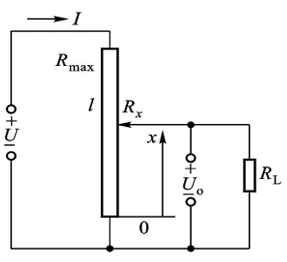

显然，根据$$R_x$$与$$R_L$$并联再与$$R_{max}-R_x$$串联的分压关系：

$$
\begin{aligned}
U_o &= \frac{\frac{R_xR_L}{R_x + R_L}}{\frac{R_xR_L}{R_x + R_L}+R_{max}-R_x}U\\
&= \frac{R_xR_L}{R_LR_{max}+R_xR_{max} - R_x^2}U\\
&=\frac{r}{1+rm(1-r)}U\\
其中r &= \frac{R_x}{R_{max}}(电阻相对变化)\\
m&=\frac{R_{max}}{R_L}(负载系数)
\end{aligned}
$$

由此可作出电位器的负载特性曲线族，当$$m=0$$时，为空载特性曲线，$$U_L$$与$$U$$成线性关系

负载输出$$U_L = \frac{r}{1+rm(1-r)}U_{max}$$，空载输出$$U_0 = rU_{max}$$，将二者进行比较得到负载误差

$$
\begin{aligned}
\delta_L &= U_0 - U_L \quad (绝对量)\\
\delta_L &= \frac{U_0 - U_L}{U_0} = 1-\frac{U_L}{U_0} = 1-\frac{1}{1+rm(r-1)}
\end{aligned}
$$

由此可作出电位器的负载误差曲线，显然$$r=0.5$$时误差达到极大值，$$\delta_L = 1-\frac{1}{1+\frac{1}{4}m}$$，根据此式从要求的负载误差范围得出测量电路负载和电位器电阻值的关系，例如要求$$\delta_L < 0.01$$，则$$R_L > 25R_{max}$$

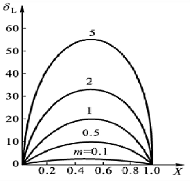

#### 特点

电位器设计的目标是噪音小、非线性小、分辨率高、稳定性好，对各个组成部分有对应的要求

- 电阻丝：电阻率高，电阻温度系数小，耐腐蚀，耐磨、与铜接触电势小。选用康铜（温度系数小）、镍铬（电阻率大）、镍铬铁合金（卡玛丝，温度系数小且电阻率大，但接触电阻大，需要电刷压在电阻丝上）、铂铱合金（化学稳定性好）等材料
- 电刷：抗氧化，接触电势小，噪声低，与电阻丝硬度相近或偏高，具有一定接触压力。选用银、铂铱合金、铂铑合金等材料
- 骨架：膨胀系数与金属丝相近（避免影响应变特性），绝缘性好，形状稳定，散热好。选用陶瓷、酚醛树脂、工程塑料等材料

电位器配合齿轮齿条可侧线位移角位移，配合弹性敏感元件可测压力，配合惯性质量块、弹簧和阻尼器构成的三自由度二阶系统可测加速度速度位移

电位器式传感器的特性有

- 结构简单、成本低
- 稳定性好、线性度高
- 输出信号大
- 准确度高(0.05%)
- 只能在低频工作（电刷滑动）
- 要求输入能量大
- 寿命短（电刷摩擦）
- 电噪声大

精密电位器的制造难点主要在电阻丝排线的均匀绕制上，依靠控制主轴旋转和排线机构进给的联合控制，使得主轴电机每转动一圈，排线机构就驱动骨架移动一个线径的距离。排线机构的速度可以根据主轴的速度调整，以保证移动量精确。

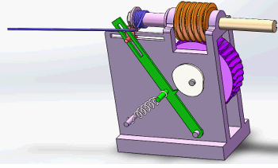

### 2.2 应变片式传感器

应变片式传感器的敏感元件是金属箔片，也称为敏感栅。应变片配合弹性敏感元件可以测量位移和扭矩等。

#### 应变效应

电阻两端受力导致阻值发生变化的现象称为应变效应

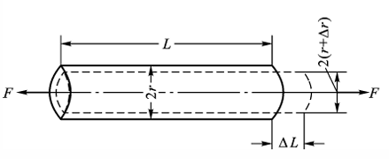

$$
\begin{aligned}
R &= \frac{\rho l}{S}\\
\text{d}R &= \frac{\rho}{S}\text{d}l + \frac{l}{S}\text{d}\rho - \frac{\rho l}{s}\text{d}S\\
\frac{\text{d}R}{R} &= \frac{\text{d}\rho}{\rho} + \frac{\text{d}l}{l} - \frac{\text{d}S}{S}\\
\frac{\Delta R}{R} &= \frac{\Delta l}{l} + \frac{\Delta \rho}{\rho} - \frac{\Delta S}{S}\\
&= \frac{\Delta l}{l} + \frac{\Delta \rho}{\rho} - 2\frac{\Delta r}{r}
\end{aligned}
$$

材料力学知识补充：（注意这里的$$\mu$$往往是试件的）

$$
\begin{aligned}
\varepsilon &= \frac{\Delta l}{l} \quad (轴向应变/横向应变)\\
\varepsilon_r &= \frac{\Delta r}{r} \quad (径向应变)\\
在弹性范围内: \varepsilon_r &= -\mu \varepsilon,其中\mu为材料应变系数/泊松系数\\
\frac{\Delta \rho}{\rho} &= \pi_e E \varepsilon,其中\pi_e为压阻系数,E为弹性模量\\
\varepsilon &= \frac{\sigma}{E} = \frac{F}{SE}，其中\sigma为应力，相当于物理中的压强
\end{aligned}
$$

将应变现象式子简化如下，其中第一项描述了形变效应，第二项描述了压阻效应。金属材料以形变效应为主，半导体材料以压阻效应为主，在工程上可忽略次要影响因素。（注意这里的$$\mu$$是应变片的）

$$
\frac{\Delta R}{R} = (1+2\mu)\varepsilon + \pi_e E \varepsilon = (1 + 2\mu +  \pi_e E)\varepsilon
$$

定义灵敏系数如下，描述了单位形变所引起的电阻相对变化：

$$
K = \frac{\Delta R}{\varepsilon R} = 1 + 2\mu +  \pi_e E
$$

金属材料的$$K$$在 1.7-3.6，半导体材料的$$K$$在 100 左右，但半导体材料的阻值和灵敏系数受温度影响较大，金属材料这两个参数的温度稳定性好。本课程以金属材料为例讨论，忽略压阻效应。

#### 结构材料

应变片式传感器的结构由敏感栅、基底（绝缘，粘贴）和盖层（防潮防尘）构成，敏感栅中，与主应力方向一致的称为纵栅，与主应力方向垂直的称为横栅。敏感栅有丝式和箔片式，丝式由金属丝反复缠绕而成（R 大且接触点小）。

箔片式由光化学腐蚀或精密冲压形成，可获得较为复杂的敏感栅图案（可有多个敏感栅轴向），适用于主应力方向未知的情况。箔片式由于横栅面积大，产生的横向效应小（横向效应是指，应变片受力时，垂直于受力方向会产生与主应力方向相反的应变，从而产生削弱电阻变化，使得灵敏度降低的现象）。此外，箔片式的外形薄，利于应变传递；材质柔软可用于曲面应力测量

对敏感栅材料的要求

- 灵敏系数大，在较大应变范围恒定
- 电阻率高（$$\Delta R = K \varepsilon R$$，电阻大灵敏度高）
- 电阻温度系数小（$$\Delta R_t$$小，受温度影响小）
- 机械强度高，易于拉丝与辗薄
- 与其它金属的接触电势小

常用材料有：康铜、镍铬合金、镍铬铁合金、贵金属

#### 主要特性

- 灵敏系数（应变片的灵敏系数受结构影响，会略小于应变片的灵敏系数，一般由实验测定）$$K = \frac{\frac{\Delta R}{R}}{\varepsilon} < K_0$$

- 横向效应：$$\Delta R = \Delta R_x - \Delta R_y$$

- 温度效应：电阻的变化来自应变和温度变化两部分，由温度变化引起的又细分为两部分，一是由电阻温度系数引起的，二是由应变片和试件膨胀系数不同造成附加形变引起的

  $$
  \begin{aligned}
  &\frac{\Delta R}{R} = \left(\frac{\Delta R}{R}\right)_\varepsilon + \left(\frac{\Delta R}{R}\right)_t\\
  &\Delta l_s = \beta_s \Delta t l \quad \Delta l_g = \beta_g \Delta t l\\
  &\varepsilon' = \frac{\Delta l}{l} = (\beta_g - \beta_s)\Delta t\\
  &\left(\frac{\Delta R}{R}\right)_{t_2} = K\varepsilon' = K(\beta_g - \beta_s)\Delta t \\
  &\left(\frac{\Delta R}{R}\right)_t = \left(\frac{\Delta R}{R}\right)_{t_1} + \left(\frac{\Delta R}{R}\right)_{t_2} = \alpha_t \Delta t + K(\beta_g - \beta_s)\Delta t\\
  &\varepsilon_t = \frac{\left(\frac{\Delta R}{R}\right)_t}{K} = \frac{\alpha_t \Delta t}{K} + (\beta_g - \beta_s)\Delta t \quad (虚假应变)\\
  &e_t = \frac{\varepsilon_t}{\varepsilon} \times 100 \% \quad (温度误差)
  \end{aligned}
  $$

- 迟滞、零飘（无输入时使出波动）、蠕变（输入不变时输出波动）
- 疲劳寿命（焊接影响疲劳寿命）、绝缘电阻、动态响应

#### 直流电桥

补充：直流电桥相关知识

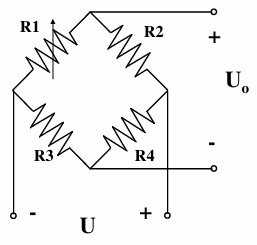

直流电桥的平衡条件为：相对桥臂之积相等 / 相邻桥臂电阻比值相等（可以假设输入电压负极处为零电位，根据串联分压原理计算出输出电压两端点位，从而得到电位差）

$$
\begin{aligned}
&U_{o}=\frac{R_{1}}{R_{1} + R_{2}}U-\frac{R_{3}}{R_{3} + R_{4}}U=\frac{R_{1}R_{4}-R_{2}R_{3}}{(R_{1}+R_{2})(R_{3}+R_{4})}U\\
&故R_{1}R_{4}=R_{2}R_{3} \quad 或 \quad \frac{R_{1}}{R_{2}}=\frac{R_{3}}{R_{4}}
\end{aligned}
$$

定义桥臂比$$n = \frac{R_{2}}{R_{1}}$$，单臂电桥的电压灵敏度（$$R_1$$变化为$$R_1 + \Delta R_1$$代入式子）：

$$
\begin{aligned}
输出电压:U_{o}&=\frac{(R_{1}+\Delta R_{1})R_{4}-R_{2}R_{3}}{(R_{1}+\Delta R_{1}+R_{2})(R_{3}+R_{4})}U\\
&= \frac{\frac{R_{4}}{R_{3}}\frac{\Delta R_{1}}{R_{1}}}{(1 + \frac{R_{2}}{R_{1}}+\frac{\Delta R_{1}}{R_{1}})(1+\frac{R_{4}}{R_{3}})}U\\
&\approx\frac{n}{(1 + n)^{2}}\frac{\Delta R_{1}}{R_{1}}U\\
电压灵敏度:K_{u}&=\frac{U_{0}}{\Delta R_1/R_1}=\frac{n}{(1 + n)^{2}}U
\end{aligned}
$$

由上式看出，当$$n=1$$时（此时称为等臂电桥），灵敏度取得极大值$$K = \frac{1}{4}U$$；想要提高灵敏度可以适当升高电压，但要注意电压升高电流增大发热造成的温升（一般将电流控制在 25mA 以下）

上式的约等于处引入了非线性误差：

$$
\begin{aligned}
&理想输出 \quad U_{o}'=\frac{1}{4}\frac{\Delta R_{1}}{R_{1}}U\\
&实际输出 \quad U_{o}=\frac{\frac{\Delta R_{1}}{R_{1}}}{4(1+\frac{1}{2}\frac{\Delta R_{1}}{R_{1}})}U\\
&非线性误差 \quad \delta=\frac{U_{o}-U_{o}'}{U_{o}'}=-\frac{1}{2}\frac{\Delta R_{1}}{R_{1}}
\end{aligned}
$$

使用恒流源供电的电桥可以改善非线性误差：（实际输出中，分母系数由$$\frac{1}{2}$$变为$$\frac{1}{4}$$）

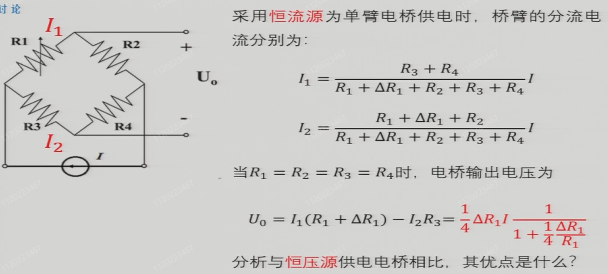

上述模式被称为工作在小偏差不平衡电桥的工作模式，与不平衡电桥相对应的还有平衡电桥，其中$$R_1$$为应变片电阻，$$R_2$$为可调电阻，调节$$R_2$$使得电桥平衡（检流计读数为 0）。这种方式由于需要人为将电桥调平衡，故只适用于静态测量

$$
\frac{R_1 + \Delta R_1}{R_2 + \Delta R_2} = \frac{R_3}{R_4}
$$

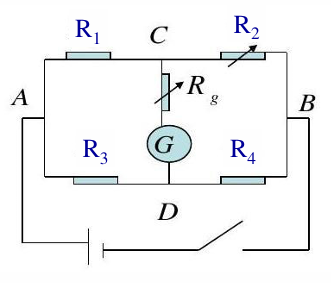

#### 基于电桥的误差补偿

为了补偿温度带来的误差，需要设计补偿

一种是从结构上进行补偿，有单丝自补偿法和组合式自补偿法

单丝补偿法即通过调节参数匹配，使$$\alpha_t = -k(\beta_g - \beta_s)$$。控制合金成分和退火温度可以控制$$\alpha_t$$，这种方法的温度适用范围有限，且材料通用性差。组合式自补偿法即串接不同金属丝，使得$$\Delta R_1 = -\Delta R_2$$，只需$$\frac{\alpha_1}{\alpha_2} = -\frac{R_2}{R_1}$$即可

另一种从外部电路进行补偿，由于电阻变化值非常小，将应变片作为电阻接入电桥，将应变转化为电学量进行测量

四个电桥电阻均会受到温度影响

$$
\begin{aligned}
U_{o}&=\frac{\frac{R_{2}}{R_{1}}}{(1 + \frac{R_{2}}{R_{1}})^2}\left(\frac{\Delta R_{1}}{R_{1}}-\frac{\Delta R_{2}}{R_{2}}+\frac{\Delta R_{4}}{R_{4}}-\frac{\Delta R_{3}}{R_{3}}\right)(1 - \eta)U\\
\eta&=\frac{1}{1+\frac{(1 + \frac{R_{2}}{R_{1}})}{\frac{\Delta R_{1}}{R_{1}}+\frac{\Delta R_{3}}{R_{3}}+\frac{R_{2}}{R_{1}}\left(\frac{\Delta R_{2}}{R_{2}}+\frac{\Delta R_{4}}{R_{4}}\right)}}U \\
&\frac{\Delta R_{i}}{R_{i}}\ll 1时，\eta = 0\\
U_{o}&=\frac{\frac{R_{2}}{R_{1}}}{(1 + \frac{R_{2}}{R_{1}})^2}\left(\frac{\Delta R_{1}}{R_{1}}-\frac{\Delta R_{2}}{R_{2}}+\frac{\Delta R_{4}}{R_{4}}-\frac{\Delta R_{3}}{R_{3}}\right)U\\
&=\frac{n}{(1 + n)^2}\left(\frac{\Delta R_{1}}{R_{1}}-\frac{\Delta R_{2}}{R_{2}}+\frac{\Delta R_{4}}{R_{4}}-\frac{\Delta R_{3}}{R_{3}}\right)U\\
对于等臂电桥:U_o
&=\frac{1}{4}\left(\frac{\Delta R_{1}}{R_{1}}-\frac{\Delta R_{2}}{R_{2}}+\frac{\Delta R_{4}}{R_{4}}-\frac{\Delta R_{3}}{R_{3}}\right)U
\end{aligned}
$$

从上式可得：输出电压正比于相对桥臂电阻变化率之和，相邻桥臂电阻变化率之差

因此可以在相邻桥臂处粘贴补偿应变片但不施加应变，抵消掉工作应变片的温度误差

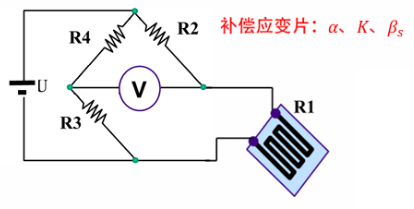

$$
\begin{aligned}
\frac{\Delta R_{1}}{R_{1}}&=\left(\frac{\Delta R_{1}}{R_{1}}\right)_{\varepsilon}+\left(\frac{\Delta R_{1}}{R_{1}}\right)_{t}\\
\frac{\Delta R_{2}}{R_{2}}&= 0+\left(\frac{\Delta R_{2}}{R_{2}}\right)_{t}\\
U_{o}&=\frac{1}{4}\left(\left(\frac{\Delta R_{1}}{R_{1}}\right)_{\varepsilon}+\left(\frac{\Delta R_{1}}{R_{1}}\right)_{t}-\left(\frac{\Delta R_{2}}{R_{2}}\right)_{t}+\frac{\Delta R_{4}}{R_{4}}-\frac{\Delta R_{3}}{R_{3}}\right)U\\
&=\frac{1}{4}k\varepsilon U_{i} \quad (只与应变有关，与温度无关)
\end{aligned}
$$

除了进行温度补偿，还可以采用双臂、四臂差动电桥提高测量灵敏度

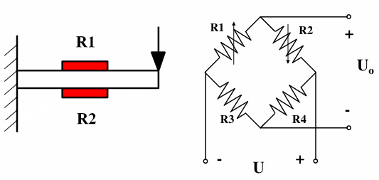

$$
\begin{aligned}
\frac{\Delta R_{1}}{R_{1}}&=\left(\frac{\Delta R_{1}}{R_{1}}\right)_{\varepsilon}+\left(\frac{\Delta R_{1}}{R_{1}}\right)_{t}\\
\frac{\Delta R_{2}}{R_{2}}&=\left(\frac{\Delta R_{2}}{R_{2}}\right)_{-\varepsilon}+\left(\frac{\Delta R_{1}}{R_{1}}\right)_{t}\\
U_{o}&=\frac{1}{4}\left(\left(\frac{\Delta R_{1}}{R_{1}}\right)_{\varepsilon}-\left(\frac{\Delta R_{2}}{R_{2}}\right)_{-\varepsilon}+\frac{\Delta R_{4}}{R_{4}}-\frac{\Delta R_{3}}{R_{3}}\right)U\\
&=\frac{1}{4}(k\varepsilon - k(-\varepsilon))U=\frac{1}{2}k\varepsilon U_{i}
\end{aligned}
$$

#### 测量放大器/仪用放大器

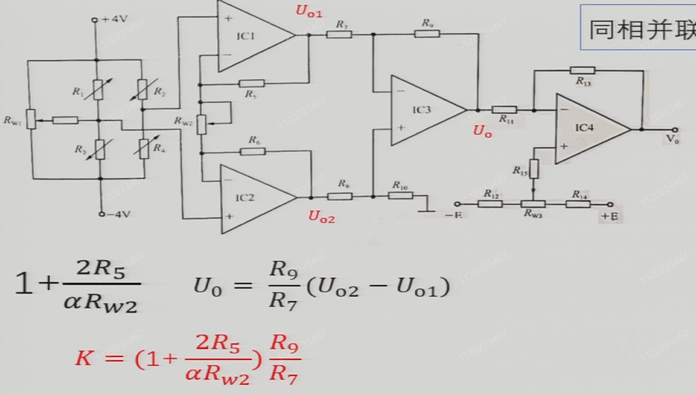

噪声进入系统有差模干扰（干扰信号与有用信号串联叠加后作用到检测输入端的干扰）和共模干扰（同时作用于信号线和地线之间的干扰，由于传感器和设备接地点不同产生地电位差或有强电场/磁场感应，都会产生共模电压）

理论上说，测量电路如果是平衡的，则共模干扰没有影响，但实际电路中测量电路的输入阻抗不对称，导致共模干扰会转化为差模信号

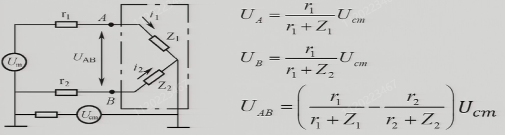

定义共模抑制比$$CMRR = 20\lg\frac{A_d}{\vert A_{cm} \vert}$$，其中$$A_d$$为差模增益，$$A_{cm}$$为共模增益。

解决地环路干扰的措施：减小地线阻抗、切断地环路（单点接地），使用高 CMRR 测量电路

测量放大器的优点是：输入阻抗高、输出阻抗小、增益调节方便、漂移互相补偿、输出无共模电压（CMRR 高）

$$R_{w1}$$用于调节初始状态的电桥平衡。$$R_{w2}$$用于调节运放增益，$$R_{w3}$$用于调节输出失调电压（输入为 0 时将输出电压调 0）

#### 有源单臂测量电桥

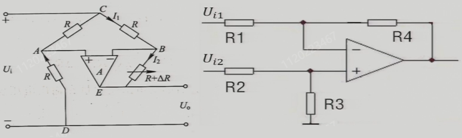

实质是一个比例求差电路

$$
U_{0}=\frac{\frac{R_{3}}{R_{2}}}{\frac{R_{3}}{R_{2}}+1}(1 + \frac{R_{4}}{R_{1}})U_{i2}-\frac{R_{4}}{R_{1}}U_{i1}
$$

假设，某一个$$R$$变为$$R + \Delta R$$

$$
\begin{aligned}
U_{0}&=(1 + \frac{R+\Delta R}{R})\frac{R}{R + R}U_{i}-\frac{R+\Delta R}{R}U_{i}\\
U_{0}&=-\frac{\Delta R}{2R}U_{i}=-\frac{1}{2}K\varepsilon U_{i}
\end{aligned}
$$

因此，相较于前面的普通直流电桥，有源单臂测量电桥是线性的、灵敏度是原来的两倍、输出电阻小负载能力强

#### 应变式加速度传感器

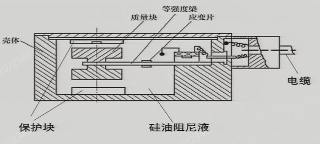

单自由度加速度测量传感器，可测竖直方向加速度，质量块具有加速度后产生力使等强度梁弯曲产生应变

#### 特点

电阻应变片的使用：

1. 目测电阻应变片有无折痕.断丝等缺陷。
2. 用数字万用表测量应变片电阻值大小。同一电桥中各应变片之间阻值相差不得大于 0.5 欧姆
3. 试件表面处理：贴片处置用细纱纸打磨干净，用酒精棉球反复擦洗贴处，直到棉球无黑迹为止。
4. 应变片粘贴：在应变片基底上挤一小滴 502 胶水，轻轻涂抹均匀，立即放在应变贴片位置。
5. 焊线：用电烙铁将应变片的引线焊接到导引线上。
6. 用兆欧表检查应变片与试件之间的绝缘组织，应大于 500M 欧。
7. 保护：用 704 硅橡胶覆于应变片上，防止受潮。

电阻应变片的特点：

- 测量精度高，应变测量误差<1%
- 测量范围宽，几个$$\mu \varepsilon$$到上千$$\mu \varepsilon$$
- 分辨率高，一般$$1\mu \varepsilon$$
- 频率特性好，$$10^{-7}~10^{-10}s$$，(可测几百 kHz)
- 尺寸小，重量轻，对工件的应力分布基本无影响
- 环境适应性强
- 在大应变下，有较大非线性
- 输出信号微弱，抗干扰能力差
- 实际是敏感栅范围的平均应变
- 温度系数较大

#### 不同结构的弹性元件

柱形弹性元件：结构简单、紧凑、承受载荷大（最大$$10^7N$$)

梁式弹性元件：结构简单、应变片易粘贴、灵敏度较高，适用于小载荷。有等截面型梁试件（应变片粘贴位置直接影响应变大小）和等强度梁（应变片粘贴位置不影响应变大小）

承弯膜片：

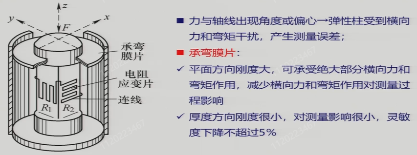

膜片式弹性元件：常用于测量内外压差，周边固定在壳体上

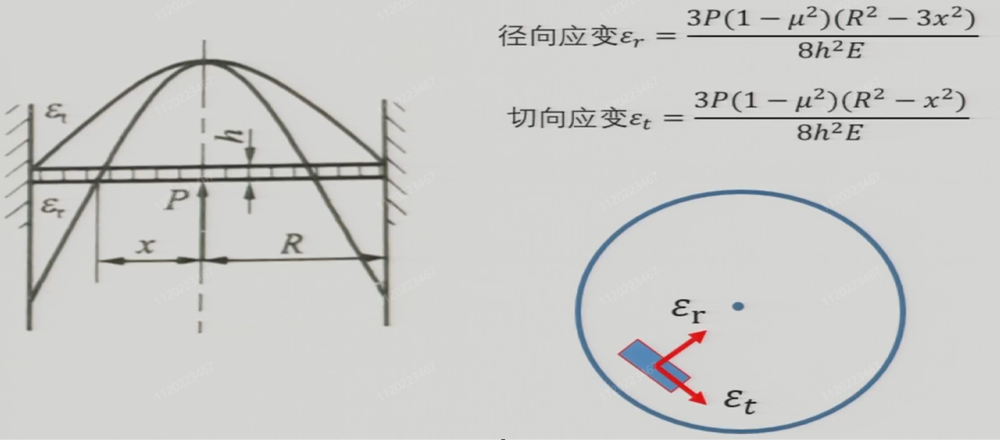

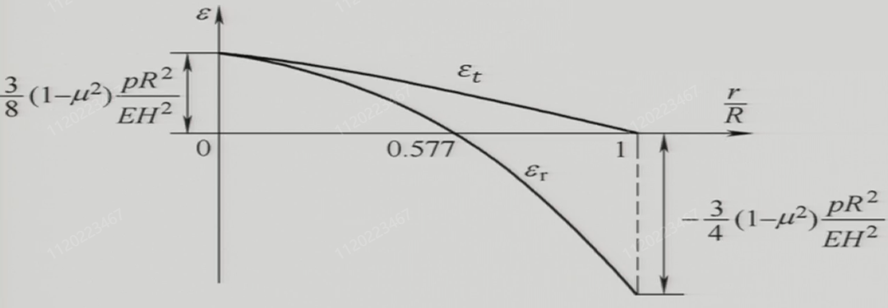

膜片应力分布特点：径向应变在膜片中心$$x=0$$处达到最大拉伸应变，随半径增大逐渐减小，至$$x=\frac{R}{\sqrt{3}}$$时为零，之后变为压缩应变，在边缘$$x=R$$处达到最大压缩应变。切向应变在中心处最大，始终为拉伸应变，随半径增加逐渐减小，至边缘$$x=R$$时降为零。整体表现为中心区域双向拉伸，外围径向应变转为压缩，切向应变始终为拉伸但逐渐减弱。
如果使用两片应变片进行测量，应贴在应力变化较大且能反被测压力变化灵敏度最高的区域，两片应变片均沿径向方向粘贴，一片贴于中心$$x=0$$处，另一片贴于边缘$$x=R$$处，两应变片接入相邻桥臂（中心应变片阻值增大，边缘应变片阻值减小）。

凸轮机构测量转速：（或使用连杆弹簧）

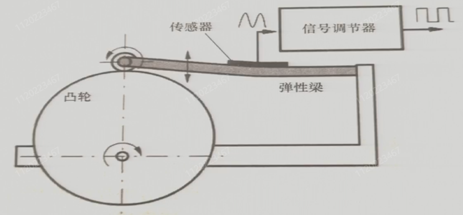

思路：

选则合适的弹性元件：柱状、梁式、膜片式

布置应变片位置：找到应力最大的方向，在此方向和垂直于此方向上粘贴应变片

连接电桥：承受相反应变的应变片放在相邻桥臂、承受相同应变的应变片放在相对桥臂

## 第 3 章 电感式传感器

以磁场作为媒介或利用铁磁体的某些现象，利用线圈自感或互感的变化来测量，核心部分是可变自感或可变互感，主要特征是具有线圈绕组。

### 3.1 自感式传感器

又称为变磁阻式传感器

#### 工作原理

电感值与线圈匝数，线圈形状，导磁材料等都有关

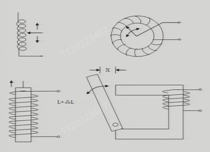

基本原理为：衔铁摆动使得气隙磁阻变化，引起电感值的改变。以典型的单边自感式传感器为例，电感值与结构参数的关系如下，其中$$W$$为线圈匝数，$$\mu_0 = 4\pi \times 10^{-7} H/m$$为真空导磁率，$$S_0$$为空气隙有效截面积，$$l_0$$为空气隙长度。

$$
\begin{aligned}
\Phi &= \frac{WI}{R_m} \quad (\frac{磁动势}{磁阻})\\
R_m &= \sum_{i=1}^n\frac{l_i}{\mu_i S_i} + 2\frac{l_o}{\mu_o S_o} \quad (\mu_i \gg \mu_o)\\
L &= \frac{\Psi}{I} = \frac{W\Phi}{I} = \frac{W^2}{R_m} = \frac{W^{2}\mu_{0}S_{0}}{2l_{0}}
\end{aligned}
$$

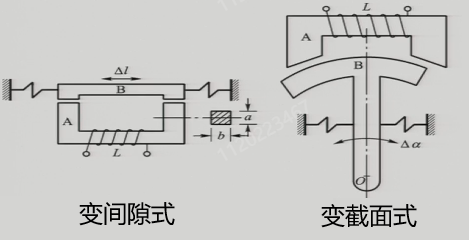

这两种类型传感器的测量范围较小，测量范围较大的有螺线管自感式传感器。

差动自感式传感器：提高测量的线性度和灵敏度、对温度和电压波动进行补偿

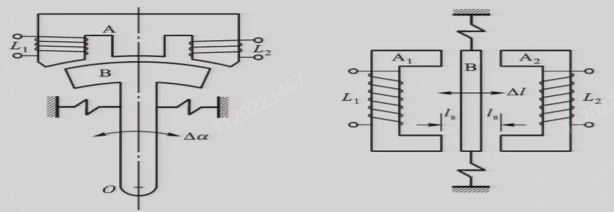

#### 性能指标

- 灵敏度：

  对于变间隙型，$$L$$反比于$$l$$，分析如下：

  $$
  \begin{aligned}
  L&=\frac{A}{l} \quad A = \frac{W^2 \mu_0 S_0}{2}\\
  \Delta L&=L - L_{0}=\frac{A}{l_{0}+\Delta l}-\frac{A}{l_{0}}\\
  &=\frac{A}{l_{0}}\left(\frac{1}{1+\frac{\Delta l}{l_{0}}}-1\right)=L_{0}\left(\frac{1}{1+\frac{\Delta l}{l_{0}}}-1\right)\\
  \Delta L&=-L_{0}\frac{\Delta l}{l_{0}}+L_{0}\left(\frac{\Delta l}{l_{0}}\right)^{2}\frac{1}{1+\frac{\Delta l}{l_{0}}} \approx -L_{0}\frac{\Delta l}{l_{0}}\\
  即&: 灵敏度K = -\frac{L_0}{l_0}\\
  \end{aligned}
  $$

  因此，为了提高灵敏度和减小非线性误差，$$l_0$$和$$\Delta l$$都不能过大。同时，从式子可见，变间隙式传感器的灵敏度和线性度是矛盾的。

  对于差动式，分析如下：

  $$
  \begin{aligned}
  \Delta L_1&=-L_0\frac{\Delta l}{l_0}+L_0\left[\left(\frac{\Delta l}{l_0}\right)^2 - \left(\frac{\Delta l}{l_0}\right)^3 + \left(\frac{\Delta l}{l_0}\right)^4-\cdots\right]\\
  \Delta L_2&=L_0\frac{\Delta l}{l_0}+L_0\left[\left(\frac{\Delta l}{l_0}\right)^2 + \left(\frac{\Delta l}{l_0}\right)^3 + \left(\frac{\Delta l}{l_0}\right)^4+\cdots\right]\\
  \Delta L&=\Delta L_1 - \Delta L_2=-2L_0\frac{\Delta l}{l_0}-2L_0\left(\frac{\Delta l}{l_0}\right)^3\left[1 + \left(\frac{\Delta l}{l_0}\right)^2 + \left(\frac{\Delta l}{l_0}\right)^4+\cdots\right]\\
  \end{aligned}
  $$

  因此，灵敏度和线性度相较于单边型传感器均有所改善。另外差动式还可以实现温度补偿、电压波动补偿等；同时，传感器工作时对衔铁有一定吸引力，单边式传感器克服这种吸引力需要一定能量，双边式由于衔铁两侧受相反方向的吸引力，这种效应也会被抵消一些。

#### 等效电路

电感线圈等效电路如下：使用时根据工作频率考虑等效电路的影响

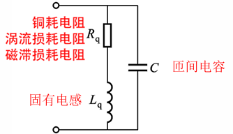

#### 转换电路

转换电路将电感变化转化为电流电压的幅值、频率或相位变化，分别对应调幅、调频、调相电路

- 调幅电路：主要有电桥式和谐振式两种

  （交流）电桥式转换电路的两种实用形式

  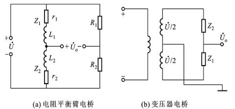

  1. 电阻平衡臂电桥（$$Z_1$$为固定电感，$$Z_2$$变为$$Z_2 + \Delta Z$$）
      $$
      \begin{aligned}
      Z&=r + j\omega L\\
      |Z|&=\sqrt{r^2 + (\omega L)^2}\\
      |\Delta Z|&=\frac{r\Delta r+\omega^2 L\Delta L}{\sqrt{r^2 + (\omega L)^2}}\quad (全微分，求偏导数得到)\\
      \text{品质因数}Q &= \frac{\omega L}{r}\\
      \dot{U}_o&=\left(\frac{Z_2}{Z_1 + Z_2}-\frac{R}{R + R}\right)\dot{U}\\
      &\approx\left(\frac{Z+\Delta Z}{2Z}-\frac{1}{2}\right)\dot{U}=\frac{\Delta Z}{2Z}\dot{U}\\
      |U_o|&=\frac{|\Delta Z|}{|Z|}\cdot\frac{U}{2}\\
      &=\left[\frac{r^2}{r^2 + (\omega L)^2}\frac{\Delta r}{r}+\frac{(\omega L)^2}{r^2 + (\omega L)^2}\frac{\Delta L}{L}\right]\cdot\frac{U}{2}\\
      &=\frac{U}{2(1 + \frac{1}{Q^2})}\left(\frac{1}{Q^2}\frac{\Delta r}{r}+\frac{\Delta L}{L}\right)\quad \\
      &\approx\frac{U}{2}\frac{\Delta L}{L}\quad(\text{当}Q\text{值很高时})\\
      \end{aligned}
      $$
      
  2. 变压器电桥
  
  $$
  \begin{aligned}
  \dot{U}_o&=\frac{Z_1}{Z_1 + Z_2}\dot{U}-\frac{1}{2}\dot{U}\\
  \dot{U}_o&=\left(\frac{Z+\Delta Z}{2Z}-\frac{1}{2}\right)\dot{U}=\frac{\Delta Z}{2Z}\dot{U}\\
  其余&同上
  \end{aligned}
  $$
  
  电桥式调幅电路，输出电压幅值表征位移大小，相位表征位移方向（注意不是输出极性相反）
  
  谐振式调幅电路：串联谐振式调幅电路，令工作电源频率与电路谐振频率相等，此时阻抗最小，次级绕组输出最高的峰值电压。当 L 发生变化时，电路失谐，谐振峰左右移动，阻抗增加，输出电压幅值降低。特点是在小范围内具有高灵敏度
  $$
  f = \frac{1}{2\pi\sqrt{LC}}
  $$
  
  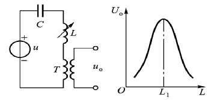
  
- 调频电路

  传感器 L 和固定电容 C 接入一个振荡回路，L 变化时，根据 f 大小测出被测量值

$$
\begin{aligned}
f&=\frac{1}{2\pi\sqrt{LC}}\\
\Delta f&=-\frac{1}{4\pi}(LC)^{-3/2}C\cdot\Delta L=-\frac{f}{2}\cdot\frac{\Delta L}{L}
\end{aligned}
$$

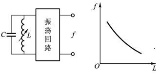

- 调相电路

  原理是传感器电感 L 变化引起输出电压相位$$\varphi$$的变化

  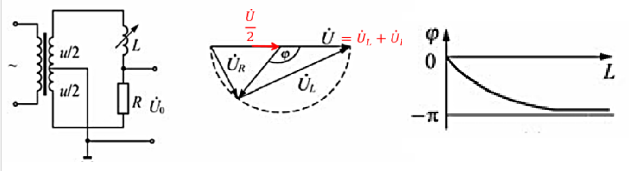

  $$
  \begin{aligned}
  \dot{U} &= \dot{U}_L + \dot{U}_R\\
  \dot{U}_o&=\frac{R}{R + j\omega L}\dot{U}-\frac{1}{2}\dot{U}\\
  &=\frac{R - j\omega L}{R + j\omega L}\cdot\frac{\dot{U}}{2}\\
  \varphi &= \dot{U}_o\text{相角}-\dot{U}\text{相角}=-2\arctan\frac{\omega L}{R}
  \end{aligned}
  $$

  这种结构中，取导数可得$$\Delta L$$与$$\Delta \varphi$$的关系，而幅值不变

$$
\Delta\varphi=\frac{2(\omega L / R)}{1 + (\omega L / R)^2}\cdot\frac{\Delta L}{L}
$$

#### 零点残余电压

差动式自感传感器衔铁在中间位置时，转换电路输出不为零，存在着某个输出值 △U0，整个成了非线性，且在零点附近存在一段死区，工作不灵敏，分辨率降低，这种现象称为零点残余电压。

产生原因：

- 两个传感器不对称（几何尺寸、电气参数、磁路参数)：提高加工精度
- 存在寄生参数：使用时进行屏蔽
- 电源存在高次谐波（因为是针对基波设计的电路）
- 磁路存在非线性：不要使激励电流过大，磁化曲线始终在线性区
- 工频干扰：抗干扰设计

磁化曲线非线性：激磁磁势超过了线性范围，产生的磁通被“削顶”，削顶波即由正弦基波和三次谐波组成

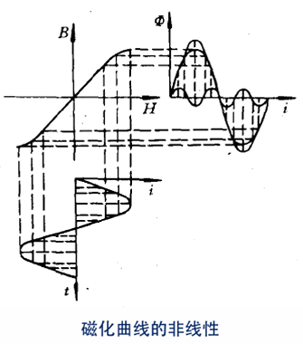

#### 应用

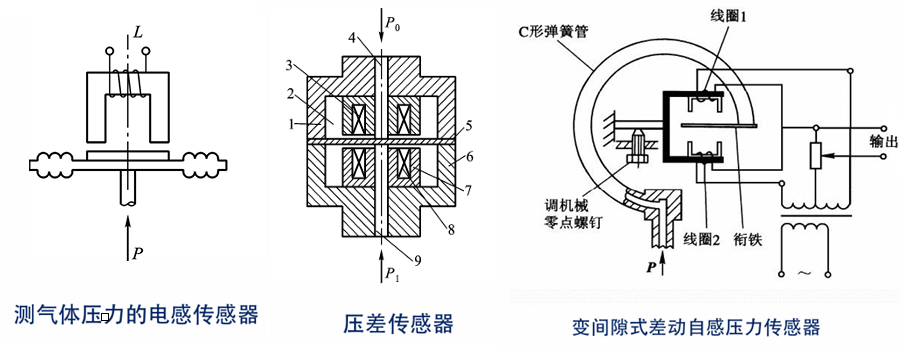

可用于测量涂层厚度，阀门微小位移等

电位器调整零点参与电压（电气调零），螺钉进行机械调零

#### 特点

- 分辨率高，目前可测 0.1 从$$\mu m$$、0.1 角秒
- 测量范围比较小，适用于测量较小位移
- 存在非线性
- 消耗功率较大，尤其是单边式电感传感器
- 需要磁屏蔽：用磁性材料空腔包围自感式传感器，空腔内部不受外界磁场影响
- 限制在磁性材料的居里温度范围（居里点：磁性材料丧失磁性的温度）

### 3.2 变压器式传感器

也称互感式传感器，通过检测互感系数的变化进行测量，简称 LVDT（linear variable differential transformer）

差动变压器结构与差动自感式变压器结构相似，但差动变压器铁芯上绕有疏密程度不同的线圈，上下各为一个变压器，共用中间衔铁形成磁路，衔铁移动引起上下变压器的互感系数发生改变。工业上应用较多的是螺管式差动变压器，螺线管由匝数不同的绕组构成。衔铁在螺线管中移动，使得绕组间的互感系数发生改变。

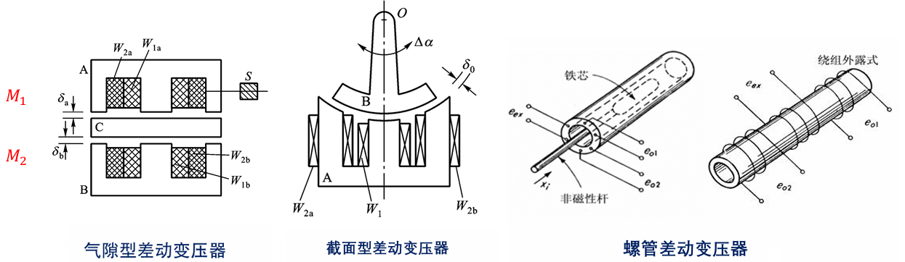

#### 等效电路

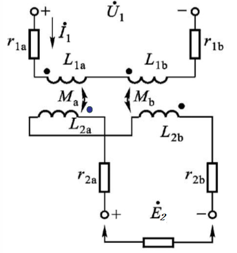

将两个绕组的初级线圈串联（同名端不直接相连），接入交流电源；而输出采用差动输出（同名端直接相连）。左侧为上面部分变压器，右侧为下面部分变压器。衔铁靠近哪一边，对应的互感系数便增大（铁芯有助于建立互感），读取差动输出的电压便可得到位移的方向和大小。

$$
\begin{aligned}
\dot{E}_{2a}&=-j\omega M_a \dot{I}_1\quad\dot{E}_{2b}=-j\omega M_b \dot{I}_1\\
M_a&=\frac{W_{1a}W_{2a}}{R_{ma}}\quad M_b=\frac{W_{1b}W_{2b}}{R_{mb}}\\
Q&=\frac{\omega L}{r}\\
\text{假设：}W_{1a}&=W_{2a}=W_1,\ r_{1a}=r_{1b}=r_1\\
W_{1b}&=W_{2b}=W_2,\ L_{1a0}=L_{1b0}=L_{10}\\
\dot{E}_{2}&=\dot{E}_{2a}-\dot{E}_{2b}=-j\omega\dot{I}_1(M_a - M_b)\\
&=\dot{U}_{1}\cdot\frac{W_{2}}{W_{1}}\cdot\frac{\Delta l}{l_0}\cdot\frac{1 + j\frac{1}{Q}}{1+\frac{1}{Q^{2}}}\\
\vert \dot{E_{2}} \vert &=U_{1}\frac{W_{2}}{W_{1}}\frac{\Delta l}{l_0}\frac{1}{\sqrt{1+\frac{1}{Q^{2}}}}
\end{aligned}
$$

$$
\begin{cases}
\text{当}\omega L_{10}\ll r_1\text{时，}Q\ll1,\text{灵敏度}K = U_1\frac{W_2}{W_1}\frac{1}{l_0}\frac{\omega L_{10}}{r_1}\\
\text{当}\omega L_{10}\gg r_1\text{时，}Q\gg1,\text{灵敏度}K = U_1\frac{W_2}{W_1}\frac{1}{l_0}\\
\end{cases}
$$

由式可见：

- 供电电源要稳定；电源幅值适当提高可提高灵敏度，但要以铁芯不饱和允许温升为条件。
- 增加$$\frac{W2}{W1}$$ 和减小$$l_0$$都能使灵敏度 K 值提高。（$$\frac{W2}{W1}$$影响体积及零点残余电压，一般$$l_0$$为 0.5mm）

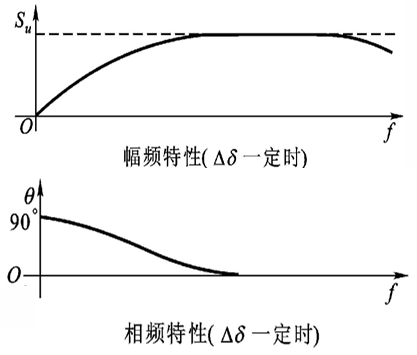

另外，随着频率升高，铁磁材料的铁损增大，K、Q 下降。因此需要找到一个合适的工作频率，一般来说，对于差动变压器式传感器，上下限截止频率限制的范围在 400Hz-10kHz 之间。

#### 测量电路

分析：当输入为正弦波时，输出为以被测量为包络线的调幅波，注意输入反向时，输出相位变化$$180°$$

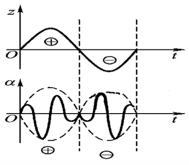

测量电路需要解决的，就是位移方向和大小的测量，因此需要鉴别相位，同时需要消除零点残余电压，一般采用差动整流电路：$$\dot{U}_{0}=\dot{U}_{24}-\dot{U}_{68} $$，输出的$$U_o$$为双极性电压，通过极性就可以判断位移方向。

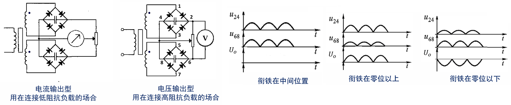

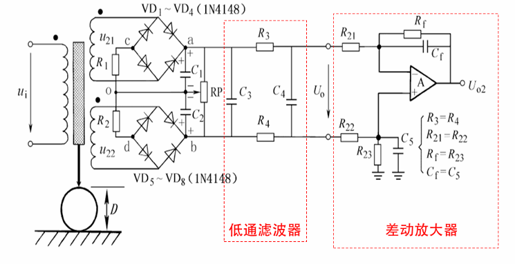

零点残余电压的消除，一方面需要尽量使传感器本身的尺寸和电气参数、磁路参数等很好地对称；另一方面可以通过补偿电路尽可能抵消其影响。调节 R 使得 e_2a 尽可能抵消掉 e_2b

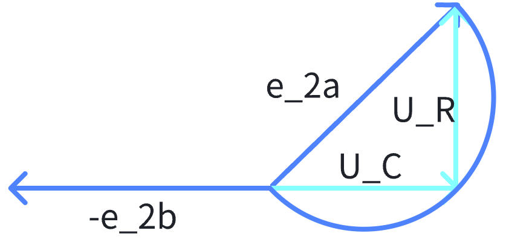

#### 单片式 LVDT 信号调节电路

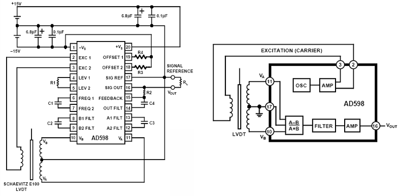

相较于分立元件电路，单片式 LVDT 信号调节电路更加可靠：将 LVDT 的机械位置转换成高精度直流电压

- 适用于多种类型 LVDT：输出电压达 2-24Vrms，电流 12-30mA，能直接驱动 LVDT 初级激磁线圈；接受 LVDT 的次级输出电压低于 100 mVrms
- LVDT 激磁信号频率 20Hz-20kHz
- 采用比值方式解调，这样次级对初级的相移不会影响线路的总性能

传统 LVDT 电路：

1. 产生恒定幅度、恒定频率的激励信号
2. 补偿初级与次级的相位偏移

AD598 采用比值技术：（$$\frac{A-B}{A+B}$$）对温度、输入电压波动等不敏感，相位偏移也不影响

1. 不要求激励信号恒幅、恒频
2. 非同步检测，对初级/次级相位偏移不敏感

#### 应用

### 3.3 涡流式传感器

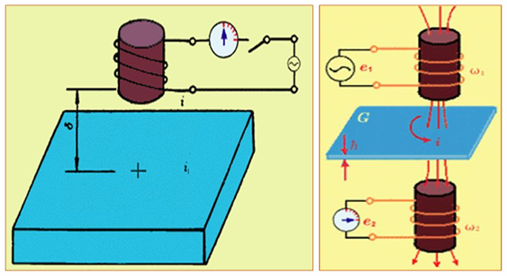

左侧为高频反射式传感器，右侧为低频透射式传感器

#### 高频反射式涡流传感器

线圈的交变电流产生磁场$$\Phi_1$$，磁场$$\Phi_1$$在金属体内产生感生电流/涡流以阻碍$$\Phi_1$$的变化（交流电线圈和金属体之间的互感效应），使得金属体的阻抗发生改变。金属导体作为被测对象，可以利用该性质进行测量。

涡流的大小与线圈尺寸、激励电流大小和频率有关，也与金属电阻率、磁导率、金属与线圈之间的距离等有关

涡流通过反射阻抗作用改变阻抗，将金属体看作一匝闭合短路的线圈

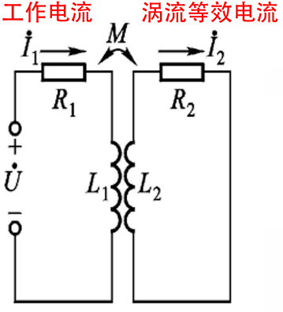

$$
\begin{aligned}
&R_1\dot{I}_1 + j\omega L_1\dot{I}_1 - j\omega M\dot{I}_2 = \dot{U} \\
&R_2\dot{I}_2 + j\omega L_2\dot{I}_2 - j\omega M\dot{I}_1 = 0 \\
&Z = R_1 + R_2\frac{\omega^2 M^2}{R_2^2 + \omega^2 L_2^2}+j\omega\left(L_1 - L_2\frac{\omega^2 M^2}{R_2^2 + \omega^2 L_2^2}\right)
\end{aligned}
$$

其中，$$R_1 + R_2\frac{\omega^2 M^2}{R_2^2 + \omega^2 L_2^2}$$称为等效电阻，$$R_2\frac{\omega^2 M^2}{R_2^2 + \omega^2 L_2^2}$$称为反射电阻；$$L_1 - L_2\frac{\omega^2 M^2}{R_2^2 + \omega^2 L_2^2}$$称为等效电感，$$L_2\frac{\omega^2 M^2}{R_2^2 + \omega^2 L_2^2}$$称为反射电感。对于非磁性材料而言，当金属导体和线圈靠近时，涡流效应使得等效电阻增加，有功损耗增大，同时等效电感减小，无功损耗减小，表现为去磁作用；对于磁性材料而言，靠近过程中自感系数$$L_1$$会显著增大，表现为增磁作用。

显然，两个反射量都是互感系数$$M$$的函数，而$$M$$与线圈和金属导体之间的距离、金属本身的电阻率$$\rho$$以及磁导率$$\mu$$有关，因此，改变间距可测量位移、厚度；改变电阻率可测量温度；改变磁导率可测量硬度。（硬度高，内部应力大，位错密度高，阻碍磁畴运动，使得磁导率下降）

#### 转换电路

- 调幅电路：同前面的电桥和谐振调幅电路

- 调频电路：谐振调幅电路，阻抗变化使得线圈阻值变化，并通过谐振频率的偏移反应在输出信号的幅值上。采用并联谐振的方式，谐振时阻抗最高，对应输出电压最高。当电路谐振频率不等于石英晶振振荡源提供的频率$$f_0$$（也称初始谐振频率）时，称为失谐。

  

  对于磁性材料，随着线圈与金属体的靠近，自感系数升高，谐振频率降低，阻抗降低，输出幅值下降；对于非磁性材料，随着线圈与金属体的靠近，自感系数降低，谐振频率增加，阻抗降低，输出幅值下降。（在$$f = f_0$$处读取输出信号幅值）

#### 低频透射式涡流传感器

一组为工作线圈，另一组为测量线圈，用于测量工作线圈产生的交变感应电动势。在两组线圈之间介入金属导体，金属导体的厚度变化时，导体所受的磁通变化，引起输出的感应电动势相应改变。涡流的贯穿深度随涡流频率变化的关系如下，其中$$\rho$$为导体电阻率，$$\mu_r$$为导体相对磁导率，$$f$$为交变磁场频率

$$
\begin{aligned}
h &= 5030\sqrt{\frac{\rho}{\mu_r f}}\\
E &= kU_i e^{-\frac{d}{h}}\\
\end{aligned}
$$

可见，交变磁场频率越低，测量范围越宽；为了测量厚度变化，需要使用低频电源；而测量表面缺陷或是很薄材料的厚度时，使用高频电源。低频的优点在于测量范围宽，高频的优点在于测量灵敏度高。另外，由于温度对电阻率有影响，因此也需要考虑如何进行温度补偿，或设计恒温的工作状态。

#### 涡流的趋肤效应

趋肤效应描述的是电涡流在金属导体内的分布规律：电涡流只存在于金属表面薄层内，形成一个涡流区，涡流区内各处的涡流密度不同，存在径向分布和轴向分布；从俯视图看分布呈圆环状

径向分布上，涡流范围与电涡流线圈的外径有固定的比例关系；轴向分布上，随着与表面距离的增加，涡流密度以指数规律衰减。

#### 涡流式传感器的特点及应用

- 测量位移：主轴轴向位移测量、换向阀位移测量、金属零件热胀冷缩系数测量（可实现非接触式的测量）

  

- 测量振幅：监控主轴径向振动、发动机涡轮叶片振动测量、采用多探头并列测量

  

- 测量转速：$$N = \frac{f}{n}\times 60$$，其中$$n$$为旋转体齿数/槽数，$$N$$为被测轴的转速（rpm）

  

- 测量温度：

  

#### 无损检测技术

在不损坏被检测物体内部结构的前提下，应用物理的方法，检测物体内部或表面是否存在不连续性（即缺陷），从而判断被检测物体是否合格。

焊件的主要缺陷有：

- 裂纹：熔焊冷却时因热应力产生。
- 未焊透：熔焊金属与基体材料未熔合。
- 气孔：空气停留在金属内部。
- 夹渣：熔焊形成的氧化物停留在焊缝内部。

无损检测的主要方法有：

- 射线检测：使用 X 射线，对环境和人体有潜在危害，在特定环境下才能使用，测量时间长，不适合在线方式；造价和设计成本较高
- 超声检测：可对材料内部进行检测，对外部噪声敏感
- 磁粉检测：针对铁磁材料，孔隙产生漏磁，磁粉显示磁场分布状态，判断内部或表面缺陷
- 渗透检测：涂着色液，只适用于材料表面缺陷检测，操作简单，结果直观
- 涡流检测：应用最为广泛、自动化程度最高

五种无损检测方法比较如下：

#### 涡流检测

涡流检测有多用途检测，任何能够反应到导电性能上的缺陷都可以通过涡流效应反应出来进行测量，如：化学成分、试件尺寸、内应力、表面裂纹、凹坑、热处理情况等。检测线圈的基本形式包括穿过式、点探头式和内插式。

涡流检测技术的特点有：

1. 检测速度快，易于实现自动化
2. 表面、亚表面检测灵敏度高（由于趋肤效应的存在，涡流只分布在一定深度范围内）
3. 能在高温状态下进行检测（不存在居里点的温度限制，因为探头是非磁性材料）
4. 多用途的检测技术（只要能反应到导电性能上即可）

涡流检测的有以下三种方法：

- 单频涡流：阻抗分析法，在干扰因素中获取信息的能力受限。应用于管、棒等简单形状的金属构件探伤中。

- 多频涡流：同时采用多个频率工作，具有抑制多种干扰因素的效果。需要多个检测通道，成本高，检测数据有限，难以可视化。

- 脉冲涡流：以大功率方波作为激励信号，脉冲包含丰富频谱，一次扫描可得到结构中不同深度的缺陷信息。示意波形图如下，其中峰值时间反映缺陷位置和尺寸；过零时间反映缺陷深度；电压峰值反映缺陷体积

  

传统涡流检测可以测量单层结构和表面的缺陷，而脉冲涡流无损检测技术通过产生的瞬时高能得感应磁场和较大的涡流电流，以提高检测灵敏度；低频信号可以检测到更深的缺陷；且频谱范围广，能够同时对不同深度进行检测，感应电压信号包含的缺陷信息丰富。脉冲涡流检测的特点如下：

- 具备电磁检测的优势，检测流程简洁环保，无需接触测量与表面清洁，适用于铝合金、钢管等金属材质检测
- 激励为脉冲信号，频谱成分丰富，穿透深度大，涡流衰减慢，趋肤效应影响较小，可获得丰富的信息成分
- 通过对激励信号占空比的调节，可减少长时间大电流对线圈的损伤，较大瞬时功率和磁场变化范围又有利于提高检测灵敏度
- 可在短时间内采集大量信号信息，相比于传统的阻抗分析等稳态分析方法，通过时域或频域的特征量瞬态分析，信号处理速度快。

脉冲涡流作用原理框图如下：

#### 涡流传感器的特点

1. 探头无磁性材料，可以高温工作
2. 不受非导磁材料影响（油、灰尘、水）
3. 非接触测量，无磨损
4. 结构简单，安装方便

典型测量范围为 0.5mm-60mm，分辨率为 0.1um

#### 涡流检测发展方向

- 远场涡流检测技术：应用于大孔径管道和压力气罐等设备的检测。采用内通过式探头（激励线圈和检测线圈)。激励线圈通以低频交流信号，涡流信号穿过管壁后沿着外管壁传播后又穿透管壁被检测线圈接收。实现对金属管壁缺陷及管道厚度的有效检测。可一次性自动完成对管壁的测量
- 磁光涡流检测技术：利用磁光材料的性质，即在磁场作用下，其光学性质（如折射率、偏振状态、光强等）发生变化，检测从磁光材料传回光的相关性质即可获得检测信息
- 涡流阵列检测技术：多个传感器阵列排列。检测灵敏度更高，检测速度更快。多个传感器协同工作，可以有效去除干扰因素的影响

### 3.4 压磁式传感器

#### 工作原理

压磁式传感器的工作原理基于压磁效应和磁致伸缩效应：

- 压磁效应：某些铁磁物质在外界机械力的作用下，其内部产生机械应力，从而引起磁导率的改变。材料受到压力时，在作用力方向磁导率减少；在与作用力垂直方向磁导率略有增加；材料受到拉力时，效果相反，这称为压磁效应的各向异性。外界作用力取消后磁导率复原。且实验表明，压磁效应还与外磁场有关，为保证磁导率与应力的单值关系，必须使外磁场强度恒定。
- 磁致伸缩效应：某些铁磁物质在外界磁场的作用下会产生拉伸或压缩的形变

#### 灵敏度表示方法

对于压磁式传感器，灵敏度即为单位应变对应的磁导率的相对变化

- 压磁应变灵敏度：$$S = \frac{\varepsilon_{\mu}}{\varepsilon_{l}}=\frac{\Delta \mu / \mu}{\Delta l / l}$$
- 压磁应力灵敏度：$$S_{\sigma}=\frac{\Delta\mu/\mu}{\sigma}$$

其中，$$\frac{\Delta\mu}{\mu}=\frac{2\varepsilon_s}{B_S^2}\sigma\mu$$，$$\varepsilon_s$$为材料的饱和应变，$$B_s$$为材料的饱和磁感应强度。当外界施加机械力时，会引起材料磁导率的变化，引起磁路磁阻的变化，从而影响磁路中线圈阻抗的变化或输出电势的变化

#### 结构形式

- 利用一个方向磁导率的改变：受力使得磁导率改变，引起互感变化，阻抗变化，使得输出电压发生变化

  

  $$
  \begin{aligned}
  L &= K_1u = K_2P\\
  E_2 &= \frac{W_1}{W_2}K(P)U_1P\\
  \end{aligned}
  $$

- 利用两个方向磁导率的改变：利用各向异性来设计，一个对角线工作电流，另一个对角线测量电流，两线圈相互垂直。不受外力时，激励线圈建立的磁通不与测量线圈铰链。受压力作用后，磁导率的分布产生各向异性，椭圆的磁力线会穿过线圈，测量线圈中产生感应电动势即可获得材料所受的压力。受力越大，铰链的磁链越大。作用力方向的电压减小，垂直方向的电压略增加，部分磁力线与测量线圈铰链而产生感应电动势

  

  硅钢片冲压成型，经热处理后叠成一定厚度，用环氧树脂粘合在一起。 4 个对称冲孔中，有两个正交绕组。

- 利用维捷曼效应测量扭矩：棒状铁磁性物质被扭转时，棒中出现按螺旋分布的区域，电压沿螺旋方向增加，将铁磁棒其置于磁场中，磁畴就随着扭矩造成的螺旋区域排列，棒中即产生螺旋分布的磁通（可视为轴向磁通与旋转磁通的合成）

  

  以第一个图为例，未受力时磁通仅有轴向分量，受力后磁通产生旋转分量，会反映在穿过线圈的电动势输出上

  以下结构是为了使得力能够均匀施加在压磁元件上

  

  冲片结构的形式有多种，目的包括提高灵敏度、提高测量范围、改善线性特性

  

#### 特点和应用

压磁传感器的特点：

- 输出功率大，信号强
- 结构简单，牢固可靠
- 制作工艺简单，成本低
- 过载能力强
- 测量准确度不高，反应速度较低

技术和理论的不成熟点在于磁性材料的选择、磁性材料的热处理、励磁方式的选择以及输出特性的分析

压磁传感器常用于矿山、冶金、运输等工业部门作为测力和称重仪器，耐过载能力强，一般是对大量程的力进行测量，如起重运输的过载保护系统、轧钢压力及钢板厚度的控制系统、铁路车辆载货重量的称重系统等。缺点是测量准确度不高，反应速度较低，不适合于快速变化力的测量

#### 磨粒检测技术

大型设备中的润滑油中会混有机械磨损产生的颗粒，可通过对磨粒状态进行检测，对设备进行及时维护，以避免严重故障发生。磨粒检测即通过对油液中磨粒的检测间接获取零部件的工作状态，磨粒数量和尺寸表明磨损的严重程度，可用于在线预警监测。磨粒材质和形貌与磨损类型和磨损故障源相关，可用于磨损故障机理的离线分析和故障诊断定位。

其中，基于电感的磨粒检测就是基于涡流检测技术进行的，磨粒作为被测物件通过线圈腔体，可通过线圈等小阻抗的变化判断材质进行定位。图中的螺线管缠绕式传感器采用毫米、厘米级管道，管道直径越大，传感器检测小磨粒的能力越弱。而对于几十微米甚至几微米的磨粒，采用微流体技术的磨粒传感器，探测最小磨粒能力强，管道直径仅有 300um，可分辨 50um 铁磨粒和 75um 铜磨粒；体积小、易集成、自动化高。基于电感的磨粒检测的难点在于：

- 线圈中部磁场非均匀、非线性变化。怎样提高磁场均匀性，降低磨粒运动误差（优化绕线方式）
- 提升检测灵敏度和检测流量

微流体技术采用硅钢片提高检测灵敏度，在交变信号激励下，平面线圈产生磁场，硅钢片被磁化，增磁，检测通道的磁场强度增强。金属颗粒在强磁场，具有更强的磁化因子，涡流效应和磁化效应也更显著，线圈阻抗变化明显，检测灵敏度提升，可测到 55um 的铁颗粒。该技术的难点在于：

- 提高磁场均匀性，降低磨粒运动误差
- 提升检测灵敏度和检测流量

- 提高颗粒检测的极限，提高识别难度的阈值（模式识别）
- 磨粒形态的多样化，造成响应复杂化
- 构造小信号放大电路

电容式磨粒检测中，由于油液与颗粒的介电常数不同，当颗粒通过极板检测区域时，极板电容改变，产生脉冲信号，通过脉冲个数和幅值，可以得知磨粒数量和尺寸。

## 第 4 章 电容式传感器

电容式传感器结构简单，且不容易受外界温湿度的影响，但由于传感器本身的电容很小而环境中的分布电容和寄生电容较大，对传感器会产生严重的测量噪声干扰，直到后来解决了分布电容和寄生电容对传感器测量噪声的影响，电容式传感器才得到广泛应用。

### 4.1 工作原理及类型

### 4.2 灵敏度及非线性

### 4.3 特性与等效电路

### 4.4 设计要点

### 4.5 转换电路

### 4.6 应用举例
