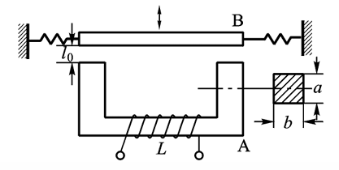

70%开卷考试+30%乐学提交作业

慕课非强制，9~13 章节与本课程无关

课程内容包括传感器工作原理、基本结构、性能特点、应用方法、传感器技术发展；检测技术基本概念和数据处理方法

# 概述：传感器与检测技术概念

检测技术属于信息科学的范畴，研究信息的提取、转换和处理；检测的任务是寻找表征物质运动的各种信号与物质运动的关系。

检测系统的大致构成如图：

传感器在 GB7665-87 中定义为，能感受规定的被测量并按照一定规律转换成可用输出信号的
器件或装置，处于研究对象与测控系统的接口位置。

传感器的组成结构如图

传感器分类有多种方式：

- 按输入量分类：位移、速度、温度、压力等

  常见的被测物理量有机械量（长度、厚度、位移、速度、加速度、旋转角、转速、质量、重量、力、压力、真空度、力矩、风速、流速、流量），声学量（声压、噪声），磁学量（磁通、磁场），热学量（温度、热量、比热），光学量（亮度、色彩）

- 按工作原理分类：应变式、电容式、电感式、压电式、热电式

- 按物理现象分类：结构型传感器（依靠传感器**结构参数的变化**实现信号转变）、物性型传感器（依靠敏感元件材料**本身物理性质**的变化实现信号变换）

  能量转换型传感器直接由被测对象输入能量使其工作（如热电偶温度计、压电式加速度计），能量控制型传感器从外部供给能量并由被测量来控制外部供给能量的变化（如电阻应变片）

- 按能量关系分类：能量转换型传感器、能量控制型传感器

- 按输出信号分类：模拟式传感器、数字式传感器

# 第 1 章 传感器的特性

传感器额输入——输出特性是基本特性

## 1.1 静态特性

### 线性度

静态特性用多项式方程$$y = a_0 + a_1 x + a_2 x^2 + \cdots + a_n x^n$$来表示，$$a_0$$称为零点输出，$$a_1$$称为理论灵敏度/线性灵敏度，其它项系数均为非线性系数。理想的传感器是线性的，输出和输入之间有严格的比例关系，因此会使用直线对实际的特性曲线进行拟合，线性度就是实际特性和拟合特性的差异，定义为：

$$
\gamma_L = \pm \frac{\Delta L_{max}}{y_{FS}}\times 100 \%，其中y_{FS}为满量程，是传感器实际输出的最大值减去最小值
$$

实际特性由校准/标定的方式获得，即采集标准输入（环境标准，设备标准）下的输出并列出数据表格；由小到大的正行程和由大到小的反行程分别进行平均，两个平均后的结果再进行平均，得到实际特性。

获得拟合直线的方式有多种，常用的拟合方式如下

此外还有最小二乘拟合，即使得残差平方和$$SSE$$最小的拟合方式

假设拟合直线$$y = kx + b$$，误差记为$$\Delta i = y_i - (kx_i + b)$$，最小二乘拟合的目标是使得$$\sum_{i=1}^n \Delta i^2$$最小，$$SSE$$对$$k$$和$$b$$求偏导令为 0，可得$$k$$和$$b$$的结果如下：

$$
\begin{aligned}
k=\frac{n\sum_{i = 1}^{n}x_iy_i-\sum_{i = 1}^{n}x_i\sum_{i = 1}^{n}y_i}{n\sum_{i = 1}^{n}x_i^2-(\sum_{i = 1}^{n}x_i)^2}\\
b=\frac{\sum_{i = 1}^{n}x_i^2\sum_{i = 1}^{n}y_i-\sum_{i = 1}^{n}x_i\sum_{i = 1}^{n}x_iy_i}{n\sum_{i = 1}^{n}x_i^2-(\sum_{i = 1}^{n}x_i)^2}\\
\end{aligned}
$$

注意：以上的拟合方式，均仅适用于传感器的非线性不明显的情况，如果传感器特性呈现明显非线性，则可以使用分段拟合、软件打表等方式进行拟合

### 迟滞

正行程和反行程输出与输入曲线不重合，即输入的方向不同导致输出特性也不同的现象，属于系统误差。传感器机械结构的磨损、数据延迟等都可能导致迟滞现象
$$
\gamma_H = \pm \frac{1}{2}\frac{\Delta H_{max}}{y_{FS}}\times 100\%
$$

### 重复性

传感器输入按同一方向作全量程连续多次变动时所得特性曲线不一致的程度，属于偶然误差。偶然误差越小，复现性越强。重复性可以针对单个测点或针对全量程进行评价。

单个测点重复性的定义基于标准差，标准差可以表征数据的分散程度：

$$
\begin{aligned}
&\xi_R = \frac{\sigma\cdot a}{y_{FS}}，\sigma为标准差，a为置信概率\\
&\sigma = \sqrt{\frac{\sum_{i=1}^n(x_i - \overline{x})^2}{n - 1}} \quad (注意是有限次测量，分母为n-1)\\
\end{aligned}
$$

全量程下的重复性定义为正反行程所有测点中最大误差与满量程的比值

$$
\gamma_R = \pm \frac{\Delta R_{max}}{y_{FS}}\times 100\%
$$

### 灵敏度与灵敏度误差

灵敏度定义为输出的变化量与引起该变化量的输入变化量之比，实质上就是输出——输入特性曲线上各个点的斜线斜率，表征了传感器对微小变化的敏感程度
$$
k = \frac{\Delta y}{\Delta x}
$$

显然，线性传感器的灵敏度为常数，非线性传感器的灵敏度为变量，传感器要在灵敏度较高的范围内使用。

灵敏度受到温度的影响，因此也存在灵敏度误差，定义为

$$
\gamma_s = \frac{\Delta k}{k}\times 100\%
$$

### 分辨率和阈值

事实上，传感器的实际输出曲线是离散的阶梯状，阶梯对应的输入量的范围就是分辨能力，只有超过这个范围，输出量才会发生改变。分辨率就是传感器能检测到的最小输入增量，阈值是指在输入零点附件的分辨率。

灵敏度是传感器输入——输出特性曲线的斜率，是较为宏观的指标；而分辨率是描述这种阶梯状曲线中阶梯宽度的，是较为微观的指标

### 稳定性和温度稳定性

稳定性即传感器在长时间工作情况下输出量发生的变化，有时也用标定周期/校准周期来表示，在标定周期内可以保证传感器性能。材料和元器件是影响稳定性的两个主要因素。温度稳定性即传感器在外界温度变化情况下输出量发生变化的现象，用温度误差系数$$\alpha$$定量描述这一指标，即温度发生 1℃ 变化时输出的改变量。

其它抗干扰能力，如抗振动、抗冲击等

### 静态误差

综合以上单项误差指标得到静态误差（主要综合前面四项），指的是传感器在全量程内任一点的输出值与理论输出值的偏离程度。

综合的方法有：

- 均方误差（即假设各项误差互不影响）：线性度和迟滞属于系统误差、重复性属于偶然误差，理论上讲两者不能简单地直接叠加

  $$
  \delta = \pm \sqrt{\gamma_L^2 + \gamma_H^2 + \gamma_R^2 + \gamma_S^2}
  $$

- 求标准差（将拟合直线与实际曲线在各测点的误差看作随机分布）：用标准差表示
  $$
  \sigma = \sqrt{\frac{1}{n-1}\sum_{i=1}^n(\Delta y_i)^2}
  $$

注：几种常用的统计指标

- 均方根/方均根/有效值（Root Mean Square）：$$x_{rms} = \sqrt{\frac{\sum_{i=0}^n{x_i^2}}{n}}$$
- 均方误差（Mean Square Error）：$$MSE = \frac{1}{N}\sum_{i=1}^N(observed_t - predicted_t)^2$$

## 1.2 动态特性

传感器动态特性地数学模型由微分方程或传递函数描述，分析方式和性能指标与自控原理中的完全一致

$$
\begin{aligned}
&a_n\frac{\text{d}^ny}{\text{d}t^n} + a_{n-1}\frac{\text{d}^{n-1}y}{\text{d}t^{n-1}} + \cdots + a_1\frac{\text{d}y}{\text{d}t} + a_0 y \\= &b_m\frac{\text{d}^mx}{\text{d}t^m} + b_{m-1}\frac{\text{d}^{m-1}x}{\text{d}t^{m-1}} + \cdots + b_1\frac{\text{d}x}{\text{d}t} + b_0 x\\
G(s) = &\frac{Y(s)}{X(s)} = \frac{b_m s^m + b_{m-1}s^{m-1} + \cdots + b_1 s + b_0}{a_n s^n + a_{n-1}s^{n-1} + \cdots + a_1 s + a_0}
\end{aligned}
$$

常见传感器地数学模型只有三种，即零阶环节、一阶环节和二阶环节。零阶环节是理想地传感器，输出与输入有严格地比例关系且无延迟；一阶环节的关键参数为时间常熟$$\tau$$，决定了传感器的响应速度；二阶环节的关键参数为无阻尼固有频率$$\omega_n$$和阻尼比$$\xi$$（阻尼固有频率$$\omega_d = \sqrt{1-2\xi^2}\omega_n$$），根据阻尼比和 1 的相对大小，分为零阻尼、欠阻尼、临界阻尼和过阻尼几种状态。

时域性能指标包括时间常数$$\tau$$、上升时间$$t_r$$、响应时间$$t_s$$、超调量$$M\%$$

频域性能指标包括幅频特性$$A(\omega)$$和相频特性$$\phi(\omega)$$：阻尼比小于 1 时，在$$\omega$$接近$$\omega_n$$时存在谐振峰，实践表明当$$\xi \ge 0.707$$时可以基本抑制谐振；另外，在频率特性曲线中的平坦区域使用传感器才能保证其灵敏度为常数

设计传感器应该设计在欠阻尼状态，较快响应且具有较宽的线性工作范围。一般来说，$$\xi$$取 0.6~0.8 可以兼顾系统的稳定性和响应灵敏度，认为$$\xi=0.707$$为最佳阻尼比。$$\omega_n$$由传感器内部构造决定，$$\omega_n$$越高，系统达到稳定状态的速度越快，传感器的工作频率也越高，工作频带也就越宽。传感器的信号频率/工作频率$$\omega$$应低于系统固有频率$$\omega_n$$的 3-5 倍，以使系统对检测信息的变换保持良好的线性特征（工作频率远离输入频率）。

补充：低通传感器和高通传感器

# 第 2 章 电阻式传感器

电阻式传感器有电位器式（测量位移）和应变片式（测量力）两种。

## 2.1 电位器式传感器

电位器有绕线式和旋转式两种，前者测量线位移后者测量角位移，两者原理和功能完全相同，下面以绕线式为例进行分析

按行程和电阻的关系也可分为线性电位器和非线性电位器两种。线性传感器对组成结构的要求包括：骨架截面处处相等、电阻丝绕线节距（每匝线圈之间的间距）处处相等、金属丝的电阻率和横截面积处处相等。使用非线性电位器的原因有二：一是为了刻意制造某种函数，如指数函数、对数函数等；二是为了补偿仪器仪表本身的非线性特征，使得整体的输出呈线性特征。

### 基本特性

显然，电位器式传感器需要接在相应的测量电路中使用，测量电路对传感器有输入阻抗的影响。当输入阻抗为无穷大时，传感器特性称为空载特性，是理想传感器的输入输出特性：

$$
R_x = \frac{x}{x_{max}}R_{max} \quad U_x = \frac{x}{x_{max}}U_{max}
$$

线性电位器的灵敏度：

$$
\begin{aligned}
&k_R = \frac{2(b+h)\rho}{At} \quad (电阻灵敏度) \\
&k_U = I\frac{2(b+h)\rho}{At} \quad (电压灵敏度) \\
&A为金属丝截面积，t为节距
\end{aligned}
$$

非线性电位器的灵敏度：

$$
k_u = \frac{\text{d}U_x}{\text{d}x} = \frac{2\rho(h+b)}{At}I \quad (电压灵敏度)
$$

可改变节距$$t$$或设计成变骨架式电位器$$h = \frac{At}{2\rho I}\left( \frac{\text{d}U_x}{\text{d}x} \right) -b$$

### 阶梯特性

即使是线性电位器，从微观结构的角度分析，由于线圈是一匝一匝缠绕的，因此存在阶梯特性

在理想阶跃特性曲线中，这种阶跃值称为视在分辨脉冲$$\Delta U = \frac{U_{max}}{N}$$，$$N$$为匝数。在实际的阶梯特性中，由于电枢短接两匝线圈会使得匝数减一，故实际的阶跃还有次要分辨脉冲

$$
\Delta U_n = \frac{U_{max}}{n-1}j - \frac{U_{max}}{n}j = U_{max}\left( \frac{1}{n-1} - \frac{1}{n} \right)j
$$

评价这种阶梯特性的指标如下：

$$
\begin{aligned}
&阶梯误差：:r_j = \pm \frac{\frac{1}{2}\cdot\frac{U_{max}}{N}}{U_{max}} = \pm\frac{1}{2n}\\
&行程分辨率:e_{by} = \frac{\frac{x_{max}}{N}}{x_{max}} \times 100\% = \frac{1}{N} \times 100 \%\\
&电压分辨率:e_{ba} = \frac{\frac{U_{max}}{N}}{U_{max}} \times 100\% = \frac{1}{N} \times 100 \%\\
\end{aligned}
$$

除了电位器本身结构造成的误差外，制造时的工艺误差也可能带来非线性特征，如：电阻丝的电阻率和直径不均匀、骨架偏离规定的几何尺寸、节距不均匀、电刷接触点的抛光误差等。

### 负载特性

当不能忽略测量电路输入阻抗带来的影响时，需要分析负载特性

显然，根据$$R_x$$与$$R_L$$并联再与$$R_{max}-R_x$$串联的分压关系：

$$
\begin{aligned}
U_o &= \frac{\frac{R_xR_L}{R_x + R_L}}{\frac{R_xR_L}{R_x + R_L}+R_{max}-R_x}U\\
&= \frac{R_xR_L}{R_LR_{max}+R_xR_{max} - R_x^2}U\\
&=\frac{r}{1+rm(1-r)}U\\
其中r &= \frac{R_x}{R_{max}}(电阻相对变化)\\
m&=\frac{R_{max}}{R_L}(负载系数)
\end{aligned}
$$

由此可作出电位器的负载特性曲线族，当$$m=0$$时，为空载特性曲线，$$U_L$$与$$U$$成线性关系

负载输出$$U_L = \frac{r}{1+rm(1-r)}U_{max}$$，空载输出$$U_o = rU_{max}$$，将二者进行比较得到负载误差

$$
\begin{aligned}
\delta_L &= U_o - U_L \quad (绝对量)\\
\delta_L &= \frac{U_o - U_L}{U_o} = 1-\frac{U_L}{U_o} = 1-\frac{1}{1+rm(r-1)}
\end{aligned}
$$

由此可作出电位器的负载误差曲线，显然$$r=0.5$$时误差达到极大值，$$\delta_L = 1-\frac{1}{1+\frac{1}{4}m}$$，根据此式从要求的负载误差范围得出测量电路负载和电位器电阻值的关系，例如要求$$\delta_L < 0.01$$，则$$R_L > 25R_{max}$$

### 特点

电位器设计的目标是噪音小、非线性小、分辨率高、稳定性好，对各个组成部分有对应的要求

- 电阻丝：电阻率高，电阻温度系数小，耐腐蚀，耐磨、与铜接触电势小。选用康铜（温度系数小）、镍铬（电阻率大）、镍铬铁合金（卡玛丝，温度系数小且电阻率大，但接触电阻大，需要电刷压在电阻丝上）、铂铱合金（化学稳定性好）等材料
- 电刷：抗氧化，接触电势小，噪声低，与电阻丝硬度相近或偏高，具有一定接触压力。选用银、铂铱合金、铂铑合金等材料
- 骨架：膨胀系数与金属丝相近（避免影响应变特性），绝缘性好，形状稳定，散热好。选用陶瓷、酚醛树脂、工程塑料等材料

电位器配合齿轮齿条可侧线位移角位移，配合弹性敏感元件可测压力，配合惯性质量块、弹簧和阻尼器构成的三自由度二阶系统可测加速度速度位移

电位器式传感器的特性有

- 结构简单、成本低
- 稳定性好、线性度高
- 输出信号大
- 准确度高(0.05%)
- 只能在低频工作（电刷滑动）
- 要求输入能量大
- 寿命短（电刷摩擦）
- 电噪声大

精密电位器的制造难点主要在电阻丝排线的均匀绕制上，依靠控制主轴旋转和排线机构进给的联合控制，使得主轴电机每转动一圈，排线机构就驱动骨架移动一个线径的距离。排线机构的速度可以根据主轴的速度调整，以保证移动量精确。

### 2.2 应变片式传感器

应变片式传感器的敏感元件是金属箔片，也称为敏感栅。应变片配合弹性敏感元件可以测量位移和扭矩等。

### 应变效应

电阻两端受力导致阻值发生变化的现象称为应变效应

$$
\begin{aligned}
R &= \frac{\rho l}{S}\\
\text{d}R &= \frac{\rho}{S}\text{d}l + \frac{l}{S}\text{d}\rho - \frac{\rho l}{s}\text{d}S\\
\frac{\text{d}R}{R} &= \frac{\text{d}\rho}{\rho} + \frac{\text{d}l}{l} - \frac{\text{d}S}{S}\\
\frac{\Delta R}{R} &= \frac{\Delta l}{l} + \frac{\Delta \rho}{\rho} - \frac{\Delta S}{S}\\
&= \frac{\Delta l}{l} + \frac{\Delta \rho}{\rho} - 2\frac{\Delta r}{r}
\end{aligned}
$$

材料力学知识补充：（注意这里的$$\mu$$往往是试件的）

$$
\begin{aligned}
\varepsilon &= \frac{\Delta l}{l} \quad (轴向应变/横向应变)\\
\epsilon_r &= \frac{\Delta r}{r} \quad (径向应变)\\
在弹性范围内: \epsilon_r &= -\mu \varepsilon,其中\mu为材料应变系数/泊松系数\\
\frac{\Delta \rho}{\rho} &= \pi_e E \varepsilon,其中\pi_e为压阻系数,E为弹性模量\\
\varepsilon &= \frac{\sigma}{E} = \frac{F}{SE}，其中\sigma为应力，相当于物理中的压强
\end{aligned}
$$

将应变现象式子简化如下，其中第一项描述了形变效应，第二项描述了压阻效应。金属材料以形变效应为主，半导体材料以压阻效应为主，在工程上可忽略次要影响因素。（注意这里的$$\mu$$是应变片的）

$$
\frac{\Delta R}{R} = (1+2\mu)\varepsilon + \pi_e E \varepsilon = (1 + 2\mu +  \pi_e E)\varepsilon
$$

定义灵敏系数如下，描述了单位形变所引起的电阻相对变化：

$$
K = \frac{\Delta R}{\varepsilon R} = 1 + 2\mu +  \pi_e E
$$

金属材料的$$K$$在 1.7-3.6，半导体材料的$$K$$在 100 左右，但半导体材料的阻值和灵敏系数受温度影响较大，金属材料这两个参数的温度稳定性好。本课程以金属材料为例讨论，忽略压阻效应。

### 结构材料

应变片式传感器的结构由敏感栅、基底（绝缘，粘贴）和盖层（防潮防尘）构成，敏感栅中，与主应力方向一致的称为纵栅，与主应力方向垂直的称为横栅。敏感栅有丝式和箔片式，丝式由金属丝反复缠绕而成（R 大且接触点小）。

箔片式由光化学腐蚀或精密冲压形成，可获得较为复杂的敏感栅图案（可有多个敏感栅轴向），适用于主应力方向未知的情况。箔片式由于横栅面积大，产生的横向效应小（横向效应是指，应变片受力时，垂直于受力方向会产生与主应力方向相反的应变，从而产生削弱电阻变化，使得灵敏度降低的现象）。此外，箔片式的外形薄，利于应变传递；材质柔软可用于曲面应力测量

对敏感栅材料的要求

- 灵敏系数大，在较大应变范围恒定
- 电阻率高（$$\Delta R = K \varepsilon R$$，电阻大灵敏度高）
- 电阻温度系数小（$$\Delta R_t$$小，受温度影响小）
- 机械强度高，易于拉丝与辗薄
- 与其它金属的接触电势小

常用材料有：康铜、镍铬合金、镍铬铁合金、贵金属

### 主要特性

- 灵敏系数（应变片的灵敏系数受结构影响，会略小于应变片的灵敏系数，一般由实验测定）$$K = \frac{\frac{\Delta R}{R}}{\varepsilon} < K_0$$

- 横向效应：$$\Delta R = \Delta R_x - \Delta R_y$$

- 温度效应：电阻的变化来自应变和温度变化两部分，由温度变化引起的又细分为两部分，一是由电阻温度系数引起的，二是由应变片和试件膨胀系数不同造成附加形变引起的

  $$
  \begin{aligned}
  &\frac{\Delta R}{R} = \left(\frac{\Delta R}{R}\right)_\varepsilon + \left(\frac{\Delta R}{R}\right)_t\\
  &\Delta l_s = \beta_s \Delta t l \quad \Delta l_g = \beta_g \Delta t l\\
  &\varepsilon' = \frac{\Delta l}{l} = (\beta_g - \beta_s)\Delta t\\
  &\left(\frac{\Delta R}{R}\right)_{t_2} = K\varepsilon' = K(\beta_g - \beta_s)\Delta t \\
  &\left(\frac{\Delta R}{R}\right)_t = \left(\frac{\Delta R}{R}\right)_{t_1} + \left(\frac{\Delta R}{R}\right)_{t_2} = \alpha_t \Delta t + K(\beta_g - \beta_s)\Delta t\\
  &\varepsilon_t = \frac{\left(\frac{\Delta R}{R}\right)_t}{K} = \frac{\alpha_t \Delta t}{K} + (\beta_g - \beta_s)\Delta t \quad (虚假应变)\\
  &e_t = \frac{\epsilon_t}{\varepsilon} \times 100 \% \quad (温度误差)
  \end{aligned}
  $$

- 迟滞、零飘（无输入时使出波动）、蠕变（输入不变时输出波动）
- 疲劳寿命（焊接影响疲劳寿命）、绝缘电阻、动态响应

### 直流电桥

补充：直流电桥相关知识

直流电桥的平衡条件为：相对桥臂之积相等 / 相邻桥臂电阻比值相等

$$
\begin{aligned}
&U_{o}=\frac{R_{1}}{R_{1} + R_{2}}U-\frac{R_{3}}{R_{3} + R_{4}}U=\frac{R_{1}R_{4}-R_{2}R_{3}}{(R_{1}+R_{2})(R_{3}+R_{4})}U\\
&故R_{1}R_{4}=R_{2}R_{3} \quad 或 \quad \frac{R_{1}}{R_{2}}=\frac{R_{3}}{R_{4}}
\end{aligned}
$$

定义桥臂比$$n = \frac{R_{2}}{R_{1}}$$，单臂电桥的电压灵敏度（$$R_1$$变化为$$R_1 + \Delta R_1$$代入式子）：

$$
\begin{aligned}
输出电压:U_{o}&=\frac{(R_{1}+\Delta R_{1})R_{4}-R_{2}R_{3}}{(R_{1}+\Delta R_{1}+R_{2})(R_{3}+R_{4})}U\\
&= \frac{\frac{R_{4}}{R_{3}}\frac{\Delta R_{1}}{R_{1}}}{(1 + \frac{R_{2}}{R_{1}}+\frac{\Delta R_{1}}{R_{1}})(1+\frac{R_{4}}{R_{3}})}U\\
&\approx\frac{n}{(1 + n)^{2}}\frac{\Delta R_{1}}{R_{1}}U\\
电压灵敏度:K_{u}&=\frac{U_{0}}{\Delta R_1/R_1}=\frac{n}{(1 + n)^{2}}U
\end{aligned}
$$

由上式看出，当$$n=1$$时（此时称为等臂电桥），灵敏度取得极大值$$K = \frac{1}{4}U$$；想要提高灵敏度可以适当升高电压，但要注意电压升高电流增大发热造成的温升（一般将电流控制在 25mA 以下）

上式的约等于处引入了非线性误差：

$$
\begin{aligned}
&理想输出 \quad U_{o}'=\frac{1}{4}\frac{\Delta R_{1}}{R_{1}}U\\
&实际输出 \quad U_{o}=\frac{\frac{\Delta R_{1}}{R_{1}}}{4(1+\frac{1}{2}\frac{\Delta R_{1}}{R_{1}})}U\\
&非线性误差 \quad \delta=\frac{U_{o}-U_{o}'}{U_{o}'}=-\frac{1}{2}\frac{\Delta R_{1}}{R_{1}}
\end{aligned}
$$

上述模式被称为工作在小偏差不平衡电桥的工作模式，与不平衡电桥相对应的还有平衡电桥，其中$$R_1$$为应变片电阻，$$R_2$$为可调电阻，调节$$R_2$$使得电桥平衡（检流计读数为 0）。这种方式由于需要人为将电桥调平衡，故只适用于静态测量

$$
\frac{R_1 + \Delta R_1}{R_2 + \Delta R_2} = \frac{R_3}{R_4}
$$

### 基于电桥的误差补偿

为了补偿温度带来的误差，需要设计补偿

一种是从结构上进行补偿，有单丝自补偿法和组合式自补偿法

单丝补偿法即通过调节参数匹配，使$$\alpha_t = -k(\beta_g - \beta_s)$$。控制合金成分和退火温度可以控制$$\alpha_t$$，这种方法的温度适用范围有限，且材料通用性差。组合式自补偿法即串接不同金属丝，使得$$\Delta R_1 = -\Delta R_2$$，只需$$\frac{\alpha_1}{\alpha_2} = -\frac{R_2}{R_1}$$即可

另一种从外部电路进行补偿，由于电阻变化值非常小，将应变片作为电阻接入电桥，将应变转化为电学量进行测量

四个电桥电阻均会受到温度影响

$$
\begin{aligned}
U_{o}&=\frac{\frac{R_{2}}{R_{1}}}{(1 + \frac{R_{2}}{R_{1}})^2}\left(\frac{\Delta R_{1}}{R_{1}}-\frac{\Delta R_{2}}{R_{2}}+\frac{\Delta R_{4}}{R_{4}}-\frac{\Delta R_{3}}{R_{3}}\right)(1 - \eta)U\\
\eta&=\frac{1}{1+\frac{(1 + \frac{R_{2}}{R_{1}})}{\frac{\Delta R_{1}}{R_{1}}+\frac{\Delta R_{3}}{R_{3}}+\frac{R_{2}}{R_{1}}\left(\frac{\Delta R_{2}}{R_{2}}+\frac{\Delta R_{4}}{R_{4}}\right)}}U \\
&\frac{\Delta R_{i}}{R_{i}}\ll 1时，\eta = 0\\
U_{o}&=\frac{\frac{R_{2}}{R_{1}}}{(1 + \frac{R_{2}}{R_{1}})^2}\left(\frac{\Delta R_{1}}{R_{1}}-\frac{\Delta R_{2}}{R_{2}}+\frac{\Delta R_{4}}{R_{4}}-\frac{\Delta R_{3}}{R_{3}}\right)U\\
&=\frac{n}{(1 + n)^2}\left(\frac{\Delta R_{1}}{R_{1}}-\frac{\Delta R_{2}}{R_{2}}+\frac{\Delta R_{4}}{R_{4}}-\frac{\Delta R_{3}}{R_{3}}\right)U\\
对于等臂电桥:U_o
&=\frac{1}{4}\left(\frac{\Delta R_{1}}{R_{1}}-\frac{\Delta R_{2}}{R_{2}}+\frac{\Delta R_{4}}{R_{4}}-\frac{\Delta R_{3}}{R_{3}}\right)U
\end{aligned}
$$

从上式可得：输出电压正比于相对桥臂电阻变化率之和，相邻桥臂电阻变化率之差

因此可以在相邻桥臂处粘贴补偿应变片但不施加应变，抵消掉工作应变片的温度误差

$$
\begin{aligned}
\frac{\Delta R_{1}}{R_{1}}&=\left(\frac{\Delta R_{1}}{R_{1}}\right)_{\varepsilon}+\left(\frac{\Delta R_{1}}{R_{1}}\right)_{t}\\
\frac{\Delta R_{2}}{R_{2}}&= 0+\left(\frac{\Delta R_{2}}{R_{2}}\right)_{t}\\
U_{o}&=\frac{1}{4}\left(\left(\frac{\Delta R_{1}}{R_{1}}\right)_{\varepsilon}+\left(\frac{\Delta R_{1}}{R_{1}}\right)_{t}-\left(\frac{\Delta R_{2}}{R_{2}}\right)_{t}+\frac{\Delta R_{4}}{R_{4}}-\frac{\Delta R_{3}}{R_{3}}\right)U\\
&=\frac{1}{4}k\varepsilon U_{i} \quad (只与应变有关，与温度无关)
\end{aligned}
$$

除了进行温度补偿，还可以采用双臂、四臂差动电桥提高测量灵敏度

$$
\begin{aligned}
\frac{\Delta R_{1}}{R_{1}}&=\left(\frac{\Delta R_{1}}{R_{1}}\right)_{\varepsilon}+\left(\frac{\Delta R_{1}}{R_{1}}\right)_{t}\\
\frac{\Delta R_{2}}{R_{2}}&=\left(\frac{\Delta R_{2}}{R_{2}}\right)_{-\varepsilon}+\left(\frac{\Delta R_{1}}{R_{1}}\right)_{t}\\
U_{o}&=\frac{1}{4}\left(\left(\frac{\Delta R_{1}}{R_{1}}\right)_{\varepsilon}-\left(\frac{\Delta R_{2}}{R_{2}}\right)_{-\varepsilon}+\frac{\Delta R_{4}}{R_{4}}-\frac{\Delta R_{3}}{R_{3}}\right)U\\
&=\frac{1}{4}(k\varepsilon - k(-\varepsilon))U=\frac{1}{2}k\varepsilon U_{i}
\end{aligned}
$$

### 特点

电阻应变片的使用：

1. 目测电阻应变片有无折痕.断丝等缺陷。
2. 用数字万用表测量应变片电阻值大小。同一电桥中各应变片之间阻值相差不得大于 0.5 欧姆
3. 试件表面处理：贴片处置用细纱纸打磨干净，用酒精棉球反复擦洗贴处，直到棉球无黑迹为止。
4. 应变片粘贴：在应变片基底上挤一小滴 502 胶水，轻轻涂抹均匀，立即放在应变贴片位置。
5. 焊线：用电烙铁将应变片的引线焊接到导引线上。
6. 用兆欧表检查应变片与试件之间的绝缘组织，应大于 500M 欧。
7. 保护：用 704 硅橡胶覆于应变片上，防止受潮。

电阻应变片的特点：

- 测量精度高，应变测量误差<1%
- 测量范围宽，几个$$\mu \varepsilon$$到上千$$\mu \varepsilon$$
- 分辨率高，一般$$1\mu \varepsilon$$
- 频率特性好，$$10^{-7}~10^{-10}s$$，(可测几百 kHz)
- 尺寸小，重量轻，对工件的应力分布基本无影响
- 环境适应性强
- 在大应变下，有较大非线性
- 输出信号微弱，抗干扰能力差
- 实际是敏感栅范围的平均应变
- 温度系数较大

柱形弹性元件：结构简单、紧凑、承受载荷大（最大107N)

梁式弹性元件：结构简单、应变片易粘贴、灵敏度较高，适用于小载荷。有等截面型梁试件（应变片粘贴位置直接影响应变大小）和等强度梁（应变片粘贴位置不影响应变大小）

---

思路：

选则合适的弹性元件：柱状、梁式、膜片式

布置应变片位置：找到应力最大的方向，在此方向和垂直于此方向上粘贴应变片

连接电桥：承受相反应变的应变片放在相邻桥臂、承受相同应变的应变片放在相对桥臂

# 第 3 章 电感式传感器

利用线圈自感或互感的变化来测量，核心部分是可变自感或可变互感。在被测量转换 成线圈自感或互感的变化时，一般要利用磁场作为媒介或利用铁磁体 的某些现象。这类传感器的主要特征是具有线圈绕组。

## 3.1 自感式传感器

又称为变磁阻式传感器

### 工作原理

电感值与结构参数的关系如下，其中$$W$$为线圈匝数，$$\mu_0 = 4\pi \times 10^{-7} H/m$$为真空导磁率，$$S_0$$为空气隙有效截面积，$$l_0$$为空气隙长度
$$
L = \frac{W^{2}\mu_{0}S_{0}}{2l_{0}}
$$
有气隙型、截面型和差分自感式

- 气隙型

    

## 3.2 变压器式传感器

## 3.3 涡流式传感器

## 3.4 压磁式传感器

