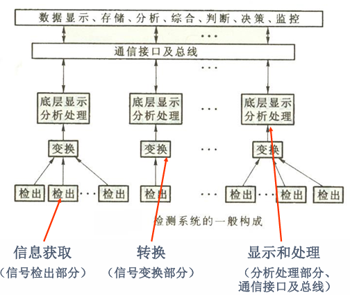

==补充课程要求==

70%开卷考试+30%作业

慕课非强制，9~13 章节与本课程无关

课程内容包括传感器工作原理、基本结构、性能特点、应用方法、传感器技术发展；检测技术基本概念和数据处理方法

## 概述：传感器与检测技术概念

检测技术属于信息科学的范畴，研究信息的提取、转换和处理；检测的任务是寻找表征物质运动的各种信号与物质运动的关系。

检测系统的大致构成如图：

传感器在 GB7665-87 中定义为，能感受规定的被测量并按照一定规律转换成可用输出信号的
器件或装置，处于研究对象与测控系统的接口位置。

传感器的组成结构如图

传感器分类有多种方式：

- 按输入量分类：位移、速度、温度、压力等

  常见的被测物理量有机械量（长度、厚度、位移、速度、加速度、旋转角、转速、质量、重量、力、压力、真空度、力矩、风速、流速、流量），声学量（声压、噪声），磁学量（磁通、磁场），热学量（温度、热量、比热），光学量（亮度、色彩）

- 按工作原理分类：应变式、电容式、电感式、压电式、热电式

- 按物理现象分类：结构型传感器（依靠传感器**结构参数的变化**实现信号转变）、物性型传感器（依靠敏感元件材料**本身物理性质**的变化实现信号变换）

  能量转换型传感器直接由被测对象输入能量使其工作（如热电偶温度计、压电式加速度计），能量控制型传感器从外部供给能量并由被测量来控制外部供给能量的变化（如电阻应变片）

- 按能量关系分类：能量转换型传感器、能量控制型传感器

- 按输出信号分类：模拟式传感器、数字式传感器

## 第 1 章 传感器的特性

传感器额输入——输出特性是基本特性

### 1.1 静态特性

- 线性度

  静态特性用多项式方程$$y = a_0 + a_1 x + a_2 x^2 + \cdots + a_n x^n$$来表示，$$a_0$$称为零点输出，$$a_1$$称为理论灵敏度/线性灵敏度，其它项系数均为非线性系数。

  理想的传感器是线性的，输出和输入之间有严格的比例关系，因此会使用直线对实际的特性曲线进行拟合，线性度就是实际特性和拟合特性的差异，定义为：

  $$
  \gamma_L = \pm \frac{\Delta L_{max}}{y_{FS}}\times 100 \%，其中y_{FS}为满量程，是传感器实际输出的最大值减去最小值
  $$

  实际特性由校准/标定的方式获得，即采集标准输入（环境标准，设备标准）下的输出并列出数据表格；由小到大的正行程和由大到小的反行程分别进行平均，两个平均后的结果再进行平均，得到实际特性。

  获得拟合直线的方式有多种，常用的拟合方式如下

  

  此外还有最小二乘拟合，即使得残差平方和$$SSE$$最小的拟合方式

  假设拟合直线$$y = kx + b$$，误差记为$$\Delta i = y_i - (kx_i + b)$$，最小二乘拟合的目标是使得$$\sum_{i=1}^n \Delta i^2$$最小，$$SSE$$对$$k$$和$$b$$求偏导令为 0，可得$$k$$和$$b$$的结果如下：

  $$
  \begin{aligned}
  k=\frac{n\sum_{i = 1}^{n}x_iy_i-\sum_{i = 1}^{n}x_i\sum_{i = 1}^{n}y_i}{n\sum_{i = 1}^{n}x_i^2-(\sum_{i = 1}^{n}x_i)^2}\\
  b=\frac{\sum_{i = 1}^{n}x_i^2\sum_{i = 1}^{n}y_i-\sum_{i = 1}^{n}x_i\sum_{i = 1}^{n}x_iy_i}{n\sum_{i = 1}^{n}x_i^2-(\sum_{i = 1}^{n}x_i)^2}\\
  \end{aligned}
  $$

  注意：以上的拟合方式，均仅适用于传感器的非线性不明显的情况，如果传感器特性呈现明显非线性，则可以使用分段拟合、软件打表等方式进行拟合

- 迟滞：正行程和反行程输出与输入曲线不重合，即输入的方向不同导致输出特性也不同的现象，属于系统误差。传感器机械结构的磨损、数据延迟等都可能导致迟滞现象

  $$
  \gamma_H = \pm \frac{1}{2}\frac{\Delta H_{max}}{y_{FS}}\times 100\%
  $$

  

- 重复性：传感器输入按同一方向作全量程连续多次变动时所得特性曲线不一致的程度，属于偶然误差。偶然误差越小，复现性越强。重复性可以针对单个测点或针对全量程进行评价。

  单个测点重复性的定义基于标准差，标准差可以表征数据的分散程度：

  $$
  \begin{aligned}
  &\xi_R = \frac{\sigma\cdot a}{y_{FS}}，\sigma为标准差，a为置信概率\\
  &\sigma = \sqrt{\frac{\sum_{i=1}^n(x_i - \overline{x})^2}{n - 1}} \quad (注意是有限次测量，分母为n-1)\\
  \end{aligned}
  $$

  全量程下的重复性定义为正反行程所有测点中最大误差与满量程的比值

  $$
  \gamma_R = \pm \frac{\Delta R_{max}}{y_{FS}}\times 100\%
  $$

  

- 灵敏度与灵敏度误差

  灵敏度定义为输出的变化量与引起该变化量的输入变化量之比，实质上就是输出——输入特性曲线上各个点的斜线斜率，表征了传感器对微小变化的敏感程度

  $$
  k = \frac{\Delta y}{\Delta x}
  $$

  显然，线性传感器的灵敏度为常数，非线性传感器的灵敏度为变量，传感器要在灵敏度较高的范围内使用。

  灵敏度受到温度的影响，因此也存在灵敏度误差，定义为

  $$
  \gamma_s = \frac{\Delta k}{k}\times 100\%
  $$

  

- 分辨率和阈值

  事实上，传感器的实际输出曲线是离散的阶梯状，阶梯对应的输入量的范围就是分辨能力，只有超过这个范围，输出量才会发生改变。

  灵敏度是传感器输入——输出特性曲线的斜率，是较为宏观的指标；而分辨率是描述这种阶梯状曲线中阶梯宽度的，是较为微观的指标

注：几种常用的统计指标

- 均方根/方均根/有效值（Root Mean Square）：$$x_{rms} = \sqrt{\frac{\sum_{i=0}^n{x_i^2}}{n}}$$
- 均方误差（Mean Square Error）：$$MSE = \frac{1}{N}\sum_{i=1}^N(observed_t - predicted_t)^2$$
