问答题示例：

什么是专家控制

模糊控制和神经网络怎么结合

从模式的角度分析进化的原理

为什么经典遗传算法不能以概率 1 收敛

谓词逻辑，定义谓词和操作，实现给定过程

遗传算法的进化原理

2-3 道模糊关系的计算题

给定样本和神经网络，写训练的更新公式

## 第一章 概述

60%开卷考试+40%作业出勤，作业在 i 北理提交

课程内容：概述、知识工程基础、分级递阶控制、遗传算法、神经网络、模糊控制、专家控制

### 控制理论发展

控制理论的发展大致分为三个阶段：经典控制(微分方程模型，传递函数、SISO、频域分析)——现代控制(卡尔曼的状态空间模型，状态方程，MIMO，时域分析)——智能控制。

- 经典控制：线性定常系统、SISO、传递函数/频域、反馈控制(PID 控制)、调节器
- 现代控制：线性/具有一定非线性/分布参数系统、MIMO、状态空间法/时域、卡尔曼滤波、极大值原理、动态规划、最优/随机/自适应
- 智能控制：复杂非线性系统(模型差或无模型)、大系统理论、智能算子/多级控制、智能机器

经典控制和现代控制都是模型驱动范式，需要经历建模、收集数据、参数估计，然后基于模型设计控制器，又叫间接数据驱动；而智能控制是数据驱动范式，直接从收集的数据里设计控制器，又叫直接数据驱动(比如强化学习就是无模型的控制，无模型的优化，典型的直接数据启动。

### 智能控制的三元论和二元论

三元论：人工智能 AI、自动控制 AC、运筹学 OR

二元论：人工智能、控制理论

### 智能控制的概念

智能控制是应用人工智能的理论与技术和运筹学的优化方法，并将其同控制理论方法与技术相结合，在未知环境下，仿效自然智能，实现对系统的控制。智能控制是一类无需(或仅需尽可能少的)人 的干预就能够独立地驱动智能机器实现其目标的自动控制。 智能控制是智能机器自主地实现目标的过程。 智能控制是研究与模拟人类智能活动信息传递与处理的规律。

智能机器主要表现在独立、自主、模拟。

### 智能控制的研究对象及其特点

智能控制的主要研究对象是各种大规模的复杂系统

特点是无精确数学模型、不满足苛刻的线性化假设、无法解决的建模问题、传统控制系统可靠性低、具有发杂的任务要求。（MMLRT）

传统控制：模型论(不精确模型+固定控制算法)，缺乏灵活性和应变能力，难以控制复杂系统

智能控制：控制论(控制理论+人工智能)，改变控制策略去适应对象的复杂性和不确定性

#### 智能控制系统的主要功能特征

学习能力、适应性、容错性、鲁棒性、组织功能、实时性、人机协作（RCFLOTA）

### 控制系统的两个核心和七个要素

两个核心是系统和反馈，七个要素是 SPAC2E3，即 sensor 传感器、plant 被控对象、actuator 执行器、controller 控制器、communication 通信、effect 效能、efficiency 效率、environment 环境

### 反馈的三个优点和三个缺点

反馈的优点：(1)易控：易于控制和调节系统暂态响应；(2)降差：改进稳态误差；(3)降敏：降低对系统参数变化（内部不确定性）及外部扰动（外部不确定性）等的敏感度(等价地，改进对扰动和噪声信号的抑制)。反馈的缺点：(1)元件和复杂性的增加；(2)增益损失；(3)可能的不稳定性（开环稳闭环未必稳）

### 智能控制系统分类

按系统构成原理分类：学习控制系统、分级递阶智能控制系统、专家控制系统、模糊控制系统、神经网络控制系统、基于规则的仿人智能控制系统、集成智能控制系统、组合智能控制系统

按系统结构分类：直接智能控制系统、间接智能控制系统、分级递阶智能控制系统、集散智能控制系统(DCS)

按系统实现功能分类：智能自适应控制系统、智能自组织控制系统、智能自学习控制系统、智能自修复控制系统

集散控制系统集中了 Management-Operation-Display（MOD）、分散了 Danger-Function-Load（DFL）

### AI v NI(人工智能和自然智能的对比)

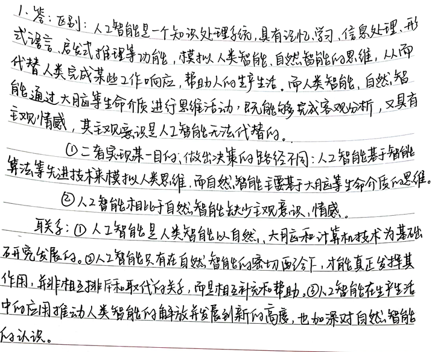

### 直接智能控制和间接智能控制

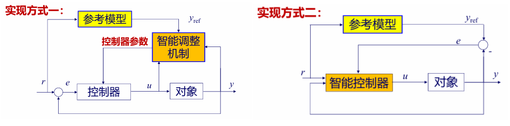

## 第二章 知识工程基础

知识工程分为三个阶段：知识的表示 Representation、获取 Acquisition、处理 Process

三个基本概念及其关系：知识 Knowledge、信息 Information、数据 Data

信息：特定性和适用的非持久性，是建立知识的前提。知识：建立在信息积累的基础上，具有适用的持久性，通常表示成规则形式。数据：描述客观事物的属性、数量、位置以及相互关系。是信息的载体和表示。它可以是数，也可以是字符串。信息：是数据在特定场合下的具体含义，或是数据的语义。

产生式系统的三要素：Knowledge Lib、Inference Engine、Data Lib

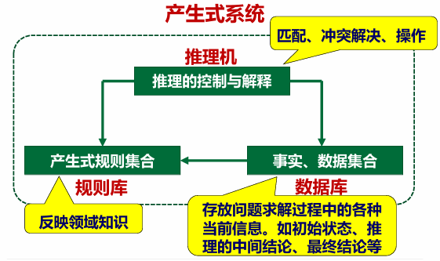

### 知识表示

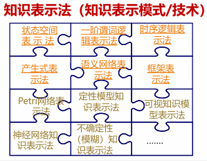

#### 状态空间表示法

状态：描述某些事物中各不同事物间的差异，而引入的一种最小变量的有序组合。

操作：能够引起状态中某些分量发生变化，从而使一个状态转移为另一个状态。

状态空间：描述全部可能状态及其相互关系的三重序元。S 是事物可能的初始状态集合、F 是操作集合、G 是可能的目标状态集合。用有向图来表示状态空间的方式称为状态空间图示法：

- 把状态集合映射为节点集合
- 操作所引起的状态转移映射为标注该操作的有向边
- 问题求解通过操作从初始节点到目标节点，寻找一条有效的路径

#### 一阶谓词解释法

取值为真或假的句子(Clause)称为命题(Proposition)，可分为谓词(Predicate)和个体(Individual)两部分。谓词用于刻划个体的性质、状态或个体间的关系，用大写字母表示。个体表示某个独立存在的事物或某个抽象的概念，用小写字母表示。联接词的优先级别按图中从上到下递减。量词包括全称量词任意、存在量词存在

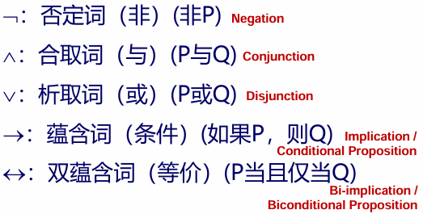

特点：

- 谓词表示法接近于自然语言的形式语言，易于理解和接受
- 适宜于精确性知识的表示，而不适宜于不确定性知识的表示
- 用谓词逻辑法表示的知识可以比较容易转换为计算机的内部形式，易于模块化，便于对知识的添加、删除和修改。

#### 时序逻辑表示法

将时间及其次序关系引入谓词表达式之中，利用谓词逻辑的概念和方法，便构成了时序逻辑知识模型。

#### 产生式表示法

又称为规则或产生式规则。通常用于表示具有因果关系的知识。基本形式为 if P then Q，或 P-->Q。

#### 语义网络表示法

通过概念及其语义关系来表达知识的一种网络图，由节点和连接节点的弧/边构成。其基础是一种三元组结构(节点 1、弧、节点 2)。语义网络除可表达事实外，还可表达规则。一条产生式规则 R：IF A THEN B。当多个三元组综合在一起表达时，就可得到一个语义网络。节点对应谓词表示法中的个体，弧对应表示谓词表示法中的谓词。

特点：

- 节点和弧便于显式表达结构、属性、因果关系，便于联想方式实现对系统的解释
- 继承方式符合人类的思维习惯
- 语义解释依赖于结构的推理过程，没有结构的约定，推理不能保证像谓词逻辑法那样有效
- 知识存储和检索过程比较复杂

语义网络表示法与谓词表示法的区别：

1. 语义网络的基本单元是节点，具有名词性质；谓词逻辑的基本单元是谓词和个体构成的动作，具有动词性质。
2. 语义网络中的联接关系靠弧实现，这种连接关系是有方向的，有上、下层概念之分，可以表达分类、从属、时空关系等不同关系；而谓词逻辑靠联接词建立关系，除了蕴含和双蕴含以外，关系表达中没有方向性，而蕴含和双蕴含也只能表达因果关系。
3. 语义网络是一种基于有向图的表示方式；谓词逻辑是一种基于语言的表示方式。

#### 框架知识表示法

框架表示法的特点

- 面向对象，适合表示大规模复杂知识，体现了人的自然思维方式；
- 可表达陈述性知识和过程性知识，便于知识的结合，综合表达能力强；
- 利用层次结构、继承关系，冗余少。

### 知识获取

人工智能或知识工程系统中，通过非自动方式或自动方式实现计算机从知识源获取知识的过程。知识源包括专家、书本、数据库和人的经验等。

非自动知识获取是指知识通过知识工程师和知识编辑器传授给知识库。知识编辑器是一类程序设计系统，包括语法检查、一致性检查、自动薄记、知识抽取等功能。全自动知识获取是让计算机直接从环境中获取全部信息。包括机器感知(主要是计算机视觉和听觉)、机器识别和机器学习等。

#### 学习系统基本模型

学习是系统积累经验以改善其性能的过程，是知识的获取与改进，是事物规律的发现过程，也就是，学习是一个有特定目的的知识获取过程。

#### 学习系统的三个核心特征

U（Uncertainty）、K（Knowledge）、P(Performance)

#### 学习系统分类

机械式学习系统、类比学习系统、示例学习系统、发现式学习系统、指导学习系统

### 知识处理

运用知识的过程称为推理过程。推理是指依据一定的规则从已有的事实推出结论的过程。其中的规则称为控制策略。智能系统是以知识为基础的系统，它根据已有的知识和事实去求解当前的问题。也叫基于知识的推理。推理由程序实现，称为推理机。

#### 推理方式

演绎推理、归纳推理、非单调推理

演绎推理：前提与结论之间有蕴含关系的推理，或前提与结论之间有必然联系的推理。即结论蕴含在已知的判断之中，是一种由一般到个别的推理

归纳推理：指由个别事物或现象推出该类事物或现象一般性知识的过程。常用方法有枚举法、类比法、统计法等。基于不完全证据的推理结论未必完全准确。

非单调推理：在信息或知识不完全的情况下，假设某些命题成立并进行推理。在推理过程中，如果发现原假设不正确，就撤销原假设以及由此得出的结论，重新按新情况进行推理。

#### 推理控制策略/方向性

正向推理(数据/事实驱动推理)、反向推理(目标驱动推理)、正反向混合推理

#### 状态空间的搜索策略

一般的搜索策略/搜索过程、盲目搜索(宽度/深度优先搜索)策略、启发式搜索策略。各搜索策略都用到了状态空间图，搜索方法的不同体现在结点在表中的排序不同，各种策略可以相结合。

三种典型策略为 DFS 深度优先、BFS 广度/宽度优先、Heuristics 启发式

## 第三章 分层递阶控制

### 大系统的递阶结构

系统各个子系统的控制作用是由按照一定优先级和从属关系安排的决策单元实现的。同级的各决策单元可以同时平行工作并对下级施加作用，它们又要受到上级的干预，子系统可以通过上级互相交换信息。

多级多目标结构：当系统由若干个可分的相互关联的子系统组成时可将所有决策单元按一定支配关系递阶排列，同级各单元要受上一级的干预，同时又对下一级决策单元施加影响。同一级决策单元如有相互冲突的决策目标，由上级决策单元加以协调。

### 三层结构及各级作用

组织级、协调级、执行级

组织级：接受用户的任务请求/命令，是最高智能级。推理、规划、决策、长期记忆信息的交换、学习

协调级：组织级与执行级之间的接口。根据组织级提供的指令信息进行任务协调

执行级：由多个硬件控制器组成。要求高精度，理论方法为传统控制理论

### 分层递阶控制的特征

受控对象具有很多层次；控制有多个层次，且各层间实现“精度递增伴随智能递减”的原则。（IPDI）

### 分层递阶控制的一般原理

基本原理是把一个总体问题 P 分解成有限数量的子问题 P。总体问题 P 的目标应使复杂系统的总体准则取得极值。各子系统没有关联是，子系统解的集合就是整个系统的解，各子系统产生冲突时，需要引入协调参数$$\lambda$$作为干预信号。协调就是要选择$$\lambda$$，从某个初值$$\lambda_0$$经过迭代达到终值$$\lambda^*$$从而使递阶控制达到最优。协调的两个原则为关联预测协调原则(考虑关联)和关联平衡协调原侧(不考虑关联约束)。

### 分层递阶控制的控制目标

分层递接控制系统的控制目标：寻求一个正确的决策和控制序列使整个系统的总熵（不确定性）最小

### 分层递阶控制的协调原则

考虑关联的原则为关联预测协调原则，不考虑关联的原则为关联平衡协调原则

### 分层递阶控制系统的结构

由组织级、协调级和执行级组成，按照自上而下精度递增伴随智能递减的原则进行设计。三个级的功能作用各有侧重。

Boltzmann 机实现组织级功能；协调级有分派器、协调器、数据处理器、任务处理器、学习处理器，各个部件的功能作用各有侧重。执行级的特点。

## 第四章 遗传算法

遗传算法(Genetic Algorithm，GA)是基于自然选择和基因遗传学的搜索算法，通过复制、交叉和变异三种操作对待优化参数的编码串进行引导型搜索，使适配值高的个体被保留下来组成新的群体，直到满足一定的极限条件。

遗传算法具有以下特点：

- 能够在复杂空间进行全局最优搜索，且具有较强的鲁棒性
- 对于搜索空间(待寻优的函数)基本上不需要什么限制性的假设
- 从许多点开始并行操作，该机制和变异一起有效防止了收敛于局部最优解，且可通过大规模并行计算来提高计算速度
- 通过目标函数来计算适配值，对问题的依赖性小
- 寻优规则由概率决定而非确定

### 算法原理

简单遗传算法包含三个基本操作：复制、交叉和变异，以位串的方式进行处理。复制即按照适配值构成的比例产生下一代种群；交叉即将位串两辆配对并在随机位置往后处进行交换；变异即以极小的概率随机改变位串的某一位。算法流程为：产生初始种群、对各个体位串解码并计算适配值、按选择率复制处下一代、交叉和变异。

适应度函数用于评价解对问题的适应度，满足约束的解称为可行解，否则称为不可行解，理想的解是在满足约束的前提下使目标函数最优化的解，承称为最佳可行解。

### 模式理论

遗传算法的模式理论是一种解释遗传算法工作机理的理论。模式是描述种群中在位串的某些确定位置上具有相似性的位串子集的相似性模板，如 1\*0，对应的位串就有 100 和 110。高适配值与位串模式的这种相似性具有因果关系。

为了评估算法性能，需要估算一次迭代中有效处理的模式数量(只有能够较好保留并遗传到下一代的模式才对算法有实质贡献)，定义如下量以方便描述

-$$A(t)$$：$$t$$时刻的种群 -$$A_j$$：个体位串 -$$O(H)$$：模式位数，即模式所有的位数 -$$\delta(H)$$：模式的有效长度，即最两端确定位之间的距离 -$$l$$：位串长度 -$$m = m(H, t)$$：$$t$$时刻种群含有的模式数 -$$\bar{f}$$：种群的平均适配值(适配值即位串解码结果在待优化函数上的值) -$$f(H)$$：种群中$$H$$模式个体的平均适配值 -$$P_d$$：模式被破坏的概率(实际死亡率) -$$P_s$$：存活率阈值，人为给定 -$$P_c$$：发生交叉的概率 -$$P_m$$：单个位置发生变异的概率

综合考虑复制、交叉和变异对模式的影响，其中第一个式子的三部分分别为三个基本操作对模式的影响

$$
\begin{aligned}
m(H,t + 1) &\geqslant m(H,t)\frac{f(H)}{\bar{f}}\left[1 - P_{c}\frac{\delta(H)}{l - 1}\right]\left[1 - O(H)P_{m}\right]\\
&\approx m(H,t)\frac{f(H)}{\bar{f}}\left[1 - P_{c}\frac{\delta(H)}{l - 1}- O(H)P_{m}\right]
\end{aligned}
$$

经推导，对于$$n$$个位串的种群，可以合理估计总模式数的范围在

$$
\frac{l-l_s+1}{4}n^3 \leqslant n_s \leqslant n\cdot 2^{l_s - 1}\cdot(l - l_s + 1)
$$

由此可见，遗传算法处理模式数的数量级为$$O(n^3)$$，这就是遗传算法隐含的并行机制

### 算子的扩展性

经典 GA = 轮盘赌选择 + 单点交叉 + 均匀变异，轮盘赌的缺陷是缺乏精英机制，存在遗传漂移(有限种群下的基因丢失，导致不能以概率 1 收敛于全局最优)，最优解可能被随机性抹杀。其它选择算子还有：截断选择、排序、锦标赛选择。

经典 GA 的改进：

- 精英保留策略：每一代都保留最佳个体，最佳个体(精英个体)直接进入下一代，精英个体也可以泛化
- 选择算子一——锦标赛选择/巡回赛选择：1-1 锦标赛选择，优胜劣汰，特点是不依赖于个体间适值的具体差异，且操作简单，不必执行比例选择中的适应度转换。
- 选择算子二——截断选择：全体大排名，前 n 名保留，其余淘汰。特点是选择方式与适值的具体差异无关，只与相对大小有关，需要采用排序操作

### 外围问题

1. 目标函数值到适配值的映射

   适配值非负，希望越大越好；目标函数值则没有限制，有如下三种常见的映射方式

   - 最小化问题：$$f(x)= \begin{cases} c_{\max}-g(x), & g(x)<c_{\max}\\ 0, & \text{其他} \end{cases}$$
   - 最大化问题：$$f(x)= \begin{cases} g(x)-c_{\min}, & g(x)-c_{\min}>0\\ 0, & \text{其他} \end{cases}$$
   - 指数函数映射：$$f(x) = c^{g(x)}$$

2. 适配值调整

   为了防止少数非凡个体导致过早收敛，以及防止平均适配值和最大适配值之间相差无几，需要对各位串的适配值进行调整，如线性调整$$f' = af+b$$，要求调整前后$$f$$的均值需要相等。

3. 编码原则

   遗传算法能工作的根本原因是能有效处理种群中的大量模式，因此要求编码方式中包含尽可能多的模式，经推导可得，二进制编码方案能取得最大的模式数。

4. 多参数级联定点映射编码

   为了在参数空间内进行编码，可以将特定区间$$[U_{min}, U_{max}]$$线性映射到$$[0, 2^l]$$中，这一映射代码的精度为

$$
 \delta=\frac{U_{\max}-U_{\min}}{2^{i}-1}
$$

建立映射

$$
 x_{i}=U_{\min}^{(i)}+U_{i}\delta_i
$$

最后将各编码级联拼接起来即可

### GA 求解问题的步骤

分为七个步骤

1. 解的表示：编解码
2. 种群初始化，生成初始种群，包括随机、构造、混合
3. 定义算子：选择、交叉、变异
4. 算法参数设置：初始化算法的控制参数，包括特征参数(种群规模$$PS$$、交叉概率$$P_c$$、变异概率$$P_m$$、编码长度$$l$$)和运行参数(最大进化代数 MaxGen、最大函数评价次数 MaxNFE)
5. 设置终止条件：最大计算代价，期望求解误差，连续无改进次数
6. 编程实现方式
7. 运行测试并改进

### 遗传算法的特点

- 寻优规则是由概率决定的，而非确定性的
- 是在解空间进行高效启发式搜索，而非盲目地举或完全随机搜索
- 是对参数的编码进行操作，而非对参数本身
- 计算过程无需梯度、曲率等微分信息，对问题依赖小，对寻优的函数基本无限制，具有很强的通用性
- 是从许多点开始并行操作，而非局限于一点，可防止收敛于局部最优
- 具有并行计算的特点，因而可通过大规模并行计算来提高计算速度
- 计算简单，容易实现

### 算法应用

系统辨识、方程求解、最优控制、博弈推理、组合优化、粒子群算法

## 第五章 神经网络控制

### 神经网络的基本属性

- 非线性：人脑智慧的非线性
- 非局域性：神经元相互作用
- 非定常性：自适应、自组织
- 非凸性：系统演变多样性

### 神经网络与计算机相比的特点

- 以大规模模拟并行处理为主
- 具有较强的鲁棒性和容错性
- 具有较强的自学习能力
- 是一个大规模自适应非线性动力学系统，具有集体运算的能力

### 神经网络在控制系统中的作用

- 在基于模型的各种控制结构中充当对象的模型
- 用作控制器
- 在控制系统中起优化计算的作用
- 神经网络逼近非线性函数的能力为自动控制理论发展提供了生机
- 从控制角度，对神经网络的要求更注重其实时学习训练能力和网络结构的简单性

### 人工神经元模型

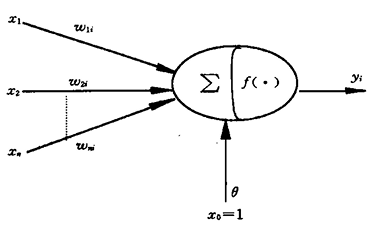

人工神经元是一个多输入单输出的非线性元件，输入输出关系如下，其中$$f$$为激发函数/作用函数/激活函数，常见的激活函数有阈值型、饱和型、双曲正切、sigmoid($$f(x) = \frac{1}{1 + \exp(-\beta x)}, \quad \beta > 0%$$)、高斯函数(在径向基函数 RBF 构成的神经网络中描述神经元结构$$f(x) = \mathrm{e}^{-x^2 / \theta^2}$$)

$$
\begin{aligned}
I_i & = \sum_{j = 1}^{n} w_{ji} x_j - \theta_i \\
y_i & = f(I_i)
\end{aligned}
$$

### 人工神经网络

目前已有数十种不同的神经网络模型，常见的有感知器 PA、循环神经网络 RNN、长短期记忆网络 LSTM、卷积神经网络 CNN、生成对抗网络 GAN、自动编码器 AE、变分自动编码器 VAE、残差神经网络 ResNet、Transformer 等。前馈型神经网络和反馈型神经网络是两种典型的网络结构。前馈型神经网络又称前向网络，主要信息流是单向的、感知器、BP 网络、CNN、ResNet、AE、VAE、Transformer 等都是前馈神经网络；反馈型神经网络存在大量反馈信息流，RNN 和 LSTM 就是典型的反馈神经网络。

前馈网络是一种强有力的学习系统，是一种静态非线性映射，缺乏丰富的动力学能力。静态是指网络的映射关系在网络参数固定的前提下不随时间而改变，不考虑输入输出的时序关系。大部分前馈网络都是学习网络，其分类能力和模式识别能力一般都强于反馈网络。前馈网络结构简单、易于编程训练，通过大量数据训练可有效提取数据特征。而反馈网络因存在反馈连接，结构和训练更复杂，训练过程易出现梯度消失或爆炸问题，影响分类和模式识别效果 。反馈型神经网络的所有节点都是一样的，之间可以相互连接，反馈神经网络是一种反馈动力学系统，需要工作一段时间后才能达到稳定。反馈网络处理序列数据较强。

### 神经网络的学习方法

学习方法可分为有监督学习、无监督学习和强化学习等几大类。神经网络中最常见的几种基本学习方法如下

1. Hebb 学习规则：无监督学习

$$
 \begin{aligned}
 I_i & = \sum_{j} w_{ij} x_j - \theta_j \\
 y_i & = f(I_i) = \frac{1}{1 + \exp(-I_i)} \\
 w_{ij}(k + 1) & = w_{ij}(k) + y_i y_j
 \end{aligned}
$$

2. Delta 学习规则：有监督学习，实现了误差中的梯度下降，使误差函数达到最小值；只适用于线性可分函数，无法用于多层网络。BP 网络的学习算法就是在 Delta 规则基础上发展起来的。其中$$d_p$$为期望的输出，$$y_p = f(WX_p)$$为网络的实际输出，令$$\theta_p=WX_p$$，$$\delta$$为误差传播函数

$$
 \begin{aligned}
 E_p & = \frac{1}{2} (d_p - y_p)^2 \\
 E & = \frac{1}{2} \sum_{p = 1}^{P} (d_p - y_p)^2 = \sum_{p = 1}^{P} E_p \\
 \nabla W & = \eta \left( - \frac{\partial E}{\partial W_i} \right) \\
 & = \eta\left( -\sum_{p = 1}^{P} \frac{\partial E_p}{\partial W_i} \right) \\
 \frac{\partial E_p}{\partial W_i} & = \frac{\partial E_p}{\partial \theta_p} \frac{\partial \theta_p}{\partial W_i} = \frac{\partial E_p}{\partial y_p} \frac{\partial y_p}{\partial \theta_p} X_{ip} = - (d_p - y_p) \cdot f'(\theta_p) \cdot X_{ip} \\
 \Delta W_i & = \eta \sum_{p = 1}^{P} (d_p - y_p) f'(\theta_p) \cdot X_{ip} \\
 \delta & = \frac{\partial E_p}{\partial \theta_p} = - \frac{\partial E_p}{\partial y_p} \frac{\partial y_p}{\partial \theta_p}
 \end{aligned}
$$

3. 概率式学习：从系统稳态能量的标准出发进行学习，能量越低概率越大；温度参数越大，不同状态出现概率的差越小，越容易跳出局部极小值到达全局极小值。概率式学习的典型代表是 Boltzmann 机学习规则，又称模拟退火算法，是基于模拟退火的统计优化方法。其中$$p_{ij}$$为网络受到学习样本的约束且系统达到平衡状态时第$$i$$个和第$$j$$个神经元同时为 1 的概率，$$p'_{ij}$$为系统自由运转状态且达到平衡状态时第$$i$$个和第$$j$$个神经元同时为 1 的概率

$$
 \begin{aligned}
 \Delta W_{ij} & = \eta (p_{ij} - p'_{ij}) \\
 w_{ij}(k + 1) & = w_{ij}(k) + \eta (p_{ij} - p'_{ij}), \quad \eta > 0
 \end{aligned}
$$

4. 竞争式学习：无监督学习，竞争式神经网络又称为自组织神经网络(自适应共振网络模型)，自阻值网络要求识别与输入最匹配的节点。竞争式学习的权向量经修正后对输入更敏感，关键不在于输出与外界期望一致，而在于调整权向量以反映观察事件的分布
   $$
    \Delta w_{ij} =
    \begin{cases}
    \alpha (u_i - w_{ij}), & i \in N_c \\
    0, & i \notin N_c
    \end{cases}
   $$

### 前向网络及其主要算法

#### 感知器

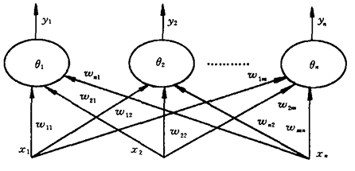

一个具有单层神经元的神经网络，由线性阈值元件组成，主要用于模式分类。单层感知器能解决一阶谓词逻辑问题，不能解决二阶谓词逻辑问题。感知器学习算法保证收敛的条件是要求函数是线性可分的

$$
\begin{aligned}
y(k) & = f\left( \sum_{i = 0}^{n} w_i(k) x_i \right) =
\begin{cases}
1, & \text{当 } \sum_{i = 0}^{n} w_i(k) x_i \geq 0 \\
-1, & \text{当 } \sum_{i = 0}^{n} w_i(k) x_i < 0
\end{cases} \\
& (x_0 = 1, \ w_0(0) = - \theta) \\
w_i(k + 1) & = w_i(k) + \eta [d(k) - y(k)] x_i \\
& i = 0, 1, 2, \cdots, n
\end{aligned}
$$

#### BP 网络

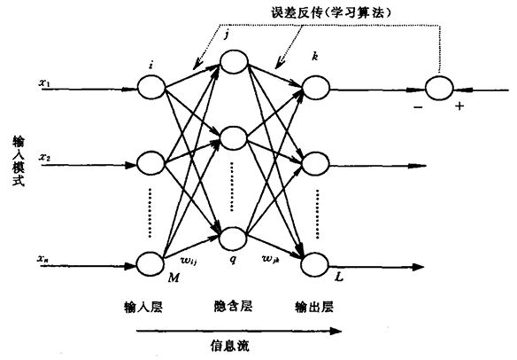

BP 网络是一种单向传播的多层前向网络，在多个领域都有广泛应用。BP 算法的基本思想是最小二乘法，采用梯度搜索技术，使均方误差值最小。在感知器的基础上，用可微函数代替阈值函数，并用梯度法来修正权值，就得到 BP 网络(误差反向传播网络)。输入逐层传向输出，若在输出层得不到期望的输出则转入反向传播，将误差信号返回，通过修改各层神经元的权值使误差信号最小。

前馈计算过程如下，假设用用某一固定样本的输入输出模式$$X_p$$和$$d_{pk}$$对网络进行训练，暂时将公式中样本$$p$$的记号省略

$$
\begin{aligned}
&f(x) = \frac{1}{1+e^{-x}} \quad f'(x) = f(x)[1 - f(x)]\\
&输入层第ｉ个节点的输出\quad O_i \\
&隐含层第j个节点的输入\quad \mathrm{net}_j = \sum_{i = 1}^{M} w_{ij} O_i \\
&隐含层第j个节点的输出\quad O_j= f(\mathrm{net}_j)= \frac{1}{1 + \mathrm{e}^{ - \frac{(\mathrm{net}_j - \theta_j)}{\theta_0} }} \\
&输入层第k个节点的输入\quad \mathrm{net}_k=\sum_{j = 1}^{q} w_{jk} O_j \\
&输入层第k个节点的输出\quad O_k=f(\mathrm{net}_k)\\
\end{aligned}
$$

网络权值调整规则如下，为基于最小均方误差的一阶梯度法的优化方法，其中$$P$$为样本-模式对的数量，$$L$$为网络输出节点数，$$\eta$$为学习速率，$$\delta_k$$为反传误差信号，同样暂时将公式中样本$$p$$的记号省略

输出层权系数调整

$$
\begin{aligned}
E & = \frac{1}{2} \sum_{k = 1}^{L} (d_k - O_k)^2 \\
\Delta w_{jk} & = - \eta \frac{\partial E}{\partial w_{jk}} \\
& = \eta O_k (1 - O_k) (d_k - O_k) O_j\\
& = \eta \delta_k O_j\\
\delta_k & = O_k (1 - O_k) (d_k - O_k) \\
\end{aligned}
$$

隐含层节点权系数调整

$$
\begin{aligned}
\Delta w_{ij} & = - \eta \frac{\partial E}{\partial w_{ij}}\\
& = \eta \left( - \frac{\partial E}{\partial O_j} \right) f(\mathrm{net}_j)[1-f(\mathrm{net}_j)] O_i \\
- \frac{\partial E}{\partial O_j} & = - \sum_{k = 1}^{L} \frac{\partial E}{\partial \mathrm{net}_k} \frac{\partial \mathrm{net}_k}{\partial O_j} \\
& = \sum_{k = 1}^{L} \delta_k w_{jk} \\
故\Delta w_{ij} & = \eta \left( \sum_{k = 1}^{L} \delta_k w_{jk} \right) f(\mathrm{net}_j)[1-f(\mathrm{net}_j)] O_i \\
& = \eta \delta_j O_i \\
\delta_j & = \left( \sum_{k = 1}^{L} \delta_k w_{jk} \right) f(\mathrm{net}_j)[1-f(\mathrm{net}_j)]\\
\end{aligned}
$$

考虑样本标记$$p$$后

$$
\begin{aligned}
& \text{对于输出节点 } k:
\Delta_p w_{jk} = \eta f'(\mathrm{net}_{pk}) (d_{pk} - O_{pk}) O_{pj} = \eta O_{pk} (d_{pk} - O_{pk}) O_{pj} \\
& \text{对于隐含节点 } j:
\Delta_p w_{ij} = \eta f'(\mathrm{net}_{pj}) \left( \sum_{k = 1}^{L} \delta_{pk} w_{jk} \right) O_{pi} = \eta O_{pj} (1 - O_{pj}) \left( \sum_{k = 1}^{L} \delta_{pk} w_{jk} \right) O_{pi}
\end{aligned}
$$

因此设计网络连接权值调整式子如下，其中$$\alpha \in [0, 1]$$为平滑因子

$$
w_{ij}(t + 1) = w_{ij}(t) + \eta\delta_jO_i + \alpha[w_{ij}(t) - w_{ij}(t - 1)]
$$

使用 BP 算法需要注意：学习开始时，各隐含层连接权系数应设置较小的随机数为宜；使用 sigmoid 激活函数时，输出智能趋于 1 或 0 而不能达到，因此期望分量设置 0.9 或 0.1 较为适宜；开始时可以选较大的学习率，学习接近优化区时必须选相当小的学习率；平滑因子$$\alpha$$取 0.9 左右。

例如：

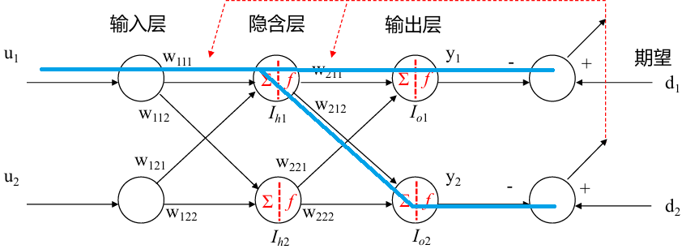

前馈

$$
\begin{cases}
I_{h1}=w_{111} \cdot u_1 + w_{121} \cdot u_2\\
I_{h2}=w_{112} \cdot u_1 + w_{122} \cdot u_2\\
\end{cases}
\quad
\begin{cases}
O_{h1}=f(I_{h1})\\
O_{h2}=f(I_{h2})\\
\end{cases}
$$

$$
\begin{cases}
I_{o1}=w_{211} \cdot O_{h1}+w_{221} \cdot O_{h2}\\
I_{o2}=w_{212} \cdot O_{h1}+w_{222} \cdot O_{h2}\\
\end{cases}
\quad
\begin{cases}
y_1 = O_{o1}=f(I_{o1})\\
y_1 = O_{o2}=f(I_{o2})\\
\end{cases}
$$

反馈

$$
E=\frac{1}{2}(d_1 - y_1)^2+\frac{1}{2}(d_2 - y_2)^2
$$

以$$\frac{\partial E}{\partial w_{111}}$$为例

$$
\begin{aligned}
\frac{\partial E}{\partial w_{111}}&=\frac{\partial E}{\partial y_1}\frac{\partial y_1}{\partial I_{o1}}\frac{\partial I_{o1}}{\partial O_{h1}}\frac{\partial O_{h1}}{\partial I_{h1}}\frac{\partial I_{h1}}{\partial w_{111}}\\
&+\frac{\partial E}{\partial y_2}\frac{\partial y_2}{\partial I_{o2}}\frac{\partial I_{o2}}{\partial O_{h1}}\frac{\partial O_{h1}}{\partial I_{h1}}\frac{\partial I_{h1}}{\partial w_{111}}
\end{aligned}
$$

其中

$$
\begin{aligned}
\frac{\partial E}{\partial y_1}&=y_1 - d_1 &\frac{\partial y_1}{\partial I_{o1}}&=f'(I_{o1}) &\frac{\partial I_{o1}}{\partial O_{h1}}&=w_{211} &\frac{\partial O_{h1}}{\partial I_{h1}}&=f'(I_{h1})\\
\frac{\partial E}{\partial y_2}&=y_2 - d_2 &\frac{\partial y_2}{\partial I_{o2}}&=f'(I_{o2}) &\frac{\partial I_{o2}}{\partial O_{h1}}&=w_{212} &\frac{\partial I_{h1}}{\partial w_{111}}&=u_1
\end{aligned}
$$

由于许多计算共享因果链条，所以有许多重复计算，因此定义误差反传信号$$\delta = -\frac{\partial E}{\partial I}$$

$$
\begin{aligned}
\frac{\partial E}{\partial w_{211}}&=-\delta_{o1} \cdot O_{h1} &\frac{\partial E}{\partial w_{111}}&=-\delta_{h1} \cdot u_1\\
\frac{\partial E}{\partial w_{221}}&=-\delta_{o1} \cdot O_{h2} &\frac{\partial E}{\partial w_{121}}&=-\delta_{h1} \cdot u_2\\
\frac{\partial E}{\partial w_{212}}&=-\delta_{o2} \cdot O_{h1} &\frac{\partial E}{\partial w_{112}}&=-\delta_{h2} \cdot u_1\\
\frac{\partial E}{\partial w_{222}}&=-\delta_{o2} \cdot O_{h2} &\frac{\partial E}{\partial w_{122}}&=-\delta_{h2} \cdot u_2
\end{aligned}
$$

解决 BP 网络陷入局部极小的方法：附加动量法、自适应学习率法、动态误差分割法

#### RBF 网络

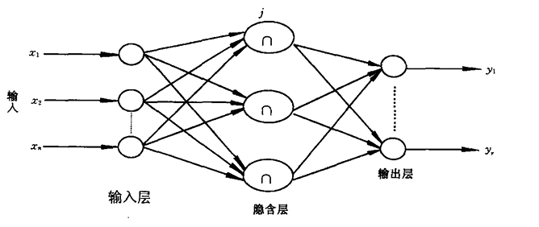

径向基函数神经网络，是一种局部逼近的神经网络，对于输入空间的某个局部区域，只有少数几个连接权影响网络的输出，从而使局部逼近网络具有学习速度快的优点。隐含层节点由高斯函数的作用函数构成，输出节点通常为简单的线性函数，即输出为隐含层的线性组合。RBF 的学习过程与 BP 网络类似，两者区别在于使用不同的激活函数，RBF 的激活函数为高斯基函数，是局部的。

(当 BP 网络的隐含层使用 S 型函数时，对于输入空间中的任何一个点，网络的输出都是所有隐含层神经元输出的加权组合。因为 S 型函数的定义域是整个实数域，其输出会受到输入空间中所有点的影响，所以 BP 网络是全局逼近的神经网络。对于给定的输入，只有那些中心靠近输入数据点的高斯函数才会产生较大的输出，而远离输入数据点的高斯函数输出趋近于零。因此，RBF 网络对于输入空间中的某个点的输出主要由靠近该点的局部区域内的隐含层神经元决定，具有局部逼近的特性)

$$
\begin{aligned}
\mu_j(x)&=\exp\left[-\frac{(x - c_j)^2}{\sigma_j^2}\right],\quad j = 1,2,\cdots,q\\
y_i&=\sum_{j = 1}^{q}\omega_{ij}\mu_j(x),\quad i = 1,2,\cdots,r
\end{aligned}
$$

### 反馈网络

#### Hopfield 网络

一种全连接加权无向图，分为离散型和连续性两种，图中为离散型，激活函数为双极性阈值函数，离散 Hopfiled 网络为一个离散非线性动力学系统，如果系统稳定则将收敛到一个稳定状态；如果系统不稳定则会出现限幅的自持振荡或极限环。若将稳态视为记忆样本，初态认为是给定样本的部分信息，则网络改变的过程可以认为是从部分信息找到全部信息，实现联想记忆的功能。若将稳态与某种优化的目标函数相对应并作为目标函数极小值，则初态朝稳态的收敛过程就是优化计算过程。

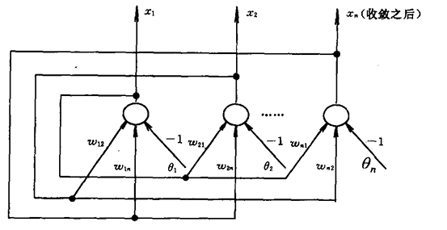

网络有异步和同步两种工作方式

- 异步方式：每次只有一个神经元节点进行状态的调整计算

$$
 \begin{aligned}
 x_i(k + 1) & = f\left(\sum_{j = 1}^{n}w_{ij}x_j(k)-\theta_i\right) \\
 x_j(k + 1) & = x_j(k),\quad j\neq i
 \end{aligned}
$$

- 同步方式：所有神经元节点同时调整状态
  $$
   \begin{aligned}
   x_i(k + 1) & = f\left(\sum_{j = 1}^{n}w_{ij}x_j(k)-\theta_i\right),\quad \forall i \\
   X(k + 1) & = F(WX(k)-\theta)=F(s)
   \end{aligned}
  $$

同步方式对连接权的要求更高，若不满足非负定对称阵的要求，则网络可能出现自持振荡， 即极限环。 异步工作方式比同步方式有更好的稳定性，可以证明对于任意初态，网络都将最终收敛到一个吸引子，使用时多采用异步工作方式。其缺点是，失去了神 经网络并行处理的优点。

#### Boltzmann 机网络

Boltzmann 机网络是一个相互连接的神经网络模型(简称 BM 网络)，具有对称的对称连接权系数，即$$\omega_{ij} = \omega_{ji}$$，且$$\omega_{ii} = 0$$。每个神经元都根据自己的能量差$$\Delta E_{i}$$随机地 改变自己或为 1 或为 0 的状态，即当神经元的输入加权和发生变化时，神经元的状态随之改变。

各神经元之间状态为异步更新，其中神经元$$i$$输出 1 的概率为$$p_i = p_1=\frac{1}{1 + \mathrm{e}^{-\Delta E_i/T}}=\frac{1}{1 + \mathrm{e}^{-s_i/T}}$$，其中$$T$$为网络的温度参数，$$s_i$$为神经元的当前状态

$$
\begin{aligned}
s_i & = \sum_{i = 1}^{n}w_{ij}x_j - \theta_i \\
x_i & = f(s_i) =
\begin{cases}
1 \quad if \,\, rand < p_i\\
0 \quad otherwise
\end{cases}
\end{aligned}
$$

Boltzmann 机的运行分为学习训练和工作两个阶段，学习过程为：设置初始权值和温度，按照已知的概率给定学习样本，分别在样本约束和自由无约束条件下运行模拟退火网络直至平滑，统计$$p_{ij}$$和$$p'_{ij}$$，按照公式修改权值，重复迭代直到$$p_{ij} - p'_{ij}$$小于一定的容限

$$
\begin{aligned}
\frac{\partial G(w_{ij})}{\partial w_{ij}}&=-\sum_{\alpha = 1}^{2^m}\frac{p(x_{\alpha})}{p'(x_{\alpha})}\frac{\partial p'(x_{\alpha})}{\partial w_{ij}}\\
&=-\frac{1}{T}\left[\sum_{\alpha = 1}^{2^m}\sum_{\beta = 1}^{2^r}p(x_{\alpha}\land y_{\beta})x_i^{\alpha\beta}x_j^{\alpha\beta}-\sum_{\lambda = 1}^{2^m}\sum_{\mu = 1}^{2^r}p'(x_{\alpha}\land y_{\beta})x_i^{\lambda\mu}x_j^{\lambda\mu}\right]\\
&=-\frac{1}{T}(p_{ij}-p'_{ij})\\
w_{ij}(k + 1)&=w_{ij}(k)+\eta(p_{ij}-p'_{ij}),\quad \eta>0
\end{aligned}
$$

- Boltzmann 机处于某一状态的概率主要取决于在此状态下的能量 E，能量越低，慨率越大
- 此概率还取决于温度参数 T，T 越大，不同状态出现概率的差异就越小，越容易跳出能量的局部极小点而达到全局极小点。T 越小时情形相反。这也是采用模拟退火方法寻求全局最优的原因所在。

### Boltzman 机和 Hopfield 网络的异同

相似之处

- 相同的能量函数
- 类似结构，均为单层反馈网络
- 离散 Hopfield 网络是 Boltzmann 机的特例
- 都包含学习训练和工作两个阶段

不同之处：Hopfield 网络是确定型的，Boltmann 机是随机网络按概率取值，Boltmann 机可跳出局部极小值

#### 自组织特征映射网络

又称 Kohohen 网络，无监督学习，各神经元的连接权值具有一定分布特性，最邻近的神经元互相激励，而较远的神经元则相互抑制，更远一些的则又具有较弱的激励作用，在外界刺激最强的地方形成一个气泡，在气泡区域中，神经元权向量会自动调节直到与输入向量的某一最大主分量重合为止

SOM 算法

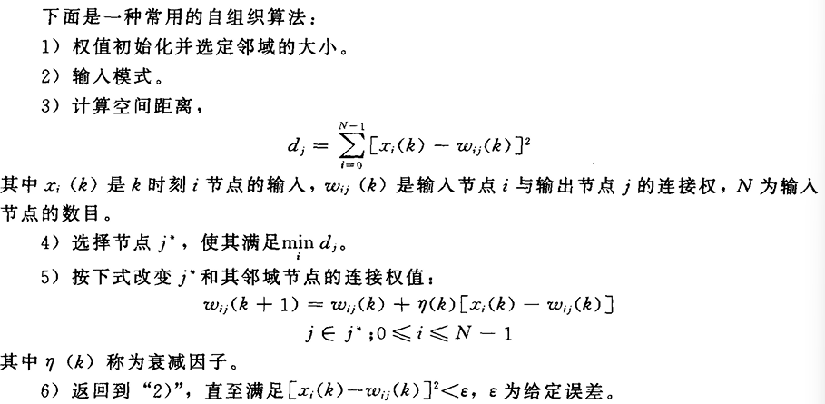

自组织特征映射网络是一种具有侧向联想能力的神经网络，其输出节点呈二维阵列分布。每个输入节点与输出节点之间由可变权值连接。通过某种规则，不断地调整权值，直到在稳定时每一邻域的所有节点对某种输入具有类似的输出，并且这种聚类的概率分布与输入模式的分布相近。

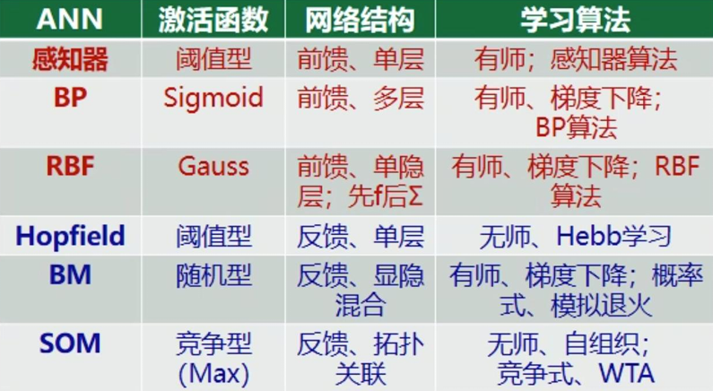

### 神经网络控制

NN 在控制系统中的作用包括辨识器、控制器、优化计算、故障诊断、参数调节、与 GA、FS、专家控制等其它方法混合、混合功能

#### 间接 NN 控制系统

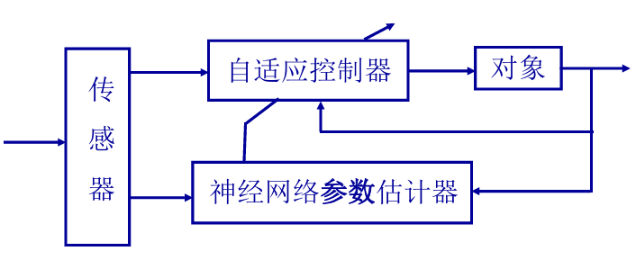

神经网络参数估计器的输入为来自环境因素的传感器信息和系统的输出信息。参数估计器根据控制性能、控制律和环境约束建立目标函数，用类似于 Hopfield 网络等来实现目标函数的优化计算。神 经网络的输出则为自适应控制器的参数。

#### 直接 NN 控制系统

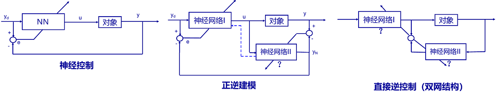

神经网络 I 作为前馈控制器，它的特性恰好为对象特性的逆。当控制器输入$$d$$为系统的期望输出时， 则系统的实际输出为$$y = f[u]=f\left[f^{-1}(d)\right]=d$$即实现了理想的控制效果。神经网络 II 的作用是通过间接学习，改变网络的连接权值，以便获得$$f^{-1}[\cdot]$$的映射特性。 神经网络 I 与神经网络 II 具有相同的结构和连接权值，即具有相同的映射特性。它们均可通过采用 BP 网络实现。内模控制就是一种直接 NN 控制系统。

## 第六章 模糊控制

精确数学中，普通集合用特征函数来刻画，用精确的 0 和 1 来刻画一个元素是否属于一个集合，非此即彼；模糊集论中用隶属度函数$$\mu_A(x)$$表示$$x \in A$$的程度($$\mu_A(x)$$取值范围在 0-1 之间)，将其推广到属于的程度，对每一个元素有一个隶属度$$\mu_A$$表示元素属于的程度，是精确数学的一般化。

常见的隶属函数有：三角形、半角形、梯形、半梯形、钟形/正态形、矩形、Z 形、S 形、单点形等

模糊性和随机性是两个概念，模糊性是由于对象无精确定义造成的。因此对它的描述需要采用隶属函数。而随机性是在事件是否发生的不确定性中表现出来的不确定性，而事件本身的状态和类属是确定的。事件本身是模糊的，出现与不出现之间没有明确的分界线。事件本身没有明确定义，事件是否出现没有精确的判别准则。既有随机性又有模糊性，称为模糊随机事件。

### 模糊集合

集合是指具有某种属性的、确定的、彼此间可以区别的事物的全体。被考虑对象的所有元素的全体称为论域，每个对象称为元素或元。

定义：设$$X$$为论域，$$\mu_A$$为$$X$$上的一个实值函数来表示，即$$\mu_A:X \to [0, 1]$$，对于$$x \in X$$，称为$$\mu_A$$对模糊集合$$A$$的隶属度，而$$\mu_A(x)$$称为隶属度函数。

### 模糊集合表示法

有向量表示法，Zadeh 表示法和序偶表示法，核心都是将论域中的元素和它的隶属度对应起来，其中向量表示法由于按顺序只表示除了隶属度值而没有表示出论域中的元素，所以不能省略隶属度为 0 的元素

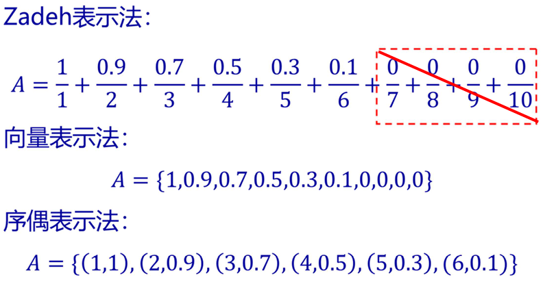

### 模糊集合间的运算

模糊集合的运算是对隶属度值进行操作

$$
\begin{aligned}
& \text{相等: } A = B \Leftrightarrow \mu_A(x) = \mu_B(x), \forall x \in X \\
& \text{包含: } A \subseteq B \Leftrightarrow \mu_A(x) \leqslant \mu_B(x), \forall x \in X \\
& \text{空集: } \varnothing: \mu_{\varnothing}(x) = 0, \forall x \in X \\
& \text{全集: } X: \mu_X(x) = 1, \forall x \in X \\
& \text{并集/加法: } \mu_{A \cup B}(x)=\mu_A(x)\vee\mu_B(x)
= \max(\mu_A(x), \mu_B(x)), \forall x \in X \\
& \text{交集/乘法: } \mu_{A \cap B}(x)=\mu_A(x)\wedge\mu_B(x)= \min(\mu_A(x), \mu_B(x)), \forall x \in X \\
& \text{补集: } \mu_{\overline{A}}(x) = 1 - \mu_A(x), \forall x \in X \\
& \text{代数积: } \mu_{A \cdot B}(x) = \mu_A(x) \cdot \mu_B(x), \forall x \in X \\
& \text{代数和: } \mu_{A + B}(x) = \mu_A(x) + \mu_B(x) - \mu_A(x) \cdot \mu_B(x), \forall x \in X \\
& \text{有界和: } \mu_{A \oplus B}(x)=(\mu_A(x) + \mu_B(x))\wedge 1
= \min(1, \mu_A(x) + \mu_B(x)), \forall x \in X \\
& \text{有界差: } \mu_{A \ominus B}(x)=(\mu_A(x) - \mu_B(x))\vee 0
= \max(0, \mu_A(x) - \mu_B(x)), \forall x \in X \\
& \text{有界积: } \mu_{A \odot B}(x)=(\mu_A(x) + \mu_B(x) - 1)\vee 0
 = \max(0, \mu_A(x) + \mu_B(x) - 1), \forall x \in X
\end{aligned}
$$

### 模糊集合间的关系及其运算

集合之间的笛卡尔积，给定集合$$X$$和$$Y$$，由全体$$(x, y)$$组成的集合$$(x \in X, y \in Y)$$称为两者的笛卡尔积，记为$$X\times Y=\{(x,y)|x\in X, y\in Y\}$$。在笛卡尔积的基础上定义关系$$R\subseteq X\times Y$$，若$$(x, y) \in R$$，则称$$X$$和$$Y$$有关系$$R$$，记为$$xRy$$。

在模糊数学中，可以用关系矩阵来表示这种集合$$R = [r_{ij}], r_{ij} = \mu_R(x_i, y_j)$$，即关系矩阵中的元素表示了$$(x, y)$$有多大程度上有关系$$R$$，关系$$R$$为以$$X\times Y$$为论域的一个模糊集合。

#### 模糊关系运算

设模糊矩阵$$R$$和$$Q$$为$$X\times Y$$上的模糊关系，模糊关系的运算包括

$$
\begin{aligned}
& \text{模糊矩阵并} \quad R\cup Q=(r_{ij} \vee q_{ij}) \quad 取大(注意需要保证维度相同)\\
& \text{模糊矩阵交} \quad R\cap Q=(r_{ij} \wedge q_{ij}) \quad 取小(注意需要保证维度相同)\\
& \text{模糊矩阵补} \quad R^{c}=(1 - r_{ij}) \quad 取1-x\\
\end{aligned}
$$

#### 模糊关系合成

设$$R$$是$$X\times Y$$中的模糊关系，$$S$$是$$Y\times Z$$中的模糊关系，$$R$$和$$S$$的合成定义在$$X\times Z$$上，其元素$$q_{ij}$$计算方式如下，类似于矩阵乘法，注意中间的维度需要相等

$$
\begin{aligned}
&Q = R\circ S\\
&\mu_{R\circ S}(x,z)=\vee\{\mu_R(x,y)\land\mu_S(y,z)\} \quad 先取小再取大
\end{aligned}
$$

模糊变换是隶属度关于函数关系/映射的传输关系，具体来说即给定关系和输入算输出的过程。推理规则就是一种模糊变换，将一个论域的模糊集变换到另一个论域的模糊集合。在模糊推理中，已知的判断/推理的出发点称为前件，由前提推出的新判断/结论称为后件。例如，有 IF E AND C, THEN U 的推理规则 R，则

$$
\begin{aligned}
U^*&=(E^* \times C^*) \circ R
\end{aligned}
$$

#### 扩张原理

设$$f:X\rightarrow Y$$是一个从集合$$X$$到集合$$Y$$的映射。对于$$X$$上的模糊集合$$A$$，通过映射$$f$$可以诱导出$$Y$$上的模糊集合$$B$$，其隶属函数定义如下。直观来说，就是把$$X$$中能通过$$f$$映射到$$y$$的所有$$x$$在$$A$$中的最大隶属度赋予$$Y$$中元素$$y$$在$$B$$中的隶属度

$$
\mu_{B}(y)=\begin{cases} \underset{f(x)=y}{\bigvee}\mu_{A}(x)& \text{若存在 }x\in X\text{ 使得 }f(x) = y\\
0 & \text{若不存在 }x\in X\text{ 使得 }f(x) = y \end{cases}
$$

例如，设$$X = \{1, 2, 3\}$$，$$Y = \{a, b\}$$，映射$$f:X\rightarrow Y$$定义为$$f(1)=a$$，$$f(2)=b$$，$$f(3)=b$$，X 上的模糊集合$$A=\{(1, 0.3),(2, 0.7),(3, 0.5)\}$$，求$$B$$的过程如下

- 对于$$y = a$$，因为只有$$x = 1$$满足$$f(1)=a$$，所以$$\mu_{ B }(a)=\mu_{ A }(1)= 0.3$$。
- 对于$$y = b$$，满足$$f(x)=b$$的$$x$$有$$x = 2$$和$$x = 3$$，$$\mu_{ A }(2)=0.7$$，$$\mu_{ A }(3)=0.5$$，取大运算$$\mu_{ B }(b)=\underset{f(x)=b}{\bigvee}\mu_{ A }(x)=\max\{0.7, 0.5\}=0.7$$。

因此$$B =\{(a, 0.3),(b, 0.7)\}$$。

### 模糊推理规则

模糊推理是一种以接近人的思维方式建立的规则系 统，以语言作为描述手段，人类的知识可以通过模 糊规则显式地表达出来，可解释性强，便于理解

- IF A, THEN B：$$R = A\times B = A^T\circ B$$
- IF A, THEN B; IF 非 A, THEN C：$$R_1=(A\times B)\cup(\overline{A}\times C)=(A^T\circ B)\cup(\overline{A}^T\circ C)$$
- IF A OR D, THEN B：$$R=(A\cup D)\times B=(A\cup D)^T\circ B$$
- IF A AND E, THEN B：$$R = A\times E\times B= (\overrightarrow{A^T\circ E})^T\circ B$$，其中$$\overrightarrow{(\cdot)}$$表示展开为行向量，$$\overrightarrow{(\cdot)}^T$$表示展开为列向量

### 模糊控制原理

模糊控制的基本思想是用计算机或其他装置模拟人对系统的控制过程，核心是将模糊概念转化为精确的控制参数。模糊控制的过程大致分为三步：精确测量值经过输入模糊化变为模糊集、由模糊推理规则/模糊决策得到控制作用的模糊集、将控制作用输出的模糊集按照一定规则逆模糊化为精确值

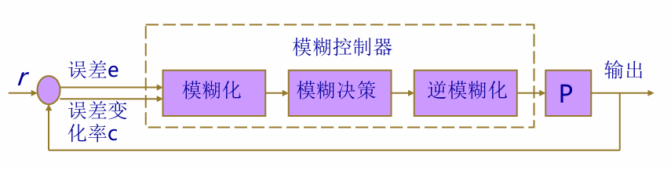

#### 输入模糊化

常用的模糊集如$$\{NB、NM、NS、ZE、PS、PM、PB\}$$，不妨分别设为整数的$$[-3, 3]$$，将输入的论域$$[a, b]$$映射到模糊集上(即-3 到 3 之间的实数)

$$
\begin{aligned}
y&=\frac{6}{b - a}\left[x - \frac{a + b}{2}\right]
\end{aligned}
$$

隶属函数分布图(以映射到$$[-6, 6]$$为例)

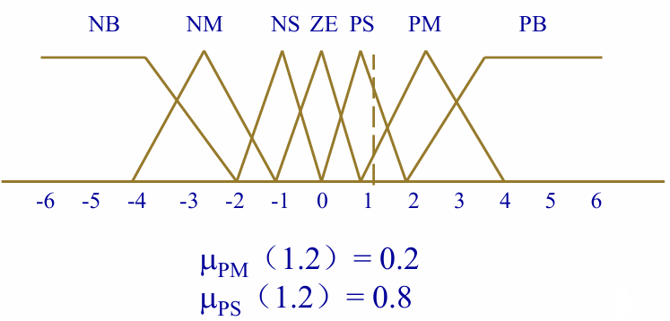

#### 模糊决策

模糊控制规则的表示有综合法和并行法两种

- 综合法先求对应于模糊规则的模糊集，再根据输入求模糊输出，即先将所有规则综合成一条总的规则，然后求该规则下的输出
- 并行法先不求模糊规则对应的模糊集(模糊关系表示)，而是利用输入与每条规则的前件进行匹配(使用蕴含算子 Implication)，确定规则的激励强度$$\alpha$$，最后综合所有的输出(使用聚合算子 Aggregation)。并行法将各规则独立存放起来，能清楚知道输出模糊集中每条规则所起的作用，并能方便地编辑规则。激励强度反映了过程的状态值和一条规则的前件匹配的程度，也表征这条控制规则对最终控制作用贡献的大小。
  $$
  \begin{aligned}
  \alpha&=\underset{x\in X}{\vee}\{\mu_{A^*}(x)\wedge\mu_A(x)\}
  \end{aligned}
  $$

模糊决策的类型有三

- 最小运算规则型模糊决策

  $$
  \begin{aligned}
  \mu_{U_i'}(v)&=\alpha_i \wedge \mu_{U_i}(v)\\
  \mu_{U'}(v)&=\max(\mu_{U_i'}(v))
  \end{aligned}
  $$

  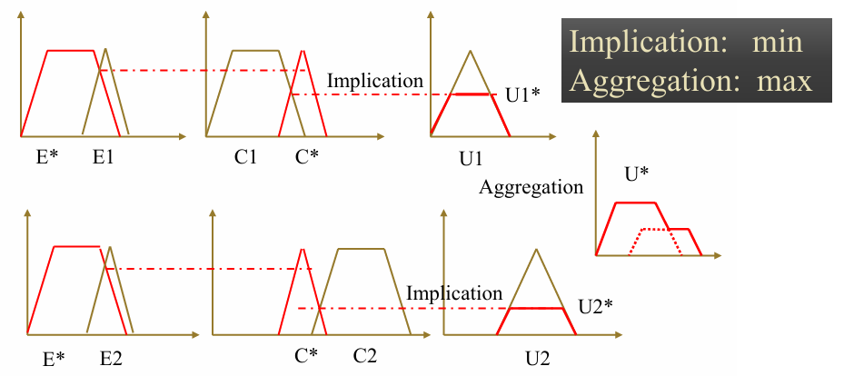

- 乘积运算规则型模糊决策

  $$
  \begin{aligned}
  \mu_{U_i'}(v)&=\alpha_i\cdot\mu_{U_i}(v)\\
  \mu_{U'}(v)&=\max(\mu_{U_i'}(v))
  \end{aligned}
  $$

  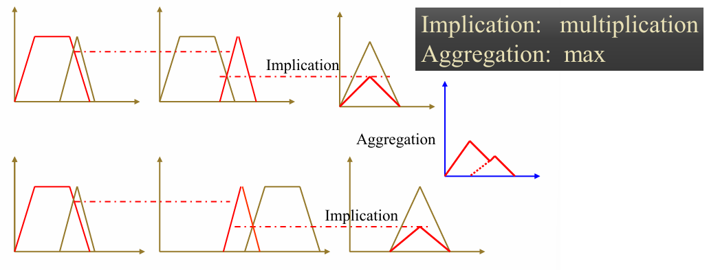

- 状态评价函数型模糊决策：这种方式直接得出了控制作用的清晰值，无需逆模糊化过程
  $$
  \begin{aligned}
  y&=\frac{\sum_{i = 1}^{N}\alpha_i f_i(x_1, \cdots x_n)}{\sum_{i = 1}^{N}\alpha_i}
  \end{aligned}
  $$

#### 输出逆模糊化

有四种方法

- 最大隶属度法：模糊决策得出的模糊集$$U$$的隶属度最大的元素作为控制输出的精确值
- 加权平均法：
  - 普通加权平均法/重心法：$$u=\frac{\sum_{i = 1}^{N}\mu(u_i)u_i}{\sum_{i = 1}^{N}\mu(u_i)}$$
  - 算术加权平均法：$$u=\frac{\sum_{i = 1}^{N}k_iu_i}{\sum_{i = 1}^{N}k_i}$$
- 取中位法：取将输出隶属函数曲线与横坐标之间的面积平分为两等份的数
- 左取大法/右取大法：取输出隶属度函数左边/右边达到最大值时对应的变量值作为清晰值

## 第七章 专家控制

### 专家系统

#### 定义

一类包含着知识和推理的智能计算机程序，其内部含有大量的某个领域专家水平的知识和经验，能够利用人类专家的知识和解决问题的方法来处理该领域的问题，以人类专家的水平完成特别困难的某一专业领域任务的计算机程序系统，是基于知识的系统。

专家系统可以解决的问题一般包括解释、预测、诊断、设计、规划、监视、修理、指导和控制等。其关键是表达和运用专家知识，即来自人类的并已被证明对解决有关领域内的典型问题是有用的事实和过程专家系统所要解决的问题一般没有算法解，并且经常要在不完全、不精确或不确定的信息基础上做出结论。

第一代专家系统只利用人类专家的启发式知识，即只利用浅层表达方式和推理方法。但遇到新问题时，还必须利用掌握的深入表示事物的结构、行为和功能等方面的基本模型等深层知识得出新的启发式浅层知识。旨在模拟人类专家的智能程序(专家系统)应当兼备浅层和深层两类知识。即不但采用基于规则的方法，还必须采用基于模型的原理构成新一代的专家系统。

#### 基本组成

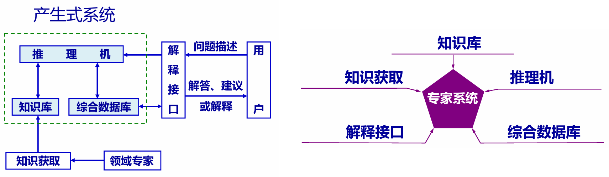

#### 特征及类型

特征：

- 具有专家水平的专业知识
- 能进行有效的推理
- 专家系统的透明性和灵活性
- 具有一定的复杂性与难度

类型：演绎型、经验型、工具型、咨询型

根据求解问题的性质分：诊断型、解释型、预测型、设计型、控制型、教学型、监视型

### 专家控制系统

#### 定义

专家控制是把专家系统的理论和技术同控制理论、方法与技术相结合，在未知的环境下，仿效专家的智能，实现对系统的控制。

专家控制系统具有全面的专家系统结构、完善的知识处理功能和实时控制的可靠性能。采用黑板等结构，知识库庞大，推理机复杂，包括知识获取子系统和学习子系统，人-机接口要求较高。

专家控制器多为工业专家控制器，是专家控制系统的简化形式，针对具体的控制对象或过程，着重于启发式控制知识的开发，具有实时算法和逻辑功能。知识库小、推理机制简单、无人-机接口。

#### 专家控制与专家系统的区别

- 专家系统的推理结果一般用于辅助用户的决策
- 专家控制则能对控制动作进行独立的、自动的决策
- 专家系统离线工作，专家控制则在线工作

#### 工作原理

专家控制系统由知识基系统、数值算法库和人-机接口三个并发运行的子过程构成。系统的控制器由位于下层的数值算法库和位于上层的知识基子系统两大部分组成。

#### 知识基系统的内部组织和推理机制

- 控制的知识表示
- 知识基系统的黑板法模型
- 控制的推理模型

#### 性能指标

使系统达到或近似专家控制的性能指标

#### 专家控制器

包括直接专家控制器和间接专家控制器

- 直接专家控制器：通常由知识库(KB)、控制规则集(CRS)、推理机(IE)和特征识别与信息处理四部分组成

  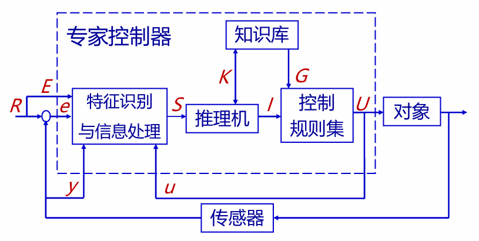

- 间接式专家控制器：基于知识的控制系统。包括算法知识和逻辑知识，二者可以分离。例如专家整定 PID 控制系统，专家起协调作用。根据被控对象的变化，形成参数的调试规程

  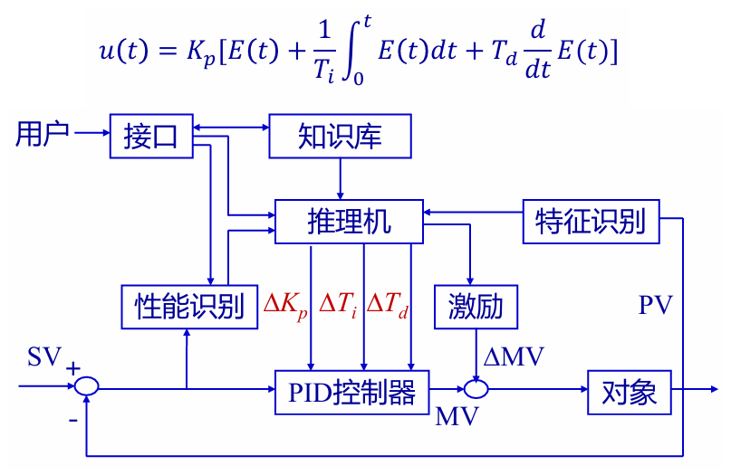
