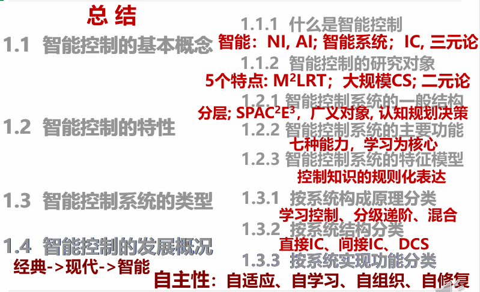

---
title:智能控制基础
description: 课程笔记
author: Hatrix
date: 2025-03-04 15:20:00 +0800
categories: [控制原理]
tags: [课程笔记]
math: true
mermaid: true
---

## 概述

60%开卷考试+40%作业出勤，作业在i北理提交

课程内容：概述、知识工程基础、分级递阶控制、遗传算法、神经网络、模糊控制、专家控制

控制理论的发展大致分为三个阶段：经典控制（微分方程模型，传递函数、SISO、频域分析）——现代控制（卡尔曼的状态空间模型，状态方程，MIMO，时域分析）——智能控制。

经典控制和现代控制都是模型驱动范式，需要经历建模、收集数据、参数估计，然后基于模型设计控制器，又叫间接数据驱动；而智能控制是数据驱动范式，直接从收集的数据里设计控制器，又叫直接数据驱动（比如强化学习就是无模型的控制，无模型的优化，典型的直接数据启动。

反馈的可以易于控制和调节系统暂态响应，改进稳态误差，降低对系统参数变化和外部扰动的敏感度；相应地会增加系统复杂度，导致增益损失，并可能带来不稳定

控制系统的$$SPACE^3$$模型：

---

智能控制是一类无需(或仅需尽可能少的)人的干预就能够**独立**地驱动智能机器实现其目标的自动控制，是智能机器**自主**地实现目标的过程，是研究与**模拟**人类智能活动信息传递与处理的规律。智能控制是应用人工智能的理论与技术和运筹学的优化方法，并将其同控制理论方法与技术相结合，在未知环境下，仿效自然智能，实现对系统的控制。智能控制的研究对象是各种大规模的复杂系统。智能控制引入人工智能的思想，改变控制策略去适应对象的复杂性和不确定性。智能水平是在人不干预的情况下系统独立完成各项任务 的能力和性能。人的干预次数是一个指标。

智能控制系统的特性如下：

- 特征模型：是对系统动态特性的一种定性与定量相结合的描述。是针对问题求解和控制指标的不同要求，对系统动态信息空间的一种划分。
- 特征记忆：是指智能控制器对一些特征信息的记忆。反映控制前期决策与控制的效果。如：误差出现的极值、误差极值之间的时间间隔、误差的过零速度等。特征记忆有利于有效地利用控制的 储存容量，消除冗余。可构成判断系统稳定性的特征模型，也可作为智能控制系统稳定性监控的依据。
- 控制决策模态：是当前特征状态和特征记忆量与输出信息之间的某种定量或定性的映射关系。比如：if 前提条件 then 结论或动作。

---

智能控制系统的分类如下：

按系统构成原理分类：

- 学习控制系统
- 分级递阶智能控制系统
- 专家控制系统
- 模糊控制系统
- 神经网络控制系统
- 基于规则的仿人智能控制系统
- 集成智能控制系统
- 组合智能控制系统

按系统结构分类：

- 直接智能控制系统
- 间接智能控制系统
- 分级递阶智能控制系统
- 集散智能控制系统（DCS）

按系统实现功能分类：

- 智能自适应控制系统
- 智能自组织控制系统
- 智能自学习控制系统
- 智能自修复控制系统

---

发展状况：

- 经典控制：线性定常系统、SISO、传递函数/频域、反馈控制（PID控制）、调节器
- 现代控制：线性/具有一定非线性/分布参数系统、MIMO、状态空间法/时域、卡尔曼滤波、极大值原理、动态规划、最优/随机/自适应
- 智能控制：复杂非线性系统（模型差或无模型）、大系统理论、智能算子/多级控制、智能机器

知识必须以适当的形式表示出来才便于在计算机中存储、检索、使用和修改等。