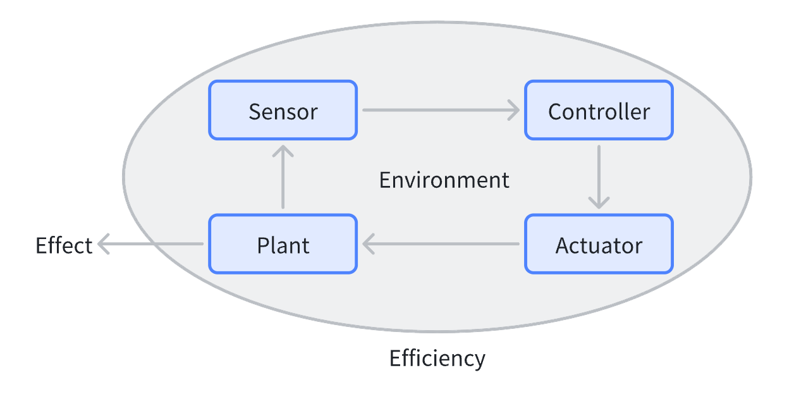
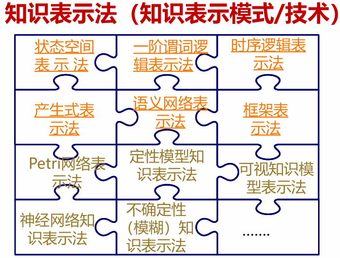
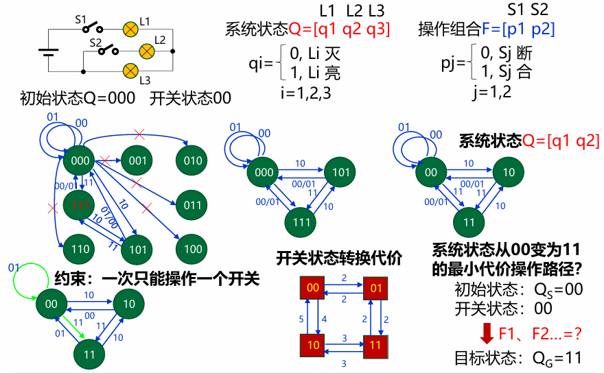
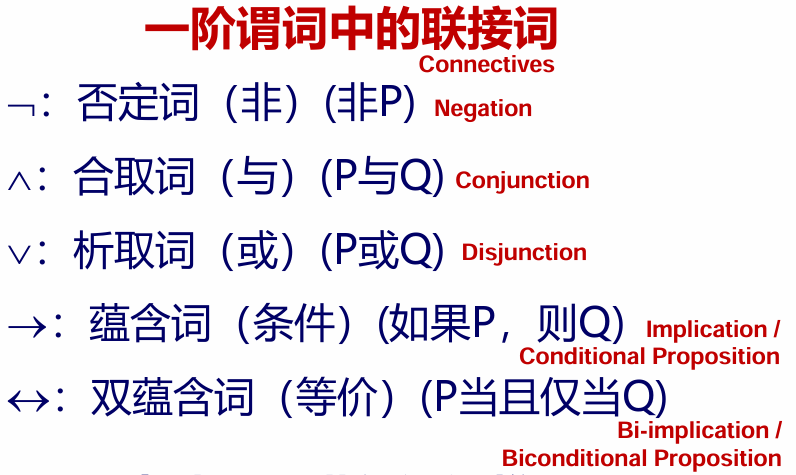

## 第一部分 概述

60%开卷考试+40%作业出勤，作业在 i 北理提交

课程内容：概述、知识工程基础、分级递阶控制、遗传算法、神经网络、模糊控制、专家控制

### 控制理论发展

控制理论的发展大致分为三个阶段：经典控制（微分方程模型，传递函数、SISO、频域分析）——现代控制（卡尔曼的状态空间模型，状态方程，MIMO，时域分析）——智能控制。

- 经典控制：线性定常系统、SISO、传递函数/频域、反馈控制（PID 控制）、调节器
- 现代控制：线性/具有一定非线性/分布参数系统、MIMO、状态空间法/时域、卡尔曼滤波、极大值原理、动态规划、最优/随机/自适应
- 智能控制：复杂非线性系统（模型差或无模型）、大系统理论、智能算子/多级控制、智能机器

经典控制和现代控制都是模型驱动范式，需要经历建模、收集数据、参数估计，然后基于模型设计控制器，又叫间接数据驱动；而智能控制是数据驱动范式，直接从收集的数据里设计控制器，又叫直接数据驱动（比如强化学习就是无模型的控制，无模型的优化，典型的直接数据启动。

## 第二部分 问题集

## 第三部分 算法集

## 遗传算法

遗传算法（Genetic Algorithm，GA）是基于自然选择和基因遗传学的搜索算法，通过复制、交叉和变异三种操作对待优化参数的编码串进行引导型搜索，使适配值高的个体被保留下来组成新的群体，直到满足一定的极限条件。

遗传算法具有以下特点：

- 能够在复杂空间进行全局最优搜索，且具有较强的鲁棒性
- 对于搜索空间（待寻优的函数）基本上不需要什么限制性的假设
- 从许多点开始并行操作，该机制和变异一起有效防止了收敛于局部最优解，且可通过大规模并行计算来提高计算速度
- 通过目标函数来计算适配值，对问题的依赖性小
- 寻优规则由概率决定而非确定

### 算法原理

简单遗传算法包含三个基本操作：复制、交叉和变异，以位串的方式进行处理。复制即按照适配值构成的比例产生下一代种群；交叉即将位串两辆配对并在随机位置往后处进行交换；变异即以极小的概率随机改变位串的某一位。算法流程为：产生初始种群、对各个体位串解码并计算适配值、按选择率复制处下一代、交叉和变异。

### 模式理论

遗传算法的模式理论是一种解释遗传算法工作机理的理论。模式是描述种群中在位串的某些确定位置上具有相似性的位串子集的相似性模板，如 1\*0，对应的位串就有 100 和 110。高适配值与位串模式的这种相似性具有因果关系。

为了评估算法性能，需要估算一次迭代中有效处理的模式数量（只有能够较好保留并遗传到下一代的模式才对算法有实质贡献），定义如下量以方便描述

- $$A(t)$$：$$t$$时刻的种群
- $$A_j$$：个体位串
- $$O(H)$$：模式位数，即模式所有的位数
- $$\delta(H)$$：模式的有效长度，即最两端确定位之间的距离
- $$l$$：位串长度
- $$m = m(H, t)$$：$$t$$时刻种群含有的模式数
- $$\bar{f}$$：种群的平均适配值（适配值即位串解码结果在待优化函数上的值）
- $$f(H)$$：种群中$$H$$模式个体的平均适配值
- $$P_d$$：模式被破坏的概率（实际死亡率）
- $$P_s$$：存活率阈值，人为给定
- $$P_c$$：发生交叉的概率
- $$P_m$$：单个位置发生变异的概率

综合考虑复制、交叉和变异对模式的影响，其中第一个式子的三部分分别为三个基本操作对模式的影响

$$
\begin{aligned}
m(H,t + 1) &\geqslant m(H,t)\frac{f(H)}{\bar{f}}\left[1 - P_{c}\frac{\delta(H)}{l - 1}\right]\left[1 - O(H)P_{m}\right]\\
&\approx m(H,t)\frac{f(H)}{\bar{f}}\left[1 - P_{c}\frac{\delta(H)}{l - 1}- O(H)P_{m}\right]
\end{aligned}
$$

经推导，对于$$n$$个位串的种群，可以合理估计总模式数的范围在
$$
\frac{l-l_s+1}{4}n^3 \leqslant n_s \leqslant n\cdot 2^{l_s - 1}\cdot(l - l_s + 1)
$$
由此可见，遗传算法处理模式数的数量级为$$O(n^3)$$，这就是遗传算法隐含的并行机制

### 外围问题

1. 目标函数值到适配值的映射

    适配值非负，希望越大越好；目标函数值则没有限制，有如下三种常见的映射方式

    - 最小化问题：$$f(x)= \begin{cases} c_{\max}-g(x), & g(x)<c_{\max}\\ 0, & \text{其他} \end{cases}$$
    - 最大化问题：$$f(x)= \begin{cases} g(x)-c_{\min}, & g(x)-c_{\min}>0\\ 0, & \text{其他} \end{cases}$$
    - 指数函数映射：$$f(x) = c^{g(x)}$$

2. 适配值调整

    为了防止少数非凡个体导致过早收敛，以及防止平均适配值和最大适配值之间相差无几，需要对各位串的适配值进行调整，如线性调整$$f' = af+b$$，要求调整前后$$f$$的均值需要相等。

    

3. 编码原则

    遗传算法能工作的根本原因是能有效处理种群中的大量模式，因此要求编码方式中包含尽可能多的模式，经推导可得，二进制编码方案能取得最大的模式数。

4. 多参数级联定点映射编码

    为了在参数空间内进行编码，可以将特定区间$$[U_{min}, U_{max}]$$线性映射到$$[0, 2^l]$$中，这一映射代码的精度为
    $$
    \delta=\frac{U_{\max}-U_{\min}}{2^{i}-1}
    $$
    建立映射
    $$
    x_{i}=U_{\min}^{(i)}+U_{i}\delta_i
    $$
    最后将各编码级联拼接起来即可

### 基于遗传的机器学习系统

控制系统的$$SPACE^3$$模型：

### 智能控制概念

智能控制应用人工智能的理论与技术和运筹学的优化方法，并将其同控制理论方法与技术相结合，改变控制策略去适应对象的复杂性和不确定性，研究对象是各种大规模的复杂系统，核心任务是对实际环境或过程进行组织，即规划和决策，实现广义问题求解。

### 智能控制系统特性

- 特征模型：是对系统动态特性的一种定性与定量相结合的描述。是针对问题求解和控制指标的不同要求，对系统动态信息空间的一种划分。
- 特征记忆：是指智能控制器对一些特征信息的记忆。反映控制前期决策与控制的效果。如：误差出现的极值、误差极值之间的时间间隔、误差的过零速度等。特征记忆有利于有效地利用控制的储存容量，消除冗余。可构成判断系统稳定性的特征模型，也可作为智能控制系统稳定性监控的依据。
- 控制决策模态：是当前特征状态和特征记忆量与输出信息之间的某种定量或定性的映射关系。比如：if 前提条件 then 结论或动作。

### 智能控制系统分类

按系统构成原理分类：

- 学习控制系统
- 分级递阶智能控制系统
- 专家控制系统
- 模糊控制系统
- 神经网络控制系统
- 基于规则的仿人智能控制系统
- 集成智能控制系统
- 组合智能控制系统

按系统结构分类：

- 直接智能控制系统
- 间接智能控制系统
- 分级递阶智能控制系统
- 集散智能控制系统（DCS）

按系统实现功能分类：

- 智能自适应控制系统
- 智能自组织控制系统
- 智能自学习控制系统
- 智能自修复控制系统

## 第二章 智能控制的知识工程基础

### 基本概念

知识工程起初的目的是降低对特定人员的依赖实现可持续发展，完成的工作是：获得专业技术人员的知识并把它程序化，使之共享和自动运用，以驱动各种系统的有效运行。知识工程全面涵盖了知识的表示、获取与处理（运用）。

知识是把有关信息关联在一起所形成的信息结构，应用最多的关联形式是“IF-THEN”形式，它反映了信息间的某种因果关系。把关联起来的知识称为规则。把不与其他信息关联的信息称为事实或原子事实。时间上的过程和规律称为运动方式，空间上的形状和态势称为运动状态。

### 知识表示

知识只有用适当的模式表示出来才能存储到计算机中去，知识必须以适当的形式表示出来才便于在计算机中存储、检索、使用和修改等。知识表示是一种计算机可接受的对人类智能行为的描述，它是一种符号模型的约定，将人类知识通过一个符号模型映射到计算机中。

#### 状态空间表示法

状态：描述某些事物中各不同事物间的差异，而引入的一种最小变量的有序组合。

操作：能够引起状态中某些分量发生变化，从而使一个状态转移为另一个状态

状态空间：描述全部可能状态及其相互关系的三重序元。S 是事物可能的初始状态集合、F 是操作集合、G 是可能的目标状态集合

用有向图来表示状态空间的方式称为状态空间图示法：

- 把状态集合映射为节点集合
- 操作所引起的状态转移映射为标注该操作的有向边
- 问题求解通过操作从初始节点到目标节点，寻找一条有效的路径

#### 一阶谓词解释法

取值为真或假的句子(Clause)称为命题(Proposition)。它可分为谓词(Predicate)和个体(Individual)两部分。谓词用于刻划个体的性质、状态或个体间的关系，用大写字母表示。个体表示某个独立存在的事物或某个抽象的概念，用小写字母表示。

有$$n$$个个体的谓词称为 n 元谓词：$$P(x_1,x_2,\cdots,x_n)$$

有$$n$$重操作的谓词称为 n 阶谓词：$$P_n(\cdots P_2(P_1(x)))$$

基本要素：

- 常量：某一个具体的事物

- 变量：不确定性事物

- 函数：由其他事物所确定的事物

- 量词：分为全称量词和存在量词。 全称量词表示所有个体中的全体；存在量词表示存在某一些。（任意和存在）

- 联接词：联接谓词的逻辑符号，由联接词构成的谓词称为复合谓词公式，下图是常用的联接词，优先级依次递减。

  

用谓词逻辑表示状态和操作的步骤：定义谓词、个体和个体域，确定初始状态和目标状态，求解操作序列，每个操作中需要包含条件

举例：搭积木、演绎推理

谓词表示法接近于自然语言的形式语言，易于理解和接受。适宜于精确性知识的表示，而不适宜于不确定性知识的表示。用谓词逻辑法表示的知识可以比较容易转换为计算机的内部形式，易于模块化，便于对知识的添加、删除和修改。

#### 时序逻辑表示法

将时间及其次序关系引入谓词表达式之中，利用谓词逻辑的概念和方法，便构成了时序逻辑知识模型。

#### 产生式表示法

又称为规则或产生式规则。通常用于表示具有因果关系的知识。基本形式为 if P then Q，或 P-->Q

#### 语义网络表示法

通过概念及其语义关系来表达知识的一种网络图，由节点和连接节 点的弧构成。其基础是一种三元组结构（节点 1、弧、节点 2）。

节点：表示各种事物、概念、情况、属性、动作、状态、地点等。

弧：表示各种语义联系，指明所连接节点的某种关系。

语义网络除可表达事实外，还可表达规则。一条产生式规则 R：IFATHENB

当多个三元组综合在一起表达时，就可得到一个语义网络。

语义网络表示法的特点：

节点和弧便于显式表达结构、属性、因果关系，便于联想方式实现对系统的解释
​ 继承方式符合人类的思维习惯
​ 语义解释依赖于结构的推理过程，没有结构的约定，推理不能保证像谓词逻辑法那样有效
​ 知识存储和检索过程比较复杂。

语义网络表示法与谓词表示法的区别：

1. 语义网络的基本单元是节点，具有名词性质；谓词逻辑的基本单元是谓词和个体构成的动作，具有动词性质。
2. 语义网络中的联接关系靠弧实现，这种连接关系是有方向的，有上、下层概念之分，可以表达分类、从属、时空关系等不同关系；而谓词逻辑靠联接词建立关系，除了蕴含和双蕴含以外，关系表达中没有方向性，而蕴含和双蕴含也只能表达因果关系。
3. 语义网络是一种基于有向图的表示方式；谓词逻辑是一种基于语言的表示方式。

#### 框架知识表示法：

框架和框架网络

框架表示法的特点

1. 面向对象，适合表示大规模复杂知识，体现了人的自然思维方式；
2. 可表达陈述性知识和过程性知识，便于知识的结合，综合表达能力强；
3. 利用层次结构、继承关系，冗余少。

究竟采用哪一种表示模式，没有统一的标准。 在确定一个知识表示模式时，首先应考虑的是：

1. 能否充分地表示领域知识？
2. 是否便于利用知识实现面向特定问题的推理？

### 知识获取

人工智能或知识工程系统中，通过非自动方式或自动方式实现计算机从知识源获取知识的过程。知识源包括专家、书本、数据库和人的经验等
