## 概述

课程内容：基本概念和原理，主要算法，应用技能

模式识别属于控制科学与工程，研究如何使计算机具备模式识别的能力，即如何利用规则完成对外部世界完成分类，更关注的是如何解决工程问题，至于是否选用机器学习的算法，取决于具体要解决的问题。步骤有三：设计分类器(选择一个实现分类的算法)，训练分类器，使用分类器。

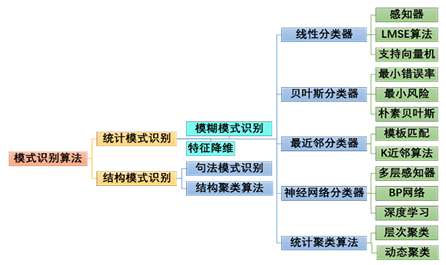

考核：平时 25%(在线课章节测验)，项目实践 35%(个人报告 10%，小组论文 10%，项目成果展示及测试 15%)，期末考试 40%(在线课期末考试 20%+乐学或线下开卷 20%)

**注意：提交的东西如果使用了 AI 需要提交说明**

## 第一章 概述

识别的意思是，给某个事物贴上类别标签，也就是分类，类别也可以抽象为某个概念或定义。识别本质是再认知，现有认知再有识别。识别是对概念的再归类。以共同的特征建立类别，识别的基础是相似性。而根据相似性进行识别就有可能出现错误。模式是可以用来给事物代表归类的特征。模式识别的意思是对事物进行概念归类。模式识别的过程仅仅根据特征进行判定，不一定能获知事物本质。

### 人工智能与模式识别

人工智能大概有感知、理解和决策、行动三个方向；主要的人工智能研究集中在第二个方向，以前关注较多的行动，目前研究已经不多了，被整合为具身智能这个概念。模式识别和人工智能有相当大的交集但又互不包含。强化学习和模式识别没有关系(关心下一步的决策，不包含分类)。模式识别也有不包含机器学习的，比如用了模板匹配的光电阅读机。

机器学习的三大任务：分类、回归(拟合)、决策，分类是最核心的任务，另外两个问题在某种程度上都可以划分为分类问题，回归是为了逼近某个数据分布，比如预测就是一个分类问题；强化学习就是一种决策型的任务。模式识别与机器学习在许多算法上是通用的，但模式识别的目的在于使计算机具备识别能力，机器学习的目的在于使计算机更好地理解环境并与环境交互。

### 系统组成

设计一个模式识别系统，就是要设计分类器的模型、所使用的特征和分类器参数的调整算法。

### 基本概念

将模式信息提取出特征，并将每一个特征作为一个维度构成一个多维特征空间。数值型特征构成向量空间，非数值特征构成集合空间。样本之间的相似程度用特征空间中点的相似程度来计算，每一类样本的聚集区域则表现为特征空间中点的统计分布。数值型特征的相似度度量标准有距离、余弦相似度、皮尔逊相关系数、JACCARD 相似系数等；非数值型距离度量有编辑距离等。

同一类样本点的相似程度用紧致性来衡量，紧致性准则要求样本集中属于同一个类的样本间的相似度，应当远大于属于不同类的样本间的相似度。增加特征空间的维数或进行空间映射变换，是增强该问题模式类的紧致性的常用方法。类别可分型度量是紧致性的量化表示，常用的有基于类内类间距离和基于概率距离两种。当数据维度增加，训练集样本的数量不足而变得稀疏，样本集的紧致性变差，会导致算法性能急剧下降，这被称为维数灾难。

分类器通过某些算法找到自身最优参数的过程，称为分类器的训练或学习。学习分为有监督学习、无监督学习、半监督学习和自监督学习。采用无监督学习的分类器，能够达到更高的智能水平，也是未来模式识别技术发展的主要方向，半监督和自监督是灵活运用有监督和无监督的学习方式。

训练好的分类器对未知新样本正确分类的能力称为泛化能力，而训练好的分类器对未知新样本正确分类的能力大幅度下降的现象称为过拟合，过拟合的来源是误差数据，而误差数据是无法避免的。

极简泛函分析：核心是首先由函数空间，无穷维的空间，每个向量是一个函数，赋范空间，值域在普通的向量空间。泛函就是无穷维空间到这个向量空间的映射，每一个函数对应一个实数。研究函数取什么形式，可以使得函数取某一个值。最优化问题和模型求解就是求泛函的问题。求取什么参数时，准则函数可以求得极值，通过算子求得极值。

手写数字识别是一个极好的例子，其基本流程如下

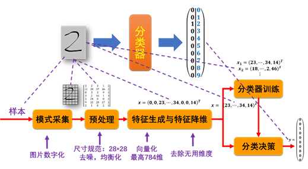

## 第二章 特征工程

特征生成和特征降维统称为特征工程。各个维度的特征对于分类的贡献不一，因此可以进行特征降维以删除冗余信息、减少算法计算量和对样本集规模的需求，保留对分类最有效的信息。特征降维的方法主要包括特征选择和特征提取。

特征工程的方法有数据预处理(如数据去重、缺值补充、数据增强、异常值处理等)、特征提取(通过某种变换，将原始特征从高维空间映射到低维空间)、特征选择(从高维特征中挑选出一些最有效的特征，如独立算法、穷举算法、分支界定法、顺序前进/后退、动态顺序前进等)、维度压缩(如 PCA 等)、特征构造、特征变换(如标准化、归一化、对数变换等)、特征编码(如标签编码、独热编码、隶属度函数等)、特征融合。

分支界定法在很多领域都有用，建立搜索树，每往下一层就抛弃一些节点的计算；本质上是穷举法，需要知道下面的准则函数，是最优算法。计算复杂度不确定，但从统计上来说可以减少大量的计算，和快速 KNN 原理相同。

特征工程的方法需要人工干预，缺少通用的流程和方法。与之对应的端到端技术，就是指跳过特征生成和特征降维环节，直接将具有原始特征的样本数据输入深度神经网络模型，由模型在学习过程中自行提取出对分类最有效的特征，并应用于最终的分类决策。端到端解决维数灾难的方式是：大数据量、强算力、逐层训练、预训练、逐层降维。

PCA 是一种常见的特征提取的方式，实质上是做坐标系的旋转和平移，找出最大特征分量。由于与标签无关，故 PCA 是一种无监督的方法。值得注意的是，PCA 只管整个数据集上方差最大，可能会影响类别可分性。LDA 是基于类内类间距离定义的一种特征提取方式。

## 第三章 统计学习理论

机器学习的基本问题可以描述为，根据给定的已知训练样本求取对系统的输出与输入之间依赖关系的估计， 使它能对给定输入下的未知输出做出尽可能准确的预测，即：根据 n 个独立同分布观测样本 $$(x_{1},y_{1}),(x_{2},y_{2}),\cdots,(x_\text{n},y_\text{n})$$，在一组函数$$\{f(x, w)\}$$中寻求最优的一个函数$$\{f(x, w_{0})\}$$对依赖关系进行估计，使期望风险最小

$$
\begin{aligned}
R(w)=\int L(y,f(\mathbf{x},w))\text{d}F(\mathbf{x},y) \quad L(y,f(\mathbf{x},w))为预测造成的损失，称为损失函数\\
\end{aligned}
$$

机器学习不同问题下损失函数的定义如下

- 有监督学习的分类问题，系统输出为类别标签，以二分类为例

  $$
  \begin{aligned}
  L(y,f(\mathbf{x},w))=
  \begin{cases}
  0, & y = f(\mathbf{x},w)\\
  1, & y \neq f(\mathbf{x},w)
  \end{cases}
  \end{aligned}
  $$

  此时的期望风险就是贝叶斯决策中使错误率最小

- 函数拟合中，误差采用最小平方误差

  $$
  L(y,f(\mathbf{x},w))=(y - f(\mathbf{x},w))^2
  $$

- 对于概率密度估计，目的是确定概率密度函数$$p(x, w)$$
  $$
  L(p(\mathbf{x},w))=-\log p(\mathbf{x},w)
  $$

### 函数的容量和 VC 维

函数集在一组样本集上可能实现的分类规则数目称为函数集的容量。VC 维的直观定义，对一个指示函数，如果存在$$k$$个样本能够被函数集中的函数按所有可能的$$2^k$$种形式分开，则称函数集能把样本数为$$k$$的样本集打散。指示函数集的 VC 维就是能够打散的最大样本集的样本数目。如果对于任意数目的样本，总能找到一个样本集能够被这个函数集打散，则函数集的 VC 维就是无穷大。函数集的 VC 维并不简单地与函数中自由参数个数有关，而是与函数本身的复杂程度有关。

### 经验风险最小化原则

机器学习就是在函数集中最小化期望风险的期望风险泛函，但这个风险泛函需要对服从联合概率密度$$F(x, y)$$的所有可能样本及其输出值求期望，这在$$F(x, y)$$未知的情况下无法进行。根据大数定律，用算数平均值代替期望，定义经验风险为在训练样本上损失函数的平均，传统的机器学习方法都用这中方式来代替最小化期望风险的目标，这种策略称为经验风险最小化原则(ERM 原则)。

当训练样本数趋向于无穷大时，以经验风险最小化原则进行的学习与期望风险最小的目标是否一致，这称为学习过程的一致性。学习理论关键定理指出，对于有界的损失函数，经验风险最小化学习一致的充分必要条件是，经验风险在如下式意义上一致地收敛于真实风险

$$
\lim_{n\rightarrow\infty}P\left\{\sup_{w_\text{n}}\left(R(w_\text{n})-R_\text{EMP}(w_\text{n})\right)>\varepsilon\right\}=0, \quad \forall\varepsilon > 0
$$

### 结构风险最小化原则

学习机器的实际风险由经验风险(训练误差)和置信范围组成，置信范围和学习机器的 VC 维及训练样本量有关。样本数量较少时置信范围较大，用经验风险最小化取得的最优解可能会有较大的期望风险，即可能推广性较差，因此需要同时最小化经验风险和置信范围，而不是单独最小化经验风险。通过按照 VC 维的大小排序并划分函数子集结构，学习目标化为在函数集中同时进行子集的选择和子集中最优函数的选择。选择最小经验风险与置信范围之和最小的子集，就可以达到期望风险的最小，这个子集中使经验风险最小的函数就是要求的最优函数。这种策略称作结构风险最小化原则(SRM 原则)。

对于样本数给定的问题，学习机器的 VC 维越高(复杂性越高)，置信范围就越大，真实风险与经验风险之间可能的差别越大，推广能力可能越差。因此对于有限样本的任务，应该尽可能选用相对简单的分类器来期望获得尽可能好的推广能力。

### 正则化方法

正则化是解决不适定问题的一类方法(不适定问题是指，即使方程存在唯一解，方程右边的微小扰动$$\vert F - F_{\delta} \vert < \delta$$会带来很大变化；后来发现应该最小化以下的正则化泛函：

$$
R^*(f)=\|Af - F_{\delta}\|^2+\lambda(\delta)\Omega(f)
$$

对于机器学习问题大部分都是用样本特征和对应的观测数据来拟合它们之间的函数关系，所以都属于不适定问题。为解决这个问题，在机器学习模型学习过程中 就必须要引入正则化方法，通常是在模型的损失函数中添加一个正则项(惩罚项)来实现。常见的正则化方法有：Lasso 正则化(L1 正则化)、Tikhonov 正则化(L2 正则化)、弹性网正则化(混合正则化)；对于正则化方式使用的范数，也是一种超参数。

## 第四章 线性分类器

模式识别的决策论方法是指，以一定的规则集将特征空间划分为不同的决策域，决策域包含了样本的分布区域但不等同，判定样本所属的决策域就是分类。判别函数是参数集的函数，是决策边界的方程表示，这个参数集就是权向量，找判别函数就是极小化准则函数的泛函问题。满足判别函数的某个条件则说明属于这一类，否则说明不属于；显然，在二分类问题中，不属于该类则属于另一类。

### 前置知识

#### 线性判别函数

$$
\begin{aligned}
G(\mathbf{x}) &= \mathbf{w}^{\text{T}}\mathbf{x} + w_{0}\\
\mathbf{x}&=[x_{1}, x_{2}, \dots, x_\text{n}]^{\text{T}} \\
\mathbf{w}&=[w_{1}, w_{2}, \dots, w_\text{n}]^{\text{T}}\\
\end{aligned}
$$

也可写成增广形式，将$$w_{0}$$加入权向量中，本质相同，处理上简单一些。线性判别函数为一个超平面，权向量$$\mathbf{w}$$与该超平面正交，$$\frac{\vert w_{0} \vert}{\vert\vert \mathbf{w} \vert\vert}$$为超平面到原点距离，判别函数是样本到超平面距离的一种度量。

#### 多分类问题

- 绝对可分：有许多分类不确定的区域，$$m$$个类有$$m$$个判别函数；应用最广泛
- 两两可分：分类不确定区域减少，$$m$$个类有$$\frac{m(m-1)}{2}$$个判别函数
- 最大值可分：样本在每个类的判别函数都有值，归到取值最大的判别函数对应的类中，是两两可分的特殊情况

#### 广义线性化

两个类别线性可分的条件为：分布范围本身是互不重叠的全连通单一凸集。某些线性不可分的问题可通过映射到另一个高维空间转化为线性可分问题，这称为广义线性化。

#### 线性分类器原理

设计：设决策边界方程如下(以增广形式为例)，若问题线性可分则找最优解即可，若非线性可分则问题无解

$$
\begin{aligned}
G_\text{j}(\mathbf{x})&=\mathbf{W}^{\text{T}}\mathbf{X}
\end{aligned}
$$

训练：设定一个标量函数$$J(\mathbf{w})$$作为准则函数，求解使得准则函数取极小值的权向量$$\mathbf{w}$$就是最优解。一般来说无法通过$$\frac{\partial J(\mathbf{w})}{\partial \mathbf{w}}=0$$直接获得解析解，而是通过逐步逼近的算法根据训练集求取最优的权向量。最常见的逐步逼近算法为梯度下降法，即从初始权向量$$\mathbf{w}(0)$$出发，每次沿当前$$J(\mathbf{w})$$的负梯度方向前进一步来修正权向量

$$
\begin{aligned}
\mathbf{w}(k + 1) &=\mathbf{w}(k)-\rho(k + 1)\nabla J(\mathbf{w}(k))
\end{aligned}
$$

其中$$\rho(k+1)$$为第$$K+1$$步的步长，又称学习率，是一种超参数，可以给固定值，也可以通过绝对修正、部分修正、最优步长等方式随学习过程变化，较为常用的策略是令$$\rho(k+1) = \frac{\lambda}{k}$$

### 感知器算法

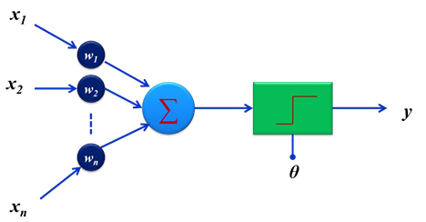

PA(Perception Algorithm)没有反馈和内部状态，是对多个输入量加权求和再和某个阈值比较决定输出的算法，若干感知器并列，构成单层感知器。对于线性可分的样本，PA 通过调整总可以使权向量收敛到在训练集上不出现分类错误的最优解。对于二分类问题，可以将其中一个类别的增广特征向量取负号，以使用统一的形式表示判别函数对所有训练样本集中样本的取值条件，这称为样本特征向量的规范化。

PA 使用梯度下降法来训练分类器，准则函数如下，其中$$X_{0}$$为样本集中分类错误的子集，存在错分样本时准则函数大于零，不存在错分样本时则为零

$$
\begin{aligned}
J(\mathbf{w})&=\sum_{\mathbf{x}\in X_{0}} (-\mathbf{w}^{\text{T}}\mathbf{x})\\
\mathbf{w}(k + 1) &=\mathbf{w}(k)-\rho(k + 1)\nabla J(\mathbf{w}(k))\\
&=\mathbf{w}(k)+\rho(k + 1)\sum_{\mathbf{x}\in X_{0}} \mathbf{x}
\end{aligned}
$$

其中，$$\nabla J(\mathbf{w}(k))=\left(\frac{\partial J(\mathbf{w}(k))}{\partial w_{1}}, \frac{\partial J(\mathbf{w}(k))}{\partial w_{1}}, \dots, \frac{\partial J(\mathbf{w}(k))}{\partial w_\text{n}}, \frac{\partial J(\mathbf{w}(k))}{\partial w_{0}}\right)=\sum_{\mathbf{x}\in X_{0}} (-\mathbf{x})\\$$

梯度下降时，既可以选择批量梯度下降(即每一步同时修正所有分错的样本)，也可以选择随机梯度下降(严格来讲叫单次梯度下降，即将每次按顺序抽取一个样本，检查是否分错)

PA 的准则函数只与是否能够正确分类有关，不关心能否取得更优的解。

---

单层感知器只能解决线性可分的分类模式问题，要增强分类能力可增加一层或多层隐藏层以构成多层感知器 MLP，这样的结构称为多层前向神经网络，可以解决非线性可分问题，对于任意复杂的分类区域，总可以用多个神经元组成一定的层次结构来实现分类。每一层中的每个单元就是一个人工神经元，其作用相当于特征提取器。

$$
\begin{aligned}
y&=\theta\left\{\sum_{j = 1}^{q}w_{j}\theta\left(\sum_{h = 1}^{n}v_{jh}x_{h} + v_{j0}\right)+w_{0}\right\}
\end{aligned}
$$

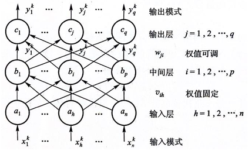

通过基于链式法则的反向传播算法，可以高效计算出误差关于每个权重的梯度，在训练过程中实现对所有参数的更新。另外，各种优化算法(如随机梯度下降及其变种 Adagrad、Adadelta、Adam 等)的提出，也提高了多层感知器参数学习的效率和稳定性。

### LMSE 算法

#### 线性分类器的松弛求解

对于线性不可分的样本集，不等式组不可能同时满足，于是目标转为求解使得错分样本数尽可能少的权向量，具体方法是给定裕度向量$$\mathbf{b}$$，对不等式方程组进行松弛化，将求解不等式方程组的问题转化为求解线性方程组的问题

$$
\mathbf{X}\mathbf{w} = \mathbf{b}
$$

定义准则函数为均方误差 MSE

$$
\begin{aligned}
J(\mathbf{w}(k))&=\|\mathbf{X}\mathbf{w}(k)-\mathbf{b}\|^2\\
&=\sum_{i = 1}^{l}(\mathbf{x}^{(i)T}\mathbf{w}(k)-b_{i})^2\\
&=\sum_{i = 1}^{l}(\mathbf{w}^{T}(k)\mathbf{x}^{(i)}-b_{i})^2\\
\nabla J(\mathbf{w}(k))&=\nabla\sum_{i = 1}^{l}(\mathbf{w}^{T}(k)\mathbf{x}^{(i)}-b_{i})^2\\
&=\sum_{i = 1}^{l}2(\mathbf{w}^{T}(k)\mathbf{x}^{(i)}-b_{i})\mathbf{x}^{(i)}\\
&=2\mathbf{X}^{\text{T}}(\mathbf{X}\mathbf{w}(k)-\mathbf{b})\\
\mathbf{w}(k + 1) &=\mathbf{w}(k)-\rho(k + 1)\cdot2\mathbf{X}^{\text{T}}(\mathbf{X}\mathbf{w}(k)-\mathbf{b})\\
&=\mathbf{w}(k)-\rho'(k + 1)\mathbf{X}^{\text{T}}(\mathbf{X}\mathbf{w}(k)-\mathbf{b})
\end{aligned}
$$

该方法除了对线性可分的问题可以收敛外，对于线性不可分问题也可以通过定义误差灵敏度进行近似求解。另外，如果任意给定$$\mathbf{b}$$，LMSE 的方法得出的最优权向量可能会将原本线性可分的问题变成线性不可分的问题，即均方误差准则函数取得最小值和线性分类器的不等式方程组成立这两个条件可能无法同时满足。

#### H-K 算法

同时优化权向量$$\mathbf{w}$$和裕度向量$$\mathbf{b}$$，若两类线性可分，则 LMSE 的准则函数可取得最小值 0，此时决策边界与所有以各样本为中心，以最优裕量向量$$\mathbf{b}$$的各分量为半径指标的圆相切。求$$\mathbf{b}$$的过程同样可采用梯度法：

$$
\begin{aligned}
\mathbf{b}(k + 1) &=\mathbf{b}(k)-\eta(k + 1)\left.\nabla J(\mathbf{w}(k))\right|_{\mathbf{b}}\\
\left.\nabla J(\mathbf{w}(k))\right|_{\mathbf{b}}&=\frac{\partial\|\mathbf{X}\mathbf{w}(k)-\mathbf{b}\|^2}{\partial\mathbf{b}}=-2(\mathbf{X}\mathbf{w}(k)-\mathbf{b})\\
\mathbf{b}(k + 1) &=\mathbf{b}(k)+\eta(k + 1)\cdot2(\mathbf{X}\mathbf{w}(k)-\mathbf{b}(k))\\
&=\mathbf{b}(k)+2\eta(k + 1)(\mathbf{X}\mathbf{w}(k)-\mathbf{b}(k))\\
&=\mathbf{b}(k)+2\eta(k + 1)\mathbf{e}(k)
\end{aligned}
$$

由于需要保证裕度向量$$\mathbf{b}(k + 1)$$始终为正，而误差向量$$\mathbf{e}(k)$$正负都有，所以需要修正，一种做法是在$$\mathbf{e}(k) > 0$$时进行修正($$\mathbf{e}(k) < 0$$说明样本集线性不可分)：

$$
\begin{aligned}
\mathbf{b}(k + 1) &= \mathbf{b}(k)+\eta(k + 1)(\mathbf{e}(k)+|\mathbf{e}(k)|)
\end{aligned}
$$

若已知每一步的$$\mathbf{b}(k)$$后利用准则函数梯度为 0 来求最优的$$\mathbf{w}(k)$$，就可得到一种同时求取最有权向量和最优裕度向量的递推算法，称为 H-K 算法

$$
\begin{aligned}
\left.\nabla J(\mathbf{w}(k))\right|_{\mathbf{w}(k)}&=2\mathbf{X}^{\text{T}}(\mathbf{X}\mathbf{w}(k)-\mathbf{b}) = 0\\
\mathbf{w}(k)&=(\mathbf{X}^{\text{T}}\mathbf{X})^{-1}\mathbf{X}^{\text{T}}\mathbf{b}(k)\\
\mathbf{w}(k + 1)&=(\mathbf{X}^{\text{T}}\mathbf{X})^{-1}\mathbf{X}^{\text{T}}\mathbf{b}(k + 1)\\
&=(\mathbf{X}^{\text{T}}\mathbf{X})^{-1}\mathbf{X}^{\text{T}}[\mathbf{b}(k)+\eta(k + 1)(\mathbf{e}(k)+|\mathbf{e}(k)|)]\\
&=(\mathbf{X}^{\text{T}}\mathbf{X})^{-1}\mathbf{X}^{\text{T}}\mathbf{b}(k)+\eta(k + 1)(\mathbf{X}^{\text{T}}\mathbf{X})^{-1}\mathbf{X}^{\text{T}}(\mathbf{e}(k)+|\mathbf{e}(k)|)\\
&=\mathbf{w}(k)+\eta(k + 1)(\mathbf{X}^{\text{T}}\mathbf{X})^{-1}\mathbf{X}^{\text{T}}(\mathbf{e}(k)+|\mathbf{e}(k)|)\\
&=\mathbf{w}(k)+\eta(k + 1)(\mathbf{X}^{\text{T}}\mathbf{X})^{-1}\mathbf{X}^{\text{T}}(\mathbf{X}\mathbf{w}(k)-\mathbf{b}(k))+\eta(k + 1)(\mathbf{X}^{\text{T}}\mathbf{X})^{-1}\mathbf{X}^{\text{T}}|\mathbf{e}(k)|\\
&=\mathbf{w}(k)+\eta(k + 1)[(\mathbf{X}^{\text{T}}\mathbf{X})^{-1}\mathbf{X}^{\text{T}}\mathbf{X}\mathbf{w}(k)-(\mathbf{X}^{\text{T}}\mathbf{X})^{-1}\mathbf{X}^{\text{T}}\mathbf{b}(k)]+\eta(k + 1)(\mathbf{X}^{\text{T}}\mathbf{X})^{-1}\mathbf{X}^{\text{T}}|\mathbf{e}(k)|\\
&=\mathbf{w}(k)+\eta(k + 1)(\mathbf{X}^{\text{T}}\mathbf{X})^{-1}\mathbf{X}^{\text{T}}|\mathbf{e}(k)|
\end{aligned}
$$

### Fisher 算法

将模式样本从高维空间投影到低维空间(比如先尝试投影到一维空间，若效果不佳再投影到二维空间等，每个投影对应构建一个判别函数)，在低维空间实现区分是该算法的主要思想，这个投影方向的选择十分重要。Fisher 算法定义准则函数如下，其中$$m_\text{i}$$为各类在$$d$$维特征空间中的样本均值向量，$$M_\text{i}$$为映射到一维特征后各类的样本平均值，$$T_\text{i}$$为映射后各类样本的类内离散度，$$\mathbf{S}_\text{b}$$为原 d 维空间的类内样本离散度矩阵，$$\mathbf{S}_\text{w}$$为原 d 维空间的类间样本总离散度矩阵，使得准则函数取得最大值的权向量记为$$\mathbf{W}^*$$

$$
\begin{aligned}
J(\mathbf{W})&=\frac{|M_{1} - M_{2}|^2}{T_{1}^2 + T_{2}^2}=\frac{\mathbf{W}^{\text{T}}\mathbf{S}_\text{b}\mathbf{W}}{\mathbf{W}^{\text{T}}\mathbf{S}_\text{w}\mathbf{W}}
\\
m_\text{i}&=\frac{1}{N_\text{i}}\sum_{X\in w_\text{i}}X, \quad i = 1, 2\\
M_\text{i}&=\frac{1}{N_\text{i}}\sum_{y\in\Omega_\text{i}}y, \quad i = 1, 2\\
T_\text{i}^2&=\sum_{y\in\Omega_\text{i}}(y - M_\text{i})^2, \quad i = 1, 2
\end{aligned}
$$

求解这个$$\mathbf{W}^*$$是一个广义瑞利商求极值问题，可通过拉格朗日乘子法求解出

$$
\begin{aligned}
W^*&=S_\text{w}^{-1}(m_{1} - m_{2})
\end{aligned}
$$

Fisher 算法可直接求解权向量，且可推广到多分类问题中；但对于线性不可分的情况，Fisher 算法无法确定分类。确定最优权向量后，Fisher 判别法的判别规则如下，其中$$y_\text{t}$$的选择可取映射值的中值、加权平均值、插值、结合先验概率的中值等

$$
\begin{aligned}
Y&=W^{\text{T}}X > y_\text{t} \Rightarrow X\in w_{1} \\
Y&=W^{\text{T}}X < y_\text{t} \Rightarrow X\in w_{2}
\end{aligned}
$$

### 支持向量机算法

#### 线性 SVM

使得两类训练样本中离超平面最近的样本与超平面的距离达到最大的超平面称为最优分类超平面，也称最大间隔超平面，最优超平面定义的分类决策函数如下

$$
\begin{aligned}
f(\mathbf{x})&=\text{sgn}(G_{ij}(\mathbf{x}_\text{s}))=\text{sgn}((\mathbf{W}^{\text{T}}\mathbf{x}_\text{s}) + w_{0})
\end{aligned}
$$

使得分类间隔最大的最优权向量是由距离决策边界最近的样本所决定的，这些少数的样本称为支持向量。分类间隔由支持向量到决策边界的距离决定；当$$\vert G_{ij}(\mathbf{x}_\text{s})\vert$$为常数时，最大的分类间隔等效于长度最小的权向量

$$
\begin{aligned}
d&=2\frac{|G_{ij}(\mathbf{x}_\text{s})|}{\|\mathbf{w}\|} \\
\max d&=\max\frac{2|G_{ij}(\mathbf{x})|}{\|\mathbf{w}\|} \Leftrightarrow \min\|\mathbf{w}\|
\end{aligned}
$$

支持向量机在解决有限样本(少量支持向量)、非线性(可以通过广义线性化向高位空间映射)和高维度(核函数可直接计算高维内积)模式识别问题上具有优秀的性能和泛化能力(由线性结构组成，结构风险小)，且能处理本质线性但由于扰动偏差而不完全具有线性可分形式的问题。

对于线性分类问题，支持向量机的求解等价于求解二次规划问题

$$
\begin{aligned}
&\min_{\mathbf{w}, w_{0}} \frac{1}{2}\|\mathbf{w}\|^2 \\
&\text{s.t. } y_\text{i}[(\mathbf{w}\cdot\mathbf{x}^{(i)}) + w_{0}] - 1\geq0, i = 1, 2, \ldots, l
\end{aligned}
$$

这是一个在不等式约束下的优化问题，可通过拉格朗日法求解，最终得最优权向量和分类决策边界如下，其中$$l_\text{s}$$为支持向量的个数，$$\mathbf{x}_\text{s}^{(i)}$$为支持向量；求解得到$$\alpha^{(i)}$$非零项即为支持向量

$$
\begin{aligned}
\mathbf{w}&=\sum_{i = 1}^{l}\text{sgn}(G_{ij}(\mathbf{x}^{(i)}) - 1)\alpha^{(i)}\mathbf{x}_\text{s}^{(i)}\\
G_{ij}(\mathbf{x})&=\mathbf{w}^{\text{T}}\mathbf{x}+w_{0} = \left[\sum_{i = 1}^{l}\text{sgn}(G_{ij}(\mathbf{x}_\text{s}^{(i)}) - 1)\alpha^{(i)}\mathbf{x}_\text{s}^{(i)}\right]^{\text{T}}\mathbf{x}+w_{0}\\
&=\sum_{i = 1}^{l}\text{sgn}(G_{ij}(\mathbf{x}_\text{s}^{(i)}) - 1)\alpha^{(i)}\mathbf{x}_\text{s}^{(i)T}\mathbf{x}+w_{0}
\end{aligned}
$$

#### 软间隔 SVM

用于解决由于样本集中的异常点带来的线性不可分问题，通过在约束条件中减去一项正数$$\xi$$，使判别函数的绝对值允许小于 1

$$
\begin{aligned}
\min &\frac{1}{2}\|w\|^{2}+C\sum_{i = 1}^{l}\xi^{(i)}\\
\text{s.t. } &\text{sgn}(G_{y^{(i)}}(x^{(i)}))(w^{T}x^{(i)} + w_{0})\geq1 - \xi^{(i)}
\end{aligned}
$$

在训练之前不知道哪些是支持向量，因此松弛变量$$\xi^{(i)}$$的值并非预先给定，也作为优化的目标，希望尽可能小，在原来的最短权向量的二次优化目标基础上，再加上一项$$C\sum_{i = 1}^{l}\xi^{(i)}$$，$$C$$称为惩罚因子，表示对异常点的容忍程度，$$C$$越大表示对异常点的容忍度越低。

采用松弛变量和惩罚因子的 SVM 仍然是线性分类器，致使付出了经验风险不为 0 的代价来减小采样误差和噪声干扰对分类器训练的影响，以得到泛化能力更好的分类器。

#### 非线性 SVM

对于问题本质上的不可分，使用广义线性化的方式，将特征向量映射到高维特征空间变成线性问题，映射之后，除了类别标签之外，没有用到映射之后的像，用到的只是高维空间中的内积，而核函数可以不经过映射过程，直接计算高维空间中的内积。

当有一个形为$$K(x^{(i)},x^{(j)})$$的标量函数，对样本集中所有样本间的函数值构成的矩阵是半正定的，则该函数为核函数。常用的核函数有

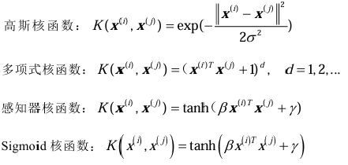

核函数的选择目前只能靠经验来试，且核函数只是提供一种解决非线性分类问题的可能性。

## 第五章 贝叶斯分类器

贝叶斯分类器是基于统计决策方法实现的概率分类方法。

### 推理原理

推理有确定性推理和概率推理，贝叶斯理论给出了逆概率推理的方法，即已知结果，某个原因有多大的概率发生。

贝叶斯公式如下，其中$$P(B_{i} \vert A)$$为后验概率，$$P(B_{i})$$为先验概率，$$P(A \vert B_{j})$$为类条件概率，$$P(A)$$全概率

$$
P(B_{i} \vert A)=\frac{P(A \vert B_{i})P(B_{i})}{\sum_{j = 1}^{c}P(A \vert B_{j})P(B_{j})}=\frac{P(A \vert B_{i})P(B_{i})}{P(A)}
$$

### 贝叶斯分类

将样本属于某个类作为原因，样本的特征向量取值作为结果，则模式识别的分类决策过程可以看作逆图例过程。这种决策分为确定性分类决策和随机性分类决策，而随机性分类决策就可以利用贝叶斯公式来计算样本属于各类的后验概率，计算公式如下，其中$$P(\omega_{i} \vert x)$$为后验概率，$$P(\omega_{i})$$为先验概率

$$
P(\omega_{i} \vert x)=\frac{P(x \vert \omega_{i})P(\omega_{i})}{\sum_{j = 1}^{c}P(x \vert \omega_{j})P(\omega_{j})}=\frac{P(x \vert \omega_{i})P(\omega_{i})}{P(x)}
$$

贝叶斯公式具有以下特点：

- 需要已知先验概率
- 需要按照获得的新信息来修正先验概率
- 这种概率推理存在错误率

### 决策算法

#### 最小错误率贝叶斯分类

等价于最大后验概率分类，分类决策规则为

$$
\begin{aligned}
&{两类问题中，当 }P(\omega_{i}|x)>P(\omega_{j}|x){ 时，判决 }x\in\omega_{i}{；}\\
&{对于多类情况，则当 }P(\omega_{i}|x)=\max_{1\leqslant j \leqslant c}P(\omega_{j}|x){ 时，判决 }x\in\omega_{i}{。}
\end{aligned}
$$

分类决边界为

$$
P(\omega_{i}|x)=P(\omega_{j}|x)
$$

这样确定的分类决策边界不一定是线性或者是连续的

#### 最小风险贝叶斯分类

将决策风险纳入考虑，有如下定义

- 决策$$\alpha_{i}$$：把待识别样本归导$$\omega_{i}$$类中

- 损失$$\lambda_{ij}$$：把真实属于$$\omega_{j}$$类的样本归类到$$\omega_{i}$$中带来的损失

- 条件风险$$R(\alpha_{i} \vert x)$$：对$$x$$采取决策$$\alpha_{i}$$后可能的总风险，用加权平均计算，权值为样本属于各类的概率，总风险计算公式为
  $$
  R(\alpha_{i}|x)=E[\lambda_{ij}]=\sum_{j = 1}^{c}\lambda_{ij}P(\omega_{j}|x),i = 1,2,\cdots,c
  $$

最小风险贝叶斯分类器的分类决策规则为

$$
{若}R(\alpha_{k}|x)=\min_{i = 1,2,\cdots,c}R(\alpha_{i}|x),{则}x\in\omega_{k}
$$

当损失取阶跃函数时就是最小错误率贝叶斯分类器，因此最小错误率贝叶斯分类器是最小风险贝叶斯分类器的特例。

#### 朴素贝叶斯分类

不难发现基于贝叶斯公式来估计后验概率的主要困难在于：类条件概率是所有类别上的联合概率，难以从有限的训练样本直接估计而得。因此朴素贝叶斯分类器(Naive Bayes Classifier, NBC)采用了“特征条件独立性假设”对已知类别，假设所有特征在类别已知的条件下是相互独立的，即每个特征独立地对分类结果发生影响。样本类条件概率等于各特征条件概率连乘

$$
p(X|\omega_{i}) = p(x_{1},\cdots,x_{d}|\omega_{i})=\prod_{j = 1}^{d}p(x_{j}|\omega_{i})
$$

在构建分类器时，只需要逐个估计出每个类别的训练样本在每一维特征上的分布，就可以得到每个类别的条件概率密度，大大减少了需要估计参数的数量。朴素贝叶斯分类器可以根据具体问题来确定样本在每一维特征上的分布形式，最常用的一种是假设每一个类别的样本都服从各维特征之间相互独立的高斯分布，其中$$\mu_{ij}$$和$$\sigma_{ij}^2$$为第 i 类样本在第 j 维特征上的均值和方差

$$
p(X|\omega_{i})=\prod_{j = 1}^{d}p(x_{j}|\omega_{i})=\prod_{j = 1}^{d}\left\{\frac{1}{\sqrt{2\pi\sigma_{ij}^{2}}}\exp\left[-\frac{(x_{j}-\mu_{ij})^{2}}{2\sigma_{ij}^{2}}\right]\right\}
$$

判别函数

$$
\begin{aligned}
g_{i}(X)&=\ln p(X|\omega_{i})+\ln p(\omega_{i})\\
&=\sum_{j = 1}^{d}\left[-\frac{1}{2}\ln 2\pi-\ln\sigma_{ij}-\frac{(x_{j}-\mu_{ij})^{2}}{2\sigma_{ij}^{2}}\right]+\ln p(\omega_{i})\\
&=-\frac{d}{2}\ln 2\pi-\sum_{j = 1}^{d}\ln\sigma_{ij}-\sum_{j = 1}^{d}\frac{(x_{j}-\mu_{ij})^{2}}{2\sigma_{ij}^{2}}+\ln p(\omega_{i})\\
&=\ln p(\omega_{i})-\sum_{j = 1}^{d}\ln\sigma_{ij}-\sum_{j = 1}^{d}\frac{(x_{j}-\mu_{ij})^{2}}{2\sigma_{ij}^{2}} \quad (省略常数项)
\end{aligned}
$$

朴素贝叶斯的应用十分广泛，一方面是因为绝大多数的工程识别应用中，各个特征几乎都没什么关联性，因此特征间的独立性很好；另一方面是，如果不使用朴素贝叶斯的假设去计算联合概率密度，计算量将会非常大，难以推广应用。

### 分类错误率

总的错误率为

$$
\begin{aligned}
P(e/x) & = \left[ \int_{R_{1,1}} p(x / \omega_{1}) + \int_{R_{1,2}} p(x / \omega_{1}) + \cdots + \int_{R_{s,1}} p(x / \omega_{1}) \right] P(\omega_{1}) \\
& + \left[ \int_{R_{1,2}} p(x / \omega_{2}) + \int_{R_{s,2}} p(x / \omega_{2}) + \cdots + \int_{R_{s,2}} p(x / \omega_{2}) \right] P(\omega_{2}) \\
& + \cdots \\
& + \left[ \int_{R_{1,c}} p(x / \omega_{c}) + \int_{R_{2,c}} p(x / \omega_{c}) + \cdots + \int_{R_{c - 1,c}} p(x / \omega_{c}) \right] P(\omega_{c})
\end{aligned}
$$

为减少计算量，可先求正确分类率后用 1-正确率''

$$
\begin{aligned}
P(e/x) & = 1 - P(M/x)\\
&=1-\sum_{i = 1}^{c} \int_{R_{i,j}} p(x / \omega_{i})
\end{aligned}
$$

### 正态分布下的贝叶斯分类

在不同的条件下可以得到一些简化，此处不一一列出

### 分类器训练

根据贝叶斯公式，只要知道先验概率和类条件概率密度就可以设计出贝叶斯分类器。而先验概率和类条件概率密度显然不是预先知道的，需要根据训练集去估计。根据大数定律，当训练集中的样本数足够多且随机选取时，可根据训练集中各类样本所占比例来估计先验概率。而类条件概率密度是一个概率密度函数，由训练集样本的特征分布情况估计，分为参数估计和非参数估计。常见的参数估计方法有极大似然估计和贝叶斯估计，典型的非参数估计有直方图估计、和密度估计和最近邻估计等。

## 第六章 最近邻分类器

利用相似性构造的分类器，称为距离分类器。

### 模板匹配算法

模板匹配算法是一种最近邻算法，而最近邻分类的实质，其实还是一种贝叶斯分类。简单的模板匹配对尺度和旋转不够鲁棒，只在特定场合使用，且需要对样本进行归一化处理，或设计动态模板以适应渐变的情况。

#### 相似性度量

相似度是衡量目标模式与模板匹配程度的重要指标。最基本的方法可以使用范数来计算目标与模板之间的误差关系来描述其相似程度，其误差越小则目标模式与模板越匹配。

假设考虑二维连续模型情况下的目标$$g$$和模板$$f$$，模板移动至$$(i,j)$$时覆盖的有效范围为$$D$$，相似度描述如下

- 无穷范数形式：$$R(i,j) = \max_{(x,y) \in D} \left \vert  f(x - i, y - j) - g(x,y) \right \vert $$

- 一范数形式：$$R(i,j) = \iint_{(x,y)\in D} \left \vert  f(x - i, y - j) - g(x,y) \right \vert $$

- 二范数形式：
  $$
  \begin{aligned}
  R(i,j) & = \iint_{(x,y)\in D} \left[ f(x - i, y - j) - g(x,y) \right]^2 \\
  & = \iint_{(x,y)\in D} f(x,y)^2 - 2\iint_{(x,y)\in D} f(x - i, y - j)g(x,y) + \iint_{(x,y)\in D} g(x,y)^2 \\
  & \approx \iint_{(x,y)\in D} f(x - i, y - j)g(x,y)
  \end{aligned}
  $$
  离散时
  $$
  R(i,j) = \sum_{x} \sum_{y} f(x - i, y - j) g(x,y)
  $$
  将上式经过规范化处理，以互相关系数的形式计算模板与目标的相似程度
  $$
  R(i,j) = \frac{\sum_{x} \sum_{y} \left( f(x - i, y - j) - \overline{f} \right) \left( g(x,y) - \overline{g} \right) }{\sqrt{\sum_{x} \sum_{y} \left( f(x,y) - \overline{f} \right)^2 } \sqrt{\sum_{x} \sum_{y} \left( g(x,y) - \overline{g} \right)^2}}
  $$

#### 分类准则

预先选定若干个标准模板，对于每一个样本搜索计算与标准模板的匹配程度，再对全部样本搜索其最优匹配即可。注意相似性计算同时受到模板均值、模板面积、目标模板局部均值等的影响，因此需要使用规范化处理形式来去除这些干扰。

### 最近邻分类器

最近邻分类器在最小距离分类的基础上进行扩展，将训练集中的每一个样本作为判别依据，寻找距离待分类样本最近的训练集中的样本，以此为依据来进行分类。距离定义决定了最近邻分类的结果，不同的距离定义得到的分类结果可能不同。在欧氏距离下，当训练集包含多类的许多样本时，最近邻分类器的分类决策区域是由任意两个相邻样本点连接线的垂直平分线所分割成为的网格状的图形，称为维诺图。

最近邻分类器是典型的非参数方法，在设计分类器时，无需考虑各个类别样本在特征空间中的分布形式和参数，也 无需对样本分布的形式和参数进行估计；仅依靠决策边界对样本进行分类的线性或非线性分类器，也是非参数分类方法的一种。

最近邻分类器是一种次优的算法，它的分类错误率不会小于最小错误率贝叶斯分类器。 当训练集中的样本总数$$N \to \infty$$时，任意一个待分类的样本$$x$$和它的最近邻$$x'$$之间会无限接近，此时$$P(\omega_{i} \mid x) \approx P(\omega_{i} \mid x)$$。最小错误率贝叶斯分类是选择后验概率最大的类作为分类结果，而最近邻分类器则是选择$$x'$$所对应的类，所以其分类错误率一定是大于等于最小错误率贝叶斯分类的。可以证明，最近邻分类器的分类错误率下界是最小贝叶斯分类错误率$$P^*$$，上界是$$P^*$$的一 条二次曲线

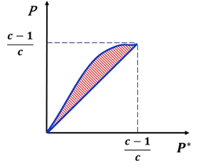

### KNN 算法

又称 k 近邻分类器，原理与最近邻类似，只是同时考虑 k 个样本中的多数属于哪个类别。当$$N \to \infty$$且$$k \to \infty$$时，k 近邻的决策规则就变成了最大后验概率贝叶斯分类。可以证明$$N \to \infty$$时，k 近邻分类器的错误率上下界如下，其中$$P^*$$为该分类问题对应的最小贝叶斯分类错误率。$$k=1$$时，k 近邻分类器就是最近邻分类器；$$k$$越大，错误率上界越逼近$$P^*$$。当$$N$$有限时，同样有$$k$$越大分类错误率越低的结论，但同时分类结果的随机偏差也越大，因此需要折衷选择$$k$$的大小

$$
P^* \leqslant P \leqslant \sum_{i = 0}^{\frac{k-1}{2}} C_{k}^{i} \left[ (P^*)^{i + 1} (1 - P^*)^{k - i} + (P^*)^{k - i} (1 - P^*)^{i + 1} \right]
$$

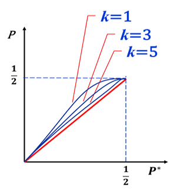

### 改进 KNN 算法

KNN 算法有两个问题，一是对于每一个待分类的样本，都必须计算该样本到样本集中所有样本的距离，从而找出其 k 个近邻来完成分类，因此算法的计算量随着样本集的增大而增大；二是样本集中的所有样本都必须被使用，这给算法带来了巨大的存储压力。

#### 快速 KNN 算法

通过对原始样本集的整理，将其组织为分层的树形结构，计算待分类样本到样本集中样本的距离时，先利用三角关系考虑某一组样本是否有计算的必要，如无必要，则该组样本全部不参与计算，从而大幅度地减少 k-近邻分类器的计算量。

#### 压缩近邻法

是通过对原始样本集中样本的删减，寻找到一个分类效果与原始样本集相当、但样本数量更少的新样本集，从而同步提升最近邻算法在速度和存储量两方面的性能。

## 第八章 数据聚类

### 聚类原理

聚类即将样本集中的样本按照相似程度划分成不同的类别，聚类算法是一种无监督算法，一般无先验知识可以参考，根据模式之间的相似性对模式进行分类，相似性的衡量直接决定聚类定义，因此聚类的定义大多是模糊的。

### 聚类特点

聚类是对整个样本集的划分而不是对单个样本的识别，而分类关注的是具体样本。聚类的依据是样本间的相似程度，即符合紧致性的要求。聚类分硬聚类和软聚类，硬聚类即样本确定地属于某个类别，软聚类即样本可以在不同程度上属于不同类别，如模糊聚类。另外，聚类完全由数据驱动，没有先验知识和已知的分类决策规则，结果呈现多样化的特点。

聚类结果受到特征选取和聚类准则设定、相似度度量标准、各个特征的量纲标尺的影响。对于量纲标尺这一点，一般来说不希望不同类型的特征之间出现数据权重的差异，需要进行归一化的处理；但在某些聚类任务中，某些特征确实应该具有比其它特征更大的权重，此时就不应使用归一化。

聚类关心的是样本集，不关心单个样本的，只有当数据的随机噪声严重降低了整个数据集的信噪比，甚至淹没了数据时，才会影响聚类结果。

### 常见聚类算法

#### 试探法聚类

- 基于最近邻规则的试探法聚类算法

  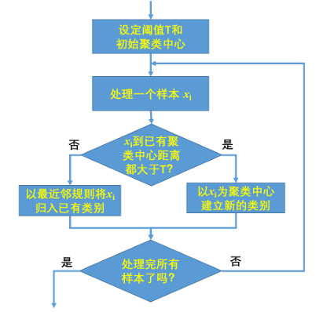

  本质上是设定了每类样本距离该类聚类中心的距离的最大容许值 T，分类结果受到第一个聚类中心的选择，待分类模式样本的排列顺序，阈值 T 的大小，样本分布的几何性质。由于阈值 T 是人为给定的，并且一个样本一旦划归到某一类中就无法剔除或调整，因此最近邻规则的试探聚类算法不能保证满足误差平方和最小的准则。

- 基于最大最小距离的试探法聚类算法

  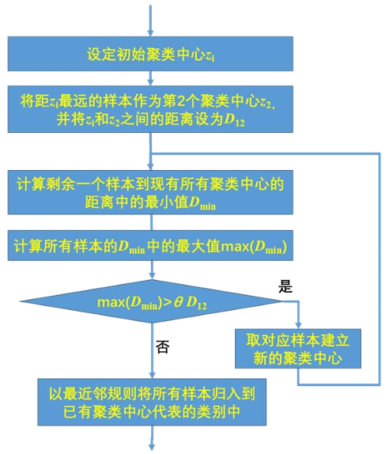

  最大最小距离聚类算法是将聚类中心寻找和样本聚类分成两个独立的步骤来进行，第一步以初始聚类中心和距它最远的样本之间的距离为标准，来寻找出所有彼此间足够远的样本来作为各类的聚类中心，第二步再依据最近邻规则对样本进行归类。

  最大最小距离聚类算法的结果与参数$$\theta$$及第一个聚类中心的选择有关(第一个聚类中心越靠近整个样本集的边缘，获得的聚类结果紧致性会越好)

#### 层次法聚类

层次聚类算法是一种特殊的聚类算法，它不是将样本集做一次性划分，而是在不同的层次上对样本集中的所有样本进行整理，按照其相似程度进行聚类，最终形成一个二叉树的分类结构。在树的根节点上，整个样本集作为一个类，而在树的叶节点上，每个样本独立成为一类。层次聚类算法既可以用于对整个样本集中的样本进行整理，也可以根据所需的聚类类别数，在整个层次聚类树中去找到最优的聚类方案。即使不指定类别的数量，层次法聚类也可以用于寻找最优的样本集聚类结果：当在某个层次上聚类结果具有比较好的紧致性，再继续进行下一层次的聚类会破坏聚类结果的紧致性，导致类内样本间相似度大幅度降低、类间相似度大幅度增加时，则代表已取得了最优的聚类结果。(每一步是最优，总体来说不是全局最优)

完成层次聚类有两种基本算法：融合算法和分解算法

- 融合算法

  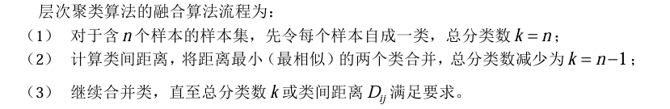

- 分解算法

  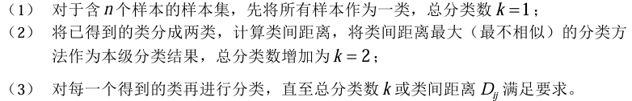

无论是融合算法还是分解算法，都是局部最优化的算法，虽然在每一步融合或分解时求得了当前一步的最优聚类，但是此时被合并的样本，以后就无法再分开；此时被分开的样本，以后就无法再聚集，导致不能保证求得全局最优解。

#### 动态聚类

动态聚类算法是一种迭代算法，通过反复修改聚类结果来进行优化，以达到最满意的聚类结果。动态聚类算法首先以一些初始点为聚类中心，对样本集进行初始分类；然后判定分类结果是否能使一个确定的准则函数取得极值：如能，聚类算法结束；如不能，改变聚类中心，重新进行分类，并重复进行判定。

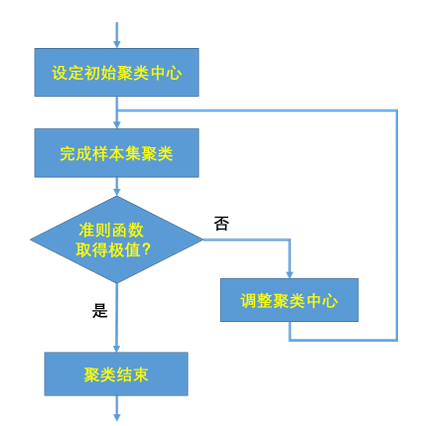

- k 均值聚类算法流程如下

  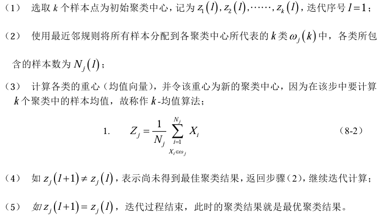

  k 均值算法有如下特点：

  - k 均值算法在对样本分类时，采用的是最近邻规则，同时其各类的聚类中心是该 类样本的重心，因此其聚类准则是误差平方和准则，聚类目标是误差平方和最小。

  - k-均值算法是收敛的，其最终聚类结果收敛于一个确定的解，但不一定会收敛到唯一一个最优解上。(MSE：单调递减且有界，则收敛)

    补充：EM 算法，有一个隐变量，分两步(先用联合概率分布的条件期望估计隐含变量分布；再用极大似然估计法估计样本分布参数)；本身也是收敛的，本质上是贪心算法，局部最优

  - k-均值算法的聚类结果虽然是收敛的，但并不确定。首先类别边界处的样本一旦被随机分到某一个类中，会使得该类的重心更靠近它，增强这种分类方式的牢固性；其次，k 均值分类的结果还受到设定的聚类数 k、初始聚类中心和样本的分布情况影响。

  - k 均值聚类的初始聚类中心不会严重地影响最终聚类的整体结果，但是会影响到聚类算法收敛速度的快慢和边界样本的最终归属类别，常用的选择算法如下：

    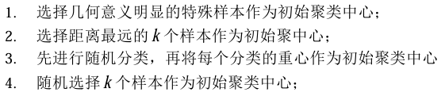

- ISODATA 算法

  迭代自组织数据分析算法，在 k-均值算法的基础上，增加对聚类结果的“合并(Merge)”和“分裂 (Split)”两个操作，并设定算法运行控制参数的一种聚类算法。

  算法流程如下

  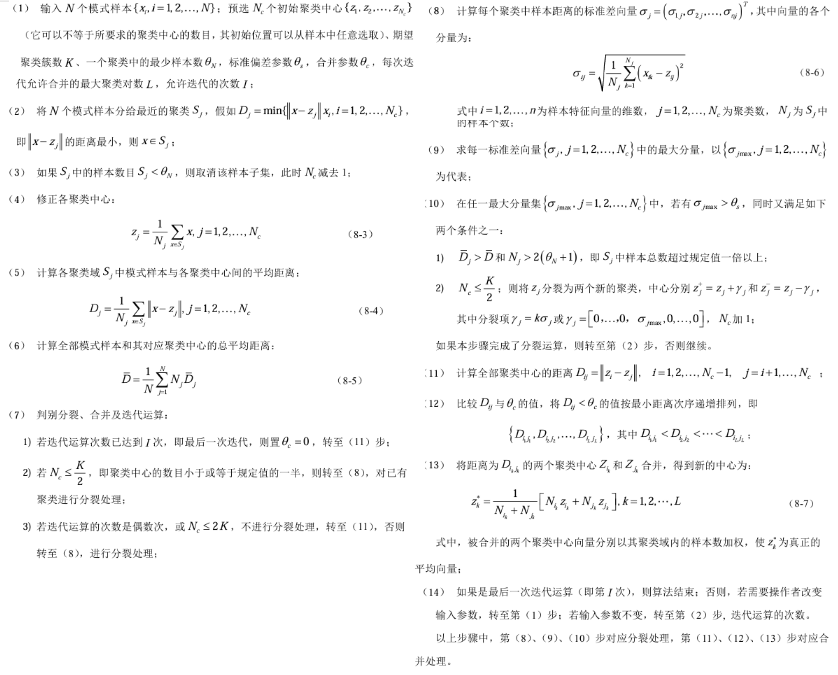

  ISODATA 算法的特点有：

  - 使用误差平方和作为基本聚类准则
  - 设定指标参数来决定是否进行“合并”或“分裂”
  - 设定算法控制参数来决定算法总体的运算次数
  - 具有自动调节最优类别数 k 的能力
  - 算法规则明确，便于计算机实现

### 数据聚类的流程

完整的数据聚类过程包括：选定特征、确定相似度、设定聚类准则、选择聚类算法、聚类结果评估。

相似度度量指标有样本间的相似度以及类间的相似度，样本间的相似度最常用的是各种距离度量，样本间的相似度最常用的有最短距离、最长距离、中心距离(重心之间的距离)、类平均距离(距离加和取平均)等。

常用的聚类准则有紧致性原则、散布原则、误差平方和准则、分布形式准则
