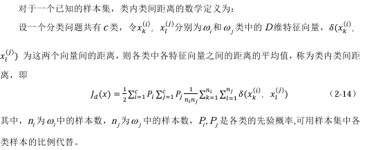
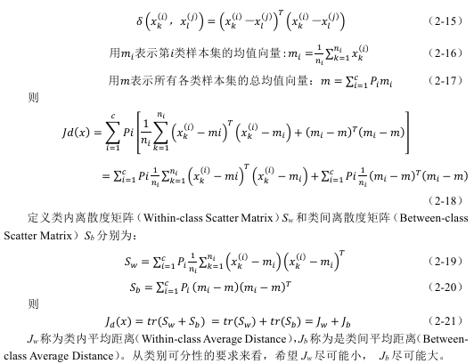
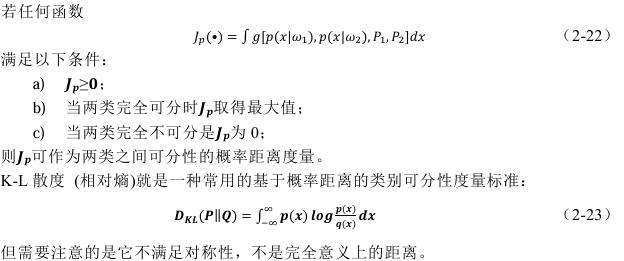

## 概述

课程内容：基本概念和原理，主要算法，应用技能

模式识别属于控制科学与工程，研究如何使计算机具备模式识别的能力，即如何利用规则完成对外部世界完成分类，更关注的是如何解决工程问题，至于是否选用机器学习的算法，取决于具体要解决的问题。步骤有三：设计分类器（选择一个实现分类的算法），训练分类器，使用分类器。

考核：平时 25%（在线课章节测验），项目实践 35%（个人报告 10%，小组论文 10%，项目成果展示及测试 15%），期末考试 40%（在线课期末考试 20%+乐学或线下开卷 20%）

**注意：提交的东西如果使用了 AI 需要提交说明**

## 第一章 概述

识别的意思是，给某个事物贴上类别标签，也就是分类，类别也可以抽象为某个概念或定义。

识别(Recognition)本质是 Re-cognition，即再认知。现有认知，再有识别。识别是对概念的再归类。以共同的特征建立类别，识别的基础是相似性。而根据相似性进行识别就有可能出现错误。

模式的意思是，可以用来给事物代表归类的特征，从具体事物中抽象出的部分信息，可以代表这个事物，用于完成归类的任务，图片、视频、数值、行为等都是一种模式。

模式识别的意思是，对事物进行概念归类。模式识别的过程仅仅根据特征进行判定，不一定能获知事物本质。

### 人工智能与模式识别

人工智能大概有感知、理解和决策、行动三个方向；主要的人工智能研究集中在第二个方向，以前关注较多的行动，目前研究已经不多了，被整合为具身智能这个概念。模式识别和人工智能有相当大的交集但又互不包含。强化学习和模式识别没有关系（关心下一步的决策，不包含分类）。模式识别也有不包含机器学习的，比如光电阅读机（纯机械的装置），用了模板匹配（非智能的算法）。

机器学习的三大任务：分类、回归（拟合）、决策，分类是最核心的任务，另外两个问题在某种程度上都可以划分为分类问题，回归是为了逼近某个数据分布，比如预测就是一个分类问题；强化学习就是一种决策型的任务。

模式识别与机器学习在许多算法上是通用的，但模式识别的目的在于使计算机具备识别能力，机器学习的目的在于使计算机更好地理解环境并与环境交互。

### 模式识别系统组成

设计一个模式识别系统，就是要设计分类器的模型、所使用的特征和分类器参数的调整算法。

### 基本概念

- 样本：待识别的客观事物。

- 模式：模从客观事物抽象出的规范化的关键特征，在有限维条件下可以描述和表达样本， 是模式识别的对象，一般用事物的各种属性来表示。

- 类：具有某种相似性的模式的集合，表达一个抽象的概念。

- 分类器：实现模式识别任务就是设计一个分类器。分类器设计首先要确定分类决策规则的框架，也就是分类器模型或模式识别算法，然后确定需要从样本中抽取哪些特征来用于分类。

- 特征：特征是从所有模式信息中选取出来的，可以用于模式识别的部分属性，可以是数值型的或非数值型的，非数值型特征也需要数据编码表示，只是数据之间没有数值关系。

- 特征空间：把每个特征作为一个维度，就可以构成一个多维的特征空间，每个模式都是特征空间中的一个点。数值型特征构成向量空间，非数值特征构成集合空间。样本之间的相似程度，可以用这些特征空间的点之间的相似程度来计算。每一类样本的聚集区域，则表现为向量空间中点的统计分布。向量特征空间中的一个点代表一个模式，其各个特征值构成了一个特征向量。

- 相似性：模式识别的依据是模式之间的相似性，相似度度量需要满足三个标准

  - 相似度应当为非负值
  - 一个模式与自身的相似度应当是最大的
  - 相似度计算对两个模式是对称的

  数值型特征的相似度度量标准可用点与点之间的距离。距离的定义需要满足三个特性：正定性、对称性、传递性。常用的数值型距离度量有欧几里得距离、曼哈顿距离、切比雪夫距离、闵可夫斯基距离；非数值型距离度量有编辑距离。非距离的相似度标准有余弦相似度、皮尔逊相关系数、JACCARD 相似系数等。

- 紧致性准则：要求样本集中属于同一个类的样本间的相似度，应当远大于属于不同类的样本间的相似度。有时可通过增加特征空间的维数，或进行空间映射变换来增强该问题模式类的紧致性。

- 类别可分型度量：紧致性的量化表示，常用的有基于类内类间距离和基于概率距离两种类型。

    - 类内类间距离：

        

        对于随机性的统计分类，如果样本集是给定的，则无论其中各类样本如何划分，类内类间距离都是相等的，也就是说，类内类间距离本身和分类错误率不相关，不能直接用于类别可分性度量，但对其进行分解处理后，可以得到与类别可分性相关的测度指标

        

    - 概率距离：

        用分布函数之间的距离来度量

        

- 维数灾难：最早是由贝尔曼在研究动态规划时发现并命名的，根本原因在于训练集样本的数量不足，变得稀疏，样本集的紧致性变差。比起大量增加样本的数量，比较理想的做法是尽可能地减少问题所使用的特征维度，尽可能地提升每一个维度在分类中的效能。

- 学习：分类器通过某些算法找到自身最优参数的 过程，称为分类器的训练或学习。学习分为有监督学习、无监督学习、半监督学习和自监督学习。采用无监督学习的分类器，能够达到更高的智能水平，也是未来模式识别技术发展的主要方向。半监督和自监督是灵活运用有监督和无监督的学习方式。

- 泛化能力：训练好的分类器对未知新样本正确分类的能力

- 过拟合：按照存在误差的样本训练得到的分类器，有可能得到错误的分类决策规则，对未知新样本正确分类的能力大幅度下降。过拟合的来源是误差数据，而误差数据无法避免。

## 第二章 特征工程

特征生成和特征降维统称为特征工程。例如，模式采集得到的图像信息，其原始数据为像素点的颜色值矩阵，对于不同的模式识别任务可以生成不同的特征，如轮廓特征、颜色特征、纹理特征、关键点特征、频域特征、数字特征等。

特征降维的目的是删除冗余信息、减少算法计算量和对样本集规模的需求，并提高特征对分类的有效性。由于各个维度的特征对于分类的贡献不一，在降低特征维度时，需要采用适当的算法， 最大可能地保留对分类有效的信息。

特征降维的方法主要包括特征选择（Feature Selection）和特征提取（Feature Extraction）。 特征选择是从已有的特征中，选择一些特征，抛弃掉其它特征；特征提取是对原始的高维特征进行映射变换，生成一组维数更少的特征。

特征工程的方法如下

### 数据预处理

数据去重、缺值补充、数据增强、异常值处理等

### 特征提取

通过某种变换，将原始特征从高维空间映射到低维空间的过程
$$
W: X\rightarrow Y
$$

$$W$$称为特征提取器，通常是某种正交变换（正交变换能使变换后的向量长度、向量间的内积、距离、夹角等性质都不变，因此不会对图形进行拉伸或压缩，保持空间的不变性，不会损失信息）。对于各种可能的特征提取器，需要选择最优的一种：（比如可以以最终分类结果、相关性最强等标准定义最优）

$$
J(W^*)=\max J(W)
$$

#### 基于可分性度量的特征提取

类内类间距离可表示为

$$
J_d = J_w + J_b = tr(S_w + S_b)
$$

对于一个给定的样本集，$$J_d$$固定不变，最佳的特征提取应该使得$$J_w$$最小$$J_b$$最大，因此可以直接使用$$J_b$$作为特征提取的准则函数，称为$$J_1$$准则。

然而直接使用$$J_1$$准则难以得到可行的特征提取算法，考虑到类内离散度矩阵$$S_w$$和类间离散度矩阵$$S_b$$是对称矩阵，迹和行列式值在正交变换下具有不变性，常构造以下几种特征提取准则函数：

$$
\begin{aligned}
J_1&=J_b\\
J_2&=\mathrm{tr}(S_w^{-1}S_b)\\
J_3&=\ln\left[\frac{S_b}{S_w}\right]\\
J_4&=\frac{\mathrm{tr}(S_b)}{\mathrm{tr}(S_w)}\\
J_5&=\frac{\vert S_w + S_b \vert}{\vert S_w \vert}\\
\end{aligned}
$$

给定某个具体的准则函数，对$$W$$求偏导等于 0，求解即可得到最优的特征提取矩阵$$W$$。

### 特征选择

从高维特征中挑选出一些最有效的特征
$$
\begin{aligned}
S&:\{x_1,x_2,\ldots,x_D\}\to F:\{y_1,y_2,\ldots,y_d\}\\
y_i&\in S, i = 1,2,\ldots,d;~d < D
\end{aligned}
$$

核心思想是以一定的准则计算评估每个特征的重要性，剔除对分类结果影响较小甚至没有影响的特征。

对于各种可能的特征选择方案，需要选择最优的一种：（比如可以以最终分类结果、相关性最强等标准定义最优）

$$
J(F^*)=\max J(F)
$$
常用特征选择算法

- 独立算法：指分别计算 D 个特征单独使用时的准则函数值，选取最优的前 d 个特征。除非各特征相互独立，准则函数满足可加性，否则独立算法所得到的特征组合均不能保证是最优的特征组合，因此独立算法并不实用。
- 穷举算法：从 D 个特征中考查所有可能的 d 个特征组合，计算其准则函数，找到最优的一个，从而得到最佳的特征选择结果。穷举法可以保证得到所有解中的全局最优解，但问题是计算量太大。
- 分支界定法：一种穷举算法，它在准则函数 J 对特征数量单调的情况下能保证取得最优解。但如果搜索树的所有节点都需要计算一遍准则函数值，则计算量远大于只计算叶节点准则函数值的穷举法；只有当计算过程中利用准则函数 J 对特征数量的单调性跳过大量节点计算时，计算量才有可能比穷举法少。
- 次优算法：有顺序前进、顺序后退、动态顺序前进；本质上都是贪心算法，即每次选择或剔除一个特征，使得操作后的准则函数值最大。

### 维度压缩

通过某种数学变换或算法来对数据集的整体维度进行压缩，同时保留数据中最关键的信息。主成分分析（PCA）就是一种非常典型的维度压缩工具，它在降低数据的维度同时，保留了各个维度中最具有差异性的信息分量

### 特征构造

建立在领域知识基础上，通过对原始数据或已有特征的综合处理来得到新的特征

### 特征变换

对特征的尺度或分布加以调整，以满足分类决策规则的假设，包括标准化（零均值和单位方差）、归一化（特征缩放到[0, 1]）、对数变换等

### 特征编码

对非数值型特征的编码，例如对集合型特征可用独热编码或标签编码、对模糊特征可用模糊子集相应的隶属度函数值、对随机型特征可用统计分布指标、对文本特征可采用嵌入编码

- 独热编码：又称一位有效编码，在任意时候，只有一位是 1，其余都是 0。对数据进行预处理去偏时，通常要确定 2 个相似个体特定特征之间的度量距离，One-hot 编码能更加合理的计算特征之间的距离，从而达到去偏的效果。把特征之间距离的问题，转换为了计算向量之间距离的问题。
- 标签编码：把分类类型数据转换为数值编码的一种方法，即直接对类别特征进行了大量映射，每个分类都被赋予唯一的数字编号。编码后的数据没有大小关系，只是数字替代类别标签。当标签过多时，编码会变得很大并使得计算机难以处理，同时，标签编码不能反映分类之间的关系
- 隶属度函数值：比如判断 “天气是否炎热” 这个模糊特征。定义隶属度函数：当温度 ≥35℃ 时，隶属度为 1（完全属于炎热）；温度在 25℃ - 35℃ 之间，隶属度 = (t - 25) / 10 （t 为温度 ）；温度 ≤25℃ 时，隶属度为 0（完全不属于炎热） 。若某天温度是 30℃，则隶属度 = (30 - 25) / 10 = 0.5 ，表示这天处于有点炎热的状态。

### 特征融合

将来自不同数据源或不同特征集的特征进行组合，融合的基础是进行融合的特征之间相关性弱，并且融合之后得到的特征比单一特征具有更好的分类性能，常用方法有加权平均、特征连接、特征映射和分类器模型融合

---

特征工程的方法属于人工干预的方法，依赖于人的经验和领域知识，缺少通用的流程和方法。随着深度神经网络的快速发展，“端到端（End to End）”技术越 来越流行，并在很多场合取代了特征工程的地位。 端到端技术，就是指跳过特征生成和特征降维环节，直接将具有原始特征的样本数据输入深度神经网络模型，由模型在学习过程中自行提取出对分类最有效的特征，并应用于最终的分类决策。

## 第三章 统计学习理论

### 机器学习的基本问题

根据给定的已知训练样本求取对系统的输出与输入之间依赖关系的估计， 使它能对给定输入下的未知输出做出尽可能准确的预测。

即：根据 n 个独立同分布观测样本 $$(x_1,y_1),(x_2,y_2),\cdots,(x_n,y_n)$$，在一组函数$$\{f(x, w)\}$$中寻求最优的一个函数$$\{f(x, w_0)\}$$对依赖关系进行估计，使期望风险最小

$$
R(w)=\int L(y,f(\boldsymbol{x},w))dF(\boldsymbol{x},y) \quad L(y,f(\boldsymbol{x},w))为预测造成的损失，称为损失函数
$$

机器学习不同问题下损失函数的定义如下

- 有监督学习的分类问题，系统输出为类别标签，以二分类为例

  $$
  \begin{aligned}
  L(y,f(\boldsymbol{x},w))=
  \begin{cases}
  0, & y = f(\boldsymbol{x},w)\\
  1, & y \neq f(\boldsymbol{x},w)
  \end{cases}
  \end{aligned}
  $$

  此时的期望风险就是贝叶斯决策中使错误率最小

- 函数拟合中，误差采用最小平方误差

  $$
  L(y,f(\boldsymbol{x},w))=(y - f(\boldsymbol{x},w))^2
  $$

- 对于概率密度估计，目的是确定概率密度函数$$p(x, w)$$
  $$
  L(p(\boldsymbol{x},w))=-\log p(\boldsymbol{x},w)
  $$

### 函数的容量和 VC 维

统计学习理论用函数集在一组样本集上可能实现的分类规则数目来度量函数集的容量，把这个容量的自然对数在符合同一分布的样本集上的期望称作函数集的熵，而把容量的自然对数在所有可能样本集上的上界定义为函数集的生长函数，生长函数是样本数目$$n$$的函数，记作$$G(n)$$，反映了函数集在所有可能的$$n$$个样本上的最大容量。一个函数集的生长函数，如果不是一直满足$$G(n) = n\ln 2$$，则一定在样本数增加到某个值$$h$$后满足下面的界：

$$
G(n) \leq h\left(\ln \frac{n}{h}+1\right), \quad n > h
$$

这个特殊的样本数$$h$$称为函数集的 VC 维。VC 维衡量了当样本数据增加到多少之后函数集的能力就不会继续跟随样本数目等比例增长。因此，VC 维有限是学习过程一致性的充分必要条件。

VC 的概念是抽象的，相对直观的定义为，对一个指示函数，如果存在$$k$$个样本能够被函数集中的函数按所有可能的$$2^k$$种形式分开，则称函数集能把样本数为$$k$$的样本集打散。指示函数集的 VC 维就是能够打散的最大样本集的样本数目。如果对于任意数目的样本，总能找到一个样本集能够被这个函数集打散，则函数集的 VC 维就是无穷大。函数集的 VC 维并不简单地与函数中自由参数个数有关，而是与函数本身的复杂程度有关。

### 经验风险最小化原则

机器学习就是在函数集中最小化期望风险的期望风险泛函，但这个风险泛函需要对服从联合概率密度$$F(x, y)$$的所有可能样本及其输出值求期望，这在$$F(x, y)$$未知的情况下无法进行。根据大数定律，用算数平均值代替期望，定义经验风险为在训练样本上损失函数的平均，传统的机器学习方法都用这中方式来代替最小化期望风险的目标，这种策略称为经验风险最小化原则（ERM 原则）

$$
R_{EMP}(w)=\frac{1}{n}\sum_{i = 1}^{n}L(y_i,f(\boldsymbol{x}_i,w))
$$

### 结构风险最小化原则

经验风险最小化原则在训练样本较少时是存在问题的，我们需要同时最小化经验风险和置信范围，而不能单独最小化经验风险。在传统机器学习方法中，设计学习模型和算法的过程就是优化置信范围的过程。统计学习理论提出了一种策略来解决这个问题，即把函数集分解为一个函数子集序列使各个子集能够按照置信范围的大小排列，也就是按照VC维的大小排列，在划分了这样的函数子集结构后，学习的目标就变成在函数集中同时进行子集的选择和子集中最优函数的选择。选择最小经验风险与置信范围之和最小的子集，就可以达到期望风险的最小，这个子集中使经验风险最小的函数就是要求的最优函数。这种思想称作结构风险最小化，简称 SRM 原则。

学习机器的实际风险由经验风险（训练误差）和置信范围组成，置信范围和学习机器的VC维及训练样本量有关。一个学习机器的推广能力不是取决于经验风险最小能有多小，而是在于期望风险与经验风险有多大差距，这个差距越小则推广能力越好。样本数量较少时置信范围较大，用经验风险最小化取得的最优解可能会有较大的期望风险，即可能推广性较差。

对于一个特征的问题，样本数是固定的，此时学习机器的VC维越高（复杂性越高），置信范围就越大，导致真实风险与经验风险之间可能的差别越大，推广能力可能越差。因此对于有限样本的任务，应该尽可能选用相对简单的分类器。设计分类器时不但要考虑函数集中的函数能否使经验风险有效减小，还要使函数集的VC维尽量小，从而缩小置信范围，期望获得尽可能好的推广能力。 

### 学习过程的一致性

学习过程的一致性是指当训练样本数趋向于无穷大时，以经验风险最小化原则进行的学习与期望风险最小的目标是否一致。

统计学习理论提出学习理论关键定理：对于有界的损失函数，经验风险最小化学习一致的充分必要条件是，经验风险在如下式意义上一致地收敛于真实风险
$$
\lim_{n\rightarrow\infty}P\left\{\sup_{w_n}\left(R(w_n)-R_{EMP}(w_n)\right)>\varepsilon\right\}=0, \quad \forall\varepsilon > 0
$$

在学习过程中，经验风险和期望风险都是预测函数，学习的目的不是用经验风险去逼近期望风险，而是通过求使经验风险最小化的函数来逼近使期望风险最小化的函数数，因此其一致性条件比传统统计学中的一致性条件更为严格。

### 正则化方法

正则化是解决不适定问题的一类方法（不适定问题是指，即使方程存在唯一解，方程右边的微小扰动$$\vert F - F_{\delta} \vert < \delta$$会带来很大变化；后来发现应该最小化以下的正则化泛函：
$$
R^*(f)=\|Af - F_{\delta}\|^2+\lambda(\delta)\Omega(f)
$$
对于机器学习问题大部分都是用样本特征和对应的观测数据来拟合它们之间的函数关系，所以都属于不适定问题。为解决这个问题，在机器学习模型学习过程中 就必须要引入正则化方法，通常是在模型的损失函数中添加一个正则项（惩罚项）来实现。常见的正则化方法有：Lasso正则化（L1正则化）、Tikhonov正则化（L2正则化）、弹性网正则化（混合正则化）；对于正则化方式使用的范数，也是一种超参数。

## 第四章 线性分类器

线性判别函数是某个参数集的线性函数，这些参数被称为权向量，而寻找线性判别函数的问题将被形式化为极小化准则函数的问题。

### 判别函数

在模式识别中，如果根据模式特征信息，按照决策论的思路，以一定的数量规则来采 取不同的分类决策，将待识别的模式划分到不同的类别中去，就称为模式识别的决策论方法。在决策论方法中，特征空间被划分成不同的区域，每个区域对应一个模式类，称为决策区域（Decision Region）。判定决策区域就是分类。

## 知识补充

1. 模板匹配算法
2. 皮尔逊相关系数、JACCARD 相似系数、概率论视角下的线性代数
3. 分类器选择：可采用有监督学习、无监督学习、半监督学习或自监督学习。
4. 手写数字识别
5. Linear Algebra Done Right 及其练习
6. 准则函数 J 是由人给定吗？怎么给定？还是由机器学出来？怎么学？
7. PCA->协方差矩阵->多元正态分布->概率论
8. 独热编码
9. 基于类内类间距离和基于概率距离的类别可分性度量，基于类别可分性度量的特征提取
10. 特征选择算法
11. 贝叶斯决策
12. 如何理解期望风险的定义
13. 泛函
14. 如何度量两个函数的接近程度

权向量归一化后，超平面的位置由 w_0 决定

线性不可分的条件，凸包，连通性

广义线性化：如果能找到非线性边界，想办法映射到高维，扩维使其线性。支持向量机在理论上就是用的广义线性化

线性分类器本质上只能进行二分类，多分类本质上是多个二分类的组合。绝对可分，多分类组合的不可识别区域非常大。两两可分的不可识别区域相对较小。最大值可分，要看哪一类的值最大，是一种特殊的两两可分。目前支持向量机处理多分类问题仍然采用绝对可分。

判别函数的值代表了距离分类决策边界的距离

训练分类器的一般思路：设定准则函数、求极小值，则求得最优值；改变权向量来优化

变换：增广、规范化

具体求解的算法：感知器算法，最大特点是把生物神经元机理做了数学抽象，把树突收集到的信号与激活阈值进行比较，大于则产生输出。准则函数设为错分样本的集合。用梯度下降法求取，有批量梯度下降法和随机梯度下降法（课程中其实应该叫单词梯度下降法，要把每个样本都用来下降一次）

学习速率设定：固定式、绝对修正、部分修正、变速学习（用的多）、优化学习（把步长也最优化）。下降受样本集影响，不一定都能收敛

线性代数研究的是向量空间及其变换，压缩

关联最密切的是协方差矩阵，特征值分解

泛函：最优化控制里面必讲泛函

核心是首先由函数空间，无穷维的空间，每个向量是一个函数，复返空间

值域在普通的向量空间，泛函就是无穷维空间到这个向量空间的映射，函数空间

每一个函数对应一个实数，研究函数取什么形式，可以使得函数取某一个值，类似于最优化问题

研究函数取什么形式，函数能取得这个值，模型求解就是求泛函的问题。求取什么参数时，准则函数可以求得极值，通过算子求得极值

求求解这个泛函的方法

手写数字识别的流程

