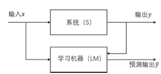

## 概述

课程内容：基本概念和原理，主要算法，应用技能

模式识别属于控制科学与工程，研究如何使计算机具备模式识别的能力，即如何利用规则完成对外部世界完成分类，更关注的是如何解决工程问题，至于是否选用机器学习的算法，取决于具体要解决的问题。步骤有三：设计分类器（选择一个实现分类的算法），训练分类器，使用分类器。

考核：平时 25%（在线课章节测验），项目实践 35%（个人报告 10%，小组论文 10%，项目成果展示及测试 15%），期末考试 40%（在线课期末考试 20%+乐学或线下开卷 20%）

**注意：提交的东西如果使用了 AI 需要提交说明**

## 第一章 概述

识别的意思是，给某个事物贴上类别标签，也就是分类，类别也可以抽象为某个概念或定义。

识别(Recognition)本质是 Re-cognition，即再认知。现有认知，再有识别。识别是对概念的再归类。以共同的特征建立类别，识别的基础是相似性。而根据相似性进行识别就有可能出现错误。

模式的意思是，可以用来给事物代表归类的特征，从具体事物中抽象出的部分信息，可以代表这个事物，用于完成归类的任务，图片、视频、数值、行为等都是一种模式。

模式识别的意思是，对事物进行概念归类。模式识别的过程仅仅根据特征进行判定，不一定能获知事物本质。

### 基本概念

- 样本：待识别的客观事物。

- 模式：模从客观事物抽象出的规范化的关键特征，在有限维条件下可以描述和表达样本， 是模式识别的对象，一般用事物的各种属性来表示。

- 类：具有某种相似性的模式的集合，表达一个抽象的概念。

- 分类器：实现模式识别任务就是设计一个分类器。分类器设计首先要确定分类决策规则的框架，也就是分类器模型或模式识别算法，然后确定需要从样本中抽取哪些特征来用于分类。

- 特征：特征是从所有模式信息中选取出来的，可以用于模式识别的部分属性，可以是数值型的或非数值型的，非数值型特征也需要数据编码表示，只是数据之间没有数值关系。

- 特征空间：把每个特征作为一个维度，就可以构成一个多维的特征空间，每个模式都是特征空间中的一个点。数值型特征构成向量空间，非数值特征构成集合空间。样本之间的相似程度，可以用这些特征空间的点之间的相似程度来计算。每一类样本的聚集区域，则表现为向量空间中点的统计分布。向量特征空间中的一个点代表一个模式，其各个特征值构成了一个特征向量。

- 相似性：模式识别的依据是模式之间的相似性，相似度度量需要满足三个标准

  - 相似度应当为非负值
  - 一个模式与自身的相似度应当是最大的
  - 相似度计算对两个模式是对称的

  数值型特征的相似度度量标准可用点与点之间的距离。距离的定义需要满足三个特性：正定性、对称性、传递性。常用的数值型距离度量有欧几里得距离、曼哈顿距离、切比雪夫距离、闵可夫斯基距离；非数值型距离度量有编辑距离。非距离的相似度标准有余弦相似度、皮尔逊相关系数、JACCARD 相似系数等。

- 紧致性准则：要求样本集中属于同一个类的样本间的相似度，应当远大于属于不同类的样本间的相似度。有时可通过增加特征空间的维数，或进行空间映射变换来增强该问题模式类的紧致性。

- 维数灾难：最早是由贝尔曼在研究动态规划时发现并命名的，根本原因在于训练集样本的数量不足，变得稀疏，样本集的紧致性变差。比起大量增加样本的数量，比较理想的做法是尽可能地减少问题所使用的特征维度，尽可能地提升每一个维度在分类中的效能。

- 学习：分类器通过某些算法找到自身最优参数的 过程，称为分类器的训练或学习。学习分为有监督学习、无监督学习、半监督学习和自监督学习。采用无监督学习的分类器，能够达到更高的智能水平，也是未来模式识别技术发展的主要方向。半监督和自监督是灵活运用有监督和无监督的学习方式。

- 泛化能力：训练好的分类器对未知新样本正确分类的能力

- 过拟合：按照存在误差的样本训练得到的分类器，有可能得到错误的分类决策规则，对未知新样本正确分类的能力大幅度下降。过拟合的来源是误差数据，而误差数据无法避免。

### 模式识别系统组成

设计一个模式识别系统，就是要设计分类器的模型、所使用的特征和分类器参数的调整算法。

## 第二章 特征生成和特征降维

特征生成和特征降维统称为特征工程。

例如，模式采集得到的图像信息，其原始数据为像素点的颜色值矩阵，对于不同的模式识别任务可以生成不同的特征，如轮廓特征、颜色特征、纹理特征、关键点特征、频域特征、数字特征等。

特征降维的目的是删除冗余信息、减少算法计算量和对样本集规模的需求，并提高特征对分类的有效性。由于各个维度的特征对于分类的贡献不一，在降低特征维度时，需要采用适当的算法， 最大可能地保留对分类有效的信息。

特征降维的方法主要包括特征选择（Feature Selection）和特征提取（Feature Extraction）。 特征选择是从已有的特征中，选择一些特征，抛弃掉其它特征；特征提取是对原始的高维 特征进行映射变换，生成一组维数更少的特征。

### 特征工程的方法

1. 数据预处理：包括数据去重、缺值补充、数据增强、异常值处理等

2. 特征提取：通过某种变换，将原始特征从高维空间映射到低维空间的过程

   $$
   W: X\rightarrow Y
   $$

   $$W$$称为特征提取器，通常是某种正交变换。对于各种可能的特征提取器，需要选择最优的一种：

   $$
   J(W^*)=\max J(W)
   $$

3. 特征选择：从高维特征中挑选出一些最有效的特征

   $$
   \begin{align*}
   S&:\{x_1,x_2,\ldots,x_D\}\to F:\{y_1,y_2,\ldots,y_d\}\\
   y_i&\in S, i = 1,2,\ldots,d;~d < D
   \end{align*}
   $$

   对于各种可能的特征选择方案，需要选择最优的一种：

   $$
   J(F^*)=\max J(F)
   $$

4. 维度压缩：通过某种数学变换或算法来对数据集的整体维度进行压缩，同时保留数据中最关键的信息。主成分分析（PCA）就是一种非常典型的维度压缩工具，它在降低数据的维度同时，保留了各个维度中最具有差异性的信息分量。

5. 特征构造：建立在领域知识基础上，通过对原始数据或已有特征的综合处理来得到新的特征

6. 特征变换：对特征的尺度或分布加以调整，以满足分类决策规则的假设，包括标准化（零均值和单位方差）、归一化（特征缩放到[0, 1]）、对数变换等

7. 特征编码：对非数值型特征的编码，例如对集合型特征可用独热编码或标签编码、对模糊特征可用模糊子集相应的隶属度函数值、对随机型特征可用统计分布指标、对文本特征可采用嵌入编码

8. 将来自不同数据源或不同特征集的特征进行组合，融合的基础是进行融合的特征之间相关性弱，并且融合之后得到的特征比单一特征具有更好的分类性能，常用方法有加权平均、特征连接、特征映射和分类器模型融合

特征工程的方法属于人工干预的方法，依赖于人的经验和领域知识，缺少通用的流程和方法。随着深度神经网络的快速发展，“端到端（End to End）”技术越 来越流行，并在很多场合取代了特征工程的地位。 端到端技术，就是指跳过特征生成和特征降维环节，直接将具有原 始特征的样本数据输入深度神经网络模型，由模型在学习过程中自行提取出对分类最有效 的特征，并应用于最终的分类决策。

### 类别可分性度量

类别可分型度量是紧致性的量化表示，分类正确率是最佳的标准，但是难以直接计算，故用其它准则函数代替，可以用来度量类别可分性的准则函数应该满足以下条件：

- 与分类正确率有单调递增关系
- 当特征独立时具有可加性
- 具有标量测度特性
- 对特征数量具单调性

常用的有基于类内类间距离和基于概率距离两种类型。

### 基于类别可分性度量的特征提取

准则函数构造->基于 J2 准则的特征提取

### 特征选择算法

常用的特征选择算法有：独立算法、穷举算法、分支定界法、次优算法

## 第三章 统计学习理论

### 机器学习的基本问题

根据给定的已知训练样本求取对系统的输出与输入之间依赖关系的估计， 使它能对给定输入下的未知输出做出尽可能准确的预测。

即：根据 n 个独立同分布观测样本 $$(x_1,y_1),(x_2,y_2),\cdots,(x_n,y_n)$$，在一组函数$$\{f(x, w)\}$$中寻求最优的一个函数$$\{f(x, w_0)\}$$对依赖关系进行估计，使期望风险

$$
R(w)=\int L(y,f(\boldsymbol{x},w))dF(\boldsymbol{x},y) \quad L(y,f(\boldsymbol{x},w))为预测造成的损失，称为损失函数
$$

### 不同问题下损失函数的定义

- 有监督学习的分类问题，系统输出为类别标签，以两类为例

  $$
  \begin{aligned}
  L(y,f(\boldsymbol{x},w))=
  \begin{cases}
  0, & y = f(\boldsymbol{x},w)\\
  1, & y \neq f(\boldsymbol{x},w)
  \end{cases}
  \end{aligned}
  $$

  此时的期望风险就是贝叶斯决策中使错误率最小

- 函数拟合中，误差采用最小平方误差

  $$
  L(y,f(\boldsymbol{x},w))=(y - f(\boldsymbol{x},w))^2
  $$

- 对于概率密度估计，目的是确定概率密度函数$$p(x, w)$$
  $$
  L(p(\boldsymbol{x},w))=-\log p(\boldsymbol{x},w)
  $$

### 经验风险最小化原则

机器学习就是在函数集中最小化期望风险的期望风险泛函，但这个风险泛函需要对服从联合概率密度$$F(x, y)$$的所有可能样本及其输出值求期望，这在$$F(x, y)$$未知的情况下无法进行。根据大数定律，用算数平均值代替期望，定义经验风险为在训练样本上损失函数的平均，传统的机器学习方法都用这中方式来代替最小化期望风险的目标，这种策略称为经验风险最小化原则（ERM 原则）

$$
R_{EMP}(w)=\frac{1}{n}\sum_{i = 1}^{n}L(y_i,f(\boldsymbol{x}_i,w))
$$

经验风险最小化原则的理论保证：均值收敛于期望对泛函是否成立？如何度量两个函数的接近程度？实际需要多少样本才能达到接近无穷多的效果？非常有限的样本条件下，经验风险最小化是否可行？

### 学习过程的一致性

学习过程的一致性是指当训练样本数趋向于无穷大时，以经验风险 最小化原则进行的学习与期望风险最小的目标是否一致。

非平凡一致性：要求以下两个条件对预测函数的所有子集都成立

$$
\begin{align*}
R(w_n)&\xrightarrow{n\rightarrow\infty}R(w_0)\\
R_{EMP}(w_n)&\xrightarrow{n\rightarrow\infty}R(w_0)
\end{align*}
$$

用以下准则判断一个函数与另一个函数充分接近：

$$
\lim_{n \to \infty} P\left\{\left|R(w_n)-R_{EMP}(w_n)\right|>\varepsilon\right\}=0, \quad \forall\varepsilon > 0
$$

统计学习理论研究发现，如果在上式的意义下经验风险收敛于期望风险，仍无法保证 学习过程具有一致性。为此，统计学习理论提出如下定理

学习理论关键定理：对于有界的损失函数，经验风险最小化学习一致的充分必要条件是，经验风险在如下式意义上一致地收敛于真实风险

$$
\lim_{n\rightarrow\infty}P\left\{\sup_{w_n}\left(R(w_n)-R_{EMP}(w_n)\right)>\varepsilon\right\}=0, \quad \forall\varepsilon > 0
$$

在学习过程中，经验风险和期望风险都是预测函数，学习的目的不是用经验风险去逼 近期望风险，而是通过求使经验风险最小化的函数来逼近使期望风险最小化的函数数，因此 其一致性条件比传统统计学中的一致性条件更为严格。

### 衡量函数集的指标

## 认知杂谈

1. 人工智能大概有感知、理解和决策、行动三个方向；主要的人工智能研究集中在第二个方向，以前关注较多的行动，目前研究已经不多了，被整合为具身智能这个概念。模式识别和人工智能有相当大的交集但又互不包含。强化学习和模式识别没有关系（关心下一步的决策，不包含分类）。模式识别也有不包含机器学习的，比如光电阅读机（纯机械的装置），用了模板匹配（非智能的算法）。
2. 机器学习的三大任务：分类、回归（拟合）、决策，分类是最核心的任务，另外两个问题在某种程度上都可以划分为分类问题，回归是为了逼近某个数据分布，比如预测就是一个分类问题；强化学习就是一种决策型的任务。
3. 模式识别域机器学习在许多算法上是通用的，但模式识别的目的在于使计算机具备识别能力，机器学习的目的在于使计算机更好地理解环境并与环境交互。

## 知识补充

1. 模板匹配算法
2. 皮尔逊相关系数、JACCARD 相似系数、概率论视角下的线性代数
3. 分类器选择：可采用有监督学习、无监督学习、半监督学习或自监督学习。
4. 手写数字识别
5. Linear Algebra Done Right 及其练习
6. 准则函数 J 是由人给定吗？怎么给定？还是由机器学出来？怎么学？
7. PCA->协方差矩阵->多元正态分布->概率论
8. 独热编码
9. 基于类内类间距离和基于概率距离的类别可分性度量，基于类别可分性度量的特征提取
10. 特征选择算法
11. 贝叶斯决策
12. 如何理解期望风险的定义
13. 泛函
14. 如何度量两个函数的接近程度

权向量归一化后，超平面的位置由w_0决定

线性不可分的条件，凸包，连通性

广义线性化：如果能找到非线性边界，想办法映射到高维，扩维使其线性。支持向量机在理论上就是用的广义线性化

线性分类器本质上只能进行二分类，多分类本质上是多个二分类的组合。绝对可分，多分类组合的不可识别区域非常大。两两可分的不可识别区域相对较小。最大值可分，要看哪一类的值最大，是一种特殊的两两可分。目前支持向量机处理多分类问题仍然采用绝对可分。

判别函数的值代表了距离分类决策边界的距离

训练分类器的一般思路：设定准则函数、求极小值，则求得最优值；改变权向量来优化

变换：增广、规范化

具体求解的算法：感知器算法，最大特点是把生物神经元机理做了数学抽象，把树突收集到的信号与激活阈值进行比较，大于则产生输出。准则函数设为错分样本的集合。用梯度下降法求取，有批量梯度下降法和随机梯度下降法（课程中其实应该叫单词梯度下降法，要把每个样本都用来下降一次）

学习速率设定：固定式、绝对修正、部分修正、变速学习（用的多）、优化学习（把步长也最优化）。下降受样本集影响，不一定都能收敛

线性代数研究的是向量空间及其变换，压缩

关联最密切的是协方差矩阵，特征值分解

泛函：最优化控制里面必讲泛函

核心是首先由函数空间，无穷维的空间，每个向量是一个函数，复返空间

值域在普通的向量空间，泛函就是无穷维空间到这个向量空间的映射，函数空间

每一个函数对应一个实数，研究函数取什么形式，可以使得函数取某一个值，类似于最优化问题

研究函数取什么形式，函数能取得这个值，模型求解就是求泛函的问题。求取什么参数时，准则函数可以求得极值，通过算子求得极值

求求解这个泛函的方法

