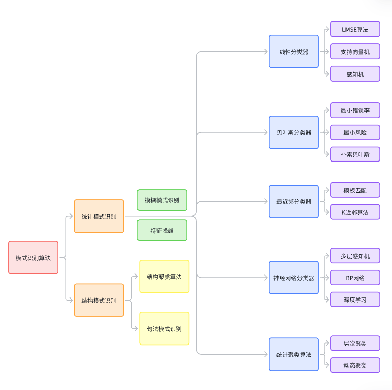

## 概述

课程内容：基本概念和原理，主要算法，应用技能

考核：平时25%（在线课章节测验），项目实践35%（个人报告10%，小组论文10%，项目成果展示及测试15%），期末考试40%（在线课期末考试20%+乐学或线下开卷20%）

**注意：提交的东西如果使用了AI需要提交说明**

---

识别的意思是，给某个事物贴上类别标签，也就是分类，类别也可以抽象为某个概念或定义。识别(Recognition)本质是Re-cognition，即再认知。现有认知，再有识别。以共同的特征建立类别，识别的基础是相似性。而根据相似性进行识别就有可能出现错误。模式的意思是，可以用来给事物代表归类的特征，从具体事物中抽象出的部分信息，可以代表这个事物，用于完成归类的任务，图片、视频、数值、行为等都是一种模式。模式识别的意思是，对事物进行概念归类。模式识别的过程仅仅根据特征进行判定，不一定能获知事物本质。

模式识别属于控制科学与工程，研究如何使计算机具备模式识别的能力，即如何利用规则完成对外部世界完成分类，更关注的是如何解决工程问题，至于是否选用机器学习的算法，取决于具体要解决的问题。步骤有三：设计分类器（选择一个实现分类的算法），训练分类器，使用分类器。

人工智能大概有感知、理解和决策、行动三个方向；主要的人工智能研究集中在第二个方向，以前关注较多的行动，目前研究已经不多了，被整合为具身智能这个概念。模式识别和人工智能有相当大的交集但又互不包含。强化学习和模式识别没有关系（关心下一步的决策，不包含分类）。模式识别也有不包含机器学习的，比如光电阅读机（纯机械的装置），用了模板匹配（非智能的算法）
