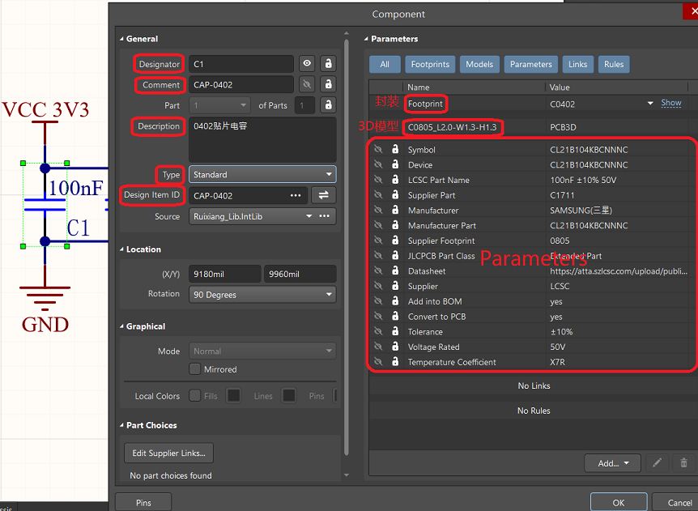
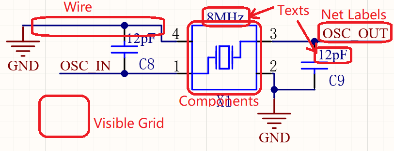

## 基本概念

1. 以 AD-嘉立创平台为例，从零开始到拿到一块板子的工作流一般为：

   - 确定板子功能以及需要的元器件
   - 在嘉立创等多个平台寻找需要的元器件及相应的可导出的 AD 文件（初学阶段一般不会自己画元件的原理图和封装，找现成的即可）
   - 按一定的规范建立自己的元器件库（如果从零开始则建议执行这一步，有现成的可靠的库则可以跳过）
   - 从元器件库中选择需要的元器件，绘制原理图，完成连线、位号标注和网络标签的添加等，最后Validate
   - 仔细检查原理图，并且最好能找不同的人审核（个人习惯，因为原理图的错误在 PCB 布局的时候基本不会有机会发现，并且即使在 PCB 布局时发现了错误，返回到原理图中修改，也多少会对已经完成的布局有所影响，徒增工作量，所以建议在进行 PCB 布局前仔细检查原理图）
   - 确定板子外形，可从 SW 或 AutoCAD 中导入 dwg/dwf 文件，确定外框形状和孔位信息
   - 根据制造厂商的工艺参数设置 DRC 规则
   - 将原理图导入 PCB 中
   - 进行层叠设计（2 层板以上需要执行这一步，否则跳过）
   - 按功能模块大致确定元器件布局（可利用 AD 的“交叉选择”功能在原理图中选择某个功能模块，在 PCB 中会自动匹配相应的元器件）
   - 对逐个功能模块进行器件摆放、打孔、布线等
   - 根据需要进行铺铜
   - 运行 DRC，解决警告和报错
   - 在嘉立创完成 PCB 打样并购买元器件，或使用 SMT 服务，完成元器件匹配操作

2. 元器件：

   一个元器件绑定了它的封装和3D模型，3D模型和封装是一一对应的

   

   - Designator：元件标识符，又称位号，在一张原理图中唯一；按照标准的元件类型前缀 + 流水号命名，默认显示

   - Comment：注释，记录型号或参数，默认显示

   - Description：描述，对元件功能、特性等进行说明，默认不显示

   - Type：类型，有以下选项

     - Standard：标准元件类型，参与电路的电气功能实现，并且会出现在 BOM 中
     - Mechanical：机械类元件，表示 PCB 上的非电气功能部件，如安装孔、定位槽、散热片安装支架等，不参与电路的电气连接
     - Graphical：图形类，仅作为图形示意，不具备电气特性和物料属性的对象
     - Net Tie (in BOM)：带物料清单的网络连接点
     - Net Tie (No BOM)：不带物料清单的网络连接点
     - Jumper (No BOM)：无物料清单的跳线，表示跳线连接，不会包含在物料清单内（一般用不到，使用零欧电阻专门用于飞线或放排针插跳线帽即可）

   - Design Item ID：设计项标识，是元器件在原理图库中的名称，在整个项目中唯一

   - Footprint：封装，定义了元件在 PCB 上的物理尺寸、引脚布局和焊接方式。填写准确的封装名称，可参考标准封装库或公司内部封装库命名规则（按照 PCB 库中对应的元件填写）。PCB 中的 Footprint Name 直接在库中选择对应的。

   - Models：模型，包括 3D 模型、信号完整性模型等，填写正确的模型文件路径即可。

   - Parameters：元件参数，填写制造商名称、供应商编号、数据手册链接等信息

   - Electrical Tyoe：元器件引脚的属性：

     - Passive：无源引脚，该引脚不提供驱动能力，仅作为电路中的普通连接点

     - Input：输入引脚，只能流入电流和信号（如果器件有个别输入引脚不能悬空，但有时的确也用不着它，有时很容易就把它给忘了，此时就可以将它的 Electrical Type 设成 Input，到时运行 DRC 时如果没有对这个引脚进行任何连接，软件将会发现警告或者报错）

     - Output：输出引脚，只能输出电流和信号

     - I/O：输入 / 输出引脚

     - Power：电源引脚，用于连接电源，为元件提供工作所需的电能，如芯片的 VCC、GND 引脚 。

     - Open Collector：集电极开路引脚，这种引脚需要外接上拉电阻才能正常输出高电平，具有 “线与” 逻辑功能，常用于需要多个设备共享总线等场景。

     - Open Emitter：发射极开路引脚，与集电极开路引脚类似，不过是从发射极输出，也需要外接下拉电阻来正常工作 。

     - HiZ：高阻态引脚，处于此状态时，引脚的等效阻抗非常高，几乎不吸收也不输出电流，类似于与电路断开连接，常用于总线结构中，实现设备的隔离。

3. 原理图：

   

   - Components：元器件

   - Wires：具有电气属性的导线

   - Buses：总线，用于简化原理图布线

   - Sheet Symbols：图纸符号，代表子原理图，用于构建复杂电路的模块化设计

   - Sheet Entries：图纸入口，用于建立图纸符号与子原理图之间的信号连接关系

   - Net Labels：网络标签，用于标识具有相同电气连接的导线

   - Parameters：参数，原理图库中勾选可见的部分在原理图中属于参数

   - Ports：端口，用于不同原理图之间或同一原理图不同部分之间的信号交互

   - Power Ports：电源端口，用于连接电源和地的网络

   - Texts：文本，标注补充信息

   - Drawing objects：绘图对象，用于原理图的辅助说明和美观，无电气特性。

   - Visible Grid：可视栅格，默认设置为 10mil

   - Snap Grid：捕捉栅格，设置为可视栅格的一半或四分之一

4. PCB：

   

   - Components：元器件

   - 3D Bodies：元器件的三维模型

   - Keepouts：禁止布线层对象

   - Tracks：铜膜导线，是 PCB 上电气连接的主要部分

   - Arcs：圆弧，可设置是否具有电气连接属性

   - Pads：焊盘，元器件引脚与 PCB 铜膜连接的金属部分，用于焊接元件引脚。有直插型焊盘和表贴型焊盘两种；直插型焊盘在 AD 中显示为灰色（Multi-Layer）。表贴型焊盘是元器件的一部分，一般不单独放置；直插型焊盘可以单独放置，中间有通孔，可以分别设置焊盘的尺寸和中间通孔的尺寸。直插型焊盘在设置设计规则时，需要考虑孔径与导线宽度、焊盘与周围其他对象的间距等规则，以确保电气性能和可制造性。表贴型焊盘主要关注焊盘与导线、焊盘之间的间距等规则，以及与元件引脚的匹配程度，同时要考虑焊锡膏印刷和回流焊接的工艺要求。直插型焊盘表面不能有阻焊油墨覆盖，这样才能保证与焊锡良好接触，实现焊接；过孔在某些工艺中可选择覆盖阻焊油墨（盖油），防止过孔处短路或被氧化，也可不覆盖（开窗），视具体设计要求而定。

   - Vias：过孔，用于不同 PCB 层之间的电气连接。可通过更改起始层和终止层来设置盲孔（将 PCB 内层走线与 PCB 表层走线相连，此孔不穿透整个板子）和埋孔（只连接内层之间的走线，处于 PCB 内层中，从 PCB 表面看不出来）。

   - Regions：区域，用于设计实心铜膜，一般用于大功率元器件底部散热，代替大电流走线；不区分其他对象，连接区域内的所有网络，只能存在一个网络，不然会造成短路。一般在在布线之前填充完成。支持绘制任意形状，可由其它图形转换而来，如可以先在 PCB 板的顶部丝印层绘制需要的图形，再转换为 Regions。

   - Fills：与 Regions 类似，唯一的区别是，Fills 只支持矩形，而 Regions 支持任意形状。

   - Polygons：多边形铺铜，一般用于大面积的电源或接地连接，增强电气性能，减少电磁干扰。也可用于屏蔽特定区域。区分不同对象，会自动连接相同网络并避开其他网络，一般在布线之后进行。

   - Texts：文本，包括元件标注、网络名称、说明文字等

   - Rooms：空间区域，用于定义一个局部元件集合摆放的相对关系，一个用途是可以为不同的 Room 设置不同的布局规则设置，比如线宽规则（使用规则查询语句 WithinRoom 来筛选 Room 对象）；另一个用途是具有多组相同布局布线的电路（Copy Rooms Formats）

多图纸设计：图纸包括两种结构关系，一种是层次式图纸，该连接关系是纵向的，也就是某一层次的图纸只能和相邻的上级或下级有关系；另一种是扁平式图纸，该连接关系是横向的，任何两张图纸之间都可以建立信号连接。Altium Designer 提供的网络标识有：Net Label，Port，Sheet Entry，Power Port，Off-sheet Connector，它们的共同点是：名称一致时均连接在一起。其中，"Port”和“Net Label”的作用范围是可以在 Options 中设置的。Net Label 作用范围为单页原理图，Port 和 Off-sheet Connector 均适用于跨页原理图，Power Port 忽略结构，都是连接在一起的。

PCB 中的各个层：板子从中间向外有 top 和 bottom 两个方向，以 top 为例，以两层版的工艺，按照从内向外的顺序有信号层 top layer，助焊层/锡膏层 top paste，阻焊层 top solder，丝印层 top overlay，底部方向同理。对于层数高于两层的板子，在两个信号层 top layer 和 bottom layer 之间还有专门的底层和电源层。

以上是主要的层，除此之外，还有 drill guide、drill drawing、keep-out layer 以及各个 Mechanical 机械层，keep-out layer或某一个mechanical layer用作规定板子外形（不要同时用），其它的层不常用，暂时可以忽略。

3D模型是和封装绑定的，可从嘉立创EDA中导出元件的3D模型，相对比较费时间，如有需要建议直接找现成的3D封装库。

## 注意事项

1. 直插型焊盘直径要略大于孔径，否则打孔会把焊盘打掉。焊盘不起作用，可能在拧螺丝固定时导致上下层铜皮短路。焊盘是带有网络的，孔壁也是金属。
2. 避免直角走线，直角处线宽突变为原来的根号二倍，且直角走线的反射较为严重。
3. 

## 设计规范

## 软件界面说明

## 软件操作说明

原理图库可以更新到原理图，PCB库可以更新到PCB，原理图和PCB可以相互更新改动
