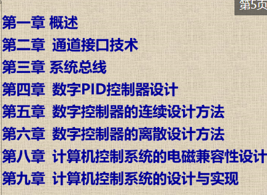

## 计算机控制系统（CCS）

成绩构成：30%+70%（主观题+客观题）

乐学提交，平时考勤，雨课堂发布课件

重点在第二章，第八章略，第九章自学

## 第一章：概述

### 1.1一般概念

- 自动控制系统可以分成调节系统和伺服系统（随动系统）两类。调节系统的输入信号一般保持不变，保持系统状态稳定；而伺服系统则要求被控对象的状态能复现输入信号的变化。

- 控制框图：信号检测与控制器是控制系统中的两个关键部分，将控制器用计算机来实现，并加入AD、DA就是CCS

- AD/DA转换

    AD包含三种形式的转换：模拟信号采样（时间上离散），信号幅值的整量化（幅值上离散），数字编码（离散幅值信号转为二进制）

    DA转换包含两种形式的转换：数字解码（数字量等值为模拟脉冲信号），信号恢复（模拟脉冲变为时间连续信号，可以用零阶保持器实现）

- 工作过程：实时数据采集、实时决策、实时控制。实时的意思是信号的输入、计算和输出都是在一定时间范围内完成，要求计算机对输入信息以足够快的速度进行处理，并在一定的时间内作出反应或控制。只要延迟时间不错过控制的时机，便认为系统具有实时性

- 实时性指标取决于：检测仪表延时，过程输入(A/D)延时，计算机运算延时，数据传输(D/A)延时等，如图所示。由上面三步所构成的循环周期就是实时时间，也称为采样周期Ts。本书主要讨论计算机控制伺服系统，控制对象大多是快速变化对象，因此要求的实时时间一般为毫秒级。计算机控制系统的实时时间常由定时中断产生。

    

- CCS的特点：

    1计算机控制系统是混合信号系统，包含多种信号形式;

    2计算机控制系统的分析和设计需要先进的理论支持，能实现复杂的控制规律，且控制规律灵活多样;

    3计算机控制系统可分时控制多个回路，适应性强，灵活性高;

    4计算机控制系统使得控制与管理容易结合并实现更高层次的自动化;

    5计算机控制系统能够比较方便地实现系统的自动检测和故障诊断，提供了系统的可靠性和容错、维修能力。

### 1.2CCS组成

硬件组成：（虚线框内为实时控制所必须的最小系统配置）

- 主机：由微处理器、内存储器及时钟电路组成，是控制系统的核心。从整个系统结构考虑，主机应具有较完善的中断系统、足够的存储容量、完善的I/O通道和实时时钟。应注意主机的运算速度及数据存取速度，应满足在一个采样周期内完成单路或多路数据采集、处理、运算及将输出量输出到执行机构等所需的时间。其信息处理能力要与控制系统的性能要求相适应。常用的计算机控制系统主机有可编程序控制器(PLC)、工控机(IPC)、单片机、DSP(数字信号处理器)、智能调节器(智能调节器是一种数字化的过程控制仪表)等。

- 标准外部设备：按功能分为三类

​	输入设备:键盘、鼠标、扫描仪等，用来输入程序、数据和操作命令。

​	输出设备:打印机、绘图机、CRT显示器等，它们以字符、曲线、表格和图形等形式反映控制过程。

​	外存储器:磁盘、磁带、光盘等，它们兼有输入和输出两种功能，用来存放程序和数据。

- 过程通道

    过程通道是计算机和被控对象之间交换信息的桥梁，是计算机控制系统按特殊要求设置的部分。按传送信号的形式可分为模拟量通道和开关量通道，按信号传送的方向可分为输入通道和输出通道。

    1模拟量输入通道:用来将被控对象的模拟量被控(或被测)参数转变为数字信号并送给计算机，它由以下几部分组成。

    ●传感器(检测元件):用来对被控参数瞬时值进行检测，将其变为电信号。
    ●变送器:用来将传感器得到的电信号转变为统一的直流电流(0~10mA或4~20mA)或直流电压(0~5V或1~5V)信号。
    ●多路采样器:也称多路模拟开关或多路转换器，用于对多路模拟量信号进行分时切换，即将时间上连续的模拟量信号转换为时间上离散的模拟量信号。
    ●A/D转换器:用于将时间上离散、幅值上连续的模拟量信号转换成幅值也离散的数字信号，并送入主机中处理。为减少被控参数值随时间变化对A/D转换器精度的影响，可在多路采样器之后加接采样保持器和信号放大器。其中放大器的作用是把输入的微弱信号(当没有变送器时)放大到A/D转换器所要求的输入电平，并在模拟量输入信号和A/D转换器间进行阻抗匹配和隔离。

    2模拟量输出通道:许多执行机构的控制信号是模拟的电压或电流信号，因此计算机输出的数字信号必须经D/A转换器变为模拟量后，方能去控制执行机构。执行器按动力源可分为电气式、液压式、气动式和其他方式。对于气动或液压的执行机构，需经过电-气和电液转换装置。在电气执行器中，一般有交直流伺服电机、步进电机、电磁线圈等。当要控制多个回路时，还需使用多路输出装置进行切换。考虑到多个回路的输出信号在时间上是离散的，而执行机构要求的是连续的模拟量信号，所以多路输出的信号都应采用输出保持器加以保持后再去控制执行机构。

    3开关量输入通道:用于将控制现场的各种继电器、限位开关等的状态(通或断)输入计算机。

    4开关量输出通道:控制系统中继电器、接触器的闭合或断开，电机的启动、停止，指示灯和报警信号的通断，都可以用输出“0”和“1”状态来控制。完成这些功能的部件就组成了开关量输出通道。

- 接口：接口是用来协调计算机与外设和过程通道的工作，是通道和计算机之间的中介部分，经接口联系，通道便于接受计算机的控制，使用它可达到由计算机从多个通道中选择特定通道的目的。

- 人机联系设备：在计算机控制系统中，一般应有一个控制台(或操作面板)。人机联系设备中最简单、最基本和最普通的形式是装有按钮、转换开关、拨码开关、指示灯、LED显示器和带有声光报警器的操作面板。现在的工业控制机系统生产厂商常为用户提供了操作控制台，它是一种高性能的人机接口设备。它采用CRT或先进的触摸显示屏，即可以以屏幕窗口画面的形式或以文件表格的形式提供人与过程的界面或人与系统的界面。

- 通信设备：需要把多台计算机或设备连接起来构成计算机通信网络

软件组成：

- 系统软件：一般包括操作系统、程序设计系统、通信网络软件和诊断系统等，具有一定的通用性。系统软件一般由厂家提供，不需要用户设计。
- 应用软件：控制系统设计人员针对某个具体任务，根据所选用的硬件及软件环境和系统要求而编制的控制和管理程序。一般包括控制算法程序、输入/输出接口程序、监控程序和信息管理程序等。

### 1.3CCS结构形式

计算机控制系统分类的方法有很多种，可以按照控制方式、控制规律和控制关系进行分类，按照计算机参与控制方式分类，可分成以下几种类型：操作指导控制系统、直接数字控制系统、监督控制系统、集散控制系统、现场总线控制系统、综合自动化系统

### 1.4发展概况和发展趋势

略

补：微机原理——汇编语言——IN和OUT指令、存储器读写指令

## 第二章：通道接口技术

在计算机和被控对象之间的信息传递和变换装置，称为过程输入/输出通道。包括模拟量输入/输出通道和数字量输入/输出通道。本章主要介绍通道接口技术，包括计算机对外围通道的控制、输入/输出通道的设计。

### 2.1计算机对外围通道的控制

计算机对外围通道的控制，工作基础是中断系统，具体实施是通过接口电路进行的，计算机的输入/输出指令及其有关的逻辑提供了CPU使用外围通道的全部控制信号。本节重点介绍**指令、中断、接口**3个问题。

#### 2.1.1输入输出指令

##### 输入输出接口的编址方式

与外围通道的连接一般要用到地址总线、数据总线、控制总线。确定地址后可以执行难读写操作。

外围通道的地址对CPU来说有两种编址方式：统一编址方式和独立编址方式，一般根据使用的CPU类型类确定IO接口的编址方式。

- 统一编址方式：按存储器布局，将外围通道的地址分配在存储器的地址空间，将IO地址映射到存储空间，即将系统的存储空间一部分供外围通道使用。这种方式将系统每一个IO都看作一个存储单元，与存储单元统一编制，又称存储器映像IO，MSC-51和三级流水线的ARM系列单片机使用的就是这种编址方式。这种设计下，所有访问存储器的指令均可以适用于输入/输出。

    ​	优点是：

    - 简化了指令系统的设计，不必单独包含IO操作指令

    - 访问IO设备的指令多功能强（可以使用强大的访问存储器的指令）

    - IO空间可自定义，根据实际系统外设数目进行调整

        缺点是

    - 占用了存储器地址空间

    - IO译码电路变得复杂

    - 由于访问存储器的指令较长，因此延长了输入输出操作的时间

    - 由于程序中较难区分IO操作和存储器操作，故程序可读性较差

- 独立编址方式：按输入输出布局，对IO端口地址单独编址，又称为隔离IO，不占用存储空间。访问IO端口时使用专门的指令IN/OUT，并有专用的控制线指示为IO操作。x86和采用5级及以上流水线的ARM9、ARM10、ARM11系列单片机等采用的就是独立编址方式。

    ​	优点是：

    - 可读性好，指令与访问存储器的指令有明显区别，程序清晰

    - IO指令长度段，执行速度快，占用内存空间少

    - IO译码电路简单

        缺点是：

    - CPU的指令系统中必须有专门的IN和OUT指令

    - IO指令的功能没有访问存储器的指令功能强大

##### 输入输出指令和时序

了解时序的目的是明白一条指令执行的过程中CPU为用户提供的信号，要求接口电路设计选用的三态门电路和输出寄存器动作时序要和指令时序一致。

指令的执行在统一时钟脉冲驱动下进行，执行过程中所需的时钟脉冲称为指令周期。总线周期通常是4个时钟周期（也可以设计自动插入一个额外的等待时钟$T_w$）。因此在PC，所有IO总线周期最小均为5个时钟周期或长度均为1.05us。总线周期可以通过控制总线上的准备就绪信号I/OCHRDY来进一步延长。由8088硬件决定，IO总线周期中PC地址引线的$A_{16}-A_{19}$是无效的。

