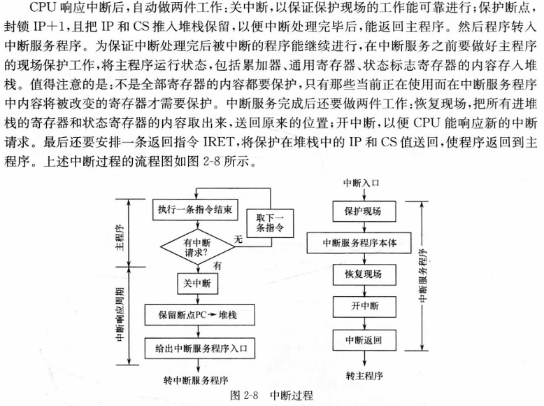
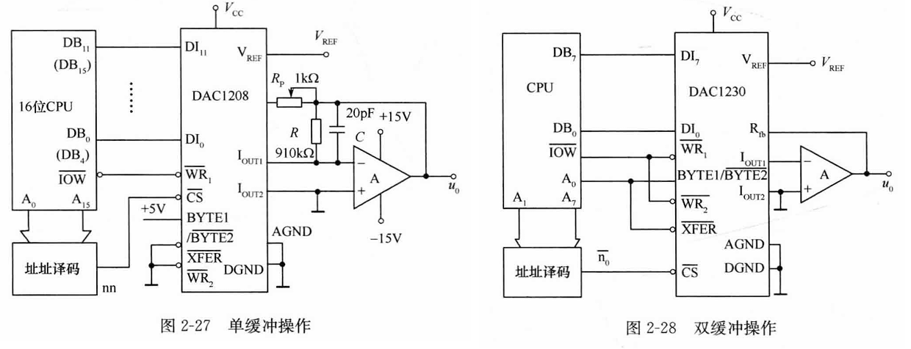
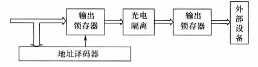

前序课程：电子技术、微机原理、控制理论

成绩构成：30%+70%(主观题+客观题)

乐学提交，平时考勤，雨课堂发布课件

第二章第三章为硬件设计、第四章到第六章为软件设计。重点在第二章，第八章的电磁兼容性略(通俗来说就是抗干扰设计)，第九章自学


## 第一章：概述

### 1.1 一般概念

CCS 概念：CCS 是应用计算机参与控制并借助一些辅助部件与被控对象相联系，以获得一定控制目的而构成的系统。

#### AD 和 DA 转换

AD 包含三种形式的转换：

- 模拟信号采样：按一定的时间间隔对连续信号进行采样，将其变为时间上断续的离散信号。(使得在时间上只能离散)

- 信号幅值的整量化：按照信号幅值按有限字长的最小量化单位分层取整，变为离散的信号。(使得在幅值上只能离散)

- 数字编码：已整量化的分层信号转换为等值的二进制数码信号，即数字信号。

DA 转换包含两种形式的转换：

- 数字解码：把数字量转换为等值的模拟脉冲信号。(使得在幅值上允许存在连续)

- 信号恢复：把解码之后的模拟脉冲信号变为随时间连续变化的信号(使得在时间上允许连续，恢复精度与 AD 时的采样周期有关，可以用零阶保持器实现)

#### 工作过程：实时

- 实时数据采集：对被控参数的瞬时值进行检测、转换并输入到计算机中。

- 实时决策：对实时的给定值和被控量的数值进行分析，并按已定的控制规律进行计算，以决定进一步的控制策略。

- 实时控制：根据决策，实时地对执行机构发出控制信号

这三个步骤所构成的循环周期就是实时时间，也称为采样周期 Ts。计算机控制系统的实时时间常由定时中断产生。实时的意思是信号的输入、计算和输出都是在一定时间范围内完成，要求计算机对输入信息以足够快的速度进行处理，并在一定的时间内作出反应或控制。只要延迟时间不错过控制的时机，便认为系统具有实时性。

实时需要考虑两个要素，一是根据被控过程出现的事件能保持多长时间；二是该事件要求计算机在多长的时间内必须做出反应。

系统的实时性指标取决于：检测仪表延时，过程输入(A/D)延时，计算机运算延时，数据传输(D/A)延时、执行机构延时等。

被控对象和计算机直接连接，并接受计算机控制的方式称为在线方式/联机方式，反之则称为离线方式或脱机方式。在线系统不一定是实时系统，但实现系统一定是在线的。

#### CCS 的特点

精度高、运算速度快、存储容量大、有逻辑判断功能，可以实现高级复杂的控制方法，获得快速精密的控制效果。

1. 计算机控制系统是混合信号系统
2. 系统包含多种信号形式
3. 计算机控制系统的分析和设计需要先进的理论支持
4. 能实现复杂的控制规律，且控制规律灵活多样
5. 计算机控制系统可分时控制多个回路，适应性强，灵活性高
6. 计算机控制系统使得控制与管理容易结合并实现更高层次的自动化，提高了企业自动化程度
7. 计算机控制系统能够比较方便地实现系统的自动检测和故障诊断，提供了系统的可靠性和容错、维修能力

### 1.2 CCS 组成

将检测装置、比较装置、控制器、放大器、执行环节和被控对象串联起来可以构成最简单的闭环控制系统框图。最重要的两个装置就是控制器和检测装置。将控制器用计算机来实现，并加入 AD、DA 就是 CCS


#### 硬件组成

- 主机：由 CPU、内存储器及时钟电路组成，是控制系统的核心。
- 标准外部设备：按功能分为输入设备、输出设备、外存储器三类

- 过程通道/输入输出通道：按照模拟量/数字量，输入/输出分类，排列组合有四大类：

  - 模拟量输入通道(A/D 通道)：包括传感器、变送器、多路采样器、AD 转换器
  - 开关量输入通道(DI 通道)
  - 模拟量输出通道(D/A 通道)
  - 开关量输入通道(DO 通道)

- 接口：协调计算机与外设和过程通道的工作

- 人机联系设备/人机接口：要求具有容错性。

- 通信设备：完成不同位置、不同功能的计算机或设备间的信息交换

#### 软件组成

- 系统软件：包括操作系统、程序设计系统、通信网络软件和诊断系统等，具有一定的通用性
- 应用软件：包括控制算法程序、输入/输出接口程序、监控程序和信息管理程序等

### 1.3 CCS 结构形式

略

### 1.4 发展概况和发展趋势

略

## 第二章：通道接口技术

### 2.1 计算机对外围通道的控制

计算机对外围通道的控制，其基础是中断系统，具体则通过接口电路实现。计算机与内存及所有设备的连接都是基于三总线的，因此需要了解总线上的数据来自于哪个设备，同时也需要考虑计算机的控制量如何送入某台具体设备，这就是所谓的选址。

#### 输入输出接口的编址方式

外围通道的地址对 CPU 来说有两种编址方式：统一编址方式(存储器)和独立编址方式，本课程讨论的机器基本为隔离 IO

- 存储器映像 I/O(又称统一编址方式)

  8088 上有$$\overline{MERQ}$$和$$\overline{IORQ}$$信号，用于选择 CPU 此时是与内存交互还是与外部设备交互；8086 上则将它们合并为$$IO/\overline{M}$$信号。图中的结构控制 0-7FFFH 为内存空间，8000H-FFFFH 为外部存储器空间，即外设是占用内存的。

  

  优点：

  - CPU 对外围的操作可使用全部的存储器操作指令，简化了指令系统的设计，不必单独包含 IO 操作指令
  - 内存和外设的地址分布图是同一个
  - IO 地址数几乎不受限制

  缺点：

  - 外设占用内存单元，使内存容量减小
  - 需要全字长的地址译码，需要使用更复杂的译码器芯片，指令操作的时间也有所延长
  - 程序中较难区分是否为 I/O 操作，程序可读性较差

- 隔离 IO(又称独立编址方式)

  需要专用的输入输出指令 IN/OUT 来访问外围端口，且仅限于对累加器进行操作，这增加了程序的复杂性，即必须将外部设备的数据送入累加器，再对累加器中的数据进行操作。

  ```assembly
  IN AL, n;  // 把外部数据送入AL寄存器中
  OUT n, AL; // 把AL中数据输出给外部设备
  ```

  隔离 IO 使用的是端口地址，且一个外部设备可能有多个寄存器，需要多个端口才能加以区分。

这种编址方式的优点是：

- 可读性好，指令与访问存储器的指令有明显区别，程序清晰
- IO 指令长度段，执行速度快，占用内存空间少
- IO 译码电路简单

这种编址方式的缺点是：

- CPU 的指令系统中必须有专门的 IN 和 OUT 指令
- IO 指令的功能没有访问存储器的指令功能强大

#### 直接寻址输入输出的时序

了解时序的目的是明白一条指令执行的过程中 CPU 为用户提供的信号，这些信号在时间上的配合关系，并要求接口电路设计选用的三态门电路和输出寄存器动作时序要和指令时序一致。

执行输入输出指令时，地址总线上为外部设备的端口地址，数据总线上为要传输的数据，控制总线上为选通 IO 操作时对应的电平。IN 指令时$$\overline{RD}$$信号有效，OUT 指令时$$\overline{WR}$$信号有效。


第一个机器周期内采样地址总线的变化，然后如果有需要输出的数据，此时就应该准备好；第二个机器周期采样 IO 选通信号以及读或写信号(图中把读写都画成有效了，实际运行时只有一个为有效电平)；然后是可能插入的一个或多个等待周期，确保程序能准确运行；第三个机器周期采样要读入的信号。

把从第一个周期的上升沿到下一个周期的上升沿称为输入输出周期，不同指令输入输出周期长短可能不同

#### 中断技术

中断的优点：避免 CPU 不断检测外设状态，提高 CPU 利用率，同时实现对特殊任务的实时响应

CPU 响应中断的四个条件：有中断申请信号、该中断申请未被屏蔽、软件代码中打开中断、CPU 在当前执行的指令结束后响应中断

中断响应的过程：向中断源发送$$\overline{INTA}$$信号表示中断已经得到响应，断电保护将 CS、IP、FLAGS 寄存器内容入栈，获得中断服务程序首地址



#### 接口概述

接口的目的/必要性：


常见的接口的类型包括：

- 并行 I/O 接口：CPU 内部总线是并行 IO
- AD 转换接口
- D/A 转换接口
- 实时时钟接口：距离较远的设备保持时间一致性
- DMA 控制接口：外设与内存之间直接的数据交换而不用通过 CPU，CPU 出让三总线控制权给 DMA 控制器，实现大批量数据传输，多用于操作指导控制系统，以及大量数据采集等场合
- 串行通讯接口：线数少、传输距离长、传输速率相对慢，串行通讯芯片有 8251
- 并行通讯接口：线数多、传输距离短、传输速率相对快，并行通讯芯片有 8255
- 网络通讯接口：集散控制系统、分布式控制系统中常用

#### 并行 IO 接口

典型的外围并行接口由控制寄存器、状态寄存器、数据输入/输出寄存器：数据总线缓冲、地址总线缓冲、地址译码：中断控制器：联络信号控制逻辑等组成


- 无条件传送(简单 IO 方式)：外设和 CPU 直接进行数据交互，只有在外部控制过程的各种动作时间是固定且已知的条件下才能使用，因此又称为同步方式。系统构成需要输入缓冲、输出锁存以及端口地址译码。使用条件为已知且确认外部设备已经准备好

  输入方式：CPU 执行 IN 指令时，外部设备的数据必须是准备好的

  输出方式：CPU 执行 OUT 指令时，必须确信所选外部设备的锁存器的数据已经被取走，否则新数据覆盖后就会造成数据丢失

  

  无条件传送的特点是：CPU 需要与外设同步，CPU 效率较低。

- 查询传送：当系统控制时间不固定时，就需要加上握手信号，这称为查询传送，查询传送需要额外的两个数据，一是 CPU 的状态，二是外设的状态；以 OUT 指令为例，需要查询 CPU 是否已经准备好了数据，以及外设是否准备好了接收数据。接口部分除了数据端口外，还必须有状态端口。每次传输都需要询问 CPU 和外设是否响应握手信号，虽然能够保证数据传输的准确性，但浪费 CPU 时间，且实时性无法保证

- 中断传送：又称为选通 IO 方式，可提高 CPU 效率，在控制系统中很常见

  过程分析：Q 端和外设连接，将 Q 的状态传递给外设，当 Q=0 时说明上一个数据已经被取走。确认数据被取走后，外设向 D 触发器和锁存器发出时钟信号，申请 CPU 的中断。此时锁存器的输入传递到锁存器的输出，即三态缓冲器的输入；同时 D 触发器的 Q 端被置为高电平，当$$\overline{MI}$$(屏蔽信号)为高电平，即开启中断时，经过与门逻辑，INTR 信号有效，触发可屏蔽中断。当 CPU 同意处理中断后进入中断服务子程序中，开始执行 IN 指令，过程同无条件传送，此时或门输出低电平打开三态缓冲器，从外设来的数据进入数据总线；同时经过下面的与门触发 D 触发器清零，告诉外设数据已经被取走。

  当$$\overline{RESET}$$信号为低电平有效时，也可以进行异步清零。当存在多个外设时，除了有图中的状态寄存器(D 触发器)和地址寄存器外，还要有中断寄存器，每一位对应一个外设的中断情况，还要有中断屏蔽寄存器，每一位对应一个外设的中断是否被屏蔽

  

  - 控制寄存器：存放从 CPU 送来的控制字，以指定接口电路要完成的工作，设定工作参数、工作方式等
  - 状态寄存器：保存通道的现行状态信息，以提供给 CPU 判断使用
  - 中断寄存器：存放$$Q$$和$$\overline{Q}$$的状态，包括中断申请寄存器和中断屏蔽寄存器

  另外，多个端口时还需要分配地址，有专门的端口地址和译码电路。

### 2.2 模拟量输出通道(DAC)

模拟量输出通道的任务是把计算机输出的数字量信号转换成模拟电压或电流信号，去驱动相应的执行机构，达到控制的目的。一般含有接口电路、电压/电流变换器、数模转换器，简称为 DAC。模拟量输出通道主要完成的是转换(DA，得到的是时间离散幅值连续的信号)和保持(把分段连续的脉冲信号转化为连续信号)两个任务。输出的物理信号有电压型和电流型，输出信号极性有单极性(只有正和零或负和零)和双极性，接受的数字量可以是并行方式和串行方式。

#### DA 转换原理

将输入数字量转换为与之成比例的模拟量，最常用的转换电路是 R-2R 梯形电阻解码网络，由基准电压、运算放大器(将电流转换为电压)、权电阻网络和模拟开关组成，模拟开关由输入的数字量控制。


$$
\begin{aligned}
\sum I_0&=\frac{-V_{ref}}{2R}\left(\frac{2^0}{2^n}D_0 + \frac{2^1}{2^n}D_1+\ldots+ \frac{2^{n - 1}}{2^n}D_{n - 1}\right)\\
U_0&=\frac{V_{ref}}{2R}\left(\frac{2^0}{2^n}D_0 + \frac{2^1}{2^n}D_1+\ldots+ \frac{2^{n - 1}}{2^n}D_{n - 1}\right)R_F\\
&=V_{ref}\left(\frac{2^0}{2^n}D_0 + \frac{2^1}{2^n}D_1+\ldots+ \frac{2^{n - 1}}{2^n}D_{n - 1}\right)\frac{R_F}{2R}
\end{aligned}
$$

对上述结构进行改进，得到反向 R-2R 梯形电阻解码网络：基准电源的负载电流与二进制数码无关(负载电阻始终为 R)，提高了转换精度


$$
U_{o}=-\frac{R_{F}}{R}\cdot V_{ref}\sum_{i = 0}^{n - 1}\frac{D_{i}}{2^{n - i}}
$$

#### DA 技术参数

- 分辨率：$$\frac{V_{ref}}{2^n}$$，也可以说分辨率相当于输入二进制数最低有效位(LSB)相当的输出模拟电压。分辨率影响控制精度。

- 线性误差：在满刻度范围内，偏离理想转换特性的最大误差，用 LSB 的分数表示。

- 建立时间：输入二进制数变化量是满刻度(全 0 变全 1 或反之)时，输出达到最终值$$\pm \frac{1}{2}LSB$$时所需的时间

- 微分非线性：转移特性上任意两个连续码与理论值 LSB 之间的差距(理想的 DAC 任意两个数码之间的电压差为一个 LSB，但实际的 DAC 存在误差)，通常要求 DA 转换器的微分非线性误差小于$$\pm \frac{1}{2}LSB$$

- 单调性：输出电压随输入数码的增加而增加，要求特性斜率符号不变。

- 温度范围：较好的 DA 转换器工作温度范围在$$-40-85℃$$

- 输出电平：电流输出$$20mA-3A$$，电压输出$$5-10V$$、$$24-30V$$

- 温度系数：在满刻度输出的条件下，温度每升高 1℃ 时输出变化的百分数，单位是 ppmFSR℃，ppm 表示百万分之一，FSR 为输出电压满刻度

- 电源抑制比：是 DA 转换器受电源变化影响的指标，用电源变化 1V 时的输出误差相对满量程的比值来表示，单位是 ppm/V

- 其它的技术参数还有参考电压、接口方式、封装形式等

#### DAC 芯片

按输入带有缓冲寄存器的个数分为带 0 个(不带缓冲寄存器则必须外置缓冲寄存器)、1 个、2 个缓冲寄存器的(所有和 CPU 交互的设备都需要有缓冲寄存器，否则 CPU 所有出现在数据总线上的数据，不管是不是该设备应该接受的数据，都会被设别接收到)。按集成电路形式可分为单端式、差动式和双向开关式，前两种采用双极型电路，只能使用单极性基准电源(因此 DA 输出也是单极性的)。双向开关式采用 CMOS 电路，可以使用正负基准电源。输出有电压型和电流型，输出电流型的如果想输出电压，外置运放即可。

#### DAC0832


整个结构分为 8 位 DA 转换器(R-2R 权电阻网络)，两个缓冲寄存器，以及控制信号输入。$$ILE$$为高电平有效的允许锁存信号，$$\overline{XFER}$$为低电平有效的传送控制信号，$$I_{out1}+I_{out2}=const$$，单极性输出时$$I_{out2}$$通常接地，$$I_{out1}$$输出电流大小与输入数字量成正比。两个地可以从总体上保证模拟地和数字地只在一点连接。

写信号线的时序如下，在标准 10V 电源输入下，写信号需要保持 500ns 脉宽；在 15V 电源输入下，写信号保持 100ns 脉宽就可以了


五根控制线控制两个缓冲寄存器的工作模式：

- 直通：两个锁存器均不起作用，输入直接影响输出

  

- 单缓冲：控制一个锁存器的工作(图中接法为控制输入寄存器)

  

  

- 双缓冲：两个写信号电平一致，而选通和控制传输信号同为 138 译码器的输出，不会同时有效，因此两个锁存器交替工作

  

  下面的指令顺序，交换 34 的顺序也不会影响转换结果，因为指令本质上就是控制一些高低电平的信号，对于 OUT PORT2, AL 而言，AL 中的数据是什么并不影响，只要 DA 寄存器将输入送到输出即可。

  

  双缓冲的作用：一是可以使 DA 转换器在 DAC 寄存器锁存现有数据的同时，在输入寄存器中锁存下一个数据，可以按命令快速更新 DA 输出。二是双缓冲可以使多个 DA 转换器经由一个公共选通信号同时更新数据，先通过地址译码将数据分别送到多个芯片的输入寄存器中，用同一根线控制多个芯片的 DA 寄存器，便可以实现多个 DA 转换器同时更新数据。

#### DAC1208/DAC1230


12 位的 DAC，电流稳定时间 1us，12 条数据输入线，对应为一个 8 位锁存器和 4 位锁存器，采用字节控制信号$$BYTE1/\overline{BYTE2}$$控制数据的输入，高电平时十二位数据同时存入第一级两个输入寄存器，低电平时只将低四位数据输入寄存器。1230 与 1208 的结构完全相同，区别只在于 1208 把 12 根数据线全部引出，为 24 引脚封装，1230 在内部将低四位连接到高八位中的高四位，只引出 8 根数据线，为 20 引脚封装。

与 16 位微机相连(16 位微机表示数据总线宽度为 16 位)时，有直通、单缓冲和双缓冲三种方式，可选择接在高 12 位还是低 12 位，注意如果使用高 12 位，需要在传送前将数据移到高 12 位。与 CPU 的连接方式如图，其中电位器用于调整满量程时的输出电压(类似于调零的作用)，电容用于抑制因电流阶跃变化造成的输出过冲和振铃现象。



与 8 位微机相连时，只能采用双缓冲方式，因为 8 位微机要转换 12 位数据，注定不能一次性传完数据，高八位和低四位必须异步工作


以该图为例，先执行 MOV AL, DATA1; OUT 00000101H, AL; 将高八位送入 8 位输入寄存器，再执行 MOV AL, DATA2; OUT 00000100H, AL; 将低四位送入 4 位输入寄存器并同时打开 12 位 DAC 寄存器。(注意 DATA2 的高四位而不是低四位进入 DAC)

#### 双极性模拟量输出

用偏移二进制码实现双极性输出(补码最高位/符号位取反就是偏移二进制码)的双极性输出，注意$$R_2$$与$$R_3$$的比值需要保证为 1：2，且$$V_{ref}$$要选用精密电源。另外，由于使用更大的电压范围来表示同样的数码，分辨率有所降低


$$
\begin{aligned}
V_{OUT2}&=\frac{2\sum_{i = 0}^{7} 2^i D_i}{256}V_{ref}-V_{ref}\\
V_{OUT2}&=-\left(\frac{R_3}{R_2}V_{OUT1}+\frac{R_3}{R_1}V_{ref}\right)=-(2V_{OUT1}+V_{ref})
\end{aligned}
$$

除了基于偏移二进制码的双极性输出，也可以实现按原码编码的双极性 DA 转换器，这种方式只适用于 CMOS 类的 DA 转换器

#### 模拟量输出通道的结构形式

分为两类：

- 数字保持式(需要保持的是个数字量)：每个通道有独立的数据寄存器和 DA 转换器，先保持后转换，速度快，成本高

  

- 模拟量保持式(需要保持的是个模拟量)： 多通道共用一个 DA 转换器，先转换后保持，速度慢，成本低

  

#### 多路转换开关

也称多路模拟开关，多路转换器

1. 干簧管模拟开关——有触点开关

   - 开关的导通电阻接近于零，开路电阻大
   - 簧片刚性强，触头位移小，使用寿命长
   - 不受环境温度影响，漏电流为零
   - 切换速度低，维修量大
   - 适用于采样速度低的小信号低速高精度的检测系统

2. 集成多路开关——CMOS 工艺制作

   - 开关切换时间为短
   - 工作频率可达高
   - 体积小，使用寿命长
   - 导通电阻较大
   - 断开时有漏电流
   - 驱动部分和开关元件部分不独立，影响小信号测量的精度

   将多个传输门构成多路开关，特性是：电源电压越高，导通电阻越小，切换速度越快。而电源电压较高则需要相应的控制电平也高。导通电阻小，则传递精度会下降，希望提高精度则要求负载阻抗高，放大器和采样保持器可与开关直连。

   - CD4066——四双向模拟开关，一个单刀双掷开关和一个双刀单掷开关

     

   - CD4051——单八通道模拟开关，其中逻辑电平转换部分完成 CMOS 到 TTL 的转换，S 为禁止端，目的是为了多个多路开关可以通过外部选通译码实现扩展

     

   - CD4052——双四通道模拟开关，适用于差动输入信号

     

   - CD4053——三个独立的单刀双掷开关(图中左侧四个模块为电平转换，中间三个模块为译码驱动为)

     

#### 采样/保持器

作用：在采样状态时，其输出能够跟随输入变化；在保持状态时，能使其输出值不变。

用途：(12 用于模拟量输入通道，34 用于模拟量输出通道)

1. 保特模拟量信号不变，以便完成 AD 转换
2. 同时采样几个模拟信号，以便进行数据处理和测量
3. 减少 D/A 转换器的输出“毛刺”
4. 把一个 D/A 转换器的输出分配到几个输出点，以保持输出电压的稳定性

工作原理：运放接成电压跟随器，开关闭合为采样状态，开关断开为保持状态，$$I_s$$为断开电阻漏电流，$$I_c$$为电容漏电流，$$I_i$$为运放输入电流，$$\Delta V$$为保持电压，$$T_H$$为保持时间。漏电流导致电容电荷衰减


$$
\begin{aligned}
I_d&=I_c + I_i+I_s\\
\frac{dv}{dt}&=\frac{I_d}{C_H}\\
\Delta V&=\frac{I_d}{C_H}T_H
\end{aligned}
$$

采样/保持器中电容大小与采样频率以及要求的采样精度有关，采样频率越高要求电容越小，但下降速率越快，精度较差；采样频率较低时要求精度较高，可选用较大的电容。

采样保持器芯片的共同特点：采样速度快、精度高、输入阻抗高、保持电压下降速率慢等，保持电容外接

- AD582

  

- LF398

  

主要参数：

- 孔径时间：电路接到保持信号后，模拟开关由导通转变为断开所需的时间
- 捕捉时间：电路接到采样控制信号后，输出电压达到指定跟踪误差范围内所需的时间。A/D 转换器的采样周期应大于捕捉时间
- 保持时间：模拟开关 K 断开的时间，由采样速率确定
- 变化率$$\frac{\text{d}V}{\text{d}t}$$：反映在保持阶段，由于保特电容 C 漏电或放大器的漏电流所引起的保持电压的变化

#### DA 转换模板的设计

举例


使用多通道共用一个 DA 的结构形式，DAC0832 接成直通方式，扫描开关为多路转换开关，且利用其开关与后面的运放构成采样保持器。

74LS93 为同步四位二进制可逆计数器，QA 对 QDQCQB 三位进行计数(2MHz 进行 64 分频后，周期为 32us，八个通道总共为 256us，且不占用 CPU 时间，CPU 时间只用于 IN 和 OUT 指令时对 2114 进行读写)，74LS157 内部为多个单刀双掷开关；2114 为 1k$$\times$$4 的 RAM 芯片，两个 2114 构成 1k$$\times$$8 的 RAM。用于存放八个通道需要转换的八个数据；74LS244 为锁存器(DA0832 内部有锁存器，此处外接锁存器是为了)；当$$\overline{IORQ}$$为无效电平时，B1B2B3 通过 74LS157，对 2114 进行选择，同时又对多路转换开关进行选择。以上部分电路对保持器进行刷新

上方的 74LS244 锁存器，一个负责将数据总线上的数据送入 2114，一个负责从 2114 中读出数据到数据总线上，框中带十字的为或门。DAC0832 接成直通方式，是为了更好地和 CPU 配合，实现读写操作(接成单缓冲或双缓冲则还要再加一层控制，更麻烦)。

当执行对应地址的 IN 或 OUT 指令时，$$\overline{IORQ}$$为有效电平，A1A2A3 通过 74LS157，对 2114 进行选择，同时使得 3 号 74LS244 锁存其输出，并禁止 CD4051，即多路转换开关全部不导通


### 2.3 模拟量输入通道(ADC)


ADC 的成本相对较高，往往使用多个通道共用一个 ADC 的结构，因此需要多路转换器；运放对选择后的微小信号进行放大

#### AD 转换原理

- 计数比较型 ADC：运放作为比较器控制计数器不断循环累加，直到比较器输出电平变化，计数器停止计数。特点是转换时间不固定，根据转换值的大小变化。

  

- 双斜率积分式 ADC：先由输入电压对电容进行固定时间的充电，再由恒定的基准电压对电容进行放电，放电时间即对应转换结果。特点是中等转换速率，分辨率较高，且由于转换实际上是得到的一个平均值，故抗干扰性强。

  

- 逐次逼近型 ADC：首先清除逐次逼近型寄存器，将最高位置 1，根据比较结果确定是否保留最高位的 1，后面的位重复这一过程直到完成转换(对分搜索)。特点是转换时间固定，中等转换速率，中等分辨率，由于始终在和输入模拟量进行比较，故需要保证输入的模拟量在转换过程中不变，这种形式的转换在实时控制系统中应用较多。

  

- 并行 ADC/快速 ADC：同样是逐次逼近，但同时完成所有位的转换

  

#### AD 技术参数

- 分辨率：基准电压与$$2^n$$的比值，表示引起输出从一个数码变化到下一个相邻数码的最小电压变化量
- 线性误差：实际转换曲线偏离理想曲线的大小，用 LSB 的分数表示。注意理想特性曲线是阶梯状的，且图中的曲线不从 0 开始，而是表示了四舍五入的过程。起始处称为零位误差，满量程时称为满度误差

  

- 转换时间：完成一次 AD 转换所需的时间，即从 CPU 向 AD 发出启动转换信号开始，到得到稳定的数字量输出为止
- 转换率：单位时间的转换次数
- 对电源变化的敏感度：DC 电源变化 1%时，对应于一个输出位的输入电压变化的百分比，例如电源灵敏度为$$0.05\% /1\%U_d$$，表示电源变化量为$$U_d$$的$$1\%$$时，相当于引入$$0.05\%$$的模拟输入量。显然，敏感度越小越好。
- 温度环境方面：失调温度系数、增益温度系数

#### ADC 芯片

按输出代码有效位数分为 4 位、6 位、8 位、10 位、12 位、14 位、16 位，以及 BCD 码输出的$$3\frac{1}{2}$$位、$$4\frac{1}{2}$$位 、$$5\frac{1}{2}$$位等(读作几位半)(所谓半位，是指没有用到完整的一个数码，如 0000 到 1999 表示为 0 0000 0000 0000 到 1 1001 1001 1001)

ADC 选择原则：

1. 根据输入通道的总误差，确定 AD 转换器的位数：用户提供的数据采集精度要求是综合精度要求，应将综合精度在各个环节上进行分配，并注意 AD 转换器的精度应略高于其他环节所能达到的精度，据此确定 A/D 转换器的位数
2. 根据检测对象信号的变化率和转换精度要求，确定 AD 转换速率，以保证系统的实时性要求。比如双积分型的抗干扰和抗电源噪声能力强，精度高；但转换速度慢，常用于数字式仪表测量中。逐次逼近型的转换速率快，分辨率高，控制电路简单，应用最为广泛。全并行式等高速 ADC，适用于雷达、数字通讯等系统中
3. 根据环境条件选择 AD 转换器的一些环境参数要求，如工作温度，功耗，可靠性等级等
4. 根据计算机接口特征，考虑如何选择 AD 转换器的输出状态，如串行/并行、二进制码/BCD 码、与 TTL/CMOS 电路的兼容性、是否需要外部时钟、与微机接口是否易连接
5. 此外还需考虑成本、资源、是否为流行芯片等

#### ADC0809

单片 CMOS 器件，分辨率 8 位，转换时间由外部时钟芯片决定，内部不含时钟，线性误差$$\pm 1LSB$$(与之类似的 ADC0808 的线性误差为它的一半)，功耗 15mw，内部集成了 8 路输入模拟开关，28 脚双列直插封装，内置锁存器可直接与 8 位 CPU 接口，不需零点和满刻度调节，内部 ADC 为逐次逼近型


芯片内部左侧为多路转换开关，右侧为标准的逐次逼近型 ADC。CBA 三个信号用于选择 8 路模拟开关中的哪一路进入 ADC；CLK 为时钟脉冲输入端，标准输入时钟为 640kHz，此时转换时间为 100us(500kHz 则为 125us)；START 信号的上升沿清除逐次逼近寄存器(SAR)，下降沿启动 AD 转换(即对逐位的置 1 和比较)；EOC 信号为高电平有效的转换结束信号；OE 为高电平有效的允许输出信号，接到内部的三态输出锁存缓冲器；有 8 根输出数据信号线。开关树和 256R 电阻梯形网络作为特殊形式的 DAC。第一个电阻为$$\frac{1}{2}R$$是为了舍入整量化。对于这种形式的 DAC，输出数据与位数有关，提高分辨率可有效减小输出误差。两位 DA 中的电阻网络如下


时序：START 启动信号和 ALE 锁存信号要求持续时间长于 100ns，通道地址需要先于启动和锁存信号早 25-50ns，且需要保持 25-50ns，否则锁存的是不准确的地址；引入输入模拟信号到比较器给出第一个比较结果有 1-2.5us 的延时(由模拟开关自身带来的)，同时 EOC 由高电平变为低电平。转换结束 EOC 由低变高后 OE 有效，打开输出锁存器，然后数据总线上出现有效的 AD 转换结果。


CPU 读取 AD 转换结果的方式有查询法、定时法、中断法，下面是查询法的子程序，其中上面蓝色为初始准备，黄色为启动转换，红色为查询转换，绿色为读取转换结果，末尾蓝色为一位转换结束后的处理。


定时法，定的就是 AD 转换的时间，在硬件上只需将红色部分去除即可，软件上将红色部分改为延时 100us(640kHz 标准时钟输入下)即可。中断法则是 AD 转换结束后，在中断服务子程序中读取 AD 转换结果，EOC 直接接入 CPU 的$$\overline{INTR}$$上(或类似于前面并行 IO 接口中的选通输入/输出方式中加上中断寄存器和屏蔽信号也可)。软件上第一次启动后，将绿色部分的读取转换结果和后面蓝色的后续处理放入中断服务子程序中，同时还要在中断服务子程序中启动下一次转换。直到转换结束，将 DX 重新赋值。

ADC0809 是单极性输入，为了检测双极性的模拟量，需要在 ADC 输入端接入辅助电路。如果信号源内阻较小，具有一定的带载能力，使用左侧的无源网络，用电阻引入基准电压的偏移即可；如果信号源内阻较大时，可使用运放并接成电压跟随器进行阻抗匹配。无论使用哪种方式，注意两个偏移电阻的阻值要一致，一般用精密电阻。该方式使用的编码方式为偏移二进制码。


#### AD1674

12 位 ADC 芯片，是 AD574、AD674 的改进，引脚完全相同(28 脚)，只是内部增加了采样保持器和精密电源且转换速度提高了。功耗 385mw，线性误差$$\pm \frac{1}{2}LSB$$，调高转换速度至 10us，分辨率 12 位，封装形式多为 SOIC(采用 BiMOS 工艺)，少有 DIP，内部无多路转换开关，可实现单路单极性或双极性输入，可以直接与 8 位或 16 位 CPU 连接(12 位输出在内部分为了 8 和 4，可以通过设置配置成不同的输出模式)


$$20V_{IN}$$(0-20V 或-10-10V)和$$10V_{IN}$$(0-10V 或-5-5V)为电源输入端，两者同时只能有一个有效；REFIN 和 REFOFF 为参考电源的输入输出；BIPOFF 为单极性/双极性的控制(双极性偏移端)；10V ref 模块为精密电源，精度为百一；VEE 为工作电源$$\pm 12V$$或$$\pm 15V$$，$$V_{Logic}$$为控制逻辑电源 5V，AGND 和 DGNGD 为数字地和模拟地，$$\overline{STS}$$为转换结束信号；CE 为片选使能，要求脉宽大于 210ns，$$\overline{CS}$$为低电平有效的片选信号，$$R/\overline{C}$$为读/转换信号，其选择与 AD1674 的工作方式有关。AD1674 有全控制方式和独立控制方式，全控制方式需利用 AD1674 全部控制信号，高电平为读取转换结果，低电平为启动转换过程。独立控制方式则不需要有全总线的接口能力，在下降沿启动 AD 转换。$$12/\overline{8}$$为数据输出方式选择方式，高电平表示将 12 位数据一次性输出，低电平表示与$$A_0$$信号(字节信号，输入)配合，先输出 8 位再输出 4 位。且如果对分辨率要求不高，该芯片可以设置为 8 为 ADC，此时转换时间将比 10us 更短。 ADC 为逐次比较型，内部集成了 12 位高精度 DAC，含有逐次逼近寄存器(SAR)。芯片内部集成了采样保持器 SHA。

---

工作过程：启动信号，控制逻辑使采样保持器进入保持状态(因为接下来逐次逼近型 ADC 开始进行转换)，控制逻辑控制时钟，清除逐次逼近寄存器，转换周期开始(开始后不能中止或重新启动)，允许输出信号为无效电平；转换结束后，控制逻辑先把 SHA 置为采样状态，对 20V 或 10V 输入进行采样，同时使允许输出为有效电平，告诉 CPU 转换完成，同时打开三台输出锁存缓冲器，在数据总线上得到转换结果。


两种控制方式中控制信号的作用


---

全控制方式：

时序：启动信号和使能信号从无效变为有效电平可启动转换，读/转换信号需在启动信号和使能信号从无效变为有效电平之前 50ns 前变为低电平，准备进入转换状态，否则一旦启动和使能变为有效，仍在读状态，可能引起总线征用，引起误操作。启动时序中数据线由于输出锁存，全部处于高阻状态。读时序中，同样是读/转换信号需在启动信号和使能信号从无效变为有效电平之前变为低电平。注意进入读周期之后，数据出现在数据总线上的时间有 75ns 的滞后，另外当使能或片选信号失效后，数据还会在数据总线上保持 150ns。AD574、AD674 没有$$t_{HRR}$$


全控制方式下 AD1674 与 8 位 CPU 的连接：读写信号经与非门连接到使能端，地址总线经译码器连接到片选端；另外，8 位输出方式时，1674 有两个地址，偶地址传送高八位，奇地址传送低四位到八位中的高位，低四位为 0，拼接后为低四位为 0 的 16 位数据，处理时需要移位去除低四位


独立控制方式：

时序：负脉冲控制中数据可用的时间为 800ns，四倍于正脉冲控制的 200ns，因此更加可靠和常用。


独立控制方式下 AD1674 与 8 位 CPU 的连接：


单极性和双极性输入：$$R_1$$用于零点调节，$$R_2$$用于满刻度调节，采用的编码方式为偏移二进制码(负的符号位为 0，正的符号位为 1)。这种实现双极性输入方式不会降低分辨率(1 个 LSB 代表的电压没变)。例如单极性时用 12 位表示 0-10V，双极性时用最高位表示符号位，用 11 位表示 0-5V 或-5V-0。


AD1674 的精度较高，因此抗干扰的措施是必须的：


#### 可编程数据放大器

数据放大器是一种高性能放大器，要求很宽范围的放大倍教，很小的零点漂移，很高的输入阻抗，很强的抑制共模干扰的能力。可编程数据放大器即要求放大倍数可由计算机程序改变放大倍数。

两种由分立元件构成的可编程放大器

- 用三个运放构成的 PA：广泛应用于小信号放大$$K = 1+\frac{2R_2}{R_{1i}}\quad(i = 0\sim7)$$，A1A2 两个运放构成差动输入差动输出放大器，差动增益越大越好，对共模信号没有抑制作用。A3 将差动信号转化为对地输出信号，该级的共模抑制比大。由于 CD4051 没有通道寄存器，因此与计算机连接时需要设置三位的数码寄存器。

  

- 用采样保持器（图中为 AD582）构成的 PA：$$K = 1+\frac{R_2}{R_1}$$，$$R_1、R_2$$为采样保持器中的对应电阻。处于采样状态时将输出经过分压再引入负反馈就可以改变放大系数

  

集成可编程序放大器 LH0086、LH0084


#### 轴角数字传感器

将 0-360° 的轴角量转换为数字量

1. 用回转电位计+ADC 可实现轴角数字转换，将机械转角转为模拟电压，再经 ADC 转换为数字量。给电位计和 ADC 使用同一个参考电压，就可以匹配电位计的最大转角和 ADC 量程，适用于测量精度不高的场合。分辨率：$$\delta=\frac{V_{ref}}{2^N}\times\frac{\theta_{MAX}}{V_{ref}}=\frac{\theta_{MAX}}{2^N} $$

   

2. 码盘是专用的轴角数字传感器，有接触式码盘、光电码盘和电磁式码盘，应用最多的是光电码盘，也称光电角位移传感器。特点是精度高、测量范围广、体积小、重量轻、使用可靠、易于维护。光电码盘根据刻度方法和信号输出形式分为增量式光电码盘和绝对值式光电码盘

   - 增量式光电码盘：码盘上分隔许多等间隔的间隙，只有一个刻有明暗光栅的码道，每转一圈产生固定的脉冲数。优点是易于实现小型化，响应迅速，结构简单；缺点是掉电后容易造成数据损失且有误差积累。有光通过时光敏二极管导通，输出低电平。码盘分辨率取决于码盘每转产生的脉冲数和码盘安装位置相对于被检测轴角的减速比。

     

     $$
     \begin{aligned}
     n_m=\frac{N_c}{n}\times\frac{60}{t_1}\quad
     \begin{cases}
     n_m:&\text{每分钟转数}\\
     N_c:&\text{在}t_1\text{时间内所测得的脉冲数}\\
     n:&\text{码盘上的缝隙数}\\
     t_1:&\text{测速时间}
     \end{cases}
     \end{aligned}
     $$
   
     增量式码盘适合远距离传输，用长线驱动电路 75113 将 AB 脉冲变成互补的$$A、\overline{A}、B、\overline{B}$$脉冲进行传输；码盘输出信号接受端用 75115 再将$$A、\overline{A}、B、\overline{B}$$转换为 AB 脉冲。使用互补脉冲的目的是方便使用异或门电路进行断线检测。
   
     增量码盘在数控系统和机器人驱动系统中大量使用，原因是：
   
     - 测量精度高，理论上无限增加计数器的位数就可以得到无限的精度。对于角度检测还要求提高码盘到负载轴之间的传动比，总的前提是必须提高传动系统的传动精度，减小传动间隙。
     - 码盘直接安装在电动机轴上，是一种间接测量方案。传动系统的弹性变形，间隙等非线性因素被排除在系统闭环之外，闭环系统好调整，且机械结构设计简单。缺点是传动误差直接成为系统误差，在数控系统中常采用补偿的方法来提高精度。
     
     方向判别：在光栅两侧安装两对发光原件和检测元件，使其输出相位相差90°的两路脉冲，由相位的超前滞后关系来判断转向。Z为用于测量绝对值的零位脉冲
     
     
     
     绝对零位确定：有以下几种方式
     
     - 在机械零位安装行程开关，每次开机时驱动系统快速接近零位开关，碰到零位开关后系统低速运行，后用码盘的第一个Z脉冲给计数器清零便可获得准确的零位。
     - 在系统负载轴上安装电位计，用AD把轴的运动空间分成$$2^N$$个区间。每次开机系统在停止的位置开始转一圈产生一个Z脉冲，就可以确定负载空间的绝对坐标，读取时用这个绝对坐标加以修正就可获得绝对坐标值
     - 讲增量式码盘设计成电子式绝对位置编码器，即在码盘内部的印制电路板上增加低功耗CMOS绝对位置计数器。系统启动后由计算机向码盘发出归零请求信号，借用码盘AB脉冲的信号线用串行通信形式将码盘记忆的绝对位置数发送给控制器。
     
   - 绝对值光电码盘：按二进制编码(对码盘安装精度要求较高，最严重的误差是，0000 由于安装偏差读成了 1111)或循环编码(解决 0000 和 1111 安装误差的问题，相邻数码之间只变化一位二进制位，也成为格雷码)刻制光栅，对应每一个转角能产生唯一的数码，有多少位输出就有多少个码道(图中内圈为高位外圈为低位)，尺寸比增量式码盘大；同时位数提高，内圈缝隙间隔将会变得非常密集，因此绝对式码盘位数一般不会太高，一般来说是 14-18 位，更高的位数可使用电子细分的方法或粗精结合(必须加以纠错)的方式实现
   
     格雷码译码时一般先转为二进制码，转换关系如下
   
     $$
     \begin{aligned}
     D_2D_1D_0为二进制码，&D_2'D_1'D_0'为循环码\\
     \begin{cases}
     D_2 = D_2'\\
     D_1 = D_2\oplus D_1'\\
     D_0 = D_1\oplus D_0'
     \end{cases}
     \end{aligned}
     $$
   
     绝对值光电码盘同增量式相比，优点有：具有固定零点，输出代码是轴角的单值函数；抗干扰能力强，掉电后再启动无需重新标定；无积累误差。缺点有：制造工艺复杂，不易实现小型化。
   
3. 感应同步器：电磁式位置检测元件，有直线式和旋转式，分别将直线位移或角位移转化为电信号。特点为：抗干扰性强、寿命长、维护方便、成本低、工艺性好、检测精度较高

4. 自整角机(旋转变压器)-数字转换器(SDC，RDC)

   利用自整角机(旋转变压器)将轴角转变成三相调制电压(正交两相调制电压)，然后用 SDC(RDC)转换成数字量。自整角机(旋转变压器)是同服系统常用的测角元件，使用 SDC(RDC)对其数字化，是对原伺服系统进行数字化改造常用的方法。

### 2.4 数字量输入/输出通道


#### 数字量输入通道

接受外部装置的状态信号并转化为计算机能接受的逻辑信号输入给计算机

结构：由输入缓冲器、输入调理电路、地址译码电路等构成

- 输入缓冲器：缓冲或选通外部输入，CPU通过缓冲器读入外部数字量的状态，通常采用三态缓冲器
- 地址译码器：主要完成数字量输入通道的选通和关闭
- 输入调理电路：主要完成对现场开关信号的滤波、电平转换、隔离和整形等。


输入信号的调理

将现成输入的状态信号经转换、保护、隔离、滤波措施转换成计算机能够接收的逻辑信号，处理掉瞬态尖峰电压、过电压、接触颤抖等现象。

1. 信号转换电路

    

2. 滤波电路：以低通滤波为例

    

3. 保护电路

    

4. 消除触点抖动：双向消抖电路

    

5. 信号的光电隔离：普遍使用光电耦合器，由发光器件和光敏接收器件组成

    输入电路的驱动方式

    

    隔离开关量信号

    

### 数字量输出通道

将计算机输出的逻辑信号转化为外部设备的驱动信号

结构：由输出锁存器、光电耦合器、输出驱动器和地址译码电路组成

- 输出锁存器：锁存CPU输出的数据
- 光电耦合器：将CPU与驱动电路的强电及干扰信号隔离，使得计算机能安全、可靠地工作
- 输出驱动器：驱动继电器或执行机构的功率放大器。



小功率驱动电路：驱动能力为10-40mA，用于发光二极管、LED显示器、小功率继电器等


中功率驱动电路：驱动能力为50-500mA，集电极电流可达500mA，输出端耐压可达100V，用于中功率继电器、电磁开关等


大功率驱动电路：采用固态驱动器SSR。SSR是一种有源器件，其中两个低功耗输人控制端可与TTL及CMOS电平兼容，另外两个是晶闸管输出端。固态继电器分为单向直流型(DC SSR)和双向交流型(AC SSR)两种；双向交流型中又有过零触发型和调相型两种。输入电路和输出电路之间采用光电隔离，绝缘电压可达2500V以上，输出端有保护电路，负载能力强


过零型固态继电器具有零电压开启、零电流关断的特点，输出端在控制信号有效并保持到过零时导通，控制信号消失后，在过零时关断。调相型固态继电器又称随机开启型固态继电器，具有快速开启功能，输出端随控制信号同步导通，控制信号消失后，过零时关断。

在功能在工程上，还有大量的其他驱动电路，如晶闸管驱动、大功率MOSFET驱动等。

## 第三章 系统总线


总线技术包括的内容有：通道控制功能、使用方法、仲裁方法、传输方式

### 3.1 总线的一般概念

总线就是连接两个以上数字系统元件的信息传输通路，芯片内部、电路插件板之间、系统中各插件板之间、系统与系统之间的连接都是通过总线进行的

#### 总线分类


1. 片内总线：连接集成电路芯片内部各功能单元的信息通路

2. 元件级总线：插件板内部总线，限制在一块电路板内，实现板内元件的相互连接，是系统设计者在构成系统时必须考虑的一级总线。

3. 内总线/系统总线：插件板级总线，是电路板之间的连接，用于实现微型计算机的各插件电路板的相互连接。系统总线设计的合理性直接影响微机系统的工作效率。尽管总线的标准不同，但按功能看都可分为数据总线D、地址总线A、控制总线C、电源总线P

4. 外总线/通信总线：用于微型机系统之间或微型机系统与其它仪器或设备的相互连接。一般来说传输速率要相对低些，有并行方式和串行方式，常见的并行方式的总线标准有 IEEE488(GPIB)，为仪器仪表总线，方便构成自动化实验系统，常见仪器都配有这种总线接口。串行方式的总线标准有 RS-232、RS-422、RS-485、USB等，RS-232、RS-422和USB都是全双工，RS-485为半双工。RS-232C用波特率表示速率，是微型机系统标准配置的外总线，其传输速率和传输距离有限。

   现场总线是一种近年来发展很快的串行外总线，起源于汽车控制系统，是将自动化最底层的现场控制器和现场智能仪表设备互连的实时控制通讯网络。大都采用 RS485 接口，用双绞线进行传输，波特率可达 500Mb/s，传输距离最远可达 1.2km。

   各厂家有自己的通信协议，并且有各种现场控制模块：如模拟量输入、模拟量输出，开关量输入、开关量输出等。用户选用所需模块和控制计算机之间用双绞线串接起来，方便构成微机控制系统一现场总线控制系统。现场控制模块可直接将安装于现场，采集各种传感器的信号并发送给控制计算机，控制计算机将控制输出通过现场总线送到控制输出模块直接控制对象。

#### 总线的特性和性能标准

总线的特性可大致分为四个方面

物理特性：总线的物理连接方式，包括总线的线数、总线插头插座的形式、引脚排列形式和编号顺序等。

电气特性：总线中每一根线的信号传送方向、有效电平范围以及电气驱动能力

功能特性：总线中每一根线的作用，主要功能包括控制总线、数据总线和控制总线

时序特性：总线中每一根线在相对于主时钟信号的那个时钟周期有效，即每根线的时序

总线的性能标准如下


#### 总线标准

总线标准相当于提供了一个标准界面，作用是将总线两端的系统或模块解耦，一方在设计时参考标准即可，无需考虑另一端的接口形式。总线标准包含：机械特性，电气特性，功能特性，时间特性，总线性能。

常用的总线标准：

1. ISA 总线(Industrial Standard Architecture)：
   - 采用独立于 CPU 的总线时钟，因此 CPU 可采用比总线频率更高的时钟，有利于 CPU 性能的提高
   - 没有支持总线仲裁的硬件逻辑，因此不支持多台主设备系统
   - ISA 上的所有数据的传送必须通过 CPU 或 DMA 接口来理，使 CPU 花费了大量时问来控制与外部设备交换数据。总体来说效率不高
   - ISA 总线时钟频率为 8MHz，最大传输速率为 16MB/s
2. EISA：扩展 ISA 总线，是在 ISA 基础上扩充开放的总线标准，与 ISA 完全兼容
   - 从 CPU 中分离出了总线控制权，是一种智能化的总线
   - 支持多总线主控和猝发方式的传输
   - 总线的时钟频率为 8MHz，最大传输率可达 33MB/s，数据总线为 32 位，地址总线为 32 位，扩充 DMA 访问
3. VL-BUS：是VESA组织提出的局部总线标准(在系统外，为两个以上模块提供的高速传输信息通道)
   - VL-BIS 是由 CPU 总线演化而来的，采用 CPU 的时钟频率达 33MHz，数据线为 32 位，配有局部控制器
   - 通过局部控制器的判断，将高速 IO 直接挂在 CPU 的总线上，实现 CPU 与高速外设之间的高速数据交换
4. PCI 总线(Peripheral Component Interconnect 外部设备互联总线)：由 Intel 公司提供的总线标准
   - 与 CPU 的时钟频率无关，自身采用 33MHz 总线时钟，数据线为 32 位，可扩到 64 位，数据传输率 132MB/s~246MB/s
   - 与 ISA、EISA 总线均兼容，可转换为标准的 ISA、EISA
   - 支持无限读写猝发方式，速度比直接使用 CPU 总线的局部总线快
   - 可视为 CPU 与外设间的一个中间层，通过 PCI 桥路(PCI 控制器)与 CPU 相连(因为 PCI 总线是一个局部总线)
   - PCI 控制器有多级缓冲，总线上的外设与 CPU 可并行工作
   - 为用户提供了真正的即插即用功能

#### 总线控制方法


其中主控模块为 CPU/DMA，从属模块为存储器地址／IO 地址；读操作源模块为存储器／IO，目的模块为 CPU/DMA，反之同理。

#### 总线结构

有单总线结构和多总线结构，单总线结构的结构简单，传输效率低。本课程介绍的总线均为单总线结构，本章介绍的是总线类型中的内总线，也称系统总线。

#### 标准化总线的优点

标准化、模块化、系列化

1. 简化了硬软件的设计

2. 简化了系统结构

3. 系统易于扩展

4. 便于系统更新

5. 便于调试、便于维修

### 3.2 常见系统总线

#### STD 总线

STD 总线为 80 年代我国优选的工业控制机标准，结构简单且具有较好的兼容性，可以向上向下兼容；STD 总线除了控制线和电源外，有8条数据线16条地址线和控制、电源线等。通过周期窃取和总线复用计数由 8 位总线标准发展到可容纳16为处理器的 8 位/16 位兼容总线(16 条数据线，24 条地址线)，再发展到可容纳32为处理器的 32 位总线标准(32 条数据线，32 条地址线)

#### IBM PC/XT 总线

PC/XT微机由一块多层PCB以及插在板上的PC/XT总线上的各种插件板卡构成，PC/XT 底板为 4 层电路板，表面两层传送各种信号，内两层分别为电源和地线，最右侧为 8 个 62 引脚的插件板插槽。


48kROM 用于固化 BIOS，64kRAM 为 128kByte-256kByte，每个存储单元包括 8 位数据位+1 位奇偶校验。系统板上总线行程由总线控制器 8288、地址信号锁存器、数据收发器以及一些其它信号产生电路构成 PC/XT 总线。

总线信号的定义：引脚分A 面元件面和B 面焊接面，两面各 31 引脚


其中 AEN 为引脚 A11，是高电平有效的地址允许信号，用于切断 CPU 对总线的控制，允许总线上进行 DMA 传输。AEN 有效时由 CPU 控制总线；AEN 无效时由 DMA 接管总线并提供地址和读写等总线信号；因此在设计接口电路时该信号一定要参与地址译码。

#### IBM PC/AT 总线

PC/XT 总线为 8 位数据总线，传输速率不高，是比较简单的、功能不太强的总线；后来出现了 80286，即 PC/AT 微机，便用兼容的方式将原8位PC/XT总线扩展为8位和16位数据传输的工业标准，即 ISA 总线。AT 总线保留了 PC/XT 的全部 62 条引脚信号，同时在底板上增加了一个 36 引脚的插槽，中间的缺口为防呆设计。


新增加信号如下：

- 高位地址线 A20-A23(引脚 C5-C2)使原来的字节寻址范围扩大到 16M 字节。D8-D15 为引脚 C11-C18，为高八位数据线。增加了 A17-A19 三条地址线(引脚 C8-C6)，这是不采用锁存的地址线，比有锁存的方式快些

- IRQ10-IRQ15(引脚 D3-D7)为中断请求输入，两片 8259A 级联，从中断控制器到主中断控制器的 IRQ2 上，这样原 PC/XT 的 IRQ2 在 AT 总线上变为 IRQ9，在级联中 IRQ8 为最高优先等级，接定时器 8254 用于产生定时时钟中断，IRQ13 指定给数据协处理器使用

- DRQ0，DRQ5-DRQ7 为 DMA 请求引脚 D9 对应 DRQ0，引脚 D11、D13、D15 分别对应 DRQ5、DRQ6、DRQ7。两级 DMA 控制器级联，主 DMA 控制器的 DRQ0 接从 DMA 控制器的请求信号 HRQ 这样就形成了 DRQ0 一 DRQ3、DRQ5 一 DRQ7，共 7 级 DMA 优先级。不再采用 DMA 实现动态存储器刷新，总线上的设备均可使用这 7 级 DMA 传送

    

- SMEMR、SMEMW 对应引脚 C9、C10，为新定义的存储器读写信号，在整个 16M 字节范围内均有效；PC/XT 总线上的 MEMR 和 MEMW 信号只有在存储器的寻址范围小于 1M 字节时才有效
- I/OCS16，对应引脚 D2，为接口的 16 位片选信号，由接口地址产生，低电平有效，用于通知主板进行 16 位接口的数据传送，由三态门或集电极开路们输出，以便实现线与。16 位端口的读写每次读入或写出一个字，使用数据总线 D0-D15。

注意：

1. 16 位端口的读写只能在偶地址的端口上使用，不能在奇地址的端口上使用

2. 在进行 16 位端口读写时扩展槽上的总线信号 I/OCS16 需要一个低电平的脉冲，其正确时序应在 IOW、IOR 之前出现，而且要求采用三态门或集电极开路门驱动。必须将所有的 16 位端口的译码信号相与后经三态门驱动接到信号线 I/OCS16 上

   

AT 机的 IO 地址分配如下


需要保证接口板的地址没有被系统默认的端口占用

XT 和 AT 总线的可访问端口地址都是 64K，但只使用 1024 个地址的原因是，1024 个端口对用户来说一般够用；且从电路实现角度看，只使用 10 条地址线比使用 16 条地址线译码要容易且节省得多。当使用得 16 位地址译码和读写地址高于 1024(3FFH)地址端口时，有两种情况：

- 若其低 10 位与系统板上或标准插板占用端口重合时，将会引起系统板和标准板误译码，这是不允许的。
- 若端口地址的低 10 位与系统板及标准插件板占用的端口地址均不重合，即在保留区域内时，该端口是可用的。在插件电路板中需要大量端口时，可以利用这种方法，一个保留的低十位地址结合高 6 位地址线构成 64 个端口，达到扩充端口数的目的

#### 工业 PC/IPC

由于 IBM PC 总线比 STD 总线有更多的优点，因此按工业机的要求将PC机改造为基于ISA总线的IPC（工业PC）。工业 PC 有如下特点：

- 全部采用板卡结构，包括 CPU 卡、视频卡、磁盘控制
- 输入输出工业控制接口均为模块化，便于安装和更换，便于计算机的升级换代
- 用专用的防震卡架将插板压紧，可以十分有效的保证插入的接口卡在震动的情况下接触良好


#### 嵌入式工业控制机标准（PC/104 标准）

提供了 PC 总线在体系结构、硬件和软件的完全兼容性。采用结构紧凑的栈层叠接式模块(90\*96mm2)，适合嵌入式控制应用。PC/104 模块在电气和机版特性上与 AT 总线兼容的基础上采用非常小的体积(3.6×3.8×1.18 吋，即 90>×96×30mm3，独特的自层叠式结构。采用侧向插接的方式，纵向层叠将通常印制板的边缘插接改为接触可靠的插针插座结构，模块叠接后用支柱和螺钉连接固定。

另外，采用 CMOS 和搞集成度的元器件，低功耗的设计无需散热；绝大多数 PC/104 模块均采用单+5V 电源，从而降低了系统对电源的需求，也无需机壳和机箱。

被命名为 PC/104 是因为总线之间的互联用了 104 根信号线，分为一个 64 引脚连接器和一个 40 引脚连接器；PC/104 总线的时序严格按照 ISA 标准时序。核心模块包括 XT、AT，386、486、586 等；外围模块包括通信控制、磁盘控制、显示控制、网络控制、数据采集与控制。

PC/104 系统与 PC/AT 标准完全兼容，可以当作一个元件嵌入系统中，许多工业 PC 的 CPU 板上也带有 PC/104 的接口。和 STD 总线，PC 总线式一种互补结构。
ISA 总线之后又有 MCA 总线(电气和物理上均与 ISA 不兼容)、EISA 总线(与 ISA 完全兼容且具有 MCA 功能，实现 32 位数据传送)

#### PCI 总线

外围部件互联总线(Peripheral Component Interconnet)，是介于 CPU 芯片级总线和系统总线之间的一级总线，用于在高度集成的外设控制器器件、扩展版和处理器系统之间提供一种内部连接机制，PCI 总线标准是一整套的系统解决方案。

特点

- 高性能：提高硬盘性能、出色地配合影像、图形及各种高速外围设备的要求
- 线性猝发传输：支持线性猝发地传输模式，确保总线不断满载数据，极大地提高了传输效率
- 总线主控同步操作：有利于PCI性能改善
- 即插即用：实现了自动配置
- PCI总线和CPU异步工作：用户可随以增添多种外设
- 兼容性强：与ISA、EISA、MCA完全兼容
    - 低成本高效益			

性能


系统结构：


CPU、Cache、内存之间的数据传输通过微处理器系统总线进行，它的数据传输速率高于PCI总线 CPU、Cache、存储器子系统经过Host-PCI桥与 PCI总线连接。所有的PCI设备和CPU总线连接时，都需要设计桥接器，其作用为：

- Host-PCI桥提供了一个低延迟的访问通路，使CPU能够访问PCI设备，PCI主设备也能够访问主存储器
- Host-PCI桥提供了数据缓冲功能，使CPU与PCI总线上的设备并行工作而不必等待
- Host-PCI桥接电路包含了“PCI总线控制器”，有多个设备申请使用总线时，由它进行裁决和分配总线的使用权

Host-PCI桥实现了PCI总线的全部驱动控制，它实际上是一个高速I/0协处理器，主要解决I/0设备同CPU的连接关系。

### 3.3 PC 总线模板举例

以ISA总线模板为例

#### 主要技术指标


使用 CPU 指令进行触发称为内触发，使用外部设备如按键触发称为外触发。

#### 工作原理

将模板分为总线缓冲与地址译码、多路模拟量输入、AD转换接口、模拟量输出通道

#### 结构

下面是CPU内部的数据线，上面是模板内部的数据线

AD574 转换时间25us，内部没有集成采样保持器，因此需要外接


- 总线缓冲与地址译码：方块为异或门(这部分可以用三片 74LS136 来实现，集电极开路的四个异或门)，两个输入分别为地址线和开关控制的 01；74LS245 为双向数据缓冲电路，写操作时 1 脚为高电平，数据传输方向为 D->BD，数据送到板子上；读操作时为低电平，数据传输方向为 BD->D；(D 为 ISA 总线来的信号，即 CPU 提供的信号，BD 为板子上的信号线)。图中用 S 表示 1 脚，连接着与非门，和 P 点有关；模板选中的标志是 P 点位高电平。为了达到这一点，所有异或门的输出需要为高电平，否则就会将 P 点电平拉低。因此可以有开关来控制端口地址，实现模板地址的人工装定。A10 必须是高电平，A11 必须是低电平，AEN 代表 CPU 参与译码，为无效电平时由 CPU 控制总线。图中 AEN 必须为低电平异或门才输出高电平。A10 和 A11 为了扩展通道，扩展时需要注意扩展地址的低十位是否和扩展版的通道相冲突。该PC实验卡的IO地址，即占用PC的有效地址310H-317H。AEN=0，A11=0，A10=1，不妨设K27\K26\K22闭合，K25\K24\K23\K21断开，这样通道选通地址为710H-717H。

    

    板内译码

    

- 多路模拟输入的控制

    

    AD7503 和 CD4051 的使用完全相同，只是可以传送的电压范围更大一些，$$\overline{EN}$$为禁止端。由 74LS175 实现用数据总线选择地址的功能，Q4 和 Q4 非实现两片芯片的级联。例如此处需要CH10的数据进行 AD 转换，BD3-BD0 的数据为 1010，端口地址 Y0 为 138译码器的输出，此处对应710H，则执行的指令为 OUT 710H, AL;其中 AL 的低四位需要为 1010。由于运放随放大倍数的不同，滞后时间不同，故需要在通道号选择后到启动 AD 转换之后加入延时时间。CA741 同 uA741。

- AD 转换与接口

    

    AD574 与 AD1674 逻辑相同，只是转换速率慢些，且内部没有集成采样保持器，故外置LF398采样保持器。图中接法要求 574 完成 12 位的转换，和 8 位 CPU 连接需要经过两次转换输出，但 A0 接地需要一次性输出。此处的解决方案是用两片 74LS373 分别完成高八位和低八位的存储，QD 和 Y1(711)为与非门的两0个输入为外部脉冲触发。OUT 711H, AL;启动 AD574进行AD 转换，AL中的数据不重要。此处两个非的逻辑可以起到延时作用（要求数据送入和启动转化之间要有足够的延时）。STS 信号通知 CPU 开始转换，转换期间为高电平，转换结束为低电平。CPU 读取 AD 结果的三种形式(查询、中断、定时)，此处使用查询方式。125 输出到 BD7。LF398 控制两片 373 的转换。执行 IN AL, 712H;来读入 AD 转换结果的低四位，判断AL数据最高位 BD7(即 STS 信号)是否为有效电平，若有效则说明已经转换结束，低四位为有效数据，否则为无效数据。同理执行 IN AL, 713H;来读入高八位。RC微分电路的作用是将STS信号的变化更快地分离提取出来。

- 模拟量输出通道

    

    用到两片 DAC1210（图中只画了一片），但它们的连接方式和工作逻辑完全相同，只是一片连接 Y4Y5(714H)，另一片连接 Y6Y7(715H)。8 位 CPU 意味着必须分两次传入数据，DAC 需要工作在双缓冲模式。执行OUT 714H, AL;打开DAC1210的八位锁存器。AL中为要转换的高八位数字。S端即总线缓冲与地址译码部分的S端，即P点。再执行OUT 715H, AL;读入要转换的低四位数据。716H和717H对应另一个DA通道。执行完四个端口地址的OUT指令后，两个要转换的12 位数据送到两个DA通道的第一级输入缓冲寄存器中。执行IN AL,713H;指令（710H-713H中的任何个端口地址均可）使$$\overline{IOR}$$为有效电平，从而使得S信号为低电平，即$$\overline{WR_2}$$和$$\overline{XFER}$$为低电平，将所有数据送入第二级DA缓冲器并得到转换结果。结构中上侧电位器用于零点校正，下侧电位器用于满度校正。

## 第四章 数字PID控制器设计

当被控对象的精确数学模型难以建立，系统的参数经常发生变化时，控制理论的其他设计技术难以使用，系统控制器的结构和参数必须依靠经验和现场调试来确定，此时应用PID控制技术最为方便。PID适用于线性时不变的低阶系统。

三种控制作用分别对系统的影响：比例代表了当前的信息，其纠正偏差的作用使控制过程反映迅速。积分代表了过去积累的信息，它能消除静差改善系统的静态特性。微分在信号变化时有超前控制的作用，代表了将来的信息。

算法蕴涵了动态控制过程的过去、现在和将来的主要信息，而且其配制几乎最优。

### 4.1 数字PID控制器算法

位置式PID代表了控制量的全量输出，代表了执行器应该到达的绝对位置。而对于有的执行器比如步进电机，本身带有对过去所有时刻输入求和的功能，则适合用增量式PID（相当于将求和放到执行机构中），增量式由于不需要对过去所有时刻误差求和，故计算量较小。因此要根据具体的执行机构来选择对应的PID算法。将积分和微分离散化并用有限精度的计算机实现就是数字PID控制算法。由于数字信号相对于模拟信号始终是有信息丢失的，因此理论上讲模拟PID控制器的效果优于数字PID控制器。

模拟PID和数字PID
$$
\begin{aligned}
u(t) &=K_{p}\left[e(t)+\frac{1}{T_{i}} \int_{0}^{t} e(t) d t+T_{d} \frac{d e(t)}{d t}\right]+u_{0}\\
&\int_{0}^{t} e(t) d t  \approx \sum_{i = 0}^{k} e_{i} T_{s} \quad \frac{d e(t)}{d t} \approx \frac{e(k)-e(k - 1)}{T_{s}}\\
u(k) &=K_{p}\left[e(k)+\frac{T_{s}}{T_{i}} \sum_{j = 0}^{k} e(j)+\frac{T_{d}}{T_{s}}[e(k)-e(k - 1)]\right]+u_{0}\\
&=K_{p} e(k)+K_{i} \sum_{i = 0}^{k} e_{i}+K_{d}[e(k)-e(k - 1)]+u_{0}\\
\end{aligned}
$$
位置式PID和增量式PID
$$
\begin{aligned}
u(k) &=K_{p}\left[e(k)+\frac{T_{s}}{T_{i}} \sum_{j = 0}^{k} e(j)+\frac{T_{d}}{T_{s}}[e(k)-e(k - 1)]\right]+u_{0}\\
\Delta u(k) &=u(k)-u(k - 1)\\
&=K_{p}\left\{[e(k)-e(k - 1)]+\frac{T_{s}}{T_{i}} e(k)+\frac{T_{d}}{T_{s}}[e(k)-2e(k - 1)+e(k - 2)]\right\}\\
\end{aligned}
$$
位置式PID递推形式
$$
\begin{aligned}
u(k) &=u(k - 1)+\Delta u(k)\\
&=u(k - 1)+K_{p}\left\{[e(k)-e(k - 1)]+\frac{T_{s}}{T_{i}} e(k)+\frac{T_{d}}{T_{s}}[e(k)-2e(k - 1)+e(k - 2)]\right\}\\
\end{aligned}
$$
数字PID的工程实现，三个参数可以离线计算
$$
\begin{aligned}
u(k) &=u(k - 1)+K_{p}\left\{[e(k)-e(k - 1)]+\frac{T_{s}}{T_{i}} e(k)+\frac{T_{d}}{T_{s}}[e(k)-2e(k - 1)+e(k - 2)]\right\}\\
&=u(k - 1)+q_{0}e(k)+q_{1}e(k - 1)+q_{2}e(k - 2)\\
q_{0} &=K_{p}\left[1+\frac{T_{s}}{T_{i}}+\frac{T_{d}}{T_{s}}\right]\\
q_{1} &=-K_{p}\left[1 + 2\frac{T_{d}}{T_{s}}\right]\\
q_{2} &=K_{p}\frac{T_{d}}{T_{s}}\\
\end{aligned}
$$
计算延时优化方法如下，该方法不止可用于PID算法，而是一种普遍使用的延时优化方法
$$
\begin{aligned}
u(k) &=u(k - 1)+q_{0}e(k)+q_{1}e(k - 1)+q_{2}e(k - 2)\\
&=Q(k - 1)+q_{0}e(k)\\
Q(k) &=u(k)+q_{1}e(k)+q_{2}e(k - 1)
\end{aligned}
$$


### 4.2 数字PID的改进算法

1. 饱和作用的抑制

    由于实际系统机械和物理上的限制，实际的控制输出u有最值限制，这个限制会由于积分控制率的存在导致超调变大和过渡过程时间变长，这被称为积分饱和现象。针对这个问题的常见改进方法如下

    1. 积分分离法：只在误差量小于一定阈值时进行积分，依据误差进行抑制
        $$
        \begin{aligned}
        u(k) &=K_{p}e(k)+K_{i} K_{l}\sum_{j = 0}^{k} e(j)+K_{d}[e(k)-e(k - 1)]+u_{0}\\
        K_{l} &=\begin{cases}1 & \text{当 }|e(k)|\leq \varepsilon\text{ 时} \\ 0 & \text{当 }|e(k)|>\varepsilon\text{ 时} \end{cases}
        \end{aligned}
        $$
        

    2. 遇限削弱积分法：当控制进入饱和区后不进行累计只进行削弱积分，依据控制输出进行抑制

        

    3. 积累补偿法：用于抑制增量式算法的饱和，由于增量式算法的求和体现在u(k-1)项，即控制输出中，故限幅也针对控制输出进行。具体做法式，若计算出的控制量越界，则将多余的控制量存储在累加器中，当控制量脱离饱和区后，再全部或部分加到输出的控制增量上。需要注意补偿也是一种变相的求和，不能使补偿后的输出控制导致了饱和

    4. 变速积分法：偏差大时积累加速度慢，偏差小时累加速度快，相当于是对积分分离式PID更精细的控制
        $$
        \begin{aligned}
        u(k) &=K_{\mathrm{p}} e(k)+K_l K_{\mathrm{i}} \sum_{j = 0}^{k} e(j)+K_{\mathrm{d}}[e(k)-e(k - 1)]\\
        K_l&=
        \begin{cases}
        0 & |e(k)|>A \\
        {[A - e(k)]/(B - A)} & B\leq |e(k)|\leq A \\
        1 & |e(k)|<B
        \end{cases}
        \end{aligned}
        $$

2. 干扰的抑制

    差分对噪声特别敏感，且越高阶的差分影响越大，因此干扰主要影响的是微分项

    对于作用时间较短的快速干扰，可剔除最值并连续多次采样求平均来滤除；对于一般的随机干扰，可进行滤波处理。一阶惯性滤波如下
    $$
    \overline{e}(k)=(1 - Q)\overline{e}(k - 1)+Qe(k)
    $$

3. 微分算法的改进

    微分算法改进的本质思想是引入一定的平滑滤波，来减小噪声和误差对微分项的影响。针对这个问题的常见改进方法如下

    1. 四点中心差分法

        将$$\frac{T_d}{T_s}$$选得比理想情况下稍小，用过去和现在四个采样时刻的偏差平均值作为基准。再用加权平均的方式近似构成微分项
        $$
        \begin{aligned}
        \overline{e}_{k} &=\frac{e_{k}+e_{k - 1}+e_{k - 2}+e_{k - 3}}{4}\\
        \frac{T_{d}\Delta\overline{e}_{k}}{T_{s}} &=\frac{T_{d}}{4}\left(\frac{e_{k}-\overline{e}_{k}}{1.5T_{s}}+\frac{e_{k - 1}-\overline{e}_{k}}{0.5T_{s}}+\frac{\overline{e}_{k}-e_{k - 2}}{0.5T_{s}}+\frac{\overline{e}_{k}-e_{k - 3}}{1.5T_{s}}\right)\\
        &=\frac{T_{d}}{6T_{s}}(e_{k}+3e_{k - 1}-3e_{k - 2}-e_{k - 3})\\
        \end{aligned}
        $$
        修正后的位置式PID和增量式PID如下
        $$
        \begin{aligned}
        u_{k} &=K_{p}\left[e_{k}+\frac{T_{s}}{T_{i}} \sum_{j = 0}^{k} e_{j}+\frac{T_{d}}{6T_{s}}(e_{k}+3e_{k - 1}-3e_{k - 2}-e_{k - 3})\right]+u_{0}\\
        \Delta u_{k} &=K_{p}\left[\frac{1}{6}(e_{k}+3e_{k - 1}-3e_{k - 2}-e_{k - 3})+\frac{T_{s}}{T_{i}}e_{k}+\frac{T_{d}}{6T_{s}}(e_{k}+2e_{k - 1}-6e_{k - 2}+2e_{k - 3}+e_{k - 4})\right]
        \end{aligned}
        $$

    2. 不完全微分法：由于实际系统不能实现理论上的微分，必然存在一定的延迟，再数学模型中相当于一阶惯性环节，将这部分纳入微分项一同考虑便称为不完全微分

        不完全微分的传递函数有多种形式差分方程如下
        $$
        \begin{aligned}
        \frac{U(s)}{E(s)} &=k_{p}\left[1+\frac{1}{T_{i}s}+\frac{T_{d}s}{1 + \frac{T_{d}}{k_{D}}s}\right]\\
        \frac{U(s)}{E(s)} &=k_{p}\frac{1}{1 + T_{f}s}\left[1+\frac{1}{T_{i}s}+T_{d}s\right]\\
        \frac{U(s)}{E(s)} &=k_{p}\frac{1 + T_{d}s}{1 + \frac{T_{d}}{k_{D}}s}\left[1+\frac{1}{T_{i}s}\right]\\
        &以第一种为例，\text{令}\frac{T_{d}}{k_{D}}+T_{s}=T \quad \frac{\frac{T_{d}}{k_{D}}}{T}=\alpha\\
        u(k) &=K_{p}\left[e(k)+\frac{T_{s}}{T_{i}} \sum_{j = 0}^{k} e(j)\right]+k_{p}\frac{T_{d}}{T}[e(k)-e(k - 1)]+\alpha u_{d}(k - 1)
        \end{aligned}
        $$
        不完全微分通过一阶惯性环节，将微分项的作用延续到后面几个采样周期，同时对高频干扰有一定的抑制作用

        

        完全微分存在一些问题，一是控制输可能超过执行机构或DA转换的上下限；二是执行机构的响应速度可能跟不上，无法再短时间内跟踪较大的微分输出；三是微分对高频信号具有放大作用，高频干扰容易引起执行机构的频繁动作，影响执行机构的使用寿命。

        持续时间与$$\alpha$$成正相关，$$k_D$$大$$\alpha$$小则持续时间短，反之亦然。

4. 给定量突变时对控制量进行阻尼

    一种方式是使用前置滤波器
    $$
    \begin{aligned}
    \overline{R}_{k}&=(1 - Q)\overline{R}_{k - 1}+QR_{k}\\
    Q&=1-\exp\left(-\frac{T_{0}}{T_{s}}\right)
    \end{aligned}
    $$
    
    
    另一种方式是修改算法中对给定值变化敏感的项，如使比例项和微分项，或单独使微分项根据输出反馈进行控制而不是根据偏差进行控制，两种方式分别称为微分先行PID和比例先行PID。微分先行PID相当于给误差项加了一阶惯性环节；比例先行PID相当于给误差环节增加了二阶惯性环节/振荡环节
    $$
    \begin{aligned}
    \Delta u_{k} &=K_{p}\left[e_{k}-e_{k - 1}+\frac{T_{s}}{T_{i}}e_{k}+\frac{T_{d}}{T_{s}}(-y_{k}+2y_{k - 1}-y_{k - 2})\right]\\
    \Delta u_{k} &=K_{p}\left[-y_{k}+y_{k - 1}+\frac{T_{s}}{T_{i}}e_{k}+\frac{T_{d}}{T_{s}}(-y_{k}+2y_{k - 1}-y_{k - 2})\right]
    \end{aligned}
    $$
    

5. 其它PID算法

    1. BangBang-PID复合控制：BangBang控制是一种时间最优控制，又称快速控制法。在偏差较大时使用BangBang控制加快系统的响应速度，在偏差较小时使用PID控制提高系统的控制精度。

    2. 带死区的PID：为了避免控制动作过于频繁，可以人为设计死区，死区内认为误差为零

        

    3. 智能积分器，积分的相位滞后会降低系统稳定裕度，因此提出以下的非线性积分器，称为智能积分器。其中$$t_m$$为满足$$e(t_m)=0$$的时刻，$$t_n$$为满足$$e(t_n)=0$$的时刻
        $$
        u(t)=
        \begin{cases}
        0 & e(t)=0, t = t_{\mathrm{m}}\\
        \frac{1}{T_{\mathrm{i}}}\int_{t_{\mathrm{m}}}^{t}e(t)dt & ee'>0, t_{\mathrm{m}}<t<t_{\mathrm{n}}\\
        e(t_{\mathrm{n}})=\frac{1}{T_{\mathrm{i}}}\int_{t_{\mathrm{m}}}^{t_{\mathrm{n}}}e(t)dt & e'(t)=0, t = t_{\mathrm{n}}\\
        e(t_{\mathrm{n}}) & ee'<0, t>t_{\mathrm{n}}
        \end{cases}
        $$

### 4.3 数字PID参数选择

