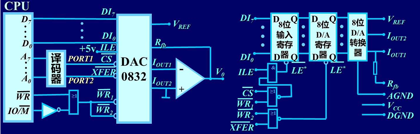

前序课程：电子技术、微机原理、控制理论

成绩构成：30%+70%（主观题+客观题）

乐学提交，平时考勤，雨课堂发布课件

第二章第三章为硬件设计、第四章到第六章为软件设计。重点在第二章，第八章的电磁兼容性略（通俗来说就是抗干扰设计），第九章自学


# 第一章：概述

## 1.1 一般概念

### CCS 概念

计算机控制系统（CCS）：是应用计算机参与控制并借助一些辅助部件与被控对象相联系，以获得一定控制目的而构成的系统。

计算机通常指数字计算机，有通用的到通用的到专用的。 辅助部件主要是输入输出接口、检测装置（传感器）和执行装置。联系可以通过有线或无线。控制目的可以是状态或运动过程达到某种要求，也可以是达到某种最优化目标。依据控制目的推出控制器的设计。

### CCS 特点

精度高、运算速度快、存储容量大、有逻辑判断功能。可以实现高级复杂的控制方法，获得快速精密的控制效果。

控制系统分为开环和闭环，开环系统的输出量对系统的控制作用没有影响，开环系统的精度取决于系统各环节（包括被控对象）的参数稳定性，所以控制性能相对较差。 闭环控制系统的输出量对系统的控制作用有直接的影响。另外，自动控制系统可以分成调节系统和伺服系统（随动系统）两类。调节系统的输入信号一般保持不变，保持系统状态稳定；而伺服系统则要求被控对象的状态能复现输入信号的变化。

### CCS 构成

闭环系统中一定要有检测装置对输出量进行检测，要有比较装置对系统的输入量和输出量进行比较，给出偏差信号，起信号综合作用。由于偏差信号幅值较小，需要放大器对微弱偏差信号进行放大，使之能够输出足够的功率。执行环节根据放大的偏差信号，对被控对象执行控制任务，使被控的输出量于给定量一致。 控制器也称校正装置，用于改善系统的性能。将它们串联起来可以构成最简单的闭环控制系统框图。最重要的两个装置就是控制器和检测装置。将控制器用计算机来实现，并加入 AD、DA 就是 CCS


### AD 和 DA 转换

AD 包含三种形式的转换：

- 模拟信号采样：按一定的时间间隔对连续信号进行采样，将其变为时间上断续的离散信号。（使得在时间上只能离散）

- 信号幅值的整量化：按照信号幅值按有限字长的最小量化单位分层取整，变为离散的信号。（使得在幅值上只能离散）

- 数字编码：已整量化的分层信号转换为等值的二进制数码信号，即数字信号。

DA 转换包含两种形式的转换：

- 数字解码：把数字量转换为等值的模拟脉冲信号。（使得在幅值上允许存在连续）

- 信号恢复：把解码之后的模拟脉冲信号变为随时间连续变化的信号（使得在时间上允许连续，恢复精度与 AD 时的采样周期有关，可以用零阶保持器实现）

引入了计算机之后，系统就变成了离散时间控制系统。

### 工作过程

- 实时数据采集：对被控参数的瞬时值进行检测、转换并输入到计算机中。

- 实时决策：对实时的给定值和被控量的数值进行分析，并按已定的控制规律进行计算，以决定进一步的控制策略。

- 实时控制：根据决策，实时地对执行机构发出控制信号

这三个步骤周而复始循环，就可以完成对被控对象地控制。实时的意思是信号的输入、计算和输出都是在一定时间范围内完成，要求计算机对输入信息以足够快的速度进行处理，并在一定的时间内作出反应或控制。只要延迟时间不错过控制的时机，便认为系统具有实时性。

### 实时性指标

实时需要考虑两个要素，一是根据被控过程出现的事件能保持多长时间；二是该事件要求计算机在多长的时间内必须做出反应。因此，系统的实时性指标取决于：检测仪表延时，过程输入(A/D)延时，计算机运算延时，数据传输(D/A)延时、执行机构延时等。由上面三步所构成的循环周期就是实时时间，也称为采样周期 Ts；显然，采样周期需要考虑这些不可避免的各个环节的延时。本书主要讨论计算机控制伺服系统，控制对象大多是快速变化对象，因此要求的实时时间一般为毫秒级。计算机控制系统的实时时间常由定时中断产生。


### 在线方式和离线方式

被控对象和计算机直接连接，并接受计算机控制的方式称为在线方式/联机方式，反之则称为离线方式或脱机方式。在线系统不一定是实时系统，但实现系统一定是在线的。

### CCS 的特点

1. 计算机控制系统是混合信号系统
2. 系统包含多种信号形式
3. 计算机控制系统的分析和设计需要先进的理论支持
4. 能实现复杂的控制规律，且控制规律灵活多样
5. 计算机控制系统可分时控制多个回路，适应性强，灵活性高
6. 计算机控制系统使得控制与管理容易结合并实现更高层次的自动化，提高了企业自动化程度
7. 计算机控制系统能够比较方便地实现系统的自动检测和故障诊断，提供了系统的可靠性和容错、维修能力

## 1.2CCS 组成

### 硬件组成

（虚线框内为实时控制所必须的最小系统配置）


- 主机：由 CPU、内存储器及时钟电路组成，是控制系统的核心。常用的计算机控制系统主机有可编程序控制器(PLC)、工控机(IPC)、单片机、DSP(数字信号处理器)、智能调节器(智能调节器是一种数字化的过程控制仪表)等。
- 标准外部设备：按功能分为三类

  - 输入设备：键盘、鼠标、游戏操作杆、光笔、触摸屏、扫描仪、麦克风、摄像机、数码相机等
  - 输出设备：打印机、绘图仪、显示器、投影仪、音响等
  - 外存储器：磁盘、磁带、光盘等，兼有输入和输出两种功能

- 过程通道/输入输出通道

  按照模拟量/数字量，输入/输出分类，排列组合有四大类：

  - 模拟量输入通道（A/D 通道）
  - 开关量输入通道（DI 通道）
  - 模拟量输出通道（D/A 通道）
  - 开关量输入通道（DO 通道）

- 接口：协调计算机与外设和过程通道的工作

- 人机联系设备/人机接口：作用是显示生产过程的状况、供生产操作人员使用，显示操作结果。系统中的操作员有系统操作员和生产操作员，人机接口的一个要求是需要具有容错性。

- 通信设备：完成不同位置、不同功能的计算机或设备间的信息交换

### 软件组成

- 系统软件：包括操作系统、程序设计系统、通信网络软件和诊断系统等，具有一定的通用性
- 应用软件：包括控制算法程序、输入/输出接口程序、监控程序和信息管理程序等

计算机控制系统是实时在线运行的系统，在构建软硬件系统时，必须充分保证系统运行的实时性和可靠性。

## 1.3 CCS 结构形式

计算机控制系统分类的方法有很多种，按照计算机参与控制方式分类，可分成以下几种类型：操作指导控制系统、直接数字控制系统、监督控制系统、集散控制系统、现场总线控制系统、综合自动化系统

## 1.4 发展概况和发展趋势

略

# 第二章：通道接口技术

通道接口需要完成两个任务，一是将被控对象需要控制的物理量经信息转换后送入到计算机（输入通道设计），二是将计算机执行出来的控制量完成控制指令转换并送入到执行机构（输出通道）

## 2.1 计算机对外围通道的控制

计算机对外围通道的控制，其基础是中断系统，具体则通过接口电路实现。计算机与内存及所有设备的连接都是基于总线的，即地址总线 AB、数据总线 DB、控制总线 CB；因此需要了解总线上的数据来自于哪个设备，同时也需要考虑计算机的控制量如何送入某台具体设备，这就是所谓的选址。

### 输入输出接口的编址方式

外围通道的地址对 CPU 来说有两种编址方式：统一编址方式（存储器）和独立编址方式，一般根据使用的 CPU 类型类确定 IO 接口的编址方式。本课程讨论的机器基本为隔离 IO，当然也可以人为设置成存储器映像 IO

- 存储器映像 I/O（又称统一编址方式）

  8088 上有$$\overline{MERQ}$$和$$\overline{IORQ}$$信号，用于选择 CPU 此时是与内存交互还是与外部设备交互；8086 上则将它们合并为$$IO/\overline{M}$$信号。$$\overline{RD}$$为读信号（将 CPU 信号送到外部设备），$$\overline{WR}$$为写信号（将外部设备信号送入 CPU），$$A_x$$为地址信号（图中的$$A_{15}$$表示有 16 为地址线，对应 0~65535byte，即 64kb 的内存）。图中的结构控制 0-7FFFH 为内存空间，8000H-FFFFH 为外部存储器空间。在这种编址方式中，外设是占用内存的。

  

  这种编址方式的优点是：

  - CPU 对外围的操作可使用全部的存储器操作指令，简化了指令系统的设计，不必单独包含 IO 操作指令
  - 内存和外设的地址分布图是同一个

  - IO 地址数几乎不受限制

  这种编址方式的缺点是：

  - 外设占用内存单元，使内存容量减小
  - 需要全字长的地址译码，需要使用更复杂的译码器芯片，指令操作的时间也有所延长
  - 程序中较难区分是否为/O 操作，程序可读性较差

---

- 隔离 IO（又称独立编址方式）

  需要专用的输入输出指令 IN/OUT 来访问外围端口，且仅限于对累加器进行操作，这增加了程序的复杂性，即必须将外部设备的数据送入累加器，再对累加器中的数据进行操作。

  ```assembly
  IN AL, n;  // 把外部数据送入AL寄存器中
  OUT n, AL; // 把AL中数据输出给外部设备
  ```

  并且要注意，隔离 IO 使用的是端口地址，且一个外部设备可能有多个端口。

  （一个外设不仅有数据寄存器，还有状态寄存器和控制命令寄存器，它们各需要一个地址
  单元（也称为端口 port）才能加以区分，故一个外设往往需要数个端口地址）

  这种编址方式的优点是：

  - 可读性好，指令与访问存储器的指令有明显区别，程序清晰

  - IO 指令长度段，执行速度快，占用内存空间少

  - IO 译码电路简单

  这种编址方式的缺点是：

  - CPU 的指令系统中必须有专门的 IN 和 OUT 指令

  - IO 指令的功能没有访问存储器的指令功能强大

### 直接寻址输入输出的时序

了解时序的目的是明白一条指令执行的过程中 CPU 为用户提供的信号，这些信号在时间上的配合关系，并要求接口电路设计选用的三态门电路和输出寄存器动作时序要和指令时序一致。

执行输入输出指令时，地址总线上为外部设备的端口地址，数据总线上为要传输的数据，控制总线上为选通 IO 操作时对应的电平。IN 指令时$$\overline{RD}$$信号有效，OUT 指令时$$\overline{WR}$$信号有效。

第一个机器周期内采样地址总线的变化，然后如果有需要输出的数据，此时就应该准备好；第二个机器周期采样 IO 选通信号，并采样读或写信号（图中把读写都画成有效了，实际运行时只有一个为有效电平）；然后是可能插入的一个或多个等待周期，确保程序能准确运行；第三个机器周期采样要读入的信号。把从第一个周期的上升沿到下一个周期的上升沿称为输入输出周期，不同指令输入输出周期的长短可能不同（如传输 16 位的指令耗时就多于传输 8 位的指令）

### 译码器

译码器就是把给定的地址代码进行“翻译”，变成相应的状态信号，用以选择不同的存储器及外设的芯片。在本课程的接口中，最常用的是三——八译码器 74LS138。

### 中断

中断是 CPU 一种处理外界实时信息的功能。

==中断的优点：提高 CPU 的工作效率、CPU 响应中断的条件、中断响应的过程、响应中断的四个条件==

CPU 响应中断的四个条件：有中断申请、中断未被屏蔽、软件代码中打开中断、在当前执行的指令结束后

### 接口

接口电路是沟通 CPU 与外围通道之间信息交换的桥梁，是计算机控制系统中必不可少的部件。

接口的目的：

- 协调 CPU 与独立的外部设备之间的数据传输（执行协调工作的控制信号称为握手信号）
- 进行数据格式的转换（模数转换，串并行转换）
- 实现电气隔离、放大，消除干扰等

常见的接口的类型包括：

- 并行 I/O 接口：CPU 内部总线是并行 IO
- AD 转换接口
- D/A 转换接口
- 实时时钟接口：距离较远的设备保持时间一致性
- DMA 控制接口：外设与内存之间直接的数据交换而不用通过 CPU，CPU 出让三总线控制权给 DMA 控制器，实现大批量数据传输，多用于操作指导控制系统，以及大量数据采集等场合
- 串行通讯接口：线数少、传输距离长、传输速率相对慢，串行通讯芯片有 8251
- 并行通讯接口：线数多、传输距离短、传输速率相对快，并行通讯芯片有 8255
- 网络通讯接口：集散控制系统、分布式控制系统中常用

### 并行 IO 接口

- 无条件传送（简单 IO 方式）：外设和 CPU 直接进行数据交互，只有在外部控制过程的各种动作时间是固定且已知的条件下才能使用，因此又称为同步方式。系统构成需要输入缓冲、输出锁存以及端口地址译码，13 构成简单输入方式，23 构成简单输出方式。使用条件为已知且确认外部设备已经准备好。（锁存器，不使能时候，锁存的输入不影响输出，输出保持之前的数据）

  输入方式：CPU 执行 IN 指令时，外部设别的数据必须是准备好的

  

  输出方式：CPU 执行 OUT 指令时，必须确信所选外部设备的锁存器是空的（即已经被取走）

  

  无条件传送的特点是：CPU 需要与外设同步，CPU 效率较低。

- 查询传送：当系统控制时间不固定时，就需要加上握手信号，这称为查询传送，查询传送需要额外的两个数据，一是 CPU 的状态，二是外设的状态；以 OUT 指令为例，需要查询 CPU 是否已经准备好了数据，以及外设是否准备好了接收数据。接口部分除了数据端口外，还必须有状态端口。每次传输都需要询问 CPU 和外设是否响应握手信号，虽然能够保证数据传输的准确性，但浪费 CPU 时间，且实时性无法保证

- 中断传送：又称为选通 IO 方式，可提高 CPU 效率，在控制系统中很常见

  

  选通输入方式：

  （注：D 触发器，来一个时钟信号，将 Q 的状态置为 D 的状态，R 为复位 Q 的信号）

  过程分析：Q 端和外设连接，将 Q 的状态传递给外设，当 Q=0 时说明上一个数据已经被取走。确认数据被取走后，外设向 D 触发器和锁存器发出时钟信号，申请 CPU 的中断。此时锁存器的输入传递到锁存器的输出，即三态缓冲器的输入；同时 D 触发器的 Q 端被置为高电平，当$$\overline{MI}$$（屏蔽信号）为高电平，即开启中断时，经过与门逻辑，INTR 信号有效，触发可屏蔽中断。当 CPU 同意处理中断后进入中断服务子程序中，开始执行 IN 指令，过程同无条件传送，此时或门输出低电平打开三态缓冲器，从外设来的数据进入数据总线；同时经过下面的与门触发 D 触发器清零，告诉外设数据已经被取走。

  补充：

  1. 当$$\overline{RESET}$$信号为低电平有效时，也可以进行异步清零。
  2. 当存在多个外设时，除了有图中的状态寄存器（D 触发器）和地址寄存器外，还要有中断寄存器，每一位对应一个外设的中断情况，还要有中断屏蔽寄存器，每一位对应一个外设的中断是否被屏蔽

  

  选通输出方式：

  

  选通输入输出方式的控制逻辑：

  控制寄存器：存放从 CPU 送来的控制字，以指定接口电路要完成的工作，设定工作参数、工作方式等。状态寄存器：保存通道的现行状态信息，以提供给 CPU 判断使用。中断寄存器：存放$$Q$$和$$\overline{Q}$$的状态，包括中断申请寄存器和中断屏蔽寄存器。另外，多个端口时还需要分配地址，有专门的端口地址和译码电路。

  结构框图：中间为双向的并行 IO

  

## 2.2 模拟量输出通道

模拟量输出通道的任务是把计算机输出的数字量信号转换成模拟电压或电流信号，去驱动相应的执行机构，达到控制的目的。一般含有接口电路、电压/电流变换器、数模转换器，简称为 DAC。模拟量输出通道主要完成的是转换（DA，得到的是时间离散幅值连续的信号）和保持（把分段连续的脉冲信号转化为连续信号）两个任务。输出的物理信号有电压型和电流型，输出信号极性有单极性（只有正和零或负和零）和双极性，接受的数字量可以是并行方式和串行方式。

### DA 转换原理

将输入数字量转换为与之成比例的模拟量，最常用的转换电路是 R-2R 梯形电阻解码网络，由基准电压、运算放大器（将电流转换为电压）、权电阻网络和模拟开关组成，模拟开关由输入的数字量控制。


$$
\begin{aligned}
\sum I_0&=\frac{-V_{REF}}{2R}\left(\frac{2^0}{2^n}D_0 + \frac{2^1}{2^n}D_1+\ldots+ \frac{2^{n - 1}}{2^n}D_{n - 1}\right)\\
U_0&=\frac{V_{REF}}{2R}\left(\frac{2^0}{2^n}D_0 + \frac{2^1}{2^n}D_1+\ldots+ \frac{2^{n - 1}}{2^n}D_{n - 1}\right)R_F\\
&=V_{REF}\left(\frac{2^0}{2^n}D_0 + \frac{2^1}{2^n}D_1+\ldots+ \frac{2^{n - 1}}{2^n}D_{n - 1}\right)\frac{R_F}{2R}
\end{aligned}
$$

对上述结构进行改进，得到反向 R-2R 梯形电阻解码网络：基准电源的负载电流与二进制数码无关（负载电阻始终为 R），提高了转换精度


$$
U_{o}=-\frac{R_{F}}{R}\cdot V_{ref}\sum_{i = 0}^{n - 1}\frac{D_{i}}{2^{n - i}}
$$

### DA 技术参数

- 分辨率：$$\frac{V_{REF}}{2^n}$$，也可以说分辨率相当于输入二进制数最低有效位（LSB）相当的输出模拟电压。分辨率影响控制精度。

- 线性误差：在满刻度范围内，偏离理想转换特性的最大误差，用 LSB 的分数表示。

- 建立时间：输入二进制数变化量是满刻度（全 0 变全 1 或反之）时，输出达到最终值$$\pm \frac{1}{2}LSB$$时所需的时间

- 微分非线性：转移特性上任意两个连续码与理论值 LSB 之间的差距（理想的 DAC 任意两个数码之间的电压差为一个 LSB，但实际的 DAC 存在误差），通常要求 DA 转换器的微分非线性误差小于$$\pm \frac{1}{2}LSB$$

- 单调性：输出电压随输入数码的增加而增加，要求特性斜率符号不变。比如下图就不是单调的

  

- 温度范围：较好的 DA 转换器工作温度范围在$$-40-85℃$$

- 输出电平：电流输出$$20mA-3A$$，电压输出$$5-10V$$、$$24-30V$$

- 温度系数：在满刻度输出的条件下，温度每升高 1℃ 时输出变化的百分数，单位是 ppmFSR℃，ppm 表示百万分之一，FSR 为输出电压满刻度

- 电源抑制比：是 DA 转换器受电源变化影响的指标，用电源变化 1V 时的输出误差相对满量程的比值来表示，单位是 ppm/V

- 其它的技术参数还有参考电压、接口方式、封装形式等

  常见的封装形式：

  

### DAC 芯片：DAC0832

引脚有数字量输入端、模拟量输出端、控制信号端、电源端。输入有带 0 个（不带缓冲寄存器则必须外置缓冲寄存器）、1 个、2 个缓冲寄存器的（所有和 CPU 交互的设备都需要有缓冲寄存器，否则 CPU 所有出现在数据总线上的数据，不管是不是该设备应该接受的数据，都会被设别接收到）。按集成电路形式可分为单端式、差动式和双向开关式，前两种采用双极型电路，只能使用单极性基准电源（因此 DA 输出也是单极性的）。双向开关式采用 CMOS 电路，可以使用正负基准电源。输出有电压型和电流型，输出电流型的如果想输出电压，外置运放即可。

下面以 DAC0832 为例，介绍 DAC 芯片


整个结构分为 8 位 AD 转换器（R-2R 权电阻网络），两个缓冲寄存器，以及控制信号输入。$$\overline{LE}=1$$时输出跟随输入，$$\overline{LE}=0$$时输出被锁存。数据输入中$$D_0$$为 LSB，$$D_7$$为 MSB，$$\overline{CS}$$为低电平有效的片选信号，一般根据分配的地址接对应地址译码器的输出，$$ILE$$为高电平有效的允许锁存信号，$$\overline{XFER}$$为低电平有效的传送控制信号，$$\overline{WR_1}$$和$$\overline{WR_2}$$为低电平有效的两个写信号。$$I_{OUT1}$$和$$I_{OUT2}$$为两个电流输出，$$R_{th}$$为内部反馈电阻。$$V_{REF}$$为参考电压输出端，允许输入直流$$-10V-+10V$$，$$VCC$$为工作电压，允许输入直流$$+5V-+15V$$，$$DGND$$和$$AGND$$分别为数字地和模拟地。

写信号线的时序如下，要求写信号要先于数据信号，写信号脉冲持续时间大于 500ns（若 VCC 为 15V 则只需要 100ns），写信号结束后，数据信号需要至少保持 90ns


五根控制线控制两个缓冲寄存器的工作模式：

- 直通：两个锁存器均不起作用，输入直接影响输出

  

- 单缓冲：控制一个锁存器的工作（图中接法为控制输入寄存器）

  

  

- 双缓冲：可以使DA转换器在DAC寄存器锁存现有数据的同时，在输入寄存器中锁存下一个数据。两个写信号电平一致，

    

    
