前序课程：电子技术、微机原理、控制理论

成绩构成：30%+70%(主观题+客观题)

乐学提交，平时考勤，雨课堂发布课件

第二章第三章为硬件设计、第四章到第六章为软件设计。重点在第二章，第八章的电磁兼容性略(通俗来说就是抗干扰设计)，第九章自学

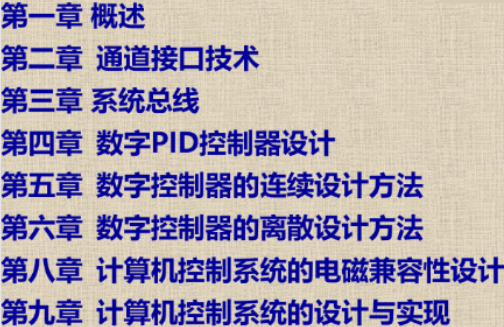

## 第一章：概述

### 1.1 一般概念

#### CCS 概念

计算机控制系统(CCS)：是应用计算机参与控制并借助一些辅助部件与被控对象相联系，以获得一定控制目的而构成的系统。

计算机通常指数字计算机，有通用的到通用的到专用的。 辅助部件主要是输入输出接口、检测装置(传感器)和执行装置。联系可以通过有线或无线。控制目的可以是状态或运动过程达到某种要求，也可以是达到某种最优化目标。依据控制目的推出控制器的设计。

#### CCS 特点

精度高、运算速度快、存储容量大、有逻辑判断功能。可以实现高级复杂的控制方法，获得快速精密的控制效果。

控制系统分为开环和闭环，开环系统的输出量对系统的控制作用没有影响，开环系统的精度取决于系统各环节(包括被控对象)的参数稳定性，所以控制性能相对较差。 闭环控制系统的输出量对系统的控制作用有直接的影响。另外，自动控制系统可以分成调节系统和伺服系统(随动系统)两类。调节系统的输入信号一般保持不变，保持系统状态稳定；而伺服系统则要求被控对象的状态能复现输入信号的变化。

#### CCS 构成

闭环系统中一定要有检测装置对输出量进行检测，要有比较装置对系统的输入量和输出量进行比较，给出偏差信号，起信号综合作用。由于偏差信号幅值较小，需要放大器对微弱偏差信号进行放大，使之能够输出足够的功率。执行环节根据放大的偏差信号，对被控对象执行控制任务，使被控的输出量于给定量一致。 控制器也称校正装置，用于改善系统的性能。将它们串联起来可以构成最简单的闭环控制系统框图。最重要的两个装置就是控制器和检测装置。将控制器用计算机来实现，并加入 AD、DA 就是 CCS


#### AD 和 DA 转换

AD 包含三种形式的转换：

- 模拟信号采样：按一定的时间间隔对连续信号进行采样，将其变为时间上断续的离散信号。(使得在时间上只能离散)

- 信号幅值的整量化：按照信号幅值按有限字长的最小量化单位分层取整，变为离散的信号。(使得在幅值上只能离散)

- 数字编码：已整量化的分层信号转换为等值的二进制数码信号，即数字信号。

DA 转换包含两种形式的转换：

- 数字解码：把数字量转换为等值的模拟脉冲信号。(使得在幅值上允许存在连续)

- 信号恢复：把解码之后的模拟脉冲信号变为随时间连续变化的信号(使得在时间上允许连续，恢复精度与 AD 时的采样周期有关，可以用零阶保持器实现)

引入了计算机之后，系统就变成了离散时间控制系统。

#### 工作过程

- 实时数据采集：对被控参数的瞬时值进行检测、转换并输入到计算机中。

- 实时决策：对实时的给定值和被控量的数值进行分析，并按已定的控制规律进行计算，以决定进一步的控制策略。

- 实时控制：根据决策，实时地对执行机构发出控制信号

这三个步骤周而复始循环，就可以完成对被控对象地控制。实时的意思是信号的输入、计算和输出都是在一定时间范围内完成，要求计算机对输入信息以足够快的速度进行处理，并在一定的时间内作出反应或控制。只要延迟时间不错过控制的时机，便认为系统具有实时性。

#### 实时性指标

实时需要考虑两个要素，一是根据被控过程出现的事件能保持多长时间；二是该事件要求计算机在多长的时间内必须做出反应。因此，系统的实时性指标取决于：检测仪表延时，过程输入(A/D)延时，计算机运算延时，数据传输(D/A)延时、执行机构延时等。由上面三步所构成的循环周期就是实时时间，也称为采样周期 Ts；显然，采样周期需要考虑这些不可避免的各个环节的延时。本书主要讨论计算机控制伺服系统，控制对象大多是快速变化对象，因此要求的实时时间一般为毫秒级。计算机控制系统的实时时间常由定时中断产生。

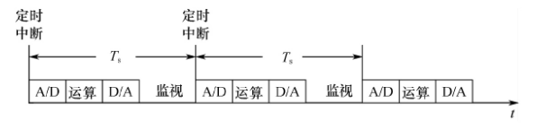

#### 在线方式和离线方式

被控对象和计算机直接连接，并接受计算机控制的方式称为在线方式/联机方式，反之则称为离线方式或脱机方式。在线系统不一定是实时系统，但实现系统一定是在线的。

#### CCS 的特点

1. 计算机控制系统是混合信号系统
2. 系统包含多种信号形式
3. 计算机控制系统的分析和设计需要先进的理论支持
4. 能实现复杂的控制规律，且控制规律灵活多样
5. 计算机控制系统可分时控制多个回路，适应性强，灵活性高
6. 计算机控制系统使得控制与管理容易结合并实现更高层次的自动化，提高了企业自动化程度
7. 计算机控制系统能够比较方便地实现系统的自动检测和故障诊断，提供了系统的可靠性和容错、维修能力

### 1.2CCS 组成

#### 硬件组成

(虚线框内为实时控制所必须的最小系统配置)

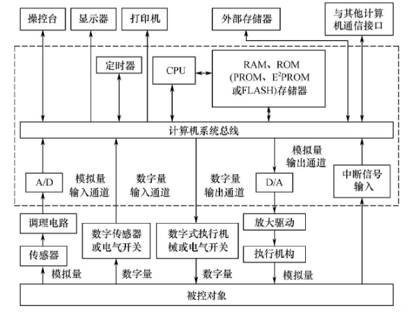

- 主机：由 CPU、内存储器及时钟电路组成，是控制系统的核心。常用的计算机控制系统主机有可编程序控制器(PLC)、工控机(IPC)、单片机、DSP(数字信号处理器)、智能调节器(智能调节器是一种数字化的过程控制仪表)等。
- 标准外部设备：按功能分为三类

  - 输入设备：键盘、鼠标、游戏操作杆、光笔、触摸屏、扫描仪、麦克风、摄像机、数码相机等
  - 输出设备：打印机、绘图仪、显示器、投影仪、音响等
  - 外存储器：磁盘、磁带、光盘等，兼有输入和输出两种功能

- 过程通道/输入输出通道

  按照模拟量/数字量，输入/输出分类，排列组合有四大类：

  - 模拟量输入通道(A/D 通道)
  - 开关量输入通道(DI 通道)
  - 模拟量输出通道(D/A 通道)
  - 开关量输入通道(DO 通道)

- 接口：协调计算机与外设和过程通道的工作

- 人机联系设备/人机接口：作用是显示生产过程的状况、供生产操作人员使用，显示操作结果。系统中的操作员有系统操作员和生产操作员，人机接口的一个要求是需要具有容错性。

- 通信设备：完成不同位置、不同功能的计算机或设备间的信息交换

#### 软件组成

- 系统软件：包括操作系统、程序设计系统、通信网络软件和诊断系统等，具有一定的通用性
- 应用软件：包括控制算法程序、输入/输出接口程序、监控程序和信息管理程序等

计算机控制系统是实时在线运行的系统，在构建软硬件系统时，必须充分保证系统运行的实时性和可靠性。

### 1.3 CCS 结构形式

计算机控制系统分类的方法有很多种，按照计算机参与控制方式分类，可分成以下几种类型：操作指导控制系统、直接数字控制系统、监督控制系统、集散控制系统、现场总线控制系统、综合自动化系统

### 1.4 发展概况和发展趋势

略

## 第二章：通道接口技术

通道接口需要完成两个任务，一是将被控对象需要控制的物理量经信息转换后送入到计算机(输入通道设计)，二是将计算机执行出来的控制量完成控制指令转换并送入到执行机构(输出通道)

### 2.1 计算机对外围通道的控制

计算机对外围通道的控制，其基础是中断系统，具体则通过接口电路实现。计算机与内存及所有设备的连接都是基于总线的，即地址总线 AB、数据总线 DB、控制总线 CB；因此需要了解总线上的数据来自于哪个设备，同时也需要考虑计算机的控制量如何送入某台具体设备，这就是所谓的选址。

#### 输入输出接口的编址方式

外围通道的地址对 CPU 来说有两种编址方式：统一编址方式(存储器)和独立编址方式，一般根据使用的 CPU 类型类确定 IO 接口的编址方式。本课程讨论的机器基本为隔离 IO，当然也可以人为设置成存储器映像 IO

- 存储器映像 I/O(又称统一编址方式)

  8088 上有$$\overline{MERQ}$$和$$\overline{IORQ}$$信号，用于选择 CPU 此时是与内存交互还是与外部设备交互；8086 上则将它们合并为$$IO/\overline{M}$$信号。$$\overline{RD}$$为读信号(将 CPU 信号送到外部设备)，$$\overline{WR}$$为写信号(将外部设备信号送入 CPU)，$$A_x$$为地址信号(图中的$$A_{15}$$表示有 16 为地址线，对应 0~65535byte，即 64kb 的内存)。图中的结构控制 0-7FFFH 为内存空间，8000H-FFFFH 为外部存储器空间。在这种编址方式中，外设是占用内存的。

  

  这种编址方式的优点是：

  - CPU 对外围的操作可使用全部的存储器操作指令，简化了指令系统的设计，不必单独包含 IO 操作指令
  - 内存和外设的地址分布图是同一个

  - IO 地址数几乎不受限制

  这种编址方式的缺点是：

  - 外设占用内存单元，使内存容量减小
  - 需要全字长的地址译码，需要使用更复杂的译码器芯片，指令操作的时间也有所延长
  - 程序中较难区分是否为/O 操作，程序可读性较差

---

- 隔离 IO(又称独立编址方式)

  需要专用的输入输出指令 IN/OUT 来访问外围端口，且仅限于对累加器进行操作，这增加了程序的复杂性，即必须将外部设备的数据送入累加器，再对累加器中的数据进行操作。

  ```assembly
  IN AL, n;  // 把外部数据送入AL寄存器中
  OUT n, AL; // 把AL中数据输出给外部设备
  ```

  并且要注意，隔离 IO 使用的是端口地址，且一个外部设备可能有多个端口。

  (一个外设不仅有数据寄存器，还有状态寄存器和控制命令寄存器，它们各需要一个地址
  单元(也称为端口 port)才能加以区分，故一个外设往往需要数个端口地址)

  这种编址方式的优点是：

  - 可读性好，指令与访问存储器的指令有明显区别，程序清晰

  - IO 指令长度段，执行速度快，占用内存空间少

  - IO 译码电路简单

  这种编址方式的缺点是：

  - CPU 的指令系统中必须有专门的 IN 和 OUT 指令

  - IO 指令的功能没有访问存储器的指令功能强大

#### 直接寻址输入输出的时序

了解时序的目的是明白一条指令执行的过程中 CPU 为用户提供的信号，这些信号在时间上的配合关系，并要求接口电路设计选用的三态门电路和输出寄存器动作时序要和指令时序一致。

执行输入输出指令时，地址总线上为外部设备的端口地址，数据总线上为要传输的数据，控制总线上为选通 IO 操作时对应的电平。IN 指令时$$\overline{RD}$$信号有效，OUT 指令时$$\overline{WR}$$信号有效。

第一个机器周期内采样地址总线的变化，然后如果有需要输出的数据，此时就应该准备好；第二个机器周期采样 IO 选通信号，并采样读或写信号(图中把读写都画成有效了，实际运行时只有一个为有效电平)；然后是可能插入的一个或多个等待周期，确保程序能准确运行；第三个机器周期采样要读入的信号。把从第一个周期的上升沿到下一个周期的上升沿称为输入输出周期，不同指令输入输出周期的长短可能不同(如传输 16 位的指令耗时就多于传输 8 位的指令)

#### 译码器

译码器就是把给定的地址代码进行“翻译”，变成相应的状态信号，用以选择不同的存储器及外设的芯片。在本课程的接口中，最常用的是三——八译码器 74LS138。

#### 中断

中断是 CPU 一种处理外界实时信息的功能。

==中断的优点：提高 CPU 的工作效率、CPU 响应中断的条件、中断响应的过程、响应中断的四个条件==

CPU 响应中断的四个条件：有中断申请、中断未被屏蔽、软件代码中打开中断、在当前执行的指令结束后

#### 接口

接口电路是沟通 CPU 与外围通道之间信息交换的桥梁，是计算机控制系统中必不可少的部件。

接口的目的：

- 协调 CPU 与独立的外部设备之间的数据传输(执行协调工作的控制信号称为握手信号)
- 进行数据格式的转换(模数转换，串并行转换)
- 实现电气隔离、放大，消除干扰等

常见的接口的类型包括：

- 并行 I/O 接口：CPU 内部总线是并行 IO
- AD 转换接口
- D/A 转换接口
- 实时时钟接口：距离较远的设备保持时间一致性
- DMA 控制接口：外设与内存之间直接的数据交换而不用通过 CPU，CPU 出让三总线控制权给 DMA 控制器，实现大批量数据传输，多用于操作指导控制系统，以及大量数据采集等场合
- 串行通讯接口：线数少、传输距离长、传输速率相对慢，串行通讯芯片有 8251
- 并行通讯接口：线数多、传输距离短、传输速率相对快，并行通讯芯片有 8255
- 网络通讯接口：集散控制系统、分布式控制系统中常用

#### 并行 IO 接口

- 无条件传送(简单 IO 方式)：外设和 CPU 直接进行数据交互，只有在外部控制过程的各种动作时间是固定且已知的条件下才能使用，因此又称为同步方式。系统构成需要输入缓冲、输出锁存以及端口地址译码，13 构成简单输入方式，23 构成简单输出方式。使用条件为已知且确认外部设备已经准备好。(锁存器，不使能时候，锁存的输入不影响输出，输出保持之前的数据)

  输入方式：CPU 执行 IN 指令时，外部设别的数据必须是准备好的

  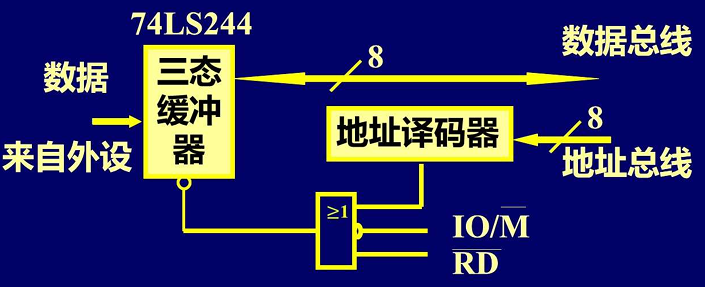

  输出方式：CPU 执行 OUT 指令时，必须确信所选外部设备的锁存器是空的(即已经被取走)

  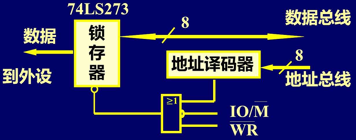

  无条件传送的特点是：CPU 需要与外设同步，CPU 效率较低。

- 查询传送：当系统控制时间不固定时，就需要加上握手信号，这称为查询传送，查询传送需要额外的两个数据，一是 CPU 的状态，二是外设的状态；以 OUT 指令为例，需要查询 CPU 是否已经准备好了数据，以及外设是否准备好了接收数据。接口部分除了数据端口外，还必须有状态端口。每次传输都需要询问 CPU 和外设是否响应握手信号，虽然能够保证数据传输的准确性，但浪费 CPU 时间，且实时性无法保证

- 中断传送：又称为选通 IO 方式，可提高 CPU 效率，在控制系统中很常见

  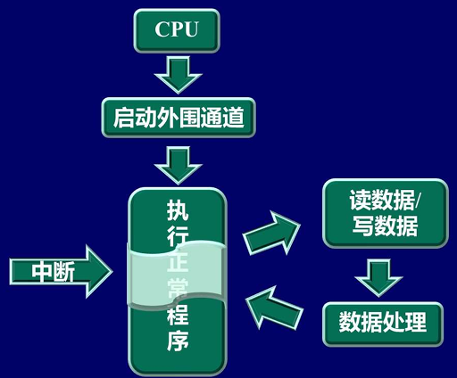

  选通输入方式：

  (注：D 触发器，来一个时钟信号，将 Q 的状态置为 D 的状态，R 为复位 Q 的信号)

  过程分析：Q 端和外设连接，将 Q 的状态传递给外设，当 Q=0 时说明上一个数据已经被取走。确认数据被取走后，外设向 D 触发器和锁存器发出时钟信号，申请 CPU 的中断。此时锁存器的输入传递到锁存器的输出，即三态缓冲器的输入；同时 D 触发器的 Q 端被置为高电平，当$$\overline{MI}$$(屏蔽信号)为高电平，即开启中断时，经过与门逻辑，INTR 信号有效，触发可屏蔽中断。当 CPU 同意处理中断后进入中断服务子程序中，开始执行 IN 指令，过程同无条件传送，此时或门输出低电平打开三态缓冲器，从外设来的数据进入数据总线；同时经过下面的与门触发 D 触发器清零，告诉外设数据已经被取走。

  补充：

  1. 当$$\overline{RESET}$$信号为低电平有效时，也可以进行异步清零。
  2. 当存在多个外设时，除了有图中的状态寄存器(D 触发器)和地址寄存器外，还要有中断寄存器，每一位对应一个外设的中断情况，还要有中断屏蔽寄存器，每一位对应一个外设的中断是否被屏蔽

  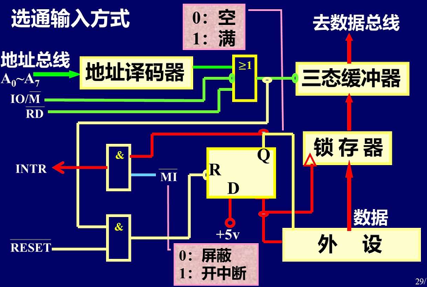

  选通输出方式：

  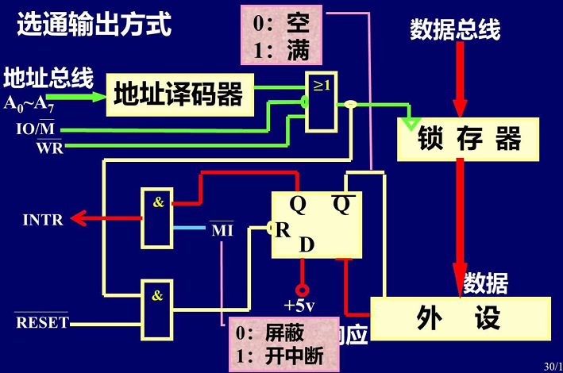

  选通输入输出方式的控制逻辑：

  控制寄存器：存放从 CPU 送来的控制字，以指定接口电路要完成的工作，设定工作参数、工作方式等。状态寄存器：保存通道的现行状态信息，以提供给 CPU 判断使用。中断寄存器：存放$$Q$$和$$\overline{Q}$$的状态，包括中断申请寄存器和中断屏蔽寄存器。另外，多个端口时还需要分配地址，有专门的端口地址和译码电路。

  结构框图：中间为双向的并行 IO

  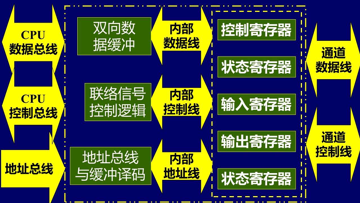

### 2.2 模拟量输出通道(DAC)

模拟量输出通道的任务是把计算机输出的数字量信号转换成模拟电压或电流信号，去驱动相应的执行机构，达到控制的目的。一般含有接口电路、电压/电流变换器、数模转换器，简称为 DAC。模拟量输出通道主要完成的是转换(DA，得到的是时间离散幅值连续的信号)和保持(把分段连续的脉冲信号转化为连续信号)两个任务。输出的物理信号有电压型和电流型，输出信号极性有单极性(只有正和零或负和零)和双极性，接受的数字量可以是并行方式和串行方式。

#### DA 转换原理

将输入数字量转换为与之成比例的模拟量，最常用的转换电路是 R-2R 梯形电阻解码网络，由基准电压、运算放大器(将电流转换为电压)、权电阻网络和模拟开关组成，模拟开关由输入的数字量控制。


$$
\begin{aligned}
\sum I_0&=\frac{-V_{REF}}{2R}\left(\frac{2^0}{2^n}D_0 + \frac{2^1}{2^n}D_1+\ldots+ \frac{2^{n - 1}}{2^n}D_{n - 1}\right)\\
U_0&=\frac{V_{REF}}{2R}\left(\frac{2^0}{2^n}D_0 + \frac{2^1}{2^n}D_1+\ldots+ \frac{2^{n - 1}}{2^n}D_{n - 1}\right)R_F\\
&=V_{REF}\left(\frac{2^0}{2^n}D_0 + \frac{2^1}{2^n}D_1+\ldots+ \frac{2^{n - 1}}{2^n}D_{n - 1}\right)\frac{R_F}{2R}
\end{aligned}
$$

对上述结构进行改进，得到反向 R-2R 梯形电阻解码网络：基准电源的负载电流与二进制数码无关(负载电阻始终为 R)，提高了转换精度


$$
U_{o}=-\frac{R_{F}}{R}\cdot V_{ref}\sum_{i = 0}^{n - 1}\frac{D_{i}}{2^{n - i}}
$$

#### DA 技术参数

- 分辨率：$$\frac{V_{REF}}{2^n}$$，也可以说分辨率相当于输入二进制数最低有效位(LSB)相当的输出模拟电压。分辨率影响控制精度。

- 线性误差：在满刻度范围内，偏离理想转换特性的最大误差，用 LSB 的分数表示。

- 建立时间：输入二进制数变化量是满刻度(全 0 变全 1 或反之)时，输出达到最终值$$\pm \frac{1}{2}LSB$$时所需的时间

- 微分非线性：转移特性上任意两个连续码与理论值 LSB 之间的差距(理想的 DAC 任意两个数码之间的电压差为一个 LSB，但实际的 DAC 存在误差)，通常要求 DA 转换器的微分非线性误差小于$$\pm \frac{1}{2}LSB$$

- 单调性：输出电压随输入数码的增加而增加，要求特性斜率符号不变。比如下图就不是单调的

  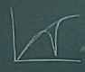

- 温度范围：较好的 DA 转换器工作温度范围在$$-40-85℃$$

- 输出电平：电流输出$$20mA-3A$$，电压输出$$5-10V$$、$$24-30V$$

- 温度系数：在满刻度输出的条件下，温度每升高 1℃ 时输出变化的百分数，单位是 ppmFSR℃，ppm 表示百万分之一，FSR 为输出电压满刻度

- 电源抑制比：是 DA 转换器受电源变化影响的指标，用电源变化 1V 时的输出误差相对满量程的比值来表示，单位是 ppm/V

- 其它的技术参数还有参考电压、接口方式、封装形式等

  常见的封装形式：

  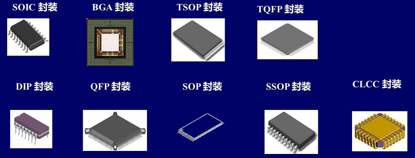

#### DAC 芯片

引脚有数字量输入端、模拟量输出端、控制信号端、电源端。输入有带 0 个(不带缓冲寄存器则必须外置缓冲寄存器)、1 个、2 个缓冲寄存器的(所有和 CPU 交互的设备都需要有缓冲寄存器，否则 CPU 所有出现在数据总线上的数据，不管是不是该设备应该接受的数据，都会被设别接收到)。按集成电路形式可分为单端式、差动式和双向开关式，前两种采用双极型电路，只能使用单极性基准电源(因此 DA 输出也是单极性的)。双向开关式采用 CMOS 电路，可以使用正负基准电源。输出有电压型和电流型，输出电流型的如果想输出电压，外置运放即可。

#### DAC0832


整个结构分为 8 位 AD 转换器(R-2R 权电阻网络)，两个缓冲寄存器，以及控制信号输入。$$\overline{LE}=1$$时输出跟随输入，$$\overline{LE}=0$$时输出被锁存。数据输入中$$D_0$$为 LSB，$$D_7$$为 MSB，$$\overline{CS}$$为低电平有效的片选信号，一般根据分配的地址接对应地址译码器的输出，$$ILE$$为高电平有效的允许锁存信号，$$\overline{XFER}$$为低电平有效的传送控制信号，$$\overline{WR_1}$$和$$\overline{WR_2}$$为低电平有效的两个写信号。$$I_{OUT1}$$和$$I_{OUT2}$$为两个电流输出，$$R_{th}$$为内部反馈电阻。$$V_{REF}$$为参考电压输出端，允许输入直流$$-10V-+10V$$，$$VCC$$为工作电压，允许输入直流$$+5V-+15V$$，$$DGND$$和$$AGND$$分别为数字地和模拟地。

写信号线的时序如下，要求写信号要先于数据信号，写信号脉冲持续时间大于 500ns(若 VCC 为 15V 则只需要 100ns)，写信号结束后，数据信号需要至少保持 90ns


五根控制线控制两个缓冲寄存器的工作模式：

- 直通：两个锁存器均不起作用，输入直接影响输出

  

- 单缓冲：控制一个锁存器的工作(图中接法为控制输入寄存器)

  

  

- 双缓冲：可以使 DA 转换器在 DAC 寄存器锁存现有数据的同时，在输入寄存器中锁存下一个数据。两个写信号电平一致，而选通和控制传输信号同为 138 译码器的输出，不会同时有效，因此两个锁存器交替工作

  

  下面的指令顺序，交换 34 的顺序也不会影响转换结果，因为指令本质上就是控制一些高低电平的信号，对于 OUT PORT2, AL 而言，AL 中的数据是什么并不影响，只要 DA 寄存器将输入送到输出即可。

  

  另外，双缓冲可以使多个 DA 转换器经由一个公共选通信号同时更新数据，先通过地址译码将数据分别送到多个芯片的输入寄存器中，用同一根线控制多个芯片的 DA 寄存器，便可以实现多个 DA 转换器同时更新数据。

#### DAC1208

相较于 0832，1208 是 12 位的 DAC，相应地也就有 12 条数据输入线，采用 24 脚双立直插式封装(0832 是 20 脚)；有 1230 和 1210，差别只在于线性误差不同，一个是二分之一 LSB，一个是 LSB。1230 或 1232 的内部结构中，低四位锁存器连线在芯片内部接到了八位锁存器的高四位，当需要更换八位微机时直接更换芯片并修改程序即可，无需改动接线；1208 或 1210 则将 12 位数据线全部引出


12 位数据分为一个 8 位锁存器和 4 位锁存器，采用字节控制信号$$BYTE1/\overline{BYTE2}$$控制数据的输入，高电平时 12 位数据同时存入第一级两个输入寄存器，低电平时只将低四位数据输入寄存器。

与 16 位微机相连(16 位微机表示数据总线宽度为 16 位)时，有直通、单缓冲和双缓冲三种方式，可选择接在高 12 位还是低 12 位，注意如果使用高 12 位，需要在传送前将数据移到高 12 位。与 CPU 的连接方式如图

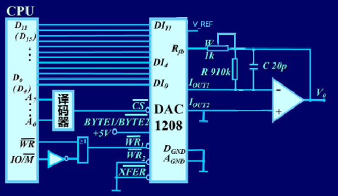

结构中的电位器用于调整满量程时的输出电压(类似于调零的作用)，电容用于抑制因电流阶跃变化造成的输出过冲和振铃现象。

与 8 位微机相连时，只能采用双缓冲方式，因为 8 位微机要转换 12 位数据，注定不能一次性传完数据，高八位和低四位必须异步工作

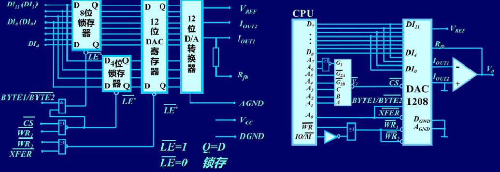

以该图为例，先执行 MOV AL, DATA1; OUT 00000101H, AL; 将高八位送入 8 位输入寄存器，再执行 MOV AL, DATA2; OUT 00000100H, AL; 将低四位送入 4 位输入寄存器并同时打开 12 位 DAC 寄存器。(注意 DATA2 的高四位而不是低四位进入 DAC)

#### 双极性模拟量输出

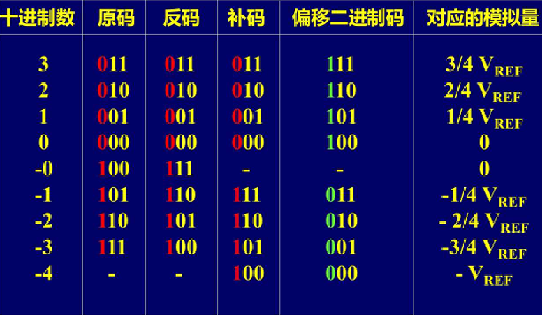

由于参考电压给定，运放输出的信号是单极性的，在该 DA 转换器的输出端叠加一个数值与最大转换数值相同而极性相反的固定电压即可实现偏移二进制码(补码最高位/符号位取反就是偏移二进制码)的双极性输出，并注意$$R_2$$与$$R_3$$的比值需要保证为 1：2，且$$V_{REF}$$要选用精密电源


$$
\begin{aligned}
V_{OUT2}&=\frac{2\sum_{i = 0}^{7} 2^i D_i}{256}V_{REF}-V_{REF}\\
V_{OUT2}&=-\left(\frac{R_3}{R_2}V_{OUT1}+\frac{R_3}{R_1}V_{REF}\right)=-(2V_{OUT1}+V_{REF})
\end{aligned}
$$

除了基于偏移二进制码的双极性输出，也可以实现按原码编码的双极性 DA 转换器，这种方式只适用于 CMOS 类的 DA 转换器

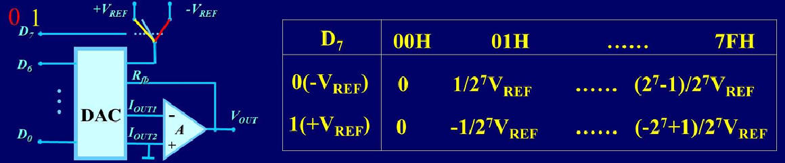

注意：以上所有输出双极性电压的方法，由于使用更大的电压范围来表示同样的数码，分辨率均有所降低；并且要注意，使用哪种码值的电路，输入的数字量就需要转换为对应的码值，只有使用基于补码的双极性输出不用转换，因为计算机内部本身以补码形式存储数据。

#### 模拟量输出通道的结构形式

分为两类：

- 每个通道有独立的数据寄存器和 DA 转换器，先保持后转换，数字保持式(需要保持的是个数字量)，速度快，成本高

  

- 多通道共用一个 DA 转换器，先转换后保持，模拟量保持式(需要保持的是个模拟量)，速度慢，成本低

  

#### 采样/保持器

作用：在采样状态时，其输出能够跟随输入变化；在保持状态时，能使其输出值不变。

用途：(12 用于模拟量输入通道，34 用于模拟量输出通道)

1. 保特模拟量信号不变，以便完成 AD 转换
2. 同时采样几个模拟信号，以便进行数据处理和测量
3. 减少 D/A 转换器的输出“毛刺”
4. 把一个 D/A 转换器的输出分配到几个输出点，以保持输出电压的稳定性

工作原理：运放接成电压跟随器，开关闭合为采样状态，开关断开为保持状态，$$I_s$$为断开电阻漏电流，$$I_c$$为电容漏电流，$$I_i$$为运放输入电流，$$\Delta V$$为保持电压，$$T_H$$为保持时间。漏电流导致电容电荷衰减


$$
\begin{aligned}
I_d&=I_c + I_i+I_s\\
\frac{dv}{dt}&=\frac{I_d}{C_H}\\
\Delta V&=\frac{I_d}{C_H}T_H
\end{aligned}
$$

主要参数：

- 孔径时间：电路接到保持信号后，模拟开关由导通转变为断开所需的时间
- 捕捉时间：电路接到采样控制信号后，输出电压达到指定跟踪误差范围内所需的时间。A/D 转换器的采样周期应大于捕捉时间
- 保持时间：模拟开关 K 断开的时间，由采样速率确定
- 变化率$$\frac{\text{d}V}{\text{d}t}$$：反映在保持阶段，由于保特电容 C 漏电或放大器的漏电流所引起的保持电压的变化

常用的采样/保持器：

- 集成采样保持器：LF198、LF398、AD582、AD583 等
- 高速芯片：THS-0025、THS-0060、THS-0300、THS-1500 等
- 高分辨率芯片：SHA-114、ADC1130 等

它们的共同特点是：采样速度快、精度高、输入阻抗高、保持电压下降速率慢等，其保持电容均外接

采样/保持器中电容大小，与采样频率以及要求的采样精度有关，采样频率越高要求电容越小，但下降速率越快，精度较差；采样频率较低时要求精度较高，可选用较大的电容

==自学 AD582 和 LF398、CD4052、CD4053==

#### 多路转换开关

也称多路模拟开关，多路转换器

1. 干簧管模拟开关——有触点开关

   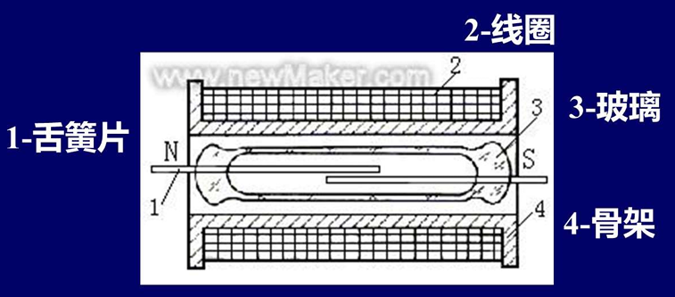

   - 开关的导通电阻接近于零，开路电阻可大于$$10^9$$Ω
   - 簧片刚性强，触头位移小，使用寿命达$$10^7-10^9$$次
   - 不受环境温度影响，漏电流为零
   - 切换速度低，维修量大
   - 此类开关适用于采样速度小于 100 点/s 的小信号低速高精度的检测系统

2. 集成多路开关——CMOS 工艺制作

   - 开关切换时间为 0.1-2μs
   - 工作频率可达 1000 点/s 以上
   - 体积小，使用寿命长
   - 导通电阻较大为 5~500Ω
   - 断开时有漏电流
   - 驱动部分和开关元件部分不独立，影响小信号测量的精度

   下图中为传输门，一种双向开关

   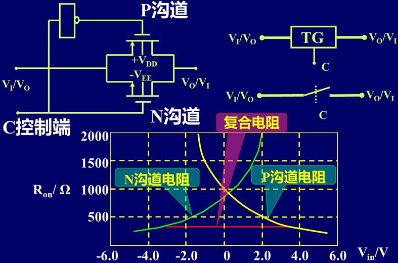

   将多个传输门这样的结构构成多路开关，特性是：电源电压越高，导通电阻越小，切换速度越快。而电源电压较高则需要相应的控制电平也高。导通电阻小，则传递精度会下降，希望提高精度则要求负载阻抗高，放大器和采样保持器可与开关直连。

   - CD4066——四双向模拟开关，一个单刀双掷开关和一个双刀单掷开关

     

   - CD4051——单八通道模拟开关，其中逻辑电平转换部分完成 CMOS 到 TTL 的转换，电源范围$$\pm1.5V - \pm7.5V$$，S 为禁止端。设计 S 信号的目的是为了多个多路开关可以通过外部选通译码实现扩展

     

   - CD4052——双四通道模拟开关，适用于差动输入信号

     

   - CD4053——三个独立的单刀双掷开关(图中左侧四个模块为电平转换，中间三个模块为译码驱动为)

     

#### DA 转换模板的设计

1. 设计原则

   设计者的任务：

   - 根据用户对 D/A 通道的技术要求合理地选择通道的结构(每路一个 DA 还是共用)
   - 恰当地选择所需 D/A 转换芯片及有关集成电路芯片(考虑分辨率等技术指标)
   - 正确地设计出符合各项技术要求的 D/A 转换电路

   在硬件设计的同时还必须考虑软件设计，充分利用 CPU 的软件资源

   设计步骤：

   - 确定性能指标
   - 设计电路
   - 设计和制造电路板
   - 焊接和调试电路板

   把可用硬件实现的部分用软件实现，可以保证可移植性强

2. 举例

   

   使用多通道共用一个 DA 的结构形式，DAC0832 接成直通方式，扫描开关为多路转换开关，且利用其开关与后面的运放构成采样保持器。

   74LS93 为同步四位二进制可逆计数器，QA 对 QDQCQB 三位进行计数(2MHz 进行 64 分频后，周期为 32us，八个通道总共为 256us，且不占用 CPU 时间，CPU 时间只用于 IN 和 OUT 指令时对 2114 进行读写)，74LS157 内部为多个单刀双掷开关；2114 为 1k$$\times$$4 的 RAM 芯片，两个 2114 构成 1k$$\times$$8 的 RAM。用于存放八个通道需要转换的八个数据；74LS244 为锁存器(DA0832 内部有锁存器，此处外接锁存器是为了)；当$$\overline{IORQ}$$为无效电平时，B1B2B3 通过 74LS157，对 2114 进行选择，同时又对多路转换开关进行选择。以上部分电路对保持器进行刷新(电容 2.2uF 的容值很小，需要定期刷新)

   上方的 74LS244 锁存器，一个负责将数据总线上的数据送入 2114，一个负责从 2114 中读出数据到数据总线上，框中带十字的为或门。DAC0832 接成直通方式，是为了更好地和 CPU 配合，实现读写操作(接成单缓冲或双缓冲则还要再加一层控制，更麻烦)。

   当执行对应地址的 IN 或 OUT 指令时，$$\overline{IORQ}$$为有效电平，A1A2A3 通过 74LS157，对 2114 进行选择，同时使得 3 号 74LS244 锁存其输出，并禁止 CD4051，即多路转换开关全部不导通

   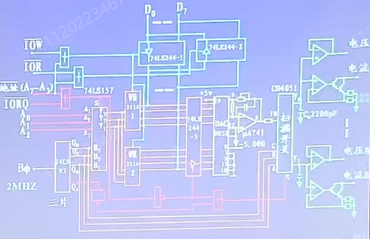

### 2.3 模拟量输入通道(ADC)

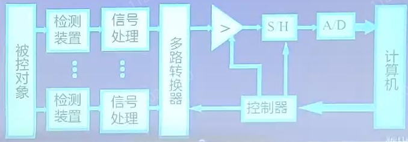

检测装置即传感器，信号处理将传感器输出信号转化为符合要求的电压信号；ADC 的成本相对较高，往往使用多个通道共用一个 ADC 的结构，因此需要多路转换器，运放对选择后的微小信号进行放大，S/H 为采样保持器，控制器用于控制采样保持器处于采样或是保持状态、控制运放的放大倍数，以及多路转换器的选通输出

#### AD 转换原理

- 计数比较型 ADC：运放作为比较器控制计数器不断循环累加，直到比较器输出电平变化，计数器停止计数。特点是转换时间不固定，根据转换值的大小变化。

  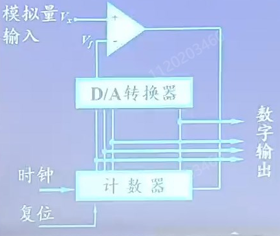

- 双斜率积分式 ADC：先由输入电压对电容进行固定时间的充电，再由恒定的基准电压对电容进行放电，放电时间即对应转换结果。特点是中等转换速率，分辨率较高，且由于转换实际上是得到的一个平均值，故抗干扰性强。

  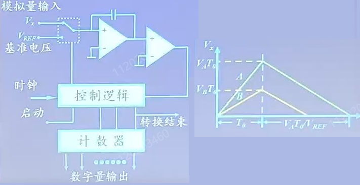

- 逐次逼近型 ADC：首先清除逐次逼近型寄存器，将最高位置 1，根据比较结果确定是否保留最高位的 1，后面的位重复这一过程直到完成转换(对分搜索)。特点是转换时间固定，中等转换速率，中等分辨率，由于始终在和输入模拟量进行比较，故需要保证输入的模拟量在转换过程中不变，这种形式的转换在实时控制系统中应用较多。

  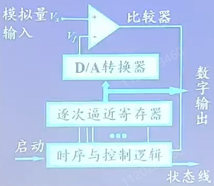

- 并行 ADC/快速 ADC：同样是逐次逼近，但同时完成所有位的转换==自学==

#### AD 技术参数

- 分辨率：基准电压与$$2^n$$的比值，表示引起输出从一个数码变化到下一个相邻数码的最小电压变化量
- 线性误差：实际转换曲线偏离理想曲线的大小，用 LSB 的分数表示。注意理想特性曲线是阶梯状的，且图中的曲线不从 0 开始，而是表示了四舍五入的过程。起始处称为零位误差，满量程时称为满度误差

  

- 转换时间：完成一次 AD 转换所需的时间，即从 CPU 向 AD 发出启动转换信号开始，到得到稳定的数字量输出为止
- 转换率：单位时间的转换次数
- 对电源变化的敏感度：DC 电源变化 1%时，对应于一个输出位的输入电压变化的百分比，例如电源灵敏度为$$0.05\% /1\%U_d$$，表示电源变化量为$$U_d$$的$$1\%$$时，相当于引入$$0.05\%$$的模拟输入量。显然，敏感度越小越好。
- 温度环境方面：失调温度系数、增益温度系数

#### ADC 芯片

按性能分为普通的、高精度的、高分辨率的、高速的、低功耗的、与母线兼容的等。按输出代码有效位数分为 4 位、6 位、8 位、10 位、12 位、14 位、16 位，以及 BCD 码输出的$$3\frac{1}{2}$$位、$$4\frac{1}{2}$$位 、$$5\frac{1}{2}$$位等(读作三位半)(所谓半位，是指没有用到完整的一个数码，如 0000 到 1999 表示为 0 0000 0000 0000 到 1 1001 1001 1001)

(注：BCD 码用二进制编码的十进制代码，用四个位元来储存一个十进制的数码，使二进制和十进制之间的转换得以快捷的进行，常见 BCD 编码有 8421BCD 码，2421BCD 码，余 3 码等)

常用的 ADC 有：

- 逐次逼近型：

  - 8 位单通道 ADC0801-ADC0805 型
  - 8 位 8 通道 ADC0808 / 0809 型
  - 8 位 16 通道 ADC0816 / 0817 型

  它们的转换时间均为 100μs

  混合集成的高速转换芯片有：

  - 12 位的 AD574A，转换时间为 25μs
  - 12 位的 ADC803，转换时间为 1.5μs
  - 16 位的 ADC71，ADC76，转换时间为 17μs

- 双积分型：转换结果大多以 BCD 码形式输出，转换时间一般大于 40-50ms，多用于仪表电路中

  - ICL7106 / 7107 / 7126 系列。位精度
  - MC14433，$$3\frac{1}{2}$$位精度
  - ICL7135，$$4\frac{1}{2}$$位精度
  - AD7550，AD7555 等，$$5\frac{1}{2}$$位精度

- 并行式：转换速度快
  - 8 位的 TDC1007J，转换速率为 20 兆次/s
  - 9 位的 TDC1019J，转换速率为 20 兆次/s
  - 6 位的 TDC1029J，转换速率为 100 兆次/s

ADC 选择原则：

1. 根据输入通道的总误差，确定 AD 转换器的位数：用户提供的数据采集精度要求是综合精度要求，应将综合精度在各个环节上进行分配，并注意 AD 转换器的精度应略高于其他环节所能达到的精度，据此确定 A/D 转换器的位数
2. 根据检测对象信号的变化率和转换精度要求，确定 AD 转换速率，以保证系统的实时性要求。比如双积分型的抗干扰和抗电源噪声能力强，精度高；但转换速度慢，常用于数字式仪表测量中。逐次逼近型的转换速率快，分辨率高，控制电路简单，应用最为广泛。全并行式等高速 ADC，适用于雷达、数字通讯等系统中
3. 根据环境条件选择 AD 转换器的一些环境参数要求，如工作温度，功耗，可靠性等级等
4. 根据计算机接口特征，考虑如何选择 AD 转换器的输出状态，如串行/并行、二进制码/BCD 码、与 TTL/CMOS 电路的兼容性、是否需要外部时钟、与微机接口是否易连接
5. 此外还需考虑成本、资源、是否为流行芯片等

#### ADC0809

单片 CMOS 器件，分辨率 8 位，转换时间由外部时钟芯片决定，内部不含时钟，线性误差$$\pm 1LSB$$(与之类似的 ADC0808 的线性误差为它的一半)，功耗 15mw，内部集成了 8 路输入模拟开关，28 脚双列直插封装，内置锁存器可直接与 8 位 CPU 接口，不需零点和满刻度调节，内部 ADC 为逐次逼近型

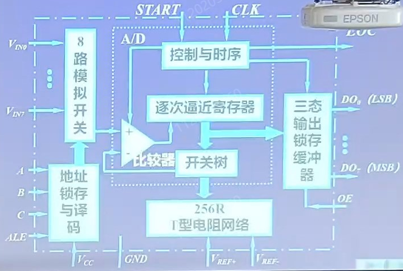

芯片内部左侧为多路转换开关，右侧为标准的逐次逼近型 ADC。CBA 三个信号用于选择 8 路模拟开关中的哪一路进入 ADC，ALE 为高电平有效的允许地址锁存信号，要求信号宽度 100-200ns，在上升沿锁存地址 CBA；CLK 为时钟脉冲输入端，标准输入时钟为 640kHz，此时转换时间为 100us(500kHz 则为 125us)；START 为高电平有效的启动信号，信号宽度为 100-200ns，上升沿清除逐次逼近寄存器(SAR)，下降沿启动 AD 转换(即对逐位的置 1 和比较)；EOC 信号为高电平有效的转换结束信号；OE 为高电平有效的允许输出信号，接到内部的三态输出锁存缓冲器；有 8 根输出数据信号线，$$V_{REF+}$$和$$V_{REF-}$$为相应的正负基准电源。，VCC 为工作电源；GND 为电源地。开关树和 256R 电阻梯形网络作为特殊形式的 DAC。第一个电阻为$$\frac{1}{2}R$$是为了舍入整量化。对于这种形式的 DAC，输出数据与位数有关，提高分辨率可有效减小输出误差。

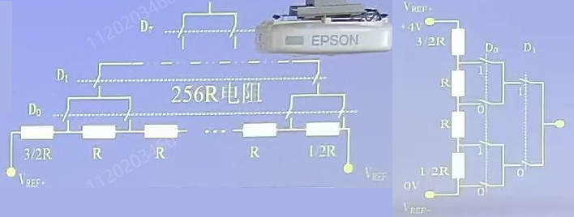

时序：START 启动信号和 ALE 锁存信号要求持续时间长于 100ns，通道地址需要先于启动和锁存信号早 25-50ns，且需要保持 25-50ns，否则锁存的是不准确的地址；引入输入模拟信号到比较器给出第一个比较结果有 1-2.5us 的延时(由模拟开关自身带来的)，同时 EOC 由高电平变为低电平。转换结束 EOC 由低变高后 OE 有效，打开输出锁存器，然后数据总线上出现有效的 AD 转换结果。

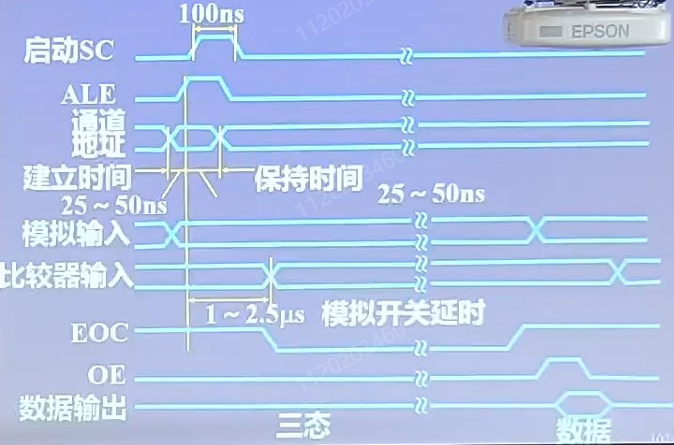

CPU 读取 AD 转换结果的方式有查询法、定时法、中断法，下面是查询法的子程序，其中上面蓝色为初始准备，黄色为启动转换，红色为查询转换，绿色为读取转换结果，末尾蓝色为一位转换结束后的处理。


定时法，定的就是 AD 转换的时间，在硬件上只需将红色部分去除即可，软件上将红色部分改为延时 100us(640kHz 标准时钟输入下)即可。中断法则是 AD 转换结束后，在中断服务子程序中读取 AD 转换结果，EOC 直接接入 CPU 的$$\overline{INTR}$$上(或类似于前面并行 IO 接口中的选通输入/输出方式中加上中断寄存器和屏蔽信号也可)。软件上第一次启动后，将绿色部分的读取转换结果和后面蓝色的后续处理放入中断服务子程序中，同时还要在中断服务子程序中启动下一次转换。直到转换结束，将 DX 重新赋值。

ADC0809 是单极性输入，为了检测双极性的模拟量，需要在 ADC 输入端接入辅助电路，信号源内阻较小时，使用左侧的无源网络即可，信号源内阻较大时，使用右侧的电压跟随器，无论使用哪种方式，注意两个偏移电阻的阻值要一致，一般用精密电阻。该方式使用的编码方式为偏移二进制码。

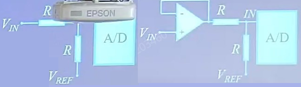

#### AD1674

12 位 ADC 芯片，是 AD574、AD674 的改进，引脚完全相同(28 脚)，内部增加了采样保持器和精密电源，功耗 385mw，线性误差$$\pm \frac{1}{2}LSB$$，调高转换速度至 10us，分辨率 12 位，封装形式多为 SOIC(菜采用 BiMOS 工艺)，少有 DIP，内部无多路转换开关，可实现单路单极性或双极性输入，可以直接与 8 位或 16 位 CPU 连接(12 位输出在内部分为了 8 和 4，可以通过设置配置成不同的输出模式)，供电电源为$$\pm 5V、\pm 12V、\pm 15V$$

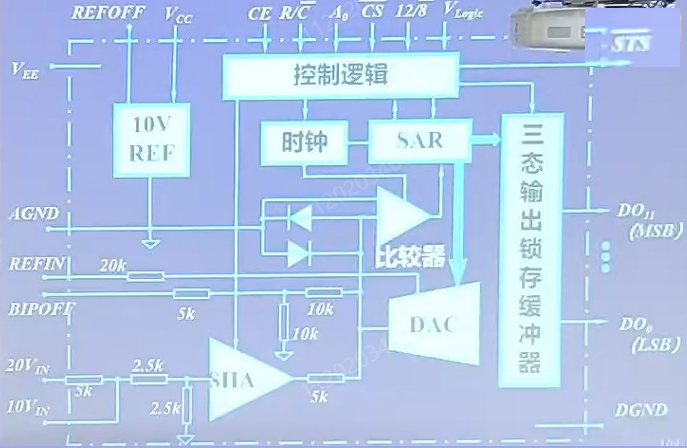

$$20V_{IN}$$(0-20V 或-10-10V)和$$10V_{IN}$$(0-10V 或-5-5V)为电源输入端，两者同时只能有一个有效；REFIN 和 REFOFF 为参考电源的输入输出；BIPOFF 为单极性/双极性的控制(双极性偏移端)；10V REF 模块为精密电源，精度为 0.01(百一)；VEE 为工作电源$$\pm 12V$$或$$\pm 15V$$，$$V_{Logic}$$为控制逻辑电源 5V，AGND 和 DGNGD 为数字地和模拟地，$$\overline{STS}$$为转换结束信号；CE 为片选使能，要求脉宽大于 210ns，$$\overline{CS}$$为低电平有效的片选信号，$$R/\overline{C}$$为读/转换信号，其选择与 AD1674 的工作方式有关，有全控制方式和独立控制方式，在全控制方式下，高电平为读取转换结果，低电平为启动转换过程；在独立控制方式下，在下降沿启动 AD 转换。$$12/\overline{8}$$为数据输出方式选择方式，高电平表示将 12 位数据一次性输出，低电平表示与$$A_0$$信号(字节信号，输入)配合，先输出 8 位再输出 4 位。且如果对分辨率要求不高，该芯片可以设置为 8 为 ADC，此时转换时间将比 10us 更短。 ADC 为逐次比较型，内部集成了 12 位高精度 DAC，含有逐次逼近寄存器(SAR)。芯片内部集成了采样保持器 SHA。

---

工作过程：启动信号，控制逻辑使采样保持器进入保持状态(因为接下来逐次逼近型 ADC 开始进行转换)，控制逻辑控制时钟，清除逐次逼近寄存器，转换周期开始(开始后不能中止或重新启动)，允许输出信号为无效电平；转换结束后，控制逻辑先把 SHA 置为采样状态，对 20V 或 10V 输入进行采样，同时使允许输出为有效电平，告诉 CPU 转换完成，同时打开三台输出锁存缓冲器，在数据总线上得到转换结果。


控制方式有全控制和独立控制两种，全控制方式需利用 AD1674 全部控制信号，独立控制方式主要用于专门输入端系统，不需要有全总线的接口能力

全控制方式中，各控制信号的组合

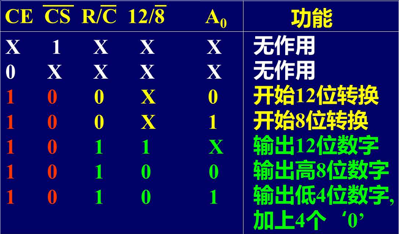

全控制方式的时序

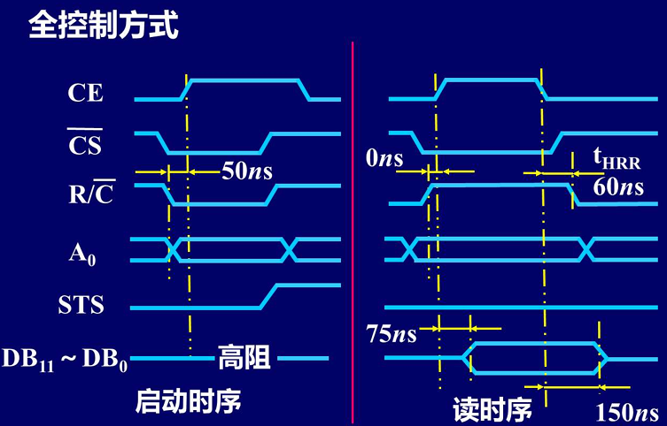

启动信号和使能信号从无效变为有效电平可启动转换，读/转换信号需在启动信号和使能信号从无效变为有效电平之前 50ns 前变为低电平，准备进入转换状态，否则一旦启动和使能变为有效，仍在读状态，可能引起总线征用，引起误操作。启动时序中数据线由于输出锁存，全部处于高阻状态。

读时序中，同样是读/转换信号需在启动信号和使能信号从无效变为有效电平之前变为低电平。注意进入读周期之后，数据出现在数据总线上的时间有 75ns 的滞后，另外当使能或片选信号失效后，数据还会在数据总线上保持 150ns。AD574、AD674 没有$$t_{HRR}$$

AD1674 与 8 位数据总线 CPU 的接口：读写信号经与非门连接到使能端，地址总线经译码器连接到片选端；另外，8 位输出方式时，1674 有两个地址，偶地址传送高八位，奇地址传送低四位到八位中的高位，低四位为 0，拼接后为低四位为 0 的 16 位数据，处理是需要移位去除低四位。D 触发器控制控制读/转换信号

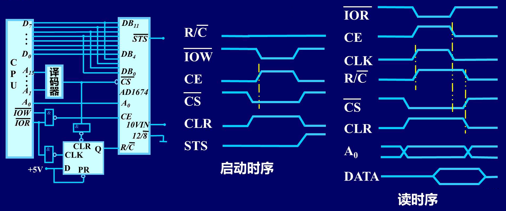

独立控制方式如下：

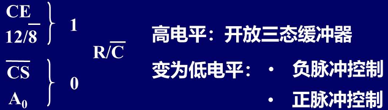

负脉冲控制和正脉冲控制的时序如下：


负脉冲控制中数据可用的时间为 800ns，四倍于正脉冲控制的 200ns，因此更加可靠和常用。

单极性和双极性输入：$$R_1$$用于零点调节，$$R_2$$用于满刻度调节，采用的编码方式为偏移二进制码(负的符号位为 0，正的符号位为 1)。这种实现双极性输入方式不会降低分辨率(1 个 LSB 代表的电压没变)。例如单极性时用 12 位表示 0-10V，双极性时用最高位表示符号位，用 11 位表示 0-5V 或-5V-0。


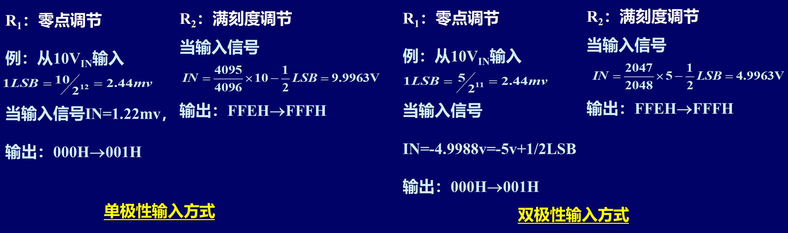

这种 ADC 的精度较高，因此抗干扰的措施是必须的：


#### 可编程数据放大器

==自学==

数据放大器是一种高性能放大器，要求很宽范围的放大倍教，很小的零点漂移，很高的输入阻抗，很强的抑制共模干扰的能力。可编程数据放大器即要求放大倍数可由计算机程序改变放大倍数。

两种分立元件构成的可编程放大器

- 用三个运放构成的 PA：广泛应用于小信号放大$$K = 1+\frac{2R_2}{R_{1i}}\quad(i = 0\sim7)$$

- 用采样保持器构成的 PA：$$K = 1+\frac{R_2}{R_1}$$

  $$R_1、R_2$$为采样保持器中的对应电阻

  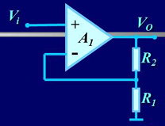

  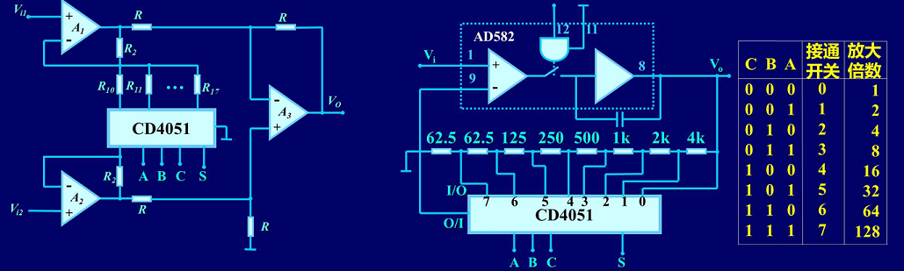

集成可编程序放大器 LH0086、LH0084


#### 轴角数字传感器

将 0-360° 的轴角量转换为数字量

1. 用回转电位计+ADC 可实现轴角数字转换，将机械转角转为模拟电压，再经 ADC 转换为数字量。给电位计和 ADC 使用同一个参考电压，就可以匹配电位计的最大转角和 ADC 量程，适用于测量精度不高的场合。分辨率：$$\delta=\frac{V_{REF}}{2^N}\times\frac{\theta_{MAX}}{V_{REF}}=\frac{\theta_{MAX}}{2^N} $$

   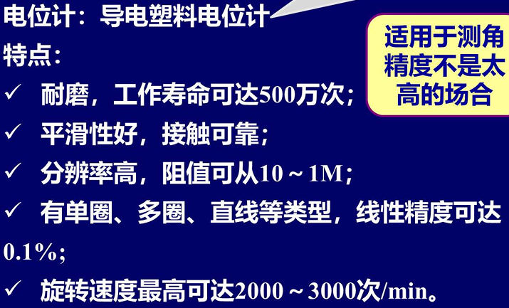

2. 码盘是专用的轴角数字传感器，有接触式码盘、光电码盘和电磁式码盘，应用最多的是光电码盘，也称光电角位移传感器

   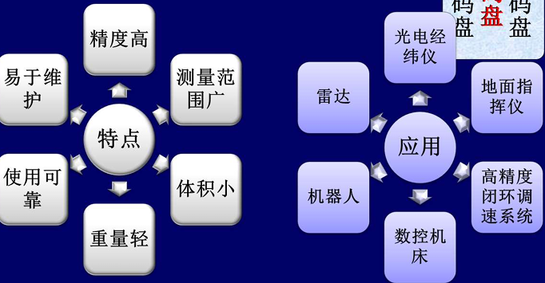

   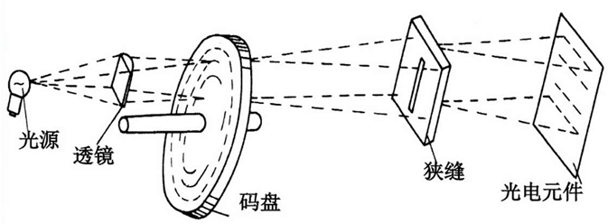

   根据码盘的刻度方法和信号输出形式分为增量式光电码盘和绝对值式光电码盘

   - 增量式光电码盘：码盘上分隔许多等间隔的间隙，优点是易于实现小型化，响应迅速，结构简单；缺点是掉电后容易造成数据损失，且有误差积累。有光通过时光敏二极管导通，输出低电平

     

     $$
     \begin{aligned}
     n_m=\frac{N_c}{n}\times\frac{60}{t_1}\quad
     \begin{cases}
     n_m:&\text{每分钟转数}\\
     N_c:&\text{在}t_1\text{时间内所测得的脉冲数}\\
     n:&\text{码盘上的缝隙数}\\
     t_1:&\text{测速时间}
     \end{cases}
     \end{aligned}
     $$

     这种码盘的分辨率取决于码盘每转产生的脉冲数和码盘安装位置相对于被检测轴角的减速比

     方向检测：码盘上会安装两对检测元件

     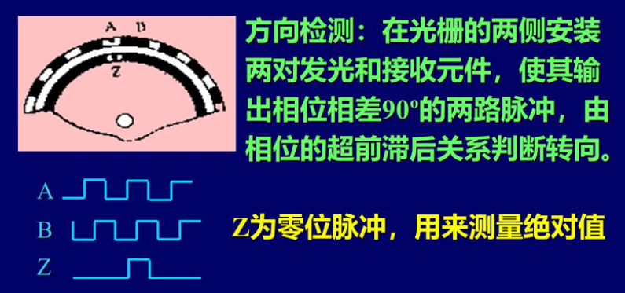

     增量式码盘适合远距离传输，用长线驱动电路 75113 将 AB 脉冲变成互补的$$A、\overline{A}、B、\overline{B}$$脉冲进行传输；码盘输出信号接受端用 75115 再将$$A、\overline{A}、B、\overline{B}$$转换为 AB 脉冲。使用互补脉冲的目的是方便使用异或门电路进行断线检测。另外，采用增量式码盘作位置检测可以附带获得速度信号。

     增量码盘在数控系统和机器人驱动系统中大量使用，原因是：

     - 测量精度高，理论上无限增加计数器的位数就可以得到无限的精度。对于角度检测还要求提高码盘到负载轴之间的传动比，总的前提是必须提高传动系统的传动精度，减小传动间隙。
     - 码盘直接安装在电动机轴上，是一种间接测量方案。传动系统的弹性变形，间隙等非线性因素被排除在系统闭环之外，闭环系统好调整，且机械结构设计简单。缺点是传动误差直接成为系统误差，在数控系统中常采用补偿的方法来提高精度。

   - 绝对值光电码盘：按二进制编码(对码盘安装精度要求较高，最严重的误差是，0000 由于安装偏差读成了 1111)或循环编码(解决 0000 和 1111 安装误差的问题，相邻数码之间只变化一位二进制位，也成为格雷码)刻制光栅，对应每一个转角能产生唯一的数码，有多少位输出就有多少个码道(图中内圈为高位外圈为低位)，尺寸比增量式码盘大；同时位数提高，内圈缝隙间隔将会变得非常密集，因此绝对式码盘位数一般不会太高，一般来说是 14-18 位，更高的位数可使用电子细分的方法或粗精结合(必须加以纠错)的方式实现

     格雷码和二进制码的转换关系：

     $$
     \begin{aligned}
     D_2D_1D_0为二进制码，&D_2'D_1'D_0'为循环码\\
     \begin{cases}
     D_2 = D_2'\\
     D_1 = D_2\oplus D_1'\\
     D_0 = D_1\oplus D_0'
     \end{cases}
     \end{aligned}
     $$

     绝对值光电码盘同增量式相比，优点有：具有固定零点，输出代码是轴角的单值函数；抗干扰能力强，掉电后再启动无需重新标定；无积累误差。缺点有：制造工艺复杂，不易实现小型化。

3. 感应同步器：电磁式位置检测元件，将直线位移或角位移转化为电信号

   

   1. 直线式：精度可达$$\pm 1.5\mu m$$，分辨率$$0.05\mu m$$，重复性$$0.2\mu m$$
   2. 旋转式：精度可达$$\pm 1''$$，分辨率$$0.05''$$，重复性$$0.1''$$

4. 自整角机(旋转变压器)-数字转换器(SDC，RDC)

   利用自整角机(旋转变压器)将轴角转变成三相调制电压(正交两相调制电压)，然后用 SDC(RDC)转换成数字量。自整角机(旋转变压器)是同服系统常用的测角元件，使用 SDC(RDC)对其数字化，是对原伺服系统进行数字化改造常用的方法。

### 2.4 数字量输入/输出通道

==自学==

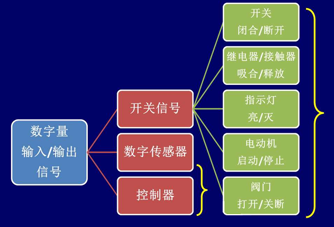

输入通道：结构、输入信号的调零？

输出通道：小功率、中功率、大功率驱动电路

## 第三章 系统总线

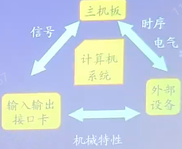

总线技术包括的内容有：通道控制功能、使用方法、仲裁方法、传输方式

### 3.1 总线的一般概念

总线就是连接两个以上数字系统元件的信息传输通路(元件之间，系统之间都可有)

#### 总线分类

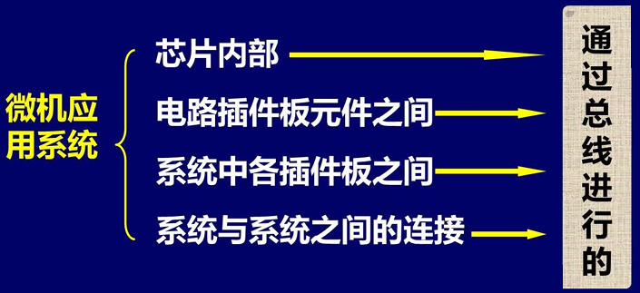


1. 片内总线：连接集成电路芯片内部各功能单元的信息通路。过去，这种总线的结构及设计都是由芯片研制部门及生产厂家来完成的，称为通用集成电路(CSIC)，微机应用系统的设计者需要理解芯片的外部特性以及在工程上如何正确地使用芯片。与 CSIC 相对应的称为专用集成电路技术(ASIC)，由微机应用系统设计者根据自己系统的要求，借助于 CAD 技术，设计出专用集成电路。这种专用集成电路保密性好，而且由于完全是根据用户要求进行设计的，使用方便。设计者必须很好地理解和使用片内总线，方可设计出自己的专用芯片。

2. 元件级总线：插件板内部总线，是系统设计者在构成系统时必须考虑的一级总线。

3. 内总线：插件板级总线，是电路板之间的连接，常简称为系统总线，用于构成微型计算机的各插件电路板的相互连接，是微型计算机的重要组成部分。如果采用的总线不合理，会大大降低微机系统的工作效率和可靠性，甚至无法满足用户的要求。

4. 外总线：

   - 通信总线，用于微型机系统与微型机系统、微型机构系统与其它仪器或设备的相互连接。有并行方式和串行方式，并行方式的总线标准有 IEEE488(GPIB)，为仪器仪表总线，可以方便构成自动化实验系统，一些仪器仪表都配有 IEEE488 接口，如数字示波器，数字电压表等。串行方式的总线标准有 RS-232C，用波特率表示速率，是微型机系统标准配置的外总线，其传输速率和传输距离有限。RS-485 为半双工，RS-422 为全双工。CAN 总线中使用的其实就是 485 结构。

   - 现场总线，起源于汽车控制系统，是将自动化最底层的现场控制器和现场智能仪表设备互连的实时控制通讯网络。大都采用 RS485 接口，用双绞线进行传输，波特率可达 1.2MHz，传输距离最远可达 1.2KM。各厂家有自己的通信协议，并且有各种现场控制模块：模拟量输入、模拟量输出，开关量输入、开关量输出等。

     用户选用所需模块和控制计算机之间用双绞线串接起来，方便构成微机控制系统一现场总线控制系统。现场控制模块可直接将安装于现场，采集各种传感器的信号并发送给控制计算机，控制计算机将控制输出通过现场总线送到控制输出模块直接控制对象。

#### 总线的特性和性能标准

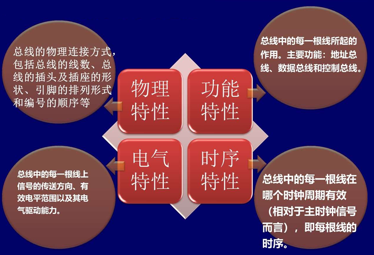

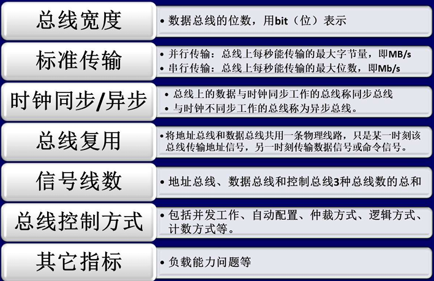

#### 总线标准

总线标准相当于提供了一个标准界面，一端是一个系统或系统，另一端是另一个系统或模块，主要作用是将两边解耦，一方在设计时参考标准即可，无需考虑另一端的接口形式。总线标准要包含：机械特性，电气特性，功能特性，时间特性，总线性能。

常用的总线标准：

1. ISA 总线(Industrial Standard Architecture)：
   - 采用独立于 CPU 的总线时钟，因此 CPU 可采用比总线频率更高的时钟，有利于 CPU 性能的提高
   - 没有支持总线仲裁的硬件逻辑，因此不支持多台主设备系统
   - ISA 上的所有数据的传送必须通过 CPU 或 DMA 接口来理，使 CPU 花费了大量时问来控制与外部设备交换数据。总体来说效率不高
   - ISA 总线时钟频率为 8MHz，最大传输速率为 16MB/s
2. EISA：扩展 ISA 总线，是在 ISA 基础上扩充开放的总线标准，与 ISA 完全兼容
   - 从 CPU 中分离出了总线控制权，是一种智能化的总线
   - 支持多总线主控和猝发方式的传传输
   - 总线的时钟频率为 8MHz，最大传输率可达 33MB/s，数据总线为 32 位，地址总线为 32 位，扩充 DMA 访问
3. VL-BUS
   - VESA (Video Electronic Standard Associatron 视频电子标准协会)提出的局部总线标准(在系统外，为两个以上模块提供的高速传输信息通道)
   - VL-BIS 是由 CPU 总线演化而来的，采用 CPU 的时钟频率达 33MHz，数据线为 32 位，配有局部控制器
   - 通过局部控制器的判断，将高速 IO 直接挂在 CPU 的总线上，实现 CPU 与高速外设之间的高速数据交换
4. PCI 总线(Peripheral Component Interconnect 外部设备互联总线)：由 Intel 公司提供的总线标准
   - 与 CPU 的时钟频率无关，自身采用 33MHz 总线时钟，数据线为 32 位，可扩到 64 位，数据传输率 132MB/s~246MB/s
   - 与 ISA、EISA 总线均兼容，可转换为标准的 ISA、EISA
   - 支持无限读写猝发方式，速度比直接使用 CPU 总线的局部总线快
   - 可视为 CPU 与外设间的一个中间层，通过 PCI 桥路(PCI 控制器)与 CPU 相连(因为 PCI 总线是一个局部总线)
   - PCI 控制器有多级缓冲，总线上的外设与 CPU 可并行工作
   - 为用户提供了真正的即插即用功能

#### 总线控制方式


#### 总线结构

- 单总线结构：结构简单，传送效率低

  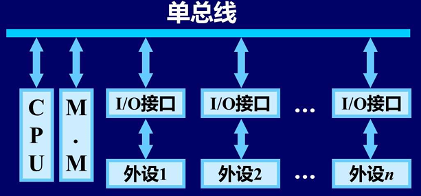

- 多总线结构：

  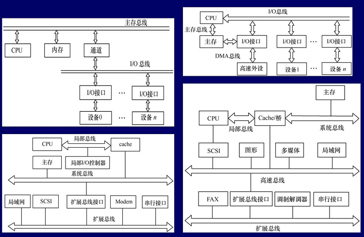

#### 标准化总线的优点

标准化、模块化、系列化

1. 简化了硬软件的设计

   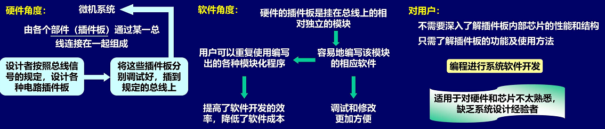

2. 简化了系统结构

   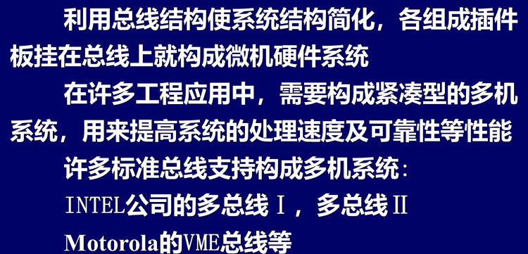

3. 系统易于扩展

   

4. 便于系统更新

5. 便于调试、便于维修

   

### 3.2 系统总线

### 3.3 PC 总线模板举例
