## 第一章 概述

微机硬件系统由主机和外设构成，主机包括处理器(包括算术逻辑单元 ALU、寄存器和控制单元)内存储器和外存储器、输入输出接口、总线；外设包括键鼠、显示器、硬盘、打印机等。软件系统包括系统软件和应用软件。微机运行的基本流程为，程序存储在存储器中，按程序流程自动连续取出指令并执行，给首地址即可；自动连续的实现是程序计数器 PC 的自增；步骤可概括为取指令、译码、执行。修改 PC 指针的值，可实现程序的顺序执行、跳转、循环、过程调用和中断服务等功能。在机器中使用的连同符号一起数码化的二进制数称为机器数，机器数对应的真正数值称为真值。8 位机器数表示的真值范围为 0-255，16 位真值表示的真值范围为 0-65535。

### 8086/8088 介绍

本文以 8086 和 8088 为例介绍微机系统，提到的 CPU 若无特殊说明均指 8086 或 8088，两者的指令系统完全相同，机器字长 16 位，对外地址总线 20 位，8086 数据总线 16 位，8088 数据总线在内部位 16 位，但只有 8 位对外引出；8086 有 6 个 IRQ(指令预取队列)，8088 有 4 个 IRQ。8086/8088 有最小模式和最大模式，最小模式仅有 8088 一个处理器，最大模式将 8088 作为主处理器，其它芯片作为协处理器。

以 8086 为例，其最小模式下的引脚如下

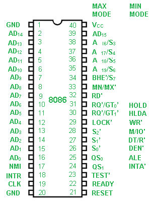

1. 数据线与地址信号
   - AD7-AD0：三态，ALE 有效时作位地址低八位；地址信号有效时为输出，传输数据时双向
   - A19/S6-A16/S3：三态，输出，分时复用
   - A15-A8：三态，输出
   - ALE：Address Latch Enable，允许地址锁存信号
2. 数据传送控制信号
   - $$\overline{RD}、\overline{WR}$$：读写信号，三态，输出
   - $$IO/\overline{M}$$：输入输出/存储器控制信号，三态(DMA 时高阻)
   - $$\overline{DEN}$$：数据允许信号，三态，输出，作总线收发器的控制信号
   - $$DT/\overline{R}$$：传输/接受控制，三态(DMA 时高阻)，输出，控制数据传输方向
3. 中断相关
   - NMI：不可屏蔽中断请求(不受 IF 标志位影响)，输入
   - INTR：可屏蔽中断请求(受 IF 标志位影响)，输入
   - $$\overline{INTA}$$：中断响应信号，输出
4. 总线相关
   - HOLD：总线请求，输入
   - HLDA：总线请求响应，输出(CPU 出让总线时此信号为有效电平，响应 HOLD 信号并使 AB、DB 以及相关控制信号线进入高阻状态)
5. 其它信号
   - $$MN/\overline{MX}$$：最小/最大模式控制信号，输入
   - CLK：时钟信号，输入；8086/8088 要求标准时钟频率 4.77MHz，占空比 33%
   - RESET：复位，输入，该信号无效时，CPU 从 FFFF0H 处开始执行程序
   - READY：检测存储器或外设是否准备好数据传输，用于慢速存储器或外设的配合
   - TEST：测试信号，输入，每当执行 WAIT 指令时，每隔 5 个时钟周期采样 TEST 信号，直到变为低电平后才继续执行下一条指令

8086/8088 在最小模式下的最小系统包含 CPU、8284 时钟发生器、8282 锁存器三片、8286 双向总线驱动器

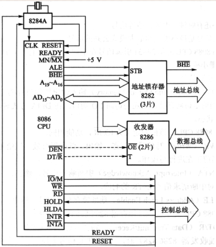

## 第二章 微处理器

CPU 的字长/位数，指的是机器一次性能处理的位数；主频指的是 CPU 时钟频率。指令系统/指令集是 CPU 所有指令及其使用规则的集合，按架构可将 CPU 分为 CISC 和 RISC(复杂/精简指令集)两类，两者的典型代表分别为 x86 和 ARM 架构；8086 为 x86 架构。

### 寄存器

8086/8088 内的寄存器为 16 位寄存器，分为三类

- 通用寄存器 8 个：AX(累加器)、BX(基址寄存器，常与 DS、ES 搭配用于寻址数据段)、CX(计数器)、DX(数据寄存器)、SP(堆栈指针，存栈顶的偏移地址)、BP(基址寄存器，一般与 SS 搭配寻址堆栈段，存内存偏移地址)、SI(源变址寄存器，存原操作数偏移地址)、DI(目标变址寄存器，存目标操作数偏移地址)
- 段寄存器 4 个(存放逻辑段的段基地址)：CS(代码段)、DS(数据段)、ES(数据段中的附加段)、SS(堆栈段，用于存返回地址，保存寄存器内容，传递参数)；其中 CS 指向的地址(即代码段)在 ROM 中，另外三个都在 RAM 中
- 控制寄存器 2 个：IP(PC 指针寄存器/指令指针寄存器，存下一条要执行指令的偏移地址)、FLAGS(状态标志寄存器，存运算结果，包括 6 个状态标志位和 3 个控制标志位)

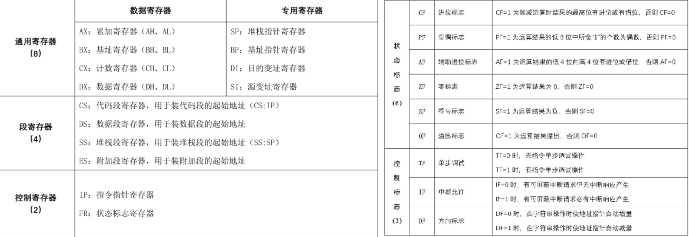

### 时钟周期

每两个相邻脉冲上升沿或下降沿之间的时间间隔称为时钟周期，为主频的倒数；BIU 与存储器或 IO 端口进行一次读操作或写操作所需的时间称为总线周期/机器周期；执行一条指令所需的时间称为指令周期。一个指令周期包含多个总线周期；一个基本的总线周期由四个时钟周期构成，若内存或 IO 接口速度较慢，则还会在 T3 后插入 Tw 等待周期。

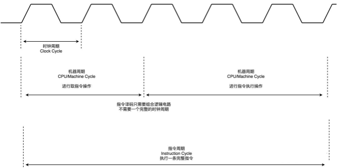

### 堆栈

RAM 中一个 LIFO 区域称为栈，压栈和退栈操作以字为单位；SS:SP 构成堆栈指针，堆栈存放返回地址、过程参数和需要保护的数据；常用于响应中断或子程序调用；8086 采用小端模式，即高字节放高地址，低字节放低地址。

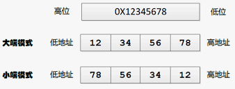

### 总线接口单元

CPU 可粗略分为执行单元 EU 和总线接口单元 BIU。BIU 的功能是，从内存中取指令并送入指令预取队列 IRQ，负责与内存或 IO 接口之间的数据传送，具有流水线技术。BIU 不断从存储器取指令送入 IPQ，EU 不断从 IPQ 取指令执行，构成两工位流水线。新型 CPU 将一条指令划分成更多阶段以执行更多的指令，并建立多条流水线同时运行。这种并行工作的方式变相提高了 CPU 的速度，降低了对存储器存取速度的要求。

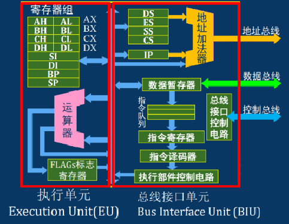

### 总线

总线是 CPU 内部一组信号线的集合，可以同时挂接多个设备，主设备通过总线进行数据传输，从设备按主设备要求进行工作或接收数据；任何时刻指允许一堆主从设备进行操作。多挂载设备总线操作的步骤大致分为：设备发出请求、进行仲裁、寻址、数据传送、结束并出让总线控制权。总线应具备的基本功能包括传输同步、仲裁控制、错误处理、总线驱动。传输同步方式有同步定时、异步传输和半同步；仲裁有链式查询、独立请求和计数器查询等方式。

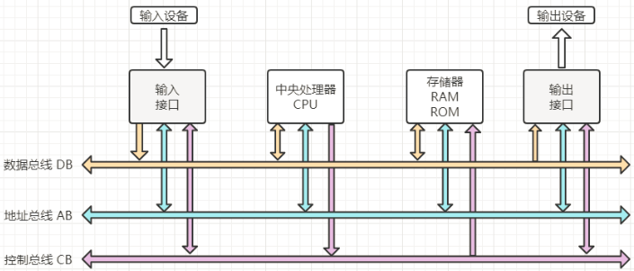

总线按信号类型分为数据总线(双向)、地址总线(单向)和控制总线(双向)；按层次结构分为前端总线/CPU 总线(CPU 与存储器、IO、控制芯片组之间的信息传输)、系统总线/IO 通道总线(主要表现为扩展插槽，如 PCI 总线、ISA 总线等)、外设总线(与外设接口的总线，如 USB、SATA、RS485 等)，其中系统总线和外设总线有统一标准。总线使得硬件设计模块化、标准化、系列化、简单化、规模化。总线的性能指标有带宽 BW(每秒传输的字节数)、位宽(同时传输的数据位数)、工作频率。总线结构有单总线和多总线。现代 PC 机都是多总线结构，主板上使用北桥芯片和南桥芯片两个超大规模芯片组，北桥芯片用于与 CPU、内存和 AGP 视频接口交互，还起着存储器控制作用，传输速率高；Intel 把该芯片标号为 MCH(Memory Controller Hub)芯片。南桥芯片用于管理低中速的组件，如 PCI 总线、IDE 硬盘接口、USB 端口等，因此南桥芯片的名称为 ICH(I/O Controller Hub)。

常用的系统总线标准包括：ISA 总线、PCI 总线、PCIE 总线、AGP 总线

常用的外设总线标准包括：SATA 总线、USB 总线、RS485 总线、IDE 总线

## 第三章 存储器系统

### 存储器寻址

狭义的存储器指 20 根地址总线可寻址访问的内存空间，在 CPU 之外，不包括 CPU 和 IO 中的寄存器，这里存储的概念均取狭义。CPU 送到地址总线的 20 位地址称为物理地址，存储器的操作完全基于物理地址。为了用 16 位寄存器产生 20 位的地址，将内存进行分段，每段最大 64kb，段内可由 16 位寄存器进行寻址(寻址即寻找操作数的地址)。每个存储单元的地址可用段基址和距离改段基址的偏移量来表示，共同构成逻辑地址，用两个 16 位寄存器表示。物理地址=段基址左移四位+偏移量，一个物理地址可对应多个逻辑地址。

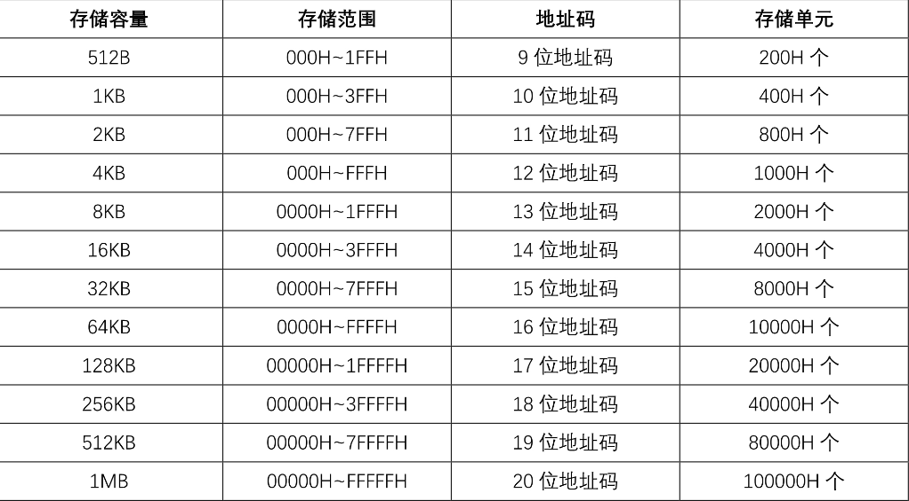

RAM 和 ROM 为内存，以地址来编号存储单元，每个 IO 接口有唯一地址，每一存储单元存放一个字节。存储容量指存储单元的数量，而内存空间/存储空间/寻址范围与地址总线宽度有关，地址总线的宽度决定了 CPU 能直接访问的内存单元的数量。

### 译码电路

微机系统中的存储器设计主要考虑与总线的连接、在整个存储空间中的位置，以及如何编程使用。多片存储器芯片可通过译码器辅助寻址实现片选。地址译码方式可分为全地址译码和部分地址译码两种方式，全地址译码即使 CPU 所有地址线，高位译码作为片选信号，低位译码直连；部分地址译码即仅高位地址参与译码，地址重复严重，占用地址范围多，适用于芯片较少的应用场景。存储器芯片与总线连接时，由地址线和译码电路分配地址。

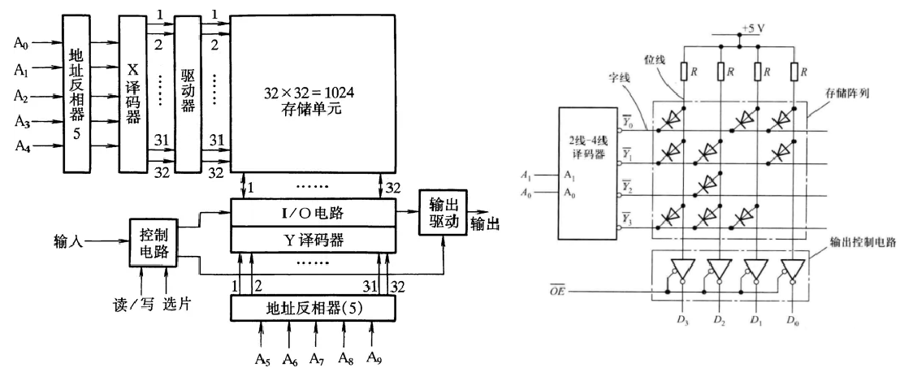

存储器芯片内部的存储矩阵有字节结构和位结构两种，字节结构即每个存储单元存放一个字节，每个字节 8 位，用 N$$\times$$8 来描述；位结构即每个存储单元放一个或几个位，用 N$$\times$$位数来描述。存储器的扩展方式有位扩展和字扩展两种，当存储芯片的字长小于需要时进行位扩展，即增加数据线数量，提高访问速度；当存储芯片容量小于需要时进行字扩展，即提升存储容量。

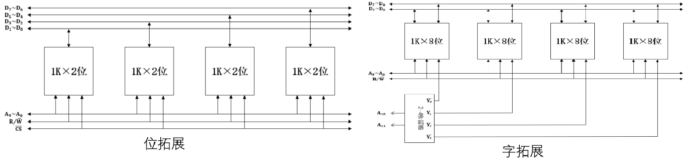

### 应用

双极型晶体管 BJT 工艺制作的 RAM 速度快价格高功耗大，一般用作高速缓存 Cache；半导体场效应管 MOSFET 工艺制作的 RAM 反之，一般用作 SRAM 和 DRAM，其中 SRAM 由双稳态触发器 FF 构成，不需要定时充电刷新；DRAM 用电容存储信息，需要定时充电刷新，集成度高，可用作内存条。ROM 分 ROM(掩膜只读存储器)、PROM、EPROM、EEPROM，目前市面上都是 EEPROM；闪存可认为是一种特殊的 EEPROM，可读取、写入和擦除。现代单片机中，狭义的 ROM 即指 bootloader 区域，程序被下载到 Flash 中，运行中的指令放入 RAM 中。

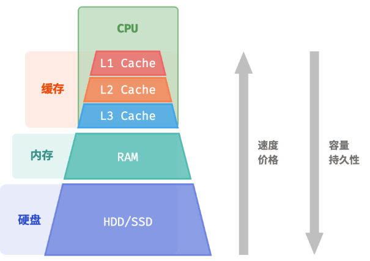

缓存 Cache 是 CPU 与主存之间的高速小容量存储器，用于提高 CPU 的工作效率，其工作原理是数据访问的局部性原理，即在较短的时间间隔内，CPU 访问的内存地址往往集中在存储器很小的范围内。将这部分内存批量读取到缓存中，CPU 需要时先在缓存中找，找到称为命中，未找到则更新缓存以提高命中率。命中率与缓存容量、使用的算法和运行的程序特点都有关。如今主流的计算机使用多级缓存结构，同样也是为了提高缓存的命中率。

将两个及以上的速度、容量和价格各不相同的存储器组成一个存储器系统，从程序员角度看，这个系统的速度、容量和价格都接近最好的那个。现代微机中有两种存储器系统，一种是由 Cache 和主存构成的缓存存储系统，优点是速度快；另一种是由磁盘和主存构成的虚拟存储系统，优点是容量大，实际使用中结合两者优势。

## 第四章 中断技术

中断是由于某种随机事件引起 CPU 暂时中断主程序，转去处理中断服务子程序，处理完后返回的机制；是为了避免 CPU 不断检测外设状态，提高 CPU 利用率，同时实现对特殊任务的实时响应而引入的。这个随机事件称为中断源，其出现时间随机，分为外部中断源和内部中断源；外部中断源由 CPU 以外的设备引起，包括可屏蔽中断(受 IF 标志位影响)和不可屏蔽中断(不受 IF 标志位影响，上升沿响应)；内部中断和外部中断的机理相同，只是请求和响应的优先级有差别。常见的引起中断的原因有外设请求输入输出、报告故障、硬件故障、访问非法内存、定时器溢出等等。

### 中断流程

中断的流程包括中断请求、中断判优、中断响应、中断处理和中断返回五个步骤。

- 中断请求：中断源发处 INTR 或 NMI 信号给 CPU，有边沿请求和电平请求两种，注意中断信号应保持直到中断被处理为止，且中断得到响应后需及时撤销中断请求信号。

- 中断判优：又称仲裁，若中断同时产生则按照优先级处理，同级则先来先处理；若中断非同时产生则高优先级中断可以打断低优先级中断，即允许中断嵌套。优先级控制方法包括软件判优和硬件判优，软件判优即结合硬件电路由软件查询顺序决定优先顺序，硬件判优可由菊花链逻辑电路进行链式判优或由专门的中断控制器判优，除此之外也可按照距离处理器的距离进行判优。

- 中断响应：CPU 会在每条指令的最后一个时钟周期检测 INTR 和 NMI，若同时满足以下条件

  - 当前指令执行完
  - 当前无 RESET 或 HOLD 信号
  - NMI 优先级高于 INTR，INTR 信号还需要 IF=1(即未屏蔽可屏蔽中断)

  则 CPU 响应中断，响应过程中 CPU 需要完成以下工作

  - 向中断源外设发出$$\overline{INTA}$$信号，表示中断已经得到响应
  - 断点保护，即 CS、IP、FLAGS 寄存器入栈
  - 获得中断服务程序首地址，8086/8088 采用中断向量法获得首地址

- 中断处理：中断过程为远过程，即 CS、IP 寄存器中的内容都会更改。中断处理过程中 CPU 需要完成以下工作

  - 将需要保护的数据入栈
  - 打开可屏蔽中断，以允许中断嵌套
  - 进行相关处理
  - 关闭中断(可见进入中断服务子程序默认会关闭中断)

- 中断返回：CPU 需要完成以下工作

  - 将栈中的被保护数据、CS、IP、FLAGS 寄存器值出栈，恢复现场
  - 调用 IRET 返回主程序

### 8086/8088 中断系统

8086/8088 用中断类型码来识别不同中断源，用中断向量表来存储中断向量，即中断服务程序的入口地址。类型码乘 4 即为中断向量，新的 CS : IP 为 4n+3, 4n+2 : 4n+1, 4n。

中断源分为内部中断源和外部中断源，内部中断源包括除法溢出中断 INT 0、单步中断 INT 1、断点中断 INT 3、溢出中断 INTO、软件中断 INT n(中断类型码 n 由指令提供)；外部中断包括不可屏蔽中断 INT 2 和可屏蔽中断 INT m(中断类型码 m 由外设提供)。中断优先级为除单步中断外的内部中断 > 不可屏蔽中断 > 可屏蔽中断 > 单步中断。中断类型码。

## 第五章 输入输出系统

输入即将数据从外设传输到总线上传入 CPU，输出即将 CPU 传到总线上的数据传输到外设中。输入输出系统需要解决：速度匹配 CPU、信号电平和驱动能力、信号形式匹配(模拟/数字)、信号格式(串行/并行)、时需配合等问题，因此需要具备 IO 地址译码和设备选择、信息输入输出、命令/数据/状态的缓冲和锁存、信号的各种转换等功能。

### 电路实现

接口电路包含译码电路和相应的数据/命令/状态寄存器，数据输入接口要求具有三态输出能力，总线上的数据不一定是外设需要的，如果没有三态能力控制外设与总线暂时隔离，则外设会收到无效数据。外设若有数据保持能力可用三态门实现，反之则需要用三态锁存器实现。数据输出接口要求具有数据锁存能力，否则在数据未被外设接收到的时刻，总线上的数据一旦改变就会造成数据丢失，一般用锁存器实现。

### IO 编址方式

IO 的编址方式有统一编址和独立编址两种方式。统一编址即外设端口和存储器统一分配地址，但内存可用地址减少；独立编址即外设和内存地址独立，内存编址不受外设影响，但需要专用的 IO 指令，指令功能较少。8086/8088 使用独立编址方式。

### 传输方式

基本的输入输出方式，即主机与外设之间数据传送的控制方式有无条件传送、查询式传送、中断式传送和 DMA 传送四种。无条件传送往往只用于不需要数据准备的外设，软硬件结构简单；查询式传送用于对传送速率要求不高的场合，CPU 与外设交换数据前需要进行查询确认，软件设计简单。外设需要提供设备状态，接口需要提供状态端口。CPU 效率低，速度慢，实时性差。中断式传送只在需要进行数据传送时才中断 CPU 正在进行的工作，CPU 效率高，实时性好，程序相对复杂。前三种方式均需要 CPU 介入，程序的执行限定了传送的最大速度，IO 操作相对较慢。而 DMA 传送则无需 CPU 介入，CPU 暂时出让总线控制权，由专门的 DMA 控制器 DMAC 接管，用于高速大批量数据采集系统。

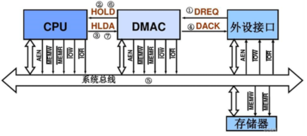

### 接口分类

输入输出接口有多种分类方式，按功能分为输入接口和输出接口，按传送信息的类型分为数字量 IO 和模拟量 IO，按传送方式可分为单向接口和双向接口，按传送方式分为并行接口和串行接口。并行以字节或字为单位，多位同时传输，速率快效率高，传输距离短，一般用于单台设备内部，各线路之间存在耦合干扰。并发是一种特殊的并行，是单个处理器下逻辑同步运行的结果。串行即每个时间单位只传一位数据，各位依次传送，传输线路少，传输距离长，速率相对慢，成本较低。

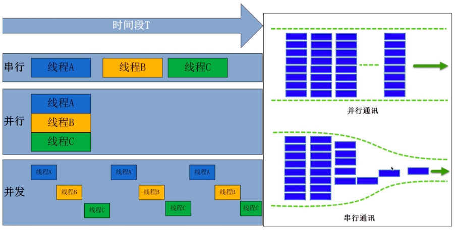

### 串行通信相关机制

串行方式又可分为单工(只能单向传输)、半双工(可发送或接收，但不能同时进行)、全双工(可同时发送和接收)。串行还需要一个时钟信号作为定时参考，分为同步方式和异步方式。同步方式即用同步字符完成同步，而异步模式的一帧字符用起始位和停止位完成同步。

所有串行方式都需要进行数据校验，以解决信号的干扰、衰减以及信号畸变的问题。常见的数据校验的方法有奇偶校验、CRC 校验等。奇偶校验以字节为单位，规定字节中 1 的个数为奇数个或偶数个，可以查出奇数个的错误，不能定位错误位置且不能自动纠错，发现错误则重新传输。CRC 校验以数据块或祯为单位，思想是将数据看作多项式，产生校验码并和数据部分拼接一起传输。常用的串行通信接口标准包括 USB、RS232 和 RS485 等。

## 第六章 8086/8088 系统常用芯片

常见芯片列举如下，每个芯片的具体使用方式、控制字等查阅芯片手册便知，不再赘述。

- 8282、8283、74LS273、74LS373、74LS374：八位锁存器，内部为八位 D 触发器
- 8286、74LS244、74LS245：八位缓冲器/总线驱动器，可控制传输方向
- 8284A：时钟发生器
- 6232、6264：分别为 4k$$\times$$8bit 和 8k$$\times$$8bit 的 SRAM
- 2116、2164：分别为 16k$$\times$$1bit 和 64k$$\times$$1bit 的 DRAM
- 8087：数值运算协处理器
- 8089：输入输出协处理器
- 8237：DMA 控制器
- 8259A：可编程中断控制器
- 8253：可编程定时器/计数器
- 8255：可编程并行接口
- 8250：可编程串行接口

## 第七章 8086/8088 指令系统

### 寻址方式

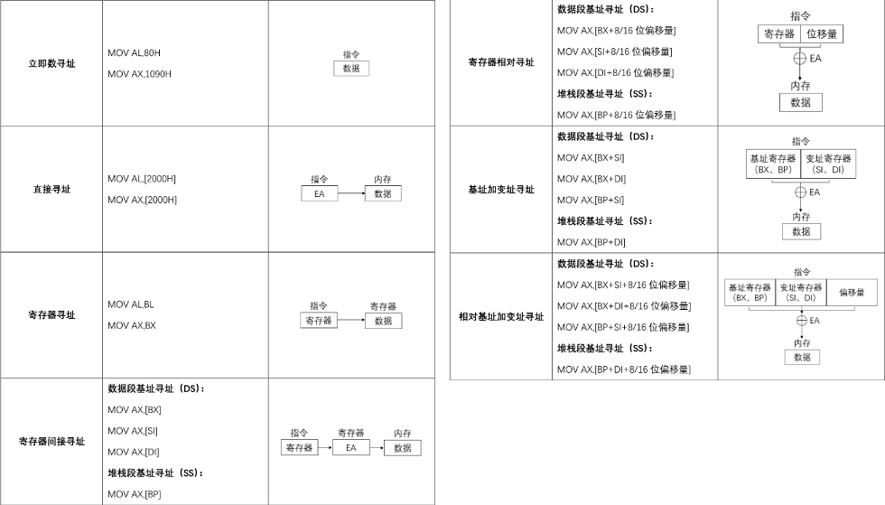

### 指令分类

- 传送类指令

  

- 操作类指令

  - 算术运算

    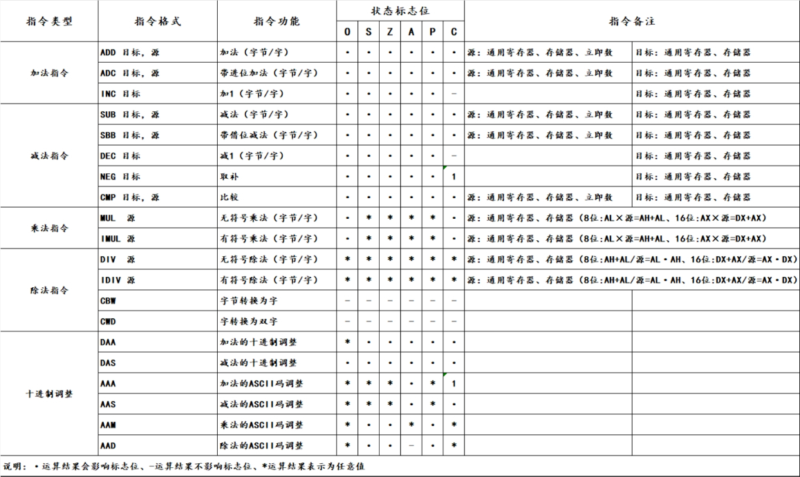

  - 逻辑运算

    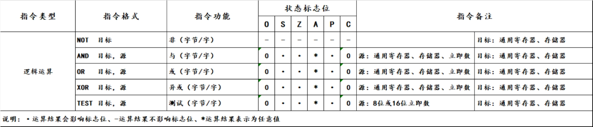

  - 移位运算

    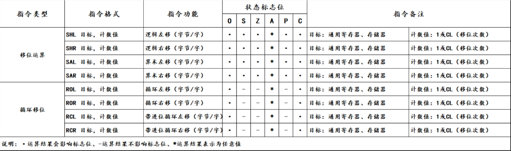

  - 串操作

    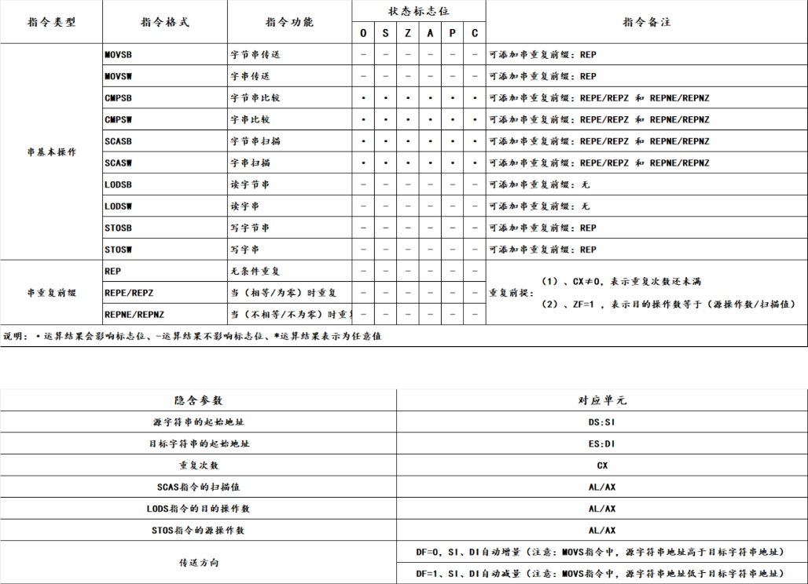

- 控制类指令

  - 处理机控制

    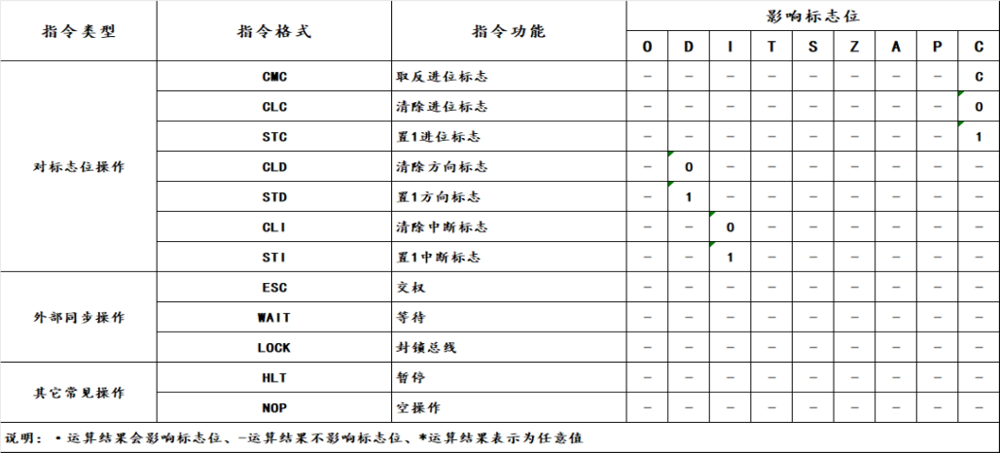

  - 程序转移

    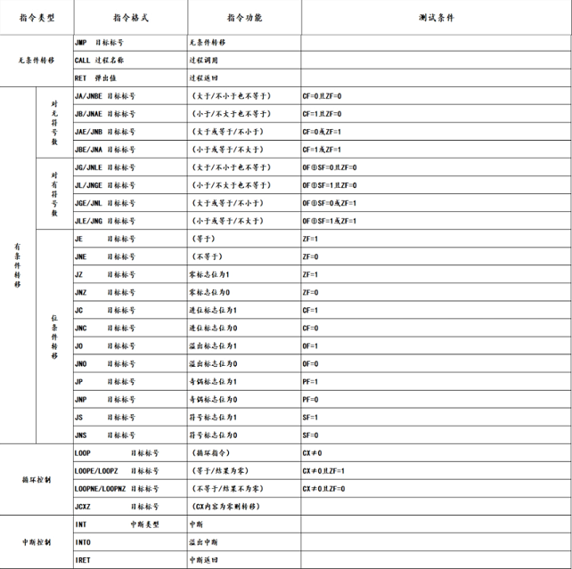

## 第八章 汇编语言扫盲

### 常量、变量和标号

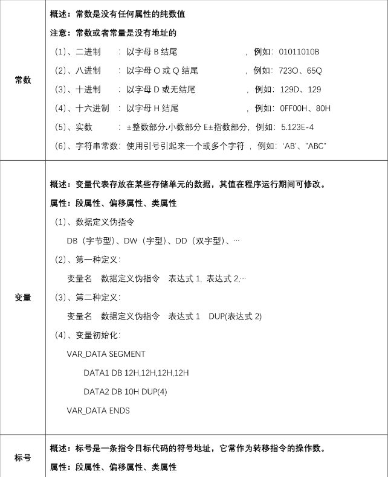

### 表达式

由操作数和运算符构成，运算符如下

- 算数运算符

  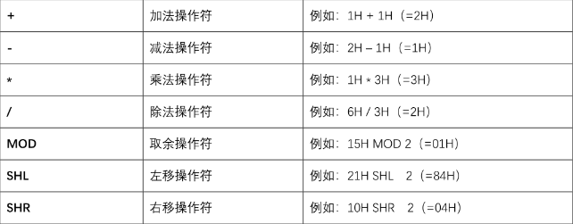

- 逻辑运算符

  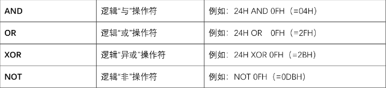

- 关系运算符

  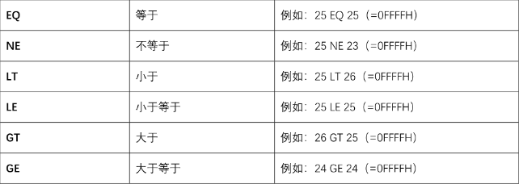

- 分析运算符

  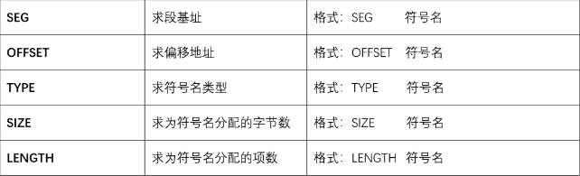

- 组合运算符

  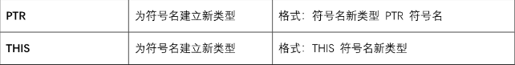

- 分离运算符

  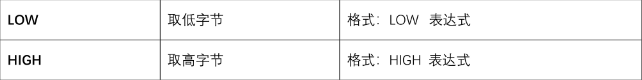

运算符优先级

### 伪指令

格式：[标号名] 伪指令 操作数 [注释]

- 符号定义伪指令

  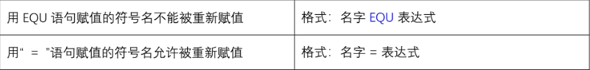

- 数据定义伪指令

  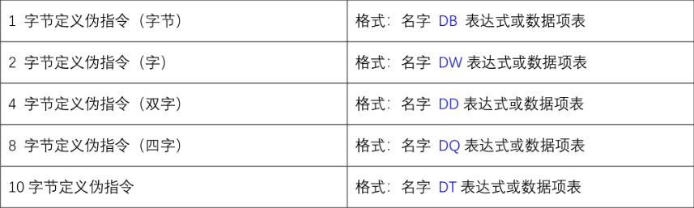

- 过程定义伪指令

  

- 段定义伪指令

  

- 段说明伪指令

  

- 定位伪指令

  

### 系统功能调用

### 汇编语言程序框架

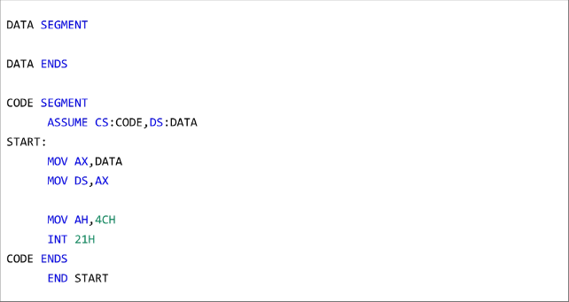

三种基本结构是顺序结构、分支结构和循环结构。
