## 概述

常见的小型飞行器主要分为固定翼飞行器、单旋翼直升机和多旋翼飞行器三类。固定翼飞行器的升力由机体线速度产生，不能垂直升降，结构简单，续航较长。旋翼飞行器的升力直接由螺旋桨提供，可以垂直升降；直升机通过总距操纵改变所有桨叶的几何迎角，控制直升机的垂直升降；通过周期变距操纵周期性改变各桨叶的迎角，产生不对称升力，控制直升机的前后左右倾斜和水平飞行方向。多旋翼飞行器结构对称，螺旋桨之间的反扭距可以相互抵消，通过多个螺旋桨产生拉力和三轴力矩(yaw/pitch/roll)。穿越机是轴距 330mm 以下的四旋翼的统称。

DIY 一架多旋翼飞行器涉及的工程技术包括：地面站或遥控器与飞行器远距离通信、机载嵌入式处理器设计、实时操作系统的软件运行环境和接口提供、飞行控制算法、飞行器结构设计、多传感器数据融合和状态估计等。

## 硬件部件详解

多旋翼飞行器的硬件组成包括自驾仪系统(自驾仪、GPS 接收机)、动力系统(电机、电调、电池、螺旋桨)、遥控系统(遥控器、接收机)、机架系统(机身、机臂、起落架)。其中，电机电调电池、遥控器和接收机，在 RC 遥控车中也是核心部件，在原理、参数和选型上相通。

旋翼飞行器的机械结构设计相对简单，一块或数块碳板+铝柱+起落架就可以组成机架，也可以根据轴距参数买合适的现成机架，注意有的机架上配有焊盘或 xt 头等电气接口，根据需要选用即可。这里贴出高飞老师的超轻无人机作为一种结构参考。

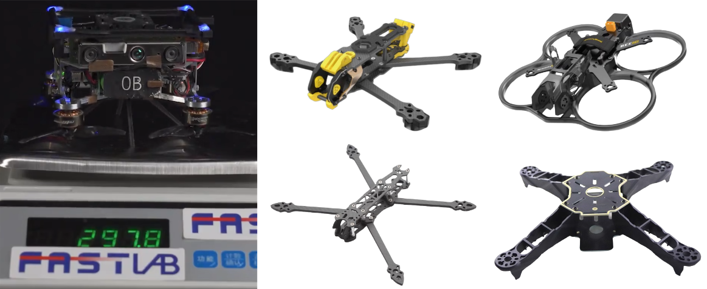

### 飞控/自驾仪

飞控即飞行控制器，硬件上就是一块嵌入式板卡，烧入写好的固件程序之后，负责运行飞控算法，根据飞行器位姿信息和遥控给定的控制量得出每个电机的期望转速，并输出电机推力的控制信号。固件是写入硬件设备非易失性存储器(如 Flash)中的底层软件，介于硬件和上层软件之间，负责直接控制硬件行为。飞控算法包括从传感器数据采集、姿态估计、导航到控制输出的整套模块。

由于对实时性要求高，飞控上一般会运行 RTOS(实时操作系统)，如著名的开源飞控软件 PX4 就运行在轻量级 RTOS Nuttx 上。飞控和四合一电调用减震柱叠起来称为飞塔，也有的将两者集成在一块 PCB 上称为 aio(all in one)。科研无人机除飞控外，还会配备机载电脑作为算力平台，可提供诸如物体规避和碰撞预防等高级功能。两个系统通过快速串行或 IP 链路连接，通常使用 MAVLink 协议进行通信。

飞控板卡一般内置 IMU、气压计、磁罗盘(分别用于获得加速度、高度和朝向信息)，有 I2C、UART、CAN、GPS 等接口。电机的配套电调(esc)连接到 PWM 输出；外置传感器(GPS，指南针，距离传感器，气压计，光流计，气压计等)通过 I2C, SPI, CAN, UART 等连接接。有的飞控处理器分 FMU (飞行管理单元)处理器和 IO 处理器，前者为高性能处理器，专用于运行实时飞控算法，相应的 PWM 信号输出专用于控制核心动力系统或高精度执行器；后者为处理传感器输入和 PWM 输出的协处理器，相应的 PWM 输出用于控制舵机等非核心设备。大多二次开发的飞控系统，都是基于一个成熟的飞控，然后添加不同的传感器，并提供一个标准的控制接口。

飞控的关键参数和接口包括：

- MCU 看主频和接口资源，主流的主控芯片包括 STM 系列的 F411(小尺寸飞机用，逐渐淘汰)、F405、F722、H745 或更高。也有国产的 AT32 系列，如重山航空的飞控。
- Uart 为串口数量，有多少串口就可以外接多少设备。
- Gyro 为陀螺仪型号，最经典的是 MPU6000(已停产)，目前主流为 BM270 和 42688。
- Receiver 为飞控支持的接收机协议。
- ESC signal 为支持的电调数量，即最多能控制多少电机。
- Input 为支持的最大电池电压。
- software 为飞控支持的固件。

其它辅助参数和接口还有：

- BEC 为降压模块。
- OSD 为处理画面参数用的芯片型号。
- 黑匣子用于存储飞机的各种参数，主要是存储飞行日志便于调试。
- BF LED 为传统的通过地面站设置 LED。
- wifi 是指支持无线调参还是必须使用 usb 线。
- VTX switch 是用遥控器关闭图传。
- TVS Protection 为防浪涌保护。
- Mounting 为安装孔位。
- VCC 焊盘是未经过 BEC 降压的原始电压。

### 遥控器和接收机

遥控系统将摇杆控制量发送给接收机，接收机处理后根据协议再发送给飞控。遥控器和接收机的通信使用无线传输技术，主流频段为 2.4GHz ISM。ISM 频段(Industrial, Scientific and Medical Band)是国际电信联盟(ITU)划分的免费开放频段。此外也有 72MHz 的工作频段，2.4GHz 的遥控距离更远、抗干扰能力更强，但绕射能力较差；72MHz 反之。

专用的模型(航模车模船模)遥控器有多个通道，通道是独立控制信号的传输路径，每个通道对应飞行器的一个可控维度(如油门、方向、姿态等)，简称几通。基本的控制通道包括油门(控制飞机垂直升降)、升降(俯仰)、方向(偏航)、副翼(横滚)，其余为自定义通道，可用于控制灯光、拉烟器、起落架等部件。

接收机通过单条总线输出所有通道对应的 PWM 信号，脉宽一般在 1000us-2000us，可用于直接控制舵机、电调或输入飞控的 PWM 接口。接收机和飞控之间的通信协议常见有 PPM、SBUS 等。PPM 为脉冲位置调制，原理为将多个通道的控制信号编码为单一串行脉冲信号，每个脉冲的间隔对应不同通道的数值。PPM 结构简单成本低、抗干扰性较差，支持通道数一般小于 10。SBUS 为智能总线协议，基于 UART 将多通道信号编码为数字数据流，通过差分信号传输。SBUS 支持双向通信、有纠错机制、抗干扰性强、通道数灵活，适合长距离高干扰环境。其它的常见协议还有 CRSF、TBS、DSM、IBUS 等。

目前主流的专用遥控器品牌有天地飞、乐迪、RadioMaster 等。遥控器内一般会配备接收机，但不一定与选用的飞控兼容，可能需要单独选配接收机。

遥控器和地面站需要设置一致的飞行模式，其中新手最常用的三种模式包括：自稳模式(姿态控制)、定高模式(姿态和高度控制)、定点模式(姿态、高度和水平位置控制)。

### 螺旋桨

螺旋桨型号由四位数字描述，前两位数字表示直径，后两位数字表示螺距，单位均为英寸(1 英寸=25.4mm)。螺旋桨尺寸需根据飞行器的尺寸来确定。旋翼飞行器的尺寸用轴距，即机臂对角线的长度来衡量。螺距定义为螺旋桨在不能流动的介质中旋转一圈时前进的距离，是衡量螺旋桨推进效率和性能特性的重要参数(螺旋桨是一个扭曲的翼型结构，每个横截面有不同的攻角，螺距是指在 75%桨尖半径处的螺旋桨叶片剖面所形成的螺旋角度对应的理论前进距离)。桨叶数方面，二叶桨的效率略高于三叶桨，但最大拉力相同的条件下，二叶桨直径比三叶桨大，因此三叶桨虽然效率稍低，但可做到尺寸更小重量更轻，在某些情况下反而能延长续航时间。多旋翼飞行器的桨叶数一般为二叶或三叶，小型多旋翼飞行器多用三叶；四叶及以上很少见，只有在需要单位时间内推动更多空气，提供更大推力的工业级重载无人机和直升机中使用。螺旋桨的材料大多为 PC、ABS、PP、碳纤维、混合材料等。

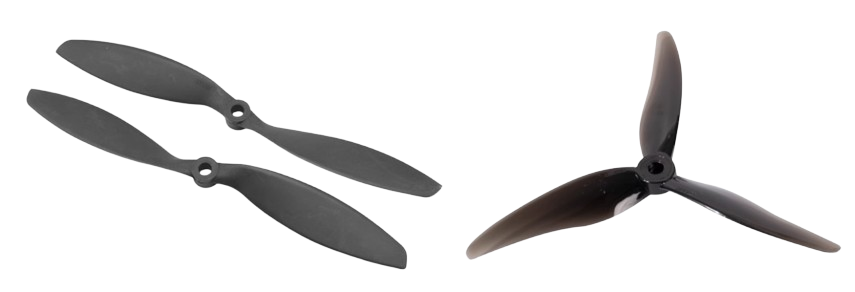

旋翼飞行器尺寸与机臂数和螺旋桨尺寸相关，设机臂数量$$n$$，机臂夹角$$\theta = \frac{360}{n}$$，机架半径$$R$$，螺旋桨半径$$r$$，则

$$
R = \frac{r}{\sin\frac{\theta}{2}}\\
R+r = 外接圆半径
$$

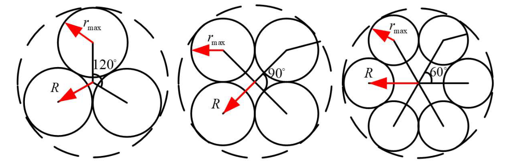

### 电机

旋翼飞行器上基本都是无刷直流电机(BLDC)，需要搭配电调使用。

电机有很多分类方式：一是分为直流电机和交流电机，移动机器人、遥控模型和小型电器上多用直流电机；工业机器人、大型设备上多用交流电机。二是分为是否内置伺服功能，移动机器人尤其是人形机器人用的关节电机，基本都是带伺服的，由电机本体、编码器、伺服驱动器和控制器构成，定位精度高、动态响应快；而遥控模型由于没有如此高精度的需求，多用不带伺服的电机。三是分为有刷电机和无刷电机。“刷”是电机中的碳刷，用作机械换向器，在转子转过一定角度后改变绕组电流方向，以保持电机朝一个方向连续旋转。有刷和无刷严格来说是直流电机下的分类，电流换向是电机保证超一个方向连续旋转的必要操作，直流有刷电机通过碳刷实现，直流无刷电机通过电调作为电子换向器来实现，交流电机本身的交流电产生的旋转磁场可以实现换向，也无需碳刷。有刷电机有两根出线，可以不通过电调直接驱动，优点是结构简单便宜，直流电压控制速度变速顺滑平稳，低速线性好，启动扭矩大，缺点是有碳刷损耗，噪声较大，最大转速相对较小。无刷电机换向通过电调中的控制电路来完成，优点是无碳刷，除了轴承外免维护，噪音小，运行效率高，同尺寸下功率相对大，散热性能好。旋翼飞行器多用无刷直流电机，而 RC 遥控车中有刷无刷都有。

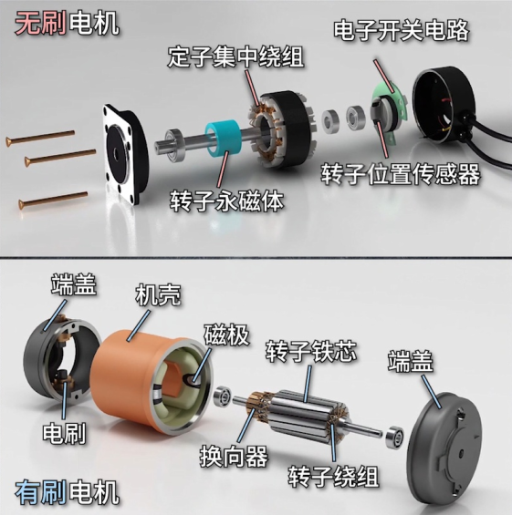

无刷电机又细分为有感无刷和无感无刷，有感无刷的感即指霍尔传感器，靠霍尔传感器加控制器来检测转子永磁体位置，最大的优点是可以保证极低转速的同时保有大扭矩，高速性能也强于有刷电机和无感无刷电机，尤其是带 FOC 电调的，但价格相对高，相对较重，且防水性能差。无感无刷没有霍尔传感器，通过反电动势和脉冲定位法检测转子位置，相对较轻且价格相对低，缺点是低速和满负载时由于难以确定转子位置，启动时电机容易抖动，启动线性差，启动扭矩小。

说回旋翼飞行器所用的无刷直流电机，又可细分为内转子和外转子两种。内转子电机的轴连着线圈转，外壳不转，转速相对更高；外转子电机的线圈不转外壳转，扭矩相对更大。外转子电机转动时力臂较长整体扭矩较大，控制细腻但由于转动惯量大故极速相对低，低速线性好，动力水平相同是重量相对轻。缺点是不防水不防尘不耐脏。航模中基本都是外转子电机，而车模中则以内转子居多。

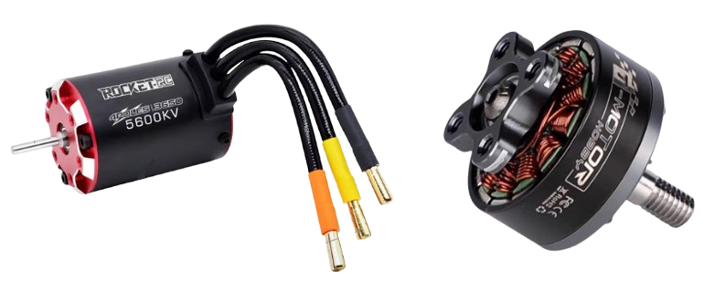

遥控模型使用的无刷直流电机有两个关键参数，一是 KV 值，二是电机后的四位数字编号，代表定子尺寸。KV 值代表电机空载时，每增加 1V 电压所增加的转速(单位为 rpm )，空载转速为 KV 值与供电电压的乘积。KV 值越低，铜线越细，绕的匝数越多，反之亦然。KV 值高表示高速小扭矩，KV 值低表示低速大扭矩。四位数字编号中前两位代表定子直径，后两位代表定子长度，单位均为 mm。电机尺寸越大，能提供的转速越大，相应的升力也就越大($$F=kn^2$$)，能带动的飞机重量就越大。而在相同 KV 值下，定子体积越小扭矩越大。相同体积下，高瘦的电机更省电、反应更灵敏，但散热较差；宽扁的电机反之。

$$
\begin{aligned}
T&=Fr=\frac{B^{2}\pi r^{2} h}{\mu_{0}}\\
\dot{\omega}&=\frac{T_{\text{res}}}{M} \quad T_\text{res}为反扭矩，M为转动惯量\\
M&=\rho 2\pi rht r^{2} \quad \rho为磁铁和磁通环密度，h为圆柱壳厚度
\end{aligned}
$$

电机工作在低转速下的能耗更小力效更高，焦耳损耗较大，高转速反之。力效为拉力与功率的比值，反映了电机产出拉力的效率，数值越大效率越高。

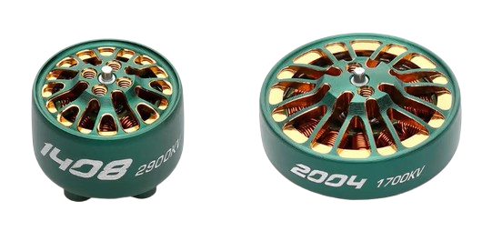

电机以及螺旋桨的尺寸要与旋翼飞行器整体尺寸相匹配，一般来说，三寸机选择 1106 等型号，五寸机选 2204、2207、2306 等型号(三寸和五寸都是指螺旋桨尺寸，且单位是英寸)。因此，选择电机优先考虑尺寸，其次考虑 KV 值。平稳飞行的飞机选低 KV，竞速飞机选高 KV。同时，选 KV 值需要考虑电池的放电倍率，也就是 C 数。C 数乘以容量为电流，所有电机最大电流之和需要小于电池的放电电流，否则电机性能会受电池制约。另外，电机输出轴的轴径有 1.5mm 和 5mm 之分，桨叶的孔位需要与之适配。目前主流的飞行器电机品牌有 T-Motor 的 F60 系列，乘风系列，致盈动力，银燕，双飞等。

在使用过程中，电机要注意散热，过热的电机效率会显著降低，且容易使得内部的永磁体超过居里点而对其磁性产生永久不可逆的影响。在车模中常单独加散热风扇或使用硅脂导热到金属底盘上，飞行器中空气流动大大提高了散热性能，在选配正确的前提下基本不用担心这个问题。

### 电调

电调全称电子调速器(ESC)，分为有刷电调和无刷电调两种，无刷又分为有感无刷和无感无刷，还可以分为单相电调和双向电调，车模通常都是双向电调，航模通常都是单向电调。有感无刷和无感无刷的区别在于电流检测的实现方式不同，有感无刷直接使用电流传感器检测，而无感无刷则无需额外传感器，利用母线采样电路和算法实现估算电流。

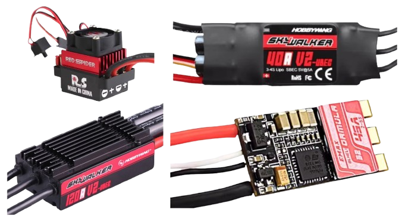

旋翼飞行器基本都是无刷直流电机，相应地使用无刷电调，其核心功能是将直流电转换为三相交流电，驱动无刷电机。由于无刷电机没有电刷作为机械换向器，因此需要逆变器作为电子换向器产生旋转磁场，来驱动永磁体转子旋转，输出的信号为 PWM 调制的三相方波或正弦波。另外，更换三相线的相序可以改变旋转磁场的旋转方向，因此可以改变电机的旋转方向。

电调调速的逻辑为，根据飞控发来的期望转速，由算法计算出输出 PWM 的占空比。等效的直流电压通过电流作用到电机上，电机产生相应的转速，转速产生相应的反电势，对应于一定的电流，电流产生电磁转矩，与负载转矩平衡，是一个动态调节平衡的过程。另外，实际电流受限于电调最大电流规格，超过阈值时会触发电调保护。

$$
\begin{aligned}
n &= U\times \text{KV值}\\
E &= K_e n\\
I &= \frac{U-E}{R}\\
T_e &= K_t I\\
\end{aligned}
$$

具体来说，电调需要实现的功能有电源输入滤波、MOSFET 三相全桥逆变、PWM/DShot 信号解码、霍尔传感器或无感测反电势检测转子位置，触发 MOSFET 开关进行换向以控制绕组通电顺序、过流过温低压保护等。一块典型的电调板包括 MCU(运行换向算法、协议解码等)、三相全桥、MOSFET 驱动芯片(放大 MCU 的 PWM 信号以驱动 MOSFET)、电源模块(降压后为 MCU 供电)、电流采样(采样电阻、运放等)。MOSFET 的驱动方式有六步换向法和 FOC，前者由方波驱动，后者由正弦波驱动。目前主流的高端电调多为 FOC 控制，有转矩平滑，噪音低，效率高等优势，适合需要精密控制的应用。

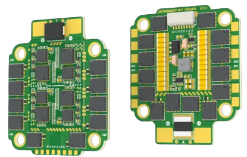

电调有四合一电调和分体电调，电调最主要的参数是额定电流，代表室温下允许持续通过的最大电流，决定了能带的动多大的电机，需要综合考虑电机最大电流和电池放电倍率选择，可大不可小，一般取稍大于(1.2 倍左右)，避免持续的峰值工况。比较科学的选择顺序是先电机再电调最后电池。对于电压，电调上一般会标注推荐的电压，电压过低电调不会启动，电压过高在没有超压保护的情况下可能会烧掉电调。过热、堵转、电机电调不匹配(电机要求大于电调提供)、超过标称电压的电池、环境温度过高等都可能烧毁电调。有的电调内部含有降压模块并引出一路低压输出(BEC 输出)给其它低压设备供电，BEC 输出不受电池电压影响。有的还含有高压 BEC 输出，主要用于提升舵机性能(有的舵机性能在低压和高压供电下有显著差别)。

电调中一般有预先烧录好的固件程序，决定了如何解析飞控指令、如何控制 MOSFET 开关时序等。BLHeil32 是专为无刷电调设计的开源固件，针对 32 位微控制器(STM32、CW32)作了优化，支持更高的 PWM 频率，具备双向 DShot 协议、自适应进角、动态刹车等功能，通过更精细的换向算法降低了电机损耗。飞控通过 PWM 或 DShot 向电调传输数据。DShot 为取代传统 PWM 模拟信号的数字通信协议，将油门值编码为 16 位数字信号，通过高低电平脉宽表示 0/1，DShot 后面的数字代表协议传输速率。自适应进角的作用是根据转速动态调整换向时机，补偿电机电感延迟，提升高速下的电机扭矩和效率，减少发热，尤其适合高 KV 值电机在高转速场景的应用。目前主流的电调品牌包括：好盈、银燕、T-motor 等。

### 电池

遥控模型用的电池为了追求更大的放电倍率，都是由放电能力很强的电芯组成的锂聚合物电池，往往也没有任何的保护电路。一组标准电芯称为 1S，其额定电压值为 3.7V，电芯之间串联提升电压、并联增加容量。电池的主要参数包括：几 S 几 P、放电倍率和充电倍率(用 C 数衡量)、容量(以 mah 为单位)。S 数表示电池由几组电芯串联而成，P 数表示构成单组电芯的单片电芯数。例如，如果一组电芯由单片电芯组成，就称之为 1P；如果这个 1S 电芯由两块单片电芯并联增容而成，就称为 2P。P 数越小稳定性越好。C 数代表放电能力，越大越好，C 数与容量的乘积就是支持的最大放电电流，需要跟电机电调相匹配才能发挥最大效果。充电倍率会小于放电倍率。电池容量代表在一定电流下用多少时间可以放完电。

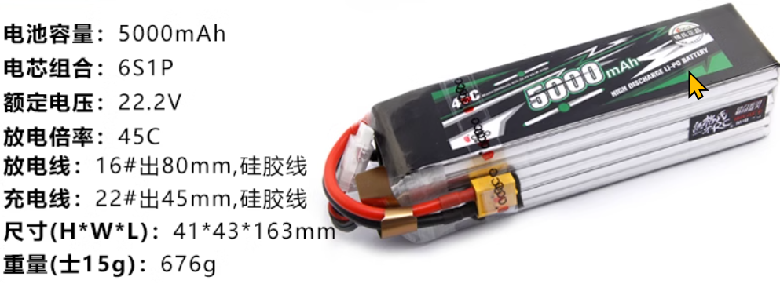

电池上有供电口和平衡头两个插口。常见的供电口插头种类有 JST、T 插、XT30/60/90、EC5、田宫，也有各种插头规格之间的转接头；但不同的插头匹配不同的电流强度，从低到高分别是 JST、T 插、XT60、XT90，因此使用转接头时要注意转接头的电流承受能力。平衡头可以让充电器知道电芯数量并可以分别检测每个电芯电压，充电时可以动态调整，用于确保电池中的每一个 1S 电池单体的充放状态一致，避免电压不均衡对电池造成损伤。平衡头导线有公共的负极，每一个 1S 电池有一根正极。另外，平衡头导线较细，只用于充电。电池品牌方面，选格氏的即可。

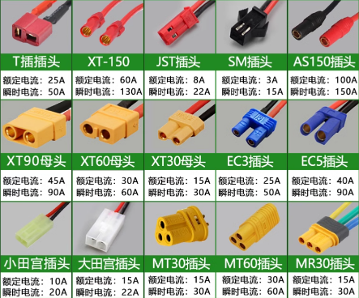

平衡充电器的原理是通过供电口输入大电流，再通过平衡充调整电芯间的压差；充电时要将供电口和平衡头同时接上，后选择对应的电池种类、电压和电流。平衡充有经典便宜的 B6 或 B6AC(B6AC 就是 B6 加内置电源，正版的有 SKYRC 标识)，也有智能高级的 HOTA D6pro 等。选择充电器时需要确定充电器是内置电源还是需要额外电源，很多充电器需要配备额外的直流开关电源来供电，而开关电源只推荐有电工经验的使用，需要注意接线方式。

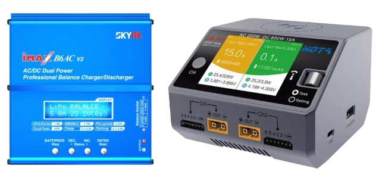

除了普通的锂电池外，还可能接触到两种电池：高压电池和电包。高压电池标有 hv4.35V，因为材料不同，比常规 4.2V 锂电池更小更轻，并且从理论上讲，高压锂电池对的容量可提升 10%-15%。电包一般使用磷酸铁锂电池 LiFe，电压为 3.2V，充满电压为 3.65V。电包主要的优势是安全性较高，相当于一个慢放电的、大容量的、专门给电池充电的充电宝，用于外场。

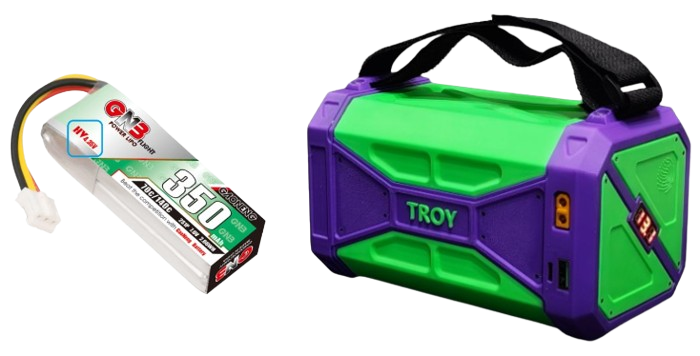

电池内部原理简单叙述如下：外侧电子数量决定电池容量，想要抛弃外层电子的倾向决定电压。过充或过放会对集流体的金属(正极铝箔负极铜箔)产生一些不良反应，过充负极析出锂，过放正极析出铜，产生的锂枝晶或铜枝晶可能刺穿隔膜导致电池内部短路，引起一系列的产气反应甚至是电池的热失控和爆炸。锂电池中核心反应是氧化还原反应和嵌入脱嵌反应。电池有呼吸效应，一方面指电池的嵌入脱嵌反应相对电流的速度是滞后的，另一方面也指电池内部存在微量的气体产生和消失。电池外部有热塑膜包覆，起到防尘和保护的作用。另外，电池内阻越低，放电效率越高，不良的使用会增加电池内阻。

在电池使用方面，最重要的是遵循三条原则：

1. **电池不能在无人值守的情况下充电**
2. **使用时需要确保电池总电压在设备额定电压以下**
3. **使用后断开供电头，不要过充过放**

电池的保养是一项比较麻烦的工作。单组电芯电压需要控制在 3.5-4.2V 之间，不要出现过充过放，否则会对电池造成不可逆的损伤，严重影响电池寿命。现代主流的平衡充电器一般带有过充检测，超过阈值后会自动断开；因此使用时一般注意不要过放即可，可在使用时给平衡头插上低压报警器(俗称 BB 响)，并将低压保护阈值设置在 3.5-3.6V。过放时，平衡充电器无法识别出锂电池，如果不是多次过放，可以使用平衡充电器的镍氢电池模式进行强制充电，充到单电芯电压达到 3V 左右可以被识别了，换成锂电池平衡充的模式继续充电。注意镍氢电池没有放过充的功能，充到可以识别之后一定要换成锂电池模式。充电方面，充电电流越大，充电速度越快，对电池越不好。电池会标注最大充电倍率，以 1500mah，最大 5C 充电为例，则最大支持的充电电流为 7.5A。一般来说，充电倍率的标注会低于放电倍率，但实际上正规的电池都支持 5A 的充电。

电池容量和电压之间的大致关系如下

| 剩余容量 (%) | 开路电压 (V) |
| ------------ | ------------ |
| 100%         | 4.20         |
| 90%          | 4.06         |
| 80%          | 3.98         |
| 70%          | 3.92         |
| 60%          | 3.87         |
| 50%          | 3.82         |
| 40%          | 3.79         |
| 30%          | 3.77         |
| 20%          | 3.74         |
| 10%          | 3.68         |
| 5%           | 3.45         |
| 0%           | 3.00         |

电池储存方面，电池电压需要充放到一个合适储存的值，短期储存在 3.8V-3.85V，长期存储在 3.9V，且储存期间三个月充放电一次，否则电池容易鼓包，影响寿命甚至报废。电池在长期不用的前提下，负极的 SEI 膜会发生溶解和二次沉积，致密程度降低，使得电解液和负极材料直接接触，电解液和负极材料中的锂离子发生产气反应。大 C 数的电池由于充放电倍率高，内部化学反应更剧烈，离子迁移速度更快，更容易发生产气和析晶反应。长期满电或亏电保存也会导致和过充过放类似的危害。长期保存时建议把电池电压保存在 3.9V，电量保持在 50%左右，内部锂离子和电解液浓度相对平衡，一般的电池在使用后建议 1~2 天内将电压充回保持电压，100C 以上建议满电或亏电时间不要超过 24h。长期不使用的电池再次使用后建议经过一个充放电循环后再去储存电压保存。充放电可以保养 SEI 膜。使用后断开电池插头防止自放电，因为电容不受开关控制。

评价电池好坏可以看充放电后每块电芯其电压的一致性，优秀的电池能做到 0.01V 级的压差。实际充放电的容量是否符合标称容量，从 3.6V 到 4.2V 能充进多少电量，和标称容量相差多少，一般能充电到标称容量的 90%及以上。充满电后保持状态，静置的自放电率，优秀的电池自放电率每个月在 1%到 2%。测试电池内阻(测欧姆内阻，忽略极化内阻)，优秀电池单组电芯内阻在 1~2mΩ，4mΩ 属于正常，6mΩ 属于偏高，10mΩ 则较差。内阻在一定程度上受使用温度和充电电量的影响。

## 飞行控制器设计

### 动力系统建模

## 主流研究点

待补充

## 参考资料

[多旋翼飞行器设计与控制实践](https://rflysim.com/doc/zh/C/2.Multicopter_Practice.html?q=)

[Fast-Lab 无人机教程](https://www.shenlanxueyuan.com/course/730/task/29085/show)

[FPV 博主](https://www.youtube.com/@ChrisRosser/videos)

[PX4 自驾仪指南](https://docs.px4.io/main/zh/)

[PX4 系统架构](https://zhuanlan.zhihu.com/p/644265757)

[飞控接口解释](https://www.bilibili.com/video/BV1wV4y1X7W1/?vd_source=1d0891b41fe4e23dbf197eaf61dfa468)

[无刷电机原理和构造](https://www.bilibili.com/video/BV1bMVBzBECG/?vd_source=1d0891b41fe4e23dbf197eaf61dfa468)

[穿越机电机选择](https://www.bilibili.com/video/BV1Wk4y1i7i1/?vd_source=1d0891b41fe4e23dbf197eaf61dfa468)

[无刷电机和电调工作原理](https://www.yiboard.com/forum.php?mod=viewthread&tid=1214)

[锂电池平衡充使用](https://www.bilibili.com/video/BV1EP4y1473q/?vd_source=1d0891b41fe4e23dbf197eaf61dfa468)

[锂电池深度解析](https://www.bilibili.com/video/BV1pm41117ZN/?vd_source=1d0891b41fe4e23dbf197eaf61dfa468)
