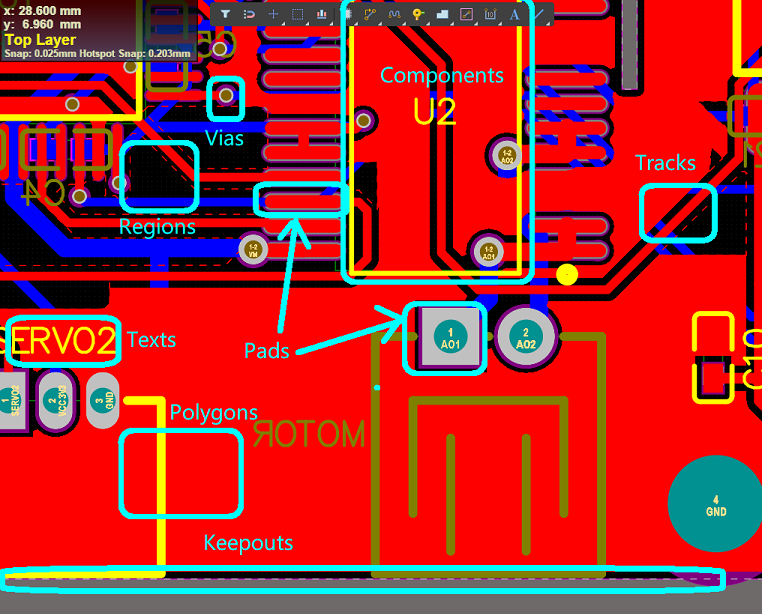
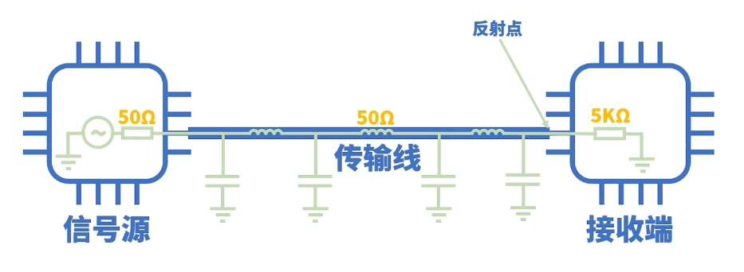
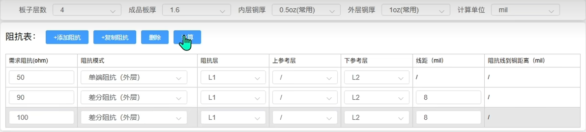
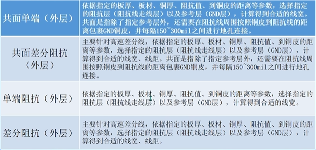
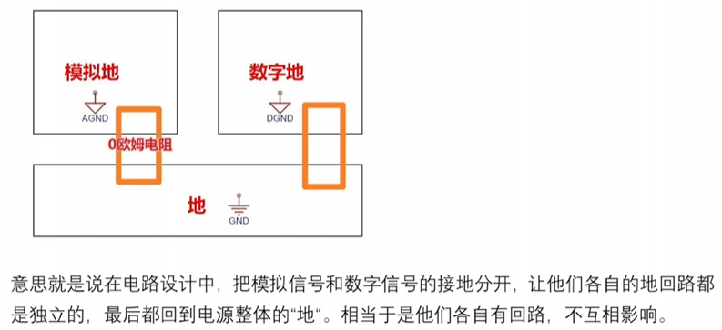

阅读前，确保有 AD 的简单使用经验或看过任意 AD 的入门教程，笔记中不会对“什么是封装”这类过于基础的概念作介绍。另外，笔记中提到的内容，多为规范性的东西，按照最科学的情况进行说明，存在冲突时需要根据信号和芯片要求的重要程度进行优先级取舍。不按要求来也许板子也能工作，但不规范的设计习惯会使得板子可靠性降低，且不利于长期能力培养。

## 前置知识

### 基本流程

从零开始到拿到一块板子的步骤包括：

1. 确定板子功能以及需要的元器件
2. 按规范建立或更新自己的元器件库
3. 从元器件库选择需要的元器件绘制原理图，完成连线、位号标注和网络标签的添加，最后 Validate
4. 仔细检查原理图，并且最好能找不同的人审核
5. 确定板子外形，可从 SW 或 AutoCAD 中导入 dwg/dwf 文件，确定外框形状和孔位信息
6. 根据制造厂商的工艺参数设置 DRC 规则
7. 将原理图导入 PCB 中
8. 多层板进行层叠设计
9. 按功能模块大致确定元器件布局
10. 对逐个功能模块进行器件摆放、打孔、分块铺铜等
11. 运行 DRC，解决警告和报错
12. 完成 PCB 打样并购买元器件，或使用 SMT 服务，完成元器件匹配操作

### 基本元素

Tracks：铜膜导线，是 PCB 上电气连接的主要部分。

Pads：焊盘，元器件引脚与 PCB 铜膜连接的金属部分，用于焊接元件引脚。有直插型焊盘和表贴型焊盘两种；直插型焊盘在 AD 中显示为灰色(Multi-Layer)。表贴型焊盘是元器件的一部分，一般不单独放置；直插型焊盘可以单独放置，中间有通孔。

Vias：过孔，用于不同 PCB 层之间的电气连接，一般都是通孔。也可通过更改起始层和终止层来设置盲孔(将 PCB 内层走线与 PCB 表层走线相连，此孔不穿透整个板子)和埋孔(只连接内层之间的走线，处于 PCB 内层中，从 PCB 表面看不出来)。过孔可按需求选择盖油或开窗。网络名称相同的相通，走线并添加过孔可以与其它层连接，方便走线。通孔焊盘用于直插件，用于与外界元件的连接；过孔用于层间线路连接，用于板子内部连接。

Regions：区域，用于设计实心铜膜，一般用于大功率元器件底部散热，代替大电流走线；不区分其他对象，连接区域内的所有网络，只能存在一个网络，不然会造成短路。一般在在布线之前进行。

Fills：与 Regions 类似，唯一的区别是 Fills 只支持矩形，而 Regions 支持任意形状。

Polygons：多边形铺铜，一般用于大面积的电源或接地连接，增强电气性能，减少电磁干扰。也可用于屏蔽特定区域。区分不同对象，会自动连接相同网络并避开其他网络，一般在布线之后进行。

Rooms：空间区域，用于定义一个局部元件集合摆放的相对关系，一个用途是可以为不同的 Room 设置不同的布局规则设置；另一个用途是具有多组相同布局布线的电路可以复制布局(Copy Rooms Formats)。

### PCB 中的各个层

板子从中间向外有 top 和 bottom 两个方向，以 top 为例，以两层版的工艺，按照从内向外的顺序有信号层 top layer，助焊层/锡膏层 top paste，阻焊层 top solder，丝印层 top overlay，底部方向同理，top layer 和 bottom layer 之间用 PP 片(半固化片 Prepreg)作绝缘介质层。对于层数高于两层的板子，在两个信号层 top layer 和 bottom layer 之间还有专门的地层和电源层。

top layer 和 bottom layer 为信号层，在 PCB 制造中为保留铜皮的部分，在该层布线、铺铜以及封装中对应焊盘位置的区域，在信号层中均代表在该层留有相应的铜皮

top paste 和 bottom paste 为助焊层，在 PCB 制造中为喷锡的部分，用于设计钢网，为负片层。这一层由贴片型器件的封装决定，也就是所谓的焊盘，一般不手动修改。在元器件封装中，焊盘一般比信号层对应的铜皮区域略大或两者一样大。

top solder 和 bottom solder 为阻焊层，在 PCB 制造中为覆盖绿油的层(虽然也有其它颜色的阻焊油漆，但一般统称绿油)，该层为负片输出，也称阻焊开窗，即默认整层覆盖绿油，只在有开窗的位置不盖油，相当于在整层绿油的基础上作减法操作。由于阻焊层向内为助焊层或信号层，因此开窗的位置会露出相应的焊盘或其它铜皮。在元器件封装中，阻焊区域一般比对应的焊盘区域略大。

除此之外，还有 keep-out layer 或某一个 mechanical layer 用作规定板子外形(不要同时用)，其它的诸如 drill guide、drill drawing、以及各个 Mechanical 机械层均不常用，暂时可以忽略。在画板时，可以只保留重要的层，隐藏其余层，注意设置之后不要在 View Configuration 中在作修改。

正片层走线是铜；负片层走线是去铜，可绘制闭合区域进行分割。

容易混淆的概念解释：Mask 是焊接相关的掩膜，包括 SolderMask 阻焊掩膜和 PasteMask 锡膏掩膜，前者决定绿油的覆盖范围，用于焊接，非开窗区域刷绿油作绝缘保护。后者决定钢网开口，仅针对贴片元件(SMD)的焊盘，用于回流焊前涂锡膏。SolderMaskExpansion 为阻焊开窗的扩张规则，PasteMaskExpansion 为钢网开口的扩张规则。MinimumSolderMaskSliver 为最小阻焊宽度。

### 层叠设计

板子层数根据线的总量确定，没有确定的标准。层叠设计通俗理解就是确定每一层走什么线，其目的一个是解决板子面积限制导致的走线不便；二个是提供阻抗匹配所需的完整参考平面。高速 PCB 在层叠上级上建议：

- 层叠对称性：对称的叠层结构在压合过程中能够平衡应力分布，降低因应力差异导致的板翘。当叠层结构不对称时，压合后的应力不一致会导致板件翘曲，影响后续加工和装配。
- 阻抗连续性：信号层与地平面层之间的紧密耦合有助于减少阻抗不连续的问题，从而降低信号反射和波形失真的风险。
- 参考平面完整：主芯片相邻层为地平面，以提供器件走线良好的参考地平面。
- 防止信号串扰：两个相邻的信号层之间尽量拉大间距，走线尽量正交，减少信号间串扰。
- 信号和电源层分离：信号上下两个参考层为地和电源时，尽量拉近信号层与地层的距离，远离电源层，减少信号干扰和电源噪音。

叠层设计的三个基本原则：一是每条信号线要有最小阻抗回流路径，信号布线层需有邻近紧密耦合参考层；二是相邻电源和地平面层保持最小间距，以提供大寄生电容；三是设置多个完整电源和地平面层，利用其电磁屏蔽效果保护内层信号走线。

### 阻抗匹配

以标准的通信模型为例，当信号在信号源、传输线、接收端三个部分传输时，如果相邻部分的阻抗不一致，就会在接触点处发生反射，不一致的程度越高，反射的现象就越强烈。信号大拐弯、走线宽度不一致、走线穿过不同层等都会造成阻抗不连续。

所谓的阻抗匹配，就是要保证三个部分的阻抗一致以尽量消除信号反射等信号完整性问题。信号源和接收端的阻抗可以在相应的数据手册中找到，因此设计 PCB 走线的阻抗即可；例如 USB 阻抗是差分 90Ω，SDIO 是单端 50Ω。PCB 板厂会有专门的阻抗计算的页面，输入需求阻抗、阻抗模式、阻抗层等信息就可以自动计算得到在该厂家的工艺下，任意阻抗所对应的走线宽度，在设计时设置相应的宽度，并保证走线的反面有参考地平面即可。阻抗计算工具是根据线距、阻抗线到铜距离和其它参数计算线宽的。

另外注意，阻抗与走线长度无关，但是和其它参数都有关，比如 PCB 厚度、层数、铜厚，甚至是厂家的生产工艺等。

### 走线等长

走线等长和阻抗匹配是两个概念，指的是通过调整多根信号线的长度，使信号传输延迟一致,确保并行信号(如时钟、数据总线)同步到达接收端，满足建立/保持时间要求,，避免时序偏差。差分线是一种典型的需要作等长处理的信号线，布线时尽量保证对称，长度差保持在 5mil 以内；走线过程中，差分线对内禁止打过孔或放置元器件，否则有 EMC 问题且阻抗不连续。另外尽量减少过孔数量，过孔数量过多对信号有损耗。必须要打过孔时，差分换孔也比必须保证伴随着屏蔽地过孔，减少信号干扰的问题。

## 建立规范

原理图和原理图库中的规范，更多地是为了美观和方便查看；PCB 和封装的规范则直接影响板子的可靠性和稳定性。

### 元器件库

- Designator：元件标识符，又称位号，在一张原理图中唯一；按照标准的元件类型前缀 + 流水号命名，显示。常见元器件位号：电阻 R、电容 C、电感 L、二极管(包括 LED)D、接插件 J、晶振 X、三极管 Q、芯片 U、按键开关 S、变压器 T，保险丝 F
- Design Item ID 和 Comment：分别为设计项标识和注释，写型号规格(即商城中的器件编号)
- Description：描述，对元件功能、特性等进行说明
- 原理图库中，位号放引脚上，名称放芯片框内，芯片框矩形中心与坐标原点对齐。通用元器件位号和名称都不显示。通用元件颜色蓝色。通用元器件管脚长度 100mil，芯片和排针管脚长度 300mil，颜色均为黑色。芯片用文字标注型号
- 芯片引脚较多时，建议在原理图库中手动对其按功能重新排序
- Footprint：封装，定义了元件在 PCB 上的物理尺寸、引脚布局和焊接方式。按照标准封装(或商城中给的封装)填写名称。封装的参考统一设置为中心(快捷键 efc)，3D 模型放置要对准。一个完整的封装包括焊盘、管脚序号、丝印(表示实物的大致范围)、阻焊、1 脚标识
- 对于库的维护，把元器件库和 PCB 库放在集成库 LibPkg 中，集成库中的原理图和封装是一对一的关系，对于电阻电容电感，每种不同的封装创建一个元器件，画原理图时不用再选择封装。以一个常用元器件库为基础，后续项目中用到的芯片往里补充，以及实际调试中如果针对已有元件有封装不合适的地方往里更新。LibPkg 编译之后 Output 得到 IntLib，并安装到 AD 中，这样就不用在工程中包含库。所有芯片放一个库，使用时可以搜索找到需要的元器件

### 原理图

- 每个信号线为什么这么连接，要在手册里找到依据
- 原理图的目的是看清楚，画开一些，分区域画并加上适当的注释
- 捕捉栅格设置为 10mil，兼顾吸附对齐和较小的可调粒度(mil 是 PCB 中的常用单位，10mil = 0.254mm)
- 芯片引脚左右排布，上下不要有引脚，默认引脚朝右朝下
- VCC 和 GND 不要直接连到电路引脚上，要通过连线连接；并且要拉出来统一连接，电源放置在上侧，GND 放置在下侧。
- 供电的标记为 VCC 3V3、VBUS 5V 等(网络标签名 + 供电电压)
- 用 Text 标注元器件参数

### PCB

#### 布局

- 先进行布局和扇孔，然后走线，而不是一边布局一边走线
- 布局时要先确定好有哪些电源，再连接
- 元器件布局需要结合功能模块分布、信号流向、供电连接等因素综合考虑
- 电容(去耦电容)靠近信号源头放，因为对信号滤波的作用范围有限；电阻除了阻容共串(一起才能发挥作用)的情况外，位置无所谓。电源附近的 Buck 电容/滤波电容，一般会用一个 10uF 和一个 0.1uF 的并联
- 电源芯片一定要看看推荐布局，而且要做电源树方便理清电源流向。
- 贴片器件间距，同类器件大于等于 0.3mm，不同类器件大于等于 0.3+0.13× 周围元件最大高度差。手工焊接大于等于 1.5mm，直插器件和贴片间距保持 1-3mm 方便焊接

#### 走线

- 布线如下棋，走一步想两步
- 不允许直角甚至是锐角走线，直角处线宽突变导致阻抗突变，且直角走线的反射较为严重
- 线的转折尽可能少，转折会增加反射引起信号衰减
- 最好在走线和焊盘连接处作泪滴处理，且如果可能最好使用平滑的曲线走线
- 走线宽度和线距一致，线到孔的距离在此基础上稍大些。高速信号需要满足 3W 原则，即线间距为三倍线宽，减少高速信号的串扰
- 走线权衡时，信号线能不打孔就不打孔，电源能打孔就打孔
- USB、CAN、485 走差分线
- 时钟线要等长以获得更高的精度，频率越高对等长要求越高。时钟电路建议参考手册中的推荐布局
- 尽量缩短走线长度，避免较长的平行走线以降低串扰和 EMI 风险，尤其是高速信号。
- 供电线路注意线宽，经过的过孔注意内外径构成的圆环面积。细线过不了大电流的制约因素主要是压降和温升。经验法则是 1A 的电流至少 10mil，建议 15mil；2A 的电流至少 20mil，建议 30mil；3A 的电流至少 60mil，建议 100mil，大于 3A 建议铺铜或开窗。小于 10mil 线宽，建议电流小于 0.1A
- 线路尽量不要跨电源区域，提供完整的参考平面
- 尽量从焊盘的四个边走线而不要从角走
- 导线如果比焊盘更粗，最好的情况是用较短的与焊盘一样宽的走线引出很短的一段，然后走粗线
- 同一个网络不能形成闭环，尽量也不要形成环绕的态势
- 晶振信号线尽可能等长，周围最好包地处理
- 差分走线的目的是抑制共模干扰、减少产生磁场对周围的电磁干扰；走线等长的目的是避免时序偏差，确保同一组信号线同时到达接受端，防止因延迟造成的异常；阻抗匹配是为了防止信号反射，消除振铃、过冲等信号畸变。
- 差分线需要加过孔以及等长调节，等长调节要靠近发送侧，即数据的来源处。先设置线宽确保和阻抗匹配的计算值一致，然后再预留过孔的情况下走线，然后等长调节，最后补过孔包地
- USB3 Hub一个下行端口的三组数据线使用同一组时钟信号，三组之间也要作等长处理。
- 元器件和走线和板框边缘要保持一定距离。
- 晶振尽量走内差分线，注意晶振的上升时间是否符合芯片要求，注意温度对晶振的影响。

#### 过孔

- 一个孔不出两根线
- 信号线不要走过孔，只有 GPIO 这样只分高低电平的非信号线才可以走过孔。另外注意，过孔不要将参考平面割裂。
- 焊盘上一般不打孔，过孔打在焊盘上容易机焊元件放歪以及容易漏锡虚焊，非要打则使用盘中孔工艺。盘中孔工艺是指在焊盘上打孔，但通过镀铜的方式将过孔隐藏在内部，确保表面焊接强度和机械强度可靠。在复杂的高层板设计中，在允许焊盘上打孔可以在保证质量的前提下降低 layout 难度，节约时间
- 板子周围打细小通孔可以抗外界干扰。板边建议沿着板框内缩的位置，打一圈 GND 过孔，过孔间距在 50-200mil 左右
- 电源的过孔推荐打大一些，0.3-0.5 左右，可打密集阵列。经验值为 0.5mm 内径 1mm 外径过孔过 1A 电流。
- 过孔类型及设计数量应考虑其载流能力。为保证设计余量，有空间会按计算的 2 倍数量处理。过孔扇出要考虑其间距，要求 2 个过孔之间保证能过一根信号线，防止过孔破坏地与电源的完整性。2 个过孔之间的中心间距建议在 1mm 以上(39.37mil)
- 扇孔通俗理解就是拉线打过孔，多层板走线就近打孔，可以缩短回流路径减少干扰。差分信号换层时，其换层过孔附近必须添加 GND 过孔，保证其回流路径短。

#### 铺铜

- 铺铜要工整地铺，地平面的铜可以面积尽可能大，但不要有铜皮尖角、很细的铜以及孤铜。。电源一般都不会整层铺，而是用多边形铺铜覆盖，需要分不同电源域时会划分平面后再分块铺铜。铺铜十字连接的作用，是防止环境温度变化较大的场景下，热胀冷缩使得热了焊盘鼓起，冷了连接断裂的情况；十字连接时需要考虑载流能力。这种应用场景下的焊盘可以考虑采用十字连接，否则都用全连接
- 电源层可以设置为内电层（负片层）进行不同电源域的分割，注意信号线的走线尽量少跨越电源域，以提供尽可能完整的参考平面
- 不用铺那么多层铜，散热太快了不好解焊

#### 丝印

- 丝印的目的是手工焊接时的区分和定位，规定方向为字母在左和字母在下。丝印大小根据元器件密集程度，规范为 4/25mil(高密度)、5/30mil(中密度)、6/45mil(低密度)，丝印字体用 Sans Serif，缩小之后失真程度最小。经常板子画完就觉得结束了，不要忘记调丝印。
- 排针排母和多 pin 接口建议用丝印标注每个引脚的功能，开关用丝印标注功能(Reset、BOOT 等)；SMT 的板子可以在丝印中去掉位号

#### 隔离

- 模拟地和数字地要分开，功率元件的地和信号元件的地也要分开，避免电流对信号的影响。数字地和模拟地最好隔开 20-40mil，不同的电源域隔开 10-12mil。
- 数字电源比模拟电源更敏感；数字部分和模拟部分只在总电源的地处用 0 欧电阻单端接地；其余部分各接各的。功率电路通常需要较大的电流来驱动设备(比如电机)，这会产生噪声。如果功率和信号共用同一条地线，功率部分的噪声可能会干扰到信号部分，让信号变得模糊。功率电路有时会有短路或过载的风险，如果功率和信号共享地线，可能会对信号电路造成损坏。分开可以提高整个电路的安全性。功率低 PGND，最后通过零欧电阻单点连接。

#### DRC 设置

- [规则详细介绍](https://www.bilibili.com/video/BV11u4y1Z76b/?vd_source=1d0891b41fe4e23dbf197eaf61dfa468)
- 根据制作厂家的工艺参数设置规则：[嘉立创工艺参数](https://www.jlc.com/portal/vtechnology.html?spm=PCB.Homepage.functionbar.1015)
- 画板子前先导入规则并确保规则的 Online 或 Batch 已打开。Online 即画的过程中实时提示，Batch 即运行 DRC 时才会提示。

## 软件操作

- 画板子前先 windows + space 切换成美式键盘
- 拖动状态下空格键可以旋转选中的元器件
- 使用过滤器可以选择可选中的对象
- 原理图库可以更新到原理图，PCB 库可以更新到 PCB，原理图和 PCB 可以相互更新改动。原理图界面 Update 和 PCB 界面 Import 都可以将原理图的更改同步到 PCB；在库界面右键元件或在图界面选择工具中的从库更新，可将库的改动更新到图中
- 原理图中工具 → 标注 → 原理图标注可自动编辑位号
- 原理图中，工程 → 工程选项设置
- Validate 工程可以检查原理图的错误
- 可以导入 dxf/dwg，导出 dxf/dwg，step
- 先确定机械尺寸，绘制 keepout 并选中外框后 dsd 确定板框大小
- 使用在线 DRC 时，在设计过程中只要出现违反规则的操作，比如线宽设置小于规定值、元件间距不足等，软件会马上给出提示，方便设计者及时发现并修正问题；关闭在线 DRC 后，设计过程中不会实时提示错误，只有后续手动运行批量 DRC 检查时，才会显示违反规则的地方
- 可以通过查询构建器的过滤，针对网络、类、层创建新规则；并可以设置规则的优先级(数字越小优先级越高)以及是否使能
- 大致布局完成之后可以对齐和等间距进行美化
- 常见导入 PCB 报错的解决方法：(1)unknown footprint : 添加封装(2)unknown pin : 检查封装名称填写是否正确，以及该名称在 PCB 库中是否有对应的封装，PCB 封装的管脚号是否匹配上，位号是否和原理图匹配，封装中是否含有隐藏的管脚
- 显示上 Tracks 30%，Polygons 70%；这样可以区分导线、铺铜和焊盘，方便检查焊盘附近的小短线
- 要操作哪层先选中哪层，否则选不中该层对象
- 利用 AD 的“交叉选择”功能在原理图中选择某个功能模块，在 PCB 中会自动匹配相应的元器件。可用工具 → 交叉选择模式并垂直分屏，框选原理图中的元件来同步选择 PCB 中的元件，F6(工具 → 器件摆放 → 在矩形区域内摆放)来大致规划模块的摆放位置，然后再 layout
- 布线时退格可以取消上一步走线
- 右下角 Panels→PCB 可管理类，可以显示/隐藏飞线，更改连线颜色
- 未连接的飞线运行 DRC 后有 Un-routed(开路)的提示
- 推荐只对 GND 网络铺铜，其它网络的铜皮用 Fill 或 Solid Region。原因是一方面铺铜创建的先后顺序会影响实际的效果，出现大铜皮套小铜皮的时候可能只有大铜皮起作用；二方面是创建的铜皮就是最后的铜皮，创建铜皮时就需要考虑与其它网络之间的距离，不会像铺铜一样会自动避开其它网络
- 铺铜可以勾选删除孤铜
- 创建 ROOM 可以复用 PCB 布局(Copy Room Formats)
- 选中文字/器件并查找相似对象可以选中所有文字/器件。全选文字可以编辑文字高度和宽度来批量修改文字大小，全选器件可以 ap 批量修改器件文本位置(标识符 Designator 和注释 Comment，Comment 写芯片型号或者元件参数)
- 调整丝印前先查找相似并锁定所有器件，调整丝印后还需要再运行一次 DRC
- logo 导入后创建联合，并可以调整联合大小
- 工具中的转换可以生成和打散联合

### 快捷键

- tp 打开首选项设置，可以改所有元素的默认属性
- 按住 shift 多选
- sc 选择连接的整条线
- sl 线选
- sn 网络选择
- ctrl + h 或 sp 选择物理连接一起的
- ctrl+shift+T/B/L/R 将选中器件上/下/左/右对齐
- ctrl+shift+V/H 将选中器件垂直/水平等间距排列
- 小键盘 5 定位文本位置
- ctrl + c 复制先确定复制中心，ctrl + v 是带位置粘贴的
- 鼠标右键和 esc 的作用一样
- PCB 中布线按 TAB 键可以暂停并设置线宽
- ctrl 拖动线可调整位置
- ctrl + 点击线路可以高亮某一条线，ctrl + 点击其它地方取消高亮
- dsd 从选中边框重定义板框大小
- tvb 从选中边框板框切孔
- ctrl + m 测量
- vb 翻转板子
- L 切换层显示
- mi 将所有选中的元器件放置切换到底层/顶层
- 鼠标按住选中元器件的状态下 L，将选中的元器件放置切换到底层/顶层
- shift+s以及透明度调整可以观察铺铜后的情况；view config可隐藏铺铜方便观察
- 小键盘+-切换下/上一层
- 小键盘\*切换顶层底层
- shift + s 灰度化其它层
- eos 设置原点
- q 转换单位
- 调整栅格大小 vgs
- f6 矩形排列所选择器件
- ctrl + w 或 f2 布线
- pl放置内点层的分割线条
- 在布线状态下，shift+enter切换弧形走线
- 选中多根线，um 同时走多根线
- ui差分对布线
- ur网络等长调节
- delete 或 ed 删除选中元素
- f3 放置过孔
- f4 多边形铺铜
- te 泪滴，全部画完了最后加
- tm 复位所有错误
- tgm 铺铜管理器
- tga 全部重新铺铜
- tgh 隐藏铺铜
- tve 从选中边框创建区域(填充)
- tvm 从选中边框创建 ROOM
- tc 从 PCB 中查找对应的原理图
- dr 设置 DRC
- td 运行 DRC
- 数字 23 切换 2D 和 3D 显示
- fff 保存所有图层

[更多快捷键](https://blog.csdn.net/PKPROTEUS/article/details/119611055)

## 经验教训

1. 改设计之前要复制一版留档
2. 多看看别人的结构，别人怎么画的。看开源的时候不要想当然地认为它就是这么实现的。另外，对原理图保持怀疑，最终Debug看的是板子实物是怎么连的，遇到问题时和参考的开源从PCB上一根线一根线地查。
3. 直插型焊盘直径要略大于孔径，否则打孔会把焊盘打掉。焊盘不起作用，可能在拧螺丝固定时导致上下层铜皮短路。焊盘是带有网络的，孔壁也是金属。
4. 焊接完成后，用万用表测一遍所有电压输入输出对地有没有短路。如果该通的不通了，要测通断分析哪里断了。
5. 尤其注意 MCU 的虚焊，即贴上了但是没焊上的情况。
6. 注意镊子夹取的方式，不要把引脚掰弯了。
7. 阻容摆正了再焊，并且要补锡使得含焊点圆润。
8. 烙铁头点到板子上就不要动，尤其不要蹭板子，很容易把表面的阻焊层刮开露出铜皮。
9. 如果担心晶振虚焊，可以将所有引脚都翘起来焊。
10. 板子的背面都贴上布基胶，预防板子和外界金属接触导致的短路。
11. LDO 输出偏低，可能是芯片坏，建议更换后测试。
12. 接口的 pin 不要对反，如果真的 pin 反了，像 FPC 这样有正序和反序线的可以换线解决。
13. 对于 VCC、GND、开关的状态，要加上丝印方便调试。
14. 买元器件的时候注意，对于与焊盘接触面几乎全部压在元器件下面的情况，设计 pcb 时要更新封装，适当外扩焊盘；否则实际焊接时非常难焊，几乎是相当于将整个元器件悬空架起来焊成立体的才能保证机械焊点稳定无虚焊。
15. 可以用手机开闪光灯放大检查焊点情况，焊盘如果是反光的多半就是虚焊。
16. 元器件焊盘的锡要补圆，要饱满才可以最大程度减小虚焊的隐患。
17. 阻容 LED 等等这些比较小的器件，要左右两端都用电烙铁点一下，一方面是为了补圆焊盘，另一方面可以检验虚焊。
18. 用来拧螺丝的过孔要连到 GND 网络上。
19. 检查三脚开关的连线，别出现 VCC 和 GND 直连的状态了。
20. 引脚密集的芯片焊接，先给一小边上很多的锡，用镊子小心夹住并调整方位摆正，注意不要夹伤引脚，定位之后。上助焊剂怼锡丝；对于连在一起的，用烙铁头向上慢慢挑走。
21. 出问题时要测量电压源(电池、稳压芯片等)的输出。
22. 多检查芯片是不是引脚虚焊或者连着了。
23. 加热过的焊油可能引起虚焊，在进行二次焊接前最好用洗板水清理干净。
24. 搞懂电路原理再抄原理图，升压的反馈电阻明显接错了都看不出来(仿照别人的功能，有原理图实现再抄，不然自己想当然地猜多半都实现不出来的。
25. 有极性器件，极性电容、各种二极管等别焊反了，留意下下元器件上的标识。
26. 风枪或加热台焊接，锡膏不要涂多了，去多余的锡比补锡麻烦，加热台温度设置在锡膏熔点高 30℃，快到熔点时可以开始摆正元器件。完了需要检查引脚有没有连锡，器件有没有虚焊。
27. 根据需要加一些测试点焊盘，注意不是过孔。
28. DC-DC、继电器、较大的耦合电容、变压器的干扰较大，开关管开闭过程中电流突变引起电压突变。这种容性元件和感性元件；开闭过程电流突变，本身也是大电感。
29. TX和RX可能有两种含义，以RX为例，一种表示需要接芯片的RX，另一种表示自己的RX，即需要接芯片的TX，不同厂家的元器件之间并没有统一的标准，实际选用时结合经验或多看几家猜测物理器件上的真实含义。
30. 解焊上锡或加助焊剂都有助于融化；用烙铁解焊时，一个元器件各焊盘连起来之后才方便同时融化。

## 其它知识

- 电源芯片的选型要看外围芯片的上电时序、上升时间、对电源纹波以及功率的要求。有上电时序要求的可以使用专门的电源管理芯片，或通过使能引脚控制，或通过电容充电。功率一般留一倍的余量。

- 时钟要看晶振的频率和上升时间，需要满足芯片时钟对上升时间的要求。另外，晶振对温度很敏感，需要考虑板子使用时的环境温度。

- 高速板和低速板的布局原则完全不同，大致以 700Mbps 为界。业界的规定为，信号线传播延时超过数字信号驱动端上升时间的一半时，就是高速信号。高速信号可能产生传输线效应。

- 板型材料一般选 FR-4，板厚 1.6mm，经常接触可以选无铅喷漆。铜厚一般用 1oz 即可，2oz 只有在做对散热要求较高的电源中才会使用，另外也可以用 1oz 铜然后阻焊层开窗往上堆锡。1oz 约为 35 微米，定义为把 1oz 重(约 28.35g)、密度为 8.9g/cm³ 的纯铜平铺到 1 平方英尺(约 929.03 平方厘米)的面积上所形成的厚度，即用单位面积的重量来表示铜箔的平均厚度。

  下单默认：FR-4 板材，成品板厚 1.6mm，外层铜厚 1 盎司，绿色阻焊白色丝印，过孔盖油，，焊盘有铅喷漆，最小孔径/外径 0.3mm(0.4/0.45)(0.45 代表加阻焊一起的)

- 使用 SMT 服务时，上传 PCB 文件到嘉立创会自动匹配坐标定位文件，匹配元器件时注意核对，有较小概率匹配漏选。也可以自己上传 BOM 和坐标文件(BOM 文件在 PCB 文件下文件-->制造输出-->Gerber Files；坐标文件在 PCB 文件下文件-->装配输出-->Generates pick and place files，需要一定的设置调整成嘉立创的格式)

- 元器件购买：

  CMOS：索尼、OV

  电源芯片：TI 德州仪器、MPS

  通用元器件：云汉芯城、贸泽电子、得捷电子

  接插件：TE 泰科

  电阻电容：MURATA、YAGEO

  电容一般都用陶瓷电容，容差选 1%或 0.1%，15ppm

- 焊锡丝选择：Sn60%Pb40%左右

- 沉金工艺是对焊盘的表面处理 ，其核心目的是保护铜焊盘并提升焊接性能。

- BGA 指球栅阵列结构的封装，在 PCB 内部通过位于组件底部的一系列小焊球实现 IC 之间的连接。通常 BGA 下的过孔设计为成品孔，直径 8~12mil；BGA 下过孔需塞孔，焊盘不允许上油墨，且焊盘上不钻孔。BGA 间距定义为从中心到中心测量的两个相邻焊球之间的距离。随着引脚数量的增加，元件的间距会减小。这种间距的减小使扇出变得复杂。因此，应该添加更多的内部层来布线引脚，有一个经验公式可以用来决定层数：层数=BGA 芯片信号总数/(4 面 x 每面 BGA 走线信号)

- PCB 板上常见的几种传输线结构：第一种为共轴传输线，如同轴电缆。第二种为微带线，位于 PCB 表层，平行于导电接地层，为信号提供返回路径。第三种是带状线，位于 PCB 内层，有上下两个参考平面回流路径。传输线存在特性阻抗，信号在传输线中传输的过程中到达的每一个点，传输线和平面之间都会形成电场，产生一个瞬间小电流，这个小电流在传输线上的每一点都存在，同时信号也存在一定的电压，于是传输线上每一点就可以等效成一个电阻，这个电阻就是传输线的特性阻抗。在高速应用场景，信号传输线不能看作理想导线，特性阻抗是综合传输线场景下寄生参数的合成参数。

- 高速信号之间的串扰 (Crosstalk)是指电路中一条信号线上的电信号通过电磁耦合(电场或磁场)干扰邻近信号线的现象。这种干扰会导致信号完整性受损，表现为噪声、误触发或通信错误，尤其在高频或高密度 PCB 设计中更为显著。

- L、N、M 表示焊盘伸出的大小的几何形状变化。

  - L = Least Use Environment (Level C - High Density)，密度等级 L：最小焊盘伸出——适用于焊盘图形具有最小的焊接结构要求的微型器件，可实现最高的元件组装密度。
  - N = Nominal Use Environment (Level B - Medium density), 密度等级 N：中等焊盘伸出——适用于中等元件密度的产品，提供坚固的焊接结构。
  - M = Most Use Environment (Level A - Low Density),密度等级 M：最大焊盘伸出——适用于高元件密度应用中，典型的像便携/手持式或暴露在高冲击或震动环境中的产品。焊接结构是最坚固的，并且在需要的情况下很容易进行返修。

- receptacle 是母头、plug 是公头

- 扇出即从芯片的引脚处引出短线后打过孔的操作
