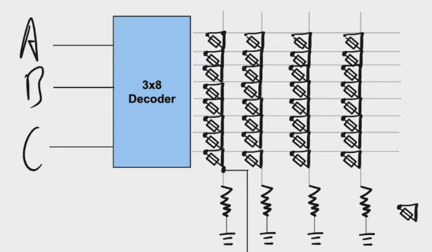

## CLD

FPGA 的上级概念是 CLD（Configurable Logic Device），即可通过编程配置逻辑功能的设备。早期的 CLD 设备包括 PROM、PLA、PAL 等。PROM 是天然的 CLD，通过施加电压熔断保险丝的方式控制连接矩阵中每个节点的通断

## FPGA 结构

FPGA 基本结构一般由五部分组成，分别为可编程输入/输出单元、基本可编程逻辑单元、嵌入式块 RAM、布线资源和 IP 硬核单元，如下图所示：

## FPGA 开发流程

设计 Design（模块和测试）、分析和综合 Synthesis、功能仿真 Simulation、布局布线 Implementation、时序仿真、分配引脚（layout--> IO panning）、生成比特流和板级调试

设计阶段需要用硬件描述语言编写功能模块以及相应的测试方案，对于 FIFO、RAM、ROM 等常用的

## ZYNQ

ZYNQ 是 Xilinx 推出的一系列片上系统（SoC）型 FPGA 产品，它将传统 FPGA 的可编程逻辑（PL）与 ARM 处理器核心（PS）深度集成，形成独特的异构计算架构。通过 AXI（Advanced eXtensible Interface）总线实现 PS 与 PL 间的低延迟数据传输，这也是 Zynq 上主要的数据通信机制。所有的 Zynq-7000 芯片具有相同的架构，以 ARM 处理器系统为基础，与 Microbraze 这样的软核处理器不同，它是一颗专用的硬核处理器，不占用 FPGA 的逻辑资源，并且比 Microbraze 有更高的性能。

PS 具有固定的架构，包含了处理器和系统的存储器；而 PL 完全是灵活的，给了设计者一块“空白画布”来创建定制的外设。在 ZYNQ 上，PS 端为 ARM-Cortex A9 内核。ARM Cortex-A9 是一个应用级的处理器，能运行像 Linux 这样的操作系统，而可编程逻辑是基于 Xilinx 7 系列的 FPGA 架构。ZYNQ 架构实现了工业标准的 AXI 接口，在芯片的两个部分之间实现了高带宽、低延迟的连接。PS 和 PL 端的协同设计是 Zynq 嵌入式系统设计的重要部分，PL 适合并行流处理，而 PS 适合控制或具有串行执行特性的部分以及浮点计算等。

另外，Zynq 处理器系统并非只有 ARM 处理器，除了一个应用处理器单元(APU)，还有拓展外设接口、cache 存储器、存储器接口、互联接口和时钟发生电路等。

---

ZYNQ 命名规则：以 ZYNQ“XC7Z020-CLG400-2”为例，“XC”是“Xilinx 公司”；“7”是 7 系列（Series）；“Z”是型号是 zynq；“020”是价值索引（Value Index），该数值越大对应芯片内部资源越丰富，价值越高；“clg400”芯片封装信息，“CLG”是芯片制造工艺信息，“400”是芯片封装引脚计数（Package Pin Count）；“-2”是速度等级（Speed Grade）；“-I”是温度等级（Temperature Grade），温度等级有三种标准，分别是“C”、“E”与“I”。

## 参考资料

[ZYNQ 架构介绍](https://zhuanlan.zhihu.com/p/646645247)

[Zynq Soc 介绍](https://fpga.eetrend.com/content/2022/100567012.html)
