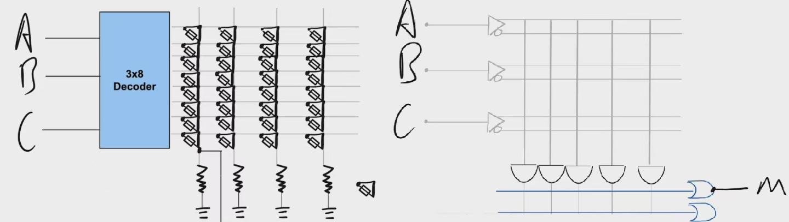
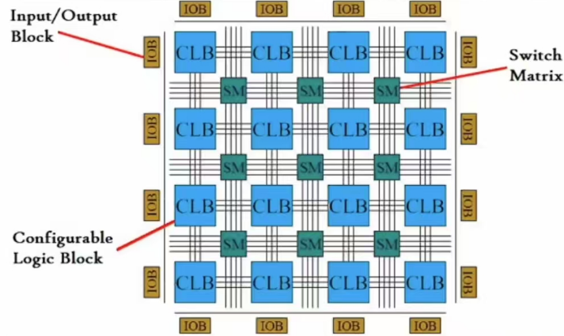
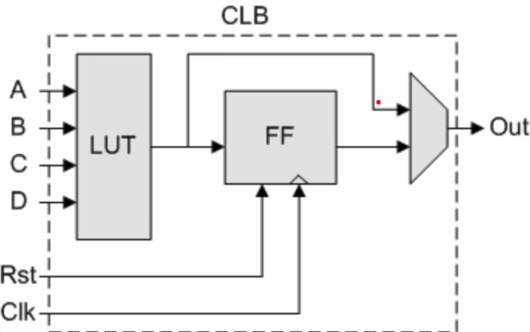
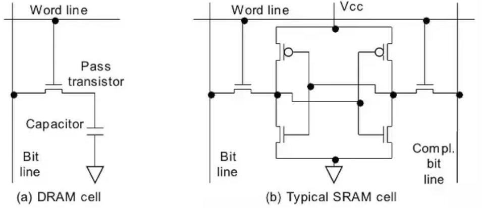
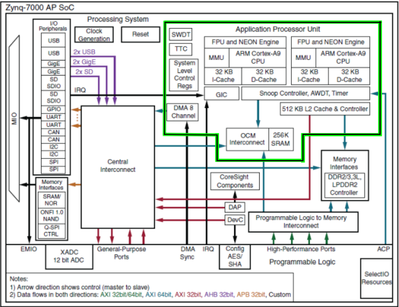

## 可编程逻辑设备发展史

可编程逻辑设备，简称 CLD（Configurable Logic Device），即可通过编程配置逻辑功能的设备，是 FPGA 的上级概念。早期的 CLD 设备包括 PROM、PLA、PAL 等。

由于组合逻辑函数都可用真值表来表示，故 PROM 是天然的 CLD。通过施加电压熔断保险丝的方式控制连接矩阵中每个节点的通断，这里的图中就是用 PROM 的一列存储了一个真值表。PLA（Programmable Logic Array）是早期专为硬件编程设计的器件，仍然用保险丝实现编程。将逻辑函数写成 SOP（Sum of Product）形式，就可以用 PLA 实现。PAL 在 PLA 的基础上，固定了或门，只允许与门的编程，同时加入了一些时序逻辑的电路，牺牲了逻辑函数实现的密度，简化了结构，降低了成本。



1984 年，赛灵思发明了第一块 FPGA 芯片 XC2064，将 IO 移到边上，把芯片做成 CLB 矩阵的形式，使得任意两个 CLB 可通过中间的 Programmable Interconnect 相连，解决了 PAL 这种内部晶体管增长速度远大于与或门连接部分的针脚增长速度，导致随着芯片规模增大，内部延迟增加的问题。



CLB 是 FPGA 的编程部分，其中包含查找表 LUT（Lookup Table）和触发器 FF（Flip-Flops）。LUT 是存储真值表的介质，通过 SRAM 实现编程，可以反复编程且不用刷新电子，





## 关于 FPGA

FPGA 中由软件来优化资源，即用最少的 CLB 实现逻辑函数。LUT 还可用作分布式 RAM，作为快速高效的 on-chip memory。FPGA 里面所有东西基本都可以自由配置，比如 IO 可配置来适配不同的协议。此外 FPGA 还拥有很高的并行度，由于任意的 CLB 通过中间的 Programmable Interconnect 相连，这意味着可以在一块芯片里只对部分的 CLB 编程，因此一块芯片可以同时执行不同的功能，或者以流水线的形式在不同时刻对数据做不同的处理。FPGA 的工作方式与 GPU 类似，也是以加速卡的形式通过 PCIE 直接和 CPU 连接，把一些本该在 CPU 上由软件执行的工作 offload 到硬件电路上进行。用 FPGA 进行视频处理，通过这个 pipeline，可以对视频流作任何形式的处理，延迟也会非常地可控。

### 基本结构

FPGA 基本结构一般由五部分组成，分别为可编程输入/输出单元、基本可编程逻辑单元、嵌入式块 RAM、布线资源和 IP 硬核单元，如下图所示：


### 开发流程

FPGA 开发流程包括：设计 Design（模块和测试）、分析和综合 Synthesis（编译 Compiling）、功能仿真 Simulation、性能分析 Analysis、布局布线 Implementation、生成比特流和板级调试。

设计阶段需要用硬件描述语言编写功能模块以及相应的测试方案，对于 FIFO、RAM、ROM 等常用的功能，有现成的轮子，即 IP 核（Intellectual Property）可以使用；分析和综合即使用专业 EDA（如 Vivado、Quartus、ISE 等）中的工具，对逻辑描述内容进行分析并得到逻辑门级别的电路；功能仿真即用于验证功能；布局布线即分配引脚（layout--> IO panning）确定内部电路连接关系；分析性能有时序仿真、静态时序分析两种方式，主要是看延迟时间是否在允许范围内；最后将生成的比特流下载到目标板上进行板级调试。

## ZYNQ

ZYNQ 是 Xilinx 推出的一系列片上系统（SoC）型 FPGA 产品，它将传统 FPGA 的可编程逻辑（PL）与 ARM 处理器核心（PS）深度集成，形成独特的异构计算架构。通过 AXI（Advanced eXtensible Interface）总线实现 PS 与 PL 间的低延迟数据传输，这也是 Zynq 上主要的数据通信机制。所有的 Zynq-7000 芯片具有相同的架构，以 ARM 处理器系统为基础，与 Microbraze 这样的软核处理器不同，它是一颗专用的硬核处理器，不占用 FPGA 的逻辑资源，并且比 Microbraze 有更高的性能。

PS 具有固定的架构，包含了处理器和系统的存储器；而 PL 完全是灵活的，给了设计者一块“空白画布”来创建定制的外设。在 ZYNQ 上，PS 端为 ARM-Cortex A9 内核。ARM Cortex-A9 是一个应用级的处理器，能运行像 Linux 这样的操作系统，而可编程逻辑是基于 Xilinx 7 系列的 FPGA 架构。ZYNQ 架构实现了工业标准的 AXI 接口，在芯片的两个部分之间实现了高带宽、低延迟的连接。PS 和 PL 端的协同设计是 Zynq 嵌入式系统设计的重要部分，PL 适合并行流处理，而 PS 适合控制或具有串行执行特性的部分以及浮点计算等。


另外，Zynq 处理器系统并非只有 ARM 处理器，除了一个应用处理器单元(APU)，还有拓展外设接口、cache 存储器、存储器接口、互联接口和时钟发生电路等。



ZYNQ 命名规则：以 ZYNQ“XC7Z020-CLG400-2”为例，“XC”是“Xilinx 公司”；“7”是 7 系列（Series）；“Z”是型号是 zynq；“020”是价值索引（Value Index），该数值越大对应芯片内部资源越丰富，价值越高；“clg400”芯片封装信息，“CLG”是芯片制造工艺信息，“400”是芯片封装引脚计数（Package Pin Count）；“-2”是速度等级（Speed Grade）；“-I”是温度等级（Temperature Grade），温度等级有三种标准，分别是“C”、“E”与“I”。

## Verilog 语法

Verilog HDL（简称 Verilog ）是一种硬件描述语言，用于数字电路的系统设计。可对算法级、门级、开关级等多种抽象设计层次进行建模。Verilog 继承了 C 语言的多种操作符和结构，与另一种硬件描述语言 VHDL 相比，语法不是很严格，代码更加简洁，更容易上手。Verilog 不仅定义了语法，还对语法结构都定义了清晰的仿真语义。因此，Verilog 编写的数字模型就能够使用 Verilog 仿真器进行验证。

### 主要特性

- 可采用 3 种不同的方式进行设计建模：行为级描述——使用过程化结构建模；数据流描述——使用连续赋值语句建模；结构化方式——使用门和模块例化语句描述。
- 两类数据类型：线网（wire）数据类型与寄存器（reg）数据类型，线网表示物理元件之间的连线，寄存器表示抽象的数据存储元件。
- 能够描述层次设计，可使用模块实例化描述任何层次。
- 用户定义原语（UDP）创建十分灵活。原语既可以是组合逻辑，也可以是时序逻辑。
- 可提供显示语言结构指定设计中的指定端口到端口的时延，以及路径时延和时序检查。
- Verilog 支持其他编程语言接口（PLI）进行进一步扩展。PLI 允许外部函数访问 Verilog 模块内部信息，为仿真提供了更加丰富的测试方法。
- 同一语言可用于生成模拟激励和指定测试的约束条件。
- 设计逻辑功能时，设计者可不用关心不影响逻辑功能的因素，例如工艺、温度等。

### 设计方法

Verilog 的设计多采用自上而下的设计方法（top-down）。即先定义顶层模块功能，进而分析要构成顶层模块的必要子模块；然后进一步对各个模块进行分解、设计，直到到达无法进一步分解的底层功能块。这样，可以把一个较大的系统，细化成多个小系统，从时间、工作量上分配给更多的人员去设计，从而提高了设计速度，缩短了开发周期。

### 设计流程


Verilog 的设计流程，一般包括以下几个步骤：

**需求分析**

工作人员需要对用户提出的功能要求进行分析理解，做出电路系统的整体规划，形成详细的技术指标，确定初步方案。例如，要设计一个电子屏，需要考虑供电方式、工作频率、产品体积、成本、功耗等，电路实现采用 ASIC 还是选用 FPGA/CPLD 器件等。

**功能划分**

正确地分析了用户的电路需求后，就可以进行逻辑功能的总体设计，设计整个电路的功能、接口和总体结构，考虑功能模块的划分和设计思路，各子模块的接口和时序（包括接口时序和内部信号的时序）等，向项目组成员合理分配子模块设计任务。

**文本描述**

可以用任意的文本编辑器，也可以用专用的 HDL 编辑环境，对所需求的数字电路进行设计建模，保存为 **.v** 文件。

**功能仿真（前仿真）**

对建模文件进行编译，对模型电路进行功能上的仿真验证，查找设计的错误并修正。

此时的仿真验证并没有考虑到信号的延迟等一些 timing 因素，只是验证逻辑上的正确性。

**逻辑综合**

综合（synthesize），就是在标准单元库和特定的设计约束的基础上，将设计的高层次描述（Verilog 建模）转换为门级网表的过程。逻辑综合的目的是产生物理电路门级结构，并在逻辑、时序上进行一定程度的优化，寻求逻辑、面积、功耗的平衡，增强电路的可测试性。

但不是所有的 Verilog 语句都是可以综合成逻辑单元的，例如时延语句。

**布局布线**

根据逻辑综合出的网表与约束文件，利用厂家提供的各种基本标准单元库，对门级电路进行布局布线。至此，已经将 Verilog 设计的数字电路，设计成由标准单元库组成的数字电路。

**时序仿真（后仿真）**

布局布线后，电路模型中已经包含了时延信息。利用在布局布线中获得的精确参数，用仿真软件验证电路的时序。单元器件的不同、布局布线方案都会给电路的时序造成影响，严重时会出现错误。出错后可能就需要重新修改 RTL（寄存器传输级描述，即 Verilog 初版描述），重复后面的步骤。这样的过程可能反复多次，直至错误完全排除。

**FPGA/CPLD 下载或 ASIC 制造工艺生产**

完成上面所有步骤后，就可以通过开发工具将设计的数字电路目标文件下载到 FPGA/CPLD 芯片中，然后在电路板上进行调试、验证。

如果要在 ASIC 上实现，则需要制造芯片。一般芯片制造时，也需要先在 FPGA 板卡上进行逻辑功能的验证。

### HelloWorld

testbench 文件名字需要和 testbench 里的 top module 名字保持一致，否则后续启动 Modelsim 时会报错，不能进行正常的仿真。

```verilog
//counter_10.v
module counter_10( //顶层模块名要与文件名一致
    input rstn,
    input clk,
    output [3:0] cnt,
    output cout
);
    reg [3:0] cnt_temp;
    always@ (posedge clk or negedge rstn) begin
        if(!rstn)begin
            cnt_temp <= 4'b0;
        end
        else if(cnt_temp == 4'd9) begin
            cnt_temp <= 4'b0000;
        end
        else begin
            cnt_temp <= cnt_temp + 1'b1;
        end
    end

    assign cout = (cnt_temp == 4'd9);
    assign cnt = cnt_temp;
endmodule
```

```verilog
//counter_10_tb.v
`timescale 1ns / 1ns
module counter_10_tb();
    reg clk;
    reg rstn;
    wire [3:0] cnt;
    wire cout;

counter_10 counter_10_instance (
    .clk(clk),
    .cnt(cnt),
    .cout(cout),
    .rstn(rstn)
);
initial
begin
    clk = 1'b0;
    rstn = 1'b0;
    #51;
    rstn = 1'b1;
    $display("Running testbench");
end

always
begin
    #10;
    clk = ~clk;
end

endmodule
```

==例化的名称必须以模块名开头？==

### 基础语法

区分大小写，推荐换行，每个语句以分号结束，空白符没有实际意义，注释同 C 语言

标识符（identifier）可以是任意一组字母、数字、**$** 符号和 **\_**(下划线)符号的合，但标识符的第一个字符必须是字母或者下划线，不能以数字或者美元符开始。关键字是 Verilog 中预留的用于定义语言结构的特殊标识符。Verilog 中关键字全部为小写。

### 数值表示

Verilog HDL 有下列四种基本的值来表示硬件电路中的电平逻辑：

- 0：逻辑 0 或 "假"
- 1：逻辑 1 或 "真"
- x 或 X：未知
- z 或 Z：高阻

**x** 意味着信号数值的不确定，即在实际电路里，信号可能为 1，也可能为 0。

**z** 意味着信号处于高阻状态，常见于信号（input, reg）没有驱动时的逻辑结果。例如一个 pad 的 input 呈现高阻状态时，其逻辑值和上下拉的状态有关系。上拉则逻辑值为 1，下拉则为 0 。

数字声明时，合法的基数格式有 4 种，包括：十进制('d 或 'D)，十六进制('h 或 'H)，二进制（'b 或 'B），八进制（'o 或 'O）。数值可指明位宽，也可不指明位宽，建议指明位宽

```verilog
4‘b1011;
32'h3022_c0de; // 下划线增强可读性
```

不指明位宽：一般直接写数字时，默认为十进制表示，例如下面的 3 种写法是等效的：

```verilog
counter = ’d100; //一般会根据编译器自动分频位宽，常见的为32bit
counter = 100;
counter = 32'h64;
```

负数表示通常在表示位宽的数字前面加一个减号来表示负数，减号放在基数和数字之间是非法的。

```verilog
-6'd15;
-15
5'b1_0001;
6'b11_0001; // 二进制中以补码表示，即正数部分逐位取反再加一
```

实数可以十进制或科学计数法表示

```verilog
1e-3;
0.001
```

字符串是由双引号包起来的字符队列。字符串不能多行书写，即字符串中不能包含回车符。Verilog 将字符串当做一系列的单字节 ASCII 字符队列。例如，为存储字符串 "www.runoob.com", 需要 14\*8bit 的存储单元。例如：

```verilog
reg [0:14*8-1] str;
initial begin
    str = "www.runoob.com";
end
```

### 数据类型

Verilog 最常用的 2 种数据类型就是线网（wire）与寄存器（reg），其余类型可以理解为这两种数据类型的扩展或辅助。

wire 类型表示硬件单元之间的物理连线，由其连接的器件输出端连续驱动。如果没有驱动元件连接到 wire 型变量，缺省值一般为 "Z"。线网型还有其他数据类型，包括 wand，wor，wri，triand，trior，trireg 等。这些数据类型用的频率不是很高，这里不做介绍。

寄存器（reg）用来表示存储单元，它会保持数据原有的值，直到被改写。例如在 always 块中，寄存器可能被综合成边沿触发器，在组合逻辑中可能被综合成 wire 型变量。寄存器不需要驱动源，也不一定需要时钟信号。在仿真时，寄存器的值可在任意时刻通过赋值操作进行改写。

在`initial`或`always`块中赋值的变量需要声明为`reg`类型。

当位宽大于 1 时，wire 或 reg 即可声明为向量的形式，可以指定向量的某一位或若干相邻位，作为其他逻辑使用。Verilog 支持可变的向量域选择，如

```verilog
// byte1 是一个 4 字节的存储器，每个元素都是 8 位宽的寄存器
reg [31:0] data1;
reg [7:0] byte1 [3:0]; // 数组变量
integer j;
always@* begin
    for (j=0; j<=3; j=j+1) begin
        byte1[j] = data1[(j+1)*8-1 : j*8];
        //把data1[7:0]…data1[31:24]依次赋值给byte1[0][7:0]…byte[3][7:0]
    end
end
```

Verillog 还支持指定 bit 位后固定位宽的向量域选择访问。

- **[bit+: width]** : 从起始 bit 位开始递增，位宽为 width。
- **[bit-: width]** : 从起始 bit 位开始递减，位宽为 width。

```verilog
A = data1[31:24];
A = data1[31-:8];
B = data1[0:7];
B = data1[0+:8]
```

对信号重新进行组合成新的向量时，需要借助大括号。例如：

```verilog
wire [31:0] temp1, temp2;
assign temp1 = {byte1[0][7:0], data1[31:8]};
assign temp2 = {32{1'b0}};
```

整数，实数，时间等数据类型实际也属于寄存器类型。

整数类型用关键字 integer 来声明。声明时不用指明位宽，位宽和编译器有关，一般为 32 bit。reg 型变量为无符号数，而 integer 型变量为有符号数。实数用关键字 real 来声明，可用十进制或科学计数法来表示。实数声明不能带有范围，默认值为 0。如果将一个实数赋值给一个整数，则只有实数的整数部分会赋值给整数。

```verilog
real data1;
integer temp;
initial begin
    data1 = 2e3;
    data1 = 3.75;
end

initial begin
    temp = data; // temp = 3
end
```

Verilog 使用特殊的时间寄存器 time 型变量，对仿真时间进行保存。其宽度一般为 64 bit，通过调用系统函数 $time 获取当前仿真时间。例如：

```verilog
time current_time
initial begin
    #100
    current_time = $time;
end
```

在 Verilog 中允许声明 reg, wire, integer, time, real 及其向量类型的数组。数组维数没有限制。线网数组也可以用于连接实例模块的端口。数组中的每个元素都可以作为一个标量或者向量，以同样的方式来使用，形如：**<数组名>[<下标>]**。对于多维数组来讲，用户需要说明其每一维的索引。例如：

```verilog
integer flag[7:0];
reg [3:0] counter[3:0];
wire [7:0] addr_bus[3:0];
wire data_bit[7:0][5:0];
reg [31:0] data_4d[11:0][3:0][3:0][255:0];

flag[1] =  32'd0;
counter[3] = 4'hF;
assign addr_bus[0] = 8'b0;
assign data_bit[0][1] = 1'b0;
data_4d[0][0][0][0][15:0] = 15'd3;
```

==assign 和=的区别==

虽然数组与向量（位宽大于一为向量）的访问方式在一定程度上类似，但不要将向量和数组混淆。向量是一个单独的元件，位宽为 n；数组由多个元件组成，其中每个元件的位宽为 n 或 1。它们在结构的定义上就有所区别。存储器变量就是一种寄存器数组，可用来描述 RAM 或 ROM 的行为。

规范：向量定义的中括号要空格，数组定义的中括号不空格。

参数用来表示常量，用关键字 parameter 声明，只能赋值一次。但是，通过实例化的方式，可以更改参数在模块中的值。局部参数用 localparam 来声明，其作用和用法与 parameter 相同，区别在于它的值不能被改变。所以当参数只在本模块中调用时，可用 localparam 来说明。

```verilog
parameter data_width = 10'd32;
parameter i=1, j=2, k=3;
parameter mem_size = data_width * 10;
```

字符串保存在 reg 类型的变量中，每个字符占用一个字节（8bit）。因此寄存器变量的宽度应该足够大，以保证不会溢出。字符串不能多行书写，即字符串中不能包含回车符。如果寄存器变量的宽度大于字符串的大小，则使用 0 来填充左边的空余位；如果寄存器变量的宽度小于字符串大小，则会截去字符串左边多余的数据。有一些特殊字符在显示字符串中有特殊意义，例如换行符，制表符等。如果需要在字符串中显示这些特殊的字符，则需要在前面加前缀转义字符\。

其实，在 SystemVerilog（主要用于 Verilog 仿真的编程语言）语言中，已经可以直接用关键字 string 来表示字符串变量类型，这为 Verilog 的仿真带来了极大的便利。

### 表达式

表达式由操作符和操作数构成，其目的是根据操作符的意义得到一个计算结果。表达式可以在出现数值的任何地方使用。

```verilog
a^b; // 异或
address[9:0] + 10'b1; // 地址累加
flag1 && flag2; // 逻辑与
```

操作数可以是任意的数据类型，只是某些特定的语法结构要求使用特定类型的操作数。操作数可以为常数，整数，实数，线网，寄存器，时间，位选，域选，存储器及函数调用等。

```verilog
module test;
    real a, b, c;
    c = a + b;

    reg [3:0] cprmu_1, cprmu_2;
    always @ (posedge clk) begin
    	cprmu_2 = cprmu_1 * cprmu_2;
    end

    reg flag;
    flag = calculate_result(A, B);

    reg [3:0] res;
    wire [3:0] temp;
    always @ (*) begin
        res = cprmu_2 - cprmu_1; // always块中的赋值对象不能是wire型
    end
endmodule
```

Verilog 中提供了大约 9 种操作符，分别是算术、关系、等价、逻辑、按位、归约、移位、拼接、条件操作符。大部分操作符与 C 语言中类似。同类型操作符之间，除条件操作符从右往左关联，其余操作符都是自左向右关联。圆括号内表达式优先执行。不同操作符之间，优先级是不同的。下表列出了操作符优先级从高至低的排列顺序。当没有圆括号时，Verilog 会根据操作符优先级对表达式进行计算。为了避免由操作符优先级导致的计算混乱，在不确定优先级时，建议用圆括号将表达式区分开来。

归约操作符（Reduction Operators）是一类特殊操作符，作用是对**单个向量操作数**的所有位进行逻辑运算，最终得到 1 位（bit）的结果 ，常用来判断向量中某些位的整体特征（如是否全 1、是否有 1 等）。

===（全等运算符，严格比较），规则：不做类型转换！值和数据类型都相同，才返回 true ；只要类型或值有一个不同，就返回 false。

==（相等运算符，松散比较）。规则：先尝试类型转换，把不同类型的值转成同一类型后，再比较 “值” 是否相等。日常编码用 `===` 更安全，减少 bug 风险～

双目操作符对 2 个操作数进行算术运算，包括乘（\*）、除（/）、加（+）、减（-）、求幂（）、取模（%）。如果操作数某一位为 X，则计算结果也会全部出现 X。对变量进行声明时，要根据变量的操作符对变量的位宽进行合理声明，不要让结果溢出。上述例子中，相加的 2 个变量位宽为 4bit，那么结果寄存器变量位宽最少为 5bit。否则，高位将被截断，导致结果高位丢失。无符号数乘法时，结果变量位宽应该为 2 个操作数位宽之和。负数表示时，可以直接在十进制数字前面增加一个减号 -，也可以指定位宽。因为负数使用二进制补码来表示，不指定位宽来表示负数，编译器在转换时，会自动分配位宽，从而导致意想不到的结果。因此负数表示必须写位宽来规范。关系操作符中，如果操作数中有一位为 x 或 z，则关系表达式的结果为 x。逻辑相等/不等操作符不能比较 x 或 z，当操作数包含一个 x 或 z，则结果为不确定值。全等比较时，如果按位比较有相同的 x 或 z，返回结果也可以为 1，即全等比较可比较 x 或 z。所以，全等比较的结果一定不包含 x。逻辑操作符的计算结果是一个 1bit 的值，0 表示假，1 表示真，x 表示不确定。如果一个操作数不为 0，它等价于逻辑 1；如果一个操作数等于 0，它等价于逻辑 0。如果它任意一位为 x 或 z，它等价于 x。如果任意一个操作数包含 x，逻辑操作符运算结果不一定为 x。按位操作符对 2 个操作数的每 1bit 数据进行按位操作。如果 2 个操作数位宽不相等，则用 0 向左扩展补充较短的操作数。归约操作符只有一个操作数，它对这个向量操作数逐位进行操作，最终产生一个 1bit 结果。逻辑操作符、按位操作符和归约操作符都使用相同的符号表示，因此有时候容易混淆。区分这些操作符的关键是分清操作数的数目，和计算结果的规则。“左移” 一般默认指逻辑左移，和算术左移的核心区别，在于对 “符号位” 的处理逻辑。逻辑左移：把二进制数当无符号数处理，所有位（包括最高位）都当 “普通数据位” 左移，右侧补 `0` 。算术左移：把二进制数当有符号数处理，会保留符号位不变，仅对数值位左移，右侧补 `0` 。算术左移是为有符号数设计的，保证左移后符号不变；逻辑左移不管符号，纯数据位移动，无符号数两种左移结果相同。算术左移和逻辑左移时，右边低位会补 0。逻辑右移时，左边高位会补 0；而算术右移时，左边高位会补充符号位，以保证数据缩小后值的正确性。拼接操作符用大括号 **{，}** 来表示，用于将多个操作数（向量）拼接成新的操作数（向量），信号间用逗号隔开。拼接符操作数必须指定位宽，常数的话也需要指定位宽。条件表达式类似于 2 路（或多路）选择器，其描述方式完全可以用 if-else 语句代替。当然条件操作符也能进行嵌套，完成一个多次选择的逻辑。例如：

```verilog
assign   hsel = (addr[9:8] == 2'b00) ? hsel_p1 :
                (addr[9:8] == 2'b01) ? hsel_p2 :
                (addr[9:8] == 2'b10) ? hsel_p3 :
                (addr[9:8] == 2'b11) ? hsel_p4 ;
```

### 编译指令

以反引号开始的某些标识符是 Verilog 系统编译指令。在编译阶段，**`define** 用于文本替换，类似于 C 语言中的 **#define**。

一旦 **`define** 指令被编译，其在整个编译过程中都会有效。

**`undef** 用来取消之前的宏定义

```verilog
`ifdef, `ifndef, `elsif, `else, `endif
```

属于条件编译指令

使用 **`include** 可以在编译时将一个 Verilog 文件内嵌到另一个 Verilog 文件中，作用类似于 C 语言中的 #include 结构。该指令通常用于将全局或公用的头文件包含在设计文件里。文件路径既可以使用相对路径，也可以使用绝对路径。

在 Verilog 模型中，时延有具体的单位时间表述，并用 **`timescale** 编译指令将时间单位与实际时间相关联。该指令用于定义时延、仿真的单位和精度，格式为

```verilog
`timescale      time_unit / time_precision
```

时间精度可以和时间单位一样，但是时间精度大小不能超过时间单位大小。

在编译过程中，**`timescale** 指令会影响后面所有模块中的时延值，直至遇到另一个 **`timescale** 指令或 **`resetall** 指令。

由于在 Verilog 中没有默认的 **`timescale**，如果没有指定 **`timescale**，Verilog 模块就有会继承前面编译模块的 **`timescale** 参数。有可能导致设计出错。

如果一个设计中的多个模块都带有 **`timescale** 时，模拟器总是定位在所有模块的最小时延精度上，并且所有时延都相应地换算为最小时延精度，时延单位并不受影响。

如果有并行子模块，子模块间的 `timescale 并不会相互影响。时间精度越小，仿真时占用内存越多，实际使用的仿真时间就越长。所以如果没有必要，应尽量将时间精度设置的大一些。

`default_nettype：指令用于为隐式的线网变量指定为线网类型，即将没有被声明的连线定义为线网类型。

```verilog
`default_nettype none
```

该实例定义后，将不再自动产生 wire 型变量，对于未定义就使用的变量会报 error。

·resetall 该编译器指令将所有的编译指令重新设置为缺省值。**`resetall** 可以使得缺省连线类型为线网类型。当 **`resetall** 加到模块最后时，可以将当前的 **`timescale** 取消防止进一步传递，只保证当前的 **`timescale** 在局部有效，避免 `timescale 的错误继承。

`celldefine, `endcelldefine：这两个程序指令用于将模块标记为单元模块，他们包含模块的定义。例如一些与、或、非门，一些 PLL 单元，PAD 模型，以及一些 Analog IP 等。

`unconnected_drive, `nounconnected_drive

在模块实例化中，出现在这两个编译指令间的任何未连接的输入端口，为正偏电路状态或者为反偏电路状态。

```verilog
`unconnected_drive pull1 // 正偏电路状态，即连接到高电平
`unconnected_drive pull0 // 反偏电路状态，即连接到低电平
```

### 连续赋值

连续赋值语句是 Verilog 数据流建模的基本语句，用于对 wire 型变量进行赋值。

```verilog
assign LHS_target = RHS_expression;
```

需要说明的是：

- LHS_target 必须是一个标量或者线型向量，而不能是寄存器类型。
- RHS_expression 的类型没有要求，可以是标量或线型或存器向量，也可以是函数调用。
- 只要 RHS_expression 表达式的操作数有事件发生（值的变化）时，RHS_expression 就会立刻重新计算，同时赋值给 LHS_target。==意思是程序不执行这一句也会发生重新赋值？所谓并行？==

Verilog 还提供了另一种对 wire 型赋值的简单方法，即在 wire 型变量声明的时候同时对其赋值。wire 型变量只能被赋值一次，因此该种连续赋值方式也只能有一次。

==什么时候用 reg，什么时候用 wire？==

### 时延

连续赋值延时语句中的延时，用于控制任意操作数发生变化到语句左端赋予新值之间的时间延时。

时延一般是不可综合的。

寄存器的时延也是可以控制的，这部分在时序控制里加以说明。

连续赋值时延一般可分为普通赋值时延、隐式时延、声明时延。

下面 3 个例子实现的功能是等效的，分别对应 3 种不同连续赋值时延的写法。

```verilog
//普通时延，A&B计算结果延时10个时间单位赋值给Z
wire Z, A, B;
assign #10 Z = A & B;

//隐式时延，声明一个wire型变量时对其进行包含一定时延的连续赋值。
wire A, B;
wire #10 Z = A & B;

//声明时延，声明一个wire型变量时指定一个时延。因此对该变量所有的连续赋值都会被推迟到指定的时间。除非门级建模中，一般不推荐使用此类方法建模。
wire A, B;
wire #10 Z;
assign Z = A & B;
```

在上述例子中，A 或 B 任意一个变量发生变化，那么在 Z 得到新的值之前，会有 10 个时间单位的时延。如果在这 10 个时间单位内，即在 Z 获取新的值之前，A 或 B 任意一个值又发生了变化，那么计算 Z 的新值时会取 A 或 B 当前的新值。所以称之为惯性时延，即信号脉冲宽度小于时延时，对输出没有影响。因此仿真时，时延一定要合理设置，防止某些信号不能进行有效的延迟。

### 过程结构

过程结构语句有 2 种，initial 与 always 语句。它们是行为级建模的 2 种基本语句。一个模块中可以包含多个 initial 和 always 语句，但 2 种语句不能嵌套使用。这些语句在模块间并行执行，与其在模块的前后顺序没有关系。但是 initial 语句或 always 语句内部可以理解为是顺序执行的（非阻塞赋值除外）。每个 initial 语句或 always 语句都会产生一个独立的控制流，执行时间都是从 0 时刻开始。

initial 语句从 0 时刻开始执行，只执行一次，多个 initial 块之间是相互独立的。如果 initial 块内包含多个语句，需要使用关键字 begin 和 end 组成一个块语句。如果 initial 块内只要一条语句，关键字 begin 和 end 可使用也可不使用。initial 理论上来讲是不可综合的，多用于初始化、信号检测等。

与 initial 语句相反，always 语句是重复执行的。always 语句块从 0 时刻开始执行其中的行为语句；当执行完最后一条语句后，便再次执行语句块中的第一条语句，如此循环反复。由于循环执行的特点，always 语句多用于仿真时钟的产生，信号行为的检测等。

### 过程赋值

过程性赋值是在 initial 或 always 语句块里的赋值，赋值对象是寄存器、整数、实数等类型。

这些变量在被赋值后，其值将保持不变，直到重新被赋予新值。

**连续性赋值总是处于激活状态，任何操作数的改变都会影响表达式的结果；过程赋值只有在语句执行的时候，才会起作用。这是连续性赋值与过程性赋值的区别。**

Verilog 过程赋值包括 2 种语句：阻塞赋值与非阻塞赋值。阻塞赋值属于顺序执行，即下一条语句执行前，当前语句一定会执行完毕。阻塞赋值语句使用等号 **=** 作为赋值符。前面的仿真中，initial 里面的赋值语句都是用的阻塞赋值。非阻塞赋值属于并行执行语句，即下一条语句的执行和当前语句的执行是同时进行的，它不会阻塞位于同一个语句块中后面语句的执行。非阻塞赋值语句使用小于等于号 **<=** 作为赋值符。

实际 Verilog 代码设计时，切记不要在一个过程结构中混合使用阻塞赋值与非阻塞赋值。两种赋值方式混用时，时序不容易控制，很容易得到意外的结果。更多时候，在设计电路时，always 时序逻辑块中多用非阻塞赋值，always 组合逻辑块中多用阻塞赋值；在仿真电路时，initial 块中一般多用阻塞赋值。

如下面的例子，2 个 always 块中语句并行执行，赋值操作右端操作数使用的是上一个时钟周期的旧值，此时 a<=b 与 b<=a 就可以相互不干扰的执行，达到交换寄存器值的目的。

```verilog
always @ (posedge clk) begin
	a <= b;
end

always @ (posedge clk) begin
    b <= a;
end
```

### 时序控制

Verilog 提供了 2 大类时序控制方法：时延控制和事件控制。事件控制主要分为边沿触发事件控制与电平敏感事件控制。

---

基于时延的时序控制出现在表达式中，它指定了语句从开始执行到执行完毕之间的时间间隔。

时延可以是数字、标识符或者表达式。

根据在表达式中的位置差异，时延控制又可以分为常规时延与内嵌时延。

**常规时延**

遇到常规延时时，该语句需要等待一定时间，然后将计算结果赋值给目标信号。

```verilog
reg value_test, value_general;
# 10 value_general = value_test;
```

**内嵌时延**

遇到内嵌延时时，该语句先将计算结果保存，然后等待一定的时间后赋值给目标信号。

内嵌时延控制加在赋值号之后。

```verilog
reg value_test, value_embed;
value_embed = # 10 value_test;
```

当延时语句的赋值符号右端是常量时，2 种时延控制都能达到相同的延时赋值效果。当延时语句的赋值符号右端是变量时，2 种时延控制可能会产生不同的延时赋值效果。一般时延赋值方式：遇到延迟语句后先延迟一定的时间，然后将当前操作数赋值给目标信号，并没有"惯性延迟"的特点，不会漏掉相对较窄的脉冲。内嵌时延赋值方式：遇到延迟语句后，先计算出表达式右端的结果，然后再延迟一定的时间，赋值给目标信号。

---

**事件控制**

**边沿触发事件控制**

在 Verilog 中，事件是指某一个 reg 或 wire 型变量发生了值的变化。基于事件触发的时序控制又主要分为以下几种。

**一般事件控制**

事件控制用@表示，语句执行的条件是信号的值发生特定的变化。关键字 posedge 指信号发生边沿正向跳变，negedge 指信号发生负向边沿跳变，未指明跳变方向时，则 2 种情况的边沿变化都会触发相关事件。例如：

```verilog
always @ (clk) q <= d; // 信号clk只要发生变化，就执行q<=d，双边沿D触发器模型
always @ (posedge clk) q <= d; //在信号clk上升沿时刻，执行q<=d，正边沿D触发器模型
always @ (negedge clk) q <= d; //在信号clk下降沿时刻，执行q<=d，负边沿D触发器模型

q = @ (posedge clk) d; //立刻计算d的值，并在clk上升沿时刻赋值给q，不推荐这种写法
```

不推荐最后一种写法的原因是，=是阻塞赋值，不符合常规的过程赋值语法规范，即阻塞赋值通常用于组合逻辑或明确的 “立即执行” 场景。事件控制更常见于 always 块的敏感列表或 always 块内的时序控制。若在 `initial` 块或普通 `always` 块（非时序逻辑专用的 `always` 块）中使用，容易打破 “组合逻辑并行、时序逻辑同步触发” 的设计习惯；若在复杂场景（如多个信号交互、多时钟域）中使用，会导致仿真行为与硬件电路的实际并行执行逻辑脱节。Verilog 中，时序逻辑（如 D 触发器）的标准写法是用 `always` 块 + 非阻塞赋值（`<=`）

**命名事件控制**

用户可以声明 event（事件）类型的变量，并触发该变量来识别该事件是否发生。命名事件用关键字 event 来声明，触发信号用 **->** 表示。

```verilog
event start_receiving;
always @ (posedge clk_sample) begin
    -> start_receiving;
end

always @ (start_receiving) begin
    data_buf = {data_if[0], data_if[1]};
end
```

当多个信号或事件中任意一个发生变化都能够触发语句的执行时，Verilog 中使用"或"表达式来描述这种情况，用关键字 **or** 连接多个事件或信号。这些事件或信号组成的列表称为"敏感列表"。当然，or 也可以用逗号 **,** 来代替。例如：

```verilog
always @ (posedge clk or negedge rstn) begin
    if (!rstn) begin
    	q <= 1'b;
    end
    else begin
    	q <= d;
    end
end
```

当组合逻辑输入变量很多时，那么编写敏感列表会很繁琐。此时，更为简洁的写法是 **@\*** 或 **@(\*)**，表示对语句块中的所有输入变量的变化都是敏感的。例如：

```verilog
always @ (*) begin
	assign s = a ? b+c : d ? e+f
end
```

**电平敏感事件控制**

前面所讨论的事件控制都是需要等待信号值的变化或事件的触发，使用 **@+敏感列表** 的方式来表示的。

Verilog 中还支持使用电平作为敏感信号来控制时序，即后面语句的执行需要等待某个条件为真。Verilog 中使用关键字 wait 来表示这种电平敏感情况。例如：

```verilog
initial begin
    wait (start_enable);
    forever begin
        @ (posedge clk_sample);
    	data_buf = {data_if[0], data_if[1]};
	end
end
```

### 语句块

Verilog 语句块提供了将两条或更多条语句组成语法结构上相当于一条一句的机制。主要包括两种类型：顺序块和并行块。顺序块用关键字 begin 和 end 来表示。顺序块中的语句是一条条执行的。当然，非阻塞赋值除外。顺序块中每条语句的时延总是与其前面语句执行的时间相关。并行块有关键字 fork 和 join 来表示。并行块中的语句是并行执行的，即便是阻塞形式的赋值。并行块中每条语句的时延都与块语句开始执行的时间相关。顺序块和并行块还可以嵌套使用。

可以给块语句结构命名。命名的块中可以声明局部变量，通过层次名引用的方法对变量进行访问。

```verilog
`timescale 1ns/1ns

module test;

    initial begin: runoob   //命名模块名字为runoob，分号不能少
        integer    i ;       //此变量可以通过test.runoob.i 被其他模块使用
        i = 0 ;
        forever begin
            #10 i = i + 10 ;
        end
    end

    reg stop_flag ;
    initial stop_flag = 1'b0 ;
    always begin : detect_stop
        if ( test.runoob.i == 100) begin //i累加10次，即100ns时停止仿真
            $display("Now you can stop the simulation!!!");
            stop_flag = 1'b1 ;
        end
        #10 ;
    end

endmodule
```

命名的块也可以被禁用，用关键字 disable 来表示。disable 可以终止命名块的执行，可以用来从循环中退出、处理错误等。与 C 语言中 break 类似，但是 break 只能退出当前所在循环，而 disable 可以禁用设计中任何一个命名的块。disable 可退出当前的 while 块。需要说明的是，disable 在 always 或 forever 块中使用时只能退出当前回合，下一次语句还是会在 always 或 forever 中执行。因为 always 块和 forever 块是一直执行的，此时的 disable 有点类似 C 语言中的 continue 功能。

==always 和 forever 的区别==

```verilog
`timescale 1ns/1ns

module test;

    initial begin: runoob_d //命名模块名字为runoob_d
        integer    i_d ;
        i_d = 0 ;
        while(i_d<=100) begin: runoob_d2
            # 10 ;
            if (i_d >= 50) begin       //累加5次停止累加
                disable runoob_d3.clk_gen ;//stop 外部block: clk_gen
                disable runoob_d2 ;       //stop 当前block: runoob_d2
            end
            i_d = i_d + 10 ;
        end
    end

    reg clk ;
    initial begin: runoob_d3
        while (1) begin: clk_gen  //时钟产生模块
            clk=1 ;      #10 ;
            clk=0 ;      #10 ;
        end
    end

endmodule
```

### 条件语句

```verilog
if (condition1)       true_statement1 ;
else if (condition2)        true_statement2 ;
else if (condition3)        true_statement3 ;
else                      default_statement ;
```

如果要执行多条语句，使用 begin 和 end 即可。事例中 if 条件每次执行的语句只有一条，没有使用 begin 与 end 关键字。但如果是 if-if-else 的形式，即便执行语句只有一条，不使用 begin 与 end 关键字也会引起歧义。当然，编译器一般按照就近原则，使 else 与最近的一个 if（例子中第二个 if）相对应。但显然这样的写法是不规范且不安全的。所以条件语句中加入 begin 与 and 关键字就是一个很好的习惯。

### 多路分支语句

```verilog
case(case_expr)
    condition1     :             true_statement1 ;
    condition2     :             true_statement2 ;
    ……
    default        :             default_statement ;
endcase
```

default 语句是可选的，且在一个 case 语句中不能有多个 default 语句。条件选项可以有多个，不仅限于 condition1、condition2 等，而且这些条件选项不要求互斥。虽然这些条件选项是并发比较的，但执行效果是谁在前且条件为真谁被执行。ture_statement1 等执行语句可以是一条语句，也可以是多条。如果是多条执行语句，则需要用 begin 与 end 关键字进行说明。case 语句支持嵌套使用。case 语句中的条件选项表单式不必都是常量，也可以是 x 值或 z 值。当多个条件选项下需要执行相同的语句时，多个条件选项可以用逗号分开，放在同一个语句块的候选项中。但是 case 语句中的 x 或 z 的比较逻辑是不可综合的，所以一般不建议在 case 语句中使用 x 或 z 作为比较值。

```verilog
case(sel)
    2'b00:   sout_t = p0 ;
    2'b01:   sout_t = p1 ;
    2'b10:   sout_t = p2 ;
    2'b11:     sout_t = p3 ;
    2'bx0, 2'bx1, 2'bxz, 2'bxx, 2'b0x, 2'b1x, 2'bzx :
        sout_t = 2'bxx ;
    2'bz0, 2'bz1, 2'bzz, 2'b0z, 2'b1z :
        sout_t = 2'bzz ;
    default:  $display("Unexpected input control!!!");
endcase
```

casex、 casez 语句是 case 语句的变形，用来表示条件选项中的无关项。

casex 用 "x" 来表示无关值，casez 用问号 "?" 来表示无关值。

两者的实现的功能是完全一致的，语法与 case 语句也完全一致。

但是 casex、casez 一般是不可综合的，多用于仿真。

### 循环语句

Verilog 循环语句有 4 种类型，分别是 while，for，repeat，和 forever 循环。循环语句只能在 always 或 initial 块中使用，但可以包含延迟表达式。当然，执行语句只有一条时，关键字 begin 与 end 可以省略。需要注意的是，i = i + 1 不能像 C 语言那样写成 i++ 的形式，i = i -1 也不能写成 i -- 的形式。repeat 的功能是执行固定次数的循环，它不能像 while 循环那样用一个逻辑表达式来确定循环是否继续执行。repeat 循环的次数必须是一个常量、变量或信号。如果循环次数是变量信号，则循环次数是开始执行 repeat 循环时变量信号的值。即便执行期间，循环次数代表的变量信号值发生了变化，repeat 执行次数也不会改变。forever 语句表示永久循环，不包含任何条件表达式，一旦执行便无限的执行下去，系统函数 $finish 可退出 forever。forever 相当于 while(1) 。通常，forever 循环是和时序控制结构配合使用的。

```verilog
while (condition) begin
    …
end

for(initial_assignment; condition ; step_assignment)  begin
    …
end

repeat (loop_times) begin
    …
end

forever begin
    …
end
```

使用 forever 语句产生一个时钟：

```verilog
~timescale 1ns / 1ns
reg clk;
initial begin
	clk = 0;
    forever begin
    	#5 clk = ~clk;
    end
end
```

### 过程连续赋值

==这一节没咋看懂==

过程连续赋值是过程赋值的一种。这种赋值语句能够替换其他所有 wire 或 reg 的赋值，改写了 wire 或 reg 型变量的当前值。与过程赋值不同的是，过程连续赋值的表达式能被连续的驱动到 wire 或 reg 型变量中，即过程连续赋值发生作用时，右端表达式中任意操作数的变化都会引起过程连续赋值语句的重新执行。过程连续性赋值主要有 2 种，assign-deassign 和 force-release。

assign（过程赋值操作）与 deassign （取消过程赋值操作）表示第一类过程连续赋值语句。赋值对象只能是寄存器或寄存器组，而不能是 wire 型变量。赋值过程中对寄存器连续赋值，寄存器中的值被保留直到被重新赋值。

```verilog
module diff_assign(
    input rstn,
    input clk,
    input D,
    output reg Q);

    always @ (posedge clk) begin
    	Q <= D;
    end

    always @ (negedge rstn) begin
        if (!rstn) begin
        	assign Q = 1'b0;
        end
        else begin
        	deassign Q;
        end
    end
endmodule
```

force （强制赋值操作）与 release（取消强制赋值）表示第二类过程连续赋值语句。使用方法和效果，和 assign 与 deassign 类似，但赋值对象可以是 reg 型变量，也可以是 wire 型变量。因为是无条件强制赋值，一般多用于交互式调试过程，不要在设计模块中使用。当 force 作用在寄存器上时，寄存器当前值被覆盖；release 时该寄存器值将继续保留强制赋值时的值。之后，该寄存器的值可以被原有的过程赋值语句改变。当 force 作用在线网上时，线网值也会被强制赋值。但是，一旦 release 该线网型变量，其值马上变为原有的驱动值。

十进制计数器测试：

```verilog
`timescale 1ns/1ns

module test ;
    reg          rstn ;
    reg          clk ;
    reg [3:0]    cnt ;
    wire         cout ;

    counter10     u_counter (
        .rstn    (rstn),
        .clk     (clk),
        .cnt     (cnt),
        .cout    (cout));

    initial begin
        clk       = 0 ;
        rstn      = 0 ;
        #10 ;
        rstn      = 1'b1 ;
        wait (test.u_counter.cnt_temp == 4'd4) ;
        @(negedge clk) ;
        force     test.u_counter.cnt_temp = 4'd6 ;
        force     test.u_counter.cout     = 1'b1 ;
        #40 ;
        @(negedge clk) ;
        release   test.u_counter.cnt_temp ;
        release   test.u_counter.cout ;
    end

    initial begin
        clk = 0 ;
        forever #10 clk = ~ clk ;
    end

    //finish the simulation
    always begin
        #1000;
        if ($time >= 1000) $finish ;
    end

endmodule // test
```

### 模块与端口

结构建模方式有 3 类描述语句： Gate（门级）例化语句，UDP (用户定义原语)例化语句和 module (模块) 例化语句。本次主要讲述使用最多的模块级例化语句。模块是 Verilog 中基本单元的定义形式，是与外界交互的接口。

```verilog
module module_name
    #(parameter_list)
    (port_list);
    // Declarations and Statements;
endmodule
```

模块定义必须以关键字 module 开始，以关键字 endmodule 结束。模块名，端口信号，端口声明和可选的参数声明等，出现在设计使用的 Verilog 语句（图中 Declarations_and_Statements）之前。模块内部有可选的 5 部分组成，分别是变量声明，数据流语句，行为级句，低层模块例化及任务和函数，如下图表示。这 5 部分出现顺序、出现位置都是任意的。但是，各种变量都应在使用之前声明。变量具体声明的位置不要求，但必须保证在使用之前的位置。


端口是模块与外界交互的接口。对于外部环境来说，模块内部是不可见的，对模块的调用只能通过端口连接进行。模块的定义中包含一个可选的端口列表，一般将不带类型、不带位宽的信号变量罗列在模块声明里。一个模块如果和外部环境没有交互，则可以不用声明端口列表。

```verilog
module pad(
    DIN, OEN, PULL, DOUT, PAD);
    input DIN, OEN;
    input [1:0] PULL;
    inout PAD;
    output DOUT

    wire DIN, OEN;
    wire [1:0] PULL;
    wire PAD;
    reg DOUT;
endmodule
```

(1) 端口信号在端口列表中罗列出来以后，就可以在模块实体中进行声明了。根据端口的方向，端口类型有 3 种： 输入（input），输出（output）和双向端口（inout）。input、inout 类型不能声明为 reg 数据类型，因为 reg 类型是用于保存数值的，而输入端口只能反映与其相连的外部信号的变化，不能保存这些信号的值。output 可以声明为 wire 或 reg 数据类型。

(2) 在 Verilog 中，端口隐式的声明为 wire 型变量，即当端口具有 wire 属性时，不用再次声明端口类型为 wire 型。但是，当端口有 reg 属性时，则 reg 声明不可省略。另外，端口方向和端口类型可以同时声明

```verilog
output reg DOUT;
```

(4) 还有一种更简洁且常用的方法来声明端口，即在 module 声明时就陈列出端口及其类型。reg 型端口要么在 module 声明时声明，要么在 module 实体中声明。

```verilog
module pad(
	input wire DIN, OEN,
    input [1:0] wire PULL,
	inout wire PAD,
    output reg DOUT);
```

### 模块例化

在一个模块中引用另一个模块，对其端口进行相关连接，叫做模块例化。模块例化建立了描述的层次。信号端口可以通过位置或名称关联，端口连接也必须遵循一些规则。

命名端口连接：这种方法将需要例化的模块端口与外部信号按照其名字进行连接，端口顺序随意，可以与引用 module 的声明端口顺序不一致，只要保证端口名字与外部信号匹配即可。如果某些输出端口并不需要在外部连接，例化时 可以悬空不连接，甚至删除。一般来说，input 端口在例化时不能删除，否则编译报错，output 端口在例化时可以删除。

```verilog
full_adder u_adder0(
    .Ai(a[0]),
    .Bi(b[0]),
    .Ci(c==1'b1 ? 1'b0 : 1'b1),
    .So(so_bit0),
    .Co(co_temp[0]));
```

顺序端口连接：这种方法将需要例化的模块端口按照模块声明时端口的顺序与外部信号进行匹配连接，位置要严格保持一致。虽然代码从书写上可能会占用相对较少的空间，但代码可读性降低，也不易于调试。有时候在大型的设计中可能会有很多个端口，端口信号的顺序时不时的可能也会有所改动，此时再利用顺序端口连接进行模块例化，显然是不方便的。所以平时，建议采用命名端口方式对模块进行例化。

```verilog
full_adder1  u_adder1(
    a[1], b[1], co_temp[0], so_bit1, co_temp[1]);
```

端口连接规则：

**输入端口**

模块例化时，从模块外部来讲， input 端口可以连接 wire 或 reg 型变量。这与模块声明是不同的，从模块内部来讲，input 端口必须是 wire 型变量。

**输出端口**

模块例化时，从模块外部来讲，output 端口必须连接 wire 型变量。这与模块声明是不同的，从模块内部来讲，output 端口可以是 wire 或 reg 型变量。

**输入输出端口**

模块例化时，从模块外部来讲，inout 端口必须连接 wire 型变量。这与模块声明是相同的。

**悬空端口**

模块例化时，如果某些信号不需要与外部信号进行连接交互，我们可以将其悬空，即端口例化处保留空白即可，上述例子中有提及。

output 端口正常悬空时，我们甚至可以在例化时将其删除。

input 端口正常悬空时，悬空信号的逻辑功能表现为高阻状态（逻辑值为 z）。但是，例化时一般不能将悬空的 input 端口删除，否则编译会报错。一般来说，建议 input 端口不要做悬空处理，无其他外部连接时赋值其常量。

当例化端口与连续信号位宽不匹配时，端口会通过无符号数的右对齐或截断方式进行匹配。

连接端口的信号类型可以是，1）标识符，2）位选择，3）部分选择，4）上述类型的合并，5）用于输入端口的表达式。信号名字可以与端口名字一样，但他们的意义是不一样的，分别代表的是 2 个模块内的信号。

当例化多个相同的模块时，一个一个的手动例化会比较繁琐。用 generate 语句进行多个模块的重复例化，可大大简化程序的编写过程。

==没懂 generate 用法==

```verilog
module full_adder4(
    input [3:0]   a ,   //adder1
    input [3:0]   b ,   //adder2
    input         c ,   //input carry bit

    output [3:0]  so ,  //adding result
    output        co    //output carry bit
    );

    wire [3:0]    co_temp ;
    //第一个例化模块一般格式有所差异，需要单独例化
    full_adder1  u_adder0(
        .Ai     (a[0]),
        .Bi     (b[0]),
        .Ci     (c==1'b1 ? 1'b1 : 1'b0),
        .So     (so[0]),
        .Co     (co_temp[0]));

    genvar        i ;
    generate
        for(i=1; i<=3; i=i+1) begin: adder_gen
        full_adder1  u_adder(
            .Ai     (a[i]),
            .Bi     (b[i]),
            .Ci     (co_temp[i-1]), //上一个全加器的溢位是下一个的进位
            .So     (so[i]),
            .Co     (co_temp[i]));
        end
    endgenerate

    assign co    = co_temp[3] ;

endmodule
```

层次访问：每一个例化模块的名字，每个模块的信号变量等，都使用一个特定的标识符进行定义。在整个层次设计中，每个标识符都具有唯一的位置与名字。Verilog 中，通过使用一连串的 **.** 符号对各个模块的标识符进行层次分隔连接，就可以在任何地方通过指定完整的层次名对整个设计中的标识符进行访问。层次访问多见于仿真中。

### 带参数例化

==这一节先摘抄==

## Xilinx FPGA 入门视频

### 学习内容

Verilog 语法、FPGA 常见设计方法、状态机、线性序列机、常见的通讯驱动和接口设计

### 两选一多路器 Mux2 实践

run implementation：实现设计综合网表（布局布线）

run behavioral simulation：功能仿真

`timescale 1ns/1ns 两个 1ns 分别代表时间单位和时间精度

例化：将模块的端口和测试平台上的接线连接起来

#是仿真延时，不会生成对应的电路，主要是仿真的时候写激励用

tb：test_bench 测试平台

写好的是模块，需要例化，放在测试平台上，给激励信号观察输出结果

open syntehsized design 之后才可以看到 device 图，才可以进行引脚分配

reg 和 wire

RTL（寄存器传输级描述，即 Verilog 初版描述

### 三八译码器实现

```verilog
output reg [7:0] out; // 定义一个八位的、输出方向的、寄存器类型的数据
assign d = {a, 1'b0, b, c}; //{}进行位拼接，此处d为四位。1'b0中的b是描述多位宽信号的格式限定符，其它的还有o、d、h，分别为八、十、十六进制；进制在verilog中可以混杂使用，各进制之间完全等效
always@(*)
```

以 always 块描述的信号赋值，被赋值对象必须定义为 reg

## 参考资料

[ZYNQ 架构介绍](https://zhuanlan.zhihu.com/p/646645247)

[Zynq Soc 介绍](https://fpga.eetrend.com/content/2022/100567012.html)

[FPGA 和硬件加速](https://www.bilibili.com/video/BV1xo4y1c7AD/?vd_source=1d0891b41fe4e23dbf197eaf61dfa468)

[Verilog 语法](https://www.runoob.com/w3cnote/verilog-install.html)
