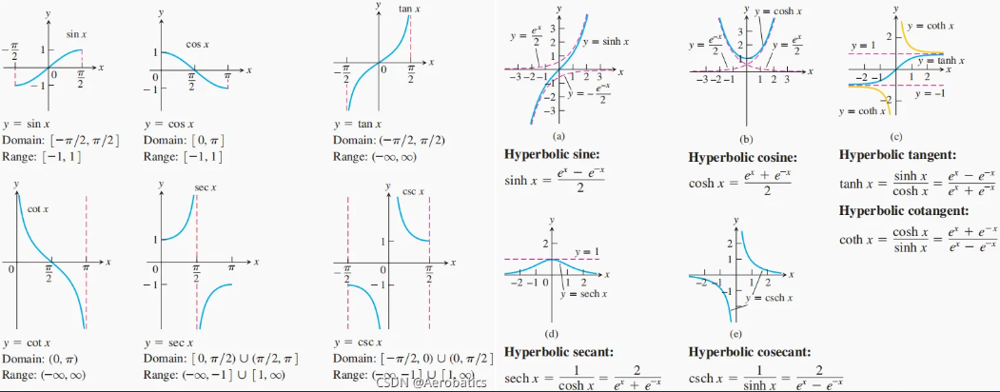
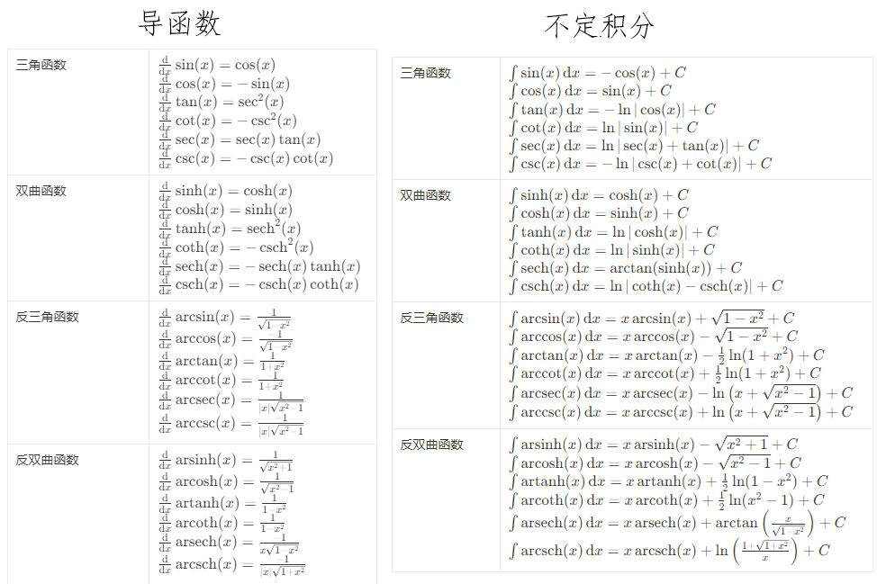

## 三角函数和双曲函数

三角函数是定义在单位圆上的，参数双曲函数是定义在单位等轴双曲线上的。双曲函数和三角函数在复平面上仅仅差一个正交旋转。

函数图像

相关微积分公式

## 函数的凹凸性

拐点：函数的二阶导数等于零且左右两侧二阶导数符号不同的点，函数的凹凸性在此点发生改变

凹凸性：如果一个有实值函数 f 对任意该区间内不相等的$$x$$和$$y$$和任意$$t \in [0, 1]$$有

$$
f(tx+(1−t)y)\geqslant tf(x)+(1−t)f(y)
$$

则称$$f$$在某区间(或者某个向量空间中的凸集)上是凹的

注：国内部分数学教材的定义与国际相反，但经济学教材又与国际相同，此处以维基百科的定义为准，即图像的凹凸性与函数图像感受一致，但函数凹凸性与函数图像相反。

## 极值点和极值

驻点：一元函数中一阶导数为 0 的点，多元函数中所有偏导数同时为 0 的点，是极值点的候选点

极值点：函数取得局部极大值或局部极小值的点。多元函数极值点处所有偏导数为 0(极值点的必要条件是驻点)。一元函数可导的驻点为极值点。二元函数判定驻点中的极值点方法为：计算函数在驻点$$(x_{0},y_{0})$$处的二阶偏导数：$$A = f_{xx}(x_{0},y_{0})$$，$$B = f_{xy}(x_{0},y_{0})$$，$$C = f_{yy}(x_{0},y_{0})$$。

- 若$$AC - B^2>0$$且$$A>0$$，则$$f(x_{0},y_{0})$$是极小值
- 若$$AC - B^2>0$$且$$A<0$$，则$$f(x_{0},y_{0})$$是极大值
- 若$$AC - B^2<0$$，则$$(x_{0},y_{0})$$不是极值点，是鞍点
- 若$$AC - B^2 = 0$$，此方法无法判定

比较开区域内驻点处的函数值和边界上的最值可得到闭区域内函数的最值。

## 梯度和各类导数

导数表征了函数值对自变量微小变化的敏感程度。

- 一元函数导数：设$$f(x)$$在$$x_{0}$$的某邻域有定义且在$$x_{0}$$处连续，若$$\lim_{x \to x_{0}}\frac{f(x) - f(x_{0})}{x - x_{0}}$$存在，则称$$f(x)$$在$$x_{0}$$处可导，称该值为$$f(x)$$在$$x_{0}$$处的导数，记为$$f'(x_{0})$$。类似地可定义高阶导数。反函数的导数为原函数导数的倒数。

- 多元函数偏导数：设函数$$z = f(x,y)$$在点$$(x_{0},y_{0})$$的某一邻域内有定义，若极限$$\lim_{\Delta x\to 0}\frac{f(x_{0}+\Delta x,y_{0})-f(x_{0},y_{0})}{\Delta x}$$存在，则称该值为函数$$z = f(x,y)$$在点$$(x_{0},y_{0})$$处对$$x$$的偏导数，记作$$f_{x}(x_{0},y_{0})$$，$$\frac{\partial z}{\partial x}\vert_{(x_{0},y_{0})}$$，$$\frac{\partial f}{\partial x}\vert_{(x_{0},y_{0})}$$或$$z_{x}\vert_{(x_{0},y_{0})}$$。对$$y$$的偏导数类似。二元函数中，求偏导数相当于在函数的两个方向上求切线斜率。高阶偏导数有纯偏导($$\frac{\partial^2 z}{\partial x^2}$$、$$\frac{\partial^2 z}{\partial y^2}$$)和混合偏导($$\frac{\partial^2 z}{\partial x \partial y}$$、$$\frac{\partial^2 z}{\partial y \partial x}$$)。当二阶偏导数连续时，两个混合偏导相等。

- 多元函数方向导数：设函数$$z = f(x,y)$$在点$$P(x_{0},y_{0})$$的某一邻域$$U(P)$$内有定义，自点$$ P $$引射线$$l$$，设$$ x $$轴正向到射线的转角为$$\varphi$$，在射线上取一点$$P'(x_0 + \Delta x, y_0 + \Delta y) \in U(P)$$，记$$\rho=\sqrt{(\Delta x)^2 + (\Delta y)^2}$$。如果以下极限存在，则称此极限为函数$$f(x,y)$$在点$$ P $$沿方向$$ l $$的方向导数，记作$$\frac{\partial f}{\partial l}\vert{(x_0,y_0)}$$。

  $$
  \lim_{\rho \to 0}\frac{f(x_{0} + \Delta x,y_{0} + \Delta y)-f(x_{0},y_{0})}{\rho}
  $$

  若函数$$z = f(x,y)$$在点$$(x,y)$$可微，那么函数在该点沿任意方向的方向导数都存在，且有

  $$
  \frac{\partial f}{\partial l}=\frac{\partial f}{\partial x}\cos\varphi+\frac{\partial f}{\partial y}\sin\varphi
  $$

  方向导数刻画了函数在某一点沿着某一方向的变化率。

- 梯度：梯度和方向导数联系紧密，梯度常用来表示物理量在空间中的变化趋势(如温度场、电场等)。设函数$$z = f(x,y)$$在平面区域$$ D $$内具有一阶连续偏导数，则对于每一点$$P(x,y)\in D$$，都可确定一个向量$$\frac{\partial f}{\partial x}\vec{i}+\frac{\partial f}{\partial y}\vec{j}$$，这个向量称为函数$$f(x,y)$$在点$$P(x,y)$$的梯度，记作$$\nabla f(x,y)$$或$$\text{grad} f(x,y)$$
  $$
  \nabla f(x,y)=\frac{\partial f}{\partial x}\vec{i}+\frac{\partial f}{\partial y}\vec{j}
  $$
  梯度的方向是函数在该点处方向导数取得最大值的方向；梯度的模$$\vert\nabla f(x,y)\vert=\sqrt{(\frac{\partial f}{\partial x})^2 + (\frac{\partial f}{\partial y})^2}$$就是函数在该点的最大方向导数的值。

## 微分和全微分

微分的实质，是用切线增量近似曲线增量，是函数的局部线性化。

- 一元函数的微分：设$$f(x)$$在某区间$$I$$有定义，$$x_{0},x_{0} + \Delta x \in I$$，若$$\Delta y = f(x_{0} + \Delta x) - f(x_{0}) = A\Delta x + o(x)$$，其中$$A$$不依赖于$$\Delta x$$仅与$$x$$有关，$$o(x)$$是$$x\to 0$$时$$x$$的高阶无穷小，则称$$f(x)$$在$$x_{0}$$可微，$$A\Delta x$$为$$f(x)$$在$$x_{0}$$处相应于$$\Delta x$$的微分，记为$$\text{d}y_{x=x_{0}}$$，$$\text{d}y$$称为$$\Delta y$$的线性主部，是$$\Delta x$$的线性函数。若$$f(x)$$在$$I$$上每一点均可微，则$$f(x)$$是$$I$$上的可微函数。一元微分计算式如下

  $$
  \text{d}y = f'(x_{0}) \text{d}x
  $$

- 全微分：设函数$$z = f(x,y)$$在点$$(x,y)$$的某邻域内有定义，若函数在点$$(x,y)$$处的全增量$$\Delta z = f(x + \Delta x,y + \Delta y)-f(x,y)$$可以表示为$$\Delta z = A\Delta x + B\Delta y + o(\rho)$$，其中$$A$$、$$B$$ 不依赖于$$\Delta x$$、$$\Delta y$$仅与$$x$$、$$y$$有关，$$\rho=\sqrt{(\Delta x)^2 + (\Delta y)^2}$$，$$o(\rho)$$是$$\rho\to0$$时$$\rho$$的高阶无穷小，则称函数$$z = f(x,y)$$在点$$(x,y)$$可微，$$A\Delta x + B\Delta y$$称为函数$$z = f(x,y)$$在点$$(x,y)$$的全微分，记作$$\text{d}z$$，将$$\Delta x$$、$$\Delta y$$分别记作$$\text{d}x$$、$$\text{d}y$$。全微分法则提供了全微分的计算式
  $$
  \text{d}z = f_{x}(x_{0}, y_{0}) \text{d}x + f_{y}(x_{0}, y_{0}) \text{d}y
  $$

一阶微分具有形式不变性：设$$y = f(u)$$，无论$$ u $$是自变量还是中间变量，一阶微分$$\text{d}y = f'(u)\text{d}u$$的形式保持不变；而高阶微分由于含有交叉项则不具有这一性质。

## 链式法则

链式法则描述了复合函数的求导规律

- 一元函数：设$$y = f(u)$$，$$u = g(x)$$，且$$g(x)$$在$$ x $$处可导，$$f(u)$$在对应的$$u = g(x)$$处可导，则复合函数$$y = f(g(x))$$在$$ x $$处可导
  $$
  y^\prime = f^\prime(g(x))\cdot g^\prime(x)
  $$
- 多元函数：设$$z = f(u,v)$$，$$u = \varphi(x,y)$$，$$v = \psi(x,y)$$，如果$$\varphi(x,y)$$和$$\psi(x,y)$$在点$$(x,y)$$处可微，$$f(u,v)$$在对应的点$$(u,v)$$处可微，则复合函数$$z = f(\varphi(x,y),\psi(x,y))$$在点$$(x,y)$$处可微
  $$
  \begin{cases}
  \frac{\partial z}{\partial x}=\frac{\partial f}{\partial u}\frac{\partial u}{\partial x}+\frac{\partial f}{\partial v}\frac{\partial v}{\partial x}\\
  \frac{\partial z}{\partial y}=\frac{\partial f}{\partial u}\frac{\partial u}{\partial y}+\frac{\partial f}{\partial v}\frac{\partial v}{\partial y}
  \end{cases}
  $$

## 初等函数求导公式

$$
\begin{aligned}
\frac{\text{d}}{\text{d}x} (c) &= 0  \\
\frac{\text{d}}{\text{d}x} (x^n) &= n x^{n-1}  \\
\frac{\text{d}}{\text{d}x} (\text{e}^x) &= \text{e}^x  \\
\frac{\text{d}}{\text{d}x} (\ln x) &= \frac{1}{x}  \\
\frac{\text{d}}{\text{d}x} (\log_{a} x) &= \frac{1}{x \ln a}\\
\frac{\text{d}^n}{\text{d}x^n} (x^m) &= \frac{m!}{(m-n)!} x^{m-n}, \quad m \geqslant n \text{ 时}  \\
\frac{\text{d}^n}{\text{d}x^n} (x^m) &= 0, \quad m < n \text{ 时}  \\
\frac{\text{d}^n}{\text{d}x^n} (\text{e}^x) &= \text{e}^x  \\
\frac{\text{d}^n}{\text{d}x^n} (\ln x) &= (-1)^{n-1} \frac{(n-1)!}{x^n}  \\
\frac{\text{d}^n}{\text{d}x^n} \left( \frac{1}{x} \right) &= (-1)^n \frac{n!}{x^{n+1}}  \\
\frac{\text{d}^n}{\text{d}x^n} \left( \frac{1}{x \pm 1} \right) &= (-1)^n \frac{n!}{(x \pm 1)^{n+1}}  \\
\frac{\text{d}^n}{\text{d}x^n} \left( \frac{1}{1 - x} \right) &= n! \frac{1}{(1 - x)^{n+1}}  \\
\frac{\text{d}^n}{\text{d}x^n} (a^x) &= (\ln a)^n a^x  \\
\frac{\text{d}^n}{\text{d}x^n} (\sin x) &= \sin\left(x + \frac{n\pi}{2}\right)  \\
\frac{\text{d}^n}{\text{d}x^n} (\cos x) &= \cos\left(x + \frac{n\pi}{2}\right)
\end{aligned}
$$

## 各类积分含义

不定积分的概念起源于找原函数，属于微分学的内容。对一元函数，在$$I$$上，若$$F'(x) = f(x)$$，则$$F(x)$$称为$$f(x)$$的原函数；若$$f(x)$$在$$I$$上连续，则$$f(x)$$在$$I$$上有原函数。对二元函数，设函数$$z = f(x,y)$$在区域$$ D $$内具有一阶连续偏导数，如果存在一个函数$$u(x,y)$$，使得$$\text{d}u(x,y)=f(x,y)\text{d}x + g(x,y)\text{d}y$$，其中$$\text{d}u=\frac{\partial u}{\partial x}\text{d}x+\frac{\partial u}{\partial y}\text{d}y$$，那么称$$u(x,y)$$是$$f(x,y)$$的一个原函数。

定积分源于求曲边梯形的面积；重积分源于求曲顶柱体的体积和非匀质物体的质量；第一类曲线积分源于求曲线形构件的质量，第二类曲线积分源于求变力做功；第一类曲面积分源于求曲面形构件的质量，第二类曲面积分源于求曲面一侧的流量。积分广泛用于求解弧长、面积、体积、变力功、液体侧压力、引力、质量、质心、转动惯量等实际问题。

$$
\begin{aligned}
&\int f(x)\text{d}x \quad &一元函数不定积分\\
&\int_{a}^{b}f(x)\text{d}x \quad &一元函数定积分\\
&\iint_{D}f(x,y)\text{d}\sigma \quad &二重积分\\
&\iiint_{\Omega}f(x,y,z)\text{d}V \quad &三重积分\\
&\int_{L}f(x,y)\text{d}s \quad &第一类曲线积分\\
&\int_{L}P(x, y)\text{d}x + Q(x, y)\text{d}y \quad &第二类曲线积分\\
&\iint_{\Sigma}f(x,y,z)\text{d}S \quad &第一类曲面积分\\
&\iint_{\Sigma}P(x,y,z)\text{d}y\text{d}z + Q(x,y,z)\text{d}z\text{d}x + R(x,y,z)\text{d}x\text{d}y \quad &第二类曲面积分\\
\end{aligned}
$$

## 各类积分联系

第一类曲线积分$$\int_{L}f(x,y)\text{d}s$$与第二类曲线积分$$\int_{L}P(x,y)\text{d}x + Q(x,y)\text{d}y$$之间的关系如下，其中$$\alpha$$和$$\beta$$分别为积分路径$$L$$上点的单位切向量与坐标轴正向的夹角

$$
\int_{L}P(x,y)\text{d}x + Q(x,y)\text{d}y=\int_{L}(P(x,y)\cos\alpha + Q(x,y)\cos\beta)\text{d}s
$$

第一类曲面积分$$\iint_{\sum}(P\cos\alpha + Q\cos\beta + R\cos\gamma)\text{d}S$$与第二类曲面积分$$\iint_{\sum}\vec{F}\cdot \text{d}\vec{S}$$之间的关系如下，其中$$\Sigma$$为有向曲面，其在点$$(x,y,z)$$处的单位法向量为$$\vec{n}=(\cos\alpha,\cos\beta,\cos\gamma)$$，向量场$$\vec{F}(x,y,z)=(P(x,y,z),Q(x,y,z),R(x,y,z))$$

$$
\begin{aligned}
\iint_{\Sigma}(P\cos\alpha + Q\cos\beta + R\cos\gamma)\text{d}S=\iint_{\Sigma}P\text{d}y \text{d}z + Q\text{d}z\text{d}x + R\text{d}x\text{d}y\\
\text{d}\vec{S}=\vec{n}\text{d}S = (\cos\alpha \text{d}S,\cos\beta \text{d}S,\cos\gamma \text{d}S)=(\text{d}y\text{d}z,\text{d}z\text{d}x,\text{d}x\text{d}y)
\end{aligned}
$$

格林公式将封闭曲线的线积分和区域上的二重积分建立联系：设闭区域$$ D $$由分段光滑的曲线$$ L $$围成，函数$$P(x,y)$$及$$Q(x,y)$$在$$ D $$上具有一阶连续偏导数，有如下关系，其中$$ L $$是$$ D $$的取正向的边界曲线

$$
\iint_{D}(\frac{\partial Q}{\partial x}-\frac{\partial P}{\partial y})\text{d}x\text{d}y=\oint_\text{L}P\text{d}x + Q\text{d}y
$$

高斯公式将闭曲面上的第二类曲面积分和闭曲面所围成空间区域内的三重积分建立联系：设空间闭区域$$\varOmega$$由分片光滑的闭曲面$$\Sigma$$所围成，函数$$P(x,y,z)$$、$$Q(x,y,z)$$、$$R(x,y,z)$$在$$\varOmega$$上具有一阶连续偏导数，有如下关系(散度的三重积分=通量)，其中$$\Sigma$$是$$\varOmega$$的整个边界曲面的外侧。

$$
\iiint_{\varOmega}(\frac{\partial P}{\partial x}+\frac{\partial Q}{\partial y}+\frac{\partial R}{\partial z})\text{d}V=\iint_{\Sigma}P\text{d}y\text{d}z +Q\text{d}z\text{d}x + R\text{d}x\text{d}y = \iint_{\Sigma}\vec{A}\cdot \text{d}\vec{S}
$$

斯托克斯公式是格林公式在空间曲线上的推广，将空间曲线积分和曲面积分建立联系：设$$\varGamma$$为分段光滑的空间有向闭曲线，$$\Sigma$$是以$$\varGamma$$为边界的分片光滑的有向曲面，$$\varGamma$$的正向与$$\Sigma$$的侧符合右手规则，函数$$P(x,y,z)$$、$$Q(x,y,z)$$、$$R(x,y,z)$$在包含曲面$$\Sigma$$在内的一个空间区域内具有一阶连续偏导数，有如下关系(旋度的第二类曲面积分，即旋度场的通量=环量)

$$
\iint_{\Sigma}(\frac{\partial R}{\partial y}-\frac{\partial Q}{\partial z})\text{d}y\text{d}z + (\frac{\partial P}{\partial z}-\frac{\partial R}{\partial x})\text{d}z\text{d}x + (\frac{\partial Q}{\partial x}-\frac{\partial P}{\partial y})\text{d}x\text{d}y=\oint_{\varGamma}P\text{d}x + Q\text{d}y + R\text{d}z
$$

## 微分方程

微分方程，即含有未知数及其导数的方程；求解微分方程，就是从这个隐性关系中提取明确的变量关系，从几何意义上说，就是根据切线画曲线。

微分方程按不同分类标准有多种分类方式。常微分方程(ODE)是仅含有一个独立变量的微分方程；偏微分方程(PDE)是含有两个及以上独立变量的微分方程。偏微分方程通常被作为一个独立的数学分支进行研究。根据附加条件的不同，微分方程解决的问题可分为初值问题(IVP)和边界值(BVP)问题两类。初值问题的未知函数及其导数的独立变量取值相同；边界值问题的未知函数及其导数的独立变量取值不同。线性方程中未知函数及其导数的各项都是一次的，且不包含未知函数的乘积或非线性函数。非线性方程中未知函数或其导数有乘积、幂次、非线性函数等情况。简化后的方程中所有非零项的指数相等称为齐次方程。

$$n$$阶线性微分方程通式如下，若$$g(x) = 0$$则称为齐次线性微分方程，否则称为非齐次线性微分方程；若所有系数$$k_\text{j}(x), j = 0, 1, 2, \cdots, n$$均为常数，则称为常系数线性微分方程，否则称为变系数线性微分方程

$$
k_{n}(x)y^{(n)} + k_{n - 1}(x)y^{(n - 1)} + \cdots + k_{1}(x)y' + k_{0}(x)y = g(x)
$$

微分方程解的特性：通解是所有满足方程的函数的集合；特解是满足某些初始条件或边界条件的解。

对于线性微分方程解，$$n$$阶齐次线性微分方程一定有$$n$$个线性无关的解；它们构成该$$n$$阶齐次线性微分方程的基本解组；该方程的通解可以用这$$n$$个线性无关的解加权线性叠加表示。线性微分方程的通解一定是所有解；非线性微分方程则不一定。

非齐次线性微分方程$$k_{n}(x)y^{(n)} + k_{n - 1}(x)y^{(n - 1)} + \cdots + k_{1}(x)y' + k_{0}(x)y = g(x)$$对应的齐次线性微分方程为$$k_{n}(x)y^{(n)} + k_{n - 1}(x)y^{(n - 1)} + \cdots + k_{1}(x)y' + k_{0}(x)y = 0$$。令$$y_{p}$$为非齐次方程$$L(y) = g(x)$$的特解，$$y_{h}$$为对应齐次方程的通解，则非齐次方程的通解为$$y = y_{p} + y_{h}$$，即：非齐次方程通解 = 对应齐次方程通解 + 非齐次方程特解

初值问题通常具有唯一解，解可能只在$$t_{0}$$附近的一个区间有效，且解对初始条件敏感；边界值问题可能无解或有多个解，解通常在整个区间$$[t_{1}, t_{2}]$$上定义，解的类型可能受边界值约束。

微分方程的标准形式为

$$
y' = f(x, y) \\
\frac{\text{d}y}{\text{d}x} = \frac{M(x, y)}{-N(x, y)}\\
M(x, y) \, \text{d}x + N(x, y) \, \text{d}y = 0
$$

### 特定形式微分方程的解法

#### 恰当方程

函数$$g(x, y)$$满足下式则称为恰当方程，恰当方程的解为$$g(x, y) = C$$

$$
\text{d}g(x, y) = M(x, y) \, \text{d}x + N(x, y) \, \text{d}y\\
\frac{\partial M(x, y)}{\partial y} = \frac{\partial N(x, y)}{\partial x} \quad (两式等价)
$$

解法： 利用$$\frac{\partial g(x, y)}{\partial x} = M(x, y)$$对$$x$$积分，常数项为$$h(y)$$， 再利用$$\frac{\partial g(x, y)}{\partial y} = N(x, y)$$解出

例如：$$2xy \, \text{d}x + (1 + x^2) \, \text{d}y = 0\\$$

$$
\begin{aligned}
\frac{\partial M(x, y)}{\partial y} &= \frac{\partial N(x, y)}{\partial x} = 2x\\
\frac{\partial g(x, y)}{\partial x} &= M(x, y) = 2xy\\
g(x, y) &= x^2y + h(y)\\
\frac{\partial g(x, y)}{\partial y} &= x^2 + h'(y) = N(x, y) = 1 + x^2\\
h'(y) &= 1\\
h(y) &= y + C_{1}\\
g(x, y) &= x^2y + y + C_{1} = C\\
x^2y + y &= C_{2}\\
\end{aligned}
$$

若原方程不是恰当方程，在某些特殊情形下可以转化为恰当方程：令$$I(x, y)$$为积分因子，则$$I(x, y) [M(x, y) \, \text{d}x + N(x, y) \, \text{d}y] = 0$$ 可以转化为恰当方程

1. 满足$$\frac{1}{N} \left( \frac{\partial M}{\partial y} - \frac{\partial N}{\partial x} \right) \equiv g(x)$$，即结果仅为$$x$$的函数，则$$I(x, y) = \text{e}^{\int g(x)\text{d}x}$$
2. 满足$$\frac{1}{M} \left( \frac{\partial M}{\partial y} - \frac{\partial N}{\partial x} \right) \equiv h(y)$$，即结果仅为$$y$$的函数，则$$I(x, y) = \text{e}^{-\int h(y)\text{d}y}$$
3. 满足$$M = yf(xy), N = xg(x, y)$$，则$$I(x, y) = \frac{1}{xM - yN}$$

#### 一阶线性微分方程

这种微分方程有固定的解的形式，此处省略推导直接给出结论

$$
\begin{aligned}
y' + p(x)y &= q(x)\\
则：y &= \frac{\int q(x) \text{e}^{\int p(x) \, \text{d}x} \, \text{d}x + C}{\text{e}^{\int p(x) \, \text{d}x}}\\
也可用恰当方程的方式解得：y &= \frac{\int I(x) q(x) \, \text{d}x + C}{I(x)}
\end{aligned}
$$

例如：$$y' + \frac{4}{x}y = x^4 $$

$$
\begin{aligned}I(x) &= \text{e}^{\int \frac{4}{x} \, \text{d}x} = x^4 \\ y &= \frac{\int x^8 \, \text{d}x + C}{x^4} = \frac{1}{9}x^5 + \frac{C}{x^4} \end{aligned}
$$

#### 全微分方程

一阶微分方程$$P(x,y)\text{d}x + Q(x,y)\text{d}y = 0$$的左端恰好是某个二元函数$$u(x,y)$$的全微分，即$$\text{d}u(x,y)=P(x,y)\text{d}x + Q(x,y)\text{d}y$$，那么称该方程为全微分方程。判定时，如果$$P(x,y)$$和$$Q(x,y)$$在某区域$$D$$内具有一阶连续偏导数，且$$\frac{\partial P}{\partial y}=\frac{\partial Q}{\partial x}$$

当方程$$P(x,y)\text{d}x + Q(x,y)\text{d}y = 0$$是全微分方程时，其通解为$$u(x,y)=C$$，其中$$u(x,y)$$是满足$$\text{d}u = P\text{d}x + Q\text{d}y$$的函数，可通过积分来求得$$u(x,y)$$

$$
u(x,y)=\int_{x_{0}}^{x}P(x,y_{0})\text{d}x+\int_{y_{0}}^{y}Q(x,y)\text{d}y
$$

## 相空间

微分方程可以用相空间表示，微分方程是一种运动规律的隐式描述，通过在相空间中以向量场的形式可视化出来，就能知道相空间中状态点的变化趋势，也就得到了微分方式所描述的运动规律。以二阶微分方程为例，以$$x$$作为横轴，$$\dot{x}$$作为纵轴，在相平面中画出向量场（比如以颜色代表场的流速），就可以得知运动规律。

## 解析几何基础

对集合中的元素定义加和数乘以及交换律结合律分配律，零向量负向量单位元，就得到向量空间；在向量空间中定义内积就得到欧几里得空间，此处的讨论均基于三维欧氏空间。基本的概念和度量包括

- 坐标：一组基下的表示系数，同样的点在不同基下的坐标可能不同，可以通过基变换相互转化

- 投影：一种降维的映射，矩阵在其列空间上的投影矩阵为$$P = A(A^{\text{T}}A)^{-1}A^{\text{T}}$$

- 距离：点到点、点到线、点到面、平行线之间、不共面的线之间、平行面之间，都有相应的计算公式

- 夹角：共面直线之间、线与面之间、面与面之间，都有相应的计算公式

- 数量积/内积：衡量向量间的相似程度

  $$
  \vec{a}\cdot\vec{b}=a_{x}b_{x} + a_{y}b_{y} + a_{z}b_{z}
  $$

- 向量积/外积：衡量向量间的垂直程度

  $$
  \begin{aligned}
  \vec{c} &= \vec{a}\times\vec{b}=
  \begin{vmatrix}
  \vec{i} & \vec{j} & \vec{k} \\
  a_{x} & a_{y} & a_{z} \\
  b_{x} & b_{y} & b_{z}
  \end{vmatrix}
  =
  \vec{i}(a_{y}b_{z} - a_{z}b_{y}) - \vec{j}(a_{x}b_{z} - a_{z}b_{x}) + \vec{k}(a_{x}b_{y} - a_{y}b_{x})\\
  |c| &= |a||b|\sin \theta\quad方向符合右手螺旋
  \end{aligned}
  $$

- 混合积：表示三个向量张成的平行六面体体积
  $$
  [\vec{a},\vec{b},\vec{c}]= (\vec{a}\times\vec{b})\cdot\vec{c}=
  \begin{vmatrix}
  a_{x} & a_{y} & a_{z} \\
  b_{x} & b_{y} & b_{z} \\
  c_{x} & c_{y} & c_{z}
  \end{vmatrix}
  = a_{x}\begin{vmatrix}
  b_{y} & b_{z} \\
  c_{y} & c_{z}
  \end{vmatrix} - a_{y}\begin{vmatrix}
  b_{x} & b_{z} \\
  c_{x} & c_{z}
  \end{vmatrix} + a_{z}\begin{vmatrix}
  b_{x} & b_{y} \\
  c_{x} & c_{y}
  \end{vmatrix}
  $$

通过同一个点的直线构成直线系、通过同一条直线的平面构成平面束。

平面方程有以下几种表达方式：

$$
\begin{aligned}
&A(x - x_{0})+B(y - y_{0})+C(z - z_{0})=0\quad &点法式\\
&\begin{vmatrix}
x - x_{1} & y - y_{1} & z - z_{1} \\
x_{2} - x_{1} & y_{2} - y_{1} & z_{2} - z_{1} \\
x_{3} - x_{1} & y_{3} - y_{1} & z_{3} - z_{1}
\end{vmatrix}=0 \quad &三点式\\
&Ax + By + Cz + D = 0\quad &一般式\\
&\frac{x}{a}+\frac{y}{b}+\frac{z}{c}=1 \quad &截距式
\end{aligned}
$$

直线方程有以下几种表达方式

$$
\begin{aligned}
&\frac{x - x_{0}}{m}=\frac{y - y_{0}}{n}=\frac{z - z_{0}}{p}\quad &对称式\\
&\frac{x - x_{1}}{x_{2} - x_{1}}=\frac{y - y_{1}}{y_{2} - y_{1}}=\frac{z - z_{1}}{z_{2} - z_{1}}\quad &两点式\\
&\begin{cases}A_{1}x + B_{1}y + C_{1}z+D_{1} = 0\\A_{2}x + B_{2}y + C_{2}z+D_{2} = 0\end{cases}\quad &一般式\\
&\begin{cases}x = x_{0}+mt\\y = y_{0}+nt\\z = z_{0}+pt\end{cases}\quad &参数式
\end{aligned}
$$

常见的二次曲面方程如下

$$
\begin{aligned}
&\frac{x^2}{a^2}+\frac{y^2}{b^2}+\frac{z^2}{c^2}=1\quad &椭球面\\
&z=\frac{x^2}{a^2}+\frac{y^2}{b^2}\quad &椭圆抛物面\\
&z=\frac{x^2}{a^2}-\frac{y^2}{b^2}\quad &双曲抛物面\\
&\frac{x^2}{a^2}+\frac{y^2}{b^2}-\frac{z^2}{c^2}=1\quad &单叶双曲面\\
&\frac{x^2}{a^2}-\frac{y^2}{b^2}-\frac{z^2}{c^2}=1\quad &双叶双曲面\\
&\frac{x^2}{a^2}+\frac{y^2}{b^2}-\frac{z^2}{c^2}=0\quad &椭圆锥面\\
&(x - x_{0})^2+(y - y_{0})^2+(z - z_{0})^2 = R^2\quad &球面\\
&F(x,y)=0(母线平行于z轴)\quad &柱面\\
&(\sqrt{x^2 + y^2}-a)^2+z^2 = b^2\quad &环面
\end{aligned}
$$

空间曲线切线和法平面、空间曲面切平面和法线方程如下：

$$
\begin{aligned}
&\frac{x - x_{0}}{x^{\prime}(t_{0})}=\frac{y - y_{0}}{y^{\prime}(t_{0})}=\frac{z - z_{0}}{z^{\prime}(t_{0})} \quad &\text{空间曲线切线方程}\\
&x^{\prime}(t_{0})(x - x_{0})+y^{\prime}(t_{0})(y - y_{0})+z^{\prime}(t_{0})(z - z_{0})=0 \quad &\text{空间曲线法平面方程}\\
&f_{x}'(x - x_{0})+f_{y}'(y - y_{0})+(-1)(z - z_{0})=0 \quad &\text{空间曲面切平面方程}\\
&\frac{x - x_{0}}{f_{x}'}=\frac{y - y_{0}}{f_{y}'}=\frac{z - z_{0}}{-1} \quad &\text{空间曲面法线方程}
\end{aligned}
$$

## 分布函数和概率密度函数

离散型随机变量的概率一般用分布律描述，离散的分布律即变量的取值范围和取每个值的概率。连续性随机变量的概率一般用累积分布函数（CDF，简称分布函数）描述，一维随机变量的分布函数如下，表示随机变量$$X$$落在$$x$$左侧的概率

$$
F(x) = P(X \leqslant x)
$$

概率密度函数(PDF)是分布函数的导数，定义如下。概率密度是概率的概率，即有$$f(x)$$这么大的概率使得事件发生的概率为$$x$$

$$
F(x) = \int_{-\infty}^{x} f(t) \, \text{d}t \quad 其中f(x)为概率密度函数
$$

由分布函数或概率密度函数可以计算概率

$$
P(x_1 < X \leqslant x_2) = F(x_2) - F(x_1) = \int_{x_1}^{x_2}f(x)\text{d}x
$$

对于二维随机变量，不作说明默认两个变量是不独立的，它们的分布函数称为联合分布函数，对应的概率密度称为联合概率密度

$$
F(x, y) = P(X \leqslant x, Y \leqslant y)\\
F(x, y) = \int_{-\infty}^{x} \int_{-\infty}^{y} f(u, v) \, \text{d}u \text{d}v\\
$$

如果只考虑其中一个变量的分布，则通过积分消除一个另一个变量的影响，此时称为边缘分布函数和边缘概率密度

$$
F_X(x) = P(X \leqslant x) = F(x, +\infty) \\
F_Y(y) = P(Y \leqslant y) = F(+\infty, y) \\
f_X(x) = \int_{-\infty}^{+\infty} f(x, y) \, \text{d}y \\
f_Y(y) = \int_{-\infty}^{+\infty} f(x, y) \, \text{d}x \\
$$

## 泊松分布和高斯分布

泊松分布描述了某一时间段内发生某件事多少次的概率，是二项分布的极限。

$$
P(X = k) = \frac{\lambda^k e^{-\lambda}}{k!} \quad (k = 0, 1, 2, \dots)，\lambda为单位时间内事件的平均发生次数\\
$$

高斯分布描述了大量独立变量随机扰动后的总体结果的概率分布，自然界和社会中许多现象都近似服从高斯分布。另外，中心极限定理指出，无论每个变量本身服从什么分布，只要它们是独立的且样本数量足够多，它们的平均值或总和总是近似服从高斯分布。高斯分布有许多很好的数学性质：一是连续可微，二是高维高斯分布的边缘分布仍然是高斯分布，三是具有可加性，即有限个相互独立的服从高斯分布的随机变量的线性组合仍然服从高斯分布。

$$
\begin{aligned}
一维高斯分布概率密度函数：&f(x) = \frac{1}{\sqrt{2\pi}\sigma} e^{-\frac{(x - \mu)^2}{2\sigma^2}} \quad \mu为均值，\sigma为标准差\\
二维高斯分布概率密度函数：&f(x, y) = \frac{1}{2\pi\sigma_1\sigma_2\sqrt{1 - \rho^2}} \exp\left\{ -\frac{1}{2(1 - \rho^2)} \left[ \frac{(x - \mu_1)^2}{\sigma_1^2} - 2\rho\frac{(x - \mu_1)(y - \mu_2)}{\sigma_1\sigma_2} + \frac{(y - \mu_2)^2}{\sigma_2^2} \right] \right\}\\
&\mu_1、\mu_2为均值，\sigma_1、\sigma_2为标准差，\rho为相关系数\\
\end{aligned}
$$

用矩阵表示高维高斯如下

$$
\begin{aligned}
G(x) &= \frac{1}{\sqrt{2\pi\sigma^2}} \exp\left( -\frac{(x - \mu)^2}{2\sigma^2} \right)\\
G(\boldsymbol{x}) &= \frac{1}{2\pi \sqrt{|\boldsymbol{\Sigma}|}} \exp\left( -\frac{1}{2} (\boldsymbol{x} - \boldsymbol{\mu})^\top \boldsymbol{\Sigma}^{-1} (\boldsymbol{x} - \boldsymbol{\mu}) \right),\\
&\text{其中 } \boldsymbol{x} = \begin{bmatrix} x_1 \\ x_2 \end{bmatrix},\quad
\boldsymbol{\mu} = \begin{bmatrix} \mu_1 \\ \mu_2 \end{bmatrix},\quad
\boldsymbol{\Sigma} = \begin{bmatrix}
\sigma_{11} & \sigma_{12} \\
\sigma_{21} & \sigma_{22}
\end{bmatrix}\\
G(\boldsymbol{x}) &= \frac{1}{(2\pi)^{3/2} \sqrt{|\boldsymbol{\Sigma}|}} \exp\left( -\frac{1}{2} (\boldsymbol{x} - \boldsymbol{\mu})^\top \boldsymbol{\Sigma}^{-1} (\boldsymbol{x} - \boldsymbol{\mu}) \right),\\
&\text{其中 } \boldsymbol{x} = \begin{bmatrix} x_1 \\ x_2 \\ x_3 \end{bmatrix},\quad
\boldsymbol{\mu} = \begin{bmatrix} \mu_1 \\ \mu_2 \\ \mu_3 \end{bmatrix},\quad
\boldsymbol{\Sigma} = \begin{bmatrix}
\sigma_{11} & \sigma_{12} & \sigma_{13} \\
\sigma_{21} & \sigma_{22} & \sigma_{23} \\
\sigma_{31} & \sigma_{32} & \sigma_{33}
\end{bmatrix}\\
\boldsymbol{\mu}为均值&，决定分布的形状\\
\boldsymbol{\Sigma}为协方&差矩阵，为半正定的对称矩阵，对角线元素为方差，其余元素为协方差，决定分布的形状
\end{aligned}
$$

## 随机变量的数字特征

- 期望：表征大量重复实验下的平均值

  $$
  \begin{aligned}
  E(X) &= \sum_{k=1}^{\infty} x_k P(X = x_k) \quad (离散型随机变量) \\
  E(X) &= \int_{-\infty}^{+\infty} x f(x) \, \text{d}x \quad (连续型随机变量) \\
  \end{aligned}
  $$

- 方差：表征数据的离散程度或波动程度

  $$
  D(X) = E\left\{ [X - E(X)]^2 \right\}=E(X^2)-[E(X)]^2 \\
  $$

- 协方差：表征两个随机变量之间的相关程度，大于零为正相关，小于零为负相关，等于零为不相关

  $$
  \text{Cov}(X, Y) = E\left\{ [X - E(X)][Y - E(Y)] \right\}= E(XY) - E(X)E(Y) \\
  $$

- 相关系数：表征两个随机变量之间的线性相关程度，是为了消除量纲对协方差的影响而定义的数字特征
  $$
  \rho_{XY} = \frac{\text{Cov}(X, Y)}{\sqrt{D(X)}\sqrt{D(Y)}} \quad |\rho_{XY}| \leqslant 1\\
  $$

这些数字特征满足以下性质

$$
\begin{aligned}
E(aX+bY+c) &= aE(X)+bE(Y)+c\\
X,Y独立时，E(XY) &= E(X)E(Y), \text{Cov}(X,Y)=0\\
D(aX+b) &= a^2D(X)\\
D(X\pm Y) &= D(X)+D(Y)\pm 2\text{Cov}(X,Y)\\
\text{Cov}(X,a) &= 0\\
\text{Cov}(X,Y) &= \text{Cov}(Y,X)\\
\text{Cov}(X,X) &= D(X)\\
\text{Cov}(aX,bY) &= ab\text{Cov}(X,Y)\\
\text{Cov}(X_1+X_2,Y) &= \text{Cov}(X_1,Y) + \text{Cov}(X_2,Y)
\end{aligned}
$$

## 洛必达法则

洛必达法则用于在满足一定条件的前提下，求解未定式的极限。$$x \to a$$时，$$f(x),g(x)$$均$$\to 0$$或均$$\to \infty$$，$$\lim_{x \to a}\frac{f(x)}{g(x)}$$可能存在也可能不存在，这个式子称为未定式。法则的内容为，在满足以下三个条件时，有$$\lim_{x \to a}\frac{f(x)}{g(x)} = \lim_{x \to a} \frac{f'(x)}{g'(x)}$$

1. $$x \to a$$时，$$f(x)，g(x)$$均$$\to 0$$或均$$\to \infty$$
2. 在$$x \in \mathring{U}(a, \delta)$$内，$$f'(x)，g'(x)$$均存在且$$g'(x) \neq 0$$
3. $$\lim_{x \to a} \frac{f'(x)}{g'(x)}$$存在或为无穷大

由此可以得到几个常用的极限

$$
\begin{aligned}
\lim_{x \to 0} \frac{\sin(x)}{x} &= 1 \\
\lim_{x \to \infty} \frac{x^\alpha}{\text{e}^x} &= 0 \\
\lim_{x \to \infty} \frac{\ln x}{x^\alpha} &= 0 \\
\lim_{x \to \infty} \left( 1 + \frac{1}{x} \right)^x &= \text{e}
\end{aligned}
$$

## 拉格朗日乘子法

用于求解条件极值，即自变量除了定义域的限制外，还有其它约束的函数极值问题。

设要求函数$$z = f(x,y)$$在约束条件$$\varphi(x,y)=0$$下的极值，步骤如下

1. 构建拉格朗日函数：引入拉格朗日乘数$$\lambda$$，构造$$L(x,y,\lambda)=f(x,y)+\lambda\varphi(x,y)$$
2. 求偏导数并令其为零：$$L(x,y,\lambda)$$分别对$$ x$$、$$y$$、$$\lambda$$求偏导并令为 0，得到方程组

   $$
   \begin{cases}L_{x} = f_{x}(x,y)+\lambda\varphi_{x}(x,y)=0\\
   L_{y} = f_{y}(x,y)+\lambda\varphi_{y}(x,y)=0\\
   L_{\lambda}=\varphi(x,y)=0\end{cases}\\
   $$

3. 解方程组：解上述方程组，求出$$ x$$、$$y $$和$$\lambda$$的值。这些解对应的点$$(x,y)$$就是可能的极值点。

4. 判断极值：将求得的可能极值点代入原函数$$f(x,y)$$，比较这些点的函数值大小，从而确定是极大值还是极小值。

拉格朗日乘子法的基本思想是通过引入拉格朗日乘数$$\lambda$$，将条件极值问题转化为无条件极值问题。从几何角度来看，约束条件$$\varphi(x,y)=0$$表示一条曲线(在二维空间中)，而函数$$z = f(x,y)$$表示一个曲面。条件极值就是在这条曲线上找到使曲面$$z = f(x,y)$$取得极值的点。拉格朗日函数$$L(x,y,\lambda)$$的驻点恰好对应着在约束条件下函数$$f(x,y)$$的可能极值点。另外注意，该方法只是一种必要条件，即极值一定满足这个条件，但是满足这个条件的也不一定是极值，该方法只是提供了一种求条件极值的可能。

## 泰勒公式

泰勒公式的来源，是微分在某一点对函数进行的局部线性化；泰勒公式将其推广为，用多项式函数对函数进行全局逼近，用多项式构造出满足精度要求的目标函数。

带皮亚诺余项的泰勒公式：设$$f(x)$$在$$x_{0}$$的某邻域内具有直到$$n$$阶的导数，则对此邻域中的任何$$x$$有

$$
\displaystyle f(x) = f(a) + f'(a)(x - a) + \frac{f''(a)}{2!}(x - a)^2 + \cdots \\+ \frac{f^{(n)}(a)}{n!}(x - a)^n + o((x - a)^n)
$$

带拉格朗日余项的泰勒公式：设$$f(x)$$在$$x_{0}$$的某邻域内具有直到$$n + 1$$阶的导数，则对此邻域中的任何$$x$$有

$$
\displaystyle f(x) = f(a) + f'(a)(x - a) + \frac{f''(a)}{2!}(x - a)^2 + \cdots \\+ \frac{f^{(n)}(a)}{n!}(x - a)^n + \frac{f^{(n+1)}(\xi)}{(n+1)!}(x - a)^{n+1}
$$

多元函数的泰勒公式：设函数$$z = f(x,y)$$在点$$(x_{0},y_{0})$$的某一邻域内具有直到$$n + 1$$阶的连续偏导数，则对于该邻域内的任意一点$$(x,y)$$，公式如下，其中，$$R_\text{n}=\frac{1}{(n + 1)!}[(x - x_{0})\frac{\partial}{\partial x}+(y - y_{0})\frac{\partial}{\partial y}]^{n + 1}f(\xi,\eta)$$，$$(\xi,\eta)$$是介于$$(x_{0},y_{0})$$和$$(x,y)$$之间的某一点，$$f_{x},f_{y},f_{xx},f_{xy},f_{yy}$$等分别表示$$f(x,y)$$对 x，y 的一阶、二阶偏导数。

$$
\begin{aligned}
f(x,y)=f(x_{0},y_{0})&+(x - x_{0})f_{x}(x_{0},y_{0})\\
&+(y - y_{0})f_{y}(x_{0},y_{0})+\frac{1}{2!}[(x - x_{0})^2f_{xx}(x_{0},y_{0})\\
&+2(x - x_{0})(y - y_{0})f_{xy}(x_{0},y_{0})+(y - y_{0})^2f_{yy}(x_{0},y_{0})]+\cdots\\
&+\frac{1}{n!}[(x - x_{0})\frac{\partial}{\partial x}+(y - y_{0})\frac{\partial}{\partial y}]^nf(x_{0},y_{0})+\text{R}_\text{n} \end{aligned}
$$

## 贝叶斯公式

贝叶斯公式中涉及条件概率和全概率公式，先进行说明

条件概率公式如下，其中$$P(A|B)$$为 B 条件下 A 发生的概率，$$P(B)$$为条件 B 发生的概率，$$P(AB)$$为 A、B 同时发生的概率。条件概率的本质是样本空间的缩小，因为只在条件发生的情况下考虑了。

$$
P(A|B) = \frac{P(AB)}{P(B)} \quad (P(B) > 0)
$$

全概率公式如下，其中$$B_1, B_2, \dots, B_n$$是样本空间的一个互斥且完备的划分，$$P(B_i)$$是条件$$B_i$$发生的概率，$$P(A|B_i)$$是条件$$B_i$$下 A 发生的概率。全概率公式代表由原因推结果的过程。

$$
P(A) = \sum_{i=1}^{n} P(A|B_i)P(B_i)\\
$$

贝叶斯公式如下，其中分母为全概率，分子为条件概率，$$P(H)$$为先验概率，$$P(E|H)$$为似然概率，$$P(H|E)$$为后验概率。贝叶斯公式给出了先验概率和后验概率的关系。事件$$E$$(Evidence)为结果，事件$$H$$(Hypothesis)为原因，贝叶斯公式代表由结果推原因的过程。

$$
P(H|E) = \frac{P(E|H)P(H)}{P(E)} = \frac{P(E|H)P(H)}{\sum_{j=1}^{n} P(E|H_j)P(H_j)} \\
$$

## 欧拉公式

$$
\begin{aligned}
e^{ix} &= \cos x + i\sin x \quad &(欧拉公式)\\
e^{i\pi} &= -1 \quad &(欧拉恒等式)
\end{aligned}
$$

欧拉公式是是数学中最优美、最深刻的等式之一，将自然对数底数、虚数单位、圆周率、乘法单位元和加法单位元联系在一个公式中。公式本身有太多太多可以挖掘的含义。

- 复平面上，单位复数$$e^{ix}$$代表角度为$$x$$的旋转，提供了复数乘法的几何解释
- 相位分析、傅里叶变换、简谐振动的表达形式$$e^{j\omega t}$$
- 以加法群和乘法群的角度看待数字，即将数字看作一种作用而不是被操作的对象。e的指数函数是一种从复数加法群映射到复数乘法群并保持群的结构和运算的映射，虚轴映射为单位圆。（只有$$e^x$$一个函数满足导数等于本身）指数函数的输入看作滑动作用，输出看作伸缩和旋转作用

## 拉普拉斯算子

拉普拉斯算子是所有二阶导数相加的运算，可以看作是梯度的散度
$$
\begin{aligned}
\Delta f &= \nabla^2 f = \frac{\partial^2 f}{\partial x_1^2} + \frac{\partial^2 f}{\partial x_2^2} + \cdots + \frac{\partial^2 f}{\partial x_n^2}\\
\Delta f &= \frac{\partial^2 f}{\partial x^2} + \frac{\partial^2 f}{\partial y^2} + \frac{\partial^2 f}{\partial z^2} \quad (以三维为例)
\end{aligned}
$$

## 四元数

四元数(quaternion)可以描述三维空间中的旋转，相较于旋转矩阵使用了更少的自由度，又避免了欧拉角的万向锁问题。

复数可以描述二维空间中的旋转

四元数本身是四维空间的基，由一个实部和三个虚部构成，其中$$w、x、y、z \in \mathbb{R}$$，$$i、j、k$$为虚数单位
$$
q = w\cdot 1 + x\cdot i + y\cdot j + z\cdot k\\
i^2 = j^2 = k^2 = ijk = -1\\
i\cdot j = k, i\cdot k = -j
$$
四元数乘法不满足交换律，这一点与矩阵相同，因此它们都可以用来描述三维空间中的旋转。四元数的逆$$q^{-1}$$为共轭

一个点（或向量）的旋转通过$$v' = q\cdot v \cdot q^{-1}$$完成

设三维旋转的轴为单位向量$$\boldsymbol{u} = [u_x, u_y, u_z]^\top$$，旋转角度为$$\theta$$，则该旋转对应的四元数如下，单位四元数与旋转轴角一一对应
$$
q = \cos(\frac{\theta}{2}) + \sin(\frac{\theta}{2})(u_xi + u_yj + u_zk)
$$

## 参考资料

[3Blue1Brown](https://www.3blue1brown.com/)

[反双曲函数](https://blog.csdn.net/weixin_48524215/article/details/120690188)

[双曲和反双曲函数推导、性质及联系](https://yangzhang.site/SomeMath/real/hyperbolic_function/#_2)

[维基百科——凹函数](https://zh.wikipedia.org/zh-cn/凹函数)

[齐次和线性的含义](https://www.cnblogs.com/LitBro/p/14198356.html)

[朗斯基行列式判断线性相关性](https://zhuanlan.zhihu.com/p/85230665)

[常数变易法的思想来源](https://www.zhihu.com/question/31329122)

[理解泰勒函数](https://www.zhihu.com/question/25627482)

[四元数交互](https://eater.net/quaternions)
